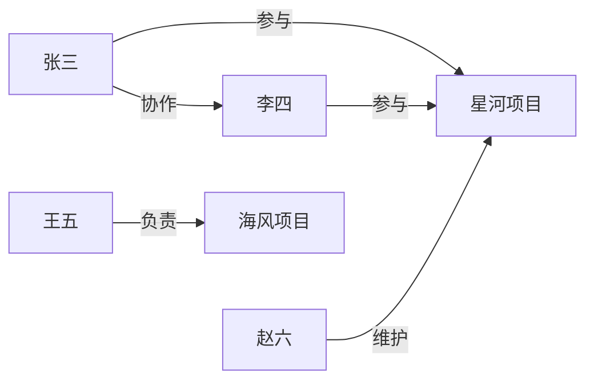
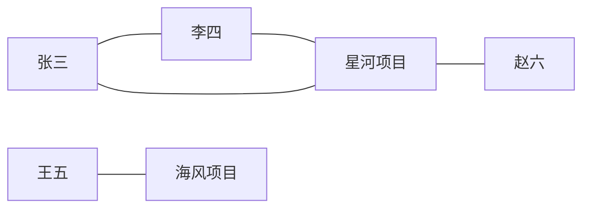

# 从两份项目文档看懂：Cognee 为什么调用 APOC、GDS，换 AGE 要补什么

这篇面向第一次接触图数据库的读者。我们只跟踪一件事：把两份项目文档交给 Cognee，观察文字如何变成节点和关系、重复导入如何处理，以及图统计到底在算什么。

代码基线：Cognee `663a2dc15d04bc0d7ec2733a2dd604b7ed1b8c8e`。**故事和数据为教学示例，调用位置来自真实源码；没有执行 LLM 抽取、Neo4j/GDS 或 AGE 集成测试。**版本和工时详见[兼容矩阵](apache-age-compatibility-matrix.md)。

**一、先把文档摆出来：哪些数据真的交给了数据库？**

假设同一个 dataset、同一个图里导入两份文档：

> 文档 A《星河项目启动纪要》：张三和李四互相协作，共同参与星河项目。
>
> 文档 B《项目交接记录》：张三、李四继续参与星河项目，赵六负责维护。王五负责海风项目。

为了追踪来源分组，假定送到 adapter 的节点还带有同一图内的集合归属：A 的相关节点属于“项目启动”，B 的相关节点属于“运维交接”。这里演示 `belongs_to_set` 的合并，**不是把两个隔离 dataset 强行共享成一个图，也不把集合标签当作访问权限**。集合名使用可读简称。

上游先解析文档、抽取实体和关系，再把结构化节点/边交给存储 task。APOC 收到的是这些已经整理好的数据。假定两份文档里的“张三”被识别为同一个实体，业务 ID 一样；下面 `U_张三` 等是 UUID 的阅读缩写，不是可直接执行的真实 UUID。[实体模型][Entity]、[存储入口][Storage]。

| 实体 | 业务ID缩写 | 在两份文档中出现的情况 |
|---|---|---|
| 张三 | U_张三 | A、B均出现，应当复用同一个节点 |
| 李四 | U_李四 | A、B均出现，应当复用同一个节点 |
| 星河项目 | U_星河 | A、B均出现，应当复用同一个节点 |
| 赵六 | U_赵六 | B新增 |
| 王五 | U_王五 | B新增 |
| 海风项目 | U_海风 | B新增 |

为便于阅读，抽取后的关系采用下列示意名称；实际 LLM 输出不保证使用相同命名：

| 起点 | 关系类型 | 终点 | 业务含义 |
|---|---|---|---|
| 张三 | COLLABORATES_WITH | 李四 | 张三与李四协作 |
| 张三 | PARTICIPATES_IN | 星河项目 | 张三参与星河 |
| 李四 | PARTICIPATES_IN | 星河项目 | 李四参与星河 |
| 赵六 | MAINTAINS | 星河项目 | 赵六维护星河 |
| 王五 | LEADS | 海风项目 | 王五负责海风 |



**图上的圆点/方框是节点，连线是关系。**属性是节点或关系随身携带的数据，例如名字、描述、阶段。真实 Cognee 图还会有文档、文本块、EntityType、NodeSet 等节点；上图只展示六个业务实体。后文统计数字也只针对这张简化教学图，不能当作完整 Cognee 图的实际返回值。

**二、第一种 APOC：`apoc.coll.toSet`——张三出现两次，集合归属怎样保留？**

先导入 A，数据库已经存着：

```text
张三节点：
  id = U_张三
  belongs_to_set = [项目启动]
```

再导入 B，传给 `add_nodes` 的张三节点带着：

```text
本次输入：
  id = U_张三
  belongs_to_set = [运维交接]
```

Cognee 希望更新后的同一个张三节点属于两个集合。如果直接把新列表覆盖进去，就只剩“运维交接”，旧归属丢了。实际 Neo4j adapter 先按 UUID 找到节点，再把旧列表和新列表拼起来，调用 `apoc.coll.toSet` 去重：

| 写入次数 | 数据库旧值 | 本次输入 | 合并去重后的值 |
|---|---|---|---|
| A首次导入 | 空 | `[项目启动]` | `[项目启动]` |
| B随后导入 | `[项目启动]` | `[运维交接]` | `[项目启动, 运维交接]` |
| B重复导入 | `[项目启动, 运维交接]` | `[运维交接]` | `[项目启动, 运维交接]` |

这就是 `coll.toSet` 在本项目里的用途：**维护一个节点的集合归属并集**。按 UUID 找到同一个节点是前面的 MERGE 和业务身份约束负责的；这个函数本身只是对列表去重。[实际写入代码][Nodes]。

**如果换 AGE：**原样执行 `apoc.coll.toSet` 会失败，整个节点写入语句不能完成。替代方案是由 AGE adapter 实现同样的“旧集合＋新集合→去重集合”，并在事务/并发控制下写回。只对本批输入调用一次 Python `set`，既没有合并数据库旧值，也没有解决同时更新覆盖的问题。该工作已含在基础适配 W2/W4。

**三、第二种 APOC：`apoc.create.addLabels`——数据库怎样知道这个节点是实体还是文档？**

Cognee 会存储多种对象。下表中的“标签”是数据库节点的分类，和上面的“集合归属”是两回事：

| 输入对象 | Cognee模型类型 | Neo4j先创建/匹配 | APOC追加标签后 |
|---|---|---|---|
| 张三 | Entity | `__Node__` | `__Node__`＋`Entity` |
| 星河项目 | Entity | `__Node__` | `__Node__`＋`Entity` |
| 文档A | TextDocument | `__Node__` | `__Node__`＋`TextDocument` |

`__Node__` 是这些对象共有的基础标签，便于按统一业务 ID 查找；`Entity`、`TextDocument` 则区分对象类别。adapter 从输入对象的模型类型取得标签名，再调用 `apoc.create.addLabels` 加上它。[标签来源与调用][NodeTypes]。

例如数据库可以按 `Entity` 标签筛选实体，按 `TextDocument` 筛选文档。还要分清：**“张三是人物”并不意味着这里自动追加 `Person` 标签。**当前实体模型可以用 `is_a` 关联一个表示“人物”的 EntityType；模型类别 `Entity`、语义类别“人物”、集合归属“运维交接”是三个不同概念。[Entity.is_a][Entity]、[EntityType模型][EntityType]。

**如果换 AGE：**可以把业务节点统一存入一个 AGE label，并用属性保存 `type` 或所需 `labels` 集合，再由 adapter 把类型筛选转换成属性筛选。需要同时改读和写；只删掉 `addLabels` 会让旧的按标签查询漏数据。Neo4j 原逻辑还会积累标签，若要保留这一行为，单个最新 `type` 属性不够。内置接口映射计入基础适配；用户自己写的 `MATCH (:Entity)` 等原始 Cypher 另行迁移。

**四、第三种 APOC：`apoc.merge.relationship`——同一批里有“参与”“维护”“负责”，边怎样写？**

节点写好后，`add_edges` 接收一批关系。它先按业务 ID 找到两端节点，再把本条输入的关系类型交给 `apoc.merge.relationship`：

```text
输入1：U_张三 --PARTICIPATES_IN--> U_星河，属性 {阶段: 启动}
输入2：U_赵六 --MAINTAINS-------> U_星河，属性 {阶段: 交接}
输入3：U_王五 --LEADS----------> U_海风
```

这个过程的作用是：**按本条输入指定的关系类型，在已经找到的两个端点之间匹配或创建关系。**随后 adapter 用 SET 更新关系属性，所以重复导入也能把“阶段：启动”更新成“阶段：交接”，并保留首次创建时间。[批量边写入代码][Edges]。

| 本次输入 | 原有关系 | 希望得到的结果 |
|---|---|---|
| 张三→星河，参与，阶段=启动 | 无 | 新建一条“参与”关系 |
| 张三→星河，参与，阶段=交接 | 已有同一业务关系 | 更新属性，仍是一条关系 |
| 张三→星河，维护 | 只有“参与”关系 | 新建不同类型的“维护”关系，不能误当成原来的“参与” |

这里说的是 Cognee 要求的结果；并发情况下仍需要业务唯一性和冲突处理。不能因为函数名里有 merge，就省掉这些规则。

**如果换 AGE：**adapter 可以先按关系类型分组，再分别执行固定类型的 MATCH＋MERGE＋SET 模板：一组写参与，一组写维护，一组写负责。节点 ID 和属性作为参数传入，类型名要验证并正确引用。Cognee 的 Neo4j单边方法已经使用普通MERGE而没有APOC，可帮助理解这个过程主要封装了什么。[单边写入][SingleEdge]。

若不替代这个过程，边写入会失败；此前写入的节点和节点向量可能已存在，因此会留下需要回滚/补偿的中间状态。关系越多、类型越多，分组批次和索引查找成本越需要验证。基础改造计入 W2/W3。

到这里，三种 APOC 的分工就能对应到具体数据：**列表归属合并、节点类型标签、动态类型的批量关系写入。**在当前 Neo4j adapter 中，节点批量写入都会经过前两种调用，边批量写入经过第三种；不是只有某种特殊文档才需要它们。

**五、图已经写好，什么场景才会调用 GDS？**

现在用户打开图摘要页面，或者程序请求更完整的图统计。问题变成了：“有多少节点？它们是否连成一片？两个节点平均隔几步？邻居之间紧不紧密？”

当前 Neo4j adapter 用 `get_graph_metrics(include_optional=False)` 返回基础统计；传 `True` 时再计算额外指标。图摘要计数在缓存未命中时也会调用这个方法。**触发 GDS 的是统计调用路径，不是文档里出现了某个特殊词，也不是每次普通问答必跑这些算法。**[统计入口][Metrics]、[摘要计数调用][Counts]。

下面继续使用六个实体的小图。为解释统计，把边的箭头暂时忽略，因为当前 Cognee GDS 投影把关系设置成 `UNDIRECTED`（无向）：



可以直观看出左边四个节点相连，右边两个节点相连，两边没有连线。下面逐个拆开七种 GDS 过程。

**过程1：`gds.graph.list`——有没有上一次计算留下的图副本？**

GDS算法使用一份便于计算的内存图，Cognee把它命名为 `myGraph`。原始知识图在数据库中；`myGraph` 是拿来计算的副本，不是另一个用户dataset。

假设上一次只导入了文档A并做过统计，此时目录可能显示：

```text
已有计算图：[myGraph]
这份旧副本只认识：张三、李四、星河项目
```

`gds.graph.list` 列出的是这样的计算图目录。Cognee据此判断 `myGraph` 是否存在，决定是否先清理。它没有回答“数据库里有几个人”，也没有读取文档内容。[源码][GraphList]。

**AGE如何替代：**若新统计实现直接读取拓扑、在一次任务中计算结果，就不需要实现GDS图目录；管理自己的临时计算状态即可。原方法原样运行则会在这一准备步骤失败。

**过程2：`gds.graph.drop`——把过期计算副本丢掉，准备重算**

文档B已写入数据库，但旧的 `myGraph` 还没包含赵六、王五和海风项目。Cognee统计前会先检查目录，存在旧副本就调用 `gds.graph.drop('myGraph')`。

```text
数据库中的知识：仍然保留
旧的内存计算副本 myGraph：移除
```

**这个drop不是删除张三节点、不是删除文档，也不是forget操作。**目的是让接下来的统计使用新数据。第一次统计没有旧副本时，这个调用可以不发生。[源码][GraphDrop]。

**AGE如何替代：**释放/替换上一轮临时邻接表或计算结果；无需模拟同名GDS过程，更不应错误地去删AGE持久图。

**过程3：`gds.graph.project`——把当前知识图变成算法能计算的连接表**

现在从数据库构建新的计算副本。对教学图，可以把“投影”理解为准备这样的邻接表：

| 节点 | 计算时认为与谁相邻 |
|---|---|
| 张三 | 李四、星河项目 |
| 李四 | 张三、星河项目 |
| 星河项目 | 张三、李四、赵六 |
| 赵六 | 星河项目 |
| 王五 | 海风项目 |
| 海风项目 | 王五 |

存储中的“赵六→维护→星河”在此次无向分析里会被视作两边都可到达。**这只改变计算时怎么看方向，没有改写原始关系的方向。**Cognee实际代码会选取图中的标签和关系类型，并排除 `GraphMetadata` 标记标签。[源码][GraphProject]。

**AGE如何替代：**读取选定节点ID和边端点，构建邻接结构，或者采用能直接遍历拓扑的实现。重点是参与计算的节点、边、方向与原统计合同一致；不是必须再创建一份持久图。这里会产生读取和内存成本。

**过程4：`gds.wcc.stats`——这些知识分成几块互不相连的部分？**

WCC是“弱连通分量”的缩写。对初学者，可以先问：“忽略箭头，只沿连线走，能不能从一个节点走到另一个？”能互相走到的节点归为一组。

教学图中：

```text
组A：张三、李四、星河项目、赵六
组B：王五、海风项目
组数：2
```

`gds.wcc.stats` 给出分量数量，Cognee把它作为 `num_connected_components`。它反映图的连通结构；这不是按文本内容把文档做主题分类，也不直接评价答案是否正确。[源码][WccStats]。

**AGE如何替代：**从未访问节点出发，沿边遍历并标记，走完一组再找下一个未访问节点；或使用并查集。基本遍历成本随节点和边数量增长。需要真正计算，不能把“默认一组”写死。

**过程5：`gds.wcc.stream`——每一块里分别有多少节点？**

上一过程回答“有两组”，这个过程逐节点给出它属于哪个分量。教学输出可以写成：

| 节点 | 分量编号（示意） |
|---|---|
| 张三 | A |
| 李四 | A |
| 星河项目 | A |
| 赵六 | A |
| 王五 | B |
| 海风项目 | B |

分量编号的具体值不重要。Cognee随后按编号分组计数，按大小降序，得到 `sizes_of_connected_components = [4, 2]`。[源码][WccStream]。

有100个分量不一定意味着图同样碎散：“一个大分量＋99个孤立点”和“100个均匀小分量”很不同，大小列表提供了这个区别。

**AGE如何替代：**上一步遍历时顺便统计每组大小；一次计算就能产出“组数”和“大小”，不必为了复制两个GDS名字再遍历两次。当前基础适配W6包含这两项结果。

**过程6：`gds.allShortestPaths.stream`——各对节点之间，最少隔几条边？**

它在 `include_optional=True` 时被调用。对同一张教学图，选几对节点看看：

| 起点→终点 | 最短走法 | 距离 |
|---|---|---:|
| 张三→李四 | 张三—李四 | 1 |
| 张三→星河项目 | 张三—星河项目 | 1 |
| 张三→赵六 | 张三—星河项目—赵六 | 2 |
| 王五→海风项目 | 王五—海风项目 | 1 |
| 张三→王五 | 两组之间没有连线 | 不可达 |

这里的距离是图上的步数，不是文档相似度，也不是现实中的组织层级。Cognee让GDS返回距离，随后在Python中取最大值作为 `diameter`，求平均作为 `avg_shortest_path_length`。[取距离代码][AllPaths]、[聚合代码][Metrics]。

**为什么不能直接说这张全图“直径=2”？**因为还存在张三到王五这样的不可达点对。教学图可达点对中的最大距离确实是2，但它不等于未经定义的全图统计口径。GDS官方示例会过滤非有限距离和自身到自身；当前Cognee这段查询只取distance，没有这些过滤。因此适配时必须确认不可达点、自身距离、计数方向的处理，不能拿手算的可达平均数冒充现有代码结果。[GDS官方例子](https://neo4j.com/docs/graph-data-science/current/algorithms/all-pairs-shortest-path/)。

**AGE如何替代：**需要对所选图计算距离并按约定聚合。AGE1.8的两点最短路函数可解决特定起终点查询，但这里要的是全图许多点对的统计，不是调用一次两点函数就完成。数据量增长后，这项明显比“数节点”昂贵，属于O3选配及单独性能验收。

**过程7：`gds.localClusteringCoefficient.stats`——一个节点的邻居之间，也彼此连接吗？**

继续看同一张图，先看星河项目。它有三个邻居：张三、李四、赵六。

三个邻居之间总共可能有三对连接：

| 邻居对 | 教学图里有没有直接连接？ |
|---|---|
| 张三—李四 | 有 |
| 张三—赵六 | 无 |
| 李四—赵六 | 无 |

因此星河项目的局部聚类系数是 `已有邻居连接数 / 可能连接数 = 1/3`。再看张三：它的两个邻居是李四和星河项目，两者已经相连，所以张三的这个系数是 `1/1 = 1`。

`gds.localClusteringCoefficient.stats` 计算各节点的局部系数，并给出全图平均值；Cognee读取 `averageClusteringCoefficient` 作为 `avg_clustering`。它描述三角形连接的紧密程度，**不是LLM置信度，不是记忆正确率，也没有直接决定某条答案的分数**。[Cognee调用][Clustering]、[GDS定义](https://neo4j.com/docs/graph-data-science/current/algorithms/local-clustering-coefficient/)。

**AGE如何替代：**统计每个节点的邻居之间有多少连接，再按一致口径聚合。不能用节点数、边数直接替代；高连接度节点有很多邻居对要检查。该项只在选配统计开启时需要，属于O3。

**六、为什么实际 Cognee 的统计值，可能和上面手算不同？**

上面只画了六个业务实体。真实图还有结构节点。例如模型可能把两个人都关联到同一个“人物”EntityType：

```text
张三 ──is_a──> 人物类型 <──is_a── 王五
```

这条结构连接就可能把教学图的左右两组连起来。文档、文本块和NodeSet节点也会改变连通关系。**当前 `project_entire_graph` 并没有只挑选上面的六个实体做统计**，所以不能拿 `[4,2]` 当真实默认全图的必然结果。要专门统计业务实体子图，需要明确筛选和投影方案，而不是悄悄改变原接口的统计对象。

本例的组数、组大小、局部聚类系数和指定点对距离经过独立算术核对；这是验证讲解自洽，不是GDS或AGE运行结果。

**七、把十个调用放回用户操作里，AGE适配范围就清楚了**

| 用户操作 | 相关调用 | 不替代的用户后果 | AGE适配范围 |
|---|---|---|---|
| 导入/重复导入文档 | `apoc.coll.toSet` | 节点写入失败；随意删除该调用又可能丢集合归属 | 合并去重及并发状态维护，基础已含 |
| 写实体、文档等不同模型 | `apoc.create.addLabels` | 节点写入失败，或类型筛选漏查 | 类型/标签存储和查询映射，基础已含 |
| 批量写参与、维护等关系 | `apoc.merge.relationship` | 边写入失败，可能已有节点和向量的中间状态 | 按类型批写、身份约束和重试，基础已含 |
| 请求基础图统计 | `gds.graph.list`、`gds.graph.drop`、`gds.graph.project` | 原算法准备流程失败 | 可以采用新计算路径，不必复制GDS目录协议 |
| 请求基础图统计 | `gds.wcc.stats`、`gds.wcc.stream` | 缺少分量数和分量大小 | 连通分量算法，基础W6已含 |
| 请求额外图统计 | `gds.allShortestPaths.stream` | 缺少直径和平均距离 | O3选配，大图性能另验 |
| 请求额外图统计 | `gds.localClusteringCoefficient.stats` | 缺少平均聚类系数 | O3选配，大图性能另验 |

七种GDS过程不是每次都固定执行七次：旧副本存在时才drop，目录检查可能执行多次，最后两种算法仅在 `include_optional=True` 时运行。

基础图摘要还有一个需要知道的用户现象：当前计数代码会捕获metrics错误，返回该dataset节点数0、边数0、`computed_at=None`，不写成功缓存。**因此缺GDS可能表现为“摘要显示0”，而不是整个API报错；数据并未因此被删除。**普通HYBRID/GRAPH_COMPLETION则通过图读接口检索，代码没有把这七种GDS过程放进其普通召回/排序链。[异常处理][Counts]。

当前核验的AGE1.6/1.7/1.8都不附带这些Neo4j插件调用。对Cognee迁移来说，明确要交付的是上述业务结果，而不是十个同名过程。基础32～53人日已包含三种APOC行为和基础统计的替代；完整选配算法、公开Cypher/NL、任意用户插件查询仍按[兼容矩阵的范围](apache-age-compatibility-matrix.md)单独评估。

**源码索引**

文中的示例字段和值用于教学，函数名、控制流和调用位置来自以下固定源码。列表展示顺序、GDS分量编号不作为适配合同。

[Entity]: https://github.com/topoteretes/cognee/blob/663a2dc15d04bc0d7ec2733a2dd604b7ed1b8c8e/cognee/modules/engine/models/Entity.py#L5
[EntityType]: https://github.com/topoteretes/cognee/blob/663a2dc15d04bc0d7ec2733a2dd604b7ed1b8c8e/cognee/modules/engine/models/EntityType.py#L4
[Storage]: https://github.com/topoteretes/cognee/blob/663a2dc15d04bc0d7ec2733a2dd604b7ed1b8c8e/cognee/tasks/storage/add_data_points.py#L250
[Nodes]: https://github.com/topoteretes/cognee/blob/663a2dc15d04bc0d7ec2733a2dd604b7ed1b8c8e/cognee/infrastructure/databases/graph/neo4j_driver/adapter.py#L382
[NodeTypes]: https://github.com/topoteretes/cognee/blob/663a2dc15d04bc0d7ec2733a2dd604b7ed1b8c8e/cognee/infrastructure/databases/graph/neo4j_driver/adapter.py#L412
[Edges]: https://github.com/topoteretes/cognee/blob/663a2dc15d04bc0d7ec2733a2dd604b7ed1b8c8e/cognee/infrastructure/databases/graph/neo4j_driver/adapter.py#L1238
[SingleEdge]: https://github.com/topoteretes/cognee/blob/663a2dc15d04bc0d7ec2733a2dd604b7ed1b8c8e/cognee/infrastructure/databases/graph/neo4j_driver/adapter.py#L1153
[Metrics]: https://github.com/topoteretes/cognee/blob/663a2dc15d04bc0d7ec2733a2dd604b7ed1b8c8e/cognee/infrastructure/databases/graph/neo4j_driver/adapter.py#L2333
[Counts]: https://github.com/topoteretes/cognee/blob/663a2dc15d04bc0d7ec2733a2dd604b7ed1b8c8e/cognee/modules/data/methods/get_datasets_graph_counts.py#L83
[GraphList]: https://github.com/topoteretes/cognee/blob/663a2dc15d04bc0d7ec2733a2dd604b7ed1b8c8e/cognee/infrastructure/databases/graph/neo4j_driver/adapter.py#L2228
[GraphDrop]: https://github.com/topoteretes/cognee/blob/663a2dc15d04bc0d7ec2733a2dd604b7ed1b8c8e/cognee/infrastructure/databases/graph/neo4j_driver/adapter.py#L2311
[GraphProject]: https://github.com/topoteretes/cognee/blob/663a2dc15d04bc0d7ec2733a2dd604b7ed1b8c8e/cognee/infrastructure/databases/graph/neo4j_driver/adapter.py#L2283
[WccStats]: https://github.com/topoteretes/cognee/blob/663a2dc15d04bc0d7ec2733a2dd604b7ed1b8c8e/cognee/infrastructure/databases/graph/neo4j_driver/neo4j_metrics_utils.py#L61
[WccStream]: https://github.com/topoteretes/cognee/blob/663a2dc15d04bc0d7ec2733a2dd604b7ed1b8c8e/cognee/infrastructure/databases/graph/neo4j_driver/neo4j_metrics_utils.py#L93
[AllPaths]: https://github.com/topoteretes/cognee/blob/663a2dc15d04bc0d7ec2733a2dd604b7ed1b8c8e/cognee/infrastructure/databases/graph/neo4j_driver/neo4j_metrics_utils.py#L153
[Clustering]: https://github.com/topoteretes/cognee/blob/663a2dc15d04bc0d7ec2733a2dd604b7ed1b8c8e/cognee/infrastructure/databases/graph/neo4j_driver/neo4j_metrics_utils.py#L185
