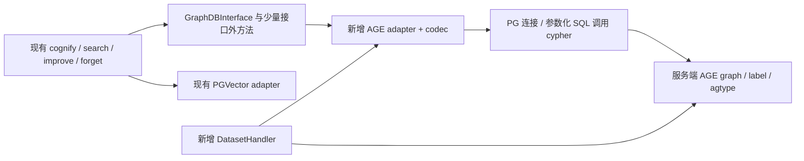

# Cognee × Apache AGE：版本缺口、PG 与华为云条件、逐项改造和工作量

核验日期：2026-09-28。Cognee 固定提交 `663a2dc15d04bc0d7ec2733a2dd604b7ed1b8c8e`。本文替代上一份可行性报告中的笼统兼容判断；[此前执行机制分析](apache-age-feasibility-analysis.md)保留作性能背景。

**先回答“哪个 AGE 版本完全支持 Cognee”：本轮核验的版本中，没有一个能据现有代码宣布完全支持。**当前 Cognee 没有 AGE adapter；AGE 1.8 也不提供 Neo4j 的 APOC/GDS 兼容库。可以确认的是：1.6、1.7、1.8 已有不同程度的数据库基础能力，可以据此开发适配器。是否完成 Cognee 兼容，要按下面逐项业务合同验收，不能由“AGE 支持 Cypher”推出。[Cognee 工厂][C1]、[公共接口][C2]、[官方图后端文档](https://docs.cognee.ai/setup-configuration/graph-stores)。

本文的“源码支持”指解析器/执行器/安装声明以及已有回归用例提供证据；**没有编译 AGE、运行这些回归、实现 adapter 或连接华为云实例**。`regress/expected` 是上游预期文件，不是本次测试通过记录。改造方案与工时明确标为待实现设计和工程估算。

**1. AGE 对应哪些 PG 版本，华为云有没有这些 PG 版本？**

必须选择对应 PG 主版本的 AGE 发布包。下表覆盖本轮核验的 1.6～1.8 正式发布组合；不代表 AGE 的全部历史版本，也不声称其他组合绝对不能自行移植。

| AGE 版本 | 已核实正式发布的 PG 组合 | 华为云 RDS 是否提供这些 PG 主版本 | 华为云标准 RDS 是否公开列出 AGE 插件 | 当前是否可直接切换 Cognee |
|---|---|---|---|---|
| **1.6.0** | **PG14、PG15、PG16、PG17**，各用对应包 | 是 | **未列出** | 否，需要新 adapter |
| **1.7.0** | **PG17、PG18**，各用对应包 | 是 | **未列出** | 否，需要新 adapter |
| **1.8.0** | **PG18**，本轮正式基线 | 是 | **未列出** | 否，需要新 adapter |
| 1.8.0 / PG15 候选 | GitHub 条目仍为 prerelease，说明待 PMC 批准 | PG15 本身有 | 未列出 | 不作为正式交付基线 |

正式发布身份交叉核对 [Apache 分发目录](https://dist.apache.org/repos/dist/release/age/)、[PG17 的 1.6 发布](https://github.com/apache/age/releases/tag/PG17%2Fv1.6.0-rc0)、[PG18 的 1.7 发布](https://github.com/apache/age/releases/tag/PG18%2Fv1.7.0-rc0)、[PG18 的 1.8 发布](https://github.com/apache/age/releases/tag/PG18%2Fv1.8.0-rc0)和[PG15 候选](https://github.com/apache/age/releases/tag/PG15%2Fv1.8.0-rc0)。当日元数据见[发布证据快照](evidence/age-version-evidence-20260928.json)。部分正式 tag 仍带 `rc0`，不能只看名字判断候选身份；也不能把当前下载目录中的最新版误当作唯一支持组合。

华为云[引擎版本表](https://support.huaweicloud.com/productdesc-rds-pg/zh-cn_topic_0043898356.html)已经列出 PG14～18；[插件清单](https://support.huaweicloud.com/intl/zh-cn/usermanual-rds-pg/rds_09_0045.html)列有向量插件，但没有 AGE。因而当前公开条件下，**障碍是服务端扩展可安装性，不是缺少 PG18**。具体地域、小版本和实例以实际可用性为准。云服务可安装性只能引用厂商资料及实例查询，不能假装能从 AGE 开源代码证明华为云内部配置。

AGE 的 Makefile 使用 `PG_CONFIG`/PGXS 编译服务端 C 扩展；不是客户端协议转换库。所审代码没有“一律拒绝其他 PG major”的 guard，所以不能虚构这种源码证据；同样，缺少 guard 也不证明一个源码包/二进制跨 major 可用。[1.6 构建入口][A16M]、[1.7 构建入口][A17M]、[1.8 构建入口][A18M]。

| 部署选择 | 可成立的条件 | 结论 |
|---|---|---|
| 直接在现有华为云 RDS 安装 AGE | 实例服务端确实提供 AGE，且允许安装/加载 | 公共插件清单没有给出此条件，不能承诺可行 |
| RDS 保存关系/向量，另用自管 PG＋AGE 保存图 | 能部署并维护另一个 PG 图服务；Cognee 分别配置图与向量 adapter | 架构上有现成后端分离接点；仍需开发 AGE adapter |
| 华为云 ECS/容器中自管 PG＋AGE＋pgvector | 有服务端安装权限并完成部署、备份和目标组合验证 | 可进入适配 PoC；不等同托管 RDS 已支持 AGE |

实例只读核验可查询 `pg_available_extensions` 中是否存在 `name='age'`，以及 `pg_extension` 的已安装版本。客户端能连 PG、能调用 pgvector，均不能弥补服务端缺少 AGE 扩展。

**2. 各 AGE 版本究竟缺什么？**

下面区分“数据库本身缺少功能”和“Cognee 尚未适配”。表中“有”只限所列语法和能力，绝不表示整个 Neo4j Cypher 方言等价。

| 数据库能力 | 1.6 / PG14～16 | 1.6 / PG17 | 1.7 / PG17、18 | 1.8 / PG18 | 对 Cognee 的实际影响 |
|---|---|---|---|---|---|
| 节点/边 CREATE、MATCH、普通 MERGE | 有 | 有 | 有 | 有 | 存实体/关系和幂等写入的基础；业务唯一性仍要设计 |
| UNWIND 批量输入 | 有 | 有 | 有 | 有 | 能实现批量节点/边接口；不等于已有 Cognee 批处理代码 |
| SET、SET += map、REMOVE、DETACH DELETE | 有 | 有 | 有 | 有 | 可作为局部更新、删除的底层操作 |
| 属性 map/list、IN、coalesce、列表推导 | 有 | 有 | 有 | 有 | 能表达来源列表、标签集合等操作；并发一致性另验 |
| SQL PREPARE＋Cypher 参数 map | 有 | 有 | 有 | 有 | 参数化通道存在；不是 Neo4j Bolt 参数协议 |
| 固定跳 MATCH、有界变长路径 VLE | 有 | 有 | 有 | 有 | 普通邻域与多跳并不要求必须 1.8 |
| **MERGE ON CREATE SET / ON MATCH SET** | **缺语法** | **缺语法** | **缺语法** | **有** | 旧版需要显式区分新建/更新及事务策略；不能原样执行新语法 |
| **无 RETURN 子查询 UNION** | **明确报未实现** | **有解析实现** | 有解析实现 | 有解析实现 | 同为 1.6 也有分支差异；基本 Cognee 固定模板不必依赖此项 |
| **内置 age_shortest_path / age_all_shortest_paths** | **未提供** | **未提供** | **未提供** | **有，标准路线为无权最短路** | 旧版缺专用 API，但不等于不能自行计算最短路；普通邻域不需要它 |
| **Cypher RETURN shortest_path(a,b)** | **未提供该内置入口** | 同左 | 同左 | **有** | 1.8 不仅能从外层 SQL 调最短路，也有 AGE Cypher 函数入口 |
| **Neo4j shortestPath((a)-[*]->(b)) 原语法** | 不提供相应模式产生式/内置兼容 | 同左 | 同左 | **仍不等价支持** | 必须改写 Neo4j 查询/prompt，不能仅替换连接串 |
| **APOC / GDS 原有过程库** | **不提供** | **不提供** | **不提供** | **不提供** | 重写 Cognee 所用功能，或限制公开查询范围；CALL 语法不等于过程库存在 |
| 普通 Cypher RLS 检查 | 缺少本轮确认的新版显式 INSERT RLS 检查路径 | 同左 | 已有 policy/WITH CHECK 及角色测试 | 已有对应实现/测试 | 1.6 不能按 PG 原生能力推定安全；1.7/1.8 全 VLE/cache 路径仍未完成本轮安全证明 |

上述表覆盖本任务所需能力与相关方言缺口，不是全部 openCypher conformance 清单。[1.6 四个分支逐项源码证据](evidence/age16-source-matrix.md)、[1.7/1.8 及 PG18 分支证据](evidence/age17-age18-source-matrix.md)保存了读取范围、expected 对照和未验证边界。

几个关键差异可直接定位，而非只引用发行说明：

- **MERGE 分支语法**：1.6 [产生式][A16G]与 1.7 [产生式][A17G]仅为 `MERGE path`；1.8 [产生式][A18G]增加 `merge_actions_opt`，有 ON MATCH / ON CREATE 分支及执行器处理。
- **1.6 分支差异**：PG16 [对应产生式明确报错][A16U]；PG17 [对应产生式构造 returnless union][A16P17U]。所以不能用同一个版本号代替分支代码检查。
- **最短路**：1.8 [安装声明][A18S]和 [Cypher 回归][A18SC]证明两个入口；其下划线函数名与 Neo4j 的模式包装语法不同。旧版安装 SQL 清单没有这两个新内置函数。
- **属性补丁不是业务状态保护**：1.6 [SET += 回归][A16SET]已经展示“保留 city、修改 name、删除值为 NULL 的 role”。因此收到 `feedback_weight=0.5` 或 `valid_to=null` 仍会覆盖/移除旧状态，必须在 adapter 规定字段所有权。
- **RLS 有边界**：1.7 [插入执行检查][A17R]、[角色回归][A17RT]是正向依据；[CSV 导入路径][A17CSV]却明确拒绝启用 RLS 的目标。不能简写成“全部 AGE 读写路径已经安全支持 RLS”。

索引和性能另作区分：1.6 已有属性索引能力；1.7 [创建 label 时][A17IDX]已有节点 ID 主键及边端点索引；1.8 的特定 index scan、邻接布局与缓存改进是执行优化，不能把旧版写成“没有索引/不能多跳”。**AGE 仍在 PG 中存图，固定跳 MATCH 仍会形成 JOIN；采用 AGE 不保证消除联表成本。**1.8 VLE 还有整图冷加载和进程缓存成本，须用等价邻域查询验证，详见[执行机制分析](apache-age-feasibility-analysis.md)。

**版本选择结论：**若可自管 PG 且新建方案，优先把 **PG18＋AGE1.8.0** 作为验证基线，因为它减少条件 upsert 和特定路径算法的补写量；若限制 PG17，可评估 **AGE1.7.0**。1.6 并非不能实现基础 Cognee 图操作，但需要处理更多语法/权限边界。此建议不等于宣布 1.8 已完整兼容或性能已达标。

**3. 具体适配在哪里，哪些功能可以复用？**

Cognee 的实际调用是“业务 task/retriever → GraphDBInterface → 后端 adapter”。因此替换的是 adapter 实现及后端生命周期，不是把 Neo4j 语句逐字转发给 AGE。接口共有 **47 个方法：21 个 abstract，26 个非 abstract/default**；非 abstract 里既有可用 fallback，也有直接抛异常的能力占位。另有时间检索等接口外调用。完整逐方法清单与调用位置见[代码工作清单](evidence/cognee-age-work-breakdown.md)。

拟新增文件均位于 `cognee/infrastructure/databases/graph/age/`：`adapter.py`、`codec.py`、`schema.py`、`AGEDatasetDatabaseHandler.py`。这些是建议职责划分，当前仓库没有这些实现。

| Cognee 功能及现有源码接点 | AGE 适配的具体工作 | 可以复用的代码 | 完成判据 |
|---|---|---|---|
| **provider 接入**：[get_graph_engine][C1]、`use_graph_adapter.py` | 注册 `age` adapter；承接工厂参数 `database_name`，区分 PG 数据库名和 AGE graph 名；初始化连接、加载环境、关闭/重连 | 现有 adapter 注册机制 | 通过 Cognee 工厂创建实例并正确释放；不是只有独立脚本能连 AGE |
| **数据模型与 CRUD**：[add_data_points][C3]、接口 add/get/delete nodes、add/get/has edges | 新 `adapter.py/codec.py`；UUID 存业务属性，保留 AGE 内部 graphid；边保留业务三元组和 `edge_object_id`；批量 MERGE、缺失端点、返回 tuple/dict、agtype 解码 | 模型抽取、`get_graph_from_model`、边准备、向量索引逻辑 | 重复和并发写不重复；返回 UUID 能与向量命中对应；节点/边格式相同 |
| **schema、索引、租户隔离**：[handler 接口][C4]、支持后端注册 | 新 `schema.py/AGEDatasetDatabaseHandler.py`；graph 创建/解析/删除、业务 ID 索引、权限、schema 版本管理 | 现有 dataset 上下文及注册钩子 | 默认 access control 下 graph/vector 均有 handler；不同 owner/dataset 不串图；删除及连接缓存一致 |
| **来源与安全删除**：[公共接口来源方法][C2]、[删除规划][C5]、rollback | 实现 15 个 provenance/metadata 方法；维护 `source_ref_keys/source_dataset_ids/source_run_ids/source_run_refs`；图对象与来源同事务更新 | 已有来源状态转换、共享删除规划和 rollback 调度 | 删除一个来源不误删仍被其他来源引用的节点/边；run 回滚只移除本 run 归属 |
| **增量更新**：[incremental][C6]、接口 `update_chunk_index/remove_belongs_to_set_tags` | 窄字段更新与 NodeSet 移除；保证来源/边/标签同步，能力验收后才打开 flag | chunk 差异计算与更新调度 | retained chunk 仅改位置；移除集合不误删其他集合数据 |
| **feedback 学习**：[apply_feedback_weights][C7]、[能力探测][C8] | 实现节点/边 get/set 共4方法；按 `edge_object_id` 更新边；保护重建时的学习值；明确并发读算写策略 | 现有反馈计算公式与 improve 调度 | getter 只返回存在对象；缺省0.5；setter逐ID成功标志；不会假支持后吞错误 |
| **truth 学习**：[truth 构建][C9]、接口 get/set truth | 2个方法，alignment列表和epoch联合持久化；内容变化的失效与重建策略 | 现有 truth 计算、epoch 发布和检索门禁 | 节点坐标与epoch一致；失败/旧epoch不会被当成新状态 |
| **局部更新与事实有效期**：[close_node][C10]、user_preferences/store | 实现 `update_node`，明确缺失字段、显式null、整模型重写的区别 | 上层事实关闭/偏好操作 | 不存在返回False；未指定字段保留；valid_to不被后续普通入图擦除 |
| **图检索、可视化和 triplet**：[CogneeGraph][C11]、HYBRID/entities、memify triplet task | 实现6个抽象图读方法、`get_triplets_batch`；建议补 `get_id_filtered_graph_data` 和 top-degree，避免默认全图读取 | 现有向量召回、图排序、LLM回答、导出流程 | seed/跳数/方向/诱导边/NodeSet筛选与现有合同一致；分页不漏不重 |
| **基础图统计**：[dataset counts][C12]、[PG demo metrics][C13] | 实现 `get_graph_metrics`，包含节点/边计数、均度、密度、连通分量及约定返回键 | 可参考已有 Python 连通分量实现；算法本身不要求GDS | 基础统计准确，未计算的选配指标按明确约定返回；不把未算值伪造为0 |
| **TEMPORAL 检索**：[temporal_retriever][C14] | 额外实现 `collect_time_ids/collect_events`，它们不在47方法里；沿用UTC毫秒时间边界和Timestamp→Event邻域语义 | 时间抽取、向量部分和调用流程 | 按当前范围/1～2跳事件关联返回正确结果，不偷换成另一套区间算法 |
| **公开 Cypher / 自然语言图查询**：[NL retriever][C15]、[Neo4j prompt][C16] | 另做AGE query返回协议、方言prompt、真实schema注入及能力门禁；初期明确关闭 | API入口及部分生成/重试流程 | 不生成APOC/GDS或Neo4j shortestPath；明确支持的AGE语法与错误 |

这里“可以替换”的源码依据，是上层依赖这些接口的**输入、输出和状态语义**，而非必须调用某个图厂商过程。例如 Neo4j 节点写入用了 `apoc.coll.toSet`/`apoc.create.addLabels`，边写入用了 `apoc.merge.relationship`；AGE 可按集合合并、类型映射、关系分组写入分别重新实现。这个设计有明确需求依据，但不是已验证的 SQL 成品。[Neo4j 节点实现][C17]、[边实现][C18]。

有四处尤其不能漏估：

1. **统计必须做，GDS 协议不必照搬。**Neo4j 的 `get_graph_metrics(False)` 仍会投影 GDS 图并计算 WCC；不能称它全是可选功能。但 PG demo 已经通过自身 Python 算法返回基础统计，证明 Cognee 依赖统计结果，并非依赖 `gds.*` 的过程协议。[Neo4j metrics][C19]、[PG metrics][C13]。大图计算成本仍需单独验收。
2. **upsert 不能只写 `SET +=`。**重新 cognify 的输入带模型默认值，可能重置 feedback、truth、valid_to；单纯合并又可能留下应删除的业务属性。需定义业务字段、学习状态、来源归属的所有权，显式区分“未传”和“重置”。AGE1.8 的 MERGE actions 只能帮助分流，不能自动规定这些规则。
3. **多跳返回值不等于返回路径列表。**Cognee 邻域先形成节点集合，再取相关诱导边；直接拿 AGE VLE 返回的路径边不一定等价。要验证孤立 seed、重复路径、方向和边类型过滤边界，不能认为一条 `MATCH ...[*]` 就已完成适配。
4. **同一个 PG 不自动获得跨 adapter 原子事务。**当前存储任务分别调用 graph 和 vector 写入；仍需重试、补偿和失败恢复。AGE＋PGVector 共用服务器不改变这条代码事实。[写入次序][C3]。

**此前“improve 部分支持”具体是哪些部分？**应明确拆开：通用图读取/三元组索引是一组；反馈权重4接口是一组；truth状态2接口是一组；事实关闭依赖的 `update_node` 又是一项。现有公共接口对后几组有 `NotImplementedError` 占位；feedback/truth 由 improve 检查 override/flag，`update_node` 则需单独验证调用路径和不支持时的行为。新 AGE adapter 必须真实实现并测试，不能把“AGE能存属性”写成“improve已支持”。[接口757行起][C20]、[能力探测][C8]。本报告的完整业务工作量包含这几组，公开 NL/Cypher 单列。

**4. 工作量是多少，范围如何计算？**

**源码能证明要改什么，不能证明实现一定花几天。**以下是基于上表实际方法、状态合同及失败场景的工程估算，假设熟悉 Python/Cognee/PG、固定 **PG18＋AGE1.8**、已有可安装扩展的测试环境；不包含修改 AGE 内核。每个工作包含自身契约测试及评审，最后一包只计跨模块集成，避免重复计费。

| 工作包 | 文件/职责边界 | 人日 | 交付证据 |
|---|---|---:|---|
| W1 目标组合 PoC | 验证参数、agtype、UUID、MERGE、邻域、并发写与代表负载 | 3～5 | 可复现脚本/失败边界；PoC不能代替正式adapter |
| W2 连接、codec、CRUD与业务身份 | 新 age/adapter.py、codec.py；节点/边和批量写 | 6～10 | CRUD/参数/解码/重复与异常契约测试 |
| W3 schema、索引、handler与隔离 | 新 schema.py、AGEDatasetDatabaseHandler.py及注册/配置 | 4～7 | 创建/解析/删除、多dataset与连接生命周期测试 |
| W4 provenance、rollback、增量 | 15个来源/metadata方法＋detag/chunk patch；必要的状态契约调整 | 6～10 | 多来源删除、run回滚、增量和失败恢复 |
| W5 feedback、truth、update_node、Temporal | 7个状态接口＋2个接口外时间方法；必要的并发/字段契约调整 | 5～8 | 学习状态保留、epoch、事实关闭、时间检索等价 |
| W6 图读取、视图、基础metrics、triplet分页 | 6个抽象图读、ID筛选优化、分页、基础连通分量 | 3～5 | 与参考后端同数据结果对照、边界与分页验收 |
| W7 端到端、故障注入、代表性性能和文档 | cognify/search/forget/update/improve闭环 | 5～8 | 端到端结果、冷热/重连/并发基准、错误恢复记录 |
| **合计** | **以上明确列出的业务范围** | **32～53** | **不等于任意Cognee扩展或Neo4j生态兼容** |

两位合适工程师协作，按依赖和联调余量排期约 **4～7周**，这是计划估计，不是实测工期。只计人日更稳妥，不能把各包简单完全并行。

| 另选范围 | 追加估算 | 为什么未含在32～53人日 |
|---|---:|---|
| O1 受限公开 AGE raw Cypher | 3～5人日 | 内部固定模板之外的返回列、参数、权限、取消、错误协议 |
| O2 AGE自然语言图查询 | 4～7人日 | 新prompt/schema注入和生成查询回归；依赖O1或同等公开query通道 |
| O3 全部昂贵统计 | 2～5人日 | 有界数据的diameter/平均最短路/clustering等；大图优化另估 |
| 旧图迁移、无来源legacy删除 | 待迁移数据盘点 | 需来源补齐、旧模型转换及一致性校验，不能只估新增两个方法 |
| 用户自定义Task、任意Neo4j/APOC/GDS语句 | 待查询清单 | 有些完全复用接口，有些要算法重写；不存在可信统一上限 |
| 多AGE/PG版本维护、生产HA/备份恢复、云扩展开放 | 另评估 | 当前只为一个固定运行组合估价，研究7棵源码树不等于交付7组合适配 |

若加 O1＋O2＋O3，明确范围合计 **41～70人日**，仍不包含未知历史数据、自定义过程和生产运维。此前 **28～47人日**未单独展开图读/metrics/分页及接口外调用，现以 **32～53人日**的明细范围取代，不能并列成同口径报价。

要声称交付范围“支持”，至少需要：47方法逐项标注实现/明确不支持；内置所选业务全链路通过；缺省capability不误开；不同dataset隔离通过；并发upsert与来源删除正确；feedback/truth重建不丢；用同数据与参考后端比较邻域结果；对目标规模记录冷热P95、内存、写入和并发结果。当前没有这些运行证据，所以本报告结论停留在**有源码依据的适配可行性与工作范围**。

**固定源码基线与复核材料**

| 源码组合 | 固定提交 |
|---|---|
| Cognee | `663a2dc15d04bc0d7ec2733a2dd604b7ed1b8c8e` |
| AGE1.6 / PG14 | `41c08296a4b692adf31ed9507a9a25dad6f9f67f` |
| AGE1.6 / PG15 | `fa1af8de99d74d32e131c19b62cf580d396eb0ae` |
| AGE1.6 / PG16 | `2db2f060c4c9265a14d40f007eb8c56febf31e4c` |
| AGE1.6 / PG17 | `54905a09bf8462f22a87c3adfd2ab5752e5c1e71` |
| AGE1.7 / PG17 | `e1467f12e0b1d15dd35d3ab93f057a7112d425b8` |
| AGE1.7 / PG18 | `806fa2ebdb300b3e76ef30cdba61803babbf2683` |
| AGE1.8 / PG18 | `e43dc1a12b78fba4acef9835b2b10379b8d243b4` |

1.6 的 PG14～16 进行了指定 grammar 与回归文件比较，PG17补查实际差异；1.7 PG17/PG18 比对了 SQL、parser 与 PG API 适配差异。未以版本号推定全部代码相同。详细证据保存在 [1.6矩阵](evidence/age16-source-matrix.md)、[1.7/1.8矩阵](evidence/age17-age18-source-matrix.md)、[Cognee接口与工作包](evidence/cognee-age-work-breakdown.md)。

[C1]: https://github.com/topoteretes/cognee/blob/663a2dc15d04bc0d7ec2733a2dd604b7ed1b8c8e/cognee/infrastructure/databases/graph/get_graph_engine.py#L344
[C2]: https://github.com/topoteretes/cognee/blob/663a2dc15d04bc0d7ec2733a2dd604b7ed1b8c8e/cognee/infrastructure/databases/graph/graph_db_interface.py#L58
[C3]: https://github.com/topoteretes/cognee/blob/663a2dc15d04bc0d7ec2733a2dd604b7ed1b8c8e/cognee/tasks/storage/add_data_points.py#L250
[C4]: https://github.com/topoteretes/cognee/blob/663a2dc15d04bc0d7ec2733a2dd604b7ed1b8c8e/cognee/infrastructure/databases/dataset_database_handler/dataset_database_handler_interface.py#L11
[C5]: https://github.com/topoteretes/cognee/blob/663a2dc15d04bc0d7ec2733a2dd604b7ed1b8c8e/cognee/infrastructure/databases/unified/provenance_delete_planner.py
[C6]: https://github.com/topoteretes/cognee/blob/663a2dc15d04bc0d7ec2733a2dd604b7ed1b8c8e/cognee/api/v1/update/incremental.py#L187
[C7]: https://github.com/topoteretes/cognee/blob/663a2dc15d04bc0d7ec2733a2dd604b7ed1b8c8e/cognee/tasks/memify/apply_feedback_weights.py#L268
[C8]: https://github.com/topoteretes/cognee/blob/663a2dc15d04bc0d7ec2733a2dd604b7ed1b8c8e/cognee/modules/improve/capabilities.py#L23
[C9]: https://github.com/topoteretes/cognee/blob/663a2dc15d04bc0d7ec2733a2dd604b7ed1b8c8e/cognee/modules/truth_subspace/build.py#L409
[C10]: https://github.com/topoteretes/cognee/blob/663a2dc15d04bc0d7ec2733a2dd604b7ed1b8c8e/cognee/tasks/storage/close_node.py#L37
[C11]: https://github.com/topoteretes/cognee/blob/663a2dc15d04bc0d7ec2733a2dd604b7ed1b8c8e/cognee/modules/graph/cognee_graph/CogneeGraph.py#L124
[C12]: https://github.com/topoteretes/cognee/blob/663a2dc15d04bc0d7ec2733a2dd604b7ed1b8c8e/cognee/modules/data/methods/get_datasets_graph_counts.py#L86
[C13]: https://github.com/topoteretes/cognee/blob/663a2dc15d04bc0d7ec2733a2dd604b7ed1b8c8e/cognee/infrastructure/databases/graph/postgres_demo/adapter.py#L879
[C14]: https://github.com/topoteretes/cognee/blob/663a2dc15d04bc0d7ec2733a2dd604b7ed1b8c8e/cognee/modules/retrieval/temporal_retriever.py#L131
[C15]: https://github.com/topoteretes/cognee/blob/663a2dc15d04bc0d7ec2733a2dd604b7ed1b8c8e/cognee/modules/retrieval/natural_language_retriever.py#L84
[C16]: https://github.com/topoteretes/cognee/blob/663a2dc15d04bc0d7ec2733a2dd604b7ed1b8c8e/cognee/infrastructure/llm/prompts/natural_language_retriever_system.txt#L1
[C17]: https://github.com/topoteretes/cognee/blob/663a2dc15d04bc0d7ec2733a2dd604b7ed1b8c8e/cognee/infrastructure/databases/graph/neo4j_driver/adapter.py#L382
[C18]: https://github.com/topoteretes/cognee/blob/663a2dc15d04bc0d7ec2733a2dd604b7ed1b8c8e/cognee/infrastructure/databases/graph/neo4j_driver/adapter.py#L1238
[C19]: https://github.com/topoteretes/cognee/blob/663a2dc15d04bc0d7ec2733a2dd604b7ed1b8c8e/cognee/infrastructure/databases/graph/neo4j_driver/adapter.py#L2333
[C20]: https://github.com/topoteretes/cognee/blob/663a2dc15d04bc0d7ec2733a2dd604b7ed1b8c8e/cognee/infrastructure/databases/graph/graph_db_interface.py#L757
[A16M]: https://github.com/apache/age/blob/2db2f060c4c9265a14d40f007eb8c56febf31e4c/Makefile#L137
[A17M]: https://github.com/apache/age/blob/e1467f12e0b1d15dd35d3ab93f057a7112d425b8/Makefile#L138
[A18M]: https://github.com/apache/age/blob/e43dc1a12b78fba4acef9835b2b10379b8d243b4/Makefile#L276
[A16G]: https://github.com/apache/age/blob/2db2f060c4c9265a14d40f007eb8c56febf31e4c/src/backend/parser/cypher_gram.y#L1229
[A17G]: https://github.com/apache/age/blob/e1467f12e0b1d15dd35d3ab93f057a7112d425b8/src/backend/parser/cypher_gram.y#L1133
[A18G]: https://github.com/apache/age/blob/e43dc1a12b78fba4acef9835b2b10379b8d243b4/src/backend/parser/cypher_gram.y#L1191
[A16U]: https://github.com/apache/age/blob/2db2f060c4c9265a14d40f007eb8c56febf31e4c/src/backend/parser/cypher_gram.y#L652
[A16P17U]: https://github.com/apache/age/blob/54905a09bf8462f22a87c3adfd2ab5752e5c1e71/src/backend/parser/cypher_gram.y#L638
[A18S]: https://github.com/apache/age/blob/e43dc1a12b78fba4acef9835b2b10379b8d243b4/sql/agtype_typecast.sql#L101
[A18SC]: https://github.com/apache/age/blob/e43dc1a12b78fba4acef9835b2b10379b8d243b4/regress/sql/age_shortest_path.sql#L440
[A16SET]: https://github.com/apache/age/blob/2db2f060c4c9265a14d40f007eb8c56febf31e4c/regress/expected/cypher_set.out#L854
[A17R]: https://github.com/apache/age/blob/e1467f12e0b1d15dd35d3ab93f057a7112d425b8/src/backend/executor/cypher_utils.c#L280
[A17RT]: https://github.com/apache/age/blob/e1467f12e0b1d15dd35d3ab93f057a7112d425b8/regress/sql/security.sql#L666
[A17CSV]: https://github.com/apache/age/blob/e1467f12e0b1d15dd35d3ab93f057a7112d425b8/src/backend/utils/load/age_load.c#L178
[A17IDX]: https://github.com/apache/age/blob/e1467f12e0b1d15dd35d3ab93f057a7112d425b8/src/backend/commands/label_commands.c#L425
