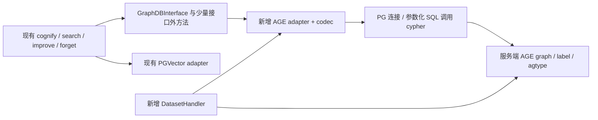
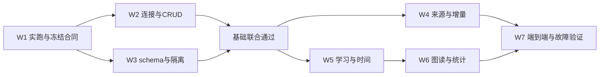

# Cognee × Apache AGE：版本缺口、PG 与华为云条件、逐项改造和工作量

初次接触图数据库，先读[两份项目文档的逐步拆解：3种APOC、7种GDS各处理什么数据](apache-age-apoc-gds-walkthrough.md)。它用同一张图说明输入、结果、失败影响和AGE替代，再回到本文核对版本和工作量。

核验日期：2026-09-28。Cognee 固定提交 `663a2dc15d04bc0d7ec2733a2dd604b7ed1b8c8e`。本文替代上一份可行性报告中的笼统兼容判断；[此前执行机制分析](apache-age-feasibility-analysis.md)保留作性能背景。

**先回答“哪个 AGE 版本完全支持 Cognee”：本轮核验的版本中，没有一个能据现有代码宣布完全支持。**当前 Cognee 没有 AGE adapter；AGE 1.8 也不提供 Neo4j 的 APOC/GDS 兼容库。可以确认的是：1.6、1.7、1.8 已有不同程度的数据库基础能力，可以据此开发适配器。是否完成 Cognee 兼容，要按下面逐项业务合同验收，不能由“AGE 支持 Cypher”推出。[Cognee 工厂][C1]、[公共接口][C2]、[官方图后端文档](https://docs.cognee.ai/setup-configuration/graph-stores)。

本文的“源码支持”指解析器/执行器/安装声明以及已有回归用例提供证据；**没有编译 AGE、运行这些回归、实现 adapter 或连接华为云实例**。`regress/expected` 是上游预期文件，不是本次测试通过记录。改造方案与工时明确标为待实现设计和工程估算。

**1. AGE 对应哪些 PG 版本，华为云有没有这些 PG 版本？**

必须选择对应 PG 主版本的 AGE 发布包。下表覆盖本轮核验的 1.6～1.8 正式发布组合；不代表 AGE 的全部历史版本，也不声称其他组合绝对不能自行移植。

| AGE 版本 | 已核实正式发布的 PG 组合 | 华为云 RDS 是否提供这些 PG 主版本 | 华为云标准 RDS 是否公开列出 AGE 插件 | 当前是否可直接切换 Cognee |
|---|---|---|---|---|
| **1.6.0** | **PG14、PG15、PG16、PG17**，各用对应包 | 是 | **未列出** | 否，需要新 adapter |
| **1.7.0** | **PG17、PG18**，各用对应包 | 是 | **未列出** | 否，需要新 adapter |
| **1.8.0** | **PG18**，本轮正式基线 | 是 | **未列出** | 否，需要新 adapter |
| 1.8.0 / PG15 候选 | GitHub 条目仍为 prerelease，说明待 PMC 批准 | PG15 本身有 | 未列出 | 不作为正式交付基线 |

正式发布身份交叉核对 [Apache 分发目录](https://dist.apache.org/repos/dist/release/age/)、[PG17 的 1.6 发布](https://github.com/apache/age/releases/tag/PG17%2Fv1.6.0-rc0)、[PG18 的 1.7 发布](https://github.com/apache/age/releases/tag/PG18%2Fv1.7.0-rc0)、[PG18 的 1.8 发布](https://github.com/apache/age/releases/tag/PG18%2Fv1.8.0-rc0)和[PG15 候选](https://github.com/apache/age/releases/tag/PG15%2Fv1.8.0-rc0)。当日元数据见[发布证据快照](evidence/age-version-evidence-20260928.json)。部分正式 tag 仍带 `rc0`，不能只看名字判断候选身份；也不能把当前下载目录中的最新版误当作唯一支持组合。

华为云[引擎版本表](https://support.huaweicloud.com/productdesc-rds-pg/zh-cn_topic_0043898356.html)已经列出 PG14～18；[插件清单](https://support.huaweicloud.com/intl/zh-cn/usermanual-rds-pg/rds_09_0045.html)列有向量插件，但没有 AGE。因而当前公开条件下，**障碍是服务端扩展可安装性，不是缺少 PG18**。具体地域、小版本和实例以实际可用性为准。云服务可安装性只能引用厂商资料及实例查询，不能假装能从 AGE 开源代码证明华为云内部配置。

AGE 的 Makefile 使用 `PG_CONFIG`/PGXS 编译服务端 C 扩展；不是客户端协议转换库。所审代码没有“一律拒绝其他 PG major”的 guard，所以不能虚构这种源码证据；同样，缺少 guard 也不证明一个源码包/二进制跨 major 可用。[1.6 构建入口][A16M]、[1.7 构建入口][A17M]、[1.8 构建入口][A18M]。

| 部署选择 | 可成立的条件 | 结论 |
|---|---|---|
| 直接在现有华为云 RDS 安装 AGE | 实例服务端确实提供 AGE，且允许安装/加载 | 公共插件清单没有给出此条件，不能承诺可行 |
| RDS 保存关系/向量，另用自管 PG＋AGE 保存图 | 能部署并维护另一个 PG 图服务；Cognee 分别配置图与向量 adapter | 架构上有现成后端分离接点；仍需开发 AGE adapter |
| 华为云 ECS/容器中自管 PG＋AGE＋pgvector | 有服务端安装权限并完成部署、备份和目标组合验证 | 可进入适配 PoC；不等同托管 RDS 已支持 AGE |

实例只读核验可查询 `pg_available_extensions` 中是否存在 `name='age'`，以及 `pg_extension` 的已安装版本。客户端能连 PG、能调用 pgvector，均不能弥补服务端缺少 AGE 扩展。

**2. 各 AGE 版本究竟缺什么？**

下面区分“数据库本身缺少功能”和“Cognee 尚未适配”。表中“有”只限所列语法和能力，绝不表示整个 Neo4j Cypher 方言等价。

| 数据库能力 | 1.6 / PG14～16 | 1.6 / PG17 | 1.7 / PG17、18 | 1.8 / PG18 | 对 Cognee 的实际影响 |
|---|---|---|---|---|---|
| 节点/边 CREATE、MATCH、普通 MERGE | 有 | 有 | 有 | 有 | 可存图；默认不约束Cognee UUID/边三元组。W2/W3必须补业务索引和冲突恢复，否则可能重复实体/关系，详见2A |
| UNWIND 批量输入 | 有 | 有 | 有 | 有 | W2仍需批内去重、批次事务与错误映射；不能把单语句重复输入回归当成跨进程幂等证明 |
| SET、SET += map、REMOVE、DETACH DELETE | 有 | 有 | 有 | 有 | NULL会移除属性，默认值可能覆盖学习状态；直接DETACH删除共享实体会误删其他来源。W4/W5必须先执行业务状态规则 |
| 属性 map/list、IN、coalesce、列表推导 | 有 | 有 | 有 | 有 | 列表不是自动去重的集合；来源合并丢更新会影响共享删除。W4负责集合与并发状态维护 |
| SQL PREPARE＋Cypher 参数 map | 有 | 有 | 有 | 有 | W2转换参数/结果；动态label和关系类型不能当普通值参数替换，须安全模板/分组；原Neo4j调用协议不直接复用 |
| 固定跳 MATCH、有界变长路径 VLE | 有 | 有 | 有 | 有 | W6仍需将路径结果转成合同要求的节点集合和诱导边，保留孤立seed；有VLE不代表结果和性能自动等价 |
| **MERGE ON CREATE SET / ON MATCH SET** | **缺语法** | **缺语法** | **缺语法** | **有** | 旧版需要显式区分新建/更新及事务策略；不能原样执行新语法 |
| **无 RETURN 子查询 UNION** | **明确报未实现** | **有解析实现** | 有解析实现 | 有解析实现 | 同为 1.6 也有分支差异；基本 Cognee 固定模板不必依赖此项 |
| **内置 age_shortest_path / age_all_shortest_paths** | **未提供** | **未提供** | **未提供** | **有，标准路线为无权最短路** | 旧版缺专用 API，但不等于不能自行计算最短路；普通邻域不需要它 |
| **Cypher RETURN shortest_path(a,b)** | **未提供该内置入口** | 同左 | 同左 | **有** | 1.8 不仅能从外层 SQL 调最短路，也有 AGE Cypher 函数入口 |
| **Neo4j shortestPath((a)-[*]->(b)) 原语法** | 不提供相应模式产生式/内置兼容 | 同左 | 同左 | **仍不等价支持** | 必须改写 Neo4j 查询/prompt，不能仅替换连接串 |
| **APOC / GDS 原有过程库** | **不提供** | **不提供** | **不提供** | **不提供** | 原样APOC查询会阻断普通入图；原GDS统计会失败，摘要可能降级0/None。必须替代的具体功能与选配边界见2B |
| 普通 Cypher RLS 检查 | 缺少本轮确认的新版显式 INSERT RLS 检查路径 | 同左 | 已有 policy/WITH CHECK 及角色测试 | 已有对应实现/测试 | 1.6 不能按 PG 原生能力推定安全；1.7/1.8 全 VLE/cache 路径仍未完成本轮安全证明 |

上述表覆盖本任务所需能力与相关方言缺口，不是全部 openCypher conformance 清单。[1.6 四个分支逐项源码证据](evidence/age16-source-matrix.md)、[1.7/1.8 及 PG18 分支证据](evidence/age17-age18-source-matrix.md)保存了读取范围、expected 对照和未验证边界。

**2A. 为什么“节点/边都支持”，还需要业务唯一性设计？**

**不是 PG 不支持唯一约束，而是 AGE 默认约束的对象，不是 Cognee 的业务身份。**AGE 用内部 `graphid` 标识图对象，Cognee 用 DataPoint UUID 标识节点、用 `(source UUID, target UUID, relationship_name)` 标识业务边。适配器必须把后两种身份变成明确的存储约束。[Cognee身份合同][C21]、[AGE内部列定义][A18COL]。

| 层次 | 数据库已提供什么 | 没有自动提供什么 | 不补齐的结果 |
|---|---|---|---|
| AGE内部节点ID | 每个图节点有自己的graphid，默认生成规则和相应内部键 | `properties.id`中的Cognee UUID全图唯一 | graphid不同的两个节点可以有同一个UUID；向量只命中一个业务UUID，图中却对应多个对象 |
| AGE内部边ID | 每条边有内部ID，允许正常的平行边 | 同一有向端点＋关系名只能一条业务边 | 重复入图可能增加关系数量；反馈寻址、来源归属和删除单位不再符合Cognee合同 |
| 普通MERGE | 按给定模式匹配，未匹配才创建；有单语句内重复路径处理 | 自动建立UUID/业务边唯一索引，或把所有并发调用变成原子upsert | 两个会话都没查到同一UUID时，不能只靠内部ID主键排除业务重复 |
| PG唯一索引 | AGE写入会经过PG约束/索引检查；能拒绝重复键 | 自动决定业务键、跨label作用域、冲突后让请求成功 | 约束建对可阻止重复，但冲突请求仍可能失败，需要恢复事务和重新匹配 |

例如以下两条存储记录的内部 ID 不同，AGE 内部主键并不冲突：

| AGE内部graphid（示意） | properties.id | properties.name |
|---|---|---|
| 101 | U-123 | 旧名称 |
| 102 | U-123 | 新名称 |

对 AGE，这是两个合法节点；对 Cognee，这是同一个业务节点被复制。后续 `get_node(U-123)`、按ID反馈更新或删除究竟影响一个还是多个，取决于查询写法，已经失去接口期望的单一对象语义。这是数据正确性问题，不只是多占一点空间。

**源码怎样证明这一点：**AGE1.6/1.8 的 MERGE 都有执行节点私有的 `created_paths_list`，它处理本次执行中的重复，不是跨数据库进程共享的业务键锁；最终使用普通 `table_tuple_insert` 和 `ExecInsertIndexTuples`。它不是 SQL `INSERT ... ON CONFLICT`，没有在唯一冲突后自动切换为匹配并重试。[1.8匹配→创建路径][A18MERGE]、[普通插入及约束检查][A18INSERT]；1.6对应源码见[专项证据](evidence/age-business-uniqueness-impact.md)。因此“两会话都匹配不到，然后各自插入”的风险是执行路径推导；本次没有把它冒充并发实测结果。

**PG 的约束能力确实可用，但索引必须建对。**两版 AGE 回归都创建过整个 `properties` 列的 UNIQUE 索引，并预期 Cypher 写入重复时抛 duplicate key；普通属性表达式索引也有回归。但是 `{id:U,name:A}` 和 `{id:U,name:B}` 是两个不同map，对整个map建UNIQUE仍允许相同UUID。业务适配应约束UUID提取表达式，而不是照搬整个map索引。[唯一索引回归][A18UNIQUE]、[属性表达式索引回归][A18EXPRIDX]。本轮未找到UUID表达式UNIQUE的现成上游专项回归；具体DDL需在目标组合执行验证。[PG表达式唯一索引机制](https://www.postgresql.org/docs/18/indexes-expressional.html)。

| 必须完成的设计 | 建议实现及依据 | 验收结果 | 原工作包是否已包含 |
|---|---|---|---|
| 节点业务键 | 每dataset graph使用统一业务节点label；对规范化UUID属性建唯一表达式索引，并限制必填、类型和身份变更 | 相同UUID不同name仍只有一个节点；缺失/null不绕过规则 | **W2/W3已含** |
| 唯一范围 | 统一label使约束落在同一张表；若按type分label，需另做全图身份登记协议 | 相同UUID不能因写到不同type label而重复 | 基础统一label方案已含；额外登记方案需按选型细化 |
| 业务边键 | 每关系类型单独label时约束内部端点组合；统一边label时加关系名表达式；必须先保证UUID→graphid唯一 | 同三元组重复/并发写只有一条边；不同类型和反向边仍分别保留 | **W2/W3已含** |
| 匹配模式 | MERGE只使用稳定身份；name、时间戳等可变字段另SET | 改名称是更新，不是匹配失败后新建；不能靠无限重试修复错误匹配条件 | **W2已含** |
| 并发失败恢复 | 唯一冲突后回滚受影响事务/受控savepoint，按正确快照重新匹配；识别永久非法输入、设置重试上限 | 不产生重复；可恢复竞争按同一对象完成，永久错误明确失败 | **W2/W7已含** |

两项边界不能省略：① AGE label使用PG表继承，父表上的UNIQUE并不约束所有子表，不能只在 `_ag_label_vertex` 建索引就声称全图唯一；② 1.8 的 ON CREATE/ON MATCH 只决定匹配/创建后的更新分支，**不会自动创建业务索引或处理并发唯一冲突**。[AGE继承构造][A18INHERIT]、[PG继承限制](https://www.postgresql.org/docs/18/ddl-inherit.html#DDL-INHERIT-CAVEATS)、[PG事务重试要求](https://www.postgresql.org/docs/18/mvcc-serialization-failure-handling.html)。

这项工作也不是 AGE 特有的“无端加设计”：Cognee 的 Neo4j adapter 初始化时已创建公共 `__Node__.id` 唯一约束；PG demo 用节点 `id` 主键、边三元组复合主键及对应 ON CONFLICT。新后端需要保留的是同一个业务合同。[Neo4j初始化][C22]、[PG表定义][C23]。AGE允许平行边是正常图能力；Cognee选择三元组幂等，才需要收紧这一默认自由度。

**2B. APOC/GDS 都不支持，具体损失什么？**

当前Cognee内置执行代码使用 **3种APOC函数/过程、7种GDS过程**。以下讨论已假定新建PG连接/AGE执行通道：仅把原Neo4j查询搬过去，仍会因为这些函数/过程不存在而失败。需要实现的是下列业务行为；不要求在AGE上重造整个APOC/GDS库。[完整调用审计](evidence/cognee-apoc-gds-impact.md)。

| APOC调用及实际位置 | 它在Cognee中做什么 | 缺失且不改代码的具体影响 | AGE替代工作与保留边界 | 是否在基础估算内 |
|---|---|---|---|---|
| `apoc.coll.toSet`：add_node/add_nodes | 合并已存与新传入的belongs_to_set并去重 | 整条节点写入语句失败；普通cognify不能完成这批节点入图。若仅删调用，可能丢集合归属或重复标签，进而影响检索/删除 | 批内去重＋数据库已有集合的受控并集更新；保护并发，不能只在Python对本批set一次 | **W2/W4已含** |
| `apoc.create.addLabels`：add_node/add_nodes | 在公共`__Node__`上追加Entity等类型标签 | 原语句失败；只删调用又保留按类型label查询，会漏查 | 固定AGE label＋业务type/labels属性，所有相关adapter查询同步映射；见下方多标签限定 | **内置接口映射W2/W6已含**；任意原Cypher不含 |
| `apoc.merge.relationship`：add_edges | 批量输入中动态选择关系类型，按端点和关系身份创建/更新边 | 边写入失败；该批节点及节点向量可能已写完，图关系不完整，不能假设跨后端自动无痕回滚 | 按关系类型分组，用固定类型MATCH＋MERGE＋SET模板；参数传值、标识符校验、端点查找及业务边约束 | **W2/W3已含** |

写入接点：[节点APOC][C17]、[边APOC][C18]、[图与向量写入顺序][C3]。Neo4j **单边** `add_edge` 已使用普通MERGE而无APOC，说明批量边的APOC主要承担动态关系类型和merge封装，并非不可替代的独有图算法。[单边实现][C24]。按关系类型分组会增加批次数，性能仍需验证。

**类型标签替代不能只写一句“存type属性就一样”。**Neo4j当前逻辑追加label而不移除旧label；同一显式UUID跨type更新可能累积标签。AGE若只保留一个最新type，就丢掉旧label可查询性。需要保留所需labels集合并在adapter中解释，或明确拒绝跨type身份冲突；后者是新增行为限制，不能称为完全等价。用户原有 `MATCH (:Entity)`、`labels(n)` 也不会自动改成属性过滤，属于公开查询迁移范围。

| GDS调用 | 对应产出 | 缺失的直接影响 | AGE替代及实际成本 | 范围 |
|---|---|---|---|---|
| `gds.graph.list/drop/project` | 检查、删除、建立算法内存投影 | 原metrics在准备阶段失败，`include_optional=False`也一样 | 新实现直接读取拓扑计算，无需复制GDS过程协议；仍要排除metadata、管理算法临时内存 | 基础W6 |
| `gds.wcc.stats/stream` | 弱连通分量数量和各分量大小 | 缺两个基础统计结果；不是仅少高级算法 | 一次BFS/DFS或并查集替代；拓扑遍历约O(V+E)，若取到Python还增加网络和对象内存，分量size排序另计 | 基础W6 |
| `gds.allShortestPaths.stream` | 直径、平均最短路 | `include_optional=True`时相关指标无法算出 | 无权图逐源BFS的朴素方案约O(V(V+E))；AGE1.8两点最短路函数不能自动替代全图统计 | **O3选配**；大图SLA另估 |
| `gds.localClusteringCoefficient.stats` | 平均聚类系数 | `include_optional=True`时该指标无法算出 | 邻居连边/三角形计算；朴素邻居对枚举约O(Σd(v)²)，高连接度节点昂贵 | **O3选配**；大图SLA另估 |

源码：[metrics调度][C19]、[WCC实现][C25]、[全源距离与聚类调用][C26]。复杂度描述的是建议替代算法，不是GDS内部复杂度或本轮耗时测量。现有PG demo已有Python连通分量实现，可作输出合同参考，不能当作大图性能证明。[PG metrics][C13]。

**用户实际会看到什么，取决于调用路径：**

- 普通入图：上述APOC语句未替代会使持久化任务失败；pipeline有回滚尝试，但失败恢复不是跨图/向量原子事务。不能把APOC缺口称为“只影响高级查询”。
- 图摘要：计数缓存未命中时调用metrics。GDS缺失导致异常后，`get_datasets_graph_counts`捕获并返回该dataset的 `num_nodes=0、num_edges=0、computed_at=None`，不写成功缓存；其他dataset可正常返回。**不是数据已被删除，也不是整个API必然报错。**命中缓存时还可能暂时显示旧计数。[计数异常分支][C27]。
- 普通HYBRID/GRAPH_COMPLETION：源码没有将GDS作为其召回/排序算法依赖。数据已正确入图、图读接口已适配后，缺GDS本身不阻断这些检索；不能把它扩大为“Cognee没有GDS就不能回答”。
- 自然语言/原始Cypher：旧prompt可能生成`apoc.algo.*`等不支持语句。NL执行错误会重试，最终可能返回空结果；用户显式Cypher错误转为CypherSearchError。AGE prompt/查询协议属于O1/O2，**不在基础Agent交付范围内**。[NL代码][C15]、[原始查询错误处理][C28]。

**2C. “都支持”是否意味着影响可控、已经包含在工作量里？**

准确含义是：**所需底层原语已有，现有证据未指出必须为这些内置业务修改AGE内核；其适配工作可明确列项，并已计入W2～W7。**这不表示现有Neo4j查询可直接运行，也不表示性能已经达标。第4部分的Agent预算只覆盖固定PG18＋AGE1.8及所列业务，不覆盖所有AGE版本和任意扩展查询。

| 底层已有，但仍要补的业务合同 | 不补的具体错误 | 基础估算 |
|---|---|---|
| UNWIND＋批量写 | 批内重复属性合并不正确、事务失败只重试部分批次导致状态不完整 | W2/W7已含 |
| SET/REMOVE＋字段所有权 | 重新cognify把feedback重置0.5、清除valid_to或覆盖truth状态 | W4/W5已含 |
| 列表操作＋来源集合更新 | 并发新增来源互相覆盖；forget可能把仍有其他来源的数据误判为可删除 | W4已含 |
| DETACH DELETE＋来源删除规划 | 一份文档删除时连同共享实体/边一起删掉 | W4已含；不能绕过现有planner |
| 参数能力＋协议/codec | UUID/类型/结果shape错配；动态关系类型拼接不正确 | W2已含 |
| VLE＋邻域合同 | 路径结果漏孤立seed、漏诱导边或重复展开；排序上下文与原后端不同 | W6已含；性能验收在W7 |
| PG事务＋graph/vector分开写 | 图写成功后向量写失败，或后续边/批次失败，需要来源驱动的补偿恢复 | W4/W7已含；不提供跨adapter原子事务 |

**2D. 底层明确缺失时，影响与处理等级**

| 缺失项 | 不处理会怎样 | 可以怎样处理；是否阻断基础方案 |
|---|---|---|
| 1.6/1.7无MERGE分支更新语法 | 原样执行ON CREATE/ON MATCH时报语法错；简单改成无条件SET可能重置已学状态 | 在事务/并发控制下区分新建与更新，或选1.8。是旧版适配工作，不是不能存图；旧版专项移植不在固定1.8报价内 |
| 1.6 PG14～16无returnless子查询UNION | 使用该语法的自定义查询失败 | 当前基础adapter模板无需依赖它；避免模板或迁查询即可，无默认业务损失 |
| 1.6/1.7无专用最短路API | 调新函数会失败；需要额外算法实现 | 普通邻域/HYBRID不依赖它；若要求该类算法须另做，不能把VLE枚举当作性能等价替代 |
| 各版无Neo4j shortestPath模式语法 | 原Neo4j模板/生成查询失败 | 1.8可在语义匹配时改为AGE下划线函数；不是字符串替换就保证所有过滤、权重和返回值相同 |
| 各版无APOC/GDS | APOC写入失败；GDS统计失败或摘要降级；生成查询可能失败 | 内置所用功能按2B重写，基础部分已含；任意过程库兼容未含，不能承诺 |
| RLS所需路径未获完整证据 | 若产品依赖逐行权限隔离，不能宣布租户安全验收通过 | 独立dataset图/数据库及权限模型要实测；若必须共享图行级隔离，对全部选用路径另做安全验证，不能由PG支持RLS直接推定 |
| 目标托管RDS没有AGE服务端扩展 | `cypher/agtype`根本不可用 | **这是部署阻断项，adapter无法补救**；需要可安装AGE的数据库服务，或更换图后端 |

这次只是将原范围中的隐含工作展开，**不会因为解释清楚唯一性、3个APOC和基础GDS替代就再次加钱**。新增的多label身份登记方案、轻量摘要专用接口或大图算法SLA，才应在选定方案后重新估算。

几个关键差异可直接定位，而非只引用发行说明：

- **MERGE 分支语法**：1.6 [产生式][A16G]与 1.7 [产生式][A17G]仅为 `MERGE path`；1.8 [产生式][A18G]增加 `merge_actions_opt`，有 ON MATCH / ON CREATE 分支及执行器处理。
- **1.6 分支差异**：PG16 [对应产生式明确报错][A16U]；PG17 [对应产生式构造 returnless union][A16P17U]。所以不能用同一个版本号代替分支代码检查。
- **最短路**：1.8 [安装声明][A18S]和 [Cypher 回归][A18SC]证明两个入口；其下划线函数名与 Neo4j 的模式包装语法不同。旧版安装 SQL 清单没有这两个新内置函数。
- **属性补丁不是业务状态保护**：1.6 [SET += 回归][A16SET]已经展示“保留 city、修改 name、删除值为 NULL 的 role”。因此收到 `feedback_weight=0.5` 或 `valid_to=null` 仍会覆盖/移除旧状态，必须在 adapter 规定字段所有权。
- **RLS 有边界**：1.7 [插入执行检查][A17R]、[角色回归][A17RT]是正向依据；[CSV 导入路径][A17CSV]却明确拒绝启用 RLS 的目标。不能简写成“全部 AGE 读写路径已经安全支持 RLS”。

索引和性能另作区分：1.6 已有属性索引能力；1.7 [创建 label 时][A17IDX]已有节点 ID 主键及边端点索引；1.8 的特定 index scan、邻接布局与缓存改进是执行优化，不能把旧版写成“没有索引/不能多跳”。**AGE 仍在 PG 中存图，固定跳 MATCH 仍会形成 JOIN；采用 AGE 不保证消除联表成本。**1.8 VLE 还有整图冷加载和进程缓存成本，须用等价邻域查询验证，详见[执行机制分析](apache-age-feasibility-analysis.md)。

**版本选择结论：**若可自管 PG 且新建方案，优先把 **PG18＋AGE1.8.0** 作为验证基线，因为它减少条件 upsert 和特定路径算法的补写量；若限制 PG17，可评估 **AGE1.7.0**。1.6 并非不能实现基础 Cognee 图操作，但需要处理更多语法/权限边界。此建议不等于宣布 1.8 已完整兼容或性能已达标。

**3. 具体适配在哪里，哪些功能可以复用？**

Cognee 的实际调用是“业务 task/retriever → GraphDBInterface → 后端 adapter”。因此替换的是 adapter 实现及后端生命周期，不是把 Neo4j 语句逐字转发给 AGE。接口共有 **47 个方法：21 个 abstract，26 个非 abstract/default**；非 abstract 里既有可用 fallback，也有直接抛异常的能力占位。另有时间检索等接口外调用。完整逐方法清单与调用位置见[代码工作清单](evidence/cognee-age-work-breakdown.md)。

拟新增文件均位于 `cognee/infrastructure/databases/graph/age/`：`adapter.py`、`codec.py`、`schema.py`、`AGEDatasetDatabaseHandler.py`。这些是建议职责划分，当前仓库没有这些实现。

| Cognee 功能及现有源码接点 | AGE 适配的具体工作 | 可以复用的代码 | 完成判据 |
|---|---|---|---|
| **provider 接入**：[get_graph_engine][C1]、`use_graph_adapter.py` | 注册 `age` adapter；承接工厂参数 `database_name`，区分 PG 数据库名和 AGE graph 名；初始化连接、加载环境、关闭/重连 | 现有 adapter 注册机制 | 通过 Cognee 工厂创建实例并正确释放；不是只有独立脚本能连 AGE |
| **数据模型与 CRUD**：[add_data_points][C3]、接口 add/get/delete nodes、add/get/has edges | 新 `adapter.py/codec.py`；UUID 存业务属性，保留 AGE 内部 graphid；边保留业务三元组和 `edge_object_id`；批量 MERGE、缺失端点、返回 tuple/dict、agtype 解码 | 模型抽取、`get_graph_from_model`、边准备、向量索引逻辑 | 重复和并发写不重复；返回 UUID 能与向量命中对应；节点/边格式相同 |
| **schema、索引、租户隔离**：[handler 接口][C4]、支持后端注册 | 新 `schema.py/AGEDatasetDatabaseHandler.py`；graph 创建/解析/删除、业务 ID 索引、权限、schema 版本管理 | 现有 dataset 上下文及注册钩子 | 默认 access control 下 graph/vector 均有 handler；不同 owner/dataset 不串图；删除及连接缓存一致 |
| **来源与安全删除**：[公共接口来源方法][C2]、[删除规划][C5]、rollback | 实现 15 个 provenance/metadata 方法；维护 `source_ref_keys/source_dataset_ids/source_run_ids/source_run_refs`；图对象与来源同事务更新 | 已有来源状态转换、共享删除规划和 rollback 调度 | 删除一个来源不误删仍被其他来源引用的节点/边；run 回滚只移除本 run 归属 |
| **增量更新**：[incremental][C6]、接口 `update_chunk_index/remove_belongs_to_set_tags` | 窄字段更新与 NodeSet 移除；保证来源/边/标签同步，能力验收后才打开 flag | chunk 差异计算与更新调度 | retained chunk 仅改位置；移除集合不误删其他集合数据 |
| **feedback 学习**：[apply_feedback_weights][C7]、[能力探测][C8] | 实现节点/边 get/set 共4方法；按 `edge_object_id` 更新边；保护重建时的学习值；明确并发读算写策略 | 现有反馈计算公式与 improve 调度 | getter 只返回存在对象；缺省0.5；setter逐ID成功标志；不会假支持后吞错误 |
| **truth 学习**：[truth 构建][C9]、接口 get/set truth | 2个方法，alignment列表和epoch联合持久化；内容变化的失效与重建策略 | 现有 truth 计算、epoch 发布和检索门禁 | 节点坐标与epoch一致；失败/旧epoch不会被当成新状态 |
| **局部更新与事实有效期**：[close_node][C10]、user_preferences/store | 实现 `update_node`，明确缺失字段、显式null、整模型重写的区别 | 上层事实关闭/偏好操作 | 不存在返回False；未指定字段保留；valid_to不被后续普通入图擦除 |
| **图检索、可视化和 triplet**：[CogneeGraph][C11]、HYBRID/entities、memify triplet task | 实现6个抽象图读方法、`get_triplets_batch`；建议补 `get_id_filtered_graph_data` 和 top-degree，避免默认全图读取 | 现有向量召回、图排序、LLM回答、导出流程 | seed/跳数/方向/诱导边/NodeSet筛选与现有合同一致；分页不漏不重 |
| **基础图统计**：[dataset counts][C12]、[PG demo metrics][C13] | 实现 `get_graph_metrics`，包含节点/边计数、均度、密度、连通分量及约定返回键 | 可参考已有 Python 连通分量实现；算法本身不要求GDS | 基础统计准确，未计算的选配指标按明确约定返回；不把未算值伪造为0 |
| **TEMPORAL 检索**：[temporal_retriever][C14] | 额外实现 `collect_time_ids/collect_events`，它们不在47方法里；沿用UTC毫秒时间边界和Timestamp→Event邻域语义 | 时间抽取、向量部分和调用流程 | 按当前范围/1～2跳事件关联返回正确结果，不偷换成另一套区间算法 |
| **公开 Cypher / 自然语言图查询**：[NL retriever][C15]、[Neo4j prompt][C16] | 另做AGE query返回协议、方言prompt、真实schema注入及能力门禁；初期明确关闭 | API入口及部分生成/重试流程 | 不生成APOC/GDS或Neo4j shortestPath；明确支持的AGE语法与错误 |

这里“可以替换”的源码依据，是上层依赖这些接口的**输入、输出和状态语义**，而非必须调用某个图厂商过程。例如 Neo4j 节点写入用了 `apoc.coll.toSet`/`apoc.create.addLabels`，边写入用了 `apoc.merge.relationship`；AGE 可按集合合并、类型映射、关系分组写入分别重新实现。这个设计有明确需求依据，但不是已验证的 SQL 成品。[Neo4j 节点实现][C17]、[边实现][C18]。

有四处尤其不能漏估：

1. **统计必须做，GDS 协议不必照搬。**Neo4j 的 `get_graph_metrics(False)` 仍会投影 GDS 图并计算 WCC；不能称它全是可选功能。但 PG demo 已经通过自身 Python 算法返回基础统计，证明 Cognee 依赖统计结果，并非依赖 `gds.*` 的过程协议。[Neo4j metrics][C19]、[PG metrics][C13]。大图计算成本仍需单独验收。
2. **upsert 不能只写 `SET +=`。**重新 cognify 的输入带模型默认值，可能重置 feedback、truth、valid_to；单纯合并又可能留下应删除的业务属性。需定义业务字段、学习状态、来源归属的所有权，显式区分“未传”和“重置”。AGE1.8 的 MERGE actions 只能帮助分流，不能自动规定这些规则。
3. **多跳返回值不等于返回路径列表。**Cognee 邻域先形成节点集合，再取相关诱导边；直接拿 AGE VLE 返回的路径边不一定等价。要验证孤立 seed、重复路径、方向和边类型过滤边界，不能认为一条 `MATCH ...[*]` 就已完成适配。
4. **同一个 PG 不自动获得跨 adapter 原子事务。**当前存储任务分别调用 graph 和 vector 写入；仍需重试、补偿和失败恢复。AGE＋PGVector 共用服务器不改变这条代码事实。[写入次序][C3]。

**此前“improve 部分支持”具体是哪些部分？**应明确拆开：通用图读取/三元组索引是一组；反馈权重4接口是一组；truth状态2接口是一组；事实关闭依赖的 `update_node` 又是一项。现有公共接口对后几组有 `NotImplementedError` 占位；feedback/truth 由 improve 检查 override/flag，`update_node` 则需单独验证调用路径和不支持时的行为。新 AGE adapter 必须真实实现并测试，不能把“AGE能存属性”写成“improve已支持”。[接口757行起][C20]、[能力探测][C8]。本报告的完整业务工作量包含这几组，公开 NL/Cypher 单列。

**4. 全部由 Agent 开发：资源、并行关系和交付时间**

本项目按用户要求采用 **Agent 完成代码实现、测试编写与执行、代码评审、修复、文档和集成**。不配置人工编码岗位，也不预设人工逐行审查是必经关卡。需求取舍、无法自动取得的资源权限、最终业务验收如需用户参与，单独记录等待，不算人工开发工作量。

此前“32～53人日、两位工程师4～7周”及更早的人日区间**撤回作为本项目排期依据**，不按某个所谓Agent提速倍数折算。源码支持的是W1～W7工作清单；下面小时和日历天是按任务依赖建立的**初始预算，尚无本项目Agent开发实测速率支撑**，需要W1实跑校准。

**基准配置与单位：**最多4个并发Agent＝1个协调/集成Agent＋2个实现Agent＋1个独立验证/评审Agent。固定PG18＋AGE1.8，测试数据库、依赖安装、模型/API额度可用，可以持续运行；计时从这些条件具备后开始。不包括等待云厂商开放AGE扩展，亦不默认需要改AGE内核。

- **Agent占用小时**：一个Agent执行任务所占的时间，包含其工具调用、局部测试和修复周期；两个Agent各工作1小时算2小时。它不是人小时，也不是模型纯推理时间。
- **日历时间**：从开始到所定义交付范围完成的墙钟时间；并行任务会重叠，不能把所有Agent小时直接相加成工期。
- **费用**：实际模型输入/输出及缓存token、测试实例、CI资源分别计量。当前没有指定模型/价格与实跑token日志，不编造人民币或美元报价，也不假定Agent小时能直接换算token。

| 工作包 | 实际代码范围与交付证据 | 主执行Agent占用预算 | 前置条件与并行方式 |
|---|---|---:|---|
| W1 目标组合PoC与合同冻结 | 实跑agtype/参数、UUID唯一索引、双会话MERGE、边三元组、邻域；固定codec/执行器/字段合同 | 6～12小时 | 第一阶段；验证Agent可同时准备对照数据与失败用例 |
| W2 连接、codec、CRUD | age/adapter.py、codec.py；批量、异常、冲突恢复和返回格式测试 | 8～16小时 | W1之后由实现A负责；与W3并行 |
| W3 schema、索引、handler、隔离 | schema.py、DatasetHandler、注册/配置；生命周期和多dataset隔离测试 | 6～12小时 | W1之后由实现B负责；与W2共享已冻结合同 |
| W4 来源、rollback、增量 | 15个来源/metadata方法＋detag/chunk更新；共享删除、回滚和补偿用例 | 10～20小时 | W2/W3基础可用后，A负责；可与W5/W6并行 |
| W5 feedback、truth、update_node、Temporal | 7状态接口＋2时间方法；epoch、状态保留和事实有效期测试 | 8～16小时 | 同上，B先负责；状态字段合同不能临时各自定义 |
| W6 图读、视图、基础metrics、分页 | 6图读、ID筛选优化、连通分量、分页及参考后端结果对照 | 6～12小时 | 基准安排B完成W5后接W6；不虚构第三个实现Agent同时开工 |
| W7 端到端、故障、代表性性能、文档 | cognify/search/forget/update/improve闭环；冷热、重连、并发和恢复记录 | 8～16小时 | 所有必需模块合入后，验证Agent主执行，实现Agent处理发现的问题 |
| **W1～W7主执行合计** | **每包已包含局部测试与常规修复** | **52～104 Agent小时** | **不是52～104小时的串行工期** |

独立代码评审/反例验证再预留12～24 Agent小时，协调/集成预留4～8 Agent小时：**常规执行总量68～136 Agent小时**。这里的独立验证不重复计W7已列的端到端运行；它核查实现、补充遗漏反例并复审修复。为新增失败场景和返工另留12～34 Agent小时，资源预算暂取 **80～170 Agent小时**。以上均为调度假设，不是已经消耗或测得的时长。

**为什么不能让4个Agent把任务一分，立刻并行到底？**

UUID索引、agtype解码和参数通道没跑通时，来源、反馈、检索都无法对真实数据库验收；各自编写mock不能替代这个依赖。若多个Agent同时改同一个大adapter文件，也会增加冲突。实际开发应指定文件所有者，把来源/状态/图读拆为私有模块或通过隔离分支合入，公共adapter入口由一个所有者集成。拆分是待实施组织方案，不代表已经改过源码。

按这条依赖链，理想关键路径为 `W1 + max(W2,W3) + max(W4,W5+W6) + W7`，即 **36～72小时**。它假定接口稳定、资源可用及评审没有打回基础设计。给集成返工、真实数据库用例和运行波动留出日历余量后，**基础完整范围暂按3～6个自然日排期**。这是持续运行下的预算；仅工作时段运行、单Agent顺序执行或额度限流时，不能沿用这组日历天数。

| 交付层级 | 当前Agent排期口径 | 达到什么，不混作什么 |
|---|---|---|
| 可复现PoC | W1主执行6～12小时，校准前按约半天～1天观察窗安排 | 核心原语真实跑通；不是47方法和业务闭环已交付 |
| 基础完整适配 | **最多4并发Agent，暂排3～6自然日；预算80～170 Agent小时** | 包含此前承诺的唯一性、3种APOC行为替代、来源/学习/时间、基础统计和所列验证 |
| 生产上线与任意查询兼容 | 暂不报固定天数 | 缺目标数据规模、SLA、部署和迁移清单；不能把生成代码完成当作生产验收 |

**哪些选配仍要另算，但也全部由Agent完成？**

| 选配 | 追加主执行Agent预算 | 依赖与边界 |
|---|---:|---|
| O1 受限公开AGE raw Cypher | 4～8小时 | 稳定query/codec之后；公共参数、返回列、权限、取消和错误协议 |
| O2 AGE自然语言查询 | 8～16小时 | 依赖O1或同等通道；prompt/schema和查询生成语料回归，受模型/API吞吐影响 |
| O3 完整昂贵统计 | 6～12小时 | 可与O1/O2并行；只对明确有界数据实现和验证精确结果，不含大图SLA优化 |
| O1～O3合计 | **18～36主执行Agent小时** | 另留独立评审及跨功能集成时间；不能直接加成自然日 |
| 旧图迁移、用户自定义Task/过程、生产HA及AGE内核修改 | 按实际清单和首轮实跑再估 | 交给Agent执行不意味着未知范围可以免费或瞬时完成 |

O1→O2有依赖，O3可以另一路执行；基准资源释放后，含评审联调可先为这组选配预留 **额外1～2自然日**，合并预算 **4～8自然日**，同样须通过PoC与生成查询回归实跑校准。它不继承此前41～70人日的人工报价，也不承诺任意APOC/GDS库兼容。

**首轮校准必须记录什么：**W1完成时保存实际Agent占用、工具/数据库等待、token量、失败/修复轮次和通过用例，重估W2～W7。若UUID索引/并发、agtype或RLS实测暴露基础阻断，则修改方案和预算，不靠再增加几个Agent掩盖问题。数据库查询耗时、锁竞争、冷缓存、故障恢复仍要真实执行，不能以Agent自述“已实现”替代证据。

要声称交付范围“支持”，至少需要：47方法逐项标注实现/明确不支持；内置所选业务全链路通过；缺省capability不误开；不同dataset隔离通过；并发upsert与来源删除正确；feedback/truth重建不丢；用同数据与参考后端比较邻域结果；对目标规模记录冷热P95、内存、写入和并发结果。当前没有这些运行证据，所以本报告结论停留在**有源码依据的适配可行性与工作范围**。

**固定源码基线与复核材料**

| 源码组合 | 固定提交 |
|---|---|
| Cognee | `663a2dc15d04bc0d7ec2733a2dd604b7ed1b8c8e` |
| AGE1.6 / PG14 | `41c08296a4b692adf31ed9507a9a25dad6f9f67f` |
| AGE1.6 / PG15 | `fa1af8de99d74d32e131c19b62cf580d396eb0ae` |
| AGE1.6 / PG16 | `2db2f060c4c9265a14d40f007eb8c56febf31e4c` |
| AGE1.6 / PG17 | `54905a09bf8462f22a87c3adfd2ab5752e5c1e71` |
| AGE1.7 / PG17 | `e1467f12e0b1d15dd35d3ab93f057a7112d425b8` |
| AGE1.7 / PG18 | `806fa2ebdb300b3e76ef30cdba61803babbf2683` |
| AGE1.8 / PG18 | `e43dc1a12b78fba4acef9835b2b10379b8d243b4` |

1.6 的 PG14～16 进行了指定 grammar 与回归文件比较，PG17补查实际差异；1.7 PG17/PG18 比对了 SQL、parser 与 PG API 适配差异。未以版本号推定全部代码相同。详细证据保存在 [1.6矩阵](evidence/age16-source-matrix.md)、[1.7/1.8矩阵](evidence/age17-age18-source-matrix.md)、[Cognee接口与工作包](evidence/cognee-age-work-breakdown.md)。

[C1]: https://github.com/topoteretes/cognee/blob/663a2dc15d04bc0d7ec2733a2dd604b7ed1b8c8e/cognee/infrastructure/databases/graph/get_graph_engine.py#L344
[C2]: https://github.com/topoteretes/cognee/blob/663a2dc15d04bc0d7ec2733a2dd604b7ed1b8c8e/cognee/infrastructure/databases/graph/graph_db_interface.py#L58
[C3]: https://github.com/topoteretes/cognee/blob/663a2dc15d04bc0d7ec2733a2dd604b7ed1b8c8e/cognee/tasks/storage/add_data_points.py#L250
[C4]: https://github.com/topoteretes/cognee/blob/663a2dc15d04bc0d7ec2733a2dd604b7ed1b8c8e/cognee/infrastructure/databases/dataset_database_handler/dataset_database_handler_interface.py#L11
[C5]: https://github.com/topoteretes/cognee/blob/663a2dc15d04bc0d7ec2733a2dd604b7ed1b8c8e/cognee/infrastructure/databases/unified/provenance_delete_planner.py
[C6]: https://github.com/topoteretes/cognee/blob/663a2dc15d04bc0d7ec2733a2dd604b7ed1b8c8e/cognee/api/v1/update/incremental.py#L187
[C7]: https://github.com/topoteretes/cognee/blob/663a2dc15d04bc0d7ec2733a2dd604b7ed1b8c8e/cognee/tasks/memify/apply_feedback_weights.py#L268
[C8]: https://github.com/topoteretes/cognee/blob/663a2dc15d04bc0d7ec2733a2dd604b7ed1b8c8e/cognee/modules/improve/capabilities.py#L23
[C9]: https://github.com/topoteretes/cognee/blob/663a2dc15d04bc0d7ec2733a2dd604b7ed1b8c8e/cognee/modules/truth_subspace/build.py#L409
[C10]: https://github.com/topoteretes/cognee/blob/663a2dc15d04bc0d7ec2733a2dd604b7ed1b8c8e/cognee/tasks/storage/close_node.py#L37
[C11]: https://github.com/topoteretes/cognee/blob/663a2dc15d04bc0d7ec2733a2dd604b7ed1b8c8e/cognee/modules/graph/cognee_graph/CogneeGraph.py#L124
[C12]: https://github.com/topoteretes/cognee/blob/663a2dc15d04bc0d7ec2733a2dd604b7ed1b8c8e/cognee/modules/data/methods/get_datasets_graph_counts.py#L86
[C13]: https://github.com/topoteretes/cognee/blob/663a2dc15d04bc0d7ec2733a2dd604b7ed1b8c8e/cognee/infrastructure/databases/graph/postgres_demo/adapter.py#L879
[C14]: https://github.com/topoteretes/cognee/blob/663a2dc15d04bc0d7ec2733a2dd604b7ed1b8c8e/cognee/modules/retrieval/temporal_retriever.py#L131
[C15]: https://github.com/topoteretes/cognee/blob/663a2dc15d04bc0d7ec2733a2dd604b7ed1b8c8e/cognee/modules/retrieval/natural_language_retriever.py#L84
[C16]: https://github.com/topoteretes/cognee/blob/663a2dc15d04bc0d7ec2733a2dd604b7ed1b8c8e/cognee/infrastructure/llm/prompts/natural_language_retriever_system.txt#L1
[C17]: https://github.com/topoteretes/cognee/blob/663a2dc15d04bc0d7ec2733a2dd604b7ed1b8c8e/cognee/infrastructure/databases/graph/neo4j_driver/adapter.py#L382
[C18]: https://github.com/topoteretes/cognee/blob/663a2dc15d04bc0d7ec2733a2dd604b7ed1b8c8e/cognee/infrastructure/databases/graph/neo4j_driver/adapter.py#L1238
[C19]: https://github.com/topoteretes/cognee/blob/663a2dc15d04bc0d7ec2733a2dd604b7ed1b8c8e/cognee/infrastructure/databases/graph/neo4j_driver/adapter.py#L2333
[C20]: https://github.com/topoteretes/cognee/blob/663a2dc15d04bc0d7ec2733a2dd604b7ed1b8c8e/cognee/infrastructure/databases/graph/graph_db_interface.py#L757
[C21]: https://github.com/topoteretes/cognee/blob/663a2dc15d04bc0d7ec2733a2dd604b7ed1b8c8e/cognee/infrastructure/databases/graph/graph_db_interface.py#L35
[C22]: https://github.com/topoteretes/cognee/blob/663a2dc15d04bc0d7ec2733a2dd604b7ed1b8c8e/cognee/infrastructure/databases/graph/neo4j_driver/adapter.py#L213
[C23]: https://github.com/topoteretes/cognee/blob/663a2dc15d04bc0d7ec2733a2dd604b7ed1b8c8e/cognee/infrastructure/databases/graph/postgres_demo/tables.py#L27
[C24]: https://github.com/topoteretes/cognee/blob/663a2dc15d04bc0d7ec2733a2dd604b7ed1b8c8e/cognee/infrastructure/databases/graph/neo4j_driver/adapter.py#L1153
[C25]: https://github.com/topoteretes/cognee/blob/663a2dc15d04bc0d7ec2733a2dd604b7ed1b8c8e/cognee/infrastructure/databases/graph/neo4j_driver/neo4j_metrics_utils.py#L61
[C26]: https://github.com/topoteretes/cognee/blob/663a2dc15d04bc0d7ec2733a2dd604b7ed1b8c8e/cognee/infrastructure/databases/graph/neo4j_driver/neo4j_metrics_utils.py#L153
[C27]: https://github.com/topoteretes/cognee/blob/663a2dc15d04bc0d7ec2733a2dd604b7ed1b8c8e/cognee/modules/data/methods/get_datasets_graph_counts.py#L83
[C28]: https://github.com/topoteretes/cognee/blob/663a2dc15d04bc0d7ec2733a2dd604b7ed1b8c8e/cognee/modules/retrieval/cypher_search_retriever.py#L58
[A18COL]: https://github.com/apache/age/blob/e43dc1a12b78fba4acef9835b2b10379b8d243b4/src/backend/commands/label_commands.c#L566
[A18MERGE]: https://github.com/apache/age/blob/e43dc1a12b78fba4acef9835b2b10379b8d243b4/src/backend/executor/cypher_merge.c#L693
[A18INSERT]: https://github.com/apache/age/blob/e43dc1a12b78fba4acef9835b2b10379b8d243b4/src/backend/executor/cypher_utils.c#L370
[A18UNIQUE]: https://github.com/apache/age/blob/e43dc1a12b78fba4acef9835b2b10379b8d243b4/regress/sql/index.sql#L35
[A18EXPRIDX]: https://github.com/apache/age/blob/e43dc1a12b78fba4acef9835b2b10379b8d243b4/regress/sql/index.sql#L263
[A18INHERIT]: https://github.com/apache/age/blob/e43dc1a12b78fba4acef9835b2b10379b8d243b4/src/backend/commands/label_commands.c#L407
[A16M]: https://github.com/apache/age/blob/2db2f060c4c9265a14d40f007eb8c56febf31e4c/Makefile#L137
[A17M]: https://github.com/apache/age/blob/e1467f12e0b1d15dd35d3ab93f057a7112d425b8/Makefile#L138
[A18M]: https://github.com/apache/age/blob/e43dc1a12b78fba4acef9835b2b10379b8d243b4/Makefile#L276
[A16G]: https://github.com/apache/age/blob/2db2f060c4c9265a14d40f007eb8c56febf31e4c/src/backend/parser/cypher_gram.y#L1229
[A17G]: https://github.com/apache/age/blob/e1467f12e0b1d15dd35d3ab93f057a7112d425b8/src/backend/parser/cypher_gram.y#L1133
[A18G]: https://github.com/apache/age/blob/e43dc1a12b78fba4acef9835b2b10379b8d243b4/src/backend/parser/cypher_gram.y#L1191
[A16U]: https://github.com/apache/age/blob/2db2f060c4c9265a14d40f007eb8c56febf31e4c/src/backend/parser/cypher_gram.y#L652
[A16P17U]: https://github.com/apache/age/blob/54905a09bf8462f22a87c3adfd2ab5752e5c1e71/src/backend/parser/cypher_gram.y#L638
[A18S]: https://github.com/apache/age/blob/e43dc1a12b78fba4acef9835b2b10379b8d243b4/sql/agtype_typecast.sql#L101
[A18SC]: https://github.com/apache/age/blob/e43dc1a12b78fba4acef9835b2b10379b8d243b4/regress/sql/age_shortest_path.sql#L440
[A16SET]: https://github.com/apache/age/blob/2db2f060c4c9265a14d40f007eb8c56febf31e4c/regress/expected/cypher_set.out#L854
[A17R]: https://github.com/apache/age/blob/e1467f12e0b1d15dd35d3ab93f057a7112d425b8/src/backend/executor/cypher_utils.c#L280
[A17RT]: https://github.com/apache/age/blob/e1467f12e0b1d15dd35d3ab93f057a7112d425b8/regress/sql/security.sql#L666
[A17CSV]: https://github.com/apache/age/blob/e1467f12e0b1d15dd35d3ab93f057a7112d425b8/src/backend/utils/load/age_load.c#L178
[A17IDX]: https://github.com/apache/age/blob/e1467f12e0b1d15dd35d3ab93f057a7112d425b8/src/backend/commands/label_commands.c#L425
