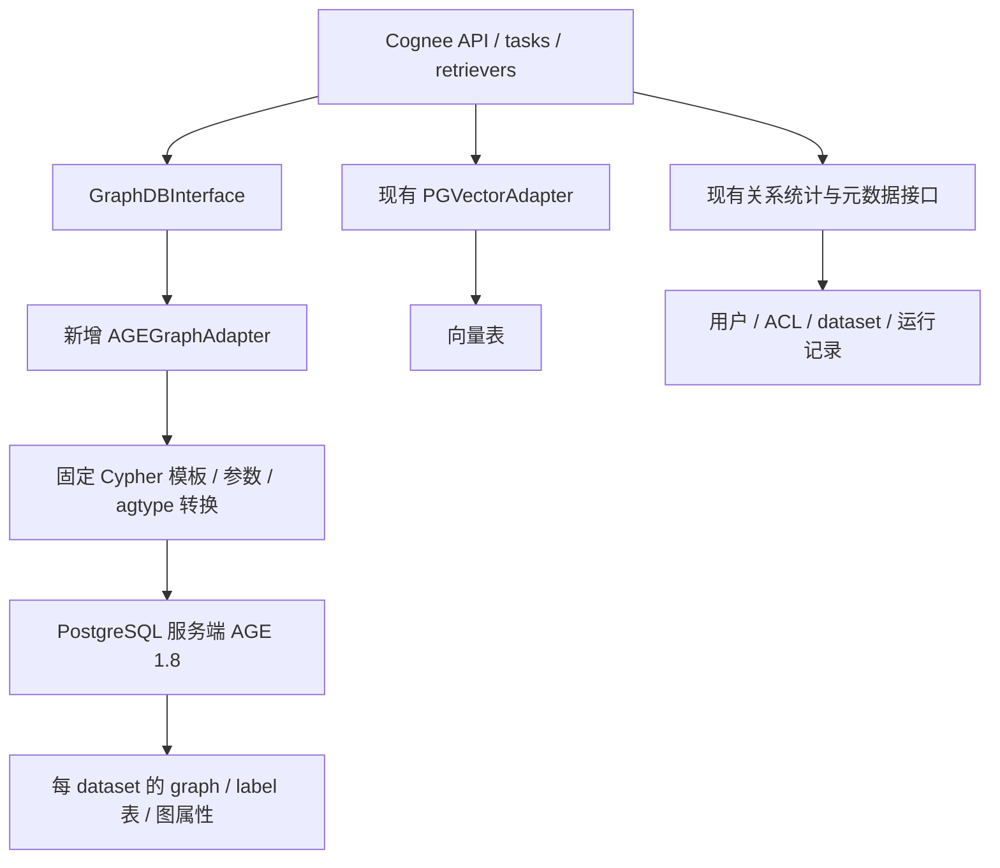

# Cognee 接入 Apache AGE：版本、真实图能力、执行机制与华为云边界

核验日期：2026-09-28。本文重新评估“用 AGE 替代手写 SQL 图实现”，承接[普通 PG 实现与工作量](postgres-graph-implementation-plan.md)，不将数据可表达性当作性能结论。

源码固定基线：Cognee `663a2dc15d04bc0d7ec2733a2dd604b7ed1b8c8e`；AGE PG17/1.7.0 `e1467f12e0b1d15dd35d3ab93f057a7112d425b8`；AGE PG18/1.8.0 `e43dc1a12b78fba4acef9835b2b10379b8d243b4`。

证据分三层：正式发行包与固定源码/回归脚本能够确认的能力；需要开发的 Cognee 适配方案；必须通过实际环境测量的性能。本轮没有运行 AGE 数据库、执行 Cognee+AGE 集成或连接华为云实例，文中的 expected 文件是仓库保存的预期结果，不是本轮测试通过记录。

**1. 结论先明确：AGE 有实现基础，但不能把“换成 Cypher”当成性能证明**

- AGE 已核查的图模型、CRUD、属性更新、批量输入和路径查询，能够为新建 Cognee 图 adapter 提供基础。当前 Cognee checkout 没有内置 AGE provider，因此不是改一个连接串即可切换。
- 对新方案，建议优先验证 **PostgreSQL 18 + AGE 1.8.0 正式发行包**。它包含本次关心的 VLE 缓存/邻接/连接条件改进、MERGE 分支更新及无权最短路函数。若必须 PG17，则采用其正式 1.7.0，并按旧版边界评估，不能套用 1.8 的能力。
- AGE 固定跳 MATCH 仍会转成 PG 查询和 JOIN。变长路径有 C 实现的遍历与邻接缓存，但也有整图冷加载、每数据库进程缓存和路径枚举成本。能否优于普通 PG，必须看等价查询、数据分布及冷热负载。
- 华为云 RDS for PostgreSQL 的最新公开插件清单未列 AGE。**AGE 可在自管 PG 安装，不等于现有 RDS 可以安装。**如果必须保持标准 RDS 且不能增加图服务，当前公开证据不支持直接采用原位 AGE 方案。

因此，本次判断是：**AGE 是值得验证的专用图扩展方案；功能可实现有源码依据，生产兼容与性能收益尚未实测。**

**2. 哪个版本支持：必须同时锁定 PG 主版本和 AGE 发行包**

本轮交叉核对 Apache 正式分发目录、GitHub release 的发布时间与 `prerelease`、源码包中的 `RELEASE/age.control`。当前可确认的组合如下；不是说其他版本从未发布，而是当前正式分发基线。

| PostgreSQL 主版本 | 本轮确认的正式 AGE 基线 | GitHub 发布时间（UTC 日期） | 判断 |
|---|---|---|---|
| 14 | 1.6.0 | 2025-11-20 | 使用 PG14 对应包，不外推 1.8 新特性 |
| 15 | 1.6.0 | 2025-11-20 | 1.8.0 另有候选版，尚不能当作本表正式基线 |
| 16 | 1.6.0 | 2025-09-04 | 使用 PG16 对应包 |
| 17 | 1.7.0 | 2026-02-11 | 可作受 PG17 约束时的验证基线 |
| 18 | 1.8.0 | 2026-07-09 | 本文建议的新方案主要验证对象 |
| 15 候选 | 1.8.0-rc0 | 2026-09-19 | GitHub `prerelease=true`，正文说明仍待 PMC 批准；不混入正式矩阵 |

证据：[Apache 正式分发目录](https://dist.apache.org/repos/dist/release/age/)、[PG17 1.7.0 发布](https://github.com/apache/age/releases/tag/PG17%2Fv1.7.0-rc0)、[PG18 1.8.0 发布](https://github.com/apache/age/releases/tag/PG18%2Fv1.8.0-rc0)、[PG15 1.8 候选](https://github.com/apache/age/releases/tag/PG15%2Fv1.8.0-rc0)。当日目录与发布元数据已保存为[核验快照](evidence/age-version-evidence-20260928.json)。

两个容易误判的地方：官网 [Downloads](https://age.apache.org/download/) 当日仍把 PG17/PG18 分别列为 1.6/1.7，落后于正式发行目录；而已正式发布的 PG17/1.7、PG18/1.8 的 Git tag 仍带 `rc0`。不能只根据官网一句 latest，或只看标签里的 rc，判断发行身份。五个正式源码包的 SHA-512 均与官方 sidecar 一致，包内版本匹配；本轮未验证 PGP 签名链，也未验证全部 PG 小版本/操作系统组合。

**3. 1.6、1.7、1.8 的差异与本项目有什么关系**

| 能力 | 版本证据 | 对 Cognee 的意义与限制 |
|---|---|---|
| 普通 MERGE、VLE、列表推导、map projection | 1.6 发布记录已有相应能力/修复 | 不能说旧 AGE 完全不能存图或查多跳；本轮完整接口映射以 1.7/1.8 为准 |
| RLS 支持与权限检查修正 | PG17 1.7 RELEASE 明确加入 | 不能由 PG 本来支持 RLS，倒推旧 AGE 所有图查询已等价执行；仍需租户隔离验收 |
| ID 列索引 | 1.7 RELEASE 明确加入，提示旧 label 建索引可能使升级耗时 | AGE 不是从此才有任何索引；业务 UUID 属性仍需另外设计索引与唯一性 |
| `MERGE ... ON CREATE SET / ON MATCH SET` | 1.8 grammar 和回归明确加入，1.7 grammar 无这些 actions | 可以区分首次建节点与匹配后更新，但不自动解决并发唯一或默认值覆盖 |
| VLE 邻接布局、缓存、终点条件改写 | 1.8 源码与发行记录 | 更值得测数据库内遍历；不保证任意图上更快 |
| `age_shortest_path` / `age_all_shortest_paths` | 1.8 SQL 声明与 C 实现 | 有按跳数的无权最短路基础，不等价全部 Neo4j/GDS 图算法 |
| 共享预加载、连接池配置 helper、agtype/jsonb 转换 | 1.8 发行与驱动源码 | 降低部分接入工作，但不能使不含 AGE 的托管数据库凭空具备 AGE |

证据：[1.6 PG16 RELEASE](https://github.com/apache/age/blob/PG16/v1.6.0-rc0/RELEASE#L18)、[1.7 RELEASE](https://github.com/apache/age/blob/e1467f12e0b1d15dd35d3ab93f057a7112d425b8/RELEASE#L18)、[1.8 RELEASE](https://github.com/apache/age/blob/e43dc1a12b78fba4acef9835b2b10379b8d243b4/RELEASE#L18)、[1.8 MERGE actions 回归](https://github.com/apache/age/blob/e43dc1a12b78fba4acef9835b2b10379b8d243b4/regress/sql/cypher_merge.sql#L936)。同版号不同 PG 分支也须分别验证，不能把 PG18 的实现细节视为 PG15 候选包的无条件保证。

**4. AGE 实际怎样存图，与原来的 PG 表方案有什么不同**

AGE 是运行在 PostgreSQL 服务端的原生扩展。它管理 graph/schema、label 表、内部图 ID 和图属性类型，提供 Cypher 解析与执行。数据仍在 PG 中，不是另接一个独立存储引擎，也不是只在应用端装 Python 包。

| 层次 | 普通 Cognee PG demo | 建议的 AGE 适配方案（待实现） |
|---|---|---|
| 图容器 | 固定节点/边表；按 handler 使用独立 database 或共享库内的独立 schema | 每 dataset 映射 AGE graph，由 AGE 管理其 schema/label |
| 节点身份 | 字符串节点主键 | AGE 内部 graphid + 属性中保留 Cognee UUID |
| 边身份 | 起点、终点、关系名复合主键 | AGE 内部边 ID + Cognee 三元组身份 + `edge_object_id` |
| 属性 | JSONB 列 | AGE `agtype` 属性 map；由 codec 转为 Cognee dict |
| 图查询 | adapter 手写 SQL、Python BFS | adapter 使用固定 Cypher 模板，按需选择固定跳、VLE 或专用函数 |
| 向量检索 | PGVector 等独立 adapter | 继续使用 PGVector 等；不因 AGE 自动合并为一个检索器 |

AGE 的内部 graphid 是整数，不能直接替换 Cognee UUID，否则向量 ID、来源记录和反馈寻址会错位。[graphid 定义](https://github.com/apache/age/blob/e43dc1a12b78fba4acef9835b2b10379b8d243b4/src/include/utils/graphid.h#L29)。agtype 带有图实体的类型信息，不应把完整 vertex/edge/path 输出都直接当普通 JSON 解析。[官方类型说明](https://age.apache.org/age-manual/master/intro/types.html)、[驱动实体解析](https://github.com/apache/age/blob/e43dc1a12b78fba4acef9835b2b10379b8d243b4/drivers/python/age/builder.py#L212)。

可选的初始模型是固定节点 label `CogneeNode`，将原始 `type` 保存在属性中，关系名映射为经验证的边 label。这样便于统一业务 ID；代价是已有 `MATCH (:Entity)` 类查询需要按新 schema 重写。也可以按业务类型分 label，但要解决跨 label 唯一性和类型变化。**这是 adapter 设计选择，尚未实现，不能假装 AGE 自动替我们完成。**

不建议保留普通节点/边表再异步复制一套 AGE 图，作为默认起步方案：那会增加一套图状态及同步一致性问题。更直接的验证路线是 AGE 成为图的权威存储，业务元数据、向量仍走原有接口；已有数据通过明确迁移流程转入。

**5. 是否能消除联表：固定跳的答案是否定的**

在 AGE 1.8，固定路径被解析为实体和连接条件，再交给 PG 规划执行。源码有 `make_path_join_quals`；仓库回归里，一跳 Cypher 就产生了两层 Nested Loop，组合节点属性索引、边 start_id 索引和目标节点主键查找。[路径转换](https://github.com/apache/age/blob/e43dc1a12b78fba4acef9835b2b10379b8d243b4/src/backend/parser/cypher_clause.c#L5632)、[实际预期执行计划](https://github.com/apache/age/blob/e43dc1a12b78fba4acef9835b2b10379b8d243b4/regress/expected/index.out#L716)。

所以不能成立的推论是“SQL 多次 JOIN 慢 → 改写成短 Cypher → 不再 JOIN → 必然快”。索引选择性、起点数量、连接中间结果和最终返回量仍然重要。回归测试还设置了 `enable_seqscan=false`，它证明某种索引路径可用，不证明生产默认优化器一定选择，更不代表性能基准。

AGE 的价值在于提供图语义与专门实现、减少手工拼接复杂 SQL 的维护，并让特定遍历进入数据库内 C 代码。是否改善当前瓶颈，应区分“应用往返慢”“固定跳连接候选太多”“路径本身太多”，分别验证。

**6. 变长路径确实有专用实现，但有四类必须测量的成本**

**第一，路径枚举与邻域不是相同工作。**普通 VLE 使用 DFS，当前路径内边不重复，但节点可以重复。Cognee PG demo 的邻域则按已访问节点去重，再返回这些节点之间的全部诱导边。两者最终端点集合可能相同，内部执行量却可能相差很大。`DISTINCT` 去重输出不等于提前免除路径展开。Cognee Neo4j 后端自身也使用 VLE，因此这里比较的是具体实现，不能说全部 Cognee 后端都执行 BFS。[AGE VLE 语义与 DFS](https://github.com/apache/age/blob/e43dc1a12b78fba4acef9835b2b10379b8d243b4/src/backend/utils/adt/age_vle.c#L29)、[PG demo 邻域](https://github.com/topoteretes/cognee/blob/663a2dc15d04bc0d7ec2733a2dd604b7ed1b8c8e/cognee/infrastructure/databases/graph/postgres_demo/adapter.py#L907)。

因此 AGE adapter 需要明确两种策略：批量一跳扩展可精确控制已访问节点，但仍有应用往返；有界 VLE 可在数据库内展开，但必须测量路径数量、环与高度节点的代价。普通 VLE 不能仅因用 C 实现，就无条件替代邻域 BFS。最终还需重新取 reached 节点间的全部边，不能只返回路径上出现的边；`edge_types` 对扩展与最终诱导边的作用也要与接口约定一致。

**第二，1.8 冷缓存仍加载整个 graph 的拓扑。**`load_vertex_hashtable/load_edge_hashtable` 遍历图内 label 表，扫描没有按查询 seed 缩小范围。因此在巨大 graph 上偶发查询一个很小邻域，也可能先承担全图构建成本。实际缓存放在数据库 backend 的内存上下文中，多个连接可能各自加载一份；并非数据库全部连接共用一个邻接缓存。[全图拓扑加载](https://github.com/apache/age/blob/e43dc1a12b78fba4acef9835b2b10379b8d243b4/src/backend/utils/adt/age_global_graph.c#L715)、[缓存管理](https://github.com/apache/age/blob/e43dc1a12b78fba4acef9835b2b10379b8d243b4/src/backend/utils/adt/age_global_graph.c#L1024)。

**第三，1.8 优化了缓存，但没有让写入后重建免费。**相对所审 1.7，1.8 将邻接链表改为平坦数组，改进边 hash；缓存从复制全部属性改为保存 tuple TID，按需取属性；使用图级版本计数减少无关事务导致的失效；读取 label 的锁改为 AccessShareLock。共享的是版本计数，邻接缓存仍是进程私有。[1.7 缓存](https://github.com/apache/age/blob/e1467f12e0b1d15dd35d3ab93f057a7112d425b8/src/backend/utils/adt/age_global_graph.c#L40)、[1.8 缓存与失效](https://github.com/apache/age/blob/e43dc1a12b78fba4acef9835b2b10379b8d243b4/src/backend/utils/adt/age_global_graph.c#L50)、[属性按需读取](https://github.com/apache/age/blob/e43dc1a12b78fba4acef9835b2b10379b8d243b4/src/backend/utils/adt/age_global_graph.c#L1375)。

这些改动有明确的优化方向，不能由此虚构加速倍数。同图频繁变更仍可能使缓存重建；返回完整大属性路径的成本也与仅返回 ID 不同。1.8 共享版本表的 `AGE_MAX_GRAPHS=128` 是版本跟踪容量，不是数据库最多只能创建 128 个图；超过跟踪容量的图会回退 snapshot 失效判断。多 dataset 分图设计应专测这一边界。[版本计数分配](https://github.com/apache/age/blob/e43dc1a12b78fba4acef9835b2b10379b8d243b4/src/backend/utils/adt/age_global_graph.c#L1898)。

**第四，入口属性索引与 VLE 内部过滤不同。**起点可通过属性/ID 索引筛选，固定跳可以使用端点索引；VLE 内部边属性判断则会按 TID 读取属性后匹配，不是每一层都通过属性 GIN 筛边。1.8 新增的一项索引扫描优化还用于按内部图 ID 水合节点，不能扩大成“整个遍历都自动索引化”。[VLE 属性过滤](https://github.com/apache/age/blob/e43dc1a12b78fba4acef9835b2b10379b8d243b4/src/backend/utils/adt/age_vle.c#L408)、[节点水合索引查找](https://github.com/apache/age/blob/e43dc1a12b78fba4acef9835b2b10379b8d243b4/src/backend/utils/adt/agtype.c#L6120)。

此外，1.8 VLE 将 start_id/end_id 作为独立列暴露，让终点条件转为整数等值 JOIN，便于 PG 选择连接计划。这是改进 JOIN，不是消灭 JOIN。[终点条件改写](https://github.com/apache/age/blob/e43dc1a12b78fba4acef9835b2b10379b8d243b4/src/backend/parser/cypher_clause.c#L4858)。相关 VLE/最短路函数声明为 `PARALLEL UNSAFE`；可多连接并发，不代表单条遍历自动使用 PG 并行 worker。

**7. 1.8 的最短路径能力能用到什么程度**

已核实的公开 SQL 函数是 `ag_catalog.age_shortest_path` 和 `ag_catalog.age_all_shortest_paths`，返回集合，参数包括图、起终点、边类型、方向及跳数范围。标准路径使用无权 BFS，按跳数寻找最短路。这可以支撑某些明确的路径查询，但不等于带权 Dijkstra，不等于 APOC/GDS，也不在本报告中扩大承诺为所有 Neo4j `shortestPath()` 写法可直接运行。[函数声明](https://github.com/apache/age/blob/e43dc1a12b78fba4acef9835b2b10379b8d243b4/sql/agtype_typecast.sql#L101)、[BFS 实现](https://github.com/apache/age/blob/e43dc1a12b78fba4acef9835b2b10379b8d243b4/src/backend/utils/adt/age_vle.c#L2798)。

有两个参数相关边界：`min_hops` 高于实际最短距离时，代码会退回 DFS 枚举再选最短，不再是普通 BFS 的成本；all-shortest 会在首次调用计算、物化结果后逐行返回，不能用外层 LIMIT 推断不会提前做大量工作。代码设有百万路径相关上限；该上限是保护条件，不是建议业务允许返回百万条。[fallback](https://github.com/apache/age/blob/e43dc1a12b78fba4acef9835b2b10379b8d243b4/src/backend/utils/adt/age_vle.c#L3288)、[结果物化](https://github.com/apache/age/blob/e43dc1a12b78fba4acef9835b2b10379b8d243b4/src/backend/utils/adt/age_vle.c#L3781)。

**8. 对 Cognee 逐项映射：什么有基础，什么仍要开发**

下表的“支持”只指目标 AGE 具备底层语法/结构；不表示 Cognee 接口已实现或测试通过。

| Cognee 能力 | 已核实 AGE 基础 | 适配工作与判断 |
|---|---|---|
| 节点/边新增、更新、批量写 | 1.7 已有 CREATE/MERGE/UNWIND；1.8 加 MERGE actions | 可实现；业务 ID 唯一、并发重复写、缺失端点处理仍需代码 |
| 节点/边属性读取 | MATCH、属性 map/list | 可实现；将内部图 ID 转成业务 UUID，统一 tuple/dict 返回 |
| 邻居、有限跳子图 | 固定跳 MATCH、有界 VLE | 可实现；明确节点去重、诱导边、深度、截断语义并测性能 |
| 删除节点及关系 | 1.7 有 DELETE/DETACH DELETE 回归 | 可实现物理删除；来源感知删除仍需额外逻辑 |
| feedback 四方法 | 数值属性和局部 SET | 可实现；边按 edge_object_id 定位，逐项 bool，默认值及并发读算写测试 |
| truth 两方法 | 列表、整数属性、SET | 可实现；保留 alignment/epoch 配套与上层发布协议 |
| `update_node` / valid_to | `SET +=`、REMOVE | 可实现；属性保留、缺失值、null 语义与字段所有权需明确 |
| 时间节点与事件检索 | 属性范围筛选、有限跳关系 | 可实现现有 Timestamp→Event 语义；不是自动升级成事件区间相交 |
| 来源、run 回滚、增量 chunk | 属性列表、事务内图更新 | 可实现但工作量较大；必须维护四类来源及 run 所有权，不是存个数组就完成 |
| 原始 AGE Cypher | `cypher()` 函数、prepared 参数通道 | 有基础；返回列声明、参数和结果解码需封装 |
| 现有 Cognee Neo4j NL/Cypher/APOC/GDS | 语法部分重合，插件与调用协议不同 | 不能承诺直接兼容；需独立 AGE prompt/功能门禁，或明确不支持 |

基础证据：[1.7 批量 MERGE](https://github.com/apache/age/blob/e1467f12e0b1d15dd35d3ab93f057a7112d425b8/regress/sql/cypher_merge.sql#L679)、[SET/参数](https://github.com/apache/age/blob/e1467f12e0b1d15dd35d3ab93f057a7112d425b8/regress/sql/cypher_set.sql#L150)、[整包与局部属性更新](https://github.com/apache/age/blob/e1467f12e0b1d15dd35d3ab93f057a7112d425b8/regress/sql/cypher_set.sql#L265)、[删除回归](https://github.com/apache/age/blob/e1467f12e0b1d15dd35d3ab93f057a7112d425b8/regress/sql/cypher_delete.sql#L46)。这些锚点给出已确认存在的版本，不宣称它们就是最早引入的版本。

有三处必须保留前轮分析的业务要求：

1. **重复入库不能重置学习状态。**新模型中的 `feedback_weight=0.5` 或 null 可能覆盖已有状态，即使用 `SET +=` 也不能自动避免。抽取属性、运行态、派生状态、来源必须分别规定替换/保留/失效规则。
2. **MERGE 不等于并发唯一性已验证。**应对业务 UUID/边身份建立合适的唯一性机制，并测试冲突与重试。1.8 的 ON CREATE/ON MATCH 可简化语句，但不是 PostgreSQL ON CONFLICT 的全部语义保证。
3. **同 PG 不自动产生跨 adapter 大事务。**图内来源与图对象可以设计成同事务；现有图写、向量写、关系元数据更新仍分步骤。AGE 不自动消除这些提交边界。

参考：[Cognee 高级接口契约](https://github.com/topoteretes/cognee/blob/663a2dc15d04bc0d7ec2733a2dd604b7ed1b8c8e/cognee/infrastructure/databases/graph/graph_db_interface.py#L757)、[来源契约](https://github.com/topoteretes/cognee/blob/663a2dc15d04bc0d7ec2733a2dd604b7ed1b8c8e/cognee/infrastructure/databases/graph/graph_db_interface.py#L211)、[存储编排](https://github.com/topoteretes/cognee/blob/663a2dc15d04bc0d7ec2733a2dd604b7ed1b8c8e/cognee/tasks/storage/add_data_points.py#L330)。

**9. 为什么不能直接复用 Neo4j adapter**

普通 cognify 路径就有不兼容依赖：Neo4j 批量写节点使用 `apoc.coll.toSet`、`apoc.create.addLabels`，写边使用 `apoc.merge.relationship`。不是仅高级图算法才遇到问题。AGE 有 CALL/YIELD 的回归，不等于它提供了这些 Neo4j 插件。[节点写入](https://github.com/topoteretes/cognee/blob/663a2dc15d04bc0d7ec2733a2dd604b7ed1b8c8e/cognee/infrastructure/databases/graph/neo4j_driver/adapter.py#L382)、[边写入](https://github.com/topoteretes/cognee/blob/663a2dc15d04bc0d7ec2733a2dd604b7ed1b8c8e/cognee/infrastructure/databases/graph/neo4j_driver/adapter.py#L1238)、[AGE CALL 回归](https://github.com/apache/age/blob/e1467f12e0b1d15dd35d3ab93f057a7112d425b8/regress/sql/cypher_call.sql#L41)。

现有自然语言检索 prompt 明确要求 Neo4j 4.4+，还建议 `apoc.algo.*`。若直接把 `supports_cypher_queries` 打开，可能同时启用一个仍在生成 Neo4j 方言的上层路径。因此应增加 AGE 专用 prompt、真实 schema 与独立兼容测试，必要时细分 raw/NL 的能力开关；初版可先不承诺公开任意 Cypher/NL 查询。[当前 prompt](https://github.com/topoteretes/cognee/blob/663a2dc15d04bc0d7ec2733a2dd604b7ed1b8c8e/cognee/infrastructure/llm/prompts/natural_language_retriever_system.txt#L1)。

`cypher(graph_name, query_text, parameters)` 是 SQL 函数调用，调用方还要声明返回列与 agtype 类型。固定内部模板容易处理；任意用户 Cypher 的输出列数/类型并非免费兼容。安全的参数传递也需要按 AGE prepared 通道实现，不能把 Bolt 参数代码原样移植。[官方调用协议](https://age.apache.org/age-manual/master/intro/cypher.html)。

**10. 改造落点与建议架构**

建议新增独立 `AGEGraphAdapter`，不要把 AGE 的属性、图 ID 和会话要求硬塞入当前 JSONB 图 adapter。以下文件名是设计建议，不表示仓库已有这些模块。

| 改造位置 | 工作内容 |
|---|---|
| 新增 `cognee/infrastructure/databases/graph/age/adapter.py` | 实现 GraphDBInterface、固定查询模板、事务、批量与错误转换 |
| 新增 `age/codec.py` 或同等职责模块 | Cognee UUID 与 AGE graphid 分离；agtype 节点/边/路径/标量转换 |
| 新增 AGE dataset handler | 创建/解析/删除 graph，绑定 dataset→graph，管理权限、缓存和图级元数据 |
| 图 adapter 注册及 handler 注册 | 使用现有注册接口或明确增加内置 provider；保持构造参数兼容 |
| 图 schema/index 迁移 | 业务 UUID、边身份、属性索引、版本记录，已有图升级与回滚 |
| feedback/truth/增量/Temporal 测试 | 按现有业务契约验证，不以“Cypher 能执行”替代验收 |
| 可选 NL 模块 | AGE prompt、schema 注入和能力门禁；独立于基础 adapter 交付 |

当前 custom adapter 工厂传入的是 `database_name` 等参数，PG database 与 AGE graph namespace 必须明确分开；现有 `postgres_graph_shared` handler 创建的是 demo 图表，不能直接用于 AGE graph 生命周期。[自定义工厂](https://github.com/topoteretes/cognee/blob/663a2dc15d04bc0d7ec2733a2dd604b7ed1b8c8e/cognee/infrastructure/databases/graph/get_graph_engine.py#L344)、[handler 注册入口](https://github.com/topoteretes/cognee/blob/663a2dc15d04bc0d7ec2733a2dd604b7ed1b8c8e/cognee/infrastructure/databases/dataset_database_handler/use_dataset_database_handler.py#L4)。



这里的图、向量和关系表可以放同一自管 PG，也可以分服务；逻辑接口仍独立。若坚持向量与关系留在 RDS，AGE 图需要另一个能安装扩展的 PG 服务。

驱动方面，所审 AGE Python 驱动基于同步 psycopg。1.8 的 `configure_connection()` 可以为已有连接注册 agtype loader、设置 search_path，并选择是否 LOAD；它并不是 Cognee 当前 asyncpg 的直接插件。可实现 asyncpg codec/会话初始化，或对同步驱动做合适的异步隔离，具体需要集成验证。`skip_load` 仅跳过加载命令，不会安装缺失的服务端扩展。[1.8 驱动配置](https://github.com/apache/age/blob/e43dc1a12b78fba4acef9835b2b10379b8d243b4/drivers/python/age/age.py#L174)。

建议优先通过 Cypher DML 维护图。1.8 新 label 表在相关触发函数存在时会安装直接 SQL 修改的缓存失效 trigger，但本轮没有证明所有旧图升级均补齐 trigger，也没有穷尽表重写/维护行为；不能因为底层是表，就跳过 AGE 语义直接更新内部表作为默认写入路径。[trigger 安装](https://github.com/apache/age/blob/e43dc1a12b78fba4acef9835b2b10379b8d243b4/src/backend/commands/label_commands.c#L438)。

**11. 华为云：这里有部署门槛，不是协议障碍**

截至核验日，华为云 [RDS PostgreSQL 支持插件列表](https://support.huaweicloud.com/intl/zh-cn/usermanual-rds-pg/rds_09_0045.html)页面更新于 2026-09-18，覆盖 PG13～18，列有 pgvector，未列 AGE。公开标准支持清单不构成“可以自行安装 AGE”的证据；也不能把这一判断外推成所有专属合作方案或未来版本永远不支持。

AGE 需要服务端原生库、扩展对象和加载/预加载配置。`CREATE EXTENSION`/`control_extension` 只能创建服务端已有且允许使用的扩展，不能通过网络连接上传并编译任意 C 扩展。RDS 数据库 root 账户不等于数据库宿主机的操作系统 root。[华为云扩展安装说明](https://support.huaweicloud.com/usermanual-rds-pg/rds_09_0043.html)、[AGE 安装机制](https://age.apache.org/age-manual/master/intro/setup.html)。

可对目标实例执行下面的只读检查，本轮没有实例连接因而没有执行：

```sql
SELECT name, default_version, installed_version
FROM pg_available_extensions
WHERE name = 'age';

SELECT name, version, installed
FROM pg_available_extension_versions
WHERE name = 'age';

SELECT extname, extversion
FROM pg_extension
WHERE extname = 'age';
```

“没有已安装行”与“没有可用扩展”不同：前者可能只是尚未安装；若可用列表也没有，不能靠安装 Python 客户端或修改 Cognee provider 补上。需要目标产品支持或更换部署方式。

| 部署选择 | 当前证据下的判断 | 代价 |
|---|---|---|
| 在现有标准 RDS 原位加 AGE | 公开清单未支持，不能先假设可行 | 需目标实例/厂商明确提供 AGE 和版本 |
| RDS 保留关系/向量；另部署自管 PG18+AGE1.8 图服务 | 有明确技术实现路线，仍需适配验证 | 新增一个数据库服务及备份、监控、升级职责 |
| 自管 PG18 同时装 AGE1.8 与 pgvector | 有统一服务的设计路线，组合需实测 | 团队承担整个 PG 服务运维；同机资源竞争及故障域需评估 |

因此，如果“只能使用现有 RDS，不能新增服务”是硬约束，应先通过扩展可用性这一关，再投入 adapter。若允许在华为云基础设施上自管 PG，可以进行 AGE PoC，但这属于自建方案，不应写成华为云 RDS 原生支持。

**12. 如何证明 AGE 真的改善当前问题**

PoC 的第一条规则是结果等价：节点集合、诱导边集合、方向、深度、过滤、来源和上限相同。不能拿只返回 ID 的 AGE 查询与返回全部属性的 SQL 查询比较，也不能用路径枚举和邻域查询互相代替。

| 维度 | 必测组合 | 目的 |
|---|---|---|
| 执行形式 | 优化后普通 SQL、AGE 固定跳、AGE 有界 VLE；需要时单独测最短路 | 区分表达方式与真实执行策略 |
| 缓存 | 新 backend 冷、同 backend 热、跨事务热、同图写入后、无关图写入后 | 验证缓存收益与重建成本 |
| 图结构 | 均匀图、高度节点、环、多路径，逐级达到目标规模 | 防止只在小链式 demo 上得出结论 |
| 连接与 dataset | 1/8/32 个实际 backend 示例档位、多 graph、超过版本跟踪容量的档位 | 检查缓存副本、尾延迟与多租户成本；档位是测试建议，不是容量承诺 |
| 返回量 | 只返回 ID、端点和属性、完整路径；有/无边属性限制 | 分离遍历、heap 读取和序列化成本 |
| 正确性/故障 | 并发 MERGE、来源共享、重复 run、回滚、超时取消、重连、只读事务和表维护 | 不以热查询快掩盖一致性或恢复问题 |

记录 p50/p95/p99、首行与总时延、SQL 次数、计划与实际行数、buffers、锁等待、backend RSS/数据库总内存及返回字节。保存受控测试查询的 `EXPLAIN (ANALYZE, BUFFERS)`；计划里一个 Function Scan 不代表函数内部没有全图加载。固定跳基线应有正确索引和条件下推，不能只与已知低效的 SQL 比较。

若 VLE 在热缓存很好，但新连接或写入后频繁重建、RSS 超出预算，则需要调整分图/连接策略或查询形式；不能只公布最好的一组数字。若实际需求主要是高选择性的一两跳，优化后的普通 SQL 仍可能更合适；若反复做有界多跳且邻接可复用，AGE 的机制更值得验证。这些是源码支持的适用性判断，不是已测性能排名。

**13. 改造工作量应按新 adapter 估，不能沿用“补七个方法”的估计**

以下为工程估算，假设熟悉 Python/PG、可用的 PG18+AGE1.8 测试环境、固定模型和有限功能范围，包含对应测试与评审。不是实测工时或报价，PoC 后应重估。

| 工作包 | 人日 | 交付范围 |
|---|---:|---|
| 版本/部署与有界 PoC | 3～5 | 最小参数写入、UUID 往返、邻域、重复写和代表性查询 |
| 新 adapter 基础实现 | 6～10 | CRUD、批量、codec、错误处理、连接生命周期 |
| 图模型、索引与 dataset handler | 4～7 | 业务身份唯一、关系名映射、隔离、图生命周期 |
| 来源、增量和字段所有权 | 6～10 | 共享来源删除、run 回滚、重复入库保留/失效规则 |
| feedback/truth/update_node/选定 Temporal | 4～7 | 高级接口、epoch、有效时间及相关并发契约 |
| 集成和基线性能验收 | 5～8 | 故障注入、目标查询回归、冷热性能与交付文档 |
| **合计** | **28～47** | **限定 AGE adapter 的研发与集成范围** |

不含任意 Neo4j Cypher/APOC/GDS 兼容、AGE 专用开放 NL 产品化、大规模旧后端迁移、完整 HA/备份恢复体系、特定 SLA 保证以及需要修改 AGE 内核才能达到性能目标的工作。与上一份普通 PG 报告的“完整生产试点”交付边界不同，不能仅比较人日总数判断 AGE 更便宜。若还要自管数据库生产运维，应另估；若 PoC 发现图规模或写入模式与缓存机制不匹配，应先重选执行方案而非直接追加全部开发。

**14. 建议落地顺序与最终判断**

先确定目标 PG 主版本和是否允许自管服务。允许新建环境时，以 PG18+AGE1.8 正式包锁定验证对象；PG17约束下只承诺1.7已确认能力；PG14～16约束下不要把1.8当作可直接安装的正式基线。

然后用真实图分布验证身份唯一、参数/返回值、来源维护和最关键的三类查询：固定跳、去重邻域、有界路径。性能过关再补全 adapter，最后决定是否开放 AGE 方言的原始查询和自然语言查询。

AGE 对本项目有两项明确价值：数据库内图表达与专门的遍历实现。它仍保留 PG 存储/连接成本，并引入图缓存与方言适配责任。**选择 AGE 的依据应是具体版本的机制与目标负载验收，而不是“图扩展一定比联表快”。**

阅读范围：定向核对 AGE 两个固定版本的图 ID、MERGE/SET/UNWIND/DELETE/CALL 回归与相关 grammar、固定跳转换/索引计划、VLE与全图缓存关键函数、最短路声明和实现、Python驱动会话/解码；核对 Cognee 工厂、图接口、Neo4j APOC/NL 依赖、PG 邻域和来源/状态契约。未声称全仓覆盖，未运行数据库。已确认的是版本与源码能力，待确认的是目标云实例可安装性、集成正确性与性能收益。
