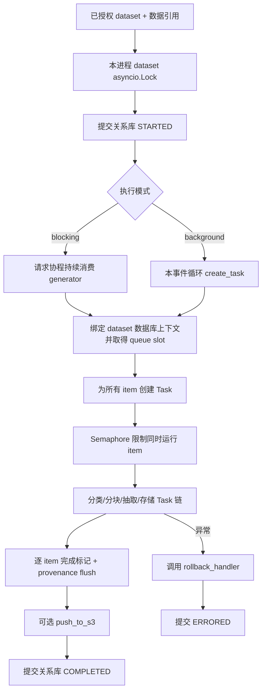
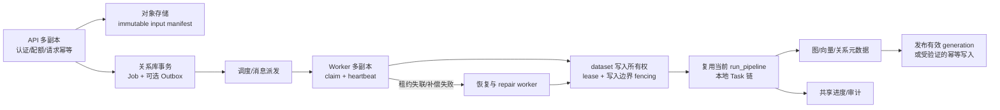

# 执行与集群调度：pipeline 是可组合计算框架，还不是持久作业系统

输入层把原始内容归属到用户与 dataset 后，执行层决定何时取出这些数据、用哪组任务加工、如何记录结束状态。这一层保留了 Cognee 极简 API 与可插拔任务的优势，但其并发控制、后台执行、恢复语义主要仍围绕单 Python 进程构建；商用集群不能仅把 API 容器副本数调大。

本章标记：**事实**来自当前代码；**推断**由代码行为和运行时语义推出、未宣称压测复现；**建议**是待实现的目标设计。源码路径相对于仓库根目录。

## 1. 从 dataset 到任务链：计算控制权在哪里

**事实。** `operations/pipeline.py:87-112` 先检查环境并解析可写 dataset，一次调用含多个 dataset 时顺序执行。`run_pipeline_per_dataset` 在读取数据前取得 dataset 锁，空 data 参数则查询该 dataset 所有数据；已有 run 历史不会直接拒绝新 run（`pipeline.py:130-167`）。因此，业务幂等主要依赖每个文档的增量完成标记，不依赖“这个 dataset 曾执行过”。

**事实。** `run_tasks.py:66-85` 查询 dataset 并先提交 STARTED，再向调用者 yield；数据库上下文直到 `run_tasks.py:92-99` 才建立。运行中为每个 item 建立 `PipelineContext`，一次创建所有 item 的 asyncio Task，以 `data_per_batch` 信号量限制正在执行的数量（默认 20，`run_tasks.py:46,110-121,182-215`）。这是本进程内 I/O 并发，文档数量仍决定待调度 Task 数量；信号量不是有界持久队列。

**事实。** `run_tasks_base.py:262-283` 取任务链第一个 task，把剩余 task 递归传下去；一个上游结果立刻驱动其下游链（`:205-224`），不是全数据经过第一阶段后才进入第二阶段的分布式 DAG。`tasks/task.py:224-235,276-341` 统一包装同步函数、协程、普通 generator、async generator，并按下一个 task 的 batch_size 收集 generator 输出。同步函数直接在当前调用栈执行，没有自动卸载到进程池或线程池（`:326-334`）。任务作者负责避免在事件循环中做长时间阻塞计算。

**设计评价。** 这一设计适合 SDK：普通 Python 函数就能变成任务，数据结构无需为远程序列化付出成本；代价是函数对象、ctx、内存 generator 状态无法直接转成可在另一 Pod 重放的作业。因此优先在整个 dataset pipeline 外围引入 worker，不应第一步就把每个 task 变成远程 RPC。

这里 `operations/run_pipeline.py:77-100` 另有一个 BoundTask 便捷入口，直接委托 `run_tasks_base`；它不走上述 dataset lifecycle、锁和 run 状态写入。不能把“名为 run_pipeline 的任何函数”都视作有相同持久化保证。

## 2. 四类容易混淆的“并发/队列”

| 实现 | 实际语义 | 集群边界与证据 |
|---|---|---|
| dataset lock | 同 dataset 的 pipeline 与删除互斥；允许不同 dataset 并行 | `infrastructure/locks/dataset_lock.py:18-20,33-34,78-86` 明示进程内 asyncio registry；不同 worker/Pod 各自有锁 |
| DatasetQueue | 本进程资源准入与引擎生命周期协调 | `dataset_queue/queue.py:149-158,224-263,523-539`；没有 broker、持久消息、消费者 ACK、抢占恢复 |
| item semaphore | 每个 run 同时推进 item 数量的上限 | `run_tasks.py:119-121,182-215`；各 run 各有一份 semaphore |
| progress queue | 本进程 pipeline_run_id → asyncio.Queue，用于事件消费 | `queues/pipeline_run_info_queues.py:6-35`；另一 Pod 不共享，进程退出即丢失 |

**事实。** DatasetQueue 的 key 是 `(asyncio task identity, dataset_id)`。同 task 同 dataset 递增深度；不同 task 即使操作同 dataset 也另取 slot（`queue.py:12-35,247-263`）。所以它不是“按 dataset 去重的排他锁”。默认上限从 `DATABASE_MAX_LRU_CACHE_SIZE` 取值，默认 6（`queue.py:78-93`，`shared/lru_cache.py:15`）。对集群来说，10 个 API worker 各给 6 个 slot，不会得到“全局只处理 6 个 dataset”的保证。

**事实。** 正常 context 绑定路径仅当 backend access control 开启时才取得 DatasetQueue slot（`context_global_variables.py:203-217`）；退出时释放（`:395-400`）。slot 最后释放时，默认并非立即关闭子进程：`SUBPROCESS_IDLE_TTL_SECONDS` 默认 600 秒，刷新缓存空闲时间后由 daemon reaper 回收；设为 0 才立即触发缓存 force-close eviction（`queue.py:88-89,266-287,313-352,450-468`）。缓存 pinning 根据活跃 dataset 保证正在使用的引擎不因 LRU 容量被驱逐（`pinning.py:49-61`）。这是本机资源保护，不是跨节点租约。

**事实。** 锁顺序必须 dataset lock → DatasetQueue slot。同 dataset 反序直接报错，跨 dataset 反序警告（`dataset_lock.py:37-66`）。云端新增全局租约时必须保持同样资源序，不能把有限 worker slot 长期占用来等热门 dataset 的排他锁。

**事实。** `run_pipeline_as_background_process` 在前台把每个 generator 推进到第一次 yield，然后只建立一个本地后台 Task，串行消费这些 generator（`pipeline_execution_mode.py:93-127`）。名字中的 “process” 没有启动 OS process，更没有集群 worker。

**推断。** `push_to_queue` 会经 `get_queue` 自动创建无界 Queue（`pipeline_run_info_queues.py:13-28`），与 `run_tasks_data_item.py:58-60` 注释声称“没有 queue 时 no-op”不一致。没有订阅者时的队列保留/回收策略、负载均衡后的事件投递需要单独验收，不能依赖注释认定零积累。

## 3. 持久状态是真的，但并非任意阶段恢复点

**事实。** `log_pipeline_run_start.py:24-47`、`log_pipeline_run_complete.py:27-54`、`log_pipeline_run_error.py:39-75` 各写一条关系库 `PipelineRun` 行。进度更新原 STARTED 行里的 JSON，`log_pipeline_run_progress.py:18-31` 明示其为展示用途、允许并发 last-write-wins；无 heartbeat 字段更新。`PipelineRun.py:58-91` 有用户、租户、token、父操作、开始结束时间和错误信息，适合审计和计费分析，但无 worker owner、租约期限、attempt、任务参数快照或中间产物引用。

**事实。** run_id 每次 uuid4（`utils/generate_pipeline_run_id.py:4-6`）；pipeline_id 用 user、dataset、pipeline_name 生成稳定 uuid5（`generate_pipeline_id.py:4-5`），不含代码/模型版本。`run_info.data` 对非 Data 列表只是最多 512 字符的摘要（`summarize_run_info_data.py:5-28`），无法重建完整请求。

**事实。** `models/TaskRun.py:9-20` 虽定义 task_runs 表模型，但对 `cognee/**/*.py` 搜索 TaskRun/task_runs，仅找到该模型自身；所读 runner 从未写 TaskRun。不能据此模型宣称系统有 task-level durable checkpoint。

**事实。** 增量处理先查 Data 的 `pipeline_status[pipeline_name][dataset_id]`，已完成则跳过；整条 item 任务链成功后才写完成标记并 commit（`run_tasks_data_item.py:197-246`）。标记当前写入值只有 COMPLETED；`DataItemStatus.py:12-17` 支持未来字典形态，并明确 content_hash-aware 是计划扩展。文档内容哈希可用于识别现有 Data，但不能把它与“checkpoint 中已经包含 pipeline/model/config 版本”混为一谈。

**推断。** item 中途崩溃一般需重跑该 item，不能从某个抽取 batch 继续。修改 prompt、模型、图 schema 而保持 pipeline_name，相同完成标记可能仍触发跳过，需要云服务显式定义重建/版本策略。

## 4. 错误补偿、崩溃恢复与可验证风险

**事实。** `run_tasks.py:292-350` 同时捕获普通异常与 CancelledError，调用可选 rollback_handler，再写 ERRORED；补偿异常只记日志。正常成功先可选 flush graph/relational `push_to_s3`，再写 COMPLETED（`:260-283`），这避免“先报完成后上传失败”的特定矛盾，但不是跨对象存储、关系库、图、向量的原子事务。

**事实。** cognify 的补偿按 pipeline_run_id 清理本 run 引入的 provenance，保护已有共享节点/边；旧 ledger 路径先删 graph/vector，再删关系库 ownership 并清理 item 标记（`cognify/rollback.py:158-193,195-314`）。这是可重试补偿的有价值基础：图删失败则留下关系元数据供再次清理；但 inline runner 即便 rollback 失败仍可能写 ERRORED，而启动恢复只扫描未终结 run。因此补偿失败需独立的 durable repair 状态，而不能仅依靠一次异常日志（`run_tasks.py:301-334`；`methods/get_pipeline_run_by_dataset.py:63-94`）。

**事实。** API 启动执行 `recover_stale_pipeline_runs_on_startup`（`api/client.py:129-131`）。其查每个 run 最新状态是否仍 STARTED，默认超过 3600 秒就作为 stale；cognify 使用 keep_completed_data 补偿，其他 pipeline 只关闭状态。失败留下 STARTED 等下次启动再试（`cognify/recovery.py:24-31,48-124`）。没有自动重新投递、阶段恢复、周期 lease 检查，也没有证明旧 owner 已停止。

**推断，P0。** 多副本启动时可能把另一副本运行超过一小时的正常任务当作遗留作业补偿。这里阈值来自 STARTED.created_at；进度采用原地 JSON 更新，不刷新 created_at（`log_pipeline_run_progress.py:52-56`），故“有持续进度”也无法证明存活。新副本还可能同时对同一个 stale run 补偿；所读恢复代码没有 claim/CAS 或 dataset lock。

**推断，P0。** `run_tasks.py:210-215` 的 asyncio.gather 没有 return_exceptions=True。Python 的 gather 默认在第一异常时将异常传给等待者，而其他 awaitable 继续运行；因此遇到默认会硬抛的 incremental item（`run_tasks_data_item.py:281-282`）时，可进入整 run rollback，同时其他 item 继续存储。所谓 gathered 里检查 BaseException（`run_tasks.py:220-235`）无法接住默认 gather 提前抛出的异常。应先保证所有子任务静止再补偿：取消并 await 全部子任务，或等待全量结束后统一处理。使用 TaskGroup 需注意项目支持 Python 3.10，TaskGroup 原生要求 3.11。语义依据：[Python asyncio 官方文档](https://docs.python.org/3/library/asyncio-task.html#running-tasks-concurrently)。本次未把这一推断宣称为实际后端复现。

**事实与推断。** API shutdown 默认等待全局后台 registry 8 秒，超时不取消，然后清理数据库缓存（`api/client.py:82-88,149-173`；`infrastructure/background_tasks.py:66-99`）。低层 background pipeline 只加入自己的 `_BACKGROUND_PIPELINE_TASKS`，没有注册全局 registry（`pipeline_execution_mode.py:19-23,125-127`；全仓 register_background_task 调用位于 remember/improve）。因此已有优雅退出机制不能理解为覆盖全部后台路径。SIGKILL 更不会执行这些协作清理逻辑。

## 5. distributed 目录不等于分布式执行引擎

**事实。** `rg --files distributed` 返回均为 distributed/deploy 平台部署模板。Modal 示例创建 volume，配置 ASGI app 与请求并发（`distributed/deploy/modal_app.py:24-58`）；Render 创建 web service + Postgres（`render.yaml:6-57`）；Railway 模板创建 cognee-api 与 postgres（`railway-template.json:5-75`）；Fly 设 HTTP 请求并发及挂载 volume（`fly.toml:21-50`）。这些文件没有业务作业队列、worker claim/ACK、pipeline replay 协议。不能用“已有 Modal autoscaling”证明默认文件数据库可供多个并发容器共同安全写入；存储拓扑仍须独立选择。

## 6. 可落地的改造接缝：先持久作业，再细粒度分布式

以下是建议，并非声称仓库已经具备这些能力。

### 6.1 第一阶段：保持业务 task，替换谁来驱动 pipeline

新增一个云端 Job API 与 worker 入口，worker 复用当前 dataset-aware `run_pipeline`，最初以 **一个 dataset 的完整 run** 为调度粒度，保留每个 worker 内部的 item 并发。这样可以复用现在的 ctx、provenance 与补偿行为，同时把进程生死与 HTTP 请求寿命分离。

在关系库保存 Job 的稳定契约：`job_id / tenant_id / actor_id / dataset_id / input_manifest_uri / pipeline_version / model_config_version / idempotency_key / status / attempt / lease_owner / lease_until / fencing_epoch / error_class`。原始 input manifest 必须引用已完成持久化的对象、内容 hash、版本和完整参数；不能使用目前最多 512 字符的 run_info 摘要。任务参数只传可验证数据与允许的 pipeline identifier，禁止将任意 Python callable/pickle 作为外部作业请求。

新 Job 状态机建议为 queued → leased → running → succeeded，另有 retry_wait、failed、cancelled、repair_pending；既有 PipelineRun 继续承担执行审计，Job 承担调度正确性。不要用“最新日志行”充当 compare-and-swap 的唯一作业状态。一次 job 可对应多次 attempt/run；稳定 idempotency_key 应按 tenant 隔离并有唯一约束。

最小部署可直接以 Postgres 为作业源，事务性写入 Job，worker 原子认领并记录租约；若采用外部 broker，则用 transactional outbox 把接收作业与投递事件联系起来，避免“HTTP 返回成功但任务未发布”或“发布成功但本地事务回滚”。消息重复投递是设计输入，幂等不依赖恰好一次投递承诺。选具体 broker/工作流产品前，先固定这些不变量；数据库锁/队列规范来源由主报告统一列出。

### 6.2 第二阶段：全局 dataset 写入所有权与补偿隔离

把当前 dataset lock 的语义提升到集群，键应与 dataset 的真实全局身份一致。所有可修改该 dataset 的入口必须服从同一协议，包括 add/cognify/improve/delete、后台修复和管理操作。进程内锁可保留以减少本地竞争，但不再作为跨 Pod 正确性依据。

一个 worker 取得 lease 后定期 heartbeat；失联后新 worker 才能认领，attempt/fencing_epoch 单调增加。**仅把 fencing_epoch 写入 Job 表不会阻止旧 worker 写图数据库。** 写入边界必须校验 fencing token，或把输出写到隔离的 run/generation 空间，再通过关系库原子发布有效 generation；不支持条件写/版本隔离的存储，需要受控的单写代理/按 dataset 固定 owner 作为过渡。不得在租约超时后直接并发打开旧 owner 仍可能持有的嵌入式数据库文件。

当前 startup recovery 应改成只处理被租约证明失联、且已成功 claim 的作业；不得对全库“一小时前 STARTED”做盲补偿。补偿必须待该 attempt 的子任务已经结束，且持有独占写入所有权后执行。补偿异常写 repair_pending，周期 repair worker 重试并可人工接管，避免 ERRORED 掩盖半清理状态。

### 6.3 第三阶段：有证据地引入阶段 checkpoint

只有当实际长文档成本或恢复 SLO 要求证明“整 item 重做”不可接受，再把分类、分块、抽取、嵌入等昂贵阶段的产物外置并版本化。checkpoint key 至少包含 tenant/dataset、input content version、pipeline/model/prompt/config version、stage、batch index。每阶段有输入摘要、输出 artifact URI、hash、状态、attempt；写入成功与 publish checkpoint 的顺序必须能支持重试。

这与当前递归流式 runner 有实质区别：应为流式 fan-out 明确 partition/batch manifest，不能只持久化 ctx.task_sequence，因为它只是按名称去重的已见 task 顺序（`models/PipelineContext.py:38-43`），不是恢复时可消费的执行日志。复用 task 实现，但新增 artifact contracts 与 adapter write semantics 是真实工程量。

### 6.4 公平性、进度与上线控制

用租户级并发/速率/预算加 worker 本地 semaphore，避免单大租户填满所有 worker；总 LLM 并发不能简单等于 Pod 数×queue slot×20，因为实际 task 可内部 fan-out，需按 provider/tenant 计量。保留 CACHING/session memory；降低读延迟可单独评估 AUTO_FEEDBACK，不能把关闭记忆能力的跑分当集群吞吐。

把进度事件持久化或发送到共享事件通道；状态查询读 Job/PipelineRun，SSE/WebSocket 可按 event offset 补读，不依赖 Pod 粘性。停止时先停止接新 Job、延长/释放 lease、等待正在执行的 attempt 到安全点，再退出；超过截止时间的 attempt 依租约恢复，不将 HTTP worker 的本地强引用集合当持久承诺。

## 7. 上线前必须给出的验证证据

| 故障/负载情境 | 要证明的不变量 | 对应代码改造起点 |
|---|---|---|
| 两 Pod 同时 cognify 同 dataset，另一个请求 delete | 同 dataset 写入顺序唯一，其他 dataset 不被全局阻塞 | `infrastructure/locks/dataset_lock.py`、`operations/pipeline.py` |
| item A 硬失败，item B 延迟写入 | B 静止后才开始 rollback；补偿后无新孤儿写入 | `run_tasks.py:210-215,301-314` |
| 原始文件已落对象存储，Job 提交前/后进程退出 | 已接受 Job 不丢失；暂存孤儿对象可回收；重试不重复计费 | 新 submit/outbox 接缝 |
| worker 写图后、写向量前或完成标记前被 SIGKILL | 重投不产生重复所有权；未完成结果可定位且可修复 | task 写入 adapter + item checkpoint + rollback |
| 老 worker 网络暂停，租约过期，新 worker 已取得 epoch，老 worker恢复 | 老 epoch 写入被拒绝或不被发布；不能只测 lease 表状态 | 存储写入边界与 generation 发布 |
| 活跃任务超过1小时，新 Pod启动 | 正常运行作业不被 recovery 回滚 | `cognify/recovery.py:77-111` |
| rollback 的 graph/vector delete 抛错 | 作业进入 repair_pending，可重复执行补偿并最终收敛 | `run_tasks.py:301-334` |
| Pod滚动更新、低层后台cognify与remember混合 | 所有作业可 drain 或由新 worker 接管，状态不会永久STARTED | background registry + 新 Job lease |
| 不同 Pod接收进度订阅；订阅断线重连 | 查询结果和事件不依赖同一进程，丢事件可补读 | `pipeline_run_info_queues.py` |
| 大租户持续大批量，小租户低频请求 | 小租户排队p95满足事先约定SLO，预算独立 | 全局scheduler与租户配额 |

本次是静态架构分析，没有执行上述故障注入或外部 LLM/数据库集成测试；这些是商业化可落地的验收清单而不是已通过结果。现有单机保护与错误信息已有较多工程积累，可保留复用；应把新增工作集中于持久作业、所有权、幂等与跨存储一致性，而非首先拆碎业务 task。

执行者何时结束只回答了“这一批计算是否完成”；真正决定结果是否能稳定被读取、删除和恢复的是多种存储之间的写入顺序与归属证据，下一层必须继续检验这些一致性边界。

## 附：本章静态阅读覆盖明细（供合并审计，不放入最终正文）

统计口径：以下为本章明确选入的执行关键文件，行数包含注释和空行；所有完整读取均有带行号输出，发生大批输出截断后已对关键文件拆批重读。不是全仓库或整个 cognify/pipelines 目录覆盖。核心目标≥90%，次要目标≥60%。

| 类型 | 文件 | 总行数 | 已读范围 | 已读行数 | 覆盖率 | 未读原因 |
|---|---|---:|---|---:|---:|---|
| 核心 | cognee/modules/pipelines/operations/pipeline.py | 167 | 1–167 | 167 | 100% | 无 |
| 核心 | cognee/modules/pipelines/layers/pipeline_execution_mode.py | 142 | 1–142 | 142 | 100% | 无 |
| 核心 | cognee/modules/pipelines/operations/run_tasks.py | 350 | 1–350 | 350 | 100% | 无 |
| 核心 | cognee/modules/pipelines/operations/run_tasks_data_item.py | 413 | 1–413 | 413 | 100% | 无 |
| 核心 | cognee/modules/pipelines/operations/run_tasks_base.py | 283 | 1–283 | 283 | 100% | 无 |
| 核心 | cognee/modules/pipelines/operations/run_pipeline.py | 100 | 1–100 | 100 | 100% | 无 |
| 核心 | cognee/modules/pipelines/operations/run_parallel.py | 15 | 1–15 | 15 | 100% | 无 |
| 核心 | cognee/modules/pipelines/operations/run_tasks_with_telemetry.py | 66 | 1–66 | 66 | 100% | 无 |
| 核心 | cognee/modules/pipelines/tasks/task.py | 341 | 1–341 | 341 | 100% | 无 |
| 核心 | cognee/modules/pipelines/models/TaskRun.py | 20 | 1–20 | 20 | 100% | 无 |
| 核心 | cognee/modules/pipelines/models/PipelineRun.py | 91 | 1–91 | 91 | 100% | 无 |
| 核心 | cognee/modules/pipelines/models/PipelineContext.py | 43 | 1–43 | 43 | 100% | 无 |
| 核心 | cognee/modules/pipelines/models/PipelineRunInfo.py | 75 | 1–75 | 75 | 100% | 无 |
| 核心 | cognee/modules/pipelines/models/DataItemStatus.py | 21 | 1–21 | 21 | 100% | 无 |
| 核心 | cognee/modules/pipelines/operations/log_pipeline_run_start.py | 49 | 1–49 | 49 | 100% | 无 |
| 核心 | cognee/modules/pipelines/operations/log_pipeline_run_complete.py | 56 | 1–56 | 56 | 100% | 无 |
| 核心 | cognee/modules/pipelines/operations/log_pipeline_run_error.py | 77 | 1–77 | 77 | 100% | 无 |
| 核心 | cognee/modules/pipelines/operations/log_pipeline_run_progress.py | 112 | 1–112 | 112 | 100% | 无 |
| 核心 | cognee/modules/pipelines/methods/get_pipeline_run_by_dataset.py | 94 | 1–94 | 94 | 100% | 无 |
| 核心 | cognee/modules/pipelines/queues/pipeline_run_info_queues.py | 35 | 1–35 | 35 | 100% | 无 |
| 核心 | cognee/modules/pipelines/utils/summarize_run_info_data.py | 28 | 1–28 | 28 | 100% | 无 |
| 核心 | cognee/modules/pipelines/utils/generate_pipeline_id.py | 5 | 1–5 | 5 | 100% | 无 |
| 核心 | cognee/modules/pipelines/utils/generate_pipeline_run_id.py | 6 | 1–6 | 6 | 100% | 无 |
| 核心 | cognee/infrastructure/databases/dataset_queue/queue.py | 539 | 1–539 | 539 | 100% | 无 |
| 核心 | cognee/infrastructure/databases/dataset_queue/pinning.py | 66 | 1–66 | 66 | 100% | 无 |
| 核心 | cognee/infrastructure/locks/dataset_lock.py | 112 | 1–112 | 112 | 100% | 无 |
| 核心 | cognee/infrastructure/background_tasks.py | 99 | 1–99 | 99 | 100% | 无 |
| 核心 | cognee/modules/cognify/recovery.py | 144 | 1–144 | 144 | 100% | 无 |
| 核心 | cognee/modules/cognify/rollback.py | 323 | 1–323 | 323 | 100% | 无 |
| 次要 | cognee/modules/cognify/config.py | 140 | 1–140 | 140 | 100% | 无 |
| 次要 | cognee/modules/cognify/routing.py | 41 | 1–41 | 41 | 100% | 无 |
| 次要 | cognee/modules/pipelines/__init__.py | 78 | 1–78 | 78 | 100% | 无 |
| 次要 | cognee/modules/pipelines/layers/validate_pipeline_tasks.py | 20 | 1–20 | 20 | 100% | 无 |
| 次要 | cognee/modules/pipelines/layers/setup_and_check_environment.py | 94 | 1–94 | 94 | 100% | 无 |
| 次要 | cognee/modules/pipelines/layers/resolve_authorized_user_datasets.py | 54 | 1–54 | 54 | 100% | 无 |
| 次要 | distributed/deploy/modal_app.py | 58 | 1–58 | 58 | 100% | 无 |
| 次要 | distributed/deploy/render.yaml | 57 | 1–57 | 57 | 100% | 无 |
| 次要 | distributed/deploy/railway-template.json | 76 | 1–76 | 76 | 100% | 无 |
| 次要 | distributed/deploy/fly.toml | 50 | 1–50 | 50 | 100% | 无 |
| 核心合计：29文件 | 已选范围 | 3872 | 全部 | 3872 | 100% ✓ | 非全模块覆盖 |
| 次要合计：10文件 | 已选范围 | 668 | 全部 | 668 | 100% ✓ | 非全模块覆盖 |

跨模块抽样仅作为定位证据，不纳入上述完整覆盖分母：`cognee/api/client.py` 读81–175；`cognee/context_global_variables.py` 读38–112、195–243、360–404；`cognee/shared/lru_cache.py`仅 rg 定位15行。输入/存储对应主责 agent 将提供自己的覆盖记录。小于30%的文件按 skill 规则不计入完整阅读。

本章明确未读：`cognee/modules/cognify/estimator.py`（600行，成本估算，非执行与恢复主链）；pipelines其余模型/小型查询/异常定义未作为关键控制路径纳入；distributed其余平台脚本仅做路径清单和关键词扫描，不能宣称逐行审阅全部部署模板。未读文件不参与“已选关键文件100%”计算。

本章选择文件合计 39 个、4540 行。未修改业务代码、未运行仓库测试、未启动云资源。
