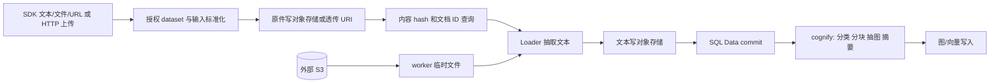

# 输入、文档持久化与读取回路

> 证据口径：本章为当前工作树静态阅读；事实引用源码位置，推断与建议分别标注。尚未执行数据库/云环境故障实验。

## 1. 原始输入如何进入持久化

**事实**：低级 SDK `add()` 接受文本、文件/对象流、URL、DataItem 等输入，默认前台等待；HTTP 入口是认证后的 multipart 上传与 `raw_data` 字符串列表（`cognee/api/v1/add/add.py:35-52`；`cognee/api/v1/add/routers/get_add_router.py:49-108,186-216`）。SDK 会解析授权 dataset，任务列表由 `resolve_data_directories` 和 `ingest_data` 组成；DLT 输入先转换，再检查同文档内容变化，后台输入流先物化（`add.py:263-335`）。同路径/上传文件名已有但内容变化必须走 update，HTTP 返回 409（`add.py:302-305`；`get_add_router.py:232-243`）。

**事实**：`ingest_data` 先保存文件或保留输入引用、取得内容 hash，按 dataset + owner + tenant 查询已有行，随后 loader 抽取并保存文本，最后一次 SQL session merge/add/commit；文件和 SQL 没有同一事务（`cognee/tasks/ingestion/ingest_data.py:193-265,281-297,339-399,522-535`）。

| 持久化内容 | 实际字段/身份 | 代码依据 |
|---|---|---|
| 用户原始文件 | `original_data_location`，`content_hash` 是原文件 hash | `ingest_data.py:484-497` |
| 抽取后的文本 | `raw_data_location`，`raw_content_hash` 是文本 hash | 同上；注意 raw 字段不是原始 PDF |
| 业务文档标识 | 未指定时随机 UUID，可跨内容版本保持稳定 | `ingest_data.py:281-289`；`Data.py:12-20` |
| 数据归属、处理状态 | dataset_id/owner_id/tenant_id/pipeline_status | `cognee/modules/data/models/Data.py:30-56` |
| 原始定位信息 | `_cognee.source_uri` 元数据 | `ingest_data.py:80-113,410-416` |

**事实**：上传原件以 `<content-md5>/<原文件名>` 存储；文本为 `text_<md5>.txt`，write 使用 overwrite。对象内容地址化不等于文档 ID 内容地址化（`cognee/modules/ingestion/save_data_to_file.py:31-52,73-94`）。SQL 的 `(dataset_id, owner_id, content_hash)` 是普通索引；去重查询另加 tenant 谓词。相同内容的并发普通输入可能产生不同 UUID 的两行；只有显式 pinned ID 的主键冲突重试一次（`Data.py:16-20`；`cognee/modules/ingestion/identify_many.py:42-64`；`ingest_data.py:541-556`）。

**推断**：若 SaaS API 承诺网络重试只产生一个文档，需要新增独立 idempotency_key 的原子唯一约束/请求记录，不能把当前查重当作 exactly-once。是否允许用户重复创建相同文档应由产品定义，不能草率把内容 hash 设为唯一业务键。

## 2. 文件抽象与 S3 的实际范围

**事实**：`get_file_storage` 根据 s3 URI 或满足条件的 STORAGE_BACKEND 分派 Local/S3；data root 支持 ContextVar 覆盖（`cognee/infrastructure/files/storage/get_file_storage.py:8-23`；`get_storage_config.py:6-19`）。上传与文本写入该 storage；本地输入、s3 输入直接返回 URI，不会把原件自动复制到自有 bucket（`cognee/tasks/ingestion/save_data_item_to_storage.py:49-58,72-81,91-130`）。S3 loader 会下载至本地 NamedTemporaryFile，抽取后清除临时文件（`cognee/tasks/ingestion/data_item_to_text_file.py:63-89`）。

**事实**：S3FileStorage 使用 s3fs，可配置 endpoint 和显式凭证或 IAM chain；上传读写以 4 MiB 分块，底层同步 I/O 经 run_async 执行（`cognee/infrastructure/files/storage/S3FileStorage.py:24-26,41-74,93-124`）。这解决文件共享访问，不构成图/向量/关系数据库并发协议。

**推断**：同一 URI 要能被任意 worker 访问，才可以跨节点接管。把本地路径作为 Data 持久引用会造成 pod 绑定；外部 s3 对象若被覆盖/删除，后续重放也不稳定。

**建议**：云入口将原件复制到自有受控 bucket，记录 object version/校验和及文档版本；job payload 只带 tenant/dataset/document/version/blob URI，不传 UploadFile、打开的流或 pod 本地路径。保留 worker 临时盘给 PDF/OCR 等 loader，配置空间预算和清理周期。S3 bucket policy 与租户前缀隔离需要单独验证，当前文件抽象不等于租户授权边界。

下文继续分析后台承诺、查询副作用与删除的一致性边界。

## 3. remember 的两条写入回路以及后台边界

**事实**：普通 permanent remember 顺序执行 `add → cognify → 可选 improve`；session remember 先 `SessionManager.add_qa`，可选后台 improve 将 session 桥接到长期图。两者并不是相同的持久化承诺（`cognee/api/v1/remember/remember.py:270-310,1786-1818,1825-1877,1886-1940`）。session 的后台 bridge 失败只填 improve_error，不撤销已成功的 session 存储；永久记忆的 improve 异常也不把 remember 改成失败（同文件 `1867-1873,1925-1933`）。类型化 QA/trace/feedback 与 skills/code/presort 还有专门路由，本章主要分析普通文档与会话链。

**事实**：普通后台 remember 使用 `asyncio.create_task`，保存在模块级任务集合并注册进程后台任务表；返回 accepted/running 不代表跨节点持久作业已提交（`remember.py:49-67,1945-1963`）。为避免 HTTP request 关闭 upload 流，`materialize_stream_for_background` 会先 `stream.read()` 读整个 payload，再写 SpooledTemporaryFile；文件底层分块 S3 上传不能消除这条后台入口的全量 RAM 物化（`cognee/tasks/ingestion/utils.py:19-39,42-79`）。

**推断**：当前设计让嵌入式 SDK 一次 await 即能端到端运行，并且不要求用户运维消息队列；但仅有本进程 task 的工作在 worker 进程退出后不能由另一进程凭此 task 对象接管。云服务应把 accepted 改为持久 job 已成功写入的明确契约；session_stored 与 permanent_indexed 必须分开呈现。

## 4. 文档如何变成图和向量：已有补偿基础

**事实**：默认 cognify 任务依次为文档类型分类、抽取 chunks、LLM 抽图并摘要、add_data_points；可选记录 provenance、矛盾检测。DLT manifest 与代码有专用 task list（`cognee/api/v1/cognify/cognify.py:483-493,558-635,638-685`）。

**事实**：`add_data_points` 根据后端 capability 选择 HYBRID_WRITE 或分离图/向量写入。当图不支持原生来源记录时，先提交 relational rollback ledger；支持来源时将 source_ref 与图写入折叠。分离存储明确先图节点、节点向量，再图边、边向量；随后可选 triplet embeddings，最后捕获 edge evidence（`cognee/tasks/storage/add_data_points.py:135-201,203-220,250-315,317-346,408-420`）。因此不能把现状描述成“随意双写，没有回滚设计”。

**事实**：hybrid 路径的 provenance 仍在图/向量写入后单独 attach，代码明确存在 write-then-attach 窗口（同文件 `370-406`）。

**推断**：跨存储不是全局 ACID；当前顺序为失败补偿保留可寻址来源信息。集群改造应保留 source_ref/document/run 身份，增加持久 step 状态、attempt 与 generation fencing，并验证进程被 kill 时也能补偿，而不只验证 Python 抛异常。

## 5. recall 的读取实际上可能写状态

**事实**：scope=auto 时只有 session_id 且无 dataset/query_type 则先 session，命中短路；有 session 和 dataset 则两路；其他默认走 graph（`cognee/api/v1/recall/recall.py:463-493`）。graph 路由调用 authorized_search，结束后写 search history（同文件 `788-810,850-862`）。history 每个 dataset payload 写 query 和 result，各自 SQL commit；默认 COGNEE_LOG_SEARCH_HISTORY=true（`cognee/modules/search/operations/log_search_history.py:17-41`；`log_query.py:8-32`；`log_result.py:8-32`）。

**事实**：session-aware completion 可在 session_turn_lock 内并行分析反馈与生成答案，随后 commit_turn；无答案 acknowledgement 也可 add_qa（`cognee/modules/retrieval/session_aware_completion.py:305-368,380-401`）。具体检索器/only_context/配置决定哪些副作用发生，不能声称每一种 recall 都必然改图。

**推断**：API 查询副本不是纯只读节点。SaaS 需要给 query worker 保留对 session/history 的写路径；按 session 序号解决并发 turn 顺序，history/反馈消费需要幂等，不能直接把所有 recall 路由到只读数据库后认为行为等价。

## 6. 删除、重放和引用关系

**事实**：旧 `/v1/delete` 已 deprecated，委托 datasets.delete_data（`cognee/api/v1/delete/routers/get_delete_router.py:20-24,56-65`；`cognee/api/v1/delete/delete.py` 为空文件）。文档删除先校验 dataset 删除权限，获取 dataset_lock，按 legacy ID 解析文档；无 SQL Data 时也尝试清图并返回 success。实际数据存在时先清理图/向量与 session，最后删除 SQL Data（`cognee/api/v1/datasets/datasets.py:234-307`）。

**事实**：删除可选择 relational ledger、graph provenance、legacy subgraph 路径；普通删除硬编码 legacy soft 模式以保留共享实体（`datasets.py:279-301`）。graph 写入来源记录可按 chunk 归属记录多个 owner，删除时保留仍有来源的共享图对象（`add_data_points.py:209-214,264-315`）。底层文件引用删除交由 relational engine 的 delete_data_entity，引用检查需要数据库章节进一步核实。

**事实**：forget(memory_only=True) 删除派生图/向量，保留 Data/文件，并重置对应 pipeline_status，使以后可重新 cognify；session invalidation 是 best effort，失败会记录 warning 但不中断（`cognee/api/v1/forget/forget.py:267-365,369-452`）。

**跨模块确认的高优先项**：forget(everything=True) 删除可删除的 datasets 后调用无 user 参数的 cache_engine.prune（`forget.py:191-218`；`datasets.py:316-323`）。共享缓存范围已交叉确认，具体入口与触发条件见下节。

**建议**：商业化删除采用 durable deletion job/tombstone，令查询立即排除待删文档，再由可重入 steps 清图、向量、会话、SQL、对象；共享文件 GC 需要与新引用创建协调，清理期间晚到的旧 job 不能复活已删除版本。反复执行返回成功不等于跨崩溃/并发重建也安全，需要故障注入验证。

### 删除全量缓存风险的入口复核

**事实（代码审计，未做破坏性实验）**：`POST /api/v1/forget` 接受 `everything=true`，依赖的是 `get_authenticated_user`，没有 superuser/admin 限定；身份依赖仅 `current_user(active=True, optional=...)`；应用直接注册该 router（`cognee/api/v1/forget/routers/get_forget_router.py:40-45,69-70,114-122`；`cognee/modules/users/methods/get_authenticated_user.py:81-86`；`cognee/api/client.py:433`）。

触发前提为：能够认证的普通用户、接口对其可达、dataset 删除步骤完成（零 dataset 的循环也完成）、`caching or usage_logging` 为 true、cache engine 可取得。随后是无用户过滤的 prune（`forget.py:202-216`；`datasets.py:316-323`）。持久化分工已交叉确认 SqlCacheAdapter 的 prune 无 WHERE 删除五类缓存表，RedisAdapter 的 prune 为 FLUSHDB；具体实现证据归持久化章节。若多个用户/租户共用该 cache 存储，该调用可清除别人的缓存/会话；不能把图和向量的 dataset 隔离等同于所有状态隔离。应在 SaaS 上线前改为按 user/tenant 清理，并加入双租户隔离回归；只把按钮藏起来不能阻止 HTTP 直调。

### 额外的条件写入与资源约束

**事实**：`ENABLE_LAST_ACCESSED=true` 时检索会投影图寻找所属文档并 SQL 更新 Data.last_accessed；默认 false（`cognee/modules/retrieval/utils/access_tracking.py:21-55,138-149`）。顺序 session completion 在 only_context 提前返回之前已调用 access tracking，因此 only_context 并不构成绝对只读承诺（`cognee/modules/retrieval/session_aware_completion.py:439-453`）。

**事实**：vector index task 以类型/字段创建索引，并用函数内 asyncio.Semaphore 限制批量 embedding；该限流不是全租户/全进程总配额（`cognee/tasks/storage/index_data_points.py:29-72`）。原生 TextLoader 也完整读文本，再写派生对象（`cognee/infrastructure/loaders/core/text_loader.py:75-90`）。

## 7. 本模块可落地的改造契约与验收实验（建议）

| 改造契约 | 代码中的切入点 | 必须验证的实验 |
|---|---|---|
| HTTP accepted 仅代表 blob + job/outbox 持久提交 | add 输入标准化后、run_pipeline 调用前；remember 普通 _run 编排入口 | 返回 accepted 后立即 kill API pod，其他 worker 能继续，原件仍可读 |
| 文档 identity 与 processing version 分离 | Data.id/content_hash/pipeline_status、ingest_data 提交段 | 同一 idempotency_key 并发 100 次只一个业务操作；不同 key 同内容允许按产品策略创建 |
| 原件不可变且可跨节点接管 | save_data_item_to_storage、data_item_to_text_file | 同一 job 在无共享本地卷的新 pod 继续，原件/文本 hash 不变 |
| 图/向量失败可补偿，未发布版本不可查询 | add_data_points 的 graph→vector 及 provenance/ledger | 每次外部写之后 kill；恢复后无孤儿 vector 和无来源可见事实；hybrid 单独覆盖 attach 窗口 |
| 删除不被晚到作业复活 | datasets.delete_data / forget(memory_only) / worker version fence | 文档构建中删除，然后释放旧 worker；查询不能再返回旧内容 |
| 用户清空仅影响其授权范围 | forget everything 的 cache prune | A/B 租户并置；A forget 后 B 的 QA/trace/context/反馈仍存在 |
| 查询的写副作用可扩展且有序 | recall history、session_turn_lock、commit_turn | 相同 session 两 pod 同时两次 recall，turn 顺序/反馈归属不乱；重试不重复计费 |

以上是建议验收项，不是已通过的测试。实现分布式调度、数据库租约、租户授权及 outbox 的理论依据和总体阶段计划由主报告整合。

## 8. 实际阅读范围与边界

以下是**本子分析所选文件的静态阅读覆盖**，不是全库、整个目录或功能测试覆盖。核心目标≥90%，次要目标≥60%；命令输出被截断处已补读核心文件。读取行范围以正文实际展示为准，`rg` 检索命中不算完整文件阅读。

| 层级 | 文件（相对 repo 根） | 总行数 | 已读行范围 | 覆盖 | 未读范围 |
|---|---|---:|---|---:|---|
| 核心 | cognee/api/v1/add/add.py | 358 | 1–358 | 100% | 无 |
| 核心 | cognee/api/v1/add/routers/get_add_router.py | 256 | 1–256 | 100% | 无 |
| 核心 | cognee/api/v1/cognify/cognify.py | 734 | 1–734 | 100% | 无 |
| 核心 | cognee/tasks/ingestion/ingest_data.py | 556 | 1–556 | 100% | 无 |
| 核心 | cognee/tasks/ingestion/save_data_item_to_storage.py | 148 | 1–148 | 100% | 无 |
| 核心 | cognee/tasks/ingestion/data_item_to_text_file.py | 114 | 1–114 | 100% | 无 |
| 核心 | cognee/tasks/ingestion/utils.py | 79 | 1–79 | 100% | 无 |
| 核心 | cognee/modules/ingestion/save_data_to_file.py | 116 | 1–116 | 100% | 无 |
| 核心 | cognee/modules/ingestion/identify_many.py | 73 | 1–73 | 100% | 无 |
| 核心 | cognee/modules/data/models/Data.py | 76 | 1–76 | 100% | 无 |
| 核心 | cognee/tasks/storage/add_data_points.py | 538 | 1–538 | 100% | 无 |
| 核心 | cognee/infrastructure/files/storage/S3FileStorage.py | 375 | 1–375 | 100% | 无 |
| 核心 | cognee/infrastructure/files/storage/LocalFileStorage.py | 377 | 1–377 | 100% | 无 |
| 核心 | cognee/api/v1/forget/forget.py | 485 | 1–485 | 100% | 无 |
| 核心 | cognee/api/v1/forget/routers/get_forget_router.py | 144 | 1–144 | 100% | 无 |
| 核心 | cognee/api/v1/datasets/datasets.py | 323 | 1–323 | 100% | 无 |
| 次要 | cognee/api/v1/remember/remember.py | 1973 | 1–469；490–603；867–925；1210–1548；1720–1973 | 62.6% | 470–489；604–866；926–1209；1549–1719（主要结果序列化、presort、代码/skills分支） |
| 次要 | cognee/api/v1/recall/recall.py | 1114 | 1–346；463–863 | 67.1% | 347–462；864–1114（接口说明、tools/code/skills及合并） |
| 次要 | cognee/modules/retrieval/session_aware_completion.py | 504 | 1–145；295–504 | 70.4% | 146–294（对话query构建和answer lane） |
| 次要 | cognee/infrastructure/files/storage/StorageManager.py | 140 | 1–140 | 100% | 无 |
| 次要 | cognee/infrastructure/files/utils/open_data_file.py | 69 | 1–69 | 100% | 无 |
| 次要 | cognee/infrastructure/loaders/LoaderEngine.py | 242 | 1–242 | 100% | 无 |
| 次要 | cognee/infrastructure/loaders/core/text_loader.py | 90 | 1–90 | 100% | 无 |
| 次要 | cognee/tasks/storage/index_data_points.py | 74 | 1–74 | 100% | 无 |
| 次要 | cognee/modules/retrieval/utils/access_tracking.py | 149 | 1–149 | 100% | 无 |
| 次要 | cognee/modules/users/methods/get_authenticated_user.py | 111 | 1–111 | 100% | 无 |
| 次要 | cognee/api/v1/delete/routers/get_delete_router.py | 74 | 1–74 | 100% | 无 |
| 支持 | cognee/modules/data/methods/delete_data.py | 22 | 1–22 | 100% | 无 |
| 支持 | cognee/modules/search/operations/log_search_history.py | 41 | 1–41 | 100% | 无 |
| 支持 | cognee/modules/search/operations/log_query.py | 32 | 1–32 | 100% | 无 |
| 支持 | cognee/modules/search/operations/log_result.py | 32 | 1–32 | 100% | 无 |
| 支持 | cognee/infrastructure/files/storage/get_file_storage.py | 23 | 1–23 | 100% | 无 |
| 支持 | cognee/infrastructure/files/storage/get_storage_config.py | 19 | 1–19 | 100% | 无 |
| 支持 | cognee/infrastructure/files/storage/config.py | 9 | 1–9 | 100% | 无 |

`cognee/api/v1/delete/delete.py` 为空文件（0 行）。remember HTTP router、search SDK/module、API client 仅作定位检索，未计入完整阅读覆盖。DLT/code/skills 独立深链、所有媒体 loader、所有检索器、数据库 adapter 内部与 pipeline 执行器不属于本子分析完整覆盖；数据库/调度部分由其他分工交叉分析。
