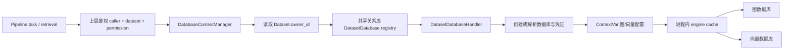

# 持久化与租户隔离：从 task 输出到可恢复的云服务

管道输出的是图节点、边和向量，业务需要的却是“同一租户在任意实例都能继续读写的一份记忆”。Cognee 以 adapter 隔离存储产品差异，以 dataset registry 路由物理存储；这是保留 memory API 和 task pipeline 而替换部署形态的主要接缝，但可接远端数据库不等于已具备完整集群一致性。

## 1. 已核实的默认形态和身份语义

**代码事实**：默认 graph 是 Ladybug、默认 vector 是 LanceDB、默认 relational 是 SQLite、默认会话 cache 也是 SQLite，而不是 Redis。依据 `cognee/infrastructure/databases/graph/config.py:47-62`、`vector/config.py:28-37`、`relational/config.py:16-30`、`cache/config.py:51-67`。图/向量默认启用 subprocess 是本机进程隔离，不是远端执行节点。

**代码事实**：`cognee/context_global_variables.py:238-265` 首先可选地验证 caller 的 permission，然后查询 dataset 的真实 owner，将 owner 传给 provisioning。`DatasetDatabase.dataset_id` 是主键，owner 和获授权用户共用同一条 registry 记录，不是每个访问者各生成一套库（`cognee/modules/users/models/DatasetDatabase.py:11-23`；`utils/get_or_create_dataset_database.py:42-65`）。图的本地路径为 `{system_root}/databases/{owner.id}/{dataset_db_name}`；原始数据根目录使用 `owner.tenant_id or owner.id`（`context_global_variables.py:267-305`）。因此应称“dataset 隔离、owner 命名空间”，不能把它泛化成企业租户已经具有独立安全域。

**代码事实**：ContextVar 是调用链内的隐式路由；`permission_type` 不传时，context 层不检查 ACL，依赖上层已授权。graph/vector/file-storage 配置还故意在 `async with` 退出后保留，只有 dataset id、LLM/embedding overrides 被恢复（`context_global_variables.py:341-348,380-393,450-453`）。

**推断**：HTTP 请求各自 task 可隔离通常上下文，但长生命周期 worker 连续执行 job 时必须每次显式绑定已授权 dataset；不能把 ContextVar 当跨进程租户传播协议，也不能允许 task payload 直接指定底层库路径。

## 2. 支持矩阵要区分三种能力

| 后端/handler | 网络连接/部署形态 | 当前 dataset 隔离 | 对云上集群的判断 |
|---|---|---|---|
| Ladybug/Kuzu | 本地嵌入式，默认子进程 | owner 路径下 dataset 文件 | 适合单实例或有明确单写归属的分片 worker；共享盘不自动变多写数据库 |
| LanceDB / lancedb | adapter 与 handler 分开；默认 handler 构造 system root 下路径 | owner 路径下 dataset 目录 | 须单独核验对象存储并发协议；不可把 S3 raw storage 配置当作图/向量已分布式 |
| PGVector / pgvector | 远端 PostgreSQL | 每 dataset 独立 database | 已有服务器数据面，但 database 数量和 per-process/per-dataset 池要预算 |
| PGVector / pgvector_shared | 关系 PostgreSQL 所在单库 | 每 dataset `ds_<uuid>` schema | 已有可复用实现；search_path 隔离并不自动建立独立数据库角色或 RLS |
| Postgres graph / postgres_graph | 远端 PostgreSQL，adapter 名称仍为 postgres_demo | 每 dataset database | 需评估图遍历性能和语义，不应只因统一PG运维简单就判等价Neo4j |
| Postgres graph / postgres_graph_shared | 同关系PG数据库 | 每 dataset schema | 已有实现；graph/vector 的独立 engine 不因同库而自动共用事务 |
| Neo4j / neo4j | self-hosted DBMS | CREATE DATABASE per dataset | 需要服务器允许 CREATE/DROP DATABASE；不能把任意 Aura URL 视为即插即用 |
| Neo4j / neo4j_aura_dev | 调用 Aura 管理 REST API | 每 dataset 一台 Aura instance | 明确 PoC，固定规格/区域、凭证治理和幂等 provisioning 待改造 |
| Neo4j / neo4j_community | 本机可达 Docker daemon | 每 dataset 一个 container + volume | 本机调度控制器，非 Kubernetes 集群调度实现 |
| Turso graph/vector handlers | 当前均构造本地 libSQL 文件 | 每 dataset 文件 | provider 能连接远端与 handler 实际创建远端是两个命题；不能直接作为托管Turso多租户方案 |

矩阵入口证据：`dataset_database_handler/supported_dataset_database_handlers.py:37-85`。PG handlers：`vector/pgvector/PGVectorDatasetDatabaseHandler.py:24-64`、`PGVectorSharedDatasetDatabaseHandler.py:38-86`、`graph/postgres_demo/PostgresGraphSharedDatasetDatabaseHandler.py:33-99`。默认本地路径：`graph/ladybug/LadybugDatasetDatabaseHandler.py:35-54`、`vector/lancedb/LanceDBDatasetDatabaseHandler.py:19-42`。Turso：`graph/turso/TursoGraphDatasetDatabaseHandler.py:30-62`、`vector/turso/TursoVectorDatasetDatabaseHandler.py:24-47`。

Neo4j 普通 handler 使用全局配置里的凭证连接所有 dataset 数据库，代码没有为每 dataset 创建 USER/ROLE（`graph/neo4j_driver/Neo4jDatasetDatabaseHandler.py:75-95,146-158,321-328`）。Aura dev handler 调用 `POST /v1/instances`，固定 Neo4j 5、GCP、europe-west1、1GB、professional-db；密码加密密钥有 `test_key` 默认值，registry 还持久化 access token（`Neo4jAuraDevDatasetDatabaseHandler.py:17-28,52-106,130-142`）。这不是可直接开放给付费租户的 provisioning 服务。

## 3. 首次建库：已有跨进程保护，但不是完整资源事务

**代码事实**：`utils/get_or_create_dataset_database.py:99-105` 先查 registry，缺失时依次创建 graph、vector，最后才 insert registry；重复 insert 用主键和 IntegrityError 回查收敛（:135-154）。PostgreSQL helper 已有真实跨进程 advisory lock：database 创建使用 session advisory lock + AUTOCOMMIT，schema 创建使用 transaction advisory lock（`postgres/admin.py:22-34,156-170,200-240`）。不能错误断言“所有建库只有 asyncio 锁”。

**推断**：registry 并发 insert 收敛只保证一条记录，不能回滚前面已创建的外部资源。图建好但向量失败可能留下未登记资源。尤其 Aura create 每次 POST 新 instance、没有幂等键，两个首访可能多开收费资源，而后续 registry 冲突逻辑假设所有 handler 的名称确定性指向同一物理数据库（`get_or_create_dataset_database.py:145-148`）；这个假设对 Aura dev 不成立。

**建议**：保留 handler 接口与 registry，新增 provisioning 状态机：先以唯一 dataset id 登记 `creating`，持有跨实例 lease/fencing token，创建每个资源后记录资源id，全部就绪后 `ready`；失败写 `failed` 并由 reconciler 重试或回收孤儿。操作凭证与租户数据面凭证分离；云端 secret manager 存 secret reference。创建和删除资源不是一次关系库事务可以覆盖的问题。

## 4. 会话是产品数据，不应只按“可丢失缓存”治理

**代码事实**：会话保存 question/context/answer、反馈、命中的图元素ID、memify 元数据等，直接支撑 recall 和自调优（`cache/redis/RedisAdapter.py:109-133`，SQL实现 `cache/sql/SqlCacheAdapter.py:334-358`）。Redis 的 key 是 `agent_sessions:{user_id}:{session_id}`，trace/context 类似；SQL以 user_id + session_id 过滤（`RedisAdapter.py:93-106`、`SqlCacheAdapter.py:231-233`）。默认7天 TTL 会改变可召回历史，这是产品保留策略，不只是性能开关。

**代码事实**：当前 RedisAdapter 使用真实 redis-py 的同步/异步 client，启动 ping 失败会报错，未发现此实现回落 fakeredis（`RedisAdapter.py:24-91`）。fs 是 diskcache，目录来自 storage data root（`fscache/FsCacheAdapter.py:25-36`）；SQL默认 `{relational_db_path}/cache.db`，`CACHE_BACKEND=postgres` 可显式 URL 或复用关系数据库配置（`cache/get_cache_engine.py:15-58`）。因此云上会话可直接选共享Postgres或真实Redis，不必从零写adapter，但必须明确持久性、备份、TTL和并发合同。

**并发区别**：SQL Postgres 对每个 (table,user,session) 写事务持 advisory lock，更新还 `FOR UPDATE` 并死锁重试；Redis append 是 RPUSH，但更新为 load-list → LSET，删除为 load-list → DEL → 多次 RPUSH，没有 Lua/事务/CAS（`SqlCacheAdapter.py:235-252,625-659`；`RedisAdapter.py:161-179,387-405,444-458`）。推断：Redis两实例并发删除/追加同一session可能丢掉新追加数据，单命令原子不代表整个会话修改原子。商用需加 session revision + CAS/Lua，或先采用已具事务语义的SQL缓存并完成并发验收。

**已确认的跨用户删除风险**：`SqlCacheAdapter.prune()` 不按 user 过滤，清空全部五张 Cognee cache 表（`SqlCacheAdapter.py:1196-1211`）；`RedisAdapter.prune()` 执行 FLUSHDB（`:681-686`），还会清除同一Redis DB内其它应用数据与协调锁；FS调用 cache.clear（`FsCacheAdapter.py:544-551`）。如果用户级 `forget(everything=True)` 分支调用这些方法，则用户操作升级为全局数据面清理。触发入口由输入模块交叉确认，缓存层本身已证实。建议把 `delete_user_sessions(user_id)` / `delete_tenant_sessions(tenant_id)` 与仅运维可达的全局 prune 分离；提供两个用户、两个会话、一个通用KV的隔离删除回归。

SQL cache 的 first-use create_all 只有进程内 asyncio.Lock（`SqlCacheAdapter.py:187-205`）；跨实例首次初始化应统一迁移 Job 或加数据库DDL锁，不能因日常写入已有 advisory lock 就假设初始化也受保护。

## 5. 可共享后端仍有容量边界

**代码事实**：Postgres graph adapter 顶部明确标注 DEMO、not production-ready（`graph/postgres_demo/adapter.py:1-9`），不支持 raw Cypher（`:324-329`）；图以 graph_node/graph_edge 存储，邻域扩展是应用层逐跳 SQL BFS（`:907-953`），部分过滤/指标会全表读入Python（`:816-847,879-905`）。默认把它当演示/待验收选项，比承诺它是完整云图引擎更准确。

**已发现的扩容瓶颈**：所有图写事务使用固定 advisory lock key=5522063（`:104-116`）。在 database-per-dataset 模式，每库锁域分离；在 postgres_graph_shared 中所有dataset处于同一库，便竞争同一锁，跨租户写被串行化。建议至少将锁 key 纳入 schema/dataset，继而按冲突对象有序加锁并测死锁/吞吐，保留独立库隔离作为高价值租户的选项。

**连接数不是Pod数**：PGVector shared 为固定 search_path 专门创建 engine；图 shared 也每 dataset 创建 engine（`vector/pgvector/PGVectorAdapter.py:81-87,134-150`，`graph/postgres_demo/adapter.py:184-190,241-252`）。两者常见默认每pool保留2连接、overflow20，关系数据库默认5+35（`PGVectorAdapter.py:36-40`、`adapter.py:175-180`、`relational/sqlalchemy/SqlAlchemyAdapter.py:139-157`）。容量上界应按 `副本数 × 每副本缓存/活跃dataset数 × 各adapter pool ceiling + control/cache/migration连接` 预算；overflow是按需分配上界，不应误写成启动即分配全部连接。

**建议**：shared schema解决数据库数量与命名空间，并未合并各dataset连接池。引入集中连接预算、小连接池和限流，若用PgBouncer transaction pooling需核验 search_path、prepared statements、session advisory锁兼容性；不要在尚未验证的情况下把所有流量直接改成transaction pooling。DDL provisioning可以沿用direct admin endpoint，数据面另设受限账户。

## 6. 企业租户与请求身份还需要收口

User 继承 Principal，UserTenant 提供多对多成员，User.tenant_id 是“当前选中租户”；Dataset同时有owner_id/tenant_id；ACL将principal、permission、dataset关联（`modules/users/models/User.py:15-42`、`UserTenant.py:8-14`、`ACL.py:16-22`、`modules/data/models/Dataset.py:19-20`）。`select_tenant` 查询成员资格后将 User.tenant_id 更新提交；`add_user_to_tenant` 要求操作者是tenant owner（`modules/users/tenants/methods/select_tenant.py:48-64`、`add_user_to_tenant.py:49-66`）。已有权限模型应复用，不宜从头替换。

**推断**：活动租户存于共享 User 行而不是请求不可变属性，同一用户两个并发浏览器/服务请求切换不同组织时会互相影响。`get_all_user_permission_datasets.py:21-46` 聚合 user/tenant/role授权后，再以 dataset.tenant_id == user.tenant_id 过滤；会话key却只有user+session，没有tenant。云服务应把tenant_id作为验证后的请求/job/session必要字段，用成员资格与dataset归属双重校验；“切换租户”成为客户端选择，不再修改所有请求共用的用户状态。原始数据目录也不应在未来根据owner当前活动tenant动态重算，需固化dataset storage locator（`context_global_variables.py:267-270`）。

认证默认并非全开放：`modules/users/methods/get_authenticated_user.py:39-60` 默认访问控制开启时强制认证。多实例仍必须统一JWT等secret：`modules/users/authentication/get_auth_secret.py:25-53` 没有环境值时每进程随机生成，跨Pod验证会失败。部署时显式同源注入 `FASTAPI_USERS_JWT_SECRET`、`FASTAPI_USERS_RESET_PASSWORD_TOKEN_SECRET`、`FASTAPI_USERS_VERIFICATION_TOKEN_SECRET`，不要用sticky session掩盖配置不一致。

## 7. 两种持久化不应混同：对象存储快照与在线数据库

**代码事实**：SQLAlchemy SQLite adapter遇到S3路径时下载到临时文件，push把整个文件上传；Ladybug亦下载临时文件、CHECKPOINT后上传整个文件（`relational/sqlalchemy/SqlAlchemyAdapter.py:76-90,170-184`；`graph/ladybug/adapter.py:465-477,573-590`）。这说明“文件能放S3”，没有证明共享事务和跨实例写串行。若多个进程基于同一个快照分别修改上传，推断会有后写覆盖或陈旧读风险；单写者与版本化对象manifest/fencing才能使这类路线成立。主流云改造基线应让原始文件进对象存储，而control metadata/session/vector/graph走可远端共享数据库，按各自协议保证一致性。

LanceDB接收URL并调用 `lancedb.connect_async(self.url, api_key=self.api_key)`（`vector/lancedb/LanceDBAdapter.py:291`），底层对对象存储的能力还取决于库版本和部署，不能从此一行推断已有Cognee级跨库提交协议。Turso graph更明确：配置graph key直接报“Remote Turso ... not supported yet”（`graph/get_graph_engine.py:534-554`）；关系Turso的本地replica同步路线是另一个实现（`relational/create_relational_engine.py:75-99`）。

## 8. 跨库恢复的正确扩展方式

**代码事实**：DataPoint定义存储合同：嵌套DataPoint变边、scalar变属性，index_fields决定向量collection；identity_fields派生稳定uuid5，没有identity_fields默认uuid4（`infrastructure/engine/models/DataPoint.py:28-64,94-106`）。因此“重试即可幂等”只对有稳定ID并遵守upsert语义的数据成立，自定义节点不能默认享受。PGVector写入包含embedding外部调用，再分批upsert并commit（`vector/pgvector/PGVectorAdapter.py:375-385,432-483`）；向量检索做query embedding后cosine distance排序，仍经dataset绑定的engine（`:633-709`）。

**代码事实**：UnifiedStoreEngine是门面，不是分布式事务；当前HYBRID_PROVIDERS和UNIFIED_PROVIDERS均为空，常规工厂分别获取图与向量engine（`unified/get_unified_engine.py:9-13,96-103`）。已有provenance删除planner按“先删向量、再更新幸存引用、最后删无主图节点/边”的顺序使失败可重试，保留无主对象的引用直至hard-delete成功（`unified/provenance_delete_planner.py:95-160`）。末端edge-type与nodeset cleanup则为best-effort且吞异常（`:201-260`）。这是有价值的补偿基础，应保留并纳入持久任务重放，而不是误称当前完全没有补偿。

**建议**：增加持久化operation/run ledger，记录目标revision、graph/vector完成状态和待补偿步骤；可接受至少一次投递，但以稳定ID、版本条件写、generation/readiness gate确保效果收敛。允许部分结果可见还是等全部ready后发布应成为产品合同。若选择图/向量同PG且要求原子可见，必须真正统一一个数据库事务/UoW，不能仅把两条URL填成相同就认为原子成立。

理论依据与代码判断是两层：Postgres advisory locks由应用合作使用，session锁与transaction锁释放时机不同，支持上述跨进程建库/会话锁分析（[PostgreSQL explicit locking](https://www.postgresql.org/docs/current/explicit-locking.html)）；schema和search_path负责名称解析，权限仍需角色授权，故search_path不等于强安全边界（[PostgreSQL schemas](https://www.postgresql.org/docs/current/ddl-schemas.html)）；Redis需要MULTI/EXEC、WATCH或脚本才能把多步并发更新组织成原子操作，而单次RPUSH无法保护读改写链（[Redis transactions](https://redis.io/docs/latest/develop/using-commands/transactions/)）。外部资料按2026-09-23查阅；应以目标云产品实际版本再做验收。

## 9. 可复用接口与可验收改造边界

| 接缝 | 复用 | 必须补充的合同/验证 |
|---|---|---|
| DatasetDatabase + DatasetDatabaseHandler | registry、provider插件、schema/database命名 | durable provisioning状态机、资源幂等键、失败回收、秘密引用 |
| DatabaseContextManager | owner解析、dataset配置绑定 | 不可变tenant/request/job envelope、入口必检ACL、worker逐job重绑 |
| PGVector shared handler | 同库按schema隔离 | 池预算、DDL迁移互斥、受限账户、同dataset多进程upsert测试 |
| CacheDBInterface + SqlCacheAdapter | PostgreSQL会话和日志、事务锁、TTL | tenant scope、用户级delete替代prune、备份与retention、并发session验收 |
| UnifiedStoreEngine/provenance planner | 双存储能力门面、可重试补偿 | operation ledger、readiness/generation、断点恢复/重放 |
| Engine cache/handles | 本进程复用、evict重建 | 不能承担集群协调；删除/迁移广播或配置generation使其它进程失效 |

建议持久化专项验收包括：两Pod同时首次建同dataset仅产生一份资源；在图成功/向量失败/registry失败各处中断后可恢复；两个用户forget只清各自会话；两个租户同user并发访问不串上下文；连接数在dataset数增长时受预算约束；删除后另一个Pod旧engine不会复活旧数据；模型维度变更要显式迁移而不是静默重用旧向量。

这些存储改造为任务执行层提供“可重放、有归属、有明确可见性”的结果，集群化工作的下一步才是将worker生命周期、队列交付和任务状态与该合同对齐。

## 覆盖明细与分析边界（草稿审计用）

这是围绕云持久化链选定文件的阅读覆盖，不是 infrastructure/databases 或 users 全目录覆盖。全部工作为静态只读分析；未启动真实多 Pod、多库压力测试。核心选定文件目标 90%，次要目标 60%；补充抽查明确单列，低于 30% 按 Skill 规则覆盖分子记 0。部分批量输出曾截断，关键中段已另行补读；范围按实际请求的行并集计，搜索命中不记覆盖。

| 文件 | 层级 | 总行 | 实际读取范围 | 已读计数 | 覆盖 | 未读原因 |
|---|---|---:|---|---:|---:|---|
| `cognee/context_global_variables.py` | 核心选定 | 459 | 1-459 | 459 | 100% | 全文 |
| `cognee/infrastructure/databases/dataset_database_handler/supported_dataset_database_handlers.py` | 核心选定 | 85 | 1-85 | 85 | 100% | 全文 |
| `cognee/infrastructure/databases/utils/get_or_create_dataset_database.py` | 核心选定 | 154 | 1-154 | 154 | 100% | 全文 |
| `cognee/infrastructure/databases/utils/resolve_dataset_database_connection_info.py` | 核心选定 | 30 | 1-30 | 30 | 100% | 全文 |
| `cognee/infrastructure/databases/graph/get_graph_engine.py` | 核心选定 | 592 | 1-592 | 592 | 100% | 全文 |
| `cognee/infrastructure/databases/vector/get_vector_engine.py` | 核心选定 | 138 | 1-138 | 138 | 100% | 全文 |
| `cognee/infrastructure/databases/vector/create_vector_engine.py` | 核心选定 | 336 | 1-336 | 336 | 100% | 全文 |
| `cognee/infrastructure/databases/graph/config.py` | 核心选定 | 207 | 1-207 | 207 | 100% | 全文 |
| `cognee/infrastructure/databases/vector/config.py` | 核心选定 | 143 | 1-143 | 143 | 100% | 全文 |
| `cognee/infrastructure/databases/relational/config.py` | 核心选定 | 174 | 1-174 | 174 | 100% | 全文 |
| `cognee/infrastructure/databases/relational/create_relational_engine.py` | 核心选定 | 108 | 1-108 | 108 | 100% | 全文 |
| `cognee/infrastructure/databases/cache/config.py` | 核心选定 | 117 | 1-117 | 117 | 100% | 全文 |
| `cognee/infrastructure/databases/cache/get_cache_engine.py` | 核心选定 | 219 | 1-219 | 219 | 100% | 全文 |
| `cognee/infrastructure/databases/postgres/admin.py` | 核心选定 | 278 | 1-278 | 278 | 100% | 全文 |
| `cognee/infrastructure/databases/graph/ladybug/LadybugDatasetDatabaseHandler.py` | 核心选定 | 86 | 1-86 | 86 | 100% | 全文 |
| `cognee/infrastructure/databases/vector/lancedb/LanceDBDatasetDatabaseHandler.py` | 核心选定 | 60 | 1-60 | 60 | 100% | 全文 |
| `cognee/infrastructure/databases/vector/pgvector/PGVectorDatasetDatabaseHandler.py` | 核心选定 | 101 | 1-101 | 101 | 100% | 全文 |
| `cognee/infrastructure/databases/vector/pgvector/PGVectorSharedDatasetDatabaseHandler.py` | 核心选定 | 118 | 1-118 | 118 | 100% | 全文 |
| `cognee/infrastructure/databases/graph/postgres_demo/PostgresGraphDatasetDatabaseHandler.py` | 核心选定 | 102 | 1-102 | 102 | 100% | 全文 |
| `cognee/infrastructure/databases/graph/postgres_demo/PostgresGraphSharedDatasetDatabaseHandler.py` | 核心选定 | 133 | 1-133 | 133 | 100% | 全文 |
| `cognee/infrastructure/databases/graph/neo4j_driver/Neo4jDatasetDatabaseHandler.py` | 核心选定 | 383 | 1-383 | 383 | 100% | 全文 |
| `cognee/infrastructure/databases/graph/neo4j_driver/Neo4jAuraDevDatasetDatabaseHandler.py` | 核心选定 | 206 | 1-206 | 206 | 100% | 全文 |
| `cognee/infrastructure/databases/graph/neo4j_driver/Neo4jCommunityDatasetDatabaseHandler.py` | 核心选定 | 194 | 1-194 | 194 | 100% | 全文 |
| `cognee/infrastructure/databases/graph/turso/TursoGraphDatasetDatabaseHandler.py` | 核心选定 | 100 | 1-100 | 100 | 100% | 全文 |
| `cognee/infrastructure/databases/vector/turso/TursoVectorDatasetDatabaseHandler.py` | 核心选定 | 66 | 1-66 | 66 | 100% | 全文 |
| `cognee/infrastructure/databases/unified/get_unified_engine.py` | 核心选定 | 103 | 1-103 | 103 | 100% | 全文 |
| `cognee/infrastructure/databases/unified/unified_store_engine.py` | 核心选定 | 264 | 1-264 | 264 | 100% | 全文 |
| `cognee/infrastructure/databases/unified/provenance_delete_planner.py` | 核心选定 | 260 | 1-260 | 260 | 100% | 全文 |
| `cognee/infrastructure/engine/models/DataPoint.py` | 核心选定 | 387 | 1-387 | 387 | 100% | 全文 |
| `cognee/modules/users/models/DatasetDatabase.py` | 核心选定 | 52 | 1-52 | 52 | 100% | 全文 |
| `cognee/modules/users/models/User.py` | 核心选定 | 61 | 1-61 | 61 | 100% | 全文 |
| `cognee/modules/users/models/Tenant.py` | 核心选定 | 32 | 1-32 | 32 | 100% | 全文 |
| `cognee/modules/users/models/UserTenant.py` | 核心选定 | 14 | 1-14 | 14 | 100% | 全文 |
| `cognee/modules/users/models/ACL.py` | 核心选定 | 22 | 1-22 | 22 | 100% | 全文 |
| `cognee/modules/data/models/Dataset.py` | 核心选定 | 49 | 1-49 | 49 | 100% | 全文 |
| `cognee/modules/users/tenants/methods/select_tenant.py` | 核心选定 | 65 | 1-65 | 65 | 100% | 全文 |
| `cognee/modules/users/tenants/methods/create_tenant.py` | 核心选定 | 57 | 1-57 | 57 | 100% | 全文 |
| `cognee/modules/users/tenants/methods/add_user_to_tenant.py` | 核心选定 | 69 | 1-69 | 69 | 100% | 全文 |
| `cognee/modules/users/methods/get_authenticated_user.py` | 核心选定 | 111 | 1-111 | 111 | 100% | 全文 |
| `cognee/modules/users/permissions/methods/get_all_user_permission_datasets.py` | 核心选定 | 48 | 1-48 | 48 | 100% | 全文 |
| `cognee/modules/users/permissions/methods/get_specific_user_permission_datasets.py` | 核心选定 | 53 | 1-53 | 53 | 100% | 全文 |
| `cognee/modules/users/permissions/methods/get_permitted_dataset_ids.py` | 核心选定 | 14 | 1-14 | 14 | 100% | 全文 |
| `cognee/modules/users/get_fastapi_users.py` | 核心选定 | 23 | 1-23 | 23 | 100% | 全文 |
| `cognee/modules/users/authentication/get_auth_secret.py` | 核心选定 | 74 | 1-74 | 74 | 100% | 全文 |
| `cognee/modules/users/authentication/get_api_auth_backend.py` | 核心选定 | 30 | 1-30 | 30 | 100% | 全文 |
| `cognee/modules/users/authentication/get_client_auth_backend.py` | 核心选定 | 32 | 1-32 | 32 | 100% | 全文 |
| `cognee/modules/users/authentication/get_api_key_backend.py` | 核心选定 | 22 | 1-22 | 22 | 100% | 全文 |
| `cognee/infrastructure/databases/cache/sql/SqlCacheAdapter.py` | 次要选定 | 1229 | 1-775, 1190-1228 | 814 | 66.2% | trace/context/usage/KV 部分实现未展开；核心 QA、初始化、锁和 prune 已读 |
| `cognee/infrastructure/databases/cache/redis/RedisAdapter.py` | 次要选定 | 760 | 1-730 | 730 | 96.1% | 最后 usage 读取和 close 未展开 |
| `cognee/infrastructure/databases/vector/pgvector/PGVectorAdapter.py` | 次要选定 | 925 | 1-490, 633-741 | 599 | 64.8% | 其余 payload、批查、删标签、迁移未展开 |
| `cognee/infrastructure/databases/graph/postgres_demo/adapter.py` | 次要选定 | 1491 | 1-955 | 955 | 64.1% | 剩余 provenance、metadata 细节未逐行读；已读独立 planner 对接实现 |
| `cognee/infrastructure/databases/relational/sqlalchemy/SqlAlchemyAdapter.py` | 补充抽查 | 902 | 1-300 | 300 | 33.3% | 只核实连接池、SQLite/S3 和 session 生命周期，未达 60% |
| `cognee/infrastructure/databases/graph/ladybug/adapter.py` | 补充抽查 | 3955 | 410-500, 565-615 | 0 | 0.0% | 只核实 S3 快照路径，不纳入覆盖分子 |
| `cognee/infrastructure/databases/vector/lancedb/LanceDBAdapter.py` | 补充抽查 | 1600 | 95-310 | 0 | 0.0% | 只核实连接、子进程生命周期，不纳入覆盖分子 |
| `cognee/infrastructure/databases/cache/fscache/FsCacheAdapter.py` | 补充抽查 | 582 | 1-54, 535-557 | 0 | 0.0% | 只核实 diskcache 定位和 prune，不纳入覆盖分子 |

核心选定合计：47 文件，6431/6431 行，100%，达到 90% 目标。次要选定合计：4 文件，3098/4405 行，70.3%，达到 60% 目标。补充抽查不宣称达标；尤其 Ladybug、LanceDB、SQLAlchemy 全 adapter 没有完成全量深读。
未纳入完整覆盖：closing_lru_cache 内部实现、全部 graph/vector provider CRUD、Turso relational sync 实现、社区 adapter、所有租户删除、角色管理、API key 底层实现和 session lifecycle 全目录。已通过 factory、handler、context 证据回答当前改造路线，不能据此声称这些未读区域无缺陷。
