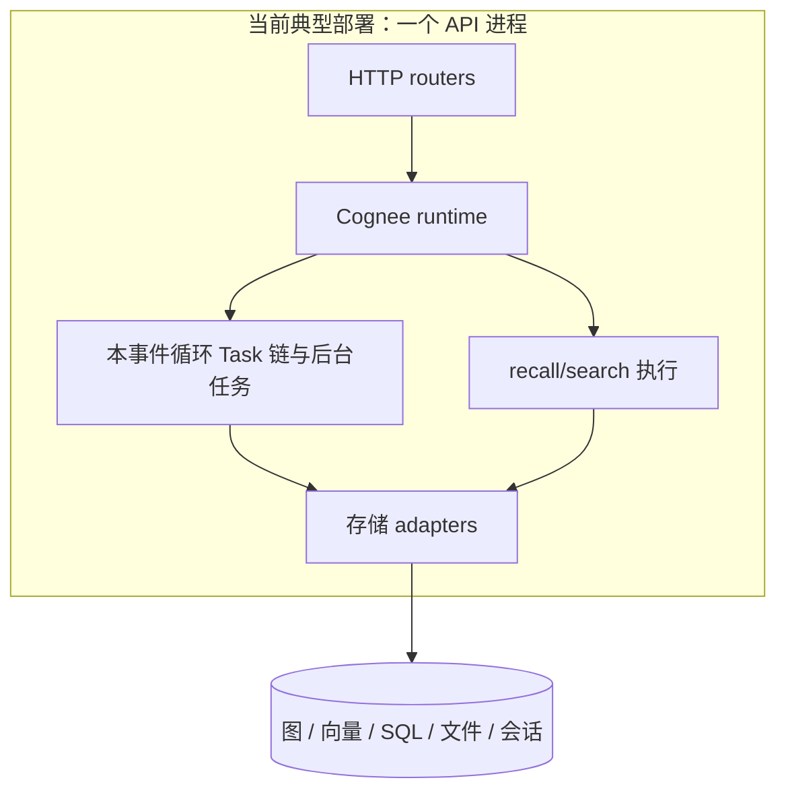
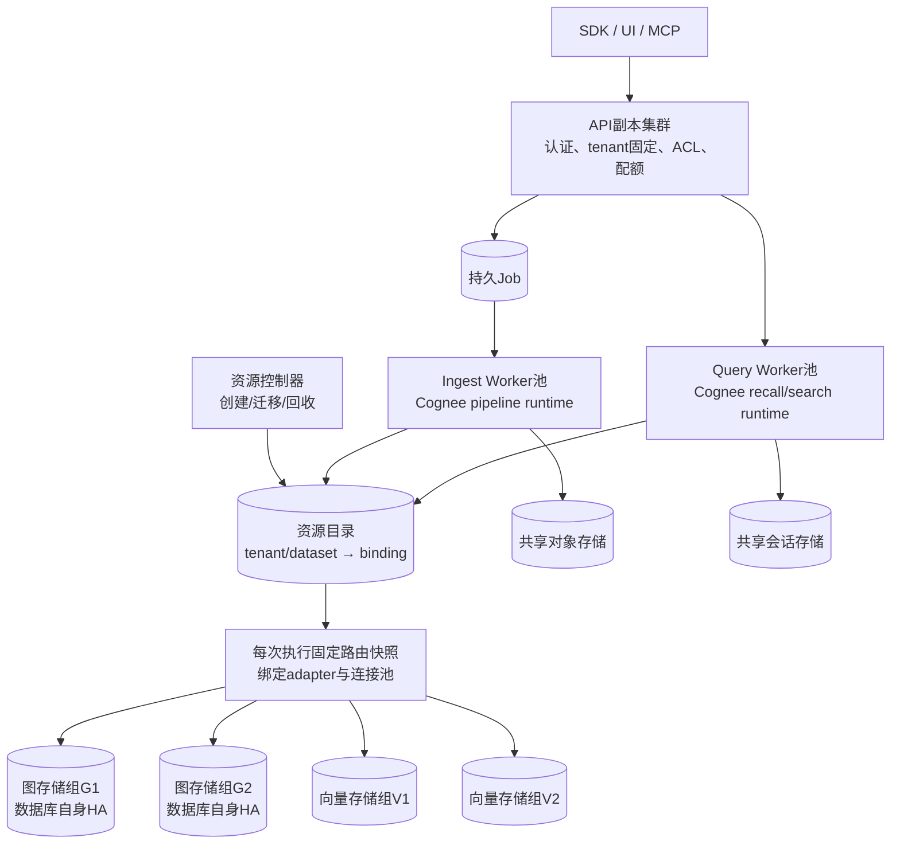

# 集群组件、运行时与数据分片

本文是目标拓扑设计，复用已审阅代码。**Cognee 是嵌入进服务进程的业务运行时，数据库是它连接的下层服务；扩展 Cognee 副本不等于扩展数据库集群。**

## 1. 先把三种“集群”分开

| 层次 | 扩展的对象 | 谁负责决定数据去哪里 |
|---|---|---|
| 应用副本集群 | API、导入worker、查询worker的进程/Pod | 接入路由、作业调度；副本通过资源目录连接数据 |
| 按dataset分片 | 把完整dataset分配给某个图/向量存储组 | 平台资源目录；不同dataset可分配到不同组 |
| 数据库内部集群 | 一个存储组内部的副本、HA、读扩展、内部分片 | 数据库自身；Cognee只使用其受支持的服务入口 |

增加worker不增加数据库写分片。把不同dataset放不同存储组是应用分片；把一个dataset拆到多个组再跨图遍历，首版不承诺。

当前runner对dataset分别推进，并在每个run内部并发处理item（`cognee/modules/pipelines/operations/pipeline.py:96-112`、`run_tasks.py:182-215`），因此“整个dataset作为放置/写入所有权边界”与代码形态最吻合。业务锁只在进程内生效（`cognee/infrastructure/locks/dataset_lock.py:18-20`）。

## 2. Cognee runtime 放在哪里

当前后台运行通过 `asyncio.create_task` 留在同一事件循环（`pipeline_execution_mode.py:93-127`），不是独立导入服务。直接复制容器只会复制运行时、锁和连接池。

部署分两步：

| 组件 | 第一阶段：最少部署单元 | 需要独立扩容时 |
|---|---|---|
| 公共API | API进程处理认证、上传、Job提交与状态查询，并内嵌查询runtime | API保留协议入口，把查询发送到Query Worker |
| Ingest Worker | 独立进程/Deployment，内嵌Cognee库，消费导入/构建/维护作业 | 按CPU/GPU、租户等级、存储组划worker池 |
| Query Worker | 暂与API合并，调用Cognee recall/search | 独立Deployment，内嵌同版本Cognee库，按读延迟扩容 |
| 控制任务 | 迁移、资源开通、回收/修复独立入口 | 单独控制器或受控Job，避免每个数据请求负责建库 |

“内嵌”指进程直接调用现有Python库。导入worker复用dataset-aware `operations/pipeline.py:53-167`，保留Task链；不要误用直接调用 `run_tasks_base`、缺少dataset生命周期的轻量入口（`operations/run_pipeline.py:77-100`）。

查询服务也不能默认视为纯只读：会话追加、自动反馈及后续improve仍有写入。会话写入走共享会话服务，图维护提交到导入/维护worker并遵守统一dataset写入规则。服务拆分不应通过关闭CACHING来删除产品记忆语义。

## 3. 上层管业务身份，下层管存储隔离

runtime在作业/查询开始时解析一次目录，固定binding；缓存按route revision失效。图与向量可分配到不同存储组。

已有接点可复用：`DatasetDatabase.dataset_id`为主键，dataset owner和被授权用户共用该条资源记录（`cognee/modules/users/models/DatasetDatabase.py:11-23`）。`context_global_variables.py:238-305` 解析真实owner与数据库/文件配置，是增加路由快照的自然位置；当前ContextVar作用域并不完整恢复graph/vector配置（`:380-393`），云端应改为显式绑定对象或完整的作用域恢复，避免残留配置成为下一次调用的路由。

多租户不是只在最下面加一个数据库：上层验证不可变tenant及dataset权限；runtime携带已验证身份和binding；adapter只使用binding指定的资源；数据库账号/IAM进一步限制访问范围。图schema或database隔离解决数据命名空间，不会自动给共用的管理员凭证增加租户权限隔离。

## 4. 最小资源目录应长什么样

建议分离资源创建与解析，扩展DatasetDatabase为以下逻辑记录：

| 记录 | 最小信息 | 用途 |
|---|---|---|
| DatasetPlacement | dataset_id、固定tenant_id、模式、state、route_revision、当前binding_id | 全局逻辑dataset到物理资源的唯一入口；ACL另行验证 |
| DatasetBinding | graph_resource_id+数据库/schema、vector_resource_id+数据库/schema/collection、object prefix、generation | 一份可同时绑定图与向量的路由快照 |
| Resource | resource_id、provider、region、服务endpoint、能力、credential_ref+版本 | 区分数据库存储组、后端类型和凭证；不在消息里传密码 |
| PlacementTransition | 原/目标binding、迁移状态、写入epoch、切换版本 | 防止迁移时旧写者继续修改新版本；保留回退与回收依据 |

解析链为：

`已验证tenant + logical dataset_id → 授权校验 → DatasetPlacement → 固定DatasetBinding → Resource → adapter/pool`。

原件位置固定在binding/文档manifest内，不能按owner当前活动tenant重算。当前路径存在这一依赖（`context_global_variables.py:267-305`）。

**pool key 与 dataset_id 不是同一个东西。** 至少区分provider、资源endpoint、database、namespace绑定方式、数据面角色、凭证版本及必要的TLS选项；固定search_path的pool key须含schema；generation若是查询参数则须强制绑定，不必每generation建pool。

当前PGVector与PG图shared虽然同处一个Postgres库，仍为不同dataset创建各自engine/连接池（`PGVectorAdapter.py:81-87,134-150`；`graph/postgres_demo/adapter.py:184-190,241-252`，前者位于`cognee/infrastructure/databases/vector/pgvector/`）。一个PG服务不等于每Pod只有一个pool。

## 5. 两种商业部署模式及不可混用边界

| 模式 | 计算 | 数据面 | 适用与边界 |
|---|---|---|---|
| 共享计算 + dataset隔离 | 公共API、查询池、导入池服务多个租户 | 每dataset独立database/schema/generation，可落在不同存储组 | 利用率高；必须完成请求身份固定、路由隔离、配额、全局写入所有权；共享进程不构成强隔离边界 |
| tenant专属实例 | 一个租户独享runtime服务/worker配额或独立部署单元 | 独立数据库/账号/对象前缀；需要更强隔离时独立数据库实例与网络边界 | 成本高但边界清晰；内部仍可有多个dataset，若用嵌入式库仍须单写owner，不能任意多副本共享文件 |

两种模式可共享控制面，以Placement.mode选择数据面。专属Pod配共享管理员账号不构成专属数据安全域；共享worker分目录不构成计算隔离。承诺专属计算时，查询和导入都须路由到专属池。

迁移需冻结/隔离旧写者、验证搬迁数据、原子切换route revision、待旧读者退出后回收。跨dataset查询分别授权与绑定后聚合；不承诺跨分片图遍历或全局事务。

首版：API内嵌查询 + 独立导入worker + 共享目录与网络存储，之后再拆Query Worker。
