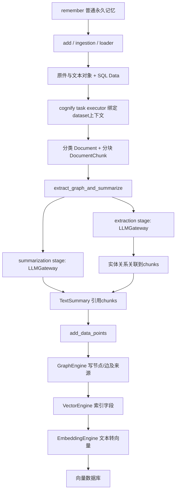
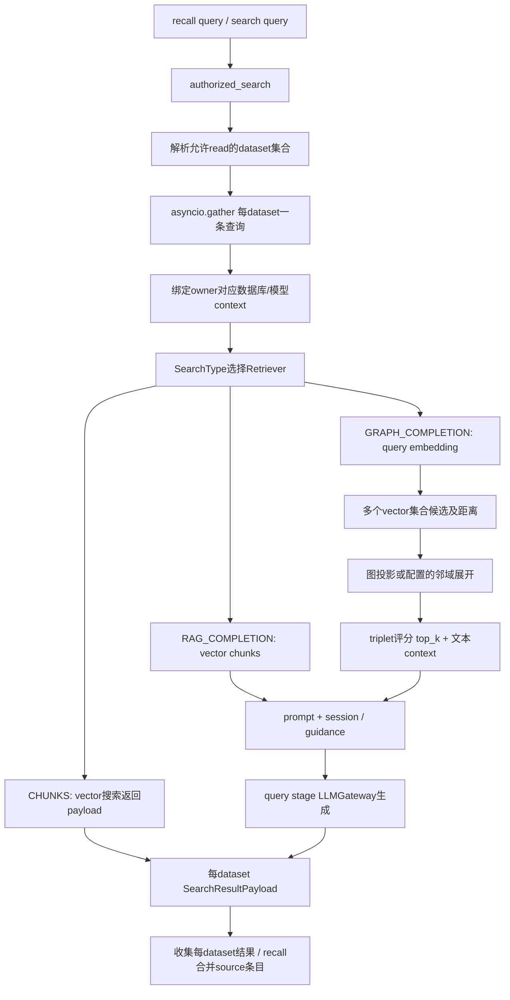

# 上层引擎与读写双链路：逻辑组件、输入输出和模型上下文

本章补齐查询引擎与模型处理层，复用 06 章的原件/文本/SQL 持久化事实。均为当前工作树代码阅读，不代表云环境验证通过。下面的“引擎”“模块”首先是 **SDK/API/worker 进程内的 Python 逻辑对象或函数**，不是项目已经拆出的独立部署服务；模型调用可能访问外部 API 或本地模型，数据库 adapter 可能访问远程服务、嵌入数据库或受控子进程。

## 1. 整体组件及其输入输出

| 逻辑组件 | 输入 | 输出/职责 | 代表源码 |
|---|---|---|---|
| Memory API：remember/recall | 用户、dataset、文本/文件或query、session可选 | 选择永久/会话写入及检索scope，封装结果；属于应用入口 | `cognee/api/v1/remember/remember.py:1786-1968`；`cognee/api/v1/recall/recall.py:463-493,788-810` |
| ingestion/loader | 原始资料及授权dataset | 原件URI、抽取文本URI、SQL Data记录 | `cognee/tasks/ingestion/ingest_data.py:193-265,339-399,484-526` |
| Pipeline/task executor | dataset、Data、Task列表、用户/模型覆盖 | 绑定运行上下文，逐数据项执行任务并记录run结果 | `cognee/modules/pipelines/operations/run_tasks.py:39-60,87-121,210-215` |
| 文档分块与图抽取任务 | Data/DocumentChunk、graph_model、ontology/prompt | 关联的实体/关系/摘要DataPoint对象，等待存储任务写入 | `cognee/api/v1/cognify/cognify.py:581-611`；`cognee/tasks/graph/extract_graph_from_data.py:198-257` |
| 查询协调器 authorized_search | query、SearchType、授权主体、dataset选择 | 每dataset检索的SearchResultPayload列表 | `cognee/modules/search/methods/search.py:215-272,423-505,545-603` |
| Retriever工厂与检索器 | SearchType、top_k、过滤器、query/context | 检索对象→上下文→可选completion，算法按SearchType不同 | `cognee/modules/search/methods/get_search_type_retriever_instance.py:113-200,414-432`；`get_retriever_output.py:69-133` |
| UnifiedStoreEngine | 当前async context中的图/向量配置 | 包装graph和vector；支持hybrid时两者可引用同一adapter | `cognee/infrastructure/databases/unified/get_unified_engine.py:65-103` |
| GraphEngine/adapter | 节点/边写入，图投影/邻域/查询请求 | 图存储读写；不会自动代替检索器完成LLM问答 | `cognee/tasks/storage/add_data_points.py:250-346`；`cognee/modules/retrieval/utils/brute_force_triplet_search.py:49-110` |
| VectorEngine/adapter | DataPoint索引请求或文本/query vector | embedding索引/候选ID、payload和距离 | `cognee/tasks/storage/index_data_points.py:29-72`；`cognee/modules/retrieval/utils/node_edge_vector_search.py:194-219` |
| EmbeddingEngine | 文本列表及有效模型配置 | 数值向量，供写入和查询使用；并非生成答案的LLM | `cognee/infrastructure/databases/vector/embeddings/get_embedding_engine.py:14-45,48-138` |
| LLMGateway与provider client | prompt、system prompt、response model | 文本/结构化结果，统一框架选择、模型请求与部分用量记录 | `cognee/infrastructure/llm/LLMGateway.py:106-158`；`structured_output_framework/litellm_native/get_native_client.py:72-112` |
| Session/history | 用户/session、问答、被使用图对象 | 会话上下文、反馈与历史，读取过程可产生写入 | `cognee/modules/retrieval/session_aware_completion.py:305-368`；`cognee/modules/search/operations/log_search_history.py:17-41` |

GraphEngine/VectorEngine是持久层访问抽象；Retriever是检索算法编排；LLMGateway是模型调用抽象。三个层次不能合并成一个“AI引擎服务”。例如UnifiedStoreEngine只组合数据库能力，分离后端时继续调用已有factory；它自身不缓存，以读取本次ContextVar，底层factory另有缓存（`get_unified_engine.py:65-103`）。

## 2. 写链路：如何调用模型与存储引擎

图中模型与引擎框是逻辑调用层。普通默认LLM任务链里，`extract_graph_and_summarize` 使用 `asyncio.gather` 并行执行抽图和摘要，输出是TextSummary列表（`cognee/tasks/graph/extract_graph_and_summarize.py:13-40`）。抽图调用 `pipeline_stage("extraction")`，每个chunk的文本交给 `extract_content_graph`；后者向 `LLMGateway.acreate_structured_output(content, system_prompt, response_model)` 请求结构化图，再转换回DataPoint图模型（`extract_graph_from_data.py:219-257`；`cognee/infrastructure/llm/extraction/knowledge_graph/extract_content_graph.py:18-50`）。摘要在summarization stage调用extract_summary，最终也进入同一Gateway（`cognee/tasks/summarization/summarize_text.py:55-57`；`cognee/infrastructure/llm/extraction/extract_summary.py:27-32`）。

**存储边界**：抽出的Python对象随后由 `add_data_points` 展开/去重为节点和边，获得UnifiedStoreEngine及其graph/vector。分离后端先写图节点，再index_data_points写节点向量；再写图边、index_graph_edges写边向量；hybrid capability另走原生合并接口（`cognee/tasks/storage/add_data_points.py:110-145,317-346`）。index_data_points按DataPoint类型和 `metadata.index_fields` 创建索引、分批调用vector_engine.index_data_points；EmbeddingEngine由vector adapter持有（`cognee/tasks/storage/index_data_points.py:29-72`；`cognee/infrastructure/databases/vector/create_vector_engine.py:121-167`）。

**限制**：不是所有cognify路径都调用LLM：DLT、代码及配置的其他extractor有独立任务路由（`cognee/api/v1/cognify/cognify.py:420-493,638-685`）。图中的双写一致性与补偿细节见06章，不应将这张逻辑图误解为跨数据库单事务。

## 3. 读链路：授权、多dataset分发、检索、生成与结果合并

1. **授权先于路由**。authorized_search调用 `get_authorized_existing_datasets(...,"read",user)`。显式选择被解析为ID后走specific permission，未选则取所有有read权限的datasets（`cognee/modules/search/methods/search.py:242-270`；`cognee/modules/data/methods/get_authorized_existing_datasets.py:31-45`）。
2. **每dataset执行上下文**。每个协程进入 `set_database_global_context_variables(dataset.id, dataset.owner_id, llm_config=..., embedding_config=...)`，随后调用get_retriever_output（`search.py:303-379`）。数据库归属由dataset真实owner解析，不能由请求者随意指定路径；caller负责授权，owner决定物理存储（`cognee/context_global_variables.py:245-265`）。
3. **检索器实例化**。get_retriever_output解析实际SearchType、从工厂取得检索器，再经session-aware协调器执行“对象→context→completion”，返回包含dataset identity、对象、context、completion、evidence的payload（`get_retriever_output.py:69-133`）。FEELING_LUCKY和HYBRID可能转为其他实际类型，应查看payload.search_type（同文件 `23-43`）。
4. **典型GraphCompletion算法**。`GraphCompletionRetriever.get_triplets` 调用brute_force_triplet_search（`cognee/modules/retrieval/graph_completion_retriever.py:180-221`）。默认检索Entity_name/TextSummary_text/EntityType_name/DocumentChunk_text/DltRow_text及EdgeType_relationship_name集合（`cognee/modules/retrieval/utils/brute_force_triplet_search.py:291-327`）。单query通过 `vector_engine.embedding_engine.embed_text([query])` 计算一次query vector，再并行搜索多个集合（`node_edge_vector_search.py:166-219`）。
5. **由候选进入图结构**。从vector命中提取节点ID；按配置进行ID过滤的图投影，或从seed节点按depth展开邻域；将向量距离映射回图节点/边，施加个人权重并计算top triplet importance（`brute_force_triplet_search.py:49-110,154-220`）。这是查询端的图算法与模型context构造，不是向图数据库直接“问自然语言问题”。
6. **LLM回答**。选中的edges转为文本context，生成阶段根据session是否可用选择session completion或普通completion；空context可以直接返回空结果（`graph_completion_retriever.py:243-290,338-363,406-444`）。prompt由question/context、可选history/guidance拼成，在query stage调用Gateway（`cognee/modules/retrieval/utils/completion.py:21-87`）。
7. **合并语义**。`asyncio.gather(return_exceptions=True)` 后 `_collect_dataset_results` 收集的是每dataset自己的payload：部分dataset无数据时保留其错误条目；其他类型错误仍会失败整次请求（`search.py:500-505,545-603`）。**当前这条普通多dataset链没有统一跨dataset再次LLM综合生成一个答案的步骤**；它是结果列表收集。recall又把各source条目追加到merged，亦不可自动等同于全局融合/全局top_k。

### SearchType的差异必须画出来

| 类型/选项 | 主要检索来源 | 是否必须LLM回答 | 依据 |
|---|---|---|---|
| CHUNKS | DocumentChunk_text向量集合，返回payload及score | 否，get_completion_from_context只是包装payload | `cognee/modules/retrieval/chunks_retriever.py:48-78,102-136` |
| RAG_COMPLETION | DocumentChunk_text向量chunks，可个人权重重排 | 通常生成；only_context可跳过 | `cognee/modules/retrieval/completion_retriever.py:118-154`；工厂 `get_search_type_retriever_instance.py:121-134` |
| GRAPH_COMPLETION | 多collection向量候选 + 图投影/排序 | 通常生成，空context/only_context例外 | 上述GraphCompletion路径 |
| only_context | 仍执行所选检索器的取对象/构context | 返回前跳过completion；可构造待发送prompt | `cognee/modules/retrieval/session_aware_completion.py:431-453`；`get_retriever_output.py:94-108` |
| session scope | session QA关键字匹配，可先命中短路graph | 直接返回缓存条目，不必生成 | `cognee/api/v1/recall/recall.py:167-222,463-493` |

需要区分“语义检索不使用图”和“当前代码完全不触碰图”：外层per-dataset与get_retriever_output仍各有graph.is_empty探测（`search.py:333-355`；`get_retriever_output.py:72-75`）。因此CHUNKS算法不依赖图遍历，但不能仅凭算法就宣称当前API部署可以移除GraphEngine初始化。

## 4. 模型配置覆盖规则与async上下文：已经具备什么，还缺什么

**代码事实：模型配置覆盖与数据库隔离是两件不同的事。** `set_database_global_context_variables` 接受调用者显式传入的LLMConfig/EmbeddingConfig，并先set对应ContextVar；数据库ACL关闭时这些模型覆盖仍生效（`cognee/context_global_variables.py:159-204`）。LLM getter优先取ContextVar，否则回退lru_cache的全局LLMConfig；Embedding getter采用同样模式（`cognee/infrastructure/llm/config.py:471-500`；`cognee/infrastructure/databases/vector/embeddings/config.py:242-252`）。

| 配置/身份 | 当前从哪里取得 | 生效/恢复行为 | SaaS含义 |
|---|---|---|---|
| caller user | API授权主体/SDK显式User | 决定允许访问哪些dataset | 不能与存储owner混淆 |
| database / file storage | dataset registry、实际owner、全局base roots | 图/向量/文件ContextVar在该task内绑定，退出故意保留 | 每个新job必须重新明确绑定 |
| LLM provider/model/key/endpoint | 显式调用级LLMConfig优先，否则全局配置 | async with退出通过token恢复 | 现有机制可承载租户覆盖，但不是租户配置控制面 |
| extraction/summarization/query模型 | 有效LLMConfig的stage字段 | stage_config合成配置，finally恢复外层token | 可按阶段使用不同模型 |
| Embedding provider/model | 显式调用级EmbeddingConfig优先，否则全局及默认解析 | context退出恢复，但adapter已实例化缓存需额外考虑 | 应绑定dataset embedding版本 |

**不是自动按user/dataset加载模型凭证。** 本次已核实的授权→context→client主链，LLM/Embedding覆盖来自请求/SDK参数，不是读取某张user model config表。DatasetConfiguration模型仅有graph_schema/custom_prompt等字段（`cognee/modules/data/models/DatasetConfiguration.py:11-25`）。settings的save_llm_config直接修改缓存的全局配置，并可能写进程环境LLM_API_KEY（`cognee/modules/settings/save_llm_config.py:14-24`）；这条函数不能当成租户专属模型配置保存。此结论限定已读主链，不推断任何外部商业版控制面。

**阶段覆盖**：`pipeline_stage` 取当前有效LLM配置的stage_config，设置llm_config与current_pipeline_stage；finally均reset（`cognee/infrastructure/llm/pipeline_stage.py:12-26`）。stage_config只覆盖stage中有值的model/provider/endpoint/api_key/api_version，未提供的保留base值（`cognee/infrastructure/llm/config.py:438-468`）。因此实际优先级是“本次上下文基础配置→该基础配置的阶段覆盖”。

**上下文恢复不是全量。** DatabaseContextManager退出时仅reset embedding_config、llm_config、current_dataset_id，再释放dataset queue slot；graph_db_config、vector_db_config和file_storage_config刻意不reset（`cognee/context_global_variables.py:341-348,380-400`）。这是当前代码明示的兼容行为。普通asyncio子任务由父任务创建时带入当前上下文，模型阶段覆盖在该子任务自己的context里变化；本地run_tasks是在dataset async-with内create_task每个item（`cognee/modules/pipelines/operations/run_tasks.py:87-98,210-215`）。这不代表跨pod/job消息会自动携带ContextVar。

**推断/建议**：独立worker每个job应重新解析认证主体、dataset、配置版本/凭证引用，进入完整context；不要直接复用上一job遗留的数据库handle，也不要把ContextVar当分布式租户上下文传输。跨进程执行器的序列化协议另由调度章节验证；本章没有宣称已验证所有worker后端自动正确传递模型配置。

### LLM与Embedding工厂的细节限制

- **Gateway的框架选择仍是全局**：`LLMGateway.acreate_structured_output` 在选BAML/LITELLM_NATIVE/legacy时读get_llm_config，而native/instructor client读取get_llm_context_config（`cognee/infrastructure/llm/LLMGateway.py:120-154`；`structured_output_framework/litellm_native/get_native_client.py:81-112`；`structured_output_framework/litellm_instructor/llm/get_llm_client.py:408-435`）。因此“传入LLMConfig即可每请求改变所有LLM行为”过于宽泛；图抽取的默认graph_prompt_path也读全局配置，显式custom_prompt另行覆盖（`extraction/knowledge_graph/extract_content_graph.py:21-36`）。
- **EmbeddingEngine本身按模型配置缓存**：get_embedding_engine读取当前LLM/Embedding配置后，将provider/model/dimensions/endpoint/key等传给lru_cache工厂（`cognee/infrastructure/databases/vector/embeddings/get_embedding_engine.py:28-61`）。
- **但Vector adapter缓存键是数据库连接配置**：`_create_vector_engine`由closing_lru_cache装饰，参数与key含DB provider/url/name/schema等，不含embedding模型；cache miss构建时才调用get_embedding_engine（`cognee/infrastructure/databases/vector/create_vector_engine.py:100-137,167`）。**推断**：同一dataset/DB连接的常驻adapter可能继续持有首次构建时的embedder，不能仅看到ContextVar就保证每请求切模型立即生效。需要专项验证“同DB、不同embedding配置、缓存命中”的情况。
- **dataset记录有模型/维度保护，但只比维度**：registry的vector_database_connection_info保存embedding_model/embedding_dimensions，进入dataset context时调用ensure_embedding_model_matches；代码在维度相等时直接返回，同维不同语义空间的模型不拦截（`cognee/context_global_variables.py:350-352`；`cognee/infrastructure/databases/utils/ensure_embedding_model_matches.py:29-53,56-93`）。建议商业化将embedding provider/model/version/维度与索引generation固定在dataset版本，改变模型走重建发布流程；不允许只因维度相同就混写。

## 5. 集群设计应保留的边界

1. **应用worker承载编排，持久服务承载状态。** 入口、Pipeline、Retriever、LLMGateway可以先保留同一代码库/镜像；云上拆API查询worker与ingestion worker是部署建议，不是源码已存在的微服务边界。Graph/Vector/SQL/Object/Session后端的可共享性与故障语义决定能否横向扩展。
2. **查询成本按fan-out放大。** 一个用户query可能对多个dataset分别embedding、检索及生成；当前合并层没有“一次全局LLM调用”保证。SaaS配额需要计入dataset数、检索集合数、session副作用与阶段模型，不只计HTTP请求次数。依据search.py的每dataset任务及各retriever调用链。
3. **图查询复杂度与参数相关。** GraphCompletion既可过滤投影又可邻域展开；默认批量或无过滤的路径可能装载更大图，不能按“向量top_k=15”推断只会读15个图节点（`brute_force_triplet_search.py:81-110,154-220`）。查询资源隔离需要量测dataset图大小、wide_search_top_k与neighborhood_depth的组合。
4. **共享模型配置需版本化。** 为job固化配置版本/secret引用；显式context是执行机制，tenant configuration registry/密钥管理/配置更新传播/engine cache失效才是商业化控制面。避免在多租户请求中调用save_llm_config改全局模型或环境。

建议的最小验证矩阵：两个用户同时查询两个独立dataset；同dataset并行与顺序切换LLM模型；同DB命中缓存时切换同维Embedding模型；多dataset中一个空、一个正常、一个后端异常；only_context + session/history开关；每种SearchType统计实际LLM/Embedding/graph/vector调用次数。以上是待执行验收，不是已跑测试。

## 本轮证据边界

本轮为限定主链补读；复用06章的ingestion与存储任务全读，不重做全仓。新增完整读到 `get_retriever_output.py`、`node_edge_vector_search.py`、`pipeline_stage.py`、`get_authorized_existing_datasets.py`、`ensure_embedding_model_matches.py`、`get_embedding_engine.py`、LLM抽取两入口与DatasetConfiguration/save_llm_config。其余核心读取范围：search.py 215–700（中间479–508补读）、context_global_variables.py 145–400、GraphCompletionRetriever代表函数180–290/328–363/406–444、brute_force_triplet_search.py 49–115/150–221/290–370、Retriever工厂95–200/400–432、completion helper21–88、LLMGateway106–158、LLMConfig438–500、vector adapter factory95–175；未宣称所有retriever、所有provider、所有外部worker后端覆盖。仅定位/片段阅读部分不计全文件覆盖率。未修改业务代码，未执行外部模型或数据库请求。
