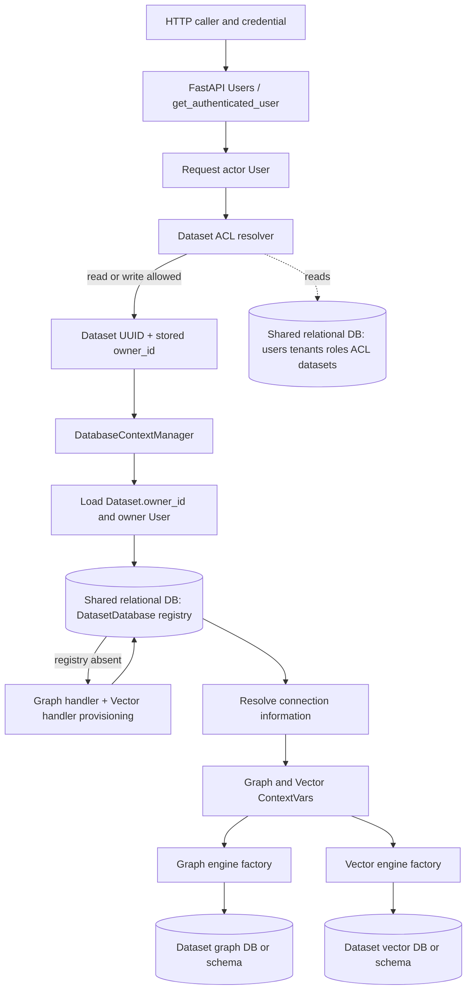
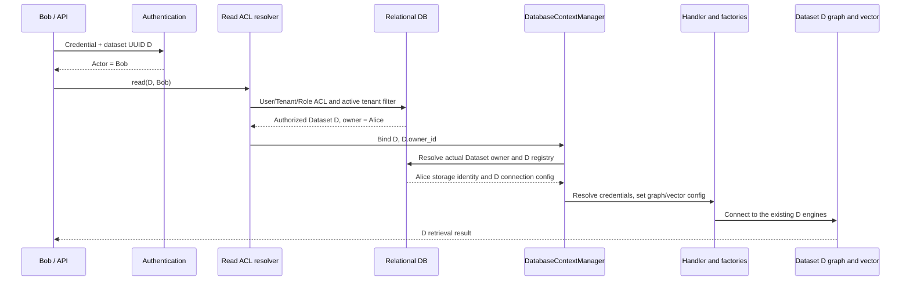
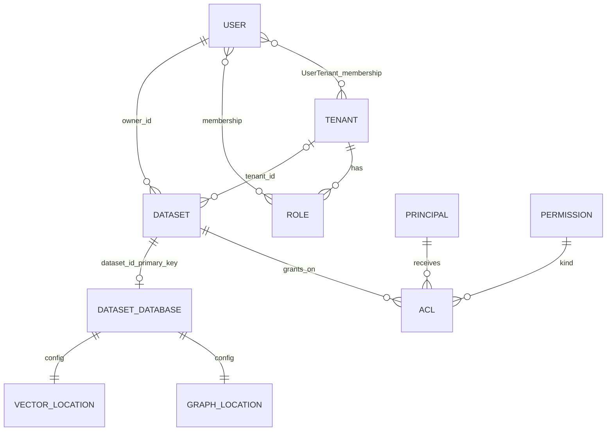
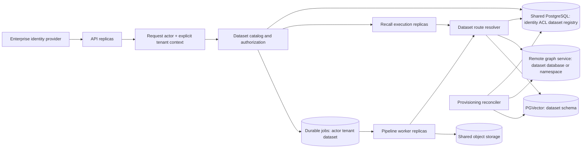

# 09 认证、授权、租户与数据库路由：把多用户概念落到组件调用

本节只分析当前检出代码中的多用户执行边界，接续 `06-module-persistence.md`。官方概念来源为 [Multi-user mode overview](https://docs.cognee.ai/core-concepts/multi-user-mode/multi-user-mode-overview)，实现结论以本地代码为准。文件行号均相对仓库根目录 `Cognee ??????`。这是静态分析，未声称运行了企业多租户负载或后端集成测试。

## 1. 先分清五种身份与职责

当前实现不是“HTTP user_id 直接选择自己的图数据库”。HTTP 用户是**操作身份**；ACL 决定此人可操作哪些 dataset；Dataset.owner_id 是**存储归属身份**；DatasetDatabase 是**路由注册表**；handler 和 engine 才把路由变成具体数据库连接。因此 Bob 读 Alice 共享的 dataset 时，访问的是 Alice 这个 dataset 已有的图和向量库，不会复制一套 Bob 的数据库。

| 对象/组件 | 现有职责 | 直接代码证据 |
|---|---|---|
| HTTP authentication | API key、bearer JWT、cookie 识别 User；是否允许缺失凭证由认证配置控制 | `cognee/modules/users/get_fastapi_users.py:15-20`；`cognee/modules/users/methods/get_authenticated_user.py:70-109` |
| User / Tenant / Role / ACL | User、Tenant 都可作为 Principal；ACL 把 principal、permission、dataset 关联；Tenant 聚合成员与角色 | `cognee/modules/users/models/User.py:15-42`；`Tenant.py:9-28`；`ACL.py:16-18` |
| Dataset | 有 owner_id、tenant_id；授权和数据组织的对象，也是图/向量路由单元 | `cognee/modules/data/models/Dataset.py:12-22` |
| DatasetDatabase | dataset_id 为主键，记录 owner 与两个后端连接/配置；一个 dataset 对应一条路由记录 | `cognee/modules/users/models/DatasetDatabase.py:11-29`、`:44-48` |
| DatabaseContextManager | 已知 dataset 后解析真实 owner，查找/创建路由，再把 graph/vector 配置放进当前异步上下文 | `cognee/context_global_variables.py:238-348` |
| DatasetDatabaseHandler | 为 dataset 建库、建 schema 或产生本地文件位置；解析连接信息 | `cognee/infrastructure/databases/utils/get_or_create_dataset_database.py:20-39`、`:97-132` |
| graph/vector engine factory | 按上下文配置创建/复用对应 provider adapter；执行图查询或向量检索/写入 | `cognee/infrastructure/databases/graph/get_graph_engine.py:193-228`；`cognee/infrastructure/databases/vector/get_vector_engine.py:92-110` |

> 表内 `Tenant.py`、`ACL.py` 与 `User.py` 同属 `cognee/modules/users/models/`；后续简写只在同段已给出完整目录时使用。

事实边界：图中的 ACL resolver 与 DatabaseContextManager 不是同一个安全职责；后者只有传入 `permission_type` 时才再次校验访问权。`_get_dataset_owner_id` 明确只解析 storage identity，不授权（`cognee/context_global_variables.py:110-136`、`:245-260`）。低层 engine factory 不能当作认证或 ACL 入口。

## 2. 两条真实调用链：写入和检索在哪里授权

**写入的授权发生在 pipeline 前置层。** `resolve_authorized_user_datasets` 先补默认用户，按 `write` 权限解析已存在的数据集，再创建需要的新数据集（`cognee/modules/pipelines/layers/resolve_authorized_user_datasets.py:29-46`）。创建时写入 `owner_id=user.id` 与 `tenant_id=user.tenant_id`（`cognee/modules/data/methods/create_dataset.py:14-30`），并向创建者授予 read/write/delete/share；存在 parent user 时也授予这四种权限，但该方法没有自动给 Tenant 创建 ACL（`cognee/modules/data/methods/create_authorized_dataset.py:14`、`:33-53`）。

任务真正运行时，`run_tasks` 根据 dataset_id 从关系库加载 Dataset，然后以 `dataset.id`、`dataset.owner_id` 进入数据库上下文，task 中获取的 graph/vector engine 因而指向该 dataset（`cognee/modules/pipelines/operations/run_tasks.py:62-75`、`:93-98`）。这里没有传 `permission_type`，依赖前置层已完成授权；把它直接暴露给外部任务提交接口时，商业化包装层必须保留授权步骤。

**检索先计算有权读取的 dataset 集合，再逐 dataset 设置数据库上下文。** `search()` 无条件调用 `authorized_search`（`cognee/modules/search/methods/search.py:162-193`），后者调用 `get_authorized_existing_datasets(..., permission_type="read")`（同文件 `:243-248`），按 dataset 建立查询任务；每个任务以 `dataset.id`、`dataset.owner_id` 进入上下文，再调用 graph engine 与 retriever（同文件 `:327-335`、`:426-449`）。这个 fan-out 是跨多个 dataset 查询，不是同一数据库的分布式分片查询。

名字与 UUID 不是可互换的企业共享寻址方式：名字解析只在“当前用户拥有、当前 active tenant”的 dataset 中查找；共享 dataset 要传 UUID（`cognee/modules/data/methods/get_dataset_ids.py:23-42`）。因此企业 UI/API 应给用户返回可访问的 dataset UUID，并在 remember/recall 请求中显式使用 UUID，而不是靠同名 dataset 代表整个公司的知识库。

图中 B 与服务内部动作作概念性折叠，实际调用证据为上一段。重点是“Bob 的权限，Alice 的存储归属，同一个 D”；既不是每次请求新建库，也不是被授权用户各有一份数据。

## 3. 两个开关的代码真值表：不能把关闭存储隔离等同关闭认证

**现有事实：未设置 ENABLE_BACKEND_ACCESS_CONTROL 时，当前代码会校验 handler/provider，支持就开启，不支持则抛错；不会自动关闭。** `backend_access_control_enabled()` 在 unset 和 true 两个分支均调用 `multi_user_support_possible()`（`cognee/context_global_variables.py:98-107`）；被调用函数遇到未知 handler 或 provider 不匹配即抛 `OSError`，成功才返回 True（同文件 `:48-95`）。`:101-102` 的注释写了 otherwise disable，但函数体没有返回 False 的失败路径。配置决策必须依据函数体。

HTTP 认证由另一函数 `_resolve_auth_posture()` 决定。它不检查存储 provider，unset BAC 按 True；REQUIRE_AUTHENTICATION 未设则继承 BAC；BAC 开启时显式关闭认证会被警告并强制改为 True（`cognee/modules/users/methods/get_authenticated_user.py:33-67`）。结果在模块导入时求值并用于 FastAPI Users dependency（同文件 `:70-81`）。因此两者是**不同维度、带约束耦合**，既不能说完全独立，也不能说同一个开关。

| ENABLE_BACKEND_ACCESS_CONTROL | REQUIRE_AUTHENTICATION | HTTP 认证结果 | graph/vector dataset routing |
|---|---|---|---|
| unset | unset / true | 必须认证 | provider/handler 支持则开启；否则错误 |
| unset / true | false | 强制必须认证并记录警告 | provider/handler 支持则开启；否则错误 |
| true | unset / true | 必须认证 | provider/handler 支持则开启；否则错误 |
| false | unset / false | 可选；无凭证回退默认 User | 不建立 dataset 专属上下文，使用共享后端 |
| false | true | 必须认证 | 仍使用共享后端；身份认证不会恢复 dataset 存储隔离 |

表格证据：`cognee/context_global_variables.py:98-107`、`:195-204`；`cognee/modules/users/methods/get_authenticated_user.py:39-67`、`:81-109`。限定使用规范 true/false 配置值；本节不把其他字符串当成受支持的配置接口。

官方 overview 表格中 false 对应“no auth”只能理解为默认继承行为，而不是当前代码不允许“共享后端 + 强制认证”。同时，这套 HTTP dependency 不会自动施加到直接 Python SDK 调用：pipeline 前置层与 search 的 user 缺失均能使用默认用户（`cognee/modules/pipelines/layers/resolve_authorized_user_datasets.py:29-31`；`cognee/api/v1/search/search.py:310-327`）。服务化时要把可信 actor 传入 SDK，不能把 Python 参数本身当认证。

**关闭 BAC 后，dataset 参数并非在所有层都完全没作用。** 上层仍可进行 dataset 名字解析与 read ACL 检查（`cognee/api/v1/search/search.py:329-338`；`cognee/modules/search/methods/search.py:171-175`、`:243-245`）。但是执行层只运行一次共享上下文查询；仅当候选集合恰好一个 dataset 时，把它作为 retriever 参数传入，且不建立 dataset 专属图/向量连接（后者 `:452-498`）。这说明“参数仍被校验或传递”和“它足以在共享数据库中隔离所有检索路径”是两回事。本节未逐一审计全部 retriever 的 metadata filter，不据此承诺共享后端具备统一 dataset 行级隔离。正式多租 SaaS 应使用 BAC=true 和已验证的 handler，而不是依赖关闭模式的可选过滤。

## 4. Tenant 是权限组织；Dataset 是图/向量路由单元

当前模型具备以下关系，而不是 `tenant_id -> 一套数据库`：

图中 GRAPH_LOCATION/VECTOR_LOCATION 是连接配置的逻辑表示，不是 ORM 独立表。模型证据：`cognee/modules/users/models/User.py:20-42`；`Tenant.py:15-28`；`UserTenant.py:13-14`；`ACL.py:16-18`；`cognee/modules/data/models/Dataset.py:19-22`；`cognee/modules/users/models/DatasetDatabase.py:11-29`。

权限计算汇总用户直接 ACL、其 tenant 的 ACL、其 role 的 ACL，然后去重，最后只保留 `dataset.tenant_id == user.tenant_id` 的数据集（`cognee/modules/users/permissions/methods/get_all_user_permission_datasets.py:21-46`）。因此加入 Tenant 是加入权限组织，**不会自动获得该 tenant 全部 Dataset 的访问权**；还需要向 Tenant、Role 或 User 授予具体 Dataset 的权限。授权对象从 Principal 查询，授权调用者必须拥有 share 权限（`cognee/modules/users/permissions/methods/authorized_give_permission_on_datasets.py:25-36`）。该方法 `:34` 仍有“只允许同租户主体”的 TODO；商用同租户约束需要在受控授权服务中落实，不能只靠 UI 隐藏选项。

当前 active tenant 是共享关系库 User 行里的 `tenant_id`。`select_tenant` 验证 UserTenant 成员资格后修改该字段并提交；清空选择也持久化（`cognee/modules/users/tenants/methods/select_tenant.py:32-64`）。`context_global_variables.py:31-41` 有 graph/vector、current_dataset、session_user 等 ContextVar，但没有独立 request tenant ContextVar。**推断：**同一账号在两个浏览器标签页/服务请求切换两个租户时，持久化的 active tenant 不是天然的每请求租户快照；后续重新加载 User 会看到最后提交的选择。多副本共享关系库不会消除此模型语义。

数据库上下文取得 Dataset 的 owner 后，按 owner 与 dataset 找/建连接；注册表查询键只有 dataset_id（`cognee/context_global_variables.py:255-265`；`cognee/infrastructure/databases/utils/get_or_create_dataset_database.py:42-65`、`:97-105`）。Tenant 并非这个注册表的路由键。不同 handler 将同一边界实现为不同资源：

| handler 类型 | Dataset 对应的存储位置 | 不能混淆的概念 |
|---|---|---|
| 默认 Ladybug / LanceDB | owner 目录下 dataset 对应的图/向量文件 | 本地文件隔离不意味着跨主机共享或多写者能力 |
| Neo4j handler | dataset 对应 Neo4j database | 一个服务实例内的多 database，不等于每 tenant 独立实例 |
| pgvector_shared / postgres_graph_shared | 共享 PostgreSQL 数据库中的 `ds_<uuid>` schema | schema 命名空间不等于独立实例、独立数据库账号或天然行级安全 |

证据：`cognee/infrastructure/databases/vector/lancedb/LanceDBDatasetDatabaseHandler.py:30-42`；`cognee/infrastructure/databases/graph/ladybug/LadybugDatasetDatabaseHandler.py:40-54`；`cognee/infrastructure/databases/graph/neo4j_driver/Neo4jDatasetDatabaseHandler.py:61-72`、`:146-158`；`cognee/infrastructure/databases/vector/pgvector/PGVectorSharedDatasetDatabaseHandler.py:39-87`；`cognee/infrastructure/databases/graph/postgres_demo/PostgresGraphSharedDatasetDatabaseHandler.py:34-85`。具体 provider 完整支持矩阵见 06 草稿，不能根据能连接网络就认定 handler 支持多租户。

## 5. 企业 Tenant、多 User、多 Dataset：当前如何组织，建议补什么

**现有机制可以表达的例子：**企业 T 有 Alice、Bob、Carol，三人都是 T 的成员；Alice 在 active tenant T 下创建产品资料 D1 和财务资料 D2。Alice 自动得到两个 dataset 的四种权限。Alice 向 Tenant T 授予 D1 read，向编辑 Role 或 Carol 授予 D1 write；D2 只给财务 Role read。Bob 在 T 下通过 D1 UUID 检索，权限来自 T 的 ACL，路由仍然使用 D1 的 owner Alice 及 D1 的唯一 DatasetDatabase。Bob 不会因此获得 D2。上述每一步分别由 membership、create_dataset、ACL grant、ACL resolver 和 registry 实现，而不是 Tenant 创建时自动配出一套全公司数据库。

**建议落地成三个清楚的服务边界：**

1. **租户请求上下文层。** 从已经验证的登录身份和请求 tenant_id 建立不可变 `RequestContext(actor_id, tenant_id)`；每次验证 membership，授权与数据查询都显式接收这份上下文。保留 User.tenant_id 作为 UI 默认选择，而不是唯一的并发请求隔离依据。后台 job 固化 actor、tenant、dataset UUID；执行时按业务规则重新检查授权/成员资格，避免把投递时的 Python User 对象作为长期权限快照。
2. **Dataset 授权与目录服务。** 复用现有 Dataset、Principal、ACL、权限枚举；创建时明确选择“个人/租户共享/角色共享”，在事务中创建 Dataset 与初始 ACL。同租户 grant、跨租户显式分享策略、owner 离职/转移必须形成服务规则。API 始终以 UUID 引用共享 dataset，并将授权后的 Dataset 交给执行层。
3. **Dataset 存储控制面。** 复用 DatasetDatabase 和 handler 插件接口，独立负责 dataset 到图/向量数据库/schema 的 placement、provisioning 状态与恢复。引擎工厂继续负责连接和查询，不承担企业租户策略。企业若需要“整租户专属数据库/区域/加密密钥”，这是新的 placement 策略：可以为该 Tenant 的多个 dataset 分配到专属后端，再在其中区分 dataset；不能仅更改 tenant_id 就期待现有 registry 自动迁移。

以上是建议而非已经实现。其依据是现有组件职责：租户选择持久化在 User；授权位于 domain 方法；路由注册表只按 dataset；handler/engine 是可替换基础设施。将这些职责显式化能保留 Cognee 的 memory API 和 task pipeline，同时使 SaaS 的组织边界、权限边界、存储边界分别可测试。

这是建议架构图：现有组件是 API、pipeline、关系元数据、registry、handler 和 engine；显式请求 tenant context、持久化任务投递、reconciler 是商业化新增/加固边界。图中的并行 worker 不表示已有全局任务调度，也不表示允许多个 worker 无协调地同时修改同一 dataset。

## 6. 对集群部署的直接含义

**可复用的是数据模型与路由协议，不是进程内上下文本身。** ContextVar 只让某次执行找到配置；新进程/新 Pod 必须从 job 的 actor/tenant/dataset 重建并重新解析注册表。共享关系库负责提供同一套用户、ACL 和路由记录。graph/vector工厂读取上下文并使用进程内缓存创建 adapter（`cognee/infrastructure/databases/graph/config.py:199-207`；`cognee/infrastructure/databases/vector/config.py:137-143`；`cognee/infrastructure/databases/graph/get_graph_engine.py:294-315`；`cognee/infrastructure/databases/vector/create_vector_engine.py:121-136`），不能被当作跨副本共享连接池或分布式锁。

**数据库路由初始化需要跨进程协调。** 当前先创建 graph，再创建 vector，再提交注册表；注册表重复插入的 IntegrityError 会读取胜出记录，但不是包裹两种远程数据库建库的共同事务（`cognee/infrastructure/databases/utils/get_or_create_dataset_database.py:104-105`、`:126-154`）。建议控制面使用 dataset 级幂等 key 与状态机，记录 graph_ready/vector_ready，允许失败重试与协调清理；执行面只消费可用路由。这是 handler 边界上需要补足的集群一致性，不需要把所有基础设施统一换成一种数据库才能做。

**多副本认证密钥需要一致。** 当前 JWT 两个 transport 使用 `FASTAPI_USERS_JWT_SECRET`，缺失时 helper 会生成进程内随机 secret（`cognee/modules/users/authentication/get_api_auth_backend.py:18-22`；`get_client_auth_backend.py:21`；`get_auth_secret.py:25-53`）。在部署配置中统一 JWT/reset/verification secret，确保任一副本可验证其他副本签发的凭据。统一密钥只解决身份验证互通，不替代上述租户/ACL/数据库路由边界。

## 7. 本节证据边界与后续验证

本节复用 06 草稿中已经阅读的模型、context、registry、handler 和 engine 证据；新增定向读取 auth 完整 111 行、context 1-150 行、search 内部 1-215/225-345/410-505/630-680 行、API search 300-400 行，以及前轮已读的权限/数据集解析方法。本节不宣称覆盖整个认证系统或所有 retriever。完整 adapter 覆盖与未读范围沿用 06 的逐文件覆盖表；此处不重复计算分母以制造“全库覆盖率”。

需要进入落地验证的三项边界测试：同 Tenant 的 Alice/Bob 共享 UUID 是否复用相同 registry 及数据；同账号两个并发 tenant 请求是否保持各自租户上下文；两个 worker 同时首次初始化一个 dataset、一个后端失败时是否能收敛至一条完整可用路由。它们分别验证权限身份与存储身份分离、请求租户稳定性、provisioning 一致性，优先于只做单用户多 Pod 吞吐测试。
