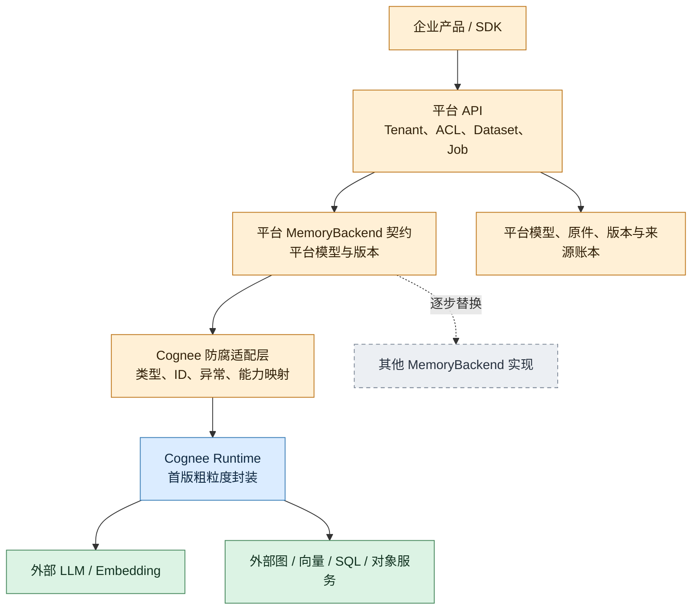

# 可替换组件契约

本节为目标设计。先把 Cognee 封装成可替换的 MemoryBackend，再按收益抽离组件；接口可先在同一进程内实现，不必一次建立十个微服务。

## 1. 按来源着色，同时明确所有权

图例：**橙色平台自有，蓝色复用Cognee，绿色外部服务，灰色未来替代实现**。颜色表示来源，不表示已完成。

“防腐层”属于平台：上层不 import Cognee 的 DataPoint、Dataset ORM、Retriever、Task，也不以 provider 的数据库名作为知识库ID。错误、状态、来源和用量由适配层转换成平台合同；Cognee 的配置、ContextVar、缓存和数据库资源创建留在实现侧管理。

下述细接口是演进目标；须先明确现有阶段输入输出和导出位置，才能从粗封装中逐步抽离。

## 2. 平台必须拥有的模型与标识

| 平台模型 | 必须保持稳定的意义 |
|---|---|
| Tenant / Dataset | 企业安全范围、知识库身份与授权；独立于任何后端数据库名 |
| Document / DocumentVersion | 业务资料身份与不可变内容版本；重试不等于创建新资料 |
| SourceArtifact | 原件/抽取文本的URI、对象版本、checksum、类型与保留策略 |
| Chunk / ChunkVersion | chunk策略版本、所属文档版本、边界与坐标；更换分块不复用旧语义身份 |
| CanonicalExtractedGraph | 实体、关系、属性、ontology版本、抽取版本；平台定义可交换形式 |
| Evidence | 事实到文档版本/chunk/原件坐标的可追踪关系；包含页码、字符区间或媒体时间区间及坐标单位 |
| IndexRevision / ReadSnapshot | 图、向量、embedding profile及来源快照的共同引用 |
| Session / Feedback / GraphEdit | 会话、反馈和人工修订的业务记录；不是可随意重建的派生缓存 |

平台生成业务ID，hash不代替意图或授权。实体可有多个来源，删除一个来源不能删除全部共享实体。抽取临时ID属本次结果；跨文档归并需版本化策略，不能只按名称合并。

适配层维护 platform_id ↔ implementation_id 映射及版本；内部ID不成为公共身份。规范图保留扩展字段和原始artifact，不能无损表达的能力明确报缺，不能静默丢弃属性或来源。

不能导出内部产物时标明恢复/迁移限制，同时保留原件、配置和业务修改记录。

## 3. 所有接口共用的请求与结果封套

每个调用携带 `ExecutionScope`：已验证tenant_id、actor_id、dataset_id、operation_id、attempt_id、权限、route_revision、目标revision及截止时间。入口/worker重新授权；scope须可验证，不直接信任客户端tenant或数据库URL。

变更携带idempotency_key、request_digest、expected_revision、dataset写入epoch。响应含状态、产物、版本、用量和retryable分类。相同键与摘要返回同一逻辑结果，不同摘要冲突；attempt与业务身份分开。

读取携带ReadSnapshot与一致性要求；实现返回实际使用的版本。异步accepted表示持久接收，committed表示满足已约定的发布条件，不能用一个success混淆。共享命名空间中写入epoch必须在存储写入边界生效；否则使用隔离attempt/revision产物再发布，单纯接收scope字段不提供fencing。

## 4. 八个最小接口契约

以下为语言中立端口，不要求八种远程服务。

| 接口 | 输入 → 输出 | 必须约定的边界 |
|---|---|---|
| **MemoryBackend** | submit(InputManifest, processing_profile)、query(QuerySpec, ReadSnapshot)、delete(DeleteSpec) → operation_ref、答案/上下文与Evidence、删除进度 | 首版端到端封装；所有Dataset均属scope授权集合；明确accepted与committed，支持能力查询和平台级导出 |
| **SourceStore** | 原件流/受控引用、checksum、document_version → immutable ArtifactRef；按ref读取/删除 | 相同逻辑写入幂等；版本不可覆盖；暂存租约与引用登记协调GC；删除按引用和保留政策执行 |
| **DocumentTransform** | ArtifactRef、parser/chunker profile → ParsedDocumentRef、ChunkManifest | 输出记录编码、坐标、顺序、策略版本；按输入版本+profile标识转换；不直接写共享图/向量；不把临时本机路径当持久输出 |
| **KnowledgeExtractor** | ChunkManifest、ontology/model/prompt profile → CanonicalGraphArtifact + EvidenceManifest | 输出保存实际抽取结果与版本；同一请求重试优先复用已完成artifact；不能假定LLM每次给出同一图；不隐式承担跨文档实体归并 |
| **EmbeddingService** | 文本/对象字段ref、embedding profile、批次键 → VectorBatchRef + model/dimension/normalization元数据 | 同维度不代表同空间；查询和索引绑定同一profile；外部调用超时后重试可能重复收费，用量须明确未知/待对账状态 |
| **GraphStore** | CanonicalGraph、Evidence、write scope/revision → write receipt；按snapshot读取子图/邻域、按来源删除 | 节点/边/证据身份及共享归属；声明支持的遍历/过滤语义；写入幂等与fencing/隔离revision；不把Cypher作为通用合同 |
| **VectorIndex** | VectorBatch、平台对象ID、Evidence refs、index revision → receipt；query vector+filter → candidates | tenant/Dataset过滤不可省略；声明距离语义与索引版本；写入/删除可重试；不同profile距离不可默认直接比较 |
| **Retrieval** | QuerySpec、授权Dataset bindings、ReadSnapshot、budget → RankedEvidence/Context或Answer | 显式候选预算、总超时和来源；可协商context-only/answer；图向量版本绑定；最终综合生成不自动意味着跨Dataset图关系已融合 |

GraphStore与VectorIndex分别替换，由平台IndexRevision协调可见性，没有天然共同事务。Session/Feedback归平台；首版委托Cognee时明示其写入与导出，逐步移出。

每个实现都应有版本化Capability声明：支持的操作/图查询、filter表达式、最大batch、snapshot/revision读取、条件写/fencing、按来源删除、导出与恢复粒度。平台按能力选路，缺少必需能力则拒绝该部署组合或显式降级产品合同；不能因函数签名相同就默认一致性和安全语义相同。

## 5. 哪些替换是策略切换，哪些必须迁移

纯reranker、结果格式化、最终回答prompt通常不必重建索引，但仍需评测、预算及缓存失效。

以下变化会改变已有数据含义，不能当作无状态配置热更新：

- **解析/分块**：chunk边界、坐标及Evidence引用变化，需要新ChunkVersion并重抽取/重索引，旧引用保留到旧读者退出。
- **抽取本体、实体归并、prompt/model**：实体类型、边和规范ID可能变化；生成新图版本，保留事实来源与人工修订的映射/冲突处理。
- **Embedding**：模型、归一化或被索引字段变化即可能换语义空间；重建向量，并让query使用对应profile。
- **图/向量索引结构**：即使后端迁移保留ID，过滤、遍历、得分与删除语义也可能不同；先回填、对账和比较，再切换路由。

平台不自研数据库，但拥有业务读取版本的决定权。

## 6. 如何替换而不失去回滚能力

先维持一个权威写入路径。新组件通过不可变artifact或平台变更日志异步回填，不让HTTP请求同步“分别写两个后端然后都算成功”。如做双写，记录每个目标的进度、版本和失败，允许补投，不能声称跨后端原子。

影子查询使用同一授权范围、输入和业务版本，只将旧实现结果返回用户；新实现记录延迟、召回、Evidence完整性、删除效果和成本。影子执行关闭会话追加、反馈、improve和重复用量记账等业务副作用；需要调用模型时明确其额外成本。

达到验收条件后按Dataset/租户逐批切换binding/revision。回滚只对“旧实现仍保有足够新、相容的数据”成立：切换后若停止维护旧后端，就必须先重放变更再回切，不能指针一拨即承诺零数据丢失。发布回滚不会撤销外部已发生的LLM费用、发送或删除；破坏性删除尤其不能依赖旧快照把已删除资料重新暴露。

外部工作流引擎也通过平台契约调用组件。把整个Cognee pipeline包成一个Activity，只能在该Activity边界重试/恢复；不会自动保存Cognee内部generator、ctx或每个抽取batch。只有阶段产物已持久化、版本可定位、写入可重试，才能将粗Activity逐步拆成真正有checkpoint的阶段。平台Job与工作流状态须有明确单一调度权威，不再建一套竞争的重试器。

推荐顺序：MemoryBackend封装与平台身份/原件 → 规范产物与Evidence → 高收益模型/检索替换 → 存储与细阶段工作流。逐步验证和减少依赖。
