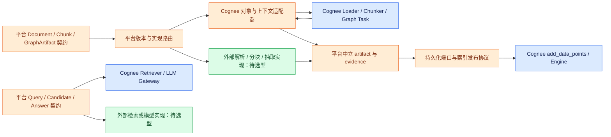

# 10：计算组件替换边界——保留平台契约，逐步退出 Cognee 内部对象

本章是限定源码补查，复用 06 的输入持久化和 09 的引擎主链；不是全仓插件审计，也没有进行外部产品选型或运行集成测试。路径均相对当前仓库。以下“事实”来自所引代码，“建议”是平台设计，不表示项目已实现。

## 1. 颜色与部署语义

蓝色表示当前 Cognee 组件；绿色表示可以选用外部实现的能力位置，尚未完成具体开源项目选型；橙色表示建议由商业平台拥有的中立契约、路由和适配层。同一能力逐步迁移时可以同时存在蓝色和绿色实现。图中的模块默认是同一应用/worker 进程内的逻辑边界；只有确有隔离或扩缩容需要时才拆独立服务。

这里的中立 artifact 是建议增加的显式阶段结果；当前默认链通过嵌套 Python 对象传递抽取结果，不能直接把图中的箭头当成现有远程 API。

## 2. 真实接点表

| 能力 | 当前实现及源码证据 | 可以利用的接点 | 替换难度与必须适配内容 | 平台中立契约建议 |
|---|---|---|---|---|
| 输入文件解析 | `cognee/infrastructure/loaders/use_loader.py:6-23` 注册类；`cognee/infrastructure/loaders/LoaderInterface.py:10-28,42-91` 定义接口与 LoaderResult | **有显式注册函数** `use_loader`，由 loaders 包导出；实现 extension/MIME/can_handle/load | 低到中。`load` 返回的是已保存的派生文本路径及元数据，并非任意 DocumentDTO。工厂无参构造 loader；新名称需通过 preferred_loaders 或适当优先级选择。见 `cognee/infrastructure/loaders/create_loader_engine.py:22-31`、`cognee/infrastructure/loaders/LoaderEngine.py:103-129` | ParseRequest 包含 source URI、MIME、parser profile/version；ParsedDocument 包含文本对象 URI、结构/页码、内容 hash、原始对象引用。由适配器转 LoaderResult，平台掌握对象 URI 与版本 |
| 分块 | SDK `cognee/api/v1/cognify/cognify.py:109-133,581-611` 接收 chunker；`cognee/modules/chunking/Chunker.py:9-20` 规定 constructor/read | **公开 SDK 参数注入类**，不是通用注册中心；TextDocument 实例化所传类并 async 迭代 `read()`，见 `cognee/modules/data/processing/document_types/TextDocument.py:11-28` | 中。必须适配 Document、get_text、max_chunk_size；输出要兼容 DocumentChunk 下游。仅有自己的 text/start/end DTO 不足以维持 chunk ID、token count、图关系和删除 provenance | ChunkRecord：document version、chunk ID、文本/URI、内容 hash、位置、分块策略及版本、tokenizer/model profile、顺序。显式提供 identity policy，不把 Python 类名当 schema ID |
| 图抽取 | `cognee/tasks/graph/extract_graph_from_data.py:198-257` 验证 graph_model、执行 calculate_chunk_graphs 或默认 LLM 抽取，然后整合到 chunk；`cognee/modules/cognify/config.py:92-127` 选择内置 extractor | graph_model 是 SDK 定制入口；calculate_chunk_graphs 是 **内部 kwargs 回调接点**；也可使用公开 `run_custom_pipeline` 自定义 Task，导出见 `cognee/__init__.py:41` | 中到高。更换抽取函数后仍要衔接实体模型、ontology、chunk.contains 及边证据。回调不是已证明稳定的通用 provider 注册协议。HTTP JSON schema 能定制 graph_model，但 Python 类/回调不能按原样跨 HTTP 传递，见 `cognee/api/v1/cognify/routers/get_cognify_router.py:235-246` | GraphArtifact：typed entities、relations、稳定实体标识、schema/version、source chunk IDs、证据跨度、置信度、抽取模型/prompt profile。平台先定义实体合并与来源语义，再适配 Cognee |
| 摘要与图对象组装 | `cognee/tasks/graph/extract_graph_and_summarize.py:23-40` 并行抽取/摘要并返回摘要对象；`cognee/tasks/summarization/models.py:22-37` 的 TextSummary.made_from 持有 DocumentChunk | 自定义 Task 或替换任务列表；本次未发现单独摘要 provider 注册接点 | 中。返回摘要不是完全扁平文本：made_from 把 chunk 与抽取图保留在可遍历对象图中。替换时若仅保留 source ID，现有图递归与 provenance 捕获不等价 | SummaryArtifact 与 GraphArtifact 分开，显式 source IDs/evidence refs；由 storage adapter 重建 Cognee 所需嵌套关系 |
| 单 dataset 检索 | `cognee/modules/retrieval/register_retriever.py:6-8`；`cognee/modules/search/methods/get_search_type_retriever_instance.py:414-432` | **有显式注册函数** `use_retriever(SearchType, retriever_class)`；社区注册优先于内置映射 | 中。BaseRetriever 的对象、context、completion 三阶段接口可复用，但构造参数并非统一注入完整请求：工厂社区路径使用 `retriever(**kwargs)` 且留有 TODO。session/evidence/prompt preview 等也是附加协议，见 `cognee/modules/retrieval/base_retriever.py:26-40,42-174` | RetrieveRequest：授权 dataset refs、query、filters、budget；Candidate：source/document/chunk IDs、score、score kind/direction、evidence、retriever version。Answer 与 retrieval artifacts 分离 |
| 融合、重排与多 dataset 协调 | `cognee/modules/retrieval/base_retriever.py:106-116` 默认 merge 返回 primary；`cognee/modules/search/methods/search.py:500-505,545-603` 收集 dataset 结果 | 当前 BaseRetriever.merge 是单检索器内部对象合并能力；不是跨 dataset 全局融合注册器。可自定义 Retriever，或由平台包裹查询协调层 | 中到高。现有多 dataset 分别执行并返回列表，不能等同一次全局 rerank/synthesis。独立融合需统一候选、授权、分数语义、失败策略、预算；不能把 distance 和 relevance score 直接排序混用 | FusionRequest 接收 Candidate 集合，明确每个 score 的定义、可比较性和来源；FusionResult 提供排名及理由/分解。Answer generation 单独接受 evidence 集合 |
| LLM | `cognee/infrastructure/llm/LLMGateway.py:120-154` 固定框架分支；`cognee/infrastructure/llm/structured_output_framework/litellm_native/get_native_client.py:81-112` 按配置建立 client | 已有 provider/model/endpoint/key 和阶段配置覆盖；兼容协议模型网关可作为 endpoint；本次限定扫描未发现与 use_loader 对称的 use_llm 注册函数 | 接入兼容端点较低；替换整个 Gateway/结构化输出语义较高，需要内部工厂/调用层适配。并非所有选项都按请求隔离，框架选择仍读取全局配置，详见 09 | ModelRequest：tenant/job/profile version、task stage、messages、response schema、timeout/token budget；ModelResult：validated object/text、usage、model revision、finish/error status。密钥为引用，不进入业务 artifact |
| Embedding | `cognee/infrastructure/databases/vector/embeddings/EmbeddingEngine.py:10-45` 定义 embed_text/size/batch；`cognee/infrastructure/databases/vector/embeddings/get_embedding_engine.py:28-61,90-138` 内置配置分支 | 现有 provider/model/endpoint 配置，可利用 openai_compatible；Protocol 便于内部实现适配，但 **Protocol 本身不等于已提供公开注册 API** | 兼容端点较低，自定义引擎中到高。vector adapter 持有 embedding engine，不能假设任意每请求切换都会穿透已有 adapter 缓存；同维不同模型也不能混写，见 09 | EmbeddingProfile 固定 provider/model revision/tokenizer/dimensions/normalization/distance metric；vector 包含 profile ID、index generation；模型更换走重建与索引切换 |

注册还具有进程生命周期约束：`cognee/infrastructure/loaders/get_loader_engine.py:7-19` 缓存 engine，工厂在创建时实例化 registry 中的类。**推断**：在首次获取 engine 后仅更新 registry 不会自动重建已缓存的实例；应在每个 worker 启动时注册并明确缓存刷新机制。以上注册都不能自动推导成跨 pod 的插件发布/发现能力。

**Docling 已有集成，不应画成尚未接入的新能力。** `cognee/infrastructure/loaders/supported_loaders.py:45-50` 在可导入时登记 DoclingLoader；`cognee/infrastructure/loaders/LoaderEngine.py:49` 已有默认优先级项。SDK add 的 preferred_loaders 参数及转换逻辑见 `cognee/api/v1/add/add.py:43,223-230`，可以选择 docling_loader。实现会创建 converter、转换本地文件、export_to_text 并默认保存派生文本；persist=False 才直接返回文本（`cognee/infrastructure/loaders/external/docling_loader.py:115-160`）。当前这层没有直接返回 Docling 完整版面对象的中立契约；若平台需要结构、表格和证据坐标，需要补结果映射。仓库自身区分 docling 与 docling-full extras，PDF/图像 ML 路径需要 full 的说明见 `pyproject.toml:222-229`。本轮核查的是仓库已有接入，未核实本地依赖是否安装或实际转换效果。

**注册是应用启动配置，不是租户请求路由。** `use_loader.py:23` 与 `register_retriever.py:8` 都直接修改模块级 dict，后者初始声明在 `cognee/modules/retrieval/registered_community_retrievers.py:1`。它们没有以 tenant 为 key 的隔离协议。建议每个 worker 启动时注册稳定实现，再用经授权的调用参数/平台路由选择；不得在不同租户请求中反复改同名注册项来实现租户定制，以免并发请求互相改变实现。相应 read 范围增加 supported_loaders.py 42–52、docling_loader.py 115–160、add.py 参数与 223–230、pyproject.toml 222–229，以及两个 registry 定义/写入行。

## 3. ChunkDTO 不能直接替入的五个原因

1. **对象类型参与持久化协议。** `cognee/tasks/storage/add_data_points.py:94-97` 要求 list[DataPoint]；DataPoint 的嵌套对象变成边、标量变成节点属性，metadata.index_fields 产生 `<TypeName>_<field>` 集合，见 `cognee/infrastructure/engine/models/DataPoint.py:28-53`。存储索引实现再次读取真实 Python 类型名与 index_fields（`cognee/tasks/storage/index_data_points.py:39-63`）。自己的 DTO 即使字段同名，也不满足这个协议。

2. **类名是隐藏 schema 标识。** DataPoint 构造时强制 type 等于类名（`cognee/infrastructure/engine/models/DataPoint.py:94-106`）。内置 CHUNKS 查询固定 `DocumentChunk_text`（`cognee/modules/retrieval/chunks_retriever.py:122-129`）；chunk ownership 甚至精确比较 `type(data_point).__name__ == "DocumentChunk"`（`cognee/tasks/storage/chunk_ownership.py:57-58`）。因此 MyChunk(DataPoint) 或 MyChunk(DocumentChunk) 也不能仅因继承关系就宣称无损兼容：collection 和 ownership 分支可能变化。

3. **ID 算法影响重跑、合并和删除。** 默认 chunk ID 来自 uuid5(document_id + 内容 hash + 同内容 occurrence)，hash 是精确 UTF-8 文本 SHA-256（`cognee/modules/chunking/chunk_id.py:15-22`）；TextChunker 构造完整 DocumentChunk 并写入分块策略（`cognee/modules/chunking/TextChunker.py:24-28,42-59`）。普通 DataPoint 默认 uuid4，有 identity_fields 时才按类名及归一化字段派生稳定 ID（`cognee/infrastructure/engine/models/DataPoint.py:58-64,163-193`）。平台改分块算法、文档身份或节点类型名，都必须明确旧索引/旧证据如何迁移，不能只替换 text。

4. **存在 SQL 元数据联动。** 默认分块任务读取 document_chunk.chunk_size、写 belongs_to_set，完成后按 document.id 更新 SQL Data.token_count（`cognee/tasks/documents/extract_chunks_from_documents.py:16-28,44-61`）。DocumentChunk.is_part_of 是实际 Document 对象，包含原始 URI、name 和 MIME（`cognee/modules/chunking/models/DocumentChunk.py:32-58`；`cognee/modules/data/processing/document_types/Document.py:6-19`）。只有外部 document_id 字符串但没有对应 Data 行，无法照搬这条默认任务。

5. **provenance 并不全在公开 JSON 字段里。** DocumentChunk 包含私有 `_produced_edge_identities`、`_provenance_edges`（`cognee/modules/chunking/models/DocumentChunk.py:60-73`）。捕获逻辑递归遍历真实 DataPoint/DocumentChunk 对象；注释明确指出图展开产生的 stripped copies 会丢掉类型和私有证据（`cognee/modules/provenance/edge_evidence/capture.py:14-43`）。默认摘要通过 made_from 嵌套 chunk。仅 model_dump/普通 JSON 往返或把 made_from 改为裸 ID，不能假定证据与增量删除仍完整。

**建议的安全替换方式**：平台 ChunkRecord 与 Cognee DocumentChunk 双向映射，保留稳定外部 ID 对照、文档对象、schema/index 语义、分块策略、图边 evidence，并显式生成/恢复需要的私有 provenance。不能只写字段重命名器。若不愿承接这些内部约束，应一起替换“chunk → graph artifact → storage → retrieval/provenance”整段，由平台拥有完整协议；这与仅换一个 chunker 的工作量不同。

## 4. 实施顺序与验收边界

建议先把平台输入输出、ID 与 evidence 契约固定下来，再用 Cognee adapter 包住当前功能。第一批替换解析器、兼容模型端点及纯分块算法；第二批替换抽取/摘要与单 dataset retriever；最后才迁移持久化图模型、增量更新/删除和跨 dataset 融合。这里按已核实耦合程度排序，不代表具体外部组件已经完成可行性验证。

平台应拥有：tenant/dataset 授权、配置版本与 secret refs、job/artifact 状态、schema/identity policy、模型与索引 generation、idempotency key、候选与证据标准、删除/重建协议。Cognee 当前能复用的模块通过 adapter 进入这些端口，避免业务层直接依赖 DocumentChunk、SearchType 或数据库 collection 命名。

必要验收：同一 document/version 重跑 ID 与关系不膨胀；替换 chunker 后旧数据有清理/版本策略；相同文本重复 occurrence 不误合并；换 Retriever 保留 evidence 与 session 行为；序列化跨 worker 后 provenance 不丢；更换同维 embedding 模型强制新 generation；按 chunk/document 删除时共享实体的剩余引用保留。这些是建议新增的验证，本轮未执行。

## 5. 实际阅读范围与限制

本轮新增完整阅读：use_loader.py、LoaderInterface.py、create_loader_engine.py、get_loader_engine.py、Chunker.py、TextChunker.py、chunk_id.py、DocumentChunk.py、Document.py、TextDocument.py、extract_chunks_from_documents.py、register_retriever.py、base_retriever.py、summarization/models.py、EmbeddingEngine.py、extract_graph_and_summarize.py。LoaderEngine.py 的默认优先级及选择/调用区间 32–50、90–165；DataPoint.py 重点 28–133、163–224；extract_graph_from_data.py 198–257；Retriever 工厂 414–432；chunk_ownership.py 45–80；provenance capture.py 1–55。cognify SDK/HTTP、remember、extractor config 与 __init__ 只定位并阅读所引参数/路由/导出区间。

其余 LLM/Embedding 工厂、存储主链、query 多 dataset 语义复用 06/09 已核实阅读；不重复宣称全读。本轮扫描 LLM 与 embeddings 子目录未发现 `def use_*` / `def register_*` 对应注册入口，结论严格限于这些目录及已读调用链；不能证明所有社区包或商业版都没有扩展方式。未检查所有 custom loader/retriever 实现兼容性，未做外部开源组件调研，未计算全仓覆盖率，未修改业务代码。
