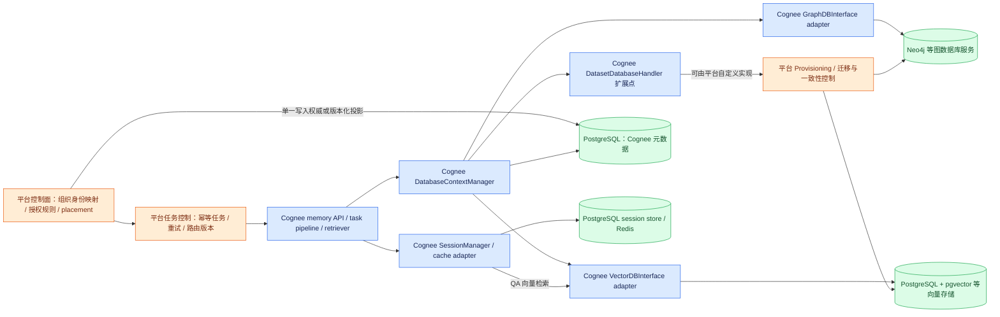

# 10 可替换存储组件与平台边界

本节基于当前仓库源码，补充“组件式可替换”设计。蓝色为 Cognee 已有代码；绿色为其他开源基础设施；橙色为平台需要自建/加固的组件。**adapter 是 Cognee 侧代码，数据库服务才是外部基础设施；不能将两者混成一个组件。** 下图属于建议组合，颜色表示归属，不表示新增部分已经完成。

图中 Redis 是可选实现，不是必选协调中心。PostgreSQL session backend 已在工厂实现（`cognee/infrastructure/databases/cache/get_cache_engine.py:135-165`）；Redis、fs、tapes 是同一工厂的其他分支（`:104-134`）。平台控制面/迁移控制是建议新增部分。

## 1. 已有可替换接口：数据操作与数据集配置必须同时适配

| 边界 | 当前实现与注册位置 | 替换方实际需承担的契约 |
|---|---|---|
| Graph adapter | `GraphDBInterface(ABC)`：`cognee/infrastructure/databases/graph/graph_db_interface.py:27-75`；`use_graph_adapter.py:4-5` 写入 registry；`get_graph_engine.py:344-354` 实例化注册类 | 节点/边 upsert、稳定 ID、子图/邻居读取、删除、所选功能需要的 provenance/增量更新；不能只支持一个 query 方法 |
| Vector adapter | `VectorDBInterface(Protocol)`：`cognee/infrastructure/databases/vector/vector_db_interface.py:11-34`；`use_vector_adapter.py:4-5` 注册；`create_vector_engine.py:169-185` 注入连接参数与 embedding engine | collection 命名、ID、payload、距离含义、过滤、批量检索、按 ID 读取与删除；Protocol 本身不是全部运行时行为验证 |
| Dataset handler | `cognee/infrastructure/databases/dataset_database_handler/dataset_database_handler_interface.py:8-77`；同目录 `use_dataset_database_handler.py:4-10` 注册 handler 与 provider 对应关系 | `create_dataset` 返回可持久化路由；`resolve_dataset_connection_info` 解析运行时凭据；`delete_dataset` 回收资源。返回秘密引用而非明文密码是接口明确建议（`:21-23`、`:42-58`） |
| Session/cache adapter | `cognee/infrastructure/databases/cache/cache_db_interface.py:8-325`；`get_cache_engine.py:104-169` 为具体 provider 分支 | QA、反馈、trace、context、KV/TTL、清理、锁/usage 等业务语义；现有 cache 工厂没有展示 graph/vector 同样的动态 registry，新增 backend 需要工厂扩展或注入包装 |
| Relational 元数据 | ACL 与 registry 直接通过 SQLAlchemy session 查询：`cognee/modules/users/permissions/methods/get_principal_datasets.py:23-35`；`cognee/infrastructure/databases/utils/get_or_create_dataset_database.py:60-64` | 不是一个外部 IAM URL 就能替换。保留本地 ORM 投影，或显式抽取 User/ACL/Dataset/Registry repository 接口后改读写路径 |

前三种注册相互独立。只装一个能连接向量服务的 adapter，不代表 BAC=true 已能创建、隔离和删除 dataset：`cognee/context_global_variables.py:48-95` 还检查 graph/vector handler 存在及 provider 匹配。注册属于 Python 进程状态，各 API/worker 启动都需要加载相同插件与版本。

## 2. 为什么不能只改存储 URL：retriever 依赖的实际数据契约

| 契约 | 源码证据 | 迁移/新 adapter 需要保持的行为 |
|---|---|---|
| Graph ID 和边身份 | `graph/graph_db_interface.py:33-49` | 节点 ID 是 `str(DataPoint.id)`；边由 source、target、relationship_name 确定；upsert 幂等，删除节点同时清边；读返回普通 tuple/dict。重建时任意重排 ID 会打断向量到图、摘要到 chunk 的引用 |
| Vector collection 与 payload | `vector/vector_db_interface.py:19-31`、`:75-82`、`:137-174` | `<TypeName>_<field>` collection；DataPoint ID 保持；返回 id/score/payload；score 是升序距离、越低越好；node_name 对 belongs_to_set 过滤。第三方相似度分数必须转换/校准，不能原样当距离 |
| 摘要命中到源 chunk | `cognee/modules/retrieval/hybrid/chunks.py:131-138`、`:145-174` | search 需要 payload；摘要命中后 `retrieve("DocumentChunk_text", chunk_ids)` 读取原 chunk；只有向量数值、没有 payload/关联 ID 的搬迁不完整 |
| 向量种子到图邻域 | `cognee/modules/retrieval/hybrid/entities.py:54-73`；`graph/graph_db_interface.py:719-755` | 使用向量结果 ID 调 `get_neighborhood(depth=1)`，需要图端相同 ID、边方向/类型与属性。API 存在不代表复杂查询的性能相同 |
| 图投影与遍历 | `cognee/modules/retrieval/utils/brute_force_triplet_search.py:63-103`；`cognee/modules/graph/cognee_graph/CogneeGraph.py:169-173`、`:322-338` | retriever 可将属性筛选子图/种子邻域投影到进程内图；替换图数据库不能自动消除应用内投影内存、网络传输与 traversal 开销 |
| provenance 与精确删除/回滚 | `graph/graph_db_interface.py:211-233`、`:317-337`、`:361-463` | source_ref、source_dataset_ids、source_run_ids、source_run_refs 不可丢失；相关接口默认抛 UnsupportedProvenanceCapability，能 add/search 不代表能完整 forget/rollback |
| 可选能力与功能降级 | `graph/graph_db_interface.py:58-75`、`:190-209`；`vector/vector_db_interface.py:93-106`、`:122-132`、`:203-220` | Cypher、增量 chunk update、raw vector upsert、ID 重评分、payload-only update 均需明确支持；未实现则限制相应产品能力或提供显式兼容实现 |

上表 `graph/` 和 `vector/` 均位于 `cognee/infrastructure/databases/`。这里的理论依据是接口替换的行为兼容：方法同名不足以保证返回结构、排序、幂等与删除语义相同。适配测试应以这些行为和实际 retriever 工作负载为准，而不是只测“连接成功、写入一条、返回 top-k”。

**建议切换流程：**固定数据模型与 adapter 版本 → 在目标后端实现 adapter + handler → 建立新路由版本 → 导出/导入 ID、payload、向量、图及 provenance → 做数据计数/引用完整性/检索质量/删除回滚契约验证 → 在停止写入或可靠增量追平后切换 dataset registry → 清理旧 engine cache，保留回退窗口。现有注册机制可复用；全套迁移控制与版本化切换是平台工作，不是仓库已提供的开箱即用工具。

## 3. 当前仓库内 Qdrant / Milvus / OpenSearch 的证据边界

| 候选存储 | 当前仓库发现 | 可以下的结论 |
|---|---|---|
| Qdrant | `catalog/entries/packages/qdrant.yaml:15-17` 指向外部 cognee-community 安装包；`:24-26` 给外仓路径/文档；工厂 `cognee/infrastructure/databases/vector/create_vector_engine.py:146-149` 列为 community | 当前检出仓库只有引用和安装指引，没有 Qdrant adapter 实现可供本次逐方法验证；不能承诺其兼容当前扩展契约或多租户 handler |
| Milvus | 同一工厂注释 `:146-149` 列举 community adapter；全文/文件名搜索未发现本地实现 | 仅能确认源码注释提及社区生态，不声称已安装、已维护到当前版本或 BAC 支持 |
| OpenSearch | 全仓文件名/内容搜索未发现数据库 adapter；`memory_map.js` 的 openSearchPanel 是 UI 搜索面板函数 | 本次未找到现成集成；若采用，需要新增 vector/lexical adapter 或 retriever，并验证契约 |

此处按用户要求只查本地源码，没有网络研究外部社区包。内置实现与社区宣称应在主架构图上用实线/虚线或“待适配”标签区分。

## 4. Embedding：换数据库与换语义空间是两件事

**现有事实：**vector adapter 写 DataPoint 时通常调用配置的 embedding engine，而 `upsert_raw_vectors` 是可选方法（`cognee/infrastructure/databases/vector/vector_db_interface.py:75-106`）。Registry 记录 embedding model/dimensions；然而 `ensure_embedding_model_matches` 在维度相同就直接通过（`cognee/infrastructure/databases/utils/ensure_embedding_model_matches.py:29-53`、`:64-93`），不验证两个同维模型是否属于相同语义空间。

**迁移建议：**

- **仅换 store、保持同一 embedding 模型及版本、维度、文本预处理与距离约定：**可迁移原始 vectors + ID + payload 并在目标重建 ANN 索引，无需当然地再次调用 embedding。前提是源端可导出、目标端支持 raw 写入；现有 Protocol 的可选方法不代表已有统一批量迁移工具。
- **模型变化，即使维度相同：**需把文本重新 embedding，建立新版本 collections/index 并切换；不能将旧向量与新 query embedding 混用。维度校验不足以保证模型兼容，平台应保存 provider/model/revision/preprocessing/metric 的完整 embedding profile 并把它纳入迁移检查。
- **图提取模型或 chunk 策略也改变：**这是知识构建版本变化，可能需要重新 chunk/cognify；仅更换向量存储不必重新做所有图提取。区分这两类重建才能控制成本。

后两点是基于表示空间与派生索引依赖的工程建议，不是当前代码自动执行的功能。

## 5. 把 tenant / ACL / registry 搬到平台控制面：避免两套权威

现有 Cognee 直接读取 ORM 的 User、ACL、Dataset 和 DatasetDatabase（09 草稿有完整调用链）；因此外部平台有自己的用户表之后，Cognee 不会自动理解平台 ID 或权限。建议明确以下所有权，不进行未经定义的双向同步。

| 元数据 | 推荐初期权威 | Cognee 对接方式与必要映射 |
|---|---|---|
| 企业组织、账号、membership | 平台权威 | 稳定映射 external subject/tenant ID ↔ Cognee Principal/User/Tenant UUID；Cognee 表为受控投影。请求进入时生成已验证 actor + tenant 快照 |
| Dataset 身份及权限 | 初期保留 Cognee ACL 为唯一执行权威，平台只通过受控服务修改；后期也可一次性迁出 | 保留 dataset UUID、owner、tenant，所有 grant/revoke 走单一写路径；若平台改为权威，用版本化 ACL 投影并定义撤权传播延迟/失败策略，关闭 Cognee 绕过平台的授权管理入口 |
| Dataset 到 store 的 registry | 选择一个 provisioning 控制面作权威 | 短期 Cognee DatasetDatabase 保存平台分配的路由/秘密引用；自定义 handler 查询平台 placement。不得平台与 Cognee 同时各自建库、各自改目标地址 |
| 真正迁出 SQL ORM 读路径 | 新 repository/service 接口 | 改写 ACL resolver、owner lookup、registry lookup 与数据集创建调用，并保持授权与路由版本一致；当前并不是配置 URL 即可完成的模块切换 |

选择平台权威时建议通过 transactional outbox/可靠事件投影携带版本，避免“平台撤权成功但 Cognee 仍长期允许”及“新路由已发布、旧数据未迁完”。这是一项明确的控制面改造；如果阶段一只需部署成集群，保留共享 PostgreSQL 中的 Cognee 元数据模型通常更少改动。

## 6. Session 存储并非普通可丢弃 cache

SessionManager 注入 cache engine，但调用的是 QA、反馈、agent trace、context、KV 等业务接口（`cognee/infrastructure/session/session_manager.py:72-97`、`:534-569`、`:587-626`、`:804-914`；`cognee/infrastructure/databases/cache/cache_db_interface.py:68-293`）。现有 `delete_session` 优先使用 `delete_value`，还保留直连 `async_redis`/内部 `_cache` 的兼容分支（`session_manager.py:931-943`），说明替换时需要清理/覆盖这些历史 duck-typing 路径，而不是只满足一个 get/set 接口。

会话还横跨 vector store：`SessionQAVector_text` 保存 QA 向量，scope tag 是 `session:{user_id}:{session_id}`（`cognee/infrastructure/session/session_embeddings.py:13-24`）；索引、搜索、删除分别调用通用 vector engine（同文件 `:105-115`、`:129-147`、`:150-171`）。因此搬迁 SQL/Redis 中的会话时，要保持 QA UUID 并同步迁移或重建对应向量；只搬 cache 会保留最近记录，却可能丢失语义召回能力。代码对此失败采用 fail-open，并不代表迁移数据完整。

建议平台将 SessionStore 作为独立持久化组件，定义 user/tenant/session/dataset 作用域、TTL、消息顺序、幂等 QA ID、向量索引补偿。可先继续使用现有 PostgreSQL cache adapter，避免为了组件图增加并非必需的 Redis；以后切换时在 CacheDBInterface 周围加契约测试与迁移工具，而不是重写整个 session memory 层。

## 7. 阅读范围

本次定向补读：handler interface 全部 77 行、handler 注册全部 10 行；vector interface 1-220 的契约段及后半接口定义；graph interface 1-505 中 ID/provenance 段、705-755 的 traversal/过滤定义，其余仅方法索引；embedding model checker 全部 133 行；vector factory 138-185、graph factory 336-354；hybrid chunks 120-174、entities 46-75；session embeddings 1-171、session manager 构造/调用位置及 delete_session 919-943、cache factory 80-170。大批命令输出存在截断，未可见段不计作逐行深读；图投影文件只检索到相关调用位置，未声称读完整实现。认证/SQL元数据/registry/内置后端证据复用 06 与 09 草稿。未读取外仓社区 adapter，未执行后端集成测试，不宣称全库覆盖率。
