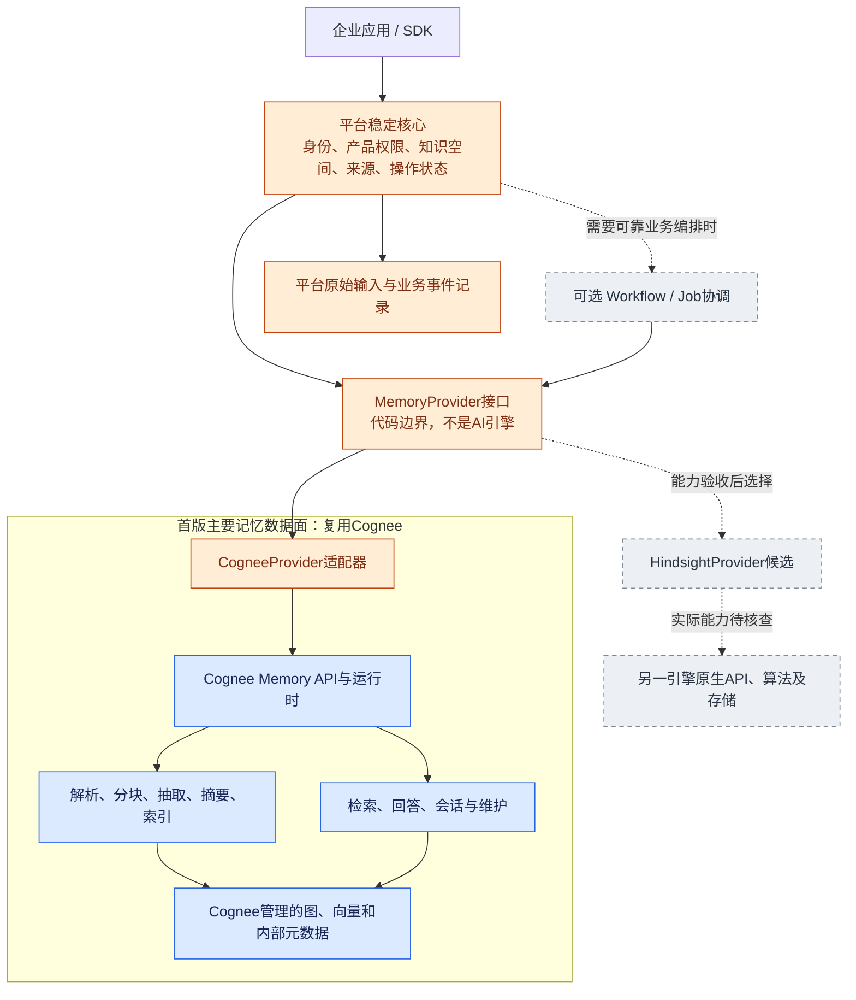

# V3 架构反思：先明确整个记忆引擎的插件边界

本节仅基于已有 V3 设计反思，不核实 Hindsight 的具体能力，也不宣称两种引擎现在可以无损互换。用户指出 Cognee 在图里只剩小块、Workflow 与 MemoryBackend 职责不清，这不是图形美化问题，而是 V3 混合了两种不同的替换目标。

## 1. V3 真正的问题

**整引擎插件与内部组件插件混在一起。** 更换 Cognee 为另一个记忆系统，要求产品面对不同的记忆引擎保持稳定；更换 Cognee 的分块器、Embedding 或向量库，要求进入 Cognee 内部结构。前者可以通过粗粒度 Provider 实现，后者可能需要长期维护一个深度改造的 Cognee 分支。两者并非同一条逐渐细分的必经路线。V3 把它们画在同一棵接口树下，容易让用户以为“先拆完 Cognee，才能换 Hindsight”。实际上整引擎替换可以先做，内部组件改造只有收益足够时才做。

**八接口与规范图可能过早固定了 Cognee 的实现语义。** V3 的 ChunkManifest、CanonicalGraph、GraphStore、VectorIndex 对 Cognee 很自然，却不应是每个 MemoryProvider 的准入要求。另一引擎可能不能公开同样的中间模型，或采取不同的记忆单位；要求它导出同样的规范图，可能变成绕开其原生算法重新实现一遍。平台稳定边界应来自产品要求，而不是把已读源码中的模块逐一抽象成端口。

**图把未来平台能力画得大、把现有 Cognee 画得小。** 首版的解析、分块、知识抽取、索引、检索、回答及部分记忆维护仍主要由 Cognee 承担。把这些全部提前命名为平台服务，会掩盖实际复用比例，也使用户误以为我们准备重写一个AI记忆引擎。应把 CogneeProvider 内部的运行时和存储职责展开，并标明尚未抽离。

**Workflow 与 Provider 原生执行可能发生双重调度。** 若 Provider 已提供异步作业，平台 Workflow 不应把每次轮询超时当成重新提交任务的理由。业务调度器和引擎原生任务各有什么状态、重试权和取消权，必须说清；“用了Temporal所以可靠”不能替代这一合同。

这些是设计优先级和表达问题，不否定 V3 对隐性类型耦合、迁移代价和失败边界的分析。建议把其细组件接口降为可选演进材料，把主架构收敛到整引擎插件。

## 2. MemoryBackend 不是一个新的AI引擎

建议用户文档统一称 **MemoryProvider 接口**，减少 MemoryBackend、runtime、backend、engine 多重名称。它只是平台代码里的接口及对应适配器，不负责新建一套抽取、推理或检索算法，也不要求部署一个“MemoryBackend微服务”。

首版：业务代码调用接口，CogneeProvider 转换身份、作用域、输入和结果，再调用 Cognee。可以直接内嵌 Python 库；若未来 Provider 是远程服务，则由适配器负责HTTP连接。调用方式不同不改变产品接口。

Workflow 只负责需要可靠执行的业务过程，例如接收资料后提交处理、等待就绪、发送产品通知。它是可选的调度实现，不负责记忆内容如何分块、关联、检索或回答。首版若尚无复杂业务流程，可以只用已有持久Job方案，不必为图上完整而引入工作流产品。

图里的 Cognee 数据面是逻辑职责，可在API/查询与导入worker中运行，不表示首版重新合并部署。另一 Provider 是否作为库嵌入或独立服务，取决于其原生产品；目前不预判。

## 3. 更小的稳定核心：业务合同 + 能力声明 + 原生扩展

平台必须固定的是：谁能调用、在哪个产品知识空间调用、输入是什么、如何识别一次操作、结果如何展示、删除承诺是什么。无需第一天拥有所有引擎内部的实体和图表示。

| 边界 | 平台稳定合同 | 不应强行统一的内容 |
|---|---|---|
| 身份与范围 | principal、tenant、knowledge_space、权限与审计 | provider内部用户、库、bank、collection等具体对象 |
| 输入 | 平台record_id/version、内容或受控原件引用、来源和业务metadata | 必须有某种DocumentChunk、graph_model或固定分块算法 |
| 记忆写入 | submit操作、幂等身份、同步结果或operation handle、可见性状态 | 必须同步完成；必须暴露每个抽取阶段 |
| 记忆读取 | query、授权范围、预算、要求的输出模式 → 结果与来源/能力说明 | 必须返回图；候选分数跨provider直接可比 |
| 受控删除 | 指定逻辑范围/record、删除状态与已约定效果 | 每个provider都支持完全相同粒度及立即物理擦除 |
| 执行跟踪 | 可选get_operation/cancel，平台状态映射 | cancel_requested等于内部已停止；超时等于失败 |

能力声明是合同的一部分：同步/异步、是否支持请求幂等、来源定位、所需删除粒度、会话记忆、维护、导出、结果模式、操作查询与取消、隔离保证。平台先按产品能力画像选择可用 Provider，必需能力缺失就拒绝路由，不静默删减产品功能。

结果可采用最小稳定封套：items、可选answer、source_refs、operation/visibility、usage及provider扩展。answer没有能力就不能伪造；来源只有资料级而非字符级时如实表达。若产品必须逐句引用，那就是 Provider 的硬准入要求，不能为了插件数量降低到没有来源。

保留明确版本化的原生扩展，例如 `extensions.cognee`。需要Cognee特有图能力的产品功能可显式调用该扩展，并被标为不可自动跨引擎迁移；禁止把所有特有字段塞进无类型dict后继续宣传完全中立。

## 4. 谁拥有数据，谁拥有算法

平台拥有逻辑身份、授权门面、资源绑定、原始输入、业务事件和产品保留策略。首版授权可以继续以Cognee ACL为唯一权威，由门面代理；未来更换引擎前，再选择迁出权限权威或建立经过验证的映射，不能形成两个独立grant/revoke系统。

Provider拥有其算法、派生索引与内部运行状态。平台目录保存 `knowledge_space → provider_id + native_scope_id + binding_revision`，不会给既有知识空间换个配置名就立即使用另一套索引。同一空间的一次请求固定绑定；不同空间可选择不同Provider。

ChunkManifest与CanonicalGraph仍有价值，但应改为**可选artifact profile**：只有需要组件级替换、证据验证或导出时才要求相应Provider实现。整引擎互换最低可依赖原件和业务事件重建，不声称这能保留所有学习状态、会话效果和人工修改。无法导出的状态列为迁移限制或不可迁移能力。

平台原件副本也不是绕开Provider删除的理由：删除合同必须覆盖原件、派生索引、会话与备份各自的保留政策。新引擎从原件重建时必须消费删除记录，不能重新导入已删除资料。

## 5. Workflow 与原生异步任务只能各管自己的层级

选一种明确的执行集成模式：

- **库调用模式**：平台worker/Activity等待本次Cognee处理真正结束。Activity失败后如何重试由幂等和已有产物决定；工作流不会保存Cognee内部generator或chunk执行位置。
- **Provider原生异步模式**：平台调用submit取得provider_operation_id并持久保存，随后等待/查询该操作。Provider负责内部task执行；外层不另行认领其内部task。提交响应丢失时先按请求身份对账，能力不支持时承认结果未知，不能直接假设未执行。

业务Workflow可以重试网络请求，不等于可以重复创建引擎作业。取消需传递并确认效果；无法确认时保留取消处理中或待修复状态。平台更新“取消”字段不能替代下游停止写入。每个知识空间修改仍需统一所有权协调，内部锁是否足够由Provider能力验收决定。

## 6. “插件式换Hindsight”分四级验收

| 级别 | 真正含义 | 能否仅改配置 |
|---|---|---|
| 部署配置替换 | 新空间选择另一个Provider及其资源 | 完成该Provider适配与能力验收后可以；不涉及自动搬旧数据 |
| 调用接口替换 | 同一产品功能使用中立输入输出，不改业务代码 | 可以以契约测试证明，但特有功能须协商或显式扩展 |
| 存量语义迁移 | 旧资料、来源、会话、反馈、人工修改与删除记录可迁移/重建 | 需要迁移工程；算法不同可导致回答行为变化，不等于无损复制 |
| 性能替换 | 在相同隔离、质量、成本条件下表现更合适 | 必须实验，不能由插件接口或项目宣传推出 |

HindsightProvider整体替换的前提，是它支持产品所要求的能力、能映射作用域并满足授权/删除语义、能处理新的输入和查询、具备可验收迁移路径。具体支持情况留给专项核查。若只满足前两级，可以先用于新知识空间，旧空间继续Cognee；不要因接口已经跑通就切换既有客户全部数据。

## 7. 可验收的阶段退出标准

1. **稳定接口完成**：业务层不导入Cognee类型；真实CogneeProvider通过写入、查询、删除、错误与身份映射契约测试；产品必需能力列表已冻结。
2. **替代Provider准入**：同一测试集可由另一Provider执行；能力缺失明确拒绝；两个租户同名资料/会话不混淆，删除和来源承诺成立。不能只用mock证明可替换。
3. **存量迁移完成**：一个选定知识空间完成导出或重建，记录无法迁移的内部状态；来源、删除、会话/人工修改按合同对账；用户确认语义变化范围。
4. **切换可恢复**：影子查询不写session/feedback；按空间切换binding；旧端保持追平或明确停写窗口，能够演练回切。旧端落后或已执行不可逆删除时，不宣称指针回切即可恢复全部数据。
5. **性能结论成立**：在相同产品质量和隔离要求下比较延迟、吞吐、成本与恢复行为；确认收益后再决定是否抽离更多内部组件。

最小首版是平台薄核心 + CogneeProvider + Cognee完整记忆数据面；Workflow按可靠业务执行需要加入。以后首先增加另一个整引擎Provider，证明产品级可替换，再决定是否值得拆Cognee内部组件。这比预先统一所有图、块和数据库接口更贴合当前用户目标。
