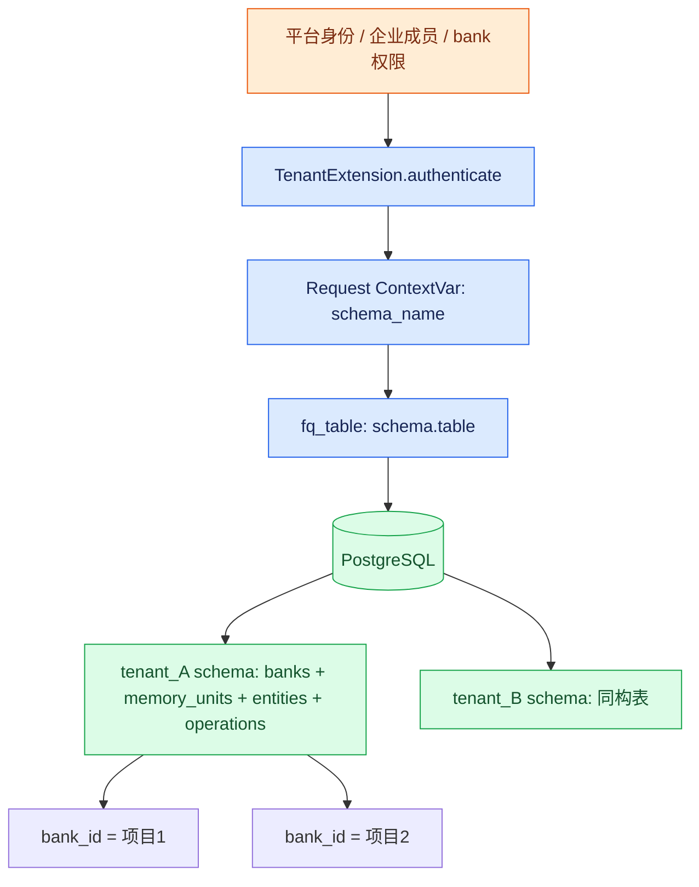

# 11 Hindsight 的存储、租户与原生 Worker：替换可行性的运行时证据

核查对象为 `references/hindsight-source`，Git SHA `12f2d54f643baddacb98cd547c89b1a50c5c3dcc`。下文 `core/` 指 `hindsight-api-slim/hindsight_api/`，其他路径相对 Hindsight 仓库根。只做定向静态核查，未运行服务/故障注入；不把营销描述当成生产保证。

**判断：Hindsight 已经提供可独立扩容的 API/Worker、关系库中的持久任务与恢复机制，因此不需要为了异步 retain 和 consolidation 先引入 Temporal；但它也不是“默认带企业强认证和完整自动故障接管”的 SaaS。它的可替换边界更适合整体 Memory Service，而不是任意图/向量 store 的插件集合。**

## 1. 存储组织：主要是一个 PostgreSQL 中的多种数据结构

官方 [Storage](https://hindsight.vectorize.io/developer/storage) 将 PostgreSQL 作为主要后端，说明 pgvector、全文搜索及关系图组织，并另列 Oracle 支持。源码进一步显示：

| 数据对象 | 实际实现证据 | 架构含义 |
|---|---|---|
| facts / memory_units | `core/alembic/versions/5a366d414dce_initial_schema.py:265-292` 包含 bank_id、document_id、text、embedding、context、时间、fact_type、JSONB metadata；document 外键同时带 bank_id | 向量不是另一个独立向量服务，主要直接作为 memory row 的列 |
| entities | 同文件 `:245-263`，bank_id + canonical_name，`(bank_id, lower(canonical_name))` 唯一索引 | bank 内实体目录；不同 bank 可存在相同实体名 |
| 图关系 | 同文件 `:446-483` 的 memory_links 指向两个 memory_units，可带 entity_id、link_type、weight；`:485` 起 unit_entities 关联单元和实体 | 图是关系表与查询逻辑，不要求 Neo4j。换图数据库会改数据访问与检索实现 |
| 全文与向量索引 | 同文件 `:327-331` 生成 tsvector；`:366-400` 创建向量/全文索引；`:88-95` 根据配置选择 diskann/vchordrq/scann/hnsw | 可切索引实现不等于可自由切换 Qdrant/Milvus/OpenSearch 服务；初始 schema 后还有迁移与启动时结构更新 |
| 异步操作 | 同文件 `:217-243` 建 async_operations；后续 `core/alembic/versions/l7g8h9i0j1k2_add_worker_columns.py` 增 worker 字段；当前 claim 使用 payload/retry/worker/status | 数据、操作状态和任务提交能共享数据库事务，无需另有消息 broker 才能启动 |

初始迁移中的 `Vector(384)` 只是基线定义，不能据此声称当前系统固定 384 维；迁移模块还负责 embedding 维度/索引变更，本次未展开全部后续 DDL。

**存储扩展边界有明确限制。** 当前配置把 database_backend 限为 `postgresql`、`oracle`（`core/config.py:2891`），backend/ops 工厂也只分这两种，其他值抛错（`core/engine/db/__init__.py:29-51`）。因此不能逐字照抄官方“没有 storage abstraction”推导当前没有任何后端抽象：源码已有 DatabaseBackend / DataAccessOps 和 Oracle 分支；但这依然不是 Cognee 那种独立 graph adapter + vector adapter 注册机制。本次不验证 Oracle 全功能对等或许可条件，只确认代码入口存在。

另外仓库包含文件存储模块 `core/engine/storage/{postgresql,s3,gcs,azure}.py`。本次只定位到实现文件，未验证配置、默认值或上传生命周期；不能将官方“all state in PostgreSQL”扩展为任意部署下文件永远只在 PostgreSQL。

## 2. tenant schema 和 bank_id 是两层不同边界

- **tenant schema：**MemoryEngine 调用 TenantExtension.authenticate，再把返回 schema_name 放入 ContextVar（`core/engine/memory_engine.py:2855-2892`）；PostgreSQL `fq_table` 拼成当前 schema 的表名（`core/engine/schema.py:16-27`）。这与 Cognee 的 Tenant 仅组织 ACL、Dataset 路由图/向量库不同。
- **bank_id：**同一 schema 内 memory_units、entities、async_operations 都有 bank_id 字段，引用前述迁移。它是记忆集合/业务 scope，不是凭证，也不是独立 PostgreSQL schema。知道或构造 bank_id 本身并不证明获准访问。
- **运行时隔离强度：**这里证实的是“验证身份→选 schema→限定 SQL 表”的应用路由隔离；没有在已读路径证明每租户独立数据库登录角色、RLS 或无法跨 schema 的数据库权限边界。不要把 schema 命名空间直接包装成已验证的硬安全隔离。
- **后台上下文：**internal RequestContext 跳过重复认证，任务由 execute_task 从 `_schema` 恢复上下文（`core/engine/memory_engine.py:2876-2880`）；因此提交入口必须绑定可信租户，不能允许终端用户任意传内部标识。撤权后的已投递任务是否继续执行，需平台策略，而不能假定会再次认证。

## 3. 默认认证与开源扩展的实际可用性

| 方式 | 已核实行为 | 企业化缺口 |
|---|---|---|
| 默认 DefaultTenantExtension | 未配 tenant extension 时使用默认类（`core/engine/memory_engine.py:2738-2742`）；authenticate 不验证任何凭据，直接返回配置 schema（`core/extensions/builtin/tenant.py:29-41`） | 默认服务不是多租 SaaS 强认证入口；应置于受控网络/平台认证后面或启用扩展 |
| 内置 ApiKeyTenantExtension | 比较单个环境 API key；所有合法请求都返回同一个 database_schema（同文件 `:63-79`）；MCP auth 还能配置绕过（`:81-90`） | 单共享 key 保护，不是多用户、组织成员或每 bank ACL |
| StaticKeysTenantExtension | 仓库 `hindsight-extensions/static-keys-tenant/hindsight_ext_static_keys_tenant/extension.py:263-321` 验 key、初始化schema、写 request tenant_id/api_key_id，返回用户schema；`:354-356` 枚举worker需要的租户 | 可自托管，是真实代码而非云独占接口；环境静态keys适合受控场景，不自动提供企业组织/角色/每bank分享权限 |
| SupabaseTenantExtension | 源码位于 `hindsight-extensions/supabase-tenant/hindsight_ext_supabase_tenant/extension.py`；`:288-334` 认证并返回用户schema，`:348-352` 有 JWT 验证分支 | 外部扩展需额外打包/依赖与配置；本次只定位及定向读取，不声称完整验证全部认证分支 |
| 自定义 Tenant / OperationValidator | TenantExtension 的 authenticate、list_tenants 契约见 `core/extensions/tenant.py:54-104`；官方 [Extensions](https://hindsight.vectorize.io/developer/extensions) 描述 operation validation、权限/配额等挂钩 | 平台企业Tenant、多成员、bank ACL和计费可接这些扩展；需要实现，不应当成默认已具备 |

扩展代码随当前主仓可读，根 LICENSE 为 MIT；这里只报告仓库许可证标识，不作全面许可证审计。官方文档说明 static-keys/Supabase 不随默认镜像内置，需要自建镜像安装，并让 API/worker 加载同一扩展配置；不能仅复制一个环境变量就假定包已存在。[Extensions](https://hindsight.vectorize.io/developer/extensions)

StaticKeys 的 schema 初始化有进程内锁与缓存（其 `extension.py:239-244`、`:304-311`），最终调用 migration（`:339-344`）；migration 模块使用 PostgreSQL advisory lock（`core/migrations.py:432-479`）。这比单纯进程内防重更完整，但不等于本次已经验证上千 schema 迁移吞吐。

**建议企业映射：**平台企业 Tenant → Hindsight schema，平台项目/知识集合 → schema 内 bank_id；多个 User 访问同一个企业 schema 时，由平台或 OperationValidator 检查具体 bank 权限。StaticKeys/Supabase 默认按“用户→schema”组织，若企业需要多成员共享，应该显式定制此映射，不能把每个成员各自 schema 当成天然共享知识库。

## 4. 原生 Worker：已经有持久化领取与恢复，不需要先搭 Temporal

官方 [Services](https://hindsight.vectorize.io/developer/services) 明确独立 hindsight-worker 与 PostgreSQL broker。源码支持这一部署形态：

| 机制 | 代码证据 | 可以承诺的范围 |
|---|---|---|
| 独立进程入口 | `hindsight-api-slim/pyproject.toml:179`；`core/worker/main.py:230-235` 使用配置 worker_id 或 hostname | 可独立部署和扩容 worker；API 默认内部worker开启（`core/config.py:1833-1839`），可以关闭后运行独立worker |
| 任务持久化 | `core/engine/task_backend.py:126-148` WorkerTaskBackend 不重复提交，依赖已持久化 async_operations；`:218-247` BrokerTaskBackend 更新/插入 payload；具体 child operation 单条 INSERT 同时写 payload+status（`core/engine/memory_engine.py:22050-22075`） | 不是只有 asyncio.create_task 的进程内队列；任务可在进程重启后恢复，但任务结果副作用幂等仍需逐操作验证 |
| 并发领取 | `core/worker/poller.py:686-697` 在事务中调用 ops.claim_tasks；`core/engine/db/ops_postgresql.py:1813-1820` 使用 FOR UPDATE SKIP LOCKED；`:1894-1916` 把行标 processing并写worker_id/claimed_at | 同时领取的竞争有数据库行锁保护；这不是全执行过程长事务，也不是 exactly-once 证明 |
| 多租户轮询 | `core/worker/poller.py:404-408` 从扩展 list_tenants 枚举schemas；`:524-564` 按容量领取，`:609-650` 轮转公平性 | API与worker必须共享schema发现逻辑；worker不装扩展会遗漏租户任务 |
| 重试与延期 | `core/worker/poller.py:1019-1043` 更新pending、next_retry_at，区分重试计数和延期 | 原生具备重试/延后机制，额外Temporal不是这些基础能力的必需依赖 |
| 重启恢复 | `core/worker/poller.py:1295-1332` 只找 `worker_id=本worker` 的 processing，未超重试上限回pending，否则failed；`:1353-1387` 跨schema恢复并处理父子残留；`:1628` 启动执行 | 依赖稳定且唯一的worker_id；恢复不是任意新worker自动认领任意死worker的行 |
| 优雅退出/人工回收 | `core/worker/poller.py:1752-1756` 释放自身未完成任务；`core/admin/cli.py:1327-1347` decommission重置指定worker任务；`:1353-1355` 指定schema，默认public | 删除/永久缩容worker前需要回收；多schema运维要明确覆盖目标schemas，不可仅执行默认public一次就认定所有租户都回收 |

仓库 Helm 使用 StatefulSet，并把 `metadata.name` 注入 `HINDSIGHT_API_WORKER_ID`（`helm/hindsight/templates/worker-statefulset.yaml:3`、`:63-66`），与稳定身份恢复相匹配。

### heartbeat 必须区分“进度可观测”与“租约故障转移”

源码**有持久化进度 heartbeat**：`core/engine/memory_engine.py:4457-4498` 更新 async_operations.result_metadata.progress 与 updated_at，在阶段/batch边界 best-effort 记录，失败不会中断主任务。它帮助判断执行是否卡住。

本次在 worker/poller 和 PostgreSQL claim 查询中**未发现基于 heartbeat 到期的租约/fencing 自动接管机制**；已确认的是同 worker_id 重启恢复及 admin decommission。不要把 progress heartbeat 推导为“其他worker在TTL到期后自动安全接管”。若平台需要永久节点丢失后的自动恢复，可用稳定StatefulSet重启和明确decommission控制器；如新增租约，需同时处理旧执行者仍运行、LLM副作用重复和 fencing，而不只是判断 updated_at 过旧。

**因此：**小至中型产品可先复用原生worker/operations/重试，平台补任务观测、伸缩与故障处置；只有涉及跨多服务长事务/补偿/人工审批等需求，才评估外部工作流编排。此结论基于原生机制是否覆盖基本异步处理，不承诺其已满足特定SLA。

## 5. 替换 Cognee 时的平台责任如何变化

| 维度 | Hindsight 原生可复用 | 平台仍需承担 |
|---|---|---|
| 存储 | PostgreSQL中的facts/向量/全文/图关系，Oracle已有实现分支 | 数据库HA、容量、备份、租户schema策略；任意外部图/向量引擎属于深度改造 |
| 执行 | durable operations、独立worker、claim、重试、进度、同身份恢复 | 稳定worker身份、退出回收、灾难恢复演练、幂等/重复执行验证、跨业务编排 |
| 租户 | TenantExtension、schema上下文、bank scope、已有static keys/Supabase扩展 | 企业组织与成员、同企业多bank ACL、配额计费、撤权后的后台任务规则 |
| 替换边界 | 把 Hindsight 当成 Memory Service，由平台调用API | 不把 Cognee task/graph/vector adapter 直接插进去；输入输出/记忆语义转换由另一个分析模块评估 |

## 6. 实际阅读边界

定向阅读包括：内置 tenant extension 1-90 全文；schema helper 1-58 全文；memory_engine 2738-2742、2855-2892、4457-4498、22050-22075；static-keys extension 263-321 及配置/初始化/枚举的搜索定位；worker poller 的构造与schema/claim方法索引、654-716、1238-1257、1287-1395、1610-1645；ops_postgresql 1798-1830、1890-1920；task_backend 126-247的定位与可见段；初始迁移重点217-294、327-400、446-492；admin回收1327-1381。多个命令输出被工具截断，未可见部分不算全文阅读；migrations/Helm/config/Supabase为定向定位，不宣称完整安全审计。已对照官方 Storage/Services/Extensions/Installation，但源码版本结论不从文案直接推导。
