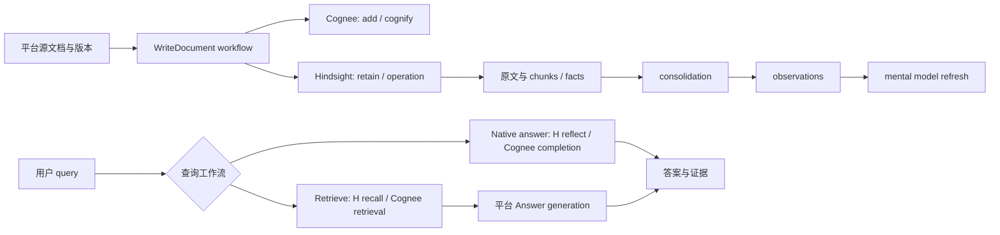

# 11：Hindsight 替换验证——能力契约不能按函数名对齐

结论：Hindsight 可以作为“具备自有事实模型、检索和生成流程的记忆引擎”接入，但不是 Cognee 的无损同义实现。平台应拆开写入、检索、答案生成、派生记忆维护、源文档管理和迁移契约。仅给 MemoryBackend 一个 remember/recall/improve 接口，会把语义差异隐藏进适配器，后续更难演进。

核查版本：Hindsight 主仓 SHA `12f2d54f643baddacb98cd547c89b1a50c5c3dcc`；本地根 `Hindsight ??????`。下文 H 路径均相对 `hindsight-api-slim/hindsight_api/`，C 路径相对当前 Cognee 仓库。只读核查，不跑模型、数据库或服务。官方站点为补充说明，执行代码优先。

## 1. 可替换能力映射

| 平台能力 | 当前 Cognee | Hindsight 实际语义与证据 | 建议契约 / 替换限制 |
|---|---|---|---|
| ingest / upsert source | add 保存原文/SQL；cognify 执行分块、图抽取和存储；remember 合并上层动作。复用 06/09 | retain 把输入分块、抽取事实并建立链接。MemoryItem 包含 document_id/context/metadata；同 document_id 项归为同文档，未指定会生成 ID；update_mode 有 replace/append。H `api/http.py:1178-1184,1257-1266`；`engine/retain/orchestrator.py:1269-1320` | WriteDocument 返回 SourceVersionRef、OperationRef 和可见性阶段。retain 可以承接“持久记忆写入”，不宜人为要求它暴露与 Cognee 完全相同的 add→cognify 两次调用 |
| retrieve | Cognee search 的 CHUNKS/RAG/GRAPH 等分支返回对象/context/completion，不能概括成统一算法。C `cognee/modules/retrieval/base_retriever.py:42-96` | Hindsight recall 返回 MemoryFact 列表，不是最终自然语言答案。结果含 fact type、document_id、chunk_id、tags、scores；可附 chunks、source_facts。H `engine/response_models.py:364-407,473-495` | Retrieve 返回 EvidenceSet/Candidate[]，明确事实、原文片段和派生观察的区别；H recall 更接近 Cognee 的检索阶段，不能直接等同 Cognee 高层 recall 默认行为 |
| answer / grounded reasoning | Cognee GraphCompletion 等检索器完成 context→LLM；高层 recall 还存在 session/feedback 副作用，见 06/09 | reflect 是 agentic 查询：工具取 mental models、事实、observations 和原文 context，再生成答案。H `engine/memory_engine.py:15050-15117`；HTTP 输出 text、based_on、structured_output，based_on 需 include.facts。H `api/http.py:1691-1753` | Answer 返回 text/structured data、evidence references、usage、native trace。可用 H reflect，或平台直接对 H recall 的证据做生成；这两种是不同 workflow profile |
| enrich / consolidate / refresh | Cognee improve/memify 是图增强任务，不能由名称推断同算法 | H observations 是多条事实的持久化归纳；mental model 是保存的主题/查询摘要，具 source_query/content/trigger，可独立刷新。H `engine/memory_engine.py:16974-17028`；`engine/mental_model_refresh.py:1-12` | 能力单独表达为 Consolidate 与 RefreshDerivedArtifact；不得把 reflect 映射 improve。H reflect 本身为读取记忆并合成答案，持久更新 mental model 要走相应创建/刷新 workflow |
| async operation | Cognee pipeline/run 与调用模式需由调度层适配，见调度章 | RetainRequest 默认同步；async=true 返回可追踪 operation；允许客户端指定 UUID operation_id，协议要求重复提交复用原操作，同 ID 属于不同操作时报冲突。H `api/http.py:1289-1337,1407-1435` | OperationRef 必须带 provider、bank/dataset、native ID、工作流阶段；HTTP 已接受不等于事实可查询，更不等于所有 consolidation/refresh 完成。只把该操作的 completed 解释为该 handler 成功 |
| get source / evidence expansion | Cognee 原始文件、派生文本、DocumentChunk 分别保留 | H 原文与 chunks 默认保存；recall 可请求原文 chunks；关闭保存配置时只留 hash/元数据和抽取事实，详见下一节 | EvidenceRef 应区分平台原始 binary URI、解析文本、provider document/chunk/fact refs；不能用一个 source_id 吞掉所有身份 |
| delete source | Cognee 删除涉及图/向量/source refs，见 06 | H delete_document 删除源事实/links，失效相关 observations，安排 graph/entity 维护，删除文件放在事务后；必要时再提交 consolidation 和派生内容 refresh。H `engine/memory_engine.py:10152-10350` | DeleteReceipt 区分 accepted、source unavailable、derived cleanup pending、complete。不能承诺单次返回即所有派生内容及外部文件物理清除已完成 |
| portability | Cognee DataPoint/DocumentChunk 与类名/ID/index/provenance 耦合，见 10 | H transfer 是 H 原生 schema 的逻辑迁移：保存抽取事实/文档、目标侧重嵌入和解析实体，重建 links。bank restore 还支持派生状态，详见第四节 | Export/Import 是扩展能力；跨引擎迁移通常由平台原始文档重放+对照评测，不能把 H ZIP 当成通用 MemoryArchive |

[官方 Recall](https://hindsight.vectorize.io/developer/api/recall)和[官方 Reflect](https://hindsight.vectorize.io/developer/api/reflect)分别说明检索事实与生成回答；上述映射以对应返回模型和入口实现为准。

## 2. 原文、分块和身份：不能把“抽取记忆”理解成“不存原文”

**代码事实**：H `config.py:1681` 的 DEFAULT_STORE_DOCUMENT_TEXT 为 True。`engine/retain/fact_storage.py:364-416` 按解析后的 store_document_text 保存 combined_content 为 documents.original_text；关闭时存 NULL，但继续保留内容 hash。`engine/retain/chunk_storage.py:250-312` 同配置控制 chunks.chunk_text，关闭时存空串而保留 hash。对于拥有专用 document store 的实现，SQL 文本可以为空但内容移到该 store，不代表系统整体丢弃原文。官方 Documents 也描述保存原始文本和 chunks。[官方 Documents](https://hindsight.vectorize.io/developer/api/documents)

因此官方 retain 页面若出现“原内容不直接作为记忆事实保存”之类描述，不能扩大成“整个产品不持久化原文”。抽取事实是检索中心，与另外保留 source document/chunk 是兼容的设计。还须区分原文文本与原始 PDF/图像字节：本轮代码确认删除流程会读取 uploaded original 的 file_storage_key（H `engine/memory_engine.py:10240-10246`），但未完整核查所有文件/附件上传路径，不能承诺每种输入都保存原始 binary。

同 document_id 的 replace 是内容更新语义，不必意味着每次无条件重跑全部模型：retain orchestrator 明确支持 delta retain，未变化的 chunks 保留已有事实/实体/links（H `engine/retain/orchestrator.py:1303-1313`）。chunk ID 使用 bank/document/index 派生；Cognee 默认 chunk ID 是 document/hash/occurrence 的 uuid5（C `cognee/modules/chunking/chunk_id.py:15-22`）。两套 ID 必须映射，不能直接拼接或假定稳定性规则相同。

建议平台自己的 SourceRef = tenant + logical_document_id + revision，另存 ProviderBinding = engine/version + bank + native_document_id；EvidenceRef 再携带 native fact/chunk IDs 与平台原文位置。对于批次重试，保留 operation 幂等身份；对于文档更新，明确 source revision 与 replace/append 策略。二者不是同一种幂等键。

## 3. 原生能力应保留，不压扁成最低共同子集

Hindsight 中 `world` 是外部事实；`experience` 表示 bank/agent 自己的行动和经历。抽取模型的 `assistant` 分类被转换为持久层 `experience`，其他类别回落 world（H `engine/retain/fact_extraction.py:2167-2176`）。如果需求使用“own memory”概念，当前版本应映射到 experience 的明确语义，不要创建名为 own 的不存在的 fact_type，也不要将所有对话事实都归为 agent 自身经历。

Observations 是归纳的记忆，带源事实引用；recall 可以返回 source_fact_ids/source_facts，且 token budget 可使 source_facts 不完整，需要读取 source_facts_truncated 标记（H `engine/response_models.py:397-407,486-495`）。不能将缺少源事实返回条目直接判定为数据库断链。[官方 Observations](https://hindsight.vectorize.io/developer/observations)

Mental models 是原生持久派生内容，创建参数包含 source_query、content、trigger；refresh 可运行 reflect 并更新持久文档，与直接 reflect 回答分开。官方还提供独立模型管理接口。[官方 Mental Models](https://hindsight.vectorize.io/developer/api/mental-models)

建议采用基础端口 + capability descriptor：基础为 WriteDocument/Retrieve/Answer/DeleteDocument/GetOperation；扩展包括 Consolidate、MentalModel CRUD/Refresh、ExperiencePerspective、NativeTransfer、EvidenceExpansion。业务先声明所需能力，再选择引擎/workflow；不支持时明确报不支持或采用有名称、可评测的降级流程。不要让同名 improve 在不同后端悄悄执行不同任务。

图中业务 workflow 与后端内部任务分两层：平台负责源文档版本、调用/轮询、重试与完成条件；Hindsight 自己负责 retain、consolidation、refresh 内部处理。直接调用 reflect 不应画成把结果写回事实或 observations。这里的“只读”限定记忆内容语义，不声称调用完全没有审计、计量或缓存等副作用。

异步操作状态有 pending/processing/completed/failed/cancelled；取消运行中的任务是合作式，已提交部分不会回滚。平台重试/取消必须显式表示 partial effects，不能假装通用任务事务。[官方 Operations](https://hindsight.vectorize.io/developer/api/operations) 本轮只核查接口模型和文档，不重复审计 worker 领取、租约及隔离实现。

## 4. Transfer：可迁移，但不是数据库快照，也不是跨 Cognee 的无损格式

**文档级 transfer**：H `engine/transfer/schema.py:135-225` 保存事实文本、时间、metadata/tags、实体名、causal relations、chunk index，以及文档 original_text/retain_params/chunks。embedding 不携带；source_id 用于后续修复证据映射，目标侧会重新分配事实 ID。`engine/transfer/importer.py:193-238` 明确提供 skip/replace/new-id 冲突策略。导入重放抽取后的确定性阶段，重嵌入、实体解析和 links 重建；不需要再次调用抽取 LLM，但仍会调用 embedding 模型（H `engine/transfer/importer.py:1-7`）。不要把“No LLM extraction”写成“离线无模型成本”。

**observations 不是永远被排除**：文档导出默认 include_observations=False；开启时限完整 bank 导出且要求来源可解析。执行代码在 H `engine/transfer/export.py:222-283`。旧 `transfer/__init__.py` 的概括注释与当前可选能力不完全一致，应以 export 实现为准。导入 observation 时其所有源事实都必须映射成功，否则跳过；导入本身不与现有 observation 归并，重复导入可能形成语义重叠（H `engine/transfer/importer.py:1540-1584`）。

**whole-bank transfer**：scope 分 data/bank_config/history。data 包括 documents/chunks/facts、observations、attachments/blobs、部分操作/维护状态、mental models 与 refresh history、knowledge-page tree；bank_config 包含 bank 配置/directives/webhooks；history 是 audit_log/llm_requests。H `engine/transfer/schema.py:26-69`；`engine/transfer/export.py:526-575`。这已超出“只导出源文档”的能力。

**whole-bank import 不合并现有 bank**：目标必须不存在；可指定新 bank ID。重嵌入、重建索引与 links，恢复 observations/mental models；不主动触发 retain webhooks、consolidation 或 graph maintenance，以保留导出的状态。H `engine/transfer/importer.py:943-1001`。不能用它对一个在写入的现有 bank 增量合并。schema_version 必须匹配当前接受版本，见同文件 163–177。

跨 Cognee→Hindsight 的建议路径仍是平台原始文档/解析文本重放，生成 H 原生 facts，再以固定查询集验证命中、证据、更新/删除和时序语义。若迁移已有 Cognee 图边为 H facts，应视为另外一个显式转换产品：实体身份、关系表示、时间和 provenance 都需映射，不能利用 H transfer 的存在就宣称该转换已实现。派生 observations/mental models 可以保存在 provider-native extension artifact 中，避免为迁就共同字段而丢失原生能力。

## 5. 替换验证的可交付条件

平台契约需要回答：写入返回时何种数据已可查；派生层何时更新；查询返回事实还是答案；哪些 evidence 完整可取；删除何时达到不可查询与物理清理；哪些模型/配置版本进入结果；导出是否包括原文与原生状态。建议让 provider adapter 只做身份/协议/能力映射，workflow 负责有状态阶段、轮询、超时和补偿。这样换引擎时可以保留业务流程，也能明确更换某条 backend-specific 子流程，而不是把所有逻辑堆在 MemoryBackend 对象里。

最小对照用例：同文档重复写入、replace 与 append、异步应答丢失后重复提交、取消已部分处理批次、world/experience 分类、纯检索与答案生成分别评测、包含 chunks/source_facts 的证据完整性、删除后 observation/mental model 更新、文档导入三种冲突策略、whole-bank 新 bank 恢复与模型更换。以上为待实施验收，不是已跑测试。

## 6. 实际阅读范围

本轮为八分钟左右的限定补查，阅读的是大文件指定区间与接口模型，未声称全文件或全仓覆盖。H API http.py：1178–1207、1250–1339、1691–1753；retain fact_storage.py：364–416；chunk_storage.py：250–312；orchestrator.py：1269–1320；fact_extraction.py：2160–2180；response_models.py：350–411、446–551；memory_engine.py：7894–7955、10152–10351、15050–15127、16974–17028；mental_model_refresh.py：1–16；transfer schema.py：1–70、135–232；export.py：434–500、515–575；importer.py：1–16、193–238、943–1001、1540–1608。其他 transfer 可选参数、config 默认值及 source_id/operation_id 是 rg 定位证据。官方概览、retain、recall、reflect、documents、operations、observations、mental models 页面已浏览；未全面核查所有 router、所有检索算法分支、文件上传、attachment store、worker 或租户隔离。

特别限制：部分大函数 docstring 保留旧措辞（如 reflect 的 based_on 描述）；接口能力判断优先采用实际 Pydantic HTTP 返回模型，不能照抄旧例子中的 opinion 等键作为当前必有能力。未修改两仓业务代码，未运行服务/模型，未宣称已证明 Hindsight 满足生产集群性能或全部故障一致性要求。
