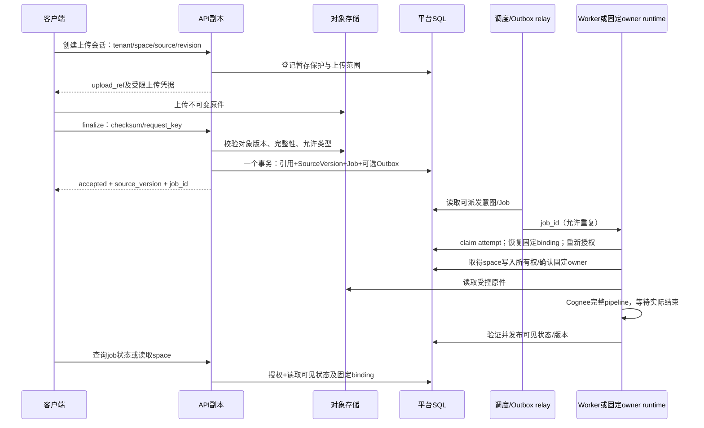
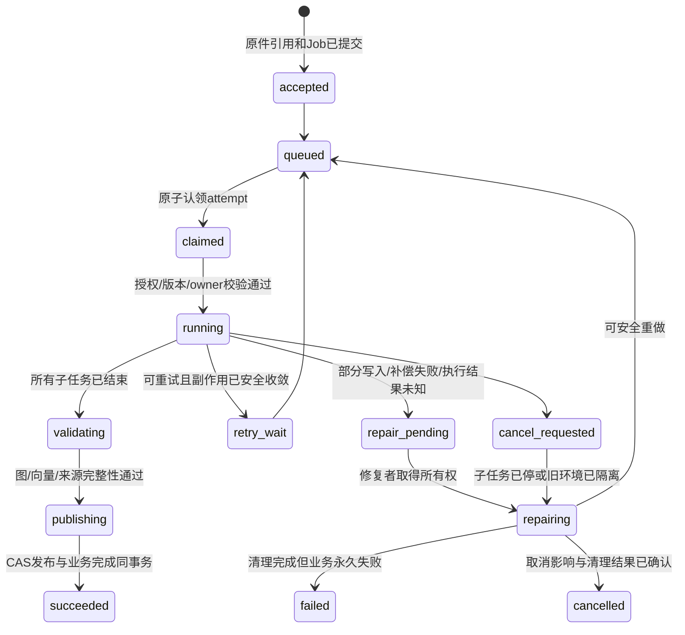
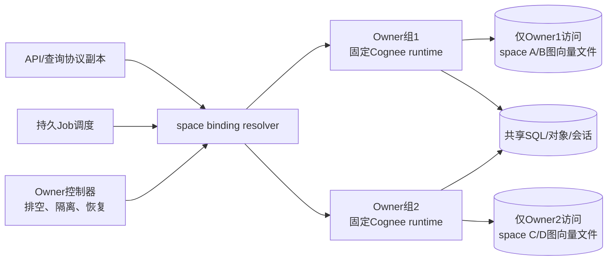

# V5 执行生命周期：从上传接收到集群接管

> 类型：源码证据 + 目标设计。代码基线为 Cognee `663a2dc15d04bc0d7ec2733a2dd604b7ed1b8c8e`；本轮确认相关工作树无差异。只核查执行、准入、补偿与恢复代码，不替代认证和存储专项。目标业务为 tenant 内 groups/spaces；每个 space 固定一份 Provider binding，可选择 Cognee 或通过迁移切换其他 Provider。
>
> 本文没有运行故障注入、数据库集群或云平台；设计保证均须通过末尾验收，不属于当前代码已有能力。

## 1. 当前执行能力及其真实边界

| 已核实事实 | 集群含义 | 固定源码证据 |
|---|---|---|
| dataset-aware pipeline解析授权Dataset，一次调用多个Dataset时顺序执行；每Dataset加锁再取数据 | 可复用完整Dataset pipeline作为首版作业粒度 | [pipeline.py L87–167](https://github.com/topoteretes/cognee/blob/663a2dc15d04bc0d7ec2733a2dd604b7ed1b8c8e/cognee/modules/pipelines/operations/pipeline.py#L87-L167) |
| 同Dataset锁是进程内asyncio registry；源码明确不保护多worker | API扩副本不能获得同Dataset跨进程互斥 | [dataset_lock.py L18–34](https://github.com/topoteretes/cognee/blob/663a2dc15d04bc0d7ec2733a2dd604b7ed1b8c8e/cognee/infrastructure/locks/dataset_lock.py#L18-L34) |
| background process函数实际创建同事件循环Task，持有私有强引用集合 | 不是远程worker，也不是持久消息 | [pipeline_execution_mode.py L104–127](https://github.com/topoteretes/cognee/blob/663a2dc15d04bc0d7ec2733a2dd604b7ed1b8c8e/cognee/modules/pipelines/layers/pipeline_execution_mode.py#L104-L127) |
| run_tasks先记STARTED并yield，再进入数据库上下文；所有item同时建Task，以每run semaphore限制运行数 | STARTED不代表任务已获得数据库资源；本地并发上限不是全局租户预算 | [run_tasks.py L66–121](https://github.com/topoteretes/cognee/blob/663a2dc15d04bc0d7ec2733a2dd604b7ed1b8c8e/cognee/modules/pipelines/operations/run_tasks.py#L66-L121)、[L182–215](https://github.com/topoteretes/cognee/blob/663a2dc15d04bc0d7ec2733a2dd604b7ed1b8c8e/cognee/modules/pipelines/operations/run_tasks.py#L182-L215) |
| DatasetQueue以(task,dataset)计slot，进程单例；默认空闲TTL为600秒 | 保留其本机资源保护，但不能当任务broker或dataset互斥锁 | [queue.py L78–93](https://github.com/topoteretes/cognee/blob/663a2dc15d04bc0d7ec2733a2dd604b7ed1b8c8e/cognee/infrastructure/databases/dataset_queue/queue.py#L78-L93)、[L224–263](https://github.com/topoteretes/cognee/blob/663a2dc15d04bc0d7ec2733a2dd604b7ed1b8c8e/cognee/infrastructure/databases/dataset_queue/queue.py#L224-L263)、[L523–539](https://github.com/topoteretes/cognee/blob/663a2dc15d04bc0d7ec2733a2dd604b7ed1b8c8e/cognee/infrastructure/databases/dataset_queue/queue.py#L523-L539) |
| 进度只更新STARTED行JSON，允许last-write-wins；run_info非Data输入最多512字符摘要 | 审计/展示状态不是租约heartbeat，也不保存可完整重放的输入 | [progress.py L18–55](https://github.com/topoteretes/cognee/blob/663a2dc15d04bc0d7ec2733a2dd604b7ed1b8c8e/cognee/modules/pipelines/operations/log_pipeline_run_progress.py#L18-L55)、[summary.py L5–28](https://github.com/topoteretes/cognee/blob/663a2dc15d04bc0d7ec2733a2dd604b7ed1b8c8e/cognee/modules/pipelines/utils/summarize_run_info_data.py#L5-L28) |
| 增量加载按pipeline_name+dataset_id完成标记跳过整个item | 不是阶段checkpoint；更换配置、generation时不能直接信任旧完成标记 | [run_tasks_data_item.py L197–246](https://github.com/topoteretes/cognee/blob/663a2dc15d04bc0d7ec2733a2dd604b7ed1b8c8e/cognee/modules/pipelines/operations/run_tasks_data_item.py#L197-L246) |

补偿与恢复也存在明确边界：

- run_tasks捕获普通异常与CancelledError；可选graph/relational push发生在COMPLETED之前。但rollback异常只记录日志，随后仍可写ERRORED，故不能把ERRORED当作清理完成。[run_tasks.py L260–350](https://github.com/topoteretes/cognee/blob/663a2dc15d04bc0d7ec2733a2dd604b7ed1b8c8e/cognee/modules/pipelines/operations/run_tasks.py#L260-L350)
- 启动恢复按默认3600秒和STARTED判断遗留任务，cognify补偿时保留已完成文档；未证明远端owner停止，也无跨节点claim。[recovery.py L24–31](https://github.com/topoteretes/cognee/blob/663a2dc15d04bc0d7ec2733a2dd604b7ed1b8c8e/cognee/modules/cognify/recovery.py#L24-L31)、[L48–124](https://github.com/topoteretes/cognee/blob/663a2dc15d04bc0d7ec2733a2dd604b7ed1b8c8e/cognee/modules/cognify/recovery.py#L48-L124)。**推断**：新副本可误补偿另一个运行超过阈值的活跃作业；进度更新不刷新开始时间。
- cognify补偿按run来源撤销，旧ledger路径先删图/向量，后删关系归属与完成标记；顺序有利于保留失败修复依据，但不提供多存储共同事务。[rollback.py L158–193](https://github.com/topoteretes/cognee/blob/663a2dc15d04bc0d7ec2733a2dd604b7ed1b8c8e/cognee/modules/cognify/rollback.py#L158-L193)、[L276–314](https://github.com/topoteretes/cognee/blob/663a2dc15d04bc0d7ec2733a2dd604b7ed1b8c8e/cognee/modules/cognify/rollback.py#L276-L314)
- **待故障注入验证的竞态**：gather默认首个异常即传播、其他item继续；当前incremental默认可硬抛，runner随后进入rollback。必须先令所有子任务静止再补偿。[gather调用](https://github.com/topoteretes/cognee/blob/663a2dc15d04bc0d7ec2733a2dd604b7ed1b8c8e/cognee/modules/pipelines/operations/run_tasks.py#L210-L215)、[硬抛开关](https://github.com/topoteretes/cognee/blob/663a2dc15d04bc0d7ec2733a2dd604b7ed1b8c8e/cognee/modules/pipelines/operations/run_tasks_data_item.py#L281-L282)、[Python语义](https://docs.python.org/3/library/asyncio-task.html#running-tasks-concurrently)。支持Python3.10时显式cancel并await已创建Task，不能无条件依赖3.11才有的TaskGroup。

## 2. 平台端到端流程：先接受，再加工，再对查询可见

以下全部是建议新增。group是tenant内的组织/授权结构，space是产品知识空间及Provider绑定单位；作业固定tenant_id与space_id，group只参与提交/执行时的权限判定，不作为可由客户端任意指定的物理库地址。group成员变化不应暗中改变作业的目标space、owner或Provider。

提交事务之前不能返回“平台已接受作业”；对象字节不在SQL事务中，必须先完成并校验。暂存对象用UploadSession租约/引用状态保护，GC与finalize对同一登记记录互斥或CAS，避免仅靠固定宽限期：进程长暂停后恢复不能提交一个已被GC删除的对象。

最少持久记录：

| 记录 | 必要字段/约束 | 生命周期职责 |
|---|---|---|
| SourceVersion | tenant/space/source/revision、immutable object ref、checksum、desired sequence、tombstone | 原件可重建、更新有序、删除不复活 |
| Job | job_id、tenant/space、actor、binding_revision、provider config、input manifest、request_key/digest、状态 | tenant+space+request_key唯一；相同键不同摘要冲突 |
| Attempt | job_id、attempt、worker/owner、heartbeat、开始结束、错误与已发生副作用 | 执行次数不改变业务作业身份 |
| SpaceOwner | space_id、owner/resource_group、递增epoch、状态 | epoch按space跨Job递增，不能用每Job attempt替代 |
| Outbox | job/event ID、目标、发布状态 | 仅使用broker时需要；与业务提交同事务，投递可重复 |
| Repair / Deletion | scope、目标资源、逐步receipt、重试时间、错误 | 清理失败可追踪、可补做，不靠普通ERRORED隐藏 |

PG直接轮询Job时不必额外部署broker；broker通知不成为第二份权威作业状态。若采用Temporal，以workflow管理调度与重试，平台Job保留业务目录/投影；不要另建一个SQL重试器竞争同一作业。Hindsight原生异步模式则记录provider operation并等待它，不消费其内部队列；具体恢复合同沿用V4核查，不由本节推定。

worker收到job_id后查询可信目录，校验space仍在固定tenant且当前操作仍授权，检查tombstone、source revision、binding revision、凭证版本。使用提交时明确的模型/处理profile，不能从owner当前活动tenant或进程可变环境重新推断。默认撤权后尚未开始的用户作业拒绝执行；系统保留任务如需继续，必须是产品定义的独立服务主体授权。

重复投递先认领现有Job/Attempt，不直接再次调用Cognee。请求幂等、文档版本身份、产物幂等是三个不同层次。新revision的接受分配单调desired sequence；迟到旧revision不得覆盖已接受的更新或删除。内容hash相同也可能是不同业务操作，不能只按hash去重整个API语义。

## 3. 状态机分三层，避免“任务结束”冒充“数据可读”

此外独立保存：

- **可见性**：`empty / serving(revision) / updating_blocked / recovering_blocked / deleting_blocked / deleted`。一个新Job失败不一定要关闭健康的旧版本；原地写坏或删除可能污染旧版本时必须阻断查询。
- **owner**：`ready / draining / suspect / fencing / recovering / ready`。suspect仅表示失联，不等于已安全停止；fencing无法证明成功就不接管同一份嵌入式文件。

源码run_info是审计，不代替这些状态机。补偿也可能失败，repair_pending独立于failed；重试之前先确认旧写者静止。发布事务超时后先读权威Job/binding判定是否已成功，不能盲目回滚一个实际已发布的版本。

## 4. 首版必须选定的两种查询可见性方案

### A. 固定owner原地更新 + space读写准入屏障

这是降低新机制复杂度的可选起步方案，代价是更新期间该space不可查询。owner启动修改前，先把持久serving state设为blocked并关闭准入，再等待所有已授权读请求结束，最后开始修改；修复/完整性核验完成才重新开放。不能仅在API做一次“是否updating”的查询后就放行，检查与获得读permit必须与写者关闭准入互斥。

各读请求全程使用同一owner/binding；更换owner前同样排空旧读permit。所有实际文件访问都经该owner，所以该屏障可保护跨图/向量的整段查询。崩溃后保持blocked，恢复控制器不能只因为新Pod启动就开放。同步任务内的自动维护、反馈写回也纳入同一准入规则，不能隐式越过屏障；嵌套调用要避免持读permit再等待写permit造成死锁。

它不提供在线更新期间的旧版本查询，但比“加一个ready字段、最后过滤结果”更容易证明不会读取半成品。平台如果承诺更新期间仍可用，就应使用下一种机制或经过验证的存储快照协议。

### B. 成套独立generation + 发布binding

建议需要持续可读的SaaS采用这一新增机制：每次构建建立新的Cognee Dataset及图/向量资源，平台space映射到一套active binding；新构建不修改正在服务的图、向量、SQL provenance/完成标记。Dataset不是平台space的永久ID，而是这个space的某个实现版本；平台ACL仍针对space，新Dataset权限/owner映射由适配层管理。

1. 固定SourceVersion清单及处理profile，创建独立build/attempt Dataset及资源，不能共用旧图节点的可变身份空间。
2. 完整重建或经过验证的复制追平。初期按完整space重建估算，成本至少随被处理语料增长；不要把它描述为每次只付新增文档费用。现有完成标记不能跨Dataset/配置照搬。
3. 等所有子任务停止写入，检查来源、节点/边、向量引用与处理版本；sealed generation之后禁止写入。improve等可变维护必须走新版本或另行定义可见性，不得偷偷修改已封存版本。
4. 在平台SQL事务中CAS active binding并完成Job；同时检查expected old binding、space epoch、source desired sequence、cancel状态和tombstone。失败attempt不得发布。
5. 每次查询解析一次active binding；图、向量及来源始终使用同一份。旧generation待已发读者退出，再按保留策略GC。

这是隔离构建与发布设计，不是Cognee开箱功能，也不意味着平台要求Hindsight内部采用相同generation。其他Provider必须声明它自己的可见性能力；无法提供同一产品SLO就不接入该能力画像。

## 5. 嵌入式图：固定owner是所有文件访问的边界

**建议约束：一个space/generation的嵌入式数据库，在任一时刻只由一个受控owner runtime打开和访问。包括写入、recall/search、visualize与修复。** “一个写worker + API副本各开只读engine”不在这个方案内。owner可管理多个不冲突的Dataset文件，但单space不会因此获得多个独立写者。

API中的QueryProvider代理请求给owner，不能直接绕过owner调用本地adapter。通用调度worker负责把Job送到目标owner，首版完整Cognee pipeline在owner内执行；以后可把纯计算卸载到其他worker，但卸载者不能打开同一图文件。进程内部的数据库子进程是同一owner管理的生命周期，不等于另一个可独立接管的业务owner。

与远程图服务路线的区别：网络图/向量服务支持经验证的并发访问时，可以把查询runtime独立扩容，向统一数据库服务访问；数据库内部HA由后端承担。同space业务更新仍需所有权和可见性协议。远程服务不是“无需协调”，嵌入式固定owner也不是“永远不能横向扩容”：后者通过增加owner组放置更多完整space扩容量，不是把一个文件开放给更多写Pod。

### 节点故障和迁移操作规程

| 情况 | 控制器行动 | 可以开始新写者的条件 |
|---|---|---|
| 计划滚动更新/迁移 | owner停止接新Job，关写/读准入，等待执行与读请求结束，flush/close，记录持久checkpoint/目录状态 | 确认旧进程及其数据库子进程退出、文件句柄释放；目标恢复并核验后切binding |
| owner进程崩溃，节点可管理 | 保持space blocked；确认相关进程/子进程已停止；检查文件、WAL与已提交状态 | 引擎恢复检查通过，所有未完成Job按manifest/来源记录对账 |
| 节点失联/网络分区 | 标记suspect，停止新派发；执行云实例终止/断电或经过验证的存储访问fence | 必须取得旧执行环境或旧存储写权限已被隔离的可信证据；仅Pod驱逐、lease超时或更改SQL owner字段不够 |
| 旧节点无法证明已停 | 保持同一文件不可接管；告警与人工/平台隔离 | 不以“提高可用性”为由同时启动第二个文件写者 |
| 只能从备份/原件重建 | 在新独立文件/资源上建立新generation，验证后发布 | 旧binding不可被新请求路由，旧epoch不可提交平台元数据/发布；若做不到，仍须先隔离旧环境 |

所有权epoch按space单调增加，但**写入SQL lease表不会让Ladybug文件识别epoch**。网络撤流只影响新请求，也不会停止旧进程中已运行的任务。存储层拒绝旧节点IO、确定旧节点关闭、或完整隔离输出并控制全部发布/共享元数据，才是可依赖的安全机制。新generation也不能替代对旧任务写共享SQL、会话、外部副作用的限制。

RPO/RTO要按恢复路径报告：持久卷幸存可尝试本地恢复；只有定时备份就有明确备份间隔损失；从原件重建有计算时间和LLM成本，且不能恢复未另行持久化的人工修改/会话学习状态。StatefulSet、卷可挂载、S3存在原件都不是零RPO/自动HA的证明。

资源组扩容：增加owner组后把新space放入新组；迁移旧space走上表计划迁移，不直接修改哈希环让所有请求漂移。热space先限制队列/并发与资源预算，再评估更大owner或迁到远程数据库；不能用增加公共API副本解决单space瓶颈。

## 6. 删除与Provider切换也是持久作业

删除接受时在平台事务记录space/source tombstone和Deletion Job，立即阻止新的导入/旧revision发布。之后按scope使原生资料、图/向量来源、会话、原件和派生内容收敛，逐项保存receipt；对象引用账本和最后的修复依据保留到清理确认。

**图推理泄漏不能通过删citation解决。** 旧generation可能仍含被删除来源推导出的实体、关系、摘要，最终回答即使不附该文档链接也会泄漏。首版删除协议应立刻隔离受影响space/generation的新查询；在干净generation发布，或原地删除及派生清理验证完成之前维持blocking。对已有读请求明确产品线性化点：可等待/取消它们后才宣称删除已对所有请求生效，不能给已返回答案做不可能的撤回承诺。

删除过程中失败进入repair_pending，不能悄悄恢复旧generation服务。仅在已验证能阻止图遍历与派生内容使用被删来源时，才优化为更细粒度删除过滤；这是后续能力，不是默认现状。

space从Cognee切Hindsight时创建新的binding revision：目标重建/追平，所有在途Job保留旧绑定；切换前排空或隔离它们，切换后不允许旧Job向新binding发布。权限属于平台space而非某个Cognee Dataset；group变化不应被当作引擎迁移。保留旧端回退窗口时，tombstone及新变更必须同步追平，否则回切会复活旧数据。Provider原生派生状态的迁移限制另列，不能只搬原件就声称无损。

## 7. 必须故障注入的失败表

| 注入点 | 正确结果/禁止行为 | 需要观察的记录 |
|---|---|---|
| 对象完成、finalize提交前API退出 | 未accepted；暂存受保护且可后续完成/回收，不出现已接受Job缺原件 | UploadSession、object version、SourceVersion |
| SQL提交后HTTP响应丢失 | 同request_key/digest返回原Job；不同摘要拒绝 | Job唯一约束与API receipt |
| relay发布后未记成功 | 允许重复投递，只有一个有效执行/提交；不重复计费业务操作 | Job/Attempt、Outbox、用量事件 |
| item A硬失败、item B延迟写 | B停止并被await后才补偿；不得在补偿后出现B的新写 | task收敛日志、run来源、Repair |
| 图写完、向量/SQL完成前进程退出 | 部分产物不对外可读；修复或重建可追踪 | serving gate/generation、manifest、Repair |
| 超过一小时活跃作业时新API启动 | 不被旧age-based recovery误回滚 | owner heartbeat与唯一恢复claim |
| rollback删图/向量失败 | repair_pending，持续重试/人工接管；ERRORED不代表清理完成 | Deletion/Repair逐步receipt |
| lease超时但旧owner继续运行 | 同文件不出现新写者；旧epoch不能发布；不能仅修改SQL owner后放行 | fence证据、owner epoch、binding CAS |
| 发布成功后网络超时 | 先读已发布版本；不将成功generation作为失败产物删除 | Job与active binding原子结果 |
| 删除与查询/重建竞争 | 旧revision不重新发布；受影响space在清理完成前不可通过旧图回答 | tombstone、read permits、build epoch |
| group撤权/space改Provider后旧Job才启动 | 按明示撤权策略拒绝或受控执行；不得重算到新Provider | 固定scope/binding、授权决策 |
| owner组扩容/滚动升级 | 旧路由排空后切换，原生文件没有双开；正在执行的请求有可解释结果 | route revision、drain及恢复记录 |

上线验收最低组合：两个tenant、各两个group、至少一个多人共享space；一组嵌入式owner以及一组网络存储拓扑分别测试。共享者看到同一space内容，无权group拒绝；组和space重名不影响UUID定位。重点采集队列年龄、活跃space数、owner内存与打开引擎数、总连接、修复积压、重做token成本、切换恢复时间，不能只测API吞吐。

## 8. 改造交付接缝与本轮阅读范围

首先新增平台Job/UploadSession/SpaceOwner/serving状态与Provider执行入口；Cognee调用应等待dataset-aware pipeline完成。修正runner子任务收敛与repair状态，替换按年龄扫描的启动恢复；保留现有任务算法、来源补偿和本地DatasetQueue。引入generation时单独改造Dataset资源映射、完成标记与读binding，不当作一个环境开关。

本轮2026-09-23定向复读记录如下；未重新逐行阅读全模块，先前完整模块分析见同目录`06-module-execution.md`。下表只统计本轮真正输出的行段，所有比例用行段并集除以文件总行数，包含注释/空行；不把历史阅读累计为本轮覆盖。

| 文件（相对Cognee仓库） | 总行 | 本轮读取范围 | 读取行 | 比例 |
|---|---:|---|---:|---:|
| modules/pipelines/operations/pipeline.py | 167 | 1–167 | 167 | 100% |
| modules/pipelines/layers/pipeline_execution_mode.py | 142 | 1–142 | 142 | 100% |
| infrastructure/locks/dataset_lock.py | 112 | 1–112 | 112 | 100% |
| modules/cognify/recovery.py | 144 | 1–144 | 144 | 100% |
| modules/pipelines/operations/run_tasks.py | 350 | 1–350 | 350 | 100% |
| modules/pipelines/operations/log_pipeline_run_progress.py | 112 | 1–112 | 112 | 100% |
| modules/pipelines/utils/summarize_run_info_data.py | 28 | 1–28 | 28 | 100% |
| modules/pipelines/models/TaskRun.py | 20 | 1–20 | 20 | 100% |
| infrastructure/databases/dataset_queue/queue.py | 539 | 1–93、124–179、199–287、416–539 | 362 | 67.2% |
| modules/pipelines/operations/run_tasks_data_item.py | 413 | 140–282 | 143 | 34.6% |
| modules/cognify/rollback.py | 323 | 127–193、276–323 | 115 | 35.6% |
| 合计 | 2350 | 11个定向文件 | 1695 | 72.1% |

路径前缀均为`cognee/`。未重读queue reaper/engine eviction实现、item普通路径/provenance flush及rollback ledger查询细节；它们在先前完整阅读中已有记录。本轮不新增其内部正确性保证；API/auth/storage细节由对应专项覆盖。模型TaskRun的存在不作为阶段恢复证据，所读runner没有据其执行恢复。没有创建测试脚本、修改业务源码、提交或push；当前文件只交付设计与可核验证据。
