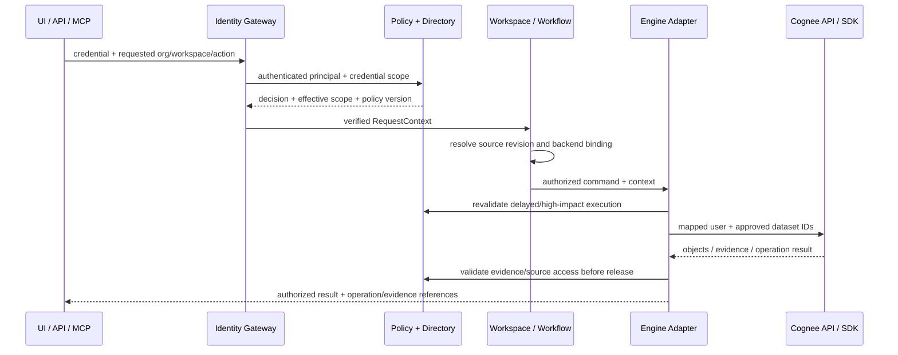

# 12：产品入口、可信身份与资料授权

本章针对 Cognee SHA `663a2dc15d04bc0d7ec2733a2dd604b7ed1b8c8e` 定向只读核查。结论限定所列入口与授权函数，不是安全漏洞全仓审计。现有事实与新增平台设计分开；不把部署隔离或应用网关存在本身当成已完成授权。

## 现有身份与 Dataset 授权骨架

**现有**：User、Tenant、Role 都通过 Principal 多态模型参与 ACL，ACL 的授权对象是 dataset_id，未在该模型上提供 document_id。Role 隶属 Tenant，User 有多 tenant/role 成员关系，并有单个持久化 tenant_id 表示当前选择。依据 [Principal](https://github.com/topoteretes/cognee/blob/663a2dc15d04bc0d7ec2733a2dd604b7ed1b8c8e/cognee/modules/users/models/Principal.py#L9-L22)、[ACL](https://github.com/topoteretes/cognee/blob/663a2dc15d04bc0d7ec2733a2dd604b7ed1b8c8e/cognee/modules/users/models/ACL.py#L8-L22)、[User](https://github.com/topoteretes/cognee/blob/663a2dc15d04bc0d7ec2733a2dd604b7ed1b8c8e/cognee/modules/users/models/User.py#L15-L45)、[Role](https://github.com/topoteretes/cognee/blob/663a2dc15d04bc0d7ec2733a2dd604b7ed1b8c8e/cognee/modules/users/models/Role.py#L8-L28)。因此已有“组织与组式角色分享”的基础，不应写成完全没有多租户；但也不能把 Role 直接当成完善的企业组目录、服务身份与细粒度策略系统。

`get_all_user_permission_datasets` 合并个人、所在 tenants、roles 的权限，再按 dataset.tenant_id == user.tenant_id 过滤。`get_specific_user_permission_datasets` 校验显式请求的所有 datasets 都在许可集合，否则拒绝。[许可集合](https://github.com/topoteretes/cognee/blob/663a2dc15d04bc0d7ec2733a2dd604b7ed1b8c8e/cognee/modules/users/permissions/methods/get_all_user_permission_datasets.py#L21-L48)、[显式范围检查](https://github.com/topoteretes/cognee/blob/663a2dc15d04bc0d7ec2733a2dd604b7ed1b8c8e/cognee/modules/users/permissions/methods/get_specific_user_permission_datasets.py#L25-L53)。

**集群产品约束（推断）**：`select_tenant` 检查成员关系后直接更新 User.tenant_id 并提交，因此这是用户级持久选择，不是请求专属组织上下文。同一用户两个浏览器标签或并发 API key 调用切换组织可能影响随后请求的范围，应以具体并发用例验证。[select_tenant](https://github.com/topoteretes/cognee/blob/663a2dc15d04bc0d7ec2733a2dd604b7ed1b8c8e/cognee/modules/users/tenants/methods/select_tenant.py#L32-L65)

**现有边界缺口**：分享函数先验证操作者有 share 权限，但对接收 Principal 没有同 tenant 强制判断，并保留了明确 TODO。其他查询的 active-tenant 过滤可能限制实际读取，但不能据此把跨组织授权记录当成合法的企业分享策略。[authorized_give_permission_on_datasets](https://github.com/topoteretes/cognee/blob/663a2dc15d04bc0d7ec2733a2dd604b7ed1b8c8e/cognee/modules/users/permissions/methods/authorized_give_permission_on_datasets.py#L29-L36)

## 认证与绕过边界：不是默认无认证，也不是每条内部函数都认证

**现有**：get_authenticated_user 默认要求 active user。ENABLE_BACKEND_ACCESS_CONTROL 默认 true；即使配置 REQUIRE_AUTHENTICATION=false，多租模式仍会强制认证。两者明确关闭时才允许匿名退回 default user。[姿态与依赖](https://github.com/topoteretes/cognee/blob/663a2dc15d04bc0d7ec2733a2dd604b7ed1b8c8e/cognee/modules/users/methods/get_authenticated_user.py#L15-L111)。FastAPI Users 注册 API key、Bearer 和 cookie 三种 backend。[认证后端](https://github.com/topoteretes/cognee/blob/663a2dc15d04bc0d7ec2733a2dd604b7ed1b8c8e/cognee/modules/users/get_fastapi_users.py#L13-L23)

**绕过前提必须具体**：SDK 接收 User 并可能回退 default user，内部 get_dataset_data(dataset_id) 也不自行认证；这是嵌入式调用的可信代码边界，不足以单独认定公网漏洞。企业平台不能把任意客户端参数直接变成这些函数的 user/tenant/dataset 参数，也不能允许外部网络绕开平台直接访问采用 default-user 模式的引擎。OpenAPI 的 security 字段只是接口描述，不会替代实际 Depends 与域授权。[无认证的底层读取](https://github.com/topoteretes/cognee/blob/663a2dc15d04bc0d7ec2733a2dd604b7ed1b8c8e/cognee/modules/data/methods/get_dataset_data.py#L9-L15)、[OpenAPI 描述](https://github.com/topoteretes/cognee/blob/663a2dc15d04bc0d7ec2733a2dd604b7ed1b8c8e/cognee/api/client.py#L244-L260)

**API key 现有与缺口**：UserApiKey 包含 user_id、key、label/name、created_at、last_used_at；已读模型没有独立 workspace/action scope、expiry、revocation version。get_by_token 由 key 找 user，后续使用 user 权限；因此一把 key 不是天然的“只读指定知识空间”凭证。已有 key 删除可用于撤销，但不能误称已具备成熟凭证生命周期和权限衰减。[模型](https://github.com/topoteretes/cognee/blob/663a2dc15d04bc0d7ec2733a2dd604b7ed1b8c8e/cognee/modules/users/models/UserApiKey.py#L10-L25)、[解析](https://github.com/topoteretes/cognee/blob/663a2dc15d04bc0d7ec2733a2dd604b7ed1b8c8e/cognee/modules/users/get_user_manager.py#L77-L109)。当前 HASH_API_KEY 默认 false；prepare_api_key 不开启时直接返回原 key，这属于需要显式改变的商业部署配置/迁移项，不是已提供的默认散列保护。[key 存储准备](https://github.com/topoteretes/cognee/blob/663a2dc15d04bc0d7ec2733a2dd604b7ed1b8c8e/cognee/modules/users/api_key/hash_api_key.py#L4-L39)

User.parent_user_id 已用于 agent/service user 归属，parent 可查看 child 的会话/用量范围；它不是独立的服务账号授权模型。[父子主体](https://github.com/topoteretes/cognee/blob/663a2dc15d04bc0d7ec2733a2dd604b7ed1b8c8e/cognee/modules/users/models/User.py#L23-L25)、[可见主体展开](https://github.com/topoteretes/cognee/blob/663a2dc15d04bc0d7ec2733a2dd604b7ed1b8c8e/cognee/modules/users/methods/get_visible_user_ids.py#L18-L36)

## 各产品动作已有检查与具体缺口

| 产品动作 | 现有检查 / 准确入口 | 新增平台职责及原因 |
|---|---|---|
| 上传和写入知识空间 | add router 注入认证 User；add 在任务开始前 resolve_authorized_user_dataset。见 [router:108](https://github.com/topoteretes/cognee/blob/663a2dc15d04bc0d7ec2733a2dd604b7ed1b8c8e/cognee/api/v1/add/routers/get_add_router.py#L108)、[add:263-270](https://github.com/topoteretes/cognee/blob/663a2dc15d04bc0d7ec2733a2dd604b7ed1b8c8e/cognee/api/v1/add/add.py#L263-L270) | 平台 Workspace→Dataset binding 由服务端解析，检查 upload/write action、文件来源与版本归属；不能由 dataset_name 自动创建语义代替企业空间开通权限 |
| 资料列表 / 下载上下文 | Dataset data router 先验证 read，再用 get_dataset_data 取该 dataset 的资料。见 [列表检查](https://github.com/topoteretes/cognee/blob/663a2dc15d04bc0d7ec2733a2dd604b7ed1b8c8e/cognee/api/v1/datasets/routers/get_datasets_router.py#L432-L447) | 独立 source.read/source.download 权限；签名下载 URL 必须绑定资料版本与短时效，并在发放时重验。不能把对象存储路径或 data_id 本身当授权 |
| 查询多个知识空间 | authorized_search 先取得所有有 read 权限的 requested datasets，再 fan-out。见 [authorized_search](https://github.com/topoteretes/cognee/blob/663a2dc15d04bc0d7ec2733a2dd604b7ed1b8c8e/cognee/modules/search/methods/search.py#L240-L270) | 请求 scope 与主体允许集、key scope 求交；显式请求越权范围应拒绝。查询产生的证据、跨空间融合、历史缓存都必须绑定同一授权快照与 policy version |
| 删除资料 | datasets.delete_data 首先校验 dataset delete，按该 dataset 解析 data_id 与资料成员关系，然后进入 dataset 上下文。见 [delete_data](https://github.com/topoteretes/cognee/blob/663a2dc15d04bc0d7ec2733a2dd604b7ed1b8c8e/cognee/api/v1/datasets/datasets.py#L218-L278) | 当前授权是 dataset delete，不是单资料 owner delete。平台需定义谁能删谁上传的资料、逻辑删除与物理清理职责；服务账号默认不可获得整个空间删除权限 |
| 授权他人 | share permission 是 Dataset 上的独立权限；接收 Principal 无同组织强制验证，见前节 | 平台检查目标主体属于组织或经过显式外部协作流程；按 action granularity 授权，不能让“可分享”默认为可创建跨组织访问 |
| 查看会话 | get_session_row 允许自己/child owner **或** 可读 dataset；详情随后用会话 owner ID 读取全部 QA 与 trace。见 [可见性](https://github.com/topoteretes/cognee/blob/663a2dc15d04bc0d7ec2733a2dd604b7ed1b8c8e/cognee/modules/session_lifecycle/metrics.py#L334-L376)、[详情](https://github.com/topoteretes/cognee/blob/663a2dc15d04bc0d7ec2733a2dd604b7ed1b8c8e/cognee/api/v1/sessions/routers/get_sessions_router.py#L435-L465) | 新增 SessionACL，默认只对 owner 和明确委托主体可见。知识空间可读不自动授予他人对话/trace；共享会话要再检查其中各条证据。否则共享知识可能扩大为共享用户私有问题及工具执行内容 |
| forget everything | 普通认证 User 可提交 everything；router 传给 forget，无本段 admin 判断；_forget_everything 在 caching 或 usage_logging 开启时调用不带 user 的 cache_engine.prune。见 [router](https://github.com/topoteretes/cognee/blob/663a2dc15d04bc0d7ec2733a2dd604b7ed1b8c8e/cognee/api/v1/forget/routers/get_forget_router.py#L70)、[调用](https://github.com/topoteretes/cognee/blob/663a2dc15d04bc0d7ec2733a2dd604b7ed1b8c8e/cognee/api/v1/forget/routers/get_forget_router.py#L114-L122)、[prune](https://github.com/topoteretes/cognee/blob/663a2dc15d04bc0d7ec2733a2dd604b7ed1b8c8e/cognee/api/v1/forget/forget.py#L191-L218) | 在共享缓存适配器执行全局 prune 的条件下会跨用户清缓存；适配器细节沿用持久化证据，不重复深入。平台应禁止公共入口透传该模式，改为明确的 principal-scoped purge 工作流；仅挡网关还不足以修复可直达引擎的风险 |

`get_document_ids_for_user` 容易造成误解：它按个人直接 ACL 找 dataset，再返回整份 dataset 内的资料；没有资料级 ACL，也没有像主授权链一样展开 role/tenant。[helper](https://github.com/topoteretes/cognee/blob/663a2dc15d04bc0d7ec2733a2dd604b7ed1b8c8e/cognee/modules/users/permissions/methods/get_document_ids_for_user.py#L12-L56)。本轮全仓引用定位仅看到导出与测试使用，不能把它宣称为已验证的生产绕权漏洞；应避免未来平台直接复用为完整权限决策器。

## MCP 的可信范围：工具参数和客户端名字不是身份

现有 `_agent_scoped_default_dataset` 读取 MCP clientInfo.name 后拼成 `${name}_memory`，缺省 main_dataset；这提供便利命名，不是鉴权。server 在启动时构造一个全局 CogneeClient，包含启动参数 api_token。API mode 的 client 根据配置发送 Bearer 或 X-Api-Key，部分 cloud 模式附 X-Tenant-Id。[MCP 默认空间](https://github.com/topoteretes/cognee/blob/663a2dc15d04bc0d7ec2733a2dd604b7ed1b8c8e/cognee-mcp/src/server.py#L928-L953)、[全局 client](https://github.com/topoteretes/cognee/blob/663a2dc15d04bc0d7ec2733a2dd604b7ed1b8c8e/cognee-mcp/src/server.py#L1071-L1078)、[请求头](https://github.com/topoteretes/cognee/blob/663a2dc15d04bc0d7ec2733a2dd604b7ed1b8c8e/cognee-mcp/src/cognee_client.py#L127-L146)。当前开源 API/users 已查范围未发现 X-Tenant-Id 的对应可信身份处理；不能用 cloud 客户端会发这个 header 推导开源 API 已支持该组织上下文协议。

**新增设计**：远程 MCP 入口验证会话绑定的用户或服务凭证；工具 schema 只允许请求更窄的 workspace/document 选择，不接受可覆盖 principal/org 的自由参数。网关忽略客户端自报 clientInfo.name、X-Tenant-Id 作为认证证据；在验证成员关系及凭证 scope 后签发内部短时执行凭证。若使用共享后端 key，必须让所有调用经过该鉴权代理且引擎不可公网直达；更稳妥的是后端身份映射仍保留主体和空间权限作为第二层限制。没有完成远程身份适配前，单全局 key 的 MCP 仅适合作为同一可信主体的入口，不能按客户端名字包装成企业多用户入口。

## 新增产品契约与端到端传递

以下全部为**平台新增设计**，不是 Cognee 已实现。

| 模块 / 对象 | 可执行职责 | 为什么 / 取舍 |
|---|---|---|
| OrganizationDirectory | 对接登录身份；维护 org、membership、group 及生命周期；外部 ID 映射平台 principal | 组织成员关系应独立于记忆引擎，可替换 Cognee/Hindsight；先单目录实现，保留同步适配口，无需首版自建身份供应商 |
| ServicePrincipal + CredentialService | 服务账号属于 org；key 绑定允许 actions/workspaces、expiry、状态与版本；存摘要、一次展示明文、可吊销、可轮换 | 服务账号不伪装成人类登录；凭证仅能缩小主体权限。迁移旧 user key 时默认不推定细分 scope，要求明确登记 |
| WorkspaceService | 知识空间归 org，管理 engine/dataset binding、SourceVersion、共享策略 | 平台空间 ID 稳定，backend dataset/owner 属内部映射；避免换后端时客户 API 和授权对象全变 |
| PolicyService | effective_scope = 主体权限 ∩ credential scope ∩ 请求范围；校验 action、org membership、资源归属；给 policy_version/decision_id | 同一函数处理 UI/API/MCP，不让不同入口拼出不同权限。敏感操作拒绝显式越权请求，批量查询可另设明确的部分成功模式 |
| RequestContext | 经验证产生 actor、org、credential_id、auth method、action、workspace IDs、session owner、policy version、trace ID | tenant/org 参数仅是选择意图，不能直接建立 context；不要修改持久 User.tenant_id 来表达并发请求的组织范围 |
| EngineAdapter / ScopeGuard | 从已批准 WorkspaceBinding 解析 Dataset + Cognee User；调用前复核 binding 与 action，返回前约束引用范围 | adapter 不重造业务授权规则，但必须防止错误对象绑定；Cognee 单个用户的 active tenant 局限可先按 org 隔离映射主体，代价是更多后端账号与映射维护 |
| SourceAccessService | 资料级权限、资料下载、引用展开、删除、版本和 ACL 变化；保留 policy revision | 向量命中后过滤不足以保证图遍历/模型生成没看见受限信息。不能仅在 HTTP 返回时删掉引用 |
| SessionService | session 独立归属及共享名单；QA/trace/export/delete 分 action；缓存键含 org/principal/session 与授权版本 | 对话可能组合多个知识空间甚至用户私有输入，不应随 dataset read 自动共享。缓存复用必须跟随授权撤销 |
| WorkflowAuthorizer | 提交时存 actor + 最小 scope + policy_version；执行前按最新策略重验；高影响结果发布再校验 | 策略可能在排队期间被撤销；job envelope 不是长期权限凭证。执行器/租约由调度章节负责，本模块只定义授权责任 |
| AuditService | 记录谁用哪把凭证、哪个入口、哪项授权决定访问/改写何种资源、返回哪些 evidence IDs | 不记录密钥；业务审计与引擎内部 trace 分开。日志查询自身也要授权，避免审计面成为旁路 |

入口不能信任 LLM 工具参数里的 org/user，后台也不能因为消息来自内部队列就取消授权。同步查询以当前决策执行；异步 job 保留提交者及范围，但执行时重新判断是否仍允许。平台服务身份可以调用引擎，不意味着可以将返回的所有 backend 数据交给原用户。

## 资料级权限的现实路线与验收

**路线 A，先保证空间边界（建议首期）**：每个知识空间要求同一可见人群；权限不同的资料拆到不同 dataset/space，禁止在同一引擎图里混入不相容的资料权限。优点是沿用现有 Dataset ACL 和图边界；代价是空间数量和跨空间查询增加，以及共享实体重复。产品必须明确“空间内资料统一共享”，不显示实际未实现的资料私有开关。

**路线 B，资料级策略（后续受控能力）**：为 chunk/fact/node/edge/summary/observation 建来源与权限传播规则；graph expansion、vector candidate、context assembly、LLM prompt、引用展开和缓存都校验同一策略。一个派生事实可能来自公开与受限两个资料，不能简单给合并节点写一个 document_id：需区分“本次能用的证据”与“全局实体存在”，或按安全域分图。要同时支持撤权传播、派生摘要重建、删除和低延迟查询，成本明显高于 ACL 表加一列；需要专项负向测试与评测后再承诺。

最小验收：未认证直接访问业务路由为401；认证但无scope为403；两个 org 同 principal 并发访问不互串；只读key无法上传/删除/分享；组移除后查询/缓存/下载及时失效；排队任务在授权撤销后不继续发布；MCP修改clientInfo或伪造org参数不能扩大scope；共享space不暴露他人私有session/trace；同一个session_id不同owner不发生混取；资料引用和原文下载与答案使用相同权限；forget用户清理不会清掉其他用户缓存。以上为待执行验收，本轮未运行这些测试。

## 实际阅读范围与限制

完整读：get_authenticated_user.py、get_fastapi_users.py、User/Principal/Tenant/Role/ACL/UserApiKey模型、select_tenant.py、get_all_user_permission_datasets.py、get_specific_user_permission_datasets.py、check_permission_on_dataset.py、get_document_ids_for_user.py、authorized_give_permission_on_datasets.py、has_user_management_permission.py、create_api_key.py、hash_api_key.py、api_key_jwt_strategy.py、get_api_key_transport.py、get_visible_user_ids.py、get_permitted_dataset_ids.py、get_delete_router.py、resolve_authorized_user_dataset.py（仅接口授权薄层，不深入 pipeline）。

片段读：UserManager 77–129；datasets router 423–452；sessions router 425–479；session_lifecycle/metrics 334–376；forget.py 191–257 与 forget router 105–124；datasets.delete_data 218–287；add.py 232–273；search.py 240–273；client.py 235–260；MCP server 928–956、1068–1080 与 client 125–151。其余 add router/permissions router/permission_types/get_data 是定位片段证据。复用06/09已验证的 recall/input 与持久化结论，未重新深入数据库adapter和worker。

未遍历每个API路由、完整注册/邀请流程、SSO、所有session写入/撤销链路、每类MCP transport鉴权、所有资料下载端点；没有声称全仓不存在其它扩展。未作覆盖率推算，未修改Cognee业务代码，未执行攻击验证或外部服务调用。本章需要的授权需求应与后续集成测试绑定，不能把静态分析等同生产认证通过。

## 补充交叉核实：Tenant 不是自动全部可读

**现有** `get_principal_datasets` 只返回该 Principal 拥有相应 ACL 的 datasets；tenant membership 让调用者继承的是 tenant 被授予的集合，不是组织里全部 datasets。[Principal ACL 查询](https://github.com/topoteretes/cognee/blob/663a2dc15d04bc0d7ec2733a2dd604b7ed1b8c8e/cognee/modules/users/permissions/methods/get_principal_datasets.py#L23-L35)。创建 dataset 时默认授予创建者全部四种权限，有 parent_user_id 时另授予 parent 全权限；该创建链没有无条件授予整个 tenant 全读。[create_authorized_dataset](https://github.com/topoteretes/cognee/blob/663a2dc15d04bc0d7ec2733a2dd604b7ed1b8c8e/cognee/modules/data/methods/create_authorized_dataset.py#L14-L55)

因此 V5 采用 Group→Space grants，Space 内资料具有同一读授权集合，与现有 dataset 级边界吻合；tenant 只提供组织归属，不自动 all-read。跨域检索应分别先授权、再执行各域检索，最后对允许证据融合，不能先在混合权限图中推断再删引用。Session 应独立采用 tenant + owner + space scope + session identity，并明确多空间会话的范围；后端有 answer 能力不等于能迁移其 session/history/feedback 行为。

本轮发现的可信范围问题分级：①默认多租模式并未发现可仅用伪造 dataset_id 绕过已读 add/search/delete 授权；②默认用户模式与可直达SDK/引擎是部署信任边界，误开放会绕过平台；③共享 MCP 全局后端凭证若没有每客户端鉴权，将只按该凭证主体授权，clientInfo命名不提供隔离；④Dataset read 自动扩展 session/trace 可见性是已存在语义，若产品承诺私有会话则构成策略缺口；⑤forget everything 的无scope prune 是共享后端条件下的明确跨用户副作用路径。以上不是对未读路由“绝无绕过”的保证。

补读范围：resolve_authorized_user_datasets.py 1–54（仅授权入口）；create_dataset.py 1–49、create_authorized_dataset.py 1–55、get_principal_datasets.py 1–35、give_default_permission_to_tenant.py 1–67。未深入数据库和pipeline执行器。
