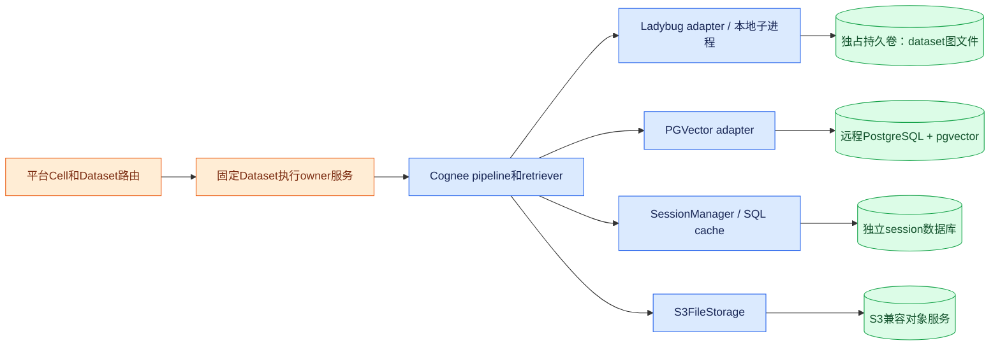

# V5 存储隔离证据：Tenant → Space → Cell → 实际资源

核查代码固定为 Cognee [`663a2dc15d04bc0d7ec2733a2dd604b7ed1b8c8e`](https://github.com/topoteretes/cognee/tree/663a2dc15d04bc0d7ec2733a2dd604b7ed1b8c8e)。本节只负责 handler、engine、文件与 session 存储边界；不把建议架构描述成已存在的实现，也不重做认证/任务编排分析。

**结论：首版可以使用全开源的固定执行 owner + 本地 Ladybug + 远程 PostgreSQL/PGVector；所有图读写都必须路由这个执行 owner。另一条路径是远程 Neo4j Enterprise + PGVector，允许查询和摄取计算独立部署。两者都需要平台增加 Cell/Space 路由与发布清单，现有 Cognee 没有按 cell_id 自动切换一整组存储配置。**

这里“执行 owner”指唯一承载某 dataset 嵌入式图的进程/Pod；`Dataset.owner_id` 指 Cognee 用户归属。两者必须使用不同字段，不能混用。

## 1. 现有代码的物理映射

| 层 | 已有实现 | 隔离实际到什么程度 |
|---|---|---|
| 关系元数据 | `RelationalConfig` 单组 DB_PROVIDER/DB_HOST/DB_NAME/DB_USERNAME 等；DatasetDatabase 以 dataset_id 为主键，保存图/向量 provider、地址、名称及 connection JSON [E1][E2] | 一个进程配置一套关系库；User/ACL/Dataset/Registry 共享此库。没有原生 Cell 实体，也没有按租户自动切 SQL 连接 |
| 图/向量上下文 | 从 Dataset 解析真实 owner，查询 registry，再把 graph/vector 配置放入 ContextVar [E3] | 能按 dataset 解析不同连接；不是完整存储组调度，handler 所用配置和凭据仍有全局依赖 |
| 默认 Ladybug | dataset 对应 `<dataset_uuid>.lbug`；路径为 `SYSTEM_ROOT_DIRECTORY/databases/<owner_uuid>/<dataset_uuid>.lbug` [E3][E4] | 文件级分隔；不是远程图服务，也不是共享对象存储上的分布式数据库 |
| `pgvector_shared` | 使用**关系库配置**的host/db/user，创建 `ds_<dataset_uuid规范化>` schema，registry记host/port/schema，运行时仍取关系库账号 [E5] | 每dataset schema；并非单独数据库、单独账号，也非数据库强制租户授权 |
| `pgvector` | 使用vector配置为dataset创建独立PostgreSQL database，初始化vector extension；凭据仍来自全局vector config [E6] | database-per-dataset；需要建库权限和更多数据库/连接管理，不是自动独立实例或独立角色 |
| `neo4j` handler | 按dataset创建Neo4j database；普通adapter运行凭据与建库凭据均从同一global graph config取得 [E7] | database分隔；没有自动创建每tenant/database USER/ROLE/GRANT |
| Session SQL | `CACHE_BACKEND=postgres` + `CACHE_DB_URL`；不指定URL会回退关系库DB_*配置 [E8] | QA/trace/context以user_id+session_id组织，表中没有tenant/cell专门作用域；共享cache库的权限边界仍需平台补充 [E9] |
| S3 raw objects | S3FileStorage按传入root拼key；凭据取全局S3Config或IAM链 [E10] | prefix分隔≠IAM隔离；没有自动按tenant assume-role |

特别注意 raw root：现有数据库上下文设置为 `DATA_ROOT_DIRECTORY/(owner.tenant_id or owner.id)`，取的是**owner 当前tenant选择**，不是 Dataset.tenant_id，也没有space/generation分段。[E3] 产品需要固定的对象位置，不能让用户切换active tenant后重新推导同一资料路径。

## 2. 建议平台资源目录：明确哪些映射需要新增

建议平台把 **Space 定义为同一组访问规则的资料范围**。首版可采用 `blocked_in_place`：更新开始前由平台阻断该Space查询，原位更新图/向量，校验两者完成后恢复查询；失败时继续阻断并修复/回滚，不能把半完成索引直接开放。此查询屏障和发布状态也是新增平台能力。`isolated generation` 作为后续提高读取可用性的方案：为新generation分配新Cognee Dataset，成套构建后切换。下表generation相关字段描述后续目标，不要求首版所有修改都全量重建。Platform StorageManifest 是跨图/向量/object/session的路由清单，而 Cognee DatasetDatabase 是内部dataset连接记录；前者新建，后者复用。generation数量、重建和回收属于有成本的产品能力，不是免费的元数据切换。

| 平台字段 | 示例 | 映射到实际资源 | 谁负责 |
|---|---|---|---|
| tenant_id | `t_acme` | 企业组织与权限域；可共享cell，也可独享cell | 平台 |
| space_id | `s_product_docs` | 一组相同ACL的资料；避免一个dataset内混合不同文档ACL却期望向量检索自动隔离 | 平台 |
| generation_id | `g_0007` | `dataset_uuid=D7`，图与向量作为一套可发布索引；不能图用g7、向量用g6 | 平台发布控制，现有Cognee没有原子双引擎generation发布 |
| cell_id | `c_cn01` | 独立进程配置、网络策略、SQL/graph/vector/object/session端点与凭据域 | 平台路由，首版不动态改进程全局config |
| metadata_target | `pg-c1/cognee_c1` | 此cell的Cognee元数据与pgvector_shared schema | Cognee现有SQL配置；cell选择由平台 |
| graph_target | `owner-03:/state/.../D7.lbug` 或 `neo4j-c1/database-for-D7` | 嵌入式owner位置，或远程database；两条部署路径二选一 | 平台owner目录/远程handler |
| vector_target | `pg-c1/cognee_c1/ds_D7` | pgvector_shared现有schema定位 | 复用handler；分离凭据需定制 |
| raw_prefix | `s3://memory-c1/tenants/t_acme/spaces/s_product_docs/source/<document_id>/<version>/` | 原始版本可供多个generation复用；派生产物另放`.../generations/g_0007/` | 平台稳定对象manifest+文件存储上下文适配，非现有默认拼法 |
| session_scope | `tenant/space/user/session` | session专用SQL库中的不可碰撞ID，及对应SessionQAVector索引 | 平台映射；当前user+session API可包装但需一致删除/查询 |
| credential_ref | `secret/c1/vector-runtime-v3` | provisioning/runtime分离，秘密不直接落平台业务记录 | 自定义handler解析，现有接口支持秘密引用契约 [E11] |

**Cell不等于Tenant。** 共享cell可以放多个企业，故障/成本/权限影响范围是整个cell；强隔离套餐可以一个企业一个cell，但成本更高。只要同一运行账号可访问全部cell内schema，SQL漏洞或被攻陷的cell进程仍可能跨租户访问；schema-per-dataset本身不提供“数据库账号即使误用也绝不跨tenant”的保证。

为减少首版改动：平台先按cell把请求投递到不同部署，每个部署固定DB/graph/cache/S3配置；不要在同一进程里临时修改环境变量或lru_cached config。后续需要同进程多cell时，再把metadata/cache/object等全局工厂一起改成显式cell依赖，不能只改Graph/Vector两个ContextVar。

## 3. 方案A：纯开源、固定执行owner、远程PGVector



图中的平台Owner服务、所有读写路由以及owner故障交接是新增工作；Ladybug adapter与子进程/文件模式已有。[E4][E12] Object服务框用绿色表示可替换外部存储接口；实际部署若选云S3属于云服务，若强调全开源需另选经过兼容验证的S3实现，而不是声称云S3自身开源。

建议cell固定配置骨架（值为部署占位符，不含真实秘密）：

```dotenv
ENABLE_BACKEND_ACCESS_CONTROL=true
DB_PROVIDER=postgres
DB_HOST=pg-c1
DB_NAME=cognee_c1
DB_USERNAME=cognee_c1_runtime
VECTOR_DB_PROVIDER=pgvector
VECTOR_DATASET_DATABASE_HANDLER=pgvector_shared
GRAPH_DATABASE_PROVIDER=ladybug
GRAPH_DATASET_DATABASE_HANDLER=ladybug
SYSTEM_ROOT_DIRECTORY=/state/cognee-system
DATA_ROOT_DIRECTORY=s3://memory-c1/raw
CACHE_ROOT_DIRECTORY=/state/cognee-cache
CACHE_BACKEND=postgres
CACHE_DB_URL=postgresql+asyncpg://session_role:<secret>@pg-c1/cognee_sessions_c1
VECTOR_POOL_ARGS={"pool_size":2,"max_overflow":2}
```

其中 `cognee_c1_runtime` 只是目标名称，**不代表原生handler已把它限制为纯DML**；未改handler前还需它具备schema创建等权限，详见第5节。密码、TLS、S3 endpoint/IAM由环境与secret注入，省略不表示可不配置。

混合local graph + S3 raw的关键是 `SYSTEM_ROOT_DIRECTORY` 保持本地，仅raw路径为`s3://`，`get_file_storage`按路径即可选择S3 [E10]；不要照抄全局 `STORAGE_BACKEND=s3` 且system root也在S3的示例，把图文件推送机制误当在线共享图数据库。现有Ladybug S3路径是CHECKPOINT后上传本地文件及下载恢复 [E12]，不含本次已验证的多writer一致性协议。

落地必须满足：

1. 相同dataset的recall、ingest、delete、maintenance均走同一执行owner，不能查询Pod绕开owner直接打开图文件。多个dataset可分散到不同owner扩展容量；单热dataset并不因此变成多主并行图引擎。
2. owner绑定持久卷和稳定身份；接管前确认旧owner停止访问，恢复/挂载同一数据版本，再更新平台路由。普通PVC访问模式不是整个任务层面的fencing证明。
3. 同一tenant的资料Space采用稳定Cognee技术owner或不可变归属映射，避免个人离职及active tenant变化改变路径；具体对象prefix仍需平台适配。
4. 备份记录graph checkpoint、vector generation、对象版本与关系metadata一致的manifest；仅备份S3图文件不代表整套索引可恢复。

代价是平台需实现owner placement、路由、交接与维护窗口；查询/摄取受owner资源互相影响。优点是无需Neo4j Enterprise，复用默认图功能，适合首版有限规模与可接受短暂恢复窗口的套餐。

## 4. 方案B：远程Neo4j Enterprise + PGVector

部署把graph改为 `GRAPH_DATABASE_PROVIDER=neo4j`、`GRAPH_DATASET_DATABASE_HANDLER=neo4j`，graph连接指向远程Neo4j；其余SQL/session/raw层同方案A。该handler执行system database上的CREATE DATABASE，目标部署必须实际允许该管理命令。[E7] 不把“Aura”品牌泛化成任意实例都支持此handler；应逐产品/版本验证或另写实例provisioner。

远程图使多个query/ingest进程连接相同dataset database成为可能，无需本地图文件owner路由；这是部署解耦，不是证明并发执行多个修改同dataset的Cognee流水线安全。仍应由平台控制同dataset写入/发布，并对query读取切换中的generation做一致性处理。

成本包括Enterprise许可/服务成本、多database数量与内存、连接管理、备份，以及generation全量复制/重建时双份资源。若每Space每generation对应database，必须设置待清理generation数量和保留期；不能无限保留旧dataset。

**Neo4j Community不能直接代入同一方案。** 当前另有`neo4j_community` handler，它为每dataset创建Docker容器、volume和localhost端口，记录加密随机密码，并在连接前确保容器运行 [E13]。这是现有OSS实现，但依赖Docker daemon/本机资源，不是“一个Community实例多database”，也不是现成的Kubernetes远程托管图cell。用它商业化需要重新审视容器provisioning、宿主机路由、存活管理和资源成本。

## 5. 凭据与数据库权限：目前能共享cell账号，尚未自动分离管理面

| 当前路径 | 代码实际行为 | 产品需要补的防线 |
|---|---|---|
| PGVector shared | 创建schema使用relational username/password；resolve继续用同一账号；admin helper创建extension/schema，没有创建tenant角色或GRANT/REVOKE [E5][E14] | 控制面provisioner持DDL权限；数据面runtime只获所需schema/table权限；平台handler返回runtime secret_ref。若按tenant限制角色，需要每tenant/schema授权与每请求连接身份选择 |
| Neo4j default | create和普通连接同一global graph凭据；没有自动每dataset角色授权 [E7] | Enterprise管理凭据留在provisioner；query/ingest分别使用最小权限角色；handler解析dataset路由及对应runtime秘密。不能给query Pod默认建删所有database权限 |
| Session SQL | 独立CACHE_DB_URL可用专门账号/库；查询按user+session过滤 [E8][E9] | 独立DB限制误操作影响；如要数据库硬tenant防线，需tenant列/RLS或独享实例/库，当前不会自动具备 |
| Object | S3FileStorage使用全局key/secret或IAM role chain [E10] | 每cell workload role仅允许cell bucket/prefix；更强tenant隔离需要每tenant角色/受限STS并扩展工厂，不是给路径加tenant字符串就完成 |
| 本地图 | 文件由owner进程打开，无每tenant数据库登录角色 [E3][E4] | 容器/PVC/OS权限限定cell/owner；强隔离tenant放独立owner/cell，不能把同一进程中的路径前缀当安全沙箱 |

**不能只撤销CREATE就宣布完成权限收敛。** PGVectorAdapter的`create_collection`会运行表创建，`create_vector_index`亦经collection初始化 [E15]；engine初始化/数据类型新增/migration仍可能需要DDL。可选路线是：provisioner提前建完整schema与collection/index，runtime使用已存在结构；或者把受控DDL交给独立管理服务。两条都要改handler/初始化边界并测试，不能假定开关已经存在。

如果首版暂不实现最小权限handler，必须明确发布承诺是“每cell受信数据面+应用ACL，独立cell之间用不同凭据/网络隔离”；不能宣称共享cell中的schema有数据库强制租户隔离。强隔离套餐以tenant独享cell作为可落地选项，代价是资源利用率与运维数量。

## 6. Session与清理的隔离不随dataset图库自动成立

SQL QA键包含 `(user_id,session_id,qa_id)`；显式session_id不被自动加tenant或dataset前缀，只有省略时默认session才拼dataset UUID。[E9][E16] 因而平台应始终生成不可碰撞的scope token，固定映射 tenant/space/user/session，不向用户暴露底层任意session key。会话的SessionQAVector还在vector引擎中，相关迁移/删除见前轮证据，不能只隔离cache表就忽略语义召回索引。

`SqlCacheAdapter.prune()`对五个Cognee cache表执行无条件DELETE；Redis的prune直接FLUSHDB [E17]。这不是用户/tenant级删除接口。租户删除应枚举其作用域和使用scoped方法；全局prune只允许cell管理维护。Session专用SQL库减少外溢，但仍会影响同库全部租户，不能解释为已实现租户级prune。

连接数也是隔离成本：pgvector_shared虽然单数据库，但每dataset schema拥有独立engine；`PGVectorAdapter`内置访问控制默认池为pool_size=2、max_overflow=20。[E18] 因此“共享数据库=所有dataset复用一个池”不成立；容量预算要计算活跃dataset × 副本 × 每engine连接上界，并限制cache/池/查询fan-out。示例中max_overflow=2只是待压测起点，不是通用最佳值。

## 7. 明确不支持或不能据此承诺的组合

| 组合/主张 | 判定 |
|---|---|
| PostgreSQL关系库 + pgvector_shared + Ladybug图 | handler匹配，可作为方案A基础；跨owner调度是新增 |
| PostgreSQL关系库 + pgvector_shared + Neo4j Enterprise图 | handler匹配，需目标支持CREATE DATABASE及凭据收敛；可作为方案B基础 |
| SQLite关系库 + pgvector_shared配置成“外部vector PG” | 不应如此设计：shared handler读取关系库配置，不是vector endpoint [E5]；若要独立vector host选择pgvector或自定义handler |
| Neo4j Community单实例 + 默认neo4j dataset handler | 不满足该handler多database要求；另有每dataset容器handler [E13] |
| ladybug-remote/Neptune等只改provider URL就启用BAC | 当前handler registry没有对应默认隔离handler；自定义注册前不能假定支持 [E19] |
| 关闭BAC来绕开provider限制仍宣称多租隔离 | 不能成立；关闭后不再由此机制提供dataset专属图/向量上下文 |
| 多Pod各下载同一S3图文件后并发读写 | 未提供可验证共享图一致性；上传快照不等于分布式图服务 [E12] |
| 现有registry已支持cell所有资源统一路由 | 不成立：graph/vector connection JSON可扩展，但SQL/cache/S3配置和默认凭据仍有全局依赖 [E1][E5][E8][E10] |
| shared PostgreSQL graph demo可无验证作为成熟图替代 | handler存在，不代表已证明功能/性能/运维等价；本节不将其列首版主选 |

## 8. 固定源码证据目录

以下链接均固定同一SHA，避免主分支变化造成事实漂移。

- **E1** [RelationalConfig，17–32行](https://github.com/topoteretes/cognee/blob/663a2dc15d04bc0d7ec2733a2dd604b7ed1b8c8e/cognee/infrastructure/databases/relational/config.py#L17-L32)
- **E2** [DatasetDatabase，11–48行](https://github.com/topoteretes/cognee/blob/663a2dc15d04bc0d7ec2733a2dd604b7ed1b8c8e/cognee/modules/users/models/DatasetDatabase.py#L11-L48)
- **E3** [Dataset owner→目录/上下文，255–348行](https://github.com/topoteretes/cognee/blob/663a2dc15d04bc0d7ec2733a2dd604b7ed1b8c8e/cognee/context_global_variables.py#L255-L348)
- **E4** [LadybugDatasetDatabaseHandler，19–84行](https://github.com/topoteretes/cognee/blob/663a2dc15d04bc0d7ec2733a2dd604b7ed1b8c8e/cognee/infrastructure/databases/graph/ladybug/LadybugDatasetDatabaseHandler.py#L19-L84)
- **E5** [PGVectorShared handler，39–87行](https://github.com/topoteretes/cognee/blob/663a2dc15d04bc0d7ec2733a2dd604b7ed1b8c8e/cognee/infrastructure/databases/vector/pgvector/PGVectorSharedDatasetDatabaseHandler.py#L39-L87)
- **E6** [PGVector database-per-dataset handler，24–77行](https://github.com/topoteretes/cognee/blob/663a2dc15d04bc0d7ec2733a2dd604b7ed1b8c8e/cognee/infrastructure/databases/vector/pgvector/PGVectorDatasetDatabaseHandler.py#L24-L77)
- **E7** [Neo4j同源凭据解析，53–95行](https://github.com/topoteretes/cognee/blob/663a2dc15d04bc0d7ec2733a2dd604b7ed1b8c8e/cognee/infrastructure/databases/graph/neo4j_driver/Neo4jDatasetDatabaseHandler.py#L53-L95)；[CREATE DATABASE，146–158行](https://github.com/topoteretes/cognee/blob/663a2dc15d04bc0d7ec2733a2dd604b7ed1b8c8e/cognee/infrastructure/databases/graph/neo4j_driver/Neo4jDatasetDatabaseHandler.py#L146-L158)
- **E8** [CACHE_DB_URL优先与关系配置回退，15–58行](https://github.com/topoteretes/cognee/blob/663a2dc15d04bc0d7ec2733a2dd604b7ed1b8c8e/cognee/infrastructure/databases/cache/get_cache_engine.py#L15-L58)
- **E9** [SQL cache键与字段，65–150行](https://github.com/topoteretes/cognee/blob/663a2dc15d04bc0d7ec2733a2dd604b7ed1b8c8e/cognee/infrastructure/databases/cache/sql/tables.py#L65-L150)
- **E10** [文件工厂路径选择，8–23行](https://github.com/topoteretes/cognee/blob/663a2dc15d04bc0d7ec2733a2dd604b7ed1b8c8e/cognee/infrastructure/files/storage/get_file_storage.py#L8-L23)；[S3凭据与key，41–99行](https://github.com/topoteretes/cognee/blob/663a2dc15d04bc0d7ec2733a2dd604b7ed1b8c8e/cognee/infrastructure/files/storage/S3FileStorage.py#L41-L99)
- **E11** [handler秘密引用与运行时解析契约，21–58行](https://github.com/topoteretes/cognee/blob/663a2dc15d04bc0d7ec2733a2dd604b7ed1b8c8e/cognee/infrastructure/databases/dataset_database_handler/dataset_database_handler_interface.py#L21-L58)
- **E12** [图工厂本地Ladybug路径/子进程，446–465行](https://github.com/topoteretes/cognee/blob/663a2dc15d04bc0d7ec2733a2dd604b7ed1b8c8e/cognee/infrastructure/databases/graph/get_graph_engine.py#L446-L465)；[S3 checkpoint上传/下载，573–592行](https://github.com/topoteretes/cognee/blob/663a2dc15d04bc0d7ec2733a2dd604b7ed1b8c8e/cognee/infrastructure/databases/graph/ladybug/adapter.py#L573-L592)
- **E13** [Neo4jCommunity容器/凭据/运行，68–158行](https://github.com/topoteretes/cognee/blob/663a2dc15d04bc0d7ec2733a2dd604b7ed1b8c8e/cognee/infrastructure/databases/graph/neo4j_driver/Neo4jCommunityDatasetDatabaseHandler.py#L68-L158)
- **E14** [PG schema创建事务锁及DDL，138–172行](https://github.com/topoteretes/cognee/blob/663a2dc15d04bc0d7ec2733a2dd604b7ed1b8c8e/cognee/infrastructure/databases/postgres/admin.py#L138-L172)
- **E15** [PGVector collection创建，322–369行](https://github.com/topoteretes/cognee/blob/663a2dc15d04bc0d7ec2733a2dd604b7ed1b8c8e/cognee/infrastructure/databases/vector/pgvector/PGVectorAdapter.py#L322-L369)
- **E16** [默认与显式session id，118–130行](https://github.com/topoteretes/cognee/blob/663a2dc15d04bc0d7ec2733a2dd604b7ed1b8c8e/cognee/infrastructure/session/session_manager.py#L118-L130)
- **E17** [SQL全表prune，1196–1215行](https://github.com/topoteretes/cognee/blob/663a2dc15d04bc0d7ec2733a2dd604b7ed1b8c8e/cognee/infrastructure/databases/cache/sql/SqlCacheAdapter.py#L1196-L1215)；[Redis FLUSHDB，681–686行](https://github.com/topoteretes/cognee/blob/663a2dc15d04bc0d7ec2733a2dd604b7ed1b8c8e/cognee/infrastructure/databases/cache/redis/RedisAdapter.py#L681-L686)
- **E18** [默认pool，40行](https://github.com/topoteretes/cognee/blob/663a2dc15d04bc0d7ec2733a2dd604b7ed1b8c8e/cognee/infrastructure/databases/vector/pgvector/PGVectorAdapter.py#L40)；[每schema独立engine与search_path，79–150行](https://github.com/topoteretes/cognee/blob/663a2dc15d04bc0d7ec2733a2dd604b7ed1b8c8e/cognee/infrastructure/databases/vector/pgvector/PGVectorAdapter.py#L79-L150)
- **E19** [当前dataset handler注册表，37–85行](https://github.com/topoteretes/cognee/blob/663a2dc15d04bc0d7ec2733a2dd604b7ed1b8c8e/cognee/infrastructure/databases/dataset_database_handler/supported_dataset_database_handlers.py#L37-L85)

## 9. 本轮实际核查范围与待验证项

复用前轮06/09/10证据，本轮重读/定向定位：handler注册全文85行；PGVectorShared handler全文118行；Ladybug handler全文86行；Neo4jCommunity全文194行；Neo4j handler32–221及凭据/管理方法搜索；context245–350；PGVectorAdapter70–151、pool默认与collection方法定位；S3FileStorage41–124及方法索引；get_file_storage全文、s3_config全文；cache config与SQL表作用域定位；SQL prune1196–1228、Redis prune681–690；session manager104–133；cache工厂15–60；PG admin138–173；base_config16–33/72–98。部分批量输出有截断，未可见段不计作完整阅读；未声称全库覆盖。

配置骨架尚未在容器中启动或压测。进入实现前的验证应聚焦：local Ladybug + S3 raw混合路径、固定owner重启/接管、每tenant session键不冲突、最小权限角色下首次建collection/迁移、Neo4j目标版本建库权限、generation双引擎就绪后发布与旧版本清理。对象权限、数据库权限与owner路由必须联合演练，不能仅以单用户add/recall成功作为多租产品验收。
