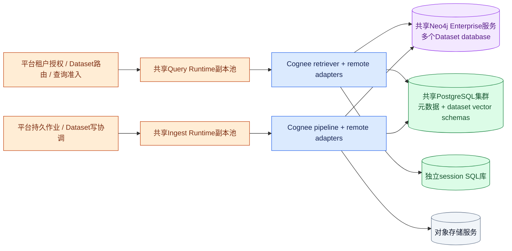

# V6 补充证据：共享集群与 Serverless 的存储条件

**Cognee 是可嵌入应用进程的 Python 库，不要求一租户一套 Cognee 进程。多个租户可以共享一个 runtime，一个 Cell 可以包含多租户和多个 runtime。此前固定执行 owner 是嵌入式图库的一种部署约束，不应扩展成产品必须一租户一台机器。** 本节给出远程存储路径、实际资源成本和按需执行条件；方案未经过生产负载或冷启动验证。

代码基线沿用 Cognee `663a2dc15d04bc0d7ec2733a2dd604b7ed1b8c8e` 与 Hindsight `12f2d54f643baddacb98cd547c89b1a50c5c3dcc`。只定向复查存储路径，不重做API与调度设计。

## 1. 四种“实例”必须分开

| 概念 | 示例 | 是否必须每租户一个 |
|---|---|---|
| Cognee runtime | 容器中的Python进程，加载pipeline/retriever和adapter | **否**。可信请求通过dataset上下文选择图/向量配置；共享进程可顺序或并发服务不同tenant/dataset |
| 客户端engine/driver | PGVector SQLAlchemy engine、Neo4j driver与连接池 | 当前通常按dataset配置缓存；这是进程内对象，不是为租户启动数据库服务器 |
| 逻辑存储namespace | PG schema、Neo4j database、Ladybug文件 | BAC=true的现有隔离以dataset为路由单元；数量随dataset增长，不等于相同数量VM/Pod |
| 实际数据库服务 | PostgreSQL集群、Neo4j Enterprise服务、对象服务 | 可由Cell内多个租户共享；独享部署只用于有对应隔离/容量要求的套餐 |

源码依据：graph getter读取context并生成handle，[get_graph_engine.py:193-228](https://github.com/topoteretes/cognee/blob/663a2dc15d04bc0d7ec2733a2dd604b7ed1b8c8e/cognee/infrastructure/databases/graph/get_graph_engine.py#L193-L228)；vector getter同样捕获context，[get_vector_engine.py:92-110](https://github.com/topoteretes/cognee/blob/663a2dc15d04bc0d7ec2733a2dd604b7ed1b8c8e/cognee/infrastructure/databases/vector/get_vector_engine.py#L92-L110)。现有机制允许共享runtime，不证明所有API路径已安全清除旧context；平台每次请求仍应显式绑定已授权dataset并验证并发上下文不串用。

## 2. Remote Neo4j + PGVector：共享 runtime fleet 可成立

图中副本池弹性调度与准入为平台能力；每个副本装同一Cognee库即可，不必为每客户单独常驻runtime。对象服务灰色表示可选云服务或开源S3兼容实现，未预先断言产品许可属性。

**不同dataset共享runtime：**DatasetDatabaseContext按dataset解析graph/vector连接；get_graph_engine缓存key包括provider、database名、URL、用户名和schema，[工厂key](https://github.com/topoteretes/cognee/blob/663a2dc15d04bc0d7ec2733a2dd604b7ed1b8c8e/cognee/infrastructure/databases/graph/get_graph_engine.py#L201-L228)。单runtime中的请求可各自连接对应dataset。

**多个runtime读取相同dataset：**Neo4j adapter通过网络driver连接，session显式选择 `database=self.graph_database_name`，[adapter.py:192-226](https://github.com/topoteretes/cognee/blob/663a2dc15d04bc0d7ec2733a2dd604b7ed1b8c8e/cognee/infrastructure/databases/graph/neo4j_driver/adapter.py#L192-L226)。PGVector shared连接远程PG并pin `search_path`到dataset schema，[PGVectorAdapter.py:134-150](https://github.com/topoteretes/cognee/blob/663a2dc15d04bc0d7ec2733a2dd604b7ed1b8c8e/cognee/infrastructure/databases/vector/pgvector/PGVectorAdapter.py#L134-L150)。因此这条路径没有本地图文件必须单owner打开的约束；可设计任意就绪query replica读取同一已发布dataset。并发写pipeline、跨图库/向量库一致性、删除与更新屏障仍需平台实现，不能由数据库支持多连接直接推导已解决。

**同Cell配置、跨租户数据context：**首版共享fleet固定Cell的一组关系库/cache/object/model配置，各请求改变dataset上下文。这与“一个进程随机切多个Cell全局环境变量”不同；后者还受全局工厂、凭据和缓存依赖限制。Cell是资源池/故障域，不是租户数量的同义词。

## 3. 当前 shared handler 的约束不会因 Serverless 自动消失

`pgvector_shared`的目标是**Cognee关系库那一座PostgreSQL database**，host/db/凭据取RelationalConfig，并非任意VECTOR endpoint。create创建schema，resolve再次注入同一关系账号。[handler:39-87](https://github.com/topoteretes/cognee/blob/663a2dc15d04bc0d7ec2733a2dd604b7ed1b8c8e/cognee/infrastructure/databases/vector/pgvector/PGVectorSharedDatasetDatabaseHandler.py#L39-L87)。共享fleet中所有tenant使用同一账号时，schema是路由隔离，数据库角色不能自动阻止越过tenant范围。

Neo4j原生handler也用global graph凭据建database并交普通adapter使用。[Neo4j handler:53-95](https://github.com/topoteretes/cognee/blob/663a2dc15d04bc0d7ec2733a2dd604b7ed1b8c8e/cognee/infrastructure/databases/graph/neo4j_driver/Neo4jDatasetDatabaseHandler.py#L53-L95)。需要的改造是：平台provisioner管理DDL；handler解析可信dataset placement与runtime secret_ref；tenant强隔离等级决定是否用更细的数据库角色、专属cell或专属服务，而不是每租户创建一整个Cognee进程。

**新增冷启动细节：Neo4jAdapter.initialize会执行CREATE CONSTRAINT IF NOT EXISTS。** [adapter.py:213-219](https://github.com/topoteretes/cognee/blob/663a2dc15d04bc0d7ec2733a2dd604b7ed1b8c8e/cognee/infrastructure/databases/graph/neo4j_driver/adapter.py#L213-L219)。所以纯reader实例不能简单换成只读角色并假定预建索引后就够：即使constraint存在，仍需验证命令权限，或改初始化路径让查询端跳过DDL。PGVector首次collection创建同样要预建或受控管理。这些都是把worker变成可短时启动的安全runtime之前要完成的接口拆分。

## 4. 资源随namespace增长，不必随租户启动进程，但也不是零成本

令 D 为持久dataset数量（Space×版本策略），A_r 为runtime r当前持有的活跃dataset engine数，R为runtime副本数。若每tenant固定Space数，则D随tenant增长；应按D计费/限额，不能不分情况写成所有资源都O(T)。

| 资源 | 当前增长方式 | Serverless实施条件 |
|---|---|---|
| SQL schema/Neo4j database/索引 | 持久namespace数近似O(D)，不随runtime归零消失 | 控制Space、保留版本、索引数量；DDL/migration/备份时间按namespace数验证 |
| 向量客户端池 | 每活跃dataset schema有独立engine；默认访问控制pool_size=2、max_overflow=20 | 上界按 `Σ_r A_r × (pool_size+max_overflow)` 加元数据/session/管理池预算；它是潜在连接上界，不是启动即建立所有连接 |
| 图客户端driver | 每缓存配置创建Neo4jAdapter/driver；关闭adapter关闭driver池 | 可研究以URL+credential复用driver、请求只切database，但当前factory按dataset配置缓存，不能当成已有优化 |
| runtime本地cache | LRU默认6，活跃dataset被pin时可临时超过 | 不应无限缓存所有tenant；也不能把LRU数字当所有进程全局上限 |
| 冷启动 | import、客户端/连接初始化、schema/model检查、缓存miss；新dataset还涉及provisioning | provision异步预完成、控制突发并发、设最小warm pool/延迟等级；按需扩容会放大数据库连接风暴 |
| 模型资源 | 配置可用外部embedding/LLM，具体profile决定内存/启动时间 | 不宣称所有runtime轻量；模型加载、并发与超时需测。这里未复查模型实现 |

证据：[PGVector专用engine/池选择:79-150](https://github.com/topoteretes/cognee/blob/663a2dc15d04bc0d7ec2733a2dd604b7ed1b8c8e/cognee/infrastructure/databases/vector/pgvector/PGVectorAdapter.py#L79-L150)、[默认池:40](https://github.com/topoteretes/cognee/blob/663a2dc15d04bc0d7ec2733a2dd604b7ed1b8c8e/cognee/infrastructure/databases/vector/pgvector/PGVectorAdapter.py#L40)、[LRU与pin说明:1-15](https://github.com/topoteretes/cognee/blob/663a2dc15d04bc0d7ec2733a2dd604b7ed1b8c8e/cognee/shared/lru_cache.py#L1-L15)、[graph factory cache](https://github.com/topoteretes/cognee/blob/663a2dc15d04bc0d7ec2733a2dd604b7ed1b8c8e/cognee/infrastructure/databases/graph/get_graph_engine.py#L294-L315)、[vector factory cache](https://github.com/topoteretes/cognee/blob/663a2dc15d04bc0d7ec2733a2dd604b7ed1b8c8e/cognee/infrastructure/databases/vector/create_vector_engine.py#L121-L136)。

建议采用**共享弹性runtime池 + 常驻持久数据库层**。Runtime可以低谷缩容甚至部分服务归零，但数据库/索引仍产生存储与服务成本；是否允许整cell计算归零，要看可接受冷启动和任务时限。长摄取作业宜用可弹性伸缩容器job/worker，不应因为名称叫serverless就强行塞入短超时函数。

## 5. 全开源嵌入式图仍可集群，但不是任意Pod访问同一可变图

全开源Ladybug路径可以一个owner承载多个dataset，多个owner构成共享集群；资源可按活跃Space分配，不必一tenant一Pod。限制在于一个dataset图文件当前的执行位置。将读写路由到owner只是在当前嵌入式方案下保持资源一致，不代表整个平台单机。

进一步“冷空间冻结、按需唤醒”需要新增：停止接收该dataset操作→drain执行→CHECKPOINT/关闭→上传带版本和校验的快照→保存manifest→释放owner资源；唤醒时唯一领取dataset→下载与校验→打开→注册路由。当前已有CHECKPOINT上传和下载，但没有因此自动形成全套冻结/唤醒/排他领取协议。[Ladybug S3操作:573-592](https://github.com/topoteretes/cognee/blob/663a2dc15d04bc0d7ec2733a2dd604b7ed1b8c8e/cognee/infrastructure/databases/graph/ladybug/adapter.py#L573-L592)。

多个Pod各自下载同一个可变S3图快照并修改，不能被称为共享图库；也不能把现有snapshot路径当“无状态serverless”已经完成。若设计只读不可变snapshot副本，那是另外的发布与副本刷新协议，需要检索一致性、下载成本、磁盘缓存与版本回收测试。

## 6. Hindsight pooled SQL 对照：减少多引擎面，但不消除租户治理

Hindsight核心PostgreSQL backend包裹asyncpg pool，schema由请求context解析表名；同一backend连接池可以服务多个schema，不必按每个bank启动独立数据库进程。[backend池实现](https://github.com/vectorize-io/hindsight/blob/12f2d54f643baddacb98cd547c89b1a50c5c3dcc/hindsight-api-slim/hindsight_api/engine/db/postgresql.py#L222-L276)、[schema限定表名](https://github.com/vectorize-io/hindsight/blob/12f2d54f643baddacb98cd547c89b1a50c5c3dcc/hindsight-api-slim/hindsight_api/engine/schema.py#L16-L27)。其事实、实体关系、向量和全文主要同在SQL存储，原生Worker有持久operations；因此共享弹性服务形态更直接，不需要另架Neo4j来保留其图检索。

代价是SQL schema/index规模、数据库整体容量、租户资源争用和恢复仍需治理；它不是不需要数据库的计算函数。默认认证和schema/bank授权边界、stable worker_id恢复条件仍按[既有专项](11-hindsight-runtime.md)处理，不能因集中存储就声称天然强多租户隔离。此处不重复评估记忆语义能否完整替换Cognee。

## 7. 判断落地顺序与本轮阅读范围

建议先验证：远程存储共享fleet跨租户/同dataset并发查询→query初始化无DDL→限定连接与突发冷启动→同dataset写/读准入→弹性缩容后任务恢复；全开源嵌入式profile另验证共享owner池和冷数据freeze/thaw。这样能回答用户资源浪费疑问，而不把专属租户部署强推为默认架构。

本轮新增定向阅读：Cognee graph factory193–228/294–316/356–386；vector getter92–112及factory121–137；Neo4jAdapter175–235；shared/lru_cache全文15行；relational getter全文；PGVectorShared resolve78–87。池/handler/S3证据复用12-storage-isolation；Hindsight只搜索postgresql backend池相关位置，主体依据11专项与schema helper前轮阅读。没有执行服务、连接压测、冷启动或隔离实验，不声称全库覆盖。
