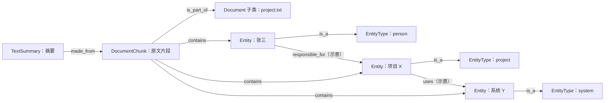
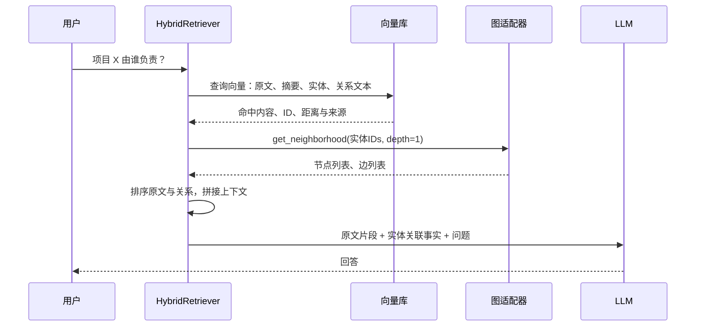
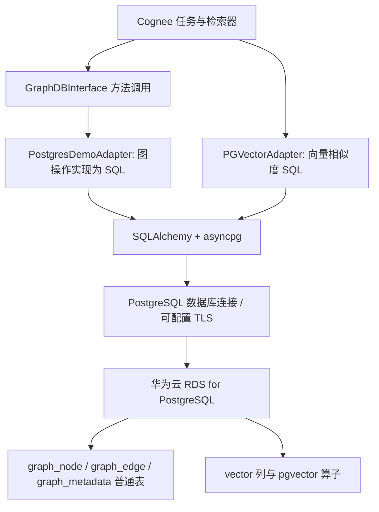

**本报告解释 Cognee 哪些模块依赖图、图里存什么、如何交互、为什么 PG 能替换基础图后端，以及替换边界。**

基线：Cognee 1.6.0，源码 commit `663a2dc15d04bc0d7ec2733a2dd604b7ed1b8c8e`；核对日期 2026-09-24。静态代码分析与官方文档交叉核验，未连接数据库或调用 LLM。示例中的实体、业务边名和描述为示意，真实抽取依赖模型、prompt、ontology。

**1. 先区分存储职责**

| 层 | 典型对象 | 职责 |
|---|---|---|
| 原文件存储 | 上传文件、原文位置 | 保存文件内容，图中 Document 可引用路径 |
| 关系存储 | data、datasets、users、ACL、运行信息 | 文件登记、归属、权限与任务管理；部分 provenance 也在这里 |
| 向量存储 | DocumentChunk_text、Entity_name 等 collection | 按相似度召回文本、实体、关系描述 |
| 图存储 | 文档、块、摘要、实体、类型与有向关系 | 表达结构、读取关联子图、管理知识来源和生命周期 |
| 会话缓存 | 会话问答、trace 等 | 会话记忆，不是每条会话都即时写永久图 |

[Data.py](https://github.com/topoteretes/cognee/blob/663a2dc15d04bc0d7ec2733a2dd604b7ed1b8c8e/cognee/modules/data/models/Data.py#L11) 保存 raw_data_location、owner_id、dataset_id、content_hash、pipeline_status 等。`remember(session_id=...)` 先写 session cache，按配置再桥接永久图；永久记忆路径才是 add→cognify→可选 improve。见 [remember.py](https://github.com/topoteretes/cognee/blob/663a2dc15d04bc0d7ec2733a2dd604b7ed1b8c8e/cognee/api/v1/remember/remember.py#L1801) 与 [永久记忆路径](https://github.com/topoteretes/cognee/blob/663a2dc15d04bc0d7ec2733a2dd604b7ed1b8c8e/cognee/api/v1/remember/remember.py#L1886)。

[官方架构](https://docs.cognee.ai/core-concepts/architecture)也区分关系、向量和图的角色，并说明内容可能交叉存储。因此，关系数据库的 nodes/edges 来源记录，不应与 PG 图后端的 graph_node/graph_edge 混同；更不能把设置 DB_PROVIDER=postgres 当作已把图后端切到 PG。

**2. 哪些模块为什么依赖图**

| 模块 | 写入/读取的数据与操作 | 依赖图的原因 | PG 可替换程度 |
|---|---|---|---|
| api/v1/cognify + tasks/graph | 抽取实体、类型、实体关系，关联文档块 | 将孤立文本组织成可连接的知识 | 通过后续公共存储接口可写 PG |
| modules/graph/utils + tasks/storage | DataPoint 递归转换为节点/边；add_nodes、add_edges | 保留对象引用、有向关系和来源 | PG 已实现基础持久化 |
| modules/retrieval/hybrid* | Entity 向量命中 ID → 一跳邻域 | 给原文召回补充实体关联事实 | PG 支持 |
| graph_completion_retriever + CogneeGraph | 子图投影、三元组排序、生成上下文 | 综合节点、边语义选出关联知识 | PG 支持基础路径；规模需压测 |
| modules/improve | 会话持久化、经验蒸馏、用户偏好、图反馈权重、truth state、索引增强 | 让交互沉淀为记忆并调整检索 | 九阶段中两项被 PG 能力门禁跳过，其余有条件可执行；见第 10.1 节 |
| modules/graph/methods + unified/provenance_delete_planner | 查来源归属、去来源引用、删无主节点/边 | 删文档时保留其他文档仍支撑的共享知识 | PG 有 provenance 实现 |
| tasks/code_graph + CodeRetriever | 模块、函数、调用、导入、路径 | 精确依赖分析、路径和影响范围分析 | 相关路径使用共同图操作，需验证性能 |
| Cypher/NaturalLanguage/Temporal retrievers | 原始查询或时间专用接口 | 提供特定图查询能力 | 当前 PG 存在明确缺口 |

图的意义不仅是“实体之间画一条线”。它还把事实与原文、类型、集合、来源生命周期联系起来。向量距离能回答“哪些内容相似”，节点与边还能表达“谁与谁有什么关系、由哪些文档支撑”。

**3. 实际图里保存什么**

以输入文档“张三负责项目 X。项目 X 使用系统 Y。”为例：



`made_from/is_part_of/contains/is_a` 是模型与转换代码确认的关系；业务边名称和实体划分只是示意。没有断言这句话实际执行后必定得到这张图。

| 模型 | 重要节点属性 | 与其他节点的关系 |
|---|---|---|
| Document 具体子类 | name、raw_data_location、mime_type、external_metadata | 文档块指向它 |
| DocumentChunk | text、chunk_index、chunk_size、content_hash、document_id/name | is_part_of→文档；contains→实体 |
| TextSummary | text、source_chunk_id、importance_weight | made_from→文档块；可选 summarized_in |
| Entity | name、description、importance 及可选状态字段 | is_a→EntityType；业务关系→其他实体 |
| EntityType | name、description | 作为实体的类别 |
| NodeSet | 分组信息 | belongs_to_set，需实际 NodeSet/DataPoint 引用才产生边 |

模型证据：[Document.py](https://github.com/topoteretes/cognee/blob/663a2dc15d04bc0d7ec2733a2dd604b7ed1b8c8e/cognee/modules/data/processing/document_types/Document.py#L9)、[DocumentChunk.py](https://github.com/topoteretes/cognee/blob/663a2dc15d04bc0d7ec2733a2dd604b7ed1b8c8e/cognee/modules/chunking/models/DocumentChunk.py#L32)、[TextSummary](https://github.com/topoteretes/cognee/blob/663a2dc15d04bc0d7ec2733a2dd604b7ed1b8c8e/cognee/tasks/summarization/models.py#L22)、[Entity.py](https://github.com/topoteretes/cognee/blob/663a2dc15d04bc0d7ec2733a2dd604b7ed1b8c8e/cognee/modules/engine/models/Entity.py#L5)。

这里 Entity 的模型类型是 `Entity`，人的语义类别由 `is_a→EntityType(person)` 表达。不要把所有实体节点的模型 type 都写成 Person。自定义 Person(DataPoint) 是另一种建模方式。

**4. 文档如何变成图：对象模型是关键中间层**

永久记忆写入的主流程：

```text
remember()
  → add()：登记/加载原始数据
  → cognify()：分类、切块、抽图和摘要
  → extract_graph_from_data()：抽取逻辑实体与关系
  → expand_with_nodes_and_edges()：转 Entity/EntityType/Edge 对象
  → TextSummary.made_from 指向原来的 DocumentChunk
  → add_data_points()：递归展开对象
  → 图 adapter：写节点和边
  → 向量 adapter：索引指定字段和关系文本
  → 写入/补充来源信息
```

[TextChunker.py](https://github.com/topoteretes/cognee/blob/663a2dc15d04bc0d7ec2733a2dd604b7ed1b8c8e/cognee/modules/chunking/TextChunker.py#L40) 创建 DocumentChunk，保存 text，设置 is_part_of，初始化 contains。LLM 的抽取结构先是带局部 ID 的 nodes/edges；[expand_with_nodes_and_edges.py](https://github.com/topoteretes/cognee/blob/663a2dc15d04bc0d7ec2733a2dd604b7ed1b8c8e/cognee/modules/graph/utils/expand_with_nodes_and_edges.py#L19) 将它们转成正式 Entity/EntityType，并将边端点解析成最终节点 ID。

摘要任务生成 TextSummary，其 made_from 指向原 chunk。[summarize_text.py](https://github.com/topoteretes/cognee/blob/663a2dc15d04bc0d7ec2733a2dd604b7ed1b8c8e/cognee/tasks/summarization/summarize_text.py#L60)因此保证从摘要对象仍能访问文档块及其知识结构。

[模型转换器](https://github.com/topoteretes/cognee/blob/663a2dc15d04bc0d7ec2733a2dd604b7ed1b8c8e/cognee/modules/graph/utils/get_graph_from_model.py#L87)按字段展开：

- 普通字符串、数字、字典等 → 节点属性。
- 引用其他 DataPoint 的字段 → 对方节点与一条边。
- DataPoint 列表 → 多条边。
- 显式 `Edge(relationship_type=...)` → 用指定关系名；不会把所有业务关系统称为 relations。
- 根据节点 ID、边身份去重，并避免循环对象重复展开。

例如 `summary.made_from=chunk` 生成 made_from 边；`chunk.is_part_of=document` 生成 is_part_of 边；`entity.relations=[(Edge(relationship_type="uses"), target)]` 生成 uses 边。这与[官方自定义模型说明](https://docs.cognee.ai/guides/custom-data-models)一致。

**为什么它支持替换：业务知识在应用层已转成节点、边和属性。数据库 adapter 不需要重新理解文档或重新调用 LLM，只需要持久化并查询这些统一结构。**

**5. 图和向量如何连接**

通常同一个 DataPoint 在图和向量里保留同一 ID。向量索引复制节点对象时不重新生成 ID，因此命中的实体 UUID 可直接用于图查询。见 [index_data_points.py](https://github.com/topoteretes/cognee/blob/663a2dc15d04bc0d7ec2733a2dd604b7ed1b8c8e/cognee/tasks/storage/index_data_points.py#L53)、[PGVector 索引写入](https://github.com/topoteretes/cognee/blob/663a2dc15d04bc0d7ec2733a2dd604b7ed1b8c8e/cognee/infrastructure/databases/vector/pgvector/PGVectorAdapter.py#L489)。官网也解释了[DataPoint 的共享 ID 与索引字段](https://docs.cognee.ai/core-concepts/building-blocks/datapoints)。

| 向量 collection / PG 表 | 内容 | 关联方式 |
|---|---|---|
| DocumentChunk_text | 文档块可嵌入文本、正文及来源 payload | id 对应 chunk 节点 |
| TextSummary_text | 摘要 | source_chunk_id 对回原文块 |
| Entity_name | 实体可嵌入内容 | id 对应实体节点 |
| EntityType_name | 实体类别 | id 对应类型节点 |
| EdgeType_relationship_name | 关系检索文本 | 由文本生成索引 ID，不能直接当图边实例 ID |

索引字段由模型 metadata 指定；collection 名由类型和字段组成，具体 embedding 文本由模型的 get_embeddable_data 生成，不能仅凭表名断言只嵌入该字段的原始字符串。

**关系向量有不同规则。** [index_graph_edges.py](https://github.com/topoteretes/cognee/blob/663a2dc15d04bc0d7ec2733a2dd604b7ed1b8c8e/cognee/tasks/storage/index_graph_edges.py#L39)按 edge_text（缺省时关系名）聚合成 EdgeType 索引对象。具体图边身份则是源、目标、关系名及派生的 edge_object_id。关系文本相同的多条图边可能关联同一关系文本索引点。因此“所有向量 ID 都是图节点 ID”不成立。

ID 的稳定性也不等于完美消歧：Entity 默认按名字构造确定 ID，但同一抽取图中重名实体另有区分逻辑；不能据此保证不同文档中的现实同名人物都会正确分开。

**6. 默认检索怎样与图交互**

当前 search 默认 HYBRID_COMPLETION；recall 还有会话及路由逻辑，并非每次都读永久图。

普通 HYBRID 查询流程：



准确调用点：[hybrid_retriever.py](https://github.com/topoteretes/cognee/blob/663a2dc15d04bc0d7ec2733a2dd604b7ed1b8c8e/cognee/modules/retrieval/hybrid_retriever.py#L136)、[entities.py](https://github.com/topoteretes/cognee/blob/663a2dc15d04bc0d7ec2733a2dd604b7ed1b8c8e/cognee/modules/retrieval/hybrid/entities.py#L43)。

- chunk lane 查 DocumentChunk_text 和 TextSummary_text，摘要可帮助找回和重排原文。
- entity/fact lane 查 Entity_name 和 EdgeType_relationship_name。
- Entity 命中 IDs 是图邻域查询起点；实际调用 depth=1。
- 图返回关联节点与边，例如 项目X←responsible_for—张三、项目X→uses—系统Y。
- 关系文本命中用于排序和补充事实；它不直接取代图中的端点关系。
- [context.py](https://github.com/topoteretes/cognee/blob/663a2dc15d04bc0d7ec2733a2dd604b7ed1b8c8e/cognee/modules/retrieval/hybrid/context.py#L8)将原文 passages、实体关系 bullets、facts 和可选 global context 拼接给 LLM。当前 formatter 不直接渲染 chunk_summaries；摘要在此主要辅助召回与排名。

邻域读取失败会降级为实体无边，所以“接口有回答”不代表图关系确实参与成功。上线验证应检查 retrieved_objects/context 和日志。

GRAPH_COMPLETION 则更侧重三元组：向量候选→读取子图→应用内 CogneeGraph→综合源节点/边/目标节点距离与权重选 top-k→转文本→LLM。证据：[CogneeGraph.py](https://github.com/topoteretes/cognee/blob/663a2dc15d04bc0d7ec2733a2dd604b7ed1b8c8e/cognee/modules/graph/cognee_graph/CogneeGraph.py#L480)。这部分排序在 Python，基础路径不要求数据库执行 PageRank、Cypher 或图神经网络。

**7. 为什么 PG 可以接替：同一操作、同一返回结构**

上层取得图对象的入口是 get_graph_engine。工厂根据全局或当前 dataset 配置返回不同 adapter；业务层使用共同方法。

```text
构建/检索/删除模块
     ↓ add_nodes / add_edges / get_neighborhood / delete_nodes
get_graph_engine() + GraphDBInterface/共同adapter协议
     ├─ LadybugAdapter → 图查询
     ├─ Neo4jAdapter  → Cypher
     └─ PostgresDemoAdapter → SQL
     ↑ 统一 Python tuple/dict
```

[GraphDBInterface.py](https://github.com/topoteretes/cognee/blob/663a2dc15d04bc0d7ec2733a2dd604b7ed1b8c8e/cognee/infrastructure/databases/graph/graph_db_interface.py#L16)约定返回形状：

```python
Node = (node_id, properties)
EdgeData = (source_id, target_id, relationship_name, properties)
```

接口说明还规定字符串 ID、幂等 upsert、删除关联边、批量来源信息等契约。get_id_filtered_graph_data 虽是多个 adapter 都实现的共同方法，但当前抽象类未显式声明它；不能把所有公共调用都说成抽象接口强制定义。

以示意 ID（实际为 UUID）说明 PG 的物理映射：

| 表 | 示例行 |
|---|---|
| graph_node | id=A，name=张三，type=Entity，properties={description: ...} |
| graph_node | id=P，name=项目X，type=Entity，properties={...} |
| graph_node | id=T，name=person，type=EntityType，properties={...} |
| graph_edge | source_id=A，target_id=P，relationship_name=responsible_for |
| graph_edge | source_id=A，target_id=T，relationship_name=is_a |

[PG 表定义](https://github.com/topoteretes/cognee/blob/663a2dc15d04bc0d7ec2733a2dd604b7ed1b8c8e/cognee/infrastructure/databases/graph/postgres_demo/tables.py#L27)保留方向、类型和属性；源/目标列是外键，边身份是三列复合主键。节点写入用 ON CONFLICT 按 ID 更新，边按其复合身份更新。

实体向量命中 P 后，PG adapter 的一跳边查询为：

```sql
SELECT source_id, target_id, relationship_name, properties
FROM graph_edge
WHERE source_id = ANY(:ids) OR target_id = ANY(:ids);
```

这里 :ids 是 SQLAlchemy 绑定参数，值为命中的节点 ID 集合。再收集返回边的端点，按 ID 取 graph_node，组装上述 Node/EdgeData。证据：[adapter.py](https://github.com/topoteretes/cognee/blob/663a2dc15d04bc0d7ec2733a2dd604b7ed1b8c8e/cognee/infrastructure/databases/graph/postgres_demo/adapter.py#L663)。

检索器收到的仍是“哪些节点通过哪些边连接”，后续排序和回答逻辑继续复用。多跳时 PG adapter 在 Python 做 BFS，每跳执行有端点过滤的 SQL；Neo4j/Ladybug 可以在图查询中展开路径。语义可相近，执行代价不同。[官方 Adapter 指南](https://docs.cognee.ai/guides/graph-engine-adapters)也介绍了这个工厂和适配器分层。

**8. 来源与删除为什么同样需要图协议**

结构来源链是 Summary→Chunk→Document；另有精细来源引用，记录节点/边由哪些文档、块、运行产生。

例如文档 A、B 都说明“项目 X 使用系统 Y”。删除 A 时，如果直接按可达节点删除，会把 B 仍需使用的实体和关系一起删掉。正确流程是：

1. 查该文档支持过哪些节点与边。
2. 对仍由其他来源支持的对象，只移除 A 的来源引用。
3. 对失去全部来源的对象，删除其向量记录及图结构。
4. 保留文档 B 的事实与引用。

代码通过统一 provenance 删除计划完成：[provenance_delete_planner.py](https://github.com/topoteretes/cognee/blob/663a2dc15d04bc0d7ec2733a2dd604b7ed1b8c8e/cognee/infrastructure/databases/unified/provenance_delete_planner.py#L90)。PG 用来源数组和相关查询/更新方法支撑这些操作。这里不能用“删几个向量”替代图及来源管理。

同一 PG 实例也不自动保证所有步骤在同一个事务。add_data_points 分步骤调用图写、向量索引、来源捕获，各适配器有自己的提交边界；本报告未审计全部故障补偿，不能宣称跨存储完全原子。

**9. 独立代码图：更接近“依赖图”的用途**

如果关注代码仓库依赖，相关模块是 tasks/code_graph：

- 模型包括 CodeRepository、CodeModule、CodeSymbol、ApiEndpoint、StorageResource、ExternalDependency；属性有 file_path、line、repo、fact_properties。
- enola 提取事实后转 DataPoint，动态 calls/imports 等关系通过 add_edges 写入。
- CodeRetriever 读取按代码类型过滤的图快照，在应用层执行 traverse、find_path、impact_analysis 等。
- 该路径默认不需要向量索引，index_vectors 是 opt-in；其 completion 返回结构结果，不调用 LLM 生成答案。

证据：[代码图模型](https://github.com/topoteretes/cognee/blob/663a2dc15d04bc0d7ec2733a2dd604b7ed1b8c8e/cognee/tasks/code_graph/models.py#L29)、[任务列表](https://github.com/topoteretes/cognee/blob/663a2dc15d04bc0d7ec2733a2dd604b7ed1b8c8e/cognee/tasks/code_graph/extract_code_graph.py#L976)、[代码检索](https://github.com/topoteretes/cognee/blob/663a2dc15d04bc0d7ec2733a2dd604b7ed1b8c8e/cognee/modules/retrieval/code_retriever.py#L857)。这又说明部分图算法在应用层，后端提供结构即可；但快照加载的规模代价必须验证。

**10. 哪些模块不能直接等价替换**

| 模块/能力 | 当前 PG 状态 | 原因 |
|---|---|---|
| 核心图构建、邻域、子图、来源删除 | 已实现基础接口 | 普通 SQL 可表达且 adapter 已实现 |
| CYPHER / NATURAL_LANGUAGE（NL→Cypher） | 不支持 | supports_cypher_queries=False；query 未实现 |
| TEMPORAL 的时间过滤路径 | 有明确缺口 | 直接调用 collect_time_ids/collect_events，PG 无这些方法 |
| improve 的图反馈权重、truth state | 跳过相应阶段 | PG 未实现扩展方法，能力探测返回不支持 |
| close_node 写 valid_to | 不支持该更新路径 | PG 没有通用局部 update_node |
| 全部边界行为完全一致 | 不能保证 | 例如缺少端点时 PG 外键行为与某些 adapter 跳过行为不同，未实测 |

时间检索代码证据：[temporal_retriever.py](https://github.com/topoteretes/cognee/blob/663a2dc15d04bc0d7ec2733a2dd604b7ed1b8c8e/cognee/modules/retrieval/temporal_retriever.py#L124)。它只有未抽取到时间或时间查询为空时才转三元组；缺方法并没有在此捕获降级。因此 PG 支持 timestamp 列，并不能证明 Cognee TEMPORAL 已适配。

[官方 Graph Stores](https://docs.cognee.ai/setup-configuration/graph-stores)及本地 README 均将开源 PG 图后端标为 demo，生产 PG 图适配器另行授权。官网通用 Adapter 指南部分文字提到 PG raw query 可执行 SQL，但与本版本 query() 实际未实现不一致；本报告以代码和专门能力声明为准。

性能也不随接口统一而相同：PG k-hop 有多次 SQL 往返；PG 图写固定 advisory lock 会让同库 schema 写入竞争；PGVector create_vector_index 实际只建表，未自动创建 ANN 索引。可替换应分别验收功能语义、数据保真、性能与生命周期。

**10.1. `modules/improve` 的“部分支持”逐阶段说明（补充核证）**

这里准确的目录名是 `cognee/modules/improve`。本节限定本报告的 Cognee 1.6.0 提交及开源 `postgres_demo` 图 adapter（`postgres` 是兼容别名），不是 PostgreSQL 数据库本身的能力上限，也不代表未公开的商业 PG adapter。

只把关系数据库或向量数据库换成 PG，不会触发下面的图能力缺口；决定反馈/truth 支持的是**当前 dataset 实际使用的 graph adapter**。以下“有条件支持”表示调用链所需图接口在 PG adapter 中已有实现或有明确兼容路径，**不是本次已完成数据库+LLM端到端运行验收**。session store、LLM、embedding 和权限仍需分别配置。

当前共有九个阶段，顺序由 [registry.py](https://github.com/topoteretes/cognee/blob/663a2dc15d04bc0d7ec2733a2dd604b7ed1b8c8e/cognee/modules/improve/registry.py#L31) 固定：

| 阶段 | 实际做什么、数据落哪里 | 开源 PG 图后端状态 | 执行条件与限制 |
|---|---|---|---|
| `feedback_weights` | 根据 session 中的评分及回答使用过的节点/边，更新图元素的 `feedback_weight` | **不支持；正常能力探测后跳过** | 缺少节点/边反馈权重的批量读写方法；有 session 时才进入后端能力检查 |
| `persist_session_qa` | 读取新 Q&A，转文本后 `add+cognify`，落永久图和向量索引 | **有条件支持** | 需要 session 与新内容、可用的摄入/抽取链；无新条目可返回 `already_completed`；这是唯一 fatal 阶段 |
| `persist_agent_traces` | 读取未持久化的 agent trace 反馈文本，`add+cognify` 入图 | **有条件支持** | 默认持久化 `session_feedback` 内容，不是保证写入所有原始 trace；无新步骤可不执行 |
| `extract_agent_context` | 从待处理 trace 提取 agent lessons，写 session context | **不依赖 PG 图专用扩展** | 需要可用 session manager、AUTO_FEEDBACK 和 LLM；此步本身不是更新图权重 |
| `distill_sessions` | 从通过门禁的 session guidance 蒸馏经验，渲染文档再 `add+cognify` | **有条件支持** | 需要 session、LLM及可蒸馏内容；没有合适 guidance 时可能不产出文档 |
| `update_user_preferences` | 写 `UserPreference` 节点和带 `weight/updated_at_turn` 的 `prefers` 边，更新文本、衰减并清理偏好 | **支持兼容路径** | 需开启 personalization；PG 缺局部 `update_node`，此模块明确回退完整节点 upsert；PG 能按三元组删除偏好边 |
| `build_truth_subspace` | 从 `session_learnings` 建学习向量质心，对 chunk 计算并保存 `truth_alignment/truth_epoch`，用于可选重排 | **不支持；正常能力探测后跳过** | 必须先显式 opt-in、提供 session；PG 缺 `get_node_truth_state/set_node_truth_state`；不是自动事实真伪验证 |
| `triplet_enrichment` | 分页读 source-edge-target 三元组，形成 Triplet embedding 并写向量索引 | **默认任务有条件支持** | PG 有 `get_triplets_batch`；需要开启 `triplet_embedding`（默认 false）；自定义 memify tasks 需另查接口，不能统一承诺 |
| `global_context_index` | 读取已有摘要，构建 bucket/root 层次摘要节点、`summarized_in` 边及向量索引 | **有条件支持** | 显式 opt-in、LLM、摘要与正常来源结构；improve 选用实验性 graph bucketing；相关读取可能加载较大图，需测规模成本 |

阶段源码：[会话持久化](https://github.com/topoteretes/cognee/blob/663a2dc15d04bc0d7ec2733a2dd604b7ed1b8c8e/cognee/modules/improve/stages.py#L110)、[上下文提取与蒸馏](https://github.com/topoteretes/cognee/blob/663a2dc15d04bc0d7ec2733a2dd604b7ed1b8c8e/cognee/modules/improve/stages.py#L168)、[偏好与 truth 门禁](https://github.com/topoteretes/cognee/blob/663a2dc15d04bc0d7ec2733a2dd604b7ed1b8c8e/cognee/modules/improve/stages.py#L285)、[triplet 与 global context](https://github.com/topoteretes/cognee/blob/663a2dc15d04bc0d7ec2733a2dd604b7ed1b8c8e/cognee/modules/improve/stages.py#L378)。

**缺失一：全局图反馈权重，不等于所有反馈能力都不能用。**

该阶段实际要用 `get_node_feedback_weights`、`set_node_feedback_weights`、`get_edge_feedback_weights`、`set_edge_feedback_weights`。PG 没有覆盖这些方法，继承的是抛 `NotImplementedError` 的接口占位实现；能力探测检查两个 setter 是否覆盖，因此 `supports_feedback_weights=False`，阶段通常返回 `skipped / backend_unsupported`。[接口定义](https://github.com/topoteretes/cognee/blob/663a2dc15d04bc0d7ec2733a2dd604b7ed1b8c8e/cognee/infrastructure/databases/graph/graph_db_interface.py#L757)、[能力探测](https://github.com/topoteretes/cognee/blob/663a2dc15d04bc0d7ec2733a2dd604b7ed1b8c8e/cognee/modules/improve/capabilities.py#L23)、[实际权重读写](https://github.com/topoteretes/cognee/blob/663a2dc15d04bc0d7ec2733a2dd604b7ed1b8c8e/cognee/tasks/memify/apply_feedback_weights.py#L268)。

例如用户给上轮回答差评，session 仍可以记录这个评分；但上述阶段不会据此改动回答引用过的普通图节点/边的 `feedback_weight`。只调 `feedback_influence` 是读取侧排序配置，不会补出缺失的权重写入。

用户偏好则是另一套图结构：`UserPreference → prefers → 内容节点`，权重在这条偏好边上。它使用 PG 已支持的邻域、`add_nodes/add_edges` 和 `delete_edge_triples`；对缺失 `update_node` 有完整模型 upsert 回退。因此**全局反馈权重不支持，不能推导用户个性化偏好不支持**。偏好节点不走 embedding 索引。[偏好回退](https://github.com/topoteretes/cognee/blob/663a2dc15d04bc0d7ec2733a2dd604b7ed1b8c8e/cognee/modules/user_preferences/store.py#L92)、[偏好边写删](https://github.com/topoteretes/cognee/blob/663a2dc15d04bc0d7ec2733a2dd604b7ed1b8c8e/cognee/modules/user_preferences/store.py#L146)。

**缺失二：truth subspace 坐标状态，不是所有经验蒸馏都失效。**

`distill_sessions` 可以先把经验文档构图。`build_truth_subspace` 是后续可选步骤：将这些 learnings 转为质心，把 chunk 投影为坐标，将 `truth_alignment` 与 `truth_epoch` 存到图节点，最后提交匹配 epoch 的质心。在 PG 上，`get_node_truth_state/set_node_truth_state` 未实现，阶段门禁阻止执行；直接调用 build 函数也会在 embedding 前重新检查并返回不支持。[构建的能力检查](https://github.com/topoteretes/cognee/blob/663a2dc15d04bc0d7ec2733a2dd604b7ed1b8c8e/cognee/modules/truth_subspace/build.py#L202)、[保存字段](https://github.com/topoteretes/cognee/blob/663a2dc15d04bc0d7ec2733a2dd604b7ed1b8c8e/cognee/modules/truth_subspace/build.py#L373)。

结果是不能通过这套自动构建路径获得对应的 truth alignment 重排信号；普通 Hybrid 检索仍可以运行。读取 truth context 时遇到缺失状态/异常也会回到 baseline ranking。[读取侧降级](https://github.com/topoteretes/cognee/blob/663a2dc15d04bc0d7ec2733a2dd604b7ed1b8c8e/cognee/modules/retrieval/hybrid/truth.py#L21)。这项名字虽然叫 truth，但本质是相对经验向量空间的对齐，不是数据库替应用验证事实真实性。

**其余兼容链不是只根据“没有 capability gate”猜测。**

- Q&A 和 trace 持久化最终分别调用 `add+cognify`；蒸馏也走同样路径，不调用缺失的反馈/truth setter。[Q&A](https://github.com/topoteretes/cognee/blob/663a2dc15d04bc0d7ec2733a2dd604b7ed1b8c8e/cognee/tasks/memify/cognify_session.py#L62)、[trace](https://github.com/topoteretes/cognee/blob/663a2dc15d04bc0d7ec2733a2dd604b7ed1b8c8e/cognee/tasks/memify/cognify_agent_trace_feedback.py#L79)、[蒸馏保存](https://github.com/topoteretes/cognee/blob/663a2dc15d04bc0d7ec2733a2dd604b7ed1b8c8e/cognee/modules/session_distillation/distill.py#L433)。
- Agent context 提取把候选经验交给 session context applier，然后更新 trace 水位；不是直接修改 PG 图权重。[agent context](https://github.com/topoteretes/cognee/blob/663a2dc15d04bc0d7ec2733a2dd604b7ed1b8c8e/cognee/infrastructure/session/agent_context_extraction.py#L263)。
- 默认 triplet enrichment 调 `get_triplets_batch → index_data_points`；PG 通过 source/edge/target JOIN 分页返回三元组，向量侧再 embedding/index。[默认任务](https://github.com/topoteretes/cognee/blob/663a2dc15d04bc0d7ec2733a2dd604b7ed1b8c8e/cognee/memify_pipelines/memify_default_tasks.py#L6)、[PG 三元组读取](https://github.com/topoteretes/cognee/blob/663a2dc15d04bc0d7ec2733a2dd604b7ed1b8c8e/cognee/infrastructure/databases/graph/postgres_demo/adapter.py#L1437)。
- Global context 读取摘要投影、来源及 summary→chunk→entity 关系，写摘要 DataPoint 与 `summarized_in` 边；所用图读取/upsert/delete/provenance 接口在 PG 有实现，无需 Cypher。图 provenance 分支会调用 `get_graph_data`，兼容不等于大图场景便宜。[输入读取](https://github.com/topoteretes/cognee/blob/663a2dc15d04bc0d7ec2733a2dd604b7ed1b8c8e/cognee/modules/graph/methods/get_global_context_graph_inputs.py#L71)、[摘要和结构边保存](https://github.com/topoteretes/cognee/blob/663a2dc15d04bc0d7ec2733a2dd604b7ed1b8c8e/cognee/tasks/memify/global_context_index/persist.py#L74)。

**另外，`close_node` 的缺口独立于九阶段。**

`close_node(old_id)` 通过通用 `update_node` 给旧事实写 `valid_to`，表示失效但保留历史。PG 未实现这个局部更新接口，该 helper 捕获 `NotImplementedError`、记录 warning 并返回 `False`，**不会真的写入失效时间**。它不像用户偏好模块，没有完整 upsert 的兼容回退。`update_chunk_index` 虽然在 PG 已实现，但只是特定字段更新，不能代替通用 `update_node`。所以原报告的“事实维护”表述应细分为文档增量更新、偏好更新与事实有效期更新。[close_node](https://github.com/topoteretes/cognee/blob/663a2dc15d04bc0d7ec2733a2dd604b7ed1b8c8e/cognee/tasks/storage/close_node.py#L21)。

**如何解读一次 improve 的结果。**

每阶段返回 `status/reason/error/counts`。判定顺序是配置关闭 → 缺 session → 阶段自己的 gate，所以同一个不受 PG 支持的功能，也可能先显示 `no_session_ids` 或 `opt_in_disabled`，而不是 `backend_unsupported`。无新内容可显示 `already_completed`；正常执行没有产出也不代表数据库缺能力。[通用门禁](https://github.com/topoteretes/cognee/blob/663a2dc15d04bc0d7ec2733a2dd604b7ed1b8c8e/cognee/modules/improve/stage.py#L44)。

非 fatal 阶段失败通常记录 `errored` 后继续，整体结果仍会反映错误；`persist_session_qa` 失败会中止后续阶段，前台可抛异常。若能力探测本身失败，代码采用 assume-supported 策略，让阶段执行后报告错误，因此“跳过”是正常探测成功时的行为，不是无条件保证。[结果汇总](https://github.com/topoteretes/cognee/blob/663a2dc15d04bc0d7ec2733a2dd604b7ed1b8c8e/cognee/modules/improve/result.py#L225)、[探测异常策略](https://github.com/topoteretes/cognee/blob/663a2dc15d04bc0d7ec2733a2dd604b7ed1b8c8e/cognee/modules/improve/capabilities.py#L90)。

因此准确结论是：**九阶段中，图反馈权重与 truth state 两项被当前 PG adapter 明确阻断；另外七项有可用实现路径或不依赖 PG 图扩展，但是否执行取决于输入、配置和其他依赖。不能将其表示成“improve 有 7/9 的生产可用率”。**

**PG/华为云是否能补齐？**从数据表达看可以：反馈权重、truth 坐标/epoch、valid_to 都可由普通 PG 字段或 JSONB 保存，缺的是 Cognee adapter 的读写契约实现，通常不需要另装图数据库扩展。实现时必须保留原属性、正确映射节点与 edge_object_id、处理批量读写/不存在对象/并发和 dataset 作用域；truth 还需保持坐标与质心 epoch 的发布顺序。切到华为云 PG、增加 pgvector 或仅把 `supports_*` 标志改为 true，都不会自动补齐这些逻辑。本轮补充文档，没有修改 adapter 或声称这些缺口已修复。

**11. 落到华为云，判断变成具体能力映射**

| Cognee 使用方式 | 所需 PG 能力 | 华为云结论 |
|---|---|---|
| 节点/边属性存储 | 普通表、JSONB、数组、外键、upsert | RDS PG 基础能力适配路线成立 |
| 子图、一跳/多跳 | 按端点 ID 过滤、索引、事务 | 能承载该实现；吞吐延迟需实测 |
| 向量召回 | vector 扩展、余弦距离、维度匹配 | 官方提供 pgvector，核实实例小版本 |
| dataset 按 schema 隔离 | CREATE schema/table/index 等权限 | 可用当前 shared handlers，需授权 |
| 高级缺失接口 | 需要 Cognee adapter 代码实现 | RDS 本身不会自动补齐 |

[华为云 pgvector 文档](https://support.huaweicloud.com/usermanual-rds-pg/rds_09_0062.html)可确认扩展支持；[插件安装说明](https://support.huaweicloud.com/usermanual-rds-pg/rds_09_0043.html)说明按目标业务库安装及管理员要求。图部分不依赖 Apache AGE。

替换已有系统还需要数据迁移。改 provider 只改变目标 adapter，不会自动搬运旧图或改完已有 dataset 的注册配置。当前有 COGX 导出/导入，可将图导出后在目标后端恢复，并核验向量索引、dataset 权限和来源。见 [export.py](https://github.com/topoteretes/cognee/blob/663a2dc15d04bc0d7ec2733a2dd604b7ed1b8c8e/cognee/modules/migration/export.py#L237)、[cogx_archive.py](https://github.com/topoteretes/cognee/blob/663a2dc15d04bc0d7ec2733a2dd604b7ed1b8c8e/cognee/modules/migration/sources/cogx_archive.py#L22)。它不是整个数据库物理备份，本次未执行跨后端迁移。

建议将验收按实际模块列出：默认 HYBRID 问答、GRAPH 三元组、文档删除与共享事实、代码图、时间检索、反馈学习分别验证。华为云 PG 可以承载基础图模型；是否够用最终取决于业务会调用哪些 Cognee 模块，而不是只检查能否连上 PostgreSQL。

**11.1. 华为云 PG 没有原生图接口，究竟靠什么拉通？**

具体到表结构、缺失接口的返回契约、修改文件、并发与迁移问题，以及分档工作量，见[PG 图能力实现与改造计划](postgres-graph-implementation-plan.md)。

这里的对接对象限定为**华为云 RDS for PostgreSQL**。该路线不要求 RDS 提供 Neo4j/Bolt、Cypher 或 Gremlin 服务。用的是标准 PostgreSQL 数据库连接：Cognee 自己的 Python 图接口由 `PostgresDemoAdapter` 实现，adapter 将具体操作写成 SQL，通过 SQLAlchemy + asyncpg 发到 RDS。它不是通用 Cypher→SQL 翻译器，也不是把图转换为向量后保存。



这里有两种“接口”，不能混为一谈：

| 层次 | 接口/协议 | 由谁实现 |
|---|---|---|
| Cognee 应用内部 | `add_nodes`、`add_edges`、`get_neighborhood` 等 Python 方法 | `GraphDBInterface` 定义，PG adapter 实现 |
| 数据库网络连接 | PostgreSQL 协议，发送 SQL、返回结果 | asyncpg 客户端与华为云 RDS PG 服务端 |

例如“李工负责支付服务”分别存成两个 `graph_node` 行及一条 `graph_edge` 行。查李工邻域，adapter 对边表按 `source_id/target_id` 查相邻端点，再取节点属性；查多跳，则由 Python 维护 BFS frontier，逐跳执行 SQL。数据库看到的是表、索引、JOIN、事务和数组条件，而不是一个图查询协议。[节点/边表定义](https://github.com/topoteretes/cognee/blob/663a2dc15d04bc0d7ec2733a2dd604b7ed1b8c8e/cognee/infrastructure/databases/graph/postgres_demo/tables.py#L28)、[数据库连接](https://github.com/topoteretes/cognee/blob/663a2dc15d04bc0d7ec2733a2dd604b7ed1b8c8e/cognee/infrastructure/databases/graph/postgres_demo/adapter.py#L218)、[邻域 BFS 与 SQL](https://github.com/topoteretes/cognee/blob/663a2dc15d04bc0d7ec2733a2dd604b7ed1b8c8e/cognee/infrastructure/databases/graph/postgres_demo/adapter.py#L907)。

向量是另一条调用链：`PGVectorAdapter` 生成 embedding 的余弦距离查询；RDS 在安装 pgvector 后执行对应算子。图表与向量表可以放在同一实例，但它们承担不同检索职责；只配置 PGVector 不会满足 Cognee 图接口。[PGVector 搜索](https://github.com/topoteretes/cognee/blob/663a2dc15d04bc0d7ec2733a2dd604b7ed1b8c8e/cognee/infrastructure/databases/vector/pgvector/PGVectorAdapter.py#L633)。

华为云官方提供[标准 PostgreSQL 客户端与 SSL 连接说明](https://support.huaweicloud.com/qs-rds-pg/rds_02_0016.html)，以及[pgvector 类型、算子与版本检查方法](https://support.huaweicloud.com/usermanual-rds-pg/rds_09_0062.html)。这是连接与向量能力的依据，**不等于华为云认证了 Cognee 图 adapter 的全部功能与性能**。

据此可得：已有适配器能把它已实现的图操作接到普通 PG，无需华为专用图协议或 AGE；但缺失的 Cypher、反馈权重、truth state 等接口不会因为 PG 连接成功而出现。开源 adapter 仍被[Cognee 官方](https://docs.cognee.ai/setup-configuration/graph-stores)标为 demo；实际实例还需验证网络/TLS、表和 schema 权限、vector 扩展、SQL行为及性能。本报告没有连接真实华为云实例，结论是**代码和协议层面的对接路径成立，功能完整性与生产验收另计**。
