# Cognee能否改用Apache AGE（A Graph Extension，图扩展）：能力、缺口、影响与开发成本

核验日期：2026-09-28。本文以PostgreSQL（下文简称 **PG**，关系数据库）及其Apache AGE扩展为主线。数据库适配器（adapter）是把Cognee的读写要求转换成具体数据库操作的一层代码。

**总判断：AGE具备承接Cognee图存储和主要图操作的基础能力，但当前不能直接切换。需要开发适配器，保住写入、检索、来源与学习状态的业务规则。统计功能可以分期；是否更快、能承载多少并发，必须实测。**

本文由多个Agent分工审查开源代码，再交叉复核。Cognee固定提交为`663a2dc15d04bc0d7ec2733a2dd604b7ed1b8c8e`；AGE固定版本见第2章和文末证据。所有“怎么改”均为待实施方案，**没有把源码可行性写成已完成的生产验证**。详细旧稿保留在Git历史，本文件是统一阅读入口。

**关于`improve`，先纠正一个容易误解的结论：它不是一个被PG或AGE整体禁止的图接口，而是编排九个阶段的业务入口。**普通PG演示适配器缺反馈权重和经验对齐状态方法；其他阶段有的复用构图、有的只处理会话。AGE目前缺整个适配器，因此需要补齐这些合同，而不是重写一个同名数据库过程。下文[完整接口台账](#interface-inventory)逐项列出底层方法、接口外调用、接入合同与九阶段影响；不能再用“部分支持”代替分析。

阅读顺序：[1 替代结论](#overview) → [2 版本与部署](#age-versions) → [3 写入缺口](#age-gaps) → [4 检索与学习](#retrieval-learning) → [5 统计影响](#gds-triggers) → [6 实施与成本](#age-adapter)。[备选图库](#ladybug)和[完整接口台账](#interface-inventory)放在文末，按需查看。

## 1. 能替代什么：替换图后端，保留Cognee的记忆流程

**本章结论：可以把AGE作为待开发的图后端；不能只改连接地址，也不需要重写整个Cognee。真正要替代的是一组业务操作，不是Neo4j的所有扩展库。**

### 1.1 先用一张表作出能力判断

| 你关心的能力 | AGE底层是否有基础 | 当前还缺什么 | 明确结论 |
|---|---|---|---|
| 保存文档、片段、实体、关系 | 有节点、边、属性和读写语句 | Cognee对象到AGE的映射、批量写入和返回格式 | **可开发替代，当前未接通** |
| 按实体找邻居、沿关系取上下文 | 有匹配和路径查询 | 跳数、方向、过滤、孤立节点、结果格式的适配 | **可开发替代，须对照结果验收** |
| 重复导入、删除某份资料、失败恢复 | 有事务和属性读写基础 | 业务唯一性、来源维护、并发规则与补偿 | **必须开发，不能靠“有节点/边”省略** |
| 反馈学习、事实有效期、时间检索 | 数据可表达，基础读写可用 | 相应接口及状态更新规则 | **可开发替代，不会自动支持** |
| 节点/边计数、连通性分析 | 可查询数据，也可用应用侧算法 | 统计实现及失败状态；当前计数与结构统计耦合 | **按展示功能分期，不是会话统一阻断项** |
| 全图距离、聚类统计 | 可另做算法，但有计算成本 | 完整口径、资源预算和规模验证 | **选配，不要求先实现才能问答** |
| 原样运行任意Neo4j查询/扩展 | 方言和过程库不完全相同 | 查询改写、能力限制或额外开发 | **不能承诺原样兼容** |
| 比普通PG更快、100用户达标 | 静态代码无法证明 | 真实数据、并发、硬件和响应目标的测试 | **未验证，不能作为既成优势** |

AGE的节点、边、属性和查询原语见[版本能力证据][age16-evidence]及[新版证据][age18-evidence]；Cognee的业务要求定义在[图接口][graph-interface]。表中“可开发”不等于已有可用AGE适配器。

### 1.2 AGE在系统里替换哪一块

以“张三参与星河项目”为例，大语言模型负责抽取实体和关系；数据库保存抽取后的结构。图不是只保存原文，也不是替模型理解语言。

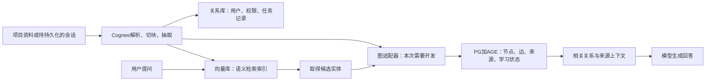
```mermaid
flowchart LR
    D[项目资料或待持久化的会话] --> C[Cognee解析、切块、抽取]
    C --> R[关系库：用户、权限、任务记录]
    C --> V[向量库：语义检索索引]
    C --> A[图适配器：本次需要开发]
    A --> G[PG加AGE：节点、边、来源、学习状态]
    Q[用户提问] --> V
    V --> N[取得候选实体]
    N --> A
    G --> X[相关关系与来源上下文]
    X --> L[模型生成回答]
```

图与向量通常通过通用唯一标识（**UUID**，用于稳定识别同一业务对象）关联。例如向量命中“张三”的UUID，图再用这个标识查他的项目关系。AGE自己的内部节点编号不能直接替代这个业务UUID。[模型转图][model-to-graph]、[节点索引][node-index]、[官方架构][cognee-architecture]。

上层调用图适配器的应用编程接口（**API**，代码之间约定的调用方式）。例如调用`get_neighborhood`取得邻域，再整理成回答上下文。新适配器只要保持输入、输出和业务行为，就能复用上层抽取和回答流程。[默认邻域检索][hybrid-neighbors]。

### 1.3 为什么不直接继续用普通PG

普通PG也能用两张表保存节点和边，现有`postgres_demo`适配器已经这样做；因此“PG没有图扩展就完全不能存图”不成立。问题在于接口缺口、图查询表达和实际执行成本。

AGE增加图模型和Cypher（描述节点、关系和路径的查询语言），适合把图操作集中在数据库侧表达。但它仍运行在PG之上，**不保证消除联表，也不保证比原方案更快**。第4章说明要测哪些成本。[普通PG适配器][pg-demo]。

**这一章的取舍：先把AGE当作有实现依据的候选后端，下一步确认能否部署；不要先假定它已完整兼容或性能必胜。**

## 2. 哪个版本可用：建议验证PG18＋AGE1.8，华为云要另过安装关

**本章结论：所核查的AGE版本都没有开箱即用的Cognee适配器。新开发优先以PG18＋AGE1.8做概念验证（PoC，用最小真实实验验证方案），因为它补充了写入分支和最短路能力；但华为云提供PG18，不等于托管实例能安装AGE。**

### 2.1 AGE与PG必须按对应发布包配套

| AGE版本 | 本轮核实的正式PG组合 | 相比新版需注意什么 |
|---|---|---|
| 1.6.0 | PG14、15、16、17，各有对应包 | 缺少新建/匹配后的条件赋值语法和新版专用最短路入口；不同PG分支还有差异 |
| 1.7.0 | PG17、18，各有对应包 | 仍缺上述条件赋值语法和新版专用最短路入口 |
| 1.8.0 | PG18 | 本报告建议验证的组合；仍不是完整Neo4j方言兼容 |
| 1.8.0的PG15条目 | 当日仍为预发布 | 不作为本报告正式交付基线 |

核验依据：[Apache发布目录][age-releases]、[PG17/1.6][age16-release]、[PG18/1.7][age17-release]、[PG18/1.8][age18-release]、[发布证据快照][release-snapshot]。部分正式标签名称仍带`rc0`，应结合发布身份判断，不能仅按名字推断。

### 2.2 哪些版本缺失会影响哪些流程

这里的结构化查询语言（**SQL**）是PG的查询语言；AGE允许从SQL调用图查询。以下“有”只指所列能力，不代表所有图查询都兼容。

| 能力或缺口 | AGE1.6 | AGE1.7 | AGE1.8/PG18 | 触发场景与影响 |
|---|---|---|---|---|
| 节点/边创建、匹配、普通匹配或创建、属性更新、批量输入、列表属性 | 有 | 有 | 有 | 可作为存储与查询基础；业务去重、来源和状态规则仍由适配器实现 |
| 新建时赋默认值、已存在时执行另一组更新：`ON CREATE / ON MATCH` | 缺 | 缺 | 有 | 重复导入要保住已学到的权重。旧版须另做事务分支；新版也不能自动判断哪些字段该保留 |
| 不带返回结果的子查询合并：`UNION`相关写法 | PG14～16缺；PG17分支有 | 有相应解析 | 有相应解析 | 主要影响使用该写法的自定义查询；固定写入模板可避开，不是所有查询合并都失效 |
| 专用无权最短路入口 | 未提供新版入口 | 未提供新版入口 | 有`age_shortest_path`等 | 旧版需另实现相关算法；普通一两跳邻域不以此为前提 |
| Neo4j原有最短路模式语法 | 不等价 | 不等价 | 仍不等价 | 自定义查询或自然语言生成的查询可能报错，必须改方言 |
| Neo4j多模型标签的原样表达 | 不能直接假定等价 | 不能直接假定等价 | 仍不能机械照搬多标签 | 要把类型映射为属性或标签集合，并一起修改类型筛选，详见第3章 |
| 行级安全（**RLS**，按规则限制哪些数据行可访问） | 缺少本轮确认的新版显式插入检查路径 | 有相关策略/角色测试 | 有相关实现/测试 | 普通操作通过不代表全部路径查询都已隔离安全；须独立验证，不能作为唯一租户隔离依据 |

证据：[1.6各分支源码矩阵][age16-evidence]、[1.7/1.8源码矩阵][age18-evidence]。1.8最短路按跳数，不能当作按权重选最低成本路径；当最少跳数参数`min_hops`大于实际最短距离、同时指定多种边类型时，所查实现明确报不支持，并非所有多类型查询都失败。逗号分隔值文件（**CSV**，一种表格文本格式）的AGE装载器会拒绝启用行级安全的目标表；选用这种批量捷径时需换受支持的写入路径，不能为导入直接关闭隔离。这两项应专项验证，不应泛化为普通问答都不可用。[路径限制代码][age-path-limit]、[权限/导入核查][age18-evidence]。

### 2.3 华为云：缺扩展不能用客户端协议补出来

华为云关系型数据库服务（**RDS**，厂商托管的数据库）公开版本表已列PG14～18；所核查的插件清单有pgvector（PG向量检索扩展），**未列AGE**。具体地域、实例小版本和可安装扩展仍需实例核验。[引擎版本][huawei-versions]、[插件清单][huawei-plugins]。

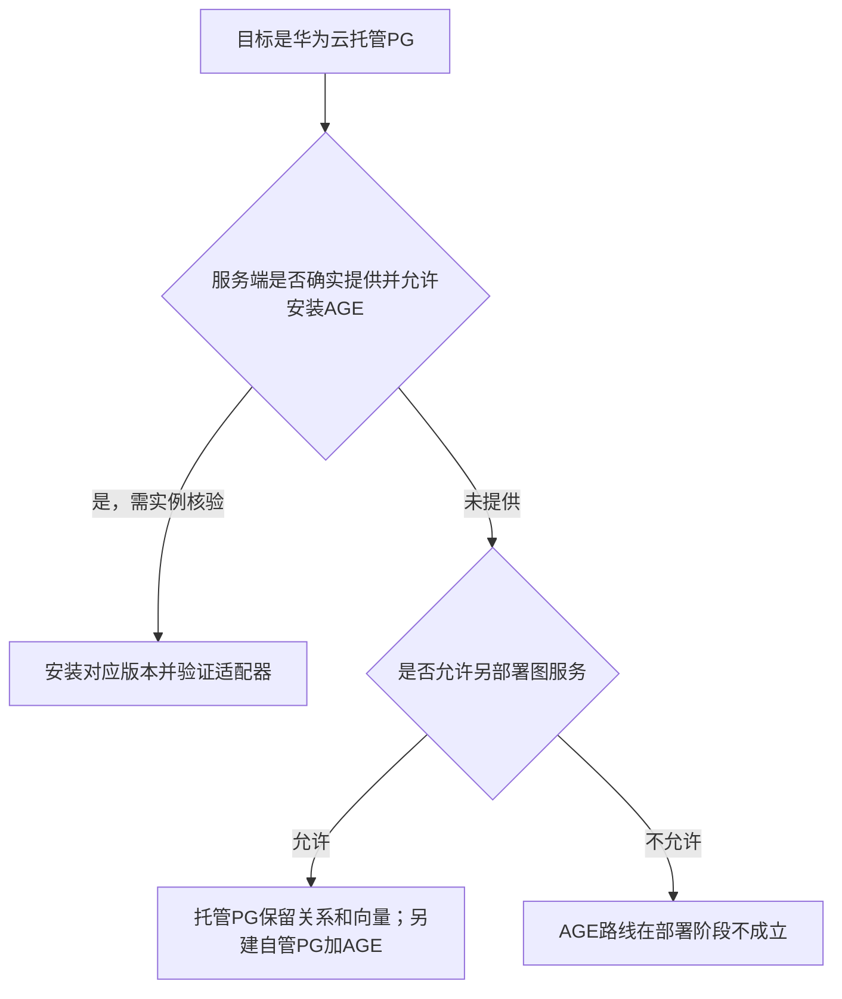
```mermaid
flowchart TD
    A[目标是华为云托管PG] --> B{服务端是否确实提供并允许安装AGE}
    B -->|是，需实例核验| C[安装对应版本并验证适配器]
    B -->|未提供| D{是否允许另部署图服务}
    D -->|允许| E[托管PG保留关系和向量；另建自管PG加AGE]
    D -->|不允许| F[AGE路线在部署阶段不成立]
```

AGE是服务器扩展，需要服务器上有对应安装包和权限。修改驱动、连接地址或网络协议，不能在缺少扩展的服务器里变出图能力。可选择弹性云服务器（**ECS**，可自行安装软件的云主机）或容器自管PG＋AGE，但这增加了部署、备份和维护责任。[AGE安装][age-install]。

只读核验可查询`pg_available_extensions`是否有`age`，以及`pg_extension`是否已安装；pgvector的扩展名是`vector`。本轮未连接用户实例，不把公开清单当成目标实例的实测结果。

**这一章的取舍：版本上优先验证PG18＋AGE1.8；部署上先确认服务端安装条件。若必须只用当前未开放AGE的标准托管实例，后续适配代码再完善也无法落地。**

## 3. 写入缺什么：三种写入行为、业务身份和来源一致性必须补齐

**本章结论：AGE能存节点和边，但不会自动执行Cognee的业务规则。正常入图前必须补齐分组、类型、关系、唯一性和来源维护；缺失时会导致写入失败，或更隐蔽的“成功但数据不对”。**

### 3.1 资料怎样进入图：Claude Code聊天也可能触发，但分两步

假设输入是“张三参与星河项目”，抽取结果最终识别出张三、星河及参与关系。下面是教学数据，不保证每次模型抽取都生成完全相同结果。

只连接Cognee的模型上下文协议（**MCP**，让Claude Code调用外部工具的协议）时，必须实际调用`remember`才写入；安装Cognee记忆插件后，则由事件钩子（hooks）自动采集。

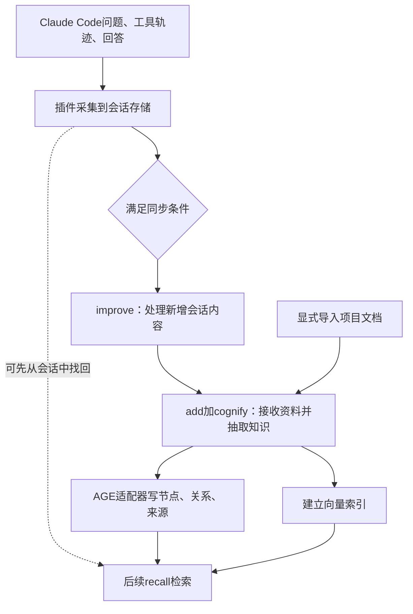
```mermaid
flowchart TD
    A[Claude Code问题、工具轨迹、回答] --> B[插件采集到会话存储]
    B --> C{满足同步条件}
    C --> D[improve：处理新增会话内容]
    D --> E[add加cognify：接收资料并抽取知识]
    F[显式导入项目文档] --> E
    E --> G[AGE适配器写节点、关系、来源]
    E --> V[建立向量索引]
    B -.可先从会话中找回.-> R[后续recall检索]
    G --> R
    V --> R
```

插件通过`/remember/entry`保存有类型的会话记录，不直接走字符串`remember`输入的自动构图分支；后续由插件同步触发`improve`。这里`remember`是保存入口，`cognify`负责构建知识图，`improve`负责持久化/提炼会话及其他学习阶段，`recall`是读取记忆。**会话保存成功不等于永久图已构建完成**：图写失败时会话仍可能存在，持久化水位不会按成功推进，后续可重试。[会话转图][session-cognify]。

插件1.6.1的自动同步默认是：每10秒检查，空闲60秒后尝试；每150个已存储工具/回答结束事件也可触发；自动触发共用1800秒冷却及新增记录检查；会话结束另有最终同步。它不是每分钟无条件重导全部聊天。采集受开关、过滤和后端可用性约束，也不等于扫描全部项目文件。[插件钩子][plugin-hooks]、[同步条件][plugin-sync]。

因此，即使用户没有手动点击“导入”，插件后续同步也会进入图写入阶段；**下面的写入缺口会在这个阶段暴露，而不是仅影响某个管理页面。**

### 3.2 APOC为什么必须替代：它参与了普通写入

**APOC（Neo4j的扩展函数与过程库）**在当前适配器中承担三项具体工作。AGE不提供这些同名调用，但可以用自己的写法实现结果；“必须改”指必须替代业务行为，不是重建整套APOC库。

假设同一数据集（dataset，一个有访问权限边界的知识空间）内有两份文档：A《项目启动》与B《运维交接》，都提到“张三参与星河”。假设上游已将张三、星河及两份文档中的这条关系映射为相同业务身份；名字相同本身不保证实体合并。

| APOC调用 | 输入与应该得到的结果 | 不改写会怎样 | 只删调用会怎样 | AGE怎么替代 |
|---|---|---|---|---|
| `apoc.coll.toSet` | 原分组`[项目启动]`加新分组`[运维交接]`，得到两者并集；重复输入不重复 | 节点写语句引用不存在的函数而失败，分组为空也不绕过该引用 | 直接覆盖会丢旧分组；仅拼接会重复；仅对本批去重会漏库内旧值 | 在并发控制下合并旧、新列表并去重 |
| `apoc.create.addLabels` | 张三标为`Entity`，文档标为`TextDocument`，使后续可按模型类型查找 | 同一节点写语句失败 | 按UUID能找到对象，按模型类型却漏查；文档子图和类型筛选可能不完整 | 用固定物理标签加类型属性/标签集合，并同步修改所有类型筛选 |
| `apoc.merge.relationship` | 已有“张三参与星河”则更新；没有则创建；“维护”应是另一种关系 | 非空批量边写入失败，知识关系未完整建立 | 跳过会缺边；无条件创建会重复；忽略类型会把参与和维护混在一起 | 按受控关系类型分组，用匹配或创建、属性更新及唯一性规则写入 |

依据：[节点写入][node-write]、[批量边写入][edge-write]。`toSet`只给分组列表去重，**不是识别两个“张三”是不是同一个人，也不是记录文档来源的账本**。模型标签`Entity`也不是“人物”这个语义类别，后者可通过类型节点表达。

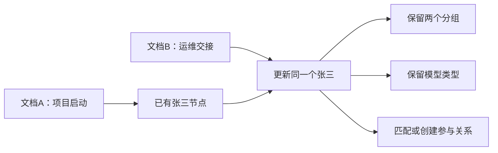
```mermaid
flowchart LR
    A[文档A：项目启动] --> O[已有张三节点]
    B[文档B：运维交接] --> U[更新同一个张三]
    O --> U
    U --> S[保留两个分组]
    U --> T[保留模型类型]
    U --> E[匹配或创建参与关系]
```

新适配器须同时完成写入和查询映射。例如把物理`Entity`标签改成`type=Entity`属性后，仍使用旧的标签查询就会漏数据；同一UUID是否允许积累多种模型类型，也必须明确，单个type值不自动等价于多标签。

**失败不是全部自动回滚。**当前顺序是图节点→节点向量→图边→边向量，分阶段执行。若节点已成功、边写失败，前面的数据可能已存在；框架尝试应用层补偿，但它不是跨所有存储的一次原子事务。仍能从旧图、会话或部分向量中回答，不证明这次导入成功。[写入顺序][storage-order]、[错误与补偿][pipeline-errors]。

也不应夸大为所有操作都失败：单条边写入已有普通匹配或创建实现，普通节点删除也不用这三项APOC。结论限定为**当前常规节点/批量边写入必须有等价实现**。[单边写入][single-edge]。

### 3.3 为什么有节点主键，还需要业务唯一性

AGE的内部节点编号解决“物理记录各不相同”；Cognee的UUID解决“重复导入的张三应是同一个业务对象”。如果两个请求同时创建相同UUID，却各得一个内部编号，底层记录仍合法，业务上却已经重复。

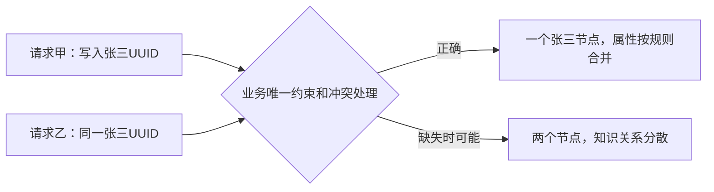
```mermaid
flowchart LR
    A[请求甲：写入张三UUID] --> C{业务唯一约束和冲突处理}
    B[请求乙：同一张三UUID] --> C
    C -->|正确| D[一个张三节点，属性按规则合并]
    C -->|缺失时可能| E[两个节点，知识关系分散]
```

因此要设计并验证业务UUID索引、边的稳定身份、并发冲突重试。不能假定父标签上的唯一索引自动覆盖所有继承标签；约束必须覆盖模型实际存储范围。边身份至少区分起点、关系类型和终点；同端点“参与”和“维护”不能误合并。单条`MERGE`（匹配已有对象，否则创建）成功不等于所有并发都已唯一。[身份及索引依据][age18-evidence]、[业务写入合同][graph-interface]。

### 3.4 来源维护：删除A，为什么必须保留B的知识

分组表达“属于哪些内容集合”，来源表达“由哪些输入支持”，学习状态表达“后来学到了什么”。三者必须分开保存。

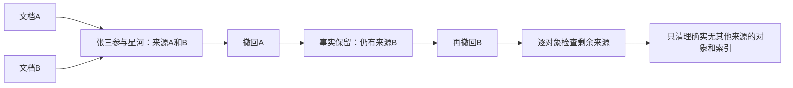
```mermaid
flowchart LR
    A[文档A] --> F[张三参与星河：来源A和B]
    B[文档B] --> F
    F --> D[撤回A]
    D --> K[事实保留：仍有来源B]
    K --> L[再撤回B]
    L --> J[逐对象检查剩余来源]
    J --> N[只清理确实无其他来源的对象和索引]
```

若简单执行“删除张三节点”，B支持的事实也会消失；若只删图而不正确清理向量，可能留下仍能召回的残留。节点还可能被文档C引用，所以删最后一条边来源也不等于整个人物都能删除。

现有删除规划会区分存活与无主对象，清理应删向量，只给存活对象移除目标来源，再删除无主图对象；无主对象在真正删除前保留来源信息，方便失败后找回重试。新适配器需要实现15项来源/元数据方法，复用该规划，而不是另写一个粗暴删节点流程。[来源删除规划][delete-planner]。

并发也要验证：甲读到来源`[B]`准备追加为`[A,B]`，乙同时读到`[B]`准备撤回为`[]`；若乙最后覆盖，会丢A。问题是读、修改、写入没有被完整协调，不是AGE不会存列表。需用事务、锁或条件更新保护整组业务动作；图与向量跨连接的补偿仍要保留。

**这一章的交付门槛：重复写不重复、分组不丢、类型可查、关系完整、删除A不伤及B、失败可重试。任何一项没完成，都不能声称正常入图已经可靠；这些优先于图统计。**

## 4. 检索和学习缺什么：图查询原语还要变成正确的业务结果

**本章结论：AGE已有邻域、路径和属性更新基础；需要开发结果转换和状态规则。最短路语法、学习接口和性能是三个独立问题，不能用“支持Cypher”一笔带过。**

### 4.1 查询能跑，为什么还可能漏知识

用户问“星河项目有哪些参与者”，默认混合检索先用向量找候选，再取候选附近的关系。这里不要求运行全图算法，但要求返回正确的节点集合、边方向和过滤结果。

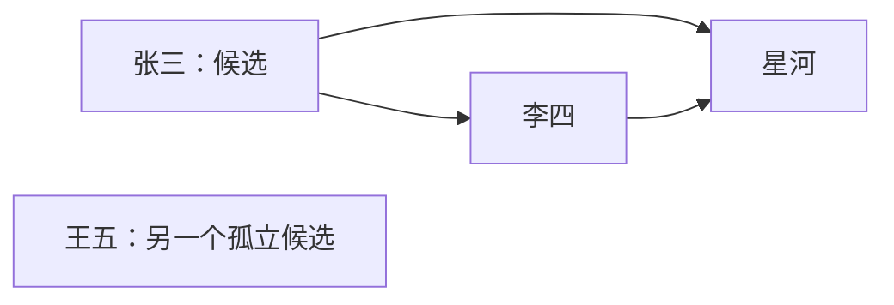
```mermaid
flowchart LR
    Z[张三：候选] --> X[星河]
    Z --> L[李四]
    L --> X
    W[王五：另一个孤立候选]
```

若结果只收集从张三出发的某条路径，可能漏掉节点集合中已有的“李四→星河”边；若只从边反推节点，孤立候选王五可能消失。Cognee需要的是符合范围的节点及节点间相关边，不是任意一个路径列表。[图读取合同][graph-interface]、[子图消费][cognee-graph]。

AGE适配器须处理：候选节点保留、指定深度、方向、关系类型、内容分组筛选、分页和稳定UUID返回。缺失时用户看到的是漏检、错误上下文或读全图造成的延迟，不只是某个统计数字缺失。

### 4.2 学习与时间功能：分别在哪个操作暴露缺口

| 用户行为或流程 | 需要适配什么 | 不支持时的具体影响 | 必须怎样处理 |
|---|---|---|---|
| 用户反馈“这条回答不好”，后续`improve`应用反馈 | 节点/具体边权重的4个读写方法 | 该图权重学习阶段被能力检查跳过或报告错误；会话里的反馈文本不因此消失 | 实现权重读写与完整读算写并发规则，不能只把能力标志改为真 |
| 显式启用`truth`学习阶段 | 经验对齐坐标和对应版本的2个方法 | 无法提供这套可选重排信号；普通基础检索仍可运行 | 先写新版本坐标，再发布对应质心；读取只采用当前生效版本的坐标，逐项写入结果须真实；它不是事实真伪鉴定 |
| 给旧事实写失效时间 | 通用`update_node`局部更新 | 旧事实没有按要求标记失效 | 只更新指定字段，保留其他状态；缺失时要明确失败 |
| 重新导入已有实体 | 保留或明确重置学习状态 | 输入默认权重0.5可能覆盖已经学到的0.9 | 区分新建默认值、普通更新、显式重置。AGE1.8语法只能帮忙分支，不能替你决定规则 |
| 时间检索“张三上周参与什么” | `collect_time_ids`、`collect_events`两个额外方法 | 时间检索不能只因保存了时间属性就成立 | 按当前毫秒时间、区间边界和事件邻域合同实现 |

依据：[反馈能力检查][capabilities]、[权重更新][feedback-task]、[事实关闭][close-node]、[时间检索调用][temporal]。

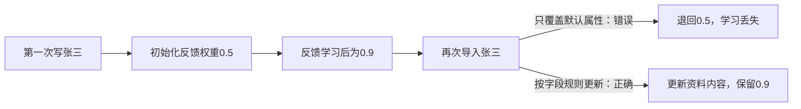
```mermaid
flowchart LR
    A[第一次写张三] --> B[初始化反馈权重0.5]
    B --> C[反馈学习后为0.9]
    C --> D[再次导入张三]
    D -->|只覆盖默认属性：错误| E[退回0.5，学习丢失]
    D -->|按字段规则更新：正确| F[更新资料内容，保留0.9]
```

现有普通PG图适配器的“部分支持”主要指缺少上述4个反馈方法、2个truth方法和通用局部更新；不是PG存不了数值，也不是整个`improve`都不可用。会话持久化、经验蒸馏和默认三元组索引等仍有实现路径。AGE适配器要逐项实现和声明，不能照搬一个笼统的“支持improve”。九阶段清单见文末。

### 4.3 最短路与自定义查询：不能承诺原样兼容

假设张三直达赵六是1跳但费用100，经李四是2跳、费用2。AGE1.8所核查的专用最短路按跳数选1跳，不能当作按费用选2跳的算法。

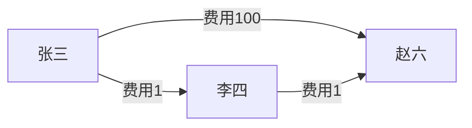
```mermaid
flowchart LR
    Z[张三] -->|费用100| Q[赵六]
    Z -->|费用1| L[李四]
    L -->|费用1| Q
```

这不构成当前普通邻域问答的硬缺口；当前Cognee相关全图距离统计也没有配置权重。但是用户显式提交Neo4j原始查询、或自然语言生成器仍生成Neo4j语法时，会碰到方言不兼容。应先限制公开查询范围，再改生成提示、参数和结果协议，不承诺任意查询可迁移。[AGE最短路实现][age-path-code]、[自然语言查询入口][nl-retriever]。

### 4.4 AGE能否解决联表慢：可能改善表达，性能收益待测

固定跳图匹配仍会转换成PG内部查询，仍可能使用联表（JOIN，把关联记录组合起来）；变长路径展开（**VLE**，沿关系扩展不同长度路径）有专门实现，但仍受扇出、深度、冷缓存和数据量影响。[查询转换][age-transform]、[路径实现][age-path-code]。

“从张三找两跳关系”和“从高连接度节点找十跳所有路径”不是同一负载。第二种即使没有手写复杂SQL，也可能产生大量中间结果。不能把AGE当成消除关系运算或自动提速的开关。

100用户同样要区分100个独立图与一个共享热点图。连接池、图缓存和同图写冲突都要测；AGE也不自动把一个图分布到多台机器。验证至少记录第95百分位响应时间（**P95**，即95%的请求在该时间内完成）、错误率、内存、冷热差异和写入等待，并把数据库、向量检索、模型调用分别计时。

**这一章的交付门槛：检索结果与参考后端一致，学习不会被重导覆盖，未支持的查询明确限制；性能结论只根据目标数据和负载实验给出。**

## 5. 统计缺什么：不支持GDS不等于不能记忆，要看谁调用了统计

**本章结论：GDS（Graph Data Science，Neo4j图数据科学库）在本次核查中用于图统计。普通Claude Code会话采集、检索和默认同步不会固定调用它；但显式摘要请求可能被现有代码间接拖入统计失败。应把计数、连通性和昂贵指标分成三档交付。**

### 5.1 两条调用路径，影响的人不同

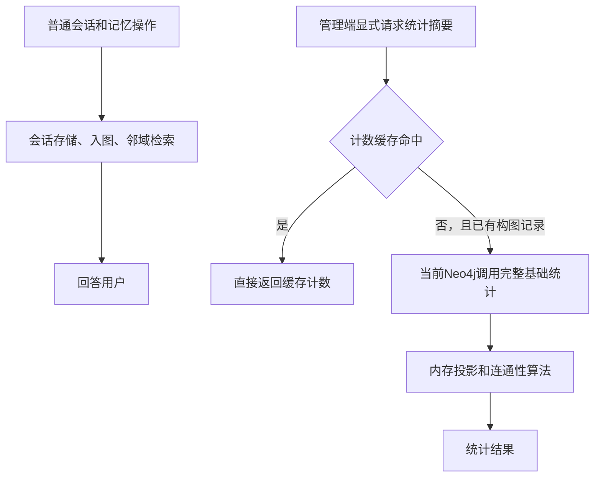
```mermaid
flowchart TD
    A[普通会话和记忆操作] --> B[会话存储、入图、邻域检索]
    B --> C[回答用户]
    D[管理端显式请求统计摘要] --> E{计数缓存命中}
    E -->|是| F[直接返回缓存计数]
    E -->|否，且已有构图记录| G[当前Neo4j调用完整基础统计]
    G --> H[内存投影和连通性算法]
    H --> I[统计结果]
```

当前Claude插件没有默认请求图统计摘要；状态栏刷新是本地渲染。当前MCP的空检索诊断也已移除旧的图摘要探测，不能把“找到3条记忆”的结果计数当成全图统计。本文的管理端场景，指你另外接入统计API的页面、监控脚本或程序。[插件状态栏][plugin-statusline]、[MCP测试][mcp-summary-test]。

| 触发入口 | 何时真正计算 | 不支持相关统计时的影响 |
|---|---|---|
| 普通`recall`、会话保存、默认`improve` | 正常内置链路不调用这七项GDS过程 | 不因GDS缺失本身失效；写入和检索适配仍须正确 |
| `/datasets/graph-summary`、`/visualize/brains-summary` | 主动请求，已有对应构图记录且统计缓存未命中 | 可能触发下面的零计数回退 |
| 显式`get_graph_metrics(False)` | `False`表示不计算可选指标，仍进入基础统计 | 仍需要内存投影与连通性计算；关闭可选项不等于关闭GDS |
| 显式`get_graph_metrics(True)` | `True`表示基础统计后追加可选算法 | 最短路径或聚类缺失也可能使整次完整统计失败 |
| 显式`get_pipeline_run_metrics(...)` | 完整统计缓存未命中时 | 影响此次指标获取；没有证据表明每次构图都会自动调用它 |

依据：[摘要缓存与计算][counts]、[完整指标缓存][pipeline-metrics]、[Neo4j统计顺序][neo-metrics]。并发缓存未命中可能重复计算，不保证严格每次构图只计算一次。

### 5.2 七种GDS调用分别干什么，不支持会失去什么

弱连通分量（**WCC**，忽略箭头后彼此能到达的一组节点）用来判断知识图分成多少个互不连通的部分。GDS内存投影则是算法使用的计算副本，不是另一个用户知识库。[官方投影说明][gds-projection]。

| GDS调用 | 什么时候调用 | 直接用途 | 缺失后果及替代方式 |
|---|---|---|---|
| `gds.graph.list` | 基础统计准备 | 检查旧内存投影是否存在 | 原流程准备失败；AGE新算法可不使用这个目录机制 |
| `gds.graph.drop` | 旧投影存在时 | 删除旧计算副本 | 原统计可能失败；不是持久图删除失败，替代时只清理临时状态 |
| `gds.graph.project` | 建立本次统计输入 | 生成算法使用的内存图 | 原算法没输入；AGE可直接查询或完整导出目标拓扑 |
| `gds.wcc.stats` | 基础统计，`False`也调用 | 算连通分量数量 | 无法得知有几个知识团体；需实现等价算法或不开放该指标 |
| `gds.wcc.stream` | 同上 | 聚合每个分量的大小 | 无法得知各团体大小；可与上一项一次遍历计算 |
| `gds.allShortestPaths.stream` | 仅`True` | 获取全图点对距离，再算直径/平均距离 | 缺相应指标，不等于普通邻域检索失败；单独选配 |
| `gds.localClusteringCoefficient.stats` | 仅`True` | 算邻居之间连接紧密程度 | 缺平均聚类系数，不等于反馈权重或答案评分失效；单独选配 |

其中前三项是旧算法的准备设施，不是必须复制给AGE的用户功能。后四项才对应具体分析结果。[算法调用代码][neo-metric-utils]。

继续用项目资料画一张仅含六个业务实体的教学图；真实Cognee图还有文档、片段、类型等节点，实际指标不应直接照抄这里的数字。

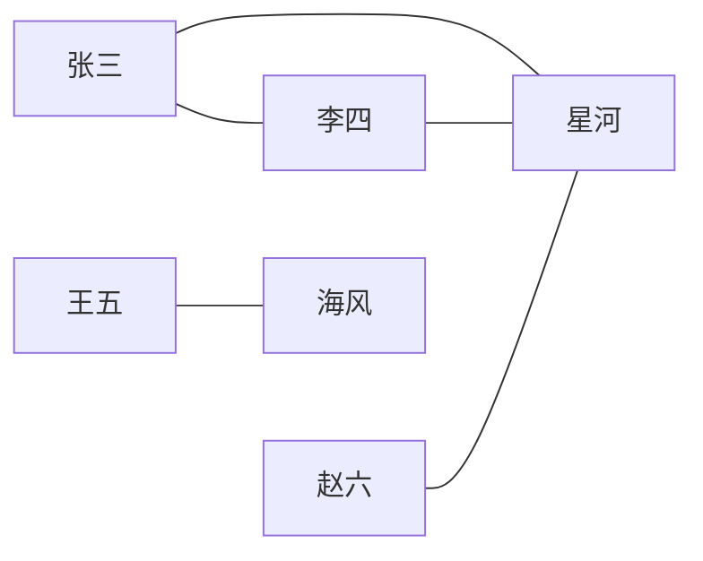
```mermaid
flowchart LR
    Z[张三] --- L[李四]
    Z --- X[星河]
    L --- X
    Q[赵六] --- X
    W[王五] --- H[海风]
```

- **连通性例子：**这里有两个团体，大小分别为4和2。缺WCC就不能提供这两个结构指标，但仍能查到“王五与海风相连”。
- **距离例子：**张三到赵六最少2步。全图平均距离却要考虑所有点对；张三到王五不可达，必须明确如何处理，不能简单把它当0。AGE的一次两点最短路调用不等于完成全图统计。
- **聚类例子：**张三的两个邻居李四和星河也相连，构成三角形；赵六只有一个邻居，局部结构不同。聚类衡量这种连接结构，不是判断“张三参与星河”是真是假。

### 5.3 最容易误判的故障：图里有知识，摘要却显示0

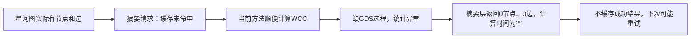
```mermaid
flowchart LR
    A[星河图实际有节点和边] --> B[摘要请求：缓存未命中]
    B --> C[当前方法顺便计算WCC]
    C --> D[缺GDS过程，统计异常]
    D --> E[摘要层返回0节点、0边，计算时间为空]
    E --> F[不缓存成功结果，下次可能重试]
```

这是当前代码把“只要两个计数”绑定到“完整基础统计”的连带影响。数据没有因此被删除，普通检索也不因这次统计失败自动失效。直接调用完整统计则可能收到异常，不一定经过摘要层的零值回退。[异常处理][counts]。

**`include_optional=False`仍包含WCC。**如果先交付准确计数、后交付连通性，必须新增轻量计数路径并修改调用及结果消费，或者明确改统计合同；只删算法并填0不合格。结构分析超出资源上限时应明确不可用，不能截断部分图后称为全图WCC。

### 5.4 统计的交付顺序

| 交付目标 | 必须做什么 | 可以暂缓什么 |
|---|---|---|
| 先提供普通记忆服务 | 完成图写、图读、来源与启用的学习合同 | 不启用的摘要和结构统计可以暂缓 |
| 显示知识库规模 | 准确节点/边计数，失败与真实空图区分 | 解耦后可以暂缓WCC |
| 提供连通性分析 | 正确WCC数量和大小、范围与资源限制 | 全点对距离和聚类仍可暂缓 |
| 提供完整结构分析 | 再实现距离和聚类、明确不可达点口径并压测 | 不承诺任意规模无限制精确计算 |

**这一章的判断：缺GDS不是AGE替代的统一阻断项；缺的是某项统计结果，就限制该项功能。只有当前耦合造成的假零和错误传播，必须在启用摘要前处理。**

## 6. 怎么开发、多少工作量：先验证底层，再按业务交付

**本章结论：主要开发在Cognee适配层及相关业务协调，当前没有证据表明本范围必须修改AGE内核。按本次完整接口台账，主交付暂留153.5～319 Agent小时；基础图已完成时，improve的专属增量为16.5～33小时。两者不是相加关系，均须首轮真实AGE验证后校准。**

### 6.1 具体改哪里

AGE通过PG连接执行图查询，返回`agtype`（AGE用于节点、边和属性值的数据类型）。新适配器需要编码参数、解码结果，并保持Cognee的对象格式；不能直接把原Neo4j驱动换个地址。

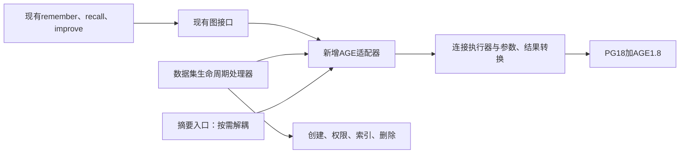
```mermaid
flowchart LR
    U[现有remember、recall、improve] --> I[现有图接口]
    I --> A[新增AGE适配器]
    A --> C[连接执行器与参数、结果转换]
    C --> G[PG18加AGE1.8]
    H[数据集生命周期处理器] --> A
    H --> S[创建、权限、索引、删除]
    T[摘要入口：按需解耦] --> A
```

| 开发位置 | 做什么 | 为什么可行、还有什么须验证 |
|---|---|---|
| 新增`graph/age/`适配器及连接模块 | 接入工厂、管理连接、参数和agtype结果；实现节点/边读写 | AGE有原语，Cognee有接口；仍须真实验证编码、取消、断连、错误和事务 |
| 新增图模型及索引初始化 | 固定业务类型表达、UUID索引、边身份、来源与学习字段 | 数据可表达；索引表达式、并发唯一性和升级路径须实测 |
| 新增数据集生命周期处理器（handler） | 创建/解析/删除每个数据集的图，绑定用户权限与连接缓存 | Cognee已有注册接点；只注册适配器不会自动得到多租户 |
| 来源、状态与检索模块 | 15项来源方法、反馈/经验对齐/局部更新、时间检索、邻域与分页 | 可复用上层规划和算法；必须保持现有业务合同而非仅让函数不报错 |
| `session_lock`及写入/撤回的操作协调接点 | 补跨进程保护完整读改写、来源删除与新增、同步水位 | 原锁只覆盖单工作进程；数据库单条语句原子性不能自动保护整个业务流程 |
| 按需修改摘要入口 | 将计数与结构算法分离，明确失败状态 | 需要改调用及消费合同，不属于只新增后端文件即可完成的部分 |
| 公开查询及自然语言查询 | 方言提示、参数、返回格式和能力限制 | 独立选配；不能让模型继续生成不支持的Neo4j/APOC语法 |

源码接点：[适配器工厂][graph-factory]、[数据集处理接口][dataset-handler]、[AGE驱动参考][age-python]。若用同步驱动，须隔离执行以免阻塞应用；不能假定驱动解码可直接插到现有异步连接里。

建议AGE成为图的唯一权威存储，不再另维护一套普通PG图表并异步复制。向量与关系元数据仍沿现有适配器；同一PG服务器不自动把这些调用合成一个事务。旧数据迁移须保留UUID、来源和学习状态，重建索引并核对，改provider配置不会自动搬数据。

### 6.2 全Agent任务与预算：improve增量和完整适配分开算

**基础图、来源和查询已接通时，补齐improve专用状态方法＋九阶段联调，暂估16.5～33 Agent小时；三元组分页未做再加1～2小时。**不是从零接入AGE的总价。九个阶段哪些运行、哪些跳过、哪些失败，以及每阶段触发例子，见[improve完整拆解](#improve-complete)。

一个Agent小时是一个Agent被任务占用一小时，四个Agent各运行两小时就是8 Agent小时。本次全部设计、实现、测试、复核和修复均按Agent执行；不换算传统人工人日。

| 交付范围 | 待校准Agent预算 | 是否可直接视为已验证 |
|---|---:|---|
| 第一轮PG18＋AGE1.8真实概念验证 | 6～12小时，已包含在总价 | 尚未运行，通过后才继续 |
| 本文逐项列明的主交付范围 | **153.5～319小时，含返工预留** | 47个方法有明确处置；含主要记忆、九阶段学习、时间、来源、旧删除兼容、接入和验证 |
| 再选公开查询、生成查询、昂贵统计、旧清理辅助、truth故障加固 | 另加28.5～57小时 | 每项单独验收；不承诺任意Neo4j查询原样兼容 |
| 任意旧版本生产迁移、统一图向量事务、备份/高可用 | 范围未给定，不能报固定总量 | 不藏在“全接口支持”中 |

**旧80～170小时估算由本次逐项预算替代。**新增接口外协议、九阶段分别验收、跨进程协调和摘要消费者改造后，不应继续沿用旧总数。[附录B](#interface-inventory)给出每个方法的成本及总账，公共基础只算一次；源码可以证明开发边界，不能证明Agent的实际开发速度。

最多4个Agent并行，建议1协调、2实现、1验证。先完成首轮概念验证，记录实际占用、工具等待、模型用量和修复轮次，再修订预算与日历工期；不能直接用Agent总小时除以4。金额还取决于模型价格和机器资源。

### 6.3 分阶段验收，避免把统计缺失当成所有功能失败

| 交付阶段 | 用什么例子验收 | 不通过的含义 |
|---|---|---|
| 部署可行 | 固定组合装好扩展，目标权限下读写及结果解码 | 这条部署路线尚不成立 |
| 记忆主流程 | 导入A/B，重复写张三，问星河参与者；撤回A仍保留B | 写入、检索或来源合同不合格，不能上线该主流程 |
| 已启用学习功能 | 学到0.9后重导不退回0.5；事实关闭、时间边界正确 | 对应学习/生命周期功能不可宣称支持 |
| 摘要展示 | 非空图计数准确；失败不显示假0；缓存与错误路径正确 | 阻断摘要上线，不自动判普通会话不可用 |
| 连通性和可选指标 | 孤点、链、环、两个团体与独立算法对照 | 阻断相应统计功能；未启用的指标不作统一门槛 |
| 目标规模 | 私有多图/共享热点分开，混合读写、故障恢复 | 功能正确仍不足以证明100用户或生产响应目标达标 |

保留会话缓存，以完整记忆功能做测试；自动反馈、后台同步、队列等开关要记录。普通插件流程、显式摘要请求、昂贵统计分别测，不能假定每次聊天都有一次全图统计，也不能关闭真实同步负载后声称测到了完整插件。

**最终建议：若能自管PG扩展且希望沿用PG运维体系，先做PG18＋AGE1.8的首轮概念验证；通过后实现记忆必需合同，统计分期。若必须只用不开放AGE的托管实例，或要求同图自动跨机扩展，则先解决部署/架构条件，不应直接启动完整适配。**

## 附录A. AGE不合适时，其他图库怎样选择

**结论：Ladybug减少新接入工作，服务型图库可提供不同的部署基础；没有一个候选已被本报告证明能直接满足全部业务及100用户目标。**此附录保留备选结论，不改变正文的AGE实施主线。

许可按用户要求筛选，排除通用公共许可证（**GPL**，具有较强衍生分发义务的开源许可证）。MIT许可证（一种宽松开源许可）和Apache-2.0许可证属于本报告接受的许可范围；服务端与客户端依赖的许可需分别看。

| 候选固定版本 | 能解决什么 | 当前缺口与选择边界 |
|---|---|---|
| Ladybug0.19.0，MIT | 当前Cognee已有47项图接口实现及额外时间方法，无需从零开发适配器 | 嵌入式文件由唯一读写owner（数据库持有进程）持有；增加API进程不等于同图多写入者水平扩展或自动故障切换。独立数据集可设计按owner分片；单热点图仍须验证容量 |
| ArcadeDB26.9.1，Apache-2.0 | 服务端有数据库路由、事务和复制/故障切换基础 | 社区适配器仍依赖旧Cognee，缺数据集处理、来源、学习及正确统计等；优先作为服务型候选验证，不能直接切换；复制不等于单图自动分片 |
| HugeGraph1.7.0，Apache-2.0 | 有服务化及集群部署路径 | 需新适配器；命名空间隔离依赖部署分支，不能只按接口路径推断；来源并发和恢复须验证 |
| JanusGraph1.1.0，Apache-2.0 | 可组合外部存储构建分布式图服务 | 外部后端的事务/锁约束增加一致性和运维工作；不因100注册用户就优先引入 |
| NebulaGraph3.8.0，Apache-2.0 | 有分布式图服务基础 | 需新适配器；所核版本持久属性不能直接当集合使用，来源/分组需重建模型；权限与多对象失败恢复另验 |

固定源码依据：[Ladybug许可][ladybug-license]、[文件锁][ladybug-file-lock]、[Ladybug写事务][ladybug-transactions]、[ArcadeDB服务端][arcade-ha]与[社区适配器][arcade-adapter]、[HugeGraph部署分支][hugegraph-space]、[JanusGraph事务约束][janus-transactions]、[Nebula属性类型][nebula-types]。Neo4j Community5.26采用GPL；Memgraph所查版本为Business Source License（**BSL**，带使用条件的源码可用许可），FalkorDB为Server Side Public License（**SSPL**，含服务提供义务的许可），不作为本报告的宽松许可候选。[许可对照][neo-license]、[Memgraph许可][memgraph-license]、[FalkorDB许可][falkor-license]。

Ladybug结论针对普通平台的0.19.0依赖，旧macOS条件版本未覆盖。它也不是零风险：此前已用其0.19.0引擎执行当前适配器原统计查询，发现孤点/链图的连通性结果错误、聚类查询报错，外层可能返回假零。影响统计，不证明普通图存储失败。原实验使用小内存配置，不是100用户容量测试；[复现脚本与结果保留在已提交历史版本][ladybug-repro]。单owner验证、统计修复和复核原预算30～60 Agent小时、1～3日，不包含跨机路由、服务化或自动故障切换。

**备选判断：多独立图且接受单owner时可先验Ladybug；共享图要求数据库自身故障切换时先验ArcadeDB；明确超过单机容量才深入分布式候选。所有候选仍需通过正文同一组业务测试。**

## 附录B. 完整接口台账：先看业务入口，再看实际要实现的方法

**结论：此前只列47个方法名不够。完整适配还包括接口外调用、数据集接入合同、九阶段学习链，以及查询方言。下面按同一份源码的真实调用分层列出，避免把“方法存在”误判为“业务支持”。**

### B.1 “所有接口”的核查边界

本轮用抽象语法树（**AST**，把源代码解析成类、方法和调用结构的表示）重新提取`GraphDBInterface`，确认是**47项：21项抽象方法、26项默认方法**；再搜索生产代码对图引擎的直接调用、动态能力检查和注册工厂。抽象方法没实现，类不能正常实例化；默认方法可能抛不支持、静默不做事，或退回全图读取。这三种不能混为一谈。[接口源码][graph-interface]

台账另列**15个具名扩展方法/钩子、3个数据集处理器方法、3个能力声明及注册接点**，并把`improve`九阶段单独展开。方法名链接到固定提交的定义，段末链接到调用代码；逐方法预算和总账已按同一口径核算。

这里的完整性承诺限定于文末固定Cognee提交的**内置图合同和已找到的生产调用路径**。自定义`memify`任务、第三方检索器、用户任意Cypher，以及单独使用Graphiti运行时，可以调用新的方法或方言，必须另提供代码清单；不能宣称一个适配器兼容未来所有插件。

下面每项工时都是**共享基础已经完成后的增量Agent小时**，包含该项局部样例测试；连接初始化、统一编码、身份约束、事务框架、业务联调和独立复核另列。表中的小数用于让预算可加总，不表示能精确预测半小时交付。图中每个方法组对应后文逐项台账；不会为47个方法重复画同一张“输入→数据库→输出”。

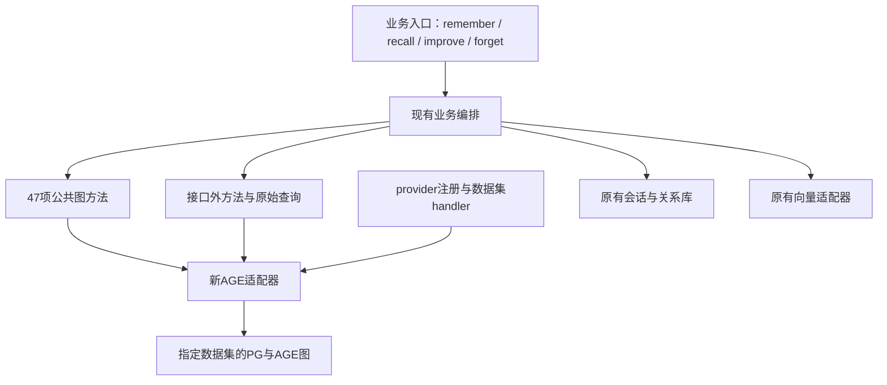
```mermaid
flowchart TD
    U[业务入口：remember / recall / improve / forget] --> O[现有业务编排]
    O --> I[47项公共图方法]
    O --> X[接口外方法与原始查询]
    I --> A[新AGE适配器]
    X --> A
    P[provider注册与数据集handler] --> A
    A --> D[指定数据集的PG与AGE图]
    O --> C[原有会话与关系库]
    O --> V[原有向量适配器]
```

**共同的不支持原因：当前没有AGE适配器及对应的数据集处理器。**后文讨论“只补部分方法后，仍漏了这一项会怎样”。除明确列出的方言/算法缺口外，不是在说AGE无法存这些数据。AGE能存一个数，不等于已经实现了“只更新权重、保留来源、并发不丢更新”的业务合同。

### B.2 业务入口覆盖：不用把所有路由重新实现一遍

**结论：通常保留业务入口，补底层合同并做入口回归；入口层真正需要改的是能力声明、错误呈现、特定查询方言和统计解耦。**下表的回归预算计入B.10的业务联调包，不再逐行加到底层方法预算。

| 入口或模式 | 何时触发、缺口影响与例子 | AGE交付方式；入口回归预算 |
|---|---|---|
| `remember`永久记忆 | 导入“张三参与星河”；节点或边写入失败，不能得到完整永久记忆；随后自动improve失败有单独错误字段 | 复用`add+cognify+improve`，验完整写入和部分失败；1～2小时 |
| `remember(session_id=...)`会话记忆 | 先记入会话缓存；自动桥接开启且满足调度条件时运行improve。缓存成功不证明问答已入永久图 | 验前台保存、后台桥接、失败重试和水位；1～2小时 |
| `recall`／`search`普通检索 | 向量找到张三，再取其项目邻域；漏读边会丢上下文，不能用空结果伪装没有知识 | 复用实体/邻域读取，检查完整回答链和结果格式；1～2小时 |
| `improve` | 显式请求或remember触发；不同阶段可跳过、失败或完成，不能用请求返回成功概括 | 九阶段逐项验收见B.3；预算单列为10.5～21小时 |
| `forget` | 删除资料A、整个数据集或只清记忆；漏来源合同可能删掉资料B也支持的事实 | 验按资料、按数据集、memory_only、everything的作用范围；1～2小时 |
| `add` | 保存输入供后续处理；本身不等于完成图写入 | 沿原有文件/关系元数据路径，验后续cognify可接续；0.5～1小时 |
| `cognify` | 解析、抽取、节点/边和向量写入；失败可能留部分结果，需要来源补偿 | 验重复导入、失败恢复、来源落图；1～2小时 |
| `memify`默认任务 | 按配置抽取现有三元组并建索引；漏分页方法会使对应任务失败 | 验固定默认任务；自定义任务须另审实际调用；0.5～1小时 |
| `update` | 修改文档、复用未变化片段、调整片段位置；漏索引或来源更新会让顺序/撤回关系错误 | 验新增、删除、重排和重试；1～2小时 |
| 旧`delete`与旧来源回退 | 兼容历史数据时可能走旧文档子图/度数查询；只有新来源模型通过不足以证明旧数据可删 | 若保留旧入口，补B.8旧删除方法并测旧数据；0.5～1小时 |
| `visualize`、`schema`、`validate` | 展示图、模型清单、验证现有实体；漏全图/过滤读取会报错或显示不完整 | 按数据集和分页核对节点、边及类型；0.5～1小时 |
| 数据集graph-summary／brains-summary | 显式摘要且缓存未命中才走统计；缺统计可能被现有调用包装成假零 | 补计数并解耦错误/重统计，见第5章；0.5～1小时 |
| skills／tools及其改进提案 | 技能、工具本身也是图节点；按类型读取、更新、删除复用本台账，不能只测“人物关系” | 验类型查找、落图、局部修改和删除；0.5～1小时 |
| `sync`及外部接入 | 同步资料后可能触发cognify；文件同步完成不代表构图成功 | 保留接入层，验同步后构图及原有警告结果；0.5～1小时 |
| `/health`与开发用prune | 健康检查调用`is_empty`；清理用`delete_graph`或handler删除数据集 | 验连接失败可见，删除仅影响目标图；0.5～1小时 |
| `TEMPORAL`时间检索 | 显式时间模式且提取出时间；缺接口外时间方法会在调用处失败 | 补两项时间方法，验有时间命中及无时间回退；0.5～1小时 |
| `CYPHER`原始查询 | 显式选用；Neo4j过程或方言不能原样在AGE执行 | 必须限定支持的AGE方言/结果协议；额外范围另估 |
| `NATURAL_LANGUAGE`生成图查询 | 模型先看图模式再生成Cypher；仍用Neo4j模式发现语句/提示会报错 | 改模式查询与生成提示、建立正反例；额外范围另估 |

图检索的其他内置模式（代码、技能、图报告、分解推理、摘要、上下文扩展等）复用后文读取合同；纯片段/摘要的向量检索也不是AGE新增向量接口。具体路由选择以[检索注册表][search-registry]为准。鉴权、用户、关系元数据、会话缓存本身的接口继续使用原有存储；这不免除数据集隔离联调，也不把它们错误计作47项图方法。[业务路由注册][api-routes]、[remember结果语义][remember-result]、[健康检查][graph-health]、[同步后的构图][sync-cognify]

上述固定入口回归合计**10.5～21小时，另加improve的10.5～21小时**；这是明确的测试范围预算，不是18个入口各重写一个适配器。若已有cognify/remember验收复用了同一测试夹具，可以在首轮实测后下调，而不是重复计价。

### B.3 improve的九个阶段：明确到“哪一步失效、用户失去什么”

**结论：基础图、来源和读取已经接好后，补齐improve专用状态方法及九阶段联调，暂估16.5～33 Agent小时；若三元组分页也未实现，为17.5～35小时。**这是增量，不包含从零开发整个AGE后端；计算明细见本节末尾。AGE无需为此新增九个数据库过程，九阶段编排可以复用。

这里用同一个故事贯穿：导入资料A/B，均提到“张三参与星河”；用户询问后给答案1分，补充“请先给命令，再解释”；一次工具执行失败又留下经验“部署前检查配置”。这些信息会走不同阶段，绝非每条信息都触发所有图算法。

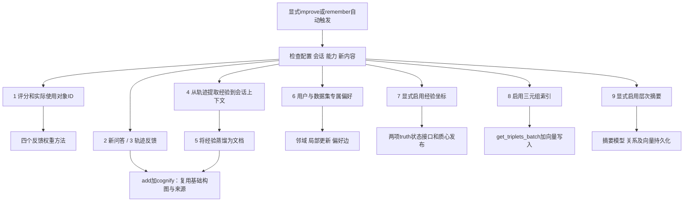
```mermaid
flowchart TD
    A[显式improve或remember自动触发] --> G[检查配置 会话 能力 新内容]
    G --> F[1 评分和实际使用对象ID]
    F --> W[四个反馈权重方法]
    G --> P[2 新问答 / 3 轨迹反馈]
    P --> C[add加cognify：复用基础构图与来源]
    G --> E[4 从轨迹提取经验到会话上下文]
    E --> D[5 将经验蒸馏为文档]
    D --> C
    G --> U[6 用户与数据集专属偏好]
    U --> N[邻域 局部更新 偏好边]
    G --> T[7 显式启用经验坐标]
    T --> S[两项truth状态接口和质心发布]
    G --> R[8 启用三元组索引]
    R --> B[get_triplets_batch加向量写入]
    G --> H[9 显式启用层次摘要]
    H --> HP[摘要模型 关系及向量持久化]
```

图表示依赖关系；源码实际按1～9顺序执行。前七阶段需要传会话标识，没传时是`no_session_ids`，不是AGE不支持。第7、9阶段要显式开启，第8默认任务的三元组向量配置也默认关闭，第6个性化配置默认关闭。[阶段注册][improve-registry]、[阶段门控][improve-gates]、[阶段实现][improve-stages]

| 阶段与触发 | 为什么会不支持；缺失影响与例子 | AGE怎么接；专属联调Agent小时 |
|---|---|---|
| 1 `feedback_weights`：有会话和待应用评分 | 普通PG缺4个权重方法，通常因后端不支持而跳过。1分可已存在会话中，但“张三参与星河”这条被使用的边权重没有降低；不是整个问答不可用 | 实现B.7的4方法并核对对象ID、逐项成功结果及重试账本；1.5～3 |
| 2 `persist_session_qa`：有未同步问答窗口 | 复用构图，不要求反馈权重接口。缺写入/来源能力时，缓存里能看见新问答，永久图仍没有这些知识 | 复用节点、边、来源和向量链；测成功推进水位、失败保留水位和重试。阶段本身errored会中止后续，但单窗口cognify返回失败会记录并继续，不能全部归为中止；1～2 |
| 3 `persist_agent_traces`：有新轨迹 | 默认持久化轨迹中的有效反馈/回退内容，并非所有原始工具轨迹。缺构图时，“部署前检查配置”未成为永久记忆；阶段错误通常不中止后续 | 复用正常构图，测空轨迹、反馈内容及同步水位；0.75～1.5 |
| 4 `extract_agent_context`：自动反馈、模型和会话条件满足 | 本阶段直接写会话上下文，**没有专用图方法需要AGE实现**；不能因为GDS或图权重缺失就判为不支持 | 保留现有会话实现；验图后端切换不破坏门控及经验提取；0.5～1 |
| 5 `distill_sessions`：有可蒸馏经验和模型 | 把经验整理为文档后构图；缺构图时会话经验可能仍在，但没有“星河部署检查事项”这份永久知识 | 复用`add+cognify`，验重复蒸馏、模型失败和水位；不需要用truth setter替代；0.75～1.5 |
| 6 `update_user_preferences`：个性化已启用 | 需要邻域、节点局部更新、写点写边和删具体边。普通PG缺`update_node`但有完整偏好模型写入回退；不能说偏好全部失效。缺删边时也可能中和权重而留下边 | 实现精确局部更新及`delete_edge_triples`；以用户＋数据集确定身份，同时保存`weight/updated_at_turn`；验李四偏好不改变张三的设置；1.5～3 |
| 7 `build_truth_subspace`：有会话且显式开启 | 普通PG缺2个truth方法，正常检查后跳过。损失“根据已学经验调整候选片段排序”，不是失去事实真假检测；普通检索可用基础排序 | B.7状态接口＋现有分组/全图读取；先写节点新坐标和版本，再发布对应质心。验全部失败、部分成功、发布失败和读取回退；2～4 |
| 8 `triplet_enrichment`：三元组向量配置已开 | 缺`get_triplets_batch`则无法从图按批取“张三—参与→星河”并生成整条事实向量。原实体图不因此自动消失 | 实现稳定分页和返回格式，复用向量适配器；验无漏页、重复improve跳过和默认禁用；1～2 |
| 9 `global_context_index`：显式开启且模型可用 | 需要摘要类型读取、来源范围、全图输入、删旧摘要和新图/向量写入；缺其中任一不能保证跨资料层次摘要完整。它不是GDS统计摘要 | 复用B.4～B.6图合同，构建分组摘要和根摘要及`summarized_in`边；验来源范围、重建清理和向量对应；1.5～3 |

本表是每阶段独有的集成测试与修复预算，合计**10.5～21小时**；底层同一方法只在方法台账计一次。源码依据：[反馈任务][feedback-task]、[问答同步][session-cognify]、[轨迹持久化][trace-cognify]、[会话经验提取][context-extract]、[蒸馏落图][session-distill]、[偏好存储][preference-store]、[truth构建][truth-build]、[三元组读取][triplet-task]、[层次摘要持久化][global-persist]。

**为什么“HTTP 200”不能作为支持证明？**HTTP是客户端与服务端传请求/响应的协议，其200状态只说明请求已正常返回。非致命阶段失败时，接口仍可能返回200，但响应体总体或某阶段为`errored`；必须检查`stages`、原因、计数和真实图状态。第2阶段确实产生阶段错误时会中止剩余阶段，携带部分结果的异常返回409；其他异常也可能返回409，不能把所有409都等同第2阶段失败。后台模式初始返回`running`，后续失败不会改变已经发出的响应。[improve路由][improve-router]

还要验证两个容易漏掉的成功假象：能力探测实际只检查两个反馈**setter**（写方法），执行却需要两个getter（读方法）＋两个setter；探测异常时甚至会假定支持再执行。偏好写边失败被捕获后，阶段也可能显示`completed/no_changes`，必须核对实际写入计数和待重试标志。[能力探测][capabilities]、[偏好更新结果][preference-update]

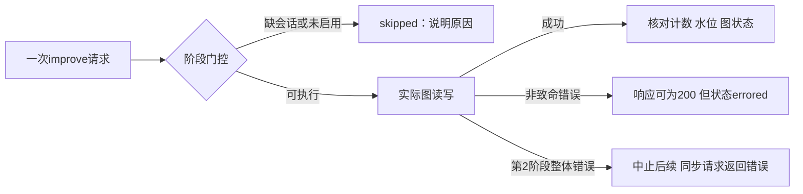
```mermaid
flowchart LR
    I[一次improve请求] --> G{阶段门控}
    G -->|缺会话或未启用| S[skipped：说明原因]
    G -->|可执行| R[实际图读写]
    R -->|成功| C[核对计数 水位 图状态]
    R -->|非致命错误| E[响应可为200 但状态errored]
    R -->|第2阶段整体错误| F[中止后续 同步请求返回错误]
```

**improve增量怎么计算：**B.7的7个状态方法共6～12小时，加九阶段联调10.5～21小时，等于**16.5～33小时**。其中`update_node`也被事实关闭使用；若此前已实现，扣除1～2小时。`get_triplets_batch`尚未实现再加1～2小时。这里假定基础节点/边、来源、分组/全图读取、向量和会话都可用，不能把这个数当作从零支持AGE的总预算。

**多进程运行还须补协调：**现有improve锁限定单工作进程，跨进程不能仅靠一个setter事务保护“读取→计算→写回→记同步水位”。全报告只在共享工作包计算一次操作级协调，不在九阶段重复计费。truth上层还明确记录了“失败后复用同一epoch整数但质心基础已变”的故障窗口；若要求消除，另加2～4小时做不可复用代次或基底签名及故障回归。AGE适配器本身不会自动修好它。[当前锁范围][session-lock]、[truth已知窗口][truth-epoch-window]

### B.4 基础写入与生命周期：缺的是业务行为，不是AGE没有节点和边

**结论：这组决定能否真正保存、重复保存和删除记忆。**AGE已有相应读写原语；实现要同时处理业务UUID、类型、属性保护和结果格式。下表各行的“不支持”均指AGE尚未实现对应Cognee合同；没有返回值的方法也不能用空函数假装成功。

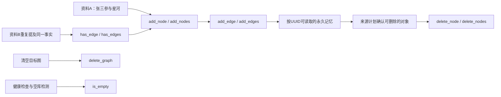
```mermaid
flowchart LR
    D[资料A：张三参与星河] --> N[add_node / add_nodes]
    N --> E[add_edge / add_edges]
    B[资料B重复提及同一事实] --> H[has_edge / has_edges]
    H --> N
    E --> R[按UUID可读取的永久记忆]
    R --> P[来源计划确认可删除的对象]
    P --> X[delete_node / delete_nodes]
    Z[清空目标图] --> G[delete_graph]
    T[健康检查与空库检测] --> I[is_empty]
```

| 公共方法 | 触发、缺失后果与例子 | AGE实现及局部验收；增量Agent小时 |
|---|---|---|
| [is_empty][iface-is_empty] | 搜索、健康检查、来源初始化检查。错误返回“空”，会把有张三的图当空库；错误返回“非空”又会影响初始化判断 | 查业务图是否至少有节点，不把内部元数据算业务节点；验空图、孤点和断连错误；0.5～1 |
| [add_node][iface-add_node] | 单对象写入及旧模型辅助路径。不能只接收数据库内部编号，否则后续UUID检索找不到张三 | 兼容DataPoint或ID＋属性的输入；按稳定身份匹配或创建，保留已有学习/来源字段；同输入重试不加重复点；1～2 |
| [add_nodes][iface-add_nodes] | `cognify`、问答持久化、代码图、偏好批量写入。缺失会中断构图；仅循环覆盖全部属性会清掉旧反馈 | 批量写、类型映射、分组合并；接入B.6来源函数；验重复批次、混合来源、失败批次重试；2～4 |
| [add_edge][iface-add_edge] | 单条关系写入。张三与星河两个节点存在，不等于“参与”关系存在 | 以起点UUID、关系名、终点UUID定位；任一端点不存在就跳过，不隐式创建空节点；验缺端点、不同关系和反向边互不覆盖；1～2 |
| [add_edges][iface-add_edges] | 常规构图的批量关系，以及矛盾/偏好关系写入。缺失可能形成“有点无边”的半成品图 | 分关系类型批量参数写入，维护`edge_object_id`、来源及属性；缺端点的边跳过；验缺端点、方向、重复关系和部分失败；2～4 |
| [has_edge][iface-has_edge] | 可选实体交叉连接任务检查已有关系。错误返回false可能重复处理，错误返回true会跳过真正缺失的连接 | 按完整边身份做存在性查询，返回布尔值；验同名反向关系；0.5～1 |
| [has_edges][iface-has_edges] | 写入前筛选已有关系，并为已有边补新来源。合同返回存在的边列表，**不是布尔列表** | 批量匹配输入，保留调用方需要的边结构；验A旧边与B新边混合输入；0.5～1 |
| [delete_node][iface-delete_node] | 旧删除路径及外部单点操作。缺失不能删对象；直接普通DELETE可能因关联边而失败 | 定位业务ID后连同关联边删除，验不存在节点重复删除；删除授权和来源判断由上层先完成；0.5～1 |
| [delete_nodes][iface-delete_nodes] | 来源删除计划、摘要旧节点清理、技能删除。删A资料时必须只删已判无主的节点 | 批量连边删除，空输入不做事；验删除目标及关联边、不动相邻存活节点；0.5～1 |
| [delete_graph][iface-delete_graph] | 关闭后端隔离时的开发清理等。错把PG数据库当目标图会连同其他数据集删掉 | 只清目标AGE图及其元数据，重建策略与handler约定；验再次使用可初始化、隔壁图仍在；0.5～1 |

本组**9～18 Agent小时**。三种APOC等价行为的开发已分摊在节点/边写入中，不再重复加一笔“APOC移植费”。并发唯一性框架另属共享基础；来源状态变换在B.6计费。[写入调用][storage-calls]、[已有关系筛选][existing-edges]、[旧删除][legacy-delete]、[图清理][prune-graph]

### B.5 读取、过滤、查询和统计：返回对的形状，也要返回对的范围

**结论：同样叫“查图”，返回结构和业务含义并不相同。**`get_node`返回属性字典，`get_graph_data`返回节点/边元组列表，`get_connections`返回两端属性和边属性组成的三元组。AGE返回的`agtype`（AGE用于表达节点、边及属性的数据库类型）须转成这些结构；把数据库结果原样交上去仍是不兼容。

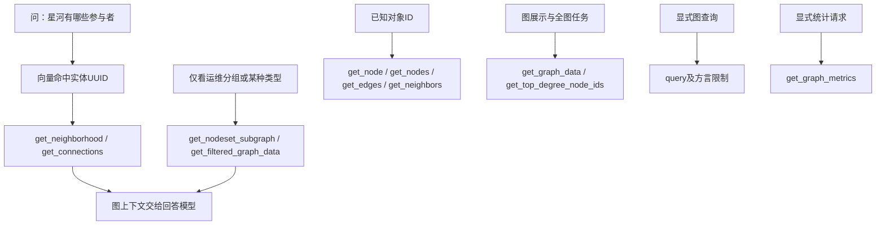
```mermaid
flowchart TD
    Q[问：星河有哪些参与者] --> V[向量命中实体UUID]
    V --> N[get_neighborhood / get_connections]
    N --> A[图上下文交给回答模型]
    F[仅看运维分组或某种类型] --> S[get_nodeset_subgraph / get_filtered_graph_data]
    S --> A
    K[已知对象ID] --> R[get_node / get_nodes / get_edges / get_neighbors]
    UI[图展示与全图任务] --> G[get_graph_data / get_top_degree_node_ids]
    U[显式图查询] --> C[query及方言限制]
    M[显式统计请求] --> T[get_graph_metrics]
```

| 公共方法 | 触发、缺失后果与例子 | AGE实现及局部验收；增量Agent小时 |
|---|---|---|
| [get_node][iface-get_node] | 代码图、网页等按ID回读单点；张三已保存但回读为空，会破坏后续复用/补充流程 | 按业务UUID查，返回属性字典或None；验缺失对象，不返回内部graphid；0.5～1 |
| [get_nodes][iface-get_nodes] | 增量更新读取旧片段、旧来源账本判断；返回错结构会使旧片段无法复用 | 批量ID读字典列表，定义缺失对象处理并验空输入；0.5～1 |
| [get_edges][iface-get_edges] | 公共邻接边合同；本轮未发现默认生产链直接调用，仍需适配以满足抽象类和外部调用 | 双向相邻关系转EdgeData，验方向、自环、关系属性；0.5～1 |
| [get_neighbors][iface-get_neighbors] | 可选交叉连接任务读取邻居；只返回出边邻居会漏掉“他人指向张三”的关系对象 | 匹配相邻节点、按业务ID去重，返回属性字典；验入/出方向；0.5～1 |
| [get_connections][iface-get_connections] | 增量片段定位、实体描述整合、旧删除；需要“谁—什么关系—谁”及属性 | 返回`(起点属性, 边属性, 终点属性)`，保留关系名/文本；验反向边不倒置；1～2 |
| [get_neighborhood][iface-get_neighborhood] | 默认混合检索、局部可视化、矛盾检测。缺失会损失图上下文，不是只损失统计 | 对种子、深度和边类型做有界遍历，带回孤立种子并去重；验0/1/多跳、空种子和过滤；2～4 |
| [get_nodeset_subgraph][iface-get_nodeset_subgraph] | 编码规则分组、图投影、经验对齐选取。以“启动”“运维”两组种子为例，OR取相邻集合的并集，AND取共同邻居；弄反会扩大或缩小上下文 | 按`node_type`及`node_name`定位种子，再按参考调用合同取邻居和集合内边；不是简单对任意`belongs_to_set`属性做AND/OR；验共同邻居、孤点和空名称；1.5～3 |
| [get_filtered_graph_data][iface-get_filtered_graph_data] | 词法、代码检索、实体整合。漏属性条件会扩大上下文，错条件会漏掉相关代码 | 按实际调用冻结过滤规则；Neo4j现仅取第一个字典，字典内多字段按AND，多个字典组合不能假定已有统一合同；验多字段和空结果；1.5～3 |
| [get_graph_data][iface-get_graph_data] | 导出、全图投影、经验对齐、全图索引及若干回退。漏孤点会使存储数据与展示/学习不一致 | 分别读取节点和边并按公共元组合同解码；验空图、孤点、自环、方向和完整属性；1～2 |
| [get_top_degree_node_ids][iface-get_top_degree_node_ids] | 可视化选高连接度种子；默认实现可全图计算，因此缺专用优化通常是性能退化 | 允许受控采样/近似选种子，返回业务UUID；验全孤点仍能选种子、top_k小于1报错；若做精确全图排名需另测成本；0.5～1 |
| [query][iface-query] | 显式Cypher检索、自然语言生成查询以及个别迁移。Neo4j语句不因连接PG就变成AGE语句 | 实现固定AGE参数执行、列描述和结果解码，兼容实际调用省略params；内部受控模板2～4小时；公开原始查询/生成查询另列，不能承诺任意方言 |
| [get_graph_metrics][iface-get_graph_metrics] | 图摘要缓存未命中和显式统计。现有上层可能把失败变成0/0；普通会话不是每次必经 | 基础计数及WCC口径3～6小时，包含空图/孤点/两团体测试；摘要错误解耦另列；昂贵可选指标另列，不能假造数值 |

本组**14.5～29 Agent小时**，与B.4合计22项公共方法。`get_graph_metrics(include_optional=True)`的昂贵指标没有消失在清单中，而是在B.10明确列为追加范围；未交付时必须有明确的不支持/不可用契约。`query`也同理：继承抽象方法必须提供实现，不等于对外开放无限制执行。

不同后端现有行为不完全一致。先以公共合同和真实调用方冻结测试，再解决冲突，不能把Neo4j的一处限制当作正确标准。[图投影合同][cognee-graph]、[可视化读取][visual-subgraph]、[过滤读取示例][lexical-filter]、[自然语言查询][nl-retriever]、[统计调用][pipeline-metrics]
### B.6 来源与增量更新：17项都要有正确语义，普通PG其实已经实现这组

**结论：当前PG演示适配器已实现下面17项；AGE要把这些业务合同重新接到图存储。**不是因为AGE没有列表/属性更新，而是“资料归属、运行归属、共享事实撤回”必须由应用定义。AGE的列表属性、参数化更新与建图/删图在源码回归和扩展函数中已有依据，不需要先修改AGE内核才能表达这些数据。[AGE列表与参数更新][age-property-list]、[AGE图生命周期][age-graph-functions]、[PG来源实现][pg-provenance]

仍用A/B资料支持同一条“张三参与星河”的例子：`source_ref_keys`记资料或片段来源，`source_dataset_ids`是派生的数据集集合，`source_run_refs`记哪次运行新添了哪项来源，`source_run_ids`是派生运行集合。现成的`source_ref_state.py`可复用，不必重新设计编码。

**关键规则：一次运行只拥有它新添的来源，不能把重碰的旧来源据为己有。**例如run1已由A创建关系，run2重读A后失败，回滚run2不能把run1的A关系删掉。共享纯函数负责这个规则；并发锁和事务由AGE接线层保障，纯函数不会自动保证并发安全。[来源状态函数][source-state]

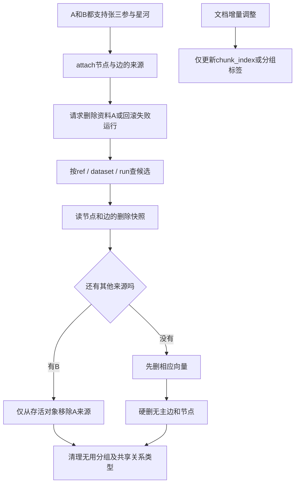
```mermaid
flowchart TD
    A[A和B都支持张三参与星河] --> W[attach节点与边的来源]
    W --> D[请求删除资料A或回滚失败运行]
    D --> F[按ref / dataset / run查候选]
    F --> S[读节点和边的删除快照]
    S --> P{还有其他来源吗}
    P -->|有B| K[仅从存活对象移除A来源]
    P -->|没有| V[先删相应向量]
    V --> X[硬删无主边和节点]
    K --> C[清理无用分组及共享关系类型]
    X --> C
    I[文档增量调整] --> J[仅更新chunk_index或分组标签]
```

上图不是跨图/向量的单一原子事务。无主待删对象保留来源直到硬删，失败重试才能找到它；不能先清光所有来源再删除。删除快照之后若B新增来源，还要防止旧计划误删对象，因此共享工作包必须覆盖完整操作协调或最终原子重检。[删除执行体][delete-planner]

下面来源方法默认抛`UnsupportedProvenanceCapability`；没有它们时部分上层会继续使用旧账本路径，不能笼统说所有forget必报错。**一旦声明图内来源已启用，则必须整体实现并验证，不能用空返回蒙混。**

| 公共方法 | 触发、缺失后果与例子 | AGE实现及局部验收；增量Agent小时 |
|---|---|---|
| [attach_node_source_refs][iface-attach_node_source_refs] | B文档复用已由A生成的张三，应增加B所有权，不能只更新节点名称 | 锁内读四字段，复用attach状态函数，参数化SET；新run规则共同helper记本项；3～5 |
| [attach_edge_source_refs][iface-attach_edge_source_refs] | A/B共同支持“张三参与星河”，边也要记B；只有节点来源不够 | 以source,target,relationship三元组定位边，复用helper；批量同类边；2～3 |
| [remove_node_source_refs][iface-remove_node_source_refs] | 删A后张三由B支持，应仅删A引用，不能删点或留下A的dataset/run派生列 | 锁内remove状态函数，局部SET四字段；空/重复移除幂等；1～2 |
| [remove_edge_source_refs][iface-remove_edge_source_refs] | 删A后共同关系仍属于B，错误派生run索引可能使未来回滚误选 | 以边三元组同上，保留其余属性与其他来源；1～2 |
| [delete_edge_triples][iface-delete_edge_triples] | 删除最后无主“参与”边时必须保留张三、星河两个点；也不能删反向边/同端点不同类型 | 复用基础DELETE，仅加EdgeIdentity批量参数/幂等合同测试，不重复计基础删边；0.5～1 |
| [get_node_delete_data][iface-get_node_delete_data] | 删最后来源时需知道节点type、metadata.index_fields，才能删正确向量集合；缺快照会残留向量或拒绝增量更新 | 批量取完整属性+四来源字段，规范化NodeDeleteData；UUID字符串、缺点、空列表；1～2 |
| [get_edge_delete_data][iface-get_edge_delete_data] | “参与”EdgeType向量可由多条边共享，删一条不能盲删共享向量；需edge_text及完整来源 | 三元组查边，复用get_edge_retrieval_text，构造EdgeDeleteData；1～2 |
| [find_nodes_by_source_ref][iface-find_nodes_by_source_ref] | forget(A)必须找全A拥有的节点，不能按节点名猜 | 参数化MATCH+列表成员谓词，返回业务UUID；性能与来源索引专项见下；0.5～1 |
| [find_edges_by_source_ref][iface-find_edges_by_source_ref] | 两端节点仍存在不代表A支持的边应保留，边必须独立找 | 同上返回EdgeIdentity，保持方向与关系名称；0.5～1 |
| [find_node_source_refs_by_dataset][iface-find_node_source_refs_by_dataset] | dataset D1删掉时节点还可能由D2支持，必须返回D1的refs子集，不是节点全部refs | source_dataset_ids筛候选，再用已有parse函数保留目标dataset 精确来源子集；0.5～1 |
| [find_edge_source_refs_by_dataset][iface-find_edge_source_refs_by_dataset] | 跨dataset共享边删D1须留D2；返回所有refs会误撤别人的知识 | 同上输出dict[EdgeIdentity,list]；0.5～1 |
| [find_node_source_refs_by_pipeline_run][iface-find_node_source_refs_by_pipeline_run] | run2新增B而A早已存在，回滚仅撤B，不撤全部节点来源 | source_run_ids候选过滤，解source_run_refs并匹配指定run；不可把候选节点全refs返回；1～2 |
| [find_edge_source_refs_by_pipeline_run][iface-find_edge_source_refs_by_pipeline_run] | 新run仅复用旧边不能撤销旧run的边所有权 | 同上输出边→本run贡献refs，返回值仍是source refs而非run字符串；1～2 |
| [set_graph_metadata][iface-set_graph_metadata] | 不能先标记graph_native再发现来源方法未实现，否则删除被错误路由 | metadata小表graph作用域匹配更新或创建；完成来源合同后才启用marker；空字典不做操作；0.5～1 |
| [get_graph_metadata][iface-get_graph_metadata] | 新空图可启用图内来源；旧有数据但无marker不可冒认已迁移 | 同小表查询转dict[str,str]，缺记录返回{}；缓存与删图生命周期一致；0.5～1 |
| [remove_belongs_to_set_tags][iface-remove_belongs_to_set_tags] | 删除NodeSet（节点分组）“项目启动”，张三仍属于“运维交接”；旧标签残留会使筛选误命中。它是NodeSet（节点分组）标签，不是来源ref | 节点属性列表过滤，仅SET belongs_to_set；node_ids=None全图、[]空操作、指定列表只动该scope；并发保留新增标签；1～2 |
| [update_chunk_index][iface-update_chunk_index] | 文档前插一段，原chunk从序号2移3，必须仅改位置，不能重写chunk使已有反馈/valid_to丢失 | 按UUID批量局部SET chunk_index，保留其余属性；配合vector.update_payload；仅过合同后声明supports_incremental_chunk_updates；0.5～1 |

本组17项合计**16～30 Agent小时**；另外来源物理索引/执行计划2～4小时、跨方法撤回和补偿验证3～6小时，单独计入总账。列表能存能查，不等于来源成员查找必然走高效索引；若增加来源索引旁表，必须在同一PG事务维护并对账。它辅助定位来源，不是用普通联表重新替代AGE遍历。

`set/get_graph_metadata`可用以graph为键的PG小表保存来源版本标记，避免内部marker节点污染业务统计；它是控制元数据，需和图生命周期一起删除。上表跨数据集共享的例子适用于同图含多数据集来源的情况；默认每数据集独立图仍须正确处理单图内A/B共享资料。

调用依据：[写入/附来源][storage-calls]、[来源删除编排][unified-provenance]、[运行失败回滚][provenance-rollback]、[来源标记][provenance-marker]、[增量更新][incremental-update]、[层次摘要来源输入][global-input]。其中图来源模式的15项默认“不支持”，`remove_belongs_to_set_tags`默认空操作，`update_chunk_index`默认不支持；默认行为不应被当作AGE已经实现。

### B.7 学习状态与三元组：8个公共方法逐项交付

**结论：这是此前“improve部分支持”最需要展开的缺口。**普通PG演示适配器缺下面前7项，但有第8项；AGE需要逐项接通。浮点数、列表和属性更新有存储基础，真正缺的是稳定对象身份、字段保留规则和真实的逐对象结果。

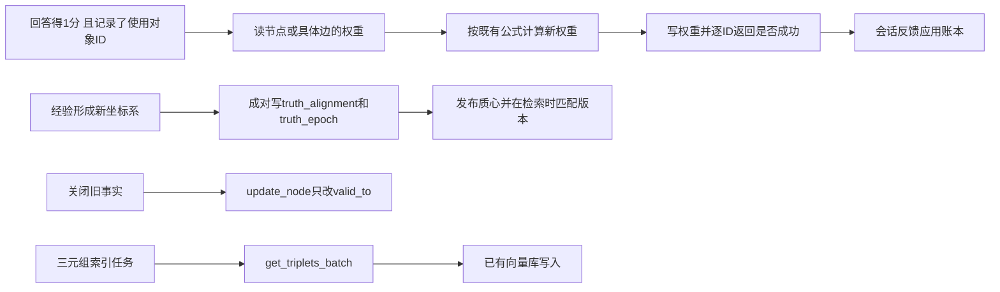
```mermaid
flowchart LR
    F[回答得1分 且记录了使用对象ID] --> R[读节点或具体边的权重]
    R --> C[按既有公式计算新权重]
    C --> W[写权重并逐ID返回是否成功]
    W --> L[会话反馈应用账本]
    T[经验形成新坐标系] --> S[成对写truth_alignment和truth_epoch]
    S --> P[发布质心并在检索时匹配版本]
    V[关闭旧事实] --> U[update_node只改valid_to]
    G[三元组索引任务] --> B[get_triplets_batch]
    B --> E[已有向量库写入]
```

| 公共方法 | 触发、缺失后果与例子 | AGE实现及局部验收；增量Agent小时 |
|---|---|---|
| [get_node_feedback_weights][iface-get_node_feedback_weights] | 阶段1先读使用过节点的旧权重；缺对象会被当作已删除/其他数据集对象，从而无法应用反馈 | 按业务UUID返回`ID→浮点数`；存在但缺字段或数值转换异常时按参考实现回0.5，不存在不冒充存在；0.5～1 |
| [set_node_feedback_weights][iface-set_node_feedback_weights] | 写张三新权重；伪造成功会使账本认为已应用，覆盖全部属性又会抹掉来源 | 只改现有节点权重，返回每个请求ID的真实布尔结果；验缺点、部分成功和其他属性保持；1～2 |
| [get_edge_feedback_weights][iface-get_edge_feedback_weights] | 读被答案实际使用的那条关系；把关系名“参与”当身份会混淆其他项目的边 | 用具体`edge_object_id`批量读，不能用共享关系文本向量ID代替；验同名不同边；1～2 |
| [set_edge_feedback_weights][iface-set_edge_feedback_weights] | 降低“张三参与星河”这一条边的权重；ID错配会改变无关知识 | 按具体边ID局部更新，保留端点、类型、来源；逐ID如实返回；1～2 |
| [get_node_truth_state][iface-get_node_truth_state] | 经验对齐检索读取片段坐标和版本；错误配对会错误重排候选，读异常可退基础排序 | 返回`truth_alignment`列表与`truth_epoch`；现有未初始化节点为`[]/None`，不存在不返回；0.5～1 |
| [set_node_truth_state][iface-set_node_truth_state] | 阶段7给片段写新坐标；未写成功却报告成功，可能发布不完整/错误状态 | 同一节点的坐标及版本一起更新，不新建已删除目标；逐ID报告，验全部/部分失败；1～2 |
| [update_node][iface-update_node] | 偏好状态更新；`close_node`写`valid_to`关闭事实。缺失时偏好可回退，但close_node是警告＋False，旧事实没有被关闭 | 只更新指定字段，未指定保持；目标不存在返回false，测试空值与删除属性语义；1～2 |
| [get_triplets_batch][iface-get_triplets_batch] | 第8阶段分批读关系，生成事实向量；漏页会使某些关系无法通过该向量通道检索 | 返回任务需要的两端及关系属性，稳定排序再按offset/limit分页；固定数据快照下验无重无漏，并发写入时锁定任务范围；1～2 |

本组**7～14小时**，其中7个状态方法是**6～12小时**。方法定义及缺省异常见[状态合同][state-interface]；调用见[反馈][feedback-task]、[truth构建][truth-build]、[关闭事实][close-node]、[三元组任务][triplet-task]。

例如学习率为0.2、原权重0.5、显式1分映射到0，新权重为`0.5 + 0.2 × (0 − 0.5) = 0.4`。AGE只需正确保存这次更新，不需要GDS去计算；但两次反馈同时读到0.5后分别写回，可能覆盖彼此，所以要保护完整读改写。现有反馈重试有次数上限，不保证跨图与会话账本“恰好一次”。

同样，`valid_to`只是事实有效期字段；把它写成功，不等于所有检索器都会自动筛掉过期事实。时间检索读取Timestamp/Event模型，是B.8另外两项接口，不能以`update_node`已完成来替代它们。

### B.8 接口之外的15个具名方法/钩子：全部列出，不把选配误写成必需

**结论：前六项进入本次“完整记忆＋时间＋旧删除兼容”预算；后四项属于可选旧辅助/清理任务；初始化和关闭计在共享基础；最后三项沿分离存储方案无需实现。**这15项不在47项公共图方法里，只检查类定义会漏掉它们。

```mermaid
flowchart TD
    T[显式时间检索] --> A[collect_time_ids]
    A --> B[collect_events]
    R[限定ID或技能类型读取] --> C[选择性读取方法]
    C -->|缺少或部分空命中路径| F[现有代码可能全图回退]
    L[旧数据删除] --> D[get_document_subgraph]
    D --> H[硬删模式还用get_degree_one_nodes]
    O[显式挂载旧清理Task] --> S[前驱 后继 不连通节点]
    I[工厂及缓存] --> E[initialize / close]
    P[AGE图与PGVector分离写入] --> N[不走文件上传和混合写hook]
```

| 额外方法 | 触发、缺失后果与例子 | AGE处置及验收；增量Agent小时 |
|---|---|---|
| `collect_time_ids` | 时间检索提取出“去年”后按范围找时间节点；方法不存在会报错。没有识别时间或没有时间ID才有普通检索回退 | Timestamp的统一时间毫秒值范围筛选，包含起止边界，覆盖单边界/双边界；用列表参数传给下一方法；1～2 |
| `collect_events` | 由命中时间节点找事件；只读时间节点或只走出边会漏掉“星河发布” | 按参考路径无向1～2跳取Event并去重，返回`[{events:[属性字典]}]`，空结果也保留形状；1～2 |
| `get_id_filtered_graph_data` | 图投影只需若干UUID；缺方法会退全图读取。当前实现即使专用方法返回空，也可能再次全图回退 | 按ID集合取子图；验空命中和孤点；若要消除空命中全图扫描，须同时调整上层回退并验语义；1～2 |
| `get_nodes_by_type` | 技能/工具列表动态探测；没有该优化方法仍可用分组或全图读取。若暴露后报错，某些调用直接返回空，不再回退 | 按业务`type`取字典列表，验Skill/Tool分离；不能先放一个抛异常的占位方法；0.5～1 |
| `get_document_subgraph` | 无新来源标记、无旧账本的历史图可能走旧文档删除；缺方法时可能当作未构图而返回空删除 | 如保留旧数据路径，返回document/chunks/made_from/orphan等分类；验A/B共享事实与旧文档。否则必须在迁移入口拒绝这类未迁移数据；2～4 |
| `get_degree_one_nodes` | 旧删除显式hard模式清理单连接对象；自动旧软删除不必经过 | 冻结类型、度数和共享对象条件后读节点字典；验不把其他资料实体误删；0.5～1 |
| `get_successors` | 仅显式挂载旧`remove_disconnected_chunks`任务才取后继，未发现默认管道调用证据 | 按边方向/标签读取；任务使用`chunk['uuid']`，须修正并测试任务与返回字段，不照抄别的后端注解；0.5～1，选配 |
| `get_predecessors` | 同一旧任务找`next_chunk`前驱；结果误空可能触发错误删除 | 按入边和类型返回正确对象；验片段链首/中/尾及缺失邻居；0.5～1，选配 |
| `get_disconnected_nodes` | 同一旧清理任务调用。现有后端不一致：Ladybug指零度孤点，Neo4j查最大组件之外且返回内部ID | 先冻结“只清理孤立片段”等明确任务规则，再返回业务ID；不能把小组件的有效记忆当垃圾。方法1～2小时，整任务协调另2～4小时 |
| `extract_node` | 标为候选废弃的模型辅助函数调用，未发现默认外部入口 | 若保留辅助入口则复用`get_node`并测返回值；普通记忆不依赖它；0.5～1，选配 |
| `initialize` | 工厂发现钩子后等待初始化；没准备好标签、索引或会话设置会在第一条业务请求失败 | 可重入、并发幂等初始化并验证AGE已加载；1～2小时，**包含在共享连接包内** |
| `close` | 引擎缓存淘汰/清空时调用；漏释放会积累连接，不是数据丢失问题 | 关闭池/连接幂等，验重新取引擎可恢复；0.5～1小时，**包含在共享连接包内** |
| `push_to_s3` | 管道只在引擎有此方法时上传嵌入式数据库文件 | 服务端PG＋AGE不使用文件型数据库上传；不暴露无用钩子，当前方案0小时。若要求PG备份上传，另按备份/恢复目标设计，不能假装一个同名方法完成备份 |
| `add_nodes_with_vectors` | 仅统一图向量引擎的混合写分支使用 | AGE图＋PGVector向量沿现有分离路径，当前方案0小时；若要求同事务一体化，需另建统一引擎及向量合同，现有图原语不足以证明该能力 |
| `add_edges_with_vectors` | 同上，但针对边及边向量 | 同样不声明混合写能力，当前方案0小时；不能让占位实现返回成功却不写向量。强制一体化的接口、回滚和迁移范围须另审后估时 |

前六项合计**6～12小时**；四项可选旧辅助/清理方法合计**2.5～5小时**，若启用清理任务再加任务协调2～4小时，总追加**4.5～9小时**。后两项混合写接口没有报一个伪精确的实现价：本方案保留既有图/向量分离架构，并没有把“统一事务后端”偷偷算作已支持。

源码依据：[时间检索][temporal]、[ID投影回退][id-projection]、[技能类型探测][skill-resolve]、[旧删除选择分支][legacy-selection]、[旧删除实现][legacy-delete]、[旧片段清理任务][disconnected-task]、[旧模型辅助][model-helper]、[工厂初始化][graph-factory-init]、[缓存关闭][engine-close]、[文件上传钩子][s3-hook]、[混合写分支][hybrid-write]。

### B.9 数据集处理器、工厂与能力声明：少了接线，47项写完也无法使用

**结论：默认多租户模式要求图与向量的处理器都受支持。**只注册AGE图类会在环境检查时失败，系统不会自动变成“大家共用一个图库”。建议同一个PG数据库内每个数据集一个AGE图，连接/缓存严格绑定图身份；获授权用户访问同一个数据集时使用同一owner资源，不按访问者另造图。

```mermaid
sequenceDiagram
    participant U as 已授权用户
    participant H as 数据集handler
    participant R as 关系库登记
    participant F as 图引擎工厂
    participant G as PG与AGE
    U->>H: 首次访问数据集D
    H->>G: create_dataset：创建D的图及索引
    H->>R: 保存图标识与provider配置
    R->>H: 以后按D读取登记
    H->>F: resolve_dataset_connection_info
    F->>G: initialize并连接正确图
    U->>H: 删除D
    H->>G: delete_dataset只删D的资源
    H->>F: 驱逐D的缓存连接
```

| 接入合同 | 不支持的触发/影响与例子 | 具体改造、验收和Agent小时 |
|---|---|---|
| `create_dataset(dataset_id,user)` | 用户第一次导入。没有AGE handler直接过不了默认后端检查；随机命名并发创建会造出多个同名业务数据集图 | 新建AGE handler，按数据集稳定命名；建图、业务标签、索引/metadata并登记。甲授权乙访问D仍指向D原图；验并发首次创建；2～4 |
| `resolve_dataset_connection_info(dataset_database)` | 读取已有D时解析实际连接；把PG数据库名误当AGE图名会串图或找不到数据 | 只解析图字段与运行时凭据，保留向量字段；不要把解析出的口令写回登记表；1～2 |
| `delete_dataset(dataset_database)` | 删除D或开发清理。共用PG库时若照搬每租户一个数据库的删除实现，会误删别人的数据 | 只drop目标AGE图及metadata；处理活跃任务、连接缓存和重复删除；验D删后E仍正常；1～2 |
| adapter/provider/config/handler注册 | 设置provider为age后工厂需要识别并构造实例，否则启动或请求失败 | 注册适配器及handler配对，明确PG数据库与AGE图名传递。当前自定义工厂不传host/schema，须修改透传或明确连接串/参数映射；1～2 |
| 默认隔离及共享接入验证 | 两用户使用相同业务UUID、或共享数据集时暴露串数据/误建资源风险 | 验不同图同UUID隔离、owner共享、并发创建、删除只作用目标；应用授权与PG schema权限分别验证；2～4 |

本组**7～14小时**；前三个具名handler方法为4～8小时，其余接线/专项验证3～6小时。[handler合同][handler-interface]、[默认后端检查][backend-check]、[创建/owner映射][dataset-create]、[工厂实际参数][factory-params]

另有三个能力开关必须随实现验收，成本已纳入对应方法和接线，不能只改为true：

| 开关 | 没适配/误声明的影响 | 正确处置与所属预算 |
|---|---|---|
| `supports_cypher_queries` | 默认true会放行原始/自然语言查询；AGE内部能执行Cypher不代表Neo4j方言兼容 | 未交付公开查询时显式false；该开关同时放行原始与自然语言查询，若只交付前者须增设分模式门禁，否则等两条都通过再开。预算分属B.5内部query与B.10选配包 |
| `supports_per_row_source_refs` | true意味着一个批次能处理每个对象不同来源；只实现标量来源参数会错记A/B归属 | 先保留false沿现有按来源分组写入；若优化为true，必须适配逐行来源映射。当前正确性预算已在B.4/B.6，不以开启优化为验收条件 |
| `supports_incremental_chunk_updates` | true会启用片段复用/重排流程；缺来源、连接或局部更新时可能中途失败 | 相关读取、来源与chunk_index联合通过后再开；否则保留明确的非增量处理路径。预算属B.6及update入口回归 |

还要明确旧迁移策略：现有历史迁移有直接`query`调用及特定provider分支，不能把Ladybug/PG demo的迁移原样注册给AGE。新建AGE图与已具有目标合同的旧图删除纳入本次范围；从任意旧版本跨库迁入的数据量、身份变更、恢复窗口未给定，单列迁移项目，不编造固定耗时。

### B.10 总成本重算：不再用旧总包承诺“所有接口都包含”

**结论：在可部署PG18＋AGE1.8、模型及测试环境可用的前提下，本次列明的主交付范围暂留153.5～319 Agent小时；不是全部额外能力无条件包含。**九阶段improve在基础图完成后的增量是16.5～33小时，见B.3；它已经包含在总账中，不能再加一次。

主交付范围：47项公共方法逐项落实（内部受控query、基础metrics；公开任意查询与昂贵指标明确关闭/报不支持），6项已选接口外读取/时间/旧删除方法，3项handler及接线，来源与增量更新，九阶段improve，多进程操作协调，入口联调和代表性负载验证。旧数据删除兼容不等于承诺任意历史版本的数据迁移。

| 工作项 | 增量Agent小时 | 与逐接口预算的关系 |
|---|---:|---|
| 真实AGE概念验证 | 6～12 | 固定版本、权限、参数、类型、写入冲突、最小路径；先决定技术路线能否继续 |
| 共享连接池、会话设置、属性编解码 | 6～12 | 含initialize 1～2、close 0.5～1；不在B.8重复相加 |
| 身份/类型模型、基础索引与冲突框架 | 4～8 | UUID和具体边身份、单/多类型表示、重复写入保护；各方法只计算接入合同 |
| 完整业务操作的跨进程协调 | 6～12 | 反馈读改写、来源删除与新增、运行水位等共用；不在每setter重复计锁 |
| B.4的10项写入/生命周期 | 9～18 | 每行之和 |
| B.5的12项读取/查询/基础统计 | 14.5～29 | 每行之和；公开查询/昂贵统计另列 |
| B.6的17项来源/增量 | 16～30 | 每行之和 |
| B.7的8项状态/三元组 | 7～14 | 每行之和；以上四组合计47项、46.5～91小时 |
| B.8选定的6项扩展方法 | 6～12 | 两项时间、ID筛选、类型筛选、旧文档子图、旧硬删除度数 |
| B.9的handler、注册与隔离接线 | 7～14 | 三个handler方法＋注册＋接入专项测试 |
| 来源物理索引及专项故障验证 | 5～10 | 来源索引/执行计划2～4，跨方法撤回/补偿用例3～6；不重复计通用锁框架 |
| 统计摘要与错误状态解耦 | 2～4 | 修改摘要消费者；错误不显示为真实0，重统计不捆绑简单计数 |
| B.2业务入口回归，不含improve | 10.5～21 | 入口级返回、权限及生命周期组合；不是再实现底层方法 |
| B.3九阶段improve专属联调 | 10.5～21 | 每阶段之和 |
| 故障与代表性混合负载 | 8～16 | 重连、进程退出、共享热点/私有多图；不重复局部方法测试 |
| 独立Agent复核和反例验证 | 12～24 | 由未实现该项的Agent核验合同、隔离及失败路径 |
| 协调、合并、文档与交付 | 4～8 | 主Agent整合，保持代码/测试/配置一致 |
| **基础预算合计** | **133.5～265** | 替换旧W1～W7打包估算，不能两套相加 |
| 新发现问题与返工预留 | 20～54 | 用实际日志校准，不把未知风险藏入单方法小时数 |
| **含预留主交付预算** | **153.5～319** | 全部Agent执行；不是传统人工人日 |

**为什么比旧稿80～170小时增加？**旧稿没有把旧删除、接口外协议、九阶段分别验收、跨进程操作协调以及摘要消费者改造完整拆出来。本次按新增完整范围重新估算，不能继续用旧数字声称全包含。数字是可调整资源预算，代码能证明需要做什么，不能证明Agent一定多快写完。

```mermaid
flowchart LR
    P[6至12小时真实AGE验证] --> B[共享连接 模型 事务协调]
    B --> W[写入 来源 handler]
    B --> R[读取 状态 时间]
    W --> I[九阶段improve和其他入口联调]
    R --> I
    I --> F[故障 并发 负载验证]
    F --> V[独立复核与交付]
```

最多4个Agent，建议1协调、2实现、1验证；有依赖的任务不能同时完成。**先用第一轮6～12小时验证实际占用、修复轮次、工具等待和吞吐，再排日历工期**，不再把旧“3～6自然日”沿用到新增范围。Agent小时也不能直接换算人民币，货币费用还取决于模型用量、价格和运行资源。

| 明确在台账中、但不在主交付总价中的能力 | 若要支持，还要做什么 | 追加Agent预算 |
|---|---|---:|
| 公开受限AGE原始查询 | 读权限、方言、参数/列结果、取消/超时、分模式门禁回归，避免顺带开放未适配的自然语言查询 | 4～8 |
| 自然语言生成AGE查询 | 业务类型模式发现、AGE提示、正确/错误查询样本；依赖上一项 | 8～16 |
| `get_graph_metrics(True)`的昂贵指标 | 定义距离/聚类口径，在有界数据运行算法并测资源；不承诺大图响应目标 | 6～12 |
| 旧清理任务及模型辅助 | B.8四方法2.5～5，加任务语义/返回合同修复2～4 | 4.5～9 |
| truth已知发布代次窗口加固 | 避免不同坐标基础重用同代次，增加失败恢复测试 | 2～4 |
| 上面五项全部选择 | 追加主执行24.5～49，再留独立集成复核4～8 | **28.5～57** |
| 任意Neo4j/APOC/GDS查询原样兼容 | 固定过程库和查询范围后重做方案；AGE当前不能原样承接任意查询 | 无有限范围，不能报包干价 |
| 图向量统一事务、生产迁移、备份/高可用 | 新增架构和恢复合同；需明确存量版本、规模及恢复目标 | 本方案未实施，不编造固定数值 |

若主范围再加上述五项明确选配，预算为**182～376 Agent小时**，仍不包含任意方言兼容与生产迁移。这个边界比“全部接口都支持”更精确：**每个已找到的接口都被列出，每个启用的接口必须通过验收；未交付入口须显式禁用或报告不支持，不能靠默认空结果装作兼容。**

最后的交付检查必须双向追踪：业务入口→实际调用的方法→AGE测试；以及每个方法→至少一个合同测试/明确禁用理由。九阶段还须核对状态、计数、水位和实际图数据。只有方法数量凑够47，没有这些证据，不能宣布完成适配。

## 附录C. 证据与验证边界

**结论：已完成版本、源码、调用链和小图统计反例核查；未完成AGE集成和生产负载验证。**

| 核查对象 | 固定基线 |
|---|---|
| Cognee | `663a2dc15d04bc0d7ec2733a2dd604b7ed1b8c8e` |
| AGE1.6：PG14 / PG15 | `41c08296a4b692adf31ed9507a9a25dad6f9f67f` / `fa1af8de99d74d32e131c19b62cf580d396eb0ae` |
| AGE1.6：PG16 / PG17 | `2db2f060c4c9265a14d40f007eb8c56febf31e4c` / `54905a09bf8462f22a87c3adfd2ab5752e5c1e71` |
| AGE1.7：PG17 / PG18 | `e1467f12e0b1d15dd35d3ab93f057a7112d425b8` / `806fa2ebdb300b3e76ef30cdba61803babbf2683` |
| AGE1.8：PG18 | `e43dc1a12b78fba4acef9835b2b10379b8d243b4` |
| Claude Code插件1.6.1 | `4d57a36859111b927f08a0b99fe04ccfbc4ed22e` |

版本分支细节、回归预期与未验证边界见[1.6源码矩阵][age16-evidence]、[1.7/1.8源码矩阵][age18-evidence]。AGE本身所核版本为[Apache-2.0许可][age-license]。

尚未完成：真实AGE适配器、完整Cognee与模型链路、100用户压测、目标华为云实例安装、生产迁移和故障恢复。上游测试与源码说明能支持设计判断，不能替代这些交付证据。

本轮接口补全的验证：三位Agent分别审图合同/扩展、improve学习链、来源与handler，再交叉复核；公共方法47项与源码AST逐一对应，额外方法及能力声明按调用路径人工核查。核对源码文件和行号、引用与锚点、逐项预算加总；本文23张Mermaid图均已通过渲染。这里验证的是报告及静态调用合同，**没有运行AGE集成，不能据此声称适配完成**。

[age16-evidence]: evidence/age16-source-matrix.md
[age18-evidence]: evidence/age17-age18-source-matrix.md
[graph-interface]: https://github.com/topoteretes/cognee/blob/663a2dc15d04bc0d7ec2733a2dd604b7ed1b8c8e/cognee/infrastructure/databases/graph/graph_db_interface.py#L16
[model-to-graph]: https://github.com/topoteretes/cognee/blob/663a2dc15d04bc0d7ec2733a2dd604b7ed1b8c8e/cognee/modules/graph/utils/get_graph_from_model.py#L87
[node-index]: https://github.com/topoteretes/cognee/blob/663a2dc15d04bc0d7ec2733a2dd604b7ed1b8c8e/cognee/tasks/storage/index_data_points.py#L53
[cognee-architecture]: https://docs.cognee.ai/core-concepts/architecture
[hybrid-neighbors]: https://github.com/topoteretes/cognee/blob/663a2dc15d04bc0d7ec2733a2dd604b7ed1b8c8e/cognee/modules/retrieval/hybrid/entities.py#L60
[pg-demo]: https://github.com/topoteretes/cognee/blob/663a2dc15d04bc0d7ec2733a2dd604b7ed1b8c8e/cognee/infrastructure/databases/graph/postgres_demo/adapter.py#L879
[age-releases]: https://dist.apache.org/repos/dist/release/age/
[age16-release]: https://github.com/apache/age/releases/tag/PG17%2Fv1.6.0-rc0
[age17-release]: https://github.com/apache/age/releases/tag/PG18%2Fv1.7.0-rc0
[age18-release]: https://github.com/apache/age/releases/tag/PG18%2Fv1.8.0-rc0
[release-snapshot]: evidence/age-version-evidence-20260928.json
[age-path-code]: https://github.com/apache/age/blob/e43dc1a12b78fba4acef9835b2b10379b8d243b4/src/backend/utils/adt/age_vle.c#L2798
[huawei-versions]: https://support.huaweicloud.com/productdesc-rds-pg/zh-cn_topic_0043898356.html
[huawei-plugins]: https://support.huaweicloud.com/intl/zh-cn/usermanual-rds-pg/rds_09_0045.html
[age-install]: https://age.apache.org/age-manual/master/intro/setup.html
[session-cognify]: https://github.com/topoteretes/cognee/blob/663a2dc15d04bc0d7ec2733a2dd604b7ed1b8c8e/cognee/tasks/memify/cognify_session.py#L62
[plugin-hooks]: https://github.com/topoteretes/cognee-integrations/blob/4d57a36859111b927f08a0b99fe04ccfbc4ed22e/integrations/claude-code/hooks/hooks.json#L15
[plugin-sync]: https://github.com/topoteretes/cognee-integrations/blob/4d57a36859111b927f08a0b99fe04ccfbc4ed22e/integrations/claude-code/scripts/_plugin_common.py#L1767
[node-write]: https://github.com/topoteretes/cognee/blob/663a2dc15d04bc0d7ec2733a2dd604b7ed1b8c8e/cognee/infrastructure/databases/graph/neo4j_driver/adapter.py#L328
[edge-write]: https://github.com/topoteretes/cognee/blob/663a2dc15d04bc0d7ec2733a2dd604b7ed1b8c8e/cognee/infrastructure/databases/graph/neo4j_driver/adapter.py#L1238
[storage-order]: https://github.com/topoteretes/cognee/blob/663a2dc15d04bc0d7ec2733a2dd604b7ed1b8c8e/cognee/tasks/storage/add_data_points.py#L332
[pipeline-errors]: https://github.com/topoteretes/cognee/blob/663a2dc15d04bc0d7ec2733a2dd604b7ed1b8c8e/cognee/modules/pipelines/operations/run_tasks.py#L292
[single-edge]: https://github.com/topoteretes/cognee/blob/663a2dc15d04bc0d7ec2733a2dd604b7ed1b8c8e/cognee/infrastructure/databases/graph/neo4j_driver/adapter.py#L1125
[delete-planner]: https://github.com/topoteretes/cognee/blob/663a2dc15d04bc0d7ec2733a2dd604b7ed1b8c8e/cognee/infrastructure/databases/unified/provenance_delete_planner.py#L96
[cognee-graph]: https://github.com/topoteretes/cognee/blob/663a2dc15d04bc0d7ec2733a2dd604b7ed1b8c8e/cognee/modules/graph/cognee_graph/CogneeGraph.py#L124
[capabilities]: https://github.com/topoteretes/cognee/blob/663a2dc15d04bc0d7ec2733a2dd604b7ed1b8c8e/cognee/modules/improve/capabilities.py#L23
[feedback-task]: https://github.com/topoteretes/cognee/blob/663a2dc15d04bc0d7ec2733a2dd604b7ed1b8c8e/cognee/tasks/memify/apply_feedback_weights.py#L129
[close-node]: https://github.com/topoteretes/cognee/blob/663a2dc15d04bc0d7ec2733a2dd604b7ed1b8c8e/cognee/tasks/storage/close_node.py#L21
[temporal]: https://github.com/topoteretes/cognee/blob/663a2dc15d04bc0d7ec2733a2dd604b7ed1b8c8e/cognee/modules/retrieval/temporal_retriever.py#L128
[nl-retriever]: https://github.com/topoteretes/cognee/blob/663a2dc15d04bc0d7ec2733a2dd604b7ed1b8c8e/cognee/modules/retrieval/natural_language_retriever.py#L84
[age-transform]: https://github.com/apache/age/blob/e43dc1a12b78fba4acef9835b2b10379b8d243b4/src/backend/parser/cypher_clause.c#L5632
[plugin-statusline]: https://github.com/topoteretes/cognee-integrations/blob/4d57a36859111b927f08a0b99fe04ccfbc4ed22e/integrations/claude-code/scripts/cognee_statusline_render.py#L1
[mcp-summary-test]: https://github.com/topoteretes/cognee/blob/663a2dc15d04bc0d7ec2733a2dd604b7ed1b8c8e/cognee-mcp/tests/test_recall_summary.py#L151
[counts]: https://github.com/topoteretes/cognee/blob/663a2dc15d04bc0d7ec2733a2dd604b7ed1b8c8e/cognee/modules/data/methods/get_datasets_graph_counts.py#L80
[pipeline-metrics]: https://github.com/topoteretes/cognee/blob/663a2dc15d04bc0d7ec2733a2dd604b7ed1b8c8e/cognee/modules/metrics/operations/get_pipeline_run_metrics.py#L59
[neo-metrics]: https://github.com/topoteretes/cognee/blob/663a2dc15d04bc0d7ec2733a2dd604b7ed1b8c8e/cognee/infrastructure/databases/graph/neo4j_driver/adapter.py#L2315
[gds-projection]: https://neo4j.com/docs/graph-data-science/current/management-ops/
[neo-metric-utils]: https://github.com/topoteretes/cognee/blob/663a2dc15d04bc0d7ec2733a2dd604b7ed1b8c8e/cognee/infrastructure/databases/graph/neo4j_driver/neo4j_metrics_utils.py#L61
[graph-factory]: https://github.com/topoteretes/cognee/blob/663a2dc15d04bc0d7ec2733a2dd604b7ed1b8c8e/cognee/infrastructure/databases/graph/get_graph_engine.py#L344
[dataset-handler]: https://github.com/topoteretes/cognee/blob/663a2dc15d04bc0d7ec2733a2dd604b7ed1b8c8e/cognee/infrastructure/databases/dataset_database_handler/dataset_database_handler_interface.py#L11
[age-python]: https://github.com/apache/age/blob/e43dc1a12b78fba4acef9835b2b10379b8d243b4/drivers/python/age/age.py#L174
[ladybug-license]: https://github.com/LadybugDB/ladybug/blob/c934f673b6b1c5b680bdae3295cbd909b5855cef/LICENSE
[ladybug-transactions]: https://github.com/LadybugDB/ladybug/blob/c934f673b6b1c5b680bdae3295cbd909b5855cef/src/transaction/transaction_manager.cpp#L55
[arcade-ha]: https://github.com/ArcadeData/arcadedb/blob/b6a92623554bb332d7564de19fbd9fdbc2d1d45e/server/src/main/java/com/arcadedb/server/HAServerPlugin.java#L27
[arcade-adapter]: https://github.com/topoteretes/cognee-community/blob/ea5eaa681b8606c9813bb3d4c74553c06e4bb3aa/packages/graph/arcadedb/cognee_community_graph_adapter_arcadedb/arcadedb_adapter.py#L52
[hugegraph-space]: https://github.com/apache/hugegraph/blob/b12425c2032bf0d21a97b8221f42a18055c2982f/hugegraph-server/hugegraph-api/src/main/java/org/apache/hugegraph/core/GraphManager.java#L1228
[janus-transactions]: https://github.com/JanusGraph/janusgraph/blob/3b8843ffc6c81cf0076bf00119f1ffe80b9cf234/docs/basics/transactions.md#L13
[nebula-types]: https://github.com/vesoft-inc/nebula/blob/fa928930ab34f150db522933323aa610e54f26e7/src/interface/common.thrift#L268
[neo-license]: https://github.com/neo4j/neo4j/blob/c68156edf24164435ab1ac257ec633134c2887f7/LICENSE.txt#L1
[memgraph-license]: https://github.com/memgraph/memgraph/blob/8902f67683d09577a1c42448ffe0268a5c1a30aa/licenses/BSL.txt#L1
[falkor-license]: https://github.com/FalkorDB/FalkorDB/blob/53f78b47c618dd2a6936b61bfad9bab7682657c9/LICENSE.txt#L1
[ladybug-repro]: https://github.com/stefanv5/memory-platform-architecture/blob/ca49b10c1eff5fb7271d2ac3e89eae53b9a938cf/docs/cognee/graph-storage-postgres-analysis.md#L1471
[improve-registry]: https://github.com/topoteretes/cognee/blob/663a2dc15d04bc0d7ec2733a2dd604b7ed1b8c8e/cognee/modules/improve/registry.py#L31
[improve-stages]: https://github.com/topoteretes/cognee/blob/663a2dc15d04bc0d7ec2733a2dd604b7ed1b8c8e/cognee/modules/improve/stages.py#L80
[age-license]: https://github.com/apache/age/blob/e43dc1a12b78fba4acef9835b2b10379b8d243b4/LICENSE

[age-path-limit]: https://github.com/apache/age/blob/e43dc1a12b78fba4acef9835b2b10379b8d243b4/src/backend/utils/adt/age_vle.c#L3677
[ladybug-file-lock]: https://github.com/LadybugDB/ladybug/blob/c934f673b6b1c5b680bdae3295cbd909b5855cef/src/storage/storage_manager.cpp#L67

[search-registry]: https://github.com/topoteretes/cognee/blob/663a2dc15d04bc0d7ec2733a2dd604b7ed1b8c8e/cognee/modules/search/methods/get_search_type_retriever_instance.py#L96
[api-routes]: https://github.com/topoteretes/cognee/blob/663a2dc15d04bc0d7ec2733a2dd604b7ed1b8c8e/cognee/api/client.py#L345
[remember-result]: https://github.com/topoteretes/cognee/blob/663a2dc15d04bc0d7ec2733a2dd604b7ed1b8c8e/cognee/api/v1/remember/remember.py#L621
[graph-health]: https://github.com/topoteretes/cognee/blob/663a2dc15d04bc0d7ec2733a2dd604b7ed1b8c8e/cognee/api/v1/health/health.py#L115
[sync-cognify]: https://github.com/topoteretes/cognee/blob/663a2dc15d04bc0d7ec2733a2dd604b7ed1b8c8e/cognee/api/v1/sync/sync.py#L328
[improve-gates]: https://github.com/topoteretes/cognee/blob/663a2dc15d04bc0d7ec2733a2dd604b7ed1b8c8e/cognee/modules/improve/stage.py#L44
[trace-cognify]: https://github.com/topoteretes/cognee/blob/663a2dc15d04bc0d7ec2733a2dd604b7ed1b8c8e/cognee/tasks/memify/cognify_agent_trace_feedback.py#L79
[context-extract]: https://github.com/topoteretes/cognee/blob/663a2dc15d04bc0d7ec2733a2dd604b7ed1b8c8e/cognee/infrastructure/session/agent_context_extraction.py#L315
[session-distill]: https://github.com/topoteretes/cognee/blob/663a2dc15d04bc0d7ec2733a2dd604b7ed1b8c8e/cognee/modules/session_distillation/distill.py#L433
[preference-store]: https://github.com/topoteretes/cognee/blob/663a2dc15d04bc0d7ec2733a2dd604b7ed1b8c8e/cognee/modules/user_preferences/store.py#L42
[truth-build]: https://github.com/topoteretes/cognee/blob/663a2dc15d04bc0d7ec2733a2dd604b7ed1b8c8e/cognee/modules/truth_subspace/build.py#L202
[triplet-task]: https://github.com/topoteretes/cognee/blob/663a2dc15d04bc0d7ec2733a2dd604b7ed1b8c8e/cognee/tasks/memify/get_triplet_datapoints.py#L201
[global-persist]: https://github.com/topoteretes/cognee/blob/663a2dc15d04bc0d7ec2733a2dd604b7ed1b8c8e/cognee/tasks/memify/global_context_index/persist.py#L32
[improve-router]: https://github.com/topoteretes/cognee/blob/663a2dc15d04bc0d7ec2733a2dd604b7ed1b8c8e/cognee/api/v1/improve/routers/get_improve_router.py#L45
[preference-update]: https://github.com/topoteretes/cognee/blob/663a2dc15d04bc0d7ec2733a2dd604b7ed1b8c8e/cognee/modules/user_preferences/update.py#L350
[session-lock]: https://github.com/topoteretes/cognee/blob/663a2dc15d04bc0d7ec2733a2dd604b7ed1b8c8e/cognee/infrastructure/locks/session_lock.py#L24
[truth-epoch-window]: https://github.com/topoteretes/cognee/blob/663a2dc15d04bc0d7ec2733a2dd604b7ed1b8c8e/cognee/modules/truth_subspace/build.py#L300
[storage-calls]: https://github.com/topoteretes/cognee/blob/663a2dc15d04bc0d7ec2733a2dd604b7ed1b8c8e/cognee/tasks/storage/add_data_points.py#L248
[existing-edges]: https://github.com/topoteretes/cognee/blob/663a2dc15d04bc0d7ec2733a2dd604b7ed1b8c8e/cognee/modules/graph/utils/retrieve_existing_edges.py#L27
[legacy-delete]: https://github.com/topoteretes/cognee/blob/663a2dc15d04bc0d7ec2733a2dd604b7ed1b8c8e/cognee/modules/graph/methods/legacy_delete.py#L72
[prune-graph]: https://github.com/topoteretes/cognee/blob/663a2dc15d04bc0d7ec2733a2dd604b7ed1b8c8e/cognee/modules/data/deletion/prune_system.py#L74
[visual-subgraph]: https://github.com/topoteretes/cognee/blob/663a2dc15d04bc0d7ec2733a2dd604b7ed1b8c8e/cognee/modules/visualization/subgraph_data.py#L131
[lexical-filter]: https://github.com/topoteretes/cognee/blob/663a2dc15d04bc0d7ec2733a2dd604b7ed1b8c8e/cognee/modules/retrieval/lexical_retriever.py#L55
[state-interface]: https://github.com/topoteretes/cognee/blob/663a2dc15d04bc0d7ec2733a2dd604b7ed1b8c8e/cognee/infrastructure/databases/graph/graph_db_interface.py#L757
[pg-provenance]: https://github.com/topoteretes/cognee/blob/663a2dc15d04bc0d7ec2733a2dd604b7ed1b8c8e/cognee/infrastructure/databases/graph/postgres_demo/adapter.py#L1051
[source-state]: https://github.com/topoteretes/cognee/blob/663a2dc15d04bc0d7ec2733a2dd604b7ed1b8c8e/cognee/infrastructure/databases/provenance/source_ref_state.py#L106
[unified-provenance]: https://github.com/topoteretes/cognee/blob/663a2dc15d04bc0d7ec2733a2dd604b7ed1b8c8e/cognee/infrastructure/databases/unified/unified_store_engine.py#L99
[provenance-rollback]: https://github.com/topoteretes/cognee/blob/663a2dc15d04bc0d7ec2733a2dd604b7ed1b8c8e/cognee/modules/cognify/rollback.py#L76
[provenance-marker]: https://github.com/topoteretes/cognee/blob/663a2dc15d04bc0d7ec2733a2dd604b7ed1b8c8e/cognee/infrastructure/databases/provenance/markers.py#L38
[incremental-update]: https://github.com/topoteretes/cognee/blob/663a2dc15d04bc0d7ec2733a2dd604b7ed1b8c8e/cognee/api/v1/update/incremental.py#L186
[global-input]: https://github.com/topoteretes/cognee/blob/663a2dc15d04bc0d7ec2733a2dd604b7ed1b8c8e/cognee/modules/graph/methods/get_global_context_graph_inputs.py#L58
[id-projection]: https://github.com/topoteretes/cognee/blob/663a2dc15d04bc0d7ec2733a2dd604b7ed1b8c8e/cognee/modules/graph/cognee_graph/CogneeGraph.py#L144
[skill-resolve]: https://github.com/topoteretes/cognee/blob/663a2dc15d04bc0d7ec2733a2dd604b7ed1b8c8e/cognee/modules/tools/resolve_skills.py#L88
[legacy-selection]: https://github.com/topoteretes/cognee/blob/663a2dc15d04bc0d7ec2733a2dd604b7ed1b8c8e/cognee/api/v1/datasets/datasets.py#L282
[disconnected-task]: https://github.com/topoteretes/cognee/blob/663a2dc15d04bc0d7ec2733a2dd604b7ed1b8c8e/cognee/tasks/chunks/remove_disconnected_chunks.py#L21
[model-helper]: https://github.com/topoteretes/cognee/blob/663a2dc15d04bc0d7ec2733a2dd604b7ed1b8c8e/cognee/modules/data/methods/add_model_class_to_graph.py#L18
[graph-factory-init]: https://github.com/topoteretes/cognee/blob/663a2dc15d04bc0d7ec2733a2dd604b7ed1b8c8e/cognee/infrastructure/databases/graph/get_graph_engine.py#L175
[engine-close]: https://github.com/topoteretes/cognee/blob/663a2dc15d04bc0d7ec2733a2dd604b7ed1b8c8e/cognee/infrastructure/databases/utils/closing_lru_cache.py#L215
[s3-hook]: https://github.com/topoteretes/cognee/blob/663a2dc15d04bc0d7ec2733a2dd604b7ed1b8c8e/cognee/modules/pipelines/operations/run_tasks.py#L266
[hybrid-write]: https://github.com/topoteretes/cognee/blob/663a2dc15d04bc0d7ec2733a2dd604b7ed1b8c8e/cognee/tasks/storage/add_data_points.py#L330
[handler-interface]: https://github.com/topoteretes/cognee/blob/663a2dc15d04bc0d7ec2733a2dd604b7ed1b8c8e/cognee/infrastructure/databases/dataset_database_handler/dataset_database_handler_interface.py#L8
[backend-check]: https://github.com/topoteretes/cognee/blob/663a2dc15d04bc0d7ec2733a2dd604b7ed1b8c8e/cognee/context_global_variables.py#L49
[dataset-create]: https://github.com/topoteretes/cognee/blob/663a2dc15d04bc0d7ec2733a2dd604b7ed1b8c8e/cognee/infrastructure/databases/utils/get_or_create_dataset_database.py#L43
[factory-params]: https://github.com/topoteretes/cognee/blob/663a2dc15d04bc0d7ec2733a2dd604b7ed1b8c8e/cognee/infrastructure/databases/graph/get_graph_engine.py#L347
[age-property-list]: https://github.com/apache/age/blob/e43dc1a12b78fba4acef9835b2b10379b8d243b4/regress/sql/cypher_set.sql#L70
[age-graph-functions]: https://github.com/apache/age/blob/e43dc1a12b78fba4acef9835b2b10379b8d243b4/sql/age_main.sql#L130
[iface-is_empty]: https://github.com/topoteretes/cognee/blob/663a2dc15d04bc0d7ec2733a2dd604b7ed1b8c8e/cognee/infrastructure/databases/graph/graph_db_interface.py#L78
[iface-query]: https://github.com/topoteretes/cognee/blob/663a2dc15d04bc0d7ec2733a2dd604b7ed1b8c8e/cognee/infrastructure/databases/graph/graph_db_interface.py#L84
[iface-add_node]: https://github.com/topoteretes/cognee/blob/663a2dc15d04bc0d7ec2733a2dd604b7ed1b8c8e/cognee/infrastructure/databases/graph/graph_db_interface.py#L97
[iface-add_nodes]: https://github.com/topoteretes/cognee/blob/663a2dc15d04bc0d7ec2733a2dd604b7ed1b8c8e/cognee/infrastructure/databases/graph/graph_db_interface.py#L116
[iface-delete_node]: https://github.com/topoteretes/cognee/blob/663a2dc15d04bc0d7ec2733a2dd604b7ed1b8c8e/cognee/infrastructure/databases/graph/graph_db_interface.py#L141
[iface-delete_nodes]: https://github.com/topoteretes/cognee/blob/663a2dc15d04bc0d7ec2733a2dd604b7ed1b8c8e/cognee/infrastructure/databases/graph/graph_db_interface.py#L156
[iface-remove_belongs_to_set_tags]: https://github.com/topoteretes/cognee/blob/663a2dc15d04bc0d7ec2733a2dd604b7ed1b8c8e/cognee/infrastructure/databases/graph/graph_db_interface.py#L169
[iface-update_chunk_index]: https://github.com/topoteretes/cognee/blob/663a2dc15d04bc0d7ec2733a2dd604b7ed1b8c8e/cognee/infrastructure/databases/graph/graph_db_interface.py#L190
[iface-attach_node_source_refs]: https://github.com/topoteretes/cognee/blob/663a2dc15d04bc0d7ec2733a2dd604b7ed1b8c8e/cognee/infrastructure/databases/graph/graph_db_interface.py#L211
[iface-attach_edge_source_refs]: https://github.com/topoteretes/cognee/blob/663a2dc15d04bc0d7ec2733a2dd604b7ed1b8c8e/cognee/infrastructure/databases/graph/graph_db_interface.py#L235
[iface-remove_node_source_refs]: https://github.com/topoteretes/cognee/blob/663a2dc15d04bc0d7ec2733a2dd604b7ed1b8c8e/cognee/infrastructure/databases/graph/graph_db_interface.py#L259
[iface-remove_edge_source_refs]: https://github.com/topoteretes/cognee/blob/663a2dc15d04bc0d7ec2733a2dd604b7ed1b8c8e/cognee/infrastructure/databases/graph/graph_db_interface.py#L280
[iface-delete_edge_triples]: https://github.com/topoteretes/cognee/blob/663a2dc15d04bc0d7ec2733a2dd604b7ed1b8c8e/cognee/infrastructure/databases/graph/graph_db_interface.py#L301
[iface-get_node_delete_data]: https://github.com/topoteretes/cognee/blob/663a2dc15d04bc0d7ec2733a2dd604b7ed1b8c8e/cognee/infrastructure/databases/graph/graph_db_interface.py#L317
[iface-get_edge_delete_data]: https://github.com/topoteretes/cognee/blob/663a2dc15d04bc0d7ec2733a2dd604b7ed1b8c8e/cognee/infrastructure/databases/graph/graph_db_interface.py#L339
[iface-find_nodes_by_source_ref]: https://github.com/topoteretes/cognee/blob/663a2dc15d04bc0d7ec2733a2dd604b7ed1b8c8e/cognee/infrastructure/databases/graph/graph_db_interface.py#L361
[iface-find_edges_by_source_ref]: https://github.com/topoteretes/cognee/blob/663a2dc15d04bc0d7ec2733a2dd604b7ed1b8c8e/cognee/infrastructure/databases/graph/graph_db_interface.py#L375
[iface-find_node_source_refs_by_dataset]: https://github.com/topoteretes/cognee/blob/663a2dc15d04bc0d7ec2733a2dd604b7ed1b8c8e/cognee/infrastructure/databases/graph/graph_db_interface.py#L389
[iface-find_edge_source_refs_by_dataset]: https://github.com/topoteretes/cognee/blob/663a2dc15d04bc0d7ec2733a2dd604b7ed1b8c8e/cognee/infrastructure/databases/graph/graph_db_interface.py#L408
[iface-find_node_source_refs_by_pipeline_run]: https://github.com/topoteretes/cognee/blob/663a2dc15d04bc0d7ec2733a2dd604b7ed1b8c8e/cognee/infrastructure/databases/graph/graph_db_interface.py#L427
[iface-find_edge_source_refs_by_pipeline_run]: https://github.com/topoteretes/cognee/blob/663a2dc15d04bc0d7ec2733a2dd604b7ed1b8c8e/cognee/infrastructure/databases/graph/graph_db_interface.py#L446
[iface-set_graph_metadata]: https://github.com/topoteretes/cognee/blob/663a2dc15d04bc0d7ec2733a2dd604b7ed1b8c8e/cognee/infrastructure/databases/graph/graph_db_interface.py#L465
[iface-get_graph_metadata]: https://github.com/topoteretes/cognee/blob/663a2dc15d04bc0d7ec2733a2dd604b7ed1b8c8e/cognee/infrastructure/databases/graph/graph_db_interface.py#L479
[iface-get_node]: https://github.com/topoteretes/cognee/blob/663a2dc15d04bc0d7ec2733a2dd604b7ed1b8c8e/cognee/infrastructure/databases/graph/graph_db_interface.py#L484
[iface-get_nodes]: https://github.com/topoteretes/cognee/blob/663a2dc15d04bc0d7ec2733a2dd604b7ed1b8c8e/cognee/infrastructure/databases/graph/graph_db_interface.py#L496
[iface-add_edge]: https://github.com/topoteretes/cognee/blob/663a2dc15d04bc0d7ec2733a2dd604b7ed1b8c8e/cognee/infrastructure/databases/graph/graph_db_interface.py#L508
[iface-add_edges]: https://github.com/topoteretes/cognee/blob/663a2dc15d04bc0d7ec2733a2dd604b7ed1b8c8e/cognee/infrastructure/databases/graph/graph_db_interface.py#L535
[iface-delete_graph]: https://github.com/topoteretes/cognee/blob/663a2dc15d04bc0d7ec2733a2dd604b7ed1b8c8e/cognee/infrastructure/databases/graph/graph_db_interface.py#L560
[iface-get_graph_data]: https://github.com/topoteretes/cognee/blob/663a2dc15d04bc0d7ec2733a2dd604b7ed1b8c8e/cognee/infrastructure/databases/graph/graph_db_interface.py#L567
[iface-get_top_degree_node_ids]: https://github.com/topoteretes/cognee/blob/663a2dc15d04bc0d7ec2733a2dd604b7ed1b8c8e/cognee/infrastructure/databases/graph/graph_db_interface.py#L573
[iface-get_graph_metrics]: https://github.com/topoteretes/cognee/blob/663a2dc15d04bc0d7ec2733a2dd604b7ed1b8c8e/cognee/infrastructure/databases/graph/graph_db_interface.py#L626
[iface-has_edge]: https://github.com/topoteretes/cognee/blob/663a2dc15d04bc0d7ec2733a2dd604b7ed1b8c8e/cognee/infrastructure/databases/graph/graph_db_interface.py#L639
[iface-has_edges]: https://github.com/topoteretes/cognee/blob/663a2dc15d04bc0d7ec2733a2dd604b7ed1b8c8e/cognee/infrastructure/databases/graph/graph_db_interface.py#L653
[iface-get_edges]: https://github.com/topoteretes/cognee/blob/663a2dc15d04bc0d7ec2733a2dd604b7ed1b8c8e/cognee/infrastructure/databases/graph/graph_db_interface.py#L666
[iface-get_neighbors]: https://github.com/topoteretes/cognee/blob/663a2dc15d04bc0d7ec2733a2dd604b7ed1b8c8e/cognee/infrastructure/databases/graph/graph_db_interface.py#L678
[iface-get_nodeset_subgraph]: https://github.com/topoteretes/cognee/blob/663a2dc15d04bc0d7ec2733a2dd604b7ed1b8c8e/cognee/infrastructure/databases/graph/graph_db_interface.py#L690
[iface-get_connections]: https://github.com/topoteretes/cognee/blob/663a2dc15d04bc0d7ec2733a2dd604b7ed1b8c8e/cognee/infrastructure/databases/graph/graph_db_interface.py#L705
[iface-get_neighborhood]: https://github.com/topoteretes/cognee/blob/663a2dc15d04bc0d7ec2733a2dd604b7ed1b8c8e/cognee/infrastructure/databases/graph/graph_db_interface.py#L719
[iface-get_filtered_graph_data]: https://github.com/topoteretes/cognee/blob/663a2dc15d04bc0d7ec2733a2dd604b7ed1b8c8e/cognee/infrastructure/databases/graph/graph_db_interface.py#L743
[iface-get_node_feedback_weights]: https://github.com/topoteretes/cognee/blob/663a2dc15d04bc0d7ec2733a2dd604b7ed1b8c8e/cognee/infrastructure/databases/graph/graph_db_interface.py#L757
[iface-set_node_feedback_weights]: https://github.com/topoteretes/cognee/blob/663a2dc15d04bc0d7ec2733a2dd604b7ed1b8c8e/cognee/infrastructure/databases/graph/graph_db_interface.py#L764
[iface-get_node_truth_state]: https://github.com/topoteretes/cognee/blob/663a2dc15d04bc0d7ec2733a2dd604b7ed1b8c8e/cognee/infrastructure/databases/graph/graph_db_interface.py#L773
[iface-set_node_truth_state]: https://github.com/topoteretes/cognee/blob/663a2dc15d04bc0d7ec2733a2dd604b7ed1b8c8e/cognee/infrastructure/databases/graph/graph_db_interface.py#L780
[iface-update_node]: https://github.com/topoteretes/cognee/blob/663a2dc15d04bc0d7ec2733a2dd604b7ed1b8c8e/cognee/infrastructure/databases/graph/graph_db_interface.py#L789
[iface-get_edge_feedback_weights]: https://github.com/topoteretes/cognee/blob/663a2dc15d04bc0d7ec2733a2dd604b7ed1b8c8e/cognee/infrastructure/databases/graph/graph_db_interface.py#L811
[iface-set_edge_feedback_weights]: https://github.com/topoteretes/cognee/blob/663a2dc15d04bc0d7ec2733a2dd604b7ed1b8c8e/cognee/infrastructure/databases/graph/graph_db_interface.py#L818
[iface-get_triplets_batch]: https://github.com/topoteretes/cognee/blob/663a2dc15d04bc0d7ec2733a2dd604b7ed1b8c8e/cognee/infrastructure/databases/graph/graph_db_interface.py#L827
