# Cognee能否改用Apache AGE（A Graph Extension，图扩展）：能力、缺口、影响与开发成本

核验日期：2026-09-28。本文以PostgreSQL（下文简称 **PG**，关系数据库）及其Apache AGE扩展为主线。数据库适配器（adapter）是把Cognee的读写要求转换成具体数据库操作的一层代码。

**总判断：AGE具备承接Cognee图存储和主要图操作的基础能力，但当前不能直接切换。需要开发适配器，保住写入、检索、来源与学习状态的业务规则。统计功能可以分期；是否更快、能承载多少并发，必须实测。**

本文由多个Agent分工审查开源代码，再交叉复核。Cognee固定提交为`663a2dc15d04bc0d7ec2733a2dd604b7ed1b8c8e`；AGE固定版本见第2章和文末证据。所有“怎么改”均为待实施方案，**没有把源码可行性写成已完成的生产验证**。详细旧稿保留在Git历史，本文件是统一阅读入口。

阅读顺序：[1 替代结论](#overview) → [2 版本与部署](#age-versions) → [3 写入缺口](#age-gaps) → [4 检索与学习](#retrieval-learning) → [5 统计影响](#gds-triggers) → [6 实施与成本](#age-adapter)。[备选图库](#ladybug)和[接口清单](#interface-inventory)放在文末，按需查看。

## 1. 能替代什么：替换图后端，保留Cognee的记忆流程

**本章结论：可以把AGE作为待开发的图后端；不能只改连接地址，也不需要重写整个Cognee。真正要替代的是一组业务操作，不是Neo4j的所有扩展库。**

### 1.1 先用一张表作出能力判断

| 你关心的能力 | AGE底层是否有基础 | 当前还缺什么 | 明确结论 |
|---|---|---|---|
| 保存文档、片段、实体、关系 | 有节点、边、属性和读写语句 | Cognee对象到AGE的映射、批量写入和返回格式 | **可开发替代，当前未接通** |
| 按实体找邻居、沿关系取上下文 | 有匹配和路径查询 | 跳数、方向、过滤、孤立节点、结果格式的适配 | **可开发替代，须对照结果验收** |
| 重复导入、删除某份资料、失败恢复 | 有事务和属性读写基础 | 业务唯一性、来源维护、并发规则与补偿 | **必须开发，不能靠“有节点/边”省略** |
| 反馈学习、事实有效期、时间检索 | 数据可表达，基础读写可用 | 相应接口及状态更新规则 | **可开发替代，不会自动支持** |
| 节点/边计数、连通性分析 | 可查询数据，也可用应用侧算法 | 统计实现及失败状态；当前计数与结构统计耦合 | **按展示功能分期，不是会话统一阻断项** |
| 全图距离、聚类统计 | 可另做算法，但有计算成本 | 完整口径、资源预算和规模验证 | **选配，不要求先实现才能问答** |
| 原样运行任意Neo4j查询/扩展 | 方言和过程库不完全相同 | 查询改写、能力限制或额外开发 | **不能承诺原样兼容** |
| 比普通PG更快、100用户达标 | 静态代码无法证明 | 真实数据、并发、硬件和响应目标的测试 | **未验证，不能作为既成优势** |

AGE的节点、边、属性和查询原语见[版本能力证据][age16-evidence]及[新版证据][age18-evidence]；Cognee的业务要求定义在[图接口][graph-interface]。表中“可开发”不等于已有可用AGE适配器。

### 1.2 AGE在系统里替换哪一块

以“张三参与星河项目”为例，大语言模型负责抽取实体和关系；数据库保存抽取后的结构。图不是只保存原文，也不是替模型理解语言。

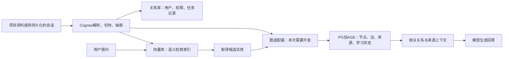
```mermaid
flowchart LR
    D[项目资料或待持久化的会话] --> C[Cognee解析、切块、抽取]
    C --> R[关系库：用户、权限、任务记录]
    C --> V[向量库：语义检索索引]
    C --> A[图适配器：本次需要开发]
    A --> G[PG加AGE：节点、边、来源、学习状态]
    Q[用户提问] --> V
    V --> N[取得候选实体]
    N --> A
    G --> X[相关关系与来源上下文]
    X --> L[模型生成回答]
```

图与向量通常通过通用唯一标识（**UUID**，用于稳定识别同一业务对象）关联。例如向量命中“张三”的UUID，图再用这个标识查他的项目关系。AGE自己的内部节点编号不能直接替代这个业务UUID。[模型转图][model-to-graph]、[节点索引][node-index]、[官方架构][cognee-architecture]。

上层调用图适配器的应用编程接口（**API**，代码之间约定的调用方式）。例如调用`get_neighborhood`取得邻域，再整理成回答上下文。新适配器只要保持输入、输出和业务行为，就能复用上层抽取和回答流程。[默认邻域检索][hybrid-neighbors]。

### 1.3 为什么不直接继续用普通PG

普通PG也能用两张表保存节点和边，现有`postgres_demo`适配器已经这样做；因此“PG没有图扩展就完全不能存图”不成立。问题在于接口缺口、图查询表达和实际执行成本。

AGE增加图模型和Cypher（描述节点、关系和路径的查询语言），适合把图操作集中在数据库侧表达。但它仍运行在PG之上，**不保证消除联表，也不保证比原方案更快**。第4章说明要测哪些成本。[普通PG适配器][pg-demo]。

**这一章的取舍：先把AGE当作有实现依据的候选后端，下一步确认能否部署；不要先假定它已完整兼容或性能必胜。**

## 2. 哪个版本可用：建议验证PG18＋AGE1.8，华为云要另过安装关

**本章结论：所核查的AGE版本都没有开箱即用的Cognee适配器。新开发优先以PG18＋AGE1.8做概念验证（PoC，用最小真实实验验证方案），因为它补充了写入分支和最短路能力；但华为云提供PG18，不等于托管实例能安装AGE。**

### 2.1 AGE与PG必须按对应发布包配套

| AGE版本 | 本轮核实的正式PG组合 | 相比新版需注意什么 |
|---|---|---|
| 1.6.0 | PG14、15、16、17，各有对应包 | 缺少新建/匹配后的条件赋值语法和新版专用最短路入口；不同PG分支还有差异 |
| 1.7.0 | PG17、18，各有对应包 | 仍缺上述条件赋值语法和新版专用最短路入口 |
| 1.8.0 | PG18 | 本报告建议验证的组合；仍不是完整Neo4j方言兼容 |
| 1.8.0的PG15条目 | 当日仍为预发布 | 不作为本报告正式交付基线 |

核验依据：[Apache发布目录][age-releases]、[PG17/1.6][age16-release]、[PG18/1.7][age17-release]、[PG18/1.8][age18-release]、[发布证据快照][release-snapshot]。部分正式标签名称仍带`rc0`，应结合发布身份判断，不能仅按名字推断。

### 2.2 哪些版本缺失会影响哪些流程

这里的结构化查询语言（**SQL**）是PG的查询语言；AGE允许从SQL调用图查询。以下“有”只指所列能力，不代表所有图查询都兼容。

| 能力或缺口 | AGE1.6 | AGE1.7 | AGE1.8/PG18 | 触发场景与影响 |
|---|---|---|---|---|
| 节点/边创建、匹配、普通匹配或创建、属性更新、批量输入、列表属性 | 有 | 有 | 有 | 可作为存储与查询基础；业务去重、来源和状态规则仍由适配器实现 |
| 新建时赋默认值、已存在时执行另一组更新：`ON CREATE / ON MATCH` | 缺 | 缺 | 有 | 重复导入要保住已学到的权重。旧版须另做事务分支；新版也不能自动判断哪些字段该保留 |
| 不带返回结果的子查询合并：`UNION`相关写法 | PG14～16缺；PG17分支有 | 有相应解析 | 有相应解析 | 主要影响使用该写法的自定义查询；固定写入模板可避开，不是所有查询合并都失效 |
| 专用无权最短路入口 | 未提供新版入口 | 未提供新版入口 | 有`age_shortest_path`等 | 旧版需另实现相关算法；普通一两跳邻域不以此为前提 |
| Neo4j原有最短路模式语法 | 不等价 | 不等价 | 仍不等价 | 自定义查询或自然语言生成的查询可能报错，必须改方言 |
| Neo4j多模型标签的原样表达 | 不能直接假定等价 | 不能直接假定等价 | 仍不能机械照搬多标签 | 要把类型映射为属性或标签集合，并一起修改类型筛选，详见第3章 |
| 行级安全（**RLS**，按规则限制哪些数据行可访问） | 缺少本轮确认的新版显式插入检查路径 | 有相关策略/角色测试 | 有相关实现/测试 | 普通操作通过不代表全部路径查询都已隔离安全；须独立验证，不能作为唯一租户隔离依据 |

证据：[1.6各分支源码矩阵][age16-evidence]、[1.7/1.8源码矩阵][age18-evidence]。1.8最短路按跳数，不能当作按权重选最低成本路径；当最少跳数参数`min_hops`大于实际最短距离、同时指定多种边类型时，所查实现明确报不支持，并非所有多类型查询都失败。逗号分隔值文件（**CSV**，一种表格文本格式）的AGE装载器会拒绝启用行级安全的目标表；选用这种批量捷径时需换受支持的写入路径，不能为导入直接关闭隔离。这两项应专项验证，不应泛化为普通问答都不可用。[路径限制代码][age-path-limit]、[权限/导入核查][age18-evidence]。

### 2.3 华为云：缺扩展不能用客户端协议补出来

华为云关系型数据库服务（**RDS**，厂商托管的数据库）公开版本表已列PG14～18；所核查的插件清单有pgvector（PG向量检索扩展），**未列AGE**。具体地域、实例小版本和可安装扩展仍需实例核验。[引擎版本][huawei-versions]、[插件清单][huawei-plugins]。

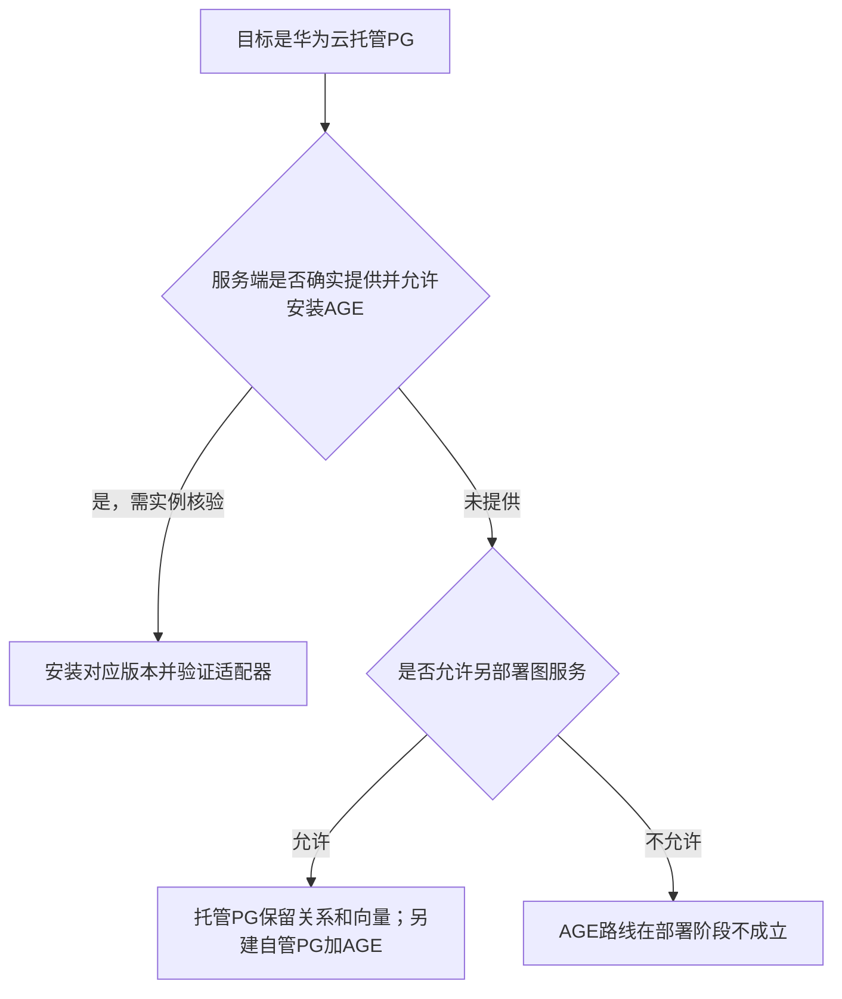
```mermaid
flowchart TD
    A[目标是华为云托管PG] --> B{服务端是否确实提供并允许安装AGE}
    B -->|是，需实例核验| C[安装对应版本并验证适配器]
    B -->|未提供| D{是否允许另部署图服务}
    D -->|允许| E[托管PG保留关系和向量；另建自管PG加AGE]
    D -->|不允许| F[AGE路线在部署阶段不成立]
```

AGE是服务器扩展，需要服务器上有对应安装包和权限。修改驱动、连接地址或网络协议，不能在缺少扩展的服务器里变出图能力。可选择弹性云服务器（**ECS**，可自行安装软件的云主机）或容器自管PG＋AGE，但这增加了部署、备份和维护责任。[AGE安装][age-install]。

只读核验可查询`pg_available_extensions`是否有`age`，以及`pg_extension`是否已安装；pgvector的扩展名是`vector`。本轮未连接用户实例，不把公开清单当成目标实例的实测结果。

**这一章的取舍：版本上优先验证PG18＋AGE1.8；部署上先确认服务端安装条件。若必须只用当前未开放AGE的标准托管实例，后续适配代码再完善也无法落地。**

## 3. 写入缺什么：三种写入行为、业务身份和来源一致性必须补齐

**本章结论：AGE能存节点和边，但不会自动执行Cognee的业务规则。正常入图前必须补齐分组、类型、关系、唯一性和来源维护；缺失时会导致写入失败，或更隐蔽的“成功但数据不对”。**

### 3.1 资料怎样进入图：Claude Code聊天也可能触发，但分两步

假设输入是“张三参与星河项目”，抽取结果最终识别出张三、星河及参与关系。下面是教学数据，不保证每次模型抽取都生成完全相同结果。

只连接Cognee的模型上下文协议（**MCP**，让Claude Code调用外部工具的协议）时，必须实际调用`remember`才写入；安装Cognee记忆插件后，则由事件钩子（hooks）自动采集。

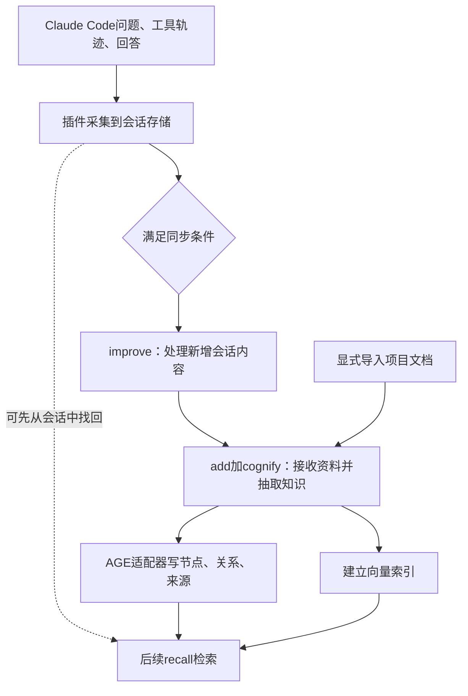
```mermaid
flowchart TD
    A[Claude Code问题、工具轨迹、回答] --> B[插件采集到会话存储]
    B --> C{满足同步条件}
    C --> D[improve：处理新增会话内容]
    D --> E[add加cognify：接收资料并抽取知识]
    F[显式导入项目文档] --> E
    E --> G[AGE适配器写节点、关系、来源]
    E --> V[建立向量索引]
    B -.可先从会话中找回.-> R[后续recall检索]
    G --> R
    V --> R
```

插件通过`/remember/entry`保存有类型的会话记录，不直接走字符串`remember`输入的自动构图分支；后续由插件同步触发`improve`。这里`remember`是保存入口，`cognify`负责构建知识图，`improve`负责持久化/提炼会话及其他学习阶段，`recall`是读取记忆。**会话保存成功不等于永久图已构建完成**：图写失败时会话仍可能存在，持久化水位不会按成功推进，后续可重试。[会话转图][session-cognify]。

插件1.6.1的自动同步默认是：每10秒检查，空闲60秒后尝试；每150个已存储工具/回答结束事件也可触发；自动触发共用1800秒冷却及新增记录检查；会话结束另有最终同步。它不是每分钟无条件重导全部聊天。采集受开关、过滤和后端可用性约束，也不等于扫描全部项目文件。[插件钩子][plugin-hooks]、[同步条件][plugin-sync]。

因此，即使用户没有手动点击“导入”，插件后续同步也会进入图写入阶段；**下面的写入缺口会在这个阶段暴露，而不是仅影响某个管理页面。**

### 3.2 APOC为什么必须替代：它参与了普通写入

**APOC（Neo4j的扩展函数与过程库）**在当前适配器中承担三项具体工作。AGE不提供这些同名调用，但可以用自己的写法实现结果；“必须改”指必须替代业务行为，不是重建整套APOC库。

假设同一数据集（dataset，一个有访问权限边界的知识空间）内有两份文档：A《项目启动》与B《运维交接》，都提到“张三参与星河”。假设上游已将张三、星河及两份文档中的这条关系映射为相同业务身份；名字相同本身不保证实体合并。

| APOC调用 | 输入与应该得到的结果 | 不改写会怎样 | 只删调用会怎样 | AGE怎么替代 |
|---|---|---|---|---|
| `apoc.coll.toSet` | 原分组`[项目启动]`加新分组`[运维交接]`，得到两者并集；重复输入不重复 | 节点写语句引用不存在的函数而失败，分组为空也不绕过该引用 | 直接覆盖会丢旧分组；仅拼接会重复；仅对本批去重会漏库内旧值 | 在并发控制下合并旧、新列表并去重 |
| `apoc.create.addLabels` | 张三标为`Entity`，文档标为`TextDocument`，使后续可按模型类型查找 | 同一节点写语句失败 | 按UUID能找到对象，按模型类型却漏查；文档子图和类型筛选可能不完整 | 用固定物理标签加类型属性/标签集合，并同步修改所有类型筛选 |
| `apoc.merge.relationship` | 已有“张三参与星河”则更新；没有则创建；“维护”应是另一种关系 | 非空批量边写入失败，知识关系未完整建立 | 跳过会缺边；无条件创建会重复；忽略类型会把参与和维护混在一起 | 按受控关系类型分组，用匹配或创建、属性更新及唯一性规则写入 |

依据：[节点写入][node-write]、[批量边写入][edge-write]。`toSet`只给分组列表去重，**不是识别两个“张三”是不是同一个人，也不是记录文档来源的账本**。模型标签`Entity`也不是“人物”这个语义类别，后者可通过类型节点表达。

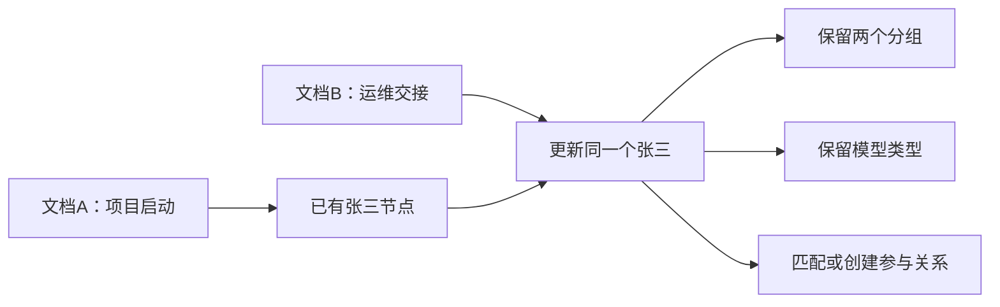
```mermaid
flowchart LR
    A[文档A：项目启动] --> O[已有张三节点]
    B[文档B：运维交接] --> U[更新同一个张三]
    O --> U
    U --> S[保留两个分组]
    U --> T[保留模型类型]
    U --> E[匹配或创建参与关系]
```

新适配器须同时完成写入和查询映射。例如把物理`Entity`标签改成`type=Entity`属性后，仍使用旧的标签查询就会漏数据；同一UUID是否允许积累多种模型类型，也必须明确，单个type值不自动等价于多标签。

**失败不是全部自动回滚。**当前顺序是图节点→节点向量→图边→边向量，分阶段执行。若节点已成功、边写失败，前面的数据可能已存在；框架尝试应用层补偿，但它不是跨所有存储的一次原子事务。仍能从旧图、会话或部分向量中回答，不证明这次导入成功。[写入顺序][storage-order]、[错误与补偿][pipeline-errors]。

也不应夸大为所有操作都失败：单条边写入已有普通匹配或创建实现，普通节点删除也不用这三项APOC。结论限定为**当前常规节点/批量边写入必须有等价实现**。[单边写入][single-edge]。

### 3.3 为什么有节点主键，还需要业务唯一性

AGE的内部节点编号解决“物理记录各不相同”；Cognee的UUID解决“重复导入的张三应是同一个业务对象”。如果两个请求同时创建相同UUID，却各得一个内部编号，底层记录仍合法，业务上却已经重复。

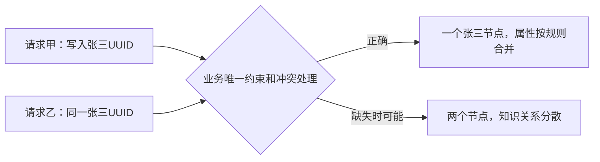
```mermaid
flowchart LR
    A[请求甲：写入张三UUID] --> C{业务唯一约束和冲突处理}
    B[请求乙：同一张三UUID] --> C
    C -->|正确| D[一个张三节点，属性按规则合并]
    C -->|缺失时可能| E[两个节点，知识关系分散]
```

因此要设计并验证业务UUID索引、边的稳定身份、并发冲突重试。不能假定父标签上的唯一索引自动覆盖所有继承标签；约束必须覆盖模型实际存储范围。边身份至少区分起点、关系类型和终点；同端点“参与”和“维护”不能误合并。单条`MERGE`（匹配已有对象，否则创建）成功不等于所有并发都已唯一。[身份及索引依据][age18-evidence]、[业务写入合同][graph-interface]。

### 3.4 来源维护：删除A，为什么必须保留B的知识

分组表达“属于哪些内容集合”，来源表达“由哪些输入支持”，学习状态表达“后来学到了什么”。三者必须分开保存。

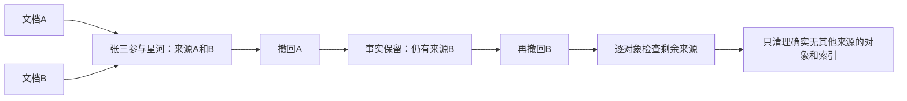
```mermaid
flowchart LR
    A[文档A] --> F[张三参与星河：来源A和B]
    B[文档B] --> F
    F --> D[撤回A]
    D --> K[事实保留：仍有来源B]
    K --> L[再撤回B]
    L --> J[逐对象检查剩余来源]
    J --> N[只清理确实无其他来源的对象和索引]
```

若简单执行“删除张三节点”，B支持的事实也会消失；若只删图而不正确清理向量，可能留下仍能召回的残留。节点还可能被文档C引用，所以删最后一条边来源也不等于整个人物都能删除。

现有删除规划会区分存活与无主对象，清理应删向量，只给存活对象移除目标来源，再删除无主图对象；无主对象在真正删除前保留来源信息，方便失败后找回重试。新适配器需要实现15项来源/元数据方法，复用该规划，而不是另写一个粗暴删节点流程。[来源删除规划][delete-planner]。

并发也要验证：甲读到来源`[B]`准备追加为`[A,B]`，乙同时读到`[B]`准备撤回为`[]`；若乙最后覆盖，会丢A。问题是读、修改、写入没有被完整协调，不是AGE不会存列表。需用事务、锁或条件更新保护整组业务动作；图与向量跨连接的补偿仍要保留。

**这一章的交付门槛：重复写不重复、分组不丢、类型可查、关系完整、删除A不伤及B、失败可重试。任何一项没完成，都不能声称正常入图已经可靠；这些优先于图统计。**

## 4. 检索和学习缺什么：图查询原语还要变成正确的业务结果

**本章结论：AGE已有邻域、路径和属性更新基础；需要开发结果转换和状态规则。最短路语法、学习接口和性能是三个独立问题，不能用“支持Cypher”一笔带过。**

### 4.1 查询能跑，为什么还可能漏知识

用户问“星河项目有哪些参与者”，默认混合检索先用向量找候选，再取候选附近的关系。这里不要求运行全图算法，但要求返回正确的节点集合、边方向和过滤结果。

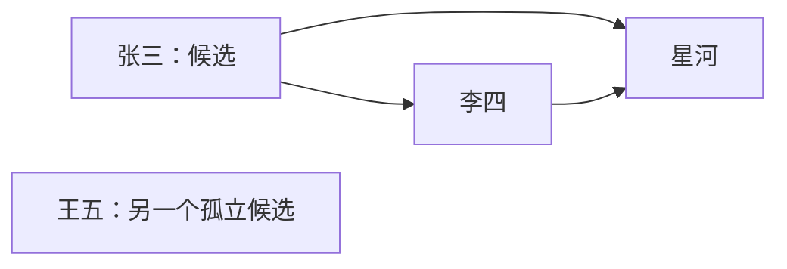
```mermaid
flowchart LR
    Z[张三：候选] --> X[星河]
    Z --> L[李四]
    L --> X
    W[王五：另一个孤立候选]
```

若结果只收集从张三出发的某条路径，可能漏掉节点集合中已有的“李四→星河”边；若只从边反推节点，孤立候选王五可能消失。Cognee需要的是符合范围的节点及节点间相关边，不是任意一个路径列表。[图读取合同][graph-interface]、[子图消费][cognee-graph]。

AGE适配器须处理：候选节点保留、指定深度、方向、关系类型、内容分组筛选、分页和稳定UUID返回。缺失时用户看到的是漏检、错误上下文或读全图造成的延迟，不只是某个统计数字缺失。

### 4.2 学习与时间功能：分别在哪个操作暴露缺口

| 用户行为或流程 | 需要适配什么 | 不支持时的具体影响 | 必须怎样处理 |
|---|---|---|---|
| 用户反馈“这条回答不好”，后续`improve`应用反馈 | 节点/具体边权重的4个读写方法 | 该图权重学习阶段被能力检查跳过或报告错误；会话里的反馈文本不因此消失 | 实现权重读写与完整读算写并发规则，不能只把能力标志改为真 |
| 显式启用`truth`学习阶段 | 经验对齐坐标和对应版本的2个方法 | 无法提供这套可选重排信号；普通基础检索仍可运行 | 先写新版本坐标，再发布对应质心；读取只采用当前生效版本的坐标，逐项写入结果须真实；它不是事实真伪鉴定 |
| 给旧事实写失效时间 | 通用`update_node`局部更新 | 旧事实没有按要求标记失效 | 只更新指定字段，保留其他状态；缺失时要明确失败 |
| 重新导入已有实体 | 保留或明确重置学习状态 | 输入默认权重0.5可能覆盖已经学到的0.9 | 区分新建默认值、普通更新、显式重置。AGE1.8语法只能帮忙分支，不能替你决定规则 |
| 时间检索“张三上周参与什么” | `collect_time_ids`、`collect_events`两个额外方法 | 时间检索不能只因保存了时间属性就成立 | 按当前毫秒时间、区间边界和事件邻域合同实现 |

依据：[反馈能力检查][capabilities]、[权重更新][feedback-task]、[事实关闭][close-node]、[时间检索调用][temporal]。

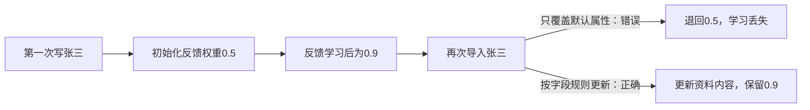
```mermaid
flowchart LR
    A[第一次写张三] --> B[初始化反馈权重0.5]
    B --> C[反馈学习后为0.9]
    C --> D[再次导入张三]
    D -->|只覆盖默认属性：错误| E[退回0.5，学习丢失]
    D -->|按字段规则更新：正确| F[更新资料内容，保留0.9]
```

现有普通PG图适配器的“部分支持”主要指缺少上述4个反馈方法、2个truth方法和通用局部更新；不是PG存不了数值，也不是整个`improve`都不可用。会话持久化、经验蒸馏和默认三元组索引等仍有实现路径。AGE适配器要逐项实现和声明，不能照搬一个笼统的“支持improve”。九阶段清单见文末。

### 4.3 最短路与自定义查询：不能承诺原样兼容

假设张三直达赵六是1跳但费用100，经李四是2跳、费用2。AGE1.8所核查的专用最短路按跳数选1跳，不能当作按费用选2跳的算法。

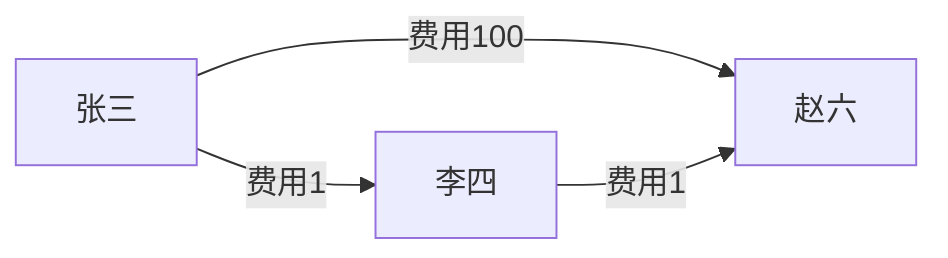
```mermaid
flowchart LR
    Z[张三] -->|费用100| Q[赵六]
    Z -->|费用1| L[李四]
    L -->|费用1| Q
```

这不构成当前普通邻域问答的硬缺口；当前Cognee相关全图距离统计也没有配置权重。但是用户显式提交Neo4j原始查询、或自然语言生成器仍生成Neo4j语法时，会碰到方言不兼容。应先限制公开查询范围，再改生成提示、参数和结果协议，不承诺任意查询可迁移。[AGE最短路实现][age-path-code]、[自然语言查询入口][nl-retriever]。

### 4.4 AGE能否解决联表慢：可能改善表达，性能收益待测

固定跳图匹配仍会转换成PG内部查询，仍可能使用联表（JOIN，把关联记录组合起来）；变长路径展开（**VLE**，沿关系扩展不同长度路径）有专门实现，但仍受扇出、深度、冷缓存和数据量影响。[查询转换][age-transform]、[路径实现][age-path-code]。

“从张三找两跳关系”和“从高连接度节点找十跳所有路径”不是同一负载。第二种即使没有手写复杂SQL，也可能产生大量中间结果。不能把AGE当成消除关系运算或自动提速的开关。

100用户同样要区分100个独立图与一个共享热点图。连接池、图缓存和同图写冲突都要测；AGE也不自动把一个图分布到多台机器。验证至少记录第95百分位响应时间（**P95**，即95%的请求在该时间内完成）、错误率、内存、冷热差异和写入等待，并把数据库、向量检索、模型调用分别计时。

**这一章的交付门槛：检索结果与参考后端一致，学习不会被重导覆盖，未支持的查询明确限制；性能结论只根据目标数据和负载实验给出。**

## 5. 统计缺什么：不支持GDS不等于不能记忆，要看谁调用了统计

**本章结论：GDS（Graph Data Science，Neo4j图数据科学库）在本次核查中用于图统计。普通Claude Code会话采集、检索和默认同步不会固定调用它；但显式摘要请求可能被现有代码间接拖入统计失败。应把计数、连通性和昂贵指标分成三档交付。**

### 5.1 两条调用路径，影响的人不同

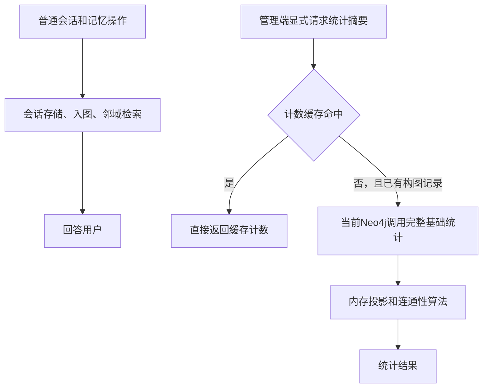
```mermaid
flowchart TD
    A[普通会话和记忆操作] --> B[会话存储、入图、邻域检索]
    B --> C[回答用户]
    D[管理端显式请求统计摘要] --> E{计数缓存命中}
    E -->|是| F[直接返回缓存计数]
    E -->|否，且已有构图记录| G[当前Neo4j调用完整基础统计]
    G --> H[内存投影和连通性算法]
    H --> I[统计结果]
```

当前Claude插件没有默认请求图统计摘要；状态栏刷新是本地渲染。当前MCP的空检索诊断也已移除旧的图摘要探测，不能把“找到3条记忆”的结果计数当成全图统计。本文的管理端场景，指你另外接入统计API的页面、监控脚本或程序。[插件状态栏][plugin-statusline]、[MCP测试][mcp-summary-test]。

| 触发入口 | 何时真正计算 | 不支持相关统计时的影响 |
|---|---|---|
| 普通`recall`、会话保存、默认`improve` | 正常内置链路不调用这七项GDS过程 | 不因GDS缺失本身失效；写入和检索适配仍须正确 |
| `/datasets/graph-summary`、`/visualize/brains-summary` | 主动请求，已有对应构图记录且统计缓存未命中 | 可能触发下面的零计数回退 |
| 显式`get_graph_metrics(False)` | `False`表示不计算可选指标，仍进入基础统计 | 仍需要内存投影与连通性计算；关闭可选项不等于关闭GDS |
| 显式`get_graph_metrics(True)` | `True`表示基础统计后追加可选算法 | 最短路径或聚类缺失也可能使整次完整统计失败 |
| 显式`get_pipeline_run_metrics(...)` | 完整统计缓存未命中时 | 影响此次指标获取；没有证据表明每次构图都会自动调用它 |

依据：[摘要缓存与计算][counts]、[完整指标缓存][pipeline-metrics]、[Neo4j统计顺序][neo-metrics]。并发缓存未命中可能重复计算，不保证严格每次构图只计算一次。

### 5.2 七种GDS调用分别干什么，不支持会失去什么

弱连通分量（**WCC**，忽略箭头后彼此能到达的一组节点）用来判断知识图分成多少个互不连通的部分。GDS内存投影则是算法使用的计算副本，不是另一个用户知识库。[官方投影说明][gds-projection]。

| GDS调用 | 什么时候调用 | 直接用途 | 缺失后果及替代方式 |
|---|---|---|---|
| `gds.graph.list` | 基础统计准备 | 检查旧内存投影是否存在 | 原流程准备失败；AGE新算法可不使用这个目录机制 |
| `gds.graph.drop` | 旧投影存在时 | 删除旧计算副本 | 原统计可能失败；不是持久图删除失败，替代时只清理临时状态 |
| `gds.graph.project` | 建立本次统计输入 | 生成算法使用的内存图 | 原算法没输入；AGE可直接查询或完整导出目标拓扑 |
| `gds.wcc.stats` | 基础统计，`False`也调用 | 算连通分量数量 | 无法得知有几个知识团体；需实现等价算法或不开放该指标 |
| `gds.wcc.stream` | 同上 | 聚合每个分量的大小 | 无法得知各团体大小；可与上一项一次遍历计算 |
| `gds.allShortestPaths.stream` | 仅`True` | 获取全图点对距离，再算直径/平均距离 | 缺相应指标，不等于普通邻域检索失败；单独选配 |
| `gds.localClusteringCoefficient.stats` | 仅`True` | 算邻居之间连接紧密程度 | 缺平均聚类系数，不等于反馈权重或答案评分失效；单独选配 |

其中前三项是旧算法的准备设施，不是必须复制给AGE的用户功能。后四项才对应具体分析结果。[算法调用代码][neo-metric-utils]。

继续用项目资料画一张仅含六个业务实体的教学图；真实Cognee图还有文档、片段、类型等节点，实际指标不应直接照抄这里的数字。

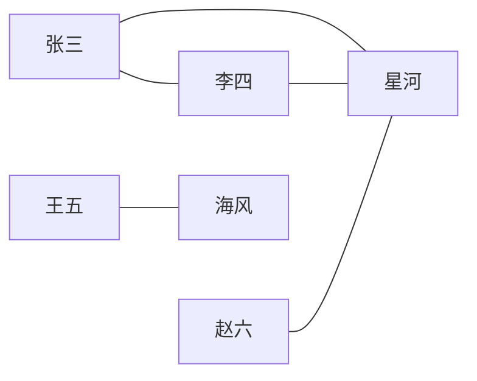
```mermaid
flowchart LR
    Z[张三] --- L[李四]
    Z --- X[星河]
    L --- X
    Q[赵六] --- X
    W[王五] --- H[海风]
```

- **连通性例子：**这里有两个团体，大小分别为4和2。缺WCC就不能提供这两个结构指标，但仍能查到“王五与海风相连”。
- **距离例子：**张三到赵六最少2步。全图平均距离却要考虑所有点对；张三到王五不可达，必须明确如何处理，不能简单把它当0。AGE的一次两点最短路调用不等于完成全图统计。
- **聚类例子：**张三的两个邻居李四和星河也相连，构成三角形；赵六只有一个邻居，局部结构不同。聚类衡量这种连接结构，不是判断“张三参与星河”是真是假。

### 5.3 最容易误判的故障：图里有知识，摘要却显示0

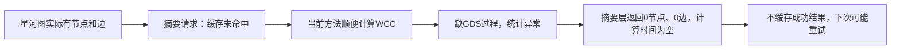
```mermaid
flowchart LR
    A[星河图实际有节点和边] --> B[摘要请求：缓存未命中]
    B --> C[当前方法顺便计算WCC]
    C --> D[缺GDS过程，统计异常]
    D --> E[摘要层返回0节点、0边，计算时间为空]
    E --> F[不缓存成功结果，下次可能重试]
```

这是当前代码把“只要两个计数”绑定到“完整基础统计”的连带影响。数据没有因此被删除，普通检索也不因这次统计失败自动失效。直接调用完整统计则可能收到异常，不一定经过摘要层的零值回退。[异常处理][counts]。

**`include_optional=False`仍包含WCC。**如果先交付准确计数、后交付连通性，必须新增轻量计数路径并修改调用及结果消费，或者明确改统计合同；只删算法并填0不合格。结构分析超出资源上限时应明确不可用，不能截断部分图后称为全图WCC。

### 5.4 统计的交付顺序

| 交付目标 | 必须做什么 | 可以暂缓什么 |
|---|---|---|
| 先提供普通记忆服务 | 完成图写、图读、来源与启用的学习合同 | 不启用的摘要和结构统计可以暂缓 |
| 显示知识库规模 | 准确节点/边计数，失败与真实空图区分 | 解耦后可以暂缓WCC |
| 提供连通性分析 | 正确WCC数量和大小、范围与资源限制 | 全点对距离和聚类仍可暂缓 |
| 提供完整结构分析 | 再实现距离和聚类、明确不可达点口径并压测 | 不承诺任意规模无限制精确计算 |

**这一章的判断：缺GDS不是AGE替代的统一阻断项；缺的是某项统计结果，就限制该项功能。只有当前耦合造成的假零和错误传播，必须在启用摘要前处理。**

## 6. 怎么开发、多少工作量：先验证底层，再按业务交付

**本章结论：主要开发在Cognee适配层，当前没有证据表明本范围必须修改AGE内核。全部由Agent开发，原完整范围暂按80～170 Agent小时、3～6自然日预留；这是包含基础连通性统计的未校准预算，不是已经交付或性能达标的承诺。**

### 6.1 具体改哪里

AGE通过PG连接执行图查询，返回`agtype`（AGE用于节点、边和属性值的数据类型）。新适配器需要编码参数、解码结果，并保持Cognee的对象格式；不能直接把原Neo4j驱动换个地址。

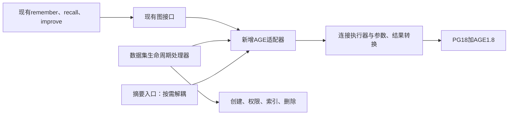
```mermaid
flowchart LR
    U[现有remember、recall、improve] --> I[现有图接口]
    I --> A[新增AGE适配器]
    A --> C[连接执行器与参数、结果转换]
    C --> G[PG18加AGE1.8]
    H[数据集生命周期处理器] --> A
    H --> S[创建、权限、索引、删除]
    T[摘要入口：按需解耦] --> A
```

| 开发位置 | 做什么 | 为什么可行、还有什么须验证 |
|---|---|---|
| 新增`graph/age/`适配器及连接模块 | 接入工厂、管理连接、参数和agtype结果；实现节点/边读写 | AGE有原语，Cognee有接口；仍须真实验证编码、取消、断连、错误和事务 |
| 新增图模型及索引初始化 | 固定业务类型表达、UUID索引、边身份、来源与学习字段 | 数据可表达；索引表达式、并发唯一性和升级路径须实测 |
| 新增数据集生命周期处理器（handler） | 创建/解析/删除每个数据集的图，绑定用户权限与连接缓存 | Cognee已有注册接点；只注册适配器不会自动得到多租户 |
| 来源、状态与检索模块 | 15项来源方法、反馈/经验对齐/局部更新、时间检索、邻域与分页 | 可复用上层规划和算法；必须保持现有业务合同而非仅让函数不报错 |
| 按需修改摘要入口 | 将计数与结构算法分离，明确失败状态 | 需要改调用及消费合同，不属于只新增后端文件即可完成的部分 |
| 公开查询及自然语言查询 | 方言提示、参数、返回格式和能力限制 | 独立选配；不能让模型继续生成不支持的Neo4j/APOC语法 |

源码接点：[适配器工厂][graph-factory]、[数据集处理接口][dataset-handler]、[AGE驱动参考][age-python]。若用同步驱动，须隔离执行以免阻塞应用；不能假定驱动解码可直接插到现有异步连接里。

建议AGE成为图的唯一权威存储，不再另维护一套普通PG图表并异步复制。向量与关系元数据仍沿现有适配器；同一PG服务器不自动把这些调用合成一个事务。旧数据迁移须保留UUID、来源和学习状态，重建索引并核对，改provider配置不会自动搬数据。

### 6.2 全Agent任务与预算

一个Agent小时指一个Agent被任务占用一小时；四个Agent各运行两小时是8 Agent小时，不是8小时日历工期。这里按最多4个并发Agent：1个协调、2个实现、1个验证；设计、代码、测试、评审、修复均由Agent执行。

| 工作包 | 完成什么才算交付 | 主执行预算 |
|---|---|---:|
| W1：真实数据库概念验证 | 对应版本可安装；参数/结果、UUID索引、并发匹配创建、邻域样例跑通 | 6～12小时 |
| W2：连接与基本读写 | 连接、编码解码、三种APOC等价行为、批量错误与重试 | 8～16小时 |
| W3：模型、索引与隔离 | 数据集创建删除、权限、索引、并发身份和缓存归属 | 6～12小时 |
| W4：来源与增量更新 | A/B共享事实撤回、失败运行补偿、位置与分组更新 | 10～20小时 |
| W5：学习与时间状态 | 4个反馈接口、2个经验对齐接口、局部更新及2个时间检索方法 | 8～16小时 |
| W6a：图读取；W6b：统计 | a验邻域、分页、过滤；b验计数、失败状态与WCC，分别验收 | 合计6～12小时 |
| W7：整体链路和故障验证 | 写入、读取、撤回、更新、学习闭环；重连、失败恢复与代表性负载 | 8～16小时 |
| 主执行合计 | 已含局部测试和常规修复 | **52～104小时** |

另留独立评审/反例验证12～24小时、协调集成4～8小时、新增问题返工12～34小时，合计暂取**80～170 Agent小时**。这些数字是按工作范围分解的资源预算，源码本身不能证明Agent开发速度。

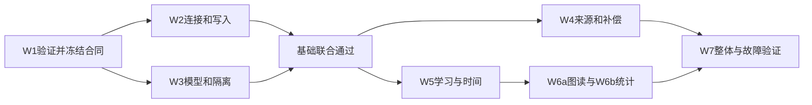
```mermaid
flowchart LR
    P[W1验证并冻结合同] --> A[W2连接和写入]
    P --> B[W3模型和隔离]
    A --> J[基础联合通过]
    B --> J
    J --> C[W4来源和补偿]
    J --> D[W5学习与时间]
    D --> E[W6a图读与W6b统计]
    C --> F[W7整体与故障验证]
    E --> F
```

按依赖链，理想执行路径约36～72小时；给联调和返工留余量，完整范围先排**3～6自然日**。前提是环境、模型额度可用且持续运行。不是把总Agent小时除以4，也不是四个人工人日的换算。

**范围与优先级要分开：**这个预算包含W6b基础WCC，但普通记忆首期可以不开放统计。若缩减范围，应在W1实际运行后重估，不能机械减去几小时。摘要解耦的上层改动也要计入，不能漏算。

| 额外范围 | 初步追加预算 | 边界 |
|---|---:|---|
| 受限公开AGE查询 | 4～8主执行Agent小时 | 参数、返回列、权限、取消和错误协议 |
| 自然语言生成AGE查询 | 8～16小时 | 依赖查询通道，需提示和查询样本回归 |
| 昂贵图统计 | 6～12小时 | 只对明确有界数据验证距离/聚类，不含大图性能目标 |
| 三组选配一起交付 | 合计18～36主执行小时；含联调暂增1～2自然日 | 原完整范围加选配暂为4～8日，仍须实际校准 |
| 生产高可用、迁移、任意第三方任务 | 暂不报固定总量 | 缺部署、恢复目标、数据量和任务清单，不编造时间 |

首轮验证必须记录实际Agent占用、工具等待、模型用量和修复轮次，再修订预算。货币成本还需模型价格及实例资源，不能直接由Agent小时推成人民币金额。

### 6.3 分阶段验收，避免把统计缺失当成所有功能失败

| 交付阶段 | 用什么例子验收 | 不通过的含义 |
|---|---|---|
| 部署可行 | 固定组合装好扩展，目标权限下读写及结果解码 | 这条部署路线尚不成立 |
| 记忆主流程 | 导入A/B，重复写张三，问星河参与者；撤回A仍保留B | 写入、检索或来源合同不合格，不能上线该主流程 |
| 已启用学习功能 | 学到0.9后重导不退回0.5；事实关闭、时间边界正确 | 对应学习/生命周期功能不可宣称支持 |
| 摘要展示 | 非空图计数准确；失败不显示假0；缓存与错误路径正确 | 阻断摘要上线，不自动判普通会话不可用 |
| 连通性和可选指标 | 孤点、链、环、两个团体与独立算法对照 | 阻断相应统计功能；未启用的指标不作统一门槛 |
| 目标规模 | 私有多图/共享热点分开，混合读写、故障恢复 | 功能正确仍不足以证明100用户或生产响应目标达标 |

保留会话缓存，以完整记忆功能做测试；自动反馈、后台同步、队列等开关要记录。普通插件流程、显式摘要请求、昂贵统计分别测，不能假定每次聊天都有一次全图统计，也不能关闭真实同步负载后声称测到了完整插件。

**最终建议：若能自管PG扩展且希望沿用PG运维体系，先做PG18＋AGE1.8的W1验证；通过后实现记忆必需合同，统计分期。若必须只用不开放AGE的托管实例，或要求同图自动跨机扩展，则先解决部署/架构条件，不应直接启动完整适配。**

## 附录A. AGE不合适时，其他图库怎样选择

**结论：Ladybug减少新接入工作，服务型图库可提供不同的部署基础；没有一个候选已被本报告证明能直接满足全部业务及100用户目标。**此附录保留备选结论，不改变正文的AGE实施主线。

许可按用户要求筛选，排除通用公共许可证（**GPL**，具有较强衍生分发义务的开源许可证）。MIT许可证（一种宽松开源许可）和Apache-2.0许可证属于本报告接受的许可范围；服务端与客户端依赖的许可需分别看。

| 候选固定版本 | 能解决什么 | 当前缺口与选择边界 |
|---|---|---|
| Ladybug0.19.0，MIT | 当前Cognee已有47项图接口实现及额外时间方法，无需从零开发适配器 | 嵌入式文件由唯一读写owner（数据库持有进程）持有；增加API进程不等于同图多写入者水平扩展或自动故障切换。独立数据集可设计按owner分片；单热点图仍须验证容量 |
| ArcadeDB26.9.1，Apache-2.0 | 服务端有数据库路由、事务和复制/故障切换基础 | 社区适配器仍依赖旧Cognee，缺数据集处理、来源、学习及正确统计等；优先作为服务型候选验证，不能直接切换；复制不等于单图自动分片 |
| HugeGraph1.7.0，Apache-2.0 | 有服务化及集群部署路径 | 需新适配器；命名空间隔离依赖部署分支，不能只按接口路径推断；来源并发和恢复须验证 |
| JanusGraph1.1.0，Apache-2.0 | 可组合外部存储构建分布式图服务 | 外部后端的事务/锁约束增加一致性和运维工作；不因100注册用户就优先引入 |
| NebulaGraph3.8.0，Apache-2.0 | 有分布式图服务基础 | 需新适配器；所核版本持久属性不能直接当集合使用，来源/分组需重建模型；权限与多对象失败恢复另验 |

固定源码依据：[Ladybug许可][ladybug-license]、[文件锁][ladybug-file-lock]、[Ladybug写事务][ladybug-transactions]、[ArcadeDB服务端][arcade-ha]与[社区适配器][arcade-adapter]、[HugeGraph部署分支][hugegraph-space]、[JanusGraph事务约束][janus-transactions]、[Nebula属性类型][nebula-types]。Neo4j Community5.26采用GPL；Memgraph所查版本为Business Source License（**BSL**，带使用条件的源码可用许可），FalkorDB为Server Side Public License（**SSPL**，含服务提供义务的许可），不作为本报告的宽松许可候选。[许可对照][neo-license]、[Memgraph许可][memgraph-license]、[FalkorDB许可][falkor-license]。

Ladybug结论针对普通平台的0.19.0依赖，旧macOS条件版本未覆盖。它也不是零风险：此前已用其0.19.0引擎执行当前适配器原统计查询，发现孤点/链图的连通性结果错误、聚类查询报错，外层可能返回假零。影响统计，不证明普通图存储失败。原实验使用小内存配置，不是100用户容量测试；[复现脚本与结果保留在已提交历史版本][ladybug-repro]。单owner验证、统计修复和复核原预算30～60 Agent小时、1～3日，不包含跨机路由、服务化或自动故障切换。

**备选判断：多独立图且接受单owner时可先验Ladybug；共享图要求数据库自身故障切换时先验ArcadeDB；明确超过单机容量才深入分布式候选。所有候选仍需通过正文同一组业务测试。**

## 附录B. 适配范围核对：47项图接口与额外功能

**结论：不能只统计类里实现了多少方法，必须看启用的业务链是否经过验证。**当前接口有21个抽象方法及26个带默认实现的方法；后者有些默认明确不支持，有些退回全图读取。

| 分组 | 方法 | 数量 |
|---|---|---:|
| 生命周期/查询 | `is_empty`、`delete_graph`、`query` | 3 |
| 节点 | `add_node`、`add_nodes`、`delete_node`、`delete_nodes`、`get_node`、`get_nodes` | 6 |
| 边 | `add_edge`、`add_edges`、`has_edge`、`has_edges`、`get_edges` | 5 |
| 图读 | `get_graph_data`、`get_neighbors`、`get_nodeset_subgraph`、`get_connections`、`get_neighborhood`、`get_filtered_graph_data` | 6 |
| 统计 | `get_graph_metrics` | 1 |
| 来源附加/移除 | `attach_node_source_refs`、`attach_edge_source_refs`、`remove_node_source_refs`、`remove_edge_source_refs` | 4 |
| 来源删除准备 | `delete_edge_triples`、`get_node_delete_data`、`get_edge_delete_data` | 3 |
| 来源索引 | `find_nodes_by_source_ref`、`find_edges_by_source_ref`、`find_node_source_refs_by_dataset`、`find_edge_source_refs_by_dataset`、`find_node_source_refs_by_pipeline_run`、`find_edge_source_refs_by_pipeline_run` | 6 |
| 图元数据 | `set_graph_metadata`、`get_graph_metadata` | 2 |
| 增量/分组 | `remove_belongs_to_set_tags`、`update_chunk_index` | 2 |
| 反馈 | `get_node_feedback_weights`、`set_node_feedback_weights`、`get_edge_feedback_weights`、`set_edge_feedback_weights` | 4 |
| 经验对齐 | `get_node_truth_state`、`set_node_truth_state` | 2 |
| 局部更新/分页/可视化种子 | `update_node`、`get_triplets_batch`、`get_top_degree_node_ids` | 3 |

另有时间检索要求的`collect_time_ids/collect_events`；`get_id_filtered_graph_data`缺失时可能退回全图读取。接口清单是实现检查范围，**不是要求首期开放所有统计或任意查询**：未启用能力仍须明确关闭入口或返回可识别的不支持状态，不能只留空实现。[接口定义][graph-interface]、[时间调用][temporal]。

### improve九阶段：避免继续用“部分支持”概括

下表说明当前普通PG演示适配器，而不是AGE已开发完成；它帮助识别新AGE适配器要承接什么。

| 阶段 | 当前普通PG图适配器的代码边界 |
|---|---|
| `feedback_weights`：图权重学习 | 缺4个权重读写方法，正常能力检查后跳过 |
| `persist_session_qa`：持久化问答 | 有写入路径；需新内容及正常构图链 |
| `persist_agent_traces`：持久化轨迹反馈 | 有路径；不是保证所有原始工具轨迹都入图 |
| `extract_agent_context`：提取经验上下文 | 此阶段写会话上下文，不依赖上述图权重方法 |
| `distill_sessions`：蒸馏经验 | 有路径；需要可蒸馏输入，再调用构图 |
| `update_user_preferences`：用户偏好 | 有兼容路径，缺局部更新时可回退完整写入 |
| `build_truth_subspace`：经验对齐空间 | 缺2个状态方法；需显式启用，正常检查后跳过 |
| `triplet_enrichment`：三元组向量索引 | 默认任务有路径，需启用相关配置；自定义任务另审 |
| `global_context_index`：层次摘要索引 | 有路径，需显式启用及有效输入；大图成本另测 |

依据：[阶段注册][improve-registry]、[阶段实现][improve-stages]、[能力探测][capabilities]。实际结果还取决于配置、会话和新内容；不能把“七项有路径”写成生产可用率。事实关闭另需`update_node`，当前普通PG实现的缺口不会因其他阶段有回退就消失。外部Graphiti运行时、任意自定义任务和原始查询不在默认完整兼容承诺内。

## 附录C. 证据与验证边界

**结论：已完成版本、源码、调用链和小图统计反例核查；未完成AGE集成和生产负载验证。**

| 核查对象 | 固定基线 |
|---|---|
| Cognee | `663a2dc15d04bc0d7ec2733a2dd604b7ed1b8c8e` |
| AGE1.6：PG14 / PG15 | `41c08296a4b692adf31ed9507a9a25dad6f9f67f` / `fa1af8de99d74d32e131c19b62cf580d396eb0ae` |
| AGE1.6：PG16 / PG17 | `2db2f060c4c9265a14d40f007eb8c56febf31e4c` / `54905a09bf8462f22a87c3adfd2ab5752e5c1e71` |
| AGE1.7：PG17 / PG18 | `e1467f12e0b1d15dd35d3ab93f057a7112d425b8` / `806fa2ebdb300b3e76ef30cdba61803babbf2683` |
| AGE1.8：PG18 | `e43dc1a12b78fba4acef9835b2b10379b8d243b4` |
| Claude Code插件1.6.1 | `4d57a36859111b927f08a0b99fe04ccfbc4ed22e` |

版本分支细节、回归预期与未验证边界见[1.6源码矩阵][age16-evidence]、[1.7/1.8源码矩阵][age18-evidence]。AGE本身所核版本为[Apache-2.0许可][age-license]。

尚未完成：真实AGE适配器、完整Cognee与模型链路、100用户压测、目标华为云实例安装、生产迁移和故障恢复。上游测试与源码说明能支持设计判断，不能替代这些交付证据。

[age16-evidence]: evidence/age16-source-matrix.md
[age18-evidence]: evidence/age17-age18-source-matrix.md
[graph-interface]: https://github.com/topoteretes/cognee/blob/663a2dc15d04bc0d7ec2733a2dd604b7ed1b8c8e/cognee/infrastructure/databases/graph/graph_db_interface.py#L16
[model-to-graph]: https://github.com/topoteretes/cognee/blob/663a2dc15d04bc0d7ec2733a2dd604b7ed1b8c8e/cognee/modules/graph/utils/get_graph_from_model.py#L87
[node-index]: https://github.com/topoteretes/cognee/blob/663a2dc15d04bc0d7ec2733a2dd604b7ed1b8c8e/cognee/tasks/storage/index_data_points.py#L53
[cognee-architecture]: https://docs.cognee.ai/core-concepts/architecture
[hybrid-neighbors]: https://github.com/topoteretes/cognee/blob/663a2dc15d04bc0d7ec2733a2dd604b7ed1b8c8e/cognee/modules/retrieval/hybrid/entities.py#L60
[pg-demo]: https://github.com/topoteretes/cognee/blob/663a2dc15d04bc0d7ec2733a2dd604b7ed1b8c8e/cognee/infrastructure/databases/graph/postgres_demo/adapter.py#L879
[age-releases]: https://dist.apache.org/repos/dist/release/age/
[age16-release]: https://github.com/apache/age/releases/tag/PG17%2Fv1.6.0-rc0
[age17-release]: https://github.com/apache/age/releases/tag/PG18%2Fv1.7.0-rc0
[age18-release]: https://github.com/apache/age/releases/tag/PG18%2Fv1.8.0-rc0
[release-snapshot]: evidence/age-version-evidence-20260928.json
[age-path-code]: https://github.com/apache/age/blob/e43dc1a12b78fba4acef9835b2b10379b8d243b4/src/backend/utils/adt/age_vle.c#L2798
[huawei-versions]: https://support.huaweicloud.com/productdesc-rds-pg/zh-cn_topic_0043898356.html
[huawei-plugins]: https://support.huaweicloud.com/intl/zh-cn/usermanual-rds-pg/rds_09_0045.html
[age-install]: https://age.apache.org/age-manual/master/intro/setup.html
[session-cognify]: https://github.com/topoteretes/cognee/blob/663a2dc15d04bc0d7ec2733a2dd604b7ed1b8c8e/cognee/tasks/memify/cognify_session.py#L62
[plugin-hooks]: https://github.com/topoteretes/cognee-integrations/blob/4d57a36859111b927f08a0b99fe04ccfbc4ed22e/integrations/claude-code/hooks/hooks.json#L15
[plugin-sync]: https://github.com/topoteretes/cognee-integrations/blob/4d57a36859111b927f08a0b99fe04ccfbc4ed22e/integrations/claude-code/scripts/_plugin_common.py#L1767
[node-write]: https://github.com/topoteretes/cognee/blob/663a2dc15d04bc0d7ec2733a2dd604b7ed1b8c8e/cognee/infrastructure/databases/graph/neo4j_driver/adapter.py#L328
[edge-write]: https://github.com/topoteretes/cognee/blob/663a2dc15d04bc0d7ec2733a2dd604b7ed1b8c8e/cognee/infrastructure/databases/graph/neo4j_driver/adapter.py#L1238
[storage-order]: https://github.com/topoteretes/cognee/blob/663a2dc15d04bc0d7ec2733a2dd604b7ed1b8c8e/cognee/tasks/storage/add_data_points.py#L332
[pipeline-errors]: https://github.com/topoteretes/cognee/blob/663a2dc15d04bc0d7ec2733a2dd604b7ed1b8c8e/cognee/modules/pipelines/operations/run_tasks.py#L292
[single-edge]: https://github.com/topoteretes/cognee/blob/663a2dc15d04bc0d7ec2733a2dd604b7ed1b8c8e/cognee/infrastructure/databases/graph/neo4j_driver/adapter.py#L1125
[delete-planner]: https://github.com/topoteretes/cognee/blob/663a2dc15d04bc0d7ec2733a2dd604b7ed1b8c8e/cognee/infrastructure/databases/unified/provenance_delete_planner.py#L96
[cognee-graph]: https://github.com/topoteretes/cognee/blob/663a2dc15d04bc0d7ec2733a2dd604b7ed1b8c8e/cognee/modules/graph/cognee_graph/CogneeGraph.py#L124
[capabilities]: https://github.com/topoteretes/cognee/blob/663a2dc15d04bc0d7ec2733a2dd604b7ed1b8c8e/cognee/modules/improve/capabilities.py#L23
[feedback-task]: https://github.com/topoteretes/cognee/blob/663a2dc15d04bc0d7ec2733a2dd604b7ed1b8c8e/cognee/tasks/memify/apply_feedback_weights.py#L129
[close-node]: https://github.com/topoteretes/cognee/blob/663a2dc15d04bc0d7ec2733a2dd604b7ed1b8c8e/cognee/tasks/storage/close_node.py#L21
[temporal]: https://github.com/topoteretes/cognee/blob/663a2dc15d04bc0d7ec2733a2dd604b7ed1b8c8e/cognee/modules/retrieval/temporal_retriever.py#L128
[nl-retriever]: https://github.com/topoteretes/cognee/blob/663a2dc15d04bc0d7ec2733a2dd604b7ed1b8c8e/cognee/modules/retrieval/natural_language_retriever.py#L84
[age-transform]: https://github.com/apache/age/blob/e43dc1a12b78fba4acef9835b2b10379b8d243b4/src/backend/parser/cypher_clause.c#L5632
[plugin-statusline]: https://github.com/topoteretes/cognee-integrations/blob/4d57a36859111b927f08a0b99fe04ccfbc4ed22e/integrations/claude-code/scripts/cognee_statusline_render.py#L1
[mcp-summary-test]: https://github.com/topoteretes/cognee/blob/663a2dc15d04bc0d7ec2733a2dd604b7ed1b8c8e/cognee-mcp/tests/test_recall_summary.py#L151
[counts]: https://github.com/topoteretes/cognee/blob/663a2dc15d04bc0d7ec2733a2dd604b7ed1b8c8e/cognee/modules/data/methods/get_datasets_graph_counts.py#L80
[pipeline-metrics]: https://github.com/topoteretes/cognee/blob/663a2dc15d04bc0d7ec2733a2dd604b7ed1b8c8e/cognee/modules/metrics/operations/get_pipeline_run_metrics.py#L59
[neo-metrics]: https://github.com/topoteretes/cognee/blob/663a2dc15d04bc0d7ec2733a2dd604b7ed1b8c8e/cognee/infrastructure/databases/graph/neo4j_driver/adapter.py#L2315
[gds-projection]: https://neo4j.com/docs/graph-data-science/current/management-ops/
[neo-metric-utils]: https://github.com/topoteretes/cognee/blob/663a2dc15d04bc0d7ec2733a2dd604b7ed1b8c8e/cognee/infrastructure/databases/graph/neo4j_driver/neo4j_metrics_utils.py#L61
[graph-factory]: https://github.com/topoteretes/cognee/blob/663a2dc15d04bc0d7ec2733a2dd604b7ed1b8c8e/cognee/infrastructure/databases/graph/get_graph_engine.py#L344
[dataset-handler]: https://github.com/topoteretes/cognee/blob/663a2dc15d04bc0d7ec2733a2dd604b7ed1b8c8e/cognee/infrastructure/databases/dataset_database_handler/dataset_database_handler_interface.py#L11
[age-python]: https://github.com/apache/age/blob/e43dc1a12b78fba4acef9835b2b10379b8d243b4/drivers/python/age/age.py#L174
[ladybug-license]: https://github.com/LadybugDB/ladybug/blob/c934f673b6b1c5b680bdae3295cbd909b5855cef/LICENSE
[ladybug-transactions]: https://github.com/LadybugDB/ladybug/blob/c934f673b6b1c5b680bdae3295cbd909b5855cef/src/transaction/transaction_manager.cpp#L55
[arcade-ha]: https://github.com/ArcadeData/arcadedb/blob/b6a92623554bb332d7564de19fbd9fdbc2d1d45e/server/src/main/java/com/arcadedb/server/HAServerPlugin.java#L27
[arcade-adapter]: https://github.com/topoteretes/cognee-community/blob/ea5eaa681b8606c9813bb3d4c74553c06e4bb3aa/packages/graph/arcadedb/cognee_community_graph_adapter_arcadedb/arcadedb_adapter.py#L52
[hugegraph-space]: https://github.com/apache/hugegraph/blob/b12425c2032bf0d21a97b8221f42a18055c2982f/hugegraph-server/hugegraph-api/src/main/java/org/apache/hugegraph/core/GraphManager.java#L1228
[janus-transactions]: https://github.com/JanusGraph/janusgraph/blob/3b8843ffc6c81cf0076bf00119f1ffe80b9cf234/docs/basics/transactions.md#L13
[nebula-types]: https://github.com/vesoft-inc/nebula/blob/fa928930ab34f150db522933323aa610e54f26e7/src/interface/common.thrift#L268
[neo-license]: https://github.com/neo4j/neo4j/blob/c68156edf24164435ab1ac257ec633134c2887f7/LICENSE.txt#L1
[memgraph-license]: https://github.com/memgraph/memgraph/blob/8902f67683d09577a1c42448ffe0268a5c1a30aa/licenses/BSL.txt#L1
[falkor-license]: https://github.com/FalkorDB/FalkorDB/blob/53f78b47c618dd2a6936b61bfad9bab7682657c9/LICENSE.txt#L1
[ladybug-repro]: https://github.com/stefanv5/memory-platform-architecture/blob/ca49b10c1eff5fb7271d2ac3e89eae53b9a938cf/docs/cognee/graph-storage-postgres-analysis.md#L1471
[improve-registry]: https://github.com/topoteretes/cognee/blob/663a2dc15d04bc0d7ec2733a2dd604b7ed1b8c8e/cognee/modules/improve/registry.py#L31
[improve-stages]: https://github.com/topoteretes/cognee/blob/663a2dc15d04bc0d7ec2733a2dd604b7ed1b8c8e/cognee/modules/improve/stages.py#L80
[age-license]: https://github.com/apache/age/blob/e43dc1a12b78fba4acef9835b2b10379b8d243b4/LICENSE

[age-path-limit]: https://github.com/apache/age/blob/e43dc1a12b78fba4acef9835b2b10379b8d243b4/src/backend/utils/adt/age_vle.c#L3677
[ladybug-file-lock]: https://github.com/LadybugDB/ladybug/blob/c934f673b6b1c5b680bdae3295cbd909b5855cef/src/storage/storage_manager.cpp#L67
