# Cognee图后端选型：Apache AGE（A Graph Extension，图扩展）改造、替代图库与Hindsight对比

核验日期：2026-09-29。本文以PostgreSQL（下文简称 **PG**，关系数据库）及其Apache AGE扩展为主线。数据库适配器（adapter）是把Cognee的读写要求转换成具体数据库操作的一层代码。

**总判断：AGE可作为Cognee图后端开发，但不能直接切换。完整主范围暂估153.5～319 Agent小时；没有PG运维硬约束或实测瓶颈时，不建议先投入完整改造。保留Cognee可先验证现有Ladybug；主要追求事实记忆可先与Hindsight对照。Hindsight也有PG内的图，公开同题结果显示更高答题正确率，但没有平均检索速度优势。**

本文由多个Agent分工审查开源代码，再交叉复核。本轮分别负责AGE改造及故障影响、其他图库及同范围成本、Hindsight实现与迁移；主Agent核对官网和公开原始基准，另一Agent重算基准结果。Cognee固定提交为`663a2dc15d04bc0d7ec2733a2dd604b7ed1b8c8e`；AGE固定版本见第2章和文末证据。所有“怎么改”均为待实施方案，**没有把源码可行性写成已完成的生产验证**。详细旧稿保留在Git历史，本文件是统一阅读入口。

**关于`improve`，先纠正一个容易误解的结论：它不是一个被PG或AGE整体禁止的图接口，而是编排九个阶段的业务入口。**普通PG演示适配器缺反馈权重和经验对齐状态方法；其他阶段有的复用构图、有的只处理会话。AGE目前缺整个适配器，因此需要补齐这些合同，而不是重写一个同名数据库过程。下文[完整接口台账](#interface-inventory)逐项列出底层方法、接口外调用、接入合同与九阶段影响；不能再用“部分支持”代替分析。

阅读顺序：[1 替代结论](#overview) → [2 版本与部署](#age-versions) → [3 写入缺口](#age-gaps) → [4 检索与学习](#retrieval-learning) → [5 统计影响](#gds-triggers) → [6 改造地图与模块详解](#age-adapter) → [7 图库选型与同范围成本](#alternatives) → [8 Hindsight架构与实测证据](#hindsight-comparison)。[完整接口台账](#interface-inventory)保留每个方法及九阶段的细节。

## 1. 能替代什么：替换图后端，保留Cognee的记忆流程

**本章结论：可以把AGE作为待开发的图后端；不能只改连接地址，也不需要重写整个Cognee。真正要替代的是一组业务操作，不是Neo4j的所有扩展库。**

### 1.1 先用一张表作出能力判断

| 你关心的能力 | AGE底层是否有基础 | 当前还缺什么 | 明确结论 |
|---|---|---|---|
| 保存文档、片段、实体、关系 | 有节点、边、属性和读写语句 | Cognee对象到AGE的映射、批量写入和返回格式 | **可开发替代，当前未接通** |
| 按实体找邻居、沿关系取上下文 | 有匹配和路径查询 | 跳数、方向、过滤、孤立节点、结果格式的适配 | **可开发替代，须对照结果验收** |
| 重复导入、删除某份资料、失败恢复 | 有事务和属性读写基础 | 业务唯一性、来源维护、并发规则与补偿 | **必须开发，不能靠“有节点/边”省略** |
| 反馈学习、事实有效期、时间检索 | 数据可表达，基础读写可用 | 相应接口及状态更新规则 | **可开发替代，不会自动支持** |
| 节点/边计数、连通性分析 | 可查询数据，也可用应用侧算法 | 统计实现及失败状态；当前计数与结构统计耦合 | **按展示功能分期，不是会话统一阻断项** |
| 全图距离、聚类统计 | 可另做算法，但有计算成本 | 完整口径、资源预算和规模验证 | **选配，不要求先实现才能问答** |
| 原样运行任意Neo4j查询/扩展 | 方言和过程库不完全相同 | 查询改写、能力限制或额外开发 | **不能承诺原样兼容** |
| 比普通PG更快、100用户达标 | 静态代码无法证明 | 真实数据、并发、硬件和响应目标的测试 | **未验证，不能作为既成优势** |

AGE的节点、边、属性和查询原语见[版本能力证据][age16-evidence]及[新版证据][age18-evidence]；Cognee的业务要求定义在[图接口][graph-interface]。表中“可开发”不等于已有可用AGE适配器。

### 1.2 AGE在系统里替换哪一块

以“张三参与星河项目”为例，大语言模型负责抽取实体和关系；数据库保存抽取后的结构。图不是只保存原文，也不是替模型理解语言。

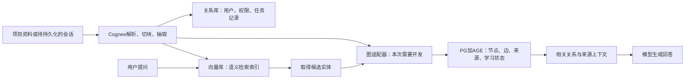
```mermaid
flowchart LR
    D[项目资料或待持久化的会话] --> C[Cognee解析、切块、抽取]
    C --> R[关系库：用户、权限、任务记录]
    C --> V[向量库：语义检索索引]
    C --> A[图适配器：本次需要开发]
    A --> G[PG加AGE：节点、边、来源、学习状态]
    Q[用户提问] --> V
    V --> N[取得候选实体]
    N --> A
    G --> X[相关关系与来源上下文]
    X --> L[模型生成回答]
```

图与向量通常通过通用唯一标识（**UUID**，用于稳定识别同一业务对象）关联。例如向量命中“张三”的UUID，图再用这个标识查他的项目关系。AGE自己的内部节点编号不能直接替代这个业务UUID。[模型转图][model-to-graph]、[节点索引][node-index]、[官方架构][cognee-architecture]。

上层调用图适配器的应用编程接口（**API**，代码之间约定的调用方式）。例如调用`get_neighborhood`取得邻域，再整理成回答上下文。新适配器只要保持输入、输出和业务行为，就能复用上层抽取和回答流程。[默认邻域检索][hybrid-neighbors]。

### 1.3 为什么不直接继续用普通PG

普通PG也能用两张表保存节点和边，现有`postgres_demo`适配器已经这样做；因此“PG没有图扩展就完全不能存图”不成立。问题在于接口缺口、图查询表达和实际执行成本。

AGE增加图模型和Cypher（描述节点、关系和路径的查询语言），适合把图操作集中在数据库侧表达。但它仍运行在PG之上，**不保证消除联表，也不保证比原方案更快**。第4章说明要测哪些成本。[普通PG适配器][pg-demo]。

**这一章的取舍：先把AGE当作有实现依据的候选后端，下一步确认能否部署；不要先假定它已完整兼容或性能必胜。**

## 2. 哪个版本可用：建议验证PG18＋AGE1.8，华为云要另过安装关

**本章结论：所核查的AGE版本都没有开箱即用的Cognee适配器。新开发优先以PG18＋AGE1.8做概念验证（PoC，用最小真实实验验证方案），因为它补充了写入分支和最短路能力；但华为云提供PG18，不等于托管实例能安装AGE。**

### 2.1 AGE与PG必须按对应发布包配套

| AGE版本 | 本轮核实的正式PG组合 | 相比新版需注意什么 |
|---|---|---|
| 1.6.0 | PG14、15、16、17，各有对应包 | 缺少新建/匹配后的条件赋值语法和新版专用最短路入口；不同PG分支还有差异 |
| 1.7.0 | PG17、18，各有对应包 | 仍缺上述条件赋值语法和新版专用最短路入口 |
| 1.8.0 | PG18 | 本报告建议验证的组合；仍不是完整Neo4j方言兼容 |
| 1.8.0的PG15条目 | 当日仍为预发布 | 不作为本报告正式交付基线 |

核验依据：[Apache发布目录][age-releases]、[PG17/1.6][age16-release]、[PG18/1.7][age17-release]、[PG18/1.8][age18-release]、[发布证据快照][release-snapshot]。部分正式标签名称仍带`rc0`，应结合发布身份判断，不能仅按名字推断。

### 2.2 哪些版本缺失会影响哪些流程

这里的结构化查询语言（**SQL**）是PG的查询语言；AGE允许从SQL调用图查询。以下“有”只指所列能力，不代表所有图查询都兼容。

| 能力或缺口 | AGE1.6 | AGE1.7 | AGE1.8/PG18 | 触发场景与影响 |
|---|---|---|---|---|
| 节点/边创建、匹配、普通匹配或创建、属性更新、批量输入、列表属性 | 有 | 有 | 有 | 可作为存储与查询基础；业务去重、来源和状态规则仍由适配器实现 |
| 新建时赋默认值、已存在时执行另一组更新：`ON CREATE / ON MATCH` | 缺 | 缺 | 有 | 重复导入要保住已学到的权重。旧版须另做事务分支；新版也不能自动判断哪些字段该保留 |
| 不带返回结果的子查询合并：`UNION`相关写法 | PG14～16缺；PG17分支有 | 有相应解析 | 有相应解析 | 主要影响使用该写法的自定义查询；固定写入模板可避开，不是所有查询合并都失效 |
| 专用无权最短路入口 | 未提供新版入口 | 未提供新版入口 | 有`age_shortest_path`等 | 旧版需另实现相关算法；普通一两跳邻域不以此为前提 |
| Neo4j原有最短路模式语法 | 不等价 | 不等价 | 仍不等价 | 自定义查询或自然语言生成的查询可能报错，必须改方言 |
| Neo4j多模型标签的原样表达 | 不能直接假定等价 | 不能直接假定等价 | 仍不能机械照搬多标签 | 要把类型映射为属性或标签集合，并一起修改类型筛选，详见第3章 |
| 行级安全（**RLS**，按规则限制哪些数据行可访问） | 缺少本轮确认的新版显式插入检查路径 | 有相关策略/角色测试 | 有相关实现/测试 | 普通操作通过不代表全部路径查询都已隔离安全；须独立验证，不能作为唯一租户隔离依据 |

证据：[1.6各分支源码矩阵][age16-evidence]、[1.7/1.8源码矩阵][age18-evidence]。1.8最短路按跳数，不能当作按权重选最低成本路径；当最少跳数参数`min_hops`大于实际最短距离、同时指定多种边类型时，所查实现明确报不支持，并非所有多类型查询都失败。逗号分隔值文件（**CSV**，一种表格文本格式）的AGE装载器会拒绝启用行级安全的目标表；选用这种批量捷径时需换受支持的写入路径，不能为导入直接关闭隔离。这两项应专项验证，不应泛化为普通问答都不可用。[路径限制代码][age-path-limit]、[权限/导入核查][age18-evidence]。

### 2.3 华为云：缺扩展不能用客户端协议补出来

华为云关系型数据库服务（**RDS**，厂商托管的数据库）公开版本表已列PG14～18；所核查的插件清单有pgvector（PG向量检索扩展），**未列AGE**。具体地域、实例小版本和可安装扩展仍需实例核验。[引擎版本][huawei-versions]、[插件清单][huawei-plugins]。

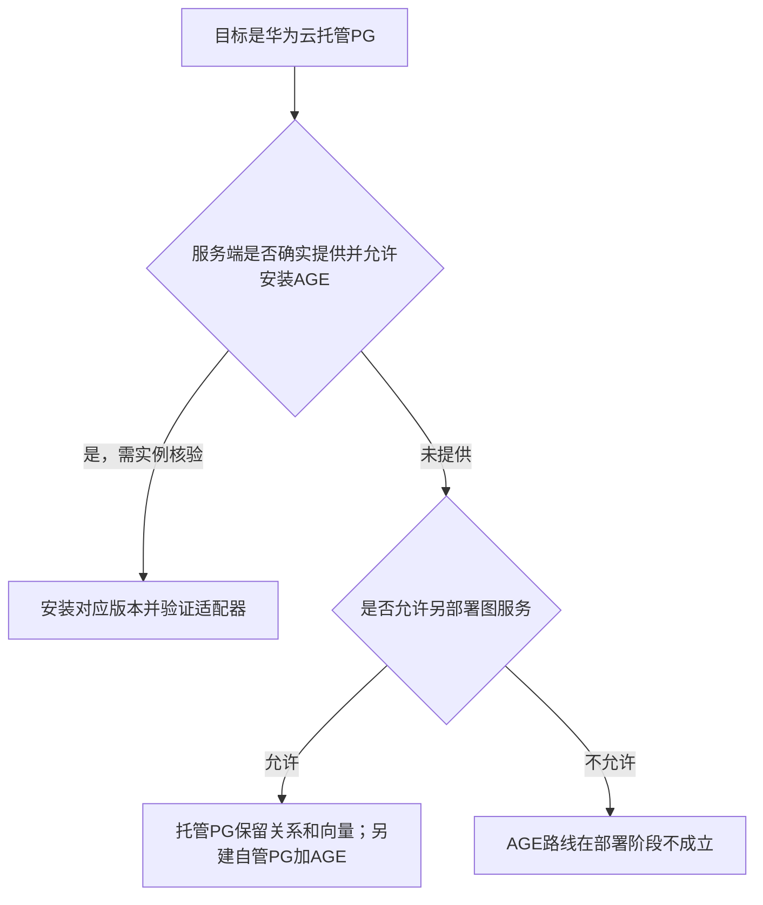
```mermaid
flowchart TD
    A[目标是华为云托管PG] --> B{服务端是否确实提供并允许安装AGE}
    B -->|是，需实例核验| C[安装对应版本并验证适配器]
    B -->|未提供| D{是否允许另部署图服务}
    D -->|允许| E[托管PG保留关系和向量；另建自管PG加AGE]
    D -->|不允许| F[AGE路线在部署阶段不成立]
```

AGE是服务器扩展，需要服务器上有对应安装包和权限。修改驱动、连接地址或网络协议，不能在缺少扩展的服务器里变出图能力。可选择弹性云服务器（**ECS**，可自行安装软件的云主机）或容器自管PG＋AGE，但这增加了部署、备份和维护责任。[AGE安装][age-install]。

只读核验可查询`pg_available_extensions`是否有`age`，以及`pg_extension`是否已安装；pgvector的扩展名是`vector`。本轮未连接用户实例，不把公开清单当成目标实例的实测结果。

**这一章的取舍：版本上优先验证PG18＋AGE1.8；部署上先确认服务端安装条件。若必须只用当前未开放AGE的标准托管实例，后续适配代码再完善也无法落地。**

## 3. 写入缺什么：三种写入行为、业务身份和来源一致性必须补齐

**本章结论：AGE能存节点和边，但不会自动执行Cognee的业务规则。正常入图前必须补齐分组、类型、关系、唯一性和来源维护；缺失时会导致写入失败，或更隐蔽的“成功但数据不对”。**

### 3.1 资料怎样进入图：Claude Code聊天也可能触发，但分两步

假设输入是“张三参与星河项目”，抽取结果最终识别出张三、星河及参与关系。下面是教学数据，不保证每次模型抽取都生成完全相同结果。

只连接Cognee的模型上下文协议（**MCP**，让Claude Code调用外部工具的协议）时，必须实际调用`remember`才写入；安装Cognee记忆插件后，则由事件钩子（hooks）自动采集。

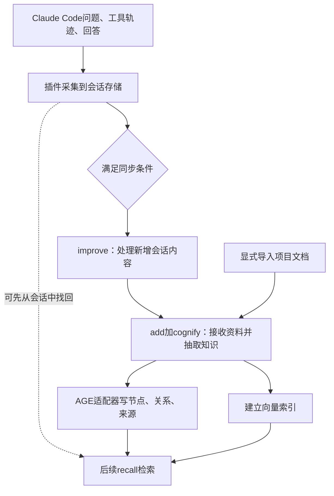
```mermaid
flowchart TD
    A[Claude Code问题、工具轨迹、回答] --> B[插件采集到会话存储]
    B --> C{满足同步条件}
    C --> D[improve：处理新增会话内容]
    D --> E[add加cognify：接收资料并抽取知识]
    F[显式导入项目文档] --> E
    E --> G[AGE适配器写节点、关系、来源]
    E --> V[建立向量索引]
    B -.可先从会话中找回.-> R[后续recall检索]
    G --> R
    V --> R
```

插件通过`/remember/entry`保存有类型的会话记录，不直接走字符串`remember`输入的自动构图分支；后续由插件同步触发`improve`。这里`remember`是保存入口，`cognify`负责构建知识图，`improve`负责持久化/提炼会话及其他学习阶段，`recall`是读取记忆。**会话保存成功不等于永久图已构建完成**：图写失败时会话仍可能存在，持久化水位不会按成功推进，后续可重试。[会话转图][session-cognify]。

插件1.6.1的自动同步默认是：每10秒检查，空闲60秒后尝试；每150个已存储工具/回答结束事件也可触发；自动触发共用1800秒冷却及新增记录检查；会话结束另有最终同步。它不是每分钟无条件重导全部聊天。采集受开关、过滤和后端可用性约束，也不等于扫描全部项目文件。[插件钩子][plugin-hooks]、[同步条件][plugin-sync]。

因此，即使用户没有手动点击“导入”，插件后续同步也会进入图写入阶段；**下面的写入缺口会在这个阶段暴露，而不是仅影响某个管理页面。**

### 3.2 APOC为什么必须替代：它参与了普通写入

**APOC（Neo4j的扩展函数与过程库）**在当前适配器中承担三项具体工作。AGE不提供这些同名调用，但可以用自己的写法实现结果；“必须改”指必须替代业务行为，不是重建整套APOC库。

假设同一数据集（dataset，一个有访问权限边界的知识空间）内有两份文档：A《项目启动》与B《运维交接》，都提到“张三参与星河”。假设上游已将张三、星河及两份文档中的这条关系映射为相同业务身份；名字相同本身不保证实体合并。

| APOC调用 | 输入与应该得到的结果 | 不改写会怎样 | 只删调用会怎样 | AGE怎么替代 |
|---|---|---|---|---|
| `apoc.coll.toSet` | 原分组`[项目启动]`加新分组`[运维交接]`，得到两者并集；重复输入不重复 | 节点写语句引用不存在的函数而失败，分组为空也不绕过该引用 | 直接覆盖会丢旧分组；仅拼接会重复；仅对本批去重会漏库内旧值 | 在并发控制下合并旧、新列表并去重 |
| `apoc.create.addLabels` | 张三标为`Entity`，文档标为`TextDocument`，使后续可按模型类型查找 | 同一节点写语句失败 | 按UUID能找到对象，按模型类型却漏查；文档子图和类型筛选可能不完整 | 用固定物理标签加类型属性/标签集合，并同步修改所有类型筛选 |
| `apoc.merge.relationship` | 已有“张三参与星河”则更新；没有则创建；“维护”应是另一种关系 | 非空批量边写入失败，知识关系未完整建立 | 跳过会缺边；无条件创建会重复；忽略类型会把参与和维护混在一起 | 按受控关系类型分组，用匹配或创建、属性更新及唯一性规则写入 |

依据：[节点写入][node-write]、[批量边写入][edge-write]。`toSet`只给分组列表去重，**不是识别两个“张三”是不是同一个人，也不是记录文档来源的账本**。模型标签`Entity`也不是“人物”这个语义类别，后者可通过类型节点表达。

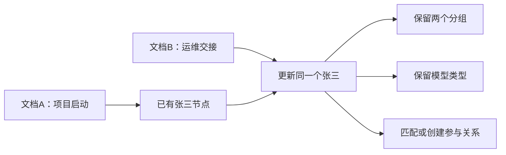
```mermaid
flowchart LR
    A[文档A：项目启动] --> O[已有张三节点]
    B[文档B：运维交接] --> U[更新同一个张三]
    O --> U
    U --> S[保留两个分组]
    U --> T[保留模型类型]
    U --> E[匹配或创建参与关系]
```

新适配器须同时完成写入和查询映射。例如把物理`Entity`标签改成`type=Entity`属性后，仍使用旧的标签查询就会漏数据；同一UUID是否允许积累多种模型类型，也必须明确，单个type值不自动等价于多标签。

**失败不是全部自动回滚。**当前顺序是图节点→节点向量→图边→边向量，分阶段执行。若节点已成功、边写失败，前面的数据可能已存在；框架尝试应用层补偿，但它不是跨所有存储的一次原子事务。仍能从旧图、会话或部分向量中回答，不证明这次导入成功。[写入顺序][storage-order]、[错误与补偿][pipeline-errors]。

也不应夸大为所有操作都失败：单条边写入已有普通匹配或创建实现，普通节点删除也不用这三项APOC。结论限定为**当前常规节点/批量边写入必须有等价实现**。[单边写入][single-edge]。

### 3.3 为什么有节点主键，还需要业务唯一性

AGE的内部节点编号解决“物理记录各不相同”；Cognee的UUID解决“重复导入的张三应是同一个业务对象”。如果两个请求同时创建相同UUID，却各得一个内部编号，底层记录仍合法，业务上却已经重复。

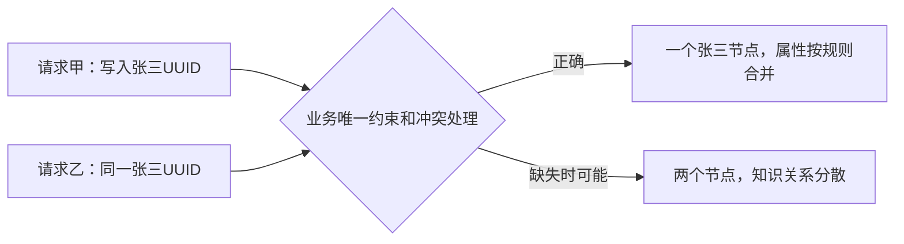
```mermaid
flowchart LR
    A[请求甲：写入张三UUID] --> C{业务唯一约束和冲突处理}
    B[请求乙：同一张三UUID] --> C
    C -->|正确| D[一个张三节点，属性按规则合并]
    C -->|缺失时可能| E[两个节点，知识关系分散]
```

因此要设计并验证业务UUID索引、边的稳定身份、并发冲突重试。不能假定父标签上的唯一索引自动覆盖所有继承标签；约束必须覆盖模型实际存储范围。边身份至少区分起点、关系类型和终点；同端点“参与”和“维护”不能误合并。单条`MERGE`（匹配已有对象，否则创建）成功不等于所有并发都已唯一。[身份及索引依据][age18-evidence]、[业务写入合同][graph-interface]。

### 3.4 来源维护：删除A，为什么必须保留B的知识

分组表达“属于哪些内容集合”，来源表达“由哪些输入支持”，学习状态表达“后来学到了什么”。三者必须分开保存。

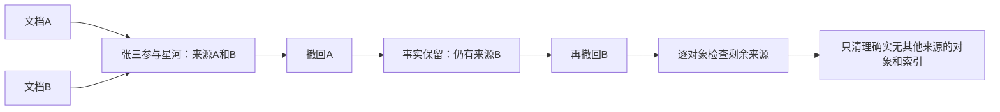
```mermaid
flowchart LR
    A[文档A] --> F[张三参与星河：来源A和B]
    B[文档B] --> F
    F --> D[撤回A]
    D --> K[事实保留：仍有来源B]
    K --> L[再撤回B]
    L --> J[逐对象检查剩余来源]
    J --> N[只清理确实无其他来源的对象和索引]
```

若简单执行“删除张三节点”，B支持的事实也会消失；若只删图而不正确清理向量，可能留下仍能召回的残留。节点还可能被文档C引用，所以删最后一条边来源也不等于整个人物都能删除。

现有删除规划会区分存活与无主对象，清理应删向量，只给存活对象移除目标来源，再删除无主图对象；无主对象在真正删除前保留来源信息，方便失败后找回重试。新适配器需要实现15项来源/元数据方法，复用该规划，而不是另写一个粗暴删节点流程。[来源删除规划][delete-planner]。

并发也要验证：甲读到来源`[B]`准备追加为`[A,B]`，乙同时读到`[B]`准备撤回为`[]`；若乙最后覆盖，会丢A。问题是读、修改、写入没有被完整协调，不是AGE不会存列表。需用事务、锁或条件更新保护整组业务动作；图与向量跨连接的补偿仍要保留。

**这一章的交付门槛：重复写不重复、分组不丢、类型可查、关系完整、删除A不伤及B、失败可重试。任何一项没完成，都不能声称正常入图已经可靠；这些优先于图统计。**

## 4. 检索和学习缺什么：图查询原语还要变成正确的业务结果

**本章结论：AGE已有邻域、路径和属性更新基础；需要开发结果转换和状态规则。最短路语法、学习接口和性能是三个独立问题，不能用“支持Cypher”一笔带过。**

### 4.1 查询能跑，为什么还可能漏知识

用户问“星河项目有哪些参与者”，默认混合检索先用向量找候选，再取候选附近的关系。这里不要求运行全图算法，但要求返回正确的节点集合、边方向和过滤结果。

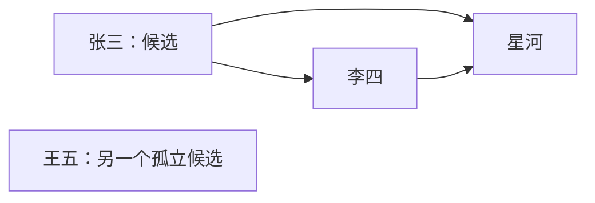
```mermaid
flowchart LR
    Z[张三：候选] --> X[星河]
    Z --> L[李四]
    L --> X
    W[王五：另一个孤立候选]
```

若结果只收集从张三出发的某条路径，可能漏掉节点集合中已有的“李四→星河”边；若只从边反推节点，孤立候选王五可能消失。Cognee需要的是符合范围的节点及节点间相关边，不是任意一个路径列表。[图读取合同][graph-interface]、[子图消费][cognee-graph]。

AGE适配器须处理：候选节点保留、指定深度、方向、关系类型、内容分组筛选、分页和稳定UUID返回。缺失时用户看到的是漏检、错误上下文或读全图造成的延迟，不只是某个统计数字缺失。

### 4.2 学习与时间功能：分别在哪个操作暴露缺口

| 用户行为或流程 | 需要适配什么 | 不支持时的具体影响 | 必须怎样处理 |
|---|---|---|---|
| 用户反馈“这条回答不好”，后续`improve`应用反馈 | 节点/具体边权重的4个读写方法 | 该图权重学习阶段被能力检查跳过或报告错误；会话里的反馈文本不因此消失 | 实现权重读写与完整读算写并发规则，不能只把能力标志改为真 |
| 显式启用`truth`学习阶段 | 经验对齐坐标和对应版本的2个方法 | 无法提供这套可选重排信号；普通基础检索仍可运行 | 先写新版本坐标，再发布对应质心；读取只采用当前生效版本的坐标，逐项写入结果须真实；它不是事实真伪鉴定 |
| 给旧事实写失效时间 | 通用`update_node`局部更新 | 旧事实没有按要求标记失效 | 只更新指定字段，保留其他状态；缺失时要明确失败 |
| 重新导入已有实体 | 保留或明确重置学习状态 | 输入默认权重0.5可能覆盖已经学到的0.9 | 区分新建默认值、普通更新、显式重置。AGE1.8语法只能帮忙分支，不能替你决定规则 |
| 时间检索“张三上周参与什么” | `collect_time_ids`、`collect_events`两个额外方法 | 时间检索不能只因保存了时间属性就成立 | 按当前毫秒时间、区间边界和事件邻域合同实现 |

依据：[反馈能力检查][capabilities]、[权重更新][feedback-task]、[事实关闭][close-node]、[时间检索调用][temporal]。

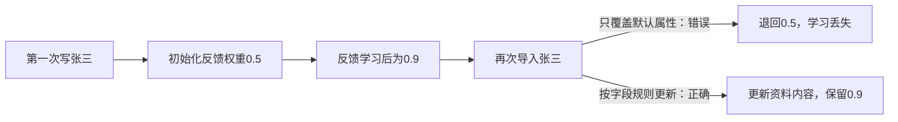
```mermaid
flowchart LR
    A[第一次写张三] --> B[初始化反馈权重0.5]
    B --> C[反馈学习后为0.9]
    C --> D[再次导入张三]
    D -->|只覆盖默认属性：错误| E[退回0.5，学习丢失]
    D -->|按字段规则更新：正确| F[更新资料内容，保留0.9]
```

现有普通PG图适配器的“部分支持”主要指缺少上述4个反馈方法、2个truth方法和通用局部更新；不是PG存不了数值，也不是整个`improve`都不可用。会话持久化、经验蒸馏和默认三元组索引等仍有实现路径。AGE适配器要逐项实现和声明，不能照搬一个笼统的“支持improve”。九阶段清单见文末。

### 4.3 最短路与自定义查询：不能承诺原样兼容

假设张三直达赵六是1跳但费用100，经李四是2跳、费用2。AGE1.8所核查的专用最短路按跳数选1跳，不能当作按费用选2跳的算法。

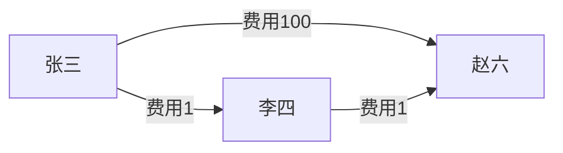
```mermaid
flowchart LR
    Z[张三] -->|费用100| Q[赵六]
    Z -->|费用1| L[李四]
    L -->|费用1| Q
```

这不构成当前普通邻域问答的硬缺口；当前Cognee相关全图距离统计也没有配置权重。但是用户显式提交Neo4j原始查询、或自然语言生成器仍生成Neo4j语法时，会碰到方言不兼容。应先限制公开查询范围，再改生成提示、参数和结果协议，不承诺任意查询可迁移。[AGE最短路实现][age-path-code]、[自然语言查询入口][nl-retriever]。

### 4.4 AGE能否解决联表慢：可能改善表达，性能收益待测

固定跳图匹配仍会转换成PG内部查询，仍可能使用联表（JOIN，把关联记录组合起来）；变长路径展开（**VLE**，沿关系扩展不同长度路径）有专门实现，但仍受扇出、深度、冷缓存和数据量影响。[查询转换][age-transform]、[路径实现][age-path-code]。

“从张三找两跳关系”和“从高连接度节点找十跳所有路径”不是同一负载。第二种即使没有手写复杂SQL，也可能产生大量中间结果。不能把AGE当成消除关系运算或自动提速的开关。

100用户同样要区分100个独立图与一个共享热点图。连接池、图缓存和同图写冲突都要测；AGE也不自动把一个图分布到多台机器。验证至少记录第95百分位响应时间（**P95**，即95%的请求在该时间内完成）、错误率、内存、冷热差异和写入等待，并把数据库、向量检索、模型调用分别计时。

**这一章的交付门槛：检索结果与参考后端一致，学习不会被重导覆盖，未支持的查询明确限制；性能结论只根据目标数据和负载实验给出。**

## 5. 统计缺什么：不支持GDS不等于不能记忆，要看谁调用了统计

**本章结论：GDS（Graph Data Science，Neo4j图数据科学库）在本次核查中用于图统计。普通Claude Code会话采集、检索和默认同步不会固定调用它。缺少统计实现时，管理脚本可能看到假的0节点/0边；默认召回不读取这个0来判断空库，因此不会仅因这次统计失败就失去记忆。应把计数、连通性和昂贵指标分成三档交付。**

### 5.1 两条调用路径，影响的人不同

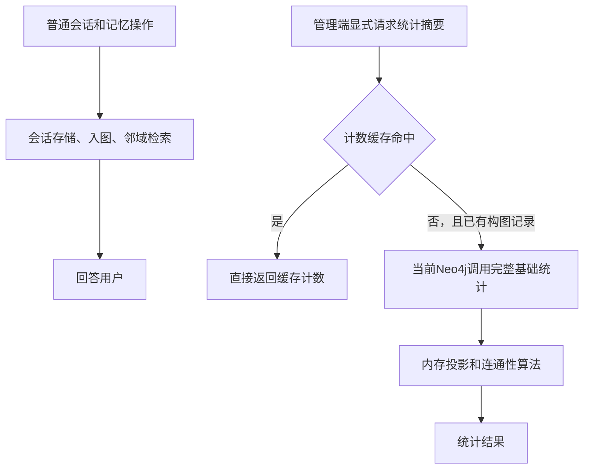
```mermaid
flowchart TD
    A[普通会话和记忆操作] --> B[会话存储、入图、邻域检索]
    B --> C[回答用户]
    D[管理端显式请求统计摘要] --> E{计数缓存命中}
    E -->|是| F[直接返回缓存计数]
    E -->|否，且已有构图记录| G[当前Neo4j调用完整基础统计]
    G --> H[内存投影和连通性算法]
    H --> I[统计结果]
```

当前Claude插件没有默认请求图统计摘要；状态栏刷新是本地渲染。当前MCP的空检索诊断也已移除旧的图摘要探测，不能把“找到3条记忆”的结果计数当成全图统计。本文的管理端场景，指你另外接入统计API的页面、监控脚本或程序。[插件状态栏][plugin-statusline]、[MCP测试][mcp-summary-test]。

| 触发入口 | 何时真正计算 | 不支持相关统计时的影响 |
|---|---|---|
| 普通`recall`、会话保存、默认`improve` | 正常内置链路不调用这七项GDS过程 | 不因GDS缺失本身失效；写入和检索适配仍须正确 |
| `/datasets/graph-summary`、`/visualize/brains-summary` | 主动请求，已有对应构图记录且统计缓存未命中 | 可能触发下面的零计数回退 |
| 显式`get_graph_metrics(False)` | `False`表示不计算可选指标，仍进入基础统计 | 仍需要内存投影与连通性计算；关闭可选项不等于关闭GDS |
| 显式`get_graph_metrics(True)` | `True`表示基础统计后追加可选算法 | 最短路径或聚类缺失也可能使整次完整统计失败 |
| 显式`get_pipeline_run_metrics(...)` | 完整统计缓存未命中时 | 影响此次指标获取；没有证据表明每次构图都会自动调用它 |

依据：[摘要缓存与计算][counts]、[完整指标缓存][pipeline-metrics]、[Neo4j统计顺序][neo-metrics]。并发缓存未命中可能重复计算，不保证严格每次构图只计算一次。

### 5.2 七种GDS调用分别干什么，不支持会失去什么

弱连通分量（**WCC**，忽略箭头后彼此能到达的一组节点）用来判断知识图分成多少个互不连通的部分。GDS内存投影则是算法使用的计算副本，不是另一个用户知识库。[官方投影说明][gds-projection]。

| GDS调用 | 什么时候调用 | 直接用途 | 缺失后果及替代方式 |
|---|---|---|---|
| `gds.graph.list` | 基础统计准备 | 检查旧内存投影是否存在 | 原流程准备失败；AGE新算法可不使用这个目录机制 |
| `gds.graph.drop` | 旧投影存在时 | 删除旧计算副本 | 原统计可能失败；不是持久图删除失败，替代时只清理临时状态 |
| `gds.graph.project` | 建立本次统计输入 | 生成算法使用的内存图 | 原算法没输入；AGE可直接查询或完整导出目标拓扑 |
| `gds.wcc.stats` | 基础统计，`False`也调用 | 算连通分量数量 | 无法得知有几个知识团体；需实现等价算法或不开放该指标 |
| `gds.wcc.stream` | 同上 | 聚合每个分量的大小 | 无法得知各团体大小；可与上一项一次遍历计算 |
| `gds.allShortestPaths.stream` | 仅`True` | 获取全图点对距离，再算直径/平均距离 | 缺相应指标，不等于普通邻域检索失败；单独选配 |
| `gds.localClusteringCoefficient.stats` | 仅`True` | 算邻居之间连接紧密程度 | 缺平均聚类系数，不等于反馈权重或答案评分失效；单独选配 |

其中前三项是旧算法的准备设施，不是必须复制给AGE的用户功能。后四项才对应具体分析结果。[算法调用代码][neo-metric-utils]。

继续用项目资料画一张仅含六个业务实体的教学图；真实Cognee图还有文档、片段、类型等节点，实际指标不应直接照抄这里的数字。

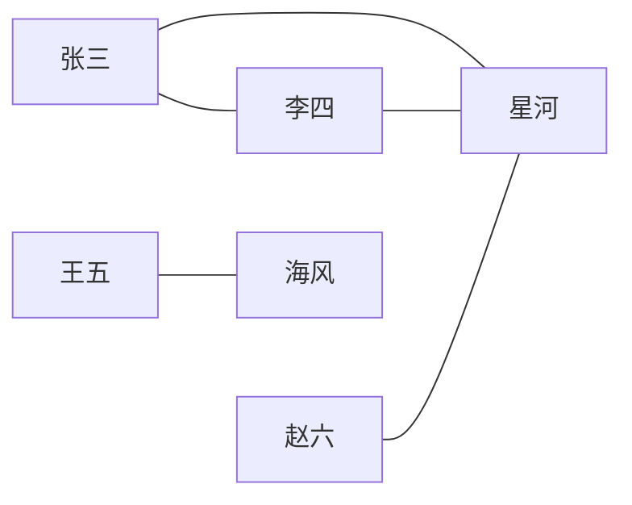
```mermaid
flowchart LR
    Z[张三] --- L[李四]
    Z --- X[星河]
    L --- X
    Q[赵六] --- X
    W[王五] --- H[海风]
```

- **连通性例子：**这里有两个团体，大小分别为4和2。缺WCC就不能提供这两个结构指标，但仍能查到“王五与海风相连”。
- **距离例子：**张三到赵六最少2步。全图平均距离却要考虑所有点对；张三到王五不可达，必须明确如何处理，不能简单把它当0。AGE的一次两点最短路调用不等于完成全图统计。
- **聚类例子：**张三的两个邻居李四和星河也相连，构成三角形；赵六只有一个邻居，局部结构不同。聚类衡量这种连接结构，不是判断“张三参与星河”是真是假。

### 5.3 统计失败到底影响什么：管理页面可以错，记忆仍然在

**明确结论：仅缺GDS或统计实现，不会让默认recall把“统计返回0”当成“知识库为空”。当前默认召回有自己的图读取路径。**真正的问题是管理者误判知识规模、统计客户端可能据此作出错误决策；并发重算还可能争抢数据库资源。这三种影响必须分开。

假设资料已经成功导入，图里有“张三→参与→星河”。你另写一个管理脚本调用`/datasets/graph-summary`：

1. 统计缓存未命中，现有计数代码调用完整基础metrics，顺带计算连通性。
2. 如果metrics抛异常，计数层捕获后返回`0节点、0边、computed_at=None`，且不写成功缓存。
3. 管理脚本若只显示两个数字，会误报“没有知识”。若你又自行编写“计数为0就重新导入”的逻辑，就可能反复重导；这是该自定义逻辑的后果，不是Cognee默认会删图或重导。
4. 随后用户普通提问“张三参与哪个项目”，recall不会去读上述统计0。它自己检查图是否为空，再查向量和邻域；这些方法正常时，仍可取回星河关系并回答。

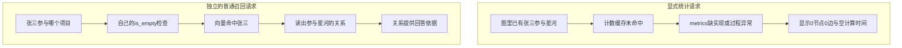
```mermaid
flowchart TB
    subgraph S[显式统计请求]
        A[图里已有张三参与星河] --> B[计数缓存未命中]
        B --> C[metrics缺实现或过程异常]
        C --> D[显示0节点0边与空计算时间]
    end
    subgraph R[独立的普通召回请求]
        Q[张三参与哪个项目] --> E[自己的is_empty检查]
        E --> V[向量命中张三]
        V --> N[读出参与星河的关系]
        N --> O[关系提供回答依据]
    end
```

图中两条链没有“统计0传给recall”的箭头，因为默认代码没有这条依赖。[计数异常处理][counts]、[HYBRID入口][map-hybrid-entry]。上例说明程序路径，不是本轮执行模型后保证生成的逐字答案。

| 故障情形 | 具体可见后果 | 对召回的影响 |
|---|---|---|
| 只有metrics抛异常，普通图读正常 | 计数0/0、计算时间为空，不缓存成功值 | **无默认直接影响**；知识未被删除 |
| 适配器吞掉错误并返回零值字典 | 上层可能把假零当成功值缓存，持续展示错误规模 | 仍不是recall空图依据；应修错误合同 |
| 关系库读取构图记录/统计缓存本身失败 | 摘要路由可能返回409错误，不一定得到0/0 | 需按共享基础故障另查，不能全称为GDS失败 |
| 整个图数据库断连 | recall自己的`is_empty`或读取同样可能失败 | **会影响当前召回**，共同原因是数据库不可用 |
| 多个脚本同时做冷统计、与召回共用资源 | 可能增加连接等待、处理器/内存/磁盘压力 | **可能拖慢或超时**；本轮未压测，不能给出固定降速比例 |

**AGE改法：**计数走准确的轻量路径，失败返回明确“不可用”；WCC独立计算。若新增轻量接口/状态字段，要一起改`get_datasets_graph_counts.py`、两个摘要路由的响应/消费合同及缓存，不能只在adapter里填0。缓存失效还要覆盖实际写图路径：`improve`的全局索引通过`memify`写图，因此不能只以“有无新cognify记录”概括所有变更。[摘要路由][map-summary-route]、[全局索引写入][map-global-persist]。

### 5.4 三种“摘要”不是一回事：只有其中两种参与回答上下文

**统计摘要是在数知识；语义摘要是在总结知识。GDS缺失影响前者，不自动影响后两者。**

| 名称 | 实际内容/触发 | 缺失时的具体影响 |
|---|---|---|
| `graph-summary / brains-summary` | 主动请求图的节点数、边数、计算时间 | 看板规模不可信/不可用；默认recall不以它为输入 |
| `GRAPH_SUMMARY_COMPLETION` | 用户选此检索模式后，把已检索关系交模型归纳成回答 | 关系检索或模型归纳失败会影响**本次摘要回答**；不依赖上述GDS统计 |
| `global_context_index` | 显式启用improve第9阶段，生成层次语义摘要节点、`summarized_in`边和摘要向量 | 更新失败可能留下旧摘要或缺新摘要；**另开启全局摘要增强的后续召回**可能少一段宏观背景 |

例如有20份星河会议记录，用户问“总体延期风险有哪些”。全局语义索引成功时，可以额外提供跨文档的综合摘要；更新失败时，开启该增强的请求可能只看到旧背景或没有新背景，仍可使用原有片段/实体证据。检索端`include_global_context_index`默认False，必须另开启；不能说每个用户每次问答都依赖第9阶段。第9阶段用图分桶也不等于调用GDS连通性算法。[文本摘要模式][map-summary-completion]、[第9阶段][map-global-stage]、[摘要消费开关][map-global-retrieval]。

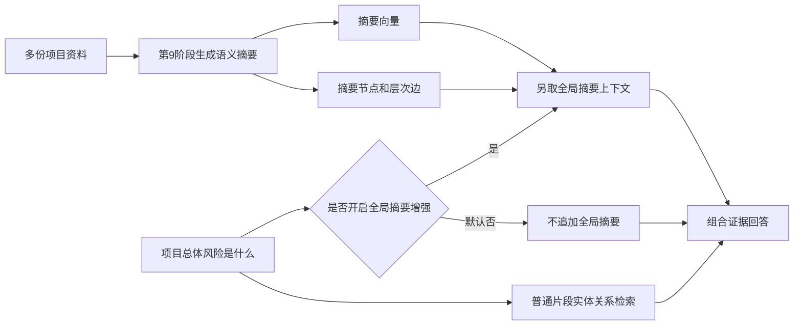
```mermaid
flowchart LR
    D[多份项目资料] --> I[第9阶段生成语义摘要]
    I --> G[摘要节点和层次边]
    I --> V[摘要向量]
    Q[项目总体风险是什么] --> R[普通片段实体关系检索]
    Q --> K{是否开启全局摘要增强}
    K -->|默认否| Y[不追加全局摘要]
    K -->|是| X[另取全局摘要上下文]
    G --> X
    V --> X
    X --> A[组合证据回答]
    R --> A
    Y --> A
```

这条语义链没有metrics或GDS。不能把“数字看板失败”“普通关系读取失败”“语义摘要生成失败”合并写成一个模糊的“摘要失败”。

### 5.5 统计的交付顺序

| 交付目标 | 必须做什么 | 可以暂缓什么 |
|---|---|---|
| 先提供普通记忆服务 | 完成图写、图读、来源与启用的学习合同 | 不启用的摘要和结构统计可以暂缓 |
| 显示知识库规模 | 准确节点/边计数，失败与真实空图区分 | 解耦后可以暂缓WCC |
| 提供连通性分析 | 正确WCC数量和大小、范围与资源限制 | 全点对距离和聚类仍可暂缓 |
| 提供完整结构分析 | 再实现距离和聚类、明确不可达点口径并压测 | 不承诺任意规模无限制精确计算 |

**这一章的判断：缺GDS不是AGE替代的统一阻断项；缺的是某项统计结果，就限制该项功能。只有当前耦合造成的假零和错误传播，必须在启用摘要前处理。**

## 6. 怎么开发、多少工作量：先验证底层，再按业务交付

**本章结论：主要开发在Cognee适配层及相关业务协调，当前没有证据表明本范围必须修改AGE内核。按本次完整接口台账，主交付暂留153.5～319 Agent小时；基础图已完成时，improve的专属增量为16.5～33小时。两者不是相加关系，均须首轮真实AGE验证后校准。**

### 6.1 改造总览：8个模块、47项公共方法及额外协议

**改造主体是新增AGE适配器；真正需要修改现有上层代码的重点是接入注册、跨进程操作协调、统计摘要消费者，以及选配的自然语言查询。**原有文档抽取、会话、向量、回答和九阶段编排尽量复用。下面的路径标注“拟新增”表示设计方案，不表示仓库已经有AGE实现。

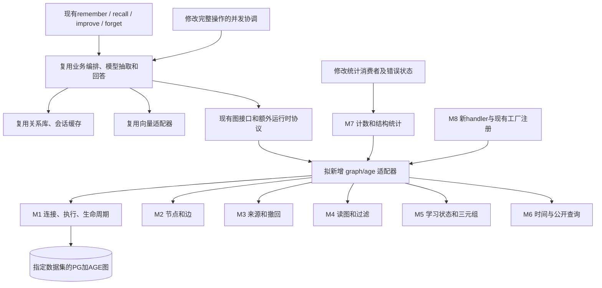
```mermaid
flowchart TD
    U[现有remember / recall / improve / forget] --> O[复用业务编排、模型抽取和回答]
    O --> R[复用关系库、会话缓存]
    O --> V[复用向量适配器]
    O --> I[现有图接口和额外运行时协议]
    I --> A[拟新增 graph/age 适配器]
    A --> M1[M1 连接、执行、生命周期]
    A --> M2[M2 节点和边]
    A --> M3[M3 来源和撤回]
    A --> M4[M4 读图和过滤]
    A --> M5[M5 学习状态和三元组]
    A --> M6[M6 时间与公开查询]
    S[修改统计消费者及错误状态] --> M7[M7 计数和结构统计]
    M7 --> A
    H[M8 新handler与现有工厂注册] --> A
    K[修改完整操作的并发协调] --> O
    M1 --> P[(指定数据集的PG加AGE图)]
```

先把适配器理解为“翻译员”：上层说“撤回资料A，但保留B共同支撑的关系”，它不能只翻译成一句DELETE；还必须知道同一事实是谁、还有谁支撑、哪些状态不能覆盖。图引擎负责存储和查询，翻译员负责遵守Cognee的业务约定。

下表对47个公共方法作**无重复分类**；方法的逐项输入、失败后果和预算仍在附录B。接口外的15项方法/钩子、3个数据集处理器方法及能力开关另列，不藏在47这个数字里。

| 模块 | 47项公共方法如何归类 | 新增或修改位置 | 哪个流程触发；缺失的直接影响 |
|---|---|---|---|
| M1 连接与执行 | 3项：`query/is_empty/delete_graph` | 拟新增`graph/age/adapter.py、driver.py、codec.py`；工厂参数映射 | 所有图操作；连库失败或空图误判可直接阻止当前检索 |
| M2 节点与关系 | 10项：单/批节点增删读6项、单/批边写2项、存在判断2项 | 拟新增`age/crud.py`，共享`schema.py` | 导入和重导；点边不完整会让后续召回少知识 |
| M3 来源与增量 | 17项：来源15项、分组标签移除、片段位置更新 | 拟新增`age/provenance.py`，复用删除规划器 | 更新、删除、失败撤回；误删共享事实会破坏后续召回 |
| M4 图读取 | 8项：全图、边、邻居、连接、邻域、NodeSet子图、属性过滤、高度种子 | 拟新增`age/reads.py` | 提问/图展示；漏边会让关系上下文不完整 |
| M5 学习状态 | 8项：反馈4项、truth2项、局部更新、三元组分页 | 拟新增`age/state.py`及分页读；复用improve编排 | 反馈学习、事实关闭、关系索引；后续排序或有效期未按预期更新 |
| M6 时间和公开查询 | 0项新增公共方法；使用M1的`query`，另有Temporal两个方法等协议 | 新增时间方法；选配修改自然语言retriever及提示 | 仅所选模式；时间接口缺失或方言不兼容影响该模式 |
| M7 统计 | 1项：`get_graph_metrics` | 拟新增`age/metrics.py`；修改计数消费者/返回状态/缓存 | 显式统计；错误可显示假0，默认召回不依赖该0 |
| M8 接入和数据集 | 0项公共方法；另有handler3项、初始化/关闭和能力声明 | 拟新增`AGEDatasetDatabaseHandler.py`；注册provider与handler | 首建、授权共享、解析、清理；错路由会查空图或串数据 |
| **合计** | **3＋10＋17＋8＋8＋0＋1＋0＝47** | 共用连接、编码、索引及事务框架 | 完整操作协调是横跨各模块的工作，不重复收费 |

这里`graph/`的完整前缀是`cognee/infrastructure/databases/graph/`；`age/`在其下。注册接点包括`graph/use_graph_adapter.py`、`graph/get_graph_engine.py`、`dataset_database_handler/use_dataset_database_handler.py`。数据集处理器负责“这个用户访问的这个数据集，到底落在哪个图”。现有工厂给注册适配器传URL、用户、密码、端口、key、name，不直接传host/schema；须明确PG数据库名和AGE图名，不能仅填一条地址就假定接通。[工厂源码][map-factory]、[处理器合同][map-handler]。

八个模块是组织代码的建议，不要求一个方法对应一个文件。下面每节先解释影响，再列改动和可验收例子；局部成本与附录B同一总账，不能把本章和附录的数字再加一次。

### 6.2 M1：连接、查询执行和生命周期

**结论：这是全流程共同底座；没接通时与“只缺统计”不同，正常检索也可能直接失败。**

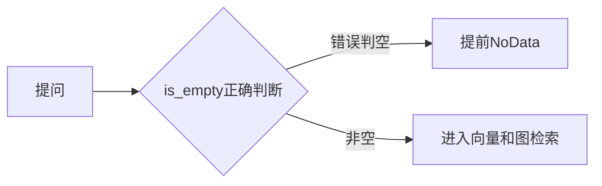
```mermaid
flowchart LR
    Q[提问] --> E{is_empty正确判断}
    E -->|错误判空| F[提前NoData]
    E -->|非空| R[进入向量和图检索]
```

- 拟新增：`cognee/infrastructure/databases/graph/age/adapter.py`、`driver.py`、`codec.py`。负责PG连接、AGE会话环境、参数、agtype解码和错误传播。文件拆分是建议。
- 修改/接入：现有 `graph/get_graph_engine.py:347–354` 的注册式构造路径，或用其支持的参数明确连接字符串；该路径未传host/schema，必须分清PG数据库名与AGE图名。
- 复用：GraphDBInterface、引擎handle与关闭缓存。工厂按存在性调用`initialize`；缓存按存在性调用`close`。
- 47台账：`query`、`is_empty`、`delete_graph`。接口外：`initialize`、`close`。公开query兼容性由M6另验，不因内部执行器存在就自动开放。
- 具体例子：图中已存“张三参与星河”，用户提问。若is_empty错误回True，HYBRID直接抛NoData；若连接坏导致is_empty抛错，这条检索请求没有进入邻域降级分支。若仅metrics缺失，is_empty正常则不是同一种故障。
- 断言：孤点图不为空；query返回业务dict/tuple而非数据库原生对象；关闭与清图区分；一个dataset清图不影响另一图。

[工厂传参][map-factory]、[初始化][map-init]、[缓存关闭][map-close]、[HYBRID空图门禁][map-hybrid-entry]。

**成本边界：**本模块3项公共方法的局部实现为3～6 Agent小时；连接/编解码6～12小时另属共享底座。不是仅用3～6小时即可接通生产系统。

### 6.3 M2：节点与关系存储：普通入图必需

**结论：AGE有读写原语，但APOC三项对应的业务行为必须重新实现；漏了会影响新知识进入永久记忆。**

```mermaid
flowchart LR
    D[李四维护星河] --> N[写节点和节点向量]
    N --> E[写维护边]
    E -->|失败| F[新关系未入图]
    F --> Q[后续可能漏答李四]
```

- 拟新增：`age/crud.py`、与M1共享的`codec.py`、M8管理的`schema.py`。路径可调整，职责要固定。
- 复用：`tasks/storage/add_data_points.py`、模型转图及向量索引；上层仍按图节点→节点向量→图边→边向量调用。若输入/输出合同保持，通常不重写摄入pipeline。
- 47台账10项：`add_node/add_nodes/get_node/get_nodes/delete_node/delete_nodes/add_edge/add_edges/has_edge/has_edges`。
- 实现：业务UUID唯一、方向＋关系名＋端点确定边身份、分组并集、类型映射、属性更新规则；缺任一端点跳过边，不能暗建空端点；来源同写见M3。
- 例子：新增资料“李四维护星河”。批量边写失败可能留下李四节点和节点向量，但没有维护边。下一次问“谁维护星河”，图证据缺失；模型仍可能从已存片段或会话答出，也可能漏答，不能承诺一定HTTP（客户端与服务端传递请求/响应的协议）报错或一定完全答不出来。旧资料“张三参与星河”不因这次写失败自动消失。
- 对召回：主要是**后续新增知识缺失/不完整**；它比统计看板不可用更靠近记忆正确性。默认入图前必须验，不能挪到统计选配。

[实际写入顺序][map-storage]、[APOC节点实现][map-node-write]、[APOC批边实现][map-edge-write]。

**成本边界：**本模块10项方法局部实现9～18 Agent小时；业务身份/索引/冲突框架4～8小时单列，来源复用M3。

### 6.4 M3：来源、撤回与增量更新

**结论：这一模块保证“删资料A，不毁掉资料B”；错误会改变后续可召回的数据，不能只当管理功能。**

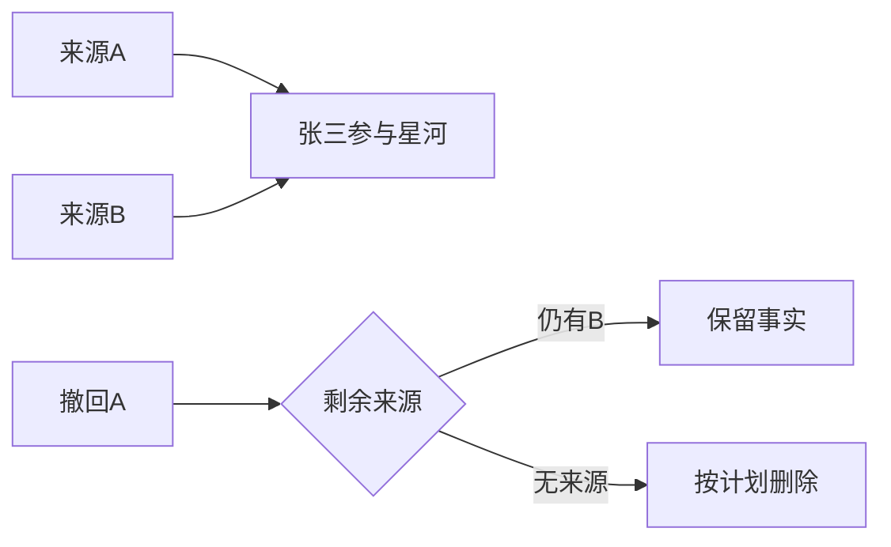
```mermaid
flowchart LR
    A[来源A] --> E[张三参与星河]
    B[来源B] --> E
    X[撤回A] --> C{剩余来源}
    C -->|仍有B| K[保留事实]
    C -->|无来源| D[按计划删除]
```

- 拟新增：`age/provenance.py`，与CRUD共享事务/锁，不用新增另一套普通PG图副本。
- 复用：`infrastructure/databases/unified/provenance_delete_planner.py`、rollback调度、`api/v1/update/incremental.py`；如现跨进程操作协调不覆盖目标部署，需修改协调接点，不能靠单个setter事务替代完整读改写。
- 47台账17项：attach/remove node/edge source refs四项；delete_edge_triples/get_node_delete_data/get_edge_delete_data三项；按source_ref/dataset/run定位六项；set/get_graph_metadata两项；remove_belongs_to_set_tags/update_chunk_index两项。
- 接口外按承诺范围：旧数据get_document_subgraph/get_degree_one_nodes；旧清理Task的前驱/后继/不连通接口不是默认必需。未迁移旧来源状态不能默默当“无图数据”。
- 例子：A、B都证明张三参与星河。删除A时若直接删张三，下一次依据B提问也找不到该图事实；若只漏删向量，查询又可能捞到已撤回内容。这是**后续召回正确性**问题，不是GDS统计问题。
- 断言：共享来源并发追加/撤回、run失败补偿、retained chunk只改位置、重复撤回幂等；旧图删除和新来源图分开验。

[删除规划][map-delete-plan]、[旧删除选择][map-legacy-select]、[来源接口][map-graph-interface]。

**成本边界：**17项方法16～30 Agent小时；来源物理索引与专项故障验证另5～10小时，完整操作协调另6～12小时并由各模块共享。

### 6.5 M4：图读取、过滤和可视化选点

**结论：这是最直接影响当前图上下文的模块，但具体失败结果由调用方决定，不能一律写“recall失败”。**

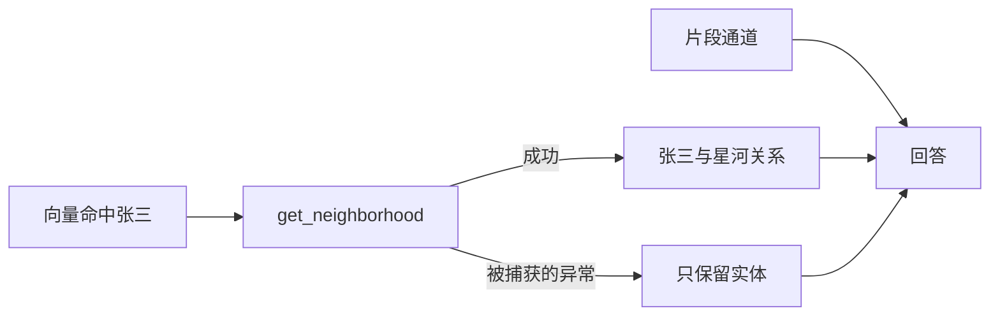
```mermaid
flowchart LR
    V[向量命中张三] --> N[get_neighborhood]
    N -->|成功| E[张三与星河关系]
    N -->|被捕获的异常| F[只保留实体]
    C[片段通道] --> A[回答]
    E --> A
    F --> A
```

- 拟新增：`age/reads.py`，共享UUID索引、类型映射和节点/边解码。
- 复用：HYBRID实体检索通道、CogneeGraph、词法/代码检索和图展示。需要改变空命中全图fallback时，才修改CogneeGraph对应接点。
- 47台账8项：`get_graph_data/get_edges/get_neighbors/get_connections/get_neighborhood/get_nodeset_subgraph/get_filtered_graph_data/get_top_degree_node_ids`。
- 接口外：`get_id_filtered_graph_data`、可选优化`get_nodes_by_type`；顶层公共get_top_degree允许近似seed，不要求全图精确排名。
- 例子：用户问“张三参与哪个项目”，向量已命中张三。HYBRID调用get_neighborhood失败时，`hybrid/entities.py:59–67`捕获异常，返回实体、不附边；片段通道仍并行存在。因此此处可见结果是**关系上下文降级**，不保证整次请求报错。若读成功却漏掉“李四→星河”这条集合内边，模型得到的上下文可能不完整。
- 另一例：想只查运维NodeSet却忽略过滤，可能带入其他分组；不是“多一点无害数据”，尤其涉及权限与约定范围时需要严格验证。
- 断言：孤seed、深度0/1/多跳、环、自环、方向、诱导边、NodeSet并集/交集、实际属性过滤结构；方法shape各自准确；避免为10个seed读全图。

[HYBRID邻域异常降级][map-hybrid-neighbors]、[CogneeGraph选择性回退][map-projection]、[过滤读][map-filter-projection]、[图接口][map-graph-interface]。

**成本边界：**8项方法8.5～17 Agent小时；接口外的ID过滤、类型发现等见附录B.8，不能重复算入47项。

### 6.6 M5：学习状态与可供检索的索引

**结论：保存权重、更新事实状态与生成语义摘要都可能影响后续召回；它们不是GDS图统计。**

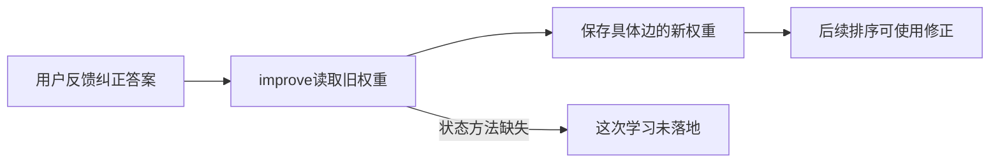
```mermaid
flowchart LR
    F[用户反馈纠正答案] --> I[improve读取旧权重]
    I --> S[保存具体边的新权重]
    S --> R[后续排序可使用修正]
    I -->|状态方法缺失| X[这次学习未落地]
```

- 拟新增：`age/state.py`与三元组分页实现，可在`reads.py`共享执行。
- 复用：`tasks/memify/apply_feedback_weights.py`、truth构建、user_preferences、`close_node.py`、`get_triplet_datapoints.py`、global_context_index pipeline。能力探测与阶段结果仍应真实报告。
- 47台账8项：节点/边反馈get/set四项，truth get/set两项，update_node，get_triplets_batch。
- 例子1：回答曾错误引用“张三维护海风”，反馈学习本应降低这条具体边权重；方法缺失/失败使该学习信号未保存，后续排序没有得到预期修正。不能说每次答案必错，更不能把关系名的公共向量ID当具体edge_object_id。
- 例子2：已关闭事实valid_to，重新导入被默认属性覆盖，过期事实可能重新进入候选；这是写入状态保护问题。
- 例子3：显式启用improve第9阶段，用多份项目资料生成“项目总体进展”层次摘要。其图来源模式读取dataset source refs＋get_graph_data；再通过add_data_points写摘要节点及向量，并add_edges写summarized_in。缺读取/写入会使这次索引更新不完整或失败。后续**同时开启include_global_context_index**的召回可能少了新摘要、仍见旧摘要或少一个root段落；原始实体/片段并非因此自动被删除。
- 直接故障边界：全局摘要读取的root通过get_memory_fragment，图投影异常在该helper中被记录并可能得到空fragment；摘要向量集合不存在被捕获为[]。其他未捕获向量错误可能继续向调用方传播。不要承诺所有增强读取错误都自动无损回退。
- 重要区分：专用global_context_index_pipeline默认vector分桶；improve第9阶段实际传graph分桶。两者都不调用get_graph_metrics；graph分桶不是GDS WCC。

[第9阶段graph分桶][map-global-stage]、[全局索引读图][map-global-input]、[摘要/边持久化][map-global-persist]、[专用pipeline默认][map-global-pipeline]、[全局摘要消费][map-global-retrieval]、[图投影错误处理][map-fragment]。

**成本边界：**8项方法7～14 Agent小时；其中7项学习状态6～12小时。加九阶段联调10.5～21小时，improve专属增量16.5～33小时；三元组分页未交付再加1～2小时。

### 6.7 M6：时间检索与选配公开查询

**结论：按启用的检索模式实现；它们不能由“普通邻域读写成功”代替验收。**

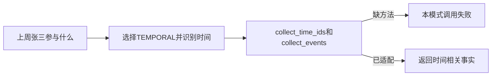
```mermaid
flowchart LR
    Q[上周张三参与什么] --> T[选择TEMPORAL并识别时间]
    T --> C[collect_time_ids和collect_events]
    C -->|缺方法| E[本模式调用失败]
    C -->|已适配| A[返回时间相关事实]
```

- 拟新增：AGE适配器额外的collect_time_ids/collect_events，可复用M4有界邻域。
- 按需修改：`modules/retrieval/natural_language_retriever.py`及提示/schema映射；CYPHER/NATURAL_LANGUAGE共用supports_cypher_queries时，不能仅交付raw query就把未适配NL一并开放，应分模式门控或一起验收。
- 47台账：query计在M1，本模块只列其公开使用协议，不重复算方法；Temporal两个方法不在47内。
- 例子：“张三上周参与什么”。识别出时间后直接调用两个时间方法，缺方法会在该路径报错；没有识别时间/没有时间ID才走已有triplet fallback。不能通过“我存了日期字符串”声称Temporal已支持。
- 例子：“找费用最低的项目协作路径”若自定义生成带权Neo4j算法，不能用AGE的无权最短跳数替代后宣称正确；应限制查询范围或另实现相关算法。
- 对召回：**只对选中的相应模式直接相关**，普通HYBRID不以完整公开方言为前置。

[Temporal调用][map-temporal]、[NL硬编码schema/生成/执行][map-nl]。

**成本边界：**本模块Temporal两项占2～4 Agent小时；M3/M4/M6共用的6项已选接口外方法总计6～12小时。公开Cypher额外4～8小时、自然语言生成查询额外8～16小时。这里只引用原总账，不追加重复费用。

### 6.8 M7：计数摘要和结构统计

**结论：先提供准确计数与错误状态；WCC及昂贵指标按需交付。图统计缺失与关系召回缺失不是同一后果。**

```mermaid
flowchart LR
    S[管理脚本请求规模] --> C[轻量准确计数]
    C --> O[节点数和边数]
    M[请求结构分析] --> W[完整拓扑和WCC]
    W --> P[连通团体指标]
```

- 拟新增：`age/metrics.py`；47台账唯一方法get_graph_metrics。应用侧WCC可复用思路，不能以子图截断值冒充全图值。
- 确需修改的上层接点：`modules/data/methods/get_datasets_graph_counts.py`；如增加失败状态/轻量计数方法，还要修改公开响应数据结构/消费合同、两摘要路由和相关缓存，而非只在新adapter里返回0。
- 复用：dataset授权和上下文、原关系库缓存框架；但失效规则须核对所有图写入。
- 现行为：Neo4j get_graph_metrics(False)读图、投影并计算WCC；只有全点对最短路径和聚类是额外GDS算法。False不是禁用GDS。
- 具体例子：图里已有“张三参与星河”，定制管理脚本显式请求graph-summary，缓存未命中；metrics抛异常后计数层返回0节点/0边/computed_at=None，不写成功缓存。用户随后普通recall“张三参与哪个项目”，现有默认链不读取这个0作为空图依据，仍会通过自身is_empty和邻域查询取数据。**不能写成摘要显示0导致recall必然没记忆。**
- 两个不同故障不能混写：若关系库读最新run/cache失败，graph-summary路由可能返回409；若adapter自己吞错并回零字典，上层可能把零当成功缓存。只有“图metrics抛异常”这条已核路径是无成功缓存的0/0/None。
- 资源竞争：显式并发统计可能与召回共享处理器、内存、磁盘读写、连接及dataset编排资源，导致延迟或超时；这是需负载实验验证的共同资源竞争风险，不是已经测得的失败率，也不是每轮聊天固定执行统计。不要称接口调用解耦就绝对无性能影响。
- 缓存额外边界：计数按最新cognify run缓存；global_context_index通过memify另写节点和边。不能仅照注释宣称“只有cognify会改图”，新计数方案须专项核对improve/memify/forget/update之后的失效，避免长期旧值。这里未运行失效实验，不断言每次都会陈旧。

[计数catch与缓存][map-counts]、[摘要路由409][map-summary-route]、[Neo4j统计路径][map-neo-metrics]、[完整指标消费者][map-pipeline-metrics]。

**成本边界：**基础统计方法3～6 Agent小时，摘要消费者错误解耦另2～4小时；全图距离与聚类作为选配另6～12小时。

### 6.9 M8：数据集隔离、注册、配置和部署

**结论：同一个PG里建出图不等于接入了Cognee多租户；接线错误既可能直接报错，也可能把问题送到错误的数据集。**

```mermaid
flowchart LR
    U[乙访问甲授权的星河数据集] --> H[handler解析数据集归属]
    H --> G[甲的星河图]
    B[错误地按访问者建图] --> E[乙的新空图]
    E --> N[召回不到已共享项目]
```

- 拟新增：`graph/age/AGEDatasetDatabaseHandler.py`、`schema.py`。
- 修改/注册：`graph/use_graph_adapter.py`、`dataset_database_handler/use_dataset_database_handler.py`与配置/工厂参数映射。三个handler合同create_dataset、resolve_dataset_connection_info、delete_dataset均不在47方法里。
- 复用：关系库DatasetDatabase登记、数据集所有者授权、dataset上下文、缓存关闭机制。共享数据集应指向数据集所有者的原图，不按每个访问者另建空图。
- 例子：甲授权乙看星河数据集，乙的请求若错误建了自己的空图，将得到空库或召回不到项目；若解析成海风图则可能串数据。这是**直接召回正确性/隔离**问题，与WCC是否实现无关。
- 部署前提：固定AGE发布包与PG大版本、服务端扩展权限。标准华为云RDS公开清单未列AGE，网络协议不能补出扩展；目标实例未验证。保留自管PG＋AGE与托管RDS的责任区别。
- 断言：不同dataset同UUID不冲突；授权共享同一数据集所有者的图；并发首建幂等；只drop目标AGE图；处理连接/缓存；图向量仍是分离调用，不自动变成跨adapter原子事务。

[handler合同][map-handler]、[工厂参数][map-factory]。云厂商和版本证据沿用主报告，本文未重复外部核验。

**成本边界：**handler、注册和隔离接线7～14 Agent小时；与M1共用连接、与M2共用schema基础，不重复建设。

### 6.10 全Agent任务与预算：improve增量和完整适配分开算

**基础图、来源和查询已接通时，补齐improve专用状态方法＋九阶段联调，暂估16.5～33 Agent小时；三元组分页未做再加1～2小时。**不是从零接入AGE的总价。九个阶段哪些运行、哪些跳过、哪些失败，以及每阶段触发例子，见[improve完整拆解](#improve-complete)。

一个Agent小时是一个Agent被任务占用一小时，四个Agent各运行两小时就是8 Agent小时。本次全部设计、实现、测试、复核和修复均按Agent执行；不换算传统人工人日。

| 交付范围 | 待校准Agent预算 | 是否可直接视为已验证 |
|---|---:|---|
| 第一轮PG18＋AGE1.8真实概念验证 | 6～12小时，已包含在总价 | 尚未运行，通过后才继续 |
| 本文逐项列明的主交付范围 | **153.5～319小时，含返工预留** | 47个方法有明确处置；含主要记忆、九阶段学习、时间、来源、旧删除兼容、接入和验证 |
| 再选公开查询、生成查询、昂贵统计、旧清理辅助、truth故障加固 | 另加28.5～57小时 | 每项单独验收；不承诺任意Neo4j查询原样兼容 |
| 任意旧版本生产迁移、统一图向量事务、备份/高可用 | 范围未给定，不能报固定总量 | 不藏在“全接口支持”中 |

**旧80～170小时估算由本次逐项预算替代。**新增接口外协议、九阶段分别验收、跨进程协调和摘要消费者改造后，不应继续沿用旧总数。[附录B](#interface-inventory)给出每个方法的成本及总账，公共基础只算一次；源码可以证明开发边界，不能证明Agent的实际开发速度。

最多4个Agent并行，建议1协调、2实现、1验证。先完成首轮概念验证，记录实际占用、工具等待、模型用量和修复轮次，再修订预算与日历工期；不能直接用Agent总小时除以4。金额还取决于模型价格和机器资源。

### 6.11 分阶段验收，避免把统计缺失当成所有功能失败

| 交付阶段 | 用什么例子验收 | 不通过的含义 |
|---|---|---|
| 部署可行 | 固定组合装好扩展，目标权限下读写及结果解码 | 这条部署路线尚不成立 |
| 记忆主流程 | 导入A/B，重复写张三，问星河参与者；撤回A仍保留B | 写入、检索或来源合同不合格，不能上线该主流程 |
| 已启用学习功能 | 学到0.9后重导不退回0.5；事实关闭、时间边界正确 | 对应学习/生命周期功能不可宣称支持 |
| 摘要展示 | 非空图计数准确；失败不显示假0；缓存与错误路径正确 | 阻断摘要上线，不自动判普通会话不可用 |
| 连通性和可选指标 | 孤点、链、环、两个团体与独立算法对照 | 阻断相应统计功能；未启用的指标不作统一门槛 |
| 目标规模 | 私有多图/共享热点分开，混合读写、故障恢复 | 功能正确仍不足以证明100用户或生产响应目标达标 |

保留会话缓存，以完整记忆功能做测试；自动反馈、后台同步、队列等开关要记录。普通插件流程、显式摘要请求、昂贵统计分别测，不能假定每次聊天都有一次全图统计，也不能关闭真实同步负载后声称测到了完整插件。

**最终建议：若能自管PG扩展且希望沿用PG运维体系，先做PG18＋AGE1.8的首轮概念验证；通过后实现记忆必需合同，统计分期。若必须只用不开放AGE的托管实例，或要求同图自动跨机扩展，则先解决部署/架构条件，不应直接启动完整适配。**

## 7. AGE值不值得改：先比较目标和完整成本，再选图库

**本章结论：如果没有统一PG运维的硬要求，也没有测出当前Ladybug的瓶颈，不建议现在就启动完整AGE适配。**AGE的价值是保留Cognee业务能力、将图存储放进可自管的PG体系；不是已经证明它更快。若最想改善的是对话事实召回，第8章的Hindsight对照验证应先于大规模后端改造。

### 7.1 先统一终点，避免把原型、完整适配与生产容量混着比

**能写出一条边，只证明原型接通；正确撤回共享来源、保留学习状态、隔离100名用户的资料，是另一层验收。**本章采用三层边界：

| 终点 | 要交付什么 | 本章成本是否覆盖 |
|---|---|---|
| 原型接入 | 写入张三参与星河，再读出节点和边 | 作为第一轮验证，包含在主预算内 |
| 选定Cognee业务合同 | 附录B.10范围：47方法逐项处置、6项已选额外方法、handler3项、来源/增量/九阶段、操作协调及同一组回归 | 下文三种图库按此口径比较；未选公开查询/昂贵统计须显式禁用 |
| 指定100用户生产目标 | 明确并发、每图规模、读写比例、响应时间、可接受数据损失与恢复时间，并实际达标 | 未给定、未压测；高可用与生产迁移不能包进基础预算 |

本章排除通用公共许可证（GPL，具有较强衍生分发义务的开源许可证）；接受MIT和Apache-2.0等宽松许可。固定服务端许可合格，不等于客户端、模型和最终镜像所有依赖已经完成许可审计。

```mermaid
flowchart TD
    A[先确定目标] --> B{必须保留Cognee图模型和学习合同}
    B -->|否，主要是事实记忆| H[先做Hindsight同题对照验证]
    B -->|是| C{已有实测容量或部署瓶颈}
    C -->|没有| L[验证现有Ladybug并修已知问题]
    C -->|有| D{能自管PG扩展且要求PG统一运维}
    D -->|是| G[AGE最小验证后决定完整适配]
    D -->|否| E[服务型图库验证：先ArcadeDB]
    E --> F{单图已超单机容量}
    F -->|是| J[再研究分布式候选与重新建模]
```

### 7.2 已有多少实现：哪些可以复用

| 后端 | 核验版本、许可证 | Cognee现状 | 能省什么/还缺什么 |
|---|---|---|---|
| Ladybug | 0.19.0，c934f673b6b1c5b680bdae3295cbd909b5855cef，MIT | 当前Cognee LadybugAdapter 抽象语法树（AST，对代码结构的解析结果）直接覆盖47/47公共方法；已有来源、学习、Temporal、dataset handler。方法存在不保证正确，既往统计反例已复现 | 不必重写47方法和本地handler；需修统计/错误呈现，核验完整操作协调和资源生命周期。若需多API访问同图，应新增单owner（唯一持有图读写句柄的进程）服务或换服务型库，不能让多个进程抢同一文件 |
| PG18＋AGE1.8 | e43dc1a12b78fba4acef9835b2b10379b8d243b4，Apache-2.0 | 本轮固定Cognee无AGE adapter/handler | 从连接codec、图身份、来源、学习、读图与handler开始接线；可复用Cognee业务流程和后端无关状态函数；不必为基本图原语先改AGE内核 |
| ArcadeDB | 26.9.1，b6a92623554bb332d7564de19fbd9fdbc2d1d45e，Apache-2.0 | 社区adapter0.2.0，ea5eaa681b8606c9813bb3d4c74553c06e4bb3aa；AST只直接覆盖21/47，26非抽象方法继承默认；锁Cognee1.4.2而当前为1.6.0 | 可参考既有Bolt（图数据库通信协议）的增删改查/遍历，但来源15项、标签清理/chunk更新、学习7项、三元组分页等缺失；Temporal缺；无handler、session未指定database；连通分量常数返回错误。不能承诺只升级依赖即可 |

**许可证证据**：[Ladybug MIT](https://github.com/LadybugDB/ladybug/blob/c934f673b6b1c5b680bdae3295cbd909b5855cef/LICENSE)、[AGE Apache-2.0](https://github.com/apache/age/blob/e43dc1a12b78fba4acef9835b2b10379b8d243b4/LICENSE)、[ArcadeDB Apache-2.0](https://github.com/ArcadeData/arcadedb/blob/b6a92623554bb332d7564de19fbd9fdbc2d1d45e/LICENSE)。这里只判断固定服务端源码；插件、客户端和最终镜像依赖另有各自许可。Neo4j驱动不等同GPL的Neo4j服务端。本轮不是完整容器软件物料清单审计。

#### Ladybug：单图容量和部署限制

已有 [LadybugDatasetDatabaseHandler](https://github.com/topoteretes/cognee/blob/663a2dc15d04bc0d7ec2733a2dd604b7ed1b8c8e/cognee/infrastructure/databases/graph/ladybug/LadybugDatasetDatabaseHandler.py#L19) 按dataset稳定确定文件名，删除时等待缓存引擎退出再清理文件。[adapter来源锁](https://github.com/topoteretes/cognee/blob/663a2dc15d04bc0d7ec2733a2dd604b7ed1b8c8e/cognee/infrastructure/databases/graph/ladybug/adapter.py#L362) 和 [进程内dataset锁](https://github.com/topoteretes/cognee/blob/663a2dc15d04bc0d7ec2733a2dd604b7ed1b8c8e/cognee/infrastructure/locks/dataset_lock.py#L1) 不是完整分布式所有权协议；[worker分发](https://github.com/topoteretes/cognee/blob/663a2dc15d04bc0d7ec2733a2dd604b7ed1b8c8e/cognee_db_workers/harness.py#L419) 是同步请求处理。

例如100人各管一个小图，可以把不同dataset交给不同owner机器；同一个热点图仍只有一个owner，不因增加API机器自动扩大图写容量。若100人共写星河项目，需量化排队、锁等待、最大度与单查询成本，不能只看文件大小。已有 [RemoteLadybugAdapter:36](https://github.com/topoteretes/cognee/blob/663a2dc15d04bc0d7ec2733a2dd604b7ed1b8c8e/cognee/infrastructure/databases/graph/ladybug/remote_ladybug_adapter.py#L36) 仍初始化父类dummy路径，[90](https://github.com/topoteretes/cognee/blob/663a2dc15d04bc0d7ec2733a2dd604b7ed1b8c8e/cognee/infrastructure/databases/graph/ladybug/remote_ladybug_adapter.py#L90)只包装/query请求；registry没有remote handler。不能拿这个类当作已完成鉴权、图路由、operation互斥和故障迁移的服务。

#### ArcadeDB：服务端现成，但业务合同仍缺

服务端已有 [Bolt database选路](https://github.com/ArcadeData/arcadedb/blob/b6a92623554bb332d7564de19fbd9fdbc2d1d45e/bolt/src/main/java/com/arcadedb/bolt/BoltNetworkExecutor.java#L778)、[显式事务](https://github.com/ArcadeData/arcadedb/blob/b6a92623554bb332d7564de19fbd9fdbc2d1d45e/bolt/src/main/java/com/arcadedb/bolt/BoltNetworkExecutor.java#L1061) 和 [高可用插件](https://github.com/ArcadeData/arcadedb/blob/b6a92623554bb332d7564de19fbd9fdbc2d1d45e/server/src/main/java/com/arcadedb/server/HAServerPlugin.java#L27) 基础。这使“图本身成为可连接服务”有现成引擎支持；**不证明当前Cognee插件已使用这些能力，也不证明单图存储自动分片**。

例子：A和B都支持“张三参与星河”。社区adapter [add_nodes](https://github.com/topoteretes/cognee-community/blob/ea5eaa681b8606c9813bb3d4c74553c06e4bb3aa/packages/graph/arcadedb/cognee_community_graph_adapter_arcadedb/arcadedb_adapter.py#L106) 接受source_ref_key却未使用，没有图内来源实现；不能因为连得上Bolt便承诺撤回A保留B的图内来源语义。核心可能继续旧ledger，因此也不能说全部forget必失败。用户反馈的图权重、真值、valid_to局部更新必须补齐，不等于会话反馈文本不能保存。统计 [700行](https://github.com/topoteretes/cognee-community/blob/ea5eaa681b8606c9813bb3d4c74553c06e4bb3aa/packages/graph/arcadedb/cognee_community_graph_adapter_arcadedb/arcadedb_adapter.py#L700) 把任意非空图判一个连通分量，需真正实现WCC。

### 7.3 同范围成本：复用收益与验证成本分开

以下复用AGE现有B.10的17工作包，不拿旧Ladybug30～60小时小范围方案来比。Ladybug列假设单owner（持有该图读写句柄的进程）执行完整业务，不新建网络数据库服务；这与服务型部署的拓扑差异在下一节追加。相同验收工作保持相同预算，已实现方法只分配校核/局部修复预算，不装作新实现，也不装作零成本。

| 工作包 | Ladybug单owner修补 | AGE新adapter | ArcadeDB补社区adapter | 差异依据 |
|---|---:|---:|---:|---|
| 固定环境最小概念验证 |4～8|6～12|6～12|Ladybug已接入；AGE/Arcade需真实协议/参数/身份验证 |
| 连接、生命周期、编解码 |2～4|6～12|4～8|Ladybug本地已有；Arcade可参考Bolt但池选库/关闭须查；AGE agtype新接线 |
| 身份/类型/基础索引/冲突框架 |2～4|4～8|4～8|已有主键模型仍要并发验证；Arcade MERGE不是唯一性证明 |
| 完整operation协调 |6～12|6～12|6～12|来源删除快照与新增、反馈读改写、水位皆要处理；数据库事务不会自动覆盖多调用 |
| 10项写入/生命周期 |2～4|9～18|4～8|Ladybug已有；Arcade需核对标签并集、写入属性保留，不能照搬已有覆盖写 |
| 12项读图/内部query/基础metrics |4～8|14.5～29|10～20|两现有adapter统计缺陷；Arcade部分getters结果及类型模式仍需改，AGE从头实现 |
| 17项来源/增量方法 |2～4|16～30|16～30|Ladybug已有全部；Arcade本组缺失，不能享受“有适配器”的虚假折扣 |
| 8项状态/三元组 |2～4|7～14|7～14|Ladybug已有；Arcade学习7＋分页缺失 |
| 6项选定接口外方法 |1～2|6～12|6～12|Ladybug实际已有时间等实现；Arcade需补Temporal/旧合同 |
| handler/注册/隔离接线 |2～4|7～14|7～14|Ladybug本地handler已有；另外两者需新接线 |
| 来源索引与专项故障验证 |5～10|5～10|5～10|同一A/B、run、chunk、向量失败合同；不能省 |
| 统计摘要错误解耦 |2～4|2～4|2～4|相同消费者缺陷，三方案同样处理 |
| 非improve业务入口回归 |10.5～21|10.5～21|10.5～21|同一入口与业务样例 |
| 九阶段improve专属联调 |10.5～21|10.5～21|10.5～21|同样覆盖成功/跳过/错误、水位/状态 |
| 故障与代表性混合负载 |8～16|8～16|8～16|同请求负载与观测，不把测试叫已满足服务等级目标 |
| 独立Agent复核/反例 |12～24|12～24|12～24|统一验收标准 |
| 协调/合并/文档 |4～8|4～8|4～8|统一交付口径 |
| **基础小计** |**79～158**|**133.5～265**|**122～242**|脚本求和 |
| 额外返工预算 |12～32|20～54|18～49|未发现问题的资源准备，不是已知代码量 |
| **同功能范围预算** |**91～190**|**153.5～319**|**140～291**|未经校准，不是保证 |

从这个表**只能推断Ladybug已有合同意味着需要新增的实现较少**。不能从重叠区间证明它一定节省某个百分比；更不能从Arcade140～291与AGE153.5～319宣布Arcade更便宜。Arcade21个现成方法的正确性、版本升级冲突、事务与类型语义可能吃掉预计复用收益。第一轮PoC后必须用真实耗时替换这组预算。

同功能范围中的“操作协调”指选定资源owner内/跨调用的业务串行化或等价并发控制。Ladybug单owner列没有承诺现成多API架构；若目标限定当前单API拓扑，它足以进入相同业务验收。若要求独立多API访问，需要计下一节服务化增量后才比较拓扑。

### 7.4 Ladybug如何改成多API共享服务

选择一个受控网络owner服务（可管理多个独立dataset，不做同图分布式分片），复用现有Ladybug方法。不能仅暴露裸Cypher `/query` 就把图内来源操作拆成不受协调的跨请求调用。

| 服务化增量包 | 需要做什么 | 新增Agent预算 |
|---|---|---:|
| 稳定dataset路由与服务端handler | owner资源登记、授权、按dataset选库、禁止两个活跃writer所有者 |8～16|
| 受控远程过程调用合同与客户端生命周期 | 方法参数/结构化结果、超时、取消、连接池、大小限制；升级remote schema/handler |8～16|
| operation跨远程过程调用边界 | 将原有operation协调接到服务端，请求幂等标识和状态；不再重复实现底层锁框架 |4～8|
| 服务恢复与转移流程 | stop/drain/close、故障后受控重开、路由缓存刷新；**不包含自动复制、自动跨机接管或任意可接受数据损失量/恢复时间** |8～16|
| 服务特有配置/观测 | trace、队列时间、服务健康、部署与资源限制 |4～8|
| 独立验证及服务化文档增量 | 权限绕过、重复请求、断连及服务版本组合 |6～12|
| 服务化额外返工预留 | 尚未发现问题资源预算 |6～14|
| **服务化增量合计** |选定单owner服务方案 |**44～90**|

**多API可访问、同图仍单owner且无生产高可用目标时，Ladybug完整业务＋服务化暂为135～280 Agent小时。**对照AGE153.5～319、Arcade140～291，其差异已经很小且区间高度重叠，不能凭估算数字选赢家。选型应看用户需要本地文件简化运维、PG整合，还是服务端事务/权限/高可用演进基础。

此服务化工作是**选择性新增范围**，不应加到“仅单API内保留Ladybug”的预算；也不应误认为数据库换成AGE/Arcade后现有Cognee所有上层并发问题就消失，上表共用operation协调仍然保留。

### 7.5 AGE到底值不值得做

| 实际需求 | 条件性选择 | 为什么值得/何时不值 |
|---|---|---|
| 只是让100名用户开始用各自或少量共享资料 | 先验证现有Ladybug，按完整合同修补；不先重写图后端 | 没有证据表明人数已使文件图库不足；已有47方法与handler可复用。若测出单图资源/延迟不达标，再看服务化是否解决实测瓶颈 |
| 多个API进程需要访问同一个图，但接受单owner | Ladybug服务化与Arcade/AGE最小PoC并列 | 服务化解决句柄所有权与接入调度，不保证吞吐自动提高；成本计到135～280后不再用“Ladybug30～60”压低比较 |
| PG18自管环境已经确定，团队明确要求PG事务/监控/备份体系，且接受开发维护adapter | AGE153.5～319有合理购买目标 | 买到的是PG中图存储的业务接线与后续可维护性，不是已证明查询更快。若华为托管实例根本不能装AGE，预算再少也无法在该实例落地 |
| 同一图要求数据库服务自身复制/故障切换 | 优先ArcadeDB 高可用可行性PoC，再确定生产集成范围 | 有上游复制与选主、数据库权限和事务基础，比自己给文件图库造复制协议有现成支点；但完整adapter与高可用验收都要做，不能把140～291说成已交付高可用 |
| 单图已超过单机容量或明确要求分片扩写 | 深入分布式候选，不能假设Arcade 高可用或AGE就是解答 | 高可用副本复制不等于分片扩容。需要验证分区、跨分区查询、热点写与来源一致性，重新估系统成本 |

**高可用不在上述三个基础价内**。主从/多数派故障、脑裂防护、备份恢复、图向量状态对账、可接受数据损失量/恢复时间达标等范围未给定。本轮最多建议为目标后端设置有上限的高可用验证任务，拿到部署和失败日志后再估完整交付；不能凭“复制与选主实现已有”编出一个必然便宜的高可用总价。

### 7.6 其他宽松许可候选：先验证最难的合同

| 候选固定版本 | 官方源码许可 | 已核查代码/缺陷 | 什么时候再考虑 |
|---|---|---|---|
| HugeGraph1.7.0 / b12425c2032bf0d21a97b8221f42a18055c2982f | [Apache-2.0](https://github.com/apache/hugegraph/blob/b12425c2032bf0d21a97b8221f42a18055c2982f/LICENSE) | 无本轮发现的Cognee adapter/handler；Gremlin图遍历语言及HTTP接口需新映射。[GraphManager.createGraph][hugegraph-space]在未使用PD（Placement Driver，管理分布式存储元数据的服务）时走createGraphLocal(name)，使用PD时才按space组合名，因此不能凭HTTP接口路径宣传统一graphspace隔离 | 已有单图分布式存储需求且接受Server/PD/存储组件；先验证来源并发、schema和graphspace，再做全合同预算 |
| JanusGraph1.1.0 / 3b8843ffc6c81cf0076bf00119f1ffe80b9cf234 | [代码Apache-2.0，部分文档使用署名许可CC-BY](https://github.com/JanusGraph/janusgraph/blob/3b8843ffc6c81cf0076bf00119f1ffe80b9cf234/LICENSE.txt) | 无adapter；[transactions:13](https://github.com/JanusGraph/janusgraph/blob/3b8843ffc6c81cf0076bf00119f1ffe80b9cf234/docs/basics/transactions.md#L13)说明Cassandra/HBase并非一般意义跨行事务的原子性、一致性、隔离性、持久性（ACID）；ghost与约束锁需处理；认证不等于按图授权 | 已有相关存储/运维基础或需要分布式规模；来源删除/补偿的代价比单纯Gremlin翻译多，不能因Apache许可就优先迁 |
| Nebula3.8.0 / fa928930ab34f150db522933323aa610e54f26e7 | [Apache-2.0](https://github.com/vesoft-inc/nebula/blob/fa928930ab34f150db522933323aa610e54f26e7/LICENSE) | 无adapter；[PropertyType无集合属性][nebula-types]；[enable_authorize默认false](https://github.com/vesoft-inc/nebula/blob/fa928930ab34f150db522933323aa610e54f26e7/src/graph/service/GraphFlags.cpp#L45)。来源集合需关系化或带并发协议编码；UPSERT不证明完整多语句业务事务 | 已有分布式容量/运维需求且愿意重新建模来源与属性；不得只按nGQL近似Cypher判断兼容 |

这三者没有与Ladybug/AGE/Arcade同深度逐方法移植实现设计，**不报看似公平的完整精确小时数**。可安排限时、同合同的候选验证；只有验证结果支持继续，再拆同17工作包。用未经设计的“也许更快”替换AGE预算同样主观。

不入选：固定核验Neo4j Community5.26.0为[GPLv3](https://github.com/neo4j/neo4j/blob/c68156edf24164435ab1ac257ec633134c2887f7/LICENSE.txt)；Memgraph核验提交为[BSL（Business Source License，带使用条件的源码可用许可）](https://github.com/memgraph/memgraph/blob/8902f67683d09577a1c42448ffe0268a5c1a30aa/licenses/BSL.txt)；FalkorDB核验提交为[SSPL（Server Side Public License，含服务提供义务的许可）](https://github.com/FalkorDB/FalkorDB/blob/53f78b47c618dd2a6936b61bfad9bab7682657c9/LICENSE.txt)。不把客户端/插件的宽松许可当服务端许可，也不把未来BSL转换日期当今天已合格。

对HugeGraph、JanusGraph、NebulaGraph，可以分别设置6～12、8～16、8～16 Agent小时的**限时探索上限**：各验证重复写身份、A/B来源撤回、租户路由和一条真实邻域查询。到期可以得出否决或证据不足；这些数字不是完整adapter的交付估算。未逐方法设计之前，给出“另一个图库只需几十小时”的结论没有源码依据。

### 7.7 Ladybug的明确结论：可先用，但不能承诺任意规模

**100个注册用户本身不足以否决Ladybug；同一个大图要求多机同时写、自动分片扩容或自动接管时，当前嵌入式方案不能直接满足。**这不是“查询语法缺少某条命令”，而是同一数据库文件的所有权及服务部署限制。

| 目标场景 | 明确判断 | 下一步 |
|---|---|---|
| 100人各自使用较小独立数据集 | 可以作为候选，按数据集分配owner；未做容量承诺 | 保留现有handler，测总内存、句柄生命周期、队列和并发读写 |
| 100人共享一个项目图，多API访问 | 当前多进程直接打开同文件写入不可当作扩展方案 | 单owner服务化，或换AGE/Arcade等服务型后端；单图吞吐仍压测 |
| 同一图要求自动多机扩写/超过单机容量 | 当前Ladybug路线不能直接交付 | 服务化也不自动解决分片；进入分布式候选的建模与一致性验证 |
| 同一图要求数据库自动复制和故障接管 | 当前单owner封装不包含该能力 | 优先验证有复制基础的服务端；另外验故障、恢复和数据一致性 |

```mermaid
flowchart LR
    U[100名用户] --> A[多个API服务]
    A --> R[按dataset授权并路由]
    R --> O1[owner1管理数据集A与B]
    R --> O2[owner2管理数据集C与D]
    O1 --> G1[Ladybug文件A与B]
    O2 --> G2[Ladybug文件C与D]
    S[共享热点星河图] --> O3[唯一owner3]
    O3 --> G3[同一个星河文件]
```

多owner能分担不同图，但星河这一个热点图并没有被自动拆成三份。若瓶颈是星河的单次大邻域查询，多开API或给其他数据集加owner都不会直接缩短它。

已知正确性问题也要修：此前以Ladybug0.19.0引擎执行当前适配器统计语句，孤点/链图的连通性有错误，聚类查询报错，外层可能返回假零。[复现脚本与原结果][ladybug-repro]保留于已提交历史；这是小图正确性实验，不是100用户容量测试。旧30～60 Agent小时仅覆盖局部修补，已不能用来代表本章91～190小时的完整业务验收范围。

**决策落点：**保留Cognee时，先用已存在的Ladybug作为基线；确实需要PG治理且能安装扩展，AGE才有明确投入理由；需要现成图服务及复制基础，先验证ArcadeDB。三条路线预算重叠，最终依据应是第一轮真实验证结果，而不是哪一个估算下限小。

## 8. Hindsight能否更准、更快：先纠正“没有图”，再看代码和实测

**本章结论：Hindsight有图，只是默认用PG表保存图，不需要独立图数据库。它是值得优先验证的完整记忆引擎，尤其适合事实、时间、实体关联的记忆任务；目前不能断言它在你的中文资料和100用户负载下必然更准或更快。**核查到的一组同题公开结果，Hindsight答题正确率更高，但平均检索并没有更快，且提供了更多上下文。详见8.6。

本地Hindsight固定提交`12f2d54f643baddacb98cd547c89b1a50c5c3dcc`，Cognee仍为文首固定提交。Hindsight采用[MIT许可证](https://github.com/vectorize-io/hindsight/blob/12f2d54f643baddacb98cd547c89b1a50c5c3dcc/LICENSE)，满足本次不选GPL服务端的条件。以下先分别介绍现有实现，再比较，不能把Hindsight当成Cognee的一个图adapter。

### 8.1 Cognee：以知识图为长期记忆的组成式管线

**本节结论：Cognee将资料抽取、向量召回和图关系组织分层，扩展点多；跨存储一致性及后端合同需要一并维护。**

以本报告已经审计的默认组合为例：关系库记录用户、dataset（数据集）、权限、原始数据与处理状态；向量库保存 文本片段、摘要、实体名称和关系文本的向量表示（embedding）；Ladybug 图库存 DocumentChunk、TextSummary、Entity、NodeSet 等模型及关系。三者各司其职，图数据库不是全部记忆。

进入长期记忆写入的remember，或先add再cognify时，资料先成为可追溯的数据与文本片段，LLM（大语言模型）提取实体/关系，任务管线分别写图和向量。调用 recall/search 时，默认 HYBRID 在 文本片段和实体两条路上查候选，再取实体的一跳邻域，组合成回答上下文。若启用 session，命中会话缓存和调用完整长期检索是不同路径；不能用缓存命中的延迟代表图检索。

默认 HYBRID 的构造参数 chunks_top_k=5、entities_top_k=5；实体路同时查 Entity_name 与 EdgeType_relationship_name，随后加载图邻域。不能由此宣称“只查十条记录”：两个检索通道内仍有多子查询、图邻域和去重。也不能把其他可选的 lexical、rerank、temporal retriever 算成默认每次调用都会执行。[默认参数及 query 流程](https://github.com/topoteretes/cognee/blob/663a2dc15d04bc0d7ec2733a2dd604b7ed1b8c8e/cognee/modules/retrieval/hybrid_retriever.py#L56)；[实体图邻域](https://github.com/topoteretes/cognee/blob/663a2dc15d04bc0d7ec2733a2dd604b7ed1b8c8e/cognee/modules/retrieval/hybrid/entities.py#L60)。

架构上的长处是图/向量 provider、任务、模型与 retriever 可以分别扩展；应用若需要实体关系、来源控制、truth、偏好和反馈演进，已有专门的合同与调用链。代价是不同存储之间的一致性、生命周期和部署拓扑必须一起处理，不能因为存在 provider 接口就假设任何后端已完整支持。本轮先前报告已经逐项列出这些图合同；Hindsight 不能作为新的 GraphDBInterface provider 直接填入。

### 8.2 Hindsight：以事实记忆为中心、默认把向量与记忆图放进同一个 PG

**本节结论：Hindsight默认把事实、向量、关联和后台任务放在PG，减少独立存储组件；它仍有图查询和联表成本。**

Hindsight 提供三个容易区分的动作：

- **retain（记住）**：将文本拆解为可以检索的事实；识别实体与发生时间，计算向量，建立关联；可继续在后台把多条事实归纳为 observation（有来源的综合观察）。
- **recall（回忆）**：根据问题找回相关事实与可选原文，不直接等于生成完整答案。
- **reflect（思考并回答）**：调用 LLM，通过工具查 mental model（知识页面）、observation 和原始事实，允许多轮补查，然后回答。

HTTP接口的实际端点分别是 `POST /v1/default/banks/{bank_id}/memories`、`POST /v1/default/banks/{bank_id}/memories/recall`、`POST /v1/default/banks/{bank_id}/reflect`。retain 默认同步等待，也可 `async: true` 进入后台任务；客户端给 async retain 提供 operation_id 时，重试同一 ID 不重复排入工作。[HTTP retain 参数](https://github.com/vectorize-io/hindsight/blob/12f2d54f643baddacb98cd547c89b1a50c5c3dcc/hindsight-api-slim/hindsight_api/api/http.py#L1289)。

```mermaid
flowchart LR
    A[应用上传文本] --> B[retain: 分块、LLM提事实、embedding]
    B --> P[(PostgreSQL)]
    P --- M[memory_units: 事实/观察及向量]
    P --- E[entities + unit_entities: 事实提及哪些实体]
    P --- L[memory_links: 语义/时间/因果关联]
    P --- D[documents/chunks: 原文与片段]
    P --- Q[async_operations: 后台任务]
    Q --> C[worker: consolidate归纳观察]
    C --> P
    R[问题] --> S[recall: 向量/关键词/时间/图候选]
    P --> S
    S --> F[融合、重排、限制输出预算]
    F --> O[返回相关事实/原文]
    T[reflect: LLM工具循环] --> S
    T --> K[知识页面/观察工具]
    T --> U[生成答案]
```

**它有图，而且图检索仍然使用联表。** `unit_entities` 将“哪条事实提到了哪个实体”连起来；`memory_links` 存事实间关联。实体扩展可以从 F1 经同一个实体走到 F2，实际通过 `unit_entities` 自连接实现；语义/因果扩展在同一个公共表表达式（Common Table Expression，CTE）中组合。它是服务于记忆召回的受限图算法，不能等同任意 Cypher 模式匹配，也不能说它“不需要图所以更快”。[图扩展模块说明与具体 SQL](https://github.com/vectorize-io/hindsight/blob/12f2d54f643baddacb98cd547c89b1a50c5c3dcc/hindsight-api-slim/hindsight_api/engine/search/link_expansion_retrieval.py#L1)。

当前代码并非官网旧描述中的“没有存储抽象”：`MemoriesExtension` 把写入、召回、按 ID 读取、维护等作为接口；`PostgresMemories` 是参考实现，另有 SQL 方言层。与此同时，memory_engine.py 仍是非常大的编排器，PG 事务路径与 `store_owned` 路径有能力分支。因此可以说“已经具备扩展接口”，不能说“任意存储无成本替换、所有 SQL 已完全解耦”。[接口及存储所有权条件](https://github.com/vectorize-io/hindsight/blob/12f2d54f643baddacb98cd547c89b1a50c5c3dcc/hindsight-api-slim/hindsight_api/engine/memories/base.py#L770)。

### 8.3 同一份资料，两种架构怎样工作

#### 故事 1：导入资料，为什么会产生图

资料 A：“张三负责星河项目。原定 9 月 20 日上线，因为数据库维护改到 9 月 25 日。”资料 B：“李四是星河的运维负责人，9 月 24 日完成数据库恢复。”

以下是说明数据结构的教学示意，实际 LLM 可能提取不同数量和措辞的事实；没有执行该资料的真实模型输出。

| 环节 | Cognee 默认路径 | Hindsight 默认路径 |
|---|---|---|
| 原文如何保留 | Data/Document、DocumentChunk 等及相应来源关系 | documents/chunks；记忆单元保留 document_id/chunk_id 关联 |
| 如何让“张三”和“星河”联系起来 | Entity 模型及实体之间的关系；chunk 支撑抽取出的知识 | F1“张三负责星河”这个事实单元关联实体张三、星河 |
| 如何连到资料 B | 相同实体及图邻域提供跨片段连接 | F1 和 F3“李四负责星河运维”共同关联星河，通过 unit_entities 自连接可扩展到对方 |
| 如何表达时间/因果 | 通用图结构及专门 temporal 功能的合同，需要对应 adapter 支持 | 事实日期字段、时间 links、因果 links，并有专门检索实现 |
| 后台进一步归纳 | improve 的九阶段按条件学习反馈/偏好/truth、导入缓存、生成索引等 | consolidate 把相关事实总结成 observation；知识页面可另配置刷新 |

Hindsight 先做可能耗时的实体解析与语义近邻计算，再进入写事务，避免将这些计算全放进持锁区。一个批次的事实、实体映射与时间/语义/因果关系会一起入事务；流式大资料可以分批提交，并把相应后台事件写入 outbox（与数据一同提交的待执行事件）。这减少了“事实已写、通知丢失”的窗口。**保证单位是具体批次，不是整份大文档、全部 LLM 调用和后续 observation 一次成功或一起回滚。** 同一 document 并发写入用数据库行锁序列化。[事务前计算](https://github.com/vectorize-io/hindsight/blob/12f2d54f643baddacb98cd547c89b1a50c5c3dcc/hindsight-api-slim/hindsight_api/engine/retain/orchestrator.py#L475)；[批次写入](https://github.com/vectorize-io/hindsight/blob/12f2d54f643baddacb98cd547c89b1a50c5c3dcc/hindsight-api-slim/hindsight_api/engine/retain/orchestrator.py#L608)；[流式事务/文档锁及 outbox](https://github.com/vectorize-io/hindsight/blob/12f2d54f643baddacb98cd547c89b1a50c5c3dcc/hindsight-api-slim/hindsight_api/engine/retain/orchestrator.py#L3086)。

#### 故事 2：问“9月星河为什么延期，谁跟进恢复”

Hindsight 可以从问题中识别时间约束，从向量和关键词中找到“延期/数据库维护”等事实，以星河共享实体关联到李四，并按时间/因果关系补充相关事实。注意“可以找到”是算法覆盖的路径，不保证真实模型一定提取正确、不保证候选没有被预算截断。

实际默认 PG 调度顺序是：① 同一个连接先跑语义+关键词联合查询；② 有时间窗口时再查询时间候选；③ 释放该连接后按事实类别并发图扩展。不能把宣传中的四种检索信号直接解释为四个 SQL 从同一时刻开始执行。[默认 PG 调度](https://github.com/vectorize-io/hindsight/blob/12f2d54f643baddacb98cd547c89b1a50c5c3dcc/hindsight-api-slim/hindsight_api/engine/memories/postgres.py#L132)。

候选之后经过倒数排名融合（Reciprocal Rank Fusion，RRF），默认融合常数为 60；再截到默认最多 300 个重排候选，由 cross-encoder（同时阅读问题与候选文本的相关性模型）评分，还可以结合近期、时间及证据数量增益。最后按返回事实 token（模型文本计量单位）预算裁切。默认 recall 的 max_tokens=4096 只约束事实正文；额外 chunk/source 等有自己的预算，不能宣称整个响应或 reflect 的全部上下文严格只有 4096 tokens。[融合](https://github.com/vectorize-io/hindsight/blob/12f2d54f643baddacb98cd547c89b1a50c5c3dcc/hindsight-api-slim/hindsight_api/engine/search/fusion.py#L29)；[候选 cap](https://github.com/vectorize-io/hindsight/blob/12f2d54f643baddacb98cd547c89b1a50c5c3dcc/hindsight-api-slim/hindsight_api/engine/memory_engine.py#L8918)；[接口预算语义](https://github.com/vectorize-io/hindsight/blob/12f2d54f643baddacb98cd547c89b1a50c5c3dcc/hindsight-api-slim/hindsight_api/engine/memory_engine.py#L7943)。

如果用 reflect，LLM 还可反复调用知识页面、observation、recall 和 expand 工具补充证据，迭代有上限，工具失败和最终未完成也有异常分支。这适合需要综合推理的问题，但增加模型调用、尾延迟与成本；不能拿 reflect 完整回答和 Cognee 只返回 context 的耗时比较。[reflect 工具循环](https://github.com/vectorize-io/hindsight/blob/12f2d54f643baddacb98cd547c89b1a50c5c3dcc/hindsight-api-slim/hindsight_api/engine/reflect/agent.py#L980)。

默认图扩展对单个高频实体的扇出设限，时间传播也有候选、深度/迭代预算；图查询超时时可以舍弃昂贵的实体扩展、只保留其他关联。这正是使用 PG 仍能控制工作量的原因之一，同时也会漏掉预算之外、或降级支路里的证据。例如一万个事实都关联“公司”，并不会无限展开一万个事实。**可控的是工作量和故障范围，召回完整性需要实际题集验证。**[图超时降级](https://github.com/vectorize-io/hindsight/blob/12f2d54f643baddacb98cd547c89b1a50c5c3dcc/hindsight-api-slim/hindsight_api/engine/search/link_expansion_retrieval.py#L302)；[时间传播](https://github.com/vectorize-io/hindsight/blob/12f2d54f643baddacb98cd547c89b1a50c5c3dcc/hindsight-api-slim/hindsight_api/engine/search/retrieval.py#L660)。

另一个中文项目容易忽视的默认值：当前关键词配置为 native/english，实际 PG 使用 tsvector/ts_rank_cd。代码函数名字中出现 BM25，不足以证明默认实现是标准 BM25（常用文本相关性算法）；中文分词、姓名、项目代号、混合代码需要单独验证并选择配置。若要改用中文分词器或其他全文扩展，必须核对目标华为云实例是否允许安装/配置；不能先假设云 PG 能装。[真实关键词表达式](https://github.com/vectorize-io/hindsight/blob/12f2d54f643baddacb98cd547c89b1a50c5c3dcc/hindsight-api-slim/hindsight_api/engine/sql/postgresql.py#L412)；[默认配置](https://github.com/vectorize-io/hindsight/blob/12f2d54f643baddacb98cd547c89b1a50c5c3dcc/hindsight-api-slim/hindsight_api/config.py#L1450)。

#### 故事 3：A/B 共同支撑一个观察，删除 A 会怎样

假设 A、B 的事实共同支持 observation O：“星河延期与数据库维护有关，已有人跟进恢复”。Hindsight 的 observation 有 source_memory_ids。删除或替换 A 的事实时，不能只删 A 而继续保留原 O 的全文，因为 O 可能包含仅由 A 支撑的原因。当前实现会删除引用这些事实的 observation，保留 B 的原始事实，并把尚存来源的 consolidated_at 清空，使其以后重新归纳。它不是“从 O 的来源列表减去 A 后原句无条件保留”，也不是“B 全部被连带删除”。[删除失效观察与重排剩余来源](https://github.com/vectorize-io/hindsight/blob/12f2d54f643baddacb98cd547c89b1a50c5c3dcc/hindsight-api-slim/hindsight_api/engine/memories/pg/writes.py#L240)。

这证明 Hindsight 有来源维护机制，但语义与 Cognee 的节点/边 provenance ledger（来源台账）、共享实体引用、truth 状态和 run 补偿合同并不相同。迁移要重新导入源资料并验证删除行为；不能复制一句“都有来源”就认为 ID、撤回、历史状态完全兼容。重新归纳尚未完成时，observation 可能暂时减少；原始事实与综合观察也不应被当成同一层结果。

### 8.4 架构优劣：按业务目标比较

本节判断：**如果应用主要需要“把文档/对话变成可追溯事实，再按时间与实体检索并回答”，Hindsight 是值得先做验证的完整替代引擎；如果应用已依赖 Cognee 的图模型、47 个图合同、九阶段状态学习或来源删除语义，它是应用架构迁移，不能当作免适配的图库。**

| 维度 | Hindsight 的可论证特点 | Cognee 的可论证特点 | 应如何下结论 |
|---|---|---|---|
| 运维组件 | 默认 PG 同时保存事实、向量、关联及任务，不需要额外图服务 | 关系/向量/图可分别选型；默认 Ladybug/LanceDB 嵌入式 | 对已经标准化 PG 的部署，Hindsight 组件整合更直接；数据库大表、索引与检索仍需维护 |
| 检索覆盖 | 原生关键词、语义、时间、图信号；有界候选、重排、观察和 reflect | 默认 HYBRID 是 chunk/summary/实体/关系向量加图邻域；另有专用 retriever | Hindsight 默认路径给时间事实综合提供更多现成步骤，但准确率取决于抽取、语言、数据与预算 |
| 检索耗时 | 限制候选和连接、有降级；额外 cross-encoder 和 reflect 会耗时 | 一跳图路径和较小默认 top_k 可能较轻；session 命中另算 | 不能由步骤多/少静态推出谁更快；需要同层输出、同证据预算压测 |
| 一致性 | 默认 PG 批次事务、文档行锁、任务 outbox；有 observation 失效维护 | 图/向量分开，来源/删除/回滚合同更丰富，需要跨存储补偿 | “一个 PG”减少部分跨服务窗口，不等于全链路原子；不同合同不能机械比较强弱 |
| 多服务实例 | PG 行锁及数据库任务认领适合共享数据库上的多个 worker | 默认本地 Ladybug 的文件写 owner 限制需要路由/拓扑设计；换服务型 provider 可改变边界 | 对当前默认栈，Hindsight 更容易做中心服务；不能由此说 Cognee 所有 provider 都不能扩展 |
| 应用定制 | memories/tenant/SQL 方言与模型配置已有扩展点，核心编排仍较集中 | DataPoint、task、retriever、provider 接口更偏通用知识管线 | 想定制知识图模型与图操作，Cognee 更贴近需求；想现成事实记忆服务，Hindsight 更贴近需求 |
| 记忆演进 | retain→consolidate→observation→知识页面/reflect | session→反馈/偏好/truth/导入/索引等 improve 阶段 | 这是不同学习机制，不能宣称 Hindsight 原样替代九阶段 |
| 许可证 | 当前根LICENSE为MIT | [当前根LICENSE为Apache-2.0](https://github.com/topoteretes/cognee/blob/663a2dc15d04bc0d7ec2733a2dd604b7ed1b8c8e/LICENSE) | Hindsight 开源协议符合“不能 GPL”的要求，但模型、托管服务、依赖仍按所选部署检查 |

### 8.5 100个用户：先处理权限，再验证负载

**本节结论：默认PG支持共享服务拓扑，但100用户不能只按人数验收；授权隔离与混合读写负载都需补证据。**

100 人注册、100 个同时在线连接、100 个同时 retain、100 个同时 reflect 是不同负载，不能只凭人数断言能/不能承载。默认 PG 路径没有 Ladybug 同一文件多进程 writer 的拓扑障碍，但不是无限并发。

| 场景 | 已有机制 | 仍需落地或验证 |
|---|---|---|
| 各用户独立资料 | bank 标识知识空间；tenant extension 支持映射 schema | 默认无认证；不能让客户端任意指定别人的 bank。须做授权与用户→bank映射；若采用schema级隔离，再实现自定义tenant extension |
| 多用户共享项目资料 | 一个共享 bank 可以集中写入；PG 事务与文档行锁保护写入单元 | 谁能读写/删除共享 bank 属于应用权限；同文档写会等待，批次顺序和更新语义需验收 |
| 多 API/worker | async_operations 持久任务；数据库 SKIP LOCKED 分配认领，避免两个 worker 同时拿同一任务 | worker 总数乘 slots；DB 连接、模型限流、重排机器资源、失败重试均需全局规划 |
| 并发 recall | 每 recall 可配置连接预算，图扩展有候选限制 | 默认连接预算 4 是每请求，不是所有用户总共只用 4 条；PG 池、排队时延与高扇出查询要压测 |
| 同时上传大文档 | LLM 处理和写事务分开，retain 写阶段有局部并发限制 | 默认 retain DB 并发 4、worker slots10 是所在 engine/worker 的局部限制；部署多个进程会放大总负载 |
| 高可用 | 可围绕 PG 服务及无状态 API/worker 布置 | 需要实际 PG 主从/备份恢复、任务重试与故障演练；源码不等于已经交付服务等级 |

租户默认值尤其不能省略：默认扩展直接返回配置 schema、无需认证；内置 API key 实现是共享 key，并仍返回同一 schema。若选择schema级隔离，需要认证后映射schema的自定义扩展，并使后台worker能发现/轮询租户；也可选择同一schema内按bank隔离，由应用逐入口严格授权。[默认/内置租户实现](https://github.com/vectorize-io/hindsight/blob/12f2d54f643baddacb98cd547c89b1a50c5c3dcc/hindsight-api-slim/hindsight_api/extensions/builtin/tenant.py#L8)；[租户合同](https://github.com/vectorize-io/hindsight/blob/12f2d54f643baddacb98cd547c89b1a50c5c3dcc/hindsight-api-slim/hindsight_api/extensions/tenant.py#L25)；[任务认领调度](https://github.com/vectorize-io/hindsight/blob/12f2d54f643baddacb98cd547c89b1a50c5c3dcc/hindsight-api-slim/hindsight_api/worker/poller.py#L526)。

可进入验证的拓扑是“认证/授权网关 → 若干 Hindsight API → 同一 PG 服务；限额后台 workers → 同一 PG；统一限制 LLM/embedding/reranker 资源”。各组件副本数须以压测结果调整，不能在报告直接写成支持 100 并发的容量承诺。若按 schema 隔离，需评估 100 schema 的迁移、worker 轮询与运维成本；若同 schema 多 bank，必须完整验证每个入口的授权与 bank 过滤。

最低测试矩阵：1/10/50/100 并发客户端，分别测试独立 bank、同 bank 不同文档、同 bank 同文档；单独测 recall 与 reflect，同时记录写入并行时的读尾延迟。每项采集p50/p95/p99（分别有50%/95%/99%的请求不超过的时延）、超时率、候选降级率、连接等待、任务积压、事实可见时间、observation 完成时间及跨用户泄漏。数据库故障/worker 重启后还要测任务重复、遗漏与恢复。此处是建议验收，未执行。

### 8.6 公开实测证据：更准不等于更快

**有一组可核对的同题证据，但它支持的是“这一组最终答题更准”，不支持“Hindsight更快、当前Cognee图召回更差”。**

本地 eval 仓区分 deterministic 系统测试和真实模型评估，后者包括知识页面收敛、reflect 真实性、retain 语言/事实等。AMB（Agent Memory Benchmark，Agent 记忆基准）由外部仓库拥有数据、适配器和评分规则；本地脚本默认 hindsight-http，按 AMB_REF 拉代码并打印最终 commit。它不能证明当前两边 HEAD 已在相同模型和配置跑过。[系统评估说明](https://github.com/vectorize-io/hindsight/blob/12f2d54f643baddacb98cd547c89b1a50c5c3dcc/hindsight-system-evals/README.md#L1)；[AMB 调用脚本](https://github.com/vectorize-io/hindsight/blob/12f2d54f643baddacb98cd547c89b1a50c5c3dcc/hindsight-system-evals/hindsight_system_evals/amb.py#L55)。

本轮下载并逐项核对AMB固定提交`03c1d0f1d27da63034f0931121c858faba512383`中的PersonaMem原始结果：两份均为589题、195文档，题号和题目逐项同序一致。回答模型均为`gemini:gemini-3.1-pro-preview`，裁判均为`gemini:gemini-2.5-flash-lite`；另一个Agent独立重算正确数、均值及差值。

| 同组公开运行 | Cognee | Hindsight | 能说明什么 |
|---|---:|---:|---|
| 答对题数/总题数 | 482/589 | 510/589 | 这组最终问答正确率不同 |
| 最终答题正确率 | 81.83% | 86.59% | Hindsight高约4.75个百分点；不是纯证据召回率 |
| 平均检索耗时 | 657.9毫秒 | 674.9毫秒 | Hindsight平均慢约17毫秒，没有更快 |
| 平均上下文token数 | 11,848.2 | 15,811.6 | Hindsight多约33.45%，不是等证据预算比较 |

可复核原件：[Cognee结果](https://github.com/vectorize-io/agent-memory-benchmark/blob/03c1d0f1d27da63034f0931121c858faba512383/outputs/personamem/cognee/rag/32k.json.gz)、[Hindsight结果](https://github.com/vectorize-io/agent-memory-benchmark/blob/03c1d0f1d27da63034f0931121c858faba512383/outputs/personamem/hindsight/rag/32k.json.gz)、[结果清单](https://github.com/vectorize-io/agent-memory-benchmark/blob/03c1d0f1d27da63034f0931121c858faba512383/results-manifest.json)。

**不能外推的四个原因：**

1. 原结果没有绑定两边运行时的源码版本与硬件配置，不能当成本地两个固定提交的对比。
2. 本次所查AMB的[Cognee适配代码](https://github.com/vectorize-io/agent-memory-benchmark/blob/03c1d0f1d27da63034f0931121c858faba512383/src/memory_bench/memory/cognee.py#L126)使用`SearchType.CHUNKS`和`top_k=50`，不是当前默认HYBRID。结果又未绑定历史适配版本，所以不能进一步断言那次运行一定采用今天所查配置。
3. 更多上下文可能帮助回答，也会增加下游处理成本；这组没有证明同token预算的优势，均值也不能代表高并发尾延迟。
4. 英文公开资料不能替代中文项目、代码、姓名和权限隔离题集。

另有两种不能直接比较的榜单：所查LoComo中Cognee为152题/19文档，Hindsight为1540题/272文档；LongMemEval的Hindsight94.6%记录没有找到同清单中的Cognee配对条目。因此本文不把这些分数画成“同条件冠军”。

本项目应补一份固定中文题集：星河跨文档实体关系、绝对/相对日期、曾经正确后来被更正、共享来源删除、同名不同人、项目代号/代码检索、个人偏好和跨租户负例。先比较两边**只返回证据**的召回率/精确率与证据长度，再用同一回答模型、同一上下文上限比较答题质量。回答延迟另做端到端测量；session 热/冷、首次启动/模型热身、数据库缓存热/冷分别报告。保留三组配置：两边开箱默认、相同最终证据预算、各自在相同成本上限下调优，避免强行把内部算法不同的 top_k 当成相同开销。

### 8.7 迁移成本：这是换记忆引擎，不是换图库

**本节结论：限定为资料写入、事实召回/回答、授权和文档删除的迁移，暂估76～152 Agent小时；保留Cognee全部图与学习合同不在此价内。**

迁移边界必须先定下来：以下估计针对现有应用主要使用文档/对话写入、召回/回答、用户资料隔离和文档删除，接受 Hindsight 自己的 observation 语义，保留源资料并可重新导入。**不承诺保留 Cognee 全部图 API、九阶段 improve、原 graph ID、truth/偏好数值与所有插件接口。** 为这些特性做逐项兼容属于新增需求，须单独设计，不能写一个虚假的统一工时。

| 应用现在调用什么 | 初步迁移目标 | 不可机械映射的部分 |
|---|---|---|
| add/cognify 或长期 remember | retain，保留 document_id、时间、tags/context，并适配同步/异步状态 | 原始图 ID、实体抽取结果和分批事务语义不同，通常从源资料重建 |
| recall/search only_context | recall，规范化 facts/chunks/source 输出 | HYBRID、CHUNKS 等枚举不能原样传；top_k 不等于 budget/max_tokens |
| Cognee 完整回答 | reflect 或应用自行使用 recall+统一回答模型 | reflect 多工具轮次和提示行为不同，引用/流式/超时接口要验收 |
| users/datasets/ACL（Access Control List，访问控制列表） | 网关身份、tenant/schema、bank 以及应用权限 | bank 和 tags 不是现成同义 ACL；默认任意访问风险必须在接入层关闭 |
| delete/update 文档 | 稳定 document_id 配合相应替换/删除 API | 来源 observation 先失效、再归纳，与保留共享图事实的 Cognee 合同不同 |
| session feedback/preference/truth/improve | 根据产品需求保留应用层状态，或重新设计 | 不是 retain/consolidate 自动等价实现，不能声称已迁完 |

Agent工时与第6章同口径：累计各Agent执行任务所占用的小时，包含开发、测试、修复和复核；不是传统人工人日，也不等于项目日历工期。独立后台资料重建等待另记。下面是根据上述源码改动面的规划区间，未做 PoC，不是已测产能；越过范围必须重新估算。

| 工作包 | 可验收产物 | Agent 累计小时 |
|---|---|---:|
| 版本固定与最小PoC | 固定两边镜像/模型，星河资料 retain/recall/reflect、删除重建演示 | 8–16 |
| 应用接入封装 和异步写入 | 统一应用接口，document ID、幂等 operation_id、任务状态及重试 | 8–16 |
| 身份/租户/共享授权 | 用户→bank/schema 映射、跨用户拒绝用例、worker 租户发现 | 12–24 |
| 召回/回答输出迁移 | 事实/原文/引用/token 预算、超时及错误映射，统一回答对照 | 8–16 |
| 更新/删除及来源验收 | A/B 共享 observation、重导入、并发同文档回归 | 8–16 |
| 固定评估与并发压测 | 上节质量/延迟/隔离矩阵、运行脚本和报告 | 16–32 |
| 资料回放与灰度切换 | 源资料导出清单、可续跑导入、影子读/回滚开关 | 8–16 |
| 集成复核与发布说明 | 独立 Agent 复核、故障修复和部署交接 | 8–16 |
| **合计** | **限定范围的迁移验证版** | **76–152** |

该区间不含重建资料的 LLM/embedding 计费、排队等待和大数据量运行时间；不含完整高可用、跨区域灾备或服务等级认证；不含原 Cognee 插件和九阶段逐项兼容。可并行任务能缩短日历时间，但不能把 76 小时直接除以 Agent 数，因为接入依赖 PoC、压测依赖部署、灰度依赖评估达标。

若唯一目标只是“华为云 PG 上运行 Cognee 图能力”，Hindsight 的 76–152 小时不与 AGE adapter 费用直接比较：AGE 路线保留 Cognee 上层产品合同，Hindsight 路线替换记忆引擎并改变合同。可以先投入 8–16 Agent 小时 PoC，在同一题集拿到证据再选择路线。Hindsight 默认检索不要求 AGE，但仍需在目标华为云实例验证 PG/pgvector 版本、建表、建索引等数据定义及迁移权限、索引和全文配置；“不用 AGE”不等于“该云实例上的全部功能已经验收”。

### 8.8 最终选型建议：先买证据，再投入大改造

**当前证据更支持先做对照验证，而不是立即投入完整AGE适配。**若希望保持Cognee现有功能，Ladybug是已经接入的基线；若核心需求是Claude Code对话/项目事实记忆，Hindsight值得并列验证。AGE应在PG运维约束明确、扩展可部署且小规模合同验证通过后立项。

| 决策步骤 | 要拿到的证据 | 什么结果会改变选择 |
|---|---|---|
| 先固定真实需求 | 是否依赖九阶段反馈/truth、定制图模型、共享来源删除；还是主要写入事实并回答 | 必须保留前者时，Hindsight迁移预算不能冒充等价替换 |
| 小样本对照 | 同一中文资料与题集、同一回答模型、分别测证据质量和完整回答；包含更正与删除 | Hindsight只有在目标题集上达标，才有理由迁移应用 |
| 验证当前后端瓶颈 | 独立数据集/共享热点分别压测，记录图查询、向量、模型、排队耗时 | 若时间主要耗在模型，换AGE不会直接消除主要瓶颈 |
| 按瓶颈选后端 | AGE先验扩展/身份/来源/邻域；Arcade先验缺失合同及服务路由；Ladybug先验单owner容量 | 测得的功能、资源和部署限制决定路线，估算下限不决定赢家 |

上述Hindsight首轮8～16小时、AGE首轮6～12小时均已包含在各自预算内，目的都是形成可继续或可否决的证据；不是保证这段时间就证明100用户生产达标。

官网用于交叉核对产品方向：[Cognee图存储说明](https://docs.cognee.ai/setup-configuration/graph-stores)、[Hindsight检索说明](https://hindsight.vectorize.io/developer/retrieval)和[存储说明](https://hindsight.vectorize.io/developer/storage)。官网页面与固定源码不一致时，本文以具体执行路径为准：例如Hindsight存储页仍有“No Storage Abstraction”描述，本地代码已经存在存储扩展和SQL方言层。作者的典型延迟或内部提速百分比不能替代本报告要求的同环境对照。

## 附录B. 完整接口台账：先看业务入口，再看实际要实现的方法

**结论：此前只列47个方法名不够。完整适配还包括接口外调用、数据集接入合同、九阶段学习链，以及查询方言。下面按同一份源码的真实调用分层列出，避免把“方法存在”误判为“业务支持”。**

### B.1 “所有接口”的核查边界

本轮用抽象语法树（**AST**，把源代码解析成类、方法和调用结构的表示）重新提取`GraphDBInterface`，确认是**47项：21项抽象方法、26项默认方法**；再搜索生产代码对图引擎的直接调用、动态能力检查和注册工厂。抽象方法没实现，类不能正常实例化；默认方法可能抛不支持、静默不做事，或退回全图读取。这三种不能混为一谈。[接口源码][graph-interface]

台账另列**15个具名扩展方法/钩子、3个数据集处理器方法、3个能力声明及注册接点**，并把`improve`九阶段单独展开。方法名链接到固定提交的定义，段末链接到调用代码；逐方法预算和总账已按同一口径核算。

这里的完整性承诺限定于文末固定Cognee提交的**内置图合同和已找到的生产调用路径**。自定义`memify`任务、第三方检索器、用户任意Cypher，以及单独使用Graphiti运行时，可以调用新的方法或方言，必须另提供代码清单；不能宣称一个适配器兼容未来所有插件。

下面每项工时都是**共享基础已经完成后的增量Agent小时**，包含该项局部样例测试；连接初始化、统一编码、身份约束、事务框架、业务联调和独立复核另列。表中的小数用于让预算可加总，不表示能精确预测半小时交付。图中每个方法组对应后文逐项台账；不会为47个方法重复画同一张“输入→数据库→输出”。

```mermaid
flowchart TD
    U[业务入口：remember / recall / improve / forget] --> O[现有业务编排]
    O --> I[47项公共图方法]
    O --> X[接口外方法与原始查询]
    I --> A[新AGE适配器]
    X --> A
    P[provider注册与数据集handler] --> A
    A --> D[指定数据集的PG与AGE图]
    O --> C[原有会话与关系库]
    O --> V[原有向量适配器]
```

**共同的不支持原因：当前没有AGE适配器及对应的数据集处理器。**后文讨论“只补部分方法后，仍漏了这一项会怎样”。除明确列出的方言/算法缺口外，不是在说AGE无法存这些数据。AGE能存一个数，不等于已经实现了“只更新权重、保留来源、并发不丢更新”的业务合同。

### B.2 业务入口覆盖：不用把所有路由重新实现一遍

**结论：通常保留业务入口，补底层合同并做入口回归；入口层真正需要改的是能力声明、错误呈现、特定查询方言和统计解耦。**下表的回归预算计入B.10的业务联调包，不再逐行加到底层方法预算。

| 入口或模式 | 何时触发、缺口影响与例子 | AGE交付方式；入口回归预算 |
|---|---|---|
| `remember`永久记忆 | 导入“张三参与星河”；节点或边写入失败，不能得到完整永久记忆；随后自动improve失败有单独错误字段 | 复用`add+cognify+improve`，验完整写入和部分失败；1～2小时 |
| `remember(session_id=...)`会话记忆 | 先记入会话缓存；自动桥接开启且满足调度条件时运行improve。缓存成功不证明问答已入永久图 | 验前台保存、后台桥接、失败重试和水位；1～2小时 |
| `recall`／`search`普通检索 | 向量找到张三，再取其项目邻域；漏读边会丢上下文，不能用空结果伪装没有知识 | 复用实体/邻域读取，检查完整回答链和结果格式；1～2小时 |
| `improve` | 显式请求或remember触发；不同阶段可跳过、失败或完成，不能用请求返回成功概括 | 九阶段逐项验收见B.3；预算单列为10.5～21小时 |
| `forget` | 删除资料A、整个数据集或只清记忆；漏来源合同可能删掉资料B也支持的事实 | 验按资料、按数据集、memory_only、everything的作用范围；1～2小时 |
| `add` | 保存输入供后续处理；本身不等于完成图写入 | 沿原有文件/关系元数据路径，验后续cognify可接续；0.5～1小时 |
| `cognify` | 解析、抽取、节点/边和向量写入；失败可能留部分结果，需要来源补偿 | 验重复导入、失败恢复、来源落图；1～2小时 |
| `memify`默认任务 | 按配置抽取现有三元组并建索引；漏分页方法会使对应任务失败 | 验固定默认任务；自定义任务须另审实际调用；0.5～1小时 |
| `update` | 修改文档、复用未变化片段、调整片段位置；漏索引或来源更新会让顺序/撤回关系错误 | 验新增、删除、重排和重试；1～2小时 |
| 旧`delete`与旧来源回退 | 兼容历史数据时可能走旧文档子图/度数查询；只有新来源模型通过不足以证明旧数据可删 | 若保留旧入口，补B.8旧删除方法并测旧数据；0.5～1小时 |
| `visualize`、`schema`、`validate` | 展示图、模型清单、验证现有实体；漏全图/过滤读取会报错或显示不完整 | 按数据集和分页核对节点、边及类型；0.5～1小时 |
| 数据集graph-summary／brains-summary | 显式摘要且缓存未命中才走统计；缺统计可能被现有调用包装成假零 | 补计数并解耦错误/重统计，见第5章；0.5～1小时 |
| skills／tools及其改进提案 | 技能、工具本身也是图节点；按类型读取、更新、删除复用本台账，不能只测“人物关系” | 验类型查找、落图、局部修改和删除；0.5～1小时 |
| `sync`及外部接入 | 同步资料后可能触发cognify；文件同步完成不代表构图成功 | 保留接入层，验同步后构图及原有警告结果；0.5～1小时 |
| `/health`与开发用prune | 健康检查调用`is_empty`；清理用`delete_graph`或handler删除数据集 | 验连接失败可见，删除仅影响目标图；0.5～1小时 |
| `TEMPORAL`时间检索 | 显式时间模式且提取出时间；缺接口外时间方法会在调用处失败 | 补两项时间方法，验有时间命中及无时间回退；0.5～1小时 |
| `CYPHER`原始查询 | 显式选用；Neo4j过程或方言不能原样在AGE执行 | 必须限定支持的AGE方言/结果协议；额外范围另估 |
| `NATURAL_LANGUAGE`生成图查询 | 模型先看图模式再生成Cypher；仍用Neo4j模式发现语句/提示会报错 | 改模式查询与生成提示、建立正反例；额外范围另估 |

图检索的其他内置模式（代码、技能、图报告、分解推理、摘要、上下文扩展等）复用后文读取合同；纯片段/摘要的向量检索也不是AGE新增向量接口。具体路由选择以[检索注册表][search-registry]为准。鉴权、用户、关系元数据、会话缓存本身的接口继续使用原有存储；这不免除数据集隔离联调，也不把它们错误计作47项图方法。[业务路由注册][api-routes]、[remember结果语义][remember-result]、[健康检查][graph-health]、[同步后的构图][sync-cognify]

上述固定入口回归合计**10.5～21小时，另加improve的10.5～21小时**；这是明确的测试范围预算，不是18个入口各重写一个适配器。若已有cognify/remember验收复用了同一测试夹具，可以在首轮实测后下调，而不是重复计价。

### B.3 improve的九个阶段：明确到“哪一步失效、用户失去什么”

**结论：基础图、来源和读取已经接好后，补齐improve专用状态方法及九阶段联调，暂估16.5～33 Agent小时；若三元组分页也未实现，为17.5～35小时。**这是增量，不包含从零开发整个AGE后端；计算明细见本节末尾。AGE无需为此新增九个数据库过程，九阶段编排可以复用。

这里用同一个故事贯穿：导入资料A/B，均提到“张三参与星河”；用户询问后给答案1分，补充“请先给命令，再解释”；一次工具执行失败又留下经验“部署前检查配置”。这些信息会走不同阶段，绝非每条信息都触发所有图算法。

```mermaid
flowchart TD
    A[显式improve或remember自动触发] --> G[检查配置 会话 能力 新内容]
    G --> F[1 评分和实际使用对象ID（标识符）]
    F --> W[四个反馈权重方法]
    G --> P[2 新问答 / 3 轨迹反馈]
    P --> C[add加cognify：复用基础构图与来源]
    G --> E[4 从轨迹提取经验到会话上下文]
    E --> D[5 将经验蒸馏为文档]
    D --> C
    G --> U[6 用户与数据集专属偏好]
    U --> N[邻域 局部更新 偏好边]
    G --> T[7 显式启用经验坐标]
    T --> S[两项truth状态接口和质心发布]
    G --> R[8 启用三元组索引]
    R --> B[get_triplets_batch加向量写入]
    G --> H[9 显式启用层次摘要]
    H --> HP[摘要模型 关系及向量持久化]
```

图表示依赖关系；源码实际按1～9顺序执行。前七阶段需要传会话标识，没传时是`no_session_ids`，不是AGE不支持。第7、9阶段要显式开启，第8默认任务的三元组向量配置也默认关闭，第6个性化配置默认关闭。[阶段注册][improve-registry]、[阶段门控][improve-gates]、[阶段实现][improve-stages]

| 阶段与触发 | 为什么会不支持；缺失影响与例子 | AGE怎么接；专属联调Agent小时 |
|---|---|---|
| 1 `feedback_weights`：有会话和待应用评分 | 普通PG缺4个权重方法，通常因后端不支持而跳过。1分可已存在会话中，但“张三参与星河”这条被使用的边权重没有降低；不是整个问答不可用 | 实现B.7的4方法并核对对象ID、逐项成功结果及重试账本；1.5～3 |
| 2 `persist_session_qa`：有未同步问答窗口 | 复用构图，不要求反馈权重接口。缺写入/来源能力时，缓存里能看见新问答，永久图仍没有这些知识 | 复用节点、边、来源和向量链；测成功推进水位、失败保留水位和重试。阶段本身errored会中止后续，但单窗口cognify返回失败会记录并继续，不能全部归为中止；1～2 |
| 3 `persist_agent_traces`：有新轨迹 | 默认持久化轨迹中的有效反馈/回退内容，并非所有原始工具轨迹。缺构图时，“部署前检查配置”未成为永久记忆；阶段错误通常不中止后续 | 复用正常构图，测空轨迹、反馈内容及同步水位；0.75～1.5 |
| 4 `extract_agent_context`：自动反馈、模型和会话条件满足 | 本阶段直接写会话上下文，**没有专用图方法需要AGE实现**；不能因为GDS或图权重缺失就判为不支持 | 保留现有会话实现；验图后端切换不破坏门控及经验提取；0.5～1 |
| 5 `distill_sessions`：有可蒸馏经验和模型 | 把经验整理为文档后构图；缺构图时会话经验可能仍在，但没有“星河部署检查事项”这份永久知识 | 复用`add+cognify`，验重复蒸馏、模型失败和水位；不需要用truth setter替代；0.75～1.5 |
| 6 `update_user_preferences`：个性化已启用 | 需要邻域、节点局部更新、写点写边和删具体边。普通PG缺`update_node`但有完整偏好模型写入回退；不能说偏好全部失效。缺删边时也可能中和权重而留下边 | 实现精确局部更新及`delete_edge_triples`；以用户＋数据集确定身份，同时保存`weight/updated_at_turn`；验李四偏好不改变张三的设置；1.5～3 |
| 7 `build_truth_subspace`：有会话且显式开启 | 普通PG缺2个truth方法，正常检查后跳过。损失“根据已学经验调整候选片段排序”，不是失去事实真假检测；普通检索可用基础排序 | B.7状态接口＋现有分组/全图读取；先写节点新坐标和版本，再发布对应质心。验全部失败、部分成功、发布失败和读取回退；2～4 |
| 8 `triplet_enrichment`：三元组向量配置已开 | 缺`get_triplets_batch`则无法从图按批取“张三—参与→星河”并生成整条事实向量。原实体图不因此自动消失 | 实现稳定分页和返回格式，复用向量适配器；验无漏页、重复improve跳过和默认禁用；1～2 |
| 9 `global_context_index`：显式开启且模型可用 | 需要摘要类型读取、来源范围、全图输入、删旧摘要和新图/向量写入；缺其中任一不能保证跨资料层次摘要完整。它不是GDS统计摘要 | 复用B.4～B.6图合同，构建分组摘要和根摘要及`summarized_in`边；验来源范围、重建清理和向量对应；1.5～3 |

本表是每阶段独有的集成测试与修复预算，合计**10.5～21小时**；底层同一方法只在方法台账计一次。源码依据：[反馈任务][feedback-task]、[问答同步][session-cognify]、[轨迹持久化][trace-cognify]、[会话经验提取][context-extract]、[蒸馏落图][session-distill]、[偏好存储][preference-store]、[truth构建][truth-build]、[三元组读取][triplet-task]、[层次摘要持久化][global-persist]。

**为什么“HTTP 200”不能作为支持证明？**HTTP是客户端与服务端传请求/响应的协议，其200状态只说明请求已正常返回。非致命阶段失败时，接口仍可能返回200，但响应体总体或某阶段为`errored`；必须检查`stages`、原因、计数和真实图状态。第2阶段确实产生阶段错误时会中止剩余阶段，携带部分结果的异常返回409；其他异常也可能返回409，不能把所有409都等同第2阶段失败。后台模式初始返回`running`，后续失败不会改变已经发出的响应。[improve路由][improve-router]

还要验证两个容易漏掉的成功假象：能力探测实际只检查两个反馈**setter**（写方法），执行却需要两个getter（读方法）＋两个setter；探测异常时甚至会假定支持再执行。偏好写边失败被捕获后，阶段也可能显示`completed/no_changes`，必须核对实际写入计数和待重试标志。[能力探测][capabilities]、[偏好更新结果][preference-update]

```mermaid
flowchart LR
    I[一次improve请求] --> G{阶段门控}
    G -->|缺会话或未启用| S[skipped：说明原因]
    G -->|可执行| R[实际图读写]
    R -->|成功| C[核对计数 水位 图状态]
    R -->|非致命错误| E[响应可为200 但状态errored]
    R -->|第2阶段整体错误| F[中止后续 同步请求返回错误]
```

**improve增量怎么计算：**B.7的7个状态方法共6～12小时，加九阶段联调10.5～21小时，等于**16.5～33小时**。其中`update_node`也被事实关闭使用；若此前已实现，扣除1～2小时。`get_triplets_batch`尚未实现再加1～2小时。这里假定基础节点/边、来源、分组/全图读取、向量和会话都可用，不能把这个数当作从零支持AGE的总预算。

**多进程运行还须补协调：**现有improve锁限定单工作进程，跨进程不能仅靠一个setter事务保护“读取→计算→写回→记同步水位”。全报告只在共享工作包计算一次操作级协调，不在九阶段重复计费。truth上层还明确记录了“失败后复用同一epoch整数但质心基础已变”的故障窗口；若要求消除，另加2～4小时做不可复用代次或基底签名及故障回归。AGE适配器本身不会自动修好它。[当前锁范围][session-lock]、[truth已知窗口][truth-epoch-window]

### B.4 基础写入与生命周期：缺的是业务行为，不是AGE没有节点和边

**结论：这组决定能否真正保存、重复保存和删除记忆。**AGE已有相应读写原语；实现要同时处理业务UUID、类型、属性保护和结果格式。下表各行的“不支持”均指AGE尚未实现对应Cognee合同；没有返回值的方法也不能用空函数假装成功。

```mermaid
flowchart LR
    D[资料A：张三参与星河] --> N[add_node / add_nodes]
    N --> E[add_edge / add_edges]
    B[资料B重复提及同一事实] --> H[has_edge / has_edges]
    H --> N
    E --> R[按UUID可读取的永久记忆]
    R --> P[来源计划确认可删除的对象]
    P --> X[delete_node / delete_nodes]
    Z[清空目标图] --> G[delete_graph]
    T[健康检查与空库检测] --> I[is_empty]
```

| 公共方法 | 触发、缺失后果与例子 | AGE实现及局部验收；增量Agent小时 |
|---|---|---|
| [is_empty][iface-is_empty] | 搜索、健康检查、来源初始化检查。错误返回“空”，会把有张三的图当空库；错误返回“非空”又会影响初始化判断 | 查业务图是否至少有节点，不把内部元数据算业务节点；验空图、孤点和断连错误；0.5～1 |
| [add_node][iface-add_node] | 单对象写入及旧模型辅助路径。不能只接收数据库内部编号，否则后续UUID检索找不到张三 | 兼容DataPoint或ID＋属性的输入；按稳定身份匹配或创建，保留已有学习/来源字段；同输入重试不加重复点；1～2 |
| [add_nodes][iface-add_nodes] | `cognify`、问答持久化、代码图、偏好批量写入。缺失会中断构图；仅循环覆盖全部属性会清掉旧反馈 | 批量写、类型映射、分组合并；接入B.6来源函数；验重复批次、混合来源、失败批次重试；2～4 |
| [add_edge][iface-add_edge] | 单条关系写入。张三与星河两个节点存在，不等于“参与”关系存在 | 以起点UUID、关系名、终点UUID定位；任一端点不存在就跳过，不隐式创建空节点；验缺端点、不同关系和反向边互不覆盖；1～2 |
| [add_edges][iface-add_edges] | 常规构图的批量关系，以及矛盾/偏好关系写入。缺失可能形成“有点无边”的半成品图 | 分关系类型批量参数写入，维护`edge_object_id`、来源及属性；缺端点的边跳过；验缺端点、方向、重复关系和部分失败；2～4 |
| [has_edge][iface-has_edge] | 可选实体交叉连接任务检查已有关系。错误返回false可能重复处理，错误返回true会跳过真正缺失的连接 | 按完整边身份做存在性查询，返回布尔值；验同名反向关系；0.5～1 |
| [has_edges][iface-has_edges] | 写入前筛选已有关系，并为已有边补新来源。合同返回存在的边列表，**不是布尔列表** | 批量匹配输入，保留调用方需要的边结构；验A旧边与B新边混合输入；0.5～1 |
| [delete_node][iface-delete_node] | 旧删除路径及外部单点操作。缺失不能删对象；直接普通DELETE可能因关联边而失败 | 定位业务ID后连同关联边删除，验不存在节点重复删除；删除授权和来源判断由上层先完成；0.5～1 |
| [delete_nodes][iface-delete_nodes] | 来源删除计划、摘要旧节点清理、技能删除。删A资料时必须只删已判无主的节点 | 批量连边删除，空输入不做事；验删除目标及关联边、不动相邻存活节点；0.5～1 |
| [delete_graph][iface-delete_graph] | 关闭后端隔离时的开发清理等。错把PG数据库当目标图会连同其他数据集删掉 | 只清目标AGE图及其元数据，重建策略与handler约定；验再次使用可初始化、隔壁图仍在；0.5～1 |

本组**9～18 Agent小时**。三种APOC等价行为的开发已分摊在节点/边写入中，不再重复加一笔“APOC移植费”。并发唯一性框架另属共享基础；来源状态变换在B.6计费。[写入调用][storage-calls]、[已有关系筛选][existing-edges]、[旧删除][legacy-delete]、[图清理][prune-graph]

### B.5 读取、过滤、查询和统计：返回对的形状，也要返回对的范围

**结论：同样叫“查图”，返回结构和业务含义并不相同。**`get_node`返回属性字典，`get_graph_data`返回节点/边元组列表，`get_connections`返回两端属性和边属性组成的三元组。AGE返回的`agtype`（AGE用于表达节点、边及属性的数据库类型）须转成这些结构；把数据库结果原样交上去仍是不兼容。

```mermaid
flowchart TD
    Q[问：星河有哪些参与者] --> V[向量命中实体UUID]
    V --> N[get_neighborhood / get_connections]
    N --> A[图上下文交给回答模型]
    F[仅看运维分组或某种类型] --> S[get_nodeset_subgraph / get_filtered_graph_data]
    S --> A
    K[已知对象ID] --> R[get_node / get_nodes / get_edges / get_neighbors]
    UI[图展示与全图任务] --> G[get_graph_data / get_top_degree_node_ids]
    U[显式图查询] --> C[query及方言限制]
    M[显式统计请求] --> T[get_graph_metrics]
```

| 公共方法 | 触发、缺失后果与例子 | AGE实现及局部验收；增量Agent小时 |
|---|---|---|
| [get_node][iface-get_node] | 代码图、网页等按ID回读单点；张三已保存但回读为空，会破坏后续复用/补充流程 | 按业务UUID查，返回属性字典或None；验缺失对象，不返回内部graphid；0.5～1 |
| [get_nodes][iface-get_nodes] | 增量更新读取旧片段、旧来源账本判断；返回错结构会使旧片段无法复用 | 批量ID读字典列表，定义缺失对象处理并验空输入；0.5～1 |
| [get_edges][iface-get_edges] | 公共邻接边合同；本轮未发现默认生产链直接调用，仍需适配以满足抽象类和外部调用 | 双向相邻关系转EdgeData，验方向、自环、关系属性；0.5～1 |
| [get_neighbors][iface-get_neighbors] | 可选交叉连接任务读取邻居；只返回出边邻居会漏掉“他人指向张三”的关系对象 | 匹配相邻节点、按业务ID去重，返回属性字典；验入/出方向；0.5～1 |
| [get_connections][iface-get_connections] | 增量片段定位、实体描述整合、旧删除；需要“谁—什么关系—谁”及属性 | 返回`(起点属性, 边属性, 终点属性)`，保留关系名/文本；验反向边不倒置；1～2 |
| [get_neighborhood][iface-get_neighborhood] | 默认混合检索、局部可视化、矛盾检测。缺失会损失图上下文，不是只损失统计 | 对种子、深度和边类型做有界遍历，带回孤立种子并去重；验0/1/多跳、空种子和过滤；2～4 |
| [get_nodeset_subgraph][iface-get_nodeset_subgraph] | 编码规则分组、图投影、经验对齐选取。以“启动”“运维”两组种子为例，OR取相邻集合的并集，AND取共同邻居；弄反会扩大或缩小上下文 | 按`node_type`及`node_name`定位种子，再按参考调用合同取邻居和集合内边；不是简单对任意`belongs_to_set`属性做AND/OR；验共同邻居、孤点和空名称；1.5～3 |
| [get_filtered_graph_data][iface-get_filtered_graph_data] | 词法、代码检索、实体整合。漏属性条件会扩大上下文，错条件会漏掉相关代码 | 按实际调用冻结过滤规则；Neo4j现仅取第一个字典，字典内多字段按AND，多个字典组合不能假定已有统一合同；验多字段和空结果；1.5～3 |
| [get_graph_data][iface-get_graph_data] | 导出、全图投影、经验对齐、全图索引及若干回退。漏孤点会使存储数据与展示/学习不一致 | 分别读取节点和边并按公共元组合同解码；验空图、孤点、自环、方向和完整属性；1～2 |
| [get_top_degree_node_ids][iface-get_top_degree_node_ids] | 可视化选高连接度种子；默认实现可全图计算，因此缺专用优化通常是性能退化 | 允许受控采样/近似选种子，返回业务UUID；验全孤点仍能选种子、top_k小于1报错；若做精确全图排名需另测成本；0.5～1 |
| [query][iface-query] | 显式Cypher检索、自然语言生成查询以及个别迁移。Neo4j语句不因连接PG就变成AGE语句 | 实现固定AGE参数执行、列描述和结果解码，兼容实际调用省略params；内部受控模板2～4小时；公开原始查询/生成查询另列，不能承诺任意方言 |
| [get_graph_metrics][iface-get_graph_metrics] | 图摘要缓存未命中和显式统计。现有上层可能把失败变成0/0；普通会话不是每次必经 | 基础计数及WCC口径3～6小时，包含空图/孤点/两团体测试；摘要错误解耦另列；昂贵可选指标另列，不能假造数值 |

本组**14.5～29 Agent小时**，与B.4合计22项公共方法。`get_graph_metrics(include_optional=True)`的昂贵指标没有消失在清单中，而是在B.10明确列为追加范围；未交付时必须有明确的不支持/不可用契约。`query`也同理：继承抽象方法必须提供实现，不等于对外开放无限制执行。

不同后端现有行为不完全一致。先以公共合同和真实调用方冻结测试，再解决冲突，不能把Neo4j的一处限制当作正确标准。[图投影合同][cognee-graph]、[可视化读取][visual-subgraph]、[过滤读取示例][lexical-filter]、[自然语言查询][nl-retriever]、[统计调用][pipeline-metrics]
### B.6 来源与增量更新：17项都要有正确语义，普通PG其实已经实现这组

**结论：当前PG演示适配器已实现下面17项；AGE要把这些业务合同重新接到图存储。**不是因为AGE没有列表/属性更新，而是“资料归属、运行归属、共享事实撤回”必须由应用定义。AGE的列表属性、参数化更新与建图/删图在源码回归和扩展函数中已有依据，不需要先修改AGE内核才能表达这些数据。[AGE列表与参数更新][age-property-list]、[AGE图生命周期][age-graph-functions]、[PG来源实现][pg-provenance]

仍用A/B资料支持同一条“张三参与星河”的例子：`source_ref_keys`记资料或片段来源，`source_dataset_ids`是派生的数据集集合，`source_run_refs`记哪次运行新添了哪项来源，`source_run_ids`是派生运行集合。现成的`source_ref_state.py`可复用，不必重新设计编码。

**关键规则：一次运行只拥有它新添的来源，不能把重碰的旧来源据为己有。**例如run1已由A创建关系，run2重读A后失败，回滚run2不能把run1的A关系删掉。共享纯函数负责这个规则；并发锁和事务由AGE接线层保障，纯函数不会自动保证并发安全。[来源状态函数][source-state]

```mermaid
flowchart TD
    A[A和B都支持张三参与星河] --> W[attach节点与边的来源]
    W --> D[请求删除资料A或回滚失败运行]
    D --> F[按ref / dataset / run查候选]
    F --> S[读节点和边的删除快照]
    S --> P{还有其他来源吗}
    P -->|有B| K[仅从存活对象移除A来源]
    P -->|没有| V[先删相应向量]
    V --> X[硬删无主边和节点]
    K --> C[清理无用分组及共享关系类型]
    X --> C
    I[文档增量调整] --> J[仅更新chunk_index或分组标签]
```

上图不是跨图/向量的单一原子事务。无主待删对象保留来源直到硬删，失败重试才能找到它；不能先清光所有来源再删除。删除快照之后若B新增来源，还要防止旧计划误删对象，因此共享工作包必须覆盖完整操作协调或最终原子重检。[删除执行体][delete-planner]

下面来源方法默认抛`UnsupportedProvenanceCapability`；没有它们时部分上层会继续使用旧账本路径，不能笼统说所有forget必报错。**一旦声明图内来源已启用，则必须整体实现并验证，不能用空返回蒙混。**

| 公共方法 | 触发、缺失后果与例子 | AGE实现及局部验收；增量Agent小时 |
|---|---|---|
| [attach_node_source_refs][iface-attach_node_source_refs] | B文档复用已由A生成的张三，应增加B所有权，不能只更新节点名称 | 锁内读四字段，复用attach状态函数，参数化SET；新run规则共同helper记本项；3～5 |
| [attach_edge_source_refs][iface-attach_edge_source_refs] | A/B共同支持“张三参与星河”，边也要记B；只有节点来源不够 | 以source,target,relationship三元组定位边，复用helper；批量同类边；2～3 |
| [remove_node_source_refs][iface-remove_node_source_refs] | 删A后张三由B支持，应仅删A引用，不能删点或留下A的dataset/run派生列 | 锁内remove状态函数，局部SET四字段；空/重复移除幂等；1～2 |
| [remove_edge_source_refs][iface-remove_edge_source_refs] | 删A后共同关系仍属于B，错误派生run索引可能使未来回滚误选 | 以边三元组同上，保留其余属性与其他来源；1～2 |
| [delete_edge_triples][iface-delete_edge_triples] | 删除最后无主“参与”边时必须保留张三、星河两个点；也不能删反向边/同端点不同类型 | 复用基础DELETE，仅加EdgeIdentity批量参数/幂等合同测试，不重复计基础删边；0.5～1 |
| [get_node_delete_data][iface-get_node_delete_data] | 删最后来源时需知道节点type、metadata.index_fields，才能删正确向量集合；缺快照会残留向量或拒绝增量更新 | 批量取完整属性+四来源字段，规范化NodeDeleteData；UUID字符串、缺点、空列表；1～2 |
| [get_edge_delete_data][iface-get_edge_delete_data] | “参与”EdgeType向量可由多条边共享，删一条不能盲删共享向量；需edge_text及完整来源 | 三元组查边，复用get_edge_retrieval_text，构造EdgeDeleteData；1～2 |
| [find_nodes_by_source_ref][iface-find_nodes_by_source_ref] | forget(A)必须找全A拥有的节点，不能按节点名猜 | 参数化MATCH+列表成员谓词，返回业务UUID；性能与来源索引专项见下；0.5～1 |
| [find_edges_by_source_ref][iface-find_edges_by_source_ref] | 两端节点仍存在不代表A支持的边应保留，边必须独立找 | 同上返回EdgeIdentity，保持方向与关系名称；0.5～1 |
| [find_node_source_refs_by_dataset][iface-find_node_source_refs_by_dataset] | dataset D1删掉时节点还可能由D2支持，必须返回D1的refs子集，不是节点全部refs | source_dataset_ids筛候选，再用已有parse函数保留目标dataset 精确来源子集；0.5～1 |
| [find_edge_source_refs_by_dataset][iface-find_edge_source_refs_by_dataset] | 跨dataset共享边删D1须留D2；返回所有refs会误撤别人的知识 | 同上输出dict[EdgeIdentity,list]；0.5～1 |
| [find_node_source_refs_by_pipeline_run][iface-find_node_source_refs_by_pipeline_run] | run2新增B而A早已存在，回滚仅撤B，不撤全部节点来源 | source_run_ids候选过滤，解source_run_refs并匹配指定run；不可把候选节点全refs返回；1～2 |
| [find_edge_source_refs_by_pipeline_run][iface-find_edge_source_refs_by_pipeline_run] | 新run仅复用旧边不能撤销旧run的边所有权 | 同上输出边→本run贡献refs，返回值仍是source refs而非run字符串；1～2 |
| [set_graph_metadata][iface-set_graph_metadata] | 不能先标记graph_native再发现来源方法未实现，否则删除被错误路由 | metadata小表graph作用域匹配更新或创建；完成来源合同后才启用marker；空字典不做操作；0.5～1 |
| [get_graph_metadata][iface-get_graph_metadata] | 新空图可启用图内来源；旧有数据但无marker不可冒认已迁移 | 同小表查询转dict[str,str]，缺记录返回{}；缓存与删图生命周期一致；0.5～1 |
| [remove_belongs_to_set_tags][iface-remove_belongs_to_set_tags] | 删除NodeSet（节点分组）“项目启动”，张三仍属于“运维交接”；旧标签残留会使筛选误命中。它是NodeSet（节点分组）标签，不是来源ref | 节点属性列表过滤，仅SET belongs_to_set；node_ids=None全图、[]空操作、指定列表只动该scope；并发保留新增标签；1～2 |
| [update_chunk_index][iface-update_chunk_index] | 文档前插一段，原chunk从序号2移3，必须仅改位置，不能重写chunk使已有反馈/valid_to丢失 | 按UUID批量局部SET chunk_index，保留其余属性；配合vector.update_payload；仅过合同后声明supports_incremental_chunk_updates；0.5～1 |

本组17项合计**16～30 Agent小时**；另外来源物理索引/执行计划2～4小时、跨方法撤回和补偿验证3～6小时，单独计入总账。列表能存能查，不等于来源成员查找必然走高效索引；若增加来源索引旁表，必须在同一PG事务维护并对账。它辅助定位来源，不是用普通联表重新替代AGE遍历。

`set/get_graph_metadata`可用以graph为键的PG小表保存来源版本标记，避免内部marker节点污染业务统计；它是控制元数据，需和图生命周期一起删除。上表跨数据集共享的例子适用于同图含多数据集来源的情况；默认每数据集独立图仍须正确处理单图内A/B共享资料。

调用依据：[写入/附来源][storage-calls]、[来源删除编排][unified-provenance]、[运行失败回滚][provenance-rollback]、[来源标记][provenance-marker]、[增量更新][incremental-update]、[层次摘要来源输入][global-input]。其中图来源模式的15项默认“不支持”，`remove_belongs_to_set_tags`默认空操作，`update_chunk_index`默认不支持；默认行为不应被当作AGE已经实现。

### B.7 学习状态与三元组：8个公共方法逐项交付

**结论：这是此前“improve部分支持”最需要展开的缺口。**普通PG演示适配器缺下面前7项，但有第8项；AGE需要逐项接通。浮点数、列表和属性更新有存储基础，真正缺的是稳定对象身份、字段保留规则和真实的逐对象结果。

```mermaid
flowchart LR
    F[回答得1分 且记录了使用对象ID] --> R[读节点或具体边的权重]
    R --> C[按既有公式计算新权重]
    C --> W[写权重并逐ID返回是否成功]
    W --> L[会话反馈应用账本]
    T[经验形成新坐标系] --> S[成对写truth_alignment和truth_epoch]
    S --> P[发布质心并在检索时匹配版本]
    V[关闭旧事实] --> U[update_node只改valid_to]
    G[三元组索引任务] --> B[get_triplets_batch]
    B --> E[已有向量库写入]
```

| 公共方法 | 触发、缺失后果与例子 | AGE实现及局部验收；增量Agent小时 |
|---|---|---|
| [get_node_feedback_weights][iface-get_node_feedback_weights] | 阶段1先读使用过节点的旧权重；缺对象会被当作已删除/其他数据集对象，从而无法应用反馈 | 按业务UUID返回`ID→浮点数`；存在但缺字段或数值转换异常时按参考实现回0.5，不存在不冒充存在；0.5～1 |
| [set_node_feedback_weights][iface-set_node_feedback_weights] | 写张三新权重；伪造成功会使账本认为已应用，覆盖全部属性又会抹掉来源 | 只改现有节点权重，返回每个请求ID的真实布尔结果；验缺点、部分成功和其他属性保持；1～2 |
| [get_edge_feedback_weights][iface-get_edge_feedback_weights] | 读被答案实际使用的那条关系；把关系名“参与”当身份会混淆其他项目的边 | 用具体`edge_object_id`批量读，不能用共享关系文本向量ID代替；验同名不同边；1～2 |
| [set_edge_feedback_weights][iface-set_edge_feedback_weights] | 降低“张三参与星河”这一条边的权重；ID错配会改变无关知识 | 按具体边ID局部更新，保留端点、类型、来源；逐ID如实返回；1～2 |
| [get_node_truth_state][iface-get_node_truth_state] | 经验对齐检索读取片段坐标和版本；错误配对会错误重排候选，读异常可退基础排序 | 返回`truth_alignment`列表与`truth_epoch`；现有未初始化节点为`[]/None`，不存在不返回；0.5～1 |
| [set_node_truth_state][iface-set_node_truth_state] | 阶段7给片段写新坐标；未写成功却报告成功，可能发布不完整/错误状态 | 同一节点的坐标及版本一起更新，不新建已删除目标；逐ID报告，验全部/部分失败；1～2 |
| [update_node][iface-update_node] | 偏好状态更新；`close_node`写`valid_to`关闭事实。缺失时偏好可回退，但close_node是警告＋False，旧事实没有被关闭 | 只更新指定字段，未指定保持；目标不存在返回false，测试空值与删除属性语义；1～2 |
| [get_triplets_batch][iface-get_triplets_batch] | 第8阶段分批读关系，生成事实向量；漏页会使某些关系无法通过该向量通道检索 | 返回任务需要的两端及关系属性，稳定排序再按offset/limit分页；固定数据快照下验无重无漏，并发写入时锁定任务范围；1～2 |

本组**7～14小时**，其中7个状态方法是**6～12小时**。方法定义及缺省异常见[状态合同][state-interface]；调用见[反馈][feedback-task]、[truth构建][truth-build]、[关闭事实][close-node]、[三元组任务][triplet-task]。

例如学习率为0.2、原权重0.5、显式1分映射到0，新权重为`0.5 + 0.2 × (0 − 0.5) = 0.4`。AGE只需正确保存这次更新，不需要GDS去计算；但两次反馈同时读到0.5后分别写回，可能覆盖彼此，所以要保护完整读改写。现有反馈重试有次数上限，不保证跨图与会话账本“恰好一次”。

同样，`valid_to`只是事实有效期字段；把它写成功，不等于所有检索器都会自动筛掉过期事实。时间检索读取Timestamp/Event模型，是B.8另外两项接口，不能以`update_node`已完成来替代它们。

### B.8 接口之外的15个具名方法/钩子：全部列出，不把选配误写成必需

**结论：前六项进入本次“完整记忆＋时间＋旧删除兼容”预算；后四项属于可选旧辅助/清理任务；初始化和关闭计在共享基础；最后三项沿分离存储方案无需实现。**这15项不在47项公共图方法里，只检查类定义会漏掉它们。

```mermaid
flowchart TD
    T[显式时间检索] --> A[collect_time_ids]
    A --> B[collect_events]
    R[限定ID或技能类型读取] --> C[选择性读取方法]
    C -->|缺少或部分空命中路径| F[现有代码可能全图回退]
    L[旧数据删除] --> D[get_document_subgraph]
    D --> H[硬删模式还用get_degree_one_nodes]
    O[显式挂载旧清理Task] --> S[前驱 后继 不连通节点]
    I[工厂及缓存] --> E[initialize / close]
    P[AGE图与PGVector分离写入] --> N[不走文件上传和混合写hook]
```

| 额外方法 | 触发、缺失后果与例子 | AGE处置及验收；增量Agent小时 |
|---|---|---|
| `collect_time_ids` | 时间检索提取出“去年”后按范围找时间节点；方法不存在会报错。没有识别时间或没有时间ID才有普通检索回退 | Timestamp的统一时间毫秒值范围筛选，包含起止边界，覆盖单边界/双边界；用列表参数传给下一方法；1～2 |
| `collect_events` | 由命中时间节点找事件；只读时间节点或只走出边会漏掉“星河发布” | 按参考路径无向1～2跳取Event并去重，返回`[{events:[属性字典]}]`，空结果也保留形状；1～2 |
| `get_id_filtered_graph_data` | 图投影只需若干UUID；缺方法会退全图读取。当前实现即使专用方法返回空，也可能再次全图回退 | 按ID集合取子图；验空命中和孤点；若要消除空命中全图扫描，须同时调整上层回退并验语义；1～2 |
| `get_nodes_by_type` | 技能/工具列表动态探测；没有该优化方法仍可用分组或全图读取。若暴露后报错，某些调用直接返回空，不再回退 | 按业务`type`取字典列表，验Skill/Tool分离；不能先放一个抛异常的占位方法；0.5～1 |
| `get_document_subgraph` | 无新来源标记、无旧账本的历史图可能走旧文档删除；缺方法时可能当作未构图而返回空删除 | 如保留旧数据路径，返回document/chunks/made_from/orphan等分类；验A/B共享事实与旧文档。否则必须在迁移入口拒绝这类未迁移数据；2～4 |
| `get_degree_one_nodes` | 旧删除显式hard模式清理单连接对象；自动旧软删除不必经过 | 冻结类型、度数和共享对象条件后读节点字典；验不把其他资料实体误删；0.5～1 |
| `get_successors` | 仅显式挂载旧`remove_disconnected_chunks`任务才取后继，未发现默认管道调用证据 | 按边方向/标签读取；任务使用`chunk['uuid']`，须修正并测试任务与返回字段，不照抄别的后端注解；0.5～1，选配 |
| `get_predecessors` | 同一旧任务找`next_chunk`前驱；结果误空可能触发错误删除 | 按入边和类型返回正确对象；验片段链首/中/尾及缺失邻居；0.5～1，选配 |
| `get_disconnected_nodes` | 同一旧清理任务调用。现有后端不一致：Ladybug指零度孤点，Neo4j查最大组件之外且返回内部ID | 先冻结“只清理孤立片段”等明确任务规则，再返回业务ID；不能把小组件的有效记忆当垃圾。方法1～2小时，整任务协调另2～4小时 |
| `extract_node` | 标为候选废弃的模型辅助函数调用，未发现默认外部入口 | 若保留辅助入口则复用`get_node`并测返回值；普通记忆不依赖它；0.5～1，选配 |
| `initialize` | 工厂发现钩子后等待初始化；没准备好标签、索引或会话设置会在第一条业务请求失败 | 可重入、并发幂等初始化并验证AGE已加载；1～2小时，**包含在共享连接包内** |
| `close` | 引擎缓存淘汰/清空时调用；漏释放会积累连接，不是数据丢失问题 | 关闭池/连接幂等，验重新取引擎可恢复；0.5～1小时，**包含在共享连接包内** |
| `push_to_s3` | 管道只在引擎有此方法时上传嵌入式数据库文件 | 服务端PG＋AGE不使用文件型数据库上传；不暴露无用钩子，当前方案0小时。若要求PG备份上传，另按备份/恢复目标设计，不能假装一个同名方法完成备份 |
| `add_nodes_with_vectors` | 仅统一图向量引擎的混合写分支使用 | AGE图＋PGVector向量沿现有分离路径，当前方案0小时；若要求同事务一体化，需另建统一引擎及向量合同，现有图原语不足以证明该能力 |
| `add_edges_with_vectors` | 同上，但针对边及边向量 | 同样不声明混合写能力，当前方案0小时；不能让占位实现返回成功却不写向量。强制一体化的接口、回滚和迁移范围须另审后估时 |

前六项合计**6～12小时**；四项可选旧辅助/清理方法合计**2.5～5小时**，若启用清理任务再加任务协调2～4小时，总追加**4.5～9小时**。后两项混合写接口没有报一个伪精确的实现价：本方案保留既有图/向量分离架构，并没有把“统一事务后端”偷偷算作已支持。

源码依据：[时间检索][temporal]、[ID投影回退][id-projection]、[技能类型探测][skill-resolve]、[旧删除选择分支][legacy-selection]、[旧删除实现][legacy-delete]、[旧片段清理任务][disconnected-task]、[旧模型辅助][model-helper]、[工厂初始化][graph-factory-init]、[缓存关闭][engine-close]、[文件上传钩子][s3-hook]、[混合写分支][hybrid-write]。

### B.9 数据集处理器、工厂与能力声明：少了接线，47项写完也无法使用

**结论：默认多租户模式要求图与向量的处理器都受支持。**只注册AGE图类会在环境检查时失败，系统不会自动变成“大家共用一个图库”。建议同一个PG数据库内每个数据集一个AGE图，连接/缓存严格绑定图身份；获授权用户访问同一个数据集时使用同一owner资源，不按访问者另造图。

```mermaid
sequenceDiagram
    participant U as 已授权用户
    participant H as 数据集handler
    participant R as 关系库登记
    participant F as 图引擎工厂
    participant G as PG与AGE
    U->>H: 首次访问数据集D
    H->>G: create_dataset：创建D的图及索引
    H->>R: 保存图标识与provider配置
    R->>H: 以后按D读取登记
    H->>F: resolve_dataset_connection_info
    F->>G: initialize并连接正确图
    U->>H: 删除D
    H->>G: delete_dataset只删D的资源
    H->>F: 驱逐D的缓存连接
```

| 接入合同 | 不支持的触发/影响与例子 | 具体改造、验收和Agent小时 |
|---|---|---|
| `create_dataset(dataset_id,user)` | 用户第一次导入。没有AGE handler直接过不了默认后端检查；随机命名并发创建会造出多个同名业务数据集图 | 新建AGE handler，按数据集稳定命名；建图、业务标签、索引/metadata并登记。甲授权乙访问D仍指向D原图；验并发首次创建；2～4 |
| `resolve_dataset_connection_info(dataset_database)` | 读取已有D时解析实际连接；把PG数据库名误当AGE图名会串图或找不到数据 | 只解析图字段与运行时凭据，保留向量字段；不要把解析出的口令写回登记表；1～2 |
| `delete_dataset(dataset_database)` | 删除D或开发清理。共用PG库时若照搬每租户一个数据库的删除实现，会误删别人的数据 | 只drop目标AGE图及metadata；处理活跃任务、连接缓存和重复删除；验D删后E仍正常；1～2 |
| adapter/provider/config/handler注册 | 设置provider为age后工厂需要识别并构造实例，否则启动或请求失败 | 注册适配器及handler配对，明确PG数据库与AGE图名传递。当前自定义工厂不传host/schema，须修改透传或明确连接串/参数映射；1～2 |
| 默认隔离及共享接入验证 | 两用户使用相同业务UUID、或共享数据集时暴露串数据/误建资源风险 | 验不同图同UUID隔离、owner共享、并发创建、删除只作用目标；应用授权与PG schema权限分别验证；2～4 |

本组**7～14小时**；前三个具名handler方法为4～8小时，其余接线/专项验证3～6小时。[handler合同][handler-interface]、[默认后端检查][backend-check]、[创建/owner映射][dataset-create]、[工厂实际参数][factory-params]

另有三个能力开关必须随实现验收，成本已纳入对应方法和接线，不能只改为true：

| 开关 | 没适配/误声明的影响 | 正确处置与所属预算 |
|---|---|---|
| `supports_cypher_queries` | 默认true会放行原始/自然语言查询；AGE内部能执行Cypher不代表Neo4j方言兼容 | 未交付公开查询时显式false；该开关同时放行原始与自然语言查询，若只交付前者须增设分模式门禁，否则等两条都通过再开。预算分属B.5内部query与B.10选配包 |
| `supports_per_row_source_refs` | true意味着一个批次能处理每个对象不同来源；只实现标量来源参数会错记A/B归属 | 先保留false沿现有按来源分组写入；若优化为true，必须适配逐行来源映射。当前正确性预算已在B.4/B.6，不以开启优化为验收条件 |
| `supports_incremental_chunk_updates` | true会启用片段复用/重排流程；缺来源、连接或局部更新时可能中途失败 | 相关读取、来源与chunk_index联合通过后再开；否则保留明确的非增量处理路径。预算属B.6及update入口回归 |

还要明确旧迁移策略：现有历史迁移有直接`query`调用及特定provider分支，不能把Ladybug/PG demo的迁移原样注册给AGE。新建AGE图与已具有目标合同的旧图删除纳入本次范围；从任意旧版本跨库迁入的数据量、身份变更、恢复窗口未给定，单列迁移项目，不编造固定耗时。

### B.10 总成本重算：不再用旧总包承诺“所有接口都包含”

**结论：在可部署PG18＋AGE1.8、模型及测试环境可用的前提下，本次列明的主交付范围暂留153.5～319 Agent小时；不是全部额外能力无条件包含。**九阶段improve在基础图完成后的增量是16.5～33小时，见B.3；它已经包含在总账中，不能再加一次。

主交付范围：47项公共方法逐项落实（内部受控query、基础metrics；公开任意查询与昂贵指标明确关闭/报不支持），6项已选接口外读取/时间/旧删除方法，3项handler及接线，来源与增量更新，九阶段improve，多进程操作协调，入口联调和代表性负载验证。旧数据删除兼容不等于承诺任意历史版本的数据迁移。

| 工作项 | 增量Agent小时 | 与逐接口预算的关系 |
|---|---:|---|
| 真实AGE概念验证 | 6～12 | 固定版本、权限、参数、类型、写入冲突、最小路径；先决定技术路线能否继续 |
| 共享连接池、会话设置、属性编解码 | 6～12 | 含initialize 1～2、close 0.5～1；不在B.8重复相加 |
| 身份/类型模型、基础索引与冲突框架 | 4～8 | UUID和具体边身份、单/多类型表示、重复写入保护；各方法只计算接入合同 |
| 完整业务操作的跨进程协调 | 6～12 | 反馈读改写、来源删除与新增、运行水位等共用；不在每setter重复计锁 |
| B.4的10项写入/生命周期 | 9～18 | 每行之和 |
| B.5的12项读取/查询/基础统计 | 14.5～29 | 每行之和；公开查询/昂贵统计另列 |
| B.6的17项来源/增量 | 16～30 | 每行之和 |
| B.7的8项状态/三元组 | 7～14 | 每行之和；以上四组合计47项、46.5～91小时 |
| B.8选定的6项扩展方法 | 6～12 | 两项时间、ID筛选、类型筛选、旧文档子图、旧硬删除度数 |
| B.9的handler、注册与隔离接线 | 7～14 | 三个handler方法＋注册＋接入专项测试 |
| 来源物理索引及专项故障验证 | 5～10 | 来源索引/执行计划2～4，跨方法撤回/补偿用例3～6；不重复计通用锁框架 |
| 统计摘要与错误状态解耦 | 2～4 | 修改摘要消费者；错误不显示为真实0，重统计不捆绑简单计数 |
| B.2业务入口回归，不含improve | 10.5～21 | 入口级返回、权限及生命周期组合；不是再实现底层方法 |
| B.3九阶段improve专属联调 | 10.5～21 | 每阶段之和 |
| 故障与代表性混合负载 | 8～16 | 重连、进程退出、共享热点/私有多图；不重复局部方法测试 |
| 独立Agent复核和反例验证 | 12～24 | 由未实现该项的Agent核验合同、隔离及失败路径 |
| 协调、合并、文档与交付 | 4～8 | 主Agent整合，保持代码/测试/配置一致 |
| **基础预算合计** | **133.5～265** | 替换旧W1～W7打包估算，不能两套相加 |
| 新发现问题与返工预留 | 20～54 | 用实际日志校准，不把未知风险藏入单方法小时数 |
| **含预留主交付预算** | **153.5～319** | 全部Agent执行；不是传统人工人日 |

**为什么比旧稿80～170小时增加？**旧稿没有把旧删除、接口外协议、九阶段分别验收、跨进程操作协调以及摘要消费者改造完整拆出来。本次按新增完整范围重新估算，不能继续用旧数字声称全包含。数字是可调整资源预算，代码能证明需要做什么，不能证明Agent一定多快写完。

```mermaid
flowchart LR
    P[6至12小时真实AGE验证] --> B[共享连接 模型 事务协调]
    B --> W[写入 来源 handler]
    B --> R[读取 状态 时间]
    W --> I[九阶段improve和其他入口联调]
    R --> I
    I --> F[故障 并发 负载验证]
    F --> V[独立复核与交付]
```

最多4个Agent，建议1协调、2实现、1验证；有依赖的任务不能同时完成。**先用第一轮6～12小时验证实际占用、修复轮次、工具等待和吞吐，再排日历工期**，不再把旧“3～6自然日”沿用到新增范围。Agent小时也不能直接换算人民币，货币费用还取决于模型用量、价格和运行资源。

| 明确在台账中、但不在主交付总价中的能力 | 若要支持，还要做什么 | 追加Agent预算 |
|---|---|---:|
| 公开受限AGE原始查询 | 读权限、方言、参数/列结果、取消/超时、分模式门禁回归，避免顺带开放未适配的自然语言查询 | 4～8 |
| 自然语言生成AGE查询 | 业务类型模式发现、AGE提示、正确/错误查询样本；依赖上一项 | 8～16 |
| `get_graph_metrics(True)`的昂贵指标 | 定义距离/聚类口径，在有界数据运行算法并测资源；不承诺大图响应目标 | 6～12 |
| 旧清理任务及模型辅助 | B.8四方法2.5～5，加任务语义/返回合同修复2～4 | 4.5～9 |
| truth已知发布代次窗口加固 | 避免不同坐标基础重用同代次，增加失败恢复测试 | 2～4 |
| 上面五项全部选择 | 追加主执行24.5～49，再留独立集成复核4～8 | **28.5～57** |
| 任意Neo4j/APOC/GDS查询原样兼容 | 固定过程库和查询范围后重做方案；AGE当前不能原样承接任意查询 | 无有限范围，不能报包干价 |
| 图向量统一事务、生产迁移、备份/高可用 | 新增架构和恢复合同；需明确存量版本、规模及恢复目标 | 本方案未实施，不编造固定数值 |

若主范围再加上述五项明确选配，预算为**182～376 Agent小时**，仍不包含任意方言兼容与生产迁移。这个边界比“全部接口都支持”更精确：**每个已找到的接口都被列出，每个启用的接口必须通过验收；未交付入口须显式禁用或报告不支持，不能靠默认空结果装作兼容。**

最后的交付检查必须双向追踪：业务入口→实际调用的方法→AGE测试；以及每个方法→至少一个合同测试/明确禁用理由。九阶段还须核对状态、计数、水位和实际图数据。只有方法数量凑够47，没有这些证据，不能宣布完成适配。

## 附录C. 证据与验证边界

**结论：已完成版本、源码、调用链和小图统计反例核查；未完成AGE集成和生产负载验证。**

| 核查对象 | 固定基线 |
|---|---|
| Cognee | `663a2dc15d04bc0d7ec2733a2dd604b7ed1b8c8e` |
| AGE1.6：PG14 / PG15 | `41c08296a4b692adf31ed9507a9a25dad6f9f67f` / `fa1af8de99d74d32e131c19b62cf580d396eb0ae` |
| AGE1.6：PG16 / PG17 | `2db2f060c4c9265a14d40f007eb8c56febf31e4c` / `54905a09bf8462f22a87c3adfd2ab5752e5c1e71` |
| AGE1.7：PG17 / PG18 | `e1467f12e0b1d15dd35d3ab93f057a7112d425b8` / `806fa2ebdb300b3e76ef30cdba61803babbf2683` |
| AGE1.8：PG18 | `e43dc1a12b78fba4acef9835b2b10379b8d243b4` |
| Hindsight | `12f2d54f643baddacb98cd547c89b1a50c5c3dcc` |
| AMB公开结果及适配代码 | `03c1d0f1d27da63034f0931121c858faba512383` |
| Claude Code插件1.6.1 | `4d57a36859111b927f08a0b99fe04ccfbc4ed22e` |

版本分支细节、回归预期与未验证边界见[1.6源码矩阵][age16-evidence]、[1.7/1.8源码矩阵][age18-evidence]。AGE本身所核版本为[Apache-2.0许可][age-license]。

尚未完成：真实AGE适配器、本地固定版本Hindsight与Cognee的同配置运行、完整Cognee与模型链路、100用户压测、目标华为云实例安装、生产迁移和故障恢复。上游测试与源码说明能支持设计判断，不能替代这些交付证据。

接口补全阶段由三位Agent分别审图合同/扩展、improve学习链、来源与handler；本轮再分别审改造影响、图库成本、Hindsight实现并交叉复核。公共方法47项与源码AST逐一对应，额外方法及能力声明按调用路径人工核查。已核对引用与锚点、逐项预算加总；本文35张Mermaid图通过渲染，180处固定源码文件/行号引用与本地代码对应。这里验证的是报告及静态调用合同，**没有运行AGE集成，不能据此声称适配完成**。

[age16-evidence]: evidence/age16-source-matrix.md
[age18-evidence]: evidence/age17-age18-source-matrix.md
[graph-interface]: https://github.com/topoteretes/cognee/blob/663a2dc15d04bc0d7ec2733a2dd604b7ed1b8c8e/cognee/infrastructure/databases/graph/graph_db_interface.py#L16
[model-to-graph]: https://github.com/topoteretes/cognee/blob/663a2dc15d04bc0d7ec2733a2dd604b7ed1b8c8e/cognee/modules/graph/utils/get_graph_from_model.py#L87
[node-index]: https://github.com/topoteretes/cognee/blob/663a2dc15d04bc0d7ec2733a2dd604b7ed1b8c8e/cognee/tasks/storage/index_data_points.py#L53
[cognee-architecture]: https://docs.cognee.ai/core-concepts/architecture
[hybrid-neighbors]: https://github.com/topoteretes/cognee/blob/663a2dc15d04bc0d7ec2733a2dd604b7ed1b8c8e/cognee/modules/retrieval/hybrid/entities.py#L60
[pg-demo]: https://github.com/topoteretes/cognee/blob/663a2dc15d04bc0d7ec2733a2dd604b7ed1b8c8e/cognee/infrastructure/databases/graph/postgres_demo/adapter.py#L879
[age-releases]: https://dist.apache.org/repos/dist/release/age/
[age16-release]: https://github.com/apache/age/releases/tag/PG17%2Fv1.6.0-rc0
[age17-release]: https://github.com/apache/age/releases/tag/PG18%2Fv1.7.0-rc0
[age18-release]: https://github.com/apache/age/releases/tag/PG18%2Fv1.8.0-rc0
[release-snapshot]: evidence/age-version-evidence-20260928.json
[age-path-code]: https://github.com/apache/age/blob/e43dc1a12b78fba4acef9835b2b10379b8d243b4/src/backend/utils/adt/age_vle.c#L2798
[huawei-versions]: https://support.huaweicloud.com/productdesc-rds-pg/zh-cn_topic_0043898356.html
[huawei-plugins]: https://support.huaweicloud.com/intl/zh-cn/usermanual-rds-pg/rds_09_0045.html
[age-install]: https://age.apache.org/age-manual/master/intro/setup.html
[session-cognify]: https://github.com/topoteretes/cognee/blob/663a2dc15d04bc0d7ec2733a2dd604b7ed1b8c8e/cognee/tasks/memify/cognify_session.py#L62
[plugin-hooks]: https://github.com/topoteretes/cognee-integrations/blob/4d57a36859111b927f08a0b99fe04ccfbc4ed22e/integrations/claude-code/hooks/hooks.json#L15
[plugin-sync]: https://github.com/topoteretes/cognee-integrations/blob/4d57a36859111b927f08a0b99fe04ccfbc4ed22e/integrations/claude-code/scripts/_plugin_common.py#L1767
[node-write]: https://github.com/topoteretes/cognee/blob/663a2dc15d04bc0d7ec2733a2dd604b7ed1b8c8e/cognee/infrastructure/databases/graph/neo4j_driver/adapter.py#L328
[edge-write]: https://github.com/topoteretes/cognee/blob/663a2dc15d04bc0d7ec2733a2dd604b7ed1b8c8e/cognee/infrastructure/databases/graph/neo4j_driver/adapter.py#L1238
[storage-order]: https://github.com/topoteretes/cognee/blob/663a2dc15d04bc0d7ec2733a2dd604b7ed1b8c8e/cognee/tasks/storage/add_data_points.py#L332
[pipeline-errors]: https://github.com/topoteretes/cognee/blob/663a2dc15d04bc0d7ec2733a2dd604b7ed1b8c8e/cognee/modules/pipelines/operations/run_tasks.py#L292
[single-edge]: https://github.com/topoteretes/cognee/blob/663a2dc15d04bc0d7ec2733a2dd604b7ed1b8c8e/cognee/infrastructure/databases/graph/neo4j_driver/adapter.py#L1125
[delete-planner]: https://github.com/topoteretes/cognee/blob/663a2dc15d04bc0d7ec2733a2dd604b7ed1b8c8e/cognee/infrastructure/databases/unified/provenance_delete_planner.py#L96
[cognee-graph]: https://github.com/topoteretes/cognee/blob/663a2dc15d04bc0d7ec2733a2dd604b7ed1b8c8e/cognee/modules/graph/cognee_graph/CogneeGraph.py#L124
[capabilities]: https://github.com/topoteretes/cognee/blob/663a2dc15d04bc0d7ec2733a2dd604b7ed1b8c8e/cognee/modules/improve/capabilities.py#L23
[feedback-task]: https://github.com/topoteretes/cognee/blob/663a2dc15d04bc0d7ec2733a2dd604b7ed1b8c8e/cognee/tasks/memify/apply_feedback_weights.py#L129
[close-node]: https://github.com/topoteretes/cognee/blob/663a2dc15d04bc0d7ec2733a2dd604b7ed1b8c8e/cognee/tasks/storage/close_node.py#L21
[temporal]: https://github.com/topoteretes/cognee/blob/663a2dc15d04bc0d7ec2733a2dd604b7ed1b8c8e/cognee/modules/retrieval/temporal_retriever.py#L128
[nl-retriever]: https://github.com/topoteretes/cognee/blob/663a2dc15d04bc0d7ec2733a2dd604b7ed1b8c8e/cognee/modules/retrieval/natural_language_retriever.py#L84
[age-transform]: https://github.com/apache/age/blob/e43dc1a12b78fba4acef9835b2b10379b8d243b4/src/backend/parser/cypher_clause.c#L5632
[plugin-statusline]: https://github.com/topoteretes/cognee-integrations/blob/4d57a36859111b927f08a0b99fe04ccfbc4ed22e/integrations/claude-code/scripts/cognee_statusline_render.py#L1
[mcp-summary-test]: https://github.com/topoteretes/cognee/blob/663a2dc15d04bc0d7ec2733a2dd604b7ed1b8c8e/cognee-mcp/tests/test_recall_summary.py#L151
[counts]: https://github.com/topoteretes/cognee/blob/663a2dc15d04bc0d7ec2733a2dd604b7ed1b8c8e/cognee/modules/data/methods/get_datasets_graph_counts.py#L80
[pipeline-metrics]: https://github.com/topoteretes/cognee/blob/663a2dc15d04bc0d7ec2733a2dd604b7ed1b8c8e/cognee/modules/metrics/operations/get_pipeline_run_metrics.py#L59
[neo-metrics]: https://github.com/topoteretes/cognee/blob/663a2dc15d04bc0d7ec2733a2dd604b7ed1b8c8e/cognee/infrastructure/databases/graph/neo4j_driver/adapter.py#L2315
[gds-projection]: https://neo4j.com/docs/graph-data-science/current/management-ops/
[neo-metric-utils]: https://github.com/topoteretes/cognee/blob/663a2dc15d04bc0d7ec2733a2dd604b7ed1b8c8e/cognee/infrastructure/databases/graph/neo4j_driver/neo4j_metrics_utils.py#L61
[graph-factory]: https://github.com/topoteretes/cognee/blob/663a2dc15d04bc0d7ec2733a2dd604b7ed1b8c8e/cognee/infrastructure/databases/graph/get_graph_engine.py#L344
[dataset-handler]: https://github.com/topoteretes/cognee/blob/663a2dc15d04bc0d7ec2733a2dd604b7ed1b8c8e/cognee/infrastructure/databases/dataset_database_handler/dataset_database_handler_interface.py#L11
[age-python]: https://github.com/apache/age/blob/e43dc1a12b78fba4acef9835b2b10379b8d243b4/drivers/python/age/age.py#L174
[ladybug-license]: https://github.com/LadybugDB/ladybug/blob/c934f673b6b1c5b680bdae3295cbd909b5855cef/LICENSE
[ladybug-transactions]: https://github.com/LadybugDB/ladybug/blob/c934f673b6b1c5b680bdae3295cbd909b5855cef/src/transaction/transaction_manager.cpp#L55
[arcade-ha]: https://github.com/ArcadeData/arcadedb/blob/b6a92623554bb332d7564de19fbd9fdbc2d1d45e/server/src/main/java/com/arcadedb/server/HAServerPlugin.java#L27
[arcade-adapter]: https://github.com/topoteretes/cognee-community/blob/ea5eaa681b8606c9813bb3d4c74553c06e4bb3aa/packages/graph/arcadedb/cognee_community_graph_adapter_arcadedb/arcadedb_adapter.py#L52
[hugegraph-space]: https://github.com/apache/hugegraph/blob/b12425c2032bf0d21a97b8221f42a18055c2982f/hugegraph-server/hugegraph-api/src/main/java/org/apache/hugegraph/core/GraphManager.java#L1228
[janus-transactions]: https://github.com/JanusGraph/janusgraph/blob/3b8843ffc6c81cf0076bf00119f1ffe80b9cf234/docs/basics/transactions.md#L13
[nebula-types]: https://github.com/vesoft-inc/nebula/blob/fa928930ab34f150db522933323aa610e54f26e7/src/interface/common.thrift#L268
[neo-license]: https://github.com/neo4j/neo4j/blob/c68156edf24164435ab1ac257ec633134c2887f7/LICENSE.txt#L1
[memgraph-license]: https://github.com/memgraph/memgraph/blob/8902f67683d09577a1c42448ffe0268a5c1a30aa/licenses/BSL.txt#L1
[falkor-license]: https://github.com/FalkorDB/FalkorDB/blob/53f78b47c618dd2a6936b61bfad9bab7682657c9/LICENSE.txt#L1
[ladybug-repro]: https://github.com/stefanv5/memory-platform-architecture/blob/ca49b10c1eff5fb7271d2ac3e89eae53b9a938cf/docs/cognee/graph-storage-postgres-analysis.md#L1471
[improve-registry]: https://github.com/topoteretes/cognee/blob/663a2dc15d04bc0d7ec2733a2dd604b7ed1b8c8e/cognee/modules/improve/registry.py#L31
[improve-stages]: https://github.com/topoteretes/cognee/blob/663a2dc15d04bc0d7ec2733a2dd604b7ed1b8c8e/cognee/modules/improve/stages.py#L80
[age-license]: https://github.com/apache/age/blob/e43dc1a12b78fba4acef9835b2b10379b8d243b4/LICENSE

[age-path-limit]: https://github.com/apache/age/blob/e43dc1a12b78fba4acef9835b2b10379b8d243b4/src/backend/utils/adt/age_vle.c#L3677
[ladybug-file-lock]: https://github.com/LadybugDB/ladybug/blob/c934f673b6b1c5b680bdae3295cbd909b5855cef/src/storage/storage_manager.cpp#L67

[search-registry]: https://github.com/topoteretes/cognee/blob/663a2dc15d04bc0d7ec2733a2dd604b7ed1b8c8e/cognee/modules/search/methods/get_search_type_retriever_instance.py#L96
[api-routes]: https://github.com/topoteretes/cognee/blob/663a2dc15d04bc0d7ec2733a2dd604b7ed1b8c8e/cognee/api/client.py#L345
[remember-result]: https://github.com/topoteretes/cognee/blob/663a2dc15d04bc0d7ec2733a2dd604b7ed1b8c8e/cognee/api/v1/remember/remember.py#L621
[graph-health]: https://github.com/topoteretes/cognee/blob/663a2dc15d04bc0d7ec2733a2dd604b7ed1b8c8e/cognee/api/v1/health/health.py#L115
[sync-cognify]: https://github.com/topoteretes/cognee/blob/663a2dc15d04bc0d7ec2733a2dd604b7ed1b8c8e/cognee/api/v1/sync/sync.py#L328
[improve-gates]: https://github.com/topoteretes/cognee/blob/663a2dc15d04bc0d7ec2733a2dd604b7ed1b8c8e/cognee/modules/improve/stage.py#L44
[trace-cognify]: https://github.com/topoteretes/cognee/blob/663a2dc15d04bc0d7ec2733a2dd604b7ed1b8c8e/cognee/tasks/memify/cognify_agent_trace_feedback.py#L79
[context-extract]: https://github.com/topoteretes/cognee/blob/663a2dc15d04bc0d7ec2733a2dd604b7ed1b8c8e/cognee/infrastructure/session/agent_context_extraction.py#L315
[session-distill]: https://github.com/topoteretes/cognee/blob/663a2dc15d04bc0d7ec2733a2dd604b7ed1b8c8e/cognee/modules/session_distillation/distill.py#L433
[preference-store]: https://github.com/topoteretes/cognee/blob/663a2dc15d04bc0d7ec2733a2dd604b7ed1b8c8e/cognee/modules/user_preferences/store.py#L42
[truth-build]: https://github.com/topoteretes/cognee/blob/663a2dc15d04bc0d7ec2733a2dd604b7ed1b8c8e/cognee/modules/truth_subspace/build.py#L202
[triplet-task]: https://github.com/topoteretes/cognee/blob/663a2dc15d04bc0d7ec2733a2dd604b7ed1b8c8e/cognee/tasks/memify/get_triplet_datapoints.py#L201
[global-persist]: https://github.com/topoteretes/cognee/blob/663a2dc15d04bc0d7ec2733a2dd604b7ed1b8c8e/cognee/tasks/memify/global_context_index/persist.py#L32
[improve-router]: https://github.com/topoteretes/cognee/blob/663a2dc15d04bc0d7ec2733a2dd604b7ed1b8c8e/cognee/api/v1/improve/routers/get_improve_router.py#L45
[preference-update]: https://github.com/topoteretes/cognee/blob/663a2dc15d04bc0d7ec2733a2dd604b7ed1b8c8e/cognee/modules/user_preferences/update.py#L350
[session-lock]: https://github.com/topoteretes/cognee/blob/663a2dc15d04bc0d7ec2733a2dd604b7ed1b8c8e/cognee/infrastructure/locks/session_lock.py#L24
[truth-epoch-window]: https://github.com/topoteretes/cognee/blob/663a2dc15d04bc0d7ec2733a2dd604b7ed1b8c8e/cognee/modules/truth_subspace/build.py#L300
[storage-calls]: https://github.com/topoteretes/cognee/blob/663a2dc15d04bc0d7ec2733a2dd604b7ed1b8c8e/cognee/tasks/storage/add_data_points.py#L248
[existing-edges]: https://github.com/topoteretes/cognee/blob/663a2dc15d04bc0d7ec2733a2dd604b7ed1b8c8e/cognee/modules/graph/utils/retrieve_existing_edges.py#L27
[legacy-delete]: https://github.com/topoteretes/cognee/blob/663a2dc15d04bc0d7ec2733a2dd604b7ed1b8c8e/cognee/modules/graph/methods/legacy_delete.py#L72
[prune-graph]: https://github.com/topoteretes/cognee/blob/663a2dc15d04bc0d7ec2733a2dd604b7ed1b8c8e/cognee/modules/data/deletion/prune_system.py#L74
[visual-subgraph]: https://github.com/topoteretes/cognee/blob/663a2dc15d04bc0d7ec2733a2dd604b7ed1b8c8e/cognee/modules/visualization/subgraph_data.py#L131
[lexical-filter]: https://github.com/topoteretes/cognee/blob/663a2dc15d04bc0d7ec2733a2dd604b7ed1b8c8e/cognee/modules/retrieval/lexical_retriever.py#L55
[state-interface]: https://github.com/topoteretes/cognee/blob/663a2dc15d04bc0d7ec2733a2dd604b7ed1b8c8e/cognee/infrastructure/databases/graph/graph_db_interface.py#L757
[pg-provenance]: https://github.com/topoteretes/cognee/blob/663a2dc15d04bc0d7ec2733a2dd604b7ed1b8c8e/cognee/infrastructure/databases/graph/postgres_demo/adapter.py#L1051
[source-state]: https://github.com/topoteretes/cognee/blob/663a2dc15d04bc0d7ec2733a2dd604b7ed1b8c8e/cognee/infrastructure/databases/provenance/source_ref_state.py#L106
[unified-provenance]: https://github.com/topoteretes/cognee/blob/663a2dc15d04bc0d7ec2733a2dd604b7ed1b8c8e/cognee/infrastructure/databases/unified/unified_store_engine.py#L99
[provenance-rollback]: https://github.com/topoteretes/cognee/blob/663a2dc15d04bc0d7ec2733a2dd604b7ed1b8c8e/cognee/modules/cognify/rollback.py#L76
[provenance-marker]: https://github.com/topoteretes/cognee/blob/663a2dc15d04bc0d7ec2733a2dd604b7ed1b8c8e/cognee/infrastructure/databases/provenance/markers.py#L38
[incremental-update]: https://github.com/topoteretes/cognee/blob/663a2dc15d04bc0d7ec2733a2dd604b7ed1b8c8e/cognee/api/v1/update/incremental.py#L186
[global-input]: https://github.com/topoteretes/cognee/blob/663a2dc15d04bc0d7ec2733a2dd604b7ed1b8c8e/cognee/modules/graph/methods/get_global_context_graph_inputs.py#L58
[id-projection]: https://github.com/topoteretes/cognee/blob/663a2dc15d04bc0d7ec2733a2dd604b7ed1b8c8e/cognee/modules/graph/cognee_graph/CogneeGraph.py#L144
[skill-resolve]: https://github.com/topoteretes/cognee/blob/663a2dc15d04bc0d7ec2733a2dd604b7ed1b8c8e/cognee/modules/tools/resolve_skills.py#L88
[legacy-selection]: https://github.com/topoteretes/cognee/blob/663a2dc15d04bc0d7ec2733a2dd604b7ed1b8c8e/cognee/api/v1/datasets/datasets.py#L282
[disconnected-task]: https://github.com/topoteretes/cognee/blob/663a2dc15d04bc0d7ec2733a2dd604b7ed1b8c8e/cognee/tasks/chunks/remove_disconnected_chunks.py#L21
[model-helper]: https://github.com/topoteretes/cognee/blob/663a2dc15d04bc0d7ec2733a2dd604b7ed1b8c8e/cognee/modules/data/methods/add_model_class_to_graph.py#L18
[graph-factory-init]: https://github.com/topoteretes/cognee/blob/663a2dc15d04bc0d7ec2733a2dd604b7ed1b8c8e/cognee/infrastructure/databases/graph/get_graph_engine.py#L175
[engine-close]: https://github.com/topoteretes/cognee/blob/663a2dc15d04bc0d7ec2733a2dd604b7ed1b8c8e/cognee/infrastructure/databases/utils/closing_lru_cache.py#L215
[s3-hook]: https://github.com/topoteretes/cognee/blob/663a2dc15d04bc0d7ec2733a2dd604b7ed1b8c8e/cognee/modules/pipelines/operations/run_tasks.py#L266
[hybrid-write]: https://github.com/topoteretes/cognee/blob/663a2dc15d04bc0d7ec2733a2dd604b7ed1b8c8e/cognee/tasks/storage/add_data_points.py#L330
[handler-interface]: https://github.com/topoteretes/cognee/blob/663a2dc15d04bc0d7ec2733a2dd604b7ed1b8c8e/cognee/infrastructure/databases/dataset_database_handler/dataset_database_handler_interface.py#L8
[backend-check]: https://github.com/topoteretes/cognee/blob/663a2dc15d04bc0d7ec2733a2dd604b7ed1b8c8e/cognee/context_global_variables.py#L49
[dataset-create]: https://github.com/topoteretes/cognee/blob/663a2dc15d04bc0d7ec2733a2dd604b7ed1b8c8e/cognee/infrastructure/databases/utils/get_or_create_dataset_database.py#L43
[factory-params]: https://github.com/topoteretes/cognee/blob/663a2dc15d04bc0d7ec2733a2dd604b7ed1b8c8e/cognee/infrastructure/databases/graph/get_graph_engine.py#L347
[age-property-list]: https://github.com/apache/age/blob/e43dc1a12b78fba4acef9835b2b10379b8d243b4/regress/sql/cypher_set.sql#L70
[age-graph-functions]: https://github.com/apache/age/blob/e43dc1a12b78fba4acef9835b2b10379b8d243b4/sql/age_main.sql#L130
[iface-is_empty]: https://github.com/topoteretes/cognee/blob/663a2dc15d04bc0d7ec2733a2dd604b7ed1b8c8e/cognee/infrastructure/databases/graph/graph_db_interface.py#L78
[iface-query]: https://github.com/topoteretes/cognee/blob/663a2dc15d04bc0d7ec2733a2dd604b7ed1b8c8e/cognee/infrastructure/databases/graph/graph_db_interface.py#L84
[iface-add_node]: https://github.com/topoteretes/cognee/blob/663a2dc15d04bc0d7ec2733a2dd604b7ed1b8c8e/cognee/infrastructure/databases/graph/graph_db_interface.py#L97
[iface-add_nodes]: https://github.com/topoteretes/cognee/blob/663a2dc15d04bc0d7ec2733a2dd604b7ed1b8c8e/cognee/infrastructure/databases/graph/graph_db_interface.py#L116
[iface-delete_node]: https://github.com/topoteretes/cognee/blob/663a2dc15d04bc0d7ec2733a2dd604b7ed1b8c8e/cognee/infrastructure/databases/graph/graph_db_interface.py#L141
[iface-delete_nodes]: https://github.com/topoteretes/cognee/blob/663a2dc15d04bc0d7ec2733a2dd604b7ed1b8c8e/cognee/infrastructure/databases/graph/graph_db_interface.py#L156
[iface-remove_belongs_to_set_tags]: https://github.com/topoteretes/cognee/blob/663a2dc15d04bc0d7ec2733a2dd604b7ed1b8c8e/cognee/infrastructure/databases/graph/graph_db_interface.py#L169
[iface-update_chunk_index]: https://github.com/topoteretes/cognee/blob/663a2dc15d04bc0d7ec2733a2dd604b7ed1b8c8e/cognee/infrastructure/databases/graph/graph_db_interface.py#L190
[iface-attach_node_source_refs]: https://github.com/topoteretes/cognee/blob/663a2dc15d04bc0d7ec2733a2dd604b7ed1b8c8e/cognee/infrastructure/databases/graph/graph_db_interface.py#L211
[iface-attach_edge_source_refs]: https://github.com/topoteretes/cognee/blob/663a2dc15d04bc0d7ec2733a2dd604b7ed1b8c8e/cognee/infrastructure/databases/graph/graph_db_interface.py#L235
[iface-remove_node_source_refs]: https://github.com/topoteretes/cognee/blob/663a2dc15d04bc0d7ec2733a2dd604b7ed1b8c8e/cognee/infrastructure/databases/graph/graph_db_interface.py#L259
[iface-remove_edge_source_refs]: https://github.com/topoteretes/cognee/blob/663a2dc15d04bc0d7ec2733a2dd604b7ed1b8c8e/cognee/infrastructure/databases/graph/graph_db_interface.py#L280
[iface-delete_edge_triples]: https://github.com/topoteretes/cognee/blob/663a2dc15d04bc0d7ec2733a2dd604b7ed1b8c8e/cognee/infrastructure/databases/graph/graph_db_interface.py#L301
[iface-get_node_delete_data]: https://github.com/topoteretes/cognee/blob/663a2dc15d04bc0d7ec2733a2dd604b7ed1b8c8e/cognee/infrastructure/databases/graph/graph_db_interface.py#L317
[iface-get_edge_delete_data]: https://github.com/topoteretes/cognee/blob/663a2dc15d04bc0d7ec2733a2dd604b7ed1b8c8e/cognee/infrastructure/databases/graph/graph_db_interface.py#L339
[iface-find_nodes_by_source_ref]: https://github.com/topoteretes/cognee/blob/663a2dc15d04bc0d7ec2733a2dd604b7ed1b8c8e/cognee/infrastructure/databases/graph/graph_db_interface.py#L361
[iface-find_edges_by_source_ref]: https://github.com/topoteretes/cognee/blob/663a2dc15d04bc0d7ec2733a2dd604b7ed1b8c8e/cognee/infrastructure/databases/graph/graph_db_interface.py#L375
[iface-find_node_source_refs_by_dataset]: https://github.com/topoteretes/cognee/blob/663a2dc15d04bc0d7ec2733a2dd604b7ed1b8c8e/cognee/infrastructure/databases/graph/graph_db_interface.py#L389
[iface-find_edge_source_refs_by_dataset]: https://github.com/topoteretes/cognee/blob/663a2dc15d04bc0d7ec2733a2dd604b7ed1b8c8e/cognee/infrastructure/databases/graph/graph_db_interface.py#L408
[iface-find_node_source_refs_by_pipeline_run]: https://github.com/topoteretes/cognee/blob/663a2dc15d04bc0d7ec2733a2dd604b7ed1b8c8e/cognee/infrastructure/databases/graph/graph_db_interface.py#L427
[iface-find_edge_source_refs_by_pipeline_run]: https://github.com/topoteretes/cognee/blob/663a2dc15d04bc0d7ec2733a2dd604b7ed1b8c8e/cognee/infrastructure/databases/graph/graph_db_interface.py#L446
[iface-set_graph_metadata]: https://github.com/topoteretes/cognee/blob/663a2dc15d04bc0d7ec2733a2dd604b7ed1b8c8e/cognee/infrastructure/databases/graph/graph_db_interface.py#L465
[iface-get_graph_metadata]: https://github.com/topoteretes/cognee/blob/663a2dc15d04bc0d7ec2733a2dd604b7ed1b8c8e/cognee/infrastructure/databases/graph/graph_db_interface.py#L479
[iface-get_node]: https://github.com/topoteretes/cognee/blob/663a2dc15d04bc0d7ec2733a2dd604b7ed1b8c8e/cognee/infrastructure/databases/graph/graph_db_interface.py#L484
[iface-get_nodes]: https://github.com/topoteretes/cognee/blob/663a2dc15d04bc0d7ec2733a2dd604b7ed1b8c8e/cognee/infrastructure/databases/graph/graph_db_interface.py#L496
[iface-add_edge]: https://github.com/topoteretes/cognee/blob/663a2dc15d04bc0d7ec2733a2dd604b7ed1b8c8e/cognee/infrastructure/databases/graph/graph_db_interface.py#L508
[iface-add_edges]: https://github.com/topoteretes/cognee/blob/663a2dc15d04bc0d7ec2733a2dd604b7ed1b8c8e/cognee/infrastructure/databases/graph/graph_db_interface.py#L535
[iface-delete_graph]: https://github.com/topoteretes/cognee/blob/663a2dc15d04bc0d7ec2733a2dd604b7ed1b8c8e/cognee/infrastructure/databases/graph/graph_db_interface.py#L560
[iface-get_graph_data]: https://github.com/topoteretes/cognee/blob/663a2dc15d04bc0d7ec2733a2dd604b7ed1b8c8e/cognee/infrastructure/databases/graph/graph_db_interface.py#L567
[iface-get_top_degree_node_ids]: https://github.com/topoteretes/cognee/blob/663a2dc15d04bc0d7ec2733a2dd604b7ed1b8c8e/cognee/infrastructure/databases/graph/graph_db_interface.py#L573
[iface-get_graph_metrics]: https://github.com/topoteretes/cognee/blob/663a2dc15d04bc0d7ec2733a2dd604b7ed1b8c8e/cognee/infrastructure/databases/graph/graph_db_interface.py#L626
[iface-has_edge]: https://github.com/topoteretes/cognee/blob/663a2dc15d04bc0d7ec2733a2dd604b7ed1b8c8e/cognee/infrastructure/databases/graph/graph_db_interface.py#L639
[iface-has_edges]: https://github.com/topoteretes/cognee/blob/663a2dc15d04bc0d7ec2733a2dd604b7ed1b8c8e/cognee/infrastructure/databases/graph/graph_db_interface.py#L653
[iface-get_edges]: https://github.com/topoteretes/cognee/blob/663a2dc15d04bc0d7ec2733a2dd604b7ed1b8c8e/cognee/infrastructure/databases/graph/graph_db_interface.py#L666
[iface-get_neighbors]: https://github.com/topoteretes/cognee/blob/663a2dc15d04bc0d7ec2733a2dd604b7ed1b8c8e/cognee/infrastructure/databases/graph/graph_db_interface.py#L678
[iface-get_nodeset_subgraph]: https://github.com/topoteretes/cognee/blob/663a2dc15d04bc0d7ec2733a2dd604b7ed1b8c8e/cognee/infrastructure/databases/graph/graph_db_interface.py#L690
[iface-get_connections]: https://github.com/topoteretes/cognee/blob/663a2dc15d04bc0d7ec2733a2dd604b7ed1b8c8e/cognee/infrastructure/databases/graph/graph_db_interface.py#L705
[iface-get_neighborhood]: https://github.com/topoteretes/cognee/blob/663a2dc15d04bc0d7ec2733a2dd604b7ed1b8c8e/cognee/infrastructure/databases/graph/graph_db_interface.py#L719
[iface-get_filtered_graph_data]: https://github.com/topoteretes/cognee/blob/663a2dc15d04bc0d7ec2733a2dd604b7ed1b8c8e/cognee/infrastructure/databases/graph/graph_db_interface.py#L743
[iface-get_node_feedback_weights]: https://github.com/topoteretes/cognee/blob/663a2dc15d04bc0d7ec2733a2dd604b7ed1b8c8e/cognee/infrastructure/databases/graph/graph_db_interface.py#L757
[iface-set_node_feedback_weights]: https://github.com/topoteretes/cognee/blob/663a2dc15d04bc0d7ec2733a2dd604b7ed1b8c8e/cognee/infrastructure/databases/graph/graph_db_interface.py#L764
[iface-get_node_truth_state]: https://github.com/topoteretes/cognee/blob/663a2dc15d04bc0d7ec2733a2dd604b7ed1b8c8e/cognee/infrastructure/databases/graph/graph_db_interface.py#L773
[iface-set_node_truth_state]: https://github.com/topoteretes/cognee/blob/663a2dc15d04bc0d7ec2733a2dd604b7ed1b8c8e/cognee/infrastructure/databases/graph/graph_db_interface.py#L780
[iface-update_node]: https://github.com/topoteretes/cognee/blob/663a2dc15d04bc0d7ec2733a2dd604b7ed1b8c8e/cognee/infrastructure/databases/graph/graph_db_interface.py#L789
[iface-get_edge_feedback_weights]: https://github.com/topoteretes/cognee/blob/663a2dc15d04bc0d7ec2733a2dd604b7ed1b8c8e/cognee/infrastructure/databases/graph/graph_db_interface.py#L811
[iface-set_edge_feedback_weights]: https://github.com/topoteretes/cognee/blob/663a2dc15d04bc0d7ec2733a2dd604b7ed1b8c8e/cognee/infrastructure/databases/graph/graph_db_interface.py#L818
[iface-get_triplets_batch]: https://github.com/topoteretes/cognee/blob/663a2dc15d04bc0d7ec2733a2dd604b7ed1b8c8e/cognee/infrastructure/databases/graph/graph_db_interface.py#L827

[map-graph-interface]: https://github.com/topoteretes/cognee/blob/663a2dc15d04bc0d7ec2733a2dd604b7ed1b8c8e/cognee/infrastructure/databases/graph/graph_db_interface.py#L27
[map-counts]: https://github.com/topoteretes/cognee/blob/663a2dc15d04bc0d7ec2733a2dd604b7ed1b8c8e/cognee/modules/data/methods/get_datasets_graph_counts.py#L80
[map-pipeline-metrics]: https://github.com/topoteretes/cognee/blob/663a2dc15d04bc0d7ec2733a2dd604b7ed1b8c8e/cognee/modules/metrics/operations/get_pipeline_run_metrics.py#L59
[map-summary-route]: https://github.com/topoteretes/cognee/blob/663a2dc15d04bc0d7ec2733a2dd604b7ed1b8c8e/cognee/api/v1/datasets/routers/get_datasets_router.py#L753
[map-neo-metrics]: https://github.com/topoteretes/cognee/blob/663a2dc15d04bc0d7ec2733a2dd604b7ed1b8c8e/cognee/infrastructure/databases/graph/neo4j_driver/adapter.py#L2333
[map-summary-completion]: https://github.com/topoteretes/cognee/blob/663a2dc15d04bc0d7ec2733a2dd604b7ed1b8c8e/cognee/modules/retrieval/graph_summary_completion_retriever.py#L51
[map-global-stage]: https://github.com/topoteretes/cognee/blob/663a2dc15d04bc0d7ec2733a2dd604b7ed1b8c8e/cognee/modules/improve/stages.py#L458
[map-global-retrieval]: https://github.com/topoteretes/cognee/blob/663a2dc15d04bc0d7ec2733a2dd604b7ed1b8c8e/cognee/modules/retrieval/utils/global_context.py#L10
[map-global-input]: https://github.com/topoteretes/cognee/blob/663a2dc15d04bc0d7ec2733a2dd604b7ed1b8c8e/cognee/modules/graph/methods/get_global_context_graph_inputs.py#L70
[map-global-persist]: https://github.com/topoteretes/cognee/blob/663a2dc15d04bc0d7ec2733a2dd604b7ed1b8c8e/cognee/tasks/memify/global_context_index/persist.py#L74
[map-global-pipeline]: https://github.com/topoteretes/cognee/blob/663a2dc15d04bc0d7ec2733a2dd604b7ed1b8c8e/cognee/memify_pipelines/global_context_index.py#L14
[map-fragment]: https://github.com/topoteretes/cognee/blob/663a2dc15d04bc0d7ec2733a2dd604b7ed1b8c8e/cognee/modules/retrieval/utils/brute_force_triplet_search.py#L49
[map-hybrid-entry]: https://github.com/topoteretes/cognee/blob/663a2dc15d04bc0d7ec2733a2dd604b7ed1b8c8e/cognee/modules/retrieval/hybrid_retriever.py#L98
[map-hybrid-neighbors]: https://github.com/topoteretes/cognee/blob/663a2dc15d04bc0d7ec2733a2dd604b7ed1b8c8e/cognee/modules/retrieval/hybrid/entities.py#L59
[map-projection]: https://github.com/topoteretes/cognee/blob/663a2dc15d04bc0d7ec2733a2dd604b7ed1b8c8e/cognee/modules/graph/cognee_graph/CogneeGraph.py#L144
[map-filter-projection]: https://github.com/topoteretes/cognee/blob/663a2dc15d04bc0d7ec2733a2dd604b7ed1b8c8e/cognee/modules/graph/cognee_graph/CogneeGraph.py#L162
[map-factory]: https://github.com/topoteretes/cognee/blob/663a2dc15d04bc0d7ec2733a2dd604b7ed1b8c8e/cognee/infrastructure/databases/graph/get_graph_engine.py#L347
[map-init]: https://github.com/topoteretes/cognee/blob/663a2dc15d04bc0d7ec2733a2dd604b7ed1b8c8e/cognee/infrastructure/databases/graph/get_graph_engine.py#L175
[map-close]: https://github.com/topoteretes/cognee/blob/663a2dc15d04bc0d7ec2733a2dd604b7ed1b8c8e/cognee/infrastructure/databases/utils/closing_lru_cache.py#L215
[map-handler]: https://github.com/topoteretes/cognee/blob/663a2dc15d04bc0d7ec2733a2dd604b7ed1b8c8e/cognee/infrastructure/databases/dataset_database_handler/dataset_database_handler_interface.py#L8
[map-storage]: https://github.com/topoteretes/cognee/blob/663a2dc15d04bc0d7ec2733a2dd604b7ed1b8c8e/cognee/tasks/storage/add_data_points.py#L250
[map-node-write]: https://github.com/topoteretes/cognee/blob/663a2dc15d04bc0d7ec2733a2dd604b7ed1b8c8e/cognee/infrastructure/databases/graph/neo4j_driver/adapter.py#L328
[map-edge-write]: https://github.com/topoteretes/cognee/blob/663a2dc15d04bc0d7ec2733a2dd604b7ed1b8c8e/cognee/infrastructure/databases/graph/neo4j_driver/adapter.py#L1238
[map-delete-plan]: https://github.com/topoteretes/cognee/blob/663a2dc15d04bc0d7ec2733a2dd604b7ed1b8c8e/cognee/infrastructure/databases/unified/provenance_delete_planner.py#L96
[map-legacy-select]: https://github.com/topoteretes/cognee/blob/663a2dc15d04bc0d7ec2733a2dd604b7ed1b8c8e/cognee/api/v1/datasets/datasets.py#L278
[map-temporal]: https://github.com/topoteretes/cognee/blob/663a2dc15d04bc0d7ec2733a2dd604b7ed1b8c8e/cognee/modules/retrieval/temporal_retriever.py#L124
[map-nl]: https://github.com/topoteretes/cognee/blob/663a2dc15d04bc0d7ec2733a2dd604b7ed1b8c8e/cognee/modules/retrieval/natural_language_retriever.py#L84
