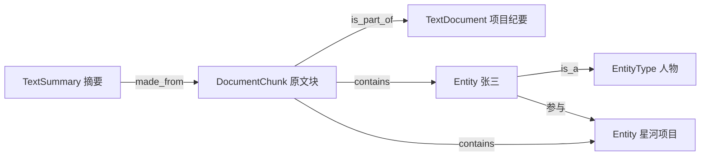
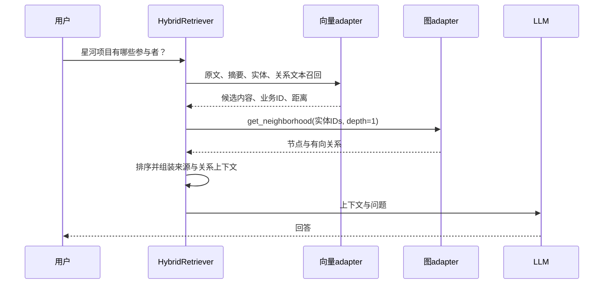
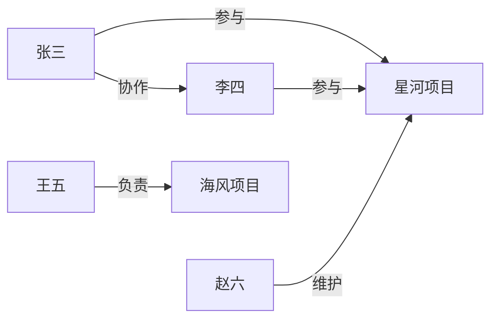
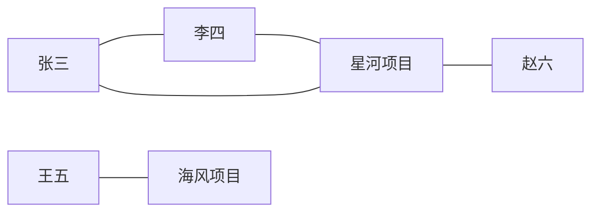
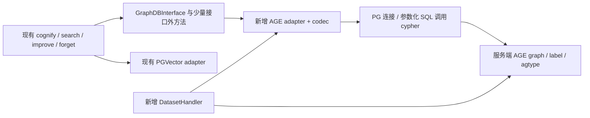
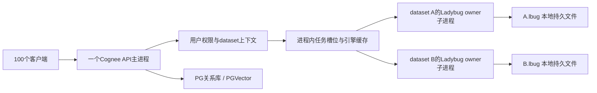
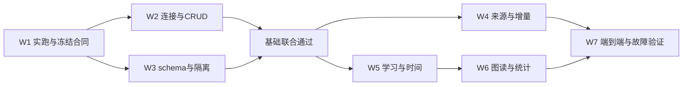

# Cognee 图数据库选型：PG、Apache AGE、Ladybug 与 100 用户部署

核验日期：2026-09-28。Cognee 固定源码 `663a2dc15d04bc0d7ec2733a2dd604b7ed1b8c8e`。本篇合并此前五份图存储报告，版本、缺口、示例、实施范围和 Agent 成本均在正文；原稿由 Git 历史保留。

阅读顺序是：先理解一份文档怎样进入 Cognee，再看普通 PG 缺什么、AGE 能补什么，最后判断 Ladybug 与其他数据库是否更适合 100 用户。证据统一分三类：**源码事实**（已有实现、解析器、上游回归）、**建议设计**（仍须开发）、**运行证据**（实际执行的结果）。没有运行的数据库组合、并发规模和云实例，不能写成已经通过。

本文由三个子 Agent 分别核查 AGE/Cognee 合同、Ladybug/100用户、其他数据库/许可证，主 Agent 复核云厂商资料、交叉检查并合并。单靠静态代码不能证明生产吞吐或 Agent 开发速度，相关数字均明确限定为预算或测试场景。

<a id="overview"></a>
## 1. 先说清楚选型结论

| 问题 | 能够据证据作出的结论 |
|---|---|
| 纯 PG 必须再装图数据库才能存 Cognee 图吗？ | 不必须。已有 demo adapter 用普通节点/边表实现部分图合同；但它的缺失接口与性能边界客观存在，不能作为完整生产替换承诺。 |
| 哪个 AGE 版本开箱即用支持整个 Cognee？ | 本次核查的版本中没有。Cognee 没有 AGE adapter；1.8 也没有 APOC/GDS 兼容库。 |
| AGE 是否值得二次开发？ | 固定 PG18＋AGE1.8 有核心原语支持，适配方案可进入验证；它不是保证消除 JOIN 或保证提速的方案。主要开发发生在 Cognee 适配层，未发现本范围必须改 AGE 内核的证据。 |
| 华为云 RDS 能直接用 AGE 吗？ | 已公开提供相应 PG 主版本，插件清单未列 AGE。客户端适配不能补出服务器缺少的扩展。可另部署图服务，或用 ECS/容器自管 PG＋AGE。 |
| 不用 AGE，可以用 Ladybug 吗？ | 可以把当前默认 Ladybug 作为优先验证对象：已有业务接口，避免从零开发 AGE adapter；但文件所有权、同库并发、统计语义和进程生命周期必须按后文处理。 |
| 100 用户能否共用一个 Cognee？ | 用户数量本身不构成禁止条件。关键是共享还是私有 dataset、同时读写量、进程/文件归属和资源预算；没有“100用户必失败”或“已经支持100并发”的实测结论。 |
| 是否存在友好非 GPL 候选？ | 有，后文固定版本核查 MIT/Apache-2.0 的 Ladybug、AGE、ArcadeDB、HugeGraph、JanusGraph、NebulaGraph；许可证通过不代表 Cognee 合同或多租户自动通过。 |

可直接定位：[当前架构](#architecture) · [普通PG缺口](#plain-pg) · [AGE版本与华为云](#age-versions) · [每项缺口的业务后果](#age-gaps) · [APOC/GDS十项例子](#apoc-gds) · [AGE执行机制](#age-performance) · [适配方案](#age-adapter) · [Ladybug与100用户](#ladybug) · [其他开源选项](#alternatives) · [全Agent成本](#agent-cost) · [验收与决策](#acceptance)。

<a id="architecture"></a>
## 2. 先看 Cognee 当前架构：图不是一个独立的“文档依赖模块”

Cognee 的普通文档路径组织的是知识图；代码仓库路径才更直接包含 calls/imports 等依赖关系。图数据库不负责读懂自然语言，LLM 与模型转换先把文本变成结构化节点和边，adapter 再保存这些结构。[官方架构](https://docs.cognee.ai/core-concepts/architecture)描述关系、向量和图三个职责；具体实现以固定提交为准。

| 存储职责 | 保存什么 | 在一次提问中解决什么问题 |
|---|---|---|
| 原文件/对象存储 | 上传文件、原文位置 | 原始内容从哪里读取 |
| 关系库，SQLite或PG | 用户、dataset、ACL、Data、运行记录、部分来源登记 | 当前用户能访问哪些数据、任务执行到哪里 |
| 向量库，LanceDB或PGVector等 | chunk/实体/摘要/关系文本的embedding与payload | 找到与问题语义相近的候选 |
| 图库，默认Ladybug | 文档、chunk、实体、类型、关系、来源与学习状态 | 把候选与关联事实、原文来源连起来 |
| 会话存储 | Q&A、trace、反馈与session context | 当前会话记忆；并非每条消息立即写永久图 |

例如用户输入“张三和李四参与星河项目”。这不是只保存一句话或一个向量。抽取后可能形成下图；业务关系名是教学示例，实际由抽取模型与本体决定。


```mermaid
flowchart LR
  S[TextSummary 摘要] -->|made_from| C[DocumentChunk 原文块]
  C -->|is_part_of| D[TextDocument 项目纪要]
  C -->|contains| Z[Entity 张三]
  C -->|contains| X[Entity 星河项目]
  Z -->|is_a| T[EntityType 人物]
  Z -->|参与| X
```

`Entity` 是模型类型，“人物”是 `is_a` 指向的语义类型。`belongs_to_set` 是同一图内部的内容分组，不能替代 dataset 权限隔离。模型依据：[DocumentChunk](https://github.com/topoteretes/cognee/blob/663a2dc15d04bc0d7ec2733a2dd604b7ed1b8c8e/cognee/modules/chunking/models/DocumentChunk.py#L32)、[Entity](https://github.com/topoteretes/cognee/blob/663a2dc15d04bc0d7ec2733a2dd604b7ed1b8c8e/cognee/modules/engine/models/Entity.py#L5)、[Summary](https://github.com/topoteretes/cognee/blob/663a2dc15d04bc0d7ec2733a2dd604b7ed1b8c8e/cognee/tasks/summarization/models.py#L22)。

### 2.1 输入、存储和检索如何连接

永久记忆路径是 `remember → add → cognify → 抽取/切块/摘要 → add_data_points`。`get_graph_from_model` 递归展开 DataPoint：普通值变属性，对象引用变边，列表引用变多条边。`remember(session_id=...)` 还可能先使用会话缓存，因此不能把所有 remember 调用都解释成即时永久入图。[模型转换](https://github.com/topoteretes/cognee/blob/663a2dc15d04bc0d7ec2733a2dd604b7ed1b8c8e/cognee/modules/graph/utils/get_graph_from_model.py#L87)、[存储编排](https://github.com/topoteretes/cognee/blob/663a2dc15d04bc0d7ec2733a2dd604b7ed1b8c8e/cognee/tasks/storage/add_data_points.py#L250)、[remember](https://github.com/topoteretes/cognee/blob/663a2dc15d04bc0d7ec2733a2dd604b7ed1b8c8e/cognee/api/v1/remember/remember.py#L1801)。

节点通常通过同一个业务 UUID 关联图与向量。例：向量召回得到“星河”的 UUID，再用这个 ID 查图里的参与者。关系文本索引是例外：同名关系文本可以共享一条向量记录；它的 ID 不能当作具体边的 `edge_object_id`。[节点索引](https://github.com/topoteretes/cognee/blob/663a2dc15d04bc0d7ec2733a2dd604b7ed1b8c8e/cognee/tasks/storage/index_data_points.py#L53)、[边文本索引](https://github.com/topoteretes/cognee/blob/663a2dc15d04bc0d7ec2733a2dd604b7ed1b8c8e/cognee/tasks/storage/index_graph_edges.py#L39)。


```mermaid
sequenceDiagram
 participant U as 用户
 participant R as HybridRetriever
 participant V as 向量adapter
 participant G as 图adapter
 participant L as LLM
 U->>R: 星河项目有哪些参与者？
 R->>V: 原文、摘要、实体、关系文本召回
 V-->>R: 候选内容、业务ID、距离
 R->>G: get_neighborhood(实体IDs, depth=1)
 G-->>R: 节点与有向关系
 R->>R: 排序并组装来源与关系上下文
 R->>L: 上下文与问题
 L-->>U: 回答
```

这条默认 HYBRID 路径的一跳扩展在 [hybrid/entities.py](https://github.com/topoteretes/cognee/blob/663a2dc15d04bc0d7ec2733a2dd604b7ed1b8c8e/cognee/modules/retrieval/hybrid/entities.py#L43)。其他 GRAPH_COMPLETION 路径还会使用筛选子图、三元组与应用层排序，不能把所有检索简化成一跳。邻域读取出错可能降级为没有关系的实体上下文，因此“仍能回答”不能证明图检索成功；应检查实际上下文和日志。

### 2.2 为什么后端可以换，但不能只换连接串

上层调用的是 `GraphDBInterface` 的 Python 方法；节点返回 `(id, properties)`，边返回 `(source_id, target_id, relationship_name, properties)`。业务知识已结构化，所以新 adapter 不需要重写文档抽取与 LLM，只需正确实现这些方法及状态合同。[公共接口](https://github.com/topoteretes/cognee/blob/663a2dc15d04bc0d7ec2733a2dd604b7ed1b8c8e/cognee/infrastructure/databases/graph/graph_db_interface.py#L16)。

但接口不仅要求“能读一条边”。文档 A、B 同时支持“张三参与星河”，撤回 A 应只去掉 A 的来源；若直接删张三节点，B 的知识也丢了。来源删除规划、run 回滚、反馈、事实有效期和租户生命周期都属于后端必须保持的语义。[来源删除规划](https://github.com/topoteretes/cognee/blob/663a2dc15d04bc0d7ec2733a2dd604b7ed1b8c8e/cognee/infrastructure/databases/unified/provenance_delete_planner.py#L90)。

图写入、节点向量索引、边写入、关系向量索引等分阶段进行。某批边写失败时，此前节点和节点向量可能已存在；PG图和PGVector放同一服务器也不自动变成一个事务。适配方案必须保留补偿与重试，不把“同库”写成“全流程原子”。

代码依赖图另走 `tasks/code_graph`：CodeRepository/CodeModule/CodeSymbol 等模型和 calls/imports 关系进入同一图协议；CodeRetriever 可先读取代码子图，再在应用层遍历与影响分析。该路径向量索引是可选，不能声称每种图检索都依赖向量或 GDS。[代码模型](https://github.com/topoteretes/cognee/blob/663a2dc15d04bc0d7ec2733a2dd604b7ed1b8c8e/cognee/tasks/code_graph/models.py#L29)、[代码检索](https://github.com/topoteretes/cognee/blob/663a2dc15d04bc0d7ec2733a2dd604b7ed1b8c8e/cognee/modules/retrieval/code_retriever.py#L857)。


<a id="plain-pg"></a>
## 3. 普通 PG：图怎么存，缺口究竟在数据库还是适配器

这里的“PG支持”必须分两层：PG能表达节点、关系和属性；当前开源 `postgres_demo` 是否实现调用方要用的方法。只配置 `DB_PROVIDER=postgres` 改的是关系库；只配置 PGVector 改的是向量库，二者都不会自动切换图后端。

### 3.1 具体落表与网络协议

已有 PG 图 adapter 用 SQLAlchemy＋asyncpg 发送普通 SQL；华为云 RDS 接收标准 PG 协议。内部 `get_neighborhood` 是 Python 图接口，外部网络协议仍是 PostgreSQL。没有隐藏的 Cypher→SQL万能网关，也没有把边转换成向量来代替图。


以示意 ID（实际为 UUID）说明 PG 的物理映射：

| 表 | 示例行 |
|---|---|
| graph_node | id=A，name=张三，type=Entity，properties={description: ...} |
| graph_node | id=P，name=项目X，type=Entity，properties={...} |
| graph_node | id=T，name=person，type=EntityType，properties={...} |
| graph_edge | source_id=A，target_id=P，relationship_name=responsible_for |
| graph_edge | source_id=A，target_id=T，relationship_name=is_a |

[PG 表定义](https://github.com/topoteretes/cognee/blob/663a2dc15d04bc0d7ec2733a2dd604b7ed1b8c8e/cognee/infrastructure/databases/graph/postgres_demo/tables.py#L27)保留方向、类型和属性；源/目标列是外键，边身份是三列复合主键。节点写入用 ON CONFLICT 按 ID 更新，边按其复合身份更新。

实体向量命中 P 后，PG adapter 的一跳边查询为：

```sql
SELECT source_id, target_id, relationship_name, properties
FROM graph_edge
WHERE source_id = ANY(:ids) OR target_id = ANY(:ids);
```

这里 :ids 是 SQLAlchemy 绑定参数，值为命中的节点 ID 集合。再收集返回边的端点，按 ID 取 graph_node，组装上述 Node/EdgeData。证据：[adapter.py](https://github.com/topoteretes/cognee/blob/663a2dc15d04bc0d7ec2733a2dd604b7ed1b8c8e/cognee/infrastructure/databases/graph/postgres_demo/adapter.py#L663)。

检索器收到的仍是“哪些节点通过哪些边连接”，后续排序和回答逻辑继续复用。多跳时 PG adapter 在 Python 做 BFS，每跳执行有端点过滤的 SQL；Neo4j/Ladybug 可以在图查询中展开路径。语义可相近，执行代价不同。[官方 Adapter 指南](https://docs.cognee.ai/guides/graph-engine-adapters)也介绍了这个工厂和适配器分层。

当前真实表结构的职责如下。[完整表定义](https://github.com/topoteretes/cognee/blob/663a2dc15d04bc0d7ec2733a2dd604b7ed1b8c8e/cognee/infrastructure/databases/graph/postgres_demo/tables.py#L28)。

| 表 | 原生列 | 用途与约束 |
|---|---|---|
| `graph_node` | `id` 主键，`name`，`type`，`properties JSONB`，来源数组，创建/更新时间 | 一行一个节点；不同类型的属性放 JSONB，避免每增加一种节点模型都建表 |
| `graph_edge` | `source_id`、`target_id`、`relationship_name` 复合主键，`properties JSONB`，来源数组，时间列 | 一行一条具体关系；端点是节点外键，删除节点会级联删除关联边 |
| `graph_metadata` | `key` 主键、`value` | 保存 provenance 版本、删除模式等图级标记，不是用户权限表 |

边的复合主键意味着：同一图内，同一源节点、目标节点和关系名合并为一条边。反方向、不同关系名可以共存；多个文档声明同一关系时，通常增加来源引用，不会自然变成多条相同三元组的物理边。如果业务要求“每条证据一条独立平行边”，需要额外设计证据节点或改变边身份模型，不能假定当前模型已经覆盖。

**来源为什么也必须存？**

假设文档 A 和 B 都声明“李工负责支付服务”。删除 A 时，应移除 A 的贡献，保留 B 仍支持的关系。这需要记录“数据是谁写入的”，仅有节点、边和外键不够。

当前节点和边都带四组数组：`source_ref_keys`、`source_dataset_ids`、`source_run_ids`、`source_run_refs`。它们分别支撑来源引用、dataset 查找、流水线运行查找及来源与运行关联。应用应复用现有编码和更新 helper，不自行猜测字符串格式。删除和失败补偿要先撤销对应引用，再判断对象是否仍有其他来源；不能把普通 `DELETE node` 的级联行为当作“删除文档”的完整业务实现。[来源列](https://github.com/topoteretes/cognee/blob/663a2dc15d04bc0d7ec2733a2dd604b7ed1b8c8e/cognee/infrastructure/databases/graph/postgres_demo/tables.py#L9)、[来源操作](https://github.com/topoteretes/cognee/blob/663a2dc15d04bc0d7ec2733a2dd604b7ed1b8c8e/cognee/infrastructure/databases/graph/postgres_demo/adapter.py#L964)。

向量表则保存向量记录 ID、payload 和 embedding，用相似度寻找候选。节点索引可通过 ID 对应回图节点；关系文本的索引 ID 与某条具体边的 `edge_object_id` 不是同一种身份。反馈更新必须找到具体边，不能把所有叫“负责”的边当成一条边。[边 ID 生成](https://github.com/topoteretes/cognee/blob/663a2dc15d04bc0d7ec2733a2dd604b7ed1b8c8e/cognee/modules/engine/utils/generate_edge_object_id.py#L4)、[向量记录模型](https://github.com/topoteretes/cognee/blob/663a2dc15d04bc0d7ec2733a2dd604b7ed1b8c8e/cognee/infrastructure/databases/vector/pgvector/PGVectorAdapter.py#L322)。

PG demo 的节点主键、边三元组主键及 ON CONFLICT 是明确的业务幂等设计。AGE换了一套物理模型后要重新落实相同约束；“PG有主键”和“AGE默认替我约束Cognee UUID”不是同一件事。

### 3.2 功能缺口与 improve 九阶段


| 模块/能力 | 当前 PG 状态 | 原因 |
|---|---|---|
| 核心图构建、邻域、子图、来源删除 | 已实现基础接口 | 普通 SQL 可表达且 adapter 已实现 |
| CYPHER / NATURAL_LANGUAGE（NL→Cypher） | 不支持 | supports_cypher_queries=False；query 未实现 |
| TEMPORAL 的时间过滤路径 | 有明确缺口 | 直接调用 collect_time_ids/collect_events，PG 无这些方法 |
| improve 的图反馈权重、truth state | 跳过相应阶段 | PG 未实现扩展方法，能力探测返回不支持 |
| close_node 写 valid_to | 不支持该更新路径 | PG 没有通用局部 update_node |
| 全部边界行为完全一致 | 不能保证 | 例如缺少端点时 PG 外键行为与某些 adapter 跳过行为不同，未实测 |

时间检索代码证据：[temporal_retriever.py](https://github.com/topoteretes/cognee/blob/663a2dc15d04bc0d7ec2733a2dd604b7ed1b8c8e/cognee/modules/retrieval/temporal_retriever.py#L124)。它只有未抽取到时间或时间查询为空时才转三元组；缺方法并没有在此捕获降级。因此 PG 支持 timestamp 列，并不能证明 Cognee TEMPORAL 已适配。

[官方 Graph Stores](https://docs.cognee.ai/setup-configuration/graph-stores)及本地 README 均将开源 PG 图后端标为 demo，生产 PG 图适配器另行授权。官网通用 Adapter 指南部分文字提到 PG raw query 可执行 SQL，但与本版本 query() 实际未实现不一致；本报告以代码和专门能力声明为准。

性能也不随接口统一而相同：PG k-hop 有多次 SQL 往返；PG 图写固定 advisory lock 会让同库 schema 写入竞争；PGVector create_vector_index 实际只建表，未自动创建 ANN 索引。可替换应分别验收功能语义、数据保真、性能与生命周期。

### `modules/improve` 的“部分支持”逐阶段说明

这里准确的目录名是 `cognee/modules/improve`。本节限定本报告的 Cognee 1.6.0 提交及开源 `postgres_demo` 图 adapter（`postgres` 是兼容别名），不是 PostgreSQL 数据库本身的能力上限，也不代表未公开的商业 PG adapter。

只把关系数据库或向量数据库换成 PG，不会触发下面的图能力缺口；决定反馈/truth 支持的是**当前 dataset 实际使用的 graph adapter**。以下“有条件支持”表示调用链所需图接口在 PG adapter 中已有实现或有明确兼容路径，**不是本次已完成数据库+LLM端到端运行验收**。session store、LLM、embedding 和权限仍需分别配置。

当前共有九个阶段，顺序由 [registry.py](https://github.com/topoteretes/cognee/blob/663a2dc15d04bc0d7ec2733a2dd604b7ed1b8c8e/cognee/modules/improve/registry.py#L31) 固定：

| 阶段 | 实际做什么、数据落哪里 | 开源 PG 图后端状态 | 执行条件与限制 |
|---|---|---|---|
| `feedback_weights` | 根据 session 中的评分及回答使用过的节点/边，更新图元素的 `feedback_weight` | **不支持；正常能力探测后跳过** | 缺少节点/边反馈权重的批量读写方法；有 session 时才进入后端能力检查 |
| `persist_session_qa` | 读取新 Q&A，转文本后 `add+cognify`，落永久图和向量索引 | **有条件支持** | 需要 session 与新内容、可用的摄入/抽取链；无新条目可返回 `already_completed`；这是唯一 fatal 阶段 |
| `persist_agent_traces` | 读取未持久化的 agent trace 反馈文本，`add+cognify` 入图 | **有条件支持** | 默认持久化 `session_feedback` 内容，不是保证写入所有原始 trace；无新步骤可不执行 |
| `extract_agent_context` | 从待处理 trace 提取 agent lessons，写 session context | **不依赖 PG 图专用扩展** | 需要可用 session manager、AUTO_FEEDBACK 和 LLM；此步本身不是更新图权重 |
| `distill_sessions` | 从通过门禁的 session guidance 蒸馏经验，渲染文档再 `add+cognify` | **有条件支持** | 需要 session、LLM及可蒸馏内容；没有合适 guidance 时可能不产出文档 |
| `update_user_preferences` | 写 `UserPreference` 节点和带 `weight/updated_at_turn` 的 `prefers` 边，更新文本、衰减并清理偏好 | **支持兼容路径** | 需开启 personalization；PG 缺局部 `update_node`，此模块明确回退完整节点 upsert；PG 能按三元组删除偏好边 |
| `build_truth_subspace` | 从 `session_learnings` 建学习向量质心，对 chunk 计算并保存 `truth_alignment/truth_epoch`，用于可选重排 | **不支持；正常能力探测后跳过** | 必须先显式 opt-in、提供 session；PG 缺 `get_node_truth_state/set_node_truth_state`；不是自动事实真伪验证 |
| `triplet_enrichment` | 分页读 source-edge-target 三元组，形成 Triplet embedding 并写向量索引 | **默认任务有条件支持** | PG 有 `get_triplets_batch`；需要开启 `triplet_embedding`（默认 false）；自定义 memify tasks 需另查接口，不能统一承诺 |
| `global_context_index` | 读取已有摘要，构建 bucket/root 层次摘要节点、`summarized_in` 边及向量索引 | **有条件支持** | 显式 opt-in、LLM、摘要与正常来源结构；improve 选用实验性 graph bucketing；相关读取可能加载较大图，需测规模成本 |

阶段源码：[会话持久化](https://github.com/topoteretes/cognee/blob/663a2dc15d04bc0d7ec2733a2dd604b7ed1b8c8e/cognee/modules/improve/stages.py#L110)、[上下文提取与蒸馏](https://github.com/topoteretes/cognee/blob/663a2dc15d04bc0d7ec2733a2dd604b7ed1b8c8e/cognee/modules/improve/stages.py#L168)、[偏好与 truth 门禁](https://github.com/topoteretes/cognee/blob/663a2dc15d04bc0d7ec2733a2dd604b7ed1b8c8e/cognee/modules/improve/stages.py#L285)、[triplet 与 global context](https://github.com/topoteretes/cognee/blob/663a2dc15d04bc0d7ec2733a2dd604b7ed1b8c8e/cognee/modules/improve/stages.py#L378)。

**缺失一：全局图反馈权重，不等于所有反馈能力都不能用。**

该阶段实际要用 `get_node_feedback_weights`、`set_node_feedback_weights`、`get_edge_feedback_weights`、`set_edge_feedback_weights`。PG 没有覆盖这些方法，继承的是抛 `NotImplementedError` 的接口占位实现；能力探测检查两个 setter 是否覆盖，因此 `supports_feedback_weights=False`，阶段通常返回 `skipped / backend_unsupported`。[接口定义](https://github.com/topoteretes/cognee/blob/663a2dc15d04bc0d7ec2733a2dd604b7ed1b8c8e/cognee/infrastructure/databases/graph/graph_db_interface.py#L757)、[能力探测](https://github.com/topoteretes/cognee/blob/663a2dc15d04bc0d7ec2733a2dd604b7ed1b8c8e/cognee/modules/improve/capabilities.py#L23)、[实际权重读写](https://github.com/topoteretes/cognee/blob/663a2dc15d04bc0d7ec2733a2dd604b7ed1b8c8e/cognee/tasks/memify/apply_feedback_weights.py#L268)。

例如用户给上轮回答差评，session 仍可以记录这个评分；但上述阶段不会据此改动回答引用过的普通图节点/边的 `feedback_weight`。只调 `feedback_influence` 是读取侧排序配置，不会补出缺失的权重写入。

用户偏好则是另一套图结构：`UserPreference → prefers → 内容节点`，权重在这条偏好边上。它使用 PG 已支持的邻域、`add_nodes/add_edges` 和 `delete_edge_triples`；对缺失 `update_node` 有完整模型 upsert 回退。因此**全局反馈权重不支持，不能推导用户个性化偏好不支持**。偏好节点不走 embedding 索引。[偏好回退](https://github.com/topoteretes/cognee/blob/663a2dc15d04bc0d7ec2733a2dd604b7ed1b8c8e/cognee/modules/user_preferences/store.py#L92)、[偏好边写删](https://github.com/topoteretes/cognee/blob/663a2dc15d04bc0d7ec2733a2dd604b7ed1b8c8e/cognee/modules/user_preferences/store.py#L146)。

**缺失二：truth subspace 坐标状态，不是所有经验蒸馏都失效。**

`distill_sessions` 可以先把经验文档构图。`build_truth_subspace` 是后续可选步骤：将这些 learnings 转为质心，把 chunk 投影为坐标，将 `truth_alignment` 与 `truth_epoch` 存到图节点，最后提交匹配 epoch 的质心。在 PG 上，`get_node_truth_state/set_node_truth_state` 未实现，阶段门禁阻止执行；直接调用 build 函数也会在 embedding 前重新检查并返回不支持。[构建的能力检查](https://github.com/topoteretes/cognee/blob/663a2dc15d04bc0d7ec2733a2dd604b7ed1b8c8e/cognee/modules/truth_subspace/build.py#L202)、[保存字段](https://github.com/topoteretes/cognee/blob/663a2dc15d04bc0d7ec2733a2dd604b7ed1b8c8e/cognee/modules/truth_subspace/build.py#L373)。

结果是不能通过这套自动构建路径获得对应的 truth alignment 重排信号；普通 Hybrid 检索仍可以运行。读取 truth context 时遇到缺失状态/异常也会回到 baseline ranking。[读取侧降级](https://github.com/topoteretes/cognee/blob/663a2dc15d04bc0d7ec2733a2dd604b7ed1b8c8e/cognee/modules/retrieval/hybrid/truth.py#L21)。这项名字虽然叫 truth，但本质是相对经验向量空间的对齐，不是数据库替应用验证事实真实性。

**其余兼容链不是只根据“没有 capability gate”猜测。**

- Q&A 和 trace 持久化最终分别调用 `add+cognify`；蒸馏也走同样路径，不调用缺失的反馈/truth setter。[Q&A](https://github.com/topoteretes/cognee/blob/663a2dc15d04bc0d7ec2733a2dd604b7ed1b8c8e/cognee/tasks/memify/cognify_session.py#L62)、[trace](https://github.com/topoteretes/cognee/blob/663a2dc15d04bc0d7ec2733a2dd604b7ed1b8c8e/cognee/tasks/memify/cognify_agent_trace_feedback.py#L79)、[蒸馏保存](https://github.com/topoteretes/cognee/blob/663a2dc15d04bc0d7ec2733a2dd604b7ed1b8c8e/cognee/modules/session_distillation/distill.py#L433)。
- Agent context 提取把候选经验交给 session context applier，然后更新 trace 水位；不是直接修改 PG 图权重。[agent context](https://github.com/topoteretes/cognee/blob/663a2dc15d04bc0d7ec2733a2dd604b7ed1b8c8e/cognee/infrastructure/session/agent_context_extraction.py#L263)。
- 默认 triplet enrichment 调 `get_triplets_batch → index_data_points`；PG 通过 source/edge/target JOIN 分页返回三元组，向量侧再 embedding/index。[默认任务](https://github.com/topoteretes/cognee/blob/663a2dc15d04bc0d7ec2733a2dd604b7ed1b8c8e/cognee/memify_pipelines/memify_default_tasks.py#L6)、[PG 三元组读取](https://github.com/topoteretes/cognee/blob/663a2dc15d04bc0d7ec2733a2dd604b7ed1b8c8e/cognee/infrastructure/databases/graph/postgres_demo/adapter.py#L1437)。
- Global context 读取摘要投影、来源及 summary→chunk→entity 关系，写摘要 DataPoint 与 `summarized_in` 边；所用图读取/upsert/delete/provenance 接口在 PG 有实现，无需 Cypher。图 provenance 分支会调用 `get_graph_data`，兼容不等于大图场景便宜。[输入读取](https://github.com/topoteretes/cognee/blob/663a2dc15d04bc0d7ec2733a2dd604b7ed1b8c8e/cognee/modules/graph/methods/get_global_context_graph_inputs.py#L71)、[摘要和结构边保存](https://github.com/topoteretes/cognee/blob/663a2dc15d04bc0d7ec2733a2dd604b7ed1b8c8e/cognee/tasks/memify/global_context_index/persist.py#L74)。

**另外，`close_node` 的缺口独立于九阶段。**

`close_node(old_id)` 通过通用 `update_node` 给旧事实写 `valid_to`，表示失效但保留历史。PG 未实现这个局部更新接口，该 helper 捕获 `NotImplementedError`、记录 warning 并返回 `False`，**不会真的写入失效时间**。它不像用户偏好模块，没有完整 upsert 的兼容回退。`update_chunk_index` 虽然在 PG 已实现，但只是特定字段更新，不能代替通用 `update_node`。所以原报告的“事实维护”表述应细分为文档增量更新、偏好更新与事实有效期更新。[close_node](https://github.com/topoteretes/cognee/blob/663a2dc15d04bc0d7ec2733a2dd604b7ed1b8c8e/cognee/tasks/storage/close_node.py#L21)。

**如何解读一次 improve 的结果。**

每阶段返回 `status/reason/error/counts`。判定顺序是配置关闭 → 缺 session → 阶段自己的 gate，所以同一个不受 PG 支持的功能，也可能先显示 `no_session_ids` 或 `opt_in_disabled`，而不是 `backend_unsupported`。无新内容可显示 `already_completed`；正常执行没有产出也不代表数据库缺能力。[通用门禁](https://github.com/topoteretes/cognee/blob/663a2dc15d04bc0d7ec2733a2dd604b7ed1b8c8e/cognee/modules/improve/stage.py#L44)。

非 fatal 阶段失败通常记录 `errored` 后继续，整体结果仍会反映错误；`persist_session_qa` 失败会中止后续阶段，前台可抛异常。若能力探测本身失败，代码采用 assume-supported 策略，让阶段执行后报告错误，因此“跳过”是正常探测成功时的行为，不是无条件保证。[结果汇总](https://github.com/topoteretes/cognee/blob/663a2dc15d04bc0d7ec2733a2dd604b7ed1b8c8e/cognee/modules/improve/result.py#L225)、[探测异常策略](https://github.com/topoteretes/cognee/blob/663a2dc15d04bc0d7ec2733a2dd604b7ed1b8c8e/cognee/modules/improve/capabilities.py#L90)。

因此准确结论是：**九阶段中，图反馈权重与 truth state 两项被当前 PG adapter 明确阻断；另外七项有可用实现路径或不依赖 PG 图扩展，但是否执行取决于输入、配置和其他依赖。不能将其表示成“improve 有 7/9 的生产可用率”。**

**PG/华为云是否能补齐？**从数据表达看可以：反馈权重、truth 坐标/epoch、valid_to 都可由普通 PG 字段或 JSONB 保存，缺的是 Cognee adapter 的读写契约实现，通常不需要另装图数据库扩展。实现时必须保留原属性、正确映射节点与 edge_object_id、处理批量读写/不存在对象/并发和 dataset 作用域；truth 还需保持坐标与质心 epoch 的发布顺序。切到华为云 PG、增加 pgvector 或仅把 `supports_*` 标志改为 true，都不会自动补齐这些逻辑。本轮补充文档，没有修改 adapter 或声称这些缺口已修复。

### 3.3 缺失接口如何补：数据形状和更新合同

下面保留普通 PG 路线的具体改造依据，以说明为什么“能存数字/数组”仍不等于“已支持学习”。AGE与其他后端也必须保持这些返回值、状态保护和发布顺序；这不是建议本项目继续以普通SQL图作为最终选型。


### 反馈权重：补四个方法，数据仍是 JSONB 数值

这部分对应 improve 中当前 PG 缺少的 `feedback_weights` 图能力。上层根据反馈调整节点和具体边的权重，后续检索可利用这些状态。缺口是接口实现，不是 PG 无法保存浮点数。

| 方法 | PG 实现方向 | 必须保持的行为 |
|---|---|---|
| `get_node_feedback_weights(ids)` | 按节点主键批量查 JSONB | 只返回存在的对象；已有节点未设权重时返回默认 `0.5` |
| `set_node_feedback_weights(mapping)` | 按主键批量局部更新 | 不创建缺失节点；每个输入 ID 返回成功/失败 |
| `get_edge_feedback_weights(ids)` | 按 `properties ->> 'edge_object_id'` 查边 | ID 指具体边，不是关系名或关系文本向量 ID |
| `set_edge_feedback_weights(mapping)` | 定位真实复合主键行后局部更新 | 每个输入边 ID 返回成功/失败，保留其他属性及来源 |

参考契约见 [Ladybug 反馈实现](https://github.com/topoteretes/cognee/blob/663a2dc15d04bc0d7ec2733a2dd604b7ed1b8c8e/cognee/infrastructure/databases/graph/ladybug/adapter.py#L2474)。对于坏的存量权重，现有 adapter 的容错并不完全一致，应明确 PG 的转换和校验规则。不能把严格 `[0,1]` 校验、拒绝 NaN/Inf 描述成所有现有 adapter 已经保证的行为。

建议用数据库侧 JSONB patch，例如更新某节点权重：

```sql
UPDATE graph_node
SET properties = COALESCE(properties, '{}'::jsonb)
                 || jsonb_build_object('feedback_weight', CAST(:weight AS double precision)),
    updated_at = now()
WHERE id = :node_id
RETURNING id;
```

这样只改指定字段，避免 Python 先读整个 JSON、再写回旧副本而覆盖其他字段。生产实现仍需使用现有写事务/锁约定，处理批量和逐项结果。JSONB 合并是顶层合并，不能用它冒充递归深合并。[PG JSONB 说明](https://www.postgresql.org/docs/current/datatype-json.html)。

边 ID 查询建议增加匹配表达式的 B-tree 索引；是否可加唯一约束，要先检查历史 ID 完整性及唯一性。旧边没有 `edge_object_id` 时，应明确返回未找到，或者通过独立迁移按现有生成算法补齐，不能改用其他 ID 代替。[边 ID 写入](https://github.com/topoteretes/cognee/blob/663a2dc15d04bc0d7ec2733a2dd604b7ed1b8c8e/cognee/modules/graph/utils/prepare_edges_for_storage.py#L114)。

还有一个不同层次的问题：上层是“get → Python 计算 → set”。两个进程都读到 0.5，各自算出新值，最后一个 setter 仍可能覆盖前一个结果。原子 JSONB patch 只能避免无关字段覆盖，不能自动使每条反馈都生效。如果这是验收要求，需要增加 CAS/版本重试、数据库侧计算，或让整个读算写过程受同一个跨进程锁保护。[反馈调用方](https://github.com/topoteretes/cognee/blob/663a2dc15d04bc0d7ec2733a2dd604b7ed1b8c8e/cognee/tasks/memify/apply_feedback_weights.py#L130)。

### truth state：补两个方法，同时保留 epoch 发布协议

这里的 truth state 是检索排序所用的对齐坐标与版本，不是数据库替用户判定事实真假，也不是把原始 embedding 再复制一份。

建议继续存于节点 JSONB：`truth_alignment` 为数组，`truth_epoch` 为整数。`get_node_truth_state(ids)` 返回 `{id: {truth_alignment, truth_epoch}}`；不存在节点不返回，存在但未初始化的节点返回 `[] / None`。`set_node_truth_state(mapping)` 更新已有节点并逐项返回 bool。[参考实现](https://github.com/topoteretes/cognee/blob/663a2dc15d04bc0d7ec2733a2dd604b7ed1b8c8e/cognee/infrastructure/databases/graph/ladybug/adapter.py#L2509)。

alignment 和 epoch 必须作为一组在同一行更新中写入，避免新坐标配旧版本。现有参考行为是：未提供 epoch 或传入 None 时保留已有 epoch；不能在 PG 中擅自改为清空或自行递增。

build 的顺序是：先写 N+1 的节点坐标，最后发布 N+1 的质心；检索只使用与当前 live epoch 一致的节点状态。新 epoch 未成功发布前，读侧仍以旧 live epoch 为准，已写为 N+1 的节点会因版本不匹配而暂不参与 truth 加权，并不保证整套旧坐标仍完整保留。所有节点写入都返回 False 时，上层阻止发布；部分节点成功则可以发布新 epoch，此时未更新节点的旧坐标不参与 truth 加权。因此 setter 必须如实返回逐项结果。这要求 adapter 与调用层共同遵守协议，但不要求 PG 安装图扩展。[构建顺序](https://github.com/topoteretes/cognee/blob/663a2dc15d04bc0d7ec2733a2dd604b7ed1b8c8e/cognee/modules/truth_subspace/build.py#L407)、[检索 epoch 门禁](https://github.com/topoteretes/cognee/blob/663a2dc15d04bc0d7ec2733a2dd604b7ed1b8c8e/cognee/modules/retrieval/hybrid/ranking.py#L37)。

### `update_node` 与重复入库：比“加个 UPDATE”更容易遗漏的部分

`update_node(id, properties)` 应只覆盖指定属性，保留其他属性；空补丁、无效或不存在 ID 返回 False。节点关闭 `close_node` 需要这个方法写 `valid_to`，PG 当前没有实现该通用接口，因此不能正常完成这条更新路径。它是独立于 improve 九阶段的能力。[close_node 调用](https://github.com/topoteretes/cognee/blob/663a2dc15d04bc0d7ec2733a2dd604b7ed1b8c8e/cognee/tasks/storage/close_node.py#L21)、[参考 patch 实现](https://github.com/topoteretes/cognee/blob/663a2dc15d04bc0d7ec2733a2dd604b7ed1b8c8e/cognee/infrastructure/databases/graph/ladybug/adapter.py#L2550)。

PG 中 `id/name/type` 是原生列，其他大部分模型字段在 JSONB。实现必须规定哪些字段允许改：保护 ID 和来源字段；允许改 name/type 时要更新原生列，不能只往 JSONB 塞同名字段，导致读出的对象与 SQL 过滤所见不同。模型时间字段与数据库维护的时间列也要分清。[节点序列化](https://github.com/topoteretes/cognee/blob/663a2dc15d04bc0d7ec2733a2dd604b7ed1b8c8e/cognee/infrastructure/databases/graph/postgres_demo/adapter.py#L46)、[节点读出](https://github.com/topoteretes/cognee/blob/663a2dc15d04bc0d7ec2733a2dd604b7ed1b8c8e/cognee/infrastructure/databases/graph/postgres_demo/adapter.py#L440)。

必须一并审查现有 `add_nodes/add_edges`：冲突更新使用 `properties = EXCLUDED.properties`，即整体替换 JSONB。某节点学到了 feedback/truth 或设置了 valid_to，后来一次全量 upsert 的输入没有这些字段，或者新模型携带默认权重/null，就可能清掉或重置它们。模型完整序列化会包含默认值，因此不能仅在新 JSON 缺少键时保留旧状态；必须区分普通摄入与显式状态重置。不是每次 cognify 都必然触发该情况，但“实际走到全量重写”的路径必须覆盖。来源数组已有单独保留逻辑，不能据此推断 JSONB 状态也被保留。[节点序列化](https://github.com/topoteretes/cognee/blob/663a2dc15d04bc0d7ec2733a2dd604b7ed1b8c8e/cognee/infrastructure/databases/graph/postgres_demo/adapter.py#L46)、[节点 upsert](https://github.com/topoteretes/cognee/blob/663a2dc15d04bc0d7ec2733a2dd604b7ed1b8c8e/cognee/infrastructure/databases/graph/postgres_demo/adapter.py#L348)、[边 upsert](https://github.com/topoteretes/cognee/blob/663a2dc15d04bc0d7ec2733a2dd604b7ed1b8c8e/cognee/infrastructure/databases/graph/postgres_demo/adapter.py#L471)。

建议明确字段归属，而不是对所有属性盲目使用“旧值 || 新值”：

| 字段类别 | 建议写入规则 |
|---|---|
| 抽取/文档模型负责的业务属性 | 由新模型替换；需要支持业务字段删除，不能无限保留旧键 |
| feedback 等学习状态 | 同一对象身份下保留，重置走明确入口 |
| truth 等派生状态 | 内容未改变时可保留；内容或模型改变时需失效并重算，不能永久沿用旧坐标 |
| valid_to 等生命周期状态 | 由生命周期操作控制；重新入库是否重开必须显式定义 |
| provenance | 继续调用专门的引用维护逻辑，不混入通用属性 patch |

短期可在同一 JSONB 中按保留键和失效规则实现；长期若状态更新频繁，可评估单独状态列/状态表。后者隔离字段归属更清楚，但增加 join、迁移和维护工作，不纳入最小补齐范围。

### Temporal：普通 SQL 可实现，但要复制真实语义

需要新增 `collect_time_ids` 与 `collect_events`。参考 Ladybug，前者筛选 Timestamp 节点，`time_at` 是 UTC epoch 毫秒；上下界均包含。后者从时间节点沿任意关系无向走 1～2 跳，收集去重的 Event，返回 `[{"events": [...]}]`，空结果也保留这个外层结构。[时间节点生成](https://github.com/topoteretes/cognee/blob/663a2dc15d04bc0d7ec2733a2dd604b7ed1b8c8e/cognee/modules/engine/utils/generate_timestamp_datapoint.py#L39)、[两方法参考实现](https://github.com/topoteretes/cognee/blob/663a2dc15d04bc0d7ec2733a2dd604b7ed1b8c8e/cognee/infrastructure/databases/graph/ladybug/adapter.py#L3701)。

PG 可按 `type='Timestamp'` 和 JSONB 时间值过滤，再用两层边连接或有界递归找到 Event，无需图查询语言。应使用参数化 ID 列表，避免复制某些 adapter 中“先拼带引号 ID 字符串”的做法。时间表达式索引必须匹配查询，并先处理历史缺值和非法数字，不能直接对脏数据强制 bigint 转换后建索引。

两点需要作为产品边界写清楚：

- 当前逻辑是“时间点落在区间内 → 找附近事件”，不等同于严格的“事件持续区间与查询区间相交”。跨越整个查询区间、两个端点都在区间外的事件可能不被命中；升级为区间相交检索另计。
- 当前 TemporalRetriever 先做全局 `Event_name` 向量 top_k，再给时间候选打分；不在该 top_k 内的候选缺少有限分数。补齐 PG 方法不自动改善这部分排序，若改成候选集内打分，需要额外检索质量评测。[TemporalRetriever](https://github.com/topoteretes/cognee/blob/663a2dc15d04bc0d7ec2733a2dd604b7ed1b8c8e/cognee/modules/retrieval/temporal_retriever.py#L109)。

### 生产化最主要的改造及其原因

| 当前代码事实 | 对实际负载的影响 | 建议与验证 |
|---|---|---|
| 图写入采用固定 advisory lock key `5522063` | 同一数据库内不同 dataset schema 也竞争同一把写锁；读不取此锁 | 改为稳定的 schema/图级锁键，保留同图正确性；跨进程验证。滚动升级期间新旧锁协议不一致，须协调停写切换或兼容过渡 |
| BFS 已按前沿端点查询，有端点索引 | 不是每层必然全表扫描，但 hub 节点/高深度仍可产生巨大结果与网络传输 | 增加节点/边/时间预算、超限语义及指标；按真实图度分布压测 |
| 部分属性过滤先读整张节点表再 Python 过滤 | 大图时增加数据库到应用的数据量和内存 | 将允许的条件下推 SQL，按真实条件组合评估索引 |
| 来源数组有 GIN，但部分查询写为 `:token = ANY(array)` | 有索引不代表该谓词能使用它 | 改为匹配数组 GIN 的 `@>` 等表达式，检查 NULL/空数组语义，用 EXPLAIN 验证 |
| 三元组使用 OFFSET 分页，每批独立 session | 深分页成本增长；并发增删可能重复或漏项 | 加游标分页或明确一致快照策略，兼容旧 offset 接口 |
| 初始化仅 `create_all(checkfirst=True)` | 能建新表，不会完成现有 schema 的列/索引升级 | 增加 schema 版本、迁移、回填、失败恢复；覆盖所有已有 dataset schema |
| PGVector 的 `create_vector_index` 创建 collection 表 | 名称包含 index，不表示已建 HNSW/IVFFlat | 按实际维度、距离类型、版本、数据量建立 ANN 策略并测召回与延迟 |
| 图、向量、关系库分开提交 | 同实例不等于全流程原子提交 | 验证现有补偿；需要 durable job/outbox 或单事务重构时另立项目 |

证据：[写锁](https://github.com/topoteretes/cognee/blob/663a2dc15d04bc0d7ec2733a2dd604b7ed1b8c8e/cognee/infrastructure/databases/graph/postgres_demo/adapter.py#L104)、[全量读取后过滤](https://github.com/topoteretes/cognee/blob/663a2dc15d04bc0d7ec2733a2dd604b7ed1b8c8e/cognee/infrastructure/databases/graph/postgres_demo/adapter.py#L816)、[来源查找](https://github.com/topoteretes/cognee/blob/663a2dc15d04bc0d7ec2733a2dd604b7ed1b8c8e/cognee/infrastructure/databases/graph/postgres_demo/adapter.py#L1230)、[分页](https://github.com/topoteretes/cognee/blob/663a2dc15d04bc0d7ec2733a2dd604b7ed1b8c8e/cognee/infrastructure/databases/graph/postgres_demo/adapter.py#L1437)、[初始化](https://github.com/topoteretes/cognee/blob/663a2dc15d04bc0d7ec2733a2dd604b7ed1b8c8e/cognee/infrastructure/databases/graph/postgres_demo/adapter.py#L305)、[向量 collection 创建](https://github.com/topoteretes/cognee/blob/663a2dc15d04bc0d7ec2733a2dd604b7ed1b8c8e/cognee/infrastructure/databases/vector/pgvector/PGVectorAdapter.py#L485)。PG 官方列出了 GIN 数组运算符支持范围，不能将标量 ANY 写法和数组包含运算符视作同一个索引条件。[PG GIN 文档](https://www.postgresql.org/docs/17/gin.html)。

这里可以判断风险来源，不能据此给出“PG 比 Neo4j 慢几倍”或“支持千万节点”的结论。需将数据库时间、网络往返、应用图展开、embedding、LLM 调用分开测量，否则端到端延迟不能归因于图存储。

### 3.4 把工程限制翻译成用户遇到的事

| 已识别限制 | 具体用例及后果 | 修复后还需证明什么 |
|---|---|---|
| 同库固定写锁 | 甲、乙写各自schema的私有资料，也可能竞争同一把图写锁；隔离数据不等于隔离写入等待 | 改图级锁并测跨进程一致性，迁移期间旧新锁协议要协调 |
| 多跳往返/高度节点 | 星河关联了大量人员和文档，一跳frontier已很大，再扩两跳会传输大量候选；不是每次都全表扫描 | 限制节点/边/时间预算，并测实际召回是否被截断 |
| Python属性过滤 | 只想找一个部门的实体，却先取出全库节点再过滤 | 下推条件、匹配索引；测扫描和返回行数 |
| 来源数组谓词与索引不匹配 | 撤回一个文档时，希望快速找出它支持过的边，写成不匹配GIN的条件仍可能扫大量行 | 对实际SQL执行EXPLAIN；不能只检查索引存在 |
| OFFSET跨事务分页 | 分页构建Triplet索引时，另一任务在前面插入/删除边，后续页可能重复或漏项 | 稳定游标或一致快照，重放并发增删 |
| create_all不是迁移 | 旧dataset已有表，升级新增反馈索引后仅调用create_all不会补齐结构 | 每dataset迁移版本、回填、失败恢复 |
| 向量建表不是ANN | 10万条chunk写入后能检索，不说明已经通过HNSW加速 | 核实真实索引、距离算子、维度与召回率；图库替换不替你解决向量瓶颈 |
| 图/向量分开提交 | 图节点已存在，embedding写失败；重试不能再复制图节点或误删他人来源 | 幂等、补偿、故障注入，必要时另做durable job/outbox |

以上都来自上一节的具体源码接点。它们说明需要优化什么，不能推出纯PG在所有负载下都不现实；同样不能因为SQL行数少就宣布快。本文按用户关注点继续评估AGE，但保留这条证据边界。


<a id="age-versions"></a>
## 4. AGE与PG的版本矩阵，以及华为云能否部署


必须选择对应 PG 主版本的 AGE 发布包。下表覆盖本轮核验的 1.6～1.8 正式发布组合；不代表 AGE 的全部历史版本，也不声称其他组合绝对不能自行移植。

| AGE 版本 | 已核实正式发布的 PG 组合 | 华为云 RDS 是否提供这些 PG 主版本 | 华为云标准 RDS 是否公开列出 AGE 插件 | 当前是否可直接切换 Cognee |
|---|---|---|---|---|
| **1.6.0** | **PG14、PG15、PG16、PG17**，各用对应包 | 是 | **未列出** | 否，需要新 adapter |
| **1.7.0** | **PG17、PG18**，各用对应包 | 是 | **未列出** | 否，需要新 adapter |
| **1.8.0** | **PG18**，本轮正式基线 | 是 | **未列出** | 否，需要新 adapter |
| 1.8.0 / PG15 候选 | GitHub 条目仍为 prerelease，说明待 PMC 批准 | PG15 本身有 | 未列出 | 不作为正式交付基线 |

正式发布身份交叉核对 [Apache 分发目录](https://dist.apache.org/repos/dist/release/age/)、[PG17 的 1.6 发布](https://github.com/apache/age/releases/tag/PG17%2Fv1.6.0-rc0)、[PG18 的 1.7 发布](https://github.com/apache/age/releases/tag/PG18%2Fv1.7.0-rc0)、[PG18 的 1.8 发布](https://github.com/apache/age/releases/tag/PG18%2Fv1.8.0-rc0)和[PG15 候选](https://github.com/apache/age/releases/tag/PG15%2Fv1.8.0-rc0)。当日元数据见[发布证据快照](evidence/age-version-evidence-20260928.json)。部分正式 tag 仍带 `rc0`，不能只看名字判断候选身份；也不能把当前下载目录中的最新版误当作唯一支持组合。

华为云[引擎版本表](https://support.huaweicloud.com/productdesc-rds-pg/zh-cn_topic_0043898356.html)已经列出 PG14～18；[插件清单](https://support.huaweicloud.com/intl/zh-cn/usermanual-rds-pg/rds_09_0045.html)列有向量插件，但没有 AGE。因而当前公开条件下，**障碍是服务端扩展可安装性，不是缺少 PG18**。具体地域、小版本和实例以实际可用性为准。云服务可安装性只能引用厂商资料及实例查询，不能假装能从 AGE 开源代码证明华为云内部配置。

AGE 的 Makefile 使用 `PG_CONFIG`/PGXS 编译服务端 C 扩展；不是客户端协议转换库。所审代码没有“一律拒绝其他 PG major”的 guard，所以不能虚构这种源码证据；同样，缺少 guard 也不证明一个源码包/二进制跨 major 可用。[1.6 构建入口](https://github.com/apache/age/blob/2db2f060c4c9265a14d40f007eb8c56febf31e4c/Makefile#L137)、[1.7 构建入口](https://github.com/apache/age/blob/e1467f12e0b1d15dd35d3ab93f057a7112d425b8/Makefile#L138)、[1.8 构建入口](https://github.com/apache/age/blob/e43dc1a12b78fba4acef9835b2b10379b8d243b4/Makefile#L276)。

| 部署选择 | 可成立的条件 | 结论 |
|---|---|---|
| 直接在现有华为云 RDS 安装 AGE | 实例服务端确实提供 AGE，且允许安装/加载 | 公共插件清单没有给出此条件，不能承诺可行 |
| RDS 保存关系/向量，另用自管 PG＋AGE 保存图 | 能部署并维护另一个 PG 图服务；Cognee 分别配置图与向量 adapter | 架构上有现成后端分离接点；仍需开发 AGE adapter |
| 华为云 ECS/容器中自管 PG＋AGE＋pgvector | 有服务端安装权限并完成部署、备份和目标组合验证 | 可进入适配 PoC；不等同托管 RDS 已支持 AGE |

实例只读核验可查询 `pg_available_extensions` 中是否存在 `name='age'`，以及 `pg_extension` 的已安装版本。客户端能连 PG、能调用 pgvector，均不能弥补服务端缺少 AGE 扩展。

### 4.1 已有原语与缺失原语


下面区分“数据库本身缺少功能”和“Cognee 尚未适配”。表中“有”只限所列语法和能力，绝不表示整个 Neo4j Cypher 方言等价。

| 数据库能力 | 1.6 / PG14～16 | 1.6 / PG17 | 1.7 / PG17、18 | 1.8 / PG18 | 对 Cognee 的实际影响 |
|---|---|---|---|---|---|
| 节点/边 CREATE、MATCH、普通 MERGE | 有 | 有 | 有 | 有 | 可存图；默认不约束Cognee UUID/边三元组。W2/W3必须补业务索引和冲突恢复，否则可能重复实体/关系，详见第5节 |
| UNWIND 批量输入 | 有 | 有 | 有 | 有 | W2仍需批内去重、批次事务与错误映射；不能把单语句重复输入回归当成跨进程幂等证明 |
| SET、SET += map、REMOVE、DETACH DELETE | 有 | 有 | 有 | 有 | NULL会移除属性，默认值可能覆盖学习状态；直接DETACH删除共享实体会误删其他来源。W4/W5必须先执行业务状态规则 |
| 属性 map/list、IN、coalesce、列表推导 | 有 | 有 | 有 | 有 | 列表不是自动去重的集合；来源合并丢更新会影响共享删除。W4负责集合与并发状态维护 |
| SQL PREPARE＋Cypher 参数 map | 有 | 有 | 有 | 有 | W2转换参数/结果；动态label和关系类型不能当普通值参数替换，须安全模板/分组；原Neo4j调用协议不直接复用 |
| 固定跳 MATCH、有界变长路径 VLE | 有 | 有 | 有 | 有 | W6仍需将路径结果转成合同要求的节点集合和诱导边，保留孤立seed；有VLE不代表结果和性能自动等价 |
| **MERGE ON CREATE SET / ON MATCH SET** | **缺语法** | **缺语法** | **缺语法** | **有** | 旧版需要显式区分新建/更新及事务策略；不能原样执行新语法 |
| **无 RETURN 子查询 UNION** | **明确报未实现** | **有解析实现** | 有解析实现 | 有解析实现 | 同为 1.6 也有分支差异；基本 Cognee 固定模板不必依赖此项 |
| **内置 age_shortest_path / age_all_shortest_paths** | **未提供** | **未提供** | **未提供** | **有，标准路线为无权最短路** | 旧版缺专用 API，但不等于不能自行计算最短路；普通邻域不需要它 |
| **Cypher RETURN shortest_path(a,b)** | **未提供该内置入口** | 同左 | 同左 | **有** | 1.8 不仅能从外层 SQL 调最短路，也有 AGE Cypher 函数入口 |
| **Neo4j shortestPath((a)-[*]->(b)) 原语法** | 不提供相应模式产生式/内置兼容 | 同左 | 同左 | **仍不等价支持** | 必须改写 Neo4j 查询/prompt，不能仅替换连接串 |
| **APOC / GDS 原有过程库** | **不提供** | **不提供** | **不提供** | **不提供** | 原样APOC查询会阻断普通入图；原GDS统计会失败，摘要可能降级0/None。必须替代的具体功能与选配边界见第6节 |
| 普通 Cypher RLS 检查 | 缺少本轮确认的新版显式 INSERT RLS 检查路径 | 同左 | 已有 policy/WITH CHECK 及角色测试 | 已有对应实现/测试 | 1.6 不能按 PG 原生能力推定安全；1.7/1.8 全 VLE/cache 路径仍未完成本轮安全证明 |

上述表覆盖本任务所需能力与相关方言缺口，不是全部 openCypher conformance 清单。[1.6 四个分支逐项源码证据](evidence/age16-source-matrix.md)、[1.7/1.8 及 PG18 分支证据](evidence/age17-age18-source-matrix.md)保存了读取范围、expected 对照和未验证边界。

AGE服务端固定版本许可证为 [Apache-2.0](https://github.com/apache/age/blob/e43dc1a12b78fba4acef9835b2b10379b8d243b4/LICENSE)。本矩阵只覆盖本项目核验范围，不是所有openCypher语法的完备性证明。

新增核查边界：1.8仍是单个物理节点label模式，不能机械复制Neo4j多label；最短路在“min_hops超过真实最短距离＋多个关系类型”的特定组合还会明确报不支持，具体见下一节。

### 4.2 如何验证目标华为云实例，而不是猜测

本轮重新核对的[华为云引擎页](https://support.huaweicloud.com/productdesc-rds-pg/zh-cn_topic_0043898356.html)列有PG18；[插件清单](https://support.huaweicloud.com/intl/en-us/usermanual-rds-pg/rds_09_0045.html)列有pgvector，未列age。地域、实例小版本仍以目标实例为准。未连接用户实例，因此下面是待执行的只读核验，不是本次结果：

```sql
SELECT version();
SELECT name, default_version, installed_version
FROM pg_available_extensions WHERE name IN ('age', 'vector');
SELECT extname, extversion FROM pg_extension
WHERE extname IN ('age', 'vector');
```

`pgvector`产品名对应的扩展SQL名是`vector`。若没有age服务端安装包，换驱动、执行CREATE EXTENSION、增加Agent数量都不能补齐。安装入口只创建服务器已有扩展的SQL对象；RDS数据库root不是宿主机root。[华为云安装说明](https://support.huaweicloud.com/usermanual-rds-pg/rds_09_0043.html)、[AGE安装机制](https://age.apache.org/age-manual/master/intro/setup.html)。

若关系和向量必须留在RDS，可让图adapter连接另一个自管PG＋AGE服务；若不愿维护第二个PG服务，则后文Ladybug/服务型图库才是需要比较的部署方案。


<a id="age-gaps"></a>
## 5. 缺口逐项拆解：什么数据进来，会在哪里失败

先分清两种缺口：语法/过程不存在，会直接报错；原语存在但业务合同没有落地，可能写成功却保存错状态。后者通常更难发现。下面每个例子都对应矩阵的一项，而不是抽象说“兼容性待完善”。


### 案例1：新建默认0.5，与“已学到0.9”不是一回事

文档A写入“张三负责星河”，张三节点初始 feedback_weight=0.5。用户多次正向反馈后，数据库中的权重变为0.9。第二天导入文档B，又生成同一业务UUID的张三，新的DataPoint对象仍带默认0.5。[DataPoint默认字段](https://github.com/topoteretes/cognee/blob/663a2dc15d04bc0d7ec2733a2dd604b7ed1b8c8e/cognee/infrastructure/engine/models/DataPoint.py#L76)。

适配器若一律 `MERGE ... SET n += 所有输入属性`，会把0.9覆盖为0.5；若 valid_to 原来是事实关闭时间，而新对象的 valid_to=None，也可能清掉这个状态。数据库没“丢数据”，它准确执行了我们的覆盖要求；错误在于应用没有区分“业务文档字段”与“后来学习的字段”。

AGE1.8的ON CREATE/ON MATCH让开发者可以表达：第一次建节点才写默认反馈；已存在时仅更新文档字段。1.6/1.7原样运行带这两分支的模板会语法失败，需用事务中明确的存在判定、创建/更新分支实现同一业务规则。**旧版多了适配分支，不是无法保存0.9。**[1.8执行分流](https://github.com/apache/age/blob/e43dc1a12b78fba4acef9835b2b10379b8d243b4/src/backend/executor/cypher_merge.c#L359)。

这只是建议新adapter采用的字段所有权设计，不是声称当前Cognee全部后端已经实现。现接口还明确说upsert会overwrite properties，所以需同时冻结“显式reset如何表达”的合同；不能无条件忽略用户显式传来的0.5。ON MATCH自身也不会创建UUID唯一索引，不防止两个会话同时创建同UUID。验收必须分成状态保留、显式重置、并发唯一三组。

### 案例2：UNION缺的是“省略RETURN的子查询写法”，不是查询合并全失效

用户问：“列出养宠物，或者认识同事的人”。它可写成外层MATCH人、EXISTS子查询内两段MATCH用UNION连接：一段找宠物，一段找同事；因为只问存在，子查询省略RETURN。

AGE1.6/PG14～16读到这个指定产生式直接报 `Subquery UNION without returns not yet implemented`。PG17/1.6已经把此分支改为 `make_subquery_returnless_set_op`，上游回归含“人→宠物”和“人→人”的无RETURN UNION实例。[旧分支错误](https://github.com/apache/age/blob/2db2f060c4c9265a14d40f007eb8c56febf31e4c/src/backend/parser/cypher_gram.y#L652)、[PG17分支](https://github.com/apache/age/blob/54905a09bf8462f22a87c3adfd2ab5752e5c1e71/src/backend/parser/cypher_gram.y#L638)、[对应测试](https://github.com/apache/age/blob/54905a09bf8462f22a87c3adfd2ab5752e5c1e71/regress/sql/cypher_subquery.sql#L73)。

旧版可考虑把两条件改成两个EXISTS以OR组合，或各分支显式RETURN对齐列；具体模板仍须回归。**Cognee固定CRUD/邻域方法并不要求这个写法。**因此默认入库和普通检索不应为这一个方言缺口被判成不支持；公开raw Cypher和NL生成可能受影响，要有AGE方言限制与失败提示。

### 案例3：路最短有两种含义，AGE1.8只新增了其中一种

图中有两条从“张三”到“赵六”的路径：直达边1跳，cost=100；经过李四的两条边各cost=1，总2跳、cost=2。无权最短路选1跳，最低费用路径选2跳。AGE1.8这两个函数的参数只有图、起终点、边类型、方向和跳数界，没有weightProperty参数，标准实现是BFS按跳数。因此不能把新增最短路说成带权Dijkstra，不能直接将反馈权重代入后宣称优先走可信关系。[安装声明](https://github.com/apache/age/blob/e43dc1a12b78fba4acef9835b2b10379b8d243b4/sql/agtype_typecast.sql#L101)、[无权BFS实现说明](https://github.com/apache/age/blob/e43dc1a12b78fba4acef9835b2b10379b8d243b4/src/backend/utils/adt/age_vle.c#L2798)。

1.6/1.7缺这两个专用内置函数，原样调用报函数不存在；可以自己做BFS，或有限制地枚举后筛选，但成本必须评估。普通“取张三的一跳邻居”不要求最短路函数，因此不受该函数缺失直接阻断。1.8的 `RETURN shortest_path(a,c)` 有明确回归，Neo4j `shortestPath((a)-[*]->(c))` 则不能原样搬过来。[AGE Cypher实例](https://github.com/apache/age/blob/e43dc1a12b78fba4acef9835b2b10379b8d243b4/regress/sql/age_shortest_path.sql#L418)。

Cognee当前GDS统计调用没有配置关系权重，属于其现有无权统计口径，不能拿“AGE无带权算法”虚构成当前默认回答功能的硬缺口。[现GDS调用](https://github.com/topoteretes/cognee/blob/663a2dc15d04bc0d7ec2733a2dd604b7ed1b8c8e/cognee/infrastructure/databases/graph/neo4j_driver/neo4j_metrics_utils.py#L153)。但是“一个起终点的所有等长最短路径”与GDS“全部点对距离”仍不同：要算全图平均距离仍需按多个起点计算并聚合。

新增函数也不保证每次都便宜：若min_hops高于真实最短距离，代码回退DFS找满足下界的路径；all_shortest在首次调用物化结果，外层LIMIT并不保证少算。[回退分支](https://github.com/apache/age/blob/e43dc1a12b78fba4acef9835b2b10379b8d243b4/src/backend/utils/adt/age_vle.c#L3298)、[首次物化](https://github.com/apache/age/blob/e43dc1a12b78fba4acef9835b2b10379b8d243b4/src/backend/utils/adt/age_vle.c#L3781)。

**1.8还有一个明确组合限制**：若同时指定多种关系类型，且min_hops比真实最短距离更大，fallback分支直接抛FEATURE_NOT_SUPPORTED。例如张三与赵六已有1跳关系，用户要求“只能走认识或协作两类边，而且至少2跳”；若触发上述分支，不能完成该查询。原因是该fallback使用的VLE只接受单边label。可以限制公开查询参数、另行实现所需搜索算法，不能说1.8的类型过滤和最小跳数任意组合都支持。这个高级组合不是当前默认一跳邻域的必需项。[明确拒绝代码](https://github.com/apache/age/blob/e43dc1a12b78fba4acef9835b2b10379b8d243b4/src/backend/utils/adt/age_vle.c#L3677)。

### 案例4：100用户的权限，不能由“PG支持RLS”四个字推导

假设甲、乙的节点混在一张底层表，靠tenant_id及RLS隔离。正确目标是：甲MATCH看不到乙节点；甲CREATE/SET也不能写成乙tenant_id。AGE1.7/1.8普通DML有WITH CHECK及角色回归；1.6没有本轮所审的新检查路线。不能因为底座是PG，就认定1.6所有Cypher写入自动经过相同检查。[WITH CHECK](https://github.com/apache/age/blob/e1467f12e0b1d15dd35d3ab93f057a7112d425b8/src/backend/executor/cypher_utils.c#L280)、[角色回归](https://github.com/apache/age/blob/e1467f12e0b1d15dd35d3ab93f057a7112d425b8/regress/sql/security.sql#L666)。

即使1.8普通MATCH/DML通过，也还不能据此宣布所有VLE/最短路缓存访问和连接池角色切换已证明安全。本轮未完成这条安全链审计。可执行的首版方案是沿Cognee现有 owner+dataset 隔离，给每组映射独立AGE graph/schema及恰当数据库权限，不把跨租户共享图RLS作为未经验证的前提。仍要验证用户授权、graph命名不可注入、连接池复用时的权限、跨dataset访问；分graph不等于一个拥有所有schema权限的SQL连接自动受租户隔离。

### 案例5：批量CSV导入可能正因RLS打开而被拒绝

为了迁入旧图，有人计划直接把百万条边CSV交给AGE文件loader。1.7/1.8的loader检测到目标表启用RLS时明确报错，并提示使用Cypher CREATE。[拒绝分支](https://github.com/apache/age/blob/e1467f12e0b1d15dd35d3ab93f057a7112d425b8/src/backend/utils/load/age_load.c#L178)。

这不妨碍正常Cognee通过add_nodes/add_edges的批量Cypher写入；影响的是额外迁移/离线大导入方案。替代是受控UNWIND批次，通过相同身份、来源及事务规则写入；预算需计批次、索引维护和失败恢复。不能为了“跑快”无声关闭RLS，亦不能把普通参数写入已支持等同文件loader已兼容。

### 5.1 案例6：为什么节点、边都有，还需要唯一性设计

**不是 PG 不支持唯一约束，而是 AGE 默认约束的对象，不是 Cognee 的业务身份。**AGE 用内部 `graphid` 标识图对象，Cognee 用 DataPoint UUID 标识节点、用 `(source UUID, target UUID, relationship_name)` 标识业务边。适配器必须把后两种身份变成明确的存储约束。[Cognee身份合同](https://github.com/topoteretes/cognee/blob/663a2dc15d04bc0d7ec2733a2dd604b7ed1b8c8e/cognee/infrastructure/databases/graph/graph_db_interface.py#L35)、[AGE内部列定义](https://github.com/apache/age/blob/e43dc1a12b78fba4acef9835b2b10379b8d243b4/src/backend/commands/label_commands.c#L566)。

| 层次 | 数据库已提供什么 | 没有自动提供什么 | 不补齐的结果 |
|---|---|---|---|
| AGE内部节点ID | 每个图节点有自己的graphid，默认生成规则和相应内部键 | `properties.id`中的Cognee UUID全图唯一 | graphid不同的两个节点可以有同一个UUID；向量只命中一个业务UUID，图中却对应多个对象 |
| AGE内部边ID | 每条边有内部ID，允许正常的平行边 | 同一有向端点＋关系名只能一条业务边 | 重复入图可能增加关系数量；反馈寻址、来源归属和删除单位不再符合Cognee合同 |
| 普通MERGE | 按给定模式匹配，未匹配才创建；有单语句内重复路径处理 | 自动建立UUID/业务边唯一索引，或把所有并发调用变成原子upsert | 两个会话都没查到同一UUID时，不能只靠内部ID主键排除业务重复 |
| PG唯一索引 | AGE写入会经过PG约束/索引检查；能拒绝重复键 | 自动决定业务键、跨label作用域、冲突后让请求成功 | 约束建对可阻止重复，但冲突请求仍可能失败，需要恢复事务和重新匹配 |

例如以下两条存储记录的内部 ID 不同，AGE 内部主键并不冲突：

| AGE内部graphid（示意） | properties.id | properties.name |
|---|---|---|
| 101 | U-123 | 旧名称 |
| 102 | U-123 | 新名称 |

对 AGE，这是两个合法节点；对 Cognee，这是同一个业务节点被复制。后续 `get_node(U-123)`、按ID反馈更新或删除究竟影响一个还是多个，取决于查询写法，已经失去接口期望的单一对象语义。这是数据正确性问题，不只是多占一点空间。

**源码怎样证明这一点：**AGE1.6/1.8 的 MERGE 都有执行节点私有的 `created_paths_list`，它处理本次执行中的重复，不是跨数据库进程共享的业务键锁；最终使用普通 `table_tuple_insert` 和 `ExecInsertIndexTuples`。它不是 SQL `INSERT ... ON CONFLICT`，没有在唯一冲突后自动切换为匹配并重试。[1.8匹配→创建路径](https://github.com/apache/age/blob/e43dc1a12b78fba4acef9835b2b10379b8d243b4/src/backend/executor/cypher_merge.c#L693)、[普通插入及约束检查](https://github.com/apache/age/blob/e43dc1a12b78fba4acef9835b2b10379b8d243b4/src/backend/executor/cypher_utils.c#L370)；1.6对应源码见[专项证据](evidence/age-business-uniqueness-impact.md)。因此“两会话都匹配不到，然后各自插入”的风险是执行路径推导；本次没有把它冒充并发实测结果。

**PG 的约束能力确实可用，但索引必须建对。**两版 AGE 回归都创建过整个 `properties` 列的 UNIQUE 索引，并预期 Cypher 写入重复时抛 duplicate key；普通属性表达式索引也有回归。但是 `{id:U,name:A}` 和 `{id:U,name:B}` 是两个不同map，对整个map建UNIQUE仍允许相同UUID。业务适配应约束UUID提取表达式，而不是照搬整个map索引。[唯一索引回归](https://github.com/apache/age/blob/e43dc1a12b78fba4acef9835b2b10379b8d243b4/regress/sql/index.sql#L35)、[属性表达式索引回归](https://github.com/apache/age/blob/e43dc1a12b78fba4acef9835b2b10379b8d243b4/regress/sql/index.sql#L263)。本轮未找到UUID表达式UNIQUE的现成上游专项回归；具体DDL需在目标组合执行验证。[PG表达式唯一索引机制](https://www.postgresql.org/docs/18/indexes-expressional.html)。

| 必须完成的设计 | 建议实现及依据 | 验收结果 | 原工作包是否已包含 |
|---|---|---|---|
| 节点业务键 | 每dataset graph使用统一业务节点label；对规范化UUID属性建唯一表达式索引，并限制必填、类型和身份变更 | 相同UUID不同name仍只有一个节点；缺失/null不绕过规则 | **W2/W3已含** |
| 唯一范围 | 统一label使约束落在同一张表；若按type分label，需另做全图身份登记协议 | 相同UUID不能因写到不同type label而重复 | 基础统一label方案已含；额外登记方案需按选型细化 |
| 业务边键 | 每关系类型单独label时约束内部端点组合；统一边label时加关系名表达式；必须先保证UUID→graphid唯一 | 同三元组重复/并发写只有一条边；不同类型和反向边仍分别保留 | **W2/W3已含** |
| 匹配模式 | MERGE只使用稳定身份；name、时间戳等可变字段另SET | 改名称是更新，不是匹配失败后新建；不能靠无限重试修复错误匹配条件 | **W2已含** |
| 并发失败恢复 | 唯一冲突后回滚受影响事务/受控savepoint，按正确快照重新匹配；识别永久非法输入、设置重试上限 | 不产生重复；可恢复竞争按同一对象完成，永久错误明确失败 | **W2/W7已含** |

两项边界不能省略：① AGE label使用PG表继承，父表上的UNIQUE并不约束所有子表，不能只在 `_ag_label_vertex` 建索引就声称全图唯一；② 1.8 的 ON CREATE/ON MATCH 只决定匹配/创建后的更新分支，**不会自动创建业务索引或处理并发唯一冲突**。[AGE继承构造](https://github.com/apache/age/blob/e43dc1a12b78fba4acef9835b2b10379b8d243b4/src/backend/commands/label_commands.c#L407)、[PG继承限制](https://www.postgresql.org/docs/18/ddl-inherit.html#DDL-INHERIT-CAVEATS)、[PG事务重试要求](https://www.postgresql.org/docs/18/mvcc-serialization-failure-handling.html)。

这项工作也不是 AGE 特有的“无端加设计”：Cognee 的 Neo4j adapter 初始化时已创建公共 `__Node__.id` 唯一约束；PG demo 用节点 `id` 主键、边三元组复合主键及对应 ON CONFLICT。新后端需要保留的是同一个业务合同。[Neo4j初始化](https://github.com/topoteretes/cognee/blob/663a2dc15d04bc0d7ec2733a2dd604b7ed1b8c8e/cognee/infrastructure/databases/graph/neo4j_driver/adapter.py#L213)、[PG表定义](https://github.com/topoteretes/cognee/blob/663a2dc15d04bc0d7ec2733a2dd604b7ed1b8c8e/cognee/infrastructure/databases/graph/postgres_demo/tables.py#L27)。AGE允许平行边是正常图能力；Cognee选择三元组幂等，才需要收紧这一默认自由度。

### 案例7：APOC标签替换不能只删一行

Neo4j写张三时先合并公共__Node__身份，再追加Entity标签。AGE1.8节点pattern的label_opt只有单个 `:label_name`，不能机械复制 `:__Node__:Entity`及动态追加标签语义。[AGE节点产生式](https://github.com/apache/age/blob/e43dc1a12b78fba4acef9835b2b10379b8d243b4/src/backend/parser/cypher_gram.y#L1418)、[单标签产生式](https://github.com/apache/age/blob/e43dc1a12b78fba4acef9835b2b10379b8d243b4/src/backend/parser/cypher_gram.y#L1530)。

固定CogneeNode + type属性可支撑标准API按类型筛选，但旧raw Cypher `MATCH (:Entity)`要改为查属性。若同一显式UUID先后写成不同模型，Neo4j会积累旧标签而type属性只保留当前类型；用单个type字符串不会自动保留旧标签集合。应明确禁止跨类型复用UUID，或保留labels数组并改所有相关查询。文档应把这个决定写进兼容范围，而不能说“删除APOC后标签完全等价”。[Neo4j批量写](https://github.com/topoteretes/cognee/blob/663a2dc15d04bc0d7ec2733a2dd604b7ed1b8c8e/cognee/infrastructure/databases/graph/neo4j_driver/adapter.py#L382)。

### 5.2 已有原语，还会出现哪些“成功但错误”的结果


| 底层已有，但仍要补的业务合同 | 不补的具体错误 | 基础估算 |
|---|---|---|
| UNWIND＋批量写 | 批内重复属性合并不正确、事务失败只重试部分批次导致状态不完整 | W2/W7已含 |
| SET/REMOVE＋字段所有权 | 重新cognify把feedback重置0.5、清除valid_to或覆盖truth状态 | W4/W5已含 |
| 列表操作＋来源集合更新 | 并发新增来源互相覆盖；forget可能把仍有其他来源的数据误判为可删除 | W4已含 |
| DETACH DELETE＋来源删除规划 | 一份文档删除时连同共享实体/边一起删掉 | W4已含；不能绕过现有planner |
| 参数能力＋协议/codec | UUID/类型/结果shape错配；动态关系类型拼接不正确 | W2已含 |
| VLE＋邻域合同 | 路径结果漏孤立seed、漏诱导边或重复展开；排序上下文与原后端不同 | W6已含；性能验收在W7 |
| PG事务＋graph/vector分开写 | 图写成功后向量写失败，或后续边/批次失败，需要来源驱动的补偿恢复 | W4/W7已含；不提供跨adapter原子事务 |

例如A、B同时追加来源，都读到旧列表[]，分别写[A]和[B]，最后[B]覆盖[A]；之后删B可能把A仍支持的事实误判成无来源。列表能存不等于集合合并原子，必须把读改写纳入事务/整操作锁或可验证的原子更新。

邻域也不是随便返回几条路径：若张三这个seed没有任何边，仍应保留张三；若找到张三、李四、星河三个节点，李四—星河也应按合同成为诱导边，即使它不在选出的那条路径上。只把VLE路径边打包会漏事实。前者会让用户搜到实体却看不见实体，后者让回答上下文缺少已有关系。

同一查询用UNWIND一次送100条，不代表100条各自成功：需要定义整个批次的事务边界、重复输入合并和失败重试。UUID或agtype解码错误则会造成“向量召回有结果，图按ID找不到”，即使数据库本身保存了节点。


<a id="apoc-gds"></a>
## 6. 用同一份项目资料拆开3种APOC、7种GDS

APOC是Neo4j的扩展函数/过程库，GDS是其图分析库。这里没有要求AGE复刻整套库，而是逐项替代Cognee实际使用的业务行为。以下业务数据是教学例子，执行位置来自代码；示例抽图不冒充LLM实际输出。


### 先把文档摆出来：哪些数据真的交给了数据库？

假设同一个 dataset、同一个图里导入两份文档：

> 文档 A《星河项目启动纪要》：张三和李四互相协作，共同参与星河项目。
>
> 文档 B《项目交接记录》：张三、李四继续参与星河项目，赵六负责维护。王五负责海风项目。

为了追踪来源分组，假定送到 adapter 的节点还带有同一图内的集合归属：A 的相关节点属于“项目启动”，B 的相关节点属于“运维交接”。这里演示 `belongs_to_set` 的合并，**不是把两个隔离 dataset 强行共享成一个图，也不把集合标签当作访问权限**。集合名使用可读简称。

上游先解析文档、抽取实体和关系，再把结构化节点/边交给存储 task。APOC 收到的是这些已经整理好的数据。假定两份文档里的“张三”被识别为同一个实体，业务 ID 一样；下面 `U_张三` 等是 UUID 的阅读缩写，不是可直接执行的真实 UUID。[实体模型](https://github.com/topoteretes/cognee/blob/663a2dc15d04bc0d7ec2733a2dd604b7ed1b8c8e/cognee/modules/engine/models/Entity.py#L5)、[存储入口](https://github.com/topoteretes/cognee/blob/663a2dc15d04bc0d7ec2733a2dd604b7ed1b8c8e/cognee/tasks/storage/add_data_points.py#L250)。

| 实体 | 业务ID缩写 | 在两份文档中出现的情况 |
|---|---|---|
| 张三 | U_张三 | A、B均出现，应当复用同一个节点 |
| 李四 | U_李四 | A、B均出现，应当复用同一个节点 |
| 星河项目 | U_星河 | A、B均出现，应当复用同一个节点 |
| 赵六 | U_赵六 | B新增 |
| 王五 | U_王五 | B新增 |
| 海风项目 | U_海风 | B新增 |

为便于阅读，抽取后的关系采用下列示意名称；实际 LLM 输出不保证使用相同命名：

| 起点 | 关系类型 | 终点 | 业务含义 |
|---|---|---|---|
| 张三 | COLLABORATES_WITH | 李四 | 张三与李四协作 |
| 张三 | PARTICIPATES_IN | 星河项目 | 张三参与星河 |
| 李四 | PARTICIPATES_IN | 星河项目 | 李四参与星河 |
| 赵六 | MAINTAINS | 星河项目 | 赵六维护星河 |
| 王五 | LEADS | 海风项目 | 王五负责海风 |


```mermaid
flowchart LR
    Z[张三] -->|协作| L[李四]
    Z -->|参与| X[星河项目]
    L -->|参与| X
    Q[赵六] -->|维护| X
    W[王五] -->|负责| H[海风项目]
```

**图上的圆点/方框是节点，连线是关系。**属性是节点或关系随身携带的数据，例如名字、描述、阶段。真实 Cognee 图还会有文档、文本块、EntityType、NodeSet 等节点；上图只展示六个业务实体。后文统计数字也只针对这张简化教学图，不能当作完整 Cognee 图的实际返回值。

### 第一种 APOC：`apoc.coll.toSet`——张三出现两次，集合归属怎样保留？

先导入 A，数据库已经存着：

```text
张三节点：
  id = U_张三
  belongs_to_set = [项目启动]
```

再导入 B，传给 `add_nodes` 的张三节点带着：

```text
本次输入：
  id = U_张三
  belongs_to_set = [运维交接]
```

Cognee 希望更新后的同一个张三节点属于两个集合。如果直接把新列表覆盖进去，就只剩“运维交接”，旧归属丢了。实际 Neo4j adapter 先按 UUID 找到节点，再把旧列表和新列表拼起来，调用 `apoc.coll.toSet` 去重：

| 写入次数 | 数据库旧值 | 本次输入 | 合并去重后的值 |
|---|---|---|---|
| A首次导入 | 空 | `[项目启动]` | `[项目启动]` |
| B随后导入 | `[项目启动]` | `[运维交接]` | `[项目启动, 运维交接]` |
| B重复导入 | `[项目启动, 运维交接]` | `[运维交接]` | `[项目启动, 运维交接]` |

这就是 `coll.toSet` 在本项目里的用途：**维护一个节点的集合归属并集**。按 UUID 找到同一个节点是前面的 MERGE 和业务身份约束负责的；这个函数本身只是对列表去重。[实际写入代码](https://github.com/topoteretes/cognee/blob/663a2dc15d04bc0d7ec2733a2dd604b7ed1b8c8e/cognee/infrastructure/databases/graph/neo4j_driver/adapter.py#L382)。

**如果换 AGE：**原样执行 `apoc.coll.toSet` 会失败，整个节点写入语句不能完成。替代方案是由 AGE adapter 实现同样的“旧集合＋新集合→去重集合”，并在事务/并发控制下写回。只对本批输入调用一次 Python `set`，既没有合并数据库旧值，也没有解决同时更新覆盖的问题。该工作已含在基础适配 W2/W4。

### 第二种 APOC：`apoc.create.addLabels`——数据库怎样知道这个节点是实体还是文档？

Cognee 会存储多种对象。下表中的“标签”是数据库节点的分类，和上面的“集合归属”是两回事：

| 输入对象 | Cognee模型类型 | Neo4j先创建/匹配 | APOC追加标签后 |
|---|---|---|---|
| 张三 | Entity | `__Node__` | `__Node__`＋`Entity` |
| 星河项目 | Entity | `__Node__` | `__Node__`＋`Entity` |
| 文档A | TextDocument | `__Node__` | `__Node__`＋`TextDocument` |

`__Node__` 是这些对象共有的基础标签，便于按统一业务 ID 查找；`Entity`、`TextDocument` 则区分对象类别。adapter 从输入对象的模型类型取得标签名，再调用 `apoc.create.addLabels` 加上它。[标签来源与调用](https://github.com/topoteretes/cognee/blob/663a2dc15d04bc0d7ec2733a2dd604b7ed1b8c8e/cognee/infrastructure/databases/graph/neo4j_driver/adapter.py#L412)。

例如数据库可以按 `Entity` 标签筛选实体，按 `TextDocument` 筛选文档。还要分清：**“张三是人物”并不意味着这里自动追加 `Person` 标签。**当前实体模型可以用 `is_a` 关联一个表示“人物”的 EntityType；模型类别 `Entity`、语义类别“人物”、集合归属“运维交接”是三个不同概念。[Entity.is_a](https://github.com/topoteretes/cognee/blob/663a2dc15d04bc0d7ec2733a2dd604b7ed1b8c8e/cognee/modules/engine/models/Entity.py#L5)、[EntityType模型](https://github.com/topoteretes/cognee/blob/663a2dc15d04bc0d7ec2733a2dd604b7ed1b8c8e/cognee/modules/engine/models/EntityType.py#L4)。

**如果换 AGE：**可以把业务节点统一存入一个 AGE label，并用属性保存 `type` 或所需 `labels` 集合，再由 adapter 把类型筛选转换成属性筛选。需要同时改读和写；只删掉 `addLabels` 会让旧的按标签查询漏数据。Neo4j 原逻辑还会积累标签，若要保留这一行为，单个最新 `type` 属性不够。内置接口映射计入基础适配；用户自己写的 `MATCH (:Entity)` 等原始 Cypher 另行迁移。

### 第三种 APOC：`apoc.merge.relationship`——同一批里有“参与”“维护”“负责”，边怎样写？

节点写好后，`add_edges` 接收一批关系。它先按业务 ID 找到两端节点，再把本条输入的关系类型交给 `apoc.merge.relationship`：

```text
输入1：U_张三 --PARTICIPATES_IN--> U_星河，属性 {阶段: 启动}
输入2：U_赵六 --MAINTAINS-------> U_星河，属性 {阶段: 交接}
输入3：U_王五 --LEADS----------> U_海风
```

这个过程的作用是：**按本条输入指定的关系类型，在已经找到的两个端点之间匹配或创建关系。**随后 adapter 用 SET 更新关系属性，所以重复导入也能把“阶段：启动”更新成“阶段：交接”，并保留首次创建时间。[批量边写入代码](https://github.com/topoteretes/cognee/blob/663a2dc15d04bc0d7ec2733a2dd604b7ed1b8c8e/cognee/infrastructure/databases/graph/neo4j_driver/adapter.py#L1238)。

| 本次输入 | 原有关系 | 希望得到的结果 |
|---|---|---|
| 张三→星河，参与，阶段=启动 | 无 | 新建一条“参与”关系 |
| 张三→星河，参与，阶段=交接 | 已有同一业务关系 | 更新属性，仍是一条关系 |
| 张三→星河，维护 | 只有“参与”关系 | 新建不同类型的“维护”关系，不能误当成原来的“参与” |

这里说的是 Cognee 要求的结果；并发情况下仍需要业务唯一性和冲突处理。不能因为函数名里有 merge，就省掉这些规则。

**如果换 AGE：**adapter 可以先按关系类型分组，再分别执行固定类型的 MATCH＋MERGE＋SET 模板：一组写参与，一组写维护，一组写负责。节点 ID 和属性作为参数传入，类型名要验证并正确引用。Cognee 的 Neo4j单边方法已经使用普通MERGE而没有APOC，可帮助理解这个过程主要封装了什么。[单边写入](https://github.com/topoteretes/cognee/blob/663a2dc15d04bc0d7ec2733a2dd604b7ed1b8c8e/cognee/infrastructure/databases/graph/neo4j_driver/adapter.py#L1153)。

若不替代这个过程，边写入会失败；此前写入的节点和节点向量可能已存在，因此会留下需要回滚/补偿的中间状态。关系越多、类型越多，分组批次和索引查找成本越需要验证。基础改造计入 W2/W3。

到这里，三种 APOC 的分工就能对应到具体数据：**列表归属合并、节点类型标签、动态类型的批量关系写入。**在当前 Neo4j adapter 中，节点批量写入都会经过前两种调用，边批量写入经过第三种；不是只有某种特殊文档才需要它们。

### 图已经写好，什么场景才会调用 GDS？

现在用户打开图摘要页面，或者程序请求更完整的图统计。问题变成了：“有多少节点？它们是否连成一片？两个节点平均隔几步？邻居之间紧不紧密？”

当前 Neo4j adapter 用 `get_graph_metrics(include_optional=False)` 返回基础统计；传 `True` 时再计算额外指标。图摘要计数在缓存未命中时也会调用这个方法。**触发 GDS 的是统计调用路径，不是文档里出现了某个特殊词，也不是每次普通问答必跑这些算法。**[统计入口](https://github.com/topoteretes/cognee/blob/663a2dc15d04bc0d7ec2733a2dd604b7ed1b8c8e/cognee/infrastructure/databases/graph/neo4j_driver/adapter.py#L2333)、[摘要计数调用](https://github.com/topoteretes/cognee/blob/663a2dc15d04bc0d7ec2733a2dd604b7ed1b8c8e/cognee/modules/data/methods/get_datasets_graph_counts.py#L83)。

下面继续使用六个实体的小图。为解释统计，把边的箭头暂时忽略，因为当前 Cognee GDS 投影把关系设置成 `UNDIRECTED`（无向）：


```mermaid
flowchart LR
    Z[张三] --- L[李四]
    Z --- X[星河项目]
    L --- X
    X --- Q[赵六]
    W[王五] --- H[海风项目]
```

可以直观看出左边四个节点相连，右边两个节点相连，两边没有连线。下面逐个拆开七种 GDS 过程。

**过程1：`gds.graph.list`——有没有上一次计算留下的图副本？**

GDS算法使用一份便于计算的内存图，Cognee把它命名为 `myGraph`。原始知识图在数据库中；`myGraph` 是拿来计算的副本，不是另一个用户dataset。

假设上一次只导入了文档A并做过统计，此时目录可能显示：

```text
已有计算图：[myGraph]
这份旧副本只认识：张三、李四、星河项目
```

`gds.graph.list` 列出的是这样的计算图目录。Cognee据此判断 `myGraph` 是否存在，决定是否先清理。它没有回答“数据库里有几个人”，也没有读取文档内容。[源码](https://github.com/topoteretes/cognee/blob/663a2dc15d04bc0d7ec2733a2dd604b7ed1b8c8e/cognee/infrastructure/databases/graph/neo4j_driver/adapter.py#L2228)。

**AGE如何替代：**若新统计实现直接读取拓扑、在一次任务中计算结果，就不需要实现GDS图目录；管理自己的临时计算状态即可。原方法原样运行则会在这一准备步骤失败。

**过程2：`gds.graph.drop`——把过期计算副本丢掉，准备重算**

文档B已写入数据库，但旧的 `myGraph` 还没包含赵六、王五和海风项目。Cognee统计前会先检查目录，存在旧副本就调用 `gds.graph.drop('myGraph')`。

```text
数据库中的知识：仍然保留
旧的内存计算副本 myGraph：移除
```

**这个drop不是删除张三节点、不是删除文档，也不是forget操作。**目的是让接下来的统计使用新数据。第一次统计没有旧副本时，这个调用可以不发生。[源码](https://github.com/topoteretes/cognee/blob/663a2dc15d04bc0d7ec2733a2dd604b7ed1b8c8e/cognee/infrastructure/databases/graph/neo4j_driver/adapter.py#L2311)。

**AGE如何替代：**释放/替换上一轮临时邻接表或计算结果；无需模拟同名GDS过程，更不应错误地去删AGE持久图。

**过程3：`gds.graph.project`——把当前知识图变成算法能计算的连接表**

现在从数据库构建新的计算副本。对教学图，可以把“投影”理解为准备这样的邻接表：

| 节点 | 计算时认为与谁相邻 |
|---|---|
| 张三 | 李四、星河项目 |
| 李四 | 张三、星河项目 |
| 星河项目 | 张三、李四、赵六 |
| 赵六 | 星河项目 |
| 王五 | 海风项目 |
| 海风项目 | 王五 |

存储中的“赵六→维护→星河”在此次无向分析里会被视作两边都可到达。**这只改变计算时怎么看方向，没有改写原始关系的方向。**Cognee实际代码会选取图中的标签和关系类型，并排除 `GraphMetadata` 标记标签。[源码](https://github.com/topoteretes/cognee/blob/663a2dc15d04bc0d7ec2733a2dd604b7ed1b8c8e/cognee/infrastructure/databases/graph/neo4j_driver/adapter.py#L2283)。

**AGE如何替代：**读取选定节点ID和边端点，构建邻接结构，或者采用能直接遍历拓扑的实现。重点是参与计算的节点、边、方向与原统计合同一致；不是必须再创建一份持久图。这里会产生读取和内存成本。

**过程4：`gds.wcc.stats`——这些知识分成几块互不相连的部分？**

WCC是“弱连通分量”的缩写。对初学者，可以先问：“忽略箭头，只沿连线走，能不能从一个节点走到另一个？”能互相走到的节点归为一组。

教学图中：

```text
组A：张三、李四、星河项目、赵六
组B：王五、海风项目
组数：2
```

`gds.wcc.stats` 给出分量数量，Cognee把它作为 `num_connected_components`。它反映图的连通结构；这不是按文本内容把文档做主题分类，也不直接评价答案是否正确。[源码](https://github.com/topoteretes/cognee/blob/663a2dc15d04bc0d7ec2733a2dd604b7ed1b8c8e/cognee/infrastructure/databases/graph/neo4j_driver/neo4j_metrics_utils.py#L61)。

**AGE如何替代：**从未访问节点出发，沿边遍历并标记，走完一组再找下一个未访问节点；或使用并查集。基本遍历成本随节点和边数量增长。需要真正计算，不能把“默认一组”写死。

**过程5：`gds.wcc.stream`——每一块里分别有多少节点？**

上一过程回答“有两组”，这个过程逐节点给出它属于哪个分量。教学输出可以写成：

| 节点 | 分量编号（示意） |
|---|---|
| 张三 | A |
| 李四 | A |
| 星河项目 | A |
| 赵六 | A |
| 王五 | B |
| 海风项目 | B |

分量编号的具体值不重要。Cognee随后按编号分组计数，按大小降序，得到 `sizes_of_connected_components = [4, 2]`。[源码](https://github.com/topoteretes/cognee/blob/663a2dc15d04bc0d7ec2733a2dd604b7ed1b8c8e/cognee/infrastructure/databases/graph/neo4j_driver/neo4j_metrics_utils.py#L93)。

有100个分量不一定意味着图同样碎散：“一个大分量＋99个孤立点”和“100个均匀小分量”很不同，大小列表提供了这个区别。

**AGE如何替代：**上一步遍历时顺便统计每组大小；一次计算就能产出“组数”和“大小”，不必为了复制两个GDS名字再遍历两次。当前基础适配W6包含这两项结果。

**过程6：`gds.allShortestPaths.stream`——各对节点之间，最少隔几条边？**

它在 `include_optional=True` 时被调用。对同一张教学图，选几对节点看看：

| 起点→终点 | 最短走法 | 距离 |
|---|---|---:|
| 张三→李四 | 张三—李四 | 1 |
| 张三→星河项目 | 张三—星河项目 | 1 |
| 张三→赵六 | 张三—星河项目—赵六 | 2 |
| 王五→海风项目 | 王五—海风项目 | 1 |
| 张三→王五 | 两组之间没有连线 | 不可达 |

这里的距离是图上的步数，不是文档相似度，也不是现实中的组织层级。Cognee让GDS返回距离，随后在Python中取最大值作为 `diameter`，求平均作为 `avg_shortest_path_length`。[取距离代码](https://github.com/topoteretes/cognee/blob/663a2dc15d04bc0d7ec2733a2dd604b7ed1b8c8e/cognee/infrastructure/databases/graph/neo4j_driver/neo4j_metrics_utils.py#L153)、[聚合代码](https://github.com/topoteretes/cognee/blob/663a2dc15d04bc0d7ec2733a2dd604b7ed1b8c8e/cognee/infrastructure/databases/graph/neo4j_driver/adapter.py#L2333)。

**为什么不能直接说这张全图“直径=2”？**因为还存在张三到王五这样的不可达点对。教学图可达点对中的最大距离确实是2，但它不等于未经定义的全图统计口径。GDS官方示例会过滤非有限距离和自身到自身；当前Cognee这段查询只取distance，没有这些过滤。因此适配时必须确认不可达点、自身距离、计数方向的处理，不能拿手算的可达平均数冒充现有代码结果。[GDS官方例子](https://neo4j.com/docs/graph-data-science/current/algorithms/all-pairs-shortest-path/)。

**AGE如何替代：**需要对所选图计算距离并按约定聚合。AGE1.8的两点最短路函数可解决特定起终点查询，但这里要的是全图许多点对的统计，不是调用一次两点函数就完成。数据量增长后，这项明显比“数节点”昂贵，属于O3选配及单独性能验收。

**过程7：`gds.localClusteringCoefficient.stats`——一个节点的邻居之间，也彼此连接吗？**

继续看同一张图，先看星河项目。它有三个邻居：张三、李四、赵六。

三个邻居之间总共可能有三对连接：

| 邻居对 | 教学图里有没有直接连接？ |
|---|---|
| 张三—李四 | 有 |
| 张三—赵六 | 无 |
| 李四—赵六 | 无 |

因此星河项目的局部聚类系数是 `已有邻居连接数 / 可能连接数 = 1/3`。再看张三：它的两个邻居是李四和星河项目，两者已经相连，所以张三的这个系数是 `1/1 = 1`。

`gds.localClusteringCoefficient.stats` 计算各节点的局部系数，并给出全图平均值；Cognee读取 `averageClusteringCoefficient` 作为 `avg_clustering`。它描述三角形连接的紧密程度，**不是LLM置信度，不是记忆正确率，也没有直接决定某条答案的分数**。[Cognee调用](https://github.com/topoteretes/cognee/blob/663a2dc15d04bc0d7ec2733a2dd604b7ed1b8c8e/cognee/infrastructure/databases/graph/neo4j_driver/neo4j_metrics_utils.py#L185)、[GDS定义](https://neo4j.com/docs/graph-data-science/current/algorithms/local-clustering-coefficient/)。

**AGE如何替代：**统计每个节点的邻居之间有多少连接，再按一致口径聚合。不能用节点数、边数直接替代；高连接度节点有很多邻居对要检查。该项只在选配统计开启时需要，属于O3。

### 为什么实际 Cognee 的统计值，可能和上面手算不同？

上面只画了六个业务实体。真实图还有结构节点。例如模型可能把两个人都关联到同一个“人物”EntityType：

```text
张三 ──is_a──> 人物类型 <──is_a── 王五
```

这条结构连接就可能把教学图的左右两组连起来。文档、文本块和NodeSet节点也会改变连通关系。**当前 `project_entire_graph` 并没有只挑选上面的六个实体做统计**，所以不能拿 `[4,2]` 当真实默认全图的必然结果。要专门统计业务实体子图，需要明确筛选和投影方案，而不是悄悄改变原接口的统计对象。

本例的组数、组大小、局部聚类系数和指定点对距离经过独立算术核对；这是验证讲解自洽，不是GDS或AGE运行结果。

### 把十个调用放回用户操作里，AGE适配范围就清楚了

| 用户操作 | 相关调用 | 不替代的用户后果 | AGE适配范围 |
|---|---|---|---|
| 导入/重复导入文档 | `apoc.coll.toSet` | 节点写入失败；随意删除该调用又可能丢集合归属 | 合并去重及并发状态维护，基础已含 |
| 写实体、文档等不同模型 | `apoc.create.addLabels` | 节点写入失败，或类型筛选漏查 | 类型/标签存储和查询映射，基础已含 |
| 批量写参与、维护等关系 | `apoc.merge.relationship` | 边写入失败，可能已有节点和向量的中间状态 | 按类型批写、身份约束和重试，基础已含 |
| 请求基础图统计 | `gds.graph.list`、`gds.graph.drop`、`gds.graph.project` | 原算法准备流程失败 | 可以采用新计算路径，不必复制GDS目录协议 |
| 请求基础图统计 | `gds.wcc.stats`、`gds.wcc.stream` | 缺少分量数和分量大小 | 连通分量算法，基础W6已含 |
| 请求额外图统计 | `gds.allShortestPaths.stream` | 缺少直径和平均距离 | O3选配，大图性能另验 |
| 请求额外图统计 | `gds.localClusteringCoefficient.stats` | 缺少平均聚类系数 | O3选配，大图性能另验 |

七种GDS过程不是每次都固定执行七次：旧副本存在时才drop，目录检查可能执行多次，最后两种算法仅在 `include_optional=True` 时运行。

基础图摘要还有一个需要知道的用户现象：当前计数代码会捕获metrics错误，返回该dataset节点数0、边数0、`computed_at=None`，不写成功缓存。**因此缺GDS可能表现为“摘要显示0”，而不是整个API报错；数据并未因此被删除。**普通HYBRID/GRAPH_COMPLETION则通过图读接口检索，代码没有把这七种GDS过程放进其普通召回/排序链。[异常处理](https://github.com/topoteretes/cognee/blob/663a2dc15d04bc0d7ec2733a2dd604b7ed1b8c8e/cognee/modules/data/methods/get_datasets_graph_counts.py#L83)。

三种APOC行为与基础WCC统计纳入AGE标准功能范围；额外统计、公开Cypher/NL及任意用户插件另行限定。完整预算见本篇第11节。

<a id="age-performance"></a>
## 7. AGE执行机制：性能收益有可能，但不是“换Cypher就没有JOIN”


AGE 是运行在 PostgreSQL 服务端的原生扩展。它管理 graph/schema、label 表、内部图 ID 和图属性类型，提供 Cypher 解析与执行。数据仍在 PG 中，不是另接一个独立存储引擎，也不是只在应用端装 Python 包。

| 层次 | 普通 Cognee PG demo | 建议的 AGE 适配方案（待实现） |
|---|---|---|
| 图容器 | 固定节点/边表；按 handler 使用独立 database 或共享库内的独立 schema | 每 dataset 映射 AGE graph，由 AGE 管理其 schema/label |
| 节点身份 | 字符串节点主键 | AGE 内部 graphid + 属性中保留 Cognee UUID |
| 边身份 | 起点、终点、关系名复合主键 | AGE 内部边 ID + Cognee 三元组身份 + `edge_object_id` |
| 属性 | JSONB 列 | AGE `agtype` 属性 map；由 codec 转为 Cognee dict |
| 图查询 | adapter 手写 SQL、Python BFS | adapter 使用固定 Cypher 模板，按需选择固定跳、VLE 或专用函数 |
| 向量检索 | PGVector 等独立 adapter | 继续使用 PGVector 等；不因 AGE 自动合并为一个检索器 |

AGE 的内部 graphid 是整数，不能直接替换 Cognee UUID，否则向量 ID、来源记录和反馈寻址会错位。[graphid 定义](https://github.com/apache/age/blob/e43dc1a12b78fba4acef9835b2b10379b8d243b4/src/include/utils/graphid.h#L29)。agtype 带有图实体的类型信息，不应把完整 vertex/edge/path 输出都直接当普通 JSON 解析。[官方类型说明](https://age.apache.org/age-manual/master/intro/types.html)、[驱动实体解析](https://github.com/apache/age/blob/e43dc1a12b78fba4acef9835b2b10379b8d243b4/drivers/python/age/builder.py#L212)。

可选的初始模型是固定节点 label `CogneeNode`，将原始 `type` 保存在属性中，关系名映射为经验证的边 label。这样便于统一业务 ID；代价是已有 `MATCH (:Entity)` 类查询需要按新 schema 重写。也可以按业务类型分 label，但要解决跨 label 唯一性和类型变化。**这是 adapter 设计选择，尚未实现，不能假装 AGE 自动替我们完成。**

不建议保留普通节点/边表再异步复制一套 AGE 图，作为默认起步方案：那会增加一套图状态及同步一致性问题。更直接的验证路线是 AGE 成为图的权威存储，业务元数据、向量仍走原有接口；已有数据通过明确迁移流程转入。

### 是否能消除联表：固定跳的答案是否定的

在 AGE 1.8，固定路径被解析为实体和连接条件，再交给 PG 规划执行。源码有 `make_path_join_quals`；仓库回归里，一跳 Cypher 就产生了两层 Nested Loop，组合节点属性索引、边 start_id 索引和目标节点主键查找。[路径转换](https://github.com/apache/age/blob/e43dc1a12b78fba4acef9835b2b10379b8d243b4/src/backend/parser/cypher_clause.c#L5632)、[实际预期执行计划](https://github.com/apache/age/blob/e43dc1a12b78fba4acef9835b2b10379b8d243b4/regress/expected/index.out#L716)。

所以不能成立的推论是“SQL 多次 JOIN 慢 → 改写成短 Cypher → 不再 JOIN → 必然快”。索引选择性、起点数量、连接中间结果和最终返回量仍然重要。回归测试还设置了 `enable_seqscan=false`，它证明某种索引路径可用，不证明生产默认优化器一定选择，更不代表性能基准。

AGE 的价值在于提供图语义与专门实现、减少手工拼接复杂 SQL 的维护，并让特定遍历进入数据库内 C 代码。是否改善当前瓶颈，应区分“应用往返慢”“固定跳连接候选太多”“路径本身太多”，分别验证。

### 变长路径确实有专用实现，但有四类必须测量的成本

**第一，路径枚举与邻域不是相同工作。**普通 VLE 使用 DFS，当前路径内边不重复，但节点可以重复。Cognee PG demo 的邻域则按已访问节点去重，再返回这些节点之间的全部诱导边。两者最终端点集合可能相同，内部执行量却可能相差很大。`DISTINCT` 去重输出不等于提前免除路径展开。Cognee Neo4j 后端自身也使用 VLE，因此这里比较的是具体实现，不能说全部 Cognee 后端都执行 BFS。[AGE VLE 语义与 DFS](https://github.com/apache/age/blob/e43dc1a12b78fba4acef9835b2b10379b8d243b4/src/backend/utils/adt/age_vle.c#L29)、[PG demo 邻域](https://github.com/topoteretes/cognee/blob/663a2dc15d04bc0d7ec2733a2dd604b7ed1b8c8e/cognee/infrastructure/databases/graph/postgres_demo/adapter.py#L907)。

因此 AGE adapter 需要明确两种策略：批量一跳扩展可精确控制已访问节点，但仍有应用往返；有界 VLE 可在数据库内展开，但必须测量路径数量、环与高度节点的代价。普通 VLE 不能仅因用 C 实现，就无条件替代邻域 BFS。最终还需重新取 reached 节点间的全部边，不能只返回路径上出现的边；`edge_types` 对扩展与最终诱导边的作用也要与接口约定一致。

**第二，1.8 冷缓存仍加载整个 graph 的拓扑。**`load_vertex_hashtable/load_edge_hashtable` 遍历图内 label 表，扫描没有按查询 seed 缩小范围。因此在巨大 graph 上偶发查询一个很小邻域，也可能先承担全图构建成本。实际缓存放在数据库 backend 的内存上下文中，多个连接可能各自加载一份；并非数据库全部连接共用一个邻接缓存。[全图拓扑加载](https://github.com/apache/age/blob/e43dc1a12b78fba4acef9835b2b10379b8d243b4/src/backend/utils/adt/age_global_graph.c#L715)、[缓存管理](https://github.com/apache/age/blob/e43dc1a12b78fba4acef9835b2b10379b8d243b4/src/backend/utils/adt/age_global_graph.c#L1024)。

**第三，1.8 优化了缓存，但没有让写入后重建免费。**相对所审 1.7，1.8 将邻接链表改为平坦数组，改进边 hash；缓存从复制全部属性改为保存 tuple TID，按需取属性；使用图级版本计数减少无关事务导致的失效；读取 label 的锁改为 AccessShareLock。共享的是版本计数，邻接缓存仍是进程私有。[1.7 缓存](https://github.com/apache/age/blob/e1467f12e0b1d15dd35d3ab93f057a7112d425b8/src/backend/utils/adt/age_global_graph.c#L40)、[1.8 缓存与失效](https://github.com/apache/age/blob/e43dc1a12b78fba4acef9835b2b10379b8d243b4/src/backend/utils/adt/age_global_graph.c#L50)、[属性按需读取](https://github.com/apache/age/blob/e43dc1a12b78fba4acef9835b2b10379b8d243b4/src/backend/utils/adt/age_global_graph.c#L1375)。

这些改动有明确的优化方向，不能由此虚构加速倍数。同图频繁变更仍可能使缓存重建；返回完整大属性路径的成本也与仅返回 ID 不同。1.8 共享版本表的 `AGE_MAX_GRAPHS=128` 是版本跟踪容量，不是数据库最多只能创建 128 个图；超过跟踪容量的图会回退 snapshot 失效判断。多 dataset 分图设计应专测这一边界。[版本计数分配](https://github.com/apache/age/blob/e43dc1a12b78fba4acef9835b2b10379b8d243b4/src/backend/utils/adt/age_global_graph.c#L1898)。

**第四，入口属性索引与 VLE 内部过滤不同。**起点可通过属性/ID 索引筛选，固定跳可以使用端点索引；VLE 内部边属性判断则会按 TID 读取属性后匹配，不是每一层都通过属性 GIN 筛边。1.8 新增的一项索引扫描优化还用于按内部图 ID 水合节点，不能扩大成“整个遍历都自动索引化”。[VLE 属性过滤](https://github.com/apache/age/blob/e43dc1a12b78fba4acef9835b2b10379b8d243b4/src/backend/utils/adt/age_vle.c#L408)、[节点水合索引查找](https://github.com/apache/age/blob/e43dc1a12b78fba4acef9835b2b10379b8d243b4/src/backend/utils/adt/agtype.c#L6120)。

此外，1.8 VLE 将 start_id/end_id 作为独立列暴露，让终点条件转为整数等值 JOIN，便于 PG 选择连接计划。这是改进 JOIN，不是消灭 JOIN。[终点条件改写](https://github.com/apache/age/blob/e43dc1a12b78fba4acef9835b2b10379b8d243b4/src/backend/parser/cypher_clause.c#L4858)。相关 VLE/最短路函数声明为 `PARALLEL UNSAFE`；可多连接并发，不代表单条遍历自动使用 PG 并行 worker。

### 1.8 的最短路径能力能用到什么程度

已核实的公开 SQL 函数是 `ag_catalog.age_shortest_path` 和 `ag_catalog.age_all_shortest_paths`，返回集合，参数包括图、起终点、边类型、方向及跳数范围。标准路径使用无权 BFS，按跳数寻找最短路。这可以支撑某些明确的路径查询，但不等于带权 Dijkstra，不等于 APOC/GDS，也不在本报告中扩大承诺为所有 Neo4j `shortestPath()` 写法可直接运行。[函数声明](https://github.com/apache/age/blob/e43dc1a12b78fba4acef9835b2b10379b8d243b4/sql/agtype_typecast.sql#L101)、[BFS 实现](https://github.com/apache/age/blob/e43dc1a12b78fba4acef9835b2b10379b8d243b4/src/backend/utils/adt/age_vle.c#L2798)。

有两个参数相关边界：`min_hops` 高于实际最短距离时，代码会退回 DFS 枚举再选最短，不再是普通 BFS 的成本；all-shortest 会在首次调用计算、物化结果后逐行返回，不能用外层 LIMIT 推断不会提前做大量工作。代码设有百万路径相关上限；该上限是保护条件，不是建议业务允许返回百万条。[fallback](https://github.com/apache/age/blob/e43dc1a12b78fba4acef9835b2b10379b8d243b4/src/backend/utils/adt/age_vle.c#L3288)、[结果物化](https://github.com/apache/age/blob/e43dc1a12b78fba4acef9835b2b10379b8d243b4/src/backend/utils/adt/age_vle.c#L3781)。

### 7.1 放到100用户中会增加什么问题

若100用户各两个dataset，就有200个逻辑图。AGE1.8的128是共享版本跟踪槽容量，不是只能建128张图；超出会采用回退失效判断。若多个PG连接反复查同一大图，各backend可能持有自己的拓扑缓存；连接池越大并非必然越快，也可能增加内存和冷加载。若100人共写星河一个图，则热点UUID、来源列表和缓存失效成为重点。这些都是源码导出的测试方向，尚无本项目100用户吞吐结果。

因此同一套验收必须比较：固定跳与有界VLE、冷与热、读多与写多、孤立点与hub/环图、一个大共享图与很多私有小图。只跑一条热缓存MATCH无法支持选型。


<a id="age-adapter"></a>
## 8. AGE二次开发方案：改哪里、为什么可行、如何证伪


Cognee 的实际调用是“业务 task/retriever → GraphDBInterface → 后端 adapter”。因此替换的是 adapter 实现及后端生命周期，不是把 Neo4j 语句逐字转发给 AGE。接口共有 **47 个方法：21 个 abstract，26 个非 abstract/default**；非 abstract 里既有可用 fallback，也有直接抛异常的能力占位。另有时间检索等接口外调用。完整逐方法清单见本节下方表格。

拟新增文件均位于 `cognee/infrastructure/databases/graph/age/`：`adapter.py`、`codec.py`、`schema.py`、`AGEDatasetDatabaseHandler.py`。这些是建议职责划分，当前仓库没有这些实现。


```mermaid
flowchart LR
    T[现有 cognify / search / improve / forget] --> I[GraphDBInterface 与少量接口外方法]
    I --> A[新增 AGE adapter + codec]
    A --> P[PG 连接 / 参数化 SQL 调用 cypher]
    P --> G[服务端 AGE graph / label / agtype]
    T --> V[现有 PGVector adapter]
    H[新增 DatasetHandler] --> A
    H --> G
```

| Cognee 功能及现有源码接点 | AGE 适配的具体工作 | 可以复用的代码 | 完成判据 |
|---|---|---|---|
| **provider 接入**：[get_graph_engine](https://github.com/topoteretes/cognee/blob/663a2dc15d04bc0d7ec2733a2dd604b7ed1b8c8e/cognee/infrastructure/databases/graph/get_graph_engine.py#L344)、`use_graph_adapter.py` | 注册 `age` adapter；承接工厂参数 `database_name`，区分 PG 数据库名和 AGE graph 名；初始化连接、加载环境、关闭/重连 | 现有 adapter 注册机制 | 通过 Cognee 工厂创建实例并正确释放；不是只有独立脚本能连 AGE |
| **数据模型与 CRUD**：[add_data_points](https://github.com/topoteretes/cognee/blob/663a2dc15d04bc0d7ec2733a2dd604b7ed1b8c8e/cognee/tasks/storage/add_data_points.py#L250)、接口 add/get/delete nodes、add/get/has edges | 新 `adapter.py/codec.py`；UUID 存业务属性，保留 AGE 内部 graphid；边保留业务三元组和 `edge_object_id`；批量 MERGE、缺失端点、返回 tuple/dict、agtype 解码 | 模型抽取、`get_graph_from_model`、边准备、向量索引逻辑 | 重复和并发写不重复；返回 UUID 能与向量命中对应；节点/边格式相同 |
| **schema、索引、租户隔离**：[handler 接口](https://github.com/topoteretes/cognee/blob/663a2dc15d04bc0d7ec2733a2dd604b7ed1b8c8e/cognee/infrastructure/databases/dataset_database_handler/dataset_database_handler_interface.py#L11)、支持后端注册 | 新 `schema.py/AGEDatasetDatabaseHandler.py`；graph 创建/解析/删除、业务 ID 索引、权限、schema 版本管理 | 现有 dataset 上下文及注册钩子 | 默认 access control 下 graph/vector 均有 handler；不同 owner/dataset 不串图；删除及连接缓存一致 |
| **来源与安全删除**：[公共接口来源方法](https://github.com/topoteretes/cognee/blob/663a2dc15d04bc0d7ec2733a2dd604b7ed1b8c8e/cognee/infrastructure/databases/graph/graph_db_interface.py#L58)、[删除规划](https://github.com/topoteretes/cognee/blob/663a2dc15d04bc0d7ec2733a2dd604b7ed1b8c8e/cognee/infrastructure/databases/unified/provenance_delete_planner.py)、rollback | 实现 15 个 provenance/metadata 方法；维护 `source_ref_keys/source_dataset_ids/source_run_ids/source_run_refs`；图对象与来源同事务更新 | 已有来源状态转换、共享删除规划和 rollback 调度 | 删除一个来源不误删仍被其他来源引用的节点/边；run 回滚只移除本 run 归属 |
| **增量更新**：[incremental](https://github.com/topoteretes/cognee/blob/663a2dc15d04bc0d7ec2733a2dd604b7ed1b8c8e/cognee/api/v1/update/incremental.py#L187)、接口 `update_chunk_index/remove_belongs_to_set_tags` | 窄字段更新与 NodeSet 移除；保证来源/边/标签同步，能力验收后才打开 flag | chunk 差异计算与更新调度 | retained chunk 仅改位置；移除集合不误删其他集合数据 |
| **feedback 学习**：[apply_feedback_weights](https://github.com/topoteretes/cognee/blob/663a2dc15d04bc0d7ec2733a2dd604b7ed1b8c8e/cognee/tasks/memify/apply_feedback_weights.py#L268)、[能力探测](https://github.com/topoteretes/cognee/blob/663a2dc15d04bc0d7ec2733a2dd604b7ed1b8c8e/cognee/modules/improve/capabilities.py#L23) | 实现节点/边 get/set 共4方法；按 `edge_object_id` 更新边；保护重建时的学习值；明确并发读算写策略 | 现有反馈计算公式与 improve 调度 | getter 只返回存在对象；缺省0.5；setter逐ID成功标志；不会假支持后吞错误 |
| **truth 学习**：[truth 构建](https://github.com/topoteretes/cognee/blob/663a2dc15d04bc0d7ec2733a2dd604b7ed1b8c8e/cognee/modules/truth_subspace/build.py#L409)、接口 get/set truth | 2个方法，alignment列表和epoch联合持久化；内容变化的失效与重建策略 | 现有 truth 计算、epoch 发布和检索门禁 | 节点坐标与epoch一致；失败/旧epoch不会被当成新状态 |
| **局部更新与事实有效期**：[close_node](https://github.com/topoteretes/cognee/blob/663a2dc15d04bc0d7ec2733a2dd604b7ed1b8c8e/cognee/tasks/storage/close_node.py#L37)、user_preferences/store | 实现 `update_node`，明确缺失字段、显式null、整模型重写的区别 | 上层事实关闭/偏好操作 | 不存在返回False；未指定字段保留；valid_to不被后续普通入图擦除 |
| **图检索、可视化和 triplet**：[CogneeGraph](https://github.com/topoteretes/cognee/blob/663a2dc15d04bc0d7ec2733a2dd604b7ed1b8c8e/cognee/modules/graph/cognee_graph/CogneeGraph.py#L124)、HYBRID/entities、memify triplet task | 实现6个抽象图读方法、`get_triplets_batch`；建议补 `get_id_filtered_graph_data` 和 top-degree，避免默认全图读取 | 现有向量召回、图排序、LLM回答、导出流程 | seed/跳数/方向/诱导边/NodeSet筛选与现有合同一致；分页不漏不重 |
| **基础图统计**：[dataset counts](https://github.com/topoteretes/cognee/blob/663a2dc15d04bc0d7ec2733a2dd604b7ed1b8c8e/cognee/modules/data/methods/get_datasets_graph_counts.py#L86)、[PG demo metrics](https://github.com/topoteretes/cognee/blob/663a2dc15d04bc0d7ec2733a2dd604b7ed1b8c8e/cognee/infrastructure/databases/graph/postgres_demo/adapter.py#L879) | 实现 `get_graph_metrics`，包含节点/边计数、均度、密度、连通分量及约定返回键 | 可参考已有 Python 连通分量实现；算法本身不要求GDS | 基础统计准确，未计算的选配指标按明确约定返回；不把未算值伪造为0 |
| **TEMPORAL 检索**：[temporal_retriever](https://github.com/topoteretes/cognee/blob/663a2dc15d04bc0d7ec2733a2dd604b7ed1b8c8e/cognee/modules/retrieval/temporal_retriever.py#L131) | 额外实现 `collect_time_ids/collect_events`，它们不在47方法里；沿用UTC毫秒时间边界和Timestamp→Event邻域语义 | 时间抽取、向量部分和调用流程 | 按当前范围/1～2跳事件关联返回正确结果，不偷换成另一套区间算法 |
| **公开 Cypher / 自然语言图查询**：[NL retriever](https://github.com/topoteretes/cognee/blob/663a2dc15d04bc0d7ec2733a2dd604b7ed1b8c8e/cognee/modules/retrieval/natural_language_retriever.py#L84)、[Neo4j prompt](https://github.com/topoteretes/cognee/blob/663a2dc15d04bc0d7ec2733a2dd604b7ed1b8c8e/cognee/infrastructure/llm/prompts/natural_language_retriever_system.txt#L1) | 另做AGE query返回协议、方言prompt、真实schema注入及能力门禁；初期明确关闭 | API入口及部分生成/重试流程 | 不生成APOC/GDS或Neo4j shortestPath；明确支持的AGE语法与错误 |

这里“可以替换”的源码依据，是上层依赖这些接口的**输入、输出和状态语义**，而非必须调用某个图厂商过程。例如 Neo4j 节点写入用了 `apoc.coll.toSet`/`apoc.create.addLabels`，边写入用了 `apoc.merge.relationship`；AGE 可按集合合并、类型映射、关系分组写入分别重新实现。这个设计有明确需求依据，但不是已验证的 SQL 成品。[Neo4j 节点实现](https://github.com/topoteretes/cognee/blob/663a2dc15d04bc0d7ec2733a2dd604b7ed1b8c8e/cognee/infrastructure/databases/graph/neo4j_driver/adapter.py#L382)、[边实现](https://github.com/topoteretes/cognee/blob/663a2dc15d04bc0d7ec2733a2dd604b7ed1b8c8e/cognee/infrastructure/databases/graph/neo4j_driver/adapter.py#L1238)。

有四处尤其不能漏估：

1. **统计必须做，GDS 协议不必照搬。**Neo4j 的 `get_graph_metrics(False)` 仍会投影 GDS 图并计算 WCC；不能称它全是可选功能。但 PG demo 已经通过自身 Python 算法返回基础统计，证明 Cognee 依赖统计结果，并非依赖 `gds.*` 的过程协议。[Neo4j metrics](https://github.com/topoteretes/cognee/blob/663a2dc15d04bc0d7ec2733a2dd604b7ed1b8c8e/cognee/infrastructure/databases/graph/neo4j_driver/adapter.py#L2333)、[PG metrics](https://github.com/topoteretes/cognee/blob/663a2dc15d04bc0d7ec2733a2dd604b7ed1b8c8e/cognee/infrastructure/databases/graph/postgres_demo/adapter.py#L879)。大图计算成本仍需单独验收。
2. **upsert 不能只写 `SET +=`。**重新 cognify 的输入带模型默认值，可能重置 feedback、truth、valid_to；单纯合并又可能留下应删除的业务属性。需定义业务字段、学习状态、来源归属的所有权，显式区分“未传”和“重置”。AGE1.8 的 MERGE actions 只能帮助分流，不能自动规定这些规则。
3. **多跳返回值不等于返回路径列表。**Cognee 邻域先形成节点集合，再取相关诱导边；直接拿 AGE VLE 返回的路径边不一定等价。要验证孤立 seed、重复路径、方向和边类型过滤边界，不能认为一条 `MATCH ...[*]` 就已完成适配。
4. **同一个 PG 不自动获得跨 adapter 原子事务。**当前存储任务分别调用 graph 和 vector 写入；仍需重试、补偿和失败恢复。AGE＋PGVector 共用服务器不改变这条代码事实。[写入次序](https://github.com/topoteretes/cognee/blob/663a2dc15d04bc0d7ec2733a2dd604b7ed1b8c8e/cognee/tasks/storage/add_data_points.py#L250)。

**此前“improve 部分支持”具体是哪些部分？**应明确拆开：通用图读取/三元组索引是一组；反馈权重4接口是一组；truth状态2接口是一组；事实关闭依赖的 `update_node` 又是一项。现有公共接口对后几组有 `NotImplementedError` 占位；feedback/truth 由 improve 检查 override/flag，`update_node` 则需单独验证调用路径和不支持时的行为。新 AGE adapter 必须真实实现并测试，不能把“AGE能存属性”写成“improve已支持”。[接口757行起](https://github.com/topoteretes/cognee/blob/663a2dc15d04bc0d7ec2733a2dd604b7ed1b8c8e/cognee/infrastructure/databases/graph/graph_db_interface.py#L757)、[能力探测](https://github.com/topoteretes/cognee/blob/663a2dc15d04bc0d7ec2733a2dd604b7ed1b8c8e/cognee/modules/improve/capabilities.py#L23)。本报告的标准功能工作量包含这几组，公开 NL/Cypher 单列。

### 8.1 全部47个接口与接口外方法

下表通过本轮AST和已有逐行审计交叉核对，全部来自同一[接口固定SHA](https://github.com/topoteretes/cognee/blob/663a2dc15d04bc0d7ec2733a2dd604b7ed1b8c8e/cognee/infrastructure/databases/graph/graph_db_interface.py#L58)。括号为固定源码的起始行号。

| 分组 | 方法 | 数量/默认 |
|---|---|---|
| 生命周期 | is_empty(78), delete_graph(560) | 2 abstract |
| 开放查询 | query(84) | 1 abstract；可显式关闭公开Cypher capability |
| 节点 | add_node(97), add_nodes(116), delete_node(141), delete_nodes(156), get_node(484), get_nodes(496) | 6 abstract |
| 边 | add_edge(508), add_edges(535), has_edge(639), has_edges(653), get_edges(666) | 5 abstract |
| 图读 | get_graph_data(567), get_neighbors(678), get_nodeset_subgraph(690), get_connections(705), get_neighborhood(719), get_filtered_graph_data(743) | 6 abstract |
| 统计 | get_graph_metrics(626) | 1 abstract |
| 来源附加/移除 | attach_node_source_refs(211), attach_edge_source_refs(235), remove_node_source_refs(259), remove_edge_source_refs(280) | 4默认UnsupportedProvenanceCapability |
| 来源删除准备 | delete_edge_triples(301), get_node_delete_data(317), get_edge_delete_data(339) | 3同上 |
| 来源索引 | find_nodes_by_source_ref(361), find_edges_by_source_ref(375), find_node_source_refs_by_dataset(389), find_edge_source_refs_by_dataset(408), find_node_source_refs_by_pipeline_run(427), find_edge_source_refs_by_pipeline_run(446) | 6同上 |
| 图metadata | set_graph_metadata(465), get_graph_metadata(479) | 2同上；以上来源相关共15 |
| 增量/标签 | remove_belongs_to_set_tags(169), update_chunk_index(190) | 2；前者默认no-op，后者UnsupportedGraphOperation |
| feedback | get_node_feedback_weights(757), set_node_feedback_weights(764), get_edge_feedback_weights(811), set_edge_feedback_weights(818) | 4默认NotImplementedError |
| truth | get_node_truth_state(773), set_node_truth_state(780) | 2默认NotImplementedError |
| 局部更新 | update_node(789) | 1默认NotImplementedError |
| 三元组分页 | get_triplets_batch(827) | 1默认NotImplementedError |
| 可视化种子 | get_top_degree_node_ids(573) | 1，有读全图的Python fallback |

**额外两条已确认调用**：[Temporal](https://github.com/topoteretes/cognee/blob/663a2dc15d04bc0d7ec2733a2dd604b7ed1b8c8e/cognee/modules/retrieval/temporal_retriever.py#L131)直接要求collect_time_ids/collect_events，不在47方法中；[get_id_filtered_graph_data](https://github.com/topoteretes/cognee/blob/663a2dc15d04bc0d7ec2733a2dd604b7ed1b8c8e/cognee/modules/graph/cognee_graph/CogneeGraph.py#L144)缺失会fallback全图，功能可跑但大图成本上升。

PG demo现状：4feedback、2truth、update_node都未override；来源15、增量/NodeSet、triplet和基础metrics已有实现。AGE底层SET能力只能证明这些状态有地方存，不能使当前PG demo或未来AGE adapter自动通过improve门禁。[精确探测](https://github.com/topoteretes/cognee/blob/663a2dc15d04bc0d7ec2733a2dd604b7ed1b8c8e/cognee/modules/improve/capabilities.py#L23)、[反馈阶段gate](https://github.com/topoteretes/cognee/blob/663a2dc15d04bc0d7ec2733a2dd604b7ed1b8c8e/cognee/modules/improve/stages.py#L80)、[truth阶段gate](https://github.com/topoteretes/cognee/blob/663a2dc15d04bc0d7ec2733a2dd604b7ed1b8c8e/cognee/modules/improve/stages.py#L331)。

另一个需放入测试而非随口承诺的并发点：反馈任务目前先get_weights，在Python算新权重，再set_weights。如果有两个绕过同dataset编排锁的调用并发，单独让setter事务化并不能自动覆盖整个读算写窗口；必须验证当前编排互斥范围，或条件性修改任务/CAS合同。本轮只证明读算写分离，**未审计所有调用路径锁，因此不宣称现系统必然丢更新**。[读算写位置](https://github.com/topoteretes/cognee/blob/663a2dc15d04bc0d7ec2733a2dd604b7ed1b8c8e/cognee/tasks/memify/apply_feedback_weights.py#L129)。

### 8.2 可行性证据与必须实跑的关卡

| 交付内容 | 源码依据足以支持的判断 | 必须实跑的关卡 |
|---|---|---|
| PG协议+agtype codec+schema | AGE官方定位为PG扩展，驱动/类型解析路径存在 | UUID、null、数值、vertex/edge/path解码和连接初始化 |
| 图节点/边CRUD | 上游CREATE/MERGE/UNWIND/SET有原语与回归 | 业务唯一表达式索引、双会话竞态、缺端点skip、重复批次 |
| 来源与删除 | Cognee已有来源规划和15接口，可复用上层 | 文档A/B共享实体，删A仍保留B；run rollback不误删历史来源 |
| 学习/事实/Temporal | SET和现有公式/epoch编排可复用 | 不重置0.9，不擦valid_to，epoch发布一致；2个时间接口单验 |
| 图检索 | MATCH/VLE有实现，公共返回合同明确 | 孤立seed、无向拓展/原向返回、诱导边完整，别只回路径边 |
| 基础统计 | PG demo已经不用GDS实现WCC字典 | 图筛选口径、元数据排除、结果字典所有键；大图取数/内存 |
| 多租户 | Cognee提供dataset handler注册点 | owner+dataset绑定、删除生命周期、连接权限、100用户负载 |
| raw/NL | 可以声明AGE方言并换prompt | 自定义语料/错误处理；任意Neo4j/APOC/GDS不在承诺内 |

建议只新增图adapter、codec、schema、dataset handler及必要注册，不修改AGE内核作为默认方案。固定业务label+UUID属性及唯一索引，关系类型受控模板，来源/metadata与图写同事务；AGE作为图权威存储，不再保留另一套普通PG图并异步复制。若PoC发现所选UUID表达式或权限路径不能满足目标合同，先调整模型/方案，再决定是否扩大内核改动范围。**“可进入PoC”与“已证实生产可行”之间，隔着真实数据库与负载验证。**

### 8.3 接入细节不能遗漏

AGE Python驱动的连接初始化/agtype loader不是现有asyncpg的即插即用插件；应选择经过验证的async codec，或将同步驱动放入隔离执行器。新`database_name`参数必须区分PG数据库与AGE graph。固定内部查询能声明结果列，公开任意Cypher的返回列/类型则要另做协议。[AGE驱动](https://github.com/apache/age/blob/e43dc1a12b78fba4acef9835b2b10379b8d243b4/drivers/python/age/age.py#L174)。

建议以AGE作为图的唯一权威存储，用Cypher DML维护对象，不默认保留普通PG图表再异步复制AGE；否则凭空增加第二套图一致性问题。直接SQL修改AGE内部label表的缓存失效、旧图升级trigger也未全验证，不能作为默认捷径。[label与trigger](https://github.com/apache/age/blob/e43dc1a12b78fba4acef9835b2b10379b8d243b4/src/backend/commands/label_commands.c#L438)。

已有图迁移须先导出、保留UUID/来源/状态、在目标重建索引并核对，改provider不会自动搬图或改已有dataset登记。[COGX导出](https://github.com/topoteretes/cognee/blob/663a2dc15d04bc0d7ec2733a2dd604b7ed1b8c8e/cognee/modules/migration/export.py#L237)只是迁移工具接点，不是本次已完成跨后端迁移。

### 8.4 修正Graphiti边界


当前 `modules/migration/sources/zep.py` 读取Graphiti/Zep导出JSON，产生COGXEpisode/Entity/Fact；GraphitiSource仅是ZepSource子类别名。导入这些数据后由Cognee自己的存储模型处理。[导入源](https://github.com/topoteretes/cognee/blob/663a2dc15d04bc0d7ec2733a2dd604b7ed1b8c8e/cognee/modules/migration/sources/zep.py#L1)、[别名](https://github.com/topoteretes/cognee/blob/663a2dc15d04bc0d7ec2733a2dd604b7ed1b8c8e/cognee/modules/migration/sources/zep.py#L136)。

全仓另有旧evals对Graphiti基准，直接实例化Graphiti及其Neo4j连接，不是Cognee GraphDBInterface适配要求。[旧基准](https://github.com/topoteretes/cognee/blob/663a2dc15d04bc0d7ec2733a2dd604b7ed1b8c8e/evals/old/hotpot_qa_24_2025/src/qa/qa_benchmark_graphiti.py#L48)。因此应该写“外部Graphiti运行时/自定义Task不在本报告固定接口交付范围”；不能把历史版本功能判断当作当前SHA事实。

<a id="ladybug"></a>
## 9. Ladybug能否代替AGE：先看已有实现，再看100用户

AGE需要新增适配器，Ladybug则已经是当前Cognee默认后端。这里要比较的是“完善已接通的嵌入式方案”与“开发PG图扩展方案”，不能只比较两种查询语言。


证据基线：Cognee `663a2dc15d04bc0d7ec2733a2dd604b7ed1b8c8e`；上游 Ladybug `v0.19.0`=`c934f673b6b1c5b680bdae3295cbd909b5855cef`，MIT LICENSE。Cognee pyproject.toml:74–92 在普通平台固定 ladybug==0.19.0；macOS Ventura/Sonoma 条件依赖>=0.17,<0.18，本报告多用户运行结论针对0.19.0，不能套到旧平台分支。

核心结论：Ladybug 是此 SHA 的默认图后端，已有完整业务方法实现，不需要像 AGE 一样从零写图适配器。但“方法齐全”不能等于“统计语义完全正确”，本审计发现 metrics 查询有可由源码直接构造反例的缺陷。100注册用户不能推出100并发查询，更不能推出数据库不支持；应拆分多独立数据集、共享一个数据集、单Cognee进程、多Uvicorn进程。

### 支持清单与结构差别

Python AST对比 GraphDBInterface 的47个方法与 LadybugAdapter，47/47均有override，没有接口stub继承缺口。附加Temporal collect_events/collect_time_ids也实现；能力探针modules/improve/capabilities.py:24–25,84–93会认定feedback/truth支持。但探针只判方法覆盖，不测并发正确性与统计语义。基础remember/recall不用Neo4j GDS，缺GDS库不影响Ladybug已经实现的CRUD/邻域检索。

例：Node(id=张三UUID,type=Entity,properties='{"description":"...","belongs_to_set":[...]}')，EDGE端点张三/星河、relationship_name='participates_in'。Ladybug已有自己的Python集合合并和MERGE逻辑，不要求复制Neo4j的apoc.coll.toSet、addLabels、merge.relationship原语。JSON扩展用于json_extract等（adapter.py:544–568）；pyproject.toml:81–90选择0.19.0而非0.19.1正是扩展二进制发布与存储版本匹配原因。自定义原始Neo4j/APOC查询仍不能直接当Ladybug查询执行，NL/query方言路径也需单测，不应把47方法等同任意Cypher兼容。

### 9.1 当前存储与调用架构

Ladybug使用统一`Node`表，`id STRING PRIMARY KEY`；`EDGE`存有向关系，关系名是`relationship_name`属性，其他业务属性多保存在JSON字符串。文档/实体的分类通过type和属性表达，而不是Neo4j每种类型的物理label。来源四组字段已经实现，A/B共享事实可以使用现有来源规划；仍要验证并发与故障路径。

默认启用数据库子进程：Cognee主进程经RPC发请求，活跃dataset的owner子进程持有Ladybug Database/Connection。Python异步接口并不代表同一连接同时执行多条查询。


```mermaid
flowchart LR
 C[100个客户端] --> API[一个Cognee API主进程]
 API --> ACL[用户权限与dataset上下文]
 ACL --> Q[进程内任务槽位与引擎缓存]
 Q --> W1[dataset A的Ladybug owner子进程]
 Q --> W2[dataset B的Ladybug owner子进程]
 W1 --> F1[A.lbug 本地持久文件]
 W2 --> F2[B.lbug 本地持久文件]
 API --> PG[PG关系库 / PGVector]
```

这是一种建议先验收的部署方式，不是已完成100用户压测的结果。[schema与执行](https://github.com/topoteretes/cognee/blob/663a2dc15d04bc0d7ec2733a2dd604b7ed1b8c8e/cognee/infrastructure/databases/graph/ladybug/adapter.py#L391)、[worker同步分发](https://github.com/topoteretes/cognee/blob/663a2dc15d04bc0d7ec2733a2dd604b7ed1b8c8e/cognee_db_workers/harness.py#L419)。


### 已核实缺陷：统计是实现存在、语义不保证正确

adapter.py:3422–3447 把每个节点3跳内邻居列表当组件，缺少完整连通闭包，列表顺序也没有统一归一，孤点因MATCH没有行而消失。教学反例张三—李四—星河—赵六—运维平台是一条5节点链，实际只有1个连通分量，但两端3跳集合不含对端，与中间集合不同，不能保证返回1。只有孤点王五的图实际有1组件；实跑原query返回[[null]]，helper返回None、size列表为空，不是正确的1。影响是监控/可视化组件数和大小误导，并非普通图检索必然失败。必须修复精确WCC或对指标标注近似；不能声称GDS替代已等价。

adapter.py:3449–3458 最短路查询前面枚举n,m，最后却只RETURN MIN(LENGTH(path))，没有按(n,m)分组。返回的是所有候选对路径长度的全局最小值，后面max这个单元素列表并不是直径。张三—李四—星河链真实直径2，存在一跳边使全局min=1，单独这个helper会返回[1]（0.19.0原query实测为[[1]]）；完整optional metrics随后还会遇到聚类异常，最终回退为diameter=-1，不能写成页面最终显示1。普通 recall不用该optional统计；需要直径/平均最短路时应修。无界变长路径枚举还存在工作量放大。

adapter.py:3469–3479 clustering 使用第二个必匹配三角形MATCH，没有三角形的节点被丢弃，不能等价于包含零值节点的全图平均。已在0.19.0实跑四种图，均报Binder exception: Expression avg_clustering contains nested aggregation。外层3349–3420捕获任何异常返回全0节点/边及-1optional，导致“算统计失败”伪装成空图。应拆分基础计数与optional统计失败，返回明确不可用状态，并写反例测试。

### 直接引擎复现实验（已完成，不是性能基准）

隔离venv安装PyPI `ladybug==0.19.0`，Python3.14/Windows；先import cognee_db_workers注册OpenSSL，再直连内存Ladybug。通过AST从当前Cognee源码提取原query，未改写查询。64MiB buffer pool、256MiB max DB size、2线程。复现核心脚本附在本篇末尾；表中列出实际输出。原始完整JSON保存于本轮本地研究记录。没有安装/运行完整Cognee、LLM和端到端API，不外推吞吐。

|输入图|真实连通分量|原WCC query|原sizes query|原shortest query|原clustering query|
|---|---|---|---|---|---|
|王五孤点|1|[[null]]|[]|[[null]]|nested aggregation错误|
|张三—李四—星河3节点链|1|[[3]]|[[4],[4],[4]]|[[1]]（真实直径2）|同上|
|5节点链|1|[[5]]|[[5],[6],[6],[6],[5]]|64MiB buffer不足错误|同上|
|三角形+1条尾边|1|[[4]]|四行[5]|64MiB buffer不足错误|同上|

WCC额外原因：无向变长路径可返回起点，COLLECT(DISTINCT m.id)含源点后又拼接[node_id]，列表长度甚至超过总节点数；每节点得到的有序列表还不是规范集合。最短路64MiB失败说明该查询在这个配置上的实际风险，不能说5节点Ladybug普遍不能处理。标准图算法可以修复这些适配器查询；不是Ladybug底层存不下这类图。

### 100用户实例拆解

**A. 100人各有自己的项目资料。** 张三dataset A、李四dataset B，创建两个不同`.lbug`文件。彼此文件锁不冲突。100人不是同时打开100数据库：默认dataset queue对进入数据上下文的任务限额6，缓存LRU默认6，idle TTL600秒。第7个同时进入的scope会等待（具体其他任务是否占多个槽要看调用链）。队列不是HTTP总入口限流，上传前置处理/LLM等也可能消耗资源。更多注册用户主要增加磁盘与冷热切换；实际瓶颈由活跃dataset数、文档规模、查询扇出、LLM调用决定。

**B. 100人共享星河dataset。** 授权用户都绑定同一个owner的同一文件；没有100份图。每个async task各拿槽，同进程同cache key复用一个adapter和数据库子进程。同dataset写pipeline在进程内dataset_lock等待，查询RPC在默认worker同步handler里串行处理（harness.py:419–432,506–537；kuzu_worker.py:147）；单条查询内部可多线程，不等于同时并行100条查询。100同时recall可能先等队列、再等数据库查询、再等LLM；不能凭用户数给响应时间承诺。

**C. 想提高速度把同服务开成4个Uvicorn worker。** 4个进程各自6个槽不等于一个全局6槽；也各有cache/dataset lock。请求1在worker1打开星河文件，worker2再打开同文件RW会触发OS锁；worker1已经返回响应但idle保温600秒仍可持有句柄。重试只用于前一个owner短暂关闭窗口（kuzu_worker.py:38–69），不解决稳定多owner。

**D. 开SHARED_LADYBUG_LOCK。** adapter.py:661–727每次query先取跨进程缓存锁，再open、execute、close，最后放锁，允许轮流访问，代价是同文件查询串行加开关DB/JSON扩展/schema成本。当前cache可用Redis或Postgres advisory lock（SqlCacheAdapter.py:450–483），默认SQLite和FS不行；名称redis_lock只是变量历史名。Redis锁默认240秒租期，长查询与租期续约未在本次验证，不能等同无条件安全；PG锁可显式release/unlock释放，也会在连接死亡时释放，没有Redis式TTL自动过期，仍需网络故障测试。

更核心的是query锁不是完整业务操作锁。A文档追加来源过程读旧source_ref=[B]→本地拼[A,B]→写回；另一worker同时删除B也读旧[B]→拼[]→写回，两个单query虽轮流执行，最后写仍可能覆盖前者。这是源码_apply_source_ref_change:1392–1430读写分两次、只有adapter本地asyncio锁的交错反例。补救应跨进程锁整个dataset mutation/事务、或者同dataset固定单owner，而不能声称开启SHARED_LADYBUG_LOCK就解决全部100用户并发一致性。feedback/truth/update JSON读改写（2342–2626）也要检查同样交错。

### 缓存、资源和远程模式边界

- LRU是软容量：closing_lru_cache.py:21–22、484–488、732–748跳过pinned的活跃引擎，全部pinned可临时超过maxsize。600秒是空闲回收阈值，reaper按周期检查；容量回收可提前、活跃pin或持有引用可延后，非硬时限。同dataset同配置在同进程共享cache，不是一task一子进程；不同配置key可能再生成引擎，配置必须稳定。
- adapter.py:70–71实际buffer_pool/max_db_size默认32GiB，旧docstring提到4GiB已过期。不能写6×32GiB就是192GiB常驻RAM；这是配置上限/资源约束，实际RSS需测。kuzu_num_threads=0取引擎默认，多个活跃DB各抢CPU；应按总CPU/RAM预算设每DB线程和buffer，不能盲目把queue改成100。
- 缓存/queue是进程内，不提供跨主机leader、复制或自动故障切换。多个Pod挂共享目录不是天然分布式图数据库；只读副本与写入一致性也不能由文件共享解决。
- RemoteLadybugAdapter不是现成多租户集群方案：supported_dataset_database_handlers没有ladybug-remote，默认ENABLE_BACKEND_ACCESS_CONTROL=true会因handler/provider不匹配失败；关闭access control变成共享库不能当100租户隔离方案。remote_ladybug_adapter.py:36还调用本地父构造(dummy path)，query请求无dataset选库参数，远端创建schema:155–201缺本地source_ref_*列；继承的source provenance方法访问这些列会失配。因此应补handler、dataset路由、schema迁移、生命周期、鉴权/限流/错误契约后再谈远程化。只是HTTP可达不代表完整支持。

### 9.2 如何部署与演进

起步验证拓扑：100客户端→一个Cognee API主进程→每个活跃dataset独立Ladybug子进程owner，本地持久盘；关系元数据与向量可选PG/pgvector，保留access control与dataset queue。可让API前接反向代理，但不能随便增加共享同目录的RW worker。该拓扑不需从零开发graph adapter，先做容量/故障验收；可用性仍是单owner/单机边界，不是生产SLA保证。

若需要水平扩容：按dataset稳定路由到owner worker，文件只归该owner，入口层统一认证与权限验证；跨owner的请求通过服务接口转发。迁移owner必须先停写/排空/关闭旧句柄，再交接恢复；自动lease、fencing、备份与故障转移是新增工程，不是原生已有。若核心要求同一个大共享dataset高并发、跨机器高可用，应评估服务型图数据库，避免把嵌入式数据库硬包装成集群。

### 9.3 本节固定源码接点

- [Cognee版本依赖](https://github.com/topoteretes/cognee/blob/663a2dc15d04bc0d7ec2733a2dd604b7ed1b8c8e/pyproject.toml#L74)
- [Node/EDGE schema与query](https://github.com/topoteretes/cognee/blob/663a2dc15d04bc0d7ec2733a2dd604b7ed1b8c8e/cognee/infrastructure/databases/graph/ladybug/adapter.py#L391)
- [来源读改写锁](https://github.com/topoteretes/cognee/blob/663a2dc15d04bc0d7ec2733a2dd604b7ed1b8c8e/cognee/infrastructure/databases/graph/ladybug/adapter.py#L1392)
- [全部统计](https://github.com/topoteretes/cognee/blob/663a2dc15d04bc0d7ec2733a2dd604b7ed1b8c8e/cognee/infrastructure/databases/graph/ladybug/adapter.py#L3349)
- [context进入queue与owner选择](https://github.com/topoteretes/cognee/blob/663a2dc15d04bc0d7ec2733a2dd604b7ed1b8c8e/cognee/context_global_variables.py#L202)
- [queue配置](https://github.com/topoteretes/cognee/blob/663a2dc15d04bc0d7ec2733a2dd604b7ed1b8c8e/cognee/infrastructure/databases/dataset_queue/queue.py#L78)
- [进程内dataset lock](https://github.com/topoteretes/cognee/blob/663a2dc15d04bc0d7ec2733a2dd604b7ed1b8c8e/cognee/infrastructure/locks/dataset_lock.py#L1)
- [pipeline取得写锁](https://github.com/topoteretes/cognee/blob/663a2dc15d04bc0d7ec2733a2dd604b7ed1b8c8e/cognee/modules/pipelines/operations/pipeline.py#L165)
- [pipeline任务进入context](https://github.com/topoteretes/cognee/blob/663a2dc15d04bc0d7ec2733a2dd604b7ed1b8c8e/cognee/modules/pipelines/operations/run_tasks.py#L93)
- [search进入context](https://github.com/topoteretes/cognee/blob/663a2dc15d04bc0d7ec2733a2dd604b7ed1b8c8e/cognee/modules/search/methods/search.py#L327)
- [同步DB worker分发](https://github.com/topoteretes/cognee/blob/663a2dc15d04bc0d7ec2733a2dd604b7ed1b8c8e/cognee_db_workers/harness.py#L419)
- [PG缓存锁](https://github.com/topoteretes/cognee/blob/663a2dc15d04bc0d7ec2733a2dd604b7ed1b8c8e/cognee/infrastructure/databases/cache/sql/SqlCacheAdapter.py#L450)
- [remote adapter](https://github.com/topoteretes/cognee/blob/663a2dc15d04bc0d7ec2733a2dd604b7ed1b8c8e/cognee/infrastructure/databases/graph/ladybug/remote_ladybug_adapter.py#L36)
- [Ladybug MIT](https://github.com/LadybugDB/ladybug/blob/c934f673b6b1c5b680bdae3295cbd909b5855cef/LICENSE)
- [默认multiwrite=false](https://github.com/LadybugDB/ladybug/blob/c934f673b6b1c5b680bdae3295cbd909b5855cef/src/include/main/database.h#L81)
- [事务管理](https://github.com/LadybugDB/ladybug/blob/c934f673b6b1c5b680bdae3295cbd909b5855cef/src/transaction/transaction_manager.cpp#L55)
- [同连接mutex](https://github.com/LadybugDB/ladybug/blob/c934f673b6b1c5b680bdae3295cbd909b5855cef/src/main/client_context.cpp#L369)
- [RW文件锁](https://github.com/LadybugDB/ladybug/blob/c934f673b6b1c5b680bdae3295cbd909b5855cef/src/storage/storage_manager.cpp#L67)
- [OS锁实现](https://github.com/LadybugDB/ladybug/blob/c934f673b6b1c5b680bdae3295cbd909b5855cef/src/common/file_system/local_file_system.cpp#L117)
- [官方并发拓扑](https://docs.ladybugdb.com/concurrency/)（2026-09-28读取；与固定版本冲突时以固定源码为准）

<a id="alternatives"></a>
## 10. 其他开源图数据库：先过许可证，再过Cognee业务合同

这里“友好”按MIT/Apache-2.0等宽松开源许可筛选，明确不选择GPL服务端；BSL/SSPL也不作为宽松开源方案推荐。结论针对固定版本与组件，不代表未来版本或商业附加模块。


### 固定代码基线及许可证

| 候选 | 固定基线 | 服务端许可证 | 当前结论 |
|---|---|---|---|
| ArcadeDB | 26.9.1 / b6a92623554bb332d7564de19fbd9fdbc2d1d45e | Apache-2.0；[LICENSE](https://github.com/ArcadeData/arcadedb/blob/b6a92623554bb332d7564de19fbd9fdbc2d1d45e/LICENSE#L1) | 有旧社区adapter，但来源/状态/handler/metrics需补齐 |
| Apache HugeGraph | 1.7.0 / b12425c2032bf0d21a97b8221f42a18055c2982f | Apache-2.0；[LICENSE](https://github.com/apache/hugegraph/blob/b12425c2032bf0d21a97b8221f42a18055c2982f/LICENSE#L1) | 原生服务化、PD条件下graphspace、权限、Gremlin/REST；需新adapter和handler |
| JanusGraph | 1.1.0 / 3b8843ffc6c81cf0076bf00119f1ffe80b9cf234 | 代码 Apache-2.0；文档部分 CC-BY-4.0；[LICENSE](https://github.com/JanusGraph/janusgraph/blob/3b8843ffc6c81cf0076bf00119f1ffe80b9cf234/LICENSE.txt#L1) | Gremlin 服务化，可多图，但 Cassandra/HBase 后端非一般意义跨行 ACID；来源回滚风险较大 |
| NebulaGraph | 3.8.0 / fa928930ab34f150db522933323aa610e54f26e7 | Apache-2.0；[LICENSE](https://github.com/vesoft-inc/nebula/blob/fa928930ab34f150db522933323aa610e54f26e7/LICENSE#L1) | graph space + RBAC + 分布式；nGQL/强 schema、属性类型和事务粒度差异需重写 |

许可证只指上述服务端代码，不把客户端/商业版/打包依赖自动等同。JanusGraph 选 Cassandra/HBase 开源后端，不能为获得 BerkeleyDB ACID 而忽略后端的单独许可。最终容器还需按依赖锁定版本核验，不在本次源码阅读中声称完成 SBOM 审计。

### Cognee 接入现状及共同工作

读取本地 Cognee `get_graph_engine.py`、`supported_dataset_database_handlers.py` 和社区仓库 `ea5eaa681b8606c9813bb3d4c74553c06e4bb3aa`。HugeGraph、JanusGraph、NebulaGraph在所查核心/社区仓库中未见已注册adapter。社区 graph 包清单存在 ArcadeDB、Memgraph、NetworkX、pggraph、Spanner、TuringDB、TypeDB、turbopuffer；hybrid 有 Falkor。不能把“都有图”当成兼容证据。

三者都需实现 Cognee GraphDBInterface 实际方法合同（UUID、节点/边更新、来源归属、来源删除、反馈/真值、检索子图、metrics），再新增 DatasetDatabaseHandler 完成 dataset 创建/删除/连接解析；向量仍选 PGVector，关系库仍 PG，不要求换图后端时一起换掉。仅 use_graph_adapter 不会自动获得多租户，默认后端 ACL 需要 handler。

具体例子：A 文档与 B 文档都说“张三参与星河”。删除 A 时必须保留 B 支持的同一条边。若未实现并验证来源归属合同，就不能证明撤回A后仍正确保留B。来源可以存图内，也可以由经过验证的外部ledger管理；仅有CRUD不足以作出保证。新候选必须过与 AGE 相同的来源追踪测试，不能只跑 add/search 示例。

### ArcadeDB 26.9.1：候选中优先 PoC，但“有 adapter”仍不等于可直接使用

服务端固定 **26.9.1 / b6a92623554bb332d7564de19fbd9fdbc2d1d45e**，官方 [LICENSE](https://github.com/ArcadeData/arcadedb/blob/b6a92623554bb332d7564de19fbd9fdbc2d1d45e/LICENSE#L1) 是 Apache-2.0。社区 adapter 固定 **0.2.0 / ea5eaa681b8606c9813bb3d4c74553c06e4bb3aa**；[pyproject.toml:10](https://github.com/topoteretes/cognee-community/blob/ea5eaa681b8606c9813bb3d4c74553c06e4bb3aa/packages/graph/arcadedb/pyproject.toml#L10) 依赖 `cognee[neo4j]==1.4.2`，而本地Cognee为1.6.0；插件还限定Python>=3.10,<3.14，不能在本次Ladybug测试的Python3.14环境中假定它也可安装。需单独锁定兼容环境并升级依赖，不能让解析器悄悄降级核心。社区仓库 [LICENSE](https://github.com/topoteretes/cognee-community/blob/ea5eaa681b8606c9813bb3d4c74553c06e4bb3aa/LICENSE) 是 Apache-2.0 插件代码许可；Neo4j Python driver 的许可要与 Neo4j 服务端 GPL 区分，使用驱动不会把这个数据库变成 Neo4j 服务端。下文没有复用 Neo4j APOC/GDS 的假设。

服务端确实有需要的基础机制：

- [BoltNetworkExecutor:778](https://github.com/ArcadeData/arcadedb/blob/b6a92623554bb332d7564de19fbd9fdbc2d1d45e/bolt/src/main/java/com/arcadedb/bolt/BoltNetworkExecutor.java#L778) 从请求获取数据库；[1061](https://github.com/ArcadeData/arcadedb/blob/b6a92623554bb332d7564de19fbd9fdbc2d1d45e/bolt/src/main/java/com/arcadedb/bolt/BoltNetworkExecutor.java#L1061)、1111、1147 将 BEGIN/COMMIT/ROLLBACK 映射到数据库事务。这是开发显式事务的基础，不是现有插件已原子处理来源回滚的证明。
- [BoltNetworkExecutor:1257](https://github.com/ArcadeData/arcadedb/blob/b6a92623554bb332d7564de19fbd9fdbc2d1d45e/bolt/src/main/java/com/arcadedb/bolt/BoltNetworkExecutor.java#L1257) 数据库选择设置用户上下文；[ServerSecurityDatabaseUser:60](https://github.com/ArcadeData/arcadedb/blob/b6a92623554bb332d7564de19fbd9fdbc2d1d45e/server/src/main/java/com/arcadedb/server/security/ServerSecurityDatabaseUser.java#L60) 具有数据库和类型授权快照。可以作为每 dataset 独立 database 的基础，但仍需测试账号 A 无法访问 B。
- [HAServerPlugin:27](https://github.com/ArcadeData/arcadedb/blob/b6a92623554bb332d7564de19fbd9fdbc2d1d45e/server/src/main/java/com/arcadedb/server/HAServerPlugin.java#L27) 说明 RaftHAPlugin 实现，含 quorum；[README:340](https://github.com/ArcadeData/arcadedb/blob/b6a92623554bb332d7564de19fbd9fdbc2d1d45e/README.md#L340) 有 HA 故障测试入口。只证明上游有代码和测试，不代表本报告跑过或 100 用户性能过关。

本次用 Python AST 对比当前 Cognee `GraphDBInterface`（47 方法、21 abstract）与社区 `ArcadeDBAdapter`：**21 个 abstract 全有实现，因此不能说它必然因抽象类不可实例化；但 26 个非抽象扩展全部继承默认实现。** 以下是实质缺口：

| 缺口 | 源码定位 | 用例及实际影响 | 二次开发 |
|---|---|---|---|
| 默认多租户未接通 | [register:14](https://github.com/topoteretes/cognee-community/blob/ea5eaa681b8606c9813bb3d4c74553c06e4bb3aa/packages/graph/arcadedb/cognee_community_graph_adapter_arcadedb/__init__.py#L14) 只注册 adapter；[adapter:52](https://github.com/topoteretes/cognee-community/blob/ea5eaa681b8606c9813bb3d4c74553c06e4bb3aa/packages/graph/arcadedb/cognee_community_graph_adapter_arcadedb/arcadedb_adapter.py#L52) `session()` 不传 database | A/B 两个用户不能仅靠同服务器地址自动进入不同 database；默认 Cognee ACL 缺 handler 会拒绝配置。关闭 ACL 再连接默认库会丢掉原本 dataset 隔离边界 | 增加 handler、database 名路由、池缓存键、用户授权和生命周期；不能只改一行 provider |
| 15 个来源/元数据方法全缺；增量 chunk 更新缺 | [GraphDBInterface:190](https://github.com/topoteretes/cognee/blob/663a2dc15d04bc0d7ec2733a2dd604b7ed1b8c8e/cognee/infrastructure/databases/graph/graph_db_interface.py#L190) 至479默认 Unsupported；[adapter:106](https://github.com/topoteretes/cognee-community/blob/ea5eaa681b8606c9813bb3d4c74553c06e4bb3aa/packages/graph/arcadedb/cognee_community_graph_adapter_arcadedb/arcadedb_adapter.py#L106) 与234 接收 source_ref_key/run_id 却未使用 | A、B 两份资料共同支持“张三参与星河”，当前 adapter 不能完成图内来源合同。核心 marker 检测会保留 ledger 路径，因此不能直接说所有 forget 都失败；但图内精确撤回/失败回滚语义不成立，旧 ledger 是否覆盖目标场景还需专项验证 | 来源索引、集合并集/移除、run 对账、图 marker、增量位置更新；验证失败回滚和图向量补偿 |
| 反馈4、真值2、局部 update1 均缺 | [GraphDBInterface:757](https://github.com/topoteretes/cognee/blob/663a2dc15d04bc0d7ec2733a2dd604b7ed1b8c8e/cognee/infrastructure/databases/graph/graph_db_interface.py#L757) 起默认 NotImplementedError | 用户说“这条回答错了”，当前adapter不能通过这些接口持久化节点/边反馈权重与节点truth状态；这不等于反馈文本或会话记录不能保存。旧事实标valid_to也不能依靠update_node完成。improve 的具体路径会按能力检测拒绝/报错，不能笼统说所有 improve 不可用 | 状态读写、局部属性更新，能力检测回归 |
| Temporal 两方法不存在 | [TemporalRetriever:128](https://github.com/topoteretes/cognee/blob/663a2dc15d04bc0d7ec2733a2dd604b7ed1b8c8e/cognee/modules/retrieval/temporal_retriever.py#L128) 调 collect_time_ids/collect_events；adapter AST 无这两个方法 | 问“张三上周负责哪个项目”进入 TEMPORAL 无相应调用实现 | 按时间字段/事件模型实现并测边界 |
| 连通分量实现结果不正确 | [adapter:700](https://github.com/topoteretes/cognee-community/blob/ea5eaa681b8606c9813bb3d4c74553c06e4bb3aa/packages/graph/arcadedb/cognee_community_graph_adapter_arcadedb/arcadedb_adapter.py#L700)，725非空返回1、[total] | 六节点教学图有两个独立小团体 [4,2]，代码会返回1个大小6的团体。注释称 BFS，实际只 collect/count，未遍历边 | 正确 WCC，实现同返回结构；不能将常数当降级成功 |
| 可选路径/聚类未计算 | 同上740至749 | 请求全图直径、平均最短路径或聚类统计时返回-1，表示未计算，不能当成真实距离或聚类值 | 明确 optional 未算标记或实现有预算算法 |
| 写入语义仍需核对 | [adapter:94](https://github.com/topoteretes/cognee-community/blob/ea5eaa681b8606c9813bb3d4c74553c06e4bb3aa/packages/graph/arcadedb/cognee_community_graph_adapter_arcadedb/arcadedb_adapter.py#L94)、114仅属性覆盖 MERGE；52每次session.run | 第二份文档带 belongs_to_set=[运维交接] 时直接覆盖可能丢原[项目启动]；同 UUID 并发 MERGE 是否由唯一索引保护尚未证明。事务基础存在不代表多个独立 query 自动成为同一事务 | UUID唯一索引、稳定边键、集合原子更新、事务边界与冲突重试实测 |

100 用户的可行架构是 **Cognee API + ArcadeDB 服务（按 dataset database 路由）+ PGVector + PG 关系库**，不是 100 用户各嵌一个数据库进程。这个设计解除本地文件只能由特定进程持有的问题，但引入连接池、账号/库管理、服务端共享资源和热点写冲突。它只是候选方案：当前代码缺口不小，不能说现有 adapter 比 AGE 路线便宜或更快。首次 PoC 必须同时覆盖来源、隔离、UUID并发及 metrics，不能只测 Bolt 可连接。

### HugeGraph 1.7.0：值得做服务化备选 PoC

代码证据：`GraphSpaceAPI.java:58,101` 提供 graphspaces 及 admin 创建；`GraphsAPI.java:65,89,125,179` 提供 graphspace 下多图及角色守卫。`VertexAPI.java:119` 与 `EdgeAPI.java:145` 批量写通过 commit 封装；PropertyKeyBuilder 默认 SINGLE，支持 SET/LIST，VertexLabelBuilder 有主键，EdgeLabelBuilder 默认 SINGLE。固定源码链接列于本节证据入口。

**命名空间有部署条件。**PD是HugeGraph的集群元数据/调度组件。1.7.0的graphspace元数据与组合图名路径要按PD部署验证；`createGraph`的非PD分支调用`createGraphLocal(name, ...)`后提前返回，不能仅凭REST路径宣称不同graphspace下的同名图已隔离。非PD方案应生成全局唯一graph名，再验证授权、创建/删除与重启后的路由。[GraphManager创建分支](https://github.com/apache/hugegraph/blob/b12425c2032bf0d21a97b8221f42a18055c2982f/hugegraph-server/hugegraph-api/src/main/java/org/apache/hugegraph/core/GraphManager.java#L1228)。

模型建议（设计而非已有实现）：每 dataset 一 graph；固定 `CogneeNode` label + UUID 自定义 ID；模型类型用属性/索引；来源可以 SET 属性或独立 source 关系。这样“新抽取关系类型”不一定触发大量 DDL，但需要验证类型过滤和边唯一性。不能原样执行 Neo4j APOC/GDS 或把 Gremlin 当 Cypher。

缺陷拆解：输入“张三属于项目启动”后再输入“张三属于运维交接”，必须把NodeSet成员标签并成集合，不能用REST更新覆盖旧值；文档来源source_ref_keys是另一套需要单独维护的集合合同。代码有SET cardinality只是数据表达的基础，并不证明两个并发 read-modify-write 的写入不会丢来源。PoC 需实测并发来源合并、同边幂等及重试。

100用户：PD部署中的graphspace/graph可作为租户命名空间基础，非PD先采用全局唯一graph名，权限代码存在；但仅创建 100 个 graph 不等于每图独立 CPU、连接/内存配额，也不能推导 100 并发合格。应使用受控服务账号 + Cognee ACL/handler，或每图受限账号；验证越权访问和大量建图/删图开销。部署从嵌入式变成 Server+存储，HA 还依赖所选后端/集群配置。

### JanusGraph 1.1.0：有规模化能力，但本场景优先级低于 AGE/HugeGraph

`docs/basics/transactions.md:13` 明说 Cassandra/HBase 不一般提供串行化隔离或多行原子写。`docs/advanced-topics/eventual-consistency.md:13` 明说约束锁默认不启用，需要 `setConsistency(..., LOCK)`；同文件167起描述并发删除+修改可能产生 ghost vertex。源码级文档固定到 release，避免引用 master 跨版本。

例子：撤回 A 文档需要删除“来源 A→张三”记录，重算边来源，并在无剩余来源时删边。执行一半进程失败，不能因为 `tx.commit()` 存在就假设全组动作已回滚。A 删除张三时 B 并发修改张三，在最终一致后端甚至可能出现幽灵节点。开发范围不仅 Gremlin 翻译，还包括明确不变量、幂等日志/恢复、失败注入和锁重试；这些复杂性不是 Agent 自动写代码能免掉的。

`ConfiguredGraphFactory` 支持动态多图（docs/operations/configured-graph-factory.md:3）；`JanusGraphSimpleAuthenticator.java:30-50` 委托 SimpleAuthenticator 校验凭据，不能把它等同每图授权。100 租户建议独立 graph/keyspace + 受控路由，并额外实现/证明 graph 级授权；任由用户提交 Gremlin 将扩大越权/脚本执行风险。分布式运维至少要理解图服务和底层存储、索引，不为 100 注册用户本身引入该复杂度。

### NebulaGraph 3.8.0：可做分布式备选，数据模型必须改

`GraphFlags.cpp:45`：enable_authorize 默认 false。`PermissionCheck.cpp` 根据语句分读数据、写数据、schema、space 管理权限。不能部署默认配置便宣称 100 租户安全隔离。每 dataset 一个 space 可对应 Cognee handler，但必须管理 space/schema 就绪及连接 pool 的 space 绑定。

`src/interface/common.thrift:268` PropertyType 是标量属性枚举（无 LIST/SET/MAP）；查询表达式的 list/map 不能混同可持久化属性。例子：Cognee 的 belongs_to_set/source_ids 是集合，而 Nebula 不能简单存 SET 属性；JSON 字符串虽能存，但数据库不能按集合语义原子增删，要改为来源节点/边或专门属性编码加并发协议。若两个 writer 各读 [A] 再写 [A,B] 与 [A,C]，最终可能丢 B 或 C，继而误删共享知识。

`UpdateVertexProcessor.cpp:36` 和 `UpdateEdgeProcessor.cpp:35` 有 insertable 路径，只证明存在 UPSERT，不证明跨多个点/边的业务事务。本轮未证明多条语句可构成与Cognee来源维护等价的事务，需在PoC验证失败恢复。关系唯一性可利用 VID + edge type + rank + dst 的结构，但要稳定映射 Cognee UUID/关系键，不能每次随机 rank。


### 固定源码证据入口（其余候选）

- HugeGraph [GraphSpaceAPI:58](https://github.com/apache/hugegraph/blob/b12425c2032bf0d21a97b8221f42a18055c2982f/hugegraph-server/hugegraph-api/src/main/java/org/apache/hugegraph/api/space/GraphSpaceAPI.java#L58)、[GraphsAPI:65](https://github.com/apache/hugegraph/blob/b12425c2032bf0d21a97b8221f42a18055c2982f/hugegraph-server/hugegraph-api/src/main/java/org/apache/hugegraph/api/profile/GraphsAPI.java#L65)、[VertexAPI:119](https://github.com/apache/hugegraph/blob/b12425c2032bf0d21a97b8221f42a18055c2982f/hugegraph-server/hugegraph-api/src/main/java/org/apache/hugegraph/api/graph/VertexAPI.java#L119)、[EdgeAPI:145](https://github.com/apache/hugegraph/blob/b12425c2032bf0d21a97b8221f42a18055c2982f/hugegraph-server/hugegraph-api/src/main/java/org/apache/hugegraph/api/graph/EdgeAPI.java#L145)、[PropertyKeyBuilder:290](https://github.com/apache/hugegraph/blob/b12425c2032bf0d21a97b8221f42a18055c2982f/hugegraph-server/hugegraph-core/src/main/java/org/apache/hugegraph/schema/builder/PropertyKeyBuilder.java#L290)、[VertexLabelBuilder:344](https://github.com/apache/hugegraph/blob/b12425c2032bf0d21a97b8221f42a18055c2982f/hugegraph-server/hugegraph-core/src/main/java/org/apache/hugegraph/schema/builder/VertexLabelBuilder.java#L344)。官方[1.7权限API](https://hugegraph.apache.org/versions/1.7/docs/clients/restful-api/auth/)与源码角色入口对应；没有据此声称所有后端都具备跨请求原子事务。
- JanusGraph [事务限制:13](https://github.com/JanusGraph/janusgraph/blob/3b8843ffc6c81cf0076bf00119f1ffe80b9cf234/docs/basics/transactions.md#L13)、[约束锁:13](https://github.com/JanusGraph/janusgraph/blob/3b8843ffc6c81cf0076bf00119f1ffe80b9cf234/docs/advanced-topics/eventual-consistency.md#L13)、[ghost:167](https://github.com/JanusGraph/janusgraph/blob/3b8843ffc6c81cf0076bf00119f1ffe80b9cf234/docs/advanced-topics/eventual-consistency.md#L167)、[动态多图](https://github.com/JanusGraph/janusgraph/blob/3b8843ffc6c81cf0076bf00119f1ffe80b9cf234/docs/operations/configured-graph-factory.md#L3)、[认证器:30](https://github.com/JanusGraph/janusgraph/blob/3b8843ffc6c81cf0076bf00119f1ffe80b9cf234/janusgraph-server/src/main/java/org/janusgraph/graphdb/tinkerpop/gremlin/server/auth/JanusGraphSimpleAuthenticator.java#L30)。认证不等于授权；本报告未穷尽 TinkerPop 自定义 authorizer 方案，不把“已读认证器未提供每图授权”夸大成引擎永远不能授权。
- Nebula [属性类型:268](https://github.com/vesoft-inc/nebula/blob/fa928930ab34f150db522933323aa610e54f26e7/src/interface/common.thrift#L268)、[默认授权关闭:45](https://github.com/vesoft-inc/nebula/blob/fa928930ab34f150db522933323aa610e54f26e7/src/graph/service/GraphFlags.cpp#L45)、[PermissionCheck](https://github.com/vesoft-inc/nebula/blob/fa928930ab34f150db522933323aa610e54f26e7/src/graph/service/PermissionCheck.cpp#L44)、[UpdateVertex:36](https://github.com/vesoft-inc/nebula/blob/fa928930ab34f150db522933323aa610e54f26e7/src/storage/mutate/UpdateVertexProcessor.cpp#L36)。官方 [3.8 List](https://docs.nebula-graph.io/3.8.0/3.ngql-guide/3.data-types/6.list/#opencypher-compatibility_1)明确列表/集合/map不能作为持久属性并建议关系建模。TOSS不等于任意多语句来源事务；本报告不在未证明前宣称该版本有全业务事务。

### 不入选的许可对照

按用户要求筛选宽松许可，不把“免费可下载”当成合格：

| 产品 | 官方服务端 LICENSE 证据 | 排除理由 |
|---|---|---|
| Neo4j Community 5.26.0 | [c68156e LICENSE](https://github.com/neo4j/neo4j/blob/c68156edf24164435ab1ac257ec633134c2887f7/LICENSE.txt#L1) | GPLv3，与用户明确非 GPL 条件不符；不讨论商业许可替代 |
| Memgraph 当前核验 commit | [8902f67 BSL](https://github.com/memgraph/memgraph/blob/8902f67683d09577a1c42448ffe0268a5c1a30aa/licenses/BSL.txt#L1) | BSL 1.1及额外使用条件，不纳入本报告 Apache/MIT/BSD 式宽松开源候选；不混同历史到期版本 |
| FalkorDB 当前核验 commit | [53f78b4 LICENSE](https://github.com/FalkorDB/FalkorDB/blob/53f78b47c618dd2a6936b61bfad9bab7682657c9/LICENSE.txt#L1) | SSPL，不纳入宽松许可证候选；即使其客户端/适配器许可宽松也不改变服务端许可 |

### 决策边界

优先验证已有集成但明显缺合同的 ArcadeDB，以及具备服务化命名空间的 HugeGraph；JanusGraph/Nebula 放在确有大图分布式需求且团队愿意承担新增一致性/模型/运维工作的备选层。这个排序是基于上列已核实开发缺口作的条件性工程建议，不是性能排行。所有候选均未进行100用户/100并发验收，不承诺可承载吞吐。

### ArcadeDB 来源缺口的判定边界

[markers.py:48](https://github.com/topoteretes/cognee/blob/663a2dc15d04bc0d7ec2733a2dd604b7ed1b8c8e/cognee/infrastructure/databases/provenance/markers.py#L48) 在 `UnsupportedProvenanceCapability` 时返回 False，图未标记会留在 ledger 路径；[try_delete_data_by_graph_provenance.py:21](https://github.com/topoteretes/cognee/blob/663a2dc15d04bc0d7ec2733a2dd604b7ed1b8c8e/cognee/modules/graph/methods/try_delete_data_by_graph_provenance.py#L21) 再判 marker。因此本文的“缺15方法”指图内来源方案未适配，不是说当前全部删除API必定抛错。不得把源码未覆盖的 fallback 行为写成已观测数据损坏。


### 10.1 各方案的结构差异与演进代价

| 方案 | 当前接入与存储 | 100用户主要风险 | 扩展与演进的实际代价 |
|---|---|---|---|
| PG demo | 已有SQL图表adapter，多个高级方法缺失 | 同库固定图写锁、多跳往返、向量索引与共享资源 | 字段表达简单；需补状态/检索/迁移，不能以demo替生产承诺 |
| PG＋AGE | PG内图扩展；尚无Cognee adapter | PG连接/私有拓扑缓存、热点业务键、权限与来源并发 | 可复用PG运维基础；需完整adapter/codec/handler，固定版本避免方言漂移 |
| Ladybug | 已有47方法；本地嵌入式文件与owner子进程 | 同文件所有权、串行执行、进程级限额、统计错误 | 最少新增接入代码；水平扩展要按dataset分owner，单共享图HA并不自动获得 |
| ArcadeDB | 服务型库＋旧社区插件 | 缺handler/选库、来源与状态合同、错误metrics、热点写 | 服务端有事务/权限/HA实现基础；插件要升级补齐，不能仅换Bolt URL |
| HugeGraph | 服务型Gremlin/REST；本轮未见现成Cognee adapter | 来源并发、命名空间资源、所选后端事务/HA | 重新实现查询合同；固定schema/关系映射和handler |
| JanusGraph | Gremlin＋外部存储/索引 | 后端一致性、跨行来源维护、锁、授权 | 规模化组件可选，但事务恢复和多组件运维范围明显扩大 |
| NebulaGraph | nGQL＋space与分布式存储 | 持久集合缺失、权限默认关闭、多语句事务未证明 | 要重做属性/来源建模，不能仅翻译Cypher字符串 |

这张表比较已有接点与必须承担的工程工作，不是性能排名。所有服务型候选仍需实测连接池、资源配额、同图竞争和失败恢复；服务端能接受100个连接不等于100个Cognee用户的请求都能按SLA完成。


<a id="agent-cost"></a>
## 11. 全Agent开发成本：按代码范围估预算，按实跑校准

以下所有开发、测试、评审、修复和文档都由Agent完成。源码可以证明工作包存在，无法证明Agent在几小时内完成；因此数字是资源预留，不是已测速度或固定交付报价。100用户生产SLA尚无输入数据与压测证据，不纳入“标准功能验收版已交付”的承诺。


### 11.1 AGE：W1到W7

本项目按用户要求采用 **Agent 完成代码实现、测试编写与执行、代码评审、修复、文档和集成**。不配置人工编码岗位，也不预设人工逐行审查是必经关卡。需求取舍、无法自动取得的资源权限、最终业务验收如需用户参与，单独记录等待，不算人工开发工作量。

此前传统人工人日估算**撤回作为本项目排期依据**，不按某个所谓Agent提速倍数折算。源码支持的是W1～W7工作清单；下面小时和日历天是按任务依赖建立的**初始预算，尚无本项目Agent开发实测速率支撑**，需要W1实跑校准。

**基准配置与单位：**最多4个并发Agent＝1个协调/集成Agent＋2个实现Agent＋1个独立验证/评审Agent。固定PG18＋AGE1.8，测试数据库、依赖安装、模型/API额度可用，可以持续运行；计时从这些条件具备后开始。不包括等待云厂商开放AGE扩展，亦不默认需要改AGE内核。

- **Agent占用小时**：一个Agent执行任务所占的时间，包含其工具调用、局部测试和修复周期；两个Agent各工作1小时算2小时。它不是人小时，也不是模型纯推理时间。
- **日历时间**：从开始到所定义交付范围完成的墙钟时间；并行任务会重叠，不能把所有Agent小时直接相加成工期。
- **费用**：实际模型输入/输出及缓存token、测试实例、CI资源分别计量。当前没有指定模型/价格与实跑token日志，不编造人民币或美元报价，也不假定Agent小时能直接换算token。

| 工作包 | 实际代码范围与交付证据 | 主执行Agent占用预算 | 前置条件与并行方式 |
|---|---|---:|---|
| W1 目标组合PoC与合同冻结 | 实跑agtype/参数、UUID唯一索引、双会话MERGE、边三元组、邻域；固定codec/执行器/字段合同 | 6～12小时 | 第一阶段；验证Agent可同时准备对照数据与失败用例 |
| W2 连接、codec、CRUD | age/adapter.py、codec.py；批量、异常、冲突恢复和返回格式测试 | 8～16小时 | W1之后由实现A负责；与W3并行 |
| W3 schema、索引、handler、隔离 | schema.py、DatasetHandler、注册/配置；生命周期和多dataset隔离测试 | 6～12小时 | W1之后由实现B负责；与W2共享已冻结合同 |
| W4 来源、rollback、增量 | 15个来源/metadata方法＋detag/chunk更新；共享删除、回滚和补偿用例 | 10～20小时 | W2/W3基础可用后，A负责；可与W5/W6并行 |
| W5 feedback、truth、update_node、Temporal | 7状态接口＋2时间方法；epoch、状态保留和事实有效期测试 | 8～16小时 | 同上，B先负责；状态字段合同不能临时各自定义 |
| W6 图读、视图、基础metrics、分页 | 6图读、ID筛选优化、连通分量、分页及参考后端结果对照 | 6～12小时 | 基准安排B完成W5后接W6；不虚构第三个实现Agent同时开工 |
| W7 端到端、故障、代表性性能、文档 | cognify/search/forget/update/improve闭环；冷热、重连、并发和恢复记录 | 8～16小时 | 所有必需模块合入后，验证Agent主执行，实现Agent处理发现的问题 |
| **W1～W7主执行合计** | **每包已包含局部测试与常规修复** | **52～104 Agent小时** | **不是52～104小时的串行工期** |

独立代码评审/反例验证再预留12～24 Agent小时，协调/集成预留4～8 Agent小时：**常规执行总量68～136 Agent小时**。这里的独立验证不重复计W7已列的端到端运行；它核查实现、补充遗漏反例并复审修复。为新增失败场景和返工另留12～34 Agent小时，资源预算暂取 **80～170 Agent小时**。以上均为调度假设，不是已经消耗或测得的时长。

**为什么不能让4个Agent把任务一分，立刻并行到底？**

UUID索引、agtype解码和参数通道没跑通时，来源、反馈、检索都无法对真实数据库验收；各自编写mock不能替代这个依赖。若多个Agent同时改同一个大adapter文件，也会增加冲突。实际开发应指定文件所有者，把来源/状态/图读拆为私有模块或通过隔离分支合入，公共adapter入口由一个所有者集成。拆分是待实施组织方案，不代表已经改过源码。


```mermaid
flowchart LR
    P[W1 实跑与冻结合同] --> A[W2 连接与CRUD]
    P --> B[W3 schema与隔离]
    A --> S[基础联合通过]
    B --> S
    S --> C[W4 来源与增量]
    S --> D[W5 学习与时间]
    D --> E[W6 图读与统计]
    C --> I[W7 端到端与故障验证]
    E --> I
```

按这条依赖链，理想关键路径为 `W1 + max(W2,W3) + max(W4,W5+W6) + W7`，即 **36～72小时**。它假定接口稳定、资源可用及评审没有打回基础设计。给集成返工、真实数据库用例和运行波动留出日历余量后，**标准功能验收版暂预留3～6个自然日**。这是持续运行下的预算；仅工作时段运行、单Agent顺序执行或额度限流时，不能沿用这组日历天数。

| 交付层级 | 当前Agent排期口径 | 达到什么，不混作什么 |
|---|---|---|
| 可复现PoC | W1主执行6～12小时，校准前按约半天～1天观察窗安排 | 核心原语真实跑通；不是47方法和业务闭环已交付 |
| 标准功能验收版 | **最多4并发Agent，暂排3～6自然日；预算80～170 Agent小时** | 包含此前承诺的唯一性、3种APOC行为替代、来源/学习/时间、基础统计和所列验证 |
| 生产上线与任意查询兼容 | 暂不报固定天数 | 缺目标数据规模、SLA、部署和迁移清单；不能把生成代码完成当作生产验收 |

**哪些选配仍要另算，但也全部由Agent完成？**

| 选配 | 追加主执行Agent预算 | 依赖与边界 |
|---|---:|---|
| O1 受限公开AGE raw Cypher | 4～8小时 | 稳定query/codec之后；公共参数、返回列、权限、取消和错误协议 |
| O2 AGE自然语言查询 | 8～16小时 | 依赖O1或同等通道；prompt/schema和查询生成语料回归，受模型/API吞吐影响 |
| O3 完整昂贵统计 | 6～12小时 | 可与O1/O2并行；只对明确有界数据实现和验证精确结果，不含大图SLA优化 |
| O1～O3合计 | **18～36主执行Agent小时** | 另留独立评审及跨功能集成时间；不能直接加成自然日 |
| 旧图迁移、用户自定义Task/过程、生产HA及AGE内核修改 | 按实际清单和首轮实跑再估 | 交给Agent执行不意味着未知范围可以免费或瞬时完成 |

O1→O2有依赖，O3可以另一路执行；基准资源释放后，含评审联调可先为这组选配预留 **额外1～2自然日**，合并预算 **4～8自然日**，同样须通过PoC与生成查询回归实跑校准。它不继承此前人工人日估算，也不承诺任意APOC/GDS库兼容。

**首轮校准必须记录什么：**W1完成时保存实际Agent占用、工具/数据库等待、token量、失败/修复轮次和通过用例，重估W2～W7。若UUID索引/并发、agtype或RLS实测暴露基础阻断，则修改方案和预算，不靠再增加几个Agent掩盖问题。数据库查询耗时、锁竞争、冷缓存、故障恢复仍要真实执行，不能以Agent自述“已实现”替代证据。

要声称交付范围“支持”，至少需要：47方法逐项标注实现/明确不支持；内置所选业务全链路通过；缺省capability不误开；不同dataset隔离通过；并发upsert与来源删除正确；feedback/truth重建不丢；用同数据与参考后端比较邻域结果；对目标规模记录冷热P95、内存、写入和并发结果。当前没有这些运行证据，所以本报告结论停留在**有源码依据的适配可行性与工作范围**。

### 11.2 Ladybug：已有adapter不等于零成本

以下只是全Agent的未校准任务预算，不是源码证明的速度，不能作为交付承诺。设计、实现、测试、评审、修复均Agent执行。

|范围|具体工作|初步Agent占用小时|预算边界|
|---|---|---|---|
|L1 默认单owner验证|100用户授权隔离、队列/冷热cache监控、读写回放、重启恢复、资源调参|12–24|已有环境/数据，不含修重大引擎bug|
|L2 统计正确性修复|修WCC/shortest/clustering、拆开错误返回、孤点/链/环/多组件fixture与复核|12–24|先限定精确小图/可选大图统计预算，不能默认全图APSP无限制|
|L3 基础独立复核/整合|独立Agent审计、错误注入复测、部署文档|6–12|不重复L1正常测试|
|L1+L2+L3|可并行L1/L2后汇合|30–60|最多4Agents，约1–3自然日资源预算，须首轮实跑后重估|
|L4 多owner服务化/故障迁移|dataset路由、跨进程整操作锁或所有权、remote schema/handler、超时幂等、恢复|暂不报可靠总量|必须先确定HA/SLA/共享存储/单共享图还是100隔离图；先用8–16Agent小时架构PoC确定剩余范围|

不能把Ladybug无新adapter解读成零成本，也不能以本次小图实验宣称100用户压测已通过。Token成本缺实际模型与使用日志不造数字。

### 11.3 其他候选与费用如何计量

ArcadeDB虽已有CRUD，缺口仍横跨版本依赖、handler、来源15接口、状态7接口、Temporal、分页/增量及metrics；HugeGraph/JanusGraph/Nebula还需要新的查询与模型映射。没有这些路线的Agent实跑日志，不能直接套AGE的3～6天，也不能凭插件存在断言更便宜。先完成同一组身份/来源/权限/检索PoC，再用实际Agent小时、修复轮次与数据库耗时重估。

货币成本应按实际输入token、输出token、缓存用量乘所用模型价格，再加数据库实例、CI/磁盘/流量等实际用量。Agent占用小时不是token计费单位。当前未指定模型与生产硬件，不编造人民币金额；额外等待云厂商开放AGE也不计成Agent编码小时。


<a id="acceptance"></a>
## 12. 可执行的选型与验收顺序

**若目标是先让100名用户使用各自或少量共享数据集：优先验证Ladybug单owner方案，修复已复现的统计问题，保留权限和队列，再测真实负载。**这个优先级来自已有47方法与明确锁模型，不是宣称Ladybug性能胜过AGE。

**若要求PG运维体系且能安装扩展：并行评估PG18＋AGE1.8的身份、来源、邻域PoC。**如果只是希望消除JOIN，不足以成为选AGE的理由。若标准华为RDS不能安装AGE且不能新增图服务，此路线在部署上即不成立。

**若必须多API进程/多主机访问同一共享大图，或要求数据库服务自身高可用：优先把ArcadeDB、HugeGraph加入同合同PoC，再按实测选。**它们解除本地文件owner限制的方式更直接，但尚未完成Cognee全合同适配。只有确实需要分布式规模且接受额外一致性与运维范围时，再深入JanusGraph/NebulaGraph。

### 12.1 所有后端使用同一套“业务正确性”用例

| 关卡 | 输入/操作 | 必须得到什么 | 不通过的含义 |
|---|---|---|---|
| 身份 | 两个会话重复写同UUID、同边；名称发生变化 | 一个业务对象，属性按合同更新；反向/不同类型边保留 | 底层能MERGE仍不满足幂等，不能迁生产数据 |
| 状态 | feedback=0.9、已关闭valid_to后重新导入 | 按明确规则保留/失效；显式reset可用 | 重复摄入在破坏学习与历史 |
| 来源 | A/B共同支持事实，删A、回滚失败run | 保留B，撤销仅本次run贡献 | 图可查但知识生命周期不可信 |
| 检索 | 孤点、链、环、hub、同名实体、NodeSet | UUID/方向/深度/诱导边/过滤一致 | 问答可能使用不完整或错误上下文 |
| 学习 | 正负反馈、truth部分失败和epoch发布 | 逐ID成功结果真实；不支持明确跳过 | capability存在却没有有效学习 |
| 时间 | 区间端点、UTC毫秒、空时间、跨区间事件 | 符合当前Timestamp→Event合同；区间相交改进另测 | 存日期字段不等于Temporal支持 |
| 指标 | 孤点、3/5节点链、三角尾、六节点教学图 | 与独立精确算法一致，未算/失败不伪装0 | 图看板误导；不能将统计成功当作理所当然 |
| 租户 | 甲乙相同UUID，不同dataset；共享授权与未授权 | 私有不串数据，共享正确绑定owner | 单图功能通过仍不代表100用户隔离成立 |
| 故障 | graph成功vector失败、断连、取消、进程退出 | 可重试可恢复，来源不误删 | 同实例/同服务没有提供所需业务原子性 |
| 迁移 | 导出→目标导入→查询/删除/学习对照 | UUID、来源、状态、向量索引及ACL全部核对 | 改provider不能视为已迁移完成 |

### 12.2 “100用户”必须转换为可重放的负载，而不是一个数字

分别建立100用户各1dataset、100用户共享1dataset，以及每用户多个dataset的样本；请求并发从1、6、20到100逐档提高。这里是测试输入，不是已通过容量。每档固定并公布节点/边/chunk数、平均及最大度、写入批次、读取深度、共享热点比例和LLM配置。

分别记录排队时间、数据库执行、图结果传输、应用排序、embedding/LLM耗时，以及P50/P95/P99、错误率、RSS、CPU、连接数、文件句柄、缓存命中和冷启动。数据库慢与LLM慢必须能区分。对同dataset混合remember/recall/improve/forget/update，再做进程重启、连接中断、缓存驱逐与备份恢复。

保留`CACHING`以测完整记忆系统；`AUTO_FEEDBACK`开关要单独报告，不混用配置比较；保留dataset queue并记录限额，不把关闭限流后的短时吞吐当作稳定容量。[会话配置](https://github.com/topoteretes/cognee/blob/663a2dc15d04bc0d7ec2733a2dd604b7ed1b8c8e/cognee/infrastructure/databases/cache/config.py#L32)、[队列实现](https://github.com/topoteretes/cognee/blob/663a2dc15d04bc0d7ec2733a2dd604b7ed1b8c8e/cognee/infrastructure/databases/dataset_queue/queue.py#L1)。若目标SLA没有给定，报告实测分布，不能替用户臆定通过线。

### 12.3 本轮完成与未完成

完成：三个子Agent分工读码；AGE版本/47方法/过程依赖复核；Ladybug依赖版本与锁/队列审计；四种候选及排除项的固定许可证核查；Ladybug原metrics查询最小复现；独立Agent与主Agent交叉审阅。

未完成：AGE编译与集成、完整Cognee＋LLM闭环、100用户压测、华为云目标实例安装检查、其他候选服务端运行、生产HA/迁移/恢复。源码与上游expected只是已有实现证据，不是本轮数据库测试通过记录。本文列明的全部缺口均有处理路径或明确阻断条件；这不代表穷尽所有后端语法及未来自定义任务。


<a id="reproduction"></a>
## 附录A：Ladybug统计的最小复现方法

在固定Cognee源码目录，用隔离环境安装`ladybug==0.19.0`后执行下列脚本。它从原adapter提取查询，创建简化Node/EDGE拓扑，不安装完整Cognee依赖，不调用LLM。Windows上的`cognee_db_workers`导入用于注册与该源码相同的OpenSSL加载处理。测试配置与正文相同；脚本用于复现正确性问题，不能作为容量基准。

```python


import ast,json,sys
from pathlib import Path
sys.path.insert(0, str(Path.cwd()))
import cognee_db_workers
import ladybug
p=Path('cognee/infrastructure/databases/graph/ladybug/adapter.py')
t=ast.parse(p.read_text(encoding='utf-8'))
names=['_get_num_connected_components','_get_size_of_connected_components','_get_shortest_path_lengths','_get_avg_clustering']
queries={}
for n in ast.walk(t):
    if isinstance(n,ast.AsyncFunctionDef) and n.name in names:
        for a in n.body:
            if isinstance(a,ast.Assign) and any(isinstance(v,ast.Name) and v.id=='query' for v in a.targets): queries[n.name]=ast.literal_eval(a.value)
results={'version':ladybug.__version__,'method':'AST extraction of exact Cognee query strings; direct Ladybug Connection; not full adapter/integration test','queries':queries,'cases':[]}
for label,count,edges in [('singleton',1,[]),('chain3',3,[(0,1),(1,2)]),('chain5',5,[(0,1),(1,2),(2,3),(3,4)]),('triangle_tail',4,[(0,1),(1,2),(2,0),(2,3)])]:
    db=ladybug.Database(':memory:',buffer_pool_size=67108864,max_db_size=268435456,max_num_threads=2)
    c=ladybug.Connection(db)
    c.execute('CREATE NODE TABLE Node(id STRING PRIMARY KEY)')
    c.execute('CREATE REL TABLE EDGE(FROM Node TO Node)')
    for i in range(count): c.execute('CREATE (:Node {id:$id})',{'id':str(i)})
    for a,b in edges: c.execute('MATCH (a:Node {id:$a}), (b:Node {id:$b}) CREATE (a)-[:EDGE]->(b)',{'a':str(a),'b':str(b)})
    case={'graph':label,'nodes':count,'edges':edges,'queries':{}}
    for name,q in queries.items():
        try:
            r=c.execute(q)
            rows=[]
            while r.has_next(): rows.append(r.get_next())
            case['queries'][name]={'rows':rows}
        except Exception as e: case['queries'][name]={'error':str(e)}
    results['cases'].append(case)
    c.close();db.close()
print(json.dumps(results['cases'],ensure_ascii=False,indent=2))

```

## 附录B：AGE固定源码基线

| 源码组合 | 固定提交 |
|---|---|
| Cognee | `663a2dc15d04bc0d7ec2733a2dd604b7ed1b8c8e` |
| AGE1.6 / PG14 | `41c08296a4b692adf31ed9507a9a25dad6f9f67f` |
| AGE1.6 / PG15 | `fa1af8de99d74d32e131c19b62cf580d396eb0ae` |
| AGE1.6 / PG16 | `2db2f060c4c9265a14d40f007eb8c56febf31e4c` |
| AGE1.6 / PG17 | `54905a09bf8462f22a87c3adfd2ab5752e5c1e71` |
| AGE1.7 / PG17 | `e1467f12e0b1d15dd35d3ab93f057a7112d425b8` |
| AGE1.7 / PG18 | `806fa2ebdb300b3e76ef30cdba61803babbf2683` |
| AGE1.8 / PG18 | `e43dc1a12b78fba4acef9835b2b10379b8d243b4` |
