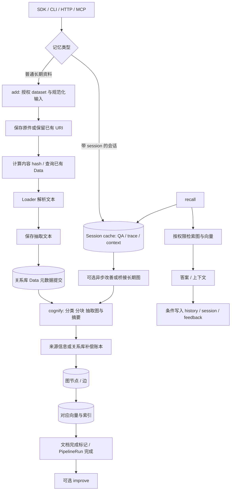
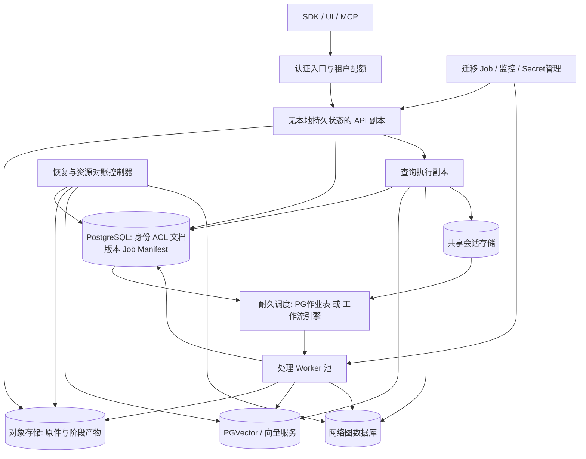
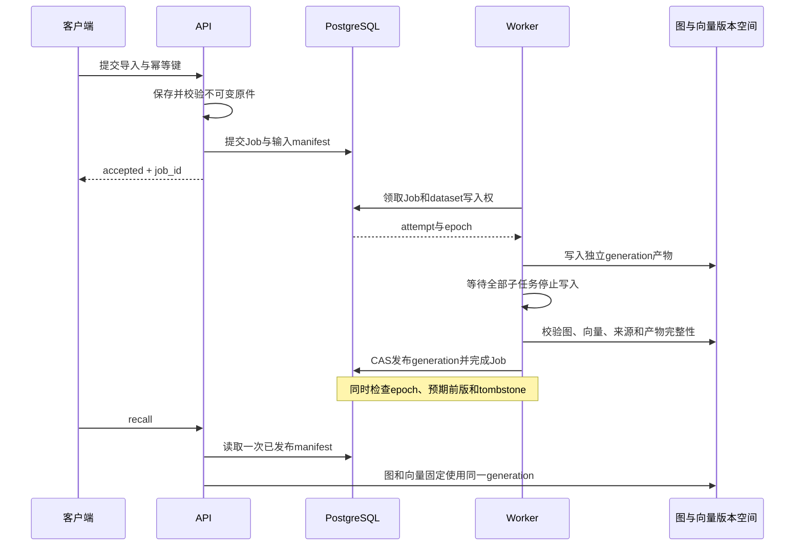

# Cognee 商业化与云上集群架构研究

> 最新修订：[V4：可持续演进与 Cognee / Hindsight 插件边界](../v4-engine-plugins/architecture.md)。V3 对所有引擎统一规范图和细组件端口的设想已收敛为可选方向。

> 最新补充：[V3 彩色组件化架构与替换方案](v3-components.md)，重点说明复用/开源/自建来源、降低 Cognee 依赖、组件迁移与性能评测。

> 2026-09-23 补充：组件职责、读写链路、多租户边界及目标拓扑请优先阅读 [新版整体架构分析](v2-multitenancy.md)。本篇保留输入、持久化、恢复与风险的详细证据；具体认证开关、Tenant 与 Dataset 的关系、查询融合语义以新版核对结果为准。

分析日期：2026-09-23。代码基线：`663a2dc15d04bc0d7ec2733a2dd604b7ed1b8c8e`，版本 `1.6.0`。仓库：`Cognee ??????`。

**结论：Cognee 适合作为商业记忆服务的计算与存储适配内核，但当前 checkout 不能仅通过增加 API 副本获得可靠的多租户集群。** 应复用输入解析、任务链、数据库适配、权限与来源追踪，在外围补齐持久作业、跨实例写入所有权、租户范围、版本发布及恢复协议。

本报告默认目标是云厂商中立的多租户 SaaS，并保留企业专属实例路线。租户数、数据量、预算、SLO 尚未确定，所以不会把建议拓扑当作已验证容量。本文是关键路径静态代码研究和方案设计；未运行真实云集群、LLM调用或故障压测，未修改业务代码。下文“事实”来自代码，“风险”是有触发条件的推断，“建议”是尚待实现的方案。

## 1. Skill 选择及研究方法

已有适合辅助本任务的 Skill；它们提供分析方法，不能替代代码证据或生产验收。

| Skill | 已检查的能力 | 本次使用判断 |
|---|---|---|
| repo-analyzer?????????? | 沿业务数据流拆模块、强制源码位置、并行深读、交叉核验、Mermaid、实际阅读范围记录 | 作为主方法，分别研究输入、执行、持久化，主线程核验部署和跨模块结论 |
| blueprint?????????? | 多PR依赖、验收、回滚、独立执行上下文和方案质疑审查 | 适合后续实施拆解；本轮已评估，未启动其完整工作流 |
| using-superpowers?????????? | 开始任务前识别适用技能 | 用于技能筛选流程 |

从指引完整性看，repo-analyzer 足以支撑这类专项研究；本次没有评估它的维护历史、外部用户验证或独立基准，因此不能仅凭名称宣称它是“经过行业认证的成熟架构工具”。其全仓阅读百分比也不能代替关键路径覆盖。对于约19.6万行非测试 Python 物理行的 `cognee/`，本轮聚焦用户关心的输入、持久化和集群边界，未逐行审计所有媒体 loader、检索器、code/skills 分支及前端。

研究遵循三个区分：**provider 可以连远端 ≠ dataset handler 会创建远端资源；运行状态已落库 ≠ 作业可以接管重放；多个存储可访问 ≠ 多存储更新具有事务一致性。** 官方商业 Cognee Cloud 的能力也不作为本开源 checkout 已实现对应能力的证据。

## 2. 当前数据如何进入、加工和持久化

Cognee 的价值在于把资料转成可关联和检索的记忆。对云服务而言，必须进一步回答：资料是否已经保存、索引是否可查、会话是否已记录、请求重试会否重复执行。这些承诺在当前代码中发生在不同位置。

图中是普通文档路径的逻辑顺序；代码在节点和边批次内交错写图及对应向量，并非全部图一次完成后才写全部向量。

### 2.1 输入和 add：原件、文本、元数据是三份状态

**事实。** SDK `add` 支持文本、文件/流、URL、DataItem 等；HTTP add 主要接收 multipart 上传与 `raw_data` 字符串列表。入口解析授权 dataset，再运行 `resolve_data_directories → ingest_data`。同一定位资料内容变化有专门 update 约定，不能把重复 add 当无条件覆盖。见 [add](https://github.com/topoteretes/cognee/blob/663a2dc15d04bc0d7ec2733a2dd604b7ed1b8c8e/cognee/api/v1/add/add.py#L263)、[HTTP add](https://github.com/topoteretes/cognee/blob/663a2dc15d04bc0d7ec2733a2dd604b7ed1b8c8e/cognee/api/v1/add/routers/get_add_router.py#L49)。

`ingest_data` 先保存或引用原件，loader 提取并保存文本，最后提交 SQL Data。关键字段容易读反：

| 对象 | 对应字段 | 意义 |
|---|---|---|
| 原始 PDF、文本文件等 | `original_data_location`、`content_hash` | 原件位置及原件哈希 |
| 解析后的文本 | `raw_data_location`、`raw_content_hash` | 后续处理用的文本及其哈希 |
| 文档身份 | `Data.id` | 默认随机 UUID，不是内容哈希 |
| 归属和进度 | `dataset_id / owner_id / tenant_id / pipeline_status` | 业务元数据及处理标记 |

依据：[Data 构造](https://github.com/topoteretes/cognee/blob/663a2dc15d04bc0d7ec2733a2dd604b7ed1b8c8e/cognee/tasks/ingestion/ingest_data.py#L484)、[Data 模型](https://github.com/topoteretes/cognee/blob/663a2dc15d04bc0d7ec2733a2dd604b7ed1b8c8e/cognee/modules/data/models/Data.py#L10)。

文件和 SQL 没有共同事务。原件保存成功而 SQL 提交失败，可能留下无引用对象。默认查重是 dataset/owner/tenant/content hash 查询，数据库内容索引不是唯一约束；并发相同输入可能生成两份业务 Data。因此**内容去重和请求幂等应分开设计**：同一请求重试应复用结果，不同请求是否允许创建同内容文档则是产品规则。依据：[查重](https://github.com/topoteretes/cognee/blob/663a2dc15d04bc0d7ec2733a2dd604b7ed1b8c8e/cognee/modules/ingestion/identify_many.py#L42)、[并发插入处理](https://github.com/topoteretes/cognee/blob/663a2dc15d04bc0d7ec2733a2dd604b7ed1b8c8e/cognee/tasks/ingestion/ingest_data.py#L541)。

### 2.2 S3 已可复用，但不能把本地依赖一笔抹掉

**事实。** 文件存储工厂支持 Local/S3；S3实现可使用 endpoint、显式凭证或 IAM chain。已有本地路径或 `s3://` 输入可能直接成为引用，未必复制进服务自身管理的空间。读取 S3 资料时，loader 会下载到本地临时文件。见 [文件存储分派](https://github.com/topoteretes/cognee/blob/663a2dc15d04bc0d7ec2733a2dd604b7ed1b8c8e/cognee/infrastructure/files/storage/get_storage_config.py#L6)、[输入保存](https://github.com/topoteretes/cognee/blob/663a2dc15d04bc0d7ec2733a2dd604b7ed1b8c8e/cognee/tasks/ingestion/save_data_item_to_storage.py#L49)、[S3 临时下载](https://github.com/topoteretes/cognee/blob/663a2dc15d04bc0d7ec2733a2dd604b7ed1b8c8e/cognee/tasks/ingestion/data_item_to_text_file.py#L63)。

后台上传还有完整 `stream.read()` 再物化临时流的路径；S3内部4 MiB分块上传不能保证该入口的内存有界。见 [后台输入物化](https://github.com/topoteretes/cognee/blob/663a2dc15d04bc0d7ec2733a2dd604b7ed1b8c8e/cognee/tasks/ingestion/utils.py#L19)。

**建议。** 云入口使用受控、不可变的对象版本，保存 URI、checksum、size、document version；worker只接收持久引用。外部URL/S3引用要明确“导入副本”或“外部可变引用”语义。临时盘仍用于解压、PDF/OCR及代码处理，需按任务设置容量和清理策略。不能将 S3 原始文件支持或数据库快照上传视为在线数据库的多写协议。

### 2.3 remember 有两种不同的成功含义

普通长期记忆执行 `add → cognify → 可选 improve`；会话记忆先通过 SessionManager 保存 QA，再按条件桥接长期记忆。会话已保存后，桥接失败不等于会话写入失败；普通 remember 的 improve 失败也可能作为附加错误返回。见 [普通流程](https://github.com/topoteretes/cognee/blob/663a2dc15d04bc0d7ec2733a2dd604b7ed1b8c8e/cognee/api/v1/remember/remember.py#L270)、[会话和后台分支](https://github.com/topoteretes/cognee/blob/663a2dc15d04bc0d7ec2733a2dd604b7ed1b8c8e/cognee/api/v1/remember/remember.py#L1786)。

后台 remember 使用本进程 `asyncio.create_task` 并注册后台任务表。返回 accepted/running 当前不代表已经存在可供其他节点消费的持久作业。商业 API 应分别暴露 `accepted`、`session_stored`、`indexed`、`improved`，避免客户端把这些阶段理解成同一承诺。见 [后台 remember](https://github.com/topoteretes/cognee/blob/663a2dc15d04bc0d7ec2733a2dd604b7ed1b8c8e/cognee/api/v1/remember/remember.py#L1945)。

### 2.4 cognify：已有写入顺序和补偿账本，值得保留

默认任务链进行分类、分块、抽取图和摘要、存储 DataPoints。不支持原生 provenance 的图后端先提交 SQL 来源账本；支持原生 provenance 的后端将来源记录折叠进图写。分离存储路径按图节点→节点向量、图边→边向量推进，还有可选 triplet embedding。见 [任务构成](https://github.com/topoteretes/cognee/blob/663a2dc15d04bc0d7ec2733a2dd604b7ed1b8c8e/cognee/api/v1/cognify/cognify.py#L558)、[来源账本](https://github.com/topoteretes/cognee/blob/663a2dc15d04bc0d7ec2733a2dd604b7ed1b8c8e/cognee/tasks/storage/add_data_points.py#L154)、[图与向量写入](https://github.com/topoteretes/cognee/blob/663a2dc15d04bc0d7ec2733a2dd604b7ed1b8c8e/cognee/tasks/storage/add_data_points.py#L317)。

这说明项目已有针对失败清理的设计。清理 planner 也有先删向量、再移除来源/清图的重试考虑。它们解决的是**可定位、可补偿**，没有把对象存储、SQL、图和向量变成单个 ACID 事务。当前内置 unified/hybrid provider 注册表为空；即使图和向量都选 PostgreSQL，也仍可能是两个 engine、两个事务。见 [统一门面工厂](https://github.com/topoteretes/cognee/blob/663a2dc15d04bc0d7ec2733a2dd604b7ed1b8c8e/cognee/infrastructure/databases/unified/get_unified_engine.py#L9)、[来源清理](https://github.com/topoteretes/cognee/blob/663a2dc15d04bc0d7ec2733a2dd604b7ed1b8c8e/cognee/infrastructure/databases/unified/provenance_delete_planner.py#L95)。

### 2.5 recall 和 forget 使读写边界更复杂

recall 按 scope/session/dataset 选择会话或图检索；图检索后可写 search history，会话答案可写 QA、反馈和 turn 信息，配置启用后还会更新访问时间。查询副本因此需要相应写路径，不能直接把所有请求转向只读数据库。见 [recall 路由](https://github.com/topoteretes/cognee/blob/663a2dc15d04bc0d7ec2733a2dd604b7ed1b8c8e/cognee/api/v1/recall/recall.py#L463)、[history](https://github.com/topoteretes/cognee/blob/663a2dc15d04bc0d7ec2733a2dd604b7ed1b8c8e/cognee/modules/search/operations/log_search_history.py#L17)、[会话提交](https://github.com/topoteretes/cognee/blob/663a2dc15d04bc0d7ec2733a2dd604b7ed1b8c8e/cognee/modules/retrieval/session_aware_completion.py#L305)。

删除会校验dataset权限，再清图/向量/会话及SQL记录；`memory_only` 保留原件和Data并重置处理标记。共享实体有来源记录保护，但多实例中的删除与迟到的导入仍需全局协调。见 [数据删除](https://github.com/topoteretes/cognee/blob/663a2dc15d04bc0d7ec2733a2dd604b7ed1b8c8e/cognee/api/v1/datasets/datasets.py#L234)、[仅删记忆](https://github.com/topoteretes/cognee/blob/663a2dc15d04bc0d7ec2733a2dd604b7ed1b8c8e/cognee/api/v1/forget/forget.py#L267)。

## 3. 数据保存在哪里，隔离的真实单位是什么

### 3.1 五类持久状态不能混成一个“数据库”

| 状态 | 默认实现 | 云化职责 |
|---|---|---|
| 原件、解析文本 | 本地文件，可用S3 | 可重放输入、生命周期和引用GC |
| 用户、ACL、dataset、Data、registry、run审计 | SQLite，可换PostgreSQL | 控制面事实、身份和任务状态 |
| 图节点、边、来源 | Ladybug，兼容Kuzu名称 | 图检索、共享实体、来源与删除 |
| embeddings及向量索引 | LanceDB | 相似度召回和模型维度版本 |
| QA、trace、context、usage等会话状态 | SQLite cache，可换Postgres/Redis | 会话连续性、反馈和保留策略 |

默认值依据：[graph config](https://github.com/topoteretes/cognee/blob/663a2dc15d04bc0d7ec2733a2dd604b7ed1b8c8e/cognee/infrastructure/databases/graph/config.py#L47)、[vector config](https://github.com/topoteretes/cognee/blob/663a2dc15d04bc0d7ec2733a2dd604b7ed1b8c8e/cognee/infrastructure/databases/vector/config.py#L32)、[relational config](https://github.com/topoteretes/cognee/blob/663a2dc15d04bc0d7ec2733a2dd604b7ed1b8c8e/cognee/infrastructure/databases/relational/config.py#L16)、[cache config](https://github.com/topoteretes/cognee/blob/663a2dc15d04bc0d7ec2733a2dd604b7ed1b8c8e/cognee/infrastructure/databases/cache/config.py#L51)。

Session cache 包含产品数据。关闭 `CACHING` 会改变记忆能力，不应作为同等语义的性能优化。降低读成本可单独评估 `AUTO_FEEDBACK`，并记录能力变化。TTL、备份及租户注销策略同样适用于会话。

### 3.2 隔离是 dataset 路由加 owner 命名空间

数据库上下文先解析dataset真实owner，再查 DatasetDatabase registry。registry以dataset_id为主键，获授权的其他用户访问同一dataset时使用同一份后端。它不是“每个访问者访问一次就建立私有副本”。原始文件目录还使用 owner 的 tenant或user命名空间。见 [上下文路由](https://github.com/topoteretes/cognee/blob/663a2dc15d04bc0d7ec2733a2dd604b7ed1b8c8e/cognee/context_global_variables.py#L238)、[registry模型](https://github.com/topoteretes/cognee/blob/663a2dc15d04bc0d7ec2733a2dd604b7ed1b8c8e/cognee/modules/users/models/DatasetDatabase.py#L11)。

ContextVar 负责调用链内路由，不是消息队列中的租户协议。部分存储上下文有意在scope退出后保留；长生命周期worker应为每个job建立明确的新执行上下文，在开始时重新授权和绑定，结束时清理，不能依赖上一个job留下的配置。见 [上下文退出](https://github.com/topoteretes/cognee/blob/663a2dc15d04bc0d7ec2733a2dd604b7ed1b8c8e/cognee/context_global_variables.py#L380)。

### 3.3 当前代码支持矩阵比 AGENTS.md 更细

下表以当前注册表及handler实现为准。`provider`和`handler`是两个维度。见 [支持注册表](https://github.com/topoteretes/cognee/blob/663a2dc15d04bc0d7ec2733a2dd604b7ed1b8c8e/cognee/infrastructure/databases/dataset_database_handler/supported_dataset_database_handlers.py#L37)。

| provider / handler | 实际隔离与部署 | 云上采用判断 |
|---|---|---|
| ladybug/kuzu | owner路径下的dataset文件，通常本机子进程 | 可用于专属实例或明确单写分片；不能直接共享目录多写 |
| lancedb / lancedb | 默认handler创建本地dataset目录 | 不能从raw S3支持推断其dataset路径已远程化 |
| pgvector / pgvector | 每dataset单独PostgreSQL database | 可复用；关注建库权限、数据库数与连接池 |
| pgvector / pgvector_shared | 主关系PG库中每dataset一个schema | SaaS向量候选；已有实现，需验收权限、DDL和连接预算 |
| postgres_demo / postgres_graph | 每dataset独立PG database内的图表 | 实现明确为demo；须先做语义与性能加固 |
| postgres_demo / postgres_graph_shared | 同一PG库、每dataset schema | 不是全局事务；固定图写锁会串行不同dataset的写入 |
| neo4j / neo4j | DBMS内每dataset CREATE DATABASE | 优先评估有相应管理能力的Enterprise部署 |
| neo4j / neo4j_community | 每dataset本机Docker container+volume | 已有专属容器思路，尚非Kubernetes资源调度器 |
| neo4j / neo4j_aura_dev | 管理API每dataset创建Aura实例 | 明确PoC；不可直接用作收费租户自动开通 |
| turso / 对应handler | 已查dataset handler生成本地文件；图工厂另有限制 | 网络provider与远程多租户provisioning需分开核验 |

PG shared实现证据：[向量schema](https://github.com/topoteretes/cognee/blob/663a2dc15d04bc0d7ec2733a2dd604b7ed1b8c8e/cognee/infrastructure/databases/vector/pgvector/PGVectorSharedDatasetDatabaseHandler.py#L38)、[图schema](https://github.com/topoteretes/cognee/blob/663a2dc15d04bc0d7ec2733a2dd604b7ed1b8c8e/cognee/infrastructure/databases/graph/postgres_demo/PostgresGraphSharedDatasetDatabaseHandler.py#L17)。没有内置handler的后端在启用访问控制时不能靠关闭校验冒充租户隔离；应实现并注册handler，或仅用于明确单租户实例。

Neo4j普通handler执行 `CREATE DATABASE` 并复用配置凭证，没有同时建立每dataset独立数据库用户/角色。Aura dev则调用实例创建API，规格、地区等写死，资源创建缺少请求幂等协议。官方数据库创建文档也有版本和Aura适用限制，不能按“Enterprise/Aura”笼统视为同一种能力。见 [Neo4j handler](https://github.com/topoteretes/cognee/blob/663a2dc15d04bc0d7ec2733a2dd604b7ed1b8c8e/cognee/infrastructure/databases/graph/neo4j_driver/Neo4jDatasetDatabaseHandler.py#L146)、[Aura dev handler](https://github.com/topoteretes/cognee/blob/663a2dc15d04bc0d7ec2733a2dd604b7ed1b8c8e/cognee/infrastructure/databases/graph/neo4j_driver/Neo4jAuraDevDatasetDatabaseHandler.py#L80)、[Neo4j官方数据库创建说明](https://neo4j.com/docs/operations-manual/current/database-administration/standard-databases/create-databases/)。

### 3.4 建库及迁移已有保护，业务作业仍需另一套协议

首次访问先查registry，再建图、建向量，最后写registry；主键冲突时回读已有行。PG建database/schema已有advisory lock。它能防止特定重复建库竞争，但不能自动回收“图创建成功、向量失败”留下的外部资源，尤其不能保证两次Aura实例创建只付一份费用。见 [provisioning顺序](https://github.com/topoteretes/cognee/blob/663a2dc15d04bc0d7ec2733a2dd604b7ed1b8c8e/cognee/infrastructure/databases/utils/get_or_create_dataset_database.py#L99)、[PG管理锁](https://github.com/topoteretes/cognee/blob/663a2dc15d04bc0d7ec2733a2dd604b7ed1b8c8e/cognee/infrastructure/databases/postgres/admin.py#L156)。

迁移也已有PostgreSQL跨主机advisory lock，SQLite使用同机文件锁。生产可以保留它，并将自动迁移收敛到发布Job。迁移互斥不代表迁移已与所有业务写入互斥，仍需写入准入及schema版本兼容策略。见 [迁移锁](https://github.com/topoteretes/cognee/blob/663a2dc15d04bc0d7ec2733a2dd604b7ed1b8c8e/cognee/modules/migrations/runner.py#L86)、[统一升级入口](https://github.com/topoteretes/cognee/blob/663a2dc15d04bc0d7ec2733a2dd604b7ed1b8c8e/cognee/modules/migrations/startup.py#L310)。

## 4. 增加副本前必须解决的具体问题

### 4.1 后台、队列、日志的真实语义

| 当前机制 | 已实现 | 未能由它保证的事情 |
|---|---|---|
| background pipeline | 本事件循环创建Task并保留引用 | Pod死亡后的远端接管、持久投递 |
| dataset_lock | 本进程同dataset操作互斥 | 两个Pod之间的互斥 |
| DatasetQueue | 本进程并发准入、engine pinning与回收 | 全局队列、ACK、任务重投 |
| item semaphore | 单run内item并发上限 | 全集群LLM配额与公平调度 |
| PipelineRun | SQL审计状态、进度及用量 | 阶段输入重放、租约、worker所有权 |
| Data.pipeline_status | 整个文档在命名pipeline中完成后可跳过 | prompt/model/schema版本变更后的正确重建 |
| asyncio进度queue | 进程内事件传递 | 负载均衡到另一副本后的连续订阅 |

依据：[后台执行](https://github.com/topoteretes/cognee/blob/663a2dc15d04bc0d7ec2733a2dd604b7ed1b8c8e/cognee/modules/pipelines/layers/pipeline_execution_mode.py#L125)、[dataset锁](https://github.com/topoteretes/cognee/blob/663a2dc15d04bc0d7ec2733a2dd604b7ed1b8c8e/cognee/infrastructure/locks/dataset_lock.py#L18)、[DatasetQueue](https://github.com/topoteretes/cognee/blob/663a2dc15d04bc0d7ec2733a2dd604b7ed1b8c8e/cognee/infrastructure/databases/dataset_queue/queue.py#L149)、[PipelineRun](https://github.com/topoteretes/cognee/blob/663a2dc15d04bc0d7ec2733a2dd604b7ed1b8c8e/cognee/modules/pipelines/models/PipelineRun.py#L58)、[增量完成标记](https://github.com/topoteretes/cognee/blob/663a2dc15d04bc0d7ec2733a2dd604b7ed1b8c8e/cognee/modules/pipelines/operations/run_tasks_data_item.py#L197)、[进度queue](https://github.com/topoteretes/cognee/blob/663a2dc15d04bc0d7ec2733a2dd604b7ed1b8c8e/cognee/modules/pipelines/queues/pipeline_run_info_queues.py#L6)。

特别说明：DatasetQueue默认上限6是本进程范围，且仅在访问控制相关路径生效；不同task进入同dataset也可能分别占slot。退出scope也不总是立即关子进程，当前默认idle TTL为600秒。它是本机资源管理器。同步task还可能直接阻塞事件循环，影响未来同循环heartbeat。见 [queue配置](https://github.com/topoteretes/cognee/blob/663a2dc15d04bc0d7ec2733a2dd604b7ed1b8c8e/cognee/infrastructure/databases/dataset_queue/queue.py#L78)、[同步task调用](https://github.com/topoteretes/cognee/blob/663a2dc15d04bc0d7ec2733a2dd604b7ed1b8c8e/cognee/modules/pipelines/tasks/task.py#L326)。

PipelineRun 的输入摘要不是完整参数快照，非Data输入可能仅保留512字符；TaskRun虽有模型，所查执行代码未发现写入调用。因此不能把表名当作耐久工作流的证据。见 [摘要生成](https://github.com/topoteretes/cognee/blob/663a2dc15d04bc0d7ec2733a2dd604b7ed1b8c8e/cognee/modules/pipelines/utils/summarize_run_info_data.py#L5)、[TaskRun模型](https://github.com/topoteretes/cognee/blob/663a2dc15d04bc0d7ec2733a2dd604b7ed1b8c8e/cognee/modules/pipelines/models/TaskRun.py#L9)。FastAPI官方也明确区分进程内后台任务和多服务器任务执行；这支持将长处理移交独立worker的架构选择。[FastAPI后台任务说明](https://fastapi.tiangolo.com/tutorial/background-tasks/)

### 4.2 风险清单与触发条件

P0表示相应SaaS或集群能力上线前必须关闭风险，不表示本次已经做过线上事故复现。

| 优先级 | 触发场景与代码事实 | 具体风险 | 必须补齐 |
|---|---|---|---|
| P0 | 普通认证用户forget everything，cache共享且启用 | 清除其他用户的会话，Redis还可清除同DB其他键 | 用户/租户范围删除，禁止公共入口调用全局prune |
| P0 | 两Pod操作同一dataset，仅有本地锁 | 导入、删除、补偿交错 | dataset级集群所有权、持久作业与写入隔离 |
| P0 | 新Pod启动，旧Pod有超过默认1小时的活跃run | 启动恢复可能误补偿仍在执行的任务 | owner/heartbeat/lease、CAS认领恢复 |
| P0 | 一个item硬失败，其他item仍在gather内写入 | rollback与后续写并发，可能清后又写 | 子任务静止屏障、独占补偿 |
| P0 | rollback失败仍记录ERRORED | 启动恢复不再自动重试该补偿 | repair_pending及持久修复队列 |
| P0（跨组织产品） | 同一user同时使用两个tenant/session | 活动租户切换及session命名空间歧义 | 请求与作业固定tenant、session按tenant隔离 |
| P1 | 未配置签名secret就多副本 | A签token在B拒绝，重启后失效 | 跨副本共享并管理签名密钥 |
| P1 | PG图shared模式多个dataset同时写 | 固定数据库级advisory key串行写 | 锁域加固、测吞吐、选择适配后端 |
| P1 | 并发首访、资源创建中断 | 孤儿库/云实例、重复开通成本 | provisioning状态机与reconciler |
| P1 | 增副本但按进程独立LLM限流 | 放大全局请求量、重试和费用 | provider credential+tenant两级总预算 |

**全局prune风险已交叉核实调用路径。** HTTP router仅依赖普通认证用户；`_forget_everything` 在dataset删除完成后调用无范围参数的prune。SQL实现对五类cache表无WHERE删除；Redis执行FLUSHDB。即使用户没有dataset，空删除循环完成后也可继续。触发前提是接口可达、认证成功、前序步骤完成且cache engine启用；不是“任何未登录用户都可以清库”。见 [forget路由](https://github.com/topoteretes/cognee/blob/663a2dc15d04bc0d7ec2733a2dd604b7ed1b8c8e/cognee/api/v1/forget/routers/get_forget_router.py#L69)、[调用点](https://github.com/topoteretes/cognee/blob/663a2dc15d04bc0d7ec2733a2dd604b7ed1b8c8e/cognee/api/v1/forget/forget.py#L191)、[SQL prune](https://github.com/topoteretes/cognee/blob/663a2dc15d04bc0d7ec2733a2dd604b7ed1b8c8e/cognee/infrastructure/databases/cache/sql/SqlCacheAdapter.py#L1196)、[Redis prune](https://github.com/topoteretes/cognee/blob/663a2dc15d04bc0d7ec2733a2dd604b7ed1b8c8e/cognee/infrastructure/databases/cache/redis/RedisAdapter.py#L681)。

**启动恢复风险**来自年龄判定，不是heartbeat。超过3600秒的未终结run被列为候选；代码没有先验证原owner停止。恢复失败保持STARTED可供下次启动再试，但普通runner中rollback异常只记录日志，仍可能转ERRORED，从而脱离该恢复扫描。见 [恢复器](https://github.com/topoteretes/cognee/blob/663a2dc15d04bc0d7ec2733a2dd604b7ed1b8c8e/cognee/modules/cognify/recovery.py#L24)、[runner异常分支](https://github.com/topoteretes/cognee/blob/663a2dc15d04bc0d7ec2733a2dd604b7ed1b8c8e/cognee/modules/pipelines/operations/run_tasks.py#L292)。

**gather风险是代码与运行时语义推导，尚待故障注入。** 当前gather未设置return_exceptions；Python默认把首个异常抛给等待者，其他awaitable继续。之后进入rollback并不意味着写入者已停止。应取消并等待全部子任务或等待全部结束再补偿；Python3.10兼容要求意味着不能直接无条件采用3.11才有的TaskGroup。见 [gather调用](https://github.com/topoteretes/cognee/blob/663a2dc15d04bc0d7ec2733a2dd604b7ed1b8c8e/cognee/modules/pipelines/operations/run_tasks.py#L210)、[Python官方并发语义](https://docs.python.org/3/library/asyncio-task.html#running-tasks-concurrently)。

### 4.3 租户和会话：已有ACL仍需升级请求身份模型

当前选择tenant会验证成员资格，再更新持久化的 `User.tenant_id`；用户可属于多个tenant，但活动tenant是同一User行的一份状态。SQL/Redis session主要按user_id+session_id定位，没有独立tenant维度。这不等于任意用户可越权读另一个用户，但同一身份跨组织并发访问缺少清晰隔离契约。见 [选择tenant](https://github.com/topoteretes/cognee/blob/663a2dc15d04bc0d7ec2733a2dd604b7ed1b8c8e/cognee/modules/users/tenants/methods/select_tenant.py#L48)、[SQL session条件](https://github.com/topoteretes/cognee/blob/663a2dc15d04bc0d7ec2733a2dd604b7ed1b8c8e/cognee/infrastructure/databases/cache/sql/SqlCacheAdapter.py#L231)、[Redis session key](https://github.com/topoteretes/cognee/blob/663a2dc15d04bc0d7ec2733a2dd604b7ed1b8c8e/cognee/infrastructure/databases/cache/redis/RedisAdapter.py#L94)。

建议使用认证后确定的 `tenant_id + actor_id + dataset_id + permission` 请求上下文，校验成员关系及dataset归属；worker执行时再校验授权、版本与删除状态。对象路径、session key、job、用量、日志均绑定同一稳定tenant。不要信任客户端传入的任意tenant header，也不要用owner当前活动tenant推导长期资源归属。

PG会话适配器已有事务/advisory锁，可复用；Redis的部分更新和删除是多命令读改写，不能从RPUSH原子性推导整套session操作原子。两者都需要完整turn级并发测试与tenant命名空间改造。见 [SQL会话锁](https://github.com/topoteretes/cognee/blob/663a2dc15d04bc0d7ec2733a2dd604b7ed1b8c8e/cognee/infrastructure/databases/cache/sql/SqlCacheAdapter.py#L235)、[Redis修改](https://github.com/topoteretes/cognee/blob/663a2dc15d04bc0d7ec2733a2dd604b7ed1b8c8e/cognee/infrastructure/databases/cache/redis/RedisAdapter.py#L387)。

## 5. 建议目标架构：复用业务内核，建立明确的集群协议

以下均为目标设计，不是当前已有能力。第一版按dataset调度完整pipeline，worker内部保留现有item并发；不必立即把每个task拆成独立微服务。

“API无本地持久状态”不意味着完全不使用临时文件，也不意味着请求不能写SQL。它意味着任意副本都能从共享持久状态处理同一授权请求，终止一台实例不会丢掉已接受的作业。

### 5.1 先定义业务不变量，再选择队列产品

1. **接受不丢失**：成功返回accepted之前，原件已可持久读取，作业及投递意图已提交；断开HTTP连接不取消已接受任务。
2. **租户不可变**：job的tenant、dataset、document version固定；执行时重新验证授权与删除状态，不能跟随用户之后切换的活动tenant变化。
3. **重复可安全执行**：同一请求幂等键只对应一个业务job；job可有多个attempt，每个step输出具有确定身份或受隔离的产物位置。
4. **旧执行者不能发布**：租约失效、任务取消、dataset删除后，原worker即使恢复也不能改变有效版本。
5. **可见性有合同**：查询看到已发布版本；若选择部分结果可见，必须明确暴露阶段并接受相应产品语义，不能称为原子成功。
6. **修复可追踪**：普通失败、取消、补偿失败、永久失败是不同状态；不可因一次日志记录就放弃后续清理。

建议新增持久记录如下，具体表名可在实施时确定：

| 记录 | 关键字段与唯一性 | 解决的问题 |
|---|---|---|
| Job | job_id、tenant/actor/owner/dataset、request_key、request_digest、status；tenant+request_key唯一 | 请求重试、参数冲突检测、状态查询 |
| InputManifest | document_id/version、object URI/version/checksum、pipeline/model/prompt/embedding/config版本 | 重放原始输入，区分相同内容与不同处理方式 |
| UploadIntent / BlobRef | 上传状态、object version、上传租约、引用状态、GC状态 | 上传采用与对象GC互斥，防止延迟提交引用已删除对象 |
| JobAttempt | attempt、worker_id、lease_until、fencing_epoch、run_id、error、heartbeat | 谁在执行、谁可以接管 |
| DatasetLease | dataset_id、active_job/owner、lease_until、单调epoch | 不同job及删除/修复共用一个写入所有权域 |
| StepArtifact | job/version/step/chunk、artifact URI/hash、完成状态与用量 | 减少重跑、避免LLM输出漂移覆盖 |
| DatasetManifest | dataset、generation、graph/vector位置、published_version、tombstone | 统一可见版本与删除阻断 |
| Repair / Provisioning | 资源id、步骤、重试时间、owner、错误、补偿进度 | 孤儿资源回收与跨存储修复 |

同一幂等键但不同request_digest应拒绝，不能静默复用另一请求结果。消息只传ID、版本和受控引用，不传pickle、任意Python callable、文件句柄或secret明文。这是在当前run_info摘要之外新增的作业合同。[AWS幂等API设计](https://aws.amazon.com/builders-library/making-retries-safe-with-idempotent-APIs/)

### 5.2 投递方案：最低基础设施与成熟工作流的取舍

**建议初期先固定Job合同，再按团队条件选以下一种执行方案，避免双套权威状态。**

| 方案 | 合适条件 | 需要自己负责的边界 |
|---|---|---|
| PostgreSQL Job表 + worker轮询 | 初期规模未知、任务主要为整dataset流程、希望少引入基础设施 | claim、lease、heartbeat、重试、取消、repair、清理、队列公平性 |
| 成熟消息队列 + worker，例如团队已有broker | 已有消息平台和运维能力，主要需要任务分发 | durable Job仍保留；outbox、重复投递、业务幂等及恢复仍需实现 |
| Temporal等耐久工作流 | 长任务、多阶段恢复、复杂取消/补偿、需要减少自研调度状态机 | 将LLM/文件/数据库操作封装Activity；版本化、幂等、租户配额仍由应用负责 |

PG队列用短事务 `FOR UPDATE SKIP LOCKED` 领取，落owner/lease/attempt后提交，随后才进行慢任务；不能持有SQL行事务等待数分钟LLM。过期任务由reconciler处理，通知仅作唤醒，任务事实以Job表为准。PostgreSQL官方说明SKIP LOCKED适合多消费者队列表，而非一般一致性读取。[PostgreSQL SELECT](https://www.postgresql.org/docs/current/sql-select.html)

若增加broker，Job和outbox必须同一SQL事务提交，由relay投递；relay可能重复发送，消费者幂等。对象写入不在SQL事务内：先登记UploadIntent，再写不可变对象并校验，最后在SQL事务中采用该对象引用并提交Job。GC与引用采用必须竞争同一记录的状态：已被标记deleting或租约失效的对象不得被晚到请求采用；已有引用的对象不得进入GC。仅设固定宽限期不足以防止暂停的API在对象删除后恢复并提交悬空引用。失败上传的孤儿对象由可重试GC清理。若采用Temporal，SQL记账与启动workflow同样存在双写，需稳定workflow ID、outbox或可重试启动对账。[Transactional outbox原理](https://docs.aws.amazon.com/prescriptive-guidance/latest/cloud-design-patterns/transactional-outbox.html)

Temporal的已完成Activity记录能避免某些重放，但“外部写成功、worker未确认就退出”仍可能再次执行Activity。它不替代写入幂等，更不能保证LLM服务商只计费一次。[Temporal Activity与重试](https://docs.temporal.io/activity-definition)

采用Temporal时，由workflow掌握执行重试和取消，SQL Job作为接收记录与业务状态投影；SQL reconciler只核对启动、投影及资源状态，不能独立重投或补偿同一workflow。下文自建JobAttempt执行租约状态机主要对应PG队列/broker路线；dataset写入所有权及发布协议则适用于所有路线。

### 5.3 集群租约必须落实到写入边界

租约/heartbeat回答“现在允许谁执行”，fencing回答“旧执行者的写入是否还能生效”。只在Job表增加fencing_epoch，图数据库并不会自动检查它。租约过期可能来自进程暂停、网络分区或事件循环阻塞，不能据此证明旧进程已经死亡。这是租约和资源隔离机制的关键区别。[Kleppmann关于租约与fencing的分析](https://martin.kleppmann.com/2016/02/08/how-to-do-distributed-locking.html)

epoch必须在同一dataset的持久DatasetLease记录中原子递增，跨不同job、删除和修复保持单调；JobAttempt只保存领取到的值，不能用各job自己的attempt编号冒充它。SKIP LOCKED领取Job并不自动使同dataset的其他Job互斥，执行前还必须取得dataset写入权。续约、发布、取消与修复的CAS检查同一所有权域。

建议按能力选择：

- 后端支持时，在实际写事务中检查有效写入epoch，并保证控制记录与写操作的隔离语义；不能在客户端“先查租约再写”留下竞态。
- 多后端难以统一fencing时，采用**每次构建独立generation/attempt命名空间，再原子发布manifest**。旧worker的晚到输出只能进入未发布空间。
- 嵌入式后端过渡部署必须有明确单写owner；迁移owner前确认旧执行环境已隔离或终止，不能仅等TTL就让两个Pod打开同一文件。

所有修改入口必须遵守相同协议：add、cognify、improve、delete、反馈写回、补偿、迁移与管理任务。单独给cognify加锁仍不能阻止另一个入口绕过。

### 5.4 图和向量如何一致发布：建议先用dataset generation

最容易论证正确性的首版是dataset级独立版本空间，其流程为：

这项方案**需要适配器与读取路径改造**，不是加一个ready字段就能实现：

1. graph/vector物理schema、数据库或逻辑ID必须隔离generation/attempt，禁止旧任务覆盖正在服务的共享实体。
2. 同一次查询只解析一次manifest，召回、图遍历、rerank上下文全程使用相同版本。只过滤向量初始命中不够，后续图遍历也必须隔离。
3. SQL provenance、Data完成标记、improve及反馈写回同样带版本身份；不能只有图向量分版本，共享SQL还被旧任务修改。
4. 当前增量标记只有pipeline_name+dataset_id。新generation照搬现有跳过逻辑可能生成空索引。需选择完整重建、复制已发布产物或按版本记录完成状态。
5. 发布通过SQL事务/CAS完成，校验预期旧版本、当前epoch、取消及tombstone；失败的attempt不允许更新有效指针。
6. 旧generation需等读者退出或满足明确的最大查询时长及保留窗口后再GC。删除tombstone必须先阻止新读与晚到发布。

代价是构建期间双份存储、复制/重建费用和更长发布延迟。后续可演进到document级版本，但跨文档共享实体和边需要额外引用及快照协议。若业务必须实时可变图，则选择后端事务fencing和明确的增量一致性模型，不应假装此成本不存在。

### 5.5 失败、取消和删除需要可持久执行的状态机

建议Job状态为 `queued → leased → running → publishing → succeeded`，另外保留 `retry_wait / cancel_requested / repairing / repair_pending / failed / cancelled`。业务完成和补偿完成分别记录，不能用一个ERRORED同时表示“失败已清理”和“失败未清理”。

取消顺序应是：阻止有效版本发布 → 停止并等待子任务 → 确认旧执行者不能继续影响有效状态 → 独占补偿 → cancelled或repair_pending。阻塞任务需放到可监督的执行进程或专门worker，避免它阻塞heartbeat；Python3.10路径显式保存、cancel并await全部Task。新协议上线时替换年龄阈值启动恢复，不能让旧恢复器绕过租约擅自清理。

保留现有provenance、关系账本及重试删除顺序，补上阶段产物和持久修复记录。每次重试用同一业务身份、不同attempt；LLM结果按输入及模型/prompt版本保存，避免重跑时不确定输出悄悄改变已成功阶段。跨资源一致性采用局部提交、发布屏障及必要补偿，而非伪造全局ACID。[Saga补偿原理](https://docs.aws.amazon.com/prescriptive-guidance/latest/cloud-design-patterns/saga-orchestration.html)

删除建议先落tombstone并在读路径拒绝新访问，再通过可重复的删除步骤处理图、向量、会话、原件和SQL。共享实体按来源处理，共享对象按引用处理；未清理完不要销毁唯一修复依据。删除期间新建引用和GC要协调；备份保留期与在线删除效果分开呈现。会话、用户人工修订和反馈如果没有独立事件记录，不能作为“可从原件随时重建的缓存”丢弃。

## 6. 后端选型、部署和成本取舍

### 6.1 推荐先验证的基础组合

**第一条路线：PostgreSQL控制面与会话 + PGVector + 具备所需管理能力的远程图数据库 + 对象存储。** 它保留当前最清晰的适配边界，不要求第一期自己把PG图引擎做成生产数据库。先用Neo4j Enterprise兼容环境验证图接口、provenance、租户建库与删除；真实套餐、数据库数量、许可证和HA能力需按选定服务验证。

**第二条路线：统一PostgreSQL。** 可减少运维组件，但必须先加固现有postgres_demo图适配器：分离不同dataset的锁域、验证并发DDL、查询计划、遍历复杂度、过滤与删除语义。当前代码对部分图操作有全量读入Python和逐跳SQL处理，不能在无基准测试时承诺与图原生后端等价。见 [demo声明和固定写锁](https://github.com/topoteretes/cognee/blob/663a2dc15d04bc0d7ec2733a2dd604b7ed1b8c8e/cognee/infrastructure/databases/graph/postgres_demo/adapter.py#L1)、[图遍历](https://github.com/topoteretes/cognee/blob/663a2dc15d04bc0d7ec2733a2dd604b7ed1b8c8e/cognee/infrastructure/databases/graph/postgres_demo/adapter.py#L907)。

**第三条路线：企业专属实例。** 单租户/小规模可先保留嵌入式图与向量，增加实例生命周期、备份和明确单写归属，以租户为单位扩容。它能降低核心算法改造量，但共享节点利用率、热迁移和故障恢复成本较高。它与池化SaaS可以共用Job及资源registry合同，数据面采用不同分配策略。

| 能力 | 可复用 | 需要加固或新增 |
|---|---|---|
| 输入与计算 | loaders、Task链、DataPoints | 不可变输入、stage产物、资源预算 |
| 多租户路由 | ACL、DatasetDatabase、handler接口 | 请求固定tenant、资源开通状态机、独立控制凭证 |
| 网络持久化 | PG关系、PGVector shared、S3、PG session | DDL准入、schema/角色隔离、池预算、会话范围删除 |
| 失败清理 | provenance与SQL ledger、rollback planner | durable repair、写入者静止、lease/fence/generation |
| 观测 | PipelineRun、日志、OTel接缝 | job/attempt/tenant关联、队列年龄、修复积压、成本归因 |
| 集群执行 | worker内部可以继续调用现有pipeline | Job API、worker入口、持久调度及查询版本绑定 |

### 6.2 可以复用的配置与不能省略的条件

下表是已核实的配置接缝，不是“复制后即可生产上线”的完整部署文件。

| 配置 | 建议值/含义 | 前提 |
|---|---|---|
| `DB_PROVIDER` | `postgres` | 共享控制面数据库，连接参数来自Secret |
| `VECTOR_DB_PROVIDER` | `pgvector` | 安装扩展，确认embedding维度及模型版本 |
| `VECTOR_DATASET_DATABASE_HANDLER` | `pgvector_shared` | 在关系PG库按dataset schema路由；明确权限与连接预算 |
| `CACHE_BACKEND` | `postgres` | 修复prune及tenant scope后可优先复用 |
| `CACHE_DB_URL` | 可显式配置 | 未设时仅在DB_PROVIDER=postgres下回落DB_*配置 |
| `GRAPH_DATABASE_PROVIDER` | 路线一`neo4j`；路线二`postgres_demo` | 图后端先通过目标负载验收 |
| `GRAPH_DATASET_DATABASE_HANDLER` | 路线一`neo4j`；路线二`postgres_graph_shared` | provider和handler必须匹配 |
| `DATA_ROOT_DIRECTORY` | 受控S3 URI | 选定对象存储/IAM；不能把所有system目录机械改成S3 |
| `ENABLE_BACKEND_ACCESS_CONTROL` | `true` | 图、向量handler均支持，并通过隔离回归 |
| `CACHING` | 保留`true` | 跨会话记忆能力属于产品语义 |
| `AUTO_FEEDBACK` | 按能力/成本策略选择 | 关闭会改变自动反馈行为，应纳入测试记录 |
| `DATASET_QUEUE_ENABLED` | 保留本地保护 | 它不能代替集群调度；本地limit与全局预算共同控制 |
| `ENABLE_AUTO_MIGRATIONS` | 由发布流程控制 | 用显式迁移Job后关闭自动执行，并验证schema版本准入 |

配置依据：[PGVector shared](https://github.com/topoteretes/cognee/blob/663a2dc15d04bc0d7ec2733a2dd604b7ed1b8c8e/cognee/infrastructure/databases/vector/pgvector/PGVectorSharedDatasetDatabaseHandler.py#L17)、[PG图shared](https://github.com/topoteretes/cognee/blob/663a2dc15d04bc0d7ec2733a2dd604b7ed1b8c8e/cognee/infrastructure/databases/graph/postgres_demo/PostgresGraphSharedDatasetDatabaseHandler.py#L17)、[cache URL解析](https://github.com/topoteretes/cognee/blob/663a2dc15d04bc0d7ec2733a2dd604b7ed1b8c8e/cognee/infrastructure/databases/cache/get_cache_engine.py#L15)、[迁移开关](https://github.com/topoteretes/cognee/blob/663a2dc15d04bc0d7ec2733a2dd604b7ed1b8c8e/cognee/modules/migrations/startup.py#L386)。

签名secret至少明确管理 `FASTAPI_USERS_JWT_SECRET`、`FASTAPI_USERS_RESET_PASSWORD_TOKEN_SECRET`、`FASTAPI_USERS_VERIFICATION_TOKEN_SECRET`；不配置时当前实现是每进程生成随机值，多副本不能相互验证。生产用稳定共享Secret及轮换策略，不沿用compose的开发默认密码。见 [认证secret](https://github.com/topoteretes/cognee/blob/663a2dc15d04bc0d7ec2733a2dd604b7ed1b8c8e/cognee/modules/users/authentication/get_auth_secret.py#L25)、[compose配置](https://github.com/topoteretes/cognee/blob/663a2dc15d04bc0d7ec2733a2dd604b7ed1b8c8e/docker-compose.yml#L48)。

### 6.3 Kubernetes只是部署层，不能替代存储协议

建议API与worker分别部署，按请求负载和任务积压独立扩容；暂时需要本地模型的worker单独调度CPU/GPU，下载模型及解析文件使用有配额的临时卷。数据服务采用已验收的托管HA或独立运维拓扑。多可用区、反亲和性和PDB需覆盖实例故障域，但不能消除数据库或队列单点。

RWX卷只说明可挂载访问，不自动提供应用数据库多写一致性；StatefulSet也不会为Cognee实现租约、重放或事务。不能把默认SQLite/Ladybug目录挂给多个API副本后视作完成集群化。[Kubernetes Persistent Volumes](https://kubernetes.io/docs/concepts/storage/persistent-volumes/)

当前entrypoint使用gunicorn单worker，`distributed/deploy`主要是云平台启动模板。Modal模板安装PyPI包且共享volume，Railway配置PG关系和向量但未完整指定图，Render卷路径还需与Docker默认根目录对齐。这些能帮助部署起步，不能证明同dataset多节点写安全。见 [entrypoint](https://github.com/topoteretes/cognee/blob/663a2dc15d04bc0d7ec2733a2dd604b7ed1b8c8e/entrypoint.sh#L57)、[Modal模板](https://github.com/topoteretes/cognee/blob/663a2dc15d04bc0d7ec2733a2dd604b7ed1b8c8e/distributed/deploy/modal_app.py#L24)、[Render模板](https://github.com/topoteretes/cognee/blob/663a2dc15d04bc0d7ec2733a2dd604b7ed1b8c8e/distributed/deploy/render.yaml#L47)。

MCP推荐使用API模式连接统一入口，避免另一个MCP进程直连同一份嵌入式文件。当前CogneeClient主要使用配置的token；若提供共享多租户MCP网关，还须设计每请求身份传播，不能共享一个管理员token冒充每位用户。见 [MCP API模式](https://github.com/topoteretes/cognee/blob/663a2dc15d04bc0d7ec2733a2dd604b7ed1b8c8e/cognee-mcp/src/server.py#L1031)、[认证header](https://github.com/topoteretes/cognee/blob/663a2dc15d04bc0d7ec2733a2dd604b7ed1b8c8e/cognee-mcp/src/cognee_client.py#L127)。

当前`/health`检查数据库和文件存储，文件检查会写删对象；detailed还会调用模型连接测试。生产应拆轻量liveness、带超时/缓存的readiness及startup probe；依赖临时故障主要撤流量，不应引发全部进程被反复重启。见 [health router](https://github.com/topoteretes/cognee/blob/663a2dc15d04bc0d7ec2733a2dd604b7ed1b8c8e/cognee/api/v1/health/routers/get_health_router.py#L13)、[文件检查](https://github.com/topoteretes/cognee/blob/663a2dc15d04bc0d7ec2733a2dd604b7ed1b8c8e/cognee/api/v1/health/health.py#L147)、[Kubernetes探针语义](https://kubernetes.io/docs/tasks/configure-pod-container/configure-liveness-readiness-startup-probes/)。

优雅退出需停止领新job、撤readiness、让执行者结束或记录可恢复状态，再关engine；termination grace应覆盖这段预算。当前默认8秒drain和15秒compose停止窗口只是一项已有保护，且低层pipeline与remember使用的后台registry并不完全相同，不能把它当成所有任务都可安全结束的保证。见 [关闭流程](https://github.com/topoteretes/cognee/blob/663a2dc15d04bc0d7ec2733a2dd604b7ed1b8c8e/cognee/api/client.py#L149)。

## 7. 可按PR执行的实施路线

下列是建议的依赖顺序，不是排期承诺。实际工期取决于所选后端、generation实现粒度及既有平台设施。每步必须先有可复现验收，再开放对应商业能力。

| 阶段 | 范围及代码切入点 | 交付物与完成标准 | 失败时回退 |
|---|---|---|---|
| M0：建立基线并关闭破坏性风险 | `forget/forget.py`、cache adapters、`run_tasks.py`、`cognify/recovery.py` | 双用户清理隔离；子任务静止后才补偿；repair状态可重试；对旧恢复器建立受控替代/准入 | 保持单写实例，禁止扩大共享租户流量；必要时阻断有问题的全量清理入口 |
| M1：稳定租户与网络状态 | 请求鉴权/tenant上下文、Data及session键、storage工厂、registry/handlers | 两副本可访问同一授权状态；对象不可变；跨tenant同user测试通过；共享secret；统一DDL迁移 | 按租户灰度回到旧资源路由；新旧schema保持兼容 |
| M2：持久Job与独立worker | 新增cloud job API/worker/Job模型；在remember编排与dataset pipeline外围接入 | accepted后杀API不丢job；幂等键唯一；完整input manifest；有状态查询和审计关联 | 停止新job准入，排空持久队列；不把未完成job退回易失后台Task |
| M3：所有权与接管 | dataset_lock外层、worker claim、lease、recovery、delete/improve入口 | 跨Pod同dataset协议生效；取消及repair协调；旧worker恢复不能影响有效状态 | 固定单owner，禁自动接管；保留durable job，人工处理隔离失败 |
| M4：版本化产物和发布 | Data增量标记、`add_data_points`、provenance、数据库上下文、retriever路由 | 图/向量同generation；全部写副作用纳入版本；模型更新可重建；半成品不可见；tombstone阻止复活 | 切回已验收旧generation；不能让不认识新版本的旧代码直接改新数据 |
| M5：后端与资源开通加固 | PG/Neo4j handlers、`get_or_create_dataset_database`、cache初始化、engine池 | 单dataset并发首访不多开资源；故障可对账；PG图若被采用需完成锁/查询/DDL加固 | 新租户改用已验收后端或专属实例，暂停问题后端开通 |
| M6：商业控制面 | tenant quota、计量账本、secret references、任务优先级、管理操作审计 | 租户预算和provider总预算生效；重试费用可追踪；套餐和注销语义明确 | 降并发/停新租户准入，不删除既有用量记录 |
| M7：集群发布和恢复演练 | API/worker部署、迁移Job、readiness、OTel、备份与恢复 | 跨节点故障、滚动升级、目标负载和恢复演练全部达标 | 撤灰度流量，回到经过验证的镜像+数据generation/备份组合 |

依赖关系：M0 → M1 → M2 → M3 → M4 → M7；M5可在M1后独立进行后端验收，M6在M2合同稳定后推进。M3与M4是多写与自动接管安全的联合门槛，M5是所选后端的门槛。M7放量前不能跳过这些门槛。

建议保留本地SDK原使用体验：默认本地执行器继续存在，云服务显式使用durable executor。通过新增任务、handler、执行包装层完成改造，核心pipeline只做必要的版本/上下文/取消接缝调整，符合仓库“优先扩展任务与适配器”的组织原则。

### 7.1 从已有本地数据迁移到云上

1. 固定代码、模型、embedding维度及依赖版本，盘点每个dataset的原件、文本、SQL、图、向量、provenance和session；记录可校验manifest。
2. 复制原件/文本到受控对象存储，校验内容哈希及引用数量；重写位置时使用可审计映射。不要依赖旧机器绝对路径。
3. 迁移关系元数据、用户/ACL/registry及session；图向量用兼容导出导入或由原件重建。重建会重新花费模型成本，并可能产生不同图，不能当成逐字节复制。
4. 保留document/entity/edge身份及来源映射，或明确记录重映射；人工修订、反馈和不可从原件恢复的信息单独迁移。
5. 在冻结写入窗口或有可证明的增量捕获协议下完成最终同步。没有CDC/版本日志时，不能在活跃写入中随意复制多份存储后声称快照一致。
6. 对样本问题做shadow recall，比较授权范围、来源、图关系、召回质量、session连续性和延迟，再切换manifest/路由。
7. 保留旧环境及只读备份到回退窗口结束；回退策略需包含切换后新增写入，不能只把DNS指回旧服务而丢失这部分数据。

首版优先采用可控停写窗口降低迁移复杂度。只有业务确实要求低停机，才增加双写/CDC；此时还要设计冲突、重放和切换水位。

## 8. 验收矩阵：用故障证明协议成立

以下是待实施测试，不是本轮已通过的结果。除单元测试外，至少在两个API进程和两个worker、真实选定数据服务上执行；进程内mock无法证明跨主机正确性。

| 场景 | 注入方式 | 必须观察到的结果 |
|---|---|---|
| accepted耐久性 | API返回后立即SIGKILL；换节点拉起worker | 同job最终可完成或明确终结，无静默丢失 |
| 请求幂等 | 同tenant同key并发100次；再用同key不同参数 | 一个业务job；参数冲突被拒绝；不同key遵守产品重复策略 |
| 重复投递/确认丢失 | worker写成功后丢ACK再重投 | 无额外可见文档/节点副本，用量有实际attempt记录 |
| 旧worker复活 | 暂停A超过lease，B接管，再恢复A | A不能发布、覆盖有效数据或清理B结果 |
| 年龄与存活无关 | 活跃run持续超过原3600秒阈值，启动新API | 不误回滚活跃run；恢复由owner协议驱动 |
| 失败与并行写 | 一个item失败，另一个停在写入前后 | 写入者静止后才补偿；无清后又写 |
| 多存储部分成功 | 原件/SQL/图/向量/manifest每个边界分别中断 | 未完成版本不可见；重试或repair可收敛 |
| 取消与强制终止 | LLM等待、CPU阻塞、存储提交时取消 | 状态明确；旧执行者无发布权；补偿失败保留repair_pending |
| 删除与重建交错 | 导入过程中删除，再释放晚到worker | tombstone持续生效；不复活旧内容；共享实体不误删 |
| 租户全量清理 | A/B各有session、文档和usage，A执行forget | B的原件、图向量、QA/context/trace/usage不变 |
| 同用户多组织 | 同user两个tenant同时操作相同session_id | scope互不影响；授权撤销后旧job不越权继续 |
| 首次建资源竞争 | 两worker同时首访；各创建步骤后失败 | 唯一有效registry、无持续孤儿资源和重复云实例 |
| 模型与schema升级 | 修改embedding维度/prompt/pipeline版本 | 新版本可重建；旧完成标记不导致空generation；旧查询仍可服务 |
| 连接和限流 | 大量活跃dataset、多副本共同使用一个provider key | 连接数与总RPM/TPM受控；小租户不会永久饥饿 |
| 滚动升级与备份 | 持续读写中滚更；从一致备份在新环境恢复 | 数据版本兼容；实际RPO/RTO有测量；授权与session均恢复 |

已有测试可作为回归起点，例如 `cognee/tests/unit/infrastructure/databases/test_dataset_database_provisioning_race.py`、`cognee/tests/unit/infrastructure/dataset_queue/test_dataset_queue.py`、`cognee/tests/unit/modules/pipelines/test_background_pipeline_task_anchoring.py`，但它们不能代替上面的跨进程故障实验。

实施时的常规命令遵循仓库：针对性pytest优先，通过后运行相关unit/integration范围和 `uv run ruff check .`。本轮只交付分析文档，没有安装全量依赖或运行pytest，因此不报告构建通过、测试通过或生产安全已验证。

## 9. 容量、商业化能力与待定决策

### 9.1 扩容需要测量的四个上限

**任务吞吐。** 在稳定工作负载下，平均系统内任务数满足Little定律 `L = λW`。例如每秒接收0.5个作业、平均在系统停留120秒，平均在途约60个；这不是“需要60个Pod”，在途包含排队，且不同任务资源量不同。应分别测排队时间、处理时间、CPU、内存、LLM等待及存储等待，用目标利用率留出尾延迟余量。[Little原论文](https://pubsonline.informs.org/doi/abs/10.1287/opre.9.3.383)

**模型预算。** 若每份文档平均需要k次模型调用，单一credential预算为R次/分钟，则仅请求数这一维就给出约 `R/(60k)` 份/秒的理论上界；token预算、重试、embedding和外部服务并发可能更早成为瓶颈。当前LLM/embedding limiter是进程内对象，多副本会放大总量。见 [本地限流器](https://github.com/topoteretes/cognee/blob/663a2dc15d04bc0d7ec2733a2dd604b7ed1b8c8e/cognee/shared/rate_limiting.py#L17)。

**连接预算。** shared schema不等于共用一个连接池。PGVector为dataset固定search_path而创建engine，PG图也有per-dataset engine。预算至少考虑 `进程数 ×（关系池 + 活跃/缓存dataset对应图池和向量池 + 会话池）+ 迁移/管理连接`。默认图/向量池常见上限为2+20，关系池5+35，但overflow按需使用，不能把它们误报成启动占用量。必须限制活跃dataset、池大小及连接总量。见 [PGVector engine](https://github.com/topoteretes/cognee/blob/663a2dc15d04bc0d7ec2733a2dd604b7ed1b8c8e/cognee/infrastructure/databases/vector/pgvector/PGVectorAdapter.py#L134)、[关系池配置](https://github.com/topoteretes/cognee/blob/663a2dc15d04bc0d7ec2733a2dd604b7ed1b8c8e/cognee/infrastructure/databases/relational/sqlalchemy/SqlAlchemyAdapter.py#L139)。

如果使用PgBouncer transaction pooling，要先验证search_path、prepared statements及session级advisory lock的行为；不能把需要同一session持锁的迁移/provisioning连接直接改成任意事务复用。控制面DDL连接与数据面连接可分开治理。

**存储及热点。** graph_shared中的固定写锁、热点dataset串行写、昂贵图遍历、向量索引构建、临时盘与generation双份存储都可能限制扩容。schema-per-dataset有管理和catalog成本，不能未经测试承诺支持任意租户数量。shared schema也不是独立角色的安全隔离；关系/向量schema权限必须按实际服务账户评估。[PostgreSQL schema权限说明](https://www.postgresql.org/docs/current/ddl-schemas.html)

### 9.2 商业平台需要在现有能力之上补齐什么

| 商业承诺 | 应落实到的实现 |
|---|---|
| 套餐和公平性 | tenant并发/排队/存储/token预算；provider总预算；大任务与交互查询分队列 |
| 用量可解释 | job/attempt/stage关联usage事件；记录实际重试成本；计费事件去重；不能只从会被prune的cache取唯一账本 |
| 企业隔离等级 | pooled schema、专属database、专属部署分档；控制面凭证与数据面凭证分离 |
| 查询体验稳定 | session/反馈语义不随缓存开关无声变化；返回已索引版本及可解释状态 |
| 数据可迁出及可删除 | tenant导出manifest、来源和模型版本；tombstone/删除任务可查询；保留期和备份策略明确 |
| 运维可承诺 | 租户级故障范围、恢复演练、升级兼容、RPO/RTO和审计证据 |

已有OTel memory指标可复用，但未安装SDK或未setup时可能为no-op；需要真正配置采集和告警。重点增加job最老等待时间、lease争用、repair积压、模型限额、连接使用率、未发布产物量、查询版本差距。高基数tenant_id适合受控日志/trace/用量表，不应无界挂到所有指标标签。见 [指标接缝](https://github.com/topoteretes/cognee/blob/663a2dc15d04bc0d7ec2733a2dd604b7ed1b8c8e/cognee/modules/observability/metrics.py#L154)。

仓库声明Apache-2.0；发行产品还应盘点实际打包的数据库、模型权重、扩展和依赖版本及其分发条款。本报告不把主仓许可证推导为所有组合组件具备相同授权。依据：[项目声明](https://github.com/topoteretes/cognee/blob/663a2dc15d04bc0d7ec2733a2dd604b7ed1b8c8e/pyproject.toml#L14)、[LICENSE](https://github.com/topoteretes/cognee/blob/663a2dc15d04bc0d7ec2733a2dd604b7ed1b8c8e/LICENSE)。

### 9.3 进入实施前需要定下的产品参数

- 以池化SaaS、企业专属实例，还是两者同时交付为主；同一用户是否跨多个组织。
- 租户/dataset数量，日增文档与chunk数，单文件大小、图规模、查询QPS及热点分布。
- 接受“异步最终可查”还是要求读己之写；发布前是否允许部分结果可见。
- 查询P95/P99、导入完成时延、可接受停写窗口、RPO/RTO与数据地域。
- 图查询能力是否必须Cypher/复杂遍历；团队更愿意运维远程图服务还是投资PG图适配器加固。
- 是否已有消息/工作流平台、托管PG与对象存储；模型费用、数据保留及单位租户预算。

没有这些参数仍可立即开展M0风险关闭、作业合同设计和M1/M5的双副本验证；暂不应据此决定生产节点数或承诺SLA。

本轮建议的第一项实施工作是建立双租户、双进程的最小验收环境，先复现并修复全局cache清理及业务恢复边界，再验证网络后端。完成这些基础证据后，持久Job和独立worker才有可靠的承载面。
