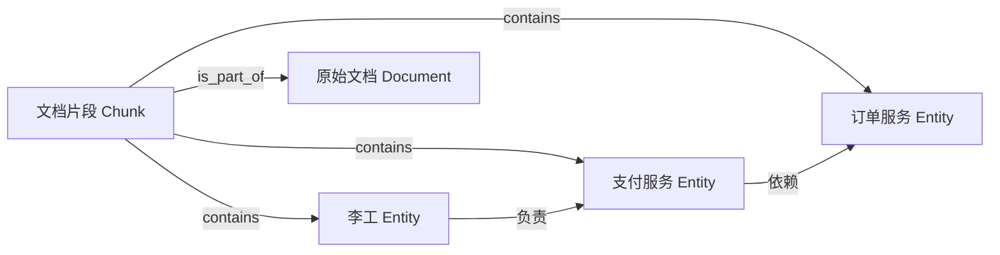
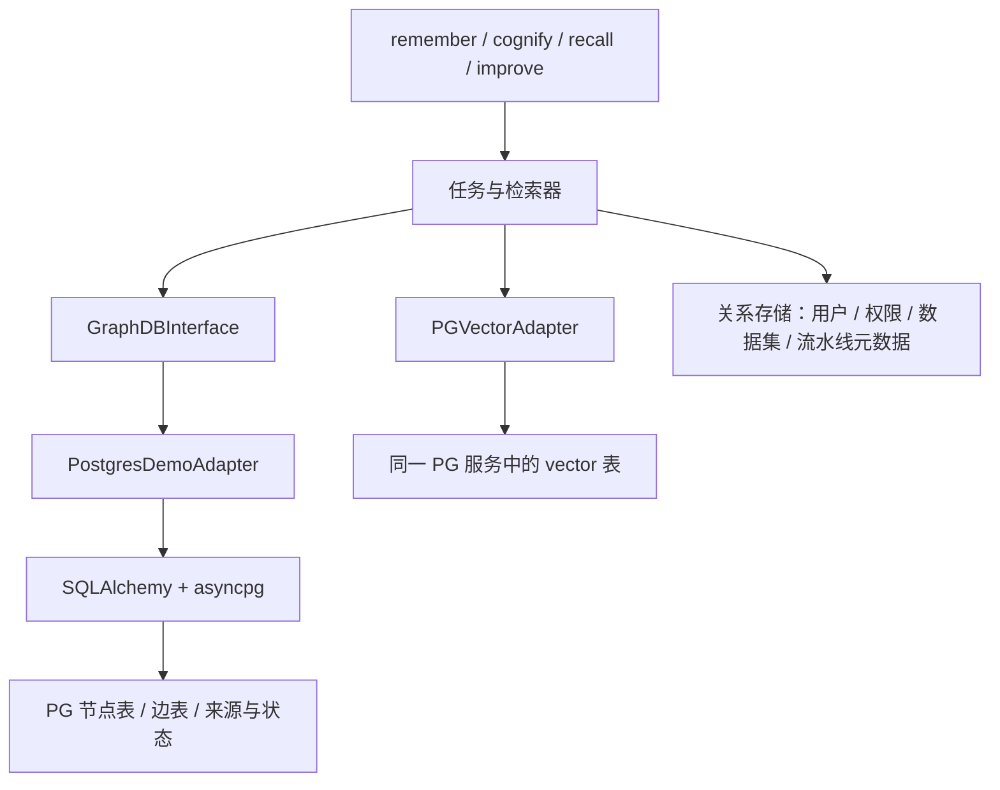

# Cognee 图能力落到 PostgreSQL：数据模型、改造位置与工作量

分析日期：2026-09-24。源码基线：Cognee `663a2dc15d04bc0d7ec2733a2dd604b7ed1b8c8e`。本文承接[图存储与 PG 替换分析](graph-storage-postgres-analysis.md)，聚焦开源 PG adapter 的补齐与工程化；[Cognee / Hindsight 架构对比](../competitive-landscape/05-code-architecture-cognee-vs-hindsight.md)另见专题。

本文区分“当前代码已经实现”“建议改造”“需要运行验证”。本轮只做源码和官方资料分析，没有修改 Cognee 源码，没有连接华为云实例，也没有执行性能测试。下文 SQL 是说明实现思路的示意，不能直接替代带事务、权限、校验及错误处理的 adapter 实现。

**1. 结论：需要图操作实现，但不一定需要独立图数据库服务**

Cognee 的任务和检索器需要“节点、边、邻居、子图、属性更新”等图操作。普通 PostgreSQL 可以用关系表保存这些结构，再用 SQL 实现操作。图的逻辑仍然存在，物理存储可以统一到 PG。

这条路线在当前仓库中已经存在：`PostgresDemoAdapter` 使用 SQLAlchemy + asyncpg 操作 `graph_node`、`graph_edge`、`graph_metadata`。不是新写一套图引擎，也不是将图编码成 embedding 后丢弃关系。`pgvector` 负责另一条向量检索链路。[现有 adapter](https://github.com/topoteretes/cognee/blob/663a2dc15d04bc0d7ec2733a2dd604b7ed1b8c8e/cognee/infrastructure/databases/graph/postgres_demo/adapter.py#L206)。

但“能表达这些数据”和“当前开源实现已经完整、适合生产”是两个判断。Cognee 官方把开源 PG 图后端标为 demo，并说明不支持原始 Cypher；官网另外提及商业授权的生产 PG adapter，本文没有其源码，不能将商业版本能力算到开源版本上。[Cognee 官方图后端说明](https://docs.cognee.ai/setup-configuration/graph-stores)。

针对本项目，建议将目标定义为：**复用现有关系图模型，补齐明确需要的接口，并在约定的数据规模和并发下验收。**不把“兼容任意 Cypher、所有图算法、所有未来插件”装进同一个工作包。

**2. 图的数据具体怎么存**

以“李工负责支付服务，支付服务依赖订单服务”为例，逻辑图可以是：



示例中的业务关系名称用于解释，实际实体和关系取决于抽取结果及模型。数据库中的核心记录如下，`p1/s1/s2/c1` 是便于阅读的示例 ID，实际应沿用 Cognee 生成的 ID。

| `graph_node.id` | `name` | `type` | `properties` 中的业务属性示例 |
|---|---|---|---|
| p1 | 李工 | Entity | 描述、类型信息等 |
| s1 | 支付服务 | Entity | 描述、标签等 |
| s2 | 订单服务 | Entity | 描述、标签等 |
| c1 | 片段名称 | DocumentChunk | 文本、片段位置等 |

| `graph_edge.source_id` | `target_id` | `relationship_name` | `properties` 示例 |
|---|---|---|---|
| p1 | s1 | 负责 | `edge_object_id`、关系属性 |
| s1 | s2 | 依赖 | `edge_object_id`、关系属性 |
| c1 | p1 | contains | `edge_object_id` 等 |

当前真实表结构的职责如下。[完整表定义](https://github.com/topoteretes/cognee/blob/663a2dc15d04bc0d7ec2733a2dd604b7ed1b8c8e/cognee/infrastructure/databases/graph/postgres_demo/tables.py#L28)。

| 表 | 原生列 | 用途与约束 |
|---|---|---|
| `graph_node` | `id` 主键，`name`，`type`，`properties JSONB`，来源数组，创建/更新时间 | 一行一个节点；不同类型的属性放 JSONB，避免每增加一种节点模型都建表 |
| `graph_edge` | `source_id`、`target_id`、`relationship_name` 复合主键，`properties JSONB`，来源数组，时间列 | 一行一条具体关系；端点是节点外键，删除节点会级联删除关联边 |
| `graph_metadata` | `key` 主键、`value` | 保存 provenance 版本、删除模式等图级标记，不是用户权限表 |

边的复合主键意味着：同一图内，同一源节点、目标节点和关系名合并为一条边。反方向、不同关系名可以共存；多个文档声明同一关系时，通常增加来源引用，不会自然变成多条相同三元组的物理边。如果业务要求“每条证据一条独立平行边”，需要额外设计证据节点或改变边身份模型，不能假定当前模型已经覆盖。

**来源为什么也必须存？**

假设文档 A 和 B 都声明“李工负责支付服务”。删除 A 时，应移除 A 的贡献，保留 B 仍支持的关系。这需要记录“数据是谁写入的”，仅有节点、边和外键不够。

当前节点和边都带四组数组：`source_ref_keys`、`source_dataset_ids`、`source_run_ids`、`source_run_refs`。它们分别支撑来源引用、dataset 查找、流水线运行查找及来源与运行关联。应用应复用现有编码和更新 helper，不自行猜测字符串格式。删除和失败补偿要先撤销对应引用，再判断对象是否仍有其他来源；不能把普通 `DELETE node` 的级联行为当作“删除文档”的完整业务实现。[来源列](https://github.com/topoteretes/cognee/blob/663a2dc15d04bc0d7ec2733a2dd604b7ed1b8c8e/cognee/infrastructure/databases/graph/postgres_demo/tables.py#L9)、[来源操作](https://github.com/topoteretes/cognee/blob/663a2dc15d04bc0d7ec2733a2dd604b7ed1b8c8e/cognee/infrastructure/databases/graph/postgres_demo/adapter.py#L964)。

向量表则保存向量记录 ID、payload 和 embedding，用相似度寻找候选。节点索引可通过 ID 对应回图节点；关系文本的索引 ID 与某条具体边的 `edge_object_id` 不是同一种身份。反馈更新必须找到具体边，不能把所有叫“负责”的边当成一条边。[边 ID 生成](https://github.com/topoteretes/cognee/blob/663a2dc15d04bc0d7ec2733a2dd604b7ed1b8c8e/cognee/modules/engine/utils/generate_edge_object_id.py#L4)、[向量记录模型](https://github.com/topoteretes/cognee/blob/663a2dc15d04bc0d7ec2733a2dd604b7ed1b8c8e/cognee/infrastructure/databases/vector/pgvector/PGVectorAdapter.py#L322)。

**3. 写入与检索怎么交互，为什么可以替换**



接入 PG 的理由是：上层大量操作调用稳定的 Python 方法，而不是直接发送某种图数据库协议。例如 `add_nodes`、`add_edges`、`get_nodes`、`get_neighborhood`。PG adapter 将这些方法实现为 SQL，返回调用方预期的结构，上层就能继续工作。它不是通用 Cypher→SQL 翻译器。[图引擎工厂](https://github.com/topoteretes/cognee/blob/663a2dc15d04bc0d7ec2733a2dd604b7ed1b8c8e/cognee/infrastructure/databases/graph/get_graph_engine.py#L387)。

写入时，Cognee 从文档产生 DataPoint 节点和关系，归集来源，再调用图和向量接口。当前普通双存储路径先写节点及其来源，再写节点向量；随后写边及其来源，再写关系向量。这样尽量让失败后的对象有来源记录可供发现和补偿。它们使用独立 adapter/session，**即使连接同一个 PG 数据库，也不是一个覆盖全流程的数据库事务**。[存储编排](https://github.com/topoteretes/cognee/blob/663a2dc15d04bc0d7ec2733a2dd604b7ed1b8c8e/cognee/tasks/storage/add_data_points.py#L256)。

检索的典型路径是：向量找到语义候选 → 用候选 ID 读取图节点和关系 → 扩展相关上下文 → 排序并生成答案。不同检索类型的调用链不同，纯 chunks 查询无需做同样的图扩展，不能把所有检索都概括成固定的一条流水线。[Hybrid 检索器](https://github.com/topoteretes/cognee/blob/663a2dc15d04bc0d7ec2733a2dd604b7ed1b8c8e/cognee/modules/retrieval/hybrid_retriever.py)。

例如“找支付服务的一跳邻居”，PG 只需要从边表定位与它相连的端点，再查节点表。示意 SQL 如下，`:node_id` 由驱动绑定：

```sql
SELECT n.id, n.name, n.type, n.properties
FROM graph_node AS n
JOIN (
    SELECT target_id AS id FROM graph_edge WHERE source_id = :node_id
    UNION
    SELECT source_id AS id FROM graph_edge WHERE target_id = :node_id
) AS neighbor ON neighbor.id = n.id;
```

该示例仅演示无向邻居节点；完整 adapter 还须按具体接口返回边、关系属性等。当前表已经为边的两个端点建立索引。

多跳查询当前由 Python 维护 BFS 前沿，每一层按前沿 ID 查询相邻边，再收集节点。未来可以评估有界递归 CTE 减少网络往返，但要保留去重、深度和结果语义，并通过实际计划和负载比较，不能断言 CTE 必然更快。当前 `get_neighborhood` 的 `edge_types` 用于限制扩展，最终返回已到达节点之间的诱导子图，可能包含其他关系类型；优化时不能悄悄改成另一种结果。[当前 BFS](https://github.com/topoteretes/cognee/blob/663a2dc15d04bc0d7ec2733a2dd604b7ed1b8c8e/cognee/infrastructure/databases/graph/postgres_demo/adapter.py#L907)、[PG 递归查询说明](https://www.postgresql.org/docs/current/queries-with.html)。

**4. 应改哪里：以现有 PG adapter 为基线**

下表是改造范围，不是已经完成的功能清单。路径均相对 Cognee 仓库。

| 文件或模块 | 现状 | 建议改造 |
|---|---|---|
| `infrastructure/databases/graph/postgres_demo/adapter.py`（前缀均为 `cognee/`） | 已有节点/边 CRUD、邻域、来源、三元组分页 | 补反馈 4 方法、truth 2 方法、`update_node`，按需补 Temporal 2 方法；修正覆盖、查询及锁策略 |
| `.../postgres_demo/tables.py` | 已有 JSONB、来源数组及部分索引 | 增加经验证需要的边 ID、时间检索索引；需要强类型列时同步改写入与迁移 |
| `cognee/infrastructure/databases/graph/graph_db_interface.py` | 已声明反馈、truth 和局部更新契约；时间接口尚未统一 | 检查统一返回约定；如规范 Temporal，兼容其他 adapter，不能只改接口签名 |
| `cognee/modules/improve/capabilities.py` | 通过方法覆盖判断部分能力 | 新方法通过测试后由能力探测识别；不要只把能力标志强制改成 true |
| `cognee/tasks/memify/apply_feedback_weights.py` | 先读权重，在 Python 计算，再调用 setter | 若要求多进程不丢反馈，需原子更新或 CAS/版本重试，涉及调用层 |
| `cognee/modules/truth_subspace/build.py` | 先写节点状态，后发布质心 epoch | 保持发布顺序；生产调度需防止同一图多个 build 互相覆盖 |
| `cognee/modules/retrieval/temporal_retriever.py` | 假设后端有时间查询方法，依赖特定返回结构 | 增加 PG 真实集成覆盖；候选内向量排序属于独立质量优化 |
| `cognee/infrastructure/databases/vector/pgvector/PGVectorAdapter.py` | 向量 collection 可创建和查询 | 规模要求触发时，补 ANN 索引的创建、参数、升级与验证 |
| dataset handlers、`postgres/admin.py`、新增图 schema 迁移模块 | 已有按库/按 schema 隔离与初始化 | 适配云端权限、TLS、扩展预安装；增加旧 schema 版本升级及回填 |
| `cognee/tests/e2e/postgres/` 等 | 已有真实 PG 基础回归 | 扩展高级接口、并发、迁移、时间检索和故障回归 |

其中反馈、truth 和局部更新的默认实现会抛出 `NotImplementedError`，声明了接口并不意味着 PG 已实现，见[接口源码](https://github.com/topoteretes/cognee/blob/663a2dc15d04bc0d7ec2733a2dd604b7ed1b8c8e/cognee/infrastructure/databases/graph/graph_db_interface.py#L757)。

最小维护路线是直接补现有 adapter，保持 provider 配置兼容。若希望独立发布私有 adapter，可以通过 `use_graph_adapter()` 注册，但工厂自定义分支的构造参数与内置 PG 分支不同，且不会自动解决 dataset schema 注入；还要配套注册/适配 dataset handler。不能把“注册一个类”算成完整多租户接入。[注册入口](https://github.com/topoteretes/cognee/blob/663a2dc15d04bc0d7ec2733a2dd604b7ed1b8c8e/cognee/infrastructure/databases/graph/use_graph_adapter.py)、[工厂自定义分支](https://github.com/topoteretes/cognee/blob/663a2dc15d04bc0d7ec2733a2dd604b7ed1b8c8e/cognee/infrastructure/databases/graph/get_graph_engine.py#L347)、[handler 注册表](https://github.com/topoteretes/cognee/blob/663a2dc15d04bc0d7ec2733a2dd604b7ed1b8c8e/cognee/infrastructure/databases/dataset_database_handler/supported_dataset_database_handlers.py)。

**5. 反馈权重：补四个方法，数据仍是 JSONB 数值**

这部分对应 improve 中当前 PG 缺少的 `feedback_weights` 图能力。上层根据反馈调整节点和具体边的权重，后续检索可利用这些状态。缺口是接口实现，不是 PG 无法保存浮点数。

| 方法 | PG 实现方向 | 必须保持的行为 |
|---|---|---|
| `get_node_feedback_weights(ids)` | 按节点主键批量查 JSONB | 只返回存在的对象；已有节点未设权重时返回默认 `0.5` |
| `set_node_feedback_weights(mapping)` | 按主键批量局部更新 | 不创建缺失节点；每个输入 ID 返回成功/失败 |
| `get_edge_feedback_weights(ids)` | 按 `properties ->> 'edge_object_id'` 查边 | ID 指具体边，不是关系名或关系文本向量 ID |
| `set_edge_feedback_weights(mapping)` | 定位真实复合主键行后局部更新 | 每个输入边 ID 返回成功/失败，保留其他属性及来源 |

参考契约见 [Ladybug 反馈实现](https://github.com/topoteretes/cognee/blob/663a2dc15d04bc0d7ec2733a2dd604b7ed1b8c8e/cognee/infrastructure/databases/graph/ladybug/adapter.py#L2474)。对于坏的存量权重，现有 adapter 的容错并不完全一致，应明确 PG 的转换和校验规则。不能把严格 `[0,1]` 校验、拒绝 NaN/Inf 描述成所有现有 adapter 已经保证的行为。

建议用数据库侧 JSONB patch，例如更新某节点权重：

```sql
UPDATE graph_node
SET properties = COALESCE(properties, '{}'::jsonb)
                 || jsonb_build_object('feedback_weight', CAST(:weight AS double precision)),
    updated_at = now()
WHERE id = :node_id
RETURNING id;
```

这样只改指定字段，避免 Python 先读整个 JSON、再写回旧副本而覆盖其他字段。生产实现仍需使用现有写事务/锁约定，处理批量和逐项结果。JSONB 合并是顶层合并，不能用它冒充递归深合并。[PG JSONB 说明](https://www.postgresql.org/docs/current/datatype-json.html)。

边 ID 查询建议增加匹配表达式的 B-tree 索引；是否可加唯一约束，要先检查历史 ID 完整性及唯一性。旧边没有 `edge_object_id` 时，应明确返回未找到，或者通过独立迁移按现有生成算法补齐，不能改用其他 ID 代替。[边 ID 写入](https://github.com/topoteretes/cognee/blob/663a2dc15d04bc0d7ec2733a2dd604b7ed1b8c8e/cognee/modules/graph/utils/prepare_edges_for_storage.py#L114)。

还有一个不同层次的问题：上层是“get → Python 计算 → set”。两个进程都读到 0.5，各自算出新值，最后一个 setter 仍可能覆盖前一个结果。原子 JSONB patch 只能避免无关字段覆盖，不能自动使每条反馈都生效。如果这是验收要求，需要增加 CAS/版本重试、数据库侧计算，或让整个读算写过程受同一个跨进程锁保护。[反馈调用方](https://github.com/topoteretes/cognee/blob/663a2dc15d04bc0d7ec2733a2dd604b7ed1b8c8e/cognee/tasks/memify/apply_feedback_weights.py#L130)。

**6. truth state：补两个方法，同时保留 epoch 发布协议**

这里的 truth state 是检索排序所用的对齐坐标与版本，不是数据库替用户判定事实真假，也不是把原始 embedding 再复制一份。

建议继续存于节点 JSONB：`truth_alignment` 为数组，`truth_epoch` 为整数。`get_node_truth_state(ids)` 返回 `{id: {truth_alignment, truth_epoch}}`；不存在节点不返回，存在但未初始化的节点返回 `[] / None`。`set_node_truth_state(mapping)` 更新已有节点并逐项返回 bool。[参考实现](https://github.com/topoteretes/cognee/blob/663a2dc15d04bc0d7ec2733a2dd604b7ed1b8c8e/cognee/infrastructure/databases/graph/ladybug/adapter.py#L2509)。

alignment 和 epoch 必须作为一组在同一行更新中写入，避免新坐标配旧版本。现有参考行为是：未提供 epoch 或传入 None 时保留已有 epoch；不能在 PG 中擅自改为清空或自行递增。

build 的顺序是：先写 N+1 的节点坐标，最后发布 N+1 的质心；检索只使用与当前 live epoch 一致的节点状态。新 epoch 未成功发布前，读侧仍以旧 live epoch 为准，已写为 N+1 的节点会因版本不匹配而暂不参与 truth 加权，并不保证整套旧坐标仍完整保留。所有节点写入都返回 False 时，上层阻止发布；部分节点成功则可以发布新 epoch，此时未更新节点的旧坐标不参与 truth 加权。因此 setter 必须如实返回逐项结果。这要求 adapter 与调用层共同遵守协议，但不要求 PG 安装图扩展。[构建顺序](https://github.com/topoteretes/cognee/blob/663a2dc15d04bc0d7ec2733a2dd604b7ed1b8c8e/cognee/modules/truth_subspace/build.py#L407)、[检索 epoch 门禁](https://github.com/topoteretes/cognee/blob/663a2dc15d04bc0d7ec2733a2dd604b7ed1b8c8e/cognee/modules/retrieval/hybrid/ranking.py#L37)。

**7. `update_node` 与重复入库：比“加个 UPDATE”更容易遗漏的部分**

`update_node(id, properties)` 应只覆盖指定属性，保留其他属性；空补丁、无效或不存在 ID 返回 False。节点关闭 `close_node` 需要这个方法写 `valid_to`，PG 当前没有实现该通用接口，因此不能正常完成这条更新路径。它是独立于 improve 九阶段的能力。[close_node 调用](https://github.com/topoteretes/cognee/blob/663a2dc15d04bc0d7ec2733a2dd604b7ed1b8c8e/cognee/tasks/storage/close_node.py#L21)、[参考 patch 实现](https://github.com/topoteretes/cognee/blob/663a2dc15d04bc0d7ec2733a2dd604b7ed1b8c8e/cognee/infrastructure/databases/graph/ladybug/adapter.py#L2550)。

PG 中 `id/name/type` 是原生列，其他大部分模型字段在 JSONB。实现必须规定哪些字段允许改：保护 ID 和来源字段；允许改 name/type 时要更新原生列，不能只往 JSONB 塞同名字段，导致读出的对象与 SQL 过滤所见不同。模型时间字段与数据库维护的时间列也要分清。[节点序列化](https://github.com/topoteretes/cognee/blob/663a2dc15d04bc0d7ec2733a2dd604b7ed1b8c8e/cognee/infrastructure/databases/graph/postgres_demo/adapter.py#L46)、[节点读出](https://github.com/topoteretes/cognee/blob/663a2dc15d04bc0d7ec2733a2dd604b7ed1b8c8e/cognee/infrastructure/databases/graph/postgres_demo/adapter.py#L440)。

必须一并审查现有 `add_nodes/add_edges`：冲突更新使用 `properties = EXCLUDED.properties`，即整体替换 JSONB。某节点学到了 feedback/truth 或设置了 valid_to，后来一次全量 upsert 的输入没有这些字段，或者新模型携带默认权重/null，就可能清掉或重置它们。模型完整序列化会包含默认值，因此不能仅在新 JSON 缺少键时保留旧状态；必须区分普通摄入与显式状态重置。不是每次 cognify 都必然触发该情况，但“实际走到全量重写”的路径必须覆盖。来源数组已有单独保留逻辑，不能据此推断 JSONB 状态也被保留。[节点序列化](https://github.com/topoteretes/cognee/blob/663a2dc15d04bc0d7ec2733a2dd604b7ed1b8c8e/cognee/infrastructure/databases/graph/postgres_demo/adapter.py#L46)、[节点 upsert](https://github.com/topoteretes/cognee/blob/663a2dc15d04bc0d7ec2733a2dd604b7ed1b8c8e/cognee/infrastructure/databases/graph/postgres_demo/adapter.py#L348)、[边 upsert](https://github.com/topoteretes/cognee/blob/663a2dc15d04bc0d7ec2733a2dd604b7ed1b8c8e/cognee/infrastructure/databases/graph/postgres_demo/adapter.py#L471)。

建议明确字段归属，而不是对所有属性盲目使用“旧值 || 新值”：

| 字段类别 | 建议写入规则 |
|---|---|
| 抽取/文档模型负责的业务属性 | 由新模型替换；需要支持业务字段删除，不能无限保留旧键 |
| feedback 等学习状态 | 同一对象身份下保留，重置走明确入口 |
| truth 等派生状态 | 内容未改变时可保留；内容或模型改变时需失效并重算，不能永久沿用旧坐标 |
| valid_to 等生命周期状态 | 由生命周期操作控制；重新入库是否重开必须显式定义 |
| provenance | 继续调用专门的引用维护逻辑，不混入通用属性 patch |

短期可在同一 JSONB 中按保留键和失效规则实现；长期若状态更新频繁，可评估单独状态列/状态表。后者隔离字段归属更清楚，但增加 join、迁移和维护工作，不纳入最小补齐范围。

**8. Temporal：普通 SQL 可实现，但要复制真实语义**

需要新增 `collect_time_ids` 与 `collect_events`。参考 Ladybug，前者筛选 Timestamp 节点，`time_at` 是 UTC epoch 毫秒；上下界均包含。后者从时间节点沿任意关系无向走 1～2 跳，收集去重的 Event，返回 `[{"events": [...]}]`，空结果也保留这个外层结构。[时间节点生成](https://github.com/topoteretes/cognee/blob/663a2dc15d04bc0d7ec2733a2dd604b7ed1b8c8e/cognee/modules/engine/utils/generate_timestamp_datapoint.py#L39)、[两方法参考实现](https://github.com/topoteretes/cognee/blob/663a2dc15d04bc0d7ec2733a2dd604b7ed1b8c8e/cognee/infrastructure/databases/graph/ladybug/adapter.py#L3701)。

PG 可按 `type='Timestamp'` 和 JSONB 时间值过滤，再用两层边连接或有界递归找到 Event，无需图查询语言。应使用参数化 ID 列表，避免复制某些 adapter 中“先拼带引号 ID 字符串”的做法。时间表达式索引必须匹配查询，并先处理历史缺值和非法数字，不能直接对脏数据强制 bigint 转换后建索引。

两点需要作为产品边界写清楚：

- 当前逻辑是“时间点落在区间内 → 找附近事件”，不等同于严格的“事件持续区间与查询区间相交”。跨越整个查询区间、两个端点都在区间外的事件可能不被命中；升级为区间相交检索另计。
- 当前 TemporalRetriever 先做全局 `Event_name` 向量 top_k，再给时间候选打分；不在该 top_k 内的候选缺少有限分数。补齐 PG 方法不自动改善这部分排序，若改成候选集内打分，需要额外检索质量评测。[TemporalRetriever](https://github.com/topoteretes/cognee/blob/663a2dc15d04bc0d7ec2733a2dd604b7ed1b8c8e/cognee/modules/retrieval/temporal_retriever.py#L109)。

**9. 生产化最主要的改造及其原因**

| 当前代码事实 | 对实际负载的影响 | 建议与验证 |
|---|---|---|
| 图写入采用固定 advisory lock key `5522063` | 同一数据库内不同 dataset schema 也竞争同一把写锁；读不取此锁 | 改为稳定的 schema/图级锁键，保留同图正确性；跨进程验证。滚动升级期间新旧锁协议不一致，须协调停写切换或兼容过渡 |
| BFS 已按前沿端点查询，有端点索引 | 不是每层必然全表扫描，但 hub 节点/高深度仍可产生巨大结果与网络传输 | 增加节点/边/时间预算、超限语义及指标；按真实图度分布压测 |
| 部分属性过滤先读整张节点表再 Python 过滤 | 大图时增加数据库到应用的数据量和内存 | 将允许的条件下推 SQL，按真实条件组合评估索引 |
| 来源数组有 GIN，但部分查询写为 `:token = ANY(array)` | 有索引不代表该谓词能使用它 | 改为匹配数组 GIN 的 `@>` 等表达式，检查 NULL/空数组语义，用 EXPLAIN 验证 |
| 三元组使用 OFFSET 分页，每批独立 session | 深分页成本增长；并发增删可能重复或漏项 | 加游标分页或明确一致快照策略，兼容旧 offset 接口 |
| 初始化仅 `create_all(checkfirst=True)` | 能建新表，不会完成现有 schema 的列/索引升级 | 增加 schema 版本、迁移、回填、失败恢复；覆盖所有已有 dataset schema |
| PGVector 的 `create_vector_index` 创建 collection 表 | 名称包含 index，不表示已建 HNSW/IVFFlat | 按实际维度、距离类型、版本、数据量建立 ANN 策略并测召回与延迟 |
| 图、向量、关系库分开提交 | 同实例不等于全流程原子提交 | 验证现有补偿；需要 durable job/outbox 或单事务重构时另立项目 |

证据：[写锁](https://github.com/topoteretes/cognee/blob/663a2dc15d04bc0d7ec2733a2dd604b7ed1b8c8e/cognee/infrastructure/databases/graph/postgres_demo/adapter.py#L104)、[全量读取后过滤](https://github.com/topoteretes/cognee/blob/663a2dc15d04bc0d7ec2733a2dd604b7ed1b8c8e/cognee/infrastructure/databases/graph/postgres_demo/adapter.py#L816)、[来源查找](https://github.com/topoteretes/cognee/blob/663a2dc15d04bc0d7ec2733a2dd604b7ed1b8c8e/cognee/infrastructure/databases/graph/postgres_demo/adapter.py#L1230)、[分页](https://github.com/topoteretes/cognee/blob/663a2dc15d04bc0d7ec2733a2dd604b7ed1b8c8e/cognee/infrastructure/databases/graph/postgres_demo/adapter.py#L1437)、[初始化](https://github.com/topoteretes/cognee/blob/663a2dc15d04bc0d7ec2733a2dd604b7ed1b8c8e/cognee/infrastructure/databases/graph/postgres_demo/adapter.py#L305)、[向量 collection 创建](https://github.com/topoteretes/cognee/blob/663a2dc15d04bc0d7ec2733a2dd604b7ed1b8c8e/cognee/infrastructure/databases/vector/pgvector/PGVectorAdapter.py#L485)。PG 官方列出了 GIN 数组运算符支持范围，不能将标量 ANY 写法和数组包含运算符视作同一个索引条件。[PG GIN 文档](https://www.postgresql.org/docs/17/gin.html)。

这里可以判断风险来源，不能据此给出“PG 比 Neo4j 慢几倍”或“支持千万节点”的结论。需将数据库时间、网络往返、应用图展开、embedding、LLM 调用分开测量，否则端到端延迟不能归因于图存储。

**10. 华为云具体怎么落地**

本文指华为云 **RDS for PostgreSQL**。连接链路就是 asyncpg 使用 PostgreSQL 协议发送 SQL；图表不依赖 AGE、Bolt 或 Gremlin。向量链路需要实例支持并安装 pgvector。华为云提供标准客户端/TLS 连接说明及 pgvector 版本检查、安装方式；这只能证明基础接入路线，不能替代本项目的实例验收。[华为云连接说明](https://support.huaweicloud.com/qs-rds-pg/rds_02_0016.html)、[pgvector 说明](https://support.huaweicloud.com/usermanual-rds-pg/rds_09_0062.html)。

现有 shared handlers 可让图和向量按 dataset schema 放在同一个关系数据库中。适用的关键配置组合如下，仅展示后端选择，不是含凭据/TLS 的完整部署文件：

```dotenv
DB_PROVIDER=postgres
GRAPH_DATABASE_PROVIDER=postgres_demo
GRAPH_DATASET_DATABASE_HANDLER=postgres_graph_shared
VECTOR_DB_PROVIDER=pgvector
VECTOR_DATASET_DATABASE_HANDLER=pgvector_shared
ENABLE_BACKEND_ACCESS_CONTROL=true
```

落地时应复核以下具体代码行为：

- shared handlers 使用关系数据库的连接配置，schema 名由 dataset ID 生成；不要同时混用“每 dataset 创建数据库”的默认模式。[图 handler](https://github.com/topoteretes/cognee/blob/663a2dc15d04bc0d7ec2733a2dd604b7ed1b8c8e/cognee/infrastructure/databases/graph/postgres_demo/PostgresGraphSharedDatasetDatabaseHandler.py)、[向量 handler](https://github.com/topoteretes/cognee/blob/663a2dc15d04bc0d7ec2733a2dd604b7ed1b8c8e/cognee/infrastructure/databases/vector/pgvector/PGVectorSharedDatasetDatabaseHandler.py)。
- 图连接的 search_path 固定到 dataset schema；向量侧还需能解析 vector 扩展类型。schema 隔离依赖正确的授权和应用路由，不应描述为每租户独立数据库账户级隔离。[图连接设置](https://github.com/topoteretes/cognee/blob/663a2dc15d04bc0d7ec2733a2dd604b7ed1b8c8e/cognee/infrastructure/databases/graph/postgres_demo/adapter.py#L218)。
- 当前管理 helper 在需要时执行 `CREATE EXTENSION IF NOT EXISTS vector`。华为云文档提供受管安装入口 `control_extension`；应由授权角色预装并验证应用初始化行为，必要时将“检查扩展存在”与“安装扩展”分开。不能假设普通应用账户有任意扩展或建库权限。[管理 helper](https://github.com/topoteretes/cognee/blob/663a2dc15d04bc0d7ec2733a2dd604b7ed1b8c8e/cognee/infrastructure/databases/postgres/admin.py#L133)。
- TLS 参数要贯通数据连接和创建 schema 等管理连接；图 adapter 复用关系配置的 connect_args，但驱动参数与 libpq 命令行参数不能不加验证地混用。凭据中的特殊字符、证书校验及断线重连应纳入实测。
- 共用一个数据库并不自动共用一个连接池；需要按 worker 数、活跃 dataset 数及图/向量 engine 数估算连接总量。

已有 dataset 的后端注册信息和旧存储不会因为修改环境变量自动迁移。新部署可以直接采用 PG；从 Ladybug/Neo4j 转存已有数据应另做导出、导入、来源与索引核对、切换和回滚方案。

**11. 工作量：按交付范围估，不按 SQL 行数估**

以下是基于源码的工程估算，不是实测工时或统计意义上的置信区间。一个人日按一名工程师一个完整工作日计。假设工程师熟悉 Python 异步、SQLAlchemy、PG；测试实例可用；复用当前 adapter；需求冻结到本文范围；包括对应代码评审与针对性测试。区间反映契约细节、历史数据和云端配置的不确定性。

| 工作包 | 交付内容 | 人日 |
|---|---|---:|
| A. 基线与 PoC | 跑通现有 PG 图/向量路径，固定测试数据、功能范围与环境参数 | 2～4 |
| B. 七个高级接口 | 反馈 4、truth 2、update_node 1；边 ID 查询；批量/缺失值/返回契约及真库测试 | 4～10 |
| C. 属性归属与重复入库 | 全量 upsert 保留学习状态、派生状态失效、生命周期字段规则及回归 | 2～4 |
| D. Temporal 基础兼容 | 两方法、时间索引、毫秒边界、去重、检索器集成；保持当前时间点语义 | 4～6 |
| E. 查询与结果规模控制 | SQL 条件下推、来源 GIN 谓词、BFS 预算、分页策略及局部计划验证 | 4～7 |
| F. schema 升级 | 图 schema 版本、索引/字段升级、必要小规模回填、失败恢复测试 | 3～5 |
| G. 跨进程协调 | schema 级写锁、升级切换、同图构建协调、并发/异常测试 | 3～5 |
| H. 不丢反馈的业务更新 | 改造读算写协议，CAS/原子更新/重试，验证部分成功与幂等 | 3～6 |
| I. 向量性能配套 | ANN 创建及生命周期、参数、召回与延迟的针对性验证 | 2～4 |
| J. 华为云联调 | 权限、TLS、扩展、共享 schema、连接池及重新连接验证 | 2～4 |
| K. 综合验收与运维 | 代表性规模/并发负载、已有补偿故障演练、指标、运行及回滚说明 | 4～7 |
| **全部合计** | **限定功能、限定负载下的生产试点范围** | **33～62** |

各包中的针对性测试计在本包；K 只计跨模块综合负载与交付验收，避免把全部测试重复加一遍。F 是当前 PG schema 的升级，不包含从其他图数据库搬迁大规模历史数据。环境/权限审批和实例采购等等待时间不计入人日。

可以按需求分三档，而不是一开始承担全部投入：

| 档位 | 累计工作量 | 能证明什么 |
|---|---:|---|
| 现有能力 PoC | A：2～4 人日 | 真实 PG 环境中基础写入、向量查询、图读取和删除跑通；不能证明高级能力完整 |
| 功能补齐 | A+B+C：8～18 人日；含 Temporal 为 12～24 人日 | 约定接口在测试范围内工作；仍不能承诺高并发与生产 SLA |
| 生产试点 | A～K：33～62 人日，已包含前两档 | 在约定规模、拓扑、并发和故障条件下验收；不代表任意图负载都可承载 |

含 Temporal 的功能补齐之后，再加 E～K 为 **21～38 人日**。若项目完全不使用 Temporal，可减去 D；但不能把不存在的时间检索能力写进产品承诺。若只用于单进程低并发试验，也可暂不做 H，但要明确其业务一致性边界。

排期上，全部范围约相当于一人 7～13 个工作周。两名合适工程师分别负责接口/状态与数据库/性能，辅以 DBA 和测试评审，可暂按 **5～8 个日历周**规划；这只是带依赖与集成缓冲的初始排期，不是“两人就必然减半”。A 完成后应根据真实数据与权限情况重新估算。

**不含在上面的范围：**任意 Cypher 翻译器；完整图算法平台；跨图/向量/关系存储的全流程单事务重构；durable job/outbox 平台；大规模旧后端不停机迁移；严格事件区间检索的新产品语义；更换 embedding 模型后的全面质量重评；特定 RPO/RTO/SLA 的完整工程。任意一项加入，都需要独立方案和估算。

**12. 验收应该怎样做，才能知道改造真的完成**

仓库已有真实 PG 的 CRUD、来源、并发、BFS、过滤、分页和 shared schema 测试，不能说测试从零开始；但现有覆盖不等于新接口和云端性能已经通过。[PG adapter 测试](https://github.com/topoteretes/cognee/blob/663a2dc15d04bc0d7ec2733a2dd604b7ed1b8c8e/cognee/tests/e2e/postgres/test_postgres_adapter.py)、[shared schema 测试](https://github.com/topoteretes/cognee/blob/663a2dc15d04bc0d7ec2733a2dd604b7ed1b8c8e/cognee/tests/e2e/postgres/test_shared_schema_isolation.py)。

| 验收对象 | 必须可观察的结果 |
|---|---|
| 节点与具体边权重 | 已有对象默认值正确；缺失对象不伪造成存在；每项 bool 与真实更新一致；更新不清空来源和其他属性 |
| 重复入库 | 全量重写后学习状态按规则保留；内容变化时 truth 状态按规则失效；被删除业务字段不会因盲目 merge 残留 |
| 并发反馈 | 多进程同时更新能按约定生效；失败重试不把已成功的反馈重复应用 |
| truth 发布 | 坐标/epoch 一致更新；未发布新版本时仍使用旧 live epoch，忽略已写成新 epoch 的节点坐标；全部失败不发布新质心；部分成功后发布时忽略仍为旧 epoch 的节点坐标 |
| 生命周期更新 | valid_to 生效；缺失节点 False；重复更新符合既有 last-write-wins 契约 |
| 来源删除 | 两文档共享节点/边时，删除一个来源仍保留另一个；失败运行撤销不误删其他运行的贡献 |
| 时间检索 | UTC 毫秒边界、无结果、重复路径、单边界和返回结构正确；区间相交限制被清楚标明 |
| 隔离与升级 | A schema 不读写 B；已有 schema 能升级，升级中断可恢复；新旧锁协议切换可控 |
| 图/向量失败 | 注入图成功向量失败等故障，核对可发现、可重试/补偿的对象，不因同 PG 而假定原子性 |
| 性能 | p50/p95/p99、吞吐、锁等待、查询次数、连接峰值、内存、返回节点/边数与向量召回均记录 |

性能数据集应覆盖均匀图与少量高度节点、不同跳数、不同活跃 dataset 数、读写混合、批量来源删除。先声明数据规模与验收阈值，再比较当前 PG、改造 PG 和备选图后端。测试时保持缓存/会话等产品功能配置一致；不能通过关闭记忆功能来宣称图性能提升。

**13. 对架构选择的建议**

如果产品主要使用语义召回、有限跳邻域、来源追溯和记忆状态更新，希望减少数据库种类，PG 路线值得先用 A 验证，再做 B/C 和必要的生产化。它的工程价值是统一部署与运维基础；代价是团队承担图接口和查询执行策略的持续维护。

如果核心需求包含用户直接写 Cypher、复杂可变长路径、大范围图分析，现有 adapter 的方向与需求差距更大。此时应比较成熟图后端或可获得验证的商业方案，而不是默认把任何图功能都翻译成手写 SQL。切换原生图数据库也必须检查 Cognee adapter 的方法覆盖：例如本基线 Neo4j 有反馈方法，但并未实现与 Ladybug 相同的 truth/update_node 覆盖，不能只看数据库品牌就认为所有上层功能齐全。

**阅读范围与证据边界：**本轮定向检查 PG 图 adapter/表、工厂与 shared handlers、存储编排、反馈调用方、truth 构建/排序、Ladybug/Neo4j 的相关方法、TemporalRetriever、PGVector collection 创建及相关测试。没有重新全量审查 Cognee/Hindsight 仓库，也没有把其他分支或商业版本实现混入结论。完整源码依据固定到本文开头提交，官网资料用于核对产品说明与数据库基础能力。
