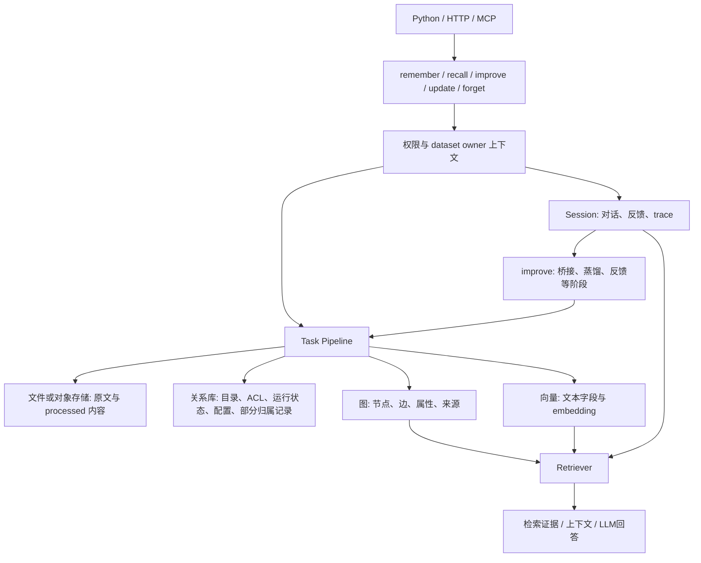
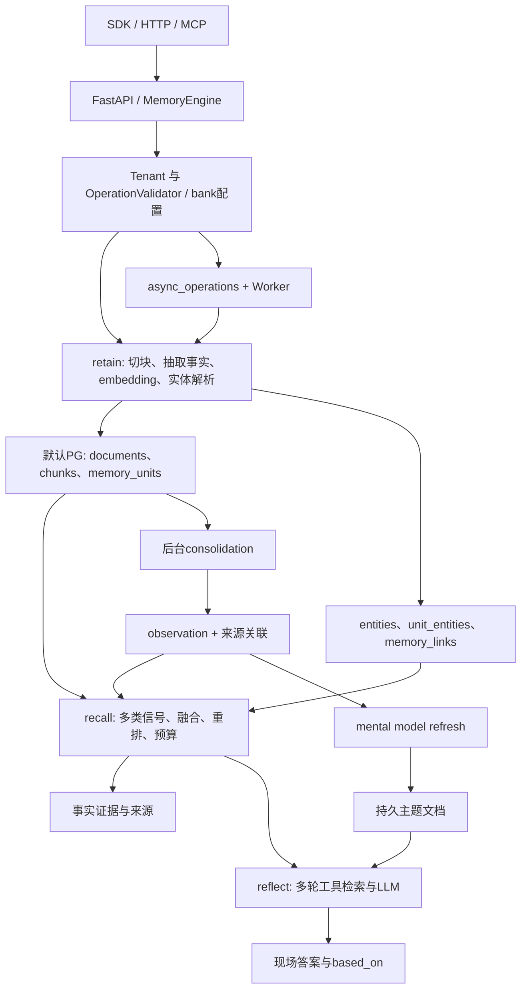

# Cognee 与 Hindsight：当前架构、代码实现及演进能力对比

分析日期：2026-09-24。本文先独立介绍两边的当前实现，再比较性能、架构合理性、扩展与演进。范围为本地开源代码，不将商业云服务的实现推定为开源能力。

| 项目 | 本次基线 | 主要源码位置 |
|---|---|---|
| Cognee | 1.6.0，`663a2dc15d04bc0d7ec2733a2dd604b7ed1b8c8e` | `cognee/api`、`modules`、`tasks`、`infrastructure`、`cognee-mcp` |
| Hindsight | 0.10.1，`12f2d54f643baddacb98cd547c89b1a50c5c3dcc` | `hindsight-api-slim/hindsight_api`、`hindsight-clients`、`hindsight-embed` |

**证据口径：**实现结论来自固定提交的源码，官网用于说明产品设计。两者冲突时以该提交实际调用链为准。“判断/推论”表示由代码推导的取舍，**不是本次实测结果**。本轮没有启动数据库、调用付费模型或完成同条件端到端压测，因此不提供虚构的 QPS、延迟排名或质量胜率。

本文补充并修订 [04 数据流对比](04-dataflow-hindsight-vs-cognee.md) 中过于绝对的结论；具体修订见第 7 节。Cognee 的 PG 与华为云问题另见[图存储与 PostgreSQL 分析](../cognee/graph-storage-postgres-analysis.md)。

## 1. Cognee 当前架构与代码实现

### 1.1 核心组织：DataPoint、Task、Pipeline、Retriever 和存储适配器

Cognee 将文档、对话或代码转为带身份的 Python 数据对象，再由处理任务建立图和向量索引。查询时检索器利用这些索引组织上下文；会话层还可以记录交互、反馈和经验，再转入持久记忆。

它的主要抽象分别回答不同问题：`DataPoint` 定义“是什么数据及其关系”；`Task/Pipeline` 定义“如何加工”；`Retriever` 定义“如何找回并组织证据”；graph/vector/relational adapter 定义“如何保存与访问”。[官方架构](https://docs.cognee.ai/core-concepts/architecture)介绍了三类存储的职责与内容交叉存储；源码还需要结合 session 和文件存储理解完整生命周期。



模块与实际职责如下。

| 模块 | 核心实现 | 作用 |
|---|---|---|
| 公开入口 | `api/v1/remember`、`recall`、`improve`；低层 `add/cognify/search` | 将记忆接口展开为数据摄入、构图、检索、会话管理 |
| 加工框架 | `modules/pipelines`、`tasks` | Task 参数绑定、分批、文档并发、运行状态和失败处理 |
| 数据模型 | `infrastructure/engine/models/DataPoint.py`，文档/实体模型 | 稳定 ID、索引字段、对象引用与图边 |
| 存储 | `tasks/storage`、`infrastructure/databases` | 图与向量写入、来源归属、后端工厂和 dataset 数据库配置 |
| 查询 | `modules/retrieval` | Hybrid、GraphCompletion、chunk、temporal、code 等不同读取算法 |
| 演进 | `modules/improve`、`api/v1/update` | 会话沉淀、反馈、经验蒸馏、源文档增量变更 |

源码入口：[公开导出](https://github.com/topoteretes/cognee/blob/663a2dc15d04bc0d7ec2733a2dd604b7ed1b8c8e/cognee/__init__.py#L37)、[Task 实现](https://github.com/topoteretes/cognee/blob/663a2dc15d04bc0d7ec2733a2dd604b7ed1b8c8e/cognee/modules/pipelines/tasks/task.py#L124)、[cognify 任务编排](https://github.com/topoteretes/cognee/blob/663a2dc15d04bc0d7ec2733a2dd604b7ed1b8c8e/cognee/api/v1/cognify/cognify.py#L580)。

### 1.2 如何接入：可以嵌入，也可以服务化

Python 应用可直接 `import cognee` 调用异步业务函数，SDK 默认无需跨 HTTP。典型永久记忆链是 `remember → add → cognify → 可选自动 improve`；需要控制阶段时，应用可以分别调用 `add/cognify/search`。`remember(session_id=...)` 则先写 session，再触发向长期记忆桥接的后台工作。

FastAPI 在 `/api/v1/` 注册记忆和低层接口；MCP 的 `CogneeClient` 有 direct 与 HTTP 两种模式。`cognee.serve(url=..., api_key=...)` 还可让支持远程模式的记忆接口转发到远程服务。它们复用同一组业务模块，不是三个独立引擎。[HTTP 注册](https://github.com/topoteretes/cognee/blob/663a2dc15d04bc0d7ec2733a2dd604b7ed1b8c8e/cognee/api/client.py#L430)、[远程连接状态](https://github.com/topoteretes/cognee/blob/663a2dc15d04bc0d7ec2733a2dd604b7ed1b8c8e/cognee/api/v1/serve/state.py#L24)、[MCP 双模式客户端](https://github.com/topoteretes/cognee/blob/663a2dc15d04bc0d7ec2733a2dd604b7ed1b8c8e/cognee-mcp/src/cognee_client.py#L72)。

接入时应先决定两件事：业务需要的是会话即时记忆，还是经过抽取的永久知识；读取需要原始证据，还是由 Cognee 生成答案。不同选项会经过不同阶段，不能仅凭都叫 `recall` 推定相同费用或返回语义。

### 1.3 一份文档如何写入，图里到底是什么

以“李工负责支付服务，支付服务使用 PostgreSQL”为例，下面是**示意数据**，具体抽取内容由模型决定。

1. `add` 保存原始输入，经 loader 生成或定位 processed 内容，登记 Data 和 dataset 归属。
2. `cognify` 将已登记的数据分类为文档对象，读取其内容并切成 `DocumentChunk`。
3. 图抽取任务生成临时 `KnowledgeGraph`，再展开为正式 `Entity`、`EntityType` 与业务关系。
4. 为 chunk 生成 `TextSummary`，按模型引用展开节点和边。
5. 写入图及来源信息，并按声明的字段生成 embedding，写入向量集合。

摄入转换发生在 `add` 的 `ingest_data` 任务中，不能把所有文本解析工作都归给 cognify。[add 的任务编排](https://github.com/topoteretes/cognee/blob/663a2dc15d04bc0d7ec2733a2dd604b7ed1b8c8e/cognee/api/v1/add/add.py#L273)、[loader 输出](https://github.com/topoteretes/cognee/blob/663a2dc15d04bc0d7ec2733a2dd604b7ed1b8c8e/cognee/tasks/ingestion/ingest_data.py#L342)。

图可以具有以下结构：

```text
TextSummary ──made_from──> DocumentChunk ──is_part_of──> TextDocument
                              │
                           contains
                              ↓
                           李工:Entity ──负责──> 支付服务:Entity
                              │                    │
                            is_a                 使用
                              ↓                    ↓
                       人员:EntityType       PostgreSQL:Entity
```

`DocumentChunk` 有文本、序号和文档引用；`Entity` 有名称、描述、类型关联和关系。普通标量字段成为图节点属性，`DataPoint` 对象引用成为边；显式 `Edge.relationship_type` 决定业务边名称。因此 `relations` 字段不会强制把所有关系都存成叫 `relations` 的边。[Chunk 模型](https://github.com/topoteretes/cognee/blob/663a2dc15d04bc0d7ec2733a2dd604b7ed1b8c8e/cognee/modules/chunking/models/DocumentChunk.py#L32)、[模型转图](https://github.com/topoteretes/cognee/blob/663a2dc15d04bc0d7ec2733a2dd604b7ed1b8c8e/cognee/modules/graph/utils/get_graph_from_model.py#L87)、[引用转边](https://github.com/topoteretes/cognee/blob/663a2dc15d04bc0d7ec2733a2dd604b7ed1b8c8e/cognee/modules/graph/utils/field_edges.py#L63)。

这也解释了图为什么能替换存储引擎：任务和检索器主要消费统一节点、边及属性协议，不直接依赖一种物理图文件格式。但替换后端必须实现对应操作及高级能力，不能只保存两张同名表。

### 1.4 数据保存位置及关联方式

| 存储职责 | 主要保存内容 | 与其他存储怎样关联 |
|---|---|---|
| 文件/对象存储 | 原始文件、processed 文本 | 关系库和 Document 保存位置/身份；原始二进制不必全部进入图 |
| 关系库 | 用户、dataset、权限、Data、运行记录、数据库映射、部分 ownership ledger | 管理谁能访问、处理是否完成、哪些输出属于哪个来源 |
| 图 | Document、Chunk、Summary、Entity、EntityType，业务关系、结构关系、来源引用 | 保存显式连接；支持来源追溯与共享节点删除判断 |
| 向量 | `DocumentChunk_text`、`Entity_name` 等字段索引及 payload；关系文本索引 | 节点向量沿用图节点 ID，向量命中后可回图找邻域 |
| session 层 | 对话、trace、反馈等 | 即时交互及后续 improve 的输入，具体后端由 session 配置决定 |

`index_data_points` 复制对象时保留 ID，按模型类型与字段建索引。关系文本使用 `EdgeType` 索引，其身份不等于每条物理图边的身份。[字段索引](https://github.com/topoteretes/cognee/blob/663a2dc15d04bc0d7ec2733a2dd604b7ed1b8c8e/cognee/tasks/storage/index_data_points.py#L39)。

特别需要纠正身份规则：图 `DataPoint.id_for` 按类名与规范化 identity 值生成 UUID5，Entity 默认以 name 为身份依据；同名消歧还有抽取上下文处理。拼接 tenant/user/dataset/data 的是**关系库 ownership 行主键**，其 `slug` 才指向图节点 ID。租户隔离主要依靠授权及 database/schema 作用域。[图 ID](https://github.com/topoteretes/cognee/blob/663a2dc15d04bc0d7ec2733a2dd604b7ed1b8c8e/cognee/infrastructure/engine/models/DataPoint.py#L164)、[ownership ID](https://github.com/topoteretes/cognee/blob/663a2dc15d04bc0d7ec2733a2dd604b7ed1b8c8e/cognee/modules/graph/methods/upsert_nodes.py#L40)。

### 1.5 如何检索：先找语义候选，再利用结构

当前低层 `search()` 默认 `HYBRID_COMPLETION`。常规 Hybrid 会生成查询 embedding，分别检索 chunk/summary 与 entity/关系文本，再取实体的一跳图邻域，组织原文片段、实体与关系等上下文，进入回答阶段。Summary 有助于定位和排序，但不应把“存了摘要”等同于“最终只把摘要发给模型”。邻域失败的实体分支可降级为无边的实体结果。[默认参数](https://github.com/topoteretes/cognee/blob/663a2dc15d04bc0d7ec2733a2dd604b7ed1b8c8e/cognee/api/v1/search/search.py#L43)、[Hybrid 调度](https://github.com/topoteretes/cognee/blob/663a2dc15d04bc0d7ec2733a2dd604b7ed1b8c8e/cognee/modules/retrieval/hybrid_retriever.py#L97)、[图邻域读取](https://github.com/topoteretes/cognee/blob/663a2dc15d04bc0d7ec2733a2dd604b7ed1b8c8e/cognee/modules/retrieval/hybrid/entities.py#L60)。

另一个重要检索器 `GraphCompletion` 大致是：向量候选 → 按 ID 取图投影 → 在 Python 的 `CogneeGraph` 中按节点/关系距离与权重排序三元组 → 构造上下文 → LLM。某些分支可以投影更大范围乃至全图，所以性能不能只看向量 top-K。[图投影与排序](https://github.com/topoteretes/cognee/blob/663a2dc15d04bc0d7ec2733a2dd604b7ed1b8c8e/cognee/modules/retrieval/utils/brute_force_triplet_search.py#L286)、[三元组排序](https://github.com/topoteretes/cognee/blob/663a2dc15d04bc0d7ec2733a2dd604b7ed1b8c8e/cognee/modules/graph/cognee_graph/CogneeGraph.py#L480)。

自然语言生成 Cypher 是另一种专门路径；常规 Hybrid 问答不要求 Cypher。代码图也可通过专门任务构建模块、符号及依赖，再用相应检索算法消费。`recall` 还会涉及 session 和路由，不能将所有查询概括成固定的“全图 GraphRAG”。

### 1.6 执行、并发与失败：框架有恢复机制，但不是全程原子事务

`Task` 可包装同步函数、coroutine、generator 和 async generator；Pipeline 将输出送入下个任务，并持久化运行状态。同 dataset 外层 pipeline 使用进程内 `asyncio` 锁，内部 data item 可通过 semaphore 并发；不同 dataset 也可并发。一次包含多个 dataset 的 pipeline 调用仍有顺序循环。[Pipeline](https://github.com/topoteretes/cognee/blob/663a2dc15d04bc0d7ec2733a2dd604b7ed1b8c8e/cognee/modules/pipelines/operations/pipeline.py#L94)、[文档并发](https://github.com/topoteretes/cognee/blob/663a2dc15d04bc0d7ec2733a2dd604b7ed1b8c8e/cognee/modules/pipelines/operations/run_tasks.py#L119)。

`DatasetQueue` 主要是进程级并发和 engine 资源管理，不是持久消息队列。默认后台执行将 generator 后续消费挂在保留引用的本地 asyncio task 上。部署模板存在，并不意味着默认 pipeline 已具有跨机器任务接管协议。[后台执行](https://github.com/topoteretes/cognee/blob/663a2dc15d04bc0d7ec2733a2dd604b7ed1b8c8e/cognee/modules/pipelines/layers/pipeline_execution_mode.py#L56)。

写入图、向量和关系库是不同步骤；即使三者都放进一个 PG 实例，当前任务层也没有因此获得一笔贯穿所有 adapter 的共享事务。图通常先写，向量随后写；失败时利用图 provenance 或关系 ownership 做补偿，删除失去来源的输出，并尽可能保留可重试依据。这不是恢复每个曾覆盖属性的完整快照。[实际存储顺序](https://github.com/topoteretes/cognee/blob/663a2dc15d04bc0d7ec2733a2dd604b7ed1b8c8e/cognee/tasks/storage/add_data_points.py#L250)、[rollback 两种来源路径](https://github.com/topoteretes/cognee/blob/663a2dc15d04bc0d7ec2733a2dd604b7ed1b8c8e/cognee/modules/cognify/rollback.py#L158)。

API 启动还会扫描陈旧未完成 run 并做补偿清理，主要处理 cognify。它不同于自动续跑任务。dataset 锁明确只保护进程内；多个进程写同 dataset 需要额外协调。[锁的范围](https://github.com/topoteretes/cognee/blob/663a2dc15d04bc0d7ec2733a2dd604b7ed1b8c8e/cognee/infrastructure/locks/dataset_lock.py#L18)、[启动恢复](https://github.com/topoteretes/cognee/blob/663a2dc15d04bc0d7ec2733a2dd604b7ed1b8c8e/cognee/modules/cognify/recovery.py#L24)。

### 1.7 当前已经有哪些演进能力

**源数据演进。** `update` 已有 chunk 增量链：暂存新内容 → 差异规划 → 检查旧 chunks 能否正确重组 → 只抽取新 chunks → 清理被替换 chunk 的来源 → 更新存活 chunk 序号 → 最后发布关系库元数据。不满足 graph/vector/provenance 能力时回退全量重建。[增量入口](https://github.com/topoteretes/cognee/blob/663a2dc15d04bc0d7ec2733a2dd604b7ed1b8c8e/cognee/api/v1/update/incremental.py#L521)、[写入与发布](https://github.com/topoteretes/cognee/blob/663a2dc15d04bc0d7ec2733a2dd604b7ed1b8c8e/cognee/api/v1/update/incremental.py#L866)。

未变内容可以少付 LLM/embedding 成本，但最后 metadata publish 的原子性不等于整个图和向量更新不可见。失败后的 baseline 检查与重建是恢复措施，不是跨库 MVCC。

**交互记忆演进。** `remember` 默认可以自动触发 `improve`：session 路径后台桥接，永久路径在 cognify 后触发。阶段包括反馈权重、会话 Q&A、agent traces、上下文提取、经验蒸馏、用户偏好，以及可选 truth、triplet、global context。每个阶段有门禁，只有 session 持久化阶段被标为 fatal；其他错误记录后可继续。[remember 两条路径](https://github.com/topoteretes/cognee/blob/663a2dc15d04bc0d7ec2733a2dd604b7ed1b8c8e/cognee/api/v1/remember/remember.py#L1779)、[improve 阶段](https://github.com/topoteretes/cognee/blob/663a2dc15d04bc0d7ec2733a2dd604b7ed1b8c8e/cognee/api/v1/improve/improve.py#L113)、[能力检查](https://github.com/topoteretes/cognee/blob/663a2dc15d04bc0d7ec2733a2dd604b7ed1b8c8e/cognee/modules/improve/capabilities.py#L73)。

所以“Cognee 没有自动演进”不成立；但自动触发也不等于每次九阶段都执行。无 session、相关 opt-in 关闭或 adapter 不支持时，阶段可能全部跳过。反馈检测、反馈保存、图权重更新、检索使用权重还是四个不同环节。这些是记忆数据和检索行为的调整，不是模型训练。

## 2. Hindsight 当前架构与代码实现

### 2.1 核心组织：Bank、事实、观察与持久主题文档

Hindsight 围绕一个 bank 内的记忆生命周期提供服务：`retain` 将输入变成可检索事实，`recall` 返回证据，`reflect` 基于证据推理回答。后台 consolidation 将事实归纳为 observation，mental model refresh 再生成或更新持久主题文档。

默认 PG 路径将事实文本、embedding、时间、标签和来源保存在统一关系模型中，图结构也是关系表与查询，而不要求独立图数据库。当前代码另有 memories store 扩展，不能再概括成完全没有存储抽象。



核心模块的职责比仅看 retain/recall/reflect 三个函数更细。

| 模块 | 职责 |
|---|---|
| `api/http.py`、`api/mcp.py`、client packages | 协议模型、输入处理、调用业务引擎、响应及来源封装 |
| `engine/memory_engine.py` | bank 配置、操作编排、store 分派、recall/reflect、派生文档与任务生命周期 |
| `engine/retain`、`entity_resolver.py` | 抽取、embedding、流式写批、来源、实体消歧、图联系 |
| `engine/memories`、`engine/db`、`engine/sql` | store 能力契约、默认 PG 实现、数据库操作与 dialect |
| `engine/search`、`engine/reflect` | 候选生成、图/时间扩展、融合重排、工具调用推理 |
| `engine/consolidation`、`worker` | 观察生成、队列认领、重试、维护与刷新 |
| `extensions` | 租户认证、操作策略、扩展装载及生命周期 |

### 2.2 如何接入：对外服务语义比较明确

Python 高层客户端的 `aretain/arecall/areflect` 构造生成式 API 模型并发 HTTP 请求；同步同名方法是包装。注意 Python `async/await` 与“服务器后台任务”是两层概念：`await aretain(...)` 默认仍等待服务器完成；只有 `retain_async=True` 才返回后台 operation。[SDK 写入参数](https://github.com/vectorize-io/hindsight/blob/12f2d54f643baddacb98cd547c89b1a50c5c3dcc/hindsight-clients/python/hindsight_client/hindsight_client.py#L455)、[实际 HTTP 调用](https://github.com/vectorize-io/hindsight/blob/12f2d54f643baddacb98cd547c89b1a50c5c3dcc/hindsight-clients/python/hindsight_client/hindsight_client.py#L1184)。

| 操作 | HTTP 入口 | 返回语义 |
|---|---|---|
| retain | `POST /v1/default/banks/{bank_id}/memories` | 默认等待；`async=true` 持久入队，返回 operation ID |
| recall | `POST /v1/default/banks/{bank_id}/memories/recall` | 事实结果，可选 chunks、entities、source_facts、trace |
| reflect | `POST /v1/default/banks/{bank_id}/reflect` | 生成式回答，可选 based_on、工具调用 trace、结构化输出 |

代码入口：[retain 分派](https://github.com/vectorize-io/hindsight/blob/12f2d54f643baddacb98cd547c89b1a50c5c3dcc/hindsight-api-slim/hindsight_api/api/http.py#L9722)、[recall](https://github.com/vectorize-io/hindsight/blob/12f2d54f643baddacb98cd547c89b1a50c5c3dcc/hindsight-api-slim/hindsight_api/api/http.py#L5872)、[reflect](https://github.com/vectorize-io/hindsight/blob/12f2d54f643baddacb98cd547c89b1a50c5c3dcc/hindsight-api-slim/hindsight_api/api/http.py#L6125)。每次核心操作针对一个 bank；跨 bank 业务查询需要上层编排。

MCP 复用 MemoryEngine，支持带 bank 参数的多 bank 工具和从 URL 绑定 bank 的工具。`hindsight-embed` 自动管理本地 daemon 与 pg0，简化启动；其“embedded”不等于 SDK 把 HTTP、数据库服务器和模型依赖全部消除了。[MCP 注册](https://github.com/vectorize-io/hindsight/blob/12f2d54f643baddacb98cd547c89b1a50c5c3dcc/hindsight-api-slim/hindsight_api/api/mcp.py#L114)、[daemon 实现](https://github.com/vectorize-io/hindsight/blob/12f2d54f643baddacb98cd547c89b1a50c5c3dcc/hindsight-embed/hindsight_embed/daemon_embed_manager.py#L1)。

### 2.3 写入：从文本变成带来源和时间的事实

普通 retain 路径是：

```text
MemoryEngine.retain_batch_async
  → 解析 bank config / retain strategy
  → orchestrator.retain_batch
  → 切块 / 适用时使用 delta
  → streaming producer: 事实抽取 → 日期补充 → embedding
  → consumer: 实体解析 → mini-batch SQL事务
  → final semantic ANN 建联系（await，失败尽力处理）
  → 返回；consolidation 另行排队
```

事实抽取保留文本、`world/experience` 类型、实体、发生时间、提及时间、来源 chunk/document、tags 及因果关系。也有 `chunks` 绕过 LLM 和 `verbatim` 等模式，所以“retain 永远进行同样的 LLM 抽取”不准确。[引擎到 orchestrator](https://github.com/vectorize-io/hindsight/blob/12f2d54f643baddacb98cd547c89b1a50c5c3dcc/hindsight-api-slim/hindsight_api/engine/memory_engine.py#L6654)、[抽取结果转换](https://github.com/vectorize-io/hindsight/blob/12f2d54f643baddacb98cd547c89b1a50c5c3dcc/hindsight-api-slim/hindsight_api/engine/retain/fact_extraction.py#L3352)、[streaming 入口](https://github.com/vectorize-io/hindsight/blob/12f2d54f643baddacb98cd547c89b1a50c5c3dcc/hindsight-api-slim/hindsight_api/engine/retain/orchestrator.py#L1835)。

同一示例文档可能产生“李工负责支付服务”“支付服务使用 PostgreSQL”等事实文本。这些事实本身是检索节点；实体负责将提到同一对象的事实连接起来。它的中心不是任意领域对象及自由属性，而是有共同 schema 的事实记忆。

实体解析也不是每个名字再调用一次 LLM。默认先在 bank 内做 trigram 候选查询，再结合名称、共现和时间接近度评分；批内名称变体还会聚类。并发创建用唯一性/冲突处理复用赢家。这能减少重复实体，但模糊匹配并不证明两个对象在现实中一定同一。[候选查询](https://github.com/vectorize-io/hindsight/blob/12f2d54f643baddacb98cd547c89b1a50c5c3dcc/hindsight-api-slim/hindsight_api/engine/entity_resolver.py#L880)、[评分及创建](https://github.com/vectorize-io/hindsight/blob/12f2d54f643baddacb98cd547c89b1a50c5c3dcc/hindsight-api-slim/hindsight_api/engine/entity_resolver.py#L1282)。

### 2.4 保存哪些数据，图和向量在哪里

| 表/对象 | 保存内容与用途 |
|---|---|
| `banks` | 记忆空间、配置与身份信息 |
| `documents / chunks` | 来源文本、文档身份、内容 hash、分块及 retain 参数 |
| `memory_units` | 事实文本、embedding、类型、时间、tags、metadata、来源；observation 也在此表 |
| `entities / unit_entities` | bank 内规范实体；事实与实体的多对多关联 |
| `entity_cooccurrences` | 实体共现统计，辅助后续消歧 |
| `memory_links` | 事实之间的 temporal、semantic、caused_by 等联系 |
| observation 来源关联 | 派生 observation 由哪些原事实支持；默认 PG 使用 `memory_units.source_memory_ids` 数组，Oracle 使用 `observation_sources` 关联表 |
| `mental_models` | 主题知识文档、source_query、内容、来源、刷新策略与水位 |
| `async_operations` | 任务 payload、状态、worker、重试、串行键等 |

来源关系是逻辑模型，不同数据库的物理表示不同；PG 的 `uses_observation_sources_table=False` 明确选择数组操作。[PG 来源能力](https://github.com/vectorize-io/hindsight/blob/12f2d54f643baddacb98cd547c89b1a50c5c3dcc/hindsight-api-slim/hindsight_api/engine/db/ops_postgresql.py#L83)、[来源查询的后端分支](https://github.com/vectorize-io/hindsight/blob/12f2d54f643baddacb98cd547c89b1a50c5c3dcc/hindsight-api-slim/hindsight_api/engine/memories/pg/writes.py#L198)。

默认 PG 的事实 INSERT 使用批量 `unnest`，一次写事实文本、向量、时间和来源字段；向量列与关系数据属于同一数据面，无需再向独立向量数据库双写。[事实 INSERT](https://github.com/vectorize-io/hindsight/blob/12f2d54f643baddacb98cd547c89b1a50c5c3dcc/hindsight-api-slim/hindsight_api/engine/db/ops_postgresql.py#L148)。

默认会真实创建 ANN 索引：新 bank 为 world、experience、observation 各建一个带 bank/type 条件的 partial HNSW。`VECTOR_INDEX_MIN_ROWS` 默认 0，即立即建；配置阈值后才改为增长到阈值后后台建索引。优点是按 bank/type 的 ANN 就绪，代价是大量 bank 增加索引、规划和 DDL 负担。[bank 索引](https://github.com/vectorize-io/hindsight/blob/12f2d54f643baddacb98cd547c89b1a50c5c3dcc/hindsight-api-slim/hindsight_api/engine/retain/bank_utils.py#L32)、[索引 SQL](https://github.com/vectorize-io/hindsight/blob/12f2d54f643baddacb98cd547c89b1a50c5c3dcc/hindsight-api-slim/hindsight_api/engine/db/ops_postgresql.py#L1219)。

图边含义要分开：semantic 是向量近邻，temporal 是时间联系，caused_by 等来自抽取出的因果关系；实体共同提及通过 `unit_entities` 导出。**当前 entity 边已不再物化到 `memory_links`**，不能继续照搬旧“四类实体边全部预存”的说明。[当前关联写入](https://github.com/vectorize-io/hindsight/blob/12f2d54f643baddacb98cd547c89b1a50c5c3dcc/hindsight-api-slim/hindsight_api/engine/retain/orchestrator.py#L631)。

### 2.5 事务与异步任务的真实保证

默认 PG 路径需要区分三件事：

1. **入队事务**：异步父任务、子任务与 payload 在一个事务中写入；caller operation ID 可以对异步重试去重。
2. **单小批事务**：一次 streaming mini-batch 内的文档处理、chunks、facts、事实实体关联、temporal/causal links 一起提交；LLM、embedding 和先期实体解析在事务外。
3. **整次 retain**：多个小批次各自提交，后批失败不回滚前批；实体统计、后续 semantic ANN、consolidation 不属于整次写入的同一个原子事务。

这既缩短了锁和连接占用，也允许读取者看到部分已完成数据。不能把“PG 支持 ACID”扩大为“每个 retain 全部原子可见”。[入队事务](https://github.com/vectorize-io/hindsight/blob/12f2d54f643baddacb98cd547c89b1a50c5c3dcc/hindsight-api-slim/hindsight_api/engine/memory_engine.py#L21993)、[写批事务](https://github.com/vectorize-io/hindsight/blob/12f2d54f643baddacb98cd547c89b1a50c5c3dcc/hindsight-api-slim/hindsight_api/engine/retain/orchestrator.py#L3085)、[提交后的 ANN](https://github.com/vectorize-io/hindsight/blob/12f2d54f643baddacb98cd547c89b1a50c5c3dcc/hindsight-api-slim/hindsight_api/engine/retain/orchestrator.py#L3462)。

同文档通过行锁、content hash 检查防止另一 replace/append 并发接管；chunk hash 和 operation checkpoint 支持失败后的部分复用。它们是可重试设计，不能直接称为全程 exactly-once。

Worker 使用短事务 `FOR UPDATE SKIP LOCKED` 认领持久任务，随后靠状态和 worker ID 记录所有权，不会为整个 LLM 调用一直持有认领行锁。同 document retain 有串行键；consolidation 等部分维护按 bank 和操作类型串行；不同文档可以并行。[PG 认领](https://github.com/vectorize-io/hindsight/blob/12f2d54f643baddacb98cd547c89b1a50c5c3dcc/hindsight-api-slim/hindsight_api/engine/db/ops_postgresql.py#L1825)、[串行规则](https://github.com/vectorize-io/hindsight/blob/12f2d54f643baddacb98cd547c89b1a50c5c3dcc/hindsight-api-slim/hindsight_api/engine/db/ops.py#L91)。

**恢复仍有边界：**启动恢复主要匹配原 `worker_id`，正常关闭释放自己的任务；硬杀后以新 ID 启动可能留下 processing 任务，需要稳定且唯一的 worker 身份或管理恢复。`claimed_at` 字段不等于已经实现了通用心跳租约接管。[恢复与关闭](https://github.com/vectorize-io/hindsight/blob/12f2d54f643baddacb98cd547c89b1a50c5c3dcc/hindsight-api-slim/hindsight_api/worker/poller.py#L1353)。

### 2.6 recall：四类信号，存在执行依赖

默认 PG 的真实顺序是：

```text
query embedding / 请求预算与过滤条件
  → semantic + keyword 的 UNION ALL SQL
  → 同连接执行 temporal（有时间窗口时）
  → 释放连接；以 semantic seeds 启动 graph，按 fact_type 并发
  → RRF 融合 → 限制重排候选 → 可选 cross-encoder
  → 时间/新近度/证据数量调整 → token预算 → 返回证据
```

因此“四路”是四类召回信号，不是四路独立同时开跑。Graph 依赖前面取到的语义种子。官方概览和部分注释的 parallel 描述不足以代表当前调度。[`PostgresMemories.recall_unified`](https://github.com/vectorize-io/hindsight/blob/12f2d54f643baddacb98cd547c89b1a50c5c3dcc/hindsight-api-slim/hindsight_api/engine/memories/postgres.py#L82)、[上层分派](https://github.com/vectorize-io/hindsight/blob/12f2d54f643baddacb98cd547c89b1a50c5c3dcc/hindsight-api-slim/hindsight_api/engine/search/retrieval.py#L795)。

| 路径 | 代码实际做什么 |
|---|---|
| Semantic | 按 bank、fact_type、tags 等过滤，embedding 余弦距离排序，限制候选 |
| Keyword | 根据文本扩展执行不同 SQL；统一变量名 bm25 不代表算法相同 |
| Graph | 语义种子 → 共享 entity 的事实、semantic/causal links；observation 还通过 source facts 扩展 |
| Temporal | 解析时间窗口，选时间覆盖较广的语义种子，再沿时间/因果联系有界扩展 |

`native` 关键词后端实际上是 `tsvector @@ to_tsquery` 与 `ts_rank_cd`；`vchord`、`pg_textsearch`、`pg_search` 分别有其 BM25 实现；`pgroonga` 用自己的文本查询/评分。云 PG 支持 native 不等于支持所有增强扩展。[五种文本 SQL 分支](https://github.com/vectorize-io/hindsight/blob/12f2d54f643baddacb98cd547c89b1a50c5c3dcc/hindsight-api-slim/hindsight_api/engine/sql/postgresql.py#L337)。

Graph 的普通事实路径从有限语义 seeds 出发，组合共享实体数量、semantic 权重与 causal 权重。它是面向事实的关联召回，不提供任意领域 Cypher 查询语义。Temporal 邻接扩展也可能带回初始窗口外的相关事实；时间窗口在这里不等于全结果硬过滤。[图扩展](https://github.com/vectorize-io/hindsight/blob/12f2d54f643baddacb98cd547c89b1a50c5c3dcc/hindsight-api-slim/hindsight_api/engine/search/link_expansion_retrieval.py#L131)、[时间扩展](https://github.com/vectorize-io/hindsight/blob/12f2d54f643baddacb98cd547c89b1a50c5c3dcc/hindsight-api-slim/hindsight_api/engine/search/retrieval.py#L463)。

RRF 按 ID 合并各路排名，之后可用 cross-encoder 对 query 与事实组对评分。预算分成检索深度、重排候选数、最终事实文本 token 数，原始 chunks/source_facts 还有各自预算。最终按整条事实装箱；若所有事实都超长，正预算下仍可能保留第一条完整事实，因此不是严格的整个 HTTP payload token 上限。[融合](https://github.com/vectorize-io/hindsight/blob/12f2d54f643baddacb98cd547c89b1a50c5c3dcc/hindsight-api-slim/hindsight_api/engine/search/fusion.py#L29)、[重排](https://github.com/vectorize-io/hindsight/blob/12f2d54f643baddacb98cd547c89b1a50c5c3dcc/hindsight-api-slim/hindsight_api/engine/search/reranking.py#L348)、[事实预算](https://github.com/vectorize-io/hindsight/blob/12f2d54f643baddacb98cd547c89b1a50c5c3dcc/hindsight-api-slim/hindsight_api/engine/fact_budget.py#L43)。

**recall 返回证据，不在这条路径上调用生成式 LLM 回答问题。**但 query embedding、远程 reranker 仍可能产生模型/网络费用。当前 store 还可以实现 `full_recall` 包办整个过程；以上顺序只描述默认 PG 通用路径。[store 接管入口](https://github.com/vectorize-io/hindsight/blob/12f2d54f643baddacb98cd547c89b1a50c5c3dcc/hindsight-api-slim/hindsight_api/engine/memory_engine.py#L8441)。

### 2.7 reflect、consolidation、mental model 分别做什么

**Reflect 是现场推理。**它是多轮工具调用 agent：先读 mental models，再读 observations，必要时查原始 facts/expand 来源。low/mid 可在找到未过期主题文档时提前停止强制下探；high 会继续核验。后续步骤由模型选工具，同轮工具可并行。最后答案附带已检索证据 ID；这证明引用出现过，不能证明每个结论逻辑上都由引用蕴含。普通 reflect 本身不把答案重新写成记忆。[agent 主循环](https://github.com/vectorize-io/hindsight/blob/12f2d54f643baddacb98cd547c89b1a50c5c3dcc/hindsight-api-slim/hindsight_api/engine/reflect/agent.py#L558)、[分层工具](https://github.com/vectorize-io/hindsight/blob/12f2d54f643baddacb98cd547c89b1a50c5c3dcc/hindsight-api-slim/hindsight_api/engine/reflect/tools.py#L90)。

它可能发生多次 LLM、子 recall、context 压缩、最终改写和结构提取，成本不能当成“一次检索 + 一次模型调用”。

**Consolidation 是后台归纳。**从未完成的 world/experience 事实取批次，按 scope 查已有 observations，再让 LLM 发出 create/update/delete。候选检索特意使用 interleave 排序以保留接近的旧观察，避免去重目标被挤出。embedding/去重准备在事务外；成功 observation、来源关系与 `consolidated_at` 标记在短事务中写入。Observation 仍是 `memory_units` 的一种 fact_type。[候选与 LLM 动作](https://github.com/vectorize-io/hindsight/blob/12f2d54f643baddacb98cd547c89b1a50c5c3dcc/hindsight-api-slim/hindsight_api/engine/consolidation/consolidator.py#L3114)、[提交](https://github.com/vectorize-io/hindsight/blob/12f2d54f643baddacb98cd547c89b1a50c5c3dcc/hindsight-api-slim/hindsight_api/engine/consolidation/consolidator.py#L2670)。

**Mental model 是持久主题文档。**它有 source_query、scope/tags、正文、based_on、刷新策略与水位。refresh 调用 reflect 生成内容，支持 full 和 delta；delta 用更新时间/水位取新增或更新记忆，对结构化章节应用编辑，失败时保留旧文档和水位。可手动触发，也可由 consolidation 完成或 cron 触发。[刷新计算](https://github.com/vectorize-io/hindsight/blob/12f2d54f643baddacb98cd547c89b1a50c5c3dcc/hindsight-api-slim/hindsight_api/engine/memory_engine.py#L17175)、[持久化](https://github.com/vectorize-io/hindsight/blob/12f2d54f643baddacb98cd547c89b1a50c5c3dcc/hindsight-api-slim/hindsight_api/engine/memory_engine.py#L18010)。

来源撤回有显式检查和异步刷新，但不是同步绝对保证：pending consolidation 时会等待；自动刷新可失败；全部旧引用无法解析时有恢复/复制兼容分支，可能保留正文。故应称“来源跟踪与尽力撤回”，不应称“删除来源即保证所有派生内容立即消失”。[staleness 与撤回调度](https://github.com/vectorize-io/hindsight/blob/12f2d54f643baddacb98cd547c89b1a50c5c3dcc/hindsight-api-slim/hindsight_api/engine/memory_engine.py#L19917)、[撤回内容处理](https://github.com/vectorize-io/hindsight/blob/12f2d54f643baddacb98cd547c89b1a50c5c3dcc/hindsight-api-slim/hindsight_api/engine/memory_engine.py#L17639)。

### 2.8 权限与扩展：bank 不是默认授权边界

当前内置 `DefaultTenantExtension` 不做认证，返回配置的 schema；`ApiKeyTenantExtension` 校验一个 key，仍把认证请求送到同一个配置 schema。动态租户到 schema 的映射需要自定义 TenantExtension。bank 是数据组织维度；团队成员能否访问哪个 bank、执行哪个操作，还需要 OperationValidator/上层权限策略。[默认与 API-key 租户](https://github.com/vectorize-io/hindsight/blob/12f2d54f643baddacb98cd547c89b1a50c5c3dcc/hindsight-api-slim/hindsight_api/extensions/builtin/tenant.py#L8)、[租户契约](https://github.com/vectorize-io/hindsight/blob/12f2d54f643baddacb98cd547c89b1a50c5c3dcc/hindsight-api-slim/hindsight_api/extensions/tenant.py#L53)、[bank 操作钩子](https://github.com/vectorize-io/hindsight/blob/12f2d54f643baddacb98cd547c89b1a50c5c3dcc/hindsight-api-slim/hindsight_api/extensions/operation_validator.py#L918)。

配置有全局环境 → tenant → bank 的覆盖层次；扩展通过 `module:Class` 装载，并有生命周期、额外 bank 表的迁移/备份/删除契约。这给产品化提供了接点，但不是现成完整企业 IAM。[配置层次](https://github.com/vectorize-io/hindsight/blob/12f2d54f643baddacb98cd547c89b1a50c5c3dcc/hindsight-api-slim/hindsight_api/config_resolver.py#L1)、[扩展装载](https://github.com/vectorize-io/hindsight/blob/12f2d54f643baddacb98cd547c89b1a50c5c3dcc/hindsight-api-slim/hindsight_api/extensions/loader.py#L26)。

**存储抽象已经演进。**`HINDSIGHT_API_MEMORIES_EXTENSION` 可装载自定义 store；默认 `PostgresMemories`，retain 已有默认 PG、store-owned、RetainSession 能力分支。外部 store 可管理事实数据面，甚至接管完整 recall。但 bank 配置、异步任务等仍依赖 SQL 控制平面，不能只替换向量 top-K 就宣称替换整个 Hindsight。[store 工厂](https://github.com/vectorize-io/hindsight/blob/12f2d54f643baddacb98cd547c89b1a50c5c3dcc/hindsight-api-slim/hindsight_api/engine/memories/__init__.py#L1)、[retain 能力分派](https://github.com/vectorize-io/hindsight/blob/12f2d54f643baddacb98cd547c89b1a50c5c3dcc/hindsight-api-slim/hindsight_api/engine/retain/orchestrator.py#L2996)。

[官网 Storage](https://hindsight.vectorize.io/developer/storage)仍保留“No Storage Abstraction”的表述，同时介绍 PG 与 Oracle。对本提交，前述 store 接口是更准确的实现依据；官网定位文字不能用于否认已有代码。

## 3. 两边比较：先对齐比较对象

| 需要完成的工作 | Cognee 对应路径 | Hindsight 对应路径 | 比较时必须对齐 |
|---|---|---|---|
| 变成可检索的持久记忆 | add+cognify 或永久 remember | 普通事实 retain | 不把仅保存原文/入队 ACK 当成完成 |
| 返回检索证据 | retriever 的 retrieval/context 路径 | recall | 禁止只给一边计入最终 LLM |
| 生成答案 | recall / Hybrid或Graph completion，按实际配置 | reflect 或 recall+同一个外部LLM | reflect 多轮推理与普通单次 completion 工作量不同 |
| 交互沉淀 | session → improve | 对话 retain → consolidation；集成层决定何时写 | 会话即时可用与长期事实可用的时间不同 |
| 更新已有来源 | update 的增量/重建 | document replace/append/delta与checkpoint | 同样变更比例、删除语义与可见性要求 |
| 归纳与长期知识 | improve 各阶段、可选全局结构 | observation consolidation、mental model refresh | 同时核算后台 LLM 与新鲜度 |

**设计判断：Cognee 更偏可组合的记忆构建框架；Hindsight 更偏有明确事实模型和生命周期的记忆服务。**两者都在写入时做抽取和 embedding，也都有后台演进。不能简单分成“一个写时智能，一个只在读时智能”。

## 4. 性能比较：代码能支持什么判断

### 4.1 写入成本由输出膨胀和后处理决定

设输入切成 C 块，抽出 F 条事实、E 个实体、R 条关系：

```text
Cognee 常规构建成本
  ≈ C块抽取与摘要 + 被索引字段embedding
    + 节点/边/来源写入 + graph/vector/relational协调 + 实际启用的improve

Hindsight 普通retain成本
  ≈ C块事实抽取 + F个事实embedding + 实体候选匹配
    + 来源/事实/关联/索引写入 + final ANN
    + 后续consolidation与文档refresh
```

这是**工作量分解**，不是延迟相加公式：并发、批处理、缓存和服务端排队会改变关键路径。F/E/R 取决于内容密度、抽取 prompt 和模型，不能只用“文档数量相同”定义同负载。

| 维度 | Cognee 的实现与影响 | Hindsight 的实现与影响 |
|---|---|---|
| 网络/写路径 | 多 adapter 调用，可能跨进程/跨库；灵活但有协调开销 | 默认 PG 批量事实、向量、关联共库，往返与局部事务更易合并 |
| LLM 工作 | 图抽取、摘要和有条件 improve；自定义任务可增加或减少 | 普通事实抽取；后续 consolidation/refresh 仍计费；chunks模式语义不同 |
| 增量节省 | 可保留未变 chunks 及索引，减少重复构图 | 有 delta/append及chunk checkpoint，具体收益依赖变更形态 |
| 并发限制 | 同dataset进程内锁，文档可并发；dataset queue 限资源 | worker slots、LLM/DB限流，同document任务串行，跨document并行 |
| 完成定义 | session写入、cognify完成、improve完成是不同里程碑 | 入队、事实提交、ANN完成、consolidation drain、MM新鲜是不同里程碑 |

Hindsight 有 producer/consumer、embedding 合批和队列预算，但“128 MB 背压”不能理解为进程只占 128 MB：reserve 发生在抽取/embedding 之后，等待 reserve 的结果、在途任务及原文仍占内存。应测真实 RSS。[背压与任务创建](https://github.com/vectorize-io/hindsight/blob/12f2d54f643baddacb98cd547c89b1a50c5c3dcc/hindsight-api-slim/hindsight_api/engine/retain/orchestrator.py#L2556)。

### 4.2 读取性能：需要看索引、图投影与模型成本

Hindsight 默认 PG 路径的优势是实际 ANN 索引、事实 schema、候选预算与召回/生成接口分离。它有条件提供可控的证据读取路径；但 entity hub、大候选预算、cross-encoder、来源水合都会增加延迟，四类召回也不是免费叠加。

Cognee 的 Hybrid 可从有限候选和局部邻域组织上下文，适合兼顾原文和实体结构。GraphCompletion 的部分路径会加载较大图投影，在 Python 中排序；这比数据库原生裁剪好的有界查询更容易受到图规模与网络传输影响。这个风险属于具体 retriever，不能扩大为“Cognee 所有查询都全图扫描”。

还有一个对 PG 很具体的差异：本提交 Cognee `PGVectorAdapter.create_vector_index` 实际创建向量表，没有自动创建 HNSW/IVFFlat 的 DDL；默认 Hindsight 会创建 partial HNSW。**这是这两个 PG 实现的默认行为差异，不是所有 Cognee 向量后端都没有 ANN。**[Cognee 建表与向量写入](https://github.com/topoteretes/cognee/blob/663a2dc15d04bc0d7ec2733a2dd604b7ed1b8c8e/cognee/infrastructure/databases/vector/pgvector/PGVectorAdapter.py#L485)。

所以未经配置对齐的比较，可能测到的是“有 ANN 与无 ANN”，并非架构整体优劣。PG planner 是否真正采用索引、带权限/标签过滤后还剩多少有效候选，也必须通过执行计划和召回质量共同验证。

### 4.3 水平扩展与大规模数据的不同瓶颈

| 场景 | Cognee | Hindsight |
|---|---|---|
| 多用户、许多小数据集/bank | dataset后端配置、pool/engine缓存、隔离资源数增长 | shared表上bank过滤；默认约每bank三组事实ANN索引，catalog/规划/DDL增长 |
| 单个巨大知识空间 | 大图投影、关系密度、向量索引与跨存储IO | 大bank的ANN、graph hub、关联表、vacuum/索引维护 |
| 多实例写同一空间 | 当前进程内dataset锁不足以跨进程协调 | DB行锁与任务串行键更直接；仍不是整次文档全原子 |
| API与后台隔离 | 默认后台task随所在进程；需额外调度设计 | 独立worker消费持久队列已存在；数据库仍承载调度压力 |
| 崩溃重启 | stale run补偿，不是通用任务续跑 | 同worker ID恢复/管理恢复，有持久进度但接管边界需验证 |

Cognee 开源 PG 图 adapter 还有固定 advisory lock 对图写入的串行化影响；其作用域按该数据库，不因业务 schema 不同自动分散。此结论只针对该 adapter，不能外推 Neo4j/Ladybug。Hindsight 的共享 PG 同时承载关系、ANN、全文、图邻域和队列，读写/维护资源争用也不会因为同库事务方便而消失。[Cognee PG 锁](https://github.com/topoteretes/cognee/blob/663a2dc15d04bc0d7ec2733a2dd604b7ed1b8c8e/cognee/infrastructure/databases/graph/postgres_demo/adapter.py#L110)。

### 4.4 现有基准不能直接换成胜负

Hindsight 的[官方性能页](https://hindsight.vectorize.io/developer/performance)给出 typical latency 与优化建议；这些是官方口径，不能作为本次两项目、同硬件同数据的实测。其仓库另有 mock LLM + pg0 的系统性能 harness，记录 percentile、阶段成本及并发维护争用；这种测试适合发现引擎回归，不代表真实 LLM 抽取质量或真实模型时延。[性能 harness](https://github.com/vectorize-io/hindsight/blob/12f2d54f643baddacb98cd547c89b1a50c5c3dcc/hindsight-dev/benchmarks/perf/README.md#L1)。

Cognee 有完整质量评测 harness，以及依据若干语料/分块大小测量的 token 成本分析。后者能说明抽取密度、chunk 大小会显著改变写入成本，但没有同时测 Hindsight，不能作为两者成本比。[质量评测](https://github.com/topoteretes/cognee/blob/663a2dc15d04bc0d7ec2733a2dd604b7ed1b8c8e/cognee/eval_framework/README.md#L1)、[token 成本研究](https://github.com/topoteretes/cognee/blob/663a2dc15d04bc0d7ec2733a2dd604b7ed1b8c8e/cognee/eval_framework/token_usage_analysis/README.md#L1)。

Hindsight 还区分 stub 系统测试与真实模型质量 eval，明确抽取失真和派生文档更新错误需要真实模型评测。这类测试设计有参考价值，但“测试更多”也不等于本业务必然更准确。[真实模型 eval 的边界](https://github.com/vectorize-io/hindsight/blob/12f2d54f643baddacb98cd547c89b1a50c5c3dcc/hindsight-system-evals/README.md#L1)。

## 5. 架构合理性与扩展成本

### 5.1 哪些设计合理，代价是什么

| 维度 | Cognee | Hindsight |
|---|---|---|
| 抽象中心 | DataPoint+Task+Retriever，领域和处理流程表达能力强 | Bank+事实/观察/文档，记忆语义清晰，默认路径较统一 |
| 数据一致性 | 多存储步骤与来源补偿，需处理部分成功 | 单批数据面事务更集中；整次retain分批提交，失败可能部分完成，派生数据另行更新 |
| 存储选择 | graph/vector/relational分别可换，能力矩阵较复杂 | 默认PG便于统一部署；新store接口增加替换空间与适配复杂度 |
| 业务模型 | 适合显式实体类型、任意业务边、代码关系 | 适合带时间、实体、标签与来源的事实记忆 |
| API语义 | 高层记忆和低层ETL都开放，自由度高但要理解路径 | retain/recall/reflect职责清楚；服务化与operation跟踪集中 |
| 产品权限 | 已有用户、dataset、ACL及owner数据库上下文 | 扩展钩子充分；默认bank不提供团队成员授权 |
| 维护复杂度 | 模块较细，但执行上下文、来源和后端能力横跨多层 | 数据关系清晰，但中心编排和SQL能力分支集中，改核心需理解多条链 |

Hindsight 当前 `memory_engine.py` 约 22,802 行、`api/http.py` 约 10,236 行，说明大量职责集中在少数编排文件；行数本身不是质量评分，但修改召回/刷新/权限时需要更谨慎检查交叉影响。Cognee 文件更分散也不自动代表低耦合：DataPoint 身份、provenance、dataset context 与各 adapter 的一致契约同样会跨模块传播。

判断架构合理与否，应看它服务的目标。需要统一事实生命周期时，Hindsight 的固定模型减少自由组合的负担；需要把业务对象、代码结构及多种数据处理算法装进一套体系时，Cognee 的显式模型/任务更自然。

### 5.2 扩展一个真实需求，需要改到哪一层

| 需求 | Cognee 扩展位置与成本 | Hindsight 扩展位置与成本 |
|---|---|---|
| 接入新文本来源 | loader/Task，输出可复用现有pipeline；补身份与来源 | 外部connector或API上传/retain；保留document_id、tags、时间即可进入标准链 |
| 新增“服务依赖接口、接口属于系统” | 自定义DataPoint与对象引用/Edge，声明身份与索引字段；可直接形成领域图 | 可先存事实文本+entities；若要求一等领域边与专用路径算法，需要扩展schema/store/检索，成本更高 |
| 自定义检索排序/图算法 | 注册Retriever，复用图/向量接口；需兼容context、evidence/session契约 | 调整graph retriever、reranker或实现store recall；需保持预算、过滤、来源、水合语义 |
| 更换LLM/embedding/reranker | provider接点；换embedding模型需考虑重建索引 | provider接点；同样需处理向量维度/语义空间迁移 |
| 更换图/向量数据库 | adapter + 必需能力 + dataset handler + 迁移/来源协议 | memories store + recall/retain capabilities；控制平面不能遗漏 |
| 加团队权限/配额 | 在现有dataset ACL与授权链上整合组织模型、配额 | TenantExtension+OperationValidator，覆盖HTTP/MCP/worker与bank级操作；标签不能代替授权 |
| 自定义后台学习 | 自定义Task/流水线较自然；新improve stage没有在本轮确认稳定公开注册API | 现有consolidation/MM目标明确；改变学习规则涉及prompt、scope、来源与队列生命周期 |

Cognee 的注册位置：[Retriever](https://github.com/topoteretes/cognee/blob/663a2dc15d04bc0d7ec2733a2dd604b7ed1b8c8e/cognee/modules/retrieval/register_retriever.py#L6)、[dataset handler 能力清单](https://github.com/topoteretes/cognee/blob/663a2dc15d04bc0d7ec2733a2dd604b7ed1b8c8e/cognee/infrastructure/databases/dataset_database_handler/supported_dataset_database_handlers.py#L37)。Hindsight 的接点见第 2.8 节。**有接口不等于轻松替换**：把一个后端接起来只解决调用问题，做到数据等价、删除等价和故障恢复等价才算替换完成。

## 6. 能不能演进：数据、产品与运行架构分开看

### 6.1 数据自身会怎样演进

| 能力 | Cognee | Hindsight | 共同边界 |
|---|---|---|---|
| 来源文档更新 | chunk增量，不满足条件重建 | replace/append/delta及checkpoint | 自动捕获外部系统变更仍取决于connector/调度 |
| 交互经验沉淀 | session桥接、trace、蒸馏、偏好等阶段 | 对话事实retain、consolidation归纳 | 输入噪声与错误抽取会进入记忆 |
| 派生知识更新 | improve中启用的权重/结构/全局知识任务 | observation更新，主题文档full/delta刷新 | 有损归纳，需来源与质量评测 |
| 来源删除 | provenance/ownership避免误删共享输出 | 来源关联、staleness、撤回与刷新 | 派生内容清理不能仅靠删原始向量 |
| 检索行为调整 | 可根据反馈和adapter能力调整权重 | 多信号/预算/配置，observation与MM改变可检索内容 | 不应等同训练模型或保证效果单调提升 |

Cognee 对交互反馈到后续行为的接点更多；Hindsight 对“事实 → 观察 → 主题文档”的持久更新生命周期更明确。哪一种对业务有效，需要测试偏好更正、事实冲突、时间变化、错误证据撤回和陈旧答案，而不是只看是否存在 `improve/reflect` 函数。

### 6.2 如果作为长期平台底座，优先补什么

以下为根据源码提出的演进建议，不是现有功能声明。

**以 Cognee 为底座：**先固定实际要支持的 retriever、存储组合和高级能力，避免承诺所有 adapter 等价；再补持久调度、跨进程 dataset 写协调、操作幂等与可观测恢复。图/向量更新若要求“整版知识原子切换”，可考虑版本化写入与发布指针，不能依靠同一 PG 连接地址推定完成。大规模时优先收紧图投影范围、批量图读取和向量索引策略。

**以 Hindsight 为底座：**先补组织/成员/bank授权、配额与完整的租户生命周期；再验证硬杀worker后的恢复协议，必要时加入可验证的租约与过期接管。大量bank时评估partial index策略与共享表争用；读服务、抽取、consolidation、refresh应有分别的资源预算。若引入新store，建立retain/recall/来源/删除/水位/恢复的一致性测试套件。

**两边都建议保留业务自己的来源身份。**不要只把抽取后的实体或事实ID作为业务主键。业务层至少记录source ID、版本、权限域、写入operation与可检索状态，这样才能更新、撤回和迁移；替换引擎时也能从原文重新构建并比较结果。

### 6.3 与 PG、华为云 PG 选型的关系

Hindsight 的默认数据面更直接围绕 PG 事实表、ANN、全文和关联查询组织；Cognee 则分别替换 relational、vector、graph 三种职责。Cognee 开源 `postgres_demo` 可以支持一部分结构检索，但不是全部高级图能力的等价替换，详见[专项报告](../cognee/graph-storage-postgres-analysis.md)。

若限定华为云 RDS PG，应按**具体版本、扩展版本与权限**验证：vector/HNSW、native FTS、实体trigram及索引DDL、schema/角色管理、连接额度和执行计划。Hindsight 增强文本搜索扩展不能默认可装；选择native路径意味着要验证中文检索质量，而不只是SQL能跑。能使用PG协议不等于所有PostgreSQL扩展都可用；本轮没有连接真实华为云实例，兼容判断仍须条件化。

## 7. 对旧报告和常见概括的修订

| 旧说法/容易误读之处 | 本轮源码支持的表述 |
|---|---|
| Cognee 没有自动 improve | remember 默认可触发，实际阶段受session、配置和adapter能力门禁控制 |
| Cognee 没有增量更新 | 已有chunk增量及条件回退；不能从最后metadata事务推导跨库原子性 |
| Cognee 所有吞吐被一个进程锁锁死 | 同dataset进程内写锁，文档与不同dataset可并发；缺的是跨进程同dataset协调 |
| Entity ID 拼 tenant/user/dataset/data | 那是ownership ledger行ID；图节点使用DataPoint身份规则 |
| Cognee 只靠关系库记录来源 | 支持图内provenance，也有ledger回退路径 |
| Hindsight retain 整体原子 | 默认PG按streaming mini-batch提交，派生联系/观察还有独立阶段 |
| Hindsight 四路独立并行 | PG当前为dense+keyword→temporal→依赖semantic seeds的graph |
| Hindsight 默认关键词算法就是BM25 | native是PG FTS；不同扩展另有各自算法 |
| Hindsight 所有图边均确定性生成且预存 | causal关系来自抽取；entity联系当前由unit_entities导出 |
| Hindsight 完全无存储抽象 | 当前已有MemoriesExtension、store-owned retain与full_recall；SQL控制平面仍存在 |
| 有bank就有企业多租户权限 | 默认tenant无auth；需要认证映射和bank操作授权策略 |
| 有持久队列就可任意worker自动接管 | 当前恢复依赖worker ID等条件，需要硬杀/换ID演练 |
| reflect 会自动把答案写回并自我纠错 | reflect只读；持久化在consolidation/MM refresh，纠错与撤回有边界 |

## 8. 如何做一轮真正能用于选型的验证

建议先测“同目标默认方案”，再测“索引/模型/预算对齐方案”，两者分别报告。每轮保存模型版本、prompt、embedding维度、reranker、chunk参数、索引DDL、功能开关、硬件和提交号。

| 验证项 | 输入与控制 | 应记录的结果 |
|---|---|---|
| 写入成本与新鲜度 | 同语料、不同信息密度；区分首次/重复/10%更新 | 输入tokens、抽取输出、embedding数量、写入耗时、首次可检索及全部派生完成时间、费用 |
| 证据检索 | 同问题、同证据token预算、相同ANN条件 | Recall@K/证据覆盖、p50/p95/p99、SQL时间/rows、reranker时间、RSS |
| 生成回答 | 相同模型与质量标准，标注单轮/agent多轮 | 正确率、引用支持率、错误断言、总token与端到端延迟 |
| 时间/更正/删除 | 新旧冲突、回溯历史、删除支持来源 | 陈旧答案率、更新时间、派生撤回完整性 |
| 扩容 | 单大空间、多小空间、并发1/8/32逐步升压 | 吞吐与尾延迟、pool等待、索引规划时间、DDL/锁等待、后台积压 |
| 故障 | 在抽取后/写批后/索引前kill，恢复时保持及更换worker ID | 部分可见、重复写、孤儿、恢复耗时、未完成任务是否滞留 |
| 权限 | 多用户同空间协作、跨空间越权尝试 | HTTP/MCP/后台/来源展开是否一致授权，过滤后检索质量 |

Cognee 基准应保留 `CACHING=true`；关闭它会移除session记忆能力。`AUTO_FEEDBACK` 可按比较目标单独控制并明确记录。`DATASET_QUEUE_ENABLED` 只在对应访问控制路径生效，不能只改一个无效开关就声称测到了调度差异。Hindsight 同样要明确 observations、MM刷新、reranker、图和时间召回是否启用，后台成本不能排除在总拥有成本之外。

最终判断应是“在达到同样证据/答案质量与恢复要求时，谁的时延、成本、运维和开发负担更合适”。单独比较 `recall()` 的方法名、异步ACK时间或厂商准确率数字，都无法得出这一结论。

## 9. 选型建议与分析边界

**若主要目标是把文档、代码和业务实体加工成可定制知识结构，且需要自由替换任务与检索流程，优先评估 Cognee。**它的优势是领域模型和处理框架的可组合性；产品化重点是固定能力矩阵、跨进程写协调、持久调度和跨存储恢复。

**若主要目标是统一的 Agent 事实记忆服务，希望围绕 PG 提供 retain/recall/reflect、来源与后台归纳，优先评估 Hindsight。**它默认服务链、索引和局部事务配合更紧密；产品化仍要补完整权限、验证worker故障恢复、控制大bank/多bank数据库压力，并评测派生知识的真实性。

对当前“记忆平台 + PG”方向，我倾向先以 **Hindsight 的事实服务与持久任务路径做服务底座候选**，同时借鉴 **Cognee 的领域模型、Task/ Retriever 接点和会话反馈机制**。这是架构适配性的判断，**不是 Hindsight 已经被证明更快、更准确或能够直接满足生产要求**。如果一等领域图和代码依赖是核心产品能力，则应提高 Cognee 的优先级，不能只因为 Hindsight 默认同库就忽略业务模型差异。

本轮深入阅读的是上述核心调用链和函数：Cognee pipeline/Task/锁/后台、模型与索引、主要检索、update/improve/rollback；Hindsight retain/实体解析/PG写入、队列认领恢复、store分派、候选/融合/重排、reflect/consolidation/MM刷新，以及接入和权限扩展。大型编排文件按函数范围阅读，**没有宣称两个仓库全量逐行审计**。未验证商业服务、所有第三方adapter、真实云实例、所有错误交错，以及端到端性能与质量；这些是后续实验要填补的边界。
