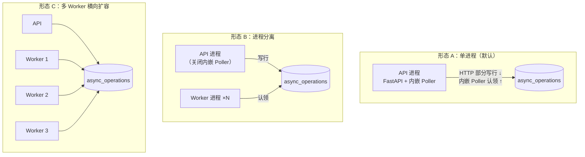
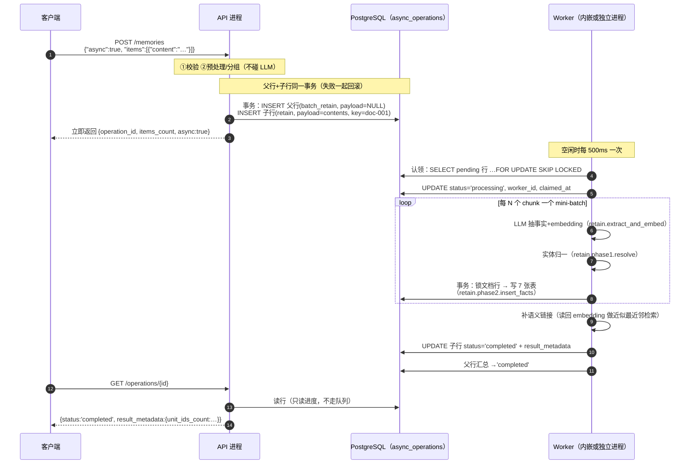
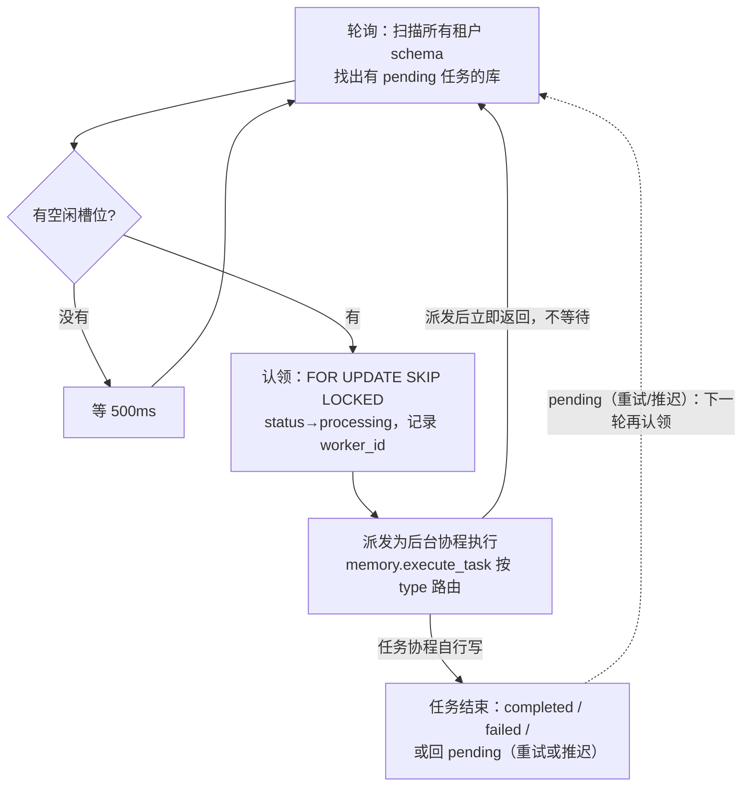
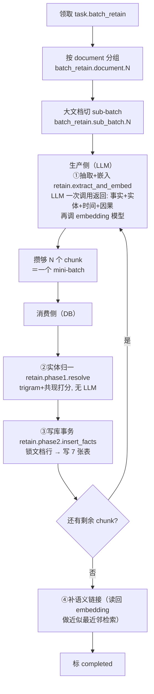
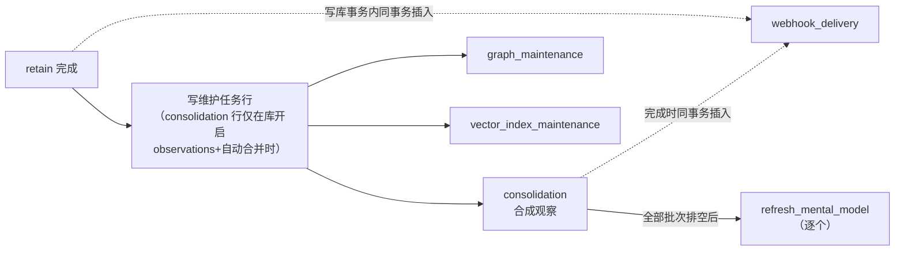
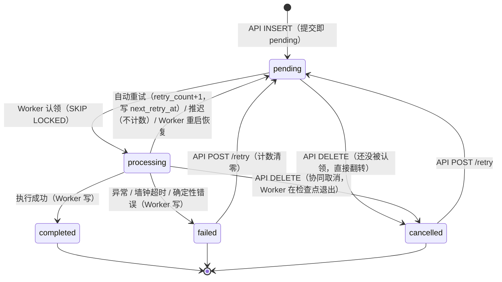

# Hindsight 引擎内幕：API 与 Worker 的关系

> 代码研究对象：`vectorize-io/hindsight` @ `12f2d54f6`（main，2026-09-30）。路径缩写：`hindsight-api-slim/hindsight_api/` → `…/`。
> 本文的组织方式：先直接回答四个问题（§1），再看清两者的总关系（§2），然后跟着一个贯穿全文的完整例子（§3）走一遍，最后按"API 干什么 → 怎么把活转给 Worker → Worker 怎么干"逐段讲清机制（§4-§6）。正文尽量说人话；每个关键结论都标了代码出处（短引用就地标注，完整索引在附录 A）。不熟悉的词查 §9 术语表。

---

## 1. 先给答案

| 问题 | 一句话回答 | 详见 |
|---|---|---|
| API 和 Worker 是什么关系？怎么通信？ | **不是两套系统，是同一段代码的两种启动方式**；它们之间没有任何网络调用或消息队列——通信就是共同读写 PostgreSQL 里的一张表 `async_operations` | §2 |
| API 的职责是什么？ | **前台**：接收请求、校验、把任务写成一行记录、立刻返回 `operation_id`；查询进度、取消、重试也归它。注意：retain 写记忆**默认**是同步模式（API 当场做完才返回），异步要显式传 `"async": true` | §4 |
| API 怎么把请求"转发"给 Worker？ | **没有转发这个动作**。API 往表里 INSERT 一行（状态 `pending`）就完事了；Worker 每 500ms 轮询这张表，把行"认领"走（状态改 `processing`） | §5 |
| Worker 的职责是什么？怎么处理数据？ | **后台工人**：认领任务 → 执行（LLM 抽取事实、算 embedding、写 7 张业务表）→ 标记完成或失败；全部 12 种重活都由它做 | §6 |

---

## 2. 总关系：同一段代码、两种身份、一张表

### 2.1 同一段代码

API 进程和 Worker 进程跑的是**同一个 `MemoryEngine` 类**（`…/engine/memory_engine.py`），真正的差别只有一个：**API 进程收到任务请求时负责"写入队列表"，Worker 进程负责"认领并执行"**。两者的启动入口不同（API 用 `hindsight-api`，Worker 用 `hindsight-worker` CLI，`…/worker/main.py:165`），任务后端的配置也不同——这个配置差异是 §5.2 的机制细节，读到那里再展开。

### 2.2 通信 = 一张数据库表

```
API 进程                                     Worker 进程
    │                                            ▲
    │  写入一行（status=pending）                  │ 轮询认领（status→processing）
    ▼                                            │
┌────────────────────────────────────────────────┴─┐
│  PostgreSQL  ·  async_operations 表（共 15 列）     │
│  这张表既是"任务队列"，也是"任务结果"               │
└──────────────────────────────────────────────────┘
```

这张表就是双方唯一的交集：API 往里写任务、改取消/重试状态；Worker 认领和执行；双方都通过它读进度。没有 Redis、没有 RabbitMQ、没有 gRPC 调用——部署上多一个组件都不需要。

### 2.3 三种部署形态



| 形态 | 怎么配置 | 谁执行任务 |
|---|---|---|
| A：单进程（即 standalone 模式） | 什么都不配（`HINDSIGHT_API_WORKER_ENABLED` 默认 `true`，`…/config.py:1833`） | API 进程自己——FastAPI 启动时会在 lifespan 里启动一个内嵌 Poller（`…/api/http.py:4936-4961`） |
| B：分离 | API 设 `HINDSIGHT_API_WORKER_ENABLED=false`，另起 `hindsight-worker` 进程 | 独立 Worker |
| C：扩容 | 形态 B 基础上多起几个 Worker | 多个 Worker 无冲突抢任务（机制见 §5.3） |

**关键事实：默认部署时，API 和 Worker 在同一个进程里**。"API 把任务交给 Worker"在这个形态下其实是"API 进程的 HTTP 部分写表，同一进程的 Poller 部分读表"。只有关掉开关，两者才真正变成两个进程——但通信协议（那张表）不变。

> 关于多租户：Hindsight 支持多租户部署——每个租户的数据放在**独立的数据库 schema** 里，租户清单由一个扩展提供，Worker 的每次轮询都会扫过所有租户的 schema（`worker/main.py:271-296`、`worker/poller.py:404-408`）。本文的例子是单租户场景，不影响理解机制。

---

## 3. 贯穿例子：一条记忆从提交到可查

本节所有 JSON **字段结构**来自代码（出处见附录 A），**字段值是编的示例**。先解释两个马上要出现的词：

- **bank（记忆库）**：一个隔离的记忆空间，一个用户/agent 一个"脑子"。URL 里的 `my-bank` 就是它。
- **retain（写入记忆）**：把一段内容存进 bank 并抽取事实的操作，是 Hindsight 最核心的写操作。
- **chunk（文本块）**：长文档会先切成若干文本块，后续逐块处理。

例子用最小请求——retain 请求唯一必填的字段就是 `items[].content`（`…/api/http.py:1158-1169`）。

> **本例显式传了 `"async": true`（异步模式）。不传时默认是同步模式**——抽取在 API 进程里当场做完才返回。两种模式的差别见 §4.2，先跟异步例子走完主流程。

### 3.1 第 0 步：客户端提交

```bash
curl -X POST http://localhost:8888/v1/default/banks/my-bank/memories \
  -H "Content-Type: application/json" \
  -d '{
        "async": true,
        "items": [
          { "content": "用户说他在 2026-03-01 换用了深色主题", "document_id": "doc-001" }
        ]
      }'
```

路由：`POST /v1/default/banks/{bank_id}/memories`（`…/api/http.py:9572-9573`）。`"async": true` 是异步模式的开关（字段真名 `async_`、alias `async`，`http.py:1309-1313`）。

### 3.2 第 1 步：API 做四件事，然后立刻返回

API 在这个请求里做的事：①校验参数 → ②多模态内容预处理、按 strategy 分组（strategy 是 bank 配置里定义的具名处理策略，单条 item 可指定以覆盖库默认；不同 strategy 的 items 会拆成独立任务，`http.py:1257-1261`）→ ③**在一个数据库事务里插入两行**（细节见 §5.2）→ ④返回。**它不做 LLM 抽取、不算 embedding**——那些是 Worker 的活。

```json
{
  "success": true,
  "bank_id": "my-bank",
  "items_count": 1,
  "async": true,
  "operation_id": "0d3f8a2e-1111-4aaa-9bbb-ccccdddd0000",
  "operation_ids": null
}
```

（返回体构造在 `http.py:9743-9752`；`operation_id` 是**父操作**的 id。items 被分进多个 strategy 组时才返回 `operation_ids` 数组。）请求到此结束，耗时只是几次 SQL。

**此刻 `async_operations` 表里多了两行**（各列的含义在 §5.1 有逐列解释）：

| | 父行 | 子行 |
|---|---|---|
| `operation_id` | `0d3f8a2e-…0000`（就是返回给客户端的） | `7a1b…`（新 UUID） |
| `operation_type` | `batch_retain` | `retain` |
| `status` | `pending` | `pending` |
| `task_payload` | **NULL**（父行永远不被执行，见下） | `{"type":"batch_retain","operation_id":"7a1b…","bank_id":"my-bank","contents":[{…"doc-001"…}]}` |
| `serialization_key` | NULL | `doc-001` |
| `result_metadata` | `{"items_count":1, "total_tokens":42, "num_sub_batches":1, "is_parent":true}` | `{"items_count":1, "parent_operation_id":"0d3f…", "sub_batch_index":1, "total_sub_batches":1, "document_id":"doc-001"}` |

（表内 JSON 键省略了引号；列清单与父子行写入点：`…/alembic/versions/5a366d414dce_initial_schema.py:218-240`、`…/memory_engine.py:22004-22076`。父行的 `total_tokens` 在提交时就算好了——切子批靠 token 预算，不是完成时回填。）

三个容易困惑的点，用人话解释：

- **为什么有两行？父行是"快递单夹子"**。父行**总是**创建（哪怕只提交 1 条 item）；子行数 = 按 token 预算切分出的子批数（至少 1）。大批量提交时每子批一行、各自独立执行。父行自己没有 `task_payload`（Worker 只认领 payload 非空的行，`ops_postgresql.py:1788`），永远不会被执行，只负责**汇总所有子行的状态**——等子行们全部完成/失败/取消，父行才跟着变成终态（`…/worker/poller.py:901-1004`）。
- **`operation_type='retain'` 但 payload 里 `type='batch_retain'`？** 前者是数据库列（列表过滤、指标用），后者是任务分发用的类型名（Worker 按它路由到同一个 handler，`memory_engine.py:3999`）。名字不同、指向同一段处理逻辑，不是笔误。
- **`serialization_key` 是什么？** 本例子行恰好只含一个文档，所以 key=文档 id。作用见 §5.3。

**如果提交的不是 1 条而是 50 条 item（3 个文档）**，切分会得到 3 个子行，父行随子行汇总：

| 子行状态 | …时父行状态 |
|---|---|
| 全部 completed | `completed` |
| 任一 failed | `failed`（错误信息取最常见子错误；其余照常完成） |
| 有子行被取消且无失败 | `cancelled` |

（汇总规则：`poller.py:901-1004`，失败优先于取消。）

### 3.3 第 2 步：Worker 认领并执行

默认配置下（空闲时每 500ms 醒一次，`…/config.py:1835`），下一个轮询周期里某个 Worker（可能是同进程的内嵌 Poller）会发现这行 `pending` 记录：

1. **认领**：原子地把 `status` 改成 `processing`，写入自己的 `worker_id` 和 `claimed_at`（`…/engine/db/ops_postgresql.py:1900-1917`）。
2. **执行**：按 payload 的 `type` 路由到 retain 处理函数（`memory_engine.py:3999-4000`），跑完整管道（§6.3）。执行过程中任务会汇报当前阶段（stage），真实阶段字符串按发生顺序是：

```
task.batch_retain            ← 刚领取
batch_retain.document.1      ← 按 document 分组（memory_engine.py:5927）
batch_retain.sub_batch.1     ← 子批开始（memory_engine.py:6574）
retain.extract_and_embed     ← ★调 LLM 抽取事实/实体/时间/因果 + 算 embedding
retain.phase1.resolve        ← 实体归一化（不用 LLM，用 trigram+共现打分）
retain.phase2.insert_facts   ← ★写库事务（documents/chunks/memory_units/…）
```

（stage 来源：`…/worker/stage.py` + `orchestrator.py:1144/502/635`。一个真实 Worker 日志行长这样——`stage_age` 是当前阶段已经持续的秒数：`[WORKER_TASK] op=7a1b… stage=retain.extract_and_embed stage_age=3.2s …`。）

### 3.4 第 3 步：完成与回查

写库成功后，Worker 把子行标 `completed`（写 `completed_at` 和执行成果 `result_metadata`）；所有子行都到终态后，父行被汇总为 `completed`（`poller.py:901-1004`）。客户端随时可以查：

```bash
GET /v1/default/banks/my-bank/operations/0d3f8a2e-…
```

```json
{
  "operation_id": "0d3f8a2e-…",
  "status": "completed",
  "operation_type": "batch_retain",
  "error_message": null,
  "retry_count": 0,
  "child_operations": [
    { "operation_id": "7a1b…", "status": "completed", "sub_batch_index": 1,
      "items_count": 1, "error_message": null }
  ],
  "result_metadata": { "items_count": 1, "total_tokens": 42, "num_sub_batches": 1,
                       "unit_ids_count": 5, "extraction_errors_count": 0 }
}
```

（响应字段见 `http.py:4506-4568`，此处省略了 `created_at/updated_at/progress` 等无助于理解的键；`unit_ids_count` = 抽取出的事实条数，完成时写入，`…/engine/operation_metadata.py:105-121`；父操作响应附 `child_operations`，`memory_engine.py:20751-20763`。）

### 3.5 全程时序图



---

## 4. API 的职责：前台

### 4.1 API 做什么

1. **接收与校验**：pydantic 模型校验（如 `operation_id` 必须是合法 UUID），最小 retain 请求只需要 `{"items":[{"content":"…"}]}`。
2. **预处理**：多模态内容扁平化、附件落盘、按 strategy 分组（`http.py:9639-9720`）——都是轻活，不调模型。
3. **写队列**：把任务 INSERT 进 `async_operations`（§5.2）。异步 retain 还带幂等保护：客户端自带 `operation_id` 重复提交时，直接重放旧结果而不是再执行一遍（`memory_engine.py:21792-21819`）。
4. **立即答复**：返回 `operation_id`，不等执行。
5. **同步读操作**：**recall（记忆检索）和 reflect（反思问答）完全不走队列**，在 API 进程内当场执行完再返回（`http.py:5963-5995`；这两个操作也不出现在 Worker 的任务类型表里）。只有 `{"query":"…"}` 是必填。
6. **任务管理**：查状态（`GET /operations`、`GET /operations/{id}`）、取消（`DELETE /operations/{id}`）、重试（`POST /operations/{id}/retry`）。

### 4.2 API 不做什么——以及一个重要例外

默认情况下，**所有要调 LLM/embedding 的重活都不在 API 的请求线程里做**。但有一个容易误判的地方：

> **retain 默认其实是同步模式**（`"async"` 不传 = `false`，`http.py:1309-1313`）：此时事实抽取和写库**就在 API 进程里当场做**——§3 的整条管道在请求线程里跑，客户端要等结果。即便如此，做完之后 API 仍会把三个"后续维护任务"（consolidation、graph 维护、向量索引维护）写进队列表（`memory_engine.py:6073-6108`）——**写操作之后的重活永远在 Worker 侧**，区别只是"抽取"这一段在谁手里。

生产上要吞吐就显式传 `"async": true`。

### 4.3 职责对照表

| | API（前台） | Worker（后台） |
|---|---|---|
| 接收/校验/答复请求 | ✅ | ❌ |
| 写 `async_operations`（提交任务） | ✅ | 只写派生任务（见 §6.4） |
| recall / reflect | ✅ 当场执行 | ❌ |
| LLM 事实抽取、embedding | ❌（异步时） | ✅ |
| 写业务表（documents/chunks/memory_units/…） | 仅同步 retain 时 | ✅ 主要写手 |
| consolidation（合成观察） | ❌ | ✅ |
| webhook 投递 | ❌ | ✅ |
| 查进度/取消/重试 | ✅ | ❌（但响应取消） |

---

## 5. 转发机制：一行记录就是全部协议

### 5.1 "消息"长什么样：`async_operations` 的 15 列

| 列 | 人话含义 | 谁写 |
|---|---|---|
| `operation_id` | 任务的全局唯一编号（UUID） | API 提交时 |
| `bank_id` | 属于哪个记忆库 | API |
| `operation_type` | 任务种类（retain/consolidation/…，共 12 种） | API |
| `status` | 当前状态（§7 状态机） | 双方 |
| `task_payload` | **任务内容本体**（JSON dict：干什么 + 干活需要的全部参数，如 retain 的 `contents`） | API |
| `result_metadata` | 执行进度与成果（子批信息、完成后的事实数、导入导出结果…） | 双方 |
| `worker_id` / `claimed_at` | 被哪个 Worker 在何时认领 | Worker |
| `retry_count` / `next_retry_at` | 已重试次数 / 下次该几点再被认领 | Worker（重试/推迟）；API 手动重试时清零 |
| `error_message` / `completed_at` | 失败原因 / 完成时间 | Worker |
| `serialization_key` | 排他键：同一文档的任务排队执行（§5.3） | API |
| `created_at` / `updated_at` | 创建 / 最后更新时间 | 双方 |

（列与类型逐一核对过：初始 9 列 `5a366d414dce_initial_schema.py:218-240` + `worker_id/claimed_at/retry_count/task_payload` 4 列 `l7g8h9i0j1k2:40-69` + `next_retry_at` `e4f5a6b7c8d9:49-50`（原生 SQL 添加，容易漏）+ `serialization_key` `d9c1a7b4e2f6:52`。）

### 5.2 转发的四步（全部有代码对应）

**第 1 步：API 在一个事务里把任务落成行。** 异步 retain 是父行+子行们**同一个事务**（`memory_engine.py:21993-22077`）；其他任务类型走统一入口 `_submit_async_operation`，同样是"payload 拼好、行和 payload 一个 INSERT 落库"（`memory_engine.py:21584-21593, 21767-21778`）。代码注释明说为什么必须原子：老实现是"先插行、再补 payload"，两步之间崩溃会留下 payload 为 NULL 的行——**Worker 永远不会认领它，任务凭空消失**。

**第 2 步：API 返回 `operation_id`，任务提交即结束。** 事务提交后还会调用后端钩子 `submit_task`——它平时无事可做（行和 payload 已随事务落库），只有未预建行的遗留调用才真正插新行（`task_backend.py:222-255`；三种后端的说明见附录 A §关系与部署）。

**第 3 步：Worker 轮询认领。** 每个 Worker 里的 **Poller（轮询组件，Worker 的"取件手"）** 每 500ms（默认，`config.py:1835`）醒来一次，对每个租户 schema 执行认领查询。共享池认领条件翻译成人话（SQL 原文 `ops_postgresql.py:1787-1820`）：

- `status='pending'` —— 还没被领走；
- `task_payload IS NOT NULL` —— 是可执行的任务（排除父行这类聚合器）；
- `next_retry_at` 已到期 —— 失败重试的任务到点才领；
- 没有同 bank 的 graph 维护任务正在跑、没有同文档的 retain 正在跑（§5.3 的排他规则）；
- **不含 consolidation** —— 共享池查询明确排除它（`operation_type != 'consolidation'`，`ops_postgresql.py:1789`），consolidation 走带保留槽位的独立认领路径（`ops_postgresql.py:1825-1898`）。

查询尾部是 `FOR UPDATE SKIP LOCKED`：**多个 Worker 同时认领也不会拿到同一行**——第一个 Worker 锁住的行，第二个 Worker 直接跳过去领下一行。这是 PostgreSQL 提供的原语，也是"多 Worker 横向扩容"得以成立的核心机制。

**第 4 步：状态翻转为 `processing`。** 一条 UPDATE 写入 `worker_id` 和 `claimed_at`（`ops_postgresql.py:1900-1917`），从这一刻起这行任务归这个 Worker 管，其他 Worker 看不见它。

### 5.3 排队规则：谁先被处理

认领不是纯"先来先服务"，有三层公平性设计（均为代码事实）：

| 层 | 规则 | 为什么 |
|---|---|---|
| 租户（schema）之间 | 轮转起点，每轮每个租户最多先领 1 个，剩余名额第二轮补齐（`poller.py:524-652`） | 防止一个大租户的积压饿死其他租户 |
| bank 之间 | 用 `bank_id > 游标` 在索引上转圈，轮流照顾每个 bank（`ops_postgresql.py:1794-1823`） | 防止一个 bank 的批量导入占满所有槽位 |
| 任务类型之间 | consolidation 默认保留 2 个槽位（其余类型 0），总槽位默认 10（`config.py:939-951, 1839`） | 保证"合成观察"这类慢活不被海量 retain 饿死 |

在此之上还有一条**同文档排他**：`serialization_key` 相同（= 同一个文档）的任务，**同一时刻只允许一个在执行**，且按提交顺序执行（`…/engine/db/ops.py:91-141`）。原因写在注释里：往同一文档追加内容是"读旧文本→改写"的操作，两个并发执行只会互相覆盖。演一遍 §3 的例子：10 秒内对 `doc-001` 提交第二次 retain，第二行会停在 `pending` 等第一行跑完；如果它排队时 Worker 恰好来认领，还可能被**直接合并**进第一行的执行（省掉一次重复抽取）——这个优化叫 **folding**（`poller.py:730-828`）。排他是"执行时"的规则，folding 是"认领时"的优化，两层独立。

### 5.4 为什么不用消息队列（设计事实，非评价）

用表当队列的直接收益写在代码结构里：任务和业务数据在**同一个数据库**，所以"插入任务"可以和业务写入放同一个事务。两个实例：retain 完成时，`retain.completed` 的 webhook 行与刚写入的事实**同一个事务**落库（`orchestrator.py:704-705`）；consolidation 完成时，"标 completed"与 `consolidation.completed` 的 webhook 行同事务（`memory_engine.py:4738-4802`）。这就是经典的 **transactional outbox（事务性发件箱）**模式——通知和业务要么都成功要么都没有，杜绝"事实已写入但通知丢了"。代价是需要轮询（空闲延迟最多约 500ms）且吞吐受数据库限制。

---

## 6. Worker 的职责与内部处理

> 本章只深挖 retain 管道（最重要的任务）；其余 11 种任务的机制同构，不再逐个展开。

### 6.1 主循环



每个 Worker 默认最多同时跑 10 个任务（`worker_max_slots`，`config.py:1839`）。任务在后台协程里跑，主循环立刻回去继续认领——**认领和执行是并发的**。空闲等待就是干等 500ms（没有"新任务唤醒"机制，`poller.py:1676-1682`）。

### 6.2 它执行哪些活（12 种任务）

| 任务类型 | 干什么（人话） |
|---|---|
| `batch_retain`（经 `retain` 子行触发） | 记忆写入主流程：LLM 抽事实 → embedding → 建实体/链接 → 写库（§6.3） |
| `file_convert_retain` | 上传的文件（PDF 等）转成文本再走 retain；失败不重试 |
| `consolidation` | 把积累的原始事实用 LLM 合并成**观察**（observations：对某个主题的概括性总结，是 bank 里比单条事实更高一层的知识）；完成后发 webhook |
| `refresh_mental_model` | **心智模型**（mental model：按用户定义的来源查询持续刷新的合成文档）到刷新间隔后，重新跑一遍该查询更新内容 |
| `graph_maintenance` / `vector_index_maintenance` | 图链接清理 / 按库大小增删向量索引 |
| `export_documents` / `export_bank` / `import_bank` / `clone_bank` / `import_documents` | 导出 ZIP / 整库搬运 / 文档导入 |
| `webhook_delivery` | 把事件（retain 完成、consolidation 完成等）POST 到用户注册的 URL，带签名与重试 |

（路由表：`memory_engine.py:3999-4028`；未知类型直接删记录不重试。）

### 6.3 一个 retain 任务内部：流水线



生产侧和消费侧是**并发的**（`asyncio.gather`，`orchestrator.py:3317-3320`）：LLM 在抽下一个 chunk 时，DB 在写上一个 mini-batch——这就是"流水线"。

三个关键机制，决定了它和大一统事务的区别：

- **按 mini-batch 分段提交**：每攒够 `retain_chunk_batch_size` 个 chunk 提交一个事务（`…/engine/retain/orchestrator.py:3085-3086`）。一个 100 页的文档不会"全有或全无"，而是边抽边写。
- **崩溃了不丢不重，有两层保险**：*chunk 级*——每段提交前比对文档的内容哈希和已提交 chunk 的哈希，跳过已完成的抽取（`orchestrator.py:2370-2444`）；*任务级*——进度检查点写进 `result_metadata`（:3418-3446），整行任务由 Worker 的恢复机制拿回来重跑（§6.6）。
- **并发同文档写安全**：每个 mini-batch 事务先 `SELECT … FOR UPDATE` 锁文档行（`orchestrator.py:3096`），配合 §5.3 的队列排他，双保险。

写库清单（7 张，全部有 INSERT/upsert 出处，附录 A）：`documents`、`chunks`、`memory_units`（事实本体）、`unit_entities`（事实↔实体）、`memory_links`（时间/因果/语义链接）、`entity_cooccurrences`（实体共现统计）、`attachments`（附件）。

### 6.4 任务链：一个任务会派生更多任务

Worker 在执行中创建的新任务同样只是往表里 INSERT 一行，下一轮轮询自然被认领（Worker 进程里 `submit_task` 是空操作，`task_backend.py:143-146`）：



所以在繁忙的库里，一次 retain 之后队列里会自然生长出一条处理链——这也是"API 轻前台 + Worker 重后台"架构能撑住整个系统的原因：**所有长任务都是同一套"写行→认领→执行→写行"的循环**。

### 6.5 失败了怎么办

| 情形 | 处理 | 例子 |
|---|---|---|
| 瞬时错误（如 LLM 超时） | 状态回 `pending`，`retry_count+1`，按退避等待（retain 类固定 60s；consolidation 指数封顶 30min） | LLM 超时 → 行回 pending、`retry_count=1`、`next_retry_at=+60s`，60 秒后才可能再被认领 |
| consolidation | **无限重试**，但同 bank 已有排队的 consolidation 时跳过（防风暴） | — |
| LLM 配额用完 / 存储过载 / 未到刷新间隔 | **推迟（defer）**：回 `pending` 但**不加**重试计数、不记错误——这不是失败，是"还没到时候" | 配额 2 分钟后重置 → `next_retry_at=+120s`、`retry_count` 不变 |
| 确定性错误（数据完整性违规、embedding 维度不匹配等） | 直接 `failed`，不浪费重试 | — |
| 重试 3 次（默认）仍失败 | `failed`，错误信息写入 `error_message`，可被 API 手动重试 | — |
| 单任务卡死（如 LLM 无响应） | 墙钟上限：retain 总时长封顶；consolidation 按"无进展时长"封顶（每提交一批续命），超时取消并标 `failed` | — |

（依据：`memory_engine.py:4124-4148`、`worker/poller.py:1032-1053`、`config.py:1836`、`poller.py:79-89, 1100-1142`。）

### 6.6 Worker 挂了，任务会丢吗

不会丢，但有一个明确的设计缺口。系统**没有租约**（没有"超过 10 分钟没心跳就转给别人"的机制——全仓库检索无 `claimed_expires_at` 之类的列）。兜底是四条路径（`poller.py:1271-1430`、`…/admin/cli.py:1338-1346`）：

1. Worker 重启时，把自己上次没跑完的 `processing` 行放回 `pending`（重试预算内）或标 `failed`（超预算）；
2. Worker 优雅关机时，把没跑完的行放回队列；
3. 运维命令 `hindsight-admin decommission-worker` 强制归还某台已消失 Worker 的行；
4. API 的取消端点可以把僵尸 `processing` 行翻成 `cancelled`。

作者在注释里承认这是通用缺口：*"a row wedged in 'processing' holds its bank until something releases it"*（`ops.py:195-198`）——卡死的行会一直占着它的 bank/文档排他位，直到上面四条路径之一介入。收益则是实现简单、且认领过的行绝不会被重复执行。

---

## 7. 状态机



注：上图是**子行**（有任务体的行）的状态机。`batch_retain` **父行**不走 `processing`——它没有任务体、永远不会被认领，停在 `pending` 等全部子行到终态后被汇总为 completed/failed/cancelled（`poller.py:901-1004`）。

一个守护规则（绝大多数状态写入都遵守）：**已取消的任务不许被复活**——失败/重试/推迟的回写都带 `WHERE status <> 'cancelled'` 条件（issue #4131，`poller.py:891, 1021, 1045`），用户取消的任务不会被迟到的失败回写覆盖。个别内部路径例外（如 file_convert 完成回写 `memory_engine.py:3576-3584` 无守卫、批量恢复 `poller.py:1485` 无守卫），主流程上守卫是齐全的。

---

## 8. 常见误读澄清

| 误读 | 事实 |
|---|---|
| "API 通过 HTTP/RPC 把请求发给 Worker" | 没有任何进程间调用。协议就是一张表：API 插行，Worker 认领（§5） |
| "retain 一定是异步的" | 默认 `async=false` 是**同步**：抽取在 API 进程内当场做；传 `async: true` 才入队（§4.2） |
| "recall 也要排队等 Worker" | recall/reflect 完全同步，根本不碰队列表（§4.1 第 5 条） |
| "单进程部署就没有 Worker" | 有——默认内嵌在 API 进程里（§2.3 形态 A） |
| "任务失败 = 立刻标 failed" | 先按类型重试/推迟，重试预算用尽才 failed（§6.5） |

顺带一个我们核对时发现的**过时注释**：`poller.py:127-131` 说 "the API refuses to retry *or* cancel" processing 状态的操作——cancel 半句已过时（#4131 之后支持协同取消，`memory_engine.py:20894-20910`），retry 半句仍然正确。读代码时别被它误导。

---

## 9. 术语表

| 术语 | 人话解释 |
|---|---|
| **bank** | 一个隔离的记忆库（一个用户/agent 一个"脑子"）。所有表都按 bank 组织，队列行也带 `bank_id` |
| **retain / recall / reflect** | retain = 写入记忆；recall = 检索记忆；reflect = 基于记忆的反思问答。前一个可异步走 Worker，后两个完全同步 |
| **operation** | 一行 `async_operations` 记录 = 一次异步任务（或它的聚合壳） |
| **task_payload** | 任务内容本体：`{"type": …, "operation_id": …, "bank_id": …, 业务参数…}` 的 JSON |
| **父行 / 子行（batch_retain / retain）** | 大提交被拆成多个子任务时，子行是真正干活的，父行是只汇总状态的壳（payload 为 NULL，总是创建） |
| **serialization_key** | 排他键（通常是文档 id）：同 key 的任务同时只跑一个、按提交顺序跑 |
| **folding** | 认领时把同文档的相邻排队任务合并进一次执行，省重复抽取 |
| **认领（claim）** | Worker 把 `pending` 行原子地改成 `processing` 并登记自己；`FOR UPDATE SKIP LOCKED` 保证多 Worker 不抢同一行 |
| **Poller** | Worker 进程里的轮询组件：扫描队列表、按槽位和公平规则认领任务、派发执行 |
| **defer（推迟） vs retry（重试）** | defer = "还没到时候"（配额、过载、未到时间），不加失败计数；retry = "这次失败了"，加计数、记错误 |
| **standalone 模式** | 即本文"形态 A"：API 进程内嵌 Poller（`HINDSIGHT_API_WORKER_ENABLED=true`，默认） |
| **租户（tenant）/ schema** | 多租户部署下，每个租户的数据放在独立的数据库 schema 里；Worker 每次轮询扫所有租户 schema。单租户时只有一个默认 schema |
| **mini-batch** | retain 管道的提交单位：每 N 个 chunk 一个事务，边抽边写 |
| **墙钟上限（wall-clock ceiling）** | 单个任务的总时长（retain）或无进展时长（consolidation）的强制上限，防任务卡死占满槽位 |
| **transactional outbox** | "要发出的通知"和业务数据在同一个事务里落库，之后由 Worker 投递——杜绝通知丢失 |
| **观察（observation）/ 心智模型（mental model）** | 观察 = consolidation 用 LLM 把多条同类事实概括成的更高一层知识；心智模型 = 按用户定义的来源查询定期刷新的合成文档 |

---

## 附录 A：代码事实索引

按正文小节归档；路径均相对 `hindsight-api-slim/hindsight_api/`。

**§2 关系与部署**
- 三种 TaskBackend（`BrokerTaskBackend`/`WorkerTaskBackend`/`SyncTaskBackend`——第三种是测试与内嵌场景用的"立即内联执行"，生产不用）：`engine/task_backend.py:95-123, 126-150, 153-262`；Broker 后端钩子的实际语义（有 operation_id 时仅兜底补 payload）：`task_backend.py:222-255`
- Worker 进程入口与组装：`worker/main.py:165-445`（MemoryEngine 组装 280-289，Poller 311-323）
- API 内嵌 Poller：`api/http.py:4936-4961`；默认开启：`config.py:1833`（`DEFAULT_WORKER_ENABLED=True`）
- 多租户 schema 发现：`worker/main.py:271-296`；`worker/poller.py:404-408`

**§3 例子**
- 路由与返回体：`api/http.py:9572-9596`（路由）、`9743-9752`（异步返回）
- `MemoryItem` 仅 `content` 必填：`api/http.py:1141-1222`；`async` alias：`1309-1313`；strategy 定义：`1257-1261`
- 父子行同事务 INSERT：`engine/memory_engine.py:21993-22077`（父 22004-22014 无 payload；子 22058-22076 带 payload+serialization_key；payload `type="batch_retain"` 22052）
- 幂等重放：`memory_engine.py:21792-21819`
- 认领取 processing：`engine/db/ops_postgresql.py:1900-1917`
- stage 字符串：`memory_engine.py:3998, 5927, 6459, 6574`；`engine/retain/orchestrator.py:1144, 502, 635`
- 查询端点与响应模型：`api/http.py:7861-7945`（路由）、`4506-4568`（模型）；`child_operations`：`memory_engine.py:20751-20763`
- `unit_ids_count`：`engine/operation_metadata.py:105-121`
- 父行汇总规则：`worker/poller.py:901-1004`

**§4 API 职责**
- 同步分支与批量开关：`api/http.py:9753-9791`
- recall/reflect 同步执行：`api/http.py:5963-5995`、`6162-6185`
- retain 后维护任务入队：`memory_engine.py:6073-6108`

**§5 转发机制**
- payload 与行同 INSERT（防"空行"）：`memory_engine.py:21584-21593`；通用入队事务：`21597-21778`
- 共享池认领 SQL（含 consolidation 排除）：`ops_postgresql.py:1787-1820`（bank 轮转 CTE 1794-1811；谓词重复防竞态 1760-1763）；consolidation 独立认领与两阶段 `claim_tasks`：`1825-1898`
- 文档排他与提交顺序：`engine/db/ops.py:91-141`；bank 排他：`ops.py:147-244`
- 槽位与公平性：`worker/poller.py:524-652`；槽位默认：`config.py:939-951, 1839`
- folding：`worker/poller.py:730-828`
- 轮询间隔默认 500ms：`config.py:1835`
- outbox 两例：retain 事务内 `engine/retain/orchestrator.py:704-705`；consolidation 完成同事务 `memory_engine.py:4738-4802`

**§6 Worker 处理**
- 任务路由：`memory_engine.py:3999-4028`
- mini-batch 事务边界：`engine/retain/orchestrator.py:3085-3086`；生产者/消费者并发：`3317-3320`
- 崩溃恢复（chunk 级哈希比对 + 任务级检查点）：`orchestrator.py:2370-2444, 3418-3446`；文档行锁：`3096`
- 落表（7 张）：documents `engine/retain/fact_storage.py:399`；chunks `engine/db/ops_postgresql.py:104`；memory_units `ops_postgresql.py:192`；unit_entities `ops_postgresql.py:450`；memory_links `ops_postgresql.py:328`；entity_cooccurrences `engine/entity_resolver.py:589`；attachments `engine/retain/attachment_store.py:299`
- 重试/推迟/失败：`memory_engine.py:4047-4148`；`worker/poller.py:1006-1053`；`worker/exceptions.py`；背压识别 `worker/backpressure.py:36-50`
- 墙钟上限：`worker/poller.py:79-89, 1100-1142`
- 无租约与恢复路径：`worker/poller.py:1271-1430`；`admin/cli.py:1338-1346`；作者自认缺口 `ops.py:195-198`
- consolidation 管道：`engine/consolidation/consolidator.py:1602`（作用域分组 1734-1740，LLM 响应=单事务 2676-2678）
- 任务链触发：`memory_engine.py:6073-6108`；子任务由下一轮认领：`task_backend.py:143-146`
- retain 自身的 webhook（retain.completed）在写库事务内插入：`memory_engine.py:4244-4281`

**§7 状态机**
- 状态约束：`alembic/versions/5a366d414dce_initial_schema.py:237-239`；`cancelled`：`i4j5k6l7m8n9`；取消端点（pending/processing 均可取消）：`memory_engine.py:20851-20934`；检查点感知取消：`memory_engine.py:4433-4455`
- 防复活守卫：`worker/poller.py:891, 1021, 1045`；例外（无守卫的内部回写）：`memory_engine.py:3576-3584`、`worker/poller.py:1485`
- 父行聚合：`worker/poller.py:901-1004`

**表结构**：15 列 = 初始 9（`5a366d414dce:218-240`）+ `worker_id/claimed_at/retry_count/task_payload`（`l7g8h9i0j1k2:40-69`）+ `next_retry_at`（`e4f5a6b7c8d9:49-50`，原生 SQL `ADD COLUMN IF NOT EXISTS`，极易漏数）+ `serialization_key`（`d9c1a7b4e2f6:52`）。

## 附录 B：验证方法

本文事实经过四层核对：

1. **主分析者直读**核心文件建立基线（worker/main.py、poller.py、task_backend.py 及多处关键代码点）；
2. **5 个独立分析 subagent** 分别负责"API 入队路径""Worker 数据管道""认领 SQL 与可靠性""状态机与客户端可见性""模型字段与默认值素材"，结论互相交叉；
3. **3 个审查 subagent** 成稿后分别做代码事实核查（约 115 处引用，发现 8 处问题）、新读者清晰度测试、图例一致性审查；
4. **争议点回码**：审查发现中所有互相矛盾或推翻前论的点（15 列 vs 14 列、submit_task 语义、路由 default 段含义、file_convert 回写守卫）由主分析者逐条读代码裁定后才修改。

唯一标注为单源的结论：Oracle 端认领查询的 ROWNUM 改写细节（引自 `ops_oracle.py:1461-1476` 注释，未逐行验证改写器本身）。
