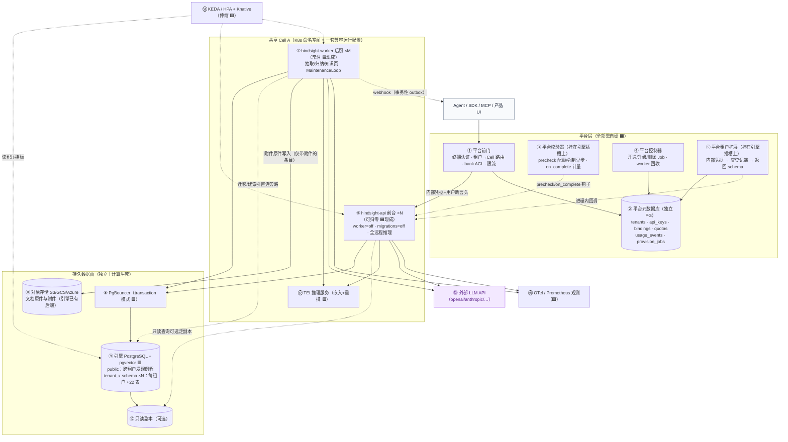

# Hindsight Serverless 多租户方案 · 细看版（组件、数据流与改造清单）

> **定位**：这是 `serverless-multi-tenant.md`（原方案）的第二卷伴读。第一卷《大白话版》回答"整个方案是什么"；本卷回答五个更具体的问题——**整体架构里每个组件是干什么的？一个新 Agent 接入后，数据经过哪些组件、以什么形态落进 PG？相较原版 Hindsight，API 和 Worker 各要改什么？系统凭什么决定扩容？各场景下客户的数据会不会受影响、要不要迁移？**
>
> 所有机制严格来自原方案与 Hindsight 源码（基线 `5b8356bb2`，v0.10.2），不引入新设计；需要证据时标注原方案章节（§）。术语叫法沿用第一卷《大白话版》（`serverless-multi-tenant-plain.md`）；两个承重词在此再定义一次——**bank**（记忆库：一个客户的隔离记忆空间，也是任务排队与扩容统计的基本单元）、**水位**（归纳工序"读到哪条"的进度指针）。

---

## 1. 整体架构：全景图与组件清单

### 1.1 全景图

### 1.2 组件清单：每个组件是谁的、干什么

| # | 组件 | 来源 | 职责（一句话） | 在数据流中的位置 |
|---|------|------|----------------|------------------|
| ① | 平台前门 | 🟧 自研（新增） | 终端用户认证、把请求路由到正确的 Cell、bank 级权限、限流 | 所有流量的唯一入口；**不碰记忆数据** |
| ② | 平台元数据库 | 🟧 自研（独立 PG） | 记"谁是谁"：租户、key 哈希、租户→Cell 绑定、配额、用量流水、开通任务状态 | 前门/扩展/控制器都读它；**与引擎库分库分凭据** |
| ③ | 平台校验器 | 🟧 自研（实现引擎的 validator 插槽——引擎预留的扩展点，只需注册实现，不改引擎） | 请求进引擎前：配额不足 402、内容超限强制走异步、bank 越权拦截；请求完成后：记账（token 用量直落 usage_events） | 挂在 API 进程内（不改引擎） |
| ④ | 平台控制器 | 🟧 自研（K8s Job/控制器） | 租户开通（跑迁移 Job）、引擎版本升级、Worker 回收、租户删除 | 只与登记簿和 K8s 打交道，不在请求路径上 |
| ⑤ | 平台租户扩展 | 🟧 自研（实现引擎的 tenant 插槽） | 每个请求被引擎回调一次：验证内部凭据 → 查登记簿（进程内缓存）→ 返回 schema 名 | 引擎拿到 schema 后全程用全限定表名 |
| ⑥ | API 前台 | 🟦 Hindsight 现成 | 处理 recall/reflect 只读请求、小内容同步 retain、大内容 retain 受理（写订单行）、MCP | 无状态：任何实例处理任何请求；可缩到零 |
| ⑦ | Worker 后厨 | 🟦 Hindsight 现成 | 消费订单：事实抽取、向量入库、实体链接、归纳、知识页刷新、webhook 投递 | 必须至少 1 个常驻（拉取模型） |
| ⑧ | PgBouncer | 🟩 开源 | 把上百个容器连接收敛成几十条 PG 连接（事务模式） | 引擎已为它适配（无会话状态依赖） |
| ⑨ | 引擎 PG | 🟪 托管（或自建） | **所有记忆数据的家**：public schema 放跨租户发现例程（告诉伸缩器与 Worker"哪些租户有活干"的数据库例程），每租户一个 schema ≈22 张表 | 唯一持久真相（文件原件在 ⑪） |
| ⑩ | 只读副本 | 🟪 托管 | recall 查询分流（引擎原生支持读副本连接池） | 可选 |
| ⑪ | 对象存储 | 🟩 S3/GCS/Azure | 文档**原件**与附件（引擎的 file_storage 后端现成）；**也是"换模型重放"的来源真相** | 按 Cell 分桶、前缀带租户 |
| ⑫ | TEI 推理 | 🟩 开源 | 嵌入（文本→向量）与重排打分 | Cell 内常驻；**用的模型 = 该 Cell 冻结的模型**（为何冻结：向量列宽建表即定，见第一卷第 2、8 节） |
| ⑬ | 外部 LLM | 🟪 商用 API | 事实抽取、归纳、reflect 推理 | 按 Cell 配置凭据 |
| ⑭ | KEDA/HPA + Knative | 🟩 开源 | API 按请求扩缩（可归零）；Worker 按队列积压扩缩 | 伸缩判据见第 4 节 |
| ⑮ | OTel/Prometheus | 🟩 开源 | 指标、追踪、审计汇聚 | 引擎原生支持 push |

> 来源图例（沿用原方案）：🟦 Hindsight 已有、🟩 开源现成、🟧 需自研、🟪 商用托管。**真正要写的新代码只有 🟧 五件 + 引擎一个小补丁**（第 3 节）。

---

## 2. 一个新 Agent 从接入到数据落进 PG 的完整旅程

设定：某公司注册了租户 X，要接入一个编码 Agent。分两个阶段——先"开户"，再"流水"。

### 2.1 阶段一：开户（只发生一次）

1. **登记**：管理员在前门注册租户 X（选套餐/Cell/地域）。登记簿插入 `tenants(status=provisioning)` 与 API key（只存哈希）。
2. **建货架**：控制器启动迁移 Job——**直连**引擎 PG（绕过 PgBouncer，因为建索引用的特殊连接模式必须直连，引擎有专门的旁路配置），执行：`CREATE SCHEMA tenant_x` + 约 22 张表（admin 备份清单基线实数 23，含 `bank_aliases`）+ 每租户例程 + 向量/全文扩展 + **按本 Cell 冻结的维度建向量列**。
3. **激活**：Job 成功 → 登记簿状态 `active` → 发 key 给客户。请求路径从此**零 DDL**（对比原版 Hindsight 的"请求路径 JIT 迁移"，这是原方案 §2.5 消除的障碍）。
4. **绑定**：登记簿写入 `bindings`：客户的 space/bank → 这个 Cell。整引擎替换、跨 Cell 搬家，将来改的都是这张表。

### 2.2 阶段二：第一笔 retain——数据的 13 跳

Agent 配置好 base_url（指向前门）与 key，发出第一次 retain（一段会议记录）。数据一步不落地地走完以下链路，最终进 PG：

| 跳 | 组件 | 它做什么 | 数据此刻的形态 |
|----|------|----------|----------------|
| 1 | Agent → ①前门 | HTTPS + Bearer key 发 retain 请求 | 原文（明文传输，TLS 保护） |
| 2 | ①前门 | 验终端身份 → 查登记簿得知"租户 X 在 Cell A" → 限流检查 → 换上**内部服务凭据**+用户断言头转发 | 原文（外层信封换了） |
| 3 | ⑥API | ⑤租户扩展被回调：验内部凭据 → 查登记簿（缓存）→ 得 schema `tenant_x` → 存入请求上下文 | 原文 + 租户上下文 |
| 4 | ⑥API | ③校验器 precheck（body 解析前）：配额够不够（不够 402）、内容多大（超限强制走异步）、这个 key 能不能写这个 bank | 原文，放行 |
| 5 | ⑥API | 解析条目、按 token 预算划分子批；受理幂等靠调用方提供的 operation_id（同 id 重复提交直接返回原 operation，不重入库） | 原文 + operation_id |
| 6 | ⑥API → ⑧PgBouncer → ⑨PG | **一个事务里写两样**：`async_operations` 父行（batch_retain，只作状态聚合）+ 每个子批一行子操作（按 token 预算打包多条 item，payload 内嵌该批原文） | **原文首次落库**（订单行里） |
| 7 | ⑥API → Agent | 返回 **202 + operation_id**。受理即持久化：此刻 API 原地爆炸，任务也安全 | — |
| 8 | ⑭伸缩器 → ⑦Worker | KEDA 读到"有活的 bank 数"上升 → 扩 Worker（若已 min 1 常驻则直接消费） | — |
| 9 | ⑦Worker → ⑨PG | 先在数据库里抢任务：`FOR UPDATE SKIP LOCKED` 保证多个 Worker 不会领到同一单；同一文档的任务再按提交顺序排队（序列化谓词）。**任务行本身就在租户 schema 的订单表里——行所在的 schema 即租户上下文**，poller 领取时注入；payload 内嵌原文与租户/凭据 id | 原文从订单行被读出 |
| 10 | ⑦Worker → ⑬LLM | 处理阶段先算每条内容的**指纹**（content_hash——幂等去重在这里生效，不在受理时），再按 chunk 逐批调用外部 LLM："这段话有哪些值得长期记住的事实？谁说的？什么类型？" | 原文 → **结构化事实列表**（JSON） |
| 11 | ⑦Worker → ⑫TEI | 每条事实 → 向量（**本 Cell 冻结的维度**） | 事实 → 文本+向量 |
| 12 | ⑦Worker → ⑨PG | 三阶段写库（Phase1 实体解析走数据库内相似度算法不花 LLM 钱；Phase2 单事务写主体；Phase3 语义近邻补链）；若条目带附件/文件，原件由 Worker 写入对象存储 ⑪（`file_storage` 表记引用——纯文本条目不经过对象存储） | 见下方"落表清单" |
| 13 | ⑦Worker → ⑨PG | 往订单夹挂"该归纳了"（按 bank 去重）→ webhook 投递单同事务落盘 → 标记任务终态。注：归纳水位（"该 bank 已归纳到哪条"的进度指针）由后续 consolidation 任务自己在写观察的同一事务里盖戳，retain 不碰它 | 客户端凭 operation_id 查到完成，或收到签名 webhook |

**第 12 跳的数据最终落在哪些表**（租户 schema 内，节选自原方案 §5.2 的 22 表）：

| 表 | 存什么 |
|----|--------|
| `documents` | 原始文档（标题、原文、指纹、参数）——**原件的一等副本** |
| `chunks` | 切分后的文本块 |
| `memory_units` | **核心表**：每条事实一行 = 文本 + **向量**（冻结维度）+ 类型（world/experience；归纳产出的 observation 也落此表）+ 时间 + 来源指针 + 归纳水位 |
| `entities` / `unit_entities` | 实体名与"事实↔实体"挂接 |
| `memory_links` | 事实之间的关系（时间相邻/语义相似/因果） |
| `async_operations` | 订单（父任务+子任务，含状态/重试/序列化键） |
| 其余 | 归纳产出（observations＝带证据计数的小结论，mental models＝用户钉住的综合文档）、审计、webhook 等各归其位 |

**一句话总结数据流**：原文从 Agent 出发，先作为"订单 payload"落进 PG（受理即持久化），再被 Worker 加工成"事实+向量+链接"落进核心表；纯文本条目的原文全程在 PG（`documents` 表），文件类附件另存对象存储——**客户原始数据从第一跳起就始终在持久层里，任何计算组件死了都不丢**。

---

## 3. 相较原版 Hindsight：到底改了什么

### 3.1 API 层

**改配置（节选自原方案 §7.1 清单，全部是现成环境变量）**：外部 PG 地址（替代内嵌 pg0）、关启动迁移、关内置 Worker、嵌入/重排指向 TEI、MCP 无状态模式、连接池调小（min 1 / max 10-20）、迁移/建索引直连旁路（`MIGRATION_DATABASE_URL`）、跳过启动探活（`SKIP_LLM_VERIFICATION`）、积压指标仅 Worker 开（`METRICS_BACKLOG_ENABLED`）。

**挂两个平台扩展（走引擎预留的插槽，不改引擎）**：租户扩展（验内部凭据→查登记簿→给 schema）；校验器（配额/强制异步/计量/ACL）。

**不改的**：路由、处理逻辑、检索流水线、schema 模型——API 代码零改动。

### 3.2 Worker 层

- `worker_id` 注入为 StatefulSet 的 pod 名（容器里默认 hostname 不稳定，是已知坑）——身份恢复协议依赖它；
- **保留** MaintenanceLoop（定时巡检归纳补发）——它本来就该在 Worker 层跑；
- 镜像瘦身：不装本地模型权重（全远程推理），从 GB 级降到百 MB 级；
- 部署形态：StatefulSet（稳定身份）+ HPA/KEDA 扩容。以上四条全部是部署/构建层动作，**不改 Worker 代码**。

### 3.3 引擎核心

**唯一必选补丁**：给 MaintenanceLoop 加开关（`HINDSIGHT_API_MAINTENANCE_ENABLED`），让 API 前台进程不跑巡检循环——否则 N 个前台副本做 N 遍全库扫描，纯浪费。原方案明示这是"唯一建议改引擎核心的必选项"；其余是两个小工具（租户删除命令、可选的伸缩指标视图）。

### 3.4 控制面

Hindsight 自带的控制面（Next.js）是**单租户**设计，保留给"自托管客户管理自己"用；多租户运营台由平台前门+登记簿承担。

---

## 4. 扩容怎么判定

### 4.1 API 前台：看请求，可归零

- **判据**：Knative（或托管等价物）按并发数/请求速率伸缩。容量单位是"每进程"：单个 API 进程有并发上限（recall 默认每进程 32），整体容量 ≈ 单进程上限 × 实例数，随扩缩容线性增减；全局上限由伸缩器的 max replicas 和平台限流兜底。
- **归零策略**：没有在途请求即可缩到零（冷启动预算目标 p95 ≤ 15s，待实测）；**生产 Cell 建议保留 1-2 个热副本**保查询延迟。
- **冷启动成本构成**：容器拉起 + Python import（秒级）+ 初始化探测（连接池 + 推理服务探活）——这就是不选 FaaS 的原因之一（原方案 §3.2 列了四条代码依据）。

### 4.2 Worker 后厨：看"有活的 bank 数"，不归零

- **判据**：KEDA 读 PG 的积压指标——**关键设计：看"有活干的 bank/schema 数"，不是总订单数**。原因：同一 bank 的**归纳/图维护任务**被 bank 级串行化谓词排队，100 张也只能由 1 个 Worker 依次干（retain 只在"同一文档"内串行，不同文档可自由并行）——按总深度扩容会造成"扩了个寂寞"。
- **下限**：永远保留 min 1（拉取模型必须有人守着队列）；**不建议归零**。
- **缩容安全**：Worker 收到退出信号有 30 秒整理期，把没干完的订单放回去再退——缩容不丢任务（投递语义是 **at-least-once**：至少一次，可能重复但不丢失，完整边界见第 6 节）。
- **扩容正确性**：新 Worker 起来就抢单（数据库行锁防冲突），不存在"已启动未抢单导致持续过扩"的死循环（该行为列为待实测假设）。

### 4.3 什么时候动 PG 本身

- **连接数预算公式**：`每实例 pool max × 实例数上限 + 直连 Job + 迁移直连 ≤ PG max_connections`——实例加到公式逼近上限时，先调 PgBouncer 池深，再考虑 PG 垂直扩配或读副本分流。
- **查询变慢**：优先读副本分流（引擎原生支持）。
- **容量/隔离/合规到顶**：加 Cell（水平方向），而不是无限榨干一个 PG——**Cell 是本方案的"水平扩展单元"**。

---

## 5. 客户数据影响与迁移矩阵（逐场景）

| 场景 | 客户数据动不动 | 要不要迁移 | 客户感知 | 数据安全靠什么 |
|------|----------------|------------|----------|----------------|
| API 扩容/缩容/归零 | **不动**（数据全在 PG） | 否 | 无感 | 计算无状态；受理即持久化 |
| Worker 扩容 | 不动 | 否 | 无感（最多处理变快） | 数据库行锁防抢单冲突 |
| Worker 缩容 | 不动 | 否 | 无感 | 30s 优雅退出 + 放回订单 |
| Worker 崩溃/节点失联 | **不动**（订单还在队列） | 否 | 该 bank 的归纳/写入**短暂停摆** | worker_id 恢复 + 回收控制器在 SLA 内回收重排 |
| PG 故障转移（托管 HA） | 不丢（多 AZ 同步副本 + PITR——时间点恢复） | 否 | 秒级抖动 | 托管高可用；引擎兼容标准 PG 协议 |
| 引擎版本升级 | **原地变更**（schema 列新增等），**不搬数据** | 否（原地迁移） | 无感（分批窗口内） | 控制器同一套迁移 Job，全 schema 分批跑；失败自动释放迁移锁（数据库级锁，防两个迁移并发）可重试 |
| 同维度换 embedding 模型/换部署 | **不动**（向量维度没变） | 否 | 无感 | 纯配置 + 滚动重启 + 索引对账 |
| **换不同维度 embedding 模型**（原方案 §2.6 约束——为何必须"搬家"见第一卷第 8 节） | **旧 Cell 数据不动**；新 Cell 从**原件重放**生成全套新数据 | **是**：跨 Cell 数据生成（非搬移） | **无感**（旧 Cell 照常服务直到切换） | 新 Cell 冻结新维度 → 重放（幂等：重复喂同一内容不会重复入库）→ LLM-as-judge 新旧对照评测达标 → 登记簿 CAS 切换（比对后原子改写，防并发覆盖）→ 双读观察 → 旧 Cell 冻结归档（不删，回滚=改回绑定） |
| 跨 Cell 租户迁移（如免费用户升专属 Cell） | **整库搬移**：export-bank → import-bank | **是**（引擎自带工具） | 切换瞬间短平移 | 引擎二进制 COPY 工具（外键有序、容忍列漂移——新旧版本列结构差异也能恢复）；切绑定后旧侧冻结清理 |
| 租户删除 | **真删**：逐 bank 清 → drop schema → 对象存储前缀清理 | 否（是清除） | 按合同执行 | 先备份/导出（如合同要求）再删；删除是待开发的新 Job |
| 灾难恢复 | 从 PITR 快照或按 schema 逻辑备份恢复 | 视灾难而定 | RPO/SLA 内 | 托管快照 + `hindsight-admin backup/restore --schema` |

**矩阵的一句话读法**：**日常弹性（API/Worker 的生生死死）永远不碰客户数据**——数据只活在 PG 与对象存储里；**真正涉及"数据动"的只有三类**：原地 schema 迁移（版本升级，不搬数据）、跨 Cell 生成式搬家（换维度模型，重放而非搬移）、整库搬移（跨 Cell 迁移，引擎工具搬移）。后两类都有"先验证后切换、旧侧不删可回滚"的护栏；版本升级是原地变更，靠迁移可重试与 PG 备份兜底。

---

## 6. 没保证的事（压缩版）

完整清单见原方案 §10；最需要记的五条：冷启动 15s 是**目标**待实测；任务投递 **at-least-once**（可能重复不丢失）；bank 配置生效最多 **30 秒延迟**；Worker 卡死任务的**根除**要等引擎加租约（回收控制器是缓解）；千级 schema 的运维窗口时长**未实测**。

---

## 附：与《大白话版》的分工

| 问题 | 去哪看 |
|------|--------|
| 方案是什么、为什么（直觉与类比） | 第一卷《大白话版》§1-§3 |
| 换 embedding 模型的完整剧本 | 第一卷 §8（2.6 演绎）+ 本卷 §5 矩阵行 |
| 每个组件的职责与来源 | 本卷 §1.2 |
| Agent 接入的逐跳数据流与落表 | 本卷 §2 |
| API/Worker/引擎各改什么 | 本卷 §3（细节：原方案 §7） |
| 扩容判据 | 本卷 §4（细节：原方案 §3.2/§6.4） |
| 数据影响与迁移 | 本卷 §5（细节：原方案 §5.5/§8.3/§6.5） |
