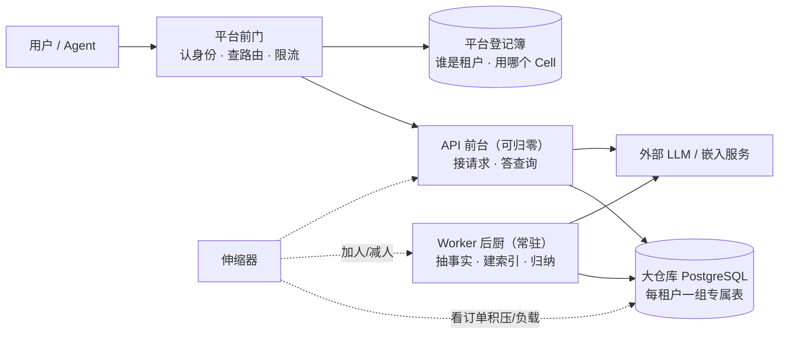
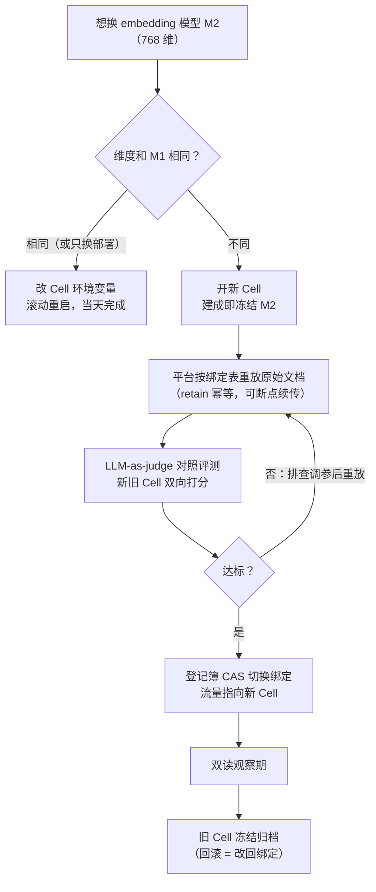

# Hindsight Serverless 多租户方案 · 大白话版（端到端走读）

> **这份文档是什么**：`serverless-multi-tenant.md`（原方案）的直白伴读。原方案是给做架构评审的人看的，到处是代码证据和编号；这一篇用人话把**同一个方案**从头到尾讲一遍，不引入任何原方案之外的新设计。
>
> **为什么从 2.6 讲起**：原方案 §2 列了 13 条"代码现状与 Serverless 冲突的障碍"，其中第 2.6 条——**Embedding 维度是引擎级单例**——是最容易被低估、又最能塑造整个架构的一条。它决定了"Cell"这个概念为什么存在、换 embedding 模型为什么要"搬家"而不是"装修"。本文把 2.6 当作贯穿主线，端到端把整个方案走一遍。
>
> 术语对照：**Cell** = 原方案 §3.3 的部署单元；**schema** = PG 里每租户一组的表；**bank** = 租户里的一块记忆分区。其余名词在 §3 逐个说人话。

---

## 1. 整个方案，一句话

**把 Hindsight 拆成"随叫随到的前台 + 一直开火的后厨 + 绝不搬家的大仓库"，前台可以随流量生生死死，仓库里的每个租户各用各的货架，而后台所有慢活（抽事实、建索引、归纳洞察）都通过数据库里的一张订单表排队——不引入任何消息队列中间件。**

展开成三句：

1. **计算便宜且 disposable**：处理请求的 API 容器、干活的 Worker 容器，都可以随时增减、随时死掉重启，因为它们身上不存任何"死了就丢"的东西。
2. **数据集中且分租户**：所有记忆存在一个（或少数几个）PostgreSQL 里，每个租户一个 schema（一组专属的表），物理上分架。
3. **唯一的"紧箍咒"**：每个 Cell（部署单元）在建成那天就要选定 embedding 模型——因为向量列的宽度像浇死的混凝土，事后改不了。想换模型？**搬家，不装修**（开新 Cell + 拿原始资料重放）。这是原方案 §2.6 的设计，本文第 8 节完整演绎。



---

## 2. 为什么方案长这样：三件礼物和一个紧箍咒

做 Serverless 改造前，先盘点 Hindsight 代码"天生就适合"和"天生就别扭"的地方（原方案 §1、§2 的结论）。

### 三件礼物（代码白送的，不用开发）

**礼物一：请求面本来就没有状态。**
每次请求带什么租户信息、用哪组表，全靠请求自己的凭据现场决定，处理完就忘。任何一台前台都能处理任何请求——这就是"可随手扩缩容"的全部前提。查询（recall）更是纯只读，答完就走。

**礼物二：后台任务用数据库当队列。**
这是整个方案最省钱的发现。Hindsight 的后台任务（抽事实、归纳等）不是扔给 Kafka 之类的消息队列，而是**往数据库的一张表里插一行**（`async_operations` 表：一行 = 一个任务，带状态、重试次数、序列化键）。Worker 来数据库"抢单"——数据库的行锁保证两个 Worker 绝不会抢到同一个任务。这意味着：

- 任务和数据在同一个库、同一个事务里——**下单和付款永远一起成功**，不存在"消息发了但数据库没写"的经典事故；
- Worker 死了？任务行还在，换个 Worker 接着干；
- 想加十个 Worker？直接加，数据库行锁天然防抢。

**礼物三：连接方式天生兼容连接池代理。**
所有 SQL 都写全限定表名（`租户schema.表名`），从不依赖"会话默认 schema"这种会话级状态——所以可以用 PgBouncer（连接池代理）的事务模式，一百个前台共享几十条数据库连接。没有这个前提，Serverless 的连接管理会非常痛苦。

### 一个紧箍咒：2.6 维度单例

Hindsight 的每条记忆最终变成一个**向量**（一串数字）存进 PostgreSQL。向量的**维度**（数字的个数）由 embedding 模型决定：A 模型出 1024 维，B 模型出 768 维。而数据库表里向量列的宽度是**建表时定死的**——原方案引用的迁移代码明示：改列宽只在**空表**上可行，表里有数据就改不了。

推论链条（这就是 2.6 的全部逻辑）：

```
embedding 模型决定向量维度
  → 向量列宽度建表时冻结
    → 表里有数据后不能改列宽
      → 不能在原地把 1024 维的记忆"就地"变成 768 维
        → 换不同维度的模型 = 开一个新 Cell，从源头重放
```

所以原方案的设计是：**每个 Cell 在创建那天就冻结 embedding 模型（和它的维度），想换模型 = 建新 Cell**。这不是缺陷妥协，而是把"不可避免的事"（模型总会升级）变成"有章法的流程"（第 8 节的搬家五步）。

---

## 3. 名词说人话

| 名词 | 人话解释 |
|---|---|
| **Cell（部署单元）** | 一家"分店"：一套 API 前台 + 一批 Worker 后厨 + 一个专属 PostgreSQL 仓库 + 一份运行配置（含**冻结的 embedding 模型**）。普通租户合租共享 Cell A；大客户/合规客户给专属 Cell B。 |
| **schema（模式）** | 同一个 PostgreSQL 仓库里，每个租户分到的一整排专属货架（约 22 张表）。租户之间物理分架，查询时表名都带自家前缀，想串门都串不了。 |
| **bank（记忆库）** | 租户内部再分的"记忆分区"——比如一个 Agent 一个 bank。同一租户的所有 bank 共用货架，靠每行数据上的 bank 编号区分。 |
| **`async_operations` 表（订单夹）** | 数据库里的一张任务表。API 收到大任务就往里插一行（= 开一张订单），Worker 从里头抢单干活。**它是受理与执行的分界线：订单开了，前台就可以下班。** |
| **consolidation（归纳）** | 后厨的"熬汤"工序：把攒下来的零散事实用 LLM 归并成"观察"（带证据数量的小结论），再喂给知识页刷新。归并按"观察范围"（observation scope，给事实分组的标签域）分批进行。 |
| **扩展（extension）** | 引擎预留的插件插槽（认证、校验钩子等）——平台代码插在插槽上，不改引擎本体。 |
| **维度冻结** | 向量列宽像浇死的混凝土。Cell 建成那天选的 embedding 模型决定混凝土形状，此后在这个 Cell 里**只能用同维度的模型**。 |
| **源重放** | 搬家方式：平台手里一直留着**原始文档**（来源真相），需要时把原文按顺序重新"喂"给新 Cell 的记忆引擎，让它从头再抽一遍事实、重新算一遍向量。因为写入是幂等的（同一份内容不会重复入库），重放安全。 |
| **水位（watermark）** | 归纳工序的"读到哪儿了"标记。有新事实落库就继续熬汤，不重复劳动。 |

---

## 4. 端到端故事一：写入一条记忆（异步 retain）

用户（或某个 Agent）说："帮我把这段会议记录记下来。" 内容比较大，走异步。全程十步：

1. **下单**：客户端 `POST /retain`，先到平台前门。
2. **验身份**：前门验证终端用户身份，换上内部服务凭据 + 用户断言头，转发给 Cell 里的任意一台 API 前台。
3. **定货架**：API 用平台租户扩展查登记簿："这个 key 是租户 X 的"→ 得到 schema 名，本次请求的所有数据库操作都锁定在 X 的货架上。
4. **开订单**（关键一步）：前门/平台规则判定"内容大，走异步"→ API 往订单夹（`async_operations`）插一行，**同一个事务**里写好任务参数，然后立刻回客户端："受理了，单号是 operation_id"。**从这一刻起，任务已经持久化——刚才那台 API 就是当场爆炸，任务也毫发无损。**
5. **看板扩容**：伸缩器（KEDA/HPA）盯着订单夹。积压了？加 Worker——但看板看的是"有活干的 bank 数"而不是总订单数，同一 bank 的任务排成串，排再多也只值一个后厨。此刻甚至可以一台 Worker 都没有。
6. **抢单**：某个 Worker 从订单夹领任务。数据库的 `FOR UPDATE SKIP LOCKED` 保证同时抢单的 Worker 互不冲突；"同一 bank 的归纳任务同时只有一个在飞"、"同一文档的写入按提交顺序处理"这类规矩，全部写在领取任务那条查询的筛选条件里——**跨进程的秩序由数据库保证，不靠任何一台机器的记忆**。
7. **抽事实**：Worker 按 chunk（文本块）逐批调用外部 LLM："这段话里有哪些值得长期记住的事实？谁说的？什么类型？"逐批提交，边抽边往库里写（流式小批提交，不会一口气撑爆事务）。
8. **算向量、建索引**：抽出的每条事实调用 embedding 服务变成向量，存进记忆主表。**注意：这里用的模型，是这个 Cell 建成那天冻结的那个**（2.6 线第一次出现）。
9. **连关系**：实体识别（数据库内的相似度算法，不花 LLM 钱）、建立事实之间的时间/语义/因果链接；收尾时顺手挂一张"该归纳了"的订单（按 bank 去重，见故事三）。
10. **交付**：任务标记完成；如果客户端订阅了 webhook，一张"投递通知"的小订单也进了同一个订单夹，由 Worker 顺手投出（带签名）。客户端凭单号查询进度即可。

**受理与执行的分界 = 第 4 步的订单行。** 前面任何环节挂了，客户端拿到的是错误，可以重试；之后任何环节挂了，任务照常被别的 Worker 接力。这就是"前台可归零、后厨可弹性"的全部底气。

---

## 5. 端到端故事二：查询记忆（recall）

用户问："上次关于项目排期都记了什么？"

1. 前门验身份 → 转发 → API 定货架（同故事一第 2-3 步）。
2. API 把问题文本变成向量（还是这个 Cell 冻结的那个模型——2.6 线第二次出现：**同一个 Cell 只有一份模型配置，查询和写入都用它，引擎严格校验的是维度**——所以同维度换模型/换部署是允许的配置级操作，见第 8 节第 0 步）。
3. API 同时发起四路检索：**语义**（向量相似，走 HNSW 索引）、**关键词**（全文检索）、**关系**（顺着事实之间的链接扩散）、**时间**（按事件时间过滤）。四路全部只查这个租户、这个 bank 的货架。
4. 四路结果用 RRF（名次融合）合成一张榜单，再过一个"精排器"（可选）按相关度重排。
5. 返回结果。**全程只读，不写任何持久状态**——所以处理查询的前台可以随时被杀、随时扩容，查询体验毫无感知。

> 补一句：reflect（基于记忆的综合问答）与 recall 同属只读请求面，原方案与本文都未单独展开它的时序——它内联执行、可被客户端断连取消，同样符合"前台无状态"的剧本。

---

## 6. 端到端故事三：后台把零散事实"熬成汤"（consolidation）

故事一第 9 步留了个尾巴：事实入库后，谁来把它们提炼成"观察"和"知识页"？

- **触发**：retain 收尾时顺手挂一张"该归纳了"的订单；后台的定时巡检（MaintenanceLoop，只在 Worker 层跑）兜底补发。按 bank 去重，不会重复熬。- **熬制**：Worker 按"观察范围"分组捞取还没归并的事实（用"水位"记住读到哪了），分批喂给 LLM："这几条事实能合成什么结论？证据是哪几条？"产出带证据计数的观察行。
- **防乱**：同一 bank 同时只有一锅汤在熬（订单夹的串行化谓词）；归纳完打上水位；再触发知识页刷新。
- **诚实边界**：如果干活的 Worker 半路被杀，这一锅汤会"卡住"（原方案 §2.4 的已知缺口）——这就是为什么需要故事六的回收控制器。

---

## 7. 端到端故事四：一个新租户从注册到可用

1. 运营（或用户自助）在前门登记：创建租户，选套餐、选 Cell（默认共享 Cell A）。
2. 平台登记簿插入一行：`tenants(status=provisioning)` + API key（只存哈希）。
3. 平台控制器启动一个**迁移 Job**：直连大仓库（绕过连接池代理，因为建索引需要特殊连接模式），`CREATE SCHEMA` + 22 张表 + 每租户的索引例程 + **按本 Cell 冻结的维度建向量列**（2.6 线第三次出现：**新租户的货架从第一天起就浇筑了这个 Cell 的混凝土形状**）。
4. Job 成功 → 登记簿状态改 `active` → 发 key。此后数据面每次请求只是**读**登记簿（带缓存），请求路径上再无任何建表动作。
5. **引擎版本升级**用的也是同一套 Job 机制：对全 Cell 的 schema 分批跑迁移——开通、升级、将来删除，是同一个控制器的三种订单。

---

## 8. 端到端故事五：换 embedding 模型（2.6 设计的完整演绎）

这是用户最关心的场景，也是 2.6 主线的高潮。设定：Cell A 冻结的是模型 M1（1024 维），一年后出现更好的 M2（768 维）。**在 2.6 的设计下，这件事的完整剧本是"搬家五步"：**

**第 0 步 · 先想清楚要不要搬。**
同一维度的新模型（或只是换了个部署方式，比如 TEI 换个版本）**不用搬家**——改 Cell 的环境变量、滚动重启即可，当天完成。只有**维度变了**才触发搬家。所以建 Cell 那天的选型值得认真：选一个可长期演进的模型/服务，能推迟搬家的时间点（原方案 §8.2 的原话精神）。

**第 1 步 · 为什么不能装修（原地换）？三个死结。**
- 列宽是混凝土：PG 里改向量列宽仅空表可行，租户库里全是数据；
- 新旧向量维度不同，**物理上无法共存于同一列**——不存在"新记忆用 M2、旧记忆还是 M1"的混住方案（那等于两套检索体系）；
- 即便想"整列重算"（把旧文本重新 embedding 一遍覆盖写），在旧列宽下根本写不进 768 维向量——这条"捷径"从第一步就不成立。

**第 2 步 · 搬家的前提：平台一直留着原始菜谱。**
方案规定平台持有**来源真相**（原始文档、版本、用户纠正），Hindsight 只是被绑定的记忆引擎之一。这是重放能成立的前提——没有原文，就没有"重来一遍"。

**第 3 步 · 开新 Cell，重放。**
- 起一个新 Cell（新命名空间 + 独立的 PG 实例），**建成那天冻结 M2（768 维）**；
- 按绑定表把租户的**原始文档**逐个重新 retain 进新 Cell——因为写入幂等（同一内容有唯一指纹，重复喂不会重复入库），重放可以慢、可以断点续传、可以整批重跑，都不会把数据弄脏；
- 期间旧 Cell 照常服务，**用户无感**。

**第 4 步 · 验货再切。**
重放完成后，用 LLM-as-judge 对照评测（同一套评测方法，双向打分：新 Cell 的召回质量 vs 旧 Cell）——**数字过关才切换**。切换动作是改登记簿里的一条绑定（CAS 原子改），把租户的流量指到新 Cell。

**第 5 步 · 双读观察期 + 归档。**
切换后一段双读观察期；确认无误后旧 Cell 冻结归档（数据不删）。**回滚 = 把绑定改回去**，旧 Cell 原封未动，逃生门随时开着。

**这套剧本不止用于换模型。** 原方案 §8.3 明说：整引擎替换（将来出现比 Hindsight 更强的记忆引擎）走的是**同一个协议**——新引擎 Cell 上线 → 重放 → 对照评测 → CAS 切换 → 归档。换 embedding 模型只是这个协议的"维度变了"特例。**这就是 2.6 设计的深意：它不是一条障碍，而是把"组件终会被替换"变成架构的一等公民。**



---

## 9. 端到端故事六：Worker 后厨着火了怎么办

Worker 是容器，会被杀、会被驱逐。原方案对此的机制与补丁：

1. **优雅死亡**：Worker 收到退出信号后有 30 秒整理时间，把自己手里没干完的订单放回队列、状态改干净。
2. **暴力死亡**（SIGKILL/节点失联）：它领走的订单会卡在"处理中"。引擎自带的恢复协议只认"自己的名字"（worker_id），死无对证时没人认领——这是原方案点名的缺口。
3. **平台补位（回收控制器）**：监控发现某 Worker pod 消失 → 调引擎自带的 `decommission-worker` 命令，把它的在途任务回收重排；再加一个定时对账兜底（超时处理中的行也回收）。**这一条是原方案要求的少数几个必做新组件之一。**
4. **防重**：任务重跑靠幂等兜底（内容指纹去重、归纳的去重仲裁）——所以承诺的是 **at-least-once（至少一次，可能重复但不会丢）**，不是"恰好一次"，这一点方案原文明说，不粉饰。

---

## 10. 隔离与套餐：租户之间到底隔多厚

| 等级 | 拓扑 | 人话 | 适合谁 |
|---|---|---|---|
| **L0** | 合租：共享 PG + 共享数据库账号，schema 分架 | 每租户一排专属货架，但仓库大门钥匙是共用的 | 内部试用 |
| **L1（推荐默认）** | L0 + 前门双层认证 + 权限校验 + 配额 + 审计 | 货架分架 + 门卫查双证 + 每人限量 | 标准 SaaS |
| **L2（专属 Cell）** | 独立 PG 实例 + 独立整套部署 + 独立凭据网络 | 独栋仓库，连地震（故障）都波及不到别人 | 强隔离/合规/大客户 |

**为什么不用业内常见的 RLS（行级安全）？** 原方案算了账：Hindsight 的隔离模型是"物理分表"（每租户一套表），RLS 是"同一张表加行级权限"——两者不对位；硬套 RLS 等于推翻全部 22 张表和索引的设计，而每租户独立数据库角色又会推翻连接池模型。结论：**Cell 内靠 schema 分架（继承引擎设计），Cell 之间靠物理隔离（部署层实现）**，两层各司其职。

**租户生命周期的另外三个动作**（原方案 §6.5，各一句带过）：**冻结**——平台校验器对冻结租户一律拒绝（402/403），Worker 停领其任务；**删除**——先用引擎已有的 bank 删除 API 逐库清数据，再做 schema 级 drop（待开发的新 Job）+ 对象存储清理；**跨 Cell 租户迁移**——用引擎自带的 `export-bank`/`import-bank` 把租户整体搬到另一个 Cell 再切绑定。注意最后这条与第 8 节的"换模型搬家"是**两条不同机制**：前者是"连人带行李搬仓库"（引擎导出导入现成数据），后者是"拿原始菜谱重做一遍"（平台重放原文）。

---

## 11. 这个方案要开发什么、不开发什么

**不用开发（代码白送）**：队列与抢单、任务幂等与去重、webhook 可靠投递、读写分离支持、PgBouncer 兼容、四路检索与归纳全流水线、`export/import-bank`（租户搬家用）。

**要开发（平台层七件套 + 引擎一个小补丁）**：

1. 平台前门（认证、租户→Cell 路由、bank 权限、限流）
2. 平台租户扩展（查登记簿返回 schema）
3. 平台校验器（配额 402、大内容强制异步、用量计量、bank ACL）
4. 租户开通控制器（迁移 Job + 状态机）
5. Worker 回收控制器（故事六的第 3 步）
6. 租户删除工具（schema 级删除，引擎目前没有）
7. 观测汇聚（指标/追踪/审计）

**引擎侧唯一的必选补丁**：给 MaintenanceLoop（定时巡检循环）加个开关，让 API 前台进程不跑它（只有 Worker 该跑）——不然每个前台副本都在做无意义的全库扫描。其余全部是纯配置（外部 PG、关启动迁移、全远程推理、MCP 无状态模式等，原方案 §7.1 列了完整清单，全部是已存在的环境变量）。

---

## 12. 诚实清单：这个方案没承诺什么

1. **冷启动 p95 ≤ 15 秒是目标不是结论**，需实测（Python import + 初始化探测的耗时是主要变数）。
2. **任务投递是 at-least-once**：极端情况下 LLM 调用等副作用可能重复发生，靠幂等去重兜底，不承诺恰好一次。
3. **bank 配置改动的生效有最多 30 秒延迟**（引擎的进程内缓存），跨实例最终一致。
4. **卡死任务的根除要等上游**：回收控制器是缓解；彻底根除需要引擎加租约机制，属上游演进。
5. **千级租户的运维窗口时长未实测**：全量迁移、备份恢复的真实耗时列为待验证假设。
6. **共享 Cell 的 L0 层不防"应用被攻破"**——单应用凭据可见全部 schema；要防，上 L2 专属 Cell。
7. **换模型必须搬家的代价被明确接受**（2.6 的设计选择）：换来的是每个 Cell 内检索体系的简洁与一致。缓解手段是建 Cell 时认真选型 + 平台始终保留来源真相，让"搬家"可控、可评测、可回滚。

---

## 附：与原方案的对照索引

| 本文 | 原方案出处 |
|---|---|
| 第 1 节 一句话方案 / 全景图 | §3.1 总架构图 |
| 第 2 节 三件礼物 | §1.1 请求面无状态、§1.2 数据库队列、§1.1 pooler 兼容 |
| 第 2 节 紧箍咒 / 第 8 节 换模型 | §2.6 维度单例、§3.3 Cell 划分、§8.2 维度冻结、§8.3 替换协议 |
| 第 4-7 节 四个故事 | §4.1 retain、§4.2 recall、§4.3 consolidation、§4.4 开通迁移 |
| 第 9 节 Worker 着火 | §2.4 无租约缺口、§3.4/§5.5 回收控制器、§5.5 at-least-once、§7.2 引擎补丁清单 |
| 第 10 节 隔离 | §6.1-6.3 四层与 L0/L1/L2、RLS 论证 |
| 第 11 节 开发清单 | §3.4 平台组件、§7.1 配置清单、§7.2 引擎补丁 |
| 第 12 节 诚实清单 | §5.5 可靠性边界、§6.6 剩余风险、§10 待验证假设 |
