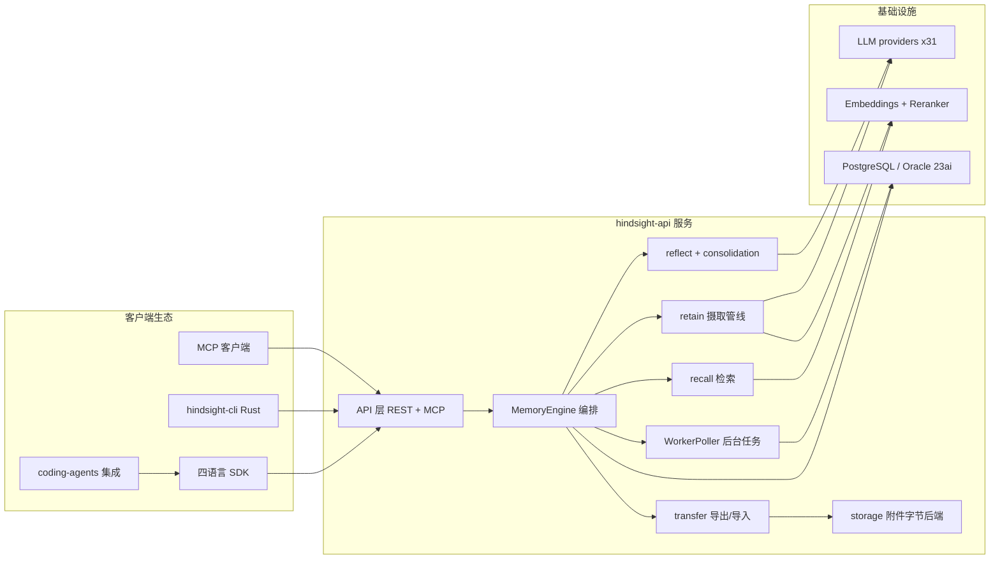

# Hindsight 源码庖丁解牛 · 导读

> 对 `vectorize-io/hindsight`（agent 长期记忆系统，v0.10.3，monorepo）的模块级源码解析。
> 本系列所有论断均由独立审核 subagent 对源码逐条核验（file:line 实证），示例数据与代码字段一一对应。
> 基于 main 分支 `6d8b09678` 快照（2026-10-09，v0.10.3 增量轮：自 `5b8356bb2` 前移 155 提交）；行号引用如遇后续提交可能漂移 ±10 行内。全系列七篇均已随 0.10.2 全量更新（原基线均为 `12f2d54f6`），并随 0.10.3 增量更新（见文末增量记录）。

## 阅读顺序建议

```
入门路线：01 → 02 → 03 → 04（主线：一条记忆的一生）
基建路线：05 → 06（它怎么跑起来）
生态路线：07（周边工具链）
```

| 篇 | 模块 | 一句话定位 |
|----|------|-----------|
| 01 | [总览与数据模型](01-总览与数据模型.md) | 仓库全景、26 张表逐字段解析、bank/tenant 双层隔离、PG/Oracle 三层方言分派 |
| 02 | [retain 摄取管线](02-retain-摄取管线.md) | 文本 → 事实抽取 → 实体/链接 → 向量入库的完整摄取链路 |
| 03 | [recall 检索系统](03-recall-检索系统.md) | "四路并行"的真实物理编排、RRF 融合、cross-encoder 重排与三重 boost |
| 03a | [recall 四路检索数据源细看](03a-recall-四路检索数据源细看.md) | 03 篇深挖伴读：四路各自的 PG 表与字段、SQL 级取数实例、融合打分算术、输出契约与可复算 worked example |
| 04 | [reflect 与 consolidation](04-reflect-与-consolidation.md) | ReAct 式记忆推理、观察沉淀与心智模型刷新、evidence/inference 分离 |
| 05 | [基础设施抽象层](05-基础设施抽象层.md) | 31 个 LLM provider 插件体系、embedding/reranker 抽象、三级分层配置 |
| 06 | [API 层与服务形态](06-api-层与服务形态.md) | REST+MCP 协议面、async_operations 当队列的任务系统、三种运行形态 |
| 07 | [外围生态](07-外围生态.md) | Rust CLI（fs mount）、四语言 SDK、22（15 hook 型 + 7 插件型）harness 编码代理集成、控制面、测试金字塔 |

## 全局架构一图



读法：左列是四类调用方，中列是服务端的编排与三大操作（02-04 篇各展开一个；transfer 可把整个 bank 导出/导入，01 篇 1.6 节），右列是三类外部依赖（05/06 篇展开）。

## 贯穿全系列的核心结论（均已代码实证）

1. **一条记忆的一生**：retain 把文本切成 document → chunk → memory_unit 三层粒度，LLM 抽取带类型的事实（注意：LLM 抽取期与入库存储用的类型词不同，01 篇 3.2 节详述），实体经消歧对齐后建立 memory_links 图；recall 用语义+BM25+图+时间四条逻辑臂检索、RRF 融合、cross-encoder 重排；consolidation 把零散事实归并成 observation（带 proof_count 证据计数）；reflect 以 ReAct 工具循环做分层检索推理。

2. **术语与列名已数度漂移，读代码要小心**（01/04 篇；此处列记忆域的三次改名，列名改名见 01 篇 3.9）：fact_type `mental_model`→`observation`、表 `reflections`→`mental_models`、fact_type `bank`→`experience`。当前 observation = `memory_units` 里 `fact_type='observation'` 的行（consolidation 自动归并、带 proof_count/source_memory_ids 证据），mental model = 用户钉住的 reflect 文档（`mental_models` 表，subtype='pinned'）——**两者是完全不同的东西**。

3. **`models.py` 的 ORM 是过时镜像**（01 篇）：运行时全部是手写 asyncpg SQL（PG）/ `executemany`（Oracle），ORM 类在 models.py 之外的运行代码中零引用；真实 schema 要看 alembic 迁移与 db/ops 层。

4. **"四路并行"是逻辑分层而非物理全并行**（03 篇）：实际是 1 条 UNION ALL SQL（semantic+BM25 同船，0.10.2 起该 SQL 组装在 `memories/pg/recall.py:221`）→ 同连接串行时间 SQL → 图臂 `asyncio.gather` 真并行（`memories/postgres.py:175` 注释、`:240`）。

5. **异步 retain 返回 HTTP 200 而非 202**（06 篇）：异步语义靠 body 的 `async:true` 表达；幂等靠客户端自选 UUID 作 operation_id，重放直接回原响应（`_resolve_retain_replay`）。

6. **bank 级配置不能覆盖 provider/model**（05 篇，与 CLAUDE.md 通用指引相反）：`_CONFIGURABLE_FIELDS` 明确排除 provider/model 选择，凭据字段在 `_CREDENTIAL_FIELDS` 拒写名单；bank 唯一能动的 LLM 字段是 `llm_gemini_safety_settings`。

7. **任务队列就是 `async_operations` 表**（06 篇）：`FOR UPDATE SKIP LOCKED` 认领、rot/fifo 双 CTE 实现 bank 轮转公平、serialization_key 支撑同文档串行（部分非唯一索引 + 认领谓词）、三种 task backend 适配 API 进程/独立 worker/测试。

8. **evidence/inference 分离是 prompt 层的硬边界**（04 篇）：`_GROUNDING_BOUNDARY`——推断可以刻画数据覆盖了什么，但不允许为数据没覆盖的东西制造取值；consolidation 侧对应 NO COMPUTE 规则（禁止算术）。

9. **隔离是两层**（01 篇）：tenant = PG schema（contextvar + `fq_table()` 前缀，Oracle 用 CURRENT_SCHEMA），bank = 全表 `bank_id` 行列；加固件有复合外键、per-bank×fact_type 部分向量索引（store-owned 的 bank 例外，#4659）、`chunk_id` 单射编码防跨 bank 覆盖（历史事故 #4244）。

10. **知识库落盘是单向镜像**（07 篇）：`hindsight fs mount` 以磁盘字节为真值，每轮全量对比、被篡改文件计 reverted 回写、`0444` 只读 + tmp-rename 原子写。

## 各篇审核记录（1+1 撰写/审核 + 三轮复审）

本系列经 **4 个阶段**质检：①独立写手撰写 → ②独立审核员 1+1 初审（代码实证/臆想/mermaid 语法）→ ③用户要求的第 2 次全量三轮复审（第 1 轮：符合代码+臆想猎杀+语法；第 2 轮：深入浅出零背景读者审查；第 3 轮：例子手算复核+修复收口）→ 每轮修复清单均发回原写手（保留其研究上下文）逐条落实，写手对审核结论有异议时可举证驳回（累计 3 次，均经代码裁决）。

| 篇 | 1+1 初审 | 三轮复审 | 状态 |
|----|----------|----------|------|
| 01 | 5 阻塞+16 建议（臆造表名 entity_memory_links、unnest 数组数、状态图缺转移等）+ 2 处交叉回修 | 一轮 4 阻塞（已删表仍列为现存、llm_requests 默认值写反、29 参数、图标签 entity）+二轮 6 阻塞（2 处指错节、图要点漏消费侧、索引论断与迁移矛盾）+三轮 1 阻塞（chunk_id FK 已改 CASCADE） | ✅ 定稿 |
| 02 | PASS 零阻塞 + 5 微调 | 一轮 PASS 零阻塞（全系列引用精度最高）+二轮 4 阻塞（表述层）+三轮 4 阻塞（delta 示例分类数学不可能、日期格式、wall-ceiling 语义、RPC 行号） | ✅ 定稿 |
| 03 | 1 阻塞+4 建议（行号指向 downgrade 段） | 一轮 2 阻塞（observation_sources 仅 Oracle 被写反、扩散窗口指代）+二轮 5 句级阻塞（含 54k 词项数字丢失、+9% 方向反）+三轮 **PASS 零阻塞** | ✅ 定稿 |
| 04 | 1 阻塞+7 建议（URL 串前缀；1 条审核误判经字节级比对驳回） | 一轮 2 阻塞（fact_type 四值残留、级联删除语义写反）+二轮 7 阻塞（地基表压垮、图 3 死路分支等）+三轮 **PASS 零阻塞** | ✅ 定稿 |
| 05 | 3 阻塞+4 建议（含臆造 FactList 类名、ONNX 抛错写成告警） | 一轮 1 阻塞（漏网残留）+二轮 7 阻塞（含 4 处查码证实内容错：llamacpp 非 in-process、漏"不"字语义反向、"加权和"实为乘法、bank_info_cache 误引）+三轮 **PASS 零阻塞** | ✅ 定稿 |
| 06 | 5 阻塞+8 建议（端点地图 5 处方法错误、MCP 工具数等） | 一轮 5 阻塞（端点地图方法层未修）+二轮 11 阻塞（2 处断链引用、mark 落账时点等）+三轮 1 阻塞（entities 臆造 PATCH/DELETE；写手识破审核建议的回归坑） | ✅ 定稿 |
| 07 | 1 阻塞+5 建议（引用错文件；裁决 harness 计数 18 项） | 一轮 2 阻塞（coding-agents 不依赖 TS SDK、SDK 示例臆造调用形态）+二轮 6 阻塞（词汇表缺失、2 处事实笔误）+三轮 4 阻塞（守门 job 实为四个、_port_health_ok 归属等） | ✅ 定稿 |

**三轮累计战果**：约 40 个专职审核 subagent 参与，核验 1000+ 处 file:line 引用、逐字比对 90+ 段代码摘录、手算复核全系列示例数值、22 张 mermaid 图反复逐行语法检查；累计捕获并修复 **60+ 处阻塞级问题**（含 2 个臆造实体、约 12 处内容性错误、多处数学不可能的示例、多处陈旧 schema/过时注释采信），同时驳回了 3 处审核员误判（写手字节级举证，代码裁决）。

## ⑤ 0.10.2 全量更新轮（2026-10-03/05）

仓库从 `12f2d54f6`（v0.10.1）前移 **250 个提交**至 `f7dd3f4fd`（v0.10.2，1527 文件 +75928/-16147；0.10.2 全量更新轮的快照，现系列基线已前移至 `5b8356bb2`，见本段末增量记录）。全系列按"写手更新 → 审核员核验 → 修复"重走一遍：

**代码层主要变更**（已全部反映进各篇）：
- 引擎重构：`entity_resolver`/`links`/`link_expansion` 收编入 `engine/memories/pg/`，四臂 SQL 迁至 `pg/recall.py`（逐字迁移）；store 外代码禁止直写 8 张记忆表（`schema.py` STORE_TABLES + `_guard`，#4969）
- 新子系统：`engine/storage/`（FileStorage ABC + pg/s3/gcs/azure 四后端）、`engine/transfer/`（bank 导出/导入/流式归档——0.10.2 主打，ZipStreamer 手写 PKZIP、50 文档/批导入、崩溃重试恢复）
- 行为变更：reflect 工具结果 presentation 压缩 + `_finish` 统一收尾（#4656，-26%~-43%）、刷新失败"暂停"化（#4618）、stage-2 加法 boost 按名次衰减（#4653）、进程内重排 300s 墙钟（#4696）、图检索器选择反转为 store-only、`cap_per_source` 更名 `recall_max_candidates_per_source`
- 计数迁移：迁移 104→110、PG 表 24→25（新增 bank_aliases）、REST 路由 95→99（+aliases 4 条）、harness 18→20（13 hook + 7 插件，新增 traecode/kimi-code）、评测五套→八套、测试文件 605

**更新轮核验战果**：7 写手 + 7 审核员，抽验 250+ 条更新论断（含 PR 号 git 取证）、独立重数全部计数、示例数学约束复核；仅 3 处阻塞级问题（导读两处时序性过时注记）+ 若干行号锚点漂移，全部修复闭环。写手另主动修正旧报告 1 处事实错误（`GET /banks/{id}/export` 实为模板 manifest 导出）。

每篇均由独立写手 subagent 撰写、独立审核员 subagent 逐条核验（关键论断 file:line 回源码、代码摘录原文比对、mermaid 逐图语法检查、示例数据验算、臆造检查），修复清单发回原写手（保留其研究上下文）落实。

2026-10-05 增量：+27 提交（5b8356bb2），reflect 真实 id 引用（#5246）、recall 超时与最强链（#5231/#5237）、BEIR 评测（#5230）等已随篇更新

2026-10-09 增量：+155 提交至 `6d8b09678`（v0.10.3），worker 背压延后（#5396）、consolidation 批写入（#5420/#5421）、reflect 预算语义（#5250/#5264）、结构化输出剥数值边界（#5401）、claude-code setup-token（#4796）、harness 20→22（workbuddy/codebuddy）等已随篇更新
