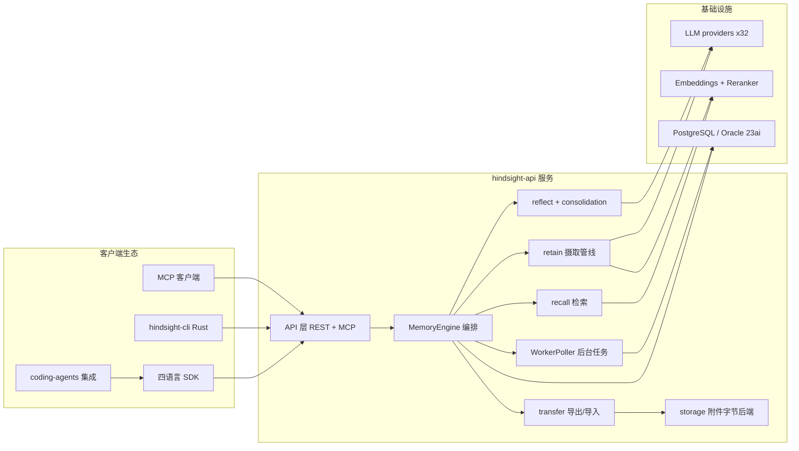

# Hindsight 源码庖丁解牛 · 导读

> 对 `vectorize-io/hindsight`（agent 长期记忆系统，v1.1.0，monorepo）的模块级源码解析。
> 本系列所有论断均由独立审核 subagent 对源码逐条核验（file:line 实证），示例数据与代码字段一一对应。
> 基于 main 分支 `b4a0da1e9` 快照（2026-10-23，1.1.0 增量轮：自 `5331da2f4` 前移 223 提交，v1.1.0 于 2026-10-21 发布）；行号引用如遇后续提交可能漂移 ±10 行内。全系列均已随 0.10.2 全量更新（原基线均为 `12f2d54f6`），并随 0.10.3、1.0.0、1.1.0 增量更新（见文末增量记录）。

## 阅读顺序建议

```
入门路线：01 → 02 → 03 → 04（主线：一条记忆的一生）
基建路线：05 → 06（它怎么跑起来）
生态路线：07（周边工具链）
```

| 篇 | 模块 | 一句话定位 |
|----|------|-----------|
| 01 | [总览与数据模型](01-总览与数据模型.md) | 仓库全景、24 张 PG 表（+1 张 Oracle 专属）逐字段解析、bank/tenant 双层隔离、PG/Oracle 三层方言分派 |
| 02 | [retain 摄取管线](02-retain-摄取管线.md) | 文本 → 事实抽取 → 实体/链接 → 向量入库的完整摄取链路 |
| 03 | [recall 检索系统](03-recall-检索系统.md) | "四路并行"的真实物理编排、RRF 融合、cross-encoder 重排与三重 boost |
| 03a | [recall 四路检索数据源细看](03a-recall-四路检索数据源细看.md) | 03 篇深挖伴读：四路各自的 PG 表与字段、SQL 级取数实例、融合打分算术、输出契约与可复算 worked example |
| 04 | [reflect 与 consolidation](04-reflect-与-consolidation.md) | ReAct 式记忆推理、观察沉淀与心智模型刷新、evidence/inference 分离 |
| 05 | [基础设施抽象层](05-基础设施抽象层.md) | 31 个 LLM provider 插件体系、embedding/reranker 抽象、三级分层配置 |
| 06 | [API 层与服务形态](06-api-层与服务形态.md) | REST+MCP 协议面、async_operations 当队列的任务系统、三种运行形态 |
| 07 | [外围生态](07-外围生态.md) | Rust CLI（fs mount）、四语言 SDK、22（15 hook 型 + 7 插件型）harness 编码代理集成、控制面、测试金字塔 |
| 08 | [Memlake 对象存储原生引擎](08-Memlake-对象存储原生引擎.md) | Hindsight 企业版存储引擎（闭源 Rust）：桶为唯一真相源、条件写协议、TLA+ 验证、1 亿记忆 <100ms p99；含开源侧 store 接缝的代码级对照 |

## 全局架构一图


```mermaid
flowchart LR
    subgraph CLIENTS["客户端生态"]
        SDK["四语言 SDK"]
        CLI["hindsight-cli Rust"]
        AGENTS["coding-agents 集成"]
        MCP["MCP 客户端"]
    end
    subgraph SERVER["hindsight-api 服务"]
        API["API 层 REST + MCP"]
        ENG["MemoryEngine 编排"]
        RETAIN["retain 摄取管线"]
        RECALL["recall 检索"]
        REFLECT["reflect + consolidation"]
        TRF["transfer 导出/导入"]
        STOR["storage 附件字节后端"]
        WORKER["WorkerPoller 后台任务"]
    end
    subgraph INFRA["基础设施"]
        LLM["LLM providers x32"]
        EMB["Embeddings + Reranker"]
        DB["PostgreSQL / Oracle 23ai"]
    end
    SDK --> API
    CLI --> API
    AGENTS --> SDK
    MCP --> API
    API --> ENG
    ENG --> RETAIN
    ENG --> RECALL
    ENG --> REFLECT
    ENG --> WORKER
    RETAIN --> LLM
    REFLECT --> LLM
    RECALL --> EMB
    RETAIN --> EMB
    ENG --> DB
    ENG --> TRF
    TRF --> STOR
    WORKER --> DB
```

读法：左列是四类调用方，中列是服务端的编排与三大操作（02-04 篇各展开一个；transfer 可把整个 bank 导出/导入，01 篇 1.6 节），右列是三类外部依赖（05/06 篇展开）。

## 贯穿全系列的核心结论（均已代码实证）

1. **一条记忆的一生**：retain 把文本切成 document → chunk → memory_unit 三层粒度，LLM 抽取带类型的事实（注意：LLM 抽取期与入库存储用的类型词不同，01 篇 3.2 节详述），实体经消歧对齐后建立 memory_links 图；recall 用语义+BM25+图+时间四条逻辑臂检索、RRF 融合、cross-encoder 重排；consolidation 把零散事实归并成 observation（带 proof_count 证据计数）；reflect 以 ReAct 工具循环做分层检索推理。

2. **术语与列名已数度漂移，读代码要小心**（01/04 篇；此处列记忆域的三次改名，列名改名见 01 篇 3.9）：fact_type `mental_model`→`observation`、表 `reflections`→`mental_models`、fact_type `bank`→`experience`。当前 observation = `memory_units` 里 `fact_type='observation'` 的行（consolidation 自动归并、带 proof_count/source_memory_ids 证据），mental model = 用户钉住的 reflect 文档（`mental_models` 表，subtype='pinned'）——**两者是完全不同的东西**。

3. **`models.py` 的 ORM 是过时镜像**（01 篇）：运行时全部是手写 asyncpg SQL（PG）/ `executemany`（Oracle），ORM 类在 models.py 之外的运行代码中零引用；真实 schema 要看 alembic 迁移与 db/ops 层。

4. **"四路并行"是逻辑分层而非物理全并行**（03 篇）：实际是 1 条 UNION ALL SQL（semantic+BM25 同船，0.10.2 起该 SQL 组装在 `memories/pg/recall.py:221`）→ 同连接串行时间 SQL → 图臂 `asyncio.gather` 真并行（`memories/postgres.py:175` 注释、`:240`）。1.0.0 起若配置了决策模型，重排阶段整体替换为逐候选名次分的决策模型重排器（03 篇 3.6）。

5. **异步 retain 返回 HTTP 200 而非 202**（06 篇）：异步语义靠 body 的 `async:true` 表达；幂等靠客户端自选 UUID 作 operation_id，重放直接回原响应（`_resolve_retain_replay`）。

6. **bank 级配置不能覆盖 provider/model**（05 篇，与 CLAUDE.md 通用指引相反）：`_CONFIGURABLE_FIELDS` 明确排除 provider/model 选择，凭据字段在 `_CREDENTIAL_FIELDS` 拒写名单；bank 能动的 LLM 链路参数字段仅 `llm_gemini_safety_settings`，1.0.0 起另可写三个 `*_use_decision_model` 行为开关（决定 recall/reflect/consolidation 是否改走决策模型，但选不了是哪个模型，05 篇 3.7）。

7. **任务队列就是 `async_operations` 表**（06 篇）：`FOR UPDATE SKIP LOCKED` 认领、rot/fifo 双 CTE 实现 bank 轮转公平、serialization_key 支撑同文档串行（部分非唯一索引 + 认领谓词）、三种 task backend 适配 API 进程/独立 worker/测试。

8. **evidence/inference 分离是 prompt 层的硬边界**（04 篇）：`_GROUNDING_BOUNDARY`——推断可以刻画数据覆盖了什么，但不允许为数据没覆盖的东西制造取值；consolidation 侧对应 NO COMPUTE 规则（禁止算术）。

9. **隔离是两层**（01 篇）：tenant = PG schema（contextvar + `fq_table()` 前缀，Oracle 用 CURRENT_SCHEMA），bank = 全表 `bank_id` 行列；加固件有复合外键、per-bank×fact_type 部分向量索引（store-owned 的 bank 例外，#4659）、`chunk_id` 单射编码防跨 bank 覆盖（历史事故 #4244）。

10. **知识库落盘是单向镜像**（07 篇）：`hindsight fs mount` 以磁盘字节为真值，每轮全量对比、被篡改文件计 reverted 回写、`0444` 只读 + tmp-rename 原子写。

## 各篇审核记录（1+1 撰写/审核 + 三轮复审）

本系列经 **4 个阶段**质检：①独立写手撰写 → ②独立审核员 1+1 初审（代码实证/臆想/mermaid 语法）→ ③用户要求的第 2 次全量三轮复审（第 1 轮：符合代码+臆想猎杀+语法；第 2 轮：深入浅出零背景读者审查；第 3 轮：例子手算复核+修复收口）→ 每轮修复清单均发回原写手（保留其研究上下文）逐条落实，写手对审核结论有异议时可举证驳回（累计 3 次，均经代码裁决）。

| 篇 | 1+1 初审 | 三轮复审 | 状态 |
|----|----------|----------|------|
| 01 | 5 阻塞+16 建议（臆造表名 entity_memory_links、unnest 数组数、状态图缺转移等）+ 2 处交叉回修 | 一轮 4 阻塞（已删表仍列为现存、llm_requests 默认值写反、29 参数、图标签 entity）+二轮 6 阻塞（2 处指错节、图要点漏消费侧、索引论断与迁移矛盾）+三轮 1 阻塞（chunk_id FK 已改 CASCADE） | ✅ 定稿 |
| 02 | PASS 零阻塞 + 5 微调 | 一轮 PASS 零阻塞（全系列引用精度最高）+二轮 4 阻塞（表述层）+三轮 4 阻塞（delta 示例分类数学不可能、日期格式、wall-ceiling 语义、RPC 行号） | ✅ 定稿 |
| 03 | 1 阻塞+4 建议（行号指向 downgrade 段） | 一轮 2 阻塞（observation_sources 仅 Oracle 被写反、扩散窗口指代）+二轮 5 句级阻塞（含 54k 词项数字丢失、+9% 方向反）+三轮 **PASS 零阻塞** | ✅ 定稿 |
| 04 | 1 阻塞+7 建议（URL 串前缀；1 条审核误判经字节级比对驳回） | 一轮 2 阻塞（fact_type 四值残留、级联删除语义写反）+二轮 7 阻塞（地基表压垮、图 3 死路分支等）+三轮 **PASS 零阻塞** | ✅ 定稿 |
| 05 | 3 阻塞+4 建议（含臆造 FactList 类名、ONNX 抛错写成告警） | 一轮 1 阻塞（漏网残留）+二轮 7 阻塞（含 4 处查码证实内容错：llamacpp 非 in-process、漏"不"字语义反向、"加权和"实为乘法、bank_info_cache 误引）+三轮 **PASS 零阻塞** | ✅ 定稿 |
| 06 | 5 阻塞+8 建议（端点地图 5 处方法错误、MCP 工具数等） | 一轮 5 阻塞（端点地图方法层未修）+二轮 11 阻塞（2 处断链引用、mark 落账时点等）+三轮 1 阻塞（entities 臆造 PATCH/DELETE；写手识破审核建议的回归坑） | ✅ 定稿 |
| 07 | 1 阻塞+5 建议（引用错文件；裁决 harness 计数 18 项） | 一轮 2 阻塞（coding-agents 不依赖 TS SDK、SDK 示例臆造调用形态）+二轮 6 阻塞（词汇表缺失、2 处事实笔误）+三轮 4 阻塞（守门 job 实为四个、_port_health_ok 归属等） | ✅ 定稿 |

**三轮累计战果**：约 40 个专职审核 subagent 参与，核验 1000+ 处 file:line 引用、逐字比对 90+ 段代码摘录、手算复核全系列示例数值、22 张 mermaid 图反复逐行语法检查；累计捕获并修复 **60+ 处阻塞级问题**（含 2 个臆造实体、约 12 处内容性错误、多处数学不可能的示例、多处陈旧 schema/过时注释采信），同时驳回了 3 处审核员误判（写手字节级举证，代码裁决）。

## ⑤ 0.10.2 全量更新轮（2026-10-03/05）

仓库从 `12f2d54f6`（v0.10.1）前移 **250 个提交**至 `f7dd3f4fd`（v0.10.2，1527 文件 +75928/-16147；0.10.2 全量更新轮的快照，现系列基线已前移至 `5b8356bb2`，见本段末增量记录）。全系列按"写手更新 → 审核员核验 → 修复"重走一遍：

**代码层主要变更**（已全部反映进各篇）：
- 引擎重构：`entity_resolver`/`links`/`link_expansion` 收编入 `engine/memories/pg/`，四臂 SQL 迁至 `pg/recall.py`（逐字迁移）；store 外代码禁止直写 8 张记忆表（`schema.py` STORE_TABLES + `_guard`，#4969）
- 新子系统：`engine/storage/`（FileStorage ABC + pg/s3/gcs/azure 四后端）、`engine/transfer/`（bank 导出/导入/流式归档——0.10.2 主打，ZipStreamer 手写 PKZIP、50 文档/批导入、崩溃重试恢复）
- 行为变更：reflect 工具结果 presentation 压缩 + `_finish` 统一收尾（#4656，-26%~-43%）、刷新失败"暂停"化（#4618）、stage-2 加法 boost 按名次衰减（#4653）、进程内重排 300s 墙钟（#4696）、图检索器选择反转为 store-only、`cap_per_source` 更名 `recall_max_candidates_per_source`
- 计数迁移：迁移 104→110、PG 表 24→25（新增 bank_aliases）、REST 路由 95→99（+aliases 4 条）、harness 18→20（13 hook + 7 插件，新增 traecode/kimi-code）、评测五套→八套、测试文件 605

**更新轮核验战果**：7 写手 + 7 审核员，抽验 250+ 条更新论断（含 PR 号 git 取证）、独立重数全部计数、示例数学约束复核；仅 3 处阻塞级问题（导读两处时序性过时注记）+ 若干行号锚点漂移，全部修复闭环。写手另主动修正旧报告 1 处事实错误（`GET /banks/{id}/export` 实为模板 manifest 导出）。

每篇均由独立写手 subagent 撰写、独立审核员 subagent 逐条核验（关键论断 file:line 回源码、代码摘录原文比对、mermaid 逐图语法检查、示例数据验算、臆造检查），修复清单发回原写手（保留其研究上下文）落实。

2026-10-05 增量：+27 提交（5b8356bb2），reflect 真实 id 引用（#5246）、recall 超时与最强链（#5231/#5237）、BEIR 评测（#5230）等已随篇更新

2026-10-09 增量：+155 提交至 `6d8b09678`（v0.10.3），worker 背压延后（#5396）、consolidation 批写入（#5420/#5421）、reflect 预算语义（#5250/#5264）、结构化输出剥数值边界（#5401）、claude-code setup-token（#4796）、harness 20→22（workbuddy/codebuddy）等已随篇更新

## ⑥ 1.0.0 增量更新轮（2026-10-20）

仓库从 `6d8b09678`（v0.10.3）前移 **137 个提交**至 `5331da2f4`（v1.0.0 快照，2026-10-16；v1.0.0 于 10-13 由 `39c65ffe2` 发布——全组件版本统一 1.0.0、OpenAPI 与四语言 SDK 再生成、文档站建 version-1.0 快照）。1177 文件 +53867/-7277。全系列八卷按"写手更新 → 独立审核 → 修复"重走 1+1（本轮 5 个写手 subagent——05 卷写手两次流中断后由接管写手完成——+ 4 个审核员）：

**代码层主要变更**（已全部反映进各卷）：
- **decision model 成为横跨三操作的新基础设施层**（`engine/decision_model.py`，295 行）：recall 决策模型重排器（#5284，`search/decision_reranker.py`，逐候选一次判定、分数为名次非置信度）、reflect 决策编排（#5382，第 0 轮查询蒸馏 + 并行 round + `answer_found` 协议 #5641）、consolidation LLM 前置 triage（#5664，`triage.py` 320 行，简单事实免 LLM）；配置三层定性——全局 env 族 + 逐操作覆盖 env，bank 只能写"用不用"开关
- **provider 版图**：LLM provider 31→32（新增 `chatgpt`，Sign in with ChatGPT，#5688）；embeddings/reranker 各增 NVIDIA NIM（#5697）；anthropic Workload Identity Federation（#5690）；Codex/Claude Code/Anthropic 真实 token usage（#5693/#5675）
- **BREAKING**：tag-scoped 调用方被拒于返回全 bank 数据的操作（#5463）；bank id 校验加强并保留 `_` 前缀（#5673）
- **API 面**：REST 路由 99→100（+`GET /v1/version`，#5286）；MCP 工具数不变（39/36）但 recall 工具新增 6 个 include 参数（#5470/#5678）；启动懒加载重型模块（#5479/#5686：providers 按 PEP 562 惰性、find_spec 探测 torch）；store 暂不可用 503+Retry-After（#5527）
- **retain**：超大文档断点续写逐片恢复（#5676）、`event_date` 保持 unset（#5670）、JSON-array append 单数组（#5529）、消费者三阈值预算（#5620）等
- **数据模型**：迁移 111→113（consolidation 探测例程重写消全表扫 #5672、mental model 定期全量刷新 #5674）；PG 表数不变（当时记为 25；该计数在 1.1.0 轮更正为 24，旧稿把已 DROP 的 `mental_model_versions` 算了进去，见 01 卷 3.1）
- **外围**：`hindsight-tools` 包删除内联进 openclaw（#5462）；docs 动图 interfig→Giotto（#5386）；openclaw 升原生 memory provider（#5535）；控制面 1.0.0 功能批次（重试/导出/时间线/401 语义）；MCP recall 契约扩展

**计数**：harness 22（15+7）不变；api-slim test 文件 619→648；system-tests stories 75→87；evals 9→12 套；集成目录 55

**更新轮核验战果**：4 个审核员抽验 600+ 处锚点、独立重数全部计数（路由 100、迁移 113、表 25（已于 1.1.0 轮更正为 24）、MCP 39/36、harness 22、LLM 32 名/17 类、embeddings 13 分支、reranker 15 分支、`_CONFIGURABLE_FIELDS` 55、`_CREDENTIAL_FIELDS` 61）；捕获并修复 **15 处阻塞级问题**（07 卷 12 处：interfig→Giotto 漏更、"四包统一 1.0.0"不实（Rust client 仍 0.1.0）、代码摘录过时、cron 锚点错等；05 卷 3 处：chatgpt 剥离字段 12→17、chatgpt 基类归类错误、#5516 漏更）+ 40 余处建议（行号微漂、措辞收紧）；写手以实测纠正审核员行号 3 处（有据采纳）。

2026-10-20/21 新增 **08 篇（Memlake 对象存储原生引擎）**：Hindsight 官方 2026-10-13 与 v1.0.0 同日发布的企业版存储引擎（闭源 Rust，桶为唯一真相源、条件写协议、TLA+ 五性质、1 亿记忆 <100ms p99）。因引擎代码不开源，本篇证据等级为 `[blog]/[文档]/[图数据]`（官方博客 + 6 张架构图 JSON + cloud-enterprise 文档，2 研究员 + 2 交叉审核员逐字回源），唯一的 `[代码]` 级内容是开源侧 `MemoriesExtension` 接缝对照（`STORE_TABLES`/`store_owned`/两级 recall 接口/`StoreWriteConflict` 与条件写协议同构）。注意：与同名开源项目 easy12138s/MemLake 无关（后者另见竞品分析文档 §3.7，已加消歧注）。

## ⑦ 1.1.0 增量更新轮（2026-10-24）

仓库从 `5331da2f4`（v1.0.0 快照）前移 **223 个提交**至 `b4a0da1e9`（2026-10-23）；v1.1.0 于 2026-10-21 由 `a5a619b5c` 发布，changelog 与博客随后落库（`088b39770`、`5ecc639c2`）。按树对比：**1499 个文件、+53403/−66490**（删除侧含 #6008 砍掉的 7 个 per-agent 编码包、#6031 删除的 0.7/0.8 文档快照）。全系列八卷按"写手更新 → 独立审核 → 意见回原写手落实"重走一遍（7 个写手 subagent + 6 个审核员；审核对写手的结论有异议时可举证，本轮写手以基线代码驳回了 3 条任务书线索）。

**代码层主要变更**（已全部反映进各卷）

- **模块边界大扫除**（#5993）：引擎不再反向 import API 层——`api/http.py` 10875→10009 行，`get_current_schema` 迁到新的 `hindsight_api/schema_context.py`，`engine/_cross_loop.py` 上移到包根，`api/page_markdown.py` 归到引擎侧。这是本窗口**行号漂移最大**的一次（`memory_engine.py` 整体位移 3–4k 行），八卷锚点全部重取。
- **新的观测面**：#6048 operation runs（`hindsight_api/operation_runs.py`，每次 retain/recall/reflect/consolidation/刷新记一条运行账本：墙钟、模型调用数与耗时/token、store 调用耗时、各 phase 耗时；store 侧由 `time_store_calls` 在接口处计量，对任何后端都成立；refresh→reflect 是真实嵌套，父账不含子账）；#5835 `llm_requests` 从"LLM 调用"扩成"每次模型调用"（embedding/rerank/decision 也进表，类型由 `scope` 反推、按 tenant 批量缓冲写入）；#5936 `ModelCallExtension` 成为第 **8** 个扩展槽。
- **写一致性与并发**：#5433 把"一个文档的记忆由谁先锁"变成契约（`lock_document_row` / `lock_consolidation_write_set`；PG 侧 `FOR SHARE` 锁文档、`FOR NO KEY UPDATE` 锁行）；#5938 同日修订不再被更旧事实覆盖；#5922 占位日期（year 1/9999）一律读作"未知"并由迁移清理；#5299 observation 改写/折叠时重建 VectorChord 关键词索引；#5948 删 bank 连请求历史一起删，`tests/test_delete_bank_leaves_no_rows.py` 从 catalog 枚举表兜底。
- **检索**：四臂 SQL 模板**零改动**（`engine/sql/` 全目录无差异），变化在编排与数据侧——时间窗解析提前到引擎并与查询向量化 `asyncio.gather` 并发（#5796）、`temporal_window` 以已解析区间传给 store、观察行 `search_vector` 改写后重建、决策模型重排一次 pass 且考虑 question_date、新增 ONNX 重排 provider（#5748）、Cohere 在飞上限（#5831）、取消传播到重排批次（#5795）、`GRAPH_MAX_EDGES=10_000` 给图视图封顶（#5703）。
- **retain**：SQL 路径多文档扇出加界（#5740）、首个失败 chunk 整篇回滚（#5589）、401/403 只失败一次（#5644）、没有顶层 `facts` 列表算错误（#5754）、store-owned delta 按文档序生成 chunk id（#5920）、每文档变更历史（#5638：**不建表**，存在承载它的 operation 行上）。
- **reflect / consolidation**：自由轮一律 `tool_choice=required`、`answer_ready` 作为停止信号（#5832）；done 守卫从"手上有没有证据 id"改成"检索跑过没有"（#5702）；consolidation 一次 embedding 覆盖整批召回与一份响应的全部动作（#5769/#5744）；delta 页面刷新前多一道决策模型门（#5698，>200 条直接回落 reflect）；知识页按排名塞满 token 预算（#6009）；consolidation 不再逐条发源事实的 context（#5996）。
- **API 面**：REST 100→**102**（+文档变更历史、+单条审计日志）；MCP 仍 **39/36**；扩展槽 **7→8**；OpenAPI 与四语言客户端新增 6 个模型（document event / document history / audit log summary / default observation scopes / observation id sample）。
- **外围**：per-agent 编码包删除、集成目录 55→**48**，但 harness 仍 **22 = 15 hook + 7 插件**（删的是包，不是 id）；控制面补移动端与读屏可达、文档历史、审计详情；helm 加 `command`/`startupProbe`/`strategy`/`automountServiceAccountToken`。

**计数**（均由审核员独立重数，不采信写手的方法）

- 迁移 113→**116**（HEAD `c7e2f9a4d1b8`）；PG 表 **24**（+1 张 Oracle 专属，表名并集 25；Oracle 实际 23 张——`bank_stats_cache` 是 PG 专属）。**这是对旧稿的更正**：旧稿把 `mental_model_versions` 算进 25 张，而它在 `o0j1k2l3m4n5` 里被 DROP，升级路径上从未重建（`a1d3f5b7c9e2` 的 docstring 明文说明）。
- `_CONFIGURABLE_FIELDS` 55→**57**（+`default_observation_scopes`、+`mental_model_delta_use_decision_model`）；`_CREDENTIAL_FIELDS` **61** 不变。
- LLM provider **32 名 / 17 类**、embedding **13** 分支、reranker 15→**16**（+onnx）。
- api-slim 测试文件 648→**677**；system-tests stories 87→**96**；system-evals 12→**13** 套；`memory_backend_incompatible` 标记 104 个文件。

**本轮被代码驳回的"想当然"**（写手以基线/快照实测推翻任务书线索，证据留在各卷）

1. "四臂 SQL 变了"——`engine/sql/` 零差异，`pg/recall.py` 只改了时间臂的日期取值函数；worked example 的 SQL 摘录与算术仍然逐字有效。
2. "HTTP 准入是 1.1.0 新增"——基线 `api/admission.py` 同文件同行，223 条提交里没有相关提交；审核员据此把 03 卷三处版本归属打回。
3. "delta 刷新有独立 temperature"——快照里不存在，只有继承 consolidation 的 `llm_temperature_mental_model_refresh`。
4. "`graph_maintenance` 本窗口有大改"——只有 import 整理，240s 预算与两条 pass 未变。

**更新轮核验战果**：6 个审核员独立重数全部计数（路由 102、迁移 116、PG 表 24、MCP 39/36、扩展槽 8、harness 22、LLM 32 名/17 类、embedding 13、reranker 16、可配置字段 57、凭据字段 61、集成目录 48、测试 677/stories 96/evals 13），抽验 800+ 处 file:line 与逐字代码摘录，逐图检查 29 张 mermaid；捕获并修复 **15 处阻塞级问题**：

- **06 卷 7 处**：5 处把 v1.0.0 已有的行为（lifespan 的 gc/metrics/tracing、`StoreWriteUnavailable` handler、recall 分段计时、`/graph` 断连取消）误标成 1.1.0 新增；`worker/main.py` 5 个行号仍是基线值；Oracle 标识符加引号指向无关函数；410 退役路由子计数 3→4，且分组求和是"少 1 + 重 1"抵消出来的假一致（重排后 7+19+13+15+22+5+3+5+2+11 = 102）。
- **05 卷 2 处**：9 个锚点整段停在旧基线；把 `llm_trace.operation_run`（只绑 trace 上下文）当成会产生 `OperationRun` 的计时 run——真实嵌套是 refresh→reflect。
- **03 卷 2 处**：HTTP 准入被写成 1.1.0 新增（3 处，基线同文件同行）；worked example 里 world-z 两臂命中只算了 1/63。
- **04 卷 2 处**：ID 校验一节贴的是旧基线代码；取数调用点偏移 215 行。
- **02 卷 1 处**：子操作 `operation_type` 行号 23292→23277（正文出现两次）。
- **01 卷 1 处**：仓库地图里列了并不存在的 `hindsight-tools/`。

另有 60 余处建议（行号漂移、口径统一、版本归属、措辞精度）一并落实；01 卷对旧稿"25 张表"的更正（→24）由审核员用迁移链从零重建表集合独立证实。**全系列 10 篇、29 张 mermaid 图、252 条侧栏链接，构建通过。**
