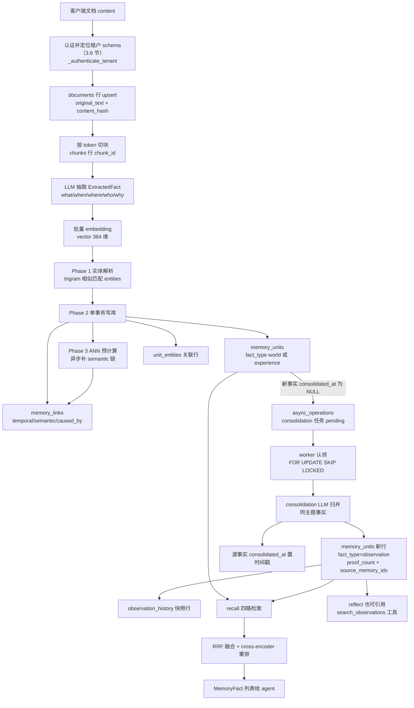
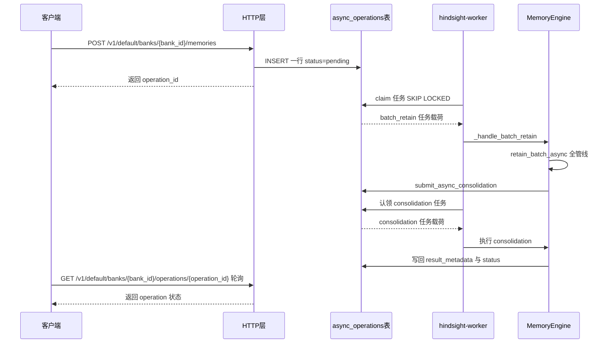
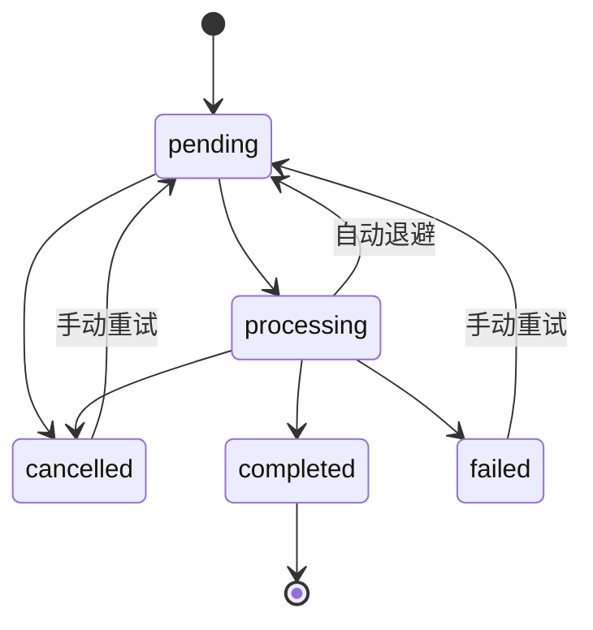

# Hindsight 源码庖丁解牛 · 01 总览与数据模型

> 研究对象：`E:\Codes\github-openSource\code-study\hindsight`（只读）
> 本篇范围：项目全景、三大操作编排骨架、PostgreSQL/Oracle 数据模型、bank 隔离与多方言分派机制。
> retain / recall / reflect / consolidation 各自**管线内部**的逐步拆解留给后续篇章，本篇只讲"骨架"与"落了哪些表"。
> 代码基线：`f7dd3f4fd`（v0.10.2，2026-10-03）；本篇已随 0.10.2 全量更新（原基线 `12f2d54f6`）。

---

# 第 1 层【全景】

## 1.1 Hindsight 是什么

Hindsight 是一个**给 AI agent 用的长期记忆系统**。核心思路：agent 在与用户交互过程中产生的对话、文档、事件，不再以原始文本形式整段塞回上下文，而是先被"消化"成一条条**原子事实（fact）**存进 PostgreSQL，再通过向量检索、BM25 关键词检索、图召回、时间检索四路并行 + 融合重排，把"最相关且最省 token"的记忆还给 agent；随着时间推移，后台任务还会把零散事实**归并成观察（observation）**，形成更凝练的知识。

它不是一个进程内的玩具库，而是一套完整的客户端-服务端系统：

- 服务端核心在 `hindsight-api-slim/`（FastAPI + asyncpg（PG 的异步驱动）直连 PostgreSQL，同时支持 Oracle 23ai），以 `hindsight-api`、`hindsight-worker`、`hindsight-local-mcp`、`hindsight-admin` 四个 CLI 入口发布（`hindsight-api/pyproject.toml:18-23`，与 `hindsight-api-slim/pyproject.toml:177-181` 一致）；
- `hindsight-worker` 是独立异步工作进程，从 `async_operations` 表认领后台任务（retain 异步批量、consolidation、图维护等）；
- `hindsight-control-plane/` 是 Next.js 管理界面；
- `hindsight-cli/`（Rust）提供命令行与 `hindsight fs mount`（把记忆库当只读文件系统挂载）；
- `hindsight-embed/` 支持嵌入式部署（自动拉起本地 PostgreSQL，即 pg0 模式，`memory_engine.py` 构造函数里对 `"pg0"` URL 的解析就是入口，`hindsight-api-slim/hindsight_api/engine/memory_engine.py:2592-2600`）；
- 其余目录（`hindsight-integrations/`、`hindsight-system-tests/`、`hindsight-clients/` 等）是框架集成、黑盒测试、生成式 SDK 客户端。

## 1.2 三大操作：retain / recall / reflect

引擎对外的主接口抽象在 `hindsight-api-slim/hindsight_api/engine/interface.py:37`（`MemoryEngineInterface`），实现在 `MemoryEngine`（`engine/memory_engine.py:2474`）。三个动词对应记忆的"写入、读取、推理"：

| 操作 | 入口方法 | 位置 | 一句话定义 |
|---|---|---|---|
| retain | `retain` / `retain_async` / `retain_batch_async` | memory_engine.py:6326 / 6357 / 6405 | 把文档切块、LLM 抽取事实、生成向量、解析实体、建链，写入数据库 |
| recall | `recall` / `recall_async` | memory_engine.py:8630 / 8672 | 四路并行检索 + RRF 融合 + cross-encoder 重排 + token 预算裁剪 |
| reflect | `reflect_async` | memory_engine.py:15039 | 一个只读的 agentic loop：LLM 用 recall / search_observations / search_mental_models / expand 等工具自主取材后作答 |

此外还有一个**非对外主打但至关重要的第四操作**：consolidation（归并/巩固）。它由 retain 完成后自动排队、由 worker 在后台执行（memory_engine.py:6826-6831，位于 retain 侧收尾钩子 `_submit_post_insert_maintenance` 内：:6802 定义、:6720 调用），把同主题的 `world`/`experience` 事实喂给 LLM，产出 `fact_type='observation'` 的归并记忆。此外还有一个相关操作：mental model 刷新（`refresh_mental_model`，memory_engine.py:17984）。mental model 是用户保存下来的 reflect 产物（2.6 节详述），刷新时复用与交互式 reflect 相同的管线（:15027-15037 的 `_llm_for_reflect_operation` 可佐证）。

## 1.3 bank 是什么

**bank = 一个完全隔离的记忆库**，相当于"某个人 / 某个 agent 的大脑"。每个 bank 有：

- 一个用户指定的 `bank_id`（字符串，即 `banks.bank_id` 主键）；
- 一组人格特质 `disposition`（怀疑度 skepticism / 字面度 literalism / 共情度 empathy，各 1-5，默认 3，见 `engine/retain/bank_utils.py:200-204` 的 `DEFAULT_DISPOSITION`）——只影响 reflect 的语气与推理，不影响 recall；
- 一个 `mission`（bank 的使命描述，早期叫 `background`，后被改名）；
- 一个 `config` JSONB（每 bank 可覆盖的层级化配置，如 chunk 大小、检索开关；层级是 全局 env → tenant 扩展 → banks.config，解析器在 `hindsight_api/config_resolver.py:5`）。

bank 行是**惰性创建**的：第一次向某 bank retain 时自动 `INSERT ... ON CONFLICT DO NOTHING`（`engine/retain/bank_utils.py:355-406`），并在创建时顺手为它建好专属向量索引（store-owned 的 bank 例外，见 3.6 的 #4659）。v0.10.2 起 bank 还可以挂**别名**：`bank_aliases` 表让一个 bank 额外响应若干旧 id，别名在 HTTP 边缘被一次性改写成真 id（3.5 节）。

## 1.4 仓库地图（抽查核实过的包职责）

| 目录 | 职责 | 核实依据 |
|---|---|---|
| `hindsight-api-slim/` | 核心服务端（引擎、HTTP、MCP、worker、alembic 迁移） | `pyproject.toml:177-181` 入口 |
| `hindsight-api/` | 发布壳包，转出同样 4 个 CLI 入口 | `hindsight-api/pyproject.toml:18-23` |
| `hindsight-all/`、`hindsight-all-slim/`、`hindsight-all-npm/` | 整包分发变体（npm 版内嵌本地 daemon） | 目录存在 + CLAUDE.md（未逐包核查内部代码） |
| `hindsight-control-plane/` | Next.js 管理台 | CLAUDE.md（本篇未深入） |
| `hindsight-cli/` | Rust CLI（progenitor 生成客户端） | CLAUDE.md（本篇未深入） |
| `hindsight-embed/` | 嵌入式 Python CLI / 本地 daemon 管理 | CLAUDE.md |
| `hindsight-integrations/` | 各框架/编码 agent 集成 | CLAUDE.md |
| `hindsight-system-tests/` | 黑盒 E2E：起真实服务进程走 SDK | CLAUDE.md |
| `hindsight-system-evals/` | LoComo/LongMemEval 等质量评测 | CLAUDE.md |
| `hindsight-extensions/`、`hindsight-tools/`、`hindsight-dev/` | 服务端扩展位、agent 工具 SDK、开发工具 | CLAUDE.md |

引擎内部的主要子包（`hindsight-api-slim/hindsight_api/engine/`）：

- `retain/`：摄取管线（切块 `fact_extraction.chunk_text`、抽取 `fact_extraction.py`、实体 `entity_processing.py`、建链 `link_creation.py`、总装 `orchestrator.py`）；
- `search/`：检索管线（`retrieval.py` 四路编排、`fusion.py` RRF、`reranking.py`）；
- `reflect/`：agentic loop（`agent.py`、`tools.py`、`prompts.py`）；
- `consolidation/`：后台归并（`consolidator.py`）；
- `memories/`：记忆存储抽象（`base.py` 接口 + 默认 Postgres 实现 `postgres.py` 与 `pg/` 分文件 SQL——`pg/` 下按域分 `retain.py`/`recall.py`/`links.py`/`entity_resolver.py`/`link_expansion.py`/`consolidation.py`/`transfer.py`/`admin.py`/`banks.py` 等文件，0.10.2 起它还收编了原 `engine/entity_resolver.py`、`retain/link_utils.py`、`search/link_expansion_retrieval.py`；schema.py 的 `_guard` 在运行期拦截 store 之外代码对这些表的直接 SQL，见 3.6 节）。允许用 `HINDSIGHT_API_MEMORIES_EXTENSION` 换成完全外置的 store，见 `memories/__init__.py:43-67`；
- `storage/`：附件字节的文件存储后端抽象（`FileStorage` 接口 + `postgresql.py`/`s3.py`/`gcs.py`/`azure.py` 四实现，键形如 `banks/{bank_id}/files/{file_id}.pdf`）；
- `transfer/`：bank/文档的导出、导入与流式归档（1.6 节）；
- `db/`：数据库后端抽象与方言分派（本篇 3.7 节主角）。

## 1.5 本模块解决什么问题

一句话：**让"agent 的记忆"在数据库里有一个既适合向量检索、又适合图遍历、又适合时间过滤、还能自我归并的结构**。本篇回答五个必答问题（速答表见第 4 节）：

1. fact 的数据形态到底是什么？
2. 实体图和记忆链接是怎么存的？
3. 一次 retain 最终落在哪几张表？
4. banks 表里除了 bank_id 还有什么？
5. 多租户/多 bank 在 DB 层怎么区分？

## 1.6 bank 可以整体带走：transfer 与 storage 子系统（0.10.2 主打）

`engine/transfer/` 回答"一个 bank 的全部记忆能否搬走"。数据模型视角的答案（`transfer/schema.py` 的 `TransferScope` docstring 原文概括）：

- **导出物是一个 ZIP 归档**（`export.py:736` 的 `export_bank` / `:869` 的 `build_bank_archive`，流式版本 `stream_export_bank` 在 :497），`data/` 目录装记忆与由它派生的一切：documents、chunks、memory_units（含 observation）、entities/links、附件及其字节（`blobs/`）、策展冷归档 `invalidated_memory_units`、异步操作日志与两个图维护队列、mental models 及其刷新历史与 knowledge_pages 树。`audit_log`/`llm_requests`（`HISTORY_TABLES`，schema.py:30）与 `mental_model_history`（:29）随行。
- **归档里刻意没有 embedding 和数据库 id**——导入端重放 retain 的确定性半程：用*目标* bank 的 embedding 模型重新生成向量、重跑实体解析（Phase 1）与事实/链接写入（Phase 2），时序/语义/因果链接按目标 bank 现有记忆重新计算，全程不调 LLM（`importer.py:1-6`）。consolidation 产物默认不导出（"它们是派生物，目标 bank 会重新归并出来"，`transfer/__init__.py:9-11`）。
- **大 bank 不再整包进内存**：`stream_archive.py` 用 PKZIP Bit 3 数据描述符手写了约 270 行流式 ZIP 写入器（头部不回填 CRC/尺寸，因此不需要 seek），替代 `zipfile.ZipFile`——后者在大 bank 导出时曾触发数 GB 内存峰值与容器 OOM（#4689）；0.10.2 后期导入侧又做了分批写入与崩溃后的干净重试（#5091）。

`engine/storage/` 则是附件字节落在哪的抽象：`FileStorage` 接口（`storage/base.py`）有 `postgresql.py`/`s3.py`/`gcs.py`/`azure.py` 四个实现（基于 obstore）；`file_storage`/`attachments` 两张表只存元数据与键，字节本体在后端里。transfer 的归档文件也借这条路暂存——异步导入任务载荷里只有 `storage_key`，worker 取回归档再重放（memory_engine.py:3566 起 `_handle_import_documents`）。

机制层（导出/导入端点、归档格式细节、conflict 策略）留给 06 篇展开；本篇只关心它印证的数据模型结论：**bank 的全部状态都落在 3.1 节那张表清单里，且其中 embedding 是可重建的派生物**。

---

# 第 2 层【主流程】：一条记忆的生命周期

## 2.1 全生命周期数据流图



要点：上半部分是 retain 的三个阶段（Phase 1 读密集的实体解析、Phase 2 写事务、Phase 3 异步 ANN 语义建链，阶段划分见 `engine/retain/orchestrator.py:2752` 附近与 `:2840`、`:2991-3010` 的注释）。memory_units 之后分出三条支路：**Q→W→C→OBS→MARK/H** 是 consolidation 的闭环——它消费的是**同一张 `memory_units` 表**里的未归并事实，产出也是**同一张表**里 `fact_type='observation'` 的新行，只是多了 `proof_count` 与 `source_memory_ids` 两本账；**MU/OBS→R→RF→OUT** 是 recall 的消费侧（2.4 节）；**OBS→RE** 表示 reflect 也能通过 search_observations 工具引用 observation。

## 2.2 异步 retain 的时序（含 worker 分工）

同步 retain 直接在 HTTP 进程里跑完管线；`async=true` 或批量文件摄取时走下面的队列路径：



入口与状态机依据：`submit_async_retain`（memory_engine.py:22148）、`_handle_batch_retain`（memory_engine.py:3981）、`submit_async_consolidation`（memory_engine.py:22565，`operation_type="consolidation"` 在 :22627）；认领使用 `FOR UPDATE SKIP LOCKED`（`engine/db/ops_postgresql.py`：consolidation 专用认领 :1598-1638、通用认领 `_claim_shared_tasks` :1751 起）。`async_operations.status` 的 CHECK 约束为 `pending / processing / completed / failed / cancelled`（初始迁移 :225-239 定义前四种，`i4j5k6l7m8n9_add_cancelled_status` 追加 cancelled；oracle 基线 :304 汇总为五值 CHECK）：



（三条回边分属两条通道。**自动退避**：worker 把失败任务放回 `status='pending'` 并写 `next_retry_at`（`worker/poller.py:1024` 直接 SET），认领 SQL 用 `next_retry_at IS NULL OR next_retry_at <= NOW()` 作时间闸门（`engine/db/ops_postgresql.py:1614`，第二分支 :1631），重试计数累加在 `retry_count`。**手动重试 API**（`POST .../operations/{operation_id}/retry` → `retry_operation`，memory_engine.py:21251 起，SET pending 在 :21281）才允许 `failed`/`cancelled` 回到 `pending`。取消侧：`pending` 与 `processing` 都可被置为 `cancelled`（memory_engine.py:21208-21223）。另：`_has_other_pending_consolidation`（memory_engine.py:21817）说明同 bank 的 consolidation 会去重排队。）

什么情况才落 `failed`？两种：错误被判定为**不可重试**（如确定性约束违规、provider 内容策略拒绝，memory_engine.py:1563 的 `_is_non_retryable_task_error`），或**重试次数达到上限**（`worker/poller.py:1280-1283`：超过 retry budget 的行移入 `failed`，"让一个会杀死 worker 的任务不能被永远重新认领"，#2675/#2834）——否则一个会杀死 worker 的任务会被永远重新认领。

## 2.3 retain 的编排骨架与依赖注入

`MemoryEngine.__init__`（memory_engine.py:2485 起）接受 29 个可选参数——DB URL、四组 LLM 配置（memory/retain/reflect/consolidation 各自可独立配置 provider/model，未传则回落到 memory_llm_*）、embeddings、cross_encoder、query_analyzer、task_backend、operation_validator、tenant_extension。这是典型的**构造器依赖注入**：所有协作者都可以在进程启动时被替换，缺省时从 env 配置构建。三个值得注意的注入点：

1. **tenant_extension**：多租户认证钩子（默认 `DefaultTenantExtension` 无认证、固定 schema，`extensions/builtin/tenant.py:8-42`）；
2. **operation_validator**：每个 retain/recall/reflect 进入管线前先问一次扩展"允许吗"（异步 retain 提交路径的 `validate_retain` 在 memory_engine.py:22188，reflect 的 `validate_reflect` 在 :15152，recall 读路径的 `validate_bank_read` 汇聚在 :3227）；
3. **task_backend**：默认 `BrokerTaskBackend`（基于数据库队列，`engine/db/base.py:291-295`），worker 与 API 共用同一张队列表。

`retain_async` 只是 `retain_batch_async` 的单项包装（memory_engine.py:6390-6397）；真正的批处理入口再委派给 `engine/retain/orchestrator.py` 的 `retain_batch`（orchestrator.py:1351）。分层方式是：**engine 方法做认证/校验/分批/会话管理 → orchestrator 做管线阶段编排 → fact_extraction / memories/pg 的写入器做单阶段实现**。引擎与存储的关系则通过 `get_memories()` 进程级单例解析（`memories/__init__.py:61-67`）：Postgres 存储是默认值，SQL 路径由 `memories/pg/` 直写。若换成"拥有存储"的外部实现（存储本体在远端，由它自己负责写库），写路径会改走 `RetainSession`：引擎把整批 retain 的部件累加进一个 session 对象、最后由外部存储一次性提交（session 类在 `memories/base.py:480`、开启钩子 `begin_retain` :1115；engine 侧在 memory_engine.py:6961-6966 开启，orchestrator.py:3049-3057 的分支把每个批次的部件交给它）。读路径在 0.10.2 也补齐了对称性：`_store_read_conn` 对 store-owned 的 bank 返回 None，读取直接交给 store 在自己的后端连接上做，不再为一次远端调用占着连接池里的 PG 连接（#4620）。

## 2.4 recall 的四路并行

`recall_async` 委派给内部检索实现 `_search_with_retries`，后者的架构注释（memory_engine.py:9143-9148）自述六步（`recall_async` 本体 docstring :8706-8713 只列五步——五步版的第 5 步是 Token Filter，六步版在原第 4、5 步之间插入 Chunks 作新第 5 步）：

> 1. Retrieval: 4-way parallel (semantic, keyword, graph, temporal graph)
> 2. Merge: RRF to combine ranked lists
> 3. Reranking: Pluggable strategy (heuristic or cross-encoder)
> 4. Diversity: MMR with λ=0.5
> 5. Chunks: Fetch chunks from top-scored results (BEFORE token filtering)
> 6. Token Filter: Limit facts to max_tokens budget

（注意：上面第 4 步的 MMR 只存在于 docstring——全库 grep 无任何 MMR/多样性实现，仅 memory_engine.py:8712 与 :9146 两处注释残留。实际重排见下。）

四路对应：语义向量（`memory_units.embedding` 上的 HNSW——Hierarchical Navigable Small World，分层可导航小世界图——或磁盘 ANN）、BM25 关键词（`search_vector`，可换 vchord/pgroonga/pg_search 等后端）、图召回（link expansion：沿 `memory_links`/`unit_entities` 扩展，实现 `memories/pg/link_expansion.py`，原 `search/link_expansion_retrieval.py` 已移入 store）、时间臂（occurred 区间 / mentioned_at，入口 SQL 见 `memories/pg/recall.py:368-495` 的 `retrieve_temporal_combined_sql`，不含 event_date）。融合用经典 RRF（Reciprocal Rank Fusion，倒数排名融合），k=60（签名在 `search/fusion.py:29`，累加式 `rrf_scores[doc_id] += 1.0 / (k + rank)` 在 :85）；重排是 cross-encoder（把 query 和候选句成对喂给模型打分的重排器）归一化分再乘 recency/temporal/proof_count 三重 boost（`search/reranking.py:195-198`：`combined_score = CE_normalized * recency_boost * temporal_boost * proof_count_boost`）。`budget` 参数（LOW/MID/HIGH，memory_engine.py:8877-8878，固定档默认 100/300/1000）控制图遍历的节点预算。每个 fact_type 都跑一遍四路，所以 docstring 说 "N*4-way"（memory_engine.py:8706）。

## 2.5 贯穿例子一：一次 retain 落了哪些表（示例数据）

> 以下所有数据均为**示例**，字段名与代码一致。

客户端调用（对应 `retain_batch_async` 的 contents 形状——per-item 的 `tags`/`metadata` 是 `RetainContentDict` 的合法键，类型定义见 `engine/retain/types.py:112` 起；memory_engine.py:6434-6437 的 docstring 只列了四个基础键）：

```text
bank_id = "alice-assistant"
contents = [{"content": "昨天 Alice 在巴黎见了 Marie。Marie 说项目 Atlas 下月上线。",
             "context": "日常对话",
             "document_id": "chat-2026-03-01",
             "tags": ["chat"],
             "metadata": {"source": "chat"}}]
```

管线的中间产物与最终落表（每张表列名以 oracle 基线迁移 `alembic/versions/o1a2b3c4d5e6_oracle_baseline.py` 与 0.10.2 起收编进 store 的写入器为准：documents 在 `memories/pg/retain.py:264-266`、chunks 在 :486 起、facts 批量 INSERT 在 `db/ops_postgresql.py:148-215` 的 `insert_facts_batch`）：

1. **documents** 1 行：`id="chat-2026-03-01"`, `bank_id="alice-assistant"`, `original_text=<全文>`, `content_hash=<sha>`, `tags=["chat"]`。
2. **chunks** N 行：`chunk_id` 是三元组 `(bank_id, document_id, chunk_index)` 的**可逆扁平化**字符串，只有 `~` 与 `_` 两个字符被转义（`_`→`~5F`，`~`→`~7E`，`engine/chunk_ids.py:1-20` 明确写了 naive `f"{bank}_{doc}_{index}"` 不单射导致过跨 bank 覆盖的事故 #4244）。示例：若 `document_id` 为 `chat_2026-03-01`（含下划线），chunk_id 为 `alice-assistant_chat~5F2026-03-01_0`；不含 `_`/`~` 的 id 原样拼接——本例输入用的 `chat-2026-03-01` 正属此类，chunk_id 即 `alice-assistant_chat-2026-03-01_0`（换 id 只为演示转义规则）。
3. **memory_units** 2 行（LLM 抽出 2 条事实）：

| 列 | 行 1（示例） | 行 2（示例） |
|---|---|---|
| id | UUID（`gen_random_uuid()`） | UUID |
| text | "Alice 昨天在巴黎见了 Marie" | "Marie 计划项目 Atlas 下月上线" |
| fact_type | `experience`（谁经历过的事） | `world`（客观事实） |
| event_date / occurred_start / occurred_end | 2026-02-28（LLM 从"昨天"解析出——发言日即 document_id/mentioned_at 所示的 2026-03-01，此处取其前一天） | occurred_start≈2026-04（"下月"的范围） |
| mentioned_at | 2026-03-01（被提及时间） | 2026-03-01 |
| embedding | vector(384) | vector(384) |
| chunk_id / document_id | 指回上面两表 | 同左 |
| tags | ["chat"] | ["chat"] |
| metadata | `'{"source":"chat"}'`（JSONB，用户自定义 str→str） | 同左 |
| consolidated_at | NULL（未归并） | NULL |

`experience`/`world` 之外的取值历史（`bank`→`experience` 改名、`opinion` 移除、`mental_model`→`observation` 改名）见 3.9 节考古（`opinion` 的移除过程见第 5 节第 1 条的定论）；当前 CHECK 为 `fact_type IN ('world','experience','observation')`（models.py:165、oracle 基线 :133）。

4. **entities** 2-3 行：`canonical_name="Marie"`、`"Paris"`…（LLM 抽出的实体串经 trigram——把字符串切成三字符片段做模糊匹配，靠 PG 的 `pg_trgm` 扩展加速——相似度与库内既有实体归并，`memories/pg/entity_resolver.py:804` 的 `_resolve_entities_batch_trigram`，trigram 工具函数在 `engine/trigram.py`；每个 bank 内 `UNIQUE (bank_id, LOWER(canonical_name))`，初始迁移 :263）。`mention_count`、`first_seen`、`last_seen` 随出现累加。
5. **unit_entities** 若干行：`(unit_id, entity_id)` 二元组主键，把每条事实与它提到的实体连起来。
6. **memory_links** 若干行：
   - `temporal`：同批事实按 occurred 时间邻近互连（`retain/link_creation.py:15-35`）；
   - `semantic`：embedding 余弦相似超过阈值的事实对（同文件 :38-81；ANN 预计算放在 Phase 3 异步补链）；
   - `caused_by`：LLM 抽取的因果对——`ExtractedFact.causal_relations`（fact_extraction.py:284-286）的契约把 `relation_type` 钉死为 `Literal["caused_by"]`（fact_extraction.py:256），写入见 `link_creation.py:84-97`（:90 注释：retain 只写 canonical 的 caused_by 关系）；`causes`/`enables`/`prevents` 是 CHECK 保留的历史值，retain 现已不写（见 3.4）；
   - `entity`：CHECK 保留的类型（经实体相连的事实对）——存量行已被 `e9b2c7d1f3a4` 清空且 retain 不再写，实体关联此后只走 `unit_entities`（见 3.4）。
   权重 `weight` 被 CHECK 限定在 [0,1]（初始迁移 :474）。
7. （异步路径时）**async_operations** 1 行 `operation_type='batch_retain'`，跑完后 `result_metadata` 里记录 `unit_ids`、`document_ids`（memory_engine.py:5287 `_write_retain_outcome_metadata`、orchestrator.py:84-97 的 `jsonb_set` 追加 document_ids）。

之后 `enable_observations && enable_auto_consolidation` 时，收尾钩子再排一个 consolidation 任务（memory_engine.py:6826-6831）。

## 2.6 贯穿例子二：consolidation 把两条事实归并成一条 observation（示例数据）

worker 认领 consolidation 任务后执行 `run_consolidation_job`（memory_engine.py:12383-12387 委派）。归并引擎的自述（`engine/consolidation/consolidator.py:1-16`）值得全文摘录，因为它同时澄清了"observation vs mental model"这对最容易混的术语：

```python
"""Consolidation engine for automatic observation creation from memories.

The consolidation engine runs as a background job after retain operations complete.
It processes new memories and either:
- Creates new observations from novel facts
- Updates existing observations when new evidence supports/contradicts/refines them

Observations are stored in memory_units with fact_type='observation' and include:
- proof_count: Number of supporting memories
- source_memory_ids: Array of memory UUIDs that contribute to this observation
- history: JSONB tracking changes over time

NOTE: Observations are distinct from mental models (pinned reflections).
- Observations: auto-generated bottom-up by this engine from raw facts (memory_units table, fact_type='observation')
- Mental models: user-defined queries stored in the mental_models table, refreshed on demand via reflect
"""
```

- 1-5 行：定位——retain 之后由后台任务执行，产出/更新 observation；
- 7-10 行：observation 的三本账（佐证数、来源 UUID 数组、历史）；
- 12-16 行：**observation 与 mental model 是两个东西**——前者是自底向上自动归并、住在 `memory_units`；后者是用户定义查询、住在 `mental_models` 表。

继续例子一：当 Alice 与 Marie 的互动再次被 retain（如"Marie 确认 Atlas 3 月 20 日上线"），consolidation 把同主题事实成批交给 LLM 归并，产出**示例**：

| 列 | observation 行（示例） |
|---|---|
| text | "Marie 负责的项目 Atlas 预计 2026 年 3 月下旬上线" |
| fact_type | `observation` |
| proof_count | 2 |
| source_memory_ids | `["<行1 UUID>", "<行2 UUID>"]`（uuid[]，GIN 索引见 `a2b3c4d5e6f8` 迁移） |
| consolidated_at（源事实） | now()（两条源事实被打上归并时间戳） |
| observation_scopes | JSONB，按 tags 划分观察范围的口径（`z1u2v3w4x5y6`/`b4c5d6e7f8a9` 迁移） |

写入 SQL 的实锤（0.10.2 的 store 收编后，这条 INSERT 迁到 `memories/pg/consolidation.py:300-308`，native 全文检索分支，SQL 原文未变）：

```sql
INSERT INTO {fq_table("memory_units")} (
    id, bank_id, text, fact_type, embedding, proof_count, source_memory_ids,
    tags, event_date, occurred_start, occurred_end, mentioned_at, search_vector
)
VALUES ($1, $2, $3, 'observation', $4::vector, 1, $5, $6, $7, $8, $9, $10,
        to_tsvector('{config.text_search_extension_native_language}'::regconfig, COALESCE($3, '')))
RETURNING id
```

注意这条 SQL 是**新建** observation 的首插：`proof_count` 从 1 起步；示例表里的 2 是源事实再次出现、走更新路径重算（`memories/pg/consolidation.py:115` 用 `count(DISTINCT…)` 按来源数组重算）之后的终态。

同一事务里还会：把每次变更快照进 **observation_history**（consolidator.py:2722；两方言都写，受 `enable_observation_history` 配置门控）；**observation_sources** 结对表则 PG 跳过、仅 Oracle 写入（consolidator.py:2860；差异原因见 `db/ops.py:346-347` 的能力开关——PG 用原生数组列 `source_memory_ids` 读，Oracle 用联结表）；最后触发向量索引维护（memory_engine.py:6837-6838）。

recall 时 `prefer_observations=True` 可以把"已被 observation 收编的原始事实"去重掉——实现位于检索后处理的"Step 4.8: prefer-observations dedup"（memory_engine.py:9947-9952，按 provenance 去重并回填 freed slots；参数注释 :8719-8722 说明仅当 observation 与原始类型同时被请求时生效）。

---

# 第 3 层【机制深潜】

## 3.1 全部表清单与分组

按迁移树（110 个版本，HEAD=`e5b1c7d3a902_merge_trgm_index_and_reasoning_tokens`）与 oracle 基线汇总，当前 PG schema 内共存 25 张表，分四组（另有 `observation_sources` 为 Oracle 专属，合计 26）：

**记忆核心**（任何方言都有）：
- `banks` —— 库的元数据与配置
- `bank_aliases` —— bank 的额外 id（别名路由表，0.10.2 新增，两方言都有，`c8d1e4f7a20b` + `d4f8b1c6e903`；PK 是 `alias` 本身、`bank_id` FK 级联删除，`is_primary` 标记 UI 展示别名，每 bank 至多一个由部分唯一索引保证；行仅用于路由——解析时在 HTTP 边缘改写回真 id，任何业务行都不会存别名，3.5/3.6 节详述）
- `documents` —— 原始文档
- `chunks` —— 文档切块
- `memory_units` —— 事实/观察（系统的中心表）
- `invalidated_memory_units` —— 策展下架事实的冷归档（`c9a1b2d3e4f5`；注释明确"recall 热路径永远看不到它们"，且刻意不存 embedding，回滚时重算，oracle 基线 :142-147）
- `entities` / `unit_entities` / `entity_cooccurrences` —— 实体图
- `memory_links` —— 事实间带类型带权边

**知识层**：
- `mental_models` —— 用户保存的 reflect 产物（"钉住的"模型/文档），带 `subtype`（当前插入固定写 `'pinned'`，memory_engine.py:16883-16886）与 `last_refresh_failed_at`（0.10.2 新增，`b8d3f1a6c2e4`：上次刷新失败的"墓碑"，自动触发器看到它就暂停重排刷新，#4532）
- `mental_model_history` / `observation_history` —— 变更快照（`a7b8c9d0e1f2` 把原先的 JSONB history 列拆成独立表）
- `directives` —— 行为规则（name/content/priority/is_active/tags，oracle 基线 :271-284；插入语句见 memory_engine.py:20725-20731）
- `knowledge_pages` —— 知识库树（folder/page 两类节点，`parent_id` 自关联级联删除，页面可挂到 mental_models 上，`a9b8c7d6e5f4:44-67`）
- `mental_model_versions` —— mental_models 的 observation 快照表，供 changelog/diff（`j5e6f7g8h9i0` 创建）
- `observation_sources` —— observation↔source 结对表（仅 Oracle 使用，`k6l7m8n9o0p1`）

**运行系统**：
- `async_operations` —— 数据库队列（worker 认领/心跳/重试/序列化键）
- `llm_requests` —— 逐次 LLM 调用追踪：**默认开启**（默认保留 1 天，`HINDSIGHT_API_LLM_TRACE_ENABLED=false` 可关），PG 专属（`d3e4f5a6b7c8`；注意该迁移头注释写的 "Disabled by default" 是过时残留，现行默认以 config.py:1984 `DEFAULT_LLM_TRACE_ENABLED = True` 为准）；0.10.2 起多一列 `thoughts_tokens`（推理 token 数，`a6c4e8f1b203`，PG-only）
- `webhooks` —— 事件订阅（投递记录复用 async_operations，`e4f5a6b7c8d9:4`）
- `file_storage` / `attachments` —— 附件字节与附件元数据（`a1b2c3d4e5f6`、`e2f4a6c8b0d1`；`a7c2e9f41b60` 把附件改为按 document 直接拥有——键为 (bank_id, document_id, attachment_hash)——并在 `_pg_upgrade` :119 DROP 了旧的 `document_attachments` 边表，该表已不存在；字节本体落在 1.6 节的 `engine/storage/` 后端里）
- `audit_log` —— 操作审计
- `graph_maintenance_queue` / `entity_maintenance_queue` —— 图维护工单（`b5a4c3e2f1d8`、`c4f7a91b2d38`）
- `bank_stats_cache` —— 统计缓存（`b57a7c9e0d13`）

一个重要的阅读提醒：`hindsight_api/models.py` 里的 SQLAlchemy ORM（7 个模型类）**并不是运行时的读写通道**。全引擎的 SQL 都是 asyncpg 手写语句；`models.py` 在运行期只贡献 `RequestContext`（各处 `from ..models import RequestContext`），`Base.metadata` 则被 alembic `env.py:45` 挂为 `target_metadata`。而且 ORM 与迁移终态已经漂移——例如 `Bank` 模型还有 `background` 列（models.py:335），而迁移 `h3c4d5e6f7g8` 已把它改成 `mission`；`MemoryUnit` 模型缺 `chunk_id/tags/proof_count/source_memory_ids/observation_scopes/text_signals/consolidated_at` 等后来加的列（0.10.2 加的 `bank_aliases` 表也完全没有 ORM 镜像）。**看真实 schema 要看迁移与 SQL，不要只看 models.py**——这是读这个代码库最容易踩的第一个坑。

## 3.2 memory_units 逐字段意图（必答问题 1 的完整答案）

`memory_units` 是整个系统的中心表。字段全集（以 oracle 基线 :97-140 + PG 侧迁移/INSERT 为准）：

| 字段 | 类型（PG） | 意图 |
|---|---|---|
| `id` | UUID PK | 事实标识 |
| `bank_id` | TEXT NOT NULL | 所属 bank（行级隔离键） |
| `document_id` | TEXT NULL | 溯源到 documents（复合 FK `(document_id,bank_id)` 级联删除，初始迁移 :286-291） |
| `chunk_id` | TEXT NULL | 溯源到 chunks。FK 行为经历了变更：`b7c4d8e9f1a2` 建 SET NULL → `f6g7h8i9j0k1` 在 PG 上改 **CASCADE**（chunk 行删除时引用它的 memory_units 行一并删除——迁移自述：SET NULL 会留下 chunk_id=NULL 的 ghost 行；"事实保留但断链"是旧行为）。该迁移无 Oracle 槽，oracle 基线 :132 仍为 SET NULL |
| `text` | TEXT NOT NULL | 事实正文（1-2 句原子陈述） |
| `embedding` | vector(384) | 语义向量；384 是默认维度 `DEFAULT_EMBEDDING_DIMENSION = 384`（config.py:1271；:2082 的 `EMBEDDING_DIMENSION` 只是它的模块级别名） |
| `context` | TEXT NULL | "这条记忆在什么背景下形成"的用户描述 |
| `event_date` | TIMESTAMPTZ NOT NULL | 历史主时间轴（注释"kept for backward compatibility"，models.py:133-135） |
| `occurred_start` / `occurred_end` | TIMESTAMPTZ NULL | 事件发生区间（支持"去年到今年"这种跨度） |
| `mentioned_at` | TIMESTAMPTZ NULL | 该事实被提及的时间 |
| `fact_type` | TEXT CHECK 三值 | `world`（客观）/`experience`（经历）/`observation`（归并产物） |
| `tags` | VARCHAR[] DEFAULT '{}' | 可见性标签（recall 按 any/all/exact 匹配） |
| `observation_scopes` | JSONB NULL | observation 按 tag 组合的归并口径 |
| `metadata` | JSONB DEFAULT '{}' | 用户自定义 str→str bag（`unit_metadata` 是 Python 名，列名是 `metadata`，models.py:142-144） |
| `proof_count` | INTEGER DEFAULT 1 | observation 的佐证事实数 |
| `source_memory_ids` | UUID[] | observation 的来源事实 id 数组（正反向索引：`a2b3c4d5e6f8` 建 GIN，`d4e5f6g7h8i9` 关 fastupdate） |
| `text_signals` | TEXT NULL | 把实体名等信号拼接进 BM25 文档的"加料串"（`a2b3c4d5e6f7` 迁移注释：避免污染事实原文） |
| `attachment_ids` | TEXT[] DEFAULT '{}' | 事实引用的附件 id |
| `consolidated_at` | TIMESTAMPTZ NULL | 该事实何时被归并进 observation（`s4n5o6p7q8r9`；未归并判定就用它 IS NULL） |
| `consolidation_failed_at` | TIMESTAMPTZ NULL | 归并失败的"墓碑"（`a3b4c5d6e7f8`；配合 `backsweep_orphan_observations` 维护例程） |
| `edited_at` | TIMESTAMPTZ NULL | 人工编辑时间（策展，`c9a1b2d3e4f5`） |
| `search_vector` | tsvector / bm25vector / TEXT | 全文检索列，形态随 `HINDSIGHT_API_TEXT_SEARCH_EXTENSION` 变化（初始迁移 :308-332：native 为 `GENERATED ALWAYS AS to_tsvector('english', COALESCE(text,'') || ' ' || COALESCE(context,''))` STORED） |
| `created_at` / `updated_at` | TIMESTAMPTZ | 时间戳 |

所以"fact 的数据形态"一句话概括：**一行 `memory_units` = 原子事实文本 + 三值类型 + 三段时间戳（event_date 主轴 / occurred_start-end 发生区间 / mentioned_at 提及时间）+ 384 维向量 + BM25 信号 + 标签/元数据/来源溯源（document/chunk/attachment）+（若是 observation）佐证账本**。引擎在"拥有存储"的抽象层里把同一形态建模为 `FactRecord`（`engine/memories/base.py:517-560` 附近），注释直言"FactRecord 背后并不对应某一行已存在的数据——记录的全部内容就在这个对象里"（原话 "There is no row behind this — it is the *whole* record"，:520-523），并把 `entity_ids`、`causal_edges` 这些本该成为 `unit_entities`/`memory_links` 行的边一起随身携带。

抽取端（LLM 契约）与存储端（行）之间的桥是 `ExtractedFact`（`engine/retain/fact_extraction.py:261-301`）：

```python
class ExtractedFact(BaseModel):
    """A single extracted fact."""

    model_config = ConfigDict(
        json_schema_mode="validation",
        json_schema_extra={"required": ["what", "when", "where", "who", "why", "fact_type"]},
    )

    what: str = Field(description="Core fact - concise but complete (1-2 sentences)")
    when: str = Field(description="When it happened. 'N/A' if unknown.")
    where: str = Field(description="Location if relevant. 'N/A' if none.")
    who: str = Field(description="People involved with relationships. 'N/A' if general.")
    why: str = Field(description="Context/significance if important. 'N/A' if obvious.")

    fact_kind: str = Field(default="conversation", description="'event' or 'conversation'")
    occurred_start: str | None = Field(default=None, description="ISO timestamp for events")
    occurred_end: str | None = Field(default=None, description="ISO timestamp for event end")
    fact_type: Literal["world", "assistant"] = Field(
        description="'world' = objective/external facts, ... 'assistant' = actions, ... "
    )
    entities: list[str] = Field(
        default_factory=list, description='People, places, concepts - plain strings, e.g. ["Alice", "Kubernetes"]'
    )
    causal_relations: list[FactCausalRelation] | None = Field(...)
```

（0.10.2 起类上多了一个 `model_config`（结构化输出 schema 收紧），以及一个 `from_attachments: list[int] | None` 字段——附件事实用 ATTACHMENTS 列表里的编号引用出处，fact_extraction.py:293-300。）

- `what/when/where/who/why` 五元组是给 LLM 的**结构化输出契约**；落库时 `what` 去往 `text`，`when/where/who/why` 主要用于解析出 `occurred_start/end`、实体与上下文；
- 注意抽取期 LLM 的类型词是 `world`/`assistant`，存储期的三值 `world/experience/observation` 是引擎侧归一化的结果——这是读代码时第二个容易困惑的点；
- `causal_relations` 允许事实在**同一批内**引用先前事实的下标（`target_index < 本事实下标`），随后变成 `caused_by` 边（`link_creation.py:90-97`：retain 只写 canonical 的 caused_by 关系）。

## 3.3 一次 retain 的写入 SQL 实样

PG 的批量事实插入是单条 `INSERT ... SELECT FROM unnest(...)`（`engine/db/ops_postgresql.py:182-215`，节选）：

```sql
WITH input_data AS (
    SELECT * FROM unnest(
        $2::text[], $3::vector[], $4::timestamptz[], $5::timestamptz[], $6::timestamptz[], $7::timestamptz[],
        $8::text[], $9::text[], $10::jsonb[], $11::text[], $12::text[], $13::jsonb[], $14::jsonb[], $15::text[],
        $16::jsonb[]
    ) AS t(text, embedding, event_date, occurred_start, occurred_end, mentioned_at,
           context, fact_type, metadata, chunk_id, document_id, tags_json,
           observation_scopes_json, text_signals, attachment_ids_json)
)
INSERT INTO {table} (bank_id, text, embedding, event_date, occurred_start, occurred_end, mentioned_at,
                     context, fact_type, metadata, chunk_id, document_id, tags,
                     observation_scopes, text_signals, attachment_ids{sv_insert_col})
SELECT $1, text, embedding, ... FROM input_data
RETURNING id
```

- 15 个并列数组（$2–$16）一次展开成 N 行，`bank_id` 是不进 unnest 的标量参数 $1——共 16 个绑定参数：一整批事实**一次往返**写完，这是"批量 retain 远快于逐条 retain"的物理原因（retain_batch_async docstring 自述四个理由之一，memory_engine.py:6425-6429）；
- `tags`/`attachment_ids` 走 JSON 中转再 `array_agg` 展开，因为 asyncpg 不能直接绑定 list-of-list 到 `text[][]`（:205-210 注释）；
- 同一张表在 Oracle 上语义仍是逐行 INSERT（ops.py:428 原话 "Non-PG inserts row-by-row with individual RETURNING"），但驱动层用 `executemany` 把这些行打包成一次批量执行（ops_oracle.py:113-114 注释：客户端先生成 UUID，换来单次网络往返）——省的是网络往返，不是语句。

## 3.4 实体图与记忆链接是怎么存的（必答问题 2）

图一共三层，各司其职：

**第一层：实体词典 `entities`**
每个 bank 一份实体注册表：`canonical_name`（归一化名）、`mention_count`、`first_seen/last_seen`。归并的关键约束是**bank 内大小写不敏感唯一**：`CREATE UNIQUE INDEX idx_entities_bank_lower_name ON entities (bank_id, LOWER(canonical_name))`（初始迁移 :263）。新名字进来时按 trigram 相似度在库内找近亲（PG 策略 `"trigram"`，ops_postgresql.py:1295；Oracle 用 `UTL_MATCH.JARO_WINKLER_SIMILARITY` 阈值 70/100，`memories/pg/entity_resolver.py:951-984`——0.10.2 把该文件从 `engine/entity_resolver.py` 移入 store），相似则复用旧行、否则新建。`entity_kind` 列区分 `regular`/`label`（标签型实体只允许精确匹配，`b3e8d1c6f4a9` 迁移头注释解释了为什么模糊匹配绝不能合并标签值）。0.10.2 还把模糊匹配的 trigram 索引从"只覆盖 LOWER(name)"换成了**bank 内复合**的 `btree_gin (bank_id, LOWER(canonical_name))`（`7c2e5a9d1f40`，PG-only）——迁移头注释给出的实测：11.3M 实体表上一次探查原要扫全部 bank 约 0.55 秒、20 个名字 12 秒，加 bank 维度后最大 bank 降到 2.6 秒。

**第二层：事实↔实体的二部图 `unit_entities`**
`(unit_id, entity_id)` 双主键、双侧 `ON DELETE CASCADE`。它回答"哪些事实提到了 Marie"。历史上 `memory_links` 还承载 `link_type='entity'` 的行（经实体相连的事实对），后被 `e9b2c7d1f3a4` 全量删除（:56、:79 的 `DELETE FROM memory_links WHERE link_type = 'entity'`），实体关联此后只走 `unit_entities`。

**第三层：事实↔事实的带权有向边 `memory_links`**
主键是四元组 `(from_unit_id, to_unit_id, link_type, entity_id)`（entity_id 可空，用 `COALESCE(entity_id, nil-uuid)` 做唯一索引，初始迁移 :477-479）。类型被 CHECK 钉死为七种：`temporal, semantic, entity, causes, caused_by, enables, prevents`（models.py:308-310 的注释特意说明 retain 只写 `caused_by`，其余因果值保留是为了让历史行和 transfer 归档仍可查询）。`weight` ∈ [0,1]。Oracle 基线显示它后来还加了 `bank_id`、`source_memory_ids` 列（:220-236；`c5d6e7f8a9b0` 加 bank_id 的动机写在迁移头注释 :3-5：stats 端点的 JOIN 曾耗时 18 秒以上，把 bank_id 过滤下推到 link 行才能走索引）。

辅助缓存：`entity_cooccurrences` 用 `CHECK (entity_id_1 < entity_id_2)` 按固定方向只存一份（较小 id 在前，models.py:274），把"Marie 和 Atlas 常在同一事实里出现"物化成计数，供图召回用，由图维护任务更新（`engine/graph_maintenance.py`）。

**为什么事实图这样拆**：`memory_links` 是"事实间推理关系"（LLM 产物或时间/相似度启发式），`unit_entities` 是"确定性共现"（解析器产物，无权重无方向），`entity_cooccurrences` 则是 `unit_entities` 的聚合缓存（图维护任务在 `unit_entities` 行删除时按 FK 级联清掉对应 cooccurrence，见 `engine/graph_maintenance.py`）。检索时图召回沿 `memory_links` 扩展（权重≥0.1 的部分索引 `idx_memory_links_from_weight`，models.py:312-320），实体维度则用于实体状态聚合与 `include_entities` 响应。

## 3.5 banks 表：除 bank_id 外还有什么（必答问题 4）

`banks` 的最终形态（oracle 基线 :45-61 + `d5e6f7a8b9c0` 加 internal_id + `x9s0t1u2v3w4` 加 config；初始 `personality`→`disposition` 三特质、`background`→`mission`）：

| 列 | 意图 |
|---|---|
| `bank_id` TEXT PK | 用户起的名字，即隔离键 |
| `internal_id` UUID UNIQUE | **由应用代码生成、作为参数传入 INSERT**（不靠列默认值——这样不用等 RETURNING 就能拿到它去拼索引名，bank_utils.py:369-372 注释）`idx_mu_emb_{fact_type前缀}_{internal_id 去连字符后取前 16 位}`（bank_utils.py:46-47 的 `replace("-","")[:16]`；`d5e6f7a8b9c0` 迁移） |
| `name` TEXT | 显示名（默认=bank_id） |
| `disposition` JSONB | `{"skepticism":3,"literalism":3,"empathy":3}` 默认；只影响 reflect |
| `mission` TEXT | bank 使命（原 `background` 列，`h3c4d5e6f7g8` 替换并把旧值拷贝过来） |
| `config` JSONB | 层级化配置的 bank 级覆盖（`x9s0t1u2v3w4`；读取方 `ConfigResolver.get_bank_config`，config_resolver.py:267） |
| `created_at` / `updated_at` | 时间戳 |

（脚注：Oracle 基线里 `banks` 仍携带死列 `personality`——o1a2b3c4d5e6:54——且没有任何迁移删除它，属 Oracle 侧残留；PG 侧该列已由 `rename_personality_to_disposition` 改名收敛。）

一个细节：ORM `models.py:326-341` 的 `Bank` 仍写着 `disposition/background` 两列且没有 mission/config/internal_id——再次印证 3.1 节"ORM 是过时镜像"的结论。

bank 行创建时的完整实样（`engine/retain/bank_utils.py:387-401`；0.10.2 起在此之先还有一道**别名碰撞闸**：`bank_aliases.alias_exists_on_conn` :138 检查这个 bank_id 是否已是别的 bank 的别名，是则直接抛 409——防止有人拿别名反把真 bank "创建"出来，:381-385）：

```python
internal_id = uuid.uuid4()
inserted = await conn.fetchval(
    f"""
    INSERT INTO {fq_table("banks")} (bank_id, name, disposition, mission, internal_id)
    VALUES ($1, $2, $3::jsonb, $4, $5)
    ON CONFLICT (bank_id) DO NOTHING
    RETURNING bank_id
    """,
    bank_id,
    bank_id,  # Default name is the bank_id
    json.dumps(DEFAULT_DISPOSITION),
    "",
    internal_id,
)
```

- `fq_table("banks")` 的出现不是装饰——fq_table 是"带租户 schema 前缀的表名"助手（3.6 节详述），这里它把表名定位到当前租户 schema；
- `ON CONFLICT DO NOTHING` + `RETURNING` 的组合在 Oracle 上被 SQL 重写层特殊处理（剥 RETURNING、由 `fetchval` 用首参补偿判断是否新插入——bank_utils.py:363-367 的注释讲清了补偿逻辑：INSERT 真正插入时 `fetchval` 返回第一个绑定参数 bank_id，冲突的 ORA-00001 被吞掉时返回 None——以此区分"新插入"与"已存在"）；
- "created" 标志驱动两件一次性副作用：建 per-bank 向量索引、触发 `HINDSIGHT_API_DEFAULT_BANK_TEMPLATE` 模板钩子。

别名只在 HTTP 边缘解析一次：`bank_aliases.resolve`（bank_aliases.py:74）把传入的 bank_id 改写成真 id，之后 337 个 `WHERE bank_id = $1` 查询完全不知道别名的存在——这是文件头注释给出的"为什么解析必须发生在边缘而不是深处"的理由（深处解析会让每条查询都得多查一次别名表）。

## 3.6 bank 隔离与多租户：两层圈（必答问题 5）

**外圈：tenant = PostgreSQL schema（Oracle 里 schema 与数据库用户是同一回事）**

- 每个请求入口先跑 `_authenticate_tenant`（memory_engine.py:3517-3565）：把 `RequestContext` 交给 `TenantExtension.authenticate`，拿回 `TenantContext(schema_name)`，然后 `_current_schema.set(tenant_context.schema_name)` 存入 **contextvar**（Python 标准库的上下文变量：并发下每个 asyncio task 各有一份，互不串扰；:3521-3523 注释）；
- 所有表名都经 `fq_table()` 前缀化（`engine/schema.py:45-52`；下为节选，docstring 有删节）：

```python
def fq_table(table_name: str) -> str:
    """Get fully-qualified table name using the current schema context."""
    _guard(table_name)
    return fq_store_table(table_name)


def fq_store_table(table_name: str) -> str:
    """:func:`fq_table` without the guard. Only the Postgres memories store may call it."""
    if _is_oracle():
        return table_name
    from .memory_engine import get_current_schema

    return f"{get_current_schema()}.{table_name}"
```

  PG 用显式 `"{schema}".table` 前缀；Oracle 在会话级 `ALTER SESSION SET CURRENT_SCHEMA` 后直接用裸表名（同文件 docstring 与 alembic `env.py:139-146` 一致）。0.10.2 的 store 收编还配了一把**运行期门禁**：schema.py:16-36 的 `STORE_TABLES` 集合（memory_units/memory_links/unit_entities/documents/chunks/entities/entity_cooccurrences/invalidated_memory_units 八张表）+ `_guard`——store 之外的代码对这八张表调 `fq_table` 会直接抛 `StoreTableAccessError`（#4969"only the memories store may touch its tables"），只有 `fq_store_table`（:54-59）无门禁、按注释约定仅限 Postgres store 调用；
- 内部后台任务跳过认证、直接读任务里带的 `_schema` 字段（memory_engine.py:3531-3536）；
- worker 靠 `TenantExtension.list_tenants()` 枚举所有要轮询的 schema（extensions/tenant.py:100-111）；
- 迁移也对齐这套机制：alembic `env.py:127-135` 在 PG 上 `CREATE SCHEMA IF NOT EXISTS` + `SET search_path TO "{target_schema}", public`，`alembic_version` 版本表按 schema 各存一份（:170-183）；Oracle 则 `ALTER SESSION SET CURRENT_SCHEMA`（:146）。跨租户的后台例程（如 `banks_needing_consolidation`）是**数据库级唯一**的 SQL 函数，装在配置 schema 而非每个租户 schema，由 `fq_routine()`（schema.py:65-80）定位——这是"每个租户 schema 一份 DDL"与"全库一份发现函数"的有意分工。

**内圈：bank = 行级 `bank_id` 列**

同一 schema 内的所有业务表都带 `bank_id` 列（含 `memory_links` 后来补的 bank_id，`c5d6e7f8a9b0`），隔离靠三道加固：

1. **复合外键防串库**：`memory_units(document_id, bank_id)` 引用 `documents(id, bank_id)`——document_id 只在同一个 bank 内有意义，跨 bank 挂不上（初始迁移 :286-291）；
2. **per-bank 部分向量索引**：`d5e6f7a8b9c0` 删掉全局向量索引，为每个 bank×fact_type 建 `idx_mu_emb_{worl|expr|obsv}_{internal_id}` 部分索引（`WHERE bank_id=... AND fact_type=...`）。迁移头注释（:17-20）给了三条理由：
   - 只按 fact_type 切的部分索引，在 WHERE 带 bank_id 时**永不被 planner 选中**——`idx_memory_units_bank_id` B-tree 在规划期恒胜；
   - bank×fact_type 双谓词部分索引两边谓词都匹配，planner 才会选它；
   - 而**不带任何谓词**的全局向量索引，在 world、observation 这两个大分区上永远竞争不过贴合查询的按类型部分索引——查询总有不带全局索引的更优选择，它只剩下写放大和维护成本，所以删掉。
   - 例外：AlloyDB ScaNN 保留全局向量索引（同迁移头注释 :21-22）——空的或极小的 per-bank 索引无法安全构建，它改用带过滤的向量搜索。

   bank 规模涨过阈值前甚至不建索引（`create_bank_vector_indexes` 的 `HINDSIGHT_API_VECTOR_INDEX_MIN_ROWS` size threshold，函数定义 bank_utils.py:103-118——阈值未设（默认）时 bank 一创建就建索引，因为空 bank 建索引零成本；设置了则推迟到维护任务按需 CONCURRENTLY 建。bank 侧调用点 :404-406）。0.10.2 加了第四个例外：**store-owned 的 bank 完全跳过**（`bank_indexes_are_store_owned`，bank_utils.py:58-100——它的 memory_units 行不在本库，建了也是空索引，#4659）；
3. **chunk_id 单射编码**：`chunks.chunk_id` 是全局主键，bank/document 名是用户任意串，`a_b_c` 类扁平化会撞（#4244 真实事故：一个 bank 的 chunk 覆盖另一个 bank 的）。现在 `build_chunk_id` 用 `~` 转义保证单射，且 upsert 撞到"属于别的 bank 的 chunk_id"会直接抛 `ChunkIdOwnedByAnotherBank`（ops.py:28-43 定义、:374 附近 upsert 路径）。

还有一道**并发串行化**防线值得一提：`async_operations.serialization_key`（`d9c1a7b4e2f6`）+ `key_serialization_sql`/`bank_serialization_sql` 谓词（ops.py:91、:157）保证两件事各自串行：**同一文档**的多次 append retain 全局只有一个在跑；**同一 bank** 的 consolidation / graph_maintenance 也各自全局只有一个在跑——注释里 #3700（同 bank 两个 consolidation 重复喂 LLM）是它存在的原因。

## 3.7 多方言（PG/Oracle）分派：三层楼

**第一层：迁移期分派 —— `run_for_dialect`**

每个迁移文件把 DDL 拆成 `_pg_upgrade` / `_oracle_upgrade`，入口只做一次分发（`hindsight_api/alembic/_dialect.py:23-47`；下为节选——docstring 与 RuntimeError 消息有删节）：

```python
def run_for_dialect(
    *,
    pg: DialectFn | None = None,
    oracle: DialectFn | None = None,
) -> None:
    """Dispatch to the function matching the current bind's dialect."""
    name = op.get_bind().dialect.name
    if name not in _SUPPORTED:
        raise RuntimeError(f"Unsupported dialect for migration dispatch: {name!r}. ...")
    fn = {"postgresql": pg, "oracle": oracle}[name]
    if fn is not None:
        fn()
```

- 显式传 `None`（或不传）= 该方言上故意 no-op——CLAUDE.md 的迁移守则强调这必须是**深思熟虑**的省略；`llm_requests` 就是例子：迁移头注明"PG-only，Oracle 槽位有意缺席"（`d3e4f5a6b7c8:9-10`）；
- Oracle 首次接入时没有从零重放 60 个历史迁移，而是用一份 `o1a2b3c4d5e6_oracle_baseline` 把**当时全量终态**用 Oracle DDL 一次建齐——这就是它成为"最紧凑的真实 schema 快照"的原因，也是本篇反复引用它的原因；
- pytest 里有一个 `test_migration_shape.py` lint 检查每个迁移都带分派（CLAUDE.md 声明，未逐行核对测试内容）；
- 迁移失败不再吞锁：advisory lock 的获取与释放包在同一个 try 里，"迁移怎么退场、锁就怎么释放"（`hindsight_api/migrations.py:516-521` 改为 `pg_try_advisory_lock` 轮询、:573-574 注释，#4623——此前迁移一旦抛错，session 级锁会一直占着，后续迁移全部干等）。

**第二层：运行期操作分派 —— `DataAccessOps`（策略模式）**

接口按"多语句执行模式"切分（`engine/db/ops.py:1-17` 模块 docstring：SQLDialect 管 SQL 片段生成，DataAccessOps 管执行模式差异，"消灭业务代码里散落的 `if backend_type == 'postgresql'`"）。选型在 `db/__init__.py:30-94`：`create_database_backend(name)` 建后端，`backend.ops` 惰性创建并**按方言缓存为进程级单例**（`_OPS_CACHE` 在 :70，无状态所以安全，注释还说明单例让测试打补丁时两个层看到同一个对象）。典型差异对照：

| 操作 | PostgreSQL | Oracle |
|---|---|---|
| 批量插入 | `INSERT ... SELECT FROM unnest($1::text[]...)` + RETURNING | `executemany` 逐行 |
| 文档写锁 | 单语句 `INSERT ... ON CONFLICT DO UPDATE ... RETURNING`（upsert 即持锁） | MERGE 不支持 RETURNING → 拆成幂等 INSERT + `SELECT ... FOR UPDATE`（ops.py:398-399） |
| 实体模糊解析 | `pg_trgm` 相似度（策略名 `"trigram"`） | `UTL_MATCH.JARO_WINKLER`（`"oracle_fuzzy"`） |
| observation 来源 | `source_memory_ids` uuid[] 数组列 | `observation_sources` 结对表（ops.py:346-347） |
| 部分索引/unnest/trgm | 支持（能力开关默认 True） | 不支持（后端类覆写 `supports_partial_indexes` 等能力开关，base.py:243-260） |

能力开关是关键设计：业务代码问 `backend.supports_partial_indexes`，而不是散落检查 `config.database_backend`（base.py:221 注释原话）。

**第三层：兜底 SQL 重写 —— `db/oracle.py` 的正则翻译**

对无法逐个抽象的长尾 SQL，Oracle 连接层在运行期把 PG 风格 SQL 重写成 Oracle 方言（`engine/db/oracle.py:322-341` 节选）：

```python
def _rewrite_pg_to_oracle(query: str) -> RewriteResult:
    """Rewrite PostgreSQL-style SQL to Oracle-compatible SQL.

    Returns (rewritten_query, ignore_dup, returning_cols).
    - ignore_dup: True if ON CONFLICT DO NOTHING was stripped (caller should catch ORA-00001)
    """
    # $N → :N
    query = _PG_PARAM_RE.sub(r":\1", query)
    # JSONB merge operator: col || :N::jsonb → JSON_MERGEPATCH(col, :N RETURNING CLOB)
    query = re.sub(
        r"(\w+)\s*\|\|\s*(:\w+)::jsonb", r"JSON_MERGEPATCH(\1, \2 RETURNING CLOB)", query, flags=re.IGNORECASE
    )
    ...
    # NOW() → SYSTIMESTAMP
    query = re.sub(r"\bNOW\(\)", "SYSTIMESTAMP", query, flags=re.IGNORECASE)
    # gen_random_uuid() → SYS_GUID()
    query = re.sub(r"\bgen_random_uuid\(\)", "SYS_GUID()", query, flags=re.IGNORECASE)
```

即：占位符 `$N`→`:N`、JSONB `||`→`JSON_MERGEPATCH`（0.10.2 起带 `RETURNING CLOB`——不带它 JSON_MERGEPATCH 返回 VARCHAR2(4000)，超 4000 字节的合并结果会静默变 NULL，oracle.py:335-339 注释给了撞上 NOT NULL 的 banks.config 列这个实例）、`->>`→`JSON_VALUE`、`date_trunc`→`TRUNC`、`interval '7 days'`→`NUMTODSINTERVAL`、`ON CONFLICT DO NOTHING` 整句剥掉并改由调用方捕获 ORA-00001、保留字 `"trigger"` 自动加引号（mental_models 正好有一列叫 trigger）等（oracle.py:322-450+）。业务代码因此**可以放心写 PG 方言**——这是"一种方言为源语言、另一种方言为目标语言"的单向翻译策略，代价是重写规则必须随 SQL 词汇表同步演进（ops.py:126 的注释特意说明谓词里不带 SQL 注释就是为了 Oracle 正则重写不踩坑）。

## 3.8 索引设计速览（挑有故事的）

- **时间轴索引族**：`(bank_id, event_date DESC)`、`(bank_id, fact_type, event_date DESC)`、observation 专用部分索引 `WHERE fact_type='observation'`（models.py:166-178 / 初始迁移 :336-361）。另外 consolidation 的"未归并扫描"有自己专用的部分索引 `idx_memory_units_unconsolidated`——键 `(bank_id, created_at)`，`WHERE consolidated_at IS NULL AND fact_type IN ('experience','world')`（`t5o6p7q8r9s0:63-68` 重定义：observation 改名归并类型后，这条索引改为覆盖未归并的 experience/world），不消费时间轴索引族任何一支。recall 时间臂的入口走 occurred 区间/mentioned_at（`memories/pg/recall.py:368-495`），不消费 event_date 索引（见 2.4）；
- **实体大小写不敏感唯一索引**：`UNIQUE (bank_id, LOWER(canonical_name))`——归并正确性的最后防线（0.10.2 的 `7c2e5a9d1f40` 又给 trigram 探查索引加了 bank 维度，见 3.4）；
- **链接扩展双索引**：`idx_memory_links_from/to` + 权重部分索引 `WHERE weight >= 0.1`（models.py:312-320），加上 `d2e3f4a5b6c7` 专为此加的 expansion 索引；
- **可延迟外键**：`memory_links` 的 FK 是 DEFERRABLE（`9f8e7d6c5b4a`），配合 `delete_unit_links` 先按全序删边再删点，避免双向链上的死锁（ops.py:433-446 注释引用 #4251）;
- **history 表化**：observation/mental model 的变更史从 JSONB 列拆成 `observation_history`/`mental_model_history` 行表（`a7b8c9d0e1f2` 头注释列举了两个事故级动机：observation 的 history 无上限增长撞到 PG 256MB jsonb 硬顶；mental model 按条数而非字节封顶 + 全量重写破坏 HOT 更新——heap-only tuples，PG 让行更新不触碰索引的优化，整列大改写会使其失效）。

## 3.9 术语漂移考古（读旧代码/旧数据必备）

迁移树里埋着四次改名，全是"概念没变、叫法迭代"：

| 旧名 | 新名 | 迁移 | 说明 |
|---|---|---|---|
| fact_type `bank` | `experience` | `d9f6a3b4c5e2` | 用户侧经历；顺带清理了 `interactions` 残值 |
| `personality` 列 | `disposition` | `rename_personality_to_disposition` → `e0a1b2c3d4e5` | 收敛为三特质 JSONB |
| fact_type `mental_model` | `observation` | `t5o6p7q8r9s0:1-13` | 自动归并的知识；`reflections` 表同期改名 `mental_models` |
| `pinned_reflections` | `reflections`（→今 `mental_models`） | `p1k2l3m4n5o6` | 用户钉住的文档 |

中间还有一个被拆除的中间态：`learnings` 表（自底向上归并的第一版载体，`n9i0j1k2l3m4` 建）在 `p1k2l3m4n5o6` 就被 DROP，归并产物改存 `memory_units`。另外 `mental_models` 的 `subtype` 一度承担 `'directive'/'pinned'` 二值语义（oracle 基线 :267 的 CHECK；`86f7a033d372` 是修复部分部署该列缺失的补丁迁移），如今 directives 已有独立表、新插入 mental_models 固定 `subtype='pinned'`（memory_engine.py:16883-16886）。读历史 issue 或旧库时务必先对齐这套词表。

## 3.10 为什么这样设计（总评）

1. **一表多职的 `memory_units`**：事实与观察共用一张表（区别只是 fact_type + 三本账），使 recall 无需 UNION 两套存储、consolidation 的输入输出天然同构、`prefer_observations` 的来源去重只是一个数组包含查询。代价是行很宽、索引族庞大——从索引清单能看出团队用"部分索引按需供养"来对冲（per-bank、per-fact_type、observation 专属、weight≥0.1 各建各的）。
2. **数据库即队列**：`async_operations` 是任务表、投递记录表、操作进度 API 的三位一体，`FOR UPDATE SKIP LOCKED` + `serialization_key` 谓词把多 worker 协调压进纯 SQL，不需要额外消息中间件——部署面只剩"一个 PG"。
3. **隔离双层而非一层**：schema-per-tenant 给"租户"以物理边界（可独立迁移、可整体删除），bank_id 行隔离给"bank"以逻辑边界（一个租户可以有一万个 bank，无需 DDL）。向量索引按 bank 再切一刀，是行级隔离在 ANN 索引上的物理延伸（SQL-owned 的 bank 才有这一刀；store-owned 的 bank 由其远端存储自行组织，本库不建索引）。
4. **方言策略两头不对称**：迁移期每个文件显式双实现（诚实的样板代码），运行期却允许业务代码只写 PG 方言、由 Oracle 层正则翻译——前者保证两方言 schema 等价可审计，后者换取业务代码零分支。接缝处的特殊条款（RETURNING 剥除、fetchval 补偿、谓词不带注释）都被写成了注释级契约。
5. **ORM 边缘化**：SQLAlchemy 只当迁移元数据和类型化 RequestContext 容器，热路径全是手写 asyncpg——对一张 25 列、索引 20+、且要同时伺候向量/BM25/图/时间四种访问模式的中心表来说，这换来了对 SQL 形态的完全控制（unnest 批写、部分索引、方言语法），代价是 models.py 会像 3.1 节那样悄悄过时。

---

# 4. 必答问题速答表

1. **memory_units 与 memories 的关系？** 没有 `memories` 表。"memories" 是 API/产品词汇（`GET .../memories/list`、`RecallResult`（engine/response_models.py:461）的 `results` 里的 `MemoryFact`（:351）），存储上的唯一载体就是 `memory_units` 表。fact 形态见 3.2 节字段表：text + fact_type(world/experience/observation) + occurred_start/end/mentioned_at 三段时戳 + embedding vector(384) + tags/metadata + document/chunk/attachment 溯源 + observation 三本账（proof_count/source_memory_ids/consolidated_at）。
2. **实体图怎么存？** 三层：`entities`（bank 内 LOWER(name) 唯一的归一化实体词典）→ `unit_entities`（事实↔实体二部边）→ `entity_cooccurrences`（实体对共现计数缓存）。事实间关系在 `memory_links`：七种 link_type（temporal/semantic/entity/causes/caused_by/enables/prevents，CHECK 钉死），四元组主键 (from,to,type,entity_id)，weight∈[0,1]。
3. **一次 retain 落哪几张表？** 核心六张：`documents`、`chunks`、`memory_units`、`entities`、`unit_entities`、`memory_links`；异步路径加 `async_operations`；随后，后台钩子再排队 `consolidation`/`graph_maintenance`/向量索引维护任务（memory_engine.py:6802-6838）；开 LLM 追踪时另有 `llm_requests`。
4. **banks 表里有什么？** bank_id(PK)、internal_id(UUID UNIQUE，拼索引名用)、name、disposition(JSONB 三特质，默认 3/3/3)、mission(原 background)、config(JSONB bank 级配置覆盖)、created_at、updated_at。disposition 与 mission 是**独立列**；其余每-bank 配置都在 banks.config 由 ConfigResolver 解析。
5. **多租户/多 bank 在 DB 层怎么区分？** 两层：tenant=PG schema（contextvar 存 `_current_schema`，`fq_table()` 前缀化表名——store 拥有的八张表另有 `_guard` 运行期门禁；Oracle 用 `CURRENT_SCHEMA`；迁移按 schema 各自跑），bank=每张表里的 `bank_id` 行列（v0.10.2 起 bank 还可挂 `bank_aliases` 别名，HTTP 边缘一次性改写）。加固件：复合外键 (document_id,bank_id)、per-bank×fact_type 部分向量索引（store-owned 的 bank 除外）、chunk_id 单射编码 + 跨 bank 拒写、serialization_key 防同 bank/同文档并发。

# 5. 未能确认 / 留给后续模块的疑问

1. ~~疑问~~ **已定论**（独立审核用 alembic 真实执行序复核）：`opinion` 从 PG CHECK 的最后一次移除就是 `g2h3i4j5k6l7_remove_opinion_fact_type`（其 upgrade :50 直接写成三值 CHECK），终态与 models.py:165、oracle 基线 :133 一致。
2. **`entity_cooccurrences` 的写入者细节**：确认了 `graph_maintenance.py` 维护它（含级联与加锁注释），但完整触发时机（retain 时同步算 or 全靠维护队列）留给图机制篇核实。
3. **`h3c4d5e6f7g8_mental_models_v4`（第 10 个迁移）与其后第 18 个迁移 DROP 的"mental_models"并非同一张表的生命周期**——本篇按迁移头注释 reconstruct 的谱系（v4 表→DROP→reflections 改名顶替）逻辑自洽，但两次"mental_models"之间列级对应关系未逐列比对。
4. `hindsight-all*` / `hindsight-embed` / `hindsight-cli` 内部实现本篇未读源码，职责描述沿用 CLAUDE.md 与 pyproject 入口名，属"抽查级"结论。
5. recall/reflect 管线内部的逐步拆解（四臂各自的 SQL、reflect 工具的 prompt 组装、consolidation 的 LLM 归并策略与 dedup 裁决）为后续模块主题，本篇仅到"编排层与表"为止。
