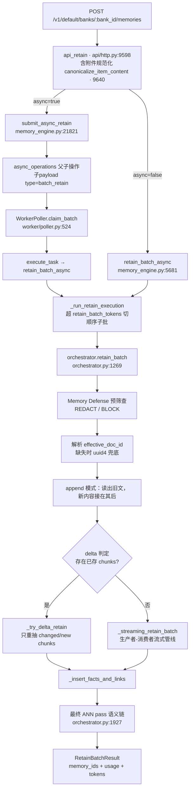
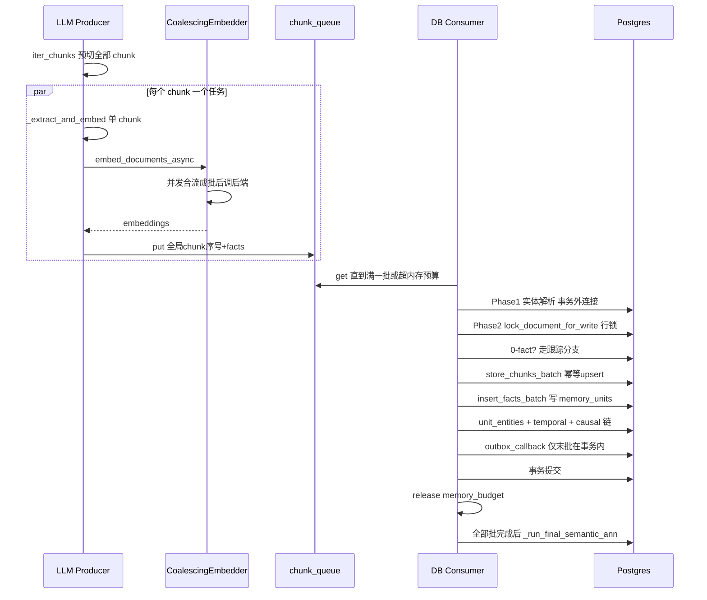
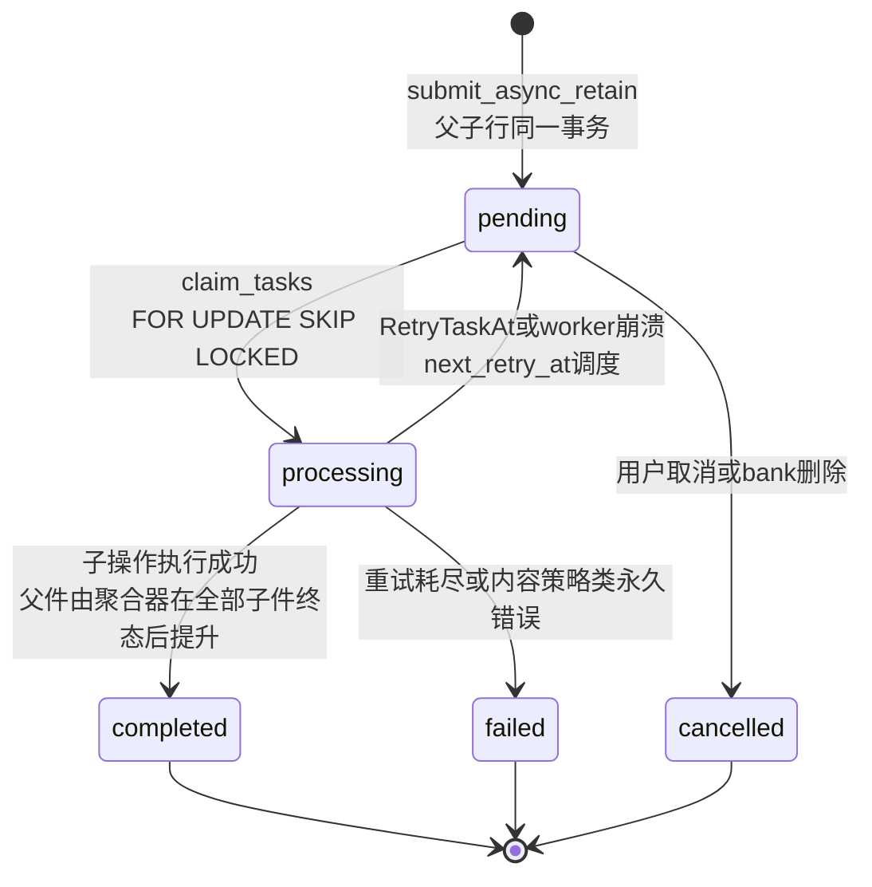

# 02 · Retain 摄取管线（庖丁解牛）

> 研究对象：`hindsight-api-slim/hindsight_api/engine/retain/` 及其入口链路。
> 本文所有行号基于当前仓库快照（branch `main`，commit `12f2d54f6`）。所有论断均给出 `相对路径:行号`，无法确认处明确标注"未确认"。

---

## 第 1 层【全景】：retain 是什么，在哪里

### 1.1 一句话定义

**Retain 是 Hindsight 的"写入侧"**：把一段（或一批）原始文本——对话记录、文章、JSONL 日志、上传文件——变成一批带向量、带时间、带实体、带图边的**结构化记忆单元（memory_units）**，并同步建好 document/chunk 两级索引和 temporal/semantic/causal 三类图链接。它是 recall（多路召回）、reflect（推理）、consolidation（把 facts 合成为 observation/心智模型）共同依赖的数据源；consolidation 产出的 `observation` 类型的 unit 也复用这张表，但那不是 retain 写的。本文所有路径都带 bank_id：**bank（记忆库）**是 Hindsight 的顶层隔离单元——一个 bank 拥有独立的记忆、实体、配置与任务队列，类似"一个大脑"，跨 bank 互不可见。

### 1.2 在整体中的位置

```
原始文本 ──retain──> documents / chunks / memory_units / entities / memory_links
                        │
                        ├──> recall    （4 路召回：semantic / BM25 / graph / temporal）
                        ├──> reflect   （读取记忆 + mental models 做推理）
                        └──> consolidation（facts → observations → 知识库文档）
```

retain 写库后触发的后续动作：`retain.completed` webhook（事务性 outbox，见 §3.9）、实体/图维护任务入队（`graph_maintenance`）、consolidation 任务等。这些属于本系列后续篇章（webhook/任务队列、consolidation）的模块，本文只标出边界。

### 1.3 核心文件地图

| 文件 | 职责 |
|---|---|
| `hindsight-api-slim/hindsight_api/api/http.py` | HTTP 入口 `POST /v1/default/banks/{bank_id}/memories`（`api_retain`，9597-9856 行）与文件入口（9890 行起） |
| `hindsight-api-slim/hindsight_api/engine/memory_engine.py` | 引擎门面：`retain_batch_async`（5681 行）、`submit_async_retain`（21821 行）、子批切分 `_iter_raw_sub_batches`（1104 行）、任务执行器（3423 行 `file_convert_retain` 等） |
| `engine/retain/orchestrator.py` | **管线总指挥**（4423 行）：`retain_batch`（1269 行）、流式生产者/消费者（2618/2714 行）、delta retain（3554 行起） |
| `engine/retain/fact_extraction.py` | chunking（761 行 `iter_chunks`）+ LLM 抽取（prompt 模板 1049 行起、解析 1959 行 `_extract_facts_from_chunk`） |
| `engine/retain/entity_processing.py`（实体准备）+ `engine/entity_resolver.py`（解析/消歧，位于 `engine/` 根目录而非 `retain/` 子目录） | 实体准备、解析与消歧 |
| `engine/retain/embedding_processing.py` / `embedding_coalescer.py` / `embedding_utils.py` | embedding 文本增强与批合并 |
| `engine/retain/link_creation.py` / `link_utils.py` | temporal/semantic/causal 链接创建 |
| `engine/retain/chunk_storage.py` / `fact_storage.py` / `chunk_ids.py` | chunks/documents/memory_units 落库 |
| `engine/retain/memory_budget.py` | 流式管线的字节预算 |
| `engine/retain/fold.py` | 队列上把同一文档的多次 append 合并成一次执行 |
| `engine/retain/types.py` | 全部数据结构（`RetainContentDict`/`ExtractedFact`/`ProcessedFact`/`RetainBatchResult` 等） |
| `engine/parsers/` | 文件→markdown：markitdown / llama_parse / iris |
| `worker/poller.py` / `engine/task_backend.py` | 异步任务队列（认领/重试/折叠） |

### 1.4 触发方式：同步还是任务化？（必答验证项）

**结论：两条路径并存，由请求参数 `async` 决定；异步路径用 `async_operations` 表当队列，worker 认领执行；管线内部（同步与异步共用）另有一层"流式 mini-batch"。** 本节顺带核对一个常见印象——"retain 是按 mini-batch 落库的"。结论成立，但 mini-batch 其实有两层，职责不同：

1. **任务层（跨请求/跨进程）**：`async=true` 时，`api_retain` 调 `submit_async_retain`（`engine/memory_engine.py:21821`），按 token 预算把 items 打包成**子操作（child operation）**（`_split_contents_into_async_children`，`engine/memory_engine.py:1305`），父操作 + 子操作**同一事务**写入 `async_operations` 表（`engine/memory_engine.py:21952-21990` 附近；子行 `operation_type='retain'`（22067 行）、task_payload 内 `"type":"batch_retain"`（22052 行），父行 `operation_type='batch_retain'` 且 task_payload 为 NULL——仅作状态聚合器）。`worker/poller.py` 的 `WorkerPoller` 轮询认领并执行（认领谓词与行号细节见 §3.9）；测试/内嵌场景用 `SyncTaskBackend` 内联执行（`engine/task_backend.py:95-118`）。
2. **管线层（单次 retain 内部）**：无论同步异步，进入 `orchestrator.retain_batch` 后都走 `_streaming_retain_batch`（`engine/retain/orchestrator.py:2309`）：预切的 chunks 由 **LLM 生产者**（2618 行）并发抽取，经 `asyncio.Queue` 交给 **DB 消费者**（2714 行）按 `retain_chunk_batch_size`（默认 100，`config.py:1627-1629`）分批落库——注释原文："Even small documents go through the same path — they just end up as a single batch. This eliminates the maintenance burden of two separate retain code paths."（`engine/retain/orchestrator.py:1835-1838`）。

同步路径还有第三层粗切：提交总量超过 `retain_batch_tokens`（默认 10000 token，`config.py:1657`）时先按 token 数切成**顺序执行的子批**（`_run_retain_execution` 定义在 `engine/memory_engine.py:6178`；6273-6347 是其中的 token 切分块）。

---

## 第 2 层【主流程】：从 API 入口到落库

### 2.1 调用链总览

下图是从 HTTP 请求到落库结果的完整调用链，其中 MD（Memory Defense）/DOCID/APPEND/DELTA 均发生在 `orchestrator.retain_batch` 内部：



图末的"最终 ANN pass"：**ANN（approximate nearest neighbor，近似最近邻检索）pass**——用 pgvector 的 HNSW 索引为本 retain 产生的全部 unit 找语义近邻、补 `semantic` 链接，细节见 §3.6。

### 2.2 流式管线时序（生产者/消费者）



关键代码（生产者侧，`engine/retain/orchestrator.py:2619-2669` 摘录）：

```python
async def _extract_one(global_idx: int, chunk_text: str) -> None:
    source = contents[chunk_to_content[global_idx]] if contents else _default_content
    content = RetainContent(
        content=chunk_text,
        context=source.context,
        event_date=source.event_date,
        ...
    )
    from ..llm_trace import reset_call_metadata, set_call_metadata

    meta_token = set_call_metadata({"document_id": effective_doc_id})
    try:
        embedded = await _extract_and_embed(
            [content], llm_config, config, coalescing_embedder, ...
        )
    finally:
        reset_call_metadata(meta_token)
    ...
    chunk_bytes = estimate_chunk_bytes(processed, extracted, chunk_meta)
    await memory_budget.reserve(chunk_bytes)
    reserved_by_chunk[global_idx] = chunk_bytes
    await chunk_queue.put((global_idx, content, extracted, processed, chunk_meta, usage))
    all_pre_chunks[global_idx] = ""
```

逐点讲解：
- **每个预切 chunk 一个 `asyncio.Task`**（2671-2681 行为所有 chunk `create_task`），并发的 LLM 请求数由**进程级 LLM 信号量**约束（默认 32：`config.py:1162` `DEFAULT_LLM_MAX_CONCURRENT = 32`；`engine/llm_wrapper.py:61-67`）。
- `_extract_and_embed`（1129-1185 行）= 单 chunk 的「LLM 抽取 → 文本增强 → embedding → `ProcessedFact` 转换」。
- **先 reserve 再入队**：`memory_budget.reserve(chunk_bytes)` 在 queue.put 之前，防止生产者跑得比消费者快导致事实堆积（2660-2665 行注释）。
- `all_pre_chunks[global_idx] = ""`：chunk 文本已复制进队列元素后立刻释放共享列表里的引用，45MB 文档峰值才压得下来（2667-2669 行注释；该内存优化动机的 `#3756` 标注在 `orchestrator.py:1856` 与 2552 行）。
- `set_call_metadata`：把本次 LLM 调用的 trace 绑定到 document_id，供控制台展示"这次 retain 产出了哪些记忆"。

消费者侧的批触发（`engine/retain/orchestrator.py:2766-2794` 摘录）：

```python
batch.append(item)
batch_bytes += reserved_by_chunk.get(item[0], 0)

# Write on whichever comes first: the configured chunk count, or an open batch
# heavy enough that holding more would crowd out the producer (#3756).
if len(batch) >= chunk_batch_size or memory_budget.should_flush(batch_bytes):
    if pipeline_aborted[0]:
        ...
        continue
    await _process_db_batch(
        batch,
        consumer_batch_idx,
        is_last=False,
    )
    consumer_batch_idx += 1
    chunks_committed += len(batch)
    await _emit_chunk_progress()
    _release_batch(batch)
    batch = []
    batch_bytes = 0
```

逐点讲解：
- 双阈值：**chunk 计数**（默认 100，`config.py:1627`）或**字节预算过半**（`memory_budget.should_flush`，`engine/retain/memory_budget.py:138-148`：`batch_bytes * 2 >= limit_bytes`，留另一半给生产者）。
- `pipeline_aborted`：文档被并发请求接管（content_hash 失配）时置位，本批之后的批次全部丢弃（3156-3165 行）。
- `_release_batch` 在**写入提交之后**才归还预算——排队期间事实仍驻留内存，提前归还会让生产者挤占还在用的内存（2720-2728 行）。
- 图中"0-fact？走跟踪分支"：某个消费批一个 fact 都没有时，若是首批仍要走文档跟踪（锁 `documents` 行、写入文档行，确立所有权防并发交错），后续批则直接跳过。

### 2.3 异步操作状态机



状态依据：INSERT 默认 `status='pending'`（子操作 INSERT `engine/memory_engine.py:22058-22069`：子行 `operation_type='retain'`（22067 行）、task_payload 内 `"type":"batch_retain"`（22052 行）；父行 `operation_type='batch_retain'` 且 task_payload 为 NULL，仅作状态聚合器，worker 不直接执行）；认领置 `'processing'`（`engine/db/ops_postgresql.py:1912`）；重试回到 `'pending'` 且 `retry_count+1`（`worker/poller.py:1006-1030`）；终态 `'completed'/'failed'`（`worker/poller.py:865, 890`）。子操作执行成功即自身 `'completed'`（`worker/poller.py:858-868`，"then propagate to parent if needed"）；全部子件终态后由聚合器提升父操作（`worker/poller.py:902` 注释；`engine/db/ops_postgresql.py:1426` 只认 `completed/failed/cancelled`）。

### 2.4 贯穿例子一：一段对话走完主流程（示例数据，字段名与代码一致）

输入（一次 retain 请求，`async=false`）：

```json
{
  "items": [{
    "content": "[{\"role\":\"user\",\"content\":\"我们决定采用 PostgreSQL 而不是 MongoDB，因为团队更熟悉关系型数据库。\"},{\"role\":\"assistant\",\"content\":\"好的，我已把项目数据库迁移到 PostgreSQL 16，并写好了 Alembic 迁移脚本。\"},{\"role\":\"user\",\"content\":\"不过迁移时发现连接池超时，改成 pool_size=20 才解决。\"}]",
    "context": "工程团队的日常工作对话",
    "timestamp": "2026-10-01T09:00:00Z",
    "document_id": "conv-1024"
  }],
  "async": false
}
```

逐步追踪（每一步的形态均为"示例"）：

1. **HTTP 层**（`api/http.py:9639-9720`）：content 是字符串直接进 `content_dict`；`timestamp` → `content_dict["event_date"]`；`document_id` → `content_dict["document_id"]`。得到 `contents_dicts = [{"content": "...", "context": "...", "event_date": "2026-10-01T09:00:00Z", "document_id": "conv-1024"}]`。
2. **retain_batch_async**（`memory_engine.py:5681`）：sanitize（去 NUL/孤立代理，5804 行）、校验 append 合法性（5836-5852 行）、token 总量 < 10000 → 单次进入 orchestrator（5877-5889 行）。
3. **retain_batch**（`orchestrator.py:1269`）：`_build_contents`（4299 行）把 dict 转成 `RetainContent`，`event_date` 缺省时取 `utcnow()`（4306-4311 行）；本例只有一个 document_id，不触发多文档分组（1347-1458 行）。
4. **chunking**（`iter_chunks`，`fact_extraction.py:761-823`）：内容能 `json.loads` 成 dict 列表 → 判定为对话，走 `_iter_conversation_chunks`（872 行）按 **turn 边界**打包。三个 turn 序列化后约 300 字符 << `retain_chunk_size`（默认 3000 字符，`config.py:1606`）→ **1 个 chunk**（chunk_index=0）。`chunk_to_content=[0]`。
5. **生产者抽取**（`_extract_facts_from_chunk`，`fact_extraction.py:1959`）：prompt = `CONCISE_FACT_EXTRACTION_PROMPT`（模板本体 `_BASE_FACT_EXTRACTION_PROMPT` 在 1049-1109 行；1171 行经 `.format()` 生成 concise 版）+ 用户消息（`_build_user_message`，1806 行，含 `Chunk: 1/1`、`Event Date: Thursday, October 01, 2026`、`Context: 工程团队的日常工作对话`）。LLM 结构化输出（response_schema=`FactExtractionResponse`，297 行）。**LLM 返回（示例）**：

   ```json
   {"facts": [
     {"what": "团队决定采用 PostgreSQL 而非 MongoDB", "when": "N/A", "where": "N/A",
      "who": "user（工程团队）", "why": "团队更熟悉关系型数据库",
      "fact_kind": "conversation", "fact_type": "world",
      "entities": ["user", "PostgreSQL", "MongoDB"]},
     {"what": "助手将项目数据库迁移到 PostgreSQL 16 并完成 Alembic 迁移脚本", "when": "N/A", "where": "N/A",
      "who": "assistant", "why": "响应用户的选型决定",
      "fact_kind": "conversation", "fact_type": "assistant",
      "entities": ["assistant", "PostgreSQL", "Alembic"],
      "causal_relations": [{"target_index": 0, "relation_type": "caused_by"}]},
     {"what": "数据库连接池超时通过设置 pool_size=20 解决", "when": "N/A", "where": "N/A",
      "who": "user", "why": "N/A",
      "fact_kind": "conversation", "fact_type": "world",
      "entities": ["user", "PostgreSQL"]}
   ]}
   ```
6. **解析为 Fact**（2125-2353 行）：`fact_type` 映射 `"assistant"→"experience"`、`"world"→"world"`（2169-2176 行）；组合文本 `what | When: ... | Involving: ... | why`（2188-2200 行；"N/A" 等占位值在解析时视为空字段、不参与拼接——`get_value` 把 "N/A"/空串过滤为 None，见 `fact_extraction.py:2133-2137`，label 实体的同类过滤在 67-75 行）。**得到（示例）**：
   - `fact_text = "团队决定采用 PostgreSQL 而非 MongoDB | Involving: user（工程团队） | 团队更熟悉关系型数据库"`，`fact_type="world"`
   - `fact_text = "助手将项目数据库迁移到 PostgreSQL 16 并完成 Alembic 迁移脚本 | Involving: assistant | 响应用户的选型决定"`，`fact_type="experience"`，`causal_relations=[CausalRelation(relation_type="caused_by", target_fact_index=0)]`
   - `fact_kind=="conversation"` → 不设置 `occurred_start/end`（2204 行只在 event 分支处理）
7. **时间偏移**（`_add_temporal_offsets`，`fact_extraction.py:3579-3603`；`SECONDS_PER_FACT = 0.01`，2694 行）：`mentioned_at = 2026-10-01T09:00:00+00:00`、`+0.01s`、`+0.02s`——同一文档内事实的时间顺序靠毫秒级偏移保留。
8. **embedding**（`_extract_and_embed`，`orchestrator.py:1177-1181`；`augment_texts_with_dates`，`embedding_processing.py:15-46`）：送入向量模型的文本（示例）= `"团队决定采用 PostgreSQL 而非 MongoDB ... (happened in October 2026) [user, PostgreSQL, MongoDB]"`——注意两处日期格式不同：embedding 增强日期**只到月**（`_format_readable_date` 返回 `"%B %Y"`，`memory_engine.py:5576-5600`），prompt 内日期才**带日**（`%A, %B %d, %Y`，`fact_extraction.py:1829`，见第 5 步）——**日期和实体名进向量、不进库**，库里的 `text` 列存原始 `fact_text`（`engine/memories/pg/writes.py:77` 只写 `fact_texts`）。
9. **Phase 1 实体解析**（事务外，`orchestrator.py:2958-2968` → `entity_resolver.py:812` trigram 策略）："PostgreSQL" 经 pg_trgm 索引找到库内既有实体（假设上次 retain 已建）→ 评分（§3.5）命中，返回 `ResolvedEntity(entity_id=<uuid>, canonical_name="PostgreSQL")`；"MongoDB"/"Alembic" 无候选 → `INSERT ... ON CONFLICT DO NOTHING` 新建（1417-1424 行）。

   > 白话：**trigram（三元组）相似度**——把字符串拆成 3 字符片段、比较两串共享片段的占比；pg_trgm 是 Postgres 的对应扩展，GIN 是其配套索引类型。**LATERAL** 是"对每一行执行一次子查询"的 join 形式（本文多处用到）。
10. **Phase 2 写事务**（`orchestrator.py:3085-3209`）：
    - `lock_document_for_write` 拿 `documents` 行锁 + `'__pending__'` 初始 hash（3096-3101 行）；
    - 首批做 document tracking：旧文档不存在 → 直接插入 `documents` 行（`handle_document_tracking`，`fact_storage.py:187`）；
    - `store_chunks_batch`：`chunk_id = build_chunk_id("my-bank","conv-1024",0)` = `"my-bank_conv-1024_0"`（`engine/chunk_ids.py:57-65`；bank_id/document_id 中含 `_`/`~` 时用 `~` 转义保证可逆）；
    - `insert_facts_batch` → `memory_units` 批量 INSERT，`id` 由数据库 `gen_random_uuid()` 生成（`alembic/versions/5a366d414dce_initial_schema.py:268`），INSERT 不含 id 列（`engine/db/ops_postgresql.py:148` 起的 `insert_facts_batch`）；
    - `unit_entities` 批量插入 + `entity_cooccurrences` 累积（661-662 行，`entity_resolver.py:1593-1662`）；
    - temporal 链（666 行）、causal 链（693 行）；semantic 链在流式模式下跳过（`skip_semantic_links=True`，3191-3209 行）留到最终 ANN。
11. **最终 ANN pass**（3476-3482 行 → `_run_final_semantic_ann`，1927-2024 行）：对本 retain 产生的全部 unit 以 1000 个/批、最多 4 并发跑 pgvector ANN，`top_k=20`、阈值 `semantic_link_min_similarity`（默认 0.7，`config.py:1299`），落 `("semantic", similarity)` 链（`link_utils.py:712`）。
12. **响应**：`RetainResponse{success:true, async:false, usage:{...}}`（`http.py:9793-9801`）；`retain.completed` webhook 经 outbox 投递（`memory_engine.py:4216, 4272`；`webhooks/models.py:11`）。

**落库后的数据形态（示例）**：

| 表 | 行（示例） |
|---|---|
| `documents` | `id="conv-1024"`, `original_text=<拼接全文>`, `content_hash=<sha256>`, `retain_params={"context":"工程团队的日常工作对话"}` |
| `chunks` | `chunk_id="my-bank_conv-1024_0"`, `chunk_index=0`, `content_hash=<sha256(chunk)>` |
| `memory_units` | 3 行：`id=<uuid>`, `text=<组合fact文本>`, `embedding=<vector>`, `fact_type IN {'world','experience'}`, `event_date/occurred_*`, `chunk_id`, `document_id`, `tags` |
| `entities` | "PostgreSQL"（复用），"MongoDB"、"Alembic"、"user"、"assistant"（新建） |
| `unit_entities` | (unit0→user,PostgreSQL,MongoDB), (unit1→assistant,PostgreSQL,Alembic), (unit2→user,PostgreSQL) |
| `memory_links` | temporal：unit0↔unit1↔unit2（同窗口）；causal：unit1 --caused_by--> unit0；semantic：最终 ANN 补齐 |

### 2.5 贯穿例子二：同一文档的第二次 retain → delta（示例）

三天后对同一 `document_id="conv-1024"` 重新提交整份文档（`update_mode` 缺省 = replace，即调用方重发文档的**当前全文**）。设这三天里对话经多次 append 已增至 4 个 chunk（0-3）；本次重提交又增写了一节，新全文切出 5 个 chunk（0-4）。走 `_try_delta_retain`（`orchestrator.py:3554`）：

1. 读取已存 chunks 的 `content_hash`（`chunk_storage.load_existing_chunks`，`chunk_storage.py:36`）；
2. 用**同一 chunker**（`_chunk_contents_for_delta`，4328-4354 行，必须读同一个 resolved config，否则边界漂移会让"每个 chunk 都像变了"）重切新全文，逐块 `compute_chunk_hash`（sha256，`chunk_storage.py:22-24`）；
3. `_classify_chunk_diff`（3535-3551 行）分类（示例结果）：`unchanged=[0,1]`（哈希相同）、`changed=[2,3]`、`new=[4]`、`removed=[]`——diff 分类是**按索引**对齐的。注意 `removed` 的生成规则：每个新索引必落入 unchanged/changed/new 之一，`removed` 只能是"超出新键集的旧尾部索引"（`_chunk_contents_for_delta` 给新 chunk 分配连续 0..N-1 索引），即重提交使文档**变短**时才出现——若这次删去末尾一节、全文只切出 3 个 chunk，则 `removed=[3]`。两侧索引都连续时 `new` 与 `removed` 不会同时出现（前者要求新文本更长、后者要求旧文本更长）；
4. 只对 `changed+new` 构造 delta contents 重新抽取（3801 行 `_build_delta_contents`），`unchanged` 的 chunks/facts/links 原样保留；`removed` 的 chunks 在写事务里删除并级联清理 links（`chunk_storage.delete_chunks_by_ids`，`chunk_storage.py:115`，含观察清扫 `delete_stale_observations_for_memories` 与图维护入队）；
5. 写事务内再次 `FOR UPDATE` 校验 `content_hash` 与加载时一致，不一致 → 放弃 delta 回退流式全量（3973-3990 行）。

delta 的价值：重提一个几乎没变的文档时，LLM/token 花费只跟**变化量**成正比；且全量 replace 会孤儿化或摧毁站在旧 facts 上的 observation（`orchestrator.py:1055-1066` 注释引 `#3294`；3803-3811 是 metadata-only 兜底注释，不涉及该 issue），delta 避免了这一点。

---

## 第 3 层【机制深潜】

### 3.1 粒度体系与 ID 生成（必答问题 1）

retain 把文本切成三个粒度，各自 ID 来源如下：

| 粒度 | 数据结构 | ID 生成 | 代码 |
|---|---|---|---|
| **document** | `documents` 行 + store-owned 文档记录 | 调用方提供 `document_id`；缺失时取 per-item 唯一值；再缺省则 `str(uuid.uuid4())`；重试时从 `async_operations.result_metadata.document_ids[0]` 恢复 | `orchestrator.py:1534-1561` |
| **chunk** | `chunks` 行 | `build_chunk_id(bank_id, document_id, chunk_index)` → `f"{escape(bank)}_{escape(doc)}_{index}"`，`~` 转义 `_`/`~` 保证三段可逆解析（`#4244`） | `engine/chunk_ids.py:57-65` |
| **unit（memory_units）** | `memory_units` 行 | 数据库默认 `gen_random_uuid()`（INSERT 不写 id）；store-owned 路径用 `insert_facts_batch(..., defer_index=True)` 先铸 id 再写入 | `alembic/.../5a366d414dce_initial_schema.py:268`；`fact_storage.py:65-102` |

chunk_index 是**文档全局序号**：超长单 item 被切成多个顺序子批时靠 `chunk_index_offset` 续号，否则后到子批的 `chunk_id` 撞车、覆盖前面的 chunks（`orchestrator.py:2818-2828` 注释引 `#1888`；切分与 offset 在 `memory_engine.py:6355-6370`）。chunking 保证**幂等**：`chunk_text` 对自己产出的 chunk 再切一遍结果不变，否则 delta 的哈希比对会全部失配（`fact_extraction.py:841-845` docstring，`#2301`）。

### 3.2 chunking 策略（`fact_extraction.py:761-1023`）

`iter_chunks` 按内容形态分派：

1. **图片占位符**（`attachment_content.contains_attachment`）：`_iter_image_aware_chunks`（680 行）——文本按字符预算，图片按 `retain_max_attachments_per_chunk`（默认 8，`config.py:1649`）计数，图片与引出它的正文尽量同 chunk；
2. **JSON 对话数组**：`_iter_conversation_chunks`（872 行）按 turn 边界打包，单 turn 超限在 `min(structured_limit, max_chars)` 内按句子碎片化（902-913 行）；
3. **单个 JSON 对象**：整体保留到 structured 上限，否则按文本切（804-815 行，`#2301`）；
4. **JSONL**：`_looks_like_jsonl`（957 行）判定 ≥2 行且每行是 JSON 对象 → `_iter_jsonl_chunks`（976 行）按行打包；
5. **纯文本**：`_iter_recursive_splits`（594 行）——langchain `RecursiveCharacterTextSplitter` 的惰性等价实现，分隔符优先级 `\n\n → \n → ". " → "! " → "? " → "; " → ", " → 空格 → 逐字符`（553-563 行），贪心装箱；注释明言**边界必须与 langchain 完全一致**，因为边界就是 delta 的哈希锚点（602-608 行）。

默认参数：`retain_chunk_size=3000` 字符（`config.py:1606`）、`retain_chunk_batch_size=100` chunks/消费批（`config.py:1627-1629`，注释估"每 chunk ~17 facts，100 chunks ≈ 1700 facts/批"）。

### 3.3 LLM 抽取：prompt、模式与 fact 类型判定（必答问题 2）

**模式**（`config.py:1621-1622`）：`concise`（默认）/ `verbose`（遗留）/ `custom`（银行自定义指令）/ `verbatim`（原文入库、LLM 只抽元数据）/ `chunks`（**完全不调 LLM**，每个 chunk 原文成一条 unit，`fact_extraction.py:3292-3349`）。LLM provider 为 `none` 时强制 chunks 模式（`memory_engine.py:6701-6703`）。

**系统 prompt 骨架**（`_BASE_FACT_EXTRACTION_PROMPT`，`fact_extraction.py:1049-1109`）：选择性（"only extract facts worth remembering long-term"）→ 五维格式（what/when/where/who/why）→ 指代消解（"my roommate"+"Emily" → "Emily (user's roommate)"）→ 分类 → 时间处理 → 实体规则。语言规则是一行式（1044 行）：`"LANGUAGE: Write every fact in the same language and script as the input text. Never translate. Names, identifiers, code, and quoted text stay verbatim."`——注释记录了旧版"先检测语言再照做"两步式在 gpt-5.6-luna 上造成 18% 法语/俄语事实的事故。

**fact_type 的判定链**（prompt 输出 → 存储）：

- prompt 要求 `Literal["world", "assistant"]`（`ExtractedFact.fact_type`，`fact_extraction.py:272-274`）：world=客观/外部事实（**含用户偏好、规则、纠正、约束，即使在对话中说出**）；assistant=agent 自己做的动作。
- 解析时映射到存储枚举（2169-2176 行，batch API 路径 3080-3089 行同构）：

```python
raw_fact_type = llm_fact.get("fact_type")
if raw_fact_type == "assistant":
    fact_type = "experience"
elif raw_fact_type == "world":
    fact_type = "world"
else:
    raw_fact_kind = llm_fact.get("fact_kind")
    fact_type = "experience" if raw_fact_kind == "assistant" else "world"
```

即：**存储枚举是 `world` / `experience`**（数据库 CHECK 为 `fact_type IN ('world','experience','observation')`，`alembic/versions/g2h3i4j5k6l7_remove_opinion_fact_type.py`；`observation` 由 consolidation 写入）。`fact_type_override` 参数可整体覆盖（`orchestrator.py:1173-1175`）。

- `fact_kind`（`event`/`conversation`，269 行）决定时间字段：event 才有 `occurred_start/end`；缺失时用正则从"yesterday/last week…"相对 `event_date` 推断（`_infer_temporal_date`，83-119 行，覆盖 last night/yesterday/tomorrow/last week/last month 等）。粗粒度日期展开为整段（"in 2015" → 全年），prompt 与实现一致（1094-1096 行）。

**组合 fact 文本**（2188-2200 行）：`" | ".join([what, "When: "+when, "Involving: "+who, why])`，非空维才拼。

**说话人归因（narrator）**：`_build_user_message` 有 `narrator_section`（1838-1852 行）。真实代码（`engine/retain/fact_extraction.py:1838-1852`，摘录）：

```python
    narrator_section = ""
    if agent_name:
        narrator_section = (
            f"\nNarrator: {agent_name} (the AI agent whose memory this is). By default, "
            f'first-person statements like "I did X" are {agent_name}\'s own actions → classify as '
            f'"assistant".'
        )
        # Only defer to the Context when one was actually provided — otherwise this
        # clause points at a "Context: none" line and just adds noise.
        if context:
            narrator_section += (
                " BUT the Context above takes precedence: if it identifies a different "
                "first-person speaker (e.g. a user or customer in a transcript), attribute those "
                'statements to that speaker and classify them as "world", not "assistant".'
            )
```

逐点讲解：
- 归因规则是**默认 + 覆盖**两段式：第一人称默认算 agent 自己的动作（assistant/experience）；context 若指认别的说话人（ transcript 里的用户/客户）则改判 world。
- 但**retain 主链路从不传 agent_name**：`_extract_and_embed` 的注释（`orchestrator.py:1146-1154`）明确 "No narrator: extraction takes none from this path at all"——曾经的 "Narrator: {bank.name}" 把项目/租户名（如 `AuditProject_0825`）逐字漏进事实文本（`#3962`），已废除；想指认说话人应在 item 的 `context` 里说。
- `mentioned_at` 取 `event_date`，但调用方显式放弃时间戳时为 `None`（2314-2316 行：`fact_data["mentioned_at"] = event_date.isoformat() if event_date is not None else None`，注释 "or None when the caller opted into no timestamp"）；入库 `event_date` 列取 `occurred_start or mentioned_at`（`engine/memories/pg/writes.py:81-83`，注释 81-82 行、赋值 83 行）。

### 3.4 解析健壮性：三层重试与自动切半

`_extract_facts_from_chunk` 的防御纵深：

- **外层内容重试**：`outer_attempts = retain_llm_max_retries + 1`（2046-2056 行，N+1 约定，`#2731`）；非 dict JSON、fact 缺 `what` 系字段且存活率 <80% 时 re-prompt（2096-2101、2330-2335 行）。全灭则抛错而非返回 `[]`——"never silently commit the document with 0 facts"（`#1833`/`#3708`，2103-2110、2345-2351 行）。
- **`OutputTooLongError` 自动二分**（`_extract_facts_with_auto_split`，2391-2516 行）：输出超限时把 chunk 对半重试，JSON 数组按 turn 中点切（`_split_chunk_for_output_retry`，313-359 行），500 字符以下不再切（`_MIN_SPLIT_CHUNK_CHARS`，310 行），两半并行递归（2505 行 `asyncio.gather`）。
- **provider 内层传输重试**：限流/超时在 provider 循环内处理，注释说明为何不再加第三层（2595-2599 行，issue #1412）。
- **批级失败即整体失败**：任一 chunk 重试耗尽 → 整个 retain 失败、丢弃全部成功事实，交 worker 重试（2621、2636-2677 行："partial extraction is not acceptable"）。content-policy 拒答识别为永久错误直接失败（2663-2669 行，`#3690`）；配额重置错误聚合 `retry_at`（2645-2654 行）。

"全灭必抛错"的真实代码（`engine/retain/fact_extraction.py:2337-2351`，摘录）：

```python
            # Every fact the model returned was unusable, on every attempt. Raise
            # instead of returning [] so the failure reaches the worker's retry
            # machinery and ultimately fails the operation loudly — the same rule the
            # non-dict response above follows (#1833). Without this the retain commits
            # a document with 0 memory units and reports `completed`, so callers cannot
            # tell schema-drifted extraction from content that genuinely held no facts
            # (#3708). A model that legitimately returns `"facts": []` never lands here:
            # nothing was dropped, so has_malformed_facts stays False.
            if has_malformed_facts and not chunk_facts:
                raise RuntimeError(
                    f"Fact extraction failed: all {len(raw_facts)} facts returned by the LLM were "
                    f"unusable after {outer_attempts} attempts (wrong shape or missing required fields). "
                    f"Model '{llm_config.model}' may not honour the extraction schema — consider enabling "
                    f"HINDSIGHT_API_LLM_STRICT_SCHEMA_RETAIN or using a model with strict schema support."
                )
```

逐点讲解：
- 抛错条件是 `has_malformed_facts and not chunk_facts`：模型正常返回 `"facts": []`（真的没有事实）不会触发；只有"返回了 fact 但全部不可用"才失败——把"模型没遵守 schema"和"内容本来无事实"区分开（`#3708`）。
- 错误文案直接给出修复路径（开 strict schema 或换模型），因为 async_operations 的 `error_message` 是 worker 侧失败后唯一的排查窗口（2640-2643 行注释）。

**退化文本过滤**：`ProcessedFact._is_degenerate_text`（`types.py:412-447`）拒绝空串、纯标点（`"..."`、`"---"`、`"_, _,"` 等）；`from_extracted_fact` 返回 None 时，`_process_extracted_facts`（`orchestrator.py:1220-1266`）用 `retained_index_by_original` 对齐表**重排 causal 关系下标**（1188-1217 行），被剔除事实的关联要么消失、要么指向幸存者新下标，绝不错位。

### 3.5 实体解析与消歧（必答问题 3）

**抽取侧**：LLM 每条 fact 给 `entities: list[str]`（纯字符串，1103-1109 行强制，历史 `{"text":...}` 对象形态兼容解包，126-152 行 `#2749`）；可选 `entity_labels` 配置扩展出 `key:value` 标签实体与结构化 map 实体（`entity_labels.py`；labels 注入 prompt 1383-1459 行，解析 2224-2274 行）。调用方还可传 `entities:[{text,type}]` + `resolve_entities` 开关（`http.py:9706-9707`）——**只有调用方名单可关闭消歧**：`_prepare_facts_for_entity_processing`（`entity_processing.py:55-77`）把 LLM 实体恒置 `resolve=True`，用户实体携带 `user_resolve`；重名时 `existing["resolve"] = existing["resolve"] and user_resolve`（74-77 行），`#3479`：调用方写的名字是"权威指称"而非猜测，不能被图的既有信念消歧掉。

**解析侧**（`EntityResolver`，`entity_resolver.py`）三策略：
- `full`（737-810 行）：加载全 bank 实体，Python 里做包含匹配；
- `trigram`（默认，`config.py:1658`；812-947 行）：pg_trgm GIN 索引 LATERAL 查询，每个名字只取相似度 Top-`entity_resolution_max_candidates`（默认 200，`config.py:1663`）个候选；label 实体（`entity_kind='label'`）只做精确匹配（843-858 行，`#3208`）；
- `oracle_fuzzy`（949-1089 行）：Oracle 用 `UTL_MATCH.JARO_WINKLER_SIMILARITY > 70`。

**评分**（`_resolve_from_candidates`，1263-1358 行）：

```python
if name_trigram_similarity < self._merge_min_similarity:
    continue
if not _tokens_are_compatible(entity_text_lower, canonical_lower):
    continue

if name_trigram_similarity >= _IDENTICAL_TRIGRAMS:
    score = 1.0
else:
    score = 0.0
    # 1. Name similarity (0-0.5)
    name_similarity = SequenceMatcher(None, entity_text_lower, canonical_lower).ratio()
    score += name_similarity * 0.5
    # 2. Co-occurring entities (0-0.3), each weighted by how selective it is
    if nearby_entity_set:
        co_entities = cooccurrence_map.get(candidate_id, set())
        matched_weight = sum(nearby_weights[name] for name in nearby_entity_set & co_entities)
        score += (matched_weight / len(nearby_entity_set)) * 0.3
    # 3. Temporal proximity (0-0.2)
    ...
threshold = 0.6
if round(best_score, 6) >= threshold and best_candidate is not None:
    resolved[idx] = best_candidate
```

逐点讲解：
- **两道硬门槛**：trigram 相似度必须过 `merge_min_similarity`（默认 0.3，`entity_resolver.py:474`）——防止**名字其实并不相似**（SequenceMatcher 分高、trigram 不达标）的候选，靠共现与时间邻近两个维度把总分凑过 0.6（`#3751`："Tigran"/"Iran" SequenceMatcher 0.80 但 trigram 仅 0.20——若无此门槛，名字分 0.4 + 共现 0.3 + 时间 0.2 可达 0.9）；再加**逐词兼容**（`_tokens_are_compatible`，141-158 行）——整名相似度会被一个长共词淹没（"John Smith"/"Jane Smith" 0.80），每个词都要在对方里找到对应（前缀或 `SequenceMatcher >= 0.6`）。
- **满分直通**：trigram 集合完全相同（同词异形：大小写/标点/emoji，如 "Wren 🎵" vs "Wren"）直接 1.0（1307-1313 行，`#3107`）。
- **三维加权**：名字 0.5 + **选择性加权的共现** 0.3 + 时间邻近 0.2，总分 ≥0.6（含浮点 rounding 修正，1343-1352 行）即复用既有实体。共现权重 `1/sqrt(degree)`（`_cooccurrence_weight`，198-208 行）：`user` 这类与万物共现的枢纽每票只值 0.026，避免把新人事实挂到无关实体上。
- **批内去重**（`_intrabatch_canonical_map`，1091-1141 行）：即将新建的非 label 名字做前缀过滤的集合相似度连接（`_find_intrabatch_similar_pairs`，227-316 行，复杂度从 O(N²) 双循环降到 ~5% 验证量）+ 并查集聚类（`_cluster_new_entity_names`，319 行），规范名取"提及最多、最短、字典序最小"。上限 `_INTRABATCH_MAX_NAMES = 250`（68 行），超出跳过并告警。
- **统计延迟落库**：`mention_count`/`last_seen`/`entity_cooccurrences` 累积在按 **asyncio task 隔离**的 `_pending_stats`（512-513 行），`flush_pending_stats`（533 行）在事务提交后批量 UPDATE/UPSERT，且按 entity_id 排序防死锁（562-563 行注释）。
- **跨阶段保护**：Phase-1 解析结果到 Phase-2 写 `unit_entities` 之间，孤儿清理可能删掉刚解析的实体（`#2662`）——`reassert_entities_batch`（1482-1522 行）在写事务内锁定/复活父实体。

### 3.6 链接创建（必答问题 4）

retain 阶段 `memory_links` 写三类（`link_utils.py`；DB CHECK 允许 `temporal/semantic/entity/causes/caused_by/enables/prevents`，`alembic/versions/5a366d414dce_initial_schema.py:471`）：

1. **temporal**（`create_temporal_links_batch_per_fact`，455-570 行）：同一 `fact_type` 内、`event_date` 相差 <24h 的 unit 两两连边，`weight = max(0.3, 1 - hours/24)`（158 行）；邻域用 (bank_id, fact_type, event_date) B-tree 双向 LATERAL 扫描各取 K=20（505-531 行，注释："120x faster at 164k units"），批内再用 `_within_batch_temporal_links`（101-162 行，按日期排序只走 `max_per_unit` 个后继，36K facts 的 delta 从 13 亿元组降到 O(n·K)，`#3848`）。每 unit 上限 `MAX_TEMPORAL_LINKS_PER_UNIT = 20`（63 行）。
2. **semantic**（`compute_semantic_links_ann`，573-720 行 + `compute_semantic_links_within_batch`，722-824 行）：cosine 相似度 ≥ `semantic_link_min_similarity`（默认 0.7）。流式模式**不在每批事务内做**（`skip_semantic_links=True`，`orchestrator.py:3191-3209`），统一在全部批提交后由 `_run_final_semantic_ann`（1927-2024 行）一次算完——1000 seeds/批、`_ANN_PARALLELISM=4` 并发、`top_k=20`；查询按 `fact_type` 拆分，以便命中**按 bank、按 fact_type 分区建的** HNSW 索引——不加 fact_type 过滤时计划器退化为顺序扫描（约慢 50 倍）（590-593 行注释）。
3. **causal `caused_by`**（`create_causal_links_batch`，`link_creation.py:81-109` → `link_utils.py:904`）：来自抽取的 `causal_relations`（LLM 生成，`target_index < 自身下标` 强校验，2294-2299 行），只写规范类型 `caused_by`（`engine/causal_links.py:10-17`）；`causes/enables/prevents` 是遗留类型，仅 transfer 恢复，retain 不再产出。
4. **entity 链不写**：`_insert_facts_and_links` 注释明言 "Entity edges for UI graph visualization are derived on demand from unit_entities by the /graph endpoint, so no entity rows are written to memory_links here."（`orchestrator.py:627-633`；同类说明 687-689 行）。

所有 link 批量插入按 `(LEAST(from,to), GREATEST(from,to), link_type, entity)` **全序加锁**（`_lock_order_key`，165-182 行；`_bulk_insert_links`，185 行），并发写死锁在这条全序上被消除。

temporal 批内连边的核心代码（`engine/retain/link_utils.py:153-162`，摘录）：

```python
        for i, (unit_id, event_date_norm) in enumerate(group):
            for other_id, other_event_date_norm in group[i + 1 : i + 1 + max_per_unit]:
                time_diff_hours = (other_event_date_norm - event_date_norm).total_seconds() / 3600
                if time_diff_hours > time_window_hours:
                    break
                weight = max(0.3, 1.0 - (time_diff_hours / time_window_hours))
                # Create bidirectional links
                links.append((unit_id, other_id, "temporal", weight, None))
                links.append((other_id, unit_id, "temporal", weight, None))
```

逐点讲解：
- 同组已按 `event_date` 排序，所以"一旦超窗，后面全部超窗"——`break` 而非 `continue` 是正确的（138-140 行注释）。
- 只向前看 `max_per_unit` 个后继；每个 unit 的前驱关系由更早 unit 写反向边补上，最终每 unit 保有双向各 ≤20 的最近邻（114-124 行注释：`2 * max_per_unit` 的候选集包含 cap 要选的 `max_per_unit`）。
- `weight` 是时间差的单调递减函数，这是"按顺序取前 K 个=按权重取前 K 个"能成立的前提（120-124 行）。

### 3.7 embedding：逐条还是合并？coalescer 解决什么？（必答问题 5）

- **粒度**：流式生产者里**每个 chunk 一次 embedding 调用**（该 chunk 的全部 facts 一起），而非逐 fact、也非整文档一次（`orchestrator.py:2606-2611` 注释 + `_extract_and_embed` 对 `[content]` 单元素列表调用）。delta 路径则一次调用覆盖全部 delta contents（`orchestrator.py:3894-3907`，传 `embeddings_model` 而非 coalescer）。
- **增强文本**：`augment_texts_with_dates`（`embedding_processing.py:15-46`）附加 `(happened in <date>)` / `(happened from X to Y)` 与 `[entity1, entity2]`；注释点明目的是"camping in June"这类查询能按时间/实体命中。
- **CoalescingEmbedder**（`embedding_coalescer.py:100-241`）：生产者并发扇出后，每次 embedding 调用只带一个 chunk 的文本；在 `chunks` 模式下没有可与它重叠的 LLM 耗时，这一次网络往返就是单个 chunk 的全部延迟（`#3784`）。coalescer **保留扇出结构、把合批下移一层**：并发调用者挂到共享 `_pending` deque，dispatcher 抢到信号量槽后 `sleep(0)` 等一个事件循环 tick 让"已在运行中的调用者"入伙，然后整队带走（169-191 行）。没有定时器——单独调用者零额外延迟，N 个扇出自然形成批。每次 retain 一个实例（bank 级成本归因要求不跨 bank 混批，101-105 行）；批大小从后端自身 `batch_size × max_concurrent_requests` 反推（`resolve_max_batch_size`，72-97 行，TEI 用满容量会把 429 弄成常态）。失败会把异常传给同批所有等待者（216-227 行），绝不静默丢 facts。

dispatcher 主循环的真实代码（`engine/retain/embedding_coalescer.py:178-191`，摘录）：

```python
        while self._pending:
            await self._slots.acquire()
            try:
                await asyncio.sleep(0)
                batch = self._take_batch()
            except BaseException:
                self._slots.release()
                raise
            if not batch:
                self._slots.release()
                return
            request = asyncio.create_task(self._run_request(batch))
            self._in_flight.add(request)
            request.add_done_callback(self._in_flight.discard)
```

逐点讲解：
- **先抢槽、再取批**（`await self._slots.acquire()` 在 `_take_batch` 之前）：所有槽都忙时 pending 列表持续增长，下一个请求自然带走全部积压——这正是"合批"的机制（173-177 行注释）。
- `await asyncio.sleep(0)` 是唯一的延迟：刚好够让"已经在排队（runnable）的调用者"（生产者一次性 fan-out 的整批 chunk 任务）挤进这一批。
- `_take_batch` 按整 waiter 弹出、不拆分（193-209 行）：保持一个调用者的文本在同一个后端请求里，`_run_request` 才能仅靠长度把结果切回去（230-234 行）。
- `request.add_done_callback(self._in_flight.discard)`：完成即从 in-flight 集合移除；`_run_request` 的 `finally` 若发现 pending 又非空会重新拉起 dispatcher（238-240 行），避免收尾竞态饿死后来的调用者。

### 3.8 内存预算与双阈值消费（`memory_budget.py`）

`RetainMemoryBudget`（默认 128MB，`config.py:1656`）把"最多 100 chunks"这种**计数界限**升级成**字节界限**：chunk 成本 = Σ(512B fact 开销 + fact_text/context 字节 + embedding 向量字节) + 原始 chunk 文本（`estimate_chunk_bytes`，47-71 行）。生产者 `reserve`（114-128 行）在入队前等待额度；唯一防死锁规则：**管线空时任何大小都放行**（123-125 行），否则一个超富 chunk 会永远等只有它能腾出的空间。消费者 `should_flush`（138-148 行）在开放批超过预算一半时就落盘，另一半留给生产者——否则消费者会把开放批攒到接近整个预算，生产者因申请不到额度而停摆，管线退化成"先抽完、再落库"的串行执行：结果仍正确，但失去了两段重叠的吞吐。

### 3.9 mini-batch、任务化与折叠（fold）

- **同步路径三层**：token 子批（10000 token）→ 文档分组（同 document_id 合为一组顺序处理，`memory_engine.py:5894-5956`；多文档在 orchestrator 内并发分组，`orchestrator.py:1347-1458`，组并发 8 在 1395 行）→ 流式 chunk 批。
- **异步路径**：`submit_async_retain` 打包子操作（`_split_contents_into_async_children`，1305-1356 行：**超限单 item 不再切**，由 worker 内部顺序处理——曾因并发兄弟操作对同一 document_id 各自 `handle_document_tracking` 互相级联删除造成 FK 违规，`#1795`）。worker 认领：`WorkerPoller.claim_batch`（`worker/poller.py:524`）→ `ops.claim_tasks`（`engine/db/ops_postgresql.py:1825`），认领谓词 `status = 'pending' AND task_payload IS NOT NULL`、`FOR UPDATE SKIP LOCKED`（1817-1823 区域），认领置 `status='processing'`（1912 行）。队列谓词另含 `document_serialization_sql`（`engine/db/ops.py:91-115`）：同一 `serialization_key`（单文档 retain）的 peer 只允许最老的 pending 被认领——append 是累积写，执行顺序决定文档最终内容，因此认领按 `(created_at, operation_id)` 排序，**保证执行顺序与提交顺序一致**。
- **fold（认领时折叠）**（`fold.py` + `worker/poller.py:730-802`）：离线攒了 50 轮对话一次性 flush 的场景，50 次串行 retain 太慢。认领事务持 `FOR UPDATE` 时把同一文档的**连续** append-only peers 合并进一次执行（`plan_retain_fold`，151-216 行）：只折叠 append（171-176 行，replace 不可折叠）、租户/key/tags/strategy 必须一致、token 预算内、默认最多 16 个 peers；**每重试一次宽度减半**（`max_fold_peers_for_retry`，132-148 行）让毒内容独自失败、不拖累同行。行不可变、不改 task_payload，所以折叠是纯优化——删掉它系统仍正确，只是慢。

peer 加入条件的真实代码（`engine/retain/fold.py:70-84`，摘录）：

```python
    if not peer.is_append_only:
        return "not an append"
    if peer.has_file_metadata:
        return "carries file metadata"
    if peer.tenant_id != primary.tenant_id or peer.api_key_id != primary.api_key_id:
        # Usage is attributed to the members of a fold, so mixing credentials
        # inside one execution would bill one caller for another's extraction.
        return "different tenant/api key"
    if sorted(peer.document_tags or []) != sorted(primary.document_tags or []):
        # The execution applies the primary's document_tags to the whole
        # document; folding a differently-tagged peer would drop its tags.
        return "different document_tags"
    if peer.strategy != primary.strategy:
        return "different strategy"
    return None
```

逐点讲解：
- 每条拒绝理由对应"执行会从 primary 的 payload 里取一次、应用到整份文档"的字段——这些字段折叠后 peer 的值会被 primary 的覆盖，所以不一致即拒绝。
- `has_file_metadata` 单列：文件上传要挂文档元数据，是每个提交各自的动作，不能合并。
- 计费注释说明 tenant/api_key 校验是**正确性**而非优化：折叠会让一次执行带多个提交的 token，混合凭据等于 A 替 B 付费。
- **事务性 outbox**：`outbox_callback` 在最后一个有事实的批次事务内入队 `retain.completed` webhook 行（`orchestrator.py:3207, 704-706`）；三条漏网路径（批数恰在边界、末批 0 facts、全跳过）由 post-loop 兜底补发，`outbox_fired` 标志保证恰好一次（2539-2546、3411-3415 行）。

### 3.10 delta retain 的并发控制（补 2.5）

diff 分类的真实代码（`engine/retain/orchestrator.py:3539-3551`，摘录）：

```python
    diff = _ChunkDiff(unchanged=[], changed=[], new=[], removed=[])
    for idx, new_hash in new_hashes.items():
        existing = existing_by_index.get(idx)
        if existing and existing.content_hash == new_hash:
            diff.unchanged.append(idx)
        elif existing:
            diff.changed.append(idx)
        else:
            diff.new.append(idx)
    for idx in existing_by_index:
        if idx not in new_hashes:
            diff.removed.append(idx)
    return diff
```

逐点讲解：
- 分类按**索引**对齐：新内容该索引处无已存 chunk → `new`；有但哈希不同 → `changed`；已存索引在新内容中消失 → `removed`。`removed` 是 delta 里最危险的一类——它意味着删除，写路径必须级联清理其 facts/links/observation（见 2.5 第 4 步：`delete_chunks_by_ids` 含观察清扫与图维护入队）。
- 哈希两侧必须同源：新哈希由 `compute_chunk_hash`（sha256，`chunk_storage.py:22-24`）计算，已存哈希是写入时同一函数算的；store-owned 路径直接读记录里的 `chunk_hashes`（3658-3670 行注释），避免为比对把整个文档再下载一遍。

三道闸：加载后、抽取前的**新鲜度复查**（3828-3885 行，避免为并发请求已做的工作烧 LLM token）；写事务内 `FOR UPDATE` 后 `current_hash != doc_hash_at_load` 即放弃回退（3973-3990 行）；`_run_delta_db_work` 返回 False 必须真的回退（注释 3919-3926 行：曾因 `-> None` + 裸 return 的形状错误，日志说回退而 delta 实际提交在并发写之上）。**store-owned（PG-free）银行**——记忆不落本地 Postgres、由外部 store 托管的部署形态，写路径走 store 的 RPC 而非 SQL（本文不展开其服务端实现，见文末疑问点 3）——没有 `documents` 行可锁，改用 store 的 `put_document(expect_watermark=...)` CAS，且必须是本批**第一次** store 写：`expect_watermark` 比对的是存储命名空间的 WAL 头（写入位点），而本批稍后的事实写入会推进这个位点——若守卫放在事实写之后，等于拿加载时的旧水印跟自己刚推进的头比较、必然冲突，CAS 就"fence 了自己"（`orchestrator.py:1004-1010` 注释）。

### 3.11 错误处理与幂等矩阵（必答问题 6）

文档所有权门是并发正确性的核心，真实代码（`engine/retain/orchestrator.py:3096-3107` 与 `3144-3165`，摘录）：

```python
                    existing_hash = await pool.ops.lock_document_for_write(
                        conn,
                        fq_table("documents"),
                        effective_doc_id,
                        bank_id,
                    )

                    if not doc_tracking_done[0]:
                        # Append compare-and-swap, under the row lock and before any write: an
                        # append that lost its read-modify-write race must abort here rather than
                        # commit over the winner.
                        _assert_append_base_unchanged(existing_hash)
                        ...
                    else:
                        # --- Later batches: verify we still own the document ---
                        # If another request took over (cascade-deleted our doc and
                        # inserted its own), the content_hash won't match ours.
                        if existing_hash is not None and existing_hash != new_content_hash:
                            ...
                            if append_base_hash is not None:
                                raise ConcurrentAppendConflict(
                                    f"Document {effective_doc_id} was taken over by a concurrent "
                                    f"retain while this append was storing its batches"
                                )
                            # Signal the consumer to stop processing further batches
                            pipeline_aborted[0] = True
                            return
```

逐点讲解：
- `lock_document_for_write`（upsert + `RETURNING`——3091-3095 注释原文；`FOR UPDATE` 行锁语义在 ops 层实现）让同一文档的所有并发 writer 在数据库层排队——跨进程有效，不只是本进程的信号量。
- 首批在锁内做 append CAS：读基线时的 hash 必须仍是当前 hash（新行读到 `'__pending__'`，2578-2604 行），否则整个 append 抛 `ConcurrentAppendConflict` 重来。
- 后续批只校验不写入：hash 失配说明另一个请求已接管文档。**replace 语义下丢弃余批是正确的**（赢家内容取代我们）；**append 语义下是数据丢失**（余批的内容没人有），所以抛错重做（3154-3162 行注释）。

失败/幂等全景：

| 失败层级 | 机制 | 代码 |
|---|---|---|
| LLM 单次调用 | provider 内传输重试 + 外层内容重试（N+1） | `fact_extraction.py:2044-2110` |
| LLM 输出超限 | chunk 对半递归重试 | `fact_extraction.py:2391-2516` |
| 单 chunk 重试耗尽 | **整体失败**，交 worker 重试（无部分提交） | `fact_extraction.py:2621, 2671-2677` |
| 崩溃后重跑（chunk 级） | 文档 `content_hash` 相同 + 已存 chunk 哈希集合 → 生产者跳过匹配 chunk | `orchestrator.py:2370-2438, 2674-2681` |
| 崩溃后重跑（文档级） | `async_operations.result_metadata.facts_committed_document_ids` 检查点，命中则跳过抽取直接 ANN | `orchestrator.py:3274-3305, 3417-3446` |
| 并发同文档 replace | 每批 TXN `FOR UPDATE` 行锁 + content_hash 所有权校验，被接管即 `pipeline_aborted` | `orchestrator.py:3087-3165` |
| 并发 append | 读基线 hash → 写前 CAS（`_assert_append_base_unchanged`）；丢失抛 `ConcurrentAppendConflict`，引擎层抖动重试 3 次 | `orchestrator.py:2578-2604, 3103-3107`；`memory_engine.py:6777-6825` |
| 旧请求迟到 | `documents.updated_at > 本次 start_time` 则跳过（replace）/重试（append） | `orchestrator.py:1717-1763` |
| 实体竞态 | `INSERT ... ON CONFLICT DO NOTHING` + 冲突后兜底 SELECT；`reassert_entities_batch` 防 Phase 间隙被剪 | `entity_resolver.py:1417-1453, 1482-1522` |
| 链接死锁 | 全序排序插入 + 显式删链 | `link_utils.py:165-232`；`chunk_storage.py:194-228` |
| 幂等重放（客户端） | 同 `operation_id` 重提交直接返回原操作（父子主键即并发权威） | `memory_engine.py:21886-21902` |
| webhook 重复 | outbox 在事务内 + `outbox_fired` 恰好一次 | `orchestrator.py:2539-2546, 3411-3415` |

数据一致性总原则：**facts/unit_entities/链/outbox 在同一 TXN 内原子提交**（`orchestrator.py:3085-3209`），Phase 1 的读重操作（实体解析、ANN）放在事务外连接以缩短持锁时间（475-509 行注释）；占位 unit_id（`str(fact_index)`）在 facts 落库铸出真 UUID 后统一 remap（`_remap_phase1_results`，557-591 行）。

### 3.12 文件摄取入口：parsers（补充）

`POST /banks/:bank_id/files/retain`（路由装饰器 `http.py:9858-9859`，处理函数定义在 9890 行）把文件存对象存储并投递 `file_convert_retain` 任务；worker 执行 `memory_engine._handle_file_convert_retain`（3423 行）：`FileParserRegistry.convert_with_fallback`（`engine/parsers/__init__.py`；`FileParser.convert → markdown` 抽象，`engine/parsers/base.py:10-58`）按**调用方/配置提供的解析链**依次回退（链逻辑本身是 `parsers/__init__.py:83` 的 `convert_with_fallback`，不存在固定默认链）——可用解析器：`markitdown`（本地，默认 `DEFAULT_FILE_PARSER`，`config.py:1671`；`engine/parsers/markitdown.py` 共 289 行）、`llama_parse`（远程，需配置 API key 才注册，`memory_engine.py:5359-5362`）、`iris`（远程，需 VECTORIZE 配置，5356-5358 行）——得到 markdown 后 sanitize，再**组装一个新的 retain 任务**（payload 组装在 3504-3540 行，`"type":"batch_retain"` 标记在 3548 行），与主 retain 汇合于同一条管线。图片附件在 HTTP 层就被 `canonicalize_item_content` 展开为 `⟦hs-att:<id>⟧` 占位符 + 内容寻址存储（`http.py:9609-9666`），"raw screenshot bytes never enter the pipeline"（9610-9612 行注释）。

### 3.13 Memory Defense 预筛查与附件生命周期（补充）

**Memory Defense**（内容安全扩展）在 LLM 抽取**之前**逐 item 筛查（`orchestrator.py:1465-1532`）。核心分支（`engine/retain/orchestrator.py:1470-1501`，摘录；`for _idx` 首行在 1470）：

```python
            for _idx, _content in enumerate(contents):
                _item_doc_id = contents_dicts[_idx].get("document_id") or document_id
                _decision = await memory_defense_extension.screen(
                    policy=_policy,
                    bank_id=bank_id,
                    document_id=_item_doc_id,
                    content=_content.content,
                    tags=_content.tags,
                )
                if _decision.action is DefenseAction.ALLOW:
                    continue
                if _decision.action is DefenseAction.REDACT:
                    _redacted = _decision.redacted_content or _content.content
                    _content.content = _redacted
                    # Mirror the redaction into the raw dict so the document
                    # body persisted further down the pipeline also stores the
                    # redacted text, not the verbatim secret.
                    contents_dicts[_idx]["content"] = _redacted
                elif _decision.action is DefenseAction.BLOCK:
                    _blocked_violations.append(
                        BlockedViolation(
                            index=_idx,
                            detector=_decision.detector,
                            message=_decision.message,
                        )
                    )
```

逐点讲解：
- REDACT 要**双写**：`RetainContent.content`（喂抽取）和 `contents_dicts[...]["content"]`（拼 `documents.original_text`），否则密文会从文档正文漏回去（1489-1493 行注释）。
- 全部 item 被 BLOCK → 抛 `MemoryDefenseAllBlockedError`，HTTP 层转 422 并携带逐条 violations（`orchestrator.py:1519-1532`；`http.py:9824-9828`）；部分 BLOCK 则剔除后继续。
- 非 allow 决策同时触发 `memory_defense.triggered` webhook（187-251 行）与 fire-and-forget 审计（254-287 行）；webhook 投递失败只告警，绝不阻断 retain（195-196 行注释）。

**附件生命周期**：图片在 HTTP 入口展开为 `⟦hs-att:<short_id>⟧` 占位符并写入内容寻址存储（`http.py:9609-9666`）；文件名记在**文档边**而非 blob 上——同一段字节可以在两个文档里叫不同名字（`types.py:185-189`）。retain 对附件行只做"对账"（`sync_document_attachments`，`fact_storage.py:419-473`）：每次文档写入时，按正文仍引用的 short_id 删掉多余的 `attachments` 行、更新重新声明的文件名；blob 字节则由调用方在 retain 前后对账回收（"`_document_attachment_keys` before the retain, `_reclaim_orphaned_attachments` after it"，`fact_storage.py:435-438` 注释）——因为回收若放在 retain 事务内，回滚会留下指向已删字节的行。

---

## 必答问题速答

1. **粒度与 ID**：document（调用方 id / `uuid4` / 操作元数据恢复，`orchestrator.py:1534-1561`）→ chunk（`{bank}_{doc}_{index}` 带转义，`engine/chunk_ids.py:57-65`；`chunk_index_offset` 跨子批续号）→ unit（`memory_units.id` 由 `gen_random_uuid()` 生成；store-owned 先 `defer_index` 铸 id）。
2. **fact 类型**：LLM 输出 `world/assistant`，映射为存储的 `world/experience`（`fact_extraction.py:2169-2176`；DB CHECK 另含 consolidation 的 `observation`）。`fact_kind`（event/conversation）控时间字段；narrator 机制存在但 retain 不传 `agent_name`，说话人归因交给 item 的 `context`（`orchestrator.py:1146-1154`）。
3. **实体**：LLM 抽纯字符串 + 可选 labels + 调用方名单；解析按 `full/trigram/oracle_fuzzy` 三策略取候选，名字 0.5 + 加权共现 0.3 + 时间 0.2、阈值 0.6、两道硬门槛（trigram floor + 逐词兼容）；批内并查集聚类同形变体；label 实体只精确匹配。
4. **retain 写的 memory_links**：`temporal`（24h 窗口、每 unit ≤20）、`semantic`（最终 ANN pass，≥0.7）、`caused_by`（causal）；**不写 entity 链**（由 `unit_entities` 自连接按需派生）。
5. **embedding**：流式生产者每 chunk 一批；`CoalescingEmbedder` 把并发的每-chunk 调用在事件循环 tick 内合流成后端大请求（无定时器、按后端容量定批大小）；delta 路径一次全量批。
6. **失败与一致性**：三层 LLM 重试 + 输出超限自动二分；单 chunk 失败即整体失败由 worker 重试；chunk 哈希跳过 + `facts_committed_document_ids` 检查点实现断点续跑；文档所有权靠 `FOR UPDATE` + content_hash，append 靠 CAS + 最多 3 次抖动重试；fold 宽度随重试减半；outbox 恰好一次。

## 未能确认 / 疑问点

1. **`worker` 消费批的 wall-clock 上限具体数值**：`_WALL_CEILINGS` 字典定义在 `worker/poller.py:79-89`（`_wall_timeout_for` 在 122-139 行），未逐项展开。机制说明：只有 `extends_on_progress` 型上限（如 consolidation，87 行）随批次提交续期计时；retain 类上限是**绝对时长、不按批续期**（1108 行注释 "Only an idle ceiling listens for progress; retain's stays absolute"），各任务类型的默认值未核实。
2. **`SyncTaskBackend` 在生产中的开关配置**（何时 API 进程内联执行 retain 而非交给 worker）：`engine/task_backend.py:95-118` 确认其存在，但 API 进程选择后端的配置路径未在本文核实。
3. **store-owned（PG-free）路径的 `provider.retain` RPC 具体实现**（如 S3/外部记忆服务的 `memories/base.py` RetainDocumentPart 消费端）：真正的 RPC 调用点有两处——`orchestrator.py:930`（`_streaming_store_owned_retain` 内）与 `orchestrator.py:1095`（`_delta_store_owned_write` 内）；3016/3049 是外层包装入口（3016 的 session 路径不经过 `provider.retain`）。服务端实现超出本模块范围，未读。
4. **`retain.completed` webhook payload 的完整字段**：确认了事件名与 outbox 构建点（`memory_engine.py:4216-4272`），payload 组装细节未逐行核验。
