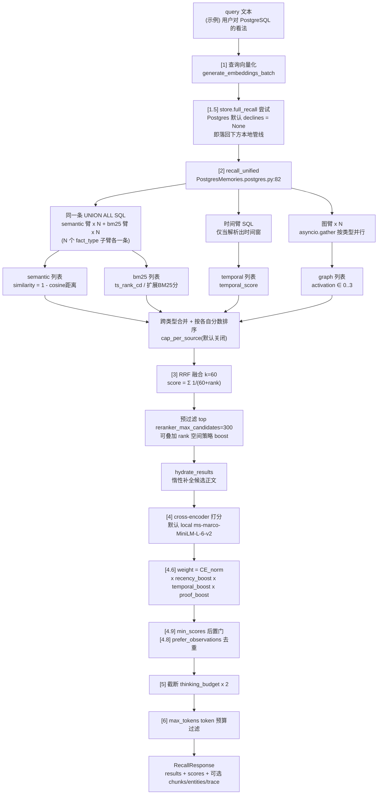
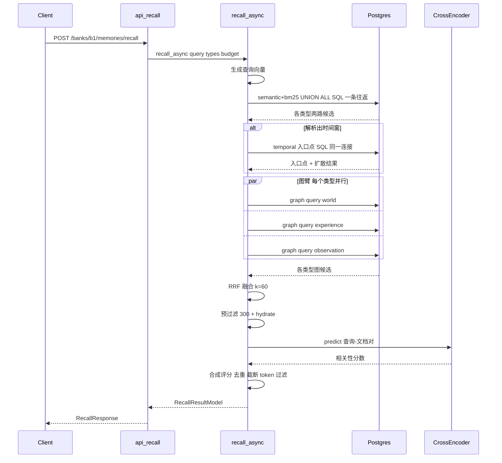

# 03 · Recall 检索系统庖丁解牛

> 研究对象：`hindsight-api-slim/hindsight_api/engine/search/` 及其外围（`query_analyzer.py`、`_vector_index.py`、`migrations.py` 的索引 DDL、`api/http.py` 的 recall 路由）。
> 所有论断均先读代码核实，标注 `相对路径:行号`；无法确认之处明确写"未确认"。示例数据一律标注"（示例）"。
> 本篇回答六个必答问题：① 四条检索臂的确切清单与数据来源（1.3）；② 并行如何实现、某一路失败会怎样（1.4 与 2.3）；③ RRF 公式与各路结果条数上限（3.5）；④ reranker 的输入输出、默认 provider、关闭时行为（3.6）；⑤ temporal 路如何从自然语言抽时间（3.4）；⑥ recall 的缓存与优化手段（3.10）。

---

## 第 1 层【全景】：recall 是什么，为什么是"多路"

### 1.1 Recall 是什么

Recall 是 Hindsight 的核心读操作：给定一条自然语言查询，从一个 memory bank 中取出最相关的记忆事实（memory_units），返回给上层 agent 使用。HTTP 入口是：

```
POST /v1/default/banks/{bank_id}/memories/recall
```

定义在 `hindsight-api-slim/hindsight_api/api/http.py:5873`（`api_recall`，:5886）。请求模型 `RecallRequest`（`api/http.py:416`）的关键字段：

- `query`：自然语言查询；
- `types`：要召回的事实类型，可选 `world / experience / observation`，缺省全部三种（`engine/response_models.py:16` 的 `VALID_RECALL_FACT_TYPES`）；
- `budget`：`low/mid/high`，映射为检索预算 `thinking_budget`（固定档默认 100/300/1000，`config.py:1909-1911`）；
- `max_tokens`：返回文本的 token 预算（默认 4096）；
- `min_scores`：四个可选分数下限（`response_models.py:250`）；
- `temporal_window`：调用方直接给的时间窗（跳过查询文本里的日期解析，`response_models.py:299`）。

引擎入口是 `MemoryEngine.recall_async`（`engine/memory_engine.py:7894`），返回 `RecallResultModel`（results + 可选 trace/entities/chunks/source_facts）。

### 1.2 为什么单路向量检索不够

代码把每条检索路径称为 **arm（臂）**，下文沿用这个称呼。代码本身对这个问题给出了相当具体的回答，散落在注释与设计文档里：

1. **词面精确匹配是向量的盲区。** BM25 臂的注释直言：原生 tsvector 没有 IDF、逐行打分是负担，但它的存在价值就是 lexical 匹配（`engine/search/bm25_term_selection.py:1-29`）。反过来，一个精确的标识符（端口号、版本号）在向量空间里往往被"语义平滑"掉——这也是 recall `MinScores` 模型的 docstring 里说的 "an exact identifier the embedding scores poorly"（`engine/response_models.py:268`）。
2. **多跳关联是向量够不到的。** 图检索臂的抽象类 docstring：通过实体链接、时间链接、因果链遍历记忆图，"find relevant facts that might not be found by semantic or keyword search alone"（`engine/search/graph_retrieval.py:22-26`）。查询"用户对 PostgreSQL 的看法"时，一条没有共同词面、但与 PostgreSQL 实体相连的吐槽，只有图路能捞回来。
3. **时间语义是独立维度。** "上周做了什么"这类查询，语义相似度无法表达"时间要在窗口内"；时间臂用 occurred/mentioned 时间字段做入口点选择 + 沿时间/因果边扩散（`engine/search/retrieval.py:463-792`）。
4. **单一排序信号会被单臂偏差主导。** RRF 的意义在于把"各自强"的结果汇到一张榜上；而纯 RRF 又有"单臂第一被平均掉"的失败模式——`interleave_fusion` 的 docstring 记录了一个真实案例：consolidation（后台把原始事实整合为"观察"等派生记忆的流程）去重时，语义排名第 1 的"孪生"观察被 RRF 平均到预算线以下，LLM 没看见它，于是新建了重复记忆（`engine/search/fusion.py:112-130`）。

所以 recall 的设计是 **N 个事实类型 × 4 条检索臂**（引擎 docstring 原话 "N*4-way parallel retrieval"，`memory_engine.py:7928`），再融合、重排、截断。

### 1.3 四条臂的确切清单与数据来源（必答问题 1）

| 臂 | 名称 | 数据来源（表 / 索引） | 产出分数 | 代码位置 |
|---|---|---|---|---|
| 1 | semantic 语义 | `memory_units.embedding`；每个 `(bank_id, fact_type)` 一个**部分 HNSW 索引**（HNSW = 分层可导航小世界图，pgvector 的近似最近邻索引；`vector_cosine_ops`，迁移 `d5e6f7a8b9c0_add_bank_internal_id_and_per_bank_hnsw.py:103-117`） | `similarity = 1 - (embedding <=> query)` | `engine/search/retrieval.py:123-400`；SQL 形状 `engine/sql/postgresql.py:306-335` |
| 2 | BM25 关键词 | 默认 native：`memory_units.search_vector`（写入路径填充的 tsvector 列——PG 全文检索的词素向量列，`engine/db/ops_postgresql.py:25-61`）+ GIN 索引（倒排索引）`idx_memory_units_text_search`（`migrations.py:1040-1048`）；可换 vchord/pg_textsearch/pgroonga/pg_search 四种扩展索引（`migrations.py:966-1048`） | `ts_rank_cd(...)` 或对应扩展的 BM25 分 | `engine/sql/postgresql.py:337-449` |
| 3 | graph 图扩展 | `unit_entities`（实体共现）+ `memory_links`（semantic kNN 链、causes/caused_by/enables/prevents 因果链）+ observation 经 `memory_units.source_memory_ids` 数组列间接遍历（`observation_sources` 结对表仅 Oracle 使用） | `activation`（entity+semantic+causal 加分和，∈[0,3]） | `engine/search/link_expansion_retrieval.py` |
| 4 | temporal 时间 | `memory_units` 的 `occurred_start/occurred_end/mentioned_at` 时间字段做入口点；`memory_links` 中 `temporal/causes/caused_by/enables/prevents` 边做扩散 | `temporal_score`（含 `temporal_proximity`） | `engine/search/retrieval.py:463-792` |

一个重要的工程事实：**semantic 与 BM25 不是两条独立 SQL，而是同一条 `UNION ALL` 查询里的两组子查询**（每个 fact_type 一条 semantic 子臂 + 一条 bm25 子臂，`retrieval.py:264-316`），一次往返同时取回两路候选，并用 `source` 列区分。所以"四路"是**逻辑上的四路**，物理上是"1 条合并 SQL + 1 条时间 SQL + 每 fact_type 一条图 SQL"。

### 1.4 核心事实速查（必答问题 2/3/4 的答案预告）

- **并行方式**：不是"四路 `asyncio.gather`"。真实执行序是：semantic+BM25 合并 SQL →（同一连接上）时间 SQL → 之后每 fact_type 的图查询用 `asyncio.gather` 并行（`engine/memories/postgres.py:135-199`，`asyncio.gather` 在 ：198；编排原因见 2.3）。某一路失败会怎样：合并 SQL 抛连接类错误时整个 recall 重试（指数退避，`memory_engine.py:8185-8201`）；Oracle Text 索引未同步（DRG-10599 等）时降级为纯 semantic 重发（`retrieval.py:329-373`）；图臂实体扩展超时只丢弃实体信号、回退 semantic+causal（`link_expansion_retrieval.py:346-363`）；时间解析抛异常一律降级为"无时间约束"（`temporal_extraction.py:107-115`）。
- **RRF**：`score(d) = Σ_lists 1/(k + rank(d))`，`k` 默认 **60**（`fusion.py:29,85`）。含义：文档每在一条臂的榜单排第 r 名就加 1/(60+r)，多臂命中则累加——"多臂都靠前"者胜；k 越大名次差距越被抹平。
- **各路条数上限**：每臂每 fact_type 最多 `thinking_budget` 条（semantic 臂在 SQL LIMIT 处控制，`retrieval.py:392`；BM25 臂由 `$3` 参数 LIMIT，`retrieval.py:320`；图臂 `budget` 截断，`link_expansion_retrieval.py:266`；时间臂扩散预算同 `thinking_budget`，`retrieval.py:662`）。融合前还有可选的 `cap_per_source`（每个臂最多向融合池贡献 N 条，0=不设限；默认 **0 = 关闭**，`config.py:1319`）。融合后进 cross-encoder（把 (query, 文档) 成对喂入模型直接输出相关度的重排序器）前有全局候选上限 `reranker_max_candidates` 默认 **300**（`config.py:1291`）。
- **reranker 默认启用**，provider 默认 `local`，默认模型 `cross-encoder/ms-marco-MiniLM-L-6-v2`（`config.py:1266,1268`；`1901 DEFAULT_ENABLE_RERANKING = True`）。bank 级 `enable_reranking=false` 会把默认策略降级为 "rrf" 直通（`memory_engine.py:1504-1513`）。

---

## 第 2 层【主流程】：一次 recall 的完整旅程

### 2.1 主干步骤（带真实代码步号）

（下文的 [1]/[1.5]/[2]/... 步号沿用引擎日志与代码注释的原始编号，便于对照源码。）

`api_recall`（http.py:5886）先做 query 长度校验（>500 token 直接 HTTP 400，http.py:5919-5926，`config.py:1573`），然后调 `recall_async`。`recall_async` 内部：

1. **租户认证 + 取消检查点**（`memory_engine.py:7986-7996`）；查询净化（lone surrogate，:8002）与长度截断到 `recall_max_query_tokens=500`（:8013-8017）。
2. **fact_type 校验 / bank 存在校验（404）/ 模糊 tag 解析**（:8020-8090，fuzzy tag 见 3.9）。
3. **解析 bank 配置**，得出 `thinking_budget`（`_resolve_thinking_budget`，:1453-1483：fixed 档直接取 100/300/1000；adaptive 档按 `max_tokens × 比例` 并 clamp 到 [20, 2000]）、`reranker_max_candidates`（:1486-1501）、以及 bank 级开关 `enable_text_search / enable_temporal_retrieval / enable_graph_retrieval / enable_reranking`（:8108-8111）。
4. **背压**：`async with self._search_semaphore`（每 worker 最多 32 个并发 recall，`config.py:1518`，:8136），失败重试最多 3 次（仅连接类错误，指数退避 0.5s/1s/2s，:8141-8201）。
5. 进入 `_search_with_retries`（:8326 起）：
   - **[1] 查询向量化** `generate_embeddings_batch`（:8420）；
   - **[1.5] 先问 store 能否整单包办**：`get_memories().full_recall(FullRecallRequest)`（:8463-8510）。默认 Postgres store 走基类默认实现返回 `None`（`memories/base.py:1431-1440`），于是落回本地管线；一个自持索引的 store 可以一跳返回全部结果（fusion/rerank 都在 store 侧做完）。
   - **[2] 四路取回**：`retrieve_all_fact_types_parallel`（:8581）→ 内部先做时间约束提取（CPU，单 worker 线程，`retrieval.py:856-874`），再把整个召回交给 store 的唯一接口 `recall_unified`（`retrieval.py:886-904`）。Postgres 实现见 2.3。
   - 跨 fact_type 合并四路列表并各自按分数排序（:8648-8656）；可选 `cap_per_source`（:8662-8671，默认关）。
   - **[3] 融合**：`reciprocal_rank_fusion`（默认）或 `interleave_fusion`（consolidation 去重专用），3 或 4 个列表取决于时间窗是否存在（:8877-8882）。
   - **[4] 重排**：RRF 分数预过滤到 `reranker_max_candidates`（:8922-8957，按 `boosted_rrf_score` 排序）；`hydrate_results` 惰性补全候选正文（:8967-8977）；cross-encoder 打分（:8991）或 rrf/interleave 直通（:8993-9007）。
   - **[4.6] 合成评分**：`apply_combined_scoring` —— `CE × recency_boost × temporal_boost × proof_count_boost`（:9045-9052；公式见 3.7）；**[4.7] 策略加成**（可选，:9055-9064）；按 `weight` 重排。
   - **[4.9] min_scores 后置过滤**（reranker/final 门，:9077-9088）；**[4.8] prefer_observations 去重**（观察压过其来源原始事实，:9125-9178）。
   - **[5] 截断**到 `thinking_budget × 2`（:9181-9183；源注释未论证为何是 2 倍）。
   - **[5.5] chunks 抓取**（独立于 max_tokens，:9190-9434）。
   - **[6] token 预算过滤** `select_facts_within_budget`（:9439-9447）。
   - 实体装配、`RecallScores` 组装（:9766-9774）、trace 终结（:9854-9867）。

### 2.2 数据流机制图（四路取回 + 融合，逻辑视图）

下图是整条管线的数据流。注意这是**逻辑视图**：图中的 semantic/bm25/temporal/graph 四条臂，每条实为 N 个 fact_type 子臂在 [2] 内合并而来（semantic 与 bm25 甚至合成一条 SQL）；"declines = None" 指 store 不实现 `full_recall` 时返回 None，管线原样落回本地路径。



读图要点：融合（[3]）只看四张榜单的名次，各臂内部的分数形态（相似度/BM25 分/activation/temporal_score）到这里全部退场；进入重排后才重新引入绝对分数。cap_per_source 默认关闭，所以图中"跨类型合并"与融合之间通常没有额外截断。

### 2.3 一次 recall 的并发时序（Postgres 默认 store）



四路执行的真实编排核心在 `engine/memories/postgres.py:82-209`，摘录关键段：

```python
# Semantic + BM25 (+ temporal) share ONE connection, exactly as before: the dense/keyword
# UNION runs first, then the temporal query on the same connection, which is then released
# before the graph arm opens its own connections.
async with acquire_with_retry(pool) as db_conn:
    semantic_bm25 = await self.search(conn=db_conn, ...)

    temporal_by_ft: dict[str, list] = {}
    if temporal_window is not None:
        start_date, end_date = temporal_window
        temporal_by_ft = await self.temporal_search(conn=db_conn, ...)

# Graph per fact_type in parallel, on the pool, after the dense connection is released —
# seeded by the dense results (preselected_semantic_seeds), matching the prior path.
graph_by_ft: dict[str, list] = {ft: [] for ft in fact_types}
if enable_graph:
    ...
    graph_lists = await asyncio.gather(*[_run_graph(ft) for ft in fact_types])
    graph_by_ft = dict(zip(fact_types, graph_lists))

return {
    ft: RecallArms(
        semantic=semantic_bm25[ft].semantic,
        bm25=semantic_bm25[ft].bm25,
        graph=graph_by_ft.get(ft, []),
        temporal=temporal_by_ft.get(ft, []),
    )
    for ft in fact_types
}
```

（摘录有省略，完整参数见 `postgres.py:135-209`。）逐点讲解：

- **"并行"的准确含义**：semantic+BM25 是同一条 UNION SQL，两臂的并行发生在 Postgres 执行器内部；temporal 在**同一连接上串行**于其后；图臂在连接释放后按 fact_type 用 `asyncio.gather` 真并行。模块 docstring 声称的 "4-way parallel search"（`retrieval.py:1-9`）是逻辑分层，不是四个并发任务。
- **连接纪律**：asyncpg 不允许同一连接上并发查询，所以 dense（即 semantic 向量路）+temporal 共用一个连接顺序执行，图臂另开连接——注释明说这复刻了统一接口之前的编排，结果"byte-identical"（`postgres.py:103-109`）。
- **失败传播**：`asyncio.gather` 默认 fail-fast——某个 fact_type 的图查询抛异常会中断整个 gather，异常向上传到 `recall_async` 的重试层；只有连接类错误才重试（指数退避），其余直接失败（`memory_engine.py:8185-8201`）。臂级别的容错只在臂内部实现（图臂超时降级、时间解析降级、Oracle Text 降级），不存在"一路失败取其它路"的聚合语义。
- **`RecallArms`**（`memories/base.py:641`）是接口契约：`{fact_type: RecallArms(semantic, bm25, graph, temporal)}`，四臂候选未融合返回，融合/重排"仍发生在下游"（:1414-1418）。

### 2.4 返回结构：一条结果带哪些分数

每条结果最终渲染为 `RecallResult`（`api/http.py:524-570`），其中 `scores` 字段是 `RecallScores`（`engine/response_models.py:226-247`）：

```python
scores_by_id: dict[str, RecallScores] = {
    sr.id: RecallScores(
        final=sr.weight,
        reranker=None if reranker_passthrough else sr.cross_encoder_score_normalized,
        semantic=sr.candidate.arm_scores.semantic,
        keyword=sr.candidate.arm_scores.keyword,
    )
    for sr in top_scored
}
```

（`memory_engine.py:9766-9774`。）逐点：`final` 是排序依据（合成评分后的 weight）；`reranker` 在直通模式（rrf/interleave 或 passthrough CE）下为 null——因为那时它的 CE 分是名次推导的占位符而非真实相关度（:9757-9765 注释）；`semantic`/`keyword` 来自 RRF 时的 `ArmScores`，该结果未被某臂命中时为 null（`types.py:134-146`）。这个四元组就是 `min_scores` 四个门的过滤对象。

### 2.5 贯穿例子（示例）：查询"用户对 PostgreSQL 的看法"

设定（示例）：bank 里有三种类型；`budget=mid` → `thinking_budget=300`；bank 未关任何臂；查询无日期词。

**步骤 1 — 查询分析（query analyzer）**：`analyze()` 先跑 `extract_period`（无 "last week"/"上个月" 等表达），再做 `_query_can_score` 快检——查询里没有数字也没有月份/星期/时段词（`query_analyzer.py:117-138`），直接跳过 dateparser，返回 `temporal_constraint=None`。**时间臂整条跳过**（`retrieval.py:858` 处 `enable_temporal_retrieval` 且无 window 才提取；提取不出约束 → `recall_unified` 收到 `temporal_window=None` → 不发时间 SQL，`postgres.py:155`）。

**步骤 2 — tokenize**：`tokenize_query` 去标点、小写、按空白切（`retrieval.py:34-40`）→ `["用户对", "postgresql", "的看法"]`（示例）。注意：native 后端的 `to_tsquery('english', ...)` 不分词中文，"用户对"会作为整词参与 OR 匹配——这是 native 后端对 CJK 的已知短板，代码用可切换扩展解决（pgroonga 的 TokenBigram、pg_search 的 `chinese_compatible`/`jieba` tokenizer，`hindsight_api/_pg_search.py:10-20`、`engine/sql/postgresql.py:381-411`）。本例假设 `postgresql` 一词命中。

**步骤 3 — 四路各自的形态**（示例数据）：

| 候选 | semantic（similarity） | bm25（rank by ts_rank_cd） | graph（activation） |
|---|---|---|---|
| obs-x "用户认为 PostgreSQL 比 MySQL 更适合复杂查询" | #1，0.82 | #2 | #2，0.91（与种子共享 2 个实体：tanh(2×0.5)=0.76 + semantic 链 0.15） |
| world-y "用户的团队主库从 MySQL 迁到了 PostgreSQL" | #2，0.76 | #1 | 未出现 |
| world-w "用户吐槽过 PostgreSQL 的内存占用" | 未进前若干名 | #3 | #1，1.52（causal 链 0.72 + 实体 0.46 + semantic 链 0.34） |
| world-z "用户在生产用 PostgreSQL 15" | #3，0.71 | 未命中 | #3，0.76 |

**步骤 4 — RRF 融合前后**（k=60，rank 从 1 起）：

- obs-x：1/61 + 1/62 + 1/62 = **0.04865**（三臂汇合）
- world-y：1/62 + 1/61 = **0.03252**
- world-w：1/63 + 1/61 = **0.03227**
- world-z：1/63 = **0.01587**

融合后顺序：obs-x > world-y > world-w > world-z。注意 world-w：语义路根本没进榜、BM25 只排第 3，但凭 graph 第 1 + bm25 第 3 仍压过只有语义#3 的 world-z——这正是多路融合想要的效果（"convergent evidence"）。

**步骤 5 — 重排后**（示例；本地模型输出 logits → sigmoid 归一化，`reranking.py:396-409`；recency/proof 的换算见 3.7：recency_boost = 1+0.2×(recency−0.5)，proof_norm = 0.5+ln(n)/10）：

| 候选 | CE raw | CE_norm | recency | proof | weight（合成后） |
|---|---|---|---|---|---|
| obs-x | 2.1 | 0.891 | 0.85 | proof_count=3 | 0.891×1.07×1.0×1.011 ≈ **0.964** |
| world-y | 0.9 | 0.711 | 0.40 | — | 0.711×0.98 ≈ **0.697** |
| world-w | -0.4 | 0.401 | 0.30 | — | 0.401×0.96 ≈ **0.385** |
| world-z | -1.1 | 0.250 | 0.50 | — | **0.250** |

（示例中重排保序；重排翻转排序的情形很常见——尤其 CE 对词面命中 vs 语义 paraphrase 的权衡与 RRF 不同。）

### 2.6 第二个贯穿例子（示例）：带时间的查询"上周用户对 PostgreSQL 说了什么"

与 2.5 同一个 bank，唯一区别是查询带时段词。

**步骤 1 — 时间提取**：`analyze()` 先跑 `extract_period`（"last week"/"上周" 属于时段表达，返回区间而非单日）。假设 `question_date=2026-10-02`（示例），得 `temporal_constraint = (2026-09-21 00:00, 2026-09-27 23:59:59.999)`（示例）。这个窗口被传给 `recall_unified` 的 `temporal_window`（`retrieval.py:893`），时间臂整条激活；其余三臂照常运行——**窗口是排名信号不是过滤器**（`response_models.py:299-315` 的 docstring 明说：窗口外的记忆仍会被另外三臂召回）。

**步骤 2 — 时间臂内部**（示例）：

1. 入口点 SQL：找时间与 [09-21, 09-27] 相交、`similarity >= 0.1` 的单元，每类型取相似度前 60（pool）；假设 world 类型命中 25 条（示例）。
2. 覆盖度选择：窗口 7 天切成 8 桶（约每桶 21 小时），25 条按桶轮转取 10 个入口点——假设周一/周三/周五各贡献若干条，而不是全部取相似度最高的周一聚类（示例）。
3. 每个入口点的时间邻近度 `temporal_proximity = 1 - min(|date - window_mid| / (total_days/2), 1)`：窗口中点的条目得 1.0，边缘得趋近 0，无日期的入口点给中性 0.5（`retrieval.py:636-652`）。
4. 扩散：从 10 个入口点沿 temporal/causal 边走，预算 300 扣减；假设邻居 n1 经一条 `weight=0.8` 的 temporal 边从入口点 e（proximity=0.9）到达：`propagated = 0.9 × 0.8 × 1.0 × 0.7 = 0.504`，若 n1 自身 proximity 只有 0.2，则其 `temporal_score = max(0.2, 0.504) = 0.504`（示例）。

**步骤 3 — 融合时**：这次 `result_lists` 是 4 个（temporal 非空，`memory_engine.py:8879-8880`）。假设 world-w（"用户吐槽过 PostgreSQL 的内存占用"）恰好 mentioned_at 落在窗口内且与入口点有 temporal 边，它就多拿一份 `1/(60+rank_temporal)`，RRF 分进一步上抬——单看语义/词面它只是个中游候选，时间维把它顶了上去。这就是"时间窗是排名信号"的具体形态。

对照结论（示例对比，非实测）：2.5 的无时间查询里 temporal 臂整体缺席（融合列表为 3 个、内部候选的 `temporal_score` 为 null——注意 HTTP 响应的 `RecallResult`（`api/http.py:524-571`）与 `RecallScores` 四元组都没有 temporal_score 字段，它只存在于内部 `RetrievalResult`（`types.py`）与 trace 中）；2.6 里它成为第四个投票者。两次调用共用同一套融合/重排代码，差别只在 `result_lists` 的长度。

---

## 第 3 层【机制深潜】

### 3.1 语义臂：部分 HNSW + 迭代扫描

semantic 子臂的 SQL 形状（`engine/sql/postgresql.py:306-335`）：

```python
return (
    f"(SELECT {cols},"
    f"        1 - (embedding <=> {embedding_param}::vector) AS similarity,"
    f"        NULL::float AS bm25_score,"
    f"        'semantic' AS source"
    f" FROM {table}"
    f" WHERE bank_id = {bank_id_param}"
    f"   AND fact_type = '{fact_type}'"
    f"   AND embedding IS NOT NULL"
    f"   AND (1 - (embedding <=> {embedding_param}::vector)) >= {min_similarity}"
    f"   {tags_clause} {groups_clause} {extra_where}"
    f" ORDER BY embedding <=> {embedding_param}::vector"
    f" LIMIT {fetch_limit})"
)
```

逐点讲解：

- **余弦距离转相似度**：pgvector 的 `<=>` 是余弦距离（0=同向），所以 `1 - distance` 即余弦相似度，与 `similarity >= sem_min`（默认 `semantic_min_similarity=0.3`，`config.py:1296`）配合做 SQL 内预剪枝。
- **为什么是 UNION ALL 而不是窗口函数**：`retrieval.py:150-156` 的注释记载了演进——早期用 `ROW_NUMBER() PARTITION BY fact_type`，迫使全表顺序扫描；改成"每个 fact_type 独立 ORDER BY...LIMIT 的子臂 UNION ALL"后，规划器可以选用**每个 `(bank_id, fact_type)` 的部分 HNSW 索引**（迁移 `d5e6f7a8b9c0` 的 upgrade 循环 ：103-117，CREATE 语句在 ：113：`CREATE INDEX IF NOT EXISTS idx_mu_emb_{ft_short}_{internal_id} ... WHERE fact_type = '{ft}' AND bank_id = '{bank_id}'`；:143-155 则是 downgrade 恢复旧版 fact_type-only 索引的对照物，无 bank_id 条件）。
- **不多取行**：`retrieval.py:159-165` 解释了一个反直觉修复——曾按 `limit*5` 取回再在 Python 截断"补偿 HNSW 近似"，但行本来就是按距离有序的，多取的行只是被丢弃；真正决定 ANN 质量的是扫描候选列表大小（连接级 GUC，即 PG 会话级配置参数），不是行数。
- **迭代扫描**：连接初始化时打上 `hnsw.ef_search=200`、`hnsw.iterative_scan=strict_order`、`hnsw.max_scan_tuples=4000`（`hindsight_api/_vector_index.py:135-142`，注意该文件在包根 `hindsight_api/` 下而非 `engine/`；默认值 `config.py:1432,1441`）。iterative scan 让 ef_search 从"硬上限"变成"每轮批量"，扫描可续批直到满足 LIMIT——过滤性查询（阈值+tags）不再因为候选列表耗尽而提前短路（`_vector_index.py:101-131`）。retain 侧链接探测则用低延迟档 `ef_search=60, iterative_scan=off`（:132-134）。
- **图种子复用**：semantic 臂取回的行同时充当图臂入口点池——`semantic_fetch = max(limit, GRAPH_SEED_LIMIT)`（`retrieval.py:203-208`），凡 `similarity >= graph_seed_min_similarity`（默认 0.3，`config.py:1297`）的前 20 条被切给 `graph_seeds`（:393-398），省掉图臂单独一次 ANN 查询。

### 3.2 BM25 臂：tsvector 真值与"IDF 自助餐"

native 子臂（`postgresql.py:412-417`）：

```python
else:  # native tsvector
    bm25_score_expr = f"ts_rank_cd(search_vector, to_tsquery('{bm25_language}', {text_param}))"
    bm25_order_by = f"{bm25_score_expr} DESC"
    bm25_where_filter = f"AND search_vector @@ to_tsquery('{bm25_language}', {text_param})"
```

- **数据侧**：`memory_units.search_vector` 是**普通 tsvector 列，由写入路径内联填充**——`to_tsvector('<配置语言>', text || ' ' || context || ' ' || text_signals)`（`engine/db/ops_postgresql.py:25-61` 的 `pg_search_vector_expr`，插入时写入 ：174-180；只有 `mental_models` 才用 `GENERATED ALWAYS ... STORED` 生成列，`migrations.py:1330-1347`），GIN 索引服务 `@@` 匹配（`migrations.py:1040-1048`）。一段历史：`memory_units` 的 search_vector 最初也是 GENERATED STORED 列，后被迁移 `p4q5r6s7t8u9` 一次性 `DROP EXPRESSION` 降级为普通列（该迁移 docstring 原话 "Drop GENERATED expression on tsvector search_vector columns"），改走写入路径内联填充——若在其它篇章看到"生成列"的口径，差异在此。打分用 `ts_rank_cd`，**没有 IDF**（`bm25_term_selection.py:1-9` 明说），所以长 OR 查询会匹配大量行并逐行打分——生产上出现过 +60s 的 BM25 挂起（同文件 docstring）。
- **词项选择**（`bm25_term_selection.py:82-118`）：超过 `bm25_max_query_terms=16`（`config.py:1310`）时，从 `pg_stats.most_common_elems`（ANALYZE 免费维护的词素频率）读每个 token 的文档频率，**保留 df 最低（最具区分度）的 16 个**而非"前 16 个"，失败时回退前 N 截断。统计是 schema 级（跨 bank），注释坦承这是设计内的近似。
- **floor 应用位置**：`bm25_min_score` 默认 0.0（`config.py:1303`）；因为 `ts_rank_cd` 在 WHERE 里重算要付双倍代价，floor 是套在外层切片上过滤的（`postgresql.py:435-449`），注释证明了它与内层谓词等价。
- **扩展矩阵**：`text_search_extension` 五选一（`config.py:1449-1450`）：`native`（tsvector+GIN）、`vchord`（`<&>` BM25，返回负分取反，`postgresql.py:363-376`）、`pg_textsearch`、`pgroonga`（TokenBigram 分词，对 CJK 友好，:381-398）、`pg_search`（ParadeDB BM25 索引 + `@@@` 布尔查询，tokenizer 可配 jieba/chinese_compatible 等，:399-411 与 `hindsight_api/_pg_search.py:10-71`）。各扩展共用同一份臂生成代码与同一个 `build_bm25_query_text` 出口（`bm25_term_selection.py:121-173`），注释说这是为了让 recall 与 knowledge search 两条 BM25 路径"不能再漂移"。

### 3.3 图臂：GraphRetriever 抽象与 LinkExpansion 实现（必答问题中的继承关系确认）

确认：`GraphRetriever` 是 ABC（`graph_retrieval.py:19`），唯一抽象方法是 `name` 与 `retrieve`；`LinkExpansionRetriever(GraphRetriever)` 是当前唯一实现（`link_expansion_retrieval.py:112`）。选择逻辑在 `get_default_graph_retriever`（`retrieval.py:84-110`）：先问 memories store 有没有自带图检索器（store-first），否则按 `graph_retriever` 配置（默认 `link_expansion`，`config.py:1517`）实例化；未知值告警后回退 link_expansion。这是清晰的扩展点：实现 `retrieve()` 即可插入新的图检索算法，管线其余部分不动。

LinkExpansion 的三步（`link_expansion_retrieval.py:131-295`）：

1. **种子**：调用方传入 `preselected_semantic_seeds`（来自语义臂的复用切片）；否则自己跑 `_find_semantic_seeds`（阈值 `graph_seed_min_similarity=0.3`，上限 `GRAPH_SEED_LIMIT=20`，:46）。种子不达标时整臂返回空（:198-199）。
2. **单跳 CTE 扩展**（非 observation，:297-369）：实体信号的 CTE 长这样（`engine/db/ops_postgresql.py:941-981`）：

```sql
seed_entities AS (
    SELECT DISTINCT ue.entity_id
    FROM unit_entities ue
    WHERE ue.unit_id = ANY($1::uuid[])
),
entity_expanded AS (
    SELECT ...memory_unit_columns...,
           COUNT(DISTINCT se.entity_id)::float AS score,
           'entity'::text AS source
    FROM seed_entities se
    CROSS JOIN LATERAL (
        SELECT ue_target.unit_id
        FROM unit_entities ue_target
        WHERE ue_target.entity_id = se.entity_id
          AND ue_target.unit_id != ALL($1::uuid[])
          AND EXISTS (
              SELECT 1 FROM memory_units mu_target
              WHERE mu_target.id = ue_target.unit_id
                AND mu_target.fact_type = $2 ...
          )
        ORDER BY ue_target.unit_id DESC
        LIMIT {per_entity_limit}
    ) t
    JOIN memory_units mu ON mu.id = t.unit_id
    GROUP BY mu.id
    ORDER BY score DESC
    LIMIT $3
)
```

逐点：种子集合的实体 → 通过 `unit_entities` 反查共享这些实体的其它单元；`COUNT(DISTINCT entity_id)` 直接以"共享实体数"为分；LATERAL 里的 `per_entity_limit`（默认 200，`config.py` 的 `link_expansion_per_entity_limit`）防止"所有人都和 Alice 有实体边"的高扇出实体炸掉中间行——注释强调过滤（fact_type、窗口）必须放在 cap **之前**，否则无关候选白白消耗该实体的受限扇出配额。同一条查询里还有 `semantic_expanded`（`memory_links` 中 link_type='semantic' 的 kNN 链，双向、取 `MAX(weight)`）与 `causal_expanded`（causes/caused_by/enables/prevents），三路信号（entity/semantic/causal）UNION ALL 后用 `source` 列拆开。整个查询 `asyncio.wait_for` 套 `link_expansion_timeout`，**超时回退到仅 semantic+causal**（:346-363）。

3. **评分合并**（:240-277）：

```python
for row in expanded.entity:
    fact_id = str(row["id"])
    entity_scores[fact_id] = math.tanh(row["score"] * 0.5)
...
score_map = {
    fid: entity_scores.get(fid, 0.0) + semantic_scores.get(fid, 0.0) + causal_scores.get(fid, 0.0)
    for fid in all_ids
}
sorted_ids = sorted(score_map.keys(), key=lambda x: score_map[x], reverse=True)[:budget]
```

逐点：实体分用 `tanh(count×0.5)` 把共享实体数压到 [0,1]（1 个→0.46，2 个→0.76，3 个→0.91，自然饱和，注释 ：233-235）；三信号**加法合成分 ∈ [0,3]**，多信号汇合的事实天然靠前；总分截断到 `budget`（=thinking_budget）；最终分数写进 `result.activation`，供跨 fact_type 合并后重排（:272-277 的注释解释了为什么不能只保留单一信号的原始分）。

**observation 的特殊性**（:371-429）：观察是 consolidation 产物，没有直接实体链；改为 `seed → 来源事实 → 实体 → 其它 world 事实 → 它们的观察` 的间接遍历，且三种信号融合进同一条 CTE（#3857，一次往返）。**方言差异**：PG 走 `memory_units.source_memory_ids` 数组列——`engine/db/ops_postgresql.py:83-84` 的 `uses_observation_sources_table = False`（注释"PG uses native array ops on source_memory_ids"），CTE 里 `unnest(source_memory_ids)`（:1097-1102）；`observation_sources` 结对表是 **Oracle 专属**（基类契约默认 True，`db/ops.py:336-342`；:613-617 的 docstring 原话 "PG uses native array ops (source_memory_ids column) for performance. Oracle uses the observation_sources junction table"）。注意 `link_expansion_retrieval.py:416-419` 处 "Both backends now use the observation_sources junction table" 的注释是过时残留，勿被误导。

### 3.4 时间臂：从自然语言到扩散图（必答问题 5）

**第一步：时间约束提取**（`retrieval.py:856-874`）。`temporal_window` 参数优先（调用方已知道范围，跳过解析——注释说明这一步是纯 CPU、串行化在单 worker 上，文档级查询可耗 1.3s）；否则 `extract_temporal_constraint_async`。

- **执行位置**：专用的 `ThreadPoolExecutor(max_workers=1)`（`temporal_extraction.py:38-49`）。注释给出实测基准（16 次并发、文档级文本）：内联时总耗时 1318ms、事件循环最长被卡 1.3s；改单 worker 线程后总耗时 1438ms（仅多 ~9%）、循环停顿峰值 2.8ms（响应性 470 倍）；worker 加宽反而更慢（2 个 2091ms——纯 Python 持 GIL，加线程只添争抢）。注意 `retrieval.py:862` 说的"文档级查询可耗 ~1.3s"是单次最坏值，与本基准的 1.3s 总停顿不是同一个数。
- **解析器**：`DateparserQueryAnalyzer`（`query_analyzer.py:276`），基于 dateparser 支持 200+ 语言；所有进入 dateparser 的路径持进程级 RLock（:240 及 :219-239 的注释解释了 locale 缓存的并发 segfault 风险）。
- **防误报打分**（:163-190, :449-460）：dateparser 会把 "we/me/did" 当某语言的星期缩写（issue #2768）、把孤立四位数当年份（issue #3250）。对策是给每个匹配按"日期信号强度"打分：

```python
score = 0
if any(any(ch.isdigit() for ch in tok) for tok in tokens):
    if _is_bare_year_span(tokens, token_set):
        return 0
    score += 100
if token_set & _MONTH_WORDS:
    score += 50
if token_set & _RELATIVE_WORDS:
    score += 50
if token_set & _WEEKDAY_WORDS:
    score += 30
if token_set & _PERIOD_WORDS:
    score += 20
```

（`query_analyzer.py:178-190`。）逐点：数字是最强信号但**裸四位数直接 0 分**（端口号/工单号不是日期，:141-160）；只留得分最高的匹配、平分时取最长匹配串（:459-460）；结果被解析为**单日窗口**（当天 00:00:00 到 23:59:59，:462-464）——"提到某个日期"语义上就指那一天；时段（"上个月"）则由先行的 `extract_period` 解析为整段区间。

- **中文专门处理**（`engine/chinese_temporal_periods.py`）：dateparser 对中文时段（"上个月""三个月内""去年"）经常返回 None 或单日窗口，于是有一套独立的中文规则：繁简归一化（週→周 等，:16-19）、中文数字解析（`parse_chinese_number`，:171）、"一个/个" 可选量词、后缀字符白名单判断（:20-73）；`extract_chinese_period`（:97）在 `analyze()` 里先于 dateparser 执行。解析失败的兜底："十万年前" 曾让 dateparser 算出公元前年份并打挂整个 bank 的 recall（issue #3217，`temporal_extraction.py:100-115`），所以入口处 try/except 降级为"无时间约束"。
- 另有 `TransformerQueryAnalyzer`（:469-721）：规则先行（yesterday/last week/June 2024 等正则覆盖 90%+），兜底用 flan-t5-small 生成 "YYYY-MM-DD to YYYY-MM-DD"。当前 recall 主路径用的是 Dateparser 版（`temporal_extraction.py:75` 的默认）。

**第二步：入口点选择 + 扩散**（`retrieval.py:463-792`，仅当窗口存在）：

- 入口点 SQL（:568-594）：每个 fact_type 一条子臂，条件是**时间与窗口相交**（occurred 区间重叠或 mentioned_at 落窗内）且 `similarity >= 0.1`（`temporal_semantic_min_similarity`，`config.py:1298`），按向量距离排序取 pool 60 条（`_TEMPORAL_POOL_SIZE`，:404）。注释（:545-554）记载了旧版"按最近取 50"的两个坑：偏向窗口末端、日期退化时变成近乎随机的全表扫描排序（66 万行 bank 上 30s+）。
- **覆盖度选择** `_select_with_temporal_coverage`（:414-460）：

```python
def _bucket(row: Any) -> int:
    d = _coalesce_date(row)
    ...
    frac = (d - start_date).total_seconds() / span
    return max(0, min(int(frac * n_buckets), n_buckets - 1))

buckets: dict[int, list] = {}
for row in ranked:  # ranked is similarity-desc, so each bucket list inherits that order
    buckets.setdefault(_bucket(row), []).append(row)

selected: list = []
tier = 0
while len(selected) < limit and any(len(b) > tier for b in buckets.values()):
    # The tier-th best item from every bucket that still has one, strongest first.
    tier_rows = [b[tier] for b in buckets.values() if len(b) > tier]
    tier_rows.sort(key=lambda r: r["similarity"], reverse=True)
    for row in tier_rows:
        if len(selected) < limit:
            selected.append(row)
    tier += 1
```

逐点：窗口切成 8 桶（`_TEMPORAL_COVERAGE_BUCKETS`），轮转从每个桶取第 1 相似者、再第 2 相似者……凑满 10 个入口点（`_TEMPORAL_ENTRY_POINTS`）——让入口点铺满窗口的时间跨度而不是扎堆在相似度最高的一小段；日期退化（全部落在同一桶）时自然退化为纯相似度序（docstring :421-430）。
- **扩散**（:693-788）：BFS 沿 `temporal/causes/caused_by/enables/prevents` 边（weight≥0.1，LATERAL 每源节点取 top-10 邻居），预算 `budget`（=thinking_budget）扣减，最多 5 轮迭代、每批 20 个节点。邻居的时间分传播公式：

```python
if link_type in ("causes", "caused_by"):
    causal_boost = 2.0
elif link_type in ("enables", "prevents"):
    causal_boost = 1.5
else:
    causal_boost = 1.0

propagated_temporal = parent_temporal_score * n["weight"] * causal_boost * 0.7
combined_temporal = max(neighbor_temporal_proximity, propagated_temporal)
```

（`retrieval.py:767-776`。）即：邻居的时间分 = max(自身时间邻近度, 父节点分×链权重×因果加成×0.7 衰减)。因果链（2.0）比使能/阻止链（1.5）和时间链（1.0）传得更远；`combined_temporal <= 0.2` 的邻居不再作为前沿继续扩散（:783）。`created_after/created_before` 的 **updated_at 窗口**在扩散 SQL 里重复施加（`retrieval.py:678-685` 的 `spreading_window = UpdatedWindow(after=created_after, before=created_before)`，注释：否则入口点会把窗外邻居拽进结果）；**时间窗本身不约束扩散邻居**——扩散 SQL（:709-734）不含任何 start_date/end_date 谓词，窗外邻居靠 `combined_temporal` 排名自然沉底（与 2.6 的"窗口是排名信号不是过滤器"一致）。Oracle 无 `unnest`，扩散整个跳过、只留入口点（:691）。

### 3.5 RRF 融合与每臂上限（必答问题 3 汇总）

`fusion.py:29-109` 的主干：

```python
source_names = ["semantic", "bm25", "graph", "temporal"]

for source_idx, results in enumerate(result_lists):
    source_name = source_names[source_idx] if source_idx < len(source_names) else f"source_{source_idx}"

    for rank, retrieval in enumerate(results, start=1):
        ...
        doc_id = retrieval.id

        # Store retrieval result (use first occurrence)
        if doc_id not in all_retrievals:
            all_retrievals[doc_id] = retrieval

        if doc_id not in rrf_scores:
            rrf_scores[doc_id] = 0.0
            source_ranks[doc_id] = {}
            arm_scores[doc_id] = ArmScores()

        rrf_scores[doc_id] += 1.0 / (k + rank)
        source_ranks[doc_id][f"{source_name}_rank"] = rank
```

逐点讲解：

- **公式**：`score(d) = Σ_lists 1/(k + rank)`，`k` 默认 60（`fusion.py:29` 签名默认值；调用处 `memory_engine.py:8882` 只传列表不传 k，故生产 k=60）。rank 从 1 起（`enumerate(results, start=1)`）。
- **并列去重**：同一文档被多臂命中时保留**首次出现**的 `RetrievalResult`（:76-77）——result_lists 按语义→bm25→图→时间的固定顺序遍历，文档在更靠前的列表里出现过就保留那一臂的行（与它在各臂的名次无关）；各臂名次另记入 `source_ranks`、原始分记入 `arm_scores`。
- **`ArmScores` 兜底**：因为只保留首次出现的行，行的分数字段只反映一臂；`arm_scores` 把每个臂的原始分数（semantic 相似度 / bm25 分）单独记账，最终随 `RecallScores` 返回（`types.py:134-146`；`memory_engine.py:9766-9774`）。
- **`source_ranks`**：`{"semantic_rank": r1, "bm25_rank": r2, ...}`——策略 boost、trace、interleave 全靠它。
- **interleave 变体**（`fusion.py:112-176`）：轮转取每臂第 1 名、再第 2 名……`rrf_score` 被赋成按位置递减的伪分数（`float(n - pos)`，:170）以兼容下游按分排序。仅 consolidation 去重 recall 显式指定（`reranking="interleave"`，`memory_engine.py:617`），且在合成评分处被特别跳过以保序（:9032-9039）。
- **上限链**（每臂 → 全局）：每臂每类型 ≤ `thinking_budget`（fixed mid=300）→ 可选 `cap_per_source`（默认 0 关闭，`config.py:1319`）→ RRF 合并池 → `reranker_max_candidates=300` 预过滤（`memory_engine.py:8927-8936`）→ 重排后截断 `thinking_budget×2`（:9181）→ token 预算。

### 3.6 Reranker：输入、输出与默认（必答问题 4）

`CrossEncoderReranker.rerank`（`reranking.py:348-445`）。输入对的构造：

```python
pairs = []
for candidate in candidates:
    retrieval = candidate.retrieval

    # Use text + context for better ranking
    doc_text = retrieval.text
    if retrieval.context:
        doc_text = f"{retrieval.context}: {doc_text}"

    # Add formatted date information for temporal awareness
    if retrieval.occurred_start:
        occurred_start = retrieval.occurred_start
        date_iso = occurred_start.strftime("%Y-%m-%d")
        date_readable = occurred_start.strftime("%B %d, %Y")
        # Prepend date to document text
        doc_text = f"[Date: {date_readable} ({date_iso})] {doc_text}"

    pairs.append([query, doc_text])

scores = await self.cross_encoder.predict(pairs)
```

（`reranking.py:362-389`。）逐点：

- **喂日期给 cross-encoder 是显式的时序感知设计**：ISO 与人类可读两种格式前置，让模型能利用绝对时间做相关性判断（例如"2022 年的会议" vs 查询里的时间锚点）。
- **归一化分叉**（:391-409）：分数全体已在 [0,1]（Cohere/Jina 等校准过的 API reranker 返回 calibrated relevance_score）则原样保留**绝对置信度**——注释强调 rank 归一化会把 0.007 的 top 候选膨胀成 1.0，抹掉弃答信号；本地模型输出 logits 才用 sigmoid。NaN 清洗为 0.0（:413-422）。
- **默认 provider**：`local`（sentence-transformers 本地模型，默认 `cross-encoder/ms-marco-MiniLM-L-6-v2`，`config.py:1266-1276`）；另有 tei/cohere/flashrank/jina-mlx/litellm/google/alibaba/siliconflow/zeroentropy 等十余种（`engine/cross_encoder.py` 的类清单）。provider 矩阵属于 M5 任务，此处只取接口面：`CrossEncoderModel` ABC 暴露 `provider_name`、`predict(pairs)` 与 `prunes_candidates` 标志（`cross_encoder.py:60-143`）。
- **prunes_candidates 语义**：个别 reranker（如 TypeSafe 可配 prune）对不相关候选回 0.0，`rerank` 末尾把 weight==0 的剔除（:434-445）——"judges relevance rather than only ordering it"。
- **关闭 reranker 时**：bank 级 `enable_reranking=false` 把默认 `cross_encoder` 策略降级为 `"rrf"`（`memory_engine.py:1504-1513`）；此时跳过 CE 调用，直接按 RRF 序构造 `ScoredResult`（cross_encoder_score=0.0，:8993-9007）；随后的 `apply_combined_scoring` 检测到 passthrough（passthrough CE：不产生真实相关度分数的重排序器——包括 rrf/interleave 直通模式与返回恒定分数的 CE），用 RRF 名次线性映射出 [0.1, 1.0] 的伪 CE 分（`reranking.py:234-245`）——否则乘法 boost 会变成唯一的排序信号，最终排序退化为纯新鲜度排序（注释 ：211-233）。响应里 `scores.reranker` 为 null（`memory_engine.py:9758-9772`）。

### 3.7 合成评分与召回 Boost（α 家族与两级策略加成）

`apply_combined_scoring`（`reranking.py:158-288`）的公式（docstring :177-182，此处代入默认 α 值；原文为符号形式 `1 + recency_alpha * (recency - 0.5)`，并注明取值范围 [1-α/2, 1+α/2]）：

```
recency_boost     = 1 + 0.2 * (recency     - 0.5)     # ∈ [0.9, 1.1]
temporal_boost    = 1 + 0.2 * (temporal    - 0.5)     # ∈ [0.9, 1.1]
proof_count_boost = 1 + 0.1 * (proof_norm  - 0.5)     # ∈ [0.95, 1.05]
combined_score    = CE_normalized * recency_boost * temporal_boost * proof_count_boost
```

- **recency 曲线**可配：`linear`（默认，365 天线性衰减到 0.1 地板）、`exponential`（半衰期 90 天的 `0.5^(days/halflife)`）、`none`（恒 0.5）（:35-62）。未来日期 clamp 到最鲜。
- **粗粒度日期的诚实处理**（:107-155，issue #3893）："2026 年的峰会"存成 2026-01-01 的整年 span，同年 8 月看它已被"陈旧"了 8 个月——这个年龄是从 span 起点 aging 凭空发明的（原文只说到年，哪一天发生并不知道）。对策：识别"恰好一个日历月/年"的 span（容差 86400s（一天），:77-104），从**span 末端**计龄且封顶在中性 0.5——"我们不知道在这个期间的哪一天"，但 2015 年照样该衰减。
- **proof_count**（仅 observation）：`proof_norm = 0.5 + ln(proof_count)/10`，clamp [0,1]，最多 ±5%（:268-278）。
- **策略 boost**（`recall_boost.py`）两级，由 `HINDSIGHT_API_RECALL_STRATEGY_BOOSTS`（如 `graph:high`）触发，默认空（`config.py:1323`）：
  - **rank 空间（重排预过滤前）**：`boosted_rrf_score` 把被 boost 臂的贡献改写为 `1/(k + rank/divisor)`——divisor 2/4/8 对应 low/medium/high（:97-101）。docstring（:27-48）论证了为什么不做标准 weighted-RRF：k=60 的分数动态范围只有 5.9 倍（300 候选窗口内 1/61→1/360），任何更大的权重都会让排序退化为"被 boost 臂优先"的字典序，实测 recall@20 从 0.97 崩到 0.40；改成 rank 除法后"臂内第 r 名胜过他臂第 s 名 ⇔ r < divisor×s"，与池大小无关。
  - **加法（重排后）**：`additive_strategy_boost` 给最终 weight（~[0,1]）加 0.05/0.2/0.5（low/medium/high）的平坦 bump（:131-147），补偿"本地 CE 双峰分布把图臂结果压到近 0"的偏差（:85-96 的校准注释）。
- **min_scores 四门**（`response_models.py:250-296`）：`semantic/keyword` 是下推到各自 SQL 臂内的检索级下限（只约束那一臂，图/时间臂进来的结果合法地为 null）；`reranker/final` 是重排后对每条结果的后置谓词（可做"低置信弃答"）。代码位置：SQL 侧 `retrieval.py:192-196`，后置 `memory_engine.py:9077-9088`。

### 3.8 追踪（trace）机制

三层观测并行存在：

1. **SearchTracer**（`tracer.py:31`）：每次 recall 都构建（`memory_engine.py:8378-8387`），但 `phases_only = not enable_trace`——阶段耗时（`add_phase_metric`）**总是**采集并转发给 metrics collector（`tracer.py:210-241`），而候选明细（每臂结果、RRF 榜、重排名次变化、entry points、visits）只在 `enable_trace=true` 时构建。`memory_engine.py:8360-8373` 的注释把这条纪律上升为规范："Never guard on `if tracer:`"——曾经三次犯过"tracer 恒存在却按它判空"导致白建 payload 的同一类 bug，有守卫测试 `test_recall_tracer_payload_gating.py` 看门。trace 模型在 `trace.py:149-174`（`SearchTrace`：query/retrieval_results/rrf_merged/reranked/entry_points/visits/summary/final_results），`reranked` 里带 `rank_change`（`tracer.py:342`）方便看重排把谁提上来/压下去。
2. **OpenTelemetry spans**：`hindsight.recall` 父 span + embedding/retrieval/fusion/rerank 子 span（`memory_engine.py:8123-8129, 8414, 8564, 8869, 8910`）。
3. **recall 阶段直方图**：HTTP 层 `record_recall_phase` 记 `http_to_handler/mw_and_routing/deps_total/body_parse/engine_call/post_engine`（`http.py:5899-5916, 6089`），外加依赖阶段 `dep_auth/dep_precheck`（`http.py:5320, 5338`）——注意 `[RECALL HTTP]` 慢日志行里的 `pre/recall/post` 三段（:5958, :6095）只是日志标签，不是阶段名；引擎内 `record_recall_phase` 记录 `bank_config/fuzzy_tags/semaphore_acquire/parallel_retrieval/rrf_merge/reranking/combined_scoring/token_filtering/...`（抽查：`parallel_retrieval` 见 `memory_engine.py:8844`、`rrf_merge` :8904、`token_filtering` :9457）——动机写在注释里：在满载的系统上，此前已有的阶段只覆盖一次 recall 墙钟的 10%（其余 90% 都是真实的 await）——所以引擎内每个未计时的 await 都是插桩候选（`memory_engine.py:7981-7984`）。

### 3.9 tags 过滤与模糊解析（简）

四条臂的 SQL 都拼同样的 tags 谓词：`any/any_strict` 用 `&&`（overlap）、`all/all_strict` 用 `@>`（contains）、`exact` 是 `@> AND <@`（集合相等）（`tags.py:44-45, 76-83`）；any/all 默认包含未打标行——机制是子句再 OR 上 `tags IS NULL OR tags = '{}'`（`tags.py:224-226`）。`tag_groups` 支持嵌套 and/or/not 布尔组合；`resolve="fuzzy"` 的叶子在进 SQL 前被 `tag_resolution.py` 用 trigram 相似度（阈值 0.45，与实体解析共用同一个 `similarity()` 判据，:26-30）重写成精确叶子——词表超过 5000 直接 422 拒绝而不是悄悄截断（`tag_resolution.py:52-56`，`MAX_VOCABULARY = 5000`）。这就是 `memory_engine.py:8086` 在构建 SQL 前做 `_resolve_fuzzy_tag_groups` 的原因。

### 3.10 缓存与优化手段清单（必答问题 6）

recall 路径上没有传统意义的"结果缓存"，但优化密度很高：

1. **索引层**：每 `(bank, fact_type)` 部分 HNSW（3.1）；`search_vector` GIN / 扩展 BM25 索引（3.2）；`memory_links` 的 `(from_unit_id, link_type, weight DESC)` 复合索引供 LATERAL 早停（`retrieval.py:664-668` 注释、`link_expansion_retrieval.py:316-320`）；`unit_entities` 的 `(entity_id, unit_id)`；`tags` GIN。
2. **查询层**：合并 SQL 少一次往返（semantic+BM25 同船）；图种子复用语义臂结果省一次 ANN（3.1）；图臂单条 CTE 一次往返完成三信号扩展（`link_expansion_retrieval.py:119-122`）；时间臂 pool/入口点常数（60→10→8 桶）都是实测调优值；BM25 词项选择防长查询扫描风暴（3.2）；query 里"没有日期就别碰 dateparser"的预检（3.4）。
3. **执行层**：`budgeted_operation` 限制单次 recall 的连接数（默认 4，`config.py:1572`，`memory_engine.py:8572-8578`）；进程级 semaphore 限 32 并发 recall（:8136）；时间提取单 worker 线程化保护事件循环（3.4）；cross-encoder 懒初始化 + 初始化超时（`reranking.py:314-346`）+ 本地并发上限 `reranker_local_max_concurrent=4`（`config.py:1270`）。
4. **数据移动层**：宽臂只搬 id+分数，`hydrate_results` 只在预过滤后为幸存者取正文（`memory_engine.py:8959-8977`）；observation 的 `source_memory_ids` 被 prefer_observations 去重、chunk 抓取、source_facts 三处复用，能带就带、不再回查（:9138-9145, :9220-9231, :9579-9588 的注释）；chunks 一次抓全再在 Python 里做 token 记账（"一趟往返胜过多次分批"，:9304-9306）。
5. **架构层**：`full_recall` 允许自持索引的 store 把整条 recall（含融合与重排）搬到数据所在地，把 N 次往返压成 1 次（`memory_engine.py:8439-8458` 的长注释；默认 Postgres store 不实现即 declines）。

顺带一提 `think_utils.py`：它不在检索主链上，是 reflect/think 操作的工具——把 recall 返回的事实格式化成 LLM prompt（`format_facts_for_prompt`，:52-77）并按 bank 的 disposition 三特征（skepticism/literalism/empathy 1-5）拼系统提示（:137-164），是 recall 下游的第一个消费者。

### 3.11 值得记取的工程细节（附证据）

- **查询长度三重防御**：HTTP 400（>500 token）→ 引擎内截断（防 consolidation 用整段事实文本当查询：一次退化提取的 58k 词文本被整段召回，拼出 5.4 万词项的 OR tsquery，求值打爆 PG 栈深度（SQLSTATE 54001）、卡死该 bank 一周——源注释另记全文仅 4 个 distinct token（issue #3134，`memory_engine.py:8004-8017`））→ BM25 词项选择。
- **bank 不存在返回 404** 而不是空结果：空结果与健康空 bank 无法区分，还白付了整套检索扇出的钱（#4175/#4442，`memory_engine.py:8074-8081`）。
- **取消传播**：HTTP 断连在每个阶段边界检查 `request_context.raise_if_cancelled()`（:7996, 8437, 8987, 9116），重排这种不可中断的 CPU 段之前特意设卡。
- **trace 时间戳语义**：trace 的 timestamp 是"排名计算所依据的锚点"（调用方的 `question_date`），不是 trace 构建时刻（#4217，`memory_engine.py:8375-8384`）。
- **陈旧 docstring 残留**（读码时勿信）：`memory_engine.py:7945` 写 budget "high=600 units"，与实现（HIGH=1000，`config.py:1911`）矛盾；:8342 的架构注释 "4. Diversity: MMR with λ=0.5" 在当前管线无对应实现（融合后是 RRF/interleave + cross-encoder，无 MMR 步骤）；`retrieval.py:154-156` 仍写 per-fact_type 索引 "created automatically by Alembic migration a3b4c5d6e7f8_add_partial_hnsw_indexes.py"——该文件名的迁移并不存在（versions/ 下只有同前缀的 `a3b4c5d6e7f8_add_consolidation_failed_at...`），且它点名的 idx_mu_emb_world/observation/experience 三个 fact_type-only 索引已被 `d5e6f7a8b9c0` 删除并按 `(bank_id, fact_type)` 重建，与上两条同类。

---

## 附：未能确认 / 留给后续模块的点

1. **`full_recall` 的非 Postgres 实现**（哪个 store 真正实现了 store-answered recall、其 per-stage 计时内容）在 `engine/memories/` 之外的扩展包里，本文只确认了接口契约与默认 declines（`memories/base.py:1431-1440`），未逐一核对实现方。
2. cross-encoder 各远程 provider 的重试/超时矩阵（`config.py:1256-1290` 的常量与 `cross_encoder.py` 内部实现）按分工属于 M5，本文未展开。
3. `TransformerQueryAnalyzer` 在当前配置下是否可被选为默认（`from_env` 的选择逻辑未追到），主路径默认确认为 Dateparser 版（`temporal_extraction.py:75`）。
4. `observation_sources` 结对表为 **Oracle 专属**（PG 走 `memory_units.source_memory_ids` 数组列：契约默认 True 在 `db/ops.py:336-342`，PG 覆写 False 在 `ops_postgresql.py:83-84`）；该表在 Oracle 侧的完整 DDL 与写入时机（consolidation 侧，`consolidator.py:3006` 起的同步分支）未在本文核实。
