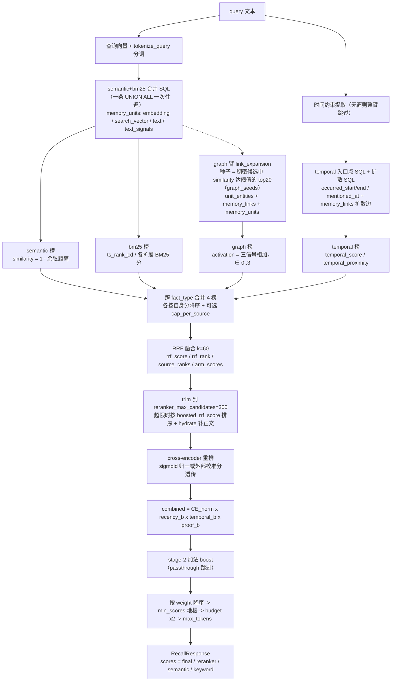

# 03a · Recall 四路检索：数据源与打分算术细看

> 代码基线：`6d8b09678`（v0.10.3，2026-10-09）。本篇是 [03 篇](03-recall-检索系统.md)的深挖伴读：03 篇讲**流程与机制**（编排、并行、为什么多路），本篇讲**数据与算术**——每个数字从哪张表哪个字段来、每一步怎么算出来。
> 素材为四份交叉互证的研究稿（数据源字典 / SQL 解剖 / 融合打分链 / 输出契约与示例），本文忠实合成、不引入新研究；研究稿间残留冲突按交叉裁决采纳（X1 = 图臂数据源与投影列；X2 = interleave 与显式 rrf 的 weight 写链），文中标注。
> 引用格式 `相对路径:行号`，Python 代码以 `hindsight-api-slim/hindsight_api/` 为根，DDL 引 `hindsight_api/alembic/versions/`（下称 `versions/`）。仓库根下 3 个 `*_old_tmp` 临时文件为并行会话产物，未引用。

---

## 0. 总览：四路 → 表/字段 → 融合 → 输出

一句人话：recall 的所有行都来自 `memory_units` 一张主表，四条路只是用**四种不同的字段族当钥匙**——semantic 用 embedding、bm25 用 search_vector/text/text_signals、temporal 用三个时间戳加 memory_links 边、graph 用 unit_entities + memory_links 两张边表；四张榜单带着各自的原始分汇合，融合只看名次，最后合出一个 `weight` 排序、只向调用方暴露四个分数。



读图要点：**"四路"是逻辑分层**——semantic 与 bm25 物理上是同一条 UNION ALL SQL 的两组子查询（每 fact_type 各一臂，`memories/pg/recall.py:28-305`），temporal 是第二条 SQL（同连接串行），graph 是按 fact_type 并行的第三批 SQL（`memories/postgres.py:145-251`）；**融合只看名次**——进 RRF 前四臂各自按自己的分数重排（`memory_engine.py:9568-9576`），`arm_scores` 只记 semantic/keyword 两臂原始分（`fusion.py:90-93`），activation 与 temporal 分此后只在 trace 可见；**输出只暴露四个分数**——`final / reranker / semantic / keyword`（`response_models.py:241-262`）。

---

## 1. 数据源字典

### 1.1 主表 `memory_units`：recall 的全部行来源

一句人话：这张表 20 多个字段里，recall 真正当"钥匙"用的只有 10 个左右——`bank_id/fact_type`（隔离与分片）、`embedding`（semantic）、`search_vector/text/text_signals`（bm25）、`occurred_start/occurred_end/mentioned_at`（temporal）、`tags`（过滤），其余字段要么只进投影（原样带回给调用方），要么干脆不消费。

| 字段 | 类型 | 默认/约束 | 语义 | 被哪路消费 | 证据 |
|---|---|---|---|---|---|
| `id` | UUID | PK, default `gen_random_uuid()` | 记忆单元主键 | 四路（连接/去重键） | versions/5a366d414dce_initial_schema.py:268 |
| `bank_id` | TEXT | NOT NULL | 银行隔离键 | 四路（首谓词） | initial_schema.py:269 |
| `document_id` | TEXT | 可空；复合外键 `(document_id,bank_id)→documents(id,bank_id) ON DELETE CASCADE` | 来源文档 | 四路投影 | initial_schema.py:270,286-291 |
| `text` | TEXT | NOT NULL | 事实文本 | semantic 的嵌入原文；bm25 的索引列（native/vchord 经 search_vector 派生，pg_textsearch/pgroonga/pg_search 直接建在基列）；graph/temporal 投影 | initial_schema.py:271 |
| `embedding` | `vector(384)`（运行时可 `ALTER TYPE vector(N)` 改维度） | 可空 | 密集向量 | **semantic 主键**（`1-(embedding<=>$1)`）；temporal ANN 池；graph 种子 | initial_schema.py:272；维度默认 config.py:1282,2099；改维 migrations.py:707；语义谓词 sql/postgresql.py:336-347 |
| `context` | TEXT | 可空 | 事实上下文句 | bm25（native 表达式第二项；pgroonga/pg_textsearch 索引表达式；pg_search 建索引含它但查询 `should` 只打 text+text_signals）；其余路投影 | initial_schema.py:273；pg_search 查询取舍 sql/postgresql.py:413-425 |
| `event_date` | TIMESTAMPTZ | NOT NULL→**改可空** | 旧时间字段，"kept for backward compatibility" | **不再被 temporal 窗口谓词使用**；仅初始索引族沿用 | versions/aa2b3c4d5e6f_nullable_event_date.py:31；models.py:135-138 |
| `occurred_start` / `occurred_end` | TIMESTAMPTZ | 可空 | 事件发生区间 | **temporal**：4 种窗口重叠谓词之一 | initial_schema.py:275-276；recall.py:484-492 |
| `mentioned_at` | TIMESTAMPTZ | 可空 | 事实被提及的时间 | **temporal**：窗口谓词 + 无 occurred 时的时间近似 | initial_schema.py:277；recall.py:488,557-564 |
| `fact_type` | TEXT | NOT NULL default `'world'`；CHECK 演化见 1.2 | 事实类型（分片谓词） | 四路（每个 UNION 臂内联字面量过滤；部分索引谓词） | initial_schema.py:278,293-295 |
| `confidence_score` | Float | 可空，0..1 CHECK | 置信度 | 四路不直接消费（rerank 前不参与） | initial_schema.py:279,296-305；opinion 专属约束删除+重加 versions/g2h3i4j5k6l7_remove_opinion_fact_type.py:44,58 |
| `access_count` | Integer | 已**删除** | —— | —— | versions/e4a7c1b9d2f6_drop_memory_units_access_count.py:56 |
| `metadata` | JSONB | default `'{}'` | 用户元数据 | semantic/bm25/temporal 投影；**graph 臂投影不含 metadata**（X1 裁决：MEMORY_UNIT_COLUMNS 契约与种子自查均无此列） | initial_schema.py:281-283；投影列 recall.py:115-118,472-475,631；graph 契约 ops.py:45-58、link_expansion.py:95-97 |
| `created_at`/`updated_at` | TIMESTAMPTZ | default `now()` | 创建/最后更新 | **四路的 `created_after/before` 实际过滤 `updated_at`** | initial_schema.py:284-285；recall.py:149-164 注释 |
| `search_vector` | tsvector / bm25vector / TEXT（随后端） | 曾 GENERATED，后 DROP EXPRESSION | 全文检索向量 | **bm25 主键** | §1.3 |
| `text_signals` | TEXT | 可空 | 实体名等去规范化拼接（增广 BM25） | **bm25**（native 第三项；pg_search should 字段；pgroonga 表达式） | versions/a2b3c4d5e6f7_add_text_signals_column.py:1-14,54 |
| `chunk_id` | TEXT | 可空；FK→chunks ON DELETE SET NULL；`idx_memory_units_chunk_id` | 来源 chunk | 四路投影 | versions/b7c4d8e9f1a2_add_chunks_table.py:49-57 |
| `tags` | VARCHAR[] | NOT NULL default `'{}'`；GIN `idx_memory_units_tags` | 可见性/过滤标签 | **四路**（SQL 内 `@>`/`&&` 过滤 + graph Python 侧再过滤） | versions/g2a3b4c5d6e7_add_tags_column.py:35-38；engine/search/tags.py:197-222 |
| `observation_scopes` | JSONB | 可空 | 观测 consolidated 的 scope 配置 | recall 不直接消费 | versions/z1u2v3w4x5y6_add_observation_tags_to_memory_units.py:1-10 |
| `proof_count` | INT | default 1 | 支撑该 observation 的事实数 | graph observation 扩散投影；四路投影；boost 侧（§3.5） | versions/p1k2l3m4n5o6_new_knowledge_architecture.py:98-101 |
| `source_memory_ids` | UUID[] | default `'{}'`；GIN 部分索引（fastupdate=off） | observation 的来源事实 id | **graph**（observation→source→entity→observation 扩散，PG 原生数组） | p1k2l3m4n5o6:104-107；versions/a2b3c4d5e6f8_add_gin_index_source_memory_ids.py:47-49；versions/d4e5f6g7h8i9_gin_source_memory_ids_fastupdate_off.py |
| `history` | JSONB | default `'[]'` | 变更史（后拆独立表体系） | recall 不消费 | p1k2l3m4n5o6:110-113；versions/a7b8c9d0e1f2_split_history_into_own_tables.py:147 |
| `consolidated_at` / `consolidation_failed_at` / `edited_at` | TIMESTAMPTZ | 可空 | consolidation 水位/失败/编辑时间 | recall 不消费 | versions/s4n5o6p7q8r9:37；a3b4c5d6e7f8:36；c9a1b2d3e4f5:54 |
| `attachment_ids` | TEXT[] | NOT NULL default `'{}'` | 附件 | recall 不消费（enrichment 阶段另行装配） | versions/e2f4a6c8b0d1_add_attachments.py:129 |

### 1.2 fact_type CHECK 演化

**fact_type CHECK 演化**：初始 `('world','bank','opinion','observation')`（initial_schema.py:294）→ `bank`→`experience`（d9f6a3b4c5e2:33-39）→ 删 opinion（g2h3i4j5k6l7:50，随后 i4d5e6f7g8h9 删行）→ 加 `mental_model`（p1k2l3m4n5o6:127）→ **t5o6p7q8r9s0_rename_mental_models_to_observations.py:50 定稿 `('world','experience','opinion','observation')`**。注意：SQLAlchemy 模型 `models.py:165` 与 Oracle 基线 `versions/o1a2b3c4d5e6_oracle_baseline.py:133` 都是三值 `('world','experience','observation')`，与 PG 迁移定稿的四值存在模型/迁移分歧（存疑，见 §6.3）。部分向量索引只为 `world/experience/observation` 三类建（d5e6f7a8b9c0:38-42；retain/bank_utils.py:33-37）。

### 1.3 `search_vector` 的形态演化与五种全文后端

一句人话：bm25 路的"钥匙"不是单一列——native 后端用一张应用层填充的 tsvector 列，四种扩展后端各自把索引直接建在基列或表达式上；`search_vector` 因此有"每后端一种形态"的双形态问题。

**形态演化**（三步）：

1. 初始（native 后端）：`GENERATED ALWAYS AS (to_tsvector('english', COALESCE(text,'')||' '||COALESCE(context,''))) STORED`（initial_schema.py:326-332）；vchord→`bm25_catalog.bm25vector`；pg_textsearch/pg_search→dummy TEXT（:312-325）。
2. `a2b3c4d5e6f7`：native 表达式加入 `COALESCE(text_signals,'')`（versions/a2b3c4d5e6f7:59-69）。
3. **`p4q5r6s7t8u9`：`ALTER COLUMN search_vector DROP EXPRESSION` 降级为普通 tsvector**，改为应用层 INSERT 时填充，以支持可配置语言（versions/p4q5r6s7t8u9_configurable_bm25_language.py:127-139）。

**HEAD 填充代码**（单一来源 `engine/db/ops_postgresql.py:25-59 pg_search_vector_expr`）：native→`to_tsvector('<text_search_extension_native_language>'::regconfig, text || ' ' || context || ' ' || text_signals)`（:53-58；语言经 `HindsightConfig.validate()` 校验为合法 PG 标识符后内联）；vchord→`tokenize(text||' '||context||' '||text_signals, 'llmlingua2')::bm25_catalog.bm25vector`（:55-56）；pg_textsearch / pg_search / pgroonga→返回 `None`——索引直接建在基列上，`search_vector` 保持空（:38-41 注释）。写入位点：retain 批量 INSERT 的 SELECT 内联（ops_postgresql.py:206-246，`$15` 为 text_signals，JSON 数组经 `unnest` CTE）；编辑路径 `engine/memories/pg/writes.py:580-599`（用绑定参数 `$3/$4` 而非列引用，避免看到旧值）；curation 恢复重建 writes.py:479-495。

**五种后端**（由 `HINDSIGHT_API_TEXT_SEARCH_EXTENSION` 选：`native | vchord | pg_textsearch | pgroonga | pg_search`，config.py:669,3000；initial_schema.py:98-157 检测/建扩展）。索引形态（初始迁移 + 运行时对账 `migrations.py:1106-1188 _create_text_search_index`，统一叫 `idx_memory_units_text_search`）：

| 后端 | 索引形态 | 证据 |
|---|---|---|
| native | `USING gin(search_vector)` | initial_schema.py:397-402；migrations.py:1180-1188 |
| vchord | `USING bm25 (search_vector bm25_catalog.bm25_ops)` | initial_schema.py:372-377 |
| pg_textsearch | **双形态**：初始迁移建单列 `USING bm25(text) WITH (text_config='english')`（:380 注释 "pg_textsearch doesn't support expressions"）；运行时对账层改为**表达式** `USING bm25((COALESCE(text,'')||' '||COALESCE(context,''))) WITH (text_config='english')`（migrations.py:1127-1142）——两者不等价，对账层负责把旧库收敛到表达式形态 | initial_schema.py:378-385 |
| pgroonga | `USING pgroonga(text||context||text_signals) WITH (tokenizer='TokenBigram', normalizer='NormalizerNFKC150')` | migrations.py:1143-1162 |
| pg_search | `USING bm25 (id, text, context, text_signals …) WITH (key_field='id')`，tokenizer 可配 | initial_schema.py:386-396；migrations.py:1163-1179 |

初始的 `memory_units_bm25` 物化视图及其 GIN（initial_schema.py:404-416）已被 versions/f3a5b7c9d1e2_drop_memory_units_bm25_matview.py 废弃。BM25 开关：per-bank `enable_text_search`（无 token 即跳过整个 bm25 臂，recall.py:92-95,138）。

### 1.4 索引族：四路各踩哪些索引

一句人话：这套路由设计里"索引谓词"和"SQL 谓词"是配对生长的——SQL 里写什么字面量，索引就按什么建部分索引，planner 才肯走索引而不是全表扫。**向量索引（semantic / temporal / graph 种子共用）**——per-(bank_id, fact_type) 部分索引族：`d5e6f7a8b9c0` 遍历 `banks` 行建 `idx_mu_emb_{worl|expr|obsv}_{internal_id 前16hex}`，谓词 `WHERE fact_type='<ft>' AND bank_id='<escaped>'`（versions/d5e6f7a8b9c0_add_bank_internal_id_and_per_bank_hnsw.py:38-42,103-117）。动机：只有 (bank,fact_type) 双谓词都命中部分索引，planner 才会弃用 `idx_memory_units_bank_id` B-tree（文件头注释 :16-22）。新银行在建行事务内建（bank_utils.py:40-47,103-119）；`HINDSIGHT_API_VECTOR_INDEX_MIN_ROWS`>0 时改为惰性+维护操作（bank_utils.py:106-118；`_vector_index.py:255-327` 建/留阈值与滞回）。**初始全局索引** `idx_memory_units_embedding`（initial_schema.py:362-368）在 `d5e6f7a8b9c0` 对非 ScaNN 后端**删除**（:92-93；ScaNN 保留全局、filtered scan，:79-84），残留兜底清理 f2a6d8c4b1e9:68。**操作符类/参数**（`_vector_index.py:35-41`）：pgvector→`hnsw (embedding vector_cosine_ops)`；pgvectorscale→`diskann ... WITH (num_neighbors=50)`；pg_diskann→`WITH (max_neighbors=50)`；vchord→`vchordrq (embedding vector_cosine_ops)`；scann→`scann (embedding cosine) WITH (mode='AUTO')`；类型错配重建 a4b5c6d7e8f9:96-122，vchord opclass 重建 b8c9d0e1f2a3。**运行时调参**（`_vector_index.py`）：两档 GUC（PostgreSQL 会话级配置参数）——low_latency（retain 侧探测）`hnsw.ef_search=60` + `iterative_scan=off`（:132-134）；high_recall（连接池初始化）`ef_search=200` + `iterative_scan=strict_order` + `hnsw.max_scan_tuples=ann_max_scan_tuples()`（:135-142）；iterative_scan 使 ef_search 变"批量"而非上限（:119-127），总开关 `config.ann_iterative_scan`（:64-98），分发器 `ann_search_tuning_settings(ext, kind)`（:226-247）。**semantic 臂的候选深度由连接设置控制而非多取行**（recall.py:63-70 注释）。

**全文索引**：§1.3 表格所列五后端形态，统一 `idx_memory_units_text_search`。**temporal 日期部分索引**：`(bank_id, fact_type, occurred_start|occurred_end|mentioned_at)` 各自 `WHERE col IS NOT NULL`，CONCURRENTLY（versions/b3c4d5e6f7g8_add_temporal_date_indexes.py:44-60）；初始迁移的三级日期索引 `idx_memory_units_event_date/_bank_date/_bank_type_date`（initial_schema.py:336-343）以旧字段 `event_date` 为键——recall 运行时不用（§1.1 event_date 行）。

**边表与过滤索引**：`memory_links` 的 `idx_memory_links_from_type_weight (from_unit_id, link_type, weight DESC)` 与 `idx_memory_links_to_type_weight (to_unit_id, link_type, weight DESC)`（versions/f1a2b3c4d5e6、d2e3f4a5b6c7:45-48）供 LATERAL 扩散早停；`(bank_id, link_type)`（2071c7518f88:91）；`unit_entities` 的复合 `idx_unit_entities_entity_unit (entity_id, unit_id)`（h3i4j5k6l7m8:27-36，为实体扩展 index-only scan）；`tags` GIN（g2a3b4c5d6e7:35-38）；`source_memory_ids` GIN 部分索引（fastupdate=off）。

**entities 的 trgm GIN 演化**（retain 侧模糊名匹配用，recall 不查此表）：`c1a2b3d4e5f6`（canonical_name gin_trgm_ops）→ `2eee35aa3cfc`（LOWER）→ `b3e8d1c6f4a9`（排除 label 的部分索引，entity_kind 由此物化）→ **`7c2e5a9d1f40`：`GIN (bank_id, LOWER(canonical_name))` 复合 btree_gin**（bank 前缀把 `%` 模糊探测限制在单银行内，文件头 11.3M 行实测动机）。

### 1.5 图三表：`entities` / `unit_entities` / `memory_links`

一句人话：图路的全部数据来自两张边表（unit_entities = "哪些记忆提到哪个实体"，memory_links = "记忆之间的语义/时间/因果边"）；`entities` 实体主档**只在 retain 侧被消费**（实体归一在 entity_resolver），检索链路一个字都不读它（X1 裁决）。

**`entities`**（initial_schema.py:245-263）：`id` UUID PK；`canonical_name` TEXT NOT NULL；`bank_id` TEXT；`metadata` JSONB；`first_seen`/`last_seen` TIMESTAMPTZ default now()；`mention_count` INT default 1；`entity_kind` TEXT CHECK `('regular','label')`（versions/b3e8d1c6f4a9:1-15）。唯一索引 `idx_entities_bank_lower_name (bank_id, LOWER(canonical_name))`（initial_schema.py:263，实体归一的精确匹配键）。**`unit_entities`**（initial_schema.py:485-499）：**复合主键 `(unit_id, entity_id)`**；两列各带 `ON DELETE CASCADE` 外键（→memory_units / →entities）；`idx_unit_entities_unit`；单列 entity 索引被复合 `idx_unit_entities_entity_unit (entity_id, unit_id)` 取代（h3i4j5k6l7m8:27-36）。graph 实体扩展走此表而非 memory_links（link_expansion.py:317-319）。

**`memory_links`**（initial_schema.py:446-483）：`from_unit_id`/`to_unit_id` UUID NOT NULL（各带 CASCADE 外键，后改 DEFERRABLE，9f8e7d6c5b4a:89-96）；`link_type` TEXT **CHECK 七枚举 `('temporal','semantic','entity','causes','caused_by','enables','prevents')`**（:470-473）；`entity_id` UUID 可空（CASCADE FK）；`weight` Float default 1.0 CHECK 0..1（:453,474）；`created_at`；唯一索引以 `COALESCE(entity_id,'0000…')` 参与防重（:477-479）；`bank_id` TEXT NOT NULL（c5d6e7f8a9b0，回填自 from_unit）。注意：`link_type='entity'` 的行已被 e9b2c7d1f3a4:79 **整体删除**（实体连接职责移交 unit_entities），七枚举中 'entity' 成历史值。**`entity_cooccurrences`**（initial_schema.py:418-444）不直接进 recall 臂，供 graph 维护/实体消歧（engine/graph_maintenance.py、memories/pg/graph.py 消费）。

### 1.6 `banks` 表与检索四开关

一句人话：四个 `enable_*` 开关住在 `banks.config` JSONB 里（层级可配字段），其中**没有 "enable semantic"**——语义臂恒开，关不掉。

- 初始列：`bank_id` PK、`name`、`personality` JSONB、`background`、`created_at`、`updated_at`（initial_schema.py:183-198）；后 `personality`→`disposition`（versions/rename_personality_to_disposition.py）、`background`→mission 由 config 承接（`reflect_mission`，config.py:3493）。`internal_id` UUID UNIQUE default `gen_random_uuid()`——per-bank 索引名的熵源（d5e6f7a8b9c0:72-76）。**`config` JSONB NOT NULL default `'{}'` + GIN `idx_banks_config`**（versions/x9s0t1u2v3w4_add_bank_config_column.py:37-47）：per-bank 检索开关存于其中（Python 字段名格式）。
- **检索四开关**（层级字段，`_CONFIGURABLE_FIELDS` 含之，config.py:3807-3811）：`enable_text_search`、`enable_temporal_retrieval`、`enable_graph_retrieval`、`enable_reranking`（config.py:3497-3501）；env `HINDSIGHT_API_ENABLE_*`，**默认全 True**（config.py:1029-1032,1946-1948）。**没有 "enable semantic/embeddings" 开关**——semantic 臂恒开；BM25 臂受 `enable_text_search` 门控（memory_engine.py:9000-9002,19676-19690；recall.py:43-44）。

### 1.7 辅助数据源

一句人话：除了主表与边表，recall 链上还零散读三处——`pg_stats`（BM25 选词的文档频率直方图）、tags 数组列上的复合谓词、以及 Oracle 专属的 `observation_sources` 结对表。

- **tags**：数组列 `memory_units.tags VARCHAR[]`（非关联表），GIN 索引；过滤语义在 engine/search/tags.py:197-222（any=`&&`/exact=`@>`、空集=仅未打标行）；tag_groups（标签组）是同一数组列上的复合谓词（build_tag_groups_where_clause）；documents 也有同名 tags 列（g2a3b4c5d6e7:41）。
- **pg_stats（BM25 选词）**：native 后端从 `pg_stats.most_common_elems` / `most_common_elem_freqs`（`search_vector` 列的统计直方图）查候选词项文档频率，避免全表扫（engine/search/bm25_term_selection.py:70-79，详见 §2.3）。
- **observation_sources 仅 Oracle**：PG 走 `memory_units.source_memory_ids` 原生数组；junction 表 `observation_sources`（observation_id/source_id）仅 Oracle 使用——基类默认 True（engine/db/ops.py:346-352），PG 覆写 False（ops_postgresql.py:83-84），versions/k6l7m8n9o0p1 的 `_pg_upgrade` 在 PG 为 pass（:24-26）。
- **失效归档**：`invalidated_memory_units` 由 `LIKE memory_units` 建成但**不含 `embedding`/`search_vector`**（`_ARCHIVE_OMITTED`，writes.py:344-356）——recall/consolidation/graph 永不带"是否有效"谓词；恢复时按当前后端重建 search_vector、重嵌入（writes.py:479-502）。
- **`chunks`**：recall 投影携带 `chunk_id`（FK SET NULL），`recall_include_chunks`/`recall_chunks_max_tokens` 决定 chunk 是否入结果（config.py:3504-3506）。

---

## 2. 四路取数解剖

### 2.1 调用链与 limit/预算流入

一句人话：四条臂共用同一个 `limit`（= thinking_budget），各臂内部再换算；ANN 的"取多深"不靠行数靠连接设置。

调用链：`memory_engine.recall_async`（memory_engine.py:8764）→ `thinking_budget = _resolve_thinking_budget(...)`（:8993）→ `retrieve_all_fact_types_parallel`（:9501）→ `recall_unified(limit=thinking_budget)`（search/retrieval.py:191-209）→ `PostgresMemories.recall_unified`（memories/postgres.py:124）：① `search` → `retrieve_semantic_bm25_combined_sql`（postgres.py:297 / pg/recall.py:28）；② `temporal_search` → `retrieve_temporal_combined_sql`（postgres.py:334 / pg/recall.py:374，同连接串行 postgres.py:177-213）；③ 图臂 `LinkExpansionRetriever.retrieve(budget=limit)`（postgres.py:222-235，连接释放后按 fact_type 并行 ：215-241）。

- **ANN 深度不是行数而是连接设置**：`_ANN_TUNING_HIGH_RECALL` = `hnsw.ef_search=200` + `hnsw.iterative_scan=strict_order` + `hnsw.max_scan_tuples`（`_vector_index.py:135-142`，值按查询由 `ann_search_tuning_settings` :226-247 填）。`strict_order` 保证行按距离序到达（:124-126），这是 Python 端"取前缀即前 limit 名"的前提。整个并行检索包在 `budgeted_operation` 内执行，连接预算 `recall_connection_budget` 默认 4（config.py:1599，me:9495-9521）。

### 2.2 semantic 臂（与 BM25 同一条 UNION 语句）

一句人话：每个 fact_type 生成一个子查询，用余弦距离换算相似度、卡一个可配下限，按距离排序取前 N 行——靠 per-bank 部分 HNSW 索引做到"排序即索引序"。输入参数（pg/recall.py:28-44）：`query_emb_str`(→$1)、`query_text`、`bank_id`(→$2)、`fact_types`、`limit`、tags、min_semantic/min_keyword（请求级分数下限）、graph_seed_min_similarity、enable_text_search。**SQL 生成**：每个 fact_type 一臂，`dialect.build_semantic_arm`（sql/postgresql.py:320-349），PG 形态：

```sql
(SELECT id, text, context, event_date, occurred_start, occurred_end, mentioned_at,
        fact_type, document_id, chunk_id, tags, metadata, proof_count,          -- cols, recall.py:115-118
        1 - (embedding <=> $1::vector) AS similarity,
        NULL::float AS bm25_score,
        'semantic' AS source
 FROM memory_units
 WHERE bank_id = $2
   AND fact_type = '<ft>'                                    -- 内联字面量（受控枚举, recall.py:72-73）
   AND embedding IS NOT NULL
   AND (1 - (embedding <=> $1::vector)) >= <sem_min>          -- postgresql.py:343
   <tags_clause> <groups_clause> <updated_range_clause>
 ORDER BY embedding <=> $1::vector                            -- postgresql.py:347
 LIMIT <semantic_fetch>)                                      -- 内联字面量, postgresql.py:348
```

逐谓词：

- **相似度表达式** `1 - (embedding <=> $1::vector)`：`<=>` 是 pgvector 余弦距离，1−距离=相似度（postgresql.py:207-211 `vector_similarity`）。
- **`fact_type = '<ft>'` 内联字面量**：值来自内部枚举非用户输入（recall.py:72-73）；与 `bank_id` 用绑定参数 $2 形成对照（X1 修正措辞：**字面量是 fact_type，绑定参数是 bank_id**）。这个字面量同时是 partial HNSW 索引谓词的一半。`embedding IS NOT NULL`（postgresql.py:342）：partial 索引不含 NULL embedding 行，防 seq scan。
- **相似度下限 `>= sem_min`**：请求级 `min_scores.semantic` 覆盖全局 `config.semantic_min_similarity`（recall.py:97-101）。
- **updated_range_clause**（recall.py:154-164）：`created_after/before` 名为 created 实过滤 `updated_at > $n / < $m`——语义是"窗口内被写过/刷新过"，供 mental-model 增量刷新水位用（recall.py:149-151）。
- **LIMIT 是内联字面量** `semantic_fetch = max(limit, GRAPH_SEED_LIMIT=20 若 graph 阈值可达)`（recall.py:103-113）。设计注释（recall.py:63-70）：不再 `limit*5` 过取——行已按距离序，过取的行必被丢弃；ANN 质量由连接上 iterative_scan 决定。graph 阈值仅当 `sem_min <= graph_seed_min_similarity`（recall.py:108-112）才生效——否则稠密臂的 SQL 阈值截掉的高度相似行会让图臂种子失真，此时图臂自查（见 §2.6）。

**HNSW 命中**：每 bank 每 fact_type 一条 partial 索引 `idx_mu_emb_{ft}_{internal_id} ... USING hnsw (embedding vector_cosine_ops) WHERE fact_type='<ft>' AND bank_id='<bank>'`（运行时创建 ops_postgresql.py:1288-1295；迁移 d5e6f7a8b9c0 先 DROP 旧全局 partial 索引再按 bank 重建 :88-115）。WHERE 的 `fact_type` 字面量与索引谓词逐字匹配；`bank_id` 是绑定参数 $2，与索引谓词内联字面量的匹配靠 planner 对参数值的推断（custom plan 时成立）；`ORDER BY embedding <=> $1` 供 planner 直接走索引序，语义臂因此不需要外层窗口函数（旧 ROW_NUMBER+PARTITION BY 写法会强制全表扫，recall.py:54-61 注释）。Oracle 形态（sql/oracle.py:224-255）：`1 - VECTOR_DISTANCE(embedding, :1, COSINE)`，`FETCH FIRST n ROWS ONLY`，整个臂包 `SELECT * FROM (...) t`——UNION ALL 分支内行限子句必须派生表。

### 2.3 BM25 臂

一句人话：分词后拼一个 tsquery 文本作为一个绑定参数传进 SQL，native 后端用 `ts_rank_cd` 打分、`@@` 当匹配门；四种扩展后端各换一套算子，但语句骨架相同。**门控**（recall.py:92-95）：`tokens = tokenize_query(query_text) if enable_text_search else []`；tokens 为空 → 整臂省略（连分词都不做）。分词 = 去标点、小写、空格切分（search/retrieval.py:28-34）。

**tsquery 的参数化构造**：词项不逐个绑定，而是 Python 端拼成一个文本绑定 $4（参数布局 recall.py:127-137：$1=emb $2=bank **$3=limit** **$4=bm25_text** $5=tags $6+groups）。`build_bm25_query_text`（search/bm25_term_selection.py:121-173）决定 $4：native→`" | ".join(tokens)`（postgresql.py:465-478），SQL 端 `to_tsquery('english', $4)` 解析，language 内联但经 HindsightConfig 验证为 PG 标识符（postgresql.py:427-428）。**词项过多**（> `bm25_max_query_terms` 且 `bm25_selective_terms` 开，仅 native+PG）：按 pg_stats 的 IDF 选词——`_TOKEN_DF_SQL`（bm25_term_selection.py:56-79）从 `pg_stats.most_common_elems`（schemaname=$2, tablename=$3, attname='search_vector'）读每词素文档频率，保留 df 最低的 N 个（最挑剔、最高信号词）；动机：native `ts_rank_cd` 无 IDF 且不被索引支撑，宽 OR 查询会让 `@@` 命中过大并全量打分（+60s 生产挂起，:1-28）。

**native 臂 SQL**（sql/postgresql.py:426-447）：

```sql
(SELECT {cols}, NULL::float AS similarity,
        ts_rank_cd(search_vector, to_tsquery('english', $4)) AS bm25_score,
        'bm25' AS source
 FROM memory_units
 WHERE bank_id = $2 AND fact_type = '<ft>'
   AND search_vector @@ to_tsquery('english', $4)             -- 布尔匹配门, postgresql.py:431
   <tags> <groups> <updated>
 ORDER BY ts_rank_cd(search_vector, to_tsquery('english', $4)) DESC   -- :430
 LIMIT $3)                                                    -- 参数化, postgresql.py:446
```

- 打分函数 `ts_rank_cd`（压缩覆盖率变体）；`@@` 是 GIN 索引可服务的匹配门（`idx_memory_units_text_search USING gin(search_vector)`，alembic 5a366d414dce:399-402；vchord/pg_search/pg_textsearch 各自 `USING bm25(...)` DDL :374-396）。
- **分数下限**（sql/base.py:10-26 `bm25_score_gate`）：默认 0.0 时门退化为结构性的 `> 0`（native 有 `@@` 已是真匹配门，postgresql.py:449-453）；请求给了 `min_scores.keyword` 时外套 `(SELECT * FROM <arm> AS bm25_arm_{i} WHERE bm25_score >= floor)`（postgresql.py:463）——**不能放内层 WHERE**：pgroonga/pg_search 的分数只在 target list 有效、native/ts_rank_cd 与 pg_textsearch 的 `<@>` 在 WHERE 重算会双倍计算并丢索引序（:455-462）。
- **其余扩展形态**（postgresql.py:377-425）：vchord `-(search_vector <&> to_bm25query('idx_memory_units_text_search', tokenize($4,'llmlingua2')))`（<&> 返回负分数，取反 + `> 0` 门）；pgroonga `pgroonga_score(tableoid,ctid)` 打分 + `(text||' '||context||' '||text_signals) &@~ (pgroonga_tokenize OR 串)`（:395-412）；pg_search `id @@@ paradedb.boolean(should => ARRAY(...term...))`（`context` 刻意不进 should，#4313）；pg_textsearch `-(text <@> to_bm25query($4, 'idx_memory_units_text_search'))` ASC（:392-393）。
- **LIMIT 参数化差异**：BM25 臂用 `$3` 绑定，语义臂内联字面量——一个语句里两种风格并存（recall.py:131 注释：$3 只在含 BM25 臂时被引用）。
- **Oracle Text 形态**（sql/oracle.py:257-298）：`CONTAINS(text, :4, label) {gate} / SCORE(label) AS bm25_score / ORDER BY SCORE(label) DESC / FETCH FIRST :3 ROWS ONLY`，每臂唯一 label=10+arm_index 避免 UNION 内冲突；$4 由 `OracleDialect.prepare_bm25_text`（oracle.py:300-323）拼成含特殊字符过滤、保留字 `{}` 转义的 `" OR "` 串。CONTAINS 失败（DRG-10599/ORA-30600/ORA-29902，CTXSYS 索引未同步）→ 整句回退 semantic-only，且因 Oracle 要求每个 bind 都被引用（DPY-4008）须按无 BM25 布局重建参数（recall.py:234-280）。

### 2.4 两臂 UNION ALL 拼接与输出行形状

一句人话：两臂拼成一条 SQL 后**直接**发给 PG——外层零包裹、零再排序、零限幅；靠三个粘合列对齐，行回来后按 `source` 列分流。

`query = "\nUNION ALL\n".join(arms)` 后直接 `conn.fetch`（pg/recall.py:221-233）。对齐靠三个粘合列：

| 列 | semantic 臂 | bm25 臂 |
|---|---|---|
| similarity | `1-(embedding<=>$1)` | `NULL::float` |
| bm25_score | `NULL::float` | 分数表达式 |
| source | `'semantic'` | `'bm25'` |

`NULL::float` 显式定型保证 UNION 列类型一致（postgresql.py:337/435）。**输出行形状** = 13 个投影列（recall.py:115-118，含 metadata）+ similarity + bm25_score + source。Python 端 `row.pop("source")` 分流（recall.py:284-294）：semantic 行按到达序收进 `semantic_candidates`（:291 有 `len < semantic_fetch` 前缀上限，随后 ：297 截 `[:limit]`——SQL LIMIT 已保证，此处是双保险）；bm25 行直接入列。graph_seeds 从同一批稠密候选取 `similarity >= graph_seed_threshold` 的前 20 个（:298-303），避免每 fact_type 重复一次 ANN 查询。注意（X1 修正）：图臂 CTE 的投影 `MEMORY_UNIT_COLUMNS`（db/ops.py:45-58）**不含 metadata**，与稠密/BM25 臂 cols（含 metadata，recall.py:115-118）列集不一致——两处由不同消费方读取。

### 2.5 temporal 臂（pg/recall.py:308-715）

一句人话：先用"时间窗重叠 + 相似度达标"选一个 60 行的池，Python 把池按时间分桶挑出 10 个入口点，再沿时间/因果边在 SQL 里一跳一跳扩散——分数全在 Python 算，SQL 只搬运原始权重。调参常量（recall.py:308-317）：`_TEMPORAL_POOL_SIZE=60`、`_TEMPORAL_ENTRY_POINTS=10`、`_TEMPORAL_COVERAGE_BUCKETS=8`；`_CAUSAL_BOOST = {"causes":2.0,"caused_by":2.0,"enables":1.5,"prevents":1.5}`、`_TEMPORAL_DECAY=0.7`。三个时间字段均为 `TIMESTAMPTZ`；temporal 入口把 naive 输入统一置 UTC（recall.py:408-412）。**① 入口点查询**（recall.py:477-503，每 fact_type 一臂 UNION ALL，参数 $1=emb $2=bank $3=start $4=end $5=threshold $6=tags）：

```sql
(SELECT ..., fact_type, proof_count, document_id, chunk_id, tags, metadata,
        1 - (embedding <=> $1::vector) AS similarity
 FROM memory_units
 WHERE bank_id = $2 AND fact_type = '<ft>' AND embedding IS NOT NULL
   AND ( (occurred_start IS NOT NULL AND occurred_end IS NOT NULL
          AND occurred_start <= $4 AND occurred_end >= $3)      -- 区间重叠
      OR (mentioned_at IS NOT NULL AND mentioned_at BETWEEN $3 AND $4)
      OR (occurred_start IS NOT NULL AND occurred_start BETWEEN $3 AND $4)
      OR (occurred_end IS NOT NULL AND occurred_end BETWEEN $3 AND $4) )
   AND (1 - (embedding <=> $1::vector)) >= $5                   -- semantic_threshold, 默认 0.1
   <tags@$6> <groups> <updated_range>
 ORDER BY embedding <=> $1::vector
 LIMIT 60)                                                     -- _TEMPORAL_POOL_SIZE 内联
```

- **时间窗如何变成 WHERE**：四种日期形状分别判定——双端区间按 overlap（start≤$4 AND end≥$3），单点按 BETWEEN。fact_type 仍内联字面量以避开 `unnest`/LATERAL（Oracle 无等价，recall.py:415-418/467-471）。**选池策略**（recall.py:455-463 注释）：旧版按 `COALESCE(occurred_start, mentioned_at, occurred_end)` 取最近 50，在密集同日期 bank 上退化为全表扫+spill sort（30s+，660k 行实测）；现按相似度 ANN 取 60 行池。**`event_date` 闭环**（X1 修正）：入口 SQL 只投影 event_date、谓词全在 occurred/mentioned 上；`event_date` 仅为兼容保留、不进任何时间谓词（aa2b3c4d5e6f:31；models.py:135-138）。

**② 池→入口点**：`_select_with_temporal_coverage`（recall.py:325-371）纯 Python——窗口分 8 桶，按相似度降序轮转取（每桶最优→次优……），每个有数据的时段切片先于任何切片出第二行；窗口退化（全部同日期）坍缩为纯相似度序。产出每 fact_type ≤10 个入口点。

**③ 扩散 SQL**（recall.py:629-654，BFS 每批 batch_ids≤20，参数 $1=emb $2=batch_ids $3=fact_type $4=threshold $5=per_source_limit $6=bank $7=tags）：

```sql
SELECT src.from_unit_id, mu.id, mu.text, ..., mu.proof_count,
       l.weight, l.link_type,
       1 - (mu.embedding <=> $1::vector) AS similarity
FROM unnest($2::uuid[]) AS src(from_unit_id)
CROSS JOIN LATERAL (
    SELECT ml.to_unit_id, ml.weight, ml.link_type
    FROM memory_links ml
    WHERE ml.from_unit_id = src.from_unit_id
      AND ml.link_type IN ('temporal','causes','caused_by','enables','prevents')
      AND ml.weight >= 0.1
    ORDER BY ml.weight DESC
    LIMIT $5                                  -- per_source_limit=10
) l
JOIN memory_units mu ON mu.id = l.to_unit_id
WHERE mu.bank_id = $6 AND mu.fact_type = $3 AND mu.embedding IS NOT NULL
  AND (1 - (mu.embedding <=> $1::vector)) >= $4
  <tags@$7 with "mu." alias> <groups> <window clause "mu">
```

- **JOIN 形态**：`unnest` 展开批内源 id → `CROSS JOIN LATERAL` 每源取权重 top-10 邻居（注释 ：584-587：让 planner 用 `(from_unit_id, link_type, weight DESC)` 复合索引提前终止）→ JOIN 回 memory_units 取行。
- **`_CAUSAL_BOOST`/`_TEMPORAL_DECAY` 不在 SQL**：SQL 只取 raw `weight`/`link_type`；传播分在 Python 闭包 `propagated_temporal`（recall.py:539-548）= 父节点时间分 × link.weight × boost × 0.7。窗口/分数均单跳传播，无 SQL 内递归 CTE。
- **扩散重复施加的是 updated_at 窗，不是 occurred/mentioned 时间窗**：`spreading_window = UpdatedWindow(created_after/before)`（recall.py:601-605）在扩散 SQL 以 `mu.` 别名重复（:651），因为扩散会走出入口点把窗口外（按 updated_at）的邻居拉进来（:598-600）；occurred/mentioned 时间窗**不**约束邻居——in-window 入口点的 out-of-window 时间邻居是合法结果。`UpdatedWindow.clause` 渲染 `AND {alias}.updated_at > $n / < $m`（db/ops.py:307-316）。
- **时间近似优先级**：occurred 中点 > occurred_start > occurred_end > mentioned_at（recall.py:557-564，扩散侧同 :680-687）；全无则 proximity=0.5/0.3。
- **多路径收敛与预算**：同一目标可经多条边到达，Python 端 `best_by_target` 按 propagated 分留最强路径（recall.py:663-674）；结果分 = `max(自身时间邻近度, 传播分)`（:699）；继续扩散条件 `combined_temporal > 0.2`（:706）；预算 `budget_remaining = budget − len(entry_points)`（:582），迭代上限 5（:589）。
- Oracle：`supports_unnest` 检查（recall.py:611），无 unnest → 跳过扩散、只返回入口点。与语义/BM25 臂共用**同一条连接、串行**（postgres.py:177-213）；图臂随后另开连接并行。

### 2.6 graph 臂（link_expansion.py）

一句人话：种子尽量复用稠密臂结果；每轮一条 CTE 查询同时算三路信号——共享实体数（unit_entities）、语义 kNN 边、因果边（memory_links），三信号在 Python 相加成 activation。**全程不 JOIN `entities` 表**（X1 裁决：检索链路读 unit_entities+memory_links+memory_units，entities 只在 retain 侧）。**种子取得**：优先复用稠密臂结果——`preselected_semantic_seeds = semantic_bm25[ft].graph_seeds`（postgres.py:234）；为 None（语义臂 SQL 阈值覆盖不到图阈值）时自查 `_find_semantic_seeds`（link_expansion.py:170-190, 51-111）：

```sql
SELECT id, text, ..., fact_type, document_id, chunk_id, tags, proof_count,
       1 - (embedding <=> $1::vector) AS similarity
FROM memory_units
WHERE bank_id = $2 AND embedding IS NOT NULL AND fact_type = $3
  AND (1 - (embedding <=> $1::vector)) >= $4            -- config.graph_seed_min_similarity
  {tags_clause} {groups_clause} {updated_range_clause}  -- $6=tags、$7 起 groups、其后 updated_at 区间（link_expansion.py:103-105）
ORDER BY embedding <=> $1::vector LIMIT $5              -- GRAPH_SEED_LIMIT=20 (memories/base.py:786)
```

注意自查形态与稠密臂不同：`fact_type` 参数化（$3）而非内联；三个可选子句（tags/groups/updated_range）齐全（X1 修正补全）。seed_ids 去重（:203）。

**非 observation：`_expand_combined`** 单轮 CTE 查询（link_expansion.py:336-344，params [seed_ids, fact_type, budget, *window]）：

- **entity CTE**（ops_postgresql.py:980-1013）：`seed_entities AS (SELECT DISTINCT ue.entity_id FROM unit_entities ue WHERE ue.unit_id = ANY($1::uuid[]))` → 每 entity 一条 `CROSS JOIN LATERAL`：`ue_target.entity_id = se.entity_id AND ue_target.unit_id != ALL($1::uuid[]) AND EXISTS(SELECT 1 FROM mu_target WHERE mu_target.id = ue_target.unit_id AND mu_target.fact_type = $2 <window>)`，`ORDER BY ue_target.unit_id DESC LIMIT {per_entity_limit}`（先过滤后限幅，注释 ：996-998——窗口外/异类型候选不得消耗实体配额）→ `JOIN mu GROUP BY mu.id`，`COUNT(DISTINCT se.entity_id)::float AS score`（共享实体数），`ORDER BY score DESC LIMIT $3`。索引 `idx_unit_entities_entity_unit (entity_id, unit_id)`（link_expansion.py:317-319）。
- **semantic CTE**（ops_postgresql.py:1024-1055）：双向 UNION ALL——`ml.from_unit_id = ANY($1) AND ml.link_type='semantic' JOIN mu ON mu.id = ml.to_unit_id` ∪ `ml.to_unit_id = ANY($1) JOIN mu ON mu.id = ml.from_unit_id`（kNN 图非对称，需双向查），均带 `mu.fact_type = $2 AND mu.id != ALL($1)`，外层 `GROUP BY + MAX(weight) AS score ORDER BY score DESC LIMIT $3`。
- **causal CTE**（:1056-1069）：`DISTINCT ON (mu.id)`（PG 专有）保留每目标最大权重边，`ml.link_type IN ('causes','caused_by','enables','prevents')`，`ORDER BY mu.id, ml.weight DESC LIMIT $3`。
- 超时回退：`asyncio.wait_for(config.link_expansion_timeout)` 失败 → 只跑 semantic+causal（drop entity 臂，fallback LIMIT $3，link_expansion.py:349-365）。

**三信号合成在 Python**（link_expansion.py:233-268）：entity 分 = `math.tanh(row["score"] * 0.5)`（1 实体→0.46、2→0.76、3→0.91、4→0.96，自然饱和）；semantic 分 = raw `weight`（MAX）；causal 分 = raw `weight`（无 +1.0 boost——模块 docstring :16 写 "Score = weight + 1.0" 与实现 ：257-260 不符，见 §6.2）；总 `activation = entity + semantic + causal ∈ [0,3]`，排序取 `budget`。"权重"全部来自 `memory_links.weight` 单表，无独立权重表。

**observation 特殊遍历**（ops_postgresql.py:1071-1262，一条查询三臂 UNION ALL :1247-1251）：`seed_sources AS (SELECT DISTINCT unnest(source_memory_ids) FROM memory_units WHERE id = ANY($1::uuid[]) AND source_memory_ids IS NOT NULL)`（数组 unnest）→ `source_entities`（JOIN unit_entities）→ `connected_sources`（`row_number() OVER (PARTITION BY entity_id ORDER BY unit_id DESC) <= per_entity_limit` + 排除 seed_sources；用 row_number 而非 LATERAL+LIMIT 是为让列统计可追溯、估行真实——#3510，:1099-1111）→ `candidate_ids`（每源单元素 `m.source_memory_ids @> ARRAY[cs.source_id]` 探 GIN + `OFFSET 0` 阻止谓词下推，#4715，:1122-1133）→ `candidates`（fact_type='observation' 硬编码）→ `scored`（`CROSS JOIN LATERAL unnest(c.source_memory_ids)` hash JOIN 后 `COUNT(DISTINCT cs.source_id)`，set-wise 打分替代逐行相关子查询，#3085，:1088-1097）→ `observation_entity_expanded ... LIMIT $2`，semantic/causal 臂同上但 fact_type 硬编码 'observation'。PG 侧读 `memory_units.source_memory_ids`；`observation_sources` 结对表仅 Oracle（§1.7）。

### 2.7 方言差异小结

一句人话：四路的 SQL 大多在**构造期**就按方言各写一份（arm builders / CTE builders），运行期改写层只兜住散落的手写片段。构造期分派：`dialect = create_sql_dialect(conn.backend_type)`（pg/recall.py:125，测试用裸 asyncpg 缺属性时默认 postgresql）。**Oracle 的非 observation 图 CTE**（ops_oracle.py:699-805）：不能 GROUP BY CLOB → `entity_scores`/`sem_scores` 子查询只算 id+score 再 JOIN 回全列；无 DISTINCT ON → causal 用 `ROW_NUMBER() OVER (PARTITION BY mu.id ORDER BY ml.weight DESC) WHERE rn_=1`。**observation junction 表**：Oracle `SELECT DISTINCT os.source_id FROM observation_sources os WHERE os.observation_id = ANY($1::uuid[])`（ops_oracle.py:850-876）。执行期改写 `_rewrite_pg_to_oracle`（db/oracle.py:343+）详见 §6.1；temporal 扩散的 `unnest($2::uuid[])` 无 Oracle 等价，直接跳过该步（recall.py:607-611）。

---

## 3. 融合打分链

（缩写：`me:` = `engine/memory_engine.py`，`fusion:` = `engine/search/fusion.py`，`reranking:` = `engine/search/reranking.py`，`recall_boost:` = `engine/search/recall_boost.py`，`recall.py` = `engine/memories/pg/recall.py`，`link_expansion.py` = `engine/memories/pg/link_expansion.py`。链路顺序：四臂重排 → cap_per_source（默认关）→ RRF k=60 → trim 300 → 水合 → CE 重排 → combined scoring → stage-2 boost → sort by weight → min_scores 地板 → prefer_observations → budget×2 → token 预算；各环 file:line 见下文小节。）

### 3.1 汇合前：SQL 行 → RetrievalResult，四臂各自按分重排

一句人话：SQL 返回的行先变成统一的 `RetrievalResult`（每臂填自己的分数），引擎把所有 fact_type 的四臂各拼成一个大列表、各按自己的分数排好——RRF 只看名次，这一步保证名次公平。**类型**：`search/types.py:47-131`。`from_db_row`（:110-131）逐字段搬运：id/text/fact_type/context/日期四字段/document_id/chunk_id/tags/metadata/proof_count + `similarity/bm25_score/activation/temporal_score/temporal_proximity`。`entity_ids/source_memory_ids/attachment_ids`（:82/:93/:100）**不在** `from_db_row` 里——它们是"存储内联携带"字段，默认 None，默认存储后续用 `hydrate_results`/`entity_map_for_units` 补（§3.4 的水合位）。**各臂如何填分**：

- semantic/bm25：`recall.py:282-294`，UNION 行按 `source` 列分流；`semantic_fetch = max(limit, GRAPH_SEED_LIMIT)`（:113；`GRAPH_SEED_LIMIT = 20`，base.py:786）——下限保护图臂种子。graph_seeds = `similarity >= graph_seed_min_similarity`（默认 0.3，config.py:1321）的前 20 条（:298-303）。
- graph：`link_expansion.py:262-278`，三信号**相加**：`activation = tanh(实体数×0.5) + max(语义相似度) + max(因果链权重)` ∈ [0,3]（:263-266），降序取 `budget`（:268）；注释明言 activation 必须保留和分而非单信号，否则跨 fact-type 合并后的重排会与臂内序不一致（:274-278）。
- temporal：`recall.py:550-577`。入口点的分数 = 该记忆自身时间点（occurred 区间中点等，优先级见下）离查询窗口中点的接近度：`temporal_proximity = 1 - min(days_from_mid/(total_days/2), 1)`（:570，无日期 → 0.5 :572）；`temporal_score = temporal_proximity`（:575-576）。扩散邻居：`combined = max(自身 proximity, 传播分)`（:699），传播分 = 父 temporal_score × 链权重 × 因果加成 × 每跳衰减 0.7（`_CAUSAL_BOOST` causes/caused_by=2.0、enables/prevents=1.5，:316-317；:546-548）；无日期邻居 proximity 取 0.3（:697）。

**汇合后统一重排**（me:9568-9576）：四臂分别按 `similarity` / `bm25_score` / `activation` / `temporal_score or 0` 降序——注释（:9568-9569）明言 RRF 只看名次不看原始分，这一步保证名次公平。

### 3.2 cap_per_source（RRF 之前，默认关）

一句人话：可选的"每臂最多向融合池贡献 N 条"，防单一臂（如返回数百弱候选的 VectorChord）塞满重排全局预算。配置 `recall_max_candidates_per_source`（config.py:3289，env :1049），**默认 0（关）**（config.py:1343）；生效点 me:9582-9598——在四臂各自重排**之后**、fusion **之前**，对 4 个列表分别套 `cap_per_source(list, cap)`（:9587-9591）并 debug 记录前后数量。实现 `fusion.py:8-26`：`if cap <= 0 or len(results) <= cap: return results`；否则 `results[:cap]`——**只切不排**，排序责任在调用方（docstring :13-15）。存储全包路径同样收 `per_source_cap`（me:9406）。

### 3.3 RRF 融合（k=60）

一句人话：文档每在一条臂的榜单排第 r 名就加 1/(60+r)，多臂命中累加；融合产物 `MergedCandidate` 只携带名次记账，各臂原始分另存 `arm_scores`。`search/fusion.py:29-109 reciprocal_rank_fusion(result_lists, k: int = 60)`；调用点 me:9791-9806：`result_lists = [semantic, bm25, graph] (+ temporal if any)`；`reranking=="interleave"` 时换 `interleave_fusion`（fusion.py:112-176，consolidation 去重专用：RRF 会把"单臂第一、他臂缺席"的孪生 observation 均摊出局，轮询保证每臂头部有位，docstring :113-130）。

- **公式**：`rrf_scores[doc_id] += 1.0 / (k + rank)`（fusion.py:85），k=60（:29），**名次从 1 起算**（`enumerate(results, start=1)`，:61）；同一 doc 每出现在一个臂就累加一次（:85 无条件）。
- **首现行保留**：`if doc_id not in all_retrievals: all_retrievals[doc_id] = retrieval`（:76-77）——按列表顺序 semantic→bm25→graph→temporal（`source_names`，:56-59）**最先命中臂的原始行**胜出；该行只带那个臂自己的分数字段（这正是需要 arm_scores 单独记账的原因，:88-89 注释）。
- **记账**：`source_ranks[doc][f"{source_name}_rank"] = rank`（:86，键形如 `graph_rank`）；`arm_scores` 只记两臂：semantic 的 `similarity` → `.semantic`、bm25 的 `bm25_score` → `.keyword`（:90-93）。**graph 的 activation 与 temporal 的分不进 arm_scores**（ArmScores 只有这两个字段，types.py:135-146）。
- **输出**：按 rrf_score 降序枚举赋予 `rrf_rank`（:97-99），每 doc 一个 `MergedCandidate`（retrieval / rrf_score / rrf_rank=0 / source_ranks / arm_scores，types.py:148-168；`.id`/`.retrieval` 是便捷属性 :165-168）。严格类型检查防 tuple 混入（fusion.py:63-72）。**interleave 版**把 `rrf_score` 写成 `float(n - pos)` 严格递减（:170），使下游一切"按分排序"能复现轮询顺序；`source_ranks`/`arm_scores` 记账与 RRF 相同（:144-150）。

### 3.4 trim → 水合 → CE 重排与归一

一句人话：300 个候选上限只在新策略 boost 超限时才需要排序；正文到这一步才补齐；cross-encoder 输出的分数要么已是 [0,1] 直接透传、要么过 sigmoid，打不上的 0 分殿后。

**reranking 模式解析**：请求级 `reranking` ∈ {cross_encoder(默认), rrf, interleave}（me:8795）。银行级 `enable_reranking=False` 只把 `cross_encoder` 降级为 `rrf`，不碰显式的 rrf/interleave（`_resolve_reranking`，me:1657-1666——interleave 是 consolidation 去重的显式选择，不得覆盖）。并发上限 `recall_max_concurrent` 默认 32（config.py:1545）。

**预截断（trim）** me:9845-9884：`max_candidates = reranker_max_candidates`（预算解析 me:1639-1654：每档 `reranker_max_candidates_low/mid/high` 默认 0（config.py:1317-1319）→ 回落平值 `reranker_max_candidates` 默认 **300**（config.py:1315；ENV config.py:624））。`trim_merged_candidates`（recall_boost.py:195-212）：池未超限**原样返回、不排序、boost 不跑、rrf_score 保持 fusion 原值**（:208-209）；超限则按 `boosted_rrf_score` 降序取前 N（:210-212），切点记入 trace（me:9863-9884：kept/dropped/arm_composition）。**水合位**：trim 之后、任何读文本者之前——`hydrate_results`（me:9894-9904）：宽臂只传 id+分，payload 到此才取全（注释 ：9886-9893）。

**CrossEncoderReranker.rerank**（reranking.py:364-496）：

- **候选文本构造**（:384-406）：`doc_text = f"{context}: {text}"`；有 `occurred_start` 则前置 `[Date: June 5, 2022 (2022-06-05)]`（ISO + 可读两种格式）。**候选文本截断**：`max_tokens_per_candidate`（基类属性，cross_encoder.py:156；全局 env `HINDSIGHT_API_RERANKER_MAX_TOKENS_PER_CANDIDATE` 默认 None=不截，config.py:1491/:4636-4641）在 `CrossEncoderModel.predict` 统一执行（cross_encoder.py:158-170）。
- **原始分归一**（:431-449）：全部分数已落在 [0,1] → **原样透传**（外部校准 API 如 Cohere/Jina，保留绝对置信度，注释 ：431-435）；否则 **sigmoid** `1/(1+np.exp(-x))`（本地 logit 模型）。
- **失败/超时语义**：`RerankTimeoutError` 携带部分分数（cross_encoder.py:79-96）；未得分者 raw=norm=**0.0**（:464-468，注释：0.5 会溜过 min_reranker 阈值），已得分者按 CE 分降序在前、未得分者**保持 RRF 顺序**殿后（:480-483）。NaN → 0.0（:456-463）。
- `prunes_candidates=True` 的后端（cross_encoder.py:151，默认 False）在 rerank 末尾剔除 `weight==0.0`（:485-496）。`served_provider` 从 contextvar 拷出（:408-429；cross_encoder.py:62-76），failover 链下是"本次实际服务者"而非共享游标——stage2 判定与 min_scores 拒绝都吃这个值。

### 3.5 combined scoring：三重 boost 相乘

一句人话：最终分不是 CE 分裸奔——它乘上"新鲜度、时间贴合度、证据数"三个温和的乘子，每个乘子最多偏离 1 正负 α/2，谁也压不过谁。**passthrough 种子**：`is_passthrough_reranker=True`（判定 `stage2_passthrough`：显式 `reranking=="rrf"` 或 `served_provider=="rrf"`，recall_boost.py:215-223；slim 部署的 `RRFPassthroughCrossEncoder` 恒返回 0.5，cross_encoder.py:1276-1309）时，CE 归一分由 RRF 名次重造：按 rrf_score 降序 `1.0 - 0.9*rank/(n-1)`，即 [1.0, 0.1]（reranking.py:250-261）——否则乘法 boost 成为唯一信号，终序退化为纯 recency 排序（注释 ：227-249）。

**三个 boost 的输入**：

- **recency**（reranking.py:271-279 → `_recency_for_unit` :123-171）：粗粒度日期（跨度恰为一个日历月/年，容差 86400s，`_spans_calendar_period` :100-120）按**周期末端**计龄且封顶 0.5（:148-157，#3893）；否则按有效时刻 `occurred_start or mentioned_at or occurred_end`（:163，与 SQL `COALESCE` 同序，recall.py:320-322），全空 → 0.5。**衰减曲线** `compute_recency_decay`（:56-78）：**linear（默认）= `max(0.1, min(1.0, 1.0 - days_ago/window))`**，window=365 天（:52，config.py:1353）；exponential = `0.5**(days_ago/90)`（半衰 90 天，:53）；none = 0.5；未来日期钳到最大新鲜度（:66-67）。参考时刻 = `question_date` 或 now（`_recall_scoring_now`，me:1674-1680）。
- **temporal**：`sr.temporal = temporal_proximity or 0.5`（:282）——仅时间臂命中者非中性。**proof_boost**：`proof_norm = min(1.0, max(0.0, 0.5 + log(proof_count)/10.0))`（:288，仅 proof_count≥1 的 observation，:286-291）；proof_count=1 → 0.5（中性），150 → 钳到 1.0。

**公式**（:300-304；α 常量 `_RECENCY_ALPHA=0.2 / _TEMPORAL_ALPHA=0.2 / _PROOF_COUNT_ALPHA=0.1`（:35-37），乘法、各贡献 ±α/2（:32-34 注释））：

```
recency_boost     = 1 + 0.2 * (recency    - 0.5)     # ∈ [0.9, 1.1]
temporal_boost    = 1 + 0.2 * (temporal   - 0.5)     # ∈ [0.9, 1.1]
proof_count_boost = 1 + 0.1 * (proof_norm - 0.5)     # ∈ [0.95, 1.05]
combined_score    = CE_norm × recency_boost × temporal_boost × proof_count_boost
weight            = combined_score
```

`rrf_normalized` 强制 0.0 仅留 trace 连续性（:296-298）。interleave 模式**跳过整段**，`weight = rrf_score` 保序（me:9964-9971）。

### 3.6 stage-1 / stage-2 策略 boost

一句人话：`graph:high` 这类配置给被 boost 的臂加分——stage-1 在名次空间加 delta（只在候选池超 300 时当排序键用），stage-2 在最终 weight 上加法（temporal 臂全额不衰减）。

配置：`HINDSIGHT_API_RECALL_STRATEGY_BOOSTS`（config.py:1057），默认空串（config.py:1347）；解析 `_parse_strategy_boosts`（config.py:1366-1395）：strategy ∈ `{semantic,bm25,graph,temporal}`（:1357）、level ∈ `{low,medium,high}`（:1361），缺省 level=medium（:1363），非法项告警跳过（降级为无 boost 而非报错，:1372-1373）。默认 **BOOST_LEVELS**（recall_boost.py:112-116）：

| level | rank_divisor（stage-1） | additive（stage-2 rank1 上限） |
|---|---|---|
| low | 2.0 | 0.05 |
| medium | 4.0 | 0.2 |
| high | 8.0 | 0.5 |

- **stage-1（名次空间，截断前）** `boosted_rrf_score`（:127-151）：对候选出现过的每个被 boost 臂，`delta += 1/(k + rank/divisor) - 1/(k+rank)`，返回 `rrf_score + delta`。**仅**在 `trim_merged_candidates` 超限时作排序键（:210）；`rrf_score` 本身不回写（:206）。设计动机（模块 docstring :31-52）：score 空间乘权在 300-cap 窗口内（RRF 仅跨 1/61→1/360，5.9 倍——即名次本身最多带来约 6 倍分差）会被 `high=w7`（high 档的乘权 w7）压成字典序、boosted 臂独占 300 槽（#3956，recall@20 0.97→0.40）；名次空间下比较是 `r < divisor*s`，与池大小无关。
- **stage-2（加法，重排后）** `additive_strategy_boost`（:154-184）：每命中臂贡献 `additive × divisor/(divisor + rank - 1)`——rank 1 拿满、深名次衰减（high 在 rank 9 衰半）；**`_FLAT_STAGE2_STRATEGIES = frozenset({"temporal"})`**（:124）全额不衰减——temporal 臂按日期接近度而非相关度排名，衰减会把 bump 交给窗口中点附近的记忆（#4494/#4939 注释 ：118-123）。多臂命中**相加、无联合上限**（:163）。
- 应用点：me:9992-9997 `apply_post_rerank_boost`（recall_boost.py:226-245）——原地 `sr.weight += bump`；passthrough 时跳过、返回 "stage2=skipped_passthrough"（:241-242）。即 stage-2 位于 **combined scoring（:9980-9987）与最终 sort（:9998）之间**。rrf/interleave 显式模式下 stage-1 仍在 trim 中生效（trim 不分模式），stage-2 永不加（passthrough 判定 ：215-223；注释 me:9988-9991：RRF 种子权重上再加法会重排序，#4008）。

### 3.7 截断链全景（从臂内 LIMIT 到 token 预算）

一句人话：一条候选要过十道关卡才能出现在响应里——每一道的配置名与默认值如下表。（`me:` = memory_engine.py）

| # | 环节 | 位置 | 配置/量 |
|---|------|------|---------|
| 1 | 查询入口截断（**截断非拒绝**；REST 400 已删，注释引 PR #298/#3134/#1875） | me:8883-8887（fn `_truncate_query_to_token_limit` :1694-1713） | `recall_max_query_tokens` 默认 500（config.py:1600，ENV :712；0=关） |
| 2 | 每臂每 fact_type LIMIT = thinking_budget | recall.py（semantic :113/:291-297；BM25 `$3=limit` :131/:225）；graph budget=limit（postgres.py:227）；temporal 60 池/10 入口 | thinking_budget |
| 3 | thinking_budget 解析 | me:1606-1636 | fixed（默认）：low=100/mid=300/high=1000；adaptive：`round(max_tokens×{0.025,0.075,0.25})` 夹 [20,2000] |
| 4 | 每臂 cap（可选，默认关） | me:9582-9598 | `recall_max_candidates_per_source` 默认 0 |
| 5 | RRF 池 → 重排候选预算 | me:9857-9862 | `reranker_max_candidates` 默认 300（每档覆盖默认 0 → 回落平值） |
| 6 | CE prune（仅 prunes_candidates 后端） | reranking.py:485-496 | 分数恰 0.0 剔除 |
| 7 | min_scores.reranker/.final 地板 | me:10021-10028 | 请求参数，无默认 |
| 8 | prefer_observations 去重窗口 | me:10068-10122 | 仅看 `scored_results[:thinking_budget*2]`（:10074） |
| 9 | **budget×2 截断**（Step 5） | me:10124-10127 | `top_scored = scored_results[:thinking_budget*2]` |
| 10 | token 预算过滤（Step 6） | me:10256-10267 → fact_budget.py:43-87 | `max_tokens`（默认 4096；0=不返回 fact，#364） |

Step 6 规则（fact_budget.py:61-87）：按名次顺序花预算（`fact_ids_ordered` 传入即 rank 序，me:10260）；超预算的候选**跳过自身、不驱逐后面更短者**（:70-72）；全都不容下且 max_tokens>0 时**保底返回第 1 名整条**、超支照报（:76-85，"空答案读作『该库一无所知』"）。chunks 在 token 过滤**前**抓取、独立预算 `max_chunk_tokens` 默认 8192、最后一块可截断（me:10129-10254）；entities（:10425-10550）与 source_facts（:10348-10431）在其后、各有独立 token 预算。存储全包路径等价传 `truncate_to=thinking_budget*2`（:9416）。

### 3.8 终序键：`ScoredResult.weight` 的三段写入（X2 裁决）

一句人话：最终排序键永远是 `weight`，但三种 reranking 模式下它走三条不同的写链——CE 路径三段写、interleave 只写一段、显式 rrf 绕过 CE 却仍走完整 combined scoring。

**最终排序键 = `ScoredResult.weight`**，降序 sort 在 me:9998（stage-2 boost 之后、min_scores 过滤之前）。三条写链：

1. **CE 路径（默认 cross_encoder）**：初值 = CE 归一分（reranking.py:473）→ `apply_combined_scoring` 覆写为 `combined_score`（:304）→ `apply_post_rerank_boost` 原地加 stage-2 加项（recall_boost.py:244）。
2. **interleave 模式**：`weight = rrf_score`（me:9970，即 interleave_fusion 写入的位置伪分数 `float(n - pos)`，fusion.py:170）——**跳过 combined scoring**，stage-2 也不加，全程保轮询序。
3. **显式 rrf 模式**：me:9931-9939 构造的初值是 `weight=0.0`（:9936，:9938 只是按 rrf_score 排的构造序）→ 随后走 `elif scored_results:` 分支（:9972-9987）`apply_combined_scoring(is_passthrough=True)`——**CE 归一分由 RRF 名次重造 [1.0, 0.1]**（reranking.py:250-261）再乘三 boost（:303-304）；stage-2 因 passthrough 判定跳过。

（X2 裁决原样保留：interleave 与显式 rrf 的区别在于——interleave 的 weight 停在 rrf_score、跳过 combined scoring；显式 rrf 的 weight 是"RRF 名次重造的 CE 分 × 三 boost"。）**并列处理**：Python list.sort 稳定，并列保持进入 sort 时的顺序（CE 路径=CE 分降序；passthrough=RRF 序）——代码无显式 tie-break 注释（语言语义保证，有意与否未确认）。

**暴露给调用方**：最终 `MemoryFact.scores = RecallScores(final=sr.weight, reranker=ce_norm 或 None, semantic=arm_scores.semantic, keyword=arm_scores.keyword)`（me:10484-10495；response_models.py:241-262）。passthrough（rrf/interleave 或 served_provider=="rrf"）及 RANK_SCORE_PROVIDERS 下 `reranker=None`（:10484-10486）。MemoryFact 本体只带 id/text/fact_type/entities/context/日期/document_id/metadata/chunk_id/tags/source_fact_ids/scores/attachment_ids（:10505-10523）；`rrf_score/rrf_rank/source_ranks/combined_score/rrf_normalized/recency/proof_norm` 等仅进 trace（`ScoredResult.to_dict` types.py:206-253，含 legacy 别名 `activation=weight` :251）。trace 边界：tracer 恒存在（阶段耗时永远记录），但候选/访问节点等重 payload 只在 `enable_trace=True` 时构建（me:9276-9285，`test_recall_tracer_payload_gating.py` 守护）；trace 的时间锚点是 `question_date`（:9287-9296）。

**分数字段全景表**：

| 字段 | 写入环（file:line） | 谁读它 | 进最终排序? | 暴露调用方? |
|---|---|---|---|---|
| `RetrievalResult.similarity / bm25_score` | SQL 行（§3.1，recall.py:292-294） | 臂内排序 me:9570-9571；RRF 记入 arm_scores（fusion.py:90-93） | 否（经名次间接） | 是→`RecallScores.semantic/.keyword` |
| `RetrievalResult.activation` | link_expansion.py:278 | 图臂排序 me:9572 | 否 | 否（仅 trace） |
| `temporal_score / temporal_proximity` | recall.py:575-576/:702-703 | 时间臂排序 me:9576；`sr.temporal`（reranking.py:282） | 否（经 temporal_boost 间接） | 否 |
| `rrf_score` | fusion.py:85（interleave :170） | trim 排序键（recall_boost.py:210）；passthrough 种子/权重 | 间接 | 否（trace） |
| `rrf_rank / source_ranks` | fusion.py:97-103/:86 | stage-1/2 boost 读（recall_boost.py:147/:176） | 否 | 否（trace） |
| `arm_scores.semantic/.keyword` | fusion.py:90-93 | RecallScores、min_scores 响应语义 | 否 | 是 |
| `cross_encoder_score(_normalized)` | reranking.py:454-474 | min_scores.reranker；combined 乘法基数 ：303 | 是（基数） | 是（`reranker`，passthrough/rank 分下 None） |
| `recency / temporal / proof_norm` | reranking.py:271-294 | 仅作 boost 乘子输入 | 是（乘子） | 否（trace） |
| `rrf_normalized` | reranking.py:298 恒 0.0 | 无（trace 连续性） | 否 | 否 |
| `combined_score` | reranking.py:303 | 即刻复制给 weight | 是（=boost 前 weight） | 否（trace） |
| **`weight`** | reranking.py:304 → recall_boost.py:244 | 终排序 me:9998；min_final me:10027；token 选择序 | **是（最终键）** | **是→`RecallScores.final`** |
| `to_dict["activation"]`（legacy） | types.py:251 = weight | 无 | 否 | 否（trace dict 别名） |

---

## 4. 输出契约

### 4.1 HTTP 顶层六字段

一句人话：HTTP 响应顶层只有 6 个字段——results、trace、entities、chunks、source_facts、source_facts_truncated；没有 degradations、没有 pagination。路由 `POST /v1/default/banks/{bank_id}/memories/recall`，`response_model=RecallResponse`（`api/http.py:6131-6143`）：

| 字段 | 类型 | 说明 |
|---|---|---|
| `results` | `list[RecallResult]` | 必有，可为空数组（http.py:890） |
| `trace` | `dict\|None` | `trace=true` 时为 SearchTrace 字典，默认 `null`（http.py:891） |
| `entities` | `dict[str, EntityStateResponse]\|None` | 默认开启（include.entities 默认非 None，http.py:479-482）；**observations 恒为 `[]`**（me:10544-10550 "Mental models provide this now"） |
| `chunks` | `dict[str, ChunkData]\|None` | 默认关闭（http.py:483-485）；键为 `{document_id}_{chunk_index}` 风格的 chunk_id |
| `source_facts` | `dict[str, RecallResult]\|None` | 默认关闭（http.py:486-489） |
| `source_facts_truncated` | `bool\|None` | 仅请求了 source_facts 才可能非 null（http.py:899-906） |

单个 result 的字段（http.py:600-647）——**注意 HTTP 层把引擎的 `fact_type` 改名为 `type`**（`_fact_to_result`：`type=fact.fact_type`，http.py:6253）：`id, text, type, entities, context, occurred_start, occurred_end, mentioned_at, document_id, metadata, chunk_id, tags, source_fact_ids, scores, attachments`。`attachments` 由 `_attach_to_recall_results` 回填（http.py:1032-1070），无附件时为 `null`。

`scores` = `RecallScores` 四元组（`engine/response_models.py:241-262`）：

- `final`（必有）：最终排序分 = `CE_norm × recency_boost × temporal_boost × proof_count_boost`（`engine/search/reranking.py:193-198, 300-304`；α 分别 0.2/0.2/0.1，即 boost ∈ [1-α/2, 1+α/2]）。
- `reranker`：CE 归一化 0-1；**passthrough（rrf/interleave）或 rank 型 provider（`RANK_SCORE_PROVIDERS = {"typesafe"}`，`engine/cross_encoder.py:71-76`）时为 `null`**（me:10484-10490）。
- `semantic`：余弦相似度（`1 - (embedding <=> q)`，`engine/memories/pg/recall.py:479`）；该结果未被语义臂命中时 `null`。
- `keyword`：BM25 分（native= `ts_rank_cd`，`engine/sql/postgresql.py:429`；≥0 无上界）；未被关键词臂命中时 `null`。

### 4.2 不暴露的内部字段与三个反直觉点

**一句人话**：算分链上大半信号调用方永远看不到——但 trace 里能看全。**不暴露**：`temporal_score`/`temporal_proximity`/`recency`/`temporal`/`proof_norm`——这些时间/辅助信号只进 trace 的 **reranked 条目**（X2 修正：temporal 确实进 reranked trace 条目；`ScoredResult.to_dict`，types.py:232-235,246-248，经 me:10036-10042 序列化）；trace 的 visits.weights（`WeightComponents`，trace.py:47-59）只有 activation/semantic_similarity/recency/frequency/final_weight，**没有 temporal**（`tracer.visit_node` 也无 temporal 参数）。响应体不暴露上述任何一个；rrf_score、`source_ranks`/`arm_scores`（MergedCandidate 内部，fusion.py:100-106）、`attachment_ids`（`exclude=True`，response_models.py:426-430）、`store_stages`（`exclude=True`，:492-496）同样不进响应。
- `trace` 字典形状 = `SearchTrace.to_dict()`（trace.py:149-183）：`query / retrieval_results / rrf_merged / reranked / entry_points / visits / summary / final_results`。**响应里没有 `degradations` 键**——臂级降级（如 Oracle Text 失败回退纯语义，recall.py:240-278）只在日志/trace phase metrics 中可见，不改变响应结构（全仓 `hindsight_api/` 内 grep "degradation" 无 recall 相关命中）。

> **反直觉点 ①**：`max_tokens` **只数各 result 的 `text` token**（fact_budget.py:43-87；MCP 侧 mcp_tools.py:1276-1278 同理）——id/tags/scores/日期不计入；chunks 另有独立预算 `max_chunk_tokens`（默认 8192），entities 与 source_facts 各有独立预算（§3.7 Step 6）。
> **反直觉点 ②**：`entities[].observations` **恒为空数组**（me:10544-10550，注释原话 "Mental models provide this now"）——observation 内容由 mental models 承载，这个字段只是历史形状残留。
> **反直觉点 ③**：**HTTP 把 `fact_type` 改名为 `type`，MCP 保留 `fact_type`**——同一个引擎模型两种键名，跨协议移植代码时最容易踩。

### 4.3 MCP 差异

一句人话：MCP 的 recall 就是引擎模型整包 JSON 序列化——键名、形状都与 HTTP 不同，且错误不抛异常而是返回 error JSON。`hindsight_api/mcp_tools.py:1252-1358`（`_register_recall`）与 HTTP 的关键差异：

1. **整包序列化**：返回 `recall_result.model_dump_json()`（:1350），即引擎模型 `RecallResult`（response_models.py:463-513）——字段名是 **`fact_type`** 而非 HTTP 的 `type`（反直觉点 ③），且 `scores`/`entities`/`chunks` 形状与引擎一致。仅去掉了 `indent=2`（注释 :1347-1349：缩进曾占响应约 1/5）。
2. **默认值不同**：`budget="high"`（:1262）vs HTTP 默认 `mid`（http.py:527）；`max_tokens=4096` 两边相同。**`max_tokens` 只约束各 result 的 `text`**（:1276-1278，反直觉点 ①），id/tags/scores/日期不计入。
3. **错误形态**：`OperationValidationError`/`ValueError`/异常 → 字符串 JSON `{"error": ..., "results": []}`（:1351-1358），不抛 MCP 错误。
4. 银行级 MCP 可用 `recall_description` 覆盖工具描述（api/mcp.py:178,195）。

### 4.4 reflect 呈现层：agent 实际看到的形状

一句人话：reflect 的 agent 看到的不是 recall 原始 JSON，而是经 presenter 压缩过的精简版——id 换短别名、时间戳截到分钟、分数与来源字段被剥掉。现行 reflect 是**工具型 agent**（`engine/reflect/agent.py:run_reflect_agent`），记忆通过 `tool_recall`/`tool_search_observations`（`engine/reflect/tools.py:469-539 / :424-466`）进入 prompt：

- 工具原始返回（tool_recall）：`{query, memories: [MemoryFact.model_dump()], chunks: {...}}`（tools.py:531-539）；`search_observations` 额外带 `is_stale/freshness`（:457-466）。
- 写入 prompt 前经 `ToolResultPresenter.present`（`engine/reflect/presentation.py:131-173`）压缩：id→短别名（memories→`f1`…、observations→`o1`、**mental_models→`p1`**、chunks→`c1`，:41-49）；时间戳截到分钟 `2026-03-07 12:00`（:54-59）；`occurred_end==occurred_start` 时删除（:189-190）；列表常量 `fact_type` 删除（:51,:181）；重复条目只列进 `already_shown`（:153-156）；`count` 字段删除（:167-168）；`scores/chunk_id/document_id` 在更早的 `_drop_unread_fields` 被剥掉（tools.py:67-69），`None`/空串/空集字段被 `_prune_nulls` 删掉（tools.py:85-100）。
- 遗留 `format_facts_for_prompt`（`engine/search/think_utils.py:53-78`）**只被同文件的独立 `reflect()` 使用**（:211-212；仓内仅 tests 引用）：JSON 数组，每项仅 `{"text", "context?", "occurred_start?", "occurred_end?", "mentioned_at?"}`（datetime 用 `%Y-%m-%d %H:%M:%S`，str 原样），空列表 → `"[]"`。

### 4.5 错误与降级形态（简）

`min_scores.reranker` + 主 reranker 为 typesafe → **HTTP 400**（me:8909-8923；http.py:6351-6352）；failover 链落到 typesafe 时不拒绝：忽略该 floor 并留 `[4.9] min_scores.reranker ignored` 日志（me:10014-10020），`scores.reranker=null`。`min_scores.semantic/keyword` 是 SQL 臂内截断；`reranker/final` 是排序后逐结果谓词（闭区间 `>=`，me:10021-10032）；响应保证非 null 分必过其 floor，臂未命中的字段仍是 `null`（response_models.py:265-292）。空查询 → 422（http.py:584-591）；非法 fact_type → 422（me:8900-8907）；`query_timestamp` 解析失败 → 400；超时 → 504；其余 → 500（http.py:6355-6372）。空结果就是 `results: []`，没有专门错误形态；超长 query 自 v0.10.3（#5388）起**截断而非 400**。

---

## 5. 端到端 worked example

一句人话：3 条记忆、一次 `recall(query="项目排期", budget="mid")`，从四路取数手算到最终 JSON。**数值已四稿交叉互证，此处一字不改**；标注 **[示例假定]** 者为演示用假定值，其余均可按代码中的公式实算。场景：bank `demo`，HTTP `recall(query="项目排期", budget="mid")`，其余参数默认（trace=false、include.entities 默认开、max_tokens=4096）。查询日 `question_date` **[示例假定]** 2026-04-15T00:00:00Z（未传 query_timestamp 时为当前时刻，此处固定便于复算）。budget=mid + 默认 `recall_budget_function="fixed"` → thinking_budget=300（config.py:1958，me:1606-1636）。

### 5.0 三行 memory_units（[示例假定] 的行，字段名照 PG 表）

| id | text | fact_type | occurred | mentioned_at | tags | embedding(4维,单位化) |
|---|---|---|---|---|---|---|
| U1=`aaa…1` | "Alpha 项目排期定在 3 月，里程碑评审每周一次" | experience | 2026-03-01→2026-03-31 | 2026-03-05 | `["project:alpha"]` | e1=[0.7,0.6,0.3873,0]（‖e1‖=√(0.49+0.36+0.15)=1.0） |
| U2=`bbb…2` | "Beta 项目排期推迟两周，等待客户确认" | world | null | 2026-04-10 | `[]` | e2=[0.64,0.48,0.6,0]（‖e2‖=√(0.4096+0.2304+0.36)=1.0） |
| U3=`ccc…3` | "团队每周五下午同步项目进展" | experience | null | 2026-02-20 | `["ritual"]` | e3=[0,0,1,0]（与 q 正交） |

查询向量 **[示例假定]** q=[0.8,0.6,0,0]（‖q‖=√(0.64+0.36)=1.0）。

### 5.1 四路取回（me:9472-9598 → store `recall_unified`）

- **语义臂**（cos = q·e，单位向量即点积）：U1=0.8×0.7+0.6×0.6=**0.92**；U2=0.8×0.64+0.6×0.48=**0.80**；U3=**0.00**。阈值 0.3（config.py:1320）→ U3 出局。排序：U1(rank1) > U2(rank2)。
- **BM25 臂**：`tokenize_query` 去标点小写按空白切分（retrieval.py:28-34）→ ["项目排期"]。native tsvector 臂对 token 做 OR 连接（postgresql.py:398-401 注释：native 用 `'|'`）→ **[示例假定]** 分词/中文匹配使 U1、U2 命中两词、U3 仅命中"项目"：score U1=0.12、U2=0.10、U3=0.05（ts_rank_cd 值为假定）。排序 U1>U2>U3。
- **时间臂**：查询文本无日期且未传 temporal_window → 约束提取返回 None → **整臂跳过**，不进融合（retrieval.py:163-179；me:9803-9804 只在 `temporal_results` 非空时加入）。*假想*：若传 `temporal_window=2026-03-01..2026-03-31`，U1 的 occurred 区间命中窗口四条件之一（recall.py:484-493），其 temporal_proximity=1−min(days_from_mid/(total_days/2),1)，best_date=区间中点 2026-03-16=窗口中点 → **1.0**（recall.py:555-576）。
- **图臂**（link_expansion.py:133-279）：种子=语义臂中 ≥ `graph_seed_min_similarity=0.3`（config.py:1321）者，即 U1、U2。**[示例假定]** memory_links 一行：U1→U3（共享实体"Alpha 团队"，entity 信号，count=1）。U3 图分 = tanh(1×0.5)=**0.462117**（:249，实体项；semantic/causal 项 0），图臂排序 U3(rank1)。

### 5.2 RRF 融合（fusion.py:29-109，k=60；me:9785-9828）

`score = Σ 1/(60+rank)`，rank 从 1 起：

| id | semantic(1/61,1/62) | bm25(1/61,1/62,1/63) | graph(1/61) | RRF 分 | 融合序 |
|---|---|---|---|---|---|
| U1 | 1/61 | 1/61 | — | 2/61 = **0.032787** | 1 |
| U3 | — | 1/63 | 1/61 | 1/63+1/61 = **0.032266** | 2 |
| U2 | 1/62 | 1/62 | — | 2/62 = **0.032258** | 3 |

注意 RRF 把单臂第一名的 U3 顶到了 U2 之前（0.032266>0.032258）——CE 阶段会修正它。
`source_ranks`：U1={semantic_rank:1,bm25_rank:1}，U2={semantic_rank:2,bm25_rank:2}，U3={bm25_rank:3,graph_rank:1}；`arm_scores` 只收录 semantic/keyword 两个臂的原始分（fusion.py:90-93）。

### 5.3 重排 + 组合评分（me:9830-10001；reranking.py:174-304）

CE 归一分 **[示例假定]**：CE(U1)=0.83、CE(U2)=0.71、CE(U3)=0.35（重排后 U1>U2>U3）。

- recency（线性，365 天窗，下限 0.1，reranking.py:76-78；粗粒度"日历月"跨度从区间**末端**计龄且封顶 0.5，reranking.py:148-157）：
  - U1：2026-03-01→03-31 恰为一个日历月 → 末端 03-31 距查询 15 天，raw=1−15/365=0.9589 → **cap 0.5** → boost=1+0.2×(0.5−0.5)=**1.0**
  - U2：mentioned_at 04-10，5 天 → 1−5/365=0.986301 → boost=1+0.2×0.486301=**1.097260**
  - U3：mentioned_at 02-20，54 天 → 1−54/365=0.852055 → boost=1+0.2×0.352055=**1.070411**
- temporal_boost：时间臂缺席 → 0.5 → **1.0**；proof_boost：非 observation → **1.0**（reranking.py:282-291）。
- final = CE × 1.0(三 boost 之积按各自算)：U1=0.83×1.0=**0.83**；U2=0.71×1.097260=**0.779055**；U3=0.35×1.070411=**0.374644**。

Step 5/6：预算 300→重排候选无截断；`select_facts_within_budget` 只数 `text` token（fact_budget.py:43-87；me:10256-10267）→ 三条全入选（合计 ~60 token < 4096）。

### 5.4 最终 HTTP JSON（照 http.py:600-647 / 847-906 契约）

```json
{
  "results": [
    {"id": "aaaa…1", "text": "Alpha 项目排期定在 3 月，里程碑评审每周一次", "type": "experience",
     "entities": ["Alpha 团队"], "context": null, "occurred_start": "2026-03-01T00:00:00Z",
     "occurred_end": "2026-03-31T00:00:00Z", "mentioned_at": "2026-03-05T00:00:00Z",
     "document_id": "doc_alpha_kickoff", "metadata": null, "chunk_id": "demo_doc_alpha_kickoff_0",
     "tags": ["project:alpha"], "source_fact_ids": null,
     "scores": {"final": 0.83, "reranker": 0.83, "semantic": 0.92, "keyword": 0.12},
     "attachments": null},
    {"id": "bbbb…2", "text": "Beta 项目排期推迟两周，等待客户确认", "type": "world",
     "entities": ["Beta"], "context": null, "occurred_start": null, "occurred_end": null,
     "mentioned_at": "2026-04-10T00:00:00Z", "document_id": "doc_status_update",
     "metadata": null, "chunk_id": "demo_doc_status_update_0", "tags": [], "source_fact_ids": null,
     "scores": {"final": 0.779055, "reranker": 0.71, "semantic": 0.8, "keyword": 0.1},
     "attachments": null},
    {"id": "cccc…3", "text": "团队每周五下午同步项目进展", "type": "experience",
     "entities": ["Alpha 团队"], "context": null, "occurred_start": null, "occurred_end": null,
     "mentioned_at": "2026-02-20T00:00:00Z", "document_id": "doc_rituals",
     "metadata": null, "chunk_id": "demo_doc_rituals_0", "tags": ["ritual"], "source_fact_ids": null,
     "scores": {"final": 0.374644, "reranker": 0.35, "semantic": null, "keyword": 0.05},
     "attachments": null}
  ],
  "trace": null,
  "entities": {"Alpha 团队": {"entity_id": "e-3", "canonical_name": "Alpha 团队", "observations": []},
               "Beta": {"entity_id": "e-2", "canonical_name": "Beta", "observations": []}},
  "chunks": null, "source_facts": null, "source_facts_truncated": null
}
```

自洽点：`semantic=null` 的 U3 只由 BM25+图臂命中（MinScores 文档承诺的 null 语义，response_models.py:265-292）；`entities[].observations` 恒空（me:10544-10550）；U1 的 `scores.reranker=0.83` 而 `final=0.83` 因粗粒度月份封顶恰好吃满中性 recency。**MCP 版同一请求**的差异：键 `fact_type`（非 `type`）、无 `attachments` 字段（引擎 MemoryFact 无此公开字段）、budget 默认 high → thinking_budget=1000。

### 5.5 reflect 场景下 agent 看到的文本

`tool_recall` 经 presenter 后（presentation.py:131-191；tools.py:67-100）：

```json
{"query": "项目排期",
 "memories": [
   {"id": "f1", "text": "Alpha 项目排期定在 3 月，里程碑评审每周一次",
    "occurred_start": "2026-03-01 00:00", "mentioned_at": "2026-03-05 00:00",
    "entities": ["Alpha 团队"], "tags": ["project:alpha"]},
   {"id": "f2", "text": "Beta 项目排期推迟两周，等待客户确认", "mentioned_at": "2026-04-10 00:00",
    "entities": ["Beta"]},
   {"id": "f3", "text": "团队每周五下午同步项目进展", "mentioned_at": "2026-02-20 00:00",
    "entities": ["Alpha 团队"], "tags": ["ritual"]}],
 "chunks": {"c1": {"chunk_text": "…原始 chunk 文本…"}}}
```

（`occurred_end` 与 start 相等才删，本例 U1 区间 30 天保留；scores/chunk_id/document_id 已剥；null 字段已剪。遗留 `format_facts_for_prompt`（独立 reflect 路径）的对应输出为仅含 `text/occurred_start/occurred_end/mentioned_at` 四字段的 JSON 数组：U1 保留 ISO 串 `2026-03-01T00:00:00Z` 与 `2026-03-31T00:00:00Z`（str 原样），U2/U3 仅 text+mentioned_at——think_utils.py:53-78。）

---

## 6. 方言与边界

### 6.1 Oracle 执行期改写清单

一句人话：手写 PG 风格 SQL 落到 Oracle 上有一层机械改写器兜底，但有些 PG 专有语法它改不动——消费者必须自备替代。`_rewrite_pg_to_oracle`（`engine/db/oracle.py:343+`）：

| PG 形态 | Oracle 改写 | 位置 |
|---|---|---|
| `$N` 绑定 | `:N` | oracle.py:354 |
| `col <=> :1` | `VECTOR_DISTANCE(col, :1, COSINE)` | :518-522 |
| `LIMIT n` | `FETCH FIRST n ROWS ONLY` | :572-577 |
| `= ANY(:N)` | `IN (/*EXPAND:N*/)` 展开为多 bind | :641-644 |
| `!= ALL(:N)` | `NOT IN (/*EXPAND:N*/)` | :646-647 |
| `array_position(:N, col)` | `/*ARRAY_POSITION:N:col*/` 占位符，随后 `_replace_array_position`（:1036-1058）展开为 `CASE col WHEN :v0 THEN 1 ... END`（:655-658——Oracle 无 array_position，list bind 会以 JSON 字符串到达致 ORA-00932） | :655-658 |
| `CROSS JOIN LATERAL` | `CROSS APPLY` | :672-673 |
| `DISTINCT ON` | **不改写**，消费者必须自备 Oracle 替代（:675-677，即 Oracle 图 CTE 用 ROW_NUMBER 的原因） | :675-677 |

recall 相关 SQL 实际上大多在构造期就已方言化（arm builders / CTE builders），改写层只兜住散落的手写片段；temporal 扩散的 `unnest($2::uuid[])` 无 Oracle 等价，直接跳过该步（recall.py:607-611）。

### 6.2 两处滞后注释，勿信

读码时以实现为准的注释陷阱（03 篇 3.11 另记第三处）：
1. **`link_expansion.py:16` 模块 docstring**：写 causal 分 "Score = weight + 1.0"，与实现 ：257-260 不符——实现是纯 weight。
2. **`link_expansion.py:419-421` 注释**：称 "Both backends now use the observation_sources junction table"，但 PG 实现仍走 `source_memory_ids` 数组 unnest——junction 表只用于 Oracle（ops_oracle.py:850-876）；与 ops.py 抽象方法 docstring（:623-627）一致，link_expansion.py 的注释过时。

### 6.3 存疑与未确认（研究稿遗留，原样保留）

四稿交叉互证后仍无法闭环的点，列为存疑而非结论：
1. **fact_type CHECK 模型/迁移分歧**：PG 迁移定稿四值 `('world','experience','opinion','observation')`（t5o6p7q8r9s0:50），SQLAlchemy 模型 models.py:165 与 Oracle 基线 o1a2b3c4d5e6:133 为三值（无 opinion）。运行时代码普遍按 `('experience','world')` + observation 处理（如 reads.py:471,485），opinion 是否可达 HEAD 写路径未确认。
2. `history` 列的终态：p1k2l3m4n5o6 加列、a7b8c9d0e1f2 又 `ADD COLUMN IF NOT EXISTS history`、a1c9e7f3b2d8 再 drop 相关 FK——history 是否仍活跃写入未逐行确认（对 recall 无影响）。
3. pg_textsearch 的 `search_vector` dummy TEXT 列在 HEAD 是否仍被写入任何值未确认（`pg_search_vector_expr` 对其返回 None，应为恒 NULL）。
4. recall.py:59-61 引用的迁移文件名 `a3b4c5d6e7f8_add_partial_hnsw_indexes.py` 不存在；同 revision 实为 consolidation_failed_at 迁移。partial HNSW 现行真实来源是 d5e6f7a8b9c0 + ops_postgresql.py:1288-1295 运行时创建——docstring 所指形态已漂移（此条同时是"注释勿信"清单的第三处，03 篇 3.11 已记）。
5. PR 编号未确认项：#4804（Oracle Text BM25 形态出处提示）、#5388（入口统一截断的 PR 号，代码注释引的是 #298/#3134/#1875）、#5295（temporal 豁免，代码注释引 #4494/#4939/#4653）——机制本身均已按代码确认，仅编号无法在仓内取证。
6. worked example 的 BM25 三行分值与"两词命中"切词结论为 [示例假定]（native english 配置下 CJK 切词行为取决于 PG 默认 parser/所用扩展，未在真实库复算）；图臂示例假定 U1→U3 单信号实体链路，真实 `_expand_combined` 三信号可能叠加。
7. 并列 tie-break 是否有意依赖稳定排序：代码无注释，属语言语义推断（§3.8）。
8. `memory_engine.py:8896` 有一条提前返回空 `RecallResultModel(results=[], …)` 的路径，其触发条件未逐行确认。
9. 控制面 #5410（recall 代理补传 `source_facts`/`source_facts_truncated`，`6a9fa03a1`）只核了 commit 标题与引擎侧契约，未逐行读 CP 代理代码。

---

## 附：与 03 篇的分工

一句人话：03 篇回答"流程怎么走、为什么这样设计"，本篇回答"每个数字从哪来、每步怎么算"。两篇重叠处（RRF 公式、CE 归一、boost 公式）结论一致，行号互为印证；本篇独有的深度在字段级数据源（§1）、逐谓词 SQL（§2）、weight 三条写链（§3.8，X2 裁决）与三契约差异（§4）。

| 议题 | 03 篇（流程与机制） | 03a 篇（本篇：字段与算术） |
|---|---|---|
| 四臂清单与"为什么多路" | §1.2/1.3（动机引注释与 issue） | §0/§2（每臂逐谓词 SQL、输出行形状） |
| 并行编排 | §2.3（并发时序图、连接纪律） | §2.1（预算流入、ANN 深度=连接设置） |
| RRF 与打分链 | §3.5/3.6/3.7（公式、provider 矩阵、α 家族） | §3.2-3.8（trim/水合位、weight 三条写链 X2、分数字段全景表） |
| 数据源 | 1.3 一张四臂×来源表 | §1 字段级字典（24 字段、五后端索引形态、图三表、四开关） |
| 输出与索引 | §2.4 组装代码；§3.10 优化清单 | §4 三契约逐字段差异 + 三反直觉点；§1.4 索引族细节 |


