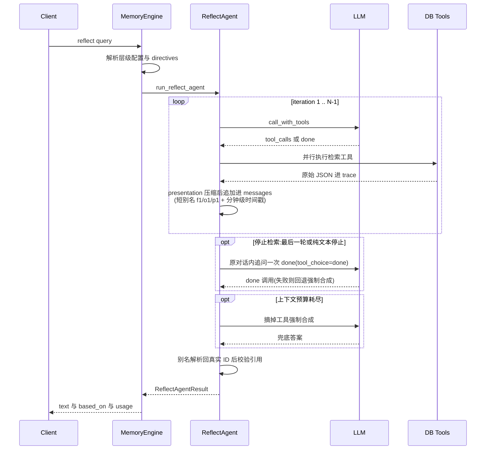
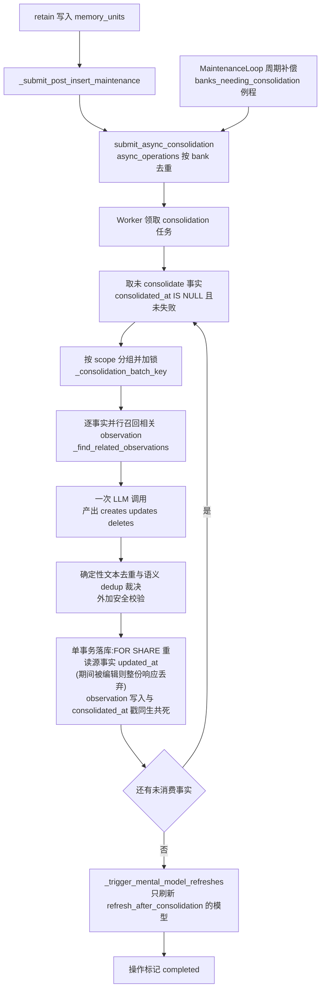
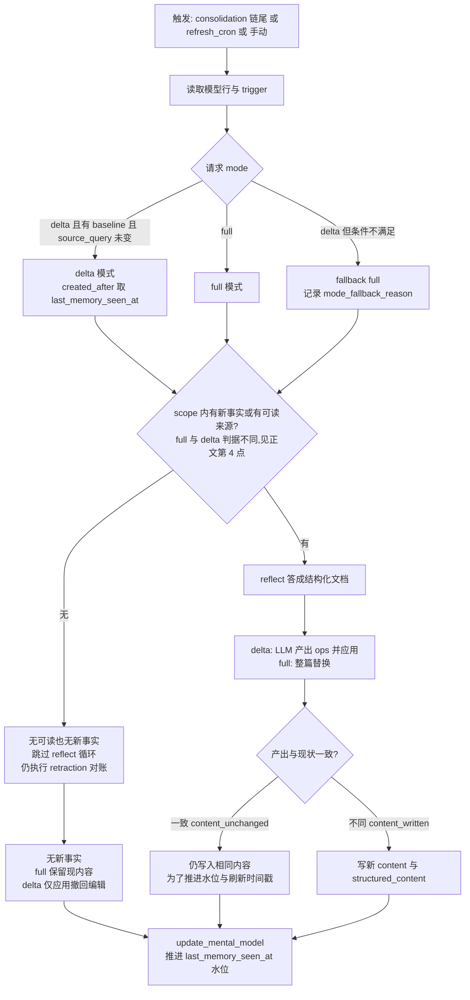

# 04 · Reflect 与 Consolidation —— 从"能背出记忆"到"能形成认知"

> 代码基线:`f7dd3f4fd`(v0.10.2,2026-10-03);本篇已随 0.10.2 全量更新(原基线 `12f2d54f6`)。

> 研究对象:Hindsight 仓库 `hindsight-api-slim/hindsight_api/engine/` 下的 `reflect/`、`consolidation/`、`directives/`、`mental_model_refresh.py`、`graph_maintenance.py`、`maintenance.py`,以及 `memory_engine.py` 中对应的编排逻辑。
> 本文所有论断均以基线 commit `f7dd3f4fd` 代码为准,标注 `相对路径:行号`;无法从代码确认的地方明确写"未确认"。

---

# 第 1 层【全景】

## 1.1 这两个子系统分别是什么

**Reflect**(反思/应答):给定一个自然语言问题,基于 bank(Hindsight 的隔离记忆库:一个 bank 就是一个独立"大脑",bank 之间严格不串数据)里存储的记忆做 **disposition 感知的推理回答**(disposition 是 bank 的人格设定,见 3.2)。它不是一个"向量检索 + 拼提示词"的 RAG,而是一个带工具调用循环的 agent:模型自己决定查什么、查几层、什么时候停,最后必须为答案中的每个论断给出可校验的引用 ID。代码里的自我定位写在模块头:

```python
"""
Reflect agent - agentic loop for reflection with native tool calling.

Uses hierarchical retrieval:
1. search_mental_models - User-curated summaries (highest quality)
2. search_observations - Consolidated knowledge with freshness
3. recall - Raw facts as ground truth
"""
```
(`hindsight-api-slim/hindsight_api/engine/reflect/agent.py:1-8`)

**Consolidation**(巩固/沉淀):一个后台异步任务,把 retain 写入的零散原始事实(world/experience)经由 LLM 合成为 **observation(观察)**——带证据溯源、带时间聚合、可被后续修正的"中间层认知"。模块头的定义非常直白:

```python
"""Consolidation engine for automatic observation creation from memories.

The consolidation engine runs as a background job after retain operations complete.
It processes new memories and either:
- Creates new observations from novel facts
- Updates existing observations when new evidence supports/contradicts/refines them

Observations are stored in memory_units with fact_type='observation' and include:
- proof_count: Number of supporting memories
- source_memory_ids: Array of memory UUIDs that contribute to this observation
- history: JSONB tracking changes over time

NOTE: Observations are distinct from mental models (pinned reflections).
- Observations: auto-generated bottom-up by this engine from raw facts (memory_units table, fact_type='observation')
- Mental models: user-defined queries stored in the mental_models table, refreshed on demand via reflect
"""
```
(`hindsight-api-slim/hindsight_api/engine/consolidation/consolidator.py:1-16`)

## 1.2 知识的三层结构(以及一次容易踩坑的术语考古)

| 层 | 存储位置 | 谁产生 | 谁消费 | 可变性 |
|---|---|---|---|---|
| 原始事实 world/experience | `memory_units` 表,本层取 `fact_type` 的 world/experience(历史值 opinion 已删除,见下方考古) | retain 时 LLM 抽取 | consolidation 的原料、reflect 的 ground truth | 删除即移入 `invalidated_memory_units` |
| **observation 观察** | 同一张 `memory_units` 表,`fact_type='observation'`,带 `proof_count`/`source_memory_ids` | **consolidation 自动合成** | reflect 的中间层(`search_observations`) | 后续 consolidation 持续 UPDATE/DELETE |
| **mental model 心智模型** | 独立的 `mental_models` 表(`name`/`source_query`/`content`/`structured_content`/`reflect_response`/`trigger`…) | 用户定义查询 + **refresh 时由 reflect 生成内容** | reflect 的最上层(`search_mental_models`) | 按 trigger 自动/手动刷新 |
| directive 指令 | 独立的 `directives` 表 | 用户手写 | reflect 的**硬规则**,注入 prompt(附:硬规则层,不算知识层) | 增删改查 |

**术语考古(必读,否则读代码会迷路)**:这套名字换过两轮。迁移 `p1k2l3m4n5o6_new_knowledge_architecture.py` 曾把 mental model 存进 `memory_units(fact_type='mental_model')`、把 pinned_reflections(更早的旧表名)改名 reflections;随后迁移 `t5o6p7q8r9s0_rename_mental_models_to_observations.py` 完成现在这轮命名:`fact_type` 值 `mental_model` → `observation`,表 `reflections` → `mental_models`(`alembic/versions/t5o6p7q8r9s0_rename_mental_models_to_observations.py:12-23`)。所以今天:
- `memory_units` 里的 **observation** = 自动合成的中间层知识;
- `mental_models` 表 = 存 reflect 回答的"文档页"(旧名 reflections,refresh 时内容重写);
- `engine/reflect/observations.py` 里那个带 `ObservationEvidence`/`quote`/`Trend` 的 `Observation` 模型是**上一代设计的残留**——在 engine/ 与 api/ 目录里 grep 不到任何包外消费者(`reflect/models.py:12-46` 的 `ObservationSection`/`ReflectAction`,经 `reflect/__init__.py:20` 再 re-export `ReflectAction`/`ReflectActionBatch`,但整个 ReflectAction/ObservationSection 集群在包内没有其他消费者),现在的 observation 数据模型是 `engine/response_models.py` 的 `MemoryFact`(经 consolidator 写入)。此为代码检索结论:"当前主链路未使用"。
- 考古细节补遗(承接上表):全表 `fact_type` CHECK 现为三值 `('world','experience','observation')`——历史值 `opinion` 由迁移 `g2h3i4j5k6l7_remove_opinion_fact_type.py:34-51` 删除行并收紧(Oracle 基线同为三值,`o1a2b3c4d5e6_oracle_baseline.py:133`);`reflect_response.based_on` 至今保留 "opinion" 空键,只是历史兼容占位(`memory_engine.py:15497`、`retractions.py:36-44`)。

## 1.3 为什么说这是 Hindsight 区别于普通 RAG 的核心

1. **知识有"合成层",且可被继续修正**。普通 RAG 只有"原文 chunk"。Hindsight 的 consolidation 会把反复出现的事实折叠成一条 canonical observation(`proof_count` 计数、`source_memory_ids` 溯源),并在新证据到来时 UPDATE/DELETE 它——检索时查到的是"被合并、去重、带新鲜度"的知识,而不是十条相似原文。
2. **推理与存储双向奔赴**。reflect 不只读:它的回答(mental model)会作为下一层知识存回去再被检索(自指的"经验沉淀");consolidation 也不只写:它每轮结束会触发 `refresh_after_consolidation=true` 的 mental model 刷新,让上层文档跟着新事实走(`consolidator.py:2154-2260`)。
3. **证据与推断在协议层分离**。reflect 的 `done` 工具(模型交卷时调用的工具)要求"正文与引用 ID 分开写"、`reflect_response.based_on` 按事实类型记录每条被引用的原始证据;consolidation 的 prompt 明令"不许做算术"(`prompts.py:53` 的 NO COMPUTE 规则)。这让"结论"永远可以被审计回"证据"(见第 3 层 3.1)。
4. **人格与使命可配置**。bank 的 disposition(怀疑/字面/共情 1-5)与 `reflect_mission` 直接注入 reflect 的 system prompt,改变同一个记忆库回答的语气与推理方式(3.2)。

> 读完结构后可直奔文末:第 5 层把六个"必答问题"汇总成速查,本文各节就地回答它们、并标注对应小节。

---

# 第 2 层【主流程】

## 2.1 Reflect:ReAct 式工具调用循环

**必答问题 1 的答案**:reflect 有完整的 ReAct 式多轮工具循环。输入是 `query`(+可选 `context`、tags、`response_schema`);LLM 通过 OpenAI 格式的 native tool calling 被反复调用;输出是 `ReflectAgentResult`(答案文本 + 可选结构化文档 + 引用 ID + 完整 tool/LLM trace)。它**不写任何东西**——`reflect_async` 的 docstring 明确 "Reflect is read-only: it synthesizes an answer from the bank's stored memories and persists nothing."(`memory_engine.py:15076-15077`)。

### 主时序图

先看一次 reflect 请求的完整时序(图 1):请求、循环、响应三段;循环里的每个环节随后逐段展开。



### 循环骨架

入口 `run_reflect_agent`(`agent.py:516`)在外层包了一层,专门负责创建与清理本次 reflect 用到的提示缓存;真正的循环在 `_run_reflect_agent_inner`(`agent.py:575`)。默认最多迭代 `DEFAULT_MAX_ITERATIONS = 10`(`agent.py:149`),并按 budget(请求参数,控制检索深度的档位)放缩:low=0.5x、mid=1x、high=2x(`memory_engine.py:15182-15185`)。

每一轮的关键决策——**强制分层检索**:

```python
        forced_sequence = []
        if has_mental_models:
            forced_sequence.append("search_mental_models")
        if include_observations:
            forced_sequence.append("search_observations")
        if include_recall:
            forced_sequence.append("recall")

        if stop_forcing_from_iteration is not None and iteration >= stop_forcing_from_iteration:
            # A fresh mental model already short-circuited the forced path.
            iter_tool_choice = LLM_TOOL_CHOICE_AUTO
        elif iteration < len(forced_sequence):
            iter_tool_choice = LLMToolChoice.named(forced_sequence[iteration])
        else:
            iter_tool_choice = LLM_TOOL_CHOICE_AUTO
```
(`agent.py:1121-1135`)

逐点讲解:
- 前几轮 `tool_choice` 被**点名强制**:bank 有 mental models 就先强制查它,有 observations 就再强制查它,最后强制 `recall`——保证 agent 不会跳过任何一层知识就作答。工具清单本身按配置裁剪(`get_reflect_tools`,`agent.py:666-674`),prompt 里的检索策略段落与实际工具一一对应,避免弱模型幻觉出不存在的工具(`prompts.py:316-319` 注释、#1724)。0.10.2 起 system prompt 还在强制层之上写了一段显式的 "## Search Plan"(逐层下降、新鲜即停、证据到了就 `done`),让模型在强制放开后仍然跟着梯子走(`prompts.py:406-427`)。mental models 这一层还拆成了**搜索 + 阅读**两个工具:`search_mental_models` 只返回最匹配的一页全文 + 其余命中的 snippet,`read_mental_models` 按需把选中的页读全(默认 6000 token 预算,`tools_schema.py:113-143`、`agent.py:71-76`;五页全文曾测得 8.7-19k token 并在后续每轮重发,`tools.py:274-278` 注释;#4716)。
- `stop_forcing_from_iteration` 是一个确定性短路:强制查出的 mental models 若全部"新鲜可用"(stale 指"上次刷新后 scope 内又进了新事实",见 3.4;这里还要求非空——`_all_mental_models_are_usable_and_fresh` 的两个条件是 `is_stale is False` 与 snippet/content 非空——搜索命中带 snippet、整页阅读带 content,二者任一即可,`agent.py:455-473`),就提前放开 `auto`,让模型自己决定要不要继续深挖(`agent.py:1467-1485`,判定函数在 `agent.py:455`)。注意该短路**仅在 low/mid budget 生效**:`agent.py:1477` 的 `(budget or "low").lower() != "high"` 门让 high 恒走完整强制链。
- 到达最后一轮(`is_last`)或模型停在纯文本轮次时,走统一的 `_finish` 收尾:先在**同一个对话里**追加一轮 `tool_choice=done` 的调用(`_ask_for_done`,trace scope `closing_done`,复用 provider 已持有的前缀),成功就按 done 处理;provider 产不出调用再回退 `_forced_final_synthesis` 独立合成(`agent.py:879-959`)。实测只有约 29% 的刷新会自己调 `done`,旧版对 prose 停止直接重渲染全部工具结果开新 prompt,整份证据按全价重付一遍——收尾改走原对话是 #4656 实测 -26%~-43% per refresh 的主要来源之一。
- 工具参数有硬边界:`_TOOL_ARG_MIN_TOKENS=1000`、`_TOOL_ARG_MAX_TOKENS=16000`(`agent.py:63-64`),且单批工具调用的总预算按"剩余上下文 / 并行数"分摊(`_resolve_tool_arg_ceiling`,`agent.py:100-114`),防止一次批量拉取把上下文撑爆、触发慢速的 split-synthesis(#4239)。

**done 守卫与并行工具**。检测到 `done` 调用时,先检查"是否已收集到证据":

```python
        done_call = next((tc for tc in result.tool_calls if _is_done_tool(tc.name)), None)
        if done_call:
            # Guardrail: Require evidence before done
            has_gathered_evidence = (
                bool(available_memory_ids) or bool(available_mental_model_ids) or bool(available_observation_ids)
            )
            if not has_gathered_evidence and iteration < max_iterations - 1:
                ...
                messages.append(
                    {
                        "role": "tool",
                        "tool_call_id": done_wire_id,
                        "content": json.dumps(
                            {
                                "error": "You must search for information first. Use search_mental_models(), search_observations(), or recall() before providing your final answer."
                            },
                            ensure_ascii=False,
                        ),
                    }
                )
                continue
```
(`agent.py:1276-1307`,节选)

- 什么都没查就想交卷 → 先把 done 调用本身连同一条去重后的 wire id 写回 messages,再伪造一条 tool error 打回去继续查(该分支会循环,所以 tool_use 也要进同一份请求历史)。这直接堵死"零检索幻觉作答"。
- 其余工具调用并行执行:`asyncio.gather(*tool_tasks)`(`agent.py:1411-1427`),结果按**模型给出的原始顺序**回填进 messages(Anthropic 要求 tool_result 与 tool_use 顺序一致;槽位按 position 而非 tool_call_id 索引,防御返回重复/空 id 的网关,`agent.py:1369-1378` 注释;wire id 由 `_unique_tool_call_ids` 全循环去重,`agent.py:1080-1086`)。
- 工具抛异常 ≠ 返回 error JSON:前者是基础设施故障,整个 run 失败(`ReflectToolExecutionError`,`agent.py:198-217`,#2894)——否则 agent 会"用不完整的证据自信作答",下游分不清"空 bank"和"坏了的 bank"。
- 幻觉出的、不在 `enabled_tools` 集合里的工具名,返回结构化 error 让模型自己改(`agent.py:1335-1385`),而不是崩溃。

**工具结果为"模型"而写,presentation 层(#4656)**。检索工具返回的原始 JSON 仍进 API trace,但写入 messages 前先经 `ToolResultPresenter`(`reflect/presentation.py:50-149`)重写:`f1`/`o1`/`p1`/`c1` 短别名替代 36 位 UUID;时间戳压到分钟(时间是证据——supersession 靠它裁决——所以只缩短、不删除);常量 `fact_type`、重复的 `occurred_end`、chunk 簿记字段删除;早前轮次已展示过的条目在 `already_shown` 下只列别名。模型在 `done`/`expand` 里写回的别名在进入任何下游(工具执行、引用校验、based_on)之前经 `presenter.resolve` 还原为真实 id(`agent.py:1318, 1414, 944`)——实测合成 prompt 里事实文本只占五分之一,其余都是这些"框子",且每一轮循环都重发一遍。

**收尾:ID 校验**。`done` 的参数里,正文与引用分开;只有"真的被工具返回过"的 ID 才会被接受:

```python
    # Validate IDs (only include IDs that were actually retrieved)
    used_memory_ids = [mid for mid in (args.get("memory_ids") or []) if mid in available_memory_ids]
    used_mental_model_ids = [mid for mid in (args.get("mental_model_ids") or []) if mid in available_mental_model_ids]
    used_observation_ids = [oid for oid in (args.get("observation_ids") or []) if oid in available_observation_ids]
```
(`agent.py:1802-1805`)

`available_*_ids` 三个集合在每次工具结果落地时从**原始输出**(未经 presentation)增量填充(`agent.py:1458-1503`)。模型引了一条没见过的 ID → 静默剔除,引用永远可校验。

**超预算兜底:map-reduce 强制合成**。上下文预算(默认 `max_context_tokens=100_000`)在每轮之间检查——每轮的 token 估算走 `_count_messages_tokens`(`agent.py:1103`,底层是 `reflect/tokenization.py` 的 `count_prompt_tokens`,按配置编码对文本计数)——超了或到达最后一轮就触发收尾。强制合成 `_forced_final_synthesis`(`agent.py:961-1072`)分两种装法:证据装得下就一次调用;装不下就 `split_context_history` 按预算切块(**切分而非截断**,超预算单块沿 `observations/memories/results` 数组边界再切,而 recall 结果里那个比半份预算还大的兄弟块——通常是原始 `chunks`——会单独成块打包,不再被拷进每一个分片,#4495;`prompts.py:591-597, 762-778`),每块并行做"claim 提取"(map,温度强制 0,`agent.py:161-166`),最后一次 reduce 合成——旧版"整块丢弃"会导致引用几百条却什么都没读到的自信"没有信息"回答(#3122)。

**错误处理备忘**:
- 从未产出过可解析的 tool call(`saw_tool_call=False`)→ `ReflectToolCallError`,提示换支持函数调用的模型/传输(`agent.py:182-196`,raise 在 1249-1266)——不"打捞"自由文本,因为那可能是被截断的 done JSON。
- 不走 `_finish` 的两条超预算路径,都直接进强制合成:其一,轮间**主动预算检查**发现累计消息已超限——注释写明 "Not ``_finish``: asking for ``done`` appends to a conversation that is already over the budget"(`agent.py:1111-1113`);其二,调用抛出**上下文溢出异常**——不重试,带已有证据直落强制合成,注释 "Context overflow errors must never be retried"(`agent.py:1215-1224`)。两条路共同的理由:对话本身已超预算,再追加一轮 done 追问只会更糟,独立 synthesis prompt 还会把证据切块分摊。
- 模型停在没有工具调用的轮次但之前调用过工具 → 视为合法停止,统一经 `_finish` 收尾(先原对话追问 done,失败回退强制合成,`agent.py:1267-1268`)。

### 输出结构

`ReflectAgentResult`(`reflect/models.py:138-176`):`text`(正文)、`document`(answer_as_document 模式下的结构化文档)、`structured_output`(给了 `response_schema` 时另行一次抽取调用)、`iterations`、`tools_called`、`tool_trace`(每次工具调用的 input/output/耗时/轮次)、`llm_trace`(scope 如 `agent_1`/`closing_done`/`final`/`final_map_0`)、`usage`(含 cached/thoughts tokens)、`used_memory_ids`/`used_mental_model_ids`/`used_observation_ids`、`directives_applied`。

memory_engine 随后把 trace 里的证据按 `used_*_ids` 过滤,组装成 `based_on` 字典(`memory_engine.py:15484-15541`),键为:

```python
            based_on: dict[str, list[Any]] = {
                "world": [],
                "experience": [],
                "opinion": [],
                "observation": [],
                "mental-models": [],
                "directives": [],
            }
```
(`memory_engine.py:15494-15501`)

这个 `based_on` 平时随响应返回;mental model 刷新时会被序列化存进 `mental_models.reflect_response`,成为后续 retraction 审计的账本(3.3)。

## 2.2 Consolidation:触发时机与全流程

**必答问题 3(触发与调度)**:三条路径——retain 后异步触发、定时补偿、手动触发。

1. **retain 后异步**:`retain_async` 完成事实写入后调 `_submit_post_insert_maintenance`(`memory_engine.py:6802`),其中:

```python
        if config.enable_observations and config.enable_auto_consolidation:
            try:
                await self.submit_async_consolidation(bank_id=bank_id, request_context=request_context)
            except Exception as e:
                logger.warning(f"Failed to submit consolidation task for bank {bank_id}: {e}")
```
(`memory_engine.py:6828-6833`)

2. **定时补偿**:维护循环(默认每 5 分钟)跑 "consolidation reconcile",扫 `banks_needing_consolidation()` 例程,给"有未调度事实且没有在途 consolidation"的 bank 重新投递——兜住上次 consolidation 终态失败后卡在 `consolidated_at IS NULL AND consolidation_failed_at IS NULL` 的事实(`maintenance.py:9-14, 422-490`;0.10.2 起对 store-owned bank 的记忆不在 `memory_units` 表里,该例程扫不到,另经 memories store 的 backlog 计数逐 schema 补扫一遍,`maintenance.py:431-455`)。
3. **手动**:管理 API / bank 导入模板也可触发(未逐一展开,`submit_async_consolidation` 是公共入口,`memory_engine.py:22565`)。

投递本身是**按 bank 去重**的异步操作:"Deduplicates by bank_id - if there's already a pending consolidation for this bank, returns the existing operation_id"(`memory_engine.py:22577-22579`);但带 `observation_scopes` 的定向投递**跳过去重**,避免被并进全库大扫除(`memory_engine.py:22621-22623`)。执行者是 worker 池:consolidation 配了独立的"空闲超时"(`worker/poller.py:85-89`)——计时器量的是"距上次有进展过了多久"(`consolidation_wall_timeout`),有进展就续期,所以限制的是卡死而不是总时长;每类操作的槽位保留走 `worker_slot_reservations`(未配置时默认给 consolidation 预留 2 个槽,`worker/poller.py:327-330`;运行时在 `worker/main.py:248` 读取)。

### 数据流机制图



逐点讲解主循环(`_run_consolidation_job`,`consolidator.py:1485`):
- **开关**:bank 级 `enable_observations=false` 直接返回 disabled(`consolidator.py:1502-1504`)。
- **取数**:`_fetch_unconsolidated_rows(conn, bank_id, ["experience", "world"], …)` 只取原始事实,每批 `consolidation_batch_size`(默认 50,`config.py:1741`)条(`consolidator.py:1292-1347`,调用点 1609-1616)。observation 本身不再进原料,否则会自我引用。注意两个批量的层次:取数批 `consolidation_batch_size`(默认 50)只是内存装载粒度;真正发给 LLM 的每次调用最多 `consolidation_llm_batch_size`(默认 8,`config.py:1745`)条事实。并行度大于 1 时,一轮的取数不再严格全库 oldest-first,而是读一个 5 倍窗口、按组内最老事实的顺序访问各组、每组至多取 `ceil(limit / parallelism)` 条(`_fair_group_slice`,`consolidator.py:1268-1290`)——否则最老事实全在一个组时,一轮只有一组活干,并行槽位全部空转,#4895。
- **分组是安全边界**:memory 按 `_consolidation_batch_key` 分组,"memories targeting different observation scopes must never share an LLM call"(`consolidator.py:1622-1631` + `consolidator.py:578-616`)——key 不是原始 tags,而是**解析后的目标 scope**(scope:按记忆 tags 划分的观察分组域,机制详见 3.5),防止 `observation_scopes="shared"` 的记忆与普通 tagged 记忆混进一个 LLM 调用造成跨 scope 泄漏(#3924)。并行的组对重叠的写 scope 按 `_scope_sort_key` 全序加锁,避免死锁(`consolidator.py:619-628`)。
- **每批内部**(`_process_memory_batch`,`consolidator.py:2263`):先逐条并行召回该事实相关的已有 observation(走 `recall_async(fact_type=["observation"])`),并成 union;再一次 LLM 调用产出 `creates/updates/deletes` 三数组;然后"先在事务外准备好每个动作(嵌入、安全校验、dedup 裁决),最后**一个事务**全部落库"。事务里同时给本批源事实打 `consolidated_at` 戳——"writes derived from one LLM response are now all-or-nothing"(`consolidator.py:2392-2406, 2564-2657`,#3876:半应用的批次曾把 observation 删了、替代品没写、源事实还被盖了戳,知识永久丢失)。0.10.2 起写事务开头还有一道**读后变更检查**:在 `FOR SHARE` 下重读每条源事实的 `updated_at`(只有真正的编辑会盖它,consolidation 自己的簿记不盖),与批次读取时不一致就把整份 LLM 响应连同戳一起丢弃、事实留在 pending 队列里按现状重做——否则 LLM 调用期间的一次 retag 会让响应按旧 tags 重建 observation,并把重排队标记冲掉(#4893,`_sources_changed_since_read`,`consolidator.py:653-676, 2573-2581`)。语义 dedup 默认开启:新 observation 与既有行的余弦相似度达到 `consolidation_dedup_threshold`(默认 0.97,`config.py:1750` "set to 1.0 to disable")即触发一次 1-by-1 LLM 裁决合并;置 1.0 关闭,Oracle 上无条件跳过(merge 路径用 Postgres-only SQL,`_dedup_active`,`consolidator.py:200-211`)。
- **LLM 调用**(`_consolidate_batch_with_llm`,`consolidator.py:3173`):结构化输出(`response_format=_ConsolidationBatchResponse`),温度用 `llm_temperature_consolidation`,支持 strict schema;失败时**自适应二分**:子批减半重试直到单条,单条仍失败打 `consolidation_failed_at` 标记,绝不静默丢弃(`consolidator.py:1672-1675` 注释,二分在 1783-1796)。系统 prompt 与 bank 无关、可跨 bank 共享一个上下文缓存;bank 的 mission/容量提示/数据都在 user message(`consolidator.py:3221-3236`)。模型产出的 `source_fact_ids` 在解析时**去重**——一个循环抽风的模型能把同一个 id 重复上千次,重复项曾被存进 `source_memory_ids` 并在下一次 prompt 里按次数重复整段事实文本(#4867,`_unique_source_ids`,`consolidator.py:695-701`;prompt 展示与 `proof_count` 计数同样按去重后的 id,`consolidator.py:3031-3047`)。
- **round 限流与链式续跑**:`consolidation_max_memories_per_round` 用尽则重新投递 consolidation,并把本轮触及的 tags 累积透传(`pending_refresh_tags`),保证 mental model 刷新在**链条最后一轮**精确触发一次而不是每轮都触发/被丢(#3411,`consolidator.py:2019-2050, 2102-2131`);0.10.2 起这组 tags 随每个批次的见证事务持久化进操作的 `task_payload`,中途崩溃的轮次重试后也不丢(`_persist_pending_refresh_tags`,`consolidator.py:1377-1407`)。
- **收尾触发刷新**:调 `_trigger_mental_model_refreshes`(`consolidator.py:2154-2260`):查 `trigger->>'refresh_after_consolidation' = true` 的 mental models,先用 tags 预筛、再用 `compute_mental_model_is_stale` 按模型自己的 scope 精确确认,然后 `submit_async_refresh_mental_model(skip_if_in_flight=True)` 投递刷新;上次刷新失败、已被暂停的模型会被跳过并记日志(`consolidator.py:2247-2251`,暂停机制见 3.4 第 6 点)。staleness 判定的廉价半边 `_may_need_refresh`(`memory_engine.py:1947-1972`)在 Oracle 上还有一处方言修正:TIMESTAMP 列返回 naive 值而 bank 写水位是 aware,直接比较会抛 "can't compare offset-naive and offset-aware datetimes",0.10.2 起两侧都归一到 UTC 再比(#4627;此前曾把 Oracle 后端的 search_mental_models 与 knowledge page 创建整个打挂)。

### LLM 的三动作协议

输出格式(`consolidation/prompts.py:109-172`)要求 JSON:`{"creates": [...], "updates": [...], "deletes": [...]}`,每项必须带 `reason`(一句话,用于审计重复 CREATE);`source_fact_ids` 必须逐字复制输入里的 `[uuid]`;**同一 observation_id 至多一条 update**(同响应里两条会互相覆盖);`deletes` 必须带 `observation_id`,否则整条响应被拒。

九条 PROCESSING RULES(`consolidation/prompts.py:37-55`)里最关键的几条:
1. **能 UPDATE 不 CREATE**——"One canonical observation with many source facts is always better than many siblings with one source fact each";
2. **一个 observation 只跟踪一个 facet**(一条计数、一只狗、一段雇佣关系);
3. **按实体/facet 匹配,不按话题**;
4. **状态变化要 UPDATE**(卖掉车→更新"拥有"那条,不是新建);
7. **保留历史**——记录重大事件(卖、死、搬家)的 observation 永不 DELETE;
8. **禁止计算**——"你不知道 Rex 是不是那 2 条狗之一,不要把 2+1=3";
9. **不同人/实体的话题不合并**。

---

# 第 3 层【机制深潜】

## 3.1 evidence vs inference:证据与推断的分离

**必答问题 5**。这是项目宣称的核心卖点,代码里至少有四处结构性体现:

**(a) 数据模型层——每条合成知识都背着账本。**
- observation 行携带 `proof_count INT`、`source_memory_ids UUID[]`(`alembic/versions/p1k2l3m4n5o6_new_knowledge_architecture.py:96-110`),时间边界由 `_aggregate_source_fields` 从源事实**确定性聚合**(取 min(occurred_start)/max(occurred_end)/max(mentioned_at),`consolidator.py:832-855`),不是 LLM 编的。
- 每次 UPDATE 前把旧状态快照写进 `observation_history` 表(`_append_observation_history`,`consolidator.py:2704-2750`):`previous_text`/`previous_tags`/`previous_occurred_*`/`previous_mentioned_at`/`new_source_memory_ids`,行数按 `max_entries` 截断。
- mental model 刷新把本次实际用到的证据按类型序列化进 `reflect_response.based_on`(每条 `{id, text, type, context}`,`memory_engine.py:17366-17392`)——文档被谁支撑、支撑它的原文是什么,永远可查。

**(b) reflect 协议层——引用与正文物理分离。**
`done` 工具的 schema(`reflect/tools_schema.py:185-220`)里 `answer` 的描述是 "NEVER include memory IDs, UUIDs, or 'Memory references' in this text - put IDs only in memory_ids array"。加上 2.1 的 `available_*_ids` 校验,`based_on` 里的每一条都指向一个真实存在、且被工具返回过的记忆行。

**(c) prompt 层——把"可推断"和"不可推断"写成硬边界。**

```python
_GROUNDING_BOUNDARY = (
    "## What Counts As Inference\n"
    "Infer freely about what the retrieved data covers. Never produce a value (number, date, name, "
    "status, amount) for a period, entity or person the data does not cover: extrapolating a trend, "
    "interpolating between dated facts, or borrowing from a similar entity is invention. If no fact "
    "states the value for the thing asked, say the data does not record it (a complete answer), then "
    "give what IS recorded, labelled with the period or entity it belongs to. Never call a derived "
    "value exact, reliable, deduced or confirmed; label any derivation an estimate. Qualitative "
    "inference is unaffected."
)
```
(`reflect/prompts.py:624-633`)

注释把边界讲得极清楚:"inference may CHARACTERISE what the data covers; it may not MANUFACTURE a value for something the data does not cover"——按趋势外推一年后的人数、报出一个"可靠推导"的具体数字,是**编造**,不是推断。

**(d) consolidation prompt 层——推断被降级为"只综合、不计算"。**
`_PROCESSING_RULES` 第 8 条(`consolidation/prompts.py:53`):"NO COMPUTE: you do not have the full picture — never calculate, derive, or adjust numeric values. … Synthesize and consolidate what was stated, but never do arithmetic or logical deductions." 数字状态只随用户显式陈述更新。也就是说:**推断发生在 reflect(回答时),consolidation(沉淀时)只做忠实合并**——两层职责被刻意切开。

## 3.2 disposition 与 mission 如何注入 prompt

**必答问题 4 的前置**:bank 的 disposition 是 `banks.disposition` JSONB 列,三个特质各 1-5,默认 `{"skepticism": 3, "literalism": 3, "empathy": 3}`(迁移 `e0a1b2c3d4e5_disposition_to_3_traits.py:57-75`:迁移注释声明折算意图,实现直接统一重置为 3——62 行注释 "Default all to 3 (neutral) for simplicity")。`reflect_mission` 存在 bank config,解析优先级 `reflect_mission > mission > background`(`api/http.py:2027-2030`)。

注入路径:`reflect_async` 取 `ensure_bank_profile` 得到 `bank_profile` → 传给 `build_system_prompt_for_tools`。disposition 的渲染在 `bank_disposition_line`(`reflect/prompts.py:161-187`):
- 全中性(都为 3)时只保留一行 `Disposition: skepticism=3, ...` 数字,**不加**逐级行为描述,与未配置该功能时的 prompt 保持一致("no bank pays for a feature it did not configure");
- 否则在 `skepticism=5` 这样的数值行下,还要把每个等级**翻译成行为描述**:

```python
    return f"""Your disposition traits:
- Skepticism ({describe_trait_level(disposition.skepticism)}): {skepticism_desc.get(disposition.skepticism, skepticism_desc[3])}
- Literalism ({describe_trait_level(disposition.literalism)}): {literalism_desc.get(disposition.literalism, literalism_desc[3])}
- Empathy ({describe_trait_level(disposition.empathy)}): {empathy_desc.get(disposition.empathy, empathy_desc[3])}"""
```
(`engine/search/think_utils.py:47-50`;各等级文案在 22-44 行,如 skepticism=5 → "You are highly skeptical and critically examine all information for accuracy and hidden motives.")

注释里给了实测理由(`reflect/prompts.py:177-181`):只写数字时弱模型会把 `skepticism=5` 当元数据读,回答与 `=1` 无别(test_high_skepticism_response_is_more_hedged_than_low 在 gemini-2.5-flash-lite 上反复抓到);逐级行为描述直接复用非工具 think 路径(`think_utils.build_disposition_description`)的文案,不另造一套。

**位置也是设计**:system prompt 的静态主体之后、bank 定制内容之前,先放"当前时间",再依次 `Mission: …`、disposition、Additional Context(`reflect/prompts.py:562-584`)——把易变的放尾部、保持前缀可被 prompt cache 复用。CLAUDE.md 也强调"Dispositions only affect reflect, not recall"(召回是纯检索,不做人格化)。

**Directives 的双重注入**(见 3.6):开头 `## DIRECTIVES (MANDATORY)` 段(`reflect/prompts.py:60-89`),结尾再放 `## REMINDER: MANDATORY DIRECTIVES`(`reflect/prompts.py:92-118`,"Your response will be REJECTED if it violates any directive above")——首尾夹击保证长上下文里规则不掉权。开题的用户消息只放 query(`build_agent_user_prompt`,`reflect/prompts.py:136-148`):"问题在 system prompt 之后到达、优先级高于它",并把语言指令也挂在用户消息上而不是 system prompt 里,免得与 directive 冲突(#3776;0.10.2 起语言指令还以变量互斥的形式落在 done 工具自身——配置了输出语言时,done 的描述会追加 "Write the answer exclusively in {language}",`tools_schema.py:173-183, 295-310`)。

## 3.3 observation 与事实的修正/删除:retraction 链路

**必答问题 4(一条事实被修正/删除,依赖它的知识怎么更新)**。分两段:observation 层的即时处理,mental model 层的异步"撤回"。

**(1) 事实失效 = 移表,不设状态位。**

```
Invalidation keeps the recall hot-path clean by *moving* the row between
tables rather than flagging it: live facts live in ``memory_units``,
invalidated ones in ``invalidated_memory_units``. Recall/consolidation/
graph queries therefore need no state predicate.
```
(`memory_engine.py:11809-11812`,curate_memory_unit 的 docstring)

**(2) observation 的级联清扫**:删除/失效/重摄取路径都会调 `_delete_stale_observations_for_memories`(`memory_engine.py:10681, 10708, 10959, 10988, 11176, 11338, 11741, 12188-12247`)。合同是"任一"而非"全部":引用了**任一**被删/失效源事实的 observation 整条删除——docstring 原文 "For each observation referencing any of ``fact_ids``: 1. Delete the observation (its text is stale once even one source memory disappears). 2. Reset the consolidated marker on the surviving source memories so they get re-consolidated"(`engine/retain/fact_storage.py:164-168`;同文 `engine/memories/pg/writes.py:259-262`);幸存的共源 facts 重置 `consolidated_at = NULL` 等待下轮再巩固(`writes.py:324-332`);observation_history 快照在同一事务里显式清理(历史表的外键被显式断开后改为手动清理,`writes.py:316-322` 与 `consolidator.py:2913-2931`)。历史上文档重摄取曾造成孤儿 observation(FK 级联删了源却没通知 observation),迁移 `c4x5y6z7a8b9_backsweep_orphan_observations_v2.py:6-14` 记录了这次补课。

**(3) mental model 的 retraction:靠主动对账把"行不存在"翻出来。** 难点在于:文档引用的某条事实被删后,三个现成信号全都探测不到它——staleness 只回答"上次刷新后有没有新写入",delta prompt 只喂"新增事实",而撤回掉的是一行的"缺席":它既不会推进水位,也进不了任何 prompt(`reflect/retractions.py:1-30` 的模块 docstring 把这点讲得最透)。先对齐两个词:"水位"是 mental model 记住的"已读到哪"标记,"delta"指只看新增变化的增量刷新,其编辑动作列表叫 delta ops——都在 3.4 展开。所以刷新管线主动对账:

```python
        if use_delta:
            stored_based_on = (mental_model.get("reflect_response") or {}).get("based_on")
            cited_ids = based_on_fact_ids(stored_based_on)
            if cited_ids:
                ...
                    live_ids = await store.live_memory_ids(
                        conn=conn, fq_table=fq_table, bank_id=bank_id, unit_ids=cited_ids
                    )
                    retracted = partition_retracted(stored_based_on, live_ids)
                    if retracted:
                        ...
                        freshness = await store.consolidation_freshness(conn=conn, fq_table=fq_table, bank_id=bank_id)
                        if freshness.get("pending"):
                            retraction_deferred_reason = (
                                f"{freshness['pending']} fact(s) are still pending consolidation"
                            )
```
(`memory_engine.py:17430-17455`,节选)

要点:
- `MEMORY_BACKED_FACT_TYPES = frozenset({"world", "experience", "observation"})`(`retractions.py:44`)是**允许清单**——`based_on` 里的 `mental-models`/`directives` 指向别的表,误算会把健康文档"撤"到只剩渣。`opinion` 也被排除,因为今天没有这种 fact_type 落库,把无法解析的 id 当撤回是此模块绝不能犯的错(`retractions.py:35-43`)。
- **全灭 = 断链而非撤回**:`unresolvable` 属性(`retractions.py:67-84`)——引用的每一条都不在时,多半是整库导入把 `mental_models` 行原样搬来、记忆却是新 id 的场景;这时只剪悬空引用、不动正文(不可恢复的误删 vs 暂留一句旧话,取后者)。
- **延迟撤回**:文档重摄取会先删后补,旧 id 短暂消失、替代品要等 consolidation 跑完才出现;此时撤回会删掉"仍为真的句子"且 id 已离开 based_on、永远无人再发现。所以看到 pending consolidation 就挂起,staleness 每轮重提(`memory_engine.py:17443-17455` 注释)。
- 撤回本身由 `STRUCTURED_RETRACTION_SYSTEM_PROMPT` + delta ops 执行(`reflect/prompts.py:1469+`),操作结果记录在 `MentalModelRetraction`(`mental_model_refresh.py:202-232`):fact_ids、**fact_texts(行已删,文档记下的文本是唯一幸存记录)**、applied、deferred_reason。

## 3.4 mental model 刷新:full vs delta、水位与幂等

**必答问题 6**。mental_models 表的关键列(沿迁移链拼出):`name`、`source_query`(刷新时喂给 reflect 的问题)、`content`(markdown)、`embedding`、`tags`、`structured_content`(`b3w4x5y6z7a8`)、`reflect_response`(`r3m4n5o6p7q8`)、`trigger` JSONB 与 `max_tokens`(`v7q8r9s0t1u2`,trigger 默认 `{"refresh_after_consolidation": false}`)、`last_refreshed_at`、`last_memory_seen_at`(`e7c3a91f4b62`)、`last_refreshed_source_query`(`a2v3w4x5y6z7`)、`last_refresh_failed_at`(`b8d3f1a6c2e4`,0.10.2 新增——失败"暂停"的落点,见第 6 点)。历史独立成 `mental_model_history`(`a7b8c9d0e1f2`)。

**触发器有三种**:consolidation 链尾的 `refresh_after_consolidation`(2.2);MaintenanceLoop 的 `refresh_cron` 定时检查——"refresh mental models whose trigger.refresh_cron schedule is due, but only when the model is stale … so a scheduled tick never burns an LLM call to regenerate identical content"(`maintenance.py:16-20`);用户手动(dry run 也走同一条管线)。

**刷新管线** `_execute_mental_model_refresh`(`memory_engine.py:17130` 起)的决策序列:

1. **full/delta 抉择**(`memory_engine.py:17189-17253`):请求 delta 但没有可用 baseline(空内容或占位 "Generating content...")→ fallback `no_baseline_content`;有 baseline 但 `last_refreshed_source_query != source_query`(话题换了)→ fallback `source_query_changed`;首次 delta(无 tracking 行)仍用现有 markdown 当 baseline——"users who write a doc and then enable delta mode expect their content to be the starting point"(用户先写了文档、再开 delta 模式,期望的起点是自己写的内容,而不是被一次全量重建推倒)。0.10.2 起 refresh 的 reflect 预算也由 trigger 自己声明:trigger 新增 `budget`(low/mid/high),**未配置时默认 MID**(`DEFAULT_MENTAL_MODEL_REFRESH_BUDGET`,`memory_engine.py:1597, 17179-17183`)——过去不传时 reflect 按 LOW 处理、把 `reflect_max_iterations` 减半,文档合成的两腿(full 与 delta)都会提前跑断(#4856;#4894)。同一提交里,refresh 也**不再继承** bank 的 `reflect_default_options`:检索 token 覆盖直接取 trigger 自带字段(缺省落到 shipped 默认,`memory_engine.py:17165-17178`),因为那套默认是为"回答问题"调的,不该悄悄改写文档合成。
2. **快照与水位**(`memory_engine.py:17251-17254, 17308-17317`):`refresh_cutoff` 取数据库当前时间做快照上界,reflect 只读 `created_before` 之前提交的事实;水位 `last_memory_seen_at` 持久化为**快照时刻可见的最大 in-scope `updated_at`** 而不是 `now()`。为什么不能记 `now()`:一行事实的 `updated_at` 在写入事务内就已生成,但外界要等事务 COMMIT 后才看得见它。若把水位记成快照那一刻的 now(),这种"生成于快照前、提交于快照后"的事务就会被当作"已处理"——从此任何刷新窗口都读不到它,永久丢失;把水位锚在"本次实际看到的最大 `updated_at`"上,下次刷新的窗口仍会把它圈进来(读数经 memories store 的 `newest_memory_updated_at` 获得,scope/tag/窗口过滤都已在查询内,#4968)。
3. **delta 窗口**(`memory_engine.py:17294-17307`):`created_after = last_memory_seen_at`(不是上次刷新的墙钟时间——两次之间写入的都算新信息),传给 reflect 后所有工具的时间谓词统一收窄。
4. **空 scope 不烧 LLM**(`memory_engine.py:17331-17364`,#3875):水位查询本身就回答了"有没有东西可读"(它已按 tags/tag_groups/fact_types 过滤);没有新事实且 bank 里没有可读的兄弟文档(排除占位行;兄弟文档也是 agent 能检索的证据源,所以只有连它们都没有时才真跳过)→ 直接跳过 reflect 循环,但**管线继续走**——"A retraction is a reason to edit the document all by itself",把撤回和"有无新事实"解耦,否则一个安静的 bank 上退休的论断会永远活着。新建 bank 曾因此把 LLM 预算全烧在五个空 reflect 上。
5. **delta 落地为结构化操作,不是重写**。reflect 以 `answer_as_document=True` 运行——模型**声明文档结构**(sections/blocks),markdown 由代码确定性渲染,模型写的 markdown 永远不会被解析回结构(#3361:解析式 round-trip 曾把表格永久焊成一行)。delta 模式下,另一次 LLM 调用按 `STRUCTURED_DELTA_SYSTEM_PROMPT` 产出操作列表,`reflect/delta_ops.py:106-152` 定义了 `append_block`/`insert_block`/`replace_block`/`remove_block`/`add_section` 等 op。模块 docstring(`delta_ops.py:1-40`)给出三条设计公理:
   - 未被任何 op 提及的 section/block **物理原样拷贝**——"prose drift is structurally impossible";
   - 用 **id 而非索引**寻址:索引要靠模型数数,差一仍在界内会静默改错块;id 是复制来的,错了不解析、跳过并上报(#3273);
   - 失败即零变更:"The structure can only get better or stay the same per refresh, never get worse."

   0.10.2 补了两类"引用错了也不静默"的缺口:op 列表解析通过、但**每个 section_id/block_id 都在文档里找不到**时——全部悬空,或只有一枚打错的 block id 混在正确 op 里(那会让它想替换的块原样留在文档里)——模型会被**再问一次**,错误引用连同真实的 section/block id 清单一起引述回来,而修正轮只是追加在原对话之后(前缀不变,provider 的 prompt cache 仍然命中);重试后仍不达,才按公理零变更。retraction 的编辑 pass 不开这道闸:对它"什么都没改"是合法回答(#4206、#4829、#4578,`request_delta_operations`,`delta_ops.py:442-511`)。同一提交还让 `add_section` 之后同批的 op 能用**链式锚点**寻址新建的 section:模型只见过自己写的标题,代码按"精确 id → 本批新建 section 的 id → slug → 标题原文"逐级解析(#4768,`delta_ops.py:602-608`)。

图 3 把刷新管线的分支收敛画出来:content_written、content_unchanged 与"无新事实"三条分支最终汇到同一个 `update_mental_model` 调用——差别只在 content 参数,水位都推进。



6. **幂等与成本控制汇总**:
   - **水位不回退**:成功刷新持久化 `max(newest_in_scope, current_watermark)`,注释明确 "never moves backwards"(`memory_engine.py:1811-1814`);
   - **空跑免费**:第 4 点的空 scope 检查让定时 tick 不花一次 LLM;
   - **事务一致性**:刷新结果落库有守卫——run 失败/无答案(`ReflectNoAnswerError`,#2959:占位句曾被当真答案存进文档)或工具抛错时,调用方"never reach the write",文档与水位原地保留;
   - **失败即暂停,不再按 tick 付费**(#4618,0.10.2):刷新失败时先落一行 `UPDATE mental_models SET last_refresh_failed_at = now()`(迁移 `b8d3f1a6c2e4`;先盖戳再写可选的历史行,保证守卫一定落地,`memory_engine.py:18729-18785`)。此后两个自动触发器——cron 扫描与 consolidation 链尾——都跳过该模型(`_automatic_refresh_paused`,`memory_engine.py:23105-23124`;"只有显式刷新能解开暂停,因为只有它把 `last_refreshed_at` 推过 `last_refresh_failed_at`"),worker 的重试用完为止,不再每个 tick 给同一份 prompt 重付一次 LLM 账单(#4532)。配套的护栏:后台刷新有了自己的 worker 墙钟上限 `HINDSIGHT_API_REFLECT_WALL_TIMEOUT`,超时按失败计(#4581,`worker/poller.py:90-92`);刷新的 LLM 超时不再继承 reflect 面向交互请求的 30s 默认,而是 `HINDSIGHT_API_MENTAL_MODEL_REFRESH_LLM_TIMEOUT` 回落 `HINDSIGHT_API_LLM_TIMEOUT`(`memory_engine.py:2691-2699`);失败的刷新不盖 `last_refreshed_source_query`,source_query 改过之后的重试仍会走 full(#4579)。失败同时记入模型历史(kind=failure,与成功 trace 分开计数、分别截断,`memory_engine.py:18687-18727`),control plane 显示 Paused/Retrying 状态。
   - **dry run 可重复**:`MentalModelDryRunRefreshResult`(`mental_model_refresh.py:304-369`)跑同一条管线但不持久化,"a delta dry run is repeatable: it reads the same window the next real refresh would";每次刷新的决策(模式、fallback 原因、outcome、retraction、token 用量、warnings)都结构化上报,不再只进日志;
   - **based_on 累积去重**:delta 模式把上次的 based_on 并进来(按 id 去重,`memory_engine.py:17457-17469`),文档的账本覆盖全部历史证据;而发给 delta LLM 的 supporting facts **只用本次的**,避免把历史证据重发一遍撑爆输入上限(`memory_engine.py:17405-17410` 注释,Z.ai 1261)。

## 3.5 per-scope consolidation strategies(commit 4133ae85c)

**必答问题 3 的后半(按什么 scope 分)**。commit 4133ae85c(2026-09-22,#4619)引入层级配置 `consolidation_strategies`(env `HINDSIGHT_API_CONSOLIDATION_STRATEGIES`,`config.py:863` + 可按 bank 覆盖):一个 bank 可以按 user/team/company tag 域"联邦化",每个 scope 用自己的观察 mission 和容量。0.10.2 起(#4654)该配置是**类型化的**:`ConsolidationStrategySpec`/`ConsolidationScopePattern` 进入 OpenAPI 与各生成 SDK(`engine/response_models.py:676-741`,写路径校验用的是禁止未知键的 `StrictConsolidationStrategySpec`,737),bank-config 写路径在保存时校验形状、以 400 拒绝畸形值并指名第几个条目的哪个字段——过去一个 typo("scope" 写成 "scopes")会被默默存下、策略终身不生效且无处可查;不完整的草稿(还没填 tags 的规则、还没设任何 override 的策略)仍被接受,因为控制台按类型保存、consolidation 会忽略不可用的条目(`config_resolver.py:839-858`)。

数据结构(`consolidator.py:969-1030`,节选——`_ScopePattern` 的 docstring 中段略去):

```python
@dataclass(frozen=True)
class _ScopePattern:
    tags: tuple[str, ...]
    tags_match: str = _DEFAULT_STRATEGY_TAGS_MATCH

    def matches(self, fact_tags: list[str]) -> bool:
        return _STRATEGY_TAGS_MATCH[self.tags_match](self.tags, fact_tags)


@dataclass(frozen=True)
class _ConsolidationStrategy:
    scopes: tuple[_ScopePattern, ...]
    observations_mission: str | None = None
    max_observations_per_scope: int | None = None
    consolidation_source_facts_max_tokens: int | None = None
    consolidation_source_facts_max_tokens_per_observation: int | None = None

    def claims(self, fact_tags: list[str]) -> bool:
        return any(pattern.matches(fact_tags) for pattern in self.scopes)
```
(`consolidator.py:969-1030`)

- **匹配语义**:`tags_match="all"`(默认)是包含式——每个 glob 都要命中某个 tag,允许多余 tag,如 `("company:*", "team:*")` 命中 `{company:acme, team:exec, user:dana}`;`"exact"` 是精确覆盖式(旧 `observation_scope_limits` 沿用此语义;精确覆盖匹配函数 `_scope_matches_globs` 在 `consolidator.py:918-934`,包含式 `_scope_contains_globs` 与 `tags_match` 模式映射表在 948-966)。模式按 pattern 逐个声明,同一策略可混用;策略的多个 pattern 是**或**关系。
- **首中即整份(win whole)**:`_strategy_for_scope` 返回列表序第一个 claims 该 scope 的策略,"its settings, and for anything it leaves unset, the bank-wide value. A later strategy never fills in the earlier one's gaps"(`consolidator.py:1074-1092`)。刻意不同于初版"逐设置各自找首个设置者"的方案——那会让两个策略静默混在同一 scope 上。
- **整份配置下放**:`_config_for_scope` 返回一个浅拷贝配置(`consolidator.py:1115-1149`),让下游所有读取者(相关 observation 召回的 source-facts 限额、prompt 里的 mission)无感知地拿到 scope 值;调用点在 `_process_memory_batch` 开头(`consolidator.py:2314`),这正是 #4619 修复的核心——"the related-observation recall now takes that config instead of re-resolving the bank config, so per-scope source-facts limits actually apply"。
- **旧配置仍在**:`observation_scope_limits` 被标记 DEPRECATED,在策略之后兜底生效(`consolidator.py:871-874, 1095-1112`)。
- **新端点**:`POST /v1/default/banks/{bank_id}/consolidation-strategies/preview`——预览草稿策略会命中哪些现存 observation scope(上限 10,000,超出置 `complete=false`;#4619 提交说明,请求体自 #4654 起是类型化的 `ConsolidationStrategySpec` 列表,`api/http.py:2257`)。

**scope 的另一维:每条记忆的 `observation_scopes` 模式**(`consolidator.py:474-557`):默认 `combined`(用自己的 tags);`per_tag`(每个 tag 一个 pass);`all_combinations`(所有非空子集);`shared`(解析为空 scope——所有记忆不管 tags 都汇进一条无 tag 的共享观察,用于跨易变 session tag 去重);或显式 `list[list[str]]`。一次记忆可以多 pass 写多个 scope,每个 pass 有独立的 `_config_for_scope` 和 LLM 调用。

## 3.6 Directives 系统

**directives 是什么、与 mental model 的区别**:directives 是用户手写的**硬规则**,存独立 `directives` 表(建表见 `p1k2l3m4n5o6_new_knowledge_architecture.py:70-88`),模型定义 `engine/directives/models.py:9-38`:name/content/priority/is_active/tags。docstring 一句话分野:"Unlike mental models which are automatically consolidated from memories, directives are explicit instructions that are always included in relevant prompts."(这句代码注释的 "automatically consolidated" 用得宽:mental model 的内容确实由管线自动生成,但分工见 1.2——observation 是存储层自动合成的知识行,mental model 是其上由 reflect 生成内容的文档页。)典型例子:"Always respond in formal English"、"Never share personal data with third parties"。

运行机制:
- reflect_async 按请求的 tag scope 加载 active directives(`memory_engine.py:15361-15388`):`apply_all_directives=True` 时无视 tags 全量应用;否则"untagged directives always apply, tagged ones only when the reflect tags match",且开 `isolation_mode` 防止 tagged directive 泄漏进未打标的 reflect。
- 注入三重保险:system prompt 开头 MANDATORY 段 + 结尾 REMINDER 段(3.2)+ **done 工具内置 compliance 字段**——有 directive 时,`done` 的 schema 会追加一个必填字段,强迫模型在交卷前逐条确认合规(`_build_done_tool_with_directives`,`reflect/tools_schema.py:313-369`:"Your answer will be REJECTED if it violates any directive")。
- `directives_applied` 随 `ReflectAgentResult` 返回(`reflect/models.py:174-176`),刷新文档时 directives 的 id/text 进入 `based_on["directives"]`,但**不参与** retraction 对账(3.3 的允许清单刻意排除了它们)。

## 3.7 graph_maintenance 与 maintenance loop

`engine/maintenance.py` 是**单一周期循环**(默认 60s tick + 每 job 独立间隔),驱动:保留期清扫(默认每小时)、consolidation reconcile(默认 5 分钟)、`refresh_cron` 到期的 mental model 刷新(默认 5 分钟检查)。循环**在每个 API/worker 进程都跑、无选主**,所以所有入队必须幂等("a job that enqueues work must make that enqueue idempotent or the fleet queues one wave per process",`maintenance.py:33-36`);首个 tick 加 jitter 防止整队 pod 同时开火(`maintenance.py:48-52`)。跨租户发现走服务端 PL/pgSQL 例程(`banks_needing_consolidation`/`schemas_with_expired_rows`),一次往返替代每 schema 一次的查询风暴。

`engine/graph_maintenance.py` 与记忆巩固互补,管的是**图结构卫生**:两个队列驱动的 pass——relink top-up(`graph_maintenance_queue`:某 unit 的出边邻居被删后补链)和 entity prune(`entity_maintenance_queue`:清理失去 `unit_entities` 引用的孤儿实体、无见证的 cooccurrence 行(见证:两个实体仍共同出现在至少一个存活的记忆单元里))。设计要点是"queued work, not sweeps":队列行在**删除事务内**填入,每次只处理这次删除真正触碰的东西——旧的全库扫在百万行 bank 上连 asyncpg 命令超时都过不去(#3222)。同一 bank 的 graph maintenance 串行(#3230),240s 时间预算到点即停、后续 run 接着排空(`graph_maintenance.py:60-67`)。

## 3.8 Knowledge Base:auto-refreshing 合成文档树

`knowledge_pages` 表(`a9b8c7d6e5f4_add_knowledge_pages.py`)是一棵自引用树:`parent_id` 指向父节点,`kind` 分 `folder`(纯容器,`mental_model_id` NULL)与 `page`(**内容托管在 `mental_models` 行上**——"Content stays in mental_models — this table is metadata + tree structure only")。页面内容由 refresh 管线生成(遗留占位 "Generating content...",`memory_engine.py:168`;bank 模板导入时逐页创建并投递刷新,`api/http.py:4309`,调用点 4263/4298),由 trigger(cron / refresh_after_consolidation)持续保鲜。bank 模板(`_apply_bank_template_resources`)是这套默认页面的主要播种途径。CLAUDE.md 描述的"hindsight fs mount"只读挂载在 hindsight-cli 侧,本模块未展开(未确认其挂载实现细节)。

---

# 第 4 层【贯穿实例】

## 例 A:三条事实 → 一条 observation → 一条 mental model

*(以下数据均为示例,字段名与代码一致。)*

**Step 0:bank 里的三条原始事实**(retain 已写入 `memory_units`,`consolidated_at IS NULL`):

```jsonc
// memory_units 行(示例,节选字段)
[
  {"id": "f1111111-...", "bank_id": "alice", "fact_type": "world",
   "text": "用户在生产环境只使用 PostgreSQL。",
   "tags": ["user:alice"], "mentioned_at": "2026-01-05T10:00:00Z",
   "occurred_start": null, "occurred_end": null},
  {"id": "f2222222-...", "fact_type": "experience",
   "text": "用户把团队的报表系统从 MySQL 迁到了 PostgreSQL。",
   "tags": ["user:alice"], "mentioned_at": "2026-01-12T09:30:00Z",
   "occurred_start": "2026-01-10", "occurred_end": "2026-01-11"},
  {"id": "f3333333-...", "fact_type": "world",
   "text": "用户说选数据库工具时最看重生态和扩展性。",
   "tags": ["user:alice"], "mentioned_at": "2026-02-02T14:00:00Z"}
]
```

**Step 1:retain 完成触发**。`_submit_post_insert_maintenance` 投递 consolidation(去重后一个 bank 一个在途操作)。

**Step 2:批次组装**。取数 → 分组 key 为 `("combined", "user:alice")` → LLM 批(每次调用最多 8 条——与取数批 50 的区别见 2.2 的"两个批量")。每个事实先并行召回相关 observation;首次为空 → `observations_text = "[]"`(`consolidator.py:3188-3189`)。LLM 收到的 user message 形如(摘自 `_fact_line` 的拼装格式,`consolidator.py:3191-3202`):

```text
## MISSION
Track anything notable in the new facts — names, numbers, dates, ...

## INPUT
### New facts
[f1111111-...] 用户在生产环境只使用 PostgreSQL。 (mentioned_at=2026-01-05 10:00:00+00:00)
[f2222222-...] 用户把团队的报表系统从 MySQL 迁到了 PostgreSQL。 (occurred_start=..., occurred_end=..., mentioned_at=...)
[f3333333-...] 用户说选数据库工具时最看重生态和扩展性。 (mentioned_at=...)

### Existing observations
[]
```

**Step 3:LLM 结构化输出**(`_ConsolidationBatchResponse`,示例):

```jsonc
{"creates": [
   {"text": "用户的生产数据库标准是 PostgreSQL,并出于生态与扩展性偏好它;2026 年 1 月将报表系统从 MySQL 迁到了 PostgreSQL。",
    "source_fact_ids": ["f1111111-...", "f2222222-...", "f3333333-..."],
    "reason": "三条事实共同刻画同一个 facet(用户的数据库偏好),无既有 observation,CREATE。"}],
 "updates": [], "deletes": []}
```

**Step 4:落库**。`_apply_create_action` → `memory_units` 新行(示例,节选):

```jsonc
{"id": "o9999999-...", "fact_type": "observation",
 "text": "用户的生产数据库标准是 PostgreSQL,并出于生态与扩展性偏好它;2026 年 1 月将报表系统从 MySQL 迁到了 PostgreSQL。",
 "tags": ["user:alice"],                  // 标签继承自源事实,非 LLM 决定(consolidator.py:2886, 2898)
 "proof_count": 3,
 "source_memory_ids": ["f1111111-...", "f2222222-...", "f3333333-..."],
 "occurred_start": "2026-01-10",           // 源事实聚合:min(start)/max(end)/max(mentioned_at)
 "occurred_end": "2026-01-11",
 "mentioned_at": "2026-02-02T14:00:00Z"}
```

同一事务内三条源事实被打上 `consolidated_at`(下次不再进原料,#3876)。

**Step 5:后续修正**。两周后 retain 进来 `[f4444444-...] "用户准备把数据仓库从 PostgreSQL 迁到 Snowflake。"` → 下轮 consolidation 召回 `o9999999`,LLM 发 `updates` 把文本改写为反映当前状态(`_apply_update_action` 扩展 `source_memory_ids`、放宽时间边界、写一条 `observation_history` 快照)。若再来一条"用户有两只猫"+"用户有一只叫 Rex 的狗",prompt 第 8 条规则禁止 LLM 把"两只猫"改成"三只宠物"——它没有全貌,不许算术。

**Step 6:mental model**。在修正事实(f4444444)到来之前,用户(或 bank 模板)就已建了 mental model:`{name: "数据偏好", source_query: "用户在数据库与数据仓库上的偏好与现状", trigger: {"refresh_after_consolidation": true}}`,初始 `content="Generating content..."`。首次 consolidation(即 Step 4 那轮)收尾时,`_trigger_mental_model_refreshes` 就判定其 stale(占位行 + scope 内已有新事实,同样满足 stale 判定)并投递刷新 → `_execute_mental_model_refresh` → reflect 以该 source_query 为问题、`answer_as_document=True` 跑完 agent 循环 → 存下 `content`(渲染的 markdown)、`structured_content`(sections/blocks)、以及 `reflect_response.based_on`(示例,节选):

```jsonc
{"reflect_response": {"based_on": {
    "world":   [{"id": "f1111111-...", "text": "用户在生产环境只使用 PostgreSQL。", "type": "world", "context": null}],
    "experience": [{"id": "f2222222-...", "text": "用户把团队的报表系统从 MySQL 迁到了 PostgreSQL。", ...}],
    "observation": [{"id": "o9999999-...", "text": "用户的生产数据库标准是 PostgreSQL,并出于生态与扩展性偏好它;...", ...}],
    "mental-models": [], "directives": []}}}
```

之后若 `f2222222` 被删除,下一次 delta 刷新会通过 `partition_retracted` 发现该 id 不在 live 集合,用"撤回"操作把对应句子从文档里拿掉并剪掉 based_on 引用——除非当时还有 pending consolidation,则挂起等待替换事实到位。

## 例 B:一次 reflect 请求的完整回合

*(示例。)* 请求:`POST /v1/default/banks/alice/reflect`,`{"query": "用户现在偏好什么数据库?", "budget": "mid"}`。时间锚:本请求发生在 f4444444 刚 retain 完、尚待下一轮 consolidation 吸收的窗口——所以 o9999999 仍是例 A Step 4 的三源版本,observation 层的 `is_stale`/`freshness` 也正因这份 pending 而亮起(2.1)。

1. `reflect_async` 解析配置、加载 directives(本例 bank 有一条:`{"name": "语言", "content": "始终用中文回答"}`)、确认 bank 有 mental models(即例 A 建的那一个);`max_iterations = 10 * 1.0 = 10`。
2. **iteration 1**:`tool_choice` 强制 `search_mental_models`。工具闭包生成查询向量,`tool_search_mental_models` 语义检索 + 逐模型 stale 计算(`reflect/tools.py:241-252`);本例只有一个模型,作为 top hit 整页返回(0.10.2 起,其余命中只给 snippet、要靠 `read_mental_models` 按需读全,见 2.1),返回(所示为简化示例——模型实际读到的是 presentation 压缩形态:id 已是 `p1` 别名、时间戳到分钟,见 step 5 括注):
   ```jsonc
   {"mental_models": [{"id": "mm-数据偏好", "name": "数据偏好", "content": "…生产数据库标准是 PostgreSQL…",
     "relevance": 0.83, "updated_at": "2026-02-18T…", "is_stale": true,
     "staleness_reason": "new in-scope memories ingested since last refresh"}]}
   ```
3. **iteration 2**:强制 `search_observations`。`tool_search_observations` 走 `recall_async(fact_type=["observation"])`,返回观察数组(每条已经过 `_drop_unread_fields` 剪掉 scores/metadata 等检索内部字段、`_prune_nulls` 剪空字段,`reflect/tools.py:72-97`)+ 汇总的 `"is_stale"`/`"freshness"`(由 `pending_consolidation` 推导,`reflect/tools.py:449-465`)。
4. **iteration 3**:强制 `recall` 取原始事实 ground truth(可能带 chunk 原文)。之后进入 `auto`。
5. **iteration 4(auto)**:模型看到 mental model 的 `is_stale=true`(staleness_reason 即"上次刷新后 scope 内又进了新事实"),且时间规则要求以"最新 `mentioned_at` 的陈述为权威"(observation "o9999999" 的 `mentioned_at` 是 2026-02-02——其源事实中最新的一条;observation 行的 `mentioned_at` 定义即"其源事实 mentioned_at 的最大值",`consolidation/prompts.py:68` `_OBSERVATION_FIELDS`;同一条规则也写进了 reflect 的 Temporal Reasoning 段,`reflect/prompts.py:273-286`),于是调用 `done`,参数(示例;0.10.2 起模型实际写回的是 presentation 层发的短别名如 `f2`/`o1`/`p1`,进入处理前已被 `presenter.resolve` 还原成真实 id,见 2.1):
   ```jsonc
   {"answer": "**PostgreSQL**。…数据仓库方面,2026-02 的说法是准备迁往 Snowflake。…",
    "memory_ids": ["f4444444-..."], "observation_ids": ["o9999999-..."],
    "mental_model_ids": ["mm-数据偏好"]}
   ```
   (若答案违反"始终用中文"指令,done 的 compliance 必填字段会迫使模型先逐条确认。)
6. `_process_done_tool`:剔除"未在工具结果里出现过的" ID → `used_*_ids`;若有 `max_tokens` 软目标且超长,先做一次改写(`_rewrite_to_length_budget`);memory_engine 组装 `based_on` 与 trace,返回 `ReflectResult`。全程零写入。

若第 4 步模型选择直接交卷但还什么都没查,done 守卫会打回(2.1);若它把答案写成 `"answer": "…见 memory_id f4444444…"`,就违反了输出规则——正文与 ID 分离是协议级要求。

---

# 第 5 层【必答问题速查】

1. **reflect 完整流程**:输入 query(+context/tags/schema)→ 层级配置解析、directives 加载 → `run_reflect_agent` 的 **ReAct 式 native tool-calling 循环**(强制分层:search_mental_models → search_observations → recall → auto;默认 10 轮 ×budget 系数;工具结果经 presentation 层压缩成短别名再进 prompt)→ 停止时优先在原对话内追问一次 `done`,provider 产不出调用或上下文已超预算才走强制合成(超预算 map-reduce)→ `ReflectAgentResult`(text/document/structured_output/引用 ID/trace/usage)。**是工具循环,不是单轮**;且整个操作只读不写。
2. **observation 是什么、和 memory_unit 什么关系**:observation 就是 `memory_units` 表里 `fact_type='observation'` 的一行(不是独立表),由 consolidation 在 retain 之后异步生成——对每批未 consolidate 的原始事实,LLM 输出 creates/updates/deletes;行上带 `proof_count`、`source_memory_ids`、聚合时间字段,变更写 `observation_history`。
3. **触发与调度**:retain 完成钩子 + MaintenanceLoop 5 分钟补偿 reconcile + 手动;投递按 bank 去重;worker 池执行;round 限流后链式续跑,链尾统一触发 `refresh_after_consolidation` 的 mental model 刷新。**per-scope 策略**按记忆的 tag scope(支持 fnmatch 通配,`tags_match: all|exact`)匹配 `consolidation_strategies` 列表,首中者整份生效,可覆盖 mission / 每域观察上限 / source-facts token 预算;配置已类型化、bank-config 写入即校验(#4654)。
4. **事实被修正/删除后**:失效=移入 `invalidated_memory_units`(无状态谓词);依赖它的 observation 由 `_delete_stale_observations_for_memories` 级联删除(带历史表清理);mental model 在下次 delta 刷新时经 `partition_retracted` 对照 `reflect_response.based_on` 发现死引用,结构化撤回(有 pending consolidation 则延迟,全灭则只剪引用)。
5. **evidence vs inference**:见 3.1 四处——observation 的 source_memory_ids/proof_count/history、reflect 的 done 协议与 based_on、`_GROUNDING_BOUNDARY` prompt、consolidation 的 NO COMPUTE 规则。沉淀只合并陈述,推断只发生在应答,且推断不得给数据未覆盖的东西造值。
6. **mental model 刷新的幂等与成本**:水位锚定"快照内实际看到的最大 updated_at"且不回退;delta 用 `created_after` 收窄窗口;空 scope 免 LLM;未提 section 物理拷贝、引用悬空先追问一次、失败零变更、水位/文档在 run 失败时不写;刷新失败盖 `last_refresh_failed_at` 并让自动触发器暂停到下次显式成功(#4618);dry run 与真实刷新共用管线;based_on 累积去重而 delta LLM 只喂本次事实。

# 第 6 层【存疑与未确认】

1. `engine/reflect/observations.py`(Observation/Trend/evidence-quote 模型)与 `reflect/models.py` 的 `ReflectAction`/`ObservationSection` 在主链路无引用——判断为上一代"observation 内嵌于 mental model"设计的残留,但未确认是否有外部包(如 hindsight-tools)依赖。
2. `knowledge_pages` 的 CLI 只读挂载(`hindsight fs mount`)属 hindsight-cli,本模块未读其实现,挂载细节未确认。
3. `run_consolidation_job` 对 Oracle 方言的 `observation_scopes` 相关 SQL 兼容性(语义 dedup 在 Oracle 上被 `_dedup_active` 无条件跳过——merge 路径的 `unnest`/`array_agg`/`UPDATE ... FROM` 是 Postgres-only,`consolidator.py:200-211`;其余 Oracle 兼容性)未逐行核对。
4. reflect 的 per-step 上下文缓存(rolling cache)仅在 provider 实现 `supports_incremental_prompt_cache()` **且** `HINDSIGHT_API_REFLECT_PROMPT_CACHE_ENABLED`(默认 true,`config.py:1908`)打开时启用(`agent.py:540-547`);#4656 在 Gemini 上实测该 rolling cache 每个 token 都被全额计费(cache 创建按全 input 计价 + 存储,且每份缓存只被下一次调用读一次),约比不缓存贵 4.6%,但把服务器级默认翻成 off 被认为超出该 PR 的决策范围——默认保留 on,测量结论写在 config 注释里(`agent.py:697-714`),各 provider 的实际支持矩阵仍未逐一确认。
