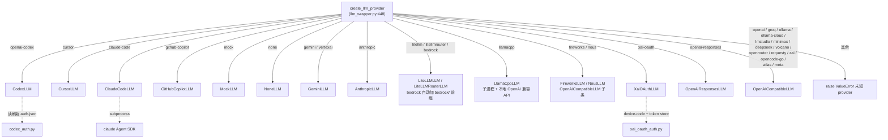
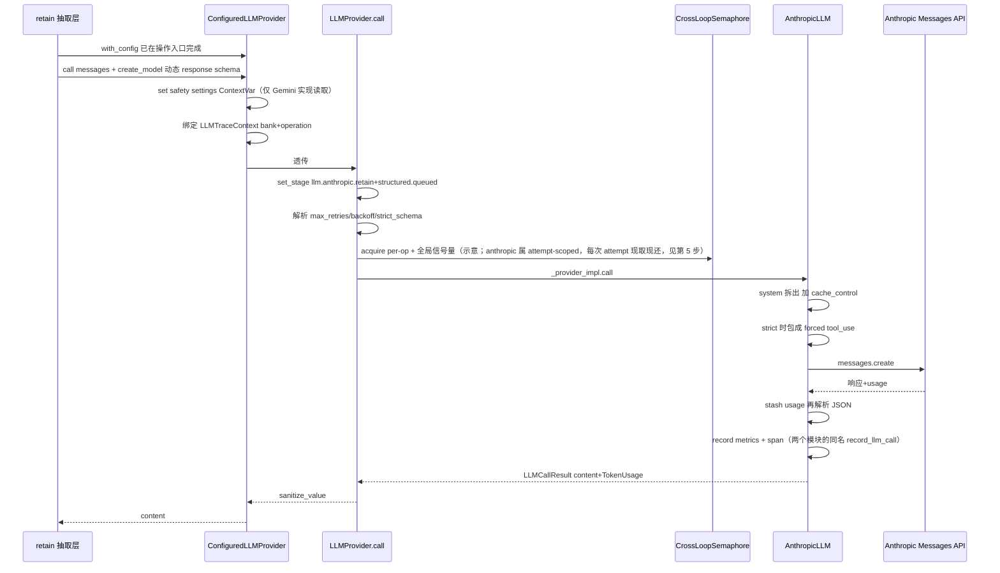
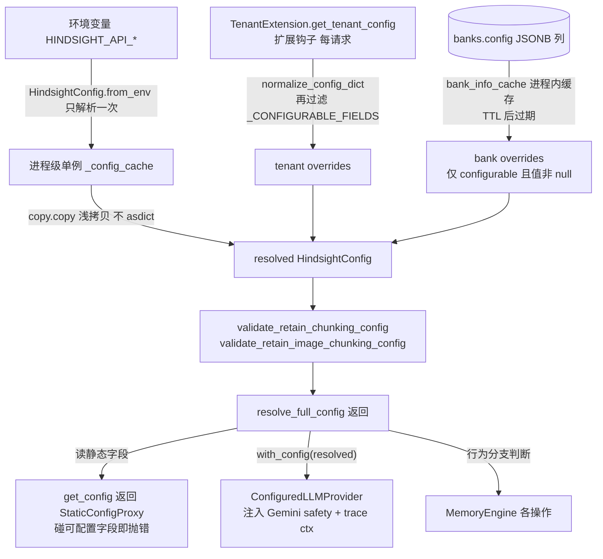

# 05 · 基础设施抽象层：LLM / Embeddings / Reranker / 文件存储与分层配置

> 研究对象：`hindsight-api-slim/hindsight_api/`（下文相对路径均以 `hindsight-api-slim/` 为基准）
> 代码基线：`f7dd3f4fd`（v0.10.2，2026-10-03）；本篇已随 0.10.2 全量更新（原基线 `12f2d54f6`）。
> 本文所有论断均来自当前工作区代码，未确认之处已显式标注。

---

# 第 1 层【全景】：为什么要有一个可插拔的 provider 层

## 1.1 三个抽象，一个形状

Hindsight 的记忆引擎有三处必须"调用模型"：

| 能力 | 抽象基类 | 代码位置 | 典型实现数 |
|---|---|---|---|
| LLM（抽取/反思/固化） | `LLMInterface` | `hindsight_api/engine/llm_interface.py:61` | 31 个 provider 名字，16 个实现类 |
| Embedding（向量检索） | `Embeddings` (ABC) | `hindsight_api/engine/embeddings.py:111` | 12 个 provider 分支 |
| Reranker（重排） | `CrossEncoderModel` (ABC) | `hindsight_api/engine/cross_encoder.py:93` | 14 个 provider 分支 + failover 链 |

三者形状高度一致，都是同一个模式的实例化：

1. **抽象接口**声明最小能力面（`call` / `encode` / `predict`）；
2. **工厂函数**按配置字符串分派到具体实现（`create_llm_provider` / `create_embeddings_from_env` / `create_cross_encoder`）;
3. **默认值**全部落在 `config.py` 的 `ENV_*` / `DEFAULT_*` 常量里，实现类不读环境变量（LLM 侧甚至被注释明确要求"构造函数不读全局 config"——`llm_wrapper.py:911-916`）。

除此之外还有第四个同形状的可插拔面——**文件存储**（上传附件的 `engine/storage/`，`create_file_storage` 工厂 + `FileStorage` ABC），它不调模型但同属基础设施抽象，0.10.2 起获得流式读写能力，见 3.10。

为什么必须可插拔？从代码里可以直接读出三个动机：

- **本地/离线运行是一等公民**。`llamacpp_llm.py:1-12` 的 docstring 写明 "fully offline operation"：provider 会自己下载 GGUF（llama.cpp 的单文件模型格式）模型、起 `llama-cpp-python` 子进程；embedding/reranker 默认就是本地模型（`DEFAULT_EMBEDDINGS_PROVIDER = "local"`，`config.py:1211`；`DEFAULT_RERANKER_PROVIDER = "local"`，`config.py:1273`）。
- **订阅账号复用**。`openai-codex`、`claude-code`、`cursor`、`github-copilot`、`xai-oauth`、`nous` 这一批 provider 的存在，说明项目要"用你已有的 ChatGPT Plus / Claude Pro / Copilot / SuperGrok 订阅"跑记忆管线，而不是强制 API key（`provider_auth.py:11-29` 明确列出了无需 API key 的 provider 集合）。
- **测试与降级**。`mock` provider 让 500+ 个测试文件（hindsight-api-slim/tests 实测 605 个 `test_*.py`）不碰网络；`none` provider 让系统退化成"纯 chunk 存储 + 向量检索"（`none_llm.py:1-8`）。

## 1.2 分层配置解决什么问题

配置体系是三级：**全局 env → 租户（扩展钩子）→ bank（数据库）**（`config_resolver.py:1-9` 的模块 docstring 原话；路径说明：`config_resolver.py` 与 `config.py` 同在 `hindsight_api/` 根目录、不在 `engine/` 下，本文下文裸写同此约定）。

> **术语约定**：bank 是 Hindsight 的隔离与配置单元——一个 bank 即一个独立记忆库（相当于某个用户/agent 专属的一颗"脑"），对应数据库 `banks` 表的一行；下文"bank 级覆盖"即按记忆库覆盖配置。

它解决的问题分两类：

- **多租户/多 bank 的行为隔离**：不同 bank 可以有不同的 retain 策略、召回预算、disposition（1-5 的怀疑/字面/共情度）——这些是"行为字段"，落在 `banks.config` JSONB 里，逐 bank 解析。
- **防误用**：全局配置单例被一个代理包住——`get_config()` 返回 `StaticConfigProxy`，访问任何 bank 可配置字段直接抛 `ConfigFieldAccessError`（`config.py:61-89`），强制开发者去走 `ConfigResolver.resolve_full_config(bank_id, context)`。这是一个用类型系统之外的运行时手段实现的"你在热路径上读错配置了"的警报。

**一个必须先纠正的常见误解**：CLAUDE.md 的通用指引说"LLM settings (provider, model, API key) 是 hierarchical 可逐 bank 覆盖的"，但**当前代码并不是这样**：

- `llm_provider` / `llm_model` / `llm_base_url` / `llm_api_key` **不在** `_CONFIGURABLE_FIELDS`（可被 bank/租户覆盖的行为字段白名单，详见 3.7）里（`config.py:3755-3827` 全量枚举里没有任何 provider/model 字段；`config.py:3754` 的注释原话："Excludes credentials, infrastructure config, **provider/model selection**, and performance tuning"）。
- `llm_api_key`、`llm_base_url` 反而显式列进 `_CREDENTIAL_FIELDS`，禁止通过 API 写入（`config.py:3688-3750`；写入侧在 `config_resolver.py:524-529` 直接 `raise ValueError`）。
- bank 级唯一能动的 LLM 相关字段是 `llm_gemini_safety_settings`（`config.py:3823-3824`）。

也就是说：**provider/model 的切换发生在两个层级——进程级 env（全局默认）与操作级 env（`HINDSIGHT_API_RETAIN_LLM_MODEL` 等，仍是服务器级）**，bank 只能影响"行为参数"。这是本文后面所有例子的前提。

---

# 第 2 层【主流程】

## 2.1 一次 LLM 调用的完整路径

### 静态骨架：谁在什么时候创建了 provider

`MemoryEngine.__init__` 在进程启动时为 retain / reflect / consolidation 三个操作各建一条 LLM 链（`memory_engine.py:2775 / 2871 / 2994`）；第四条——mental-model-refresh——0.10.2 起改为**按需解析的 property**（`memory_engine.py:15010-15027`，issue #4463）：没有 `MENTAL_MODEL_REFRESH_LLM_*` 覆盖时它**就是**当前 `_reflect_llm_config` 这个对象本身（连测试在 `__init__` 后换掉的 provider 也一并生效）；override 只为"给 refresh 一个更长 timeout"时同样让位给被换入的 reflect provider：

1. 先解析"操作级请求默认值"：`_op_defaults()`（`memory_engine.py:2670-2688`）把 `HINDSIGHT_API_RETAIN_LLM_TIMEOUT` / `..._MAX_RETRIES` / `..._INITIAL_BACKOFF` / `..._MAX_BACKOFF` 逐字段落到"没配就回落全局 `llm_*`"。`mental_model_refresh_` 这一组仍以 reflect 的已解析值为 fallback（`memory_engine.py:2690`），但 0.10.2 起有一处刻意的例外：**timeout 永不继承 reflect 的**（reflect 默认 30s 是给"调用方在线等"定的，refresh 是后台任务、最终答案要过 3 万-9 万 token 的 prompt，30s 每次重试都超时，动机注释 `memory_engine.py:2691-2695`、replace 覆写 `:2696-2699`，issue #4532）——refresh 取自己的 `mental_model_refresh_llm_timeout`，否则回落全局。
2. 用静态配置构造 `LLMConfig`（即 `LLMProvider` 的向后兼容别名，`llm_wrapper.py:1841`）作为链首成员（member 0——多链场景下 `MultiLLMProvider` 的主成员，机制见 3.2 末段），再交给 `_build_llm()`：如果配置了 `llm_members` + `llm_strategy`，就把 indexed 成员（`HINDSIGHT_API_<OP>LLM_<n>_*`）包成 `MultiLLMProvider`（failover / round-robin / metadata 三种路由，`multi_llm.py:1-29`；加权轮询用 nginx 的 SWRR（Smooth Weighted Round-Robin，平滑加权轮询）算法，`multi_llm.py:77-102`）。
3. `LLMProvider.__init__` 里真正的分派只有一行：`self._provider_impl = create_llm_provider(...)`（`llm_wrapper.py:1083`）。

`create_llm_provider`（`llm_wrapper.py:448-815`）是整个 LLM 层的分派中枢。它的完整清单（以代码枚举为准）：



> 图注：实线 `-->` 是分派关系；虚线 `-.->` 是运行期辅助依赖（凭据读取、子进程），不是分派。

`LLMProvider` 构造函数里还内置了第二层校验（`valid_providers` 列表，`llm_wrapper.py:965-999`）和各 provider 的默认 base_url 表（`llm_wrapper.py:1002-1028`，如 ollama → `http://localhost:11434/v1`、deepseek → `https://api.deepseek.com`）。

### 动态路径：一次 `call()` 的九步

以**示例 A** 为准：全局配置 `HINDSIGHT_API_LLM_PROVIDER=anthropic`、`HINDSIGHT_API_LLM_MODEL=claude-sonnet-4-...`、`HINDSIGHT_API_LLM_API_KEY=sk-...`，retain 一次 chunk 抽取。即使没有任何 bank 覆盖，操作入口也无条件走 `with_config`——trace 绑定就需要它（`memory_engine.py:7439-7441`）。

**示例 A：`provider=anthropic` 的一次 chat 调用走向**



关键步骤逐条对应代码（图内各消息标签为缩写示例，完整 stage 命名见第 1 步与第 4 步）：

1. **stage 面包屑**：进入 `LLMProvider.call` 先打 `.queued`，拿到并发许可后才切到真实 stage（`llm_wrapper.py:1243-1250, 1311-1317`）。这是为了解决 issue #3002 ——一个在信号量前排队太久的调用，以前看起来像 provider 慢。
2. **重试参数三级解析**：显式 per-call 参数 > provider 构造时的配置（per-op env 回落全局）> 方法默认（`call` 是 10/1.0/60.0，`call_with_tools` 是 5/1.0/30.0）（`llm_wrapper.py:1254-1264`）。
3. **strict_schema 一次性解析**：per-call 显式 `True/False` 双向都赢，否则读 `HINDSIGHT_API_LLM_STRICT_SCHEMA`（`llm_wrapper.py:1273-1278`；注释强调"`or` 会把 per-call False 和未设置混在一起"）。
4. **并发许可**：`scope` 字符串前缀映射到操作桶（`retain` / `reflect` / `consolidation` / `mental_model_refresh`——中文对照：写入抽取 / 问答推理 / 观察固化 / 心智模型刷新，`llm_wrapper.py:116-134`），先拿 per-op 信号量再拿全局信号量（"先窄后宽"排队，`llm_wrapper.py:137-149`）。全局默认 32（`DEFAULT_LLM_MAX_CONCURRENT`，`config.py:1167`），信号量是 `CrossLoopSemaphore`——进程内多事件循环共享的信号量，因为模块级 `asyncio.Semaphore` 会绑死在第一个等待它的循环上（`llm_wrapper.py:59-68`，实现已抽到 `_cross_loop.py`）。
5. **attempt-scoped 并发**：自带重试循环的 provider（anthropic、openai 兼容系、gemini、codex、claude-code、cursor、copilot、litellm、llamacpp、xai-oauth、openai-responses 全部实现了 `supports_attempt_scoped_concurrency`）不走第 4 步的整体持有，而是每个上游 attempt 用 `attempt_context` 现取现还，让退避睡眠不占许可（`llm_wrapper.py:167-184, 1306-1326`）。
6. **provider 内部**：`AnthropicLLM.call` 把 OpenAI 风格 messages 拆成 `system` + Anthropic messages，system 块加 `cache_control: ephemeral` 内联缓存标记（`anthropic_llm.py:66-97`）；strict 模式把 response schema 包成一个强制 `tool_use` 工具做约束解码（`anthropic_llm.py:314-342`）；然后进自己的重试循环（401/403 立即失败，429/5xx/连接错误/超时指数退避 + 20% 抖动，`anthropic_llm.py:358-410`）。每次 SDK 调用还包了一层 `asyncio.wait_for` 墙钟上限——SDK 的分相位 read timeout 每收一个字节就重置，上游"滴漏式" keep-alive 永远触发不了它，调用会把 worker 槽位钉死（issue #4763，`anthropic_llm.py:362-366`）。
7. **usage 先 stash 再解析**：`stash_response_usage` 在本地 JSON 解析/校验**之前**记录 token 数，这样解析失败也能把已计费的成本记进 trace（`anthropic_llm.py:370-372`，issue #2387）。
8. **成功上报**：metrics 采集器与 OTel span recorder 各有一个**同名**的 `record_llm_call` 方法（分属 `metrics.py` 与 `tracing.py`，前者记指标、后者记分布式 span），外加慢调用日志（>10s 带 token 明细）（`anthropic_llm.py:415-455`）。
9. **出口消毒**：`LLMProvider.call` 最后统一 `sanitize_value(result)`（`llm_wrapper.py:1374-1378`）——剥掉模型输出里可能存在的孤立代理对（`\udXXX`）和控制字符，否则 asyncpg 写库、cross-encoder 的 Rust tokenizer（3.5 的本地重排模型分词用）、stdout 全都可能炸（issue #3729）。

### bank 级覆盖如何注入（示例 B）

**示例 B：bank 覆盖 `llm_gemini_safety_settings`**。操作入口（如 retain，`memory_engine.py:7441`、`:12950`）会执行：

```python
retain_llm = self._retain_llm_config.with_config(resolved_config, bank_id=bank_id, operation="retain")
```

`with_config` 生成一个轻量代理 `ConfiguredLLMProvider`（`llm_wrapper.py:1631-1673` 是 `with_config` 方法体，`ConfiguredLLMProvider` 类体在 1731-1837），每次 `call` 前把 bank 解析出的 safety settings 塞进 ContextVar、同时绑定 trace 上下文，调用后复位（`llm_wrapper.py:1764-1791`）。该注入对所有 provider 无条件发生，非 Gemini 的 provider 直接忽略这个值（ContextVar 只有 GeminiLLM 会读）：

```python
# hindsight_api/engine/llm_wrapper.py:1764-1773
async def call(self, messages: list[dict[str, Any]], **kwargs: Any) -> LLMCallResult:
    from .providers.gemini_llm import _safety_settings_ctx

    token = _safety_settings_ctx.set(object.__getattribute__(self, "_gemini_safety_settings"))
    trace_token = self._bind_trace_context()
    try:
        return await object.__getattribute__(self, "_provider").call(messages=messages, **kwargs)
    finally:
        _safety_settings_ctx.reset(token)
        self._reset_trace_context(trace_token)
```

- 代码里的 `object.__getattribute__(self, ...)` 是刻意为之（代码注释 :1752 原话 "avoid triggering __getattr__"）：直接读取代理对象自己的真实属性（`_provider` / `_gemini_safety_settings`），避免属性缺失等场景下落入本类 `__getattr__` 的透传。
- `ContextVar` 是 Python 的任务级局部存储——比 `threading.local` 更细，同一事件循环内每个 asyncio task 各一份。之所以用 ContextVar 而不是直接传参：provider 实例是全 bank 共享的长命单例，bank 级状态不能挂在它身上，只能在调用边界现场注入、调用后复位，嵌套安全且不泄漏（`llm_wrapper.py:1641-1644` 的 docstring 明确说"不更换底层 provider 或其长连接"）。
- attribute 全部 `__getattr__` 透传给底层 provider，调用方无感（`llm_wrapper.py:1759-1760`）。
- `trace_id` / `operation_span_id` 每次 `with_config` 生成一次，同一次操作的所有 LLM 调用共享，在 `llm_requests` 表里复现 OTel 的 父(操作)→子(LLM call) 层级（`llm_wrapper.py:1657-1671`、`llm_trace.py:59-78`）。
- 对于 `MultiLLMProvider`，`route_for(metadata)` 能在保持同一 trace 上下文的前提下换到 metadata 路由选中的成员（`llm_wrapper.py:1793-1813`）。

## 2.2 一次 recall 中 embedding 与 reranker 的调用点

`recall_async`（`memory_engine.py:8672` 起）的管线里，模型相关调用只有两处，且都在请求路径上：

**调用点 1 —— 查询向量化（Step 1）**（`memory_engine.py:9220-9232`）：

```python
# hindsight_api/engine/memory_engine.py:9224-9230
query_embeddings = await embedding_utils.generate_embeddings_batch(
    self.embeddings,
    [query],
    input_type="query",
)
query_embedding = query_embeddings[0]
```

`generate_embeddings_batch`（`engine/retain/embedding_utils.py:98-139`）做三件事：按 `HINDSIGHT_API_EMBEDDINGS_MAX_INPUT_TOKENS`（默认 8192，`config.py:1489`）截断输入（并把非对称前缀——见 3.6——的 token 数从预算里扣掉，`embedding_utils.py:28-42`）；调 `encode_query`；然后**逐条校验向量维度 == backend.dimension**，且返回数量必须与输入 1:1（`embedding_utils.py:127-139`，issue #1037）。随后向量字符串化进 SQL，供四臂并行检索（semantic / BM25 / graph / temporal，下称"检索臂"；`search/retrieval.py:100` `retrieve_all_fact_types_parallel`）中的 semantic 臂使用。

**调用点 2 —— 融合后重排**（`memory_engine.py:9798-9816`）：

```python
# hindsight_api/engine/memory_engine.py:9798-9816（节选；注释为意译）
if reranking == "cross_encoder":
    # 取消检查点：cross-encoder 重排是最耗 CPU 的阶段……
    if request_context is not None:
        request_context.raise_if_cancelled()
    await reranker_instance.ensure_initialized()
    reranked = await reranker_instance.rerank(query, merged_candidates)
    scored_results = reranked.results
    # provider 名从"产出这份分数的那次调用"上抄下来——不要回头读
    # cross_encoder.provider_name：failover 链上那是个别的请求也会动的游标
    served_provider = reranked.provider_name
else:
    # "rrf" / "interleave"：跳过 cross-encoder，保持融合序
```

0.10.2 起 `rerank` 的返回值是 `RerankResult`（`results` + `provider_name`，`search/reranking.py:364-376`）：分数与"是谁打出来的"作为一个整体返回，because 并发请求会移动 failover 链的共享游标（详见 3.8）。`CrossEncoderReranker.rerank`（`engine/search/reranking.py:364-490`）把每个候选拼成 `[query, doc_text]` 对（doc 前面带 `[Date: ...]` 人类可读日期），调 `cross_encoder.predict(pairs)`，然后做分数归一：外部 API reranker（Cohere/Jina 等）返回的已经是 [0,1] 就直接用；本地模型输出 logits 则过 sigmoid（`reranking.py:436-465`）。NaN 一律清洗为 0。之后才是 recency / temporal / proof（证据条数）三个乘性 boost 的合成——代码是纯乘法 `combined_score = CE_normalized × recency_boost × temporal_boost × proof_count_boost`（`reranking.py:198` 公式注释、`:303` 实现），不是加权和——再按 `fact_budget` 做 token 预算截断。

`reranking` 参数有三个合法值：`"cross_encoder"`（默认）、`"rrf"`、`"interleave"`（`memory_engine.py:732`），bank 级 `enable_reranking=false` 时 `cross_encoder` 自动降级为 `rrf`（`memory_engine.py:1652-1658`）。

## 2.3 bank 级配置覆盖如何生效：ConfigResolver

分层配置解析的数据流（`config_resolver.py:228-265`）：



几个有代码依据的细节：

- **浅拷贝而非 `asdict()`**：`_with_overrides` 用 `copy.copy` + `setattr`，注释里给出量级——config 有 400+ 字段、解析在每请求热路径上，旧实现的全量深拷贝曾主导 recall 耗时（`config_resolver.py:209-226`，issue #4209）。
- **bank 覆盖的读取**：`_load_bank_config` 查 `SELECT config FROM banks WHERE bank_id=$1`，走 `bank_info_cache` 进程内缓存；**缓存的是原始 JSONB 列而不是解析后的 overrides**，因为权限过滤因调用方而异，缓存解析结果会把一个调用方的权限漏给另一个（`config_resolver.py:387-457`）。
- **缓存一致性**：`_persist_bank_config` 写完立刻 `bank_info_cache.invalidate(bank_id, "config")`（`config_resolver.py:705-708`）；而 `get_bank_config(cached=...)` 的默认值区分了两种调用方——读路径可以容忍一个 TTL 的滞后，"用户读回自己配置"的端点必须传 `cached=False` 读库，否则没执行写的那只 pod 会把刚写进的值读回旧值（`config_resolver.py:267-299`）。
- **写的原子性**：bank 配置写路径在事务里 `SELECT ... FOR UPDATE` 锁行、对"跨字段约束"（`retain_chunk_size` vs `retain_max_completion_tokens`、`recall_budget_min <= max` 等，`config_resolver.py:57-68`）用"投影后的完整配置"重验一遍再 `COALESCE(config,'{}') || $1::jsonb` 合并写入（`config_resolver.py:654-711`）。注意这个跨字段复验**只在更新触及 `_CROSS_FIELD_CONSTRAINED_FIELDS` 集合内的字段时才执行**（`config_resolver.py:620-639, 684-690`）——不触及即不可能改变约束两侧，无需重验。注释解释了为什么用悲观锁：校验会跑租户配额钩子，必须只跑一次，乐观锁的重试方案做不到。
- **写校验漏斗**：`validate_bank_config_updates`（`config_resolver.py:484-641`）依次做 key 归一化（接受 `HINDSIGHT_API_*` env 风格或 Python 字段风格）→ 拒绝 credential 字段 → 拒绝非 configurable 字段（static 字段与未知字段分开报错）→ 租户权限检查 → 逐字段类型校验（从 dataclass 注解反推运行时类型；个别字段接受形态比注解更宽，由手工放宽表 `_WIDENED_FIELD_TYPES` 放行，`config_resolver.py:745-749`；类型校验本体 `config_resolver.py:863-880`，针对 issue #3218"对象存进字符串字段后 bank 固化永久失败"）→ 各领域校验（entity_labels、recall budget、disposition 1-5 整数、**consolidation_strategies 形状校验**——0.10.2 新增 `_validate_consolidation_strategies`（`config_resolver.py:839-861`，调用点 :608-614）：config 侧类型只是 plain list，没有这一步时把 "scope" 写成 "scopes" 或把字符串塞进 tag 列表会被原样存库然后被固化阶段静默忽略，现在用 `StrictConsolidationStrategySpec` 在写入时按 shape 拒绝；不完整的草稿（还没填 tags 的规则）仍然放行，因为控制平面按 typed 保存、固化阶段会跳过不可用的策略）→ 跨字段投影校验。
- **读容错**：历史脏数据由 `_coerce_stored_bank_overrides` 兜底——字符串字段里的 JSON 对象会被 `json.dumps` 成文本（保住意图），其他类型错误直接丢弃回落全局（`config_resolver.py:883-933`）。

---

# 第 3 层【机制深潜】

## 3.1 LLMInterface：接口设计、structured output 与 token 计数

> **structured output** 指让模型按调用方预定义的 schema 返回可机器解析的数据（而非自由文本）。本层的做法：调用方传一个 pydantic 模型作 `response_format`，provider 层负责把它变成各家 provider 的约束机制，并把回复解析/校验回同一个模型实例。

### 核心方法签名

`LLMInterface` 的两个抽象方法（`llm_interface.py:138-185, 187-222`）：

```python
# hindsight_api/engine/llm_interface.py:138-153（节选）
@abstractmethod
async def call(
    self,
    messages: list[dict[str, str]],
    response_format: Any | None = None,
    max_completion_tokens: int | None = None,
    temperature: float | None = None,
    scope: str = "memory",
    max_retries: int = 10,
    initial_backoff: float = 1.0,
    max_backoff: float = 60.0,
    skip_validation: bool = False,
    strict_schema: bool = False,
    cached_prefix: str | None = None,
    attempt_context: Callable[[], AbstractAsyncContextManager[None]] | None = None,
) -> LLMCallResult: ...
```

返回值是 `LLMCallResult`（`engine/response_models.py:133-159`）：`content: Any`（传了 `response_format` 时是已校验的 pydantic 实例，否则是文本）+ `usage: TokenUsage`。签名里的 `scope` 默认 `"memory"`，决定并发归入哪个操作桶——不属于 retain/reflect/consolidation/mental_model_refresh 四桶的 scope（验证探针、memory_think 等）只吃全局上限（`llm_wrapper.py:119-121, 145-146`）。docstring 里记录了一段演进史：`call` 曾经按 `return_usage: bool` 布尔参数返回两种形状，导致 14 个实现都标 `-> Any`，现在无条件返回命名模型，与 `call_with_tools -> LLMToolCallResult` 对齐。

基类还定义了一组**可选能力探针**（全部默认 False/None，provider 按需覆写）：

| 能力 | 方法 | 谁实现了 True |
|---|---|---|
| Batch API | `supports_batch_api`（`llm_interface.py:224`） | openai/groq 系（OpenAICompatibleLLM）、anthropic（Message Batches API，`anthropic_llm.py:747-748`）、gemini、fireworks |
| attempt 级并发 | `supports_attempt_scoped_concurrency`（:261） | 几乎所有 SDK provider（见 2.1） |
| 视觉 | `supports_vision` 三值 `bool \| None`（:265） | `None` = 该 provider 是网关（如 litellm/openrouter），不知道背后接的具体模型，无法自证；retain 遇到带图 item 时把 `None` 当 False 拒绝；操作员可用 `HINDSIGHT_API_LLM_VISION` 强制覆盖（`llm_wrapper.py:1159-1172`） |
| 显式 prompt 前缀缓存 | `supports_prompt_caching` + `get_or_create_cached_prefix`（:283-319） | Gemini（`CachedContent`，`gemini_llm.py:1149` 起）；Anthropic 用内联 `cache_control` 标记不需要句柄；OpenAI 自动缓存透明受益 |
| 增量对话缓存 | `supports_incremental_prompt_cache` + `create_incremental_cache`（:331-350） | Gemini（探针 `gemini_llm.py:1191-1194`、`create_incremental_cache` :1203 起），供 reflect agent 循环逐步滚动缓存 |
| batch 账户指纹 | `batch_account_key`（:233-259） | 基类实现 = `provider|base_url|sha256(key)[:12]`，用于崩溃恢复时确认"这个 batch id 确实是我的账号创建的"（issue #3671） |

`constructor` 里有两个值得注意的防御性设计（`llm_interface.py:96-126`）：`reasoning_effort` 为空串/None 一律归 None 并且**不发明默认值**（历史上曾默认 "low"，导致 #3449 的静默降级），不支持的 provider 必须调 `_warn_reasoning_effort_unsupported()` 在启动时喊出来；`timeout` 即使 provider 不用也必须存到 `self.timeout`（#3898——Codex 曾连这个属性都没有，请求挂死后无从区分" honoring"和"dropping"）。

### structured output 的三条路

以 OpenAI 兼容 provider 的组装逻辑为例（`openai_compatible_llm.py:1225-1267`）：

```python
# hindsight_api/engine/providers/openai_compatible_llm.py:1233-1267（节选；注释为意译，省略处以 … 标注）
if strict_schema and schema is not None:
    # OpenAI 的 strict JSON schema 语法强制
    call_params["response_format"] = {
        "type": "json_schema",
        "json_schema": {"name": "response", "strict": True, "schema": schema},
    }
else:
    # 软模式：schema 文本注入 prompt + json_object 模式
    if schema is not None:
        schema_msg = f"\n\nYou must respond with valid JSON matching this schema:\n{json.dumps(schema, ...)}"
        # 注入首条消息……
    …  # 注入 if/elif 分支体省略（:1247-1258）
    skip_grammar = self.provider in ("lmstudio", "ollama", "volcano")
    …  # llamacpp 分支省略（:1261-1265，读 llamacpp_no_grammar 覆盖 skip_grammar）
    if not skip_grammar:
        call_params["messages"] = _ensure_json_word_in_user_message(call_params["messages"])
        call_params["response_format"] = {"type": "json_object"}
```

三条路总结：

1. **软模式**（默认）：schema 文本拼进首条消息 + `response_format={"type":"json_object"}`；`lmstudio/ollama/volcano` 连 json_object 都跳过（这些后端会炸）。
2. **strict 模式**：`json_schema strict:true` 语法强制（OpenAI 兼容系）；Anthropic 走 forced `tool_use`（input_schema 即 schema，`anthropic_llm.py:314-342`，解决 #1002 的 invalid-JSON 重试风暴）；Gemini 原生 `response_schema` 天生强制；LiteLLM 系可选 `structured_output_forced_tool`。schema 序列化由 `engine/structured_output.py` 统一：`UnionSafeSchemaGenerator` 把 pydantic discriminated union 的 `oneOf+discriminator` 改写成 `anyOf` 并把 tag 字段补进 `required`（没有任何目标 provider 接受 `oneOf`，`structured_output.py:11-67`）。
3. **解析兜底**：`parse_llm_json`（`llm_wrapper.py:368-434`）三级火箭——剥 markdown 围栏 → 控制字符转义（字符串内的换行保留为 `\n`，围栏外的丢成空格，#3361）→ `json_repair` 结构性修复；每次成功解析后再过一遍 `sanitize_value`（JSON 解码正是孤立代理对"出生"的地方，#3729）。

### token 计数

- **LLM 侧全部用 provider 报告值**：`TokenUsage` 有 `input_tokens / output_tokens / total_tokens / cached_tokens / thoughts_tokens` 五个字段（`response_models.py:90-130`），`thoughts_tokens` 单列是因为推理 token 按 output 计费但不属于可见输出；支持 `__add__` 聚合。0.10.2 起 `thoughts_tokens` 还被持久化进 `llm_requests` 表（迁移 `a6c4e8f1b203_add_reasoning_tokens_to_llm_requests`，历史行保持 NULL），`LLMProvider.call` 的错误路径上报也补齐了这一字段（`llm_wrapper.py:1352-1358, 1501-1507`）。没有任何对 prompt 的客户端 token 估算。
- **文本预算侧才有客户端计数**：`engine/token_encoding.py` 的 `count_tokens` / `truncate_many_to_tokens` 服务于 chunk 大小、`fact_budget`、embedding 输入截断等场景。

## 3.2 Provider 清单与本地/远程的区分

以 `create_llm_provider` + `LLMProvider.valid_providers` 两处枚举为准，LLM provider 共 **31 个名字**（`llm_wrapper.py:783-798, 965-997`），按分派目标分组：

- **OpenAI 兼容族**（→ `OpenAICompatibleLLM`，14 名）：`openai`、`groq`、`ollama`、`ollama-cloud`、`lmstudio`、`minimax`、`deepseek`、`volcano`、`openrouter`、`requesty`、`zai`、`opencode-go`、`atlas`、`meta`
- **订阅/OAuth 凭据系**：`openai-codex`、`claude-code`、`cursor`、`github-copilot`、`xai-oauth`、`nous`
- **网关/路由系**：`litellm`、`litellmrouter`、`bedrock`
- **Google 系**：`gemini`、`vertexai`
- **独立云端**：`anthropic`、`openai-responses`、`fireworks`
- **本地自管**：`llamacpp`
- **特殊**：`mock`（测试）、`none`（chunk-only 模式）

代码里**没有一个统一的 "local vs remote" 标志位**，而是三个互补的信号：

1. **是否要 API key**（`engine/provider_auth.py:11-29`）：`ollama/lmstudio/llamacpp/openai-codex/claude-code/cursor/github-copilot/mock/none/vertexai/litellm/litellmrouter/bedrock/nous/xai-oauth` 不需要——这个集合混合了"本地无鉴权"与"用 OAuth/订阅凭据"两类。
2. **本地子进程 / 外部子进程 / 远程**：真正本地自管的只有 `llamacpp`——自己下载 GGUF、起一个 llama-cpp-python 服务器**子进程**并对它的本地 OpenAI 兼容 API 说话（`llamacpp_llm.py:1-5` docstring 原话 "Manages a llama-cpp-python server as a subprocess"；:48-53 的模块级单例 `_shared_server` + `CrossLoopLock` 让 retain/reflect/consolidation 各自的 provider 共享同一个进程）；`claude-code` 是起 claude CLI 的外部子进程；其余全部是远程 SDK/HTTP 调用。
3. **本地端点归一化**：`_V1_PATH_LOCAL_PROVIDERS`（frozenset）`{"lmstudio", "ollama"}` 会被 `_ensure_v1_base_url` 补 `/v1`（`openai_compatible_llm.py:108-121`）——代码用"知道端点形状"来标记本地。

**mock 与 none**（必答问题 3）：

- `MockLLM`（`providers/mock_llm.py:32`）：测试 provider。记录每次调用到 `_mock_calls` 供断言，`set_mock_response` / `set_response_callback` 控制返回值/异常；`supports_vision()` 返回 True 使多模态抽取路径可测（`mock_llm.py:87-93`）。`LLMProvider` 里专门保留了 mock 调用同步的向后兼容层（`llm_wrapper.py:1108-1110, 1360-1367`）。
- `NoneLLM`（`providers/none_llm.py:26`）：`HINDSIGHT_API_LLM_PROVIDER=none` 时的占位。语义是"**chunk-only 存储模式**"——retain 走 chunks 模式不做事实抽取，reflect/consolidation 被禁用；它的 `call` 永远抛 `LLMNotAvailableError`，作为"任何意外走到 LLM 的代码路径会得到清晰错误而非连接失败"的安全网（`none_llm.py:1-8`）。注意 provider=none **并不跳过 LLM 链的构建**：`memory_engine.py:2579-2581` 只是 `self._skip_llm_verification = True`（跳过连接验证），retain/reflect/consolidation 三条操作链仍在 `memory_engine.py:2775 / 2871 / 2994` 无条件构建（此时包的是 `NoneLLM`），mental-model-refresh 链按需解析为同一批 property（见 2.1）；真正的短路发生在各操作入口的 `provider == "none"` 检查——retain 强制 `retain_extraction_mode="chunks"` 并关闭 observations 产出（`enable_observations=False`，即固化阶段的观察条目生成，`memory_engine.py:7425-7428`），consolidation 直接跳过（`memory_engine.py:4286-4288`）。

**MultiLLMProvider**（`engine/multi_llm.py:105`）在单 provider 之上叠加：`failover`（按声明序）、`round-robin`（SWRR 加权轮询，成员内部重试耗尽才推进下一成员；`OutputTooLongError` 不 failover 因为换 provider 也装不下）、`metadata`（仅 retain，按被抽取 item 的 metadata 路由，`multi_llm.py:60-74` 的匹配规则支持列表任一元素命中、bool 归一为 "true"/"false"）。batch retain 固定落在第一个支持 batch 的成员上且不 failover。

## 3.3 三个代表 provider 深讲

### 3.3.1 OpenAICompatibleLLM：公共骨架

这是覆盖面最大的实现（14 个 provider 名共用一个类），也是理解其他 provider 的模板。要点：

- **客户端构造**（`openai_compatible_llm.py:920-941`）：`AsyncOpenAI(max_retries=0)`——SDK 重试一律关掉，重试统一由 Hindsight 自己的循环管（这样退避、日志、metrics、跨 provider 行为一致）；timeout 用 `build_sdk_timeout` 生成**分相位** httpx.Timeout——connect 相位被 `HINDSIGHT_API_LLM_CONNECT_TIMEOUT`（默认 10s，`config.py:1177`）封顶，防止"永不完成握手的端点烧掉整个 120s 预算"（issue #3881，`llm_transport.py:52-71`）。
- **请求组装的差异点开关**：`_supports_reasoning_model`（按模型名家族识别 o1/o3/GPT-5/6，`openai_compatible_llm.py:1054`）、`_max_tokens_param_name`（`max_completion_tokens` vs `max_tokens`，:1089）、MiniMax 的 temperature 钳位 (0,1]、Groq 的固定 `seed=4242` + service_tier、`_TOOL_CHOICE_REQUIRED_UNSUPPORTED_PROVIDERS`（frozenset）`{"lmstudio","ollama"}`（这些实现声称支持 `tool_choice=required` 却静默忽略，导致 reflect 拿不到工具调用、误答"我没有信息"——用显式黑名单而**不是**从 URL 推断：自定义 OpenAI 兼容端点可能真的实现了 required 语义，静默降级会改变请求行为，`openai_compatible_llm.py:101`）。
- **Ollama 双轨**：带 schema 或配置了 `ollama_num_ctx` 的调用走 `_call_ollama_native`（Ollama 原生 `/api/chat`），因为 OpenAI 兼容端点会静默丢弃 `num_ctx`，而 Ollama 按 context size 区分已加载的模型实例——size 一变就整个重新加载，共享主机上的其他使用者一起遭殃（#3599）（分派与缘由注释 `openai_compatible_llm.py:1161-1176`，实现 :1855 起）。
- **响应侧清洗**：`_strip_code_fences`（围栏剥离失败时回退"最外层可解析 JSON span"）、`_strip_reasoning_tags`（`<think>` 等 5 对标记，截断的未闭合块只在行首出现时才剥，保护 JSON 值里的内联字面量，`openai_compatible_llm.py:163-296`）。
- **重试循环**（`openai_compatible_llm.py:1461-1560`）：

```python
# hindsight_api/engine/providers/openai_compatible_llm.py:1478-1482, 1534-1538（节选）
except APIStatusError as e:
    # Fast fail only on 401 (unauthorized) and 403 (forbidden)
    if e.status_code in (401, 403):
        logger.error(f"Auth error (HTTP {e.status_code}), not retrying: {str(e)}")
        raise
    ...
    if attempt < max_retries:
        backoff = min(initial_backoff * (2**attempt), max_backoff)
        jitter = backoff * 0.2 * (2 * (time.time() % 1) - 1)
        sleep_time = backoff + jitter
        await asyncio.sleep(sleep_time)
```

  分类规则：401/403 永久失败；400+`tool_use_failed` 有一次"把 failed_generation 转回结构化结果"的抢救；连接错误与 `asyncio.TimeoutError` 同类处理（SDK 每次调用都包了 `asyncio.wait_for` 墙钟上限，#4763）；其余（429/5xx/连接错误/`ProviderResponseError.retryable`）指数退避 + 20% 抖动。4xx 可选地触发 `llm_debug.dump_request_on_4xx` 的请求转储。quota 到点重试通过 `_raise_provider_quota_defer` 转成 `ProviderRateLimitResetError`（带 `retry_at`，`llm_interface.py:445-450`）。
- **prompt-cache 亲和**：见 3.6。

### 3.3.2 AnthropicLLM：格式转换 + 内联缓存

- **消息转换**：system 消息合并成单 system prompt；OpenAI 内容部件词汇表（`image_url`/`file`）翻译成 Anthropic 原生 `image`/`document` block，data URI 解析出 `media_type`，非 data URI 直接交给 Anthropic 自己去 fetch（`anthropic_llm.py:104-150`）。
- **max_tokens 必填**：Messages API 强制要求，caller 没给时用 `_DEFAULT_MAX_TOKENS = 64000`（注释：4096 曾静默截断 reflect 的长 `done` payload，#4437；作者的取舍是"一个平数代替每模型表"——超限让 API 报 400 而不是静默截断）（`anthropic_llm.py:55-63`）。
- **prompt 缓存策略**：system 块打 `cache_control: ephemeral`（工具+系统前缀一起缓存）；工具循环路径再给最后一条消息打标记——本请求的末端标记就是下一轮的缓存读点，共用 4 个断点中的 2 个（`anthropic_llm.py:66-97`）。
- **结构化输出**：strict 时单工具强制（见 3.1）；模型罕见地忽略 forced tool 时回退文本解析而不是硬失败（`anthropic_llm.py:374-387`）。

### 3.3.3 ClaudeCodeLLM：把订阅当后端

- **隔离环境**（`claude_code_llm.py:38-60`）：spawn `claude` CLI 子进程前注入 `CLAUDE_CONFIG_DIR=<临时目录>`——否则操作员装的插件（包括 hindsight 自己的记忆 Stop hook）会在 LLM 子进程里再次触发 retain，形成"子进程转写递归入库"的反馈循环（issue #1751）；`CLAUDE_SECURESTORAGE_CONFIG_DIR=""` 把 keychain 服务名扳回规范名，否则 OAuth 查询会因目录哈希后缀而失败。
- **错误分类**（`claude_code_llm.py:66-96`）：CLI 报错时 `subtype` 可能仍是 "success" 而真话在 `result` 字段（配额："You've hit your weekly limit"），所以优先取 `result`（#2702）；内容政策拒绝通过匹配 `anthropic.com/legal/aup` 链接识别为 `ProviderContentPolicyError`——**永久错误不重试**（匹配链接而不是道歉文案，避免误伤普通瞬时错误，#3690；该异常在 `llm_interface.py:430-442` 有完整语义定义，worker 层也把它标记为不可重试任务错误）。

### 3.3.4 其余 provider 盘点

| Provider | 文件 | 一句话机制 |
|---|---|---|
| `GeminiLLM` / vertexai | gemini_llm.py (1532 行) | google-genai SDK；原生 response_schema 强制；唯一的显式 `CachedContent` 管理者（gemini_cache.py 411 行）；safety settings 走 ContextVar 注入 |
| `CodexLLM` | codex_llm.py (1222 行) | ChatGPT 后端 + Codex auth.json OAuth；structured output 走 forced function tool（Responses API 语法，#2504）；`_repair_invalid_json_escapes` 修复 `\d` 类非法转义 |
| `XaiOAuthLLM` | xai_oauth_llm.py (1135 行) | SuperGrok 订阅：device-code OAuth + 自有 token store + xAI 403 语义分类（见 3.4） |
| `CursorLLM` | cursor_llm.py (555 行) | Cursor 订阅凭据；无需 API key |
| `GitHubCopilotLLM` | github_copilot_llm.py (868 行) | Copilot 订阅凭据 |
| `LiteLLMLLM` / `LiteLLMRouterLLM` | litellm_llm.py (678) / litellm_router_llm.py (186) | litellm 统一网关；router 接收 `HINDSIGHT_API_LLM_LITELLMROUTER_CONFIG` JSON 原样传 `litellm.Router(**config)`；`bedrock` 是 LiteLLM 别名（自动加 `bedrock/` 模型前缀，`llm_wrapper.py:678-692`） |
| `FireworksLLM` | fireworks_llm.py (409 行) | OpenAI 兼容在线推理 + Fireworks 原生（非 OpenAI 形状的）batch API，控制面在另一个 host |
| `NousLLM` | nous_llm.py (158 行) + nous_auth.py (429 行) | OpenAI 兼容线上 + 轮换 `inference:invoke` JWT，从 `~/.hermes/auth.json` 读（与 Codex 同构） |
| `OpenAIResponsesLLM` | openai_responses_llm.py (674 行) | `/v1/responses`：reasoning 与 function tools 可同开，reflect 工具循环因此能用真 reasoning_effort |
| `LlamaCppLLM` | llamacpp_llm.py (502 行) | 全离线：自己下载 GGUF（HuggingFace）→ 起 llama-cpp-python 服务器子进程 → 对其本地 OpenAI 兼容 HTTP 说话（非 in-process） |
| `OpenAICompatibleLLM` 子类复用 | — | fireworks/nous 通过 `**kwargs` 透传复用其全部参数逻辑（`llm_wrapper.py:714-748`：fireworks 分支 714-728、nous 分支 730-748） |

## 3.4 OAuth 类 provider 的 token 管理

三个 OAuth 后端共享一套存储约定，但所有权不同（`xai_oauth_auth.py:11-20` 的 docstring 总结："codex_auth.py 和 nous_auth.py 读一个 vendor CLI 创建的凭据文件并保鲜；本模块连登录也自己做"）：

- **Codex**：读 `$CODEX_HOME/auth.json`（默认 `~/.codex`），解码 access_token JWT 的 `exp`，到期前 ~60s 主动刷新 `POST https://auth.openai.com/oauth/token`，401/403 时再被动刷新一次；请求形状镜像 `@openai/codex` CLI 的 Rust 实现（`codex_llm.py:1-16`）。`codex_home` 可以按 multi-LLM 链的成员分别配置，让"主成员限流后 failover"真正落到另一个 ChatGPT 账号（`llm_wrapper.py:905-909`）。
- **xai-oauth**：`HINDSIGHT_API_XAI_OAUTH_TOKEN_PATH`（默认 `~/.hindsight/xai_oauth.json`）存 access/refresh token、`expires_at`、`obtained_at`、scope 和发现的 `token_endpoint`；登录是显式的 `python -m hindsight_api.engine.providers.xai_oauth_auth login`（RFC 8628 device-code 流），请求路径永不触发登录。xAI **每次刷新都发新 refresh token 并作废旧 token**，所以 store 必须可写、多进程必须共读同一文件；manager 的刷新状态刻意放在 store 而非内存——每次刷新先抢锁、抢到后**重读 store**，发现兄弟进程刚刷过就跳过，防自旋的最小间隔也从 store 的 `obtained_at` 取（`xai_oauth_auth.py:31-47`）。
- **双锁 `oauth_store_lock`**（`providers/oauth_store_lock.py:63-121`）：

```python
# hindsight_api/engine/providers/oauth_store_lock.py:71-81, 111（节选；注释为意译，省略处以 … 标注）
key = store.expanduser().resolve(strict=False)
async with _loop_lock(key):          # 第 1 层：本事件循环内的 asyncio.Lock
    if fcntl is None:                # Windows：只有第 1 层
        …  # logger.debug 与 yield/return 省略（:74-76）
    lock_path = store.with_suffix(".lock")
    …  # try/open、只读 store 降级分支与 with/while 循环壳省略（:79-110）
    …
    fcntl.flock(lock_file.fileno(), fcntl.LOCK_EX | fcntl.LOCK_NB)  # 第 2 层：跨循环/线程/进程
```

  为什么两层：刷新要 await 网络，持锁跨挂起点；`asyncio.Lock` 绑定第一个等待它的循环（一个 manager 可能被多个循环触达），`threading.Lock` 会阻塞循环而不是让出。所以循环内用 per-(loop, path) 的 `asyncio.Lock`（`LoopLocal` 管理，机制见 3.6），跨循环/进程用 `<store>.lock` 上的 `fcntl.flock`（POSIX 文件锁）——flock 在同进程的不同打开文件描述之间也冲突，恰好覆盖"同进程两个循环"的场景。非阻塞 flock + 50ms `asyncio.sleep` 轮询，超时报 `TimeoutError`；store 只读（如 K8s Secret 卷）时降级为仅循环内锁并打 debug，因为"有外部写者发布凭据"的场景里写者本来就不走这把锁（`oauth_store_lock.py:50-99`）。

## 3.5 本地模型：加载、设备选择与内存卫生

`engine/local_device.py` 集中管理所有 in-process torch 模型（`LocalSTEmbeddings`、`LocalSTCrossEncoder`）的三个问题，每个都有 issue 号背书：

1. **MPS 永不选择**（`local_device.py:104-138`）：`select_local_device` 只会返回 `"cpu"` 或 `None`（让 sentence-transformers 自动选 CUDA / XPU——Intel GPU）。Apple Silicon 的 MPS（Apple 的 Metal GPU 后端）按输入张量形状缓存编译图和分配池且从不释放——在"文档长度各不相同"的 embedding/rerank 负载下无界增长（实测空闲 20GB），且并发 encode 会撞 Metal command buffer 直接杀进程（#4412）。曾经存在的 `*_LOCAL_ALLOW_MPS` 开关被删除，残留设置会被警告"已无效果"；Apple Silicon 的 GPU 路线是 MLX（Apple 的数组计算框架）reranker（`HINDSIGHT_API_RERANKER_PROVIDER=jina-mlx`）。
2. **权重对齐**（`local_device.py:244-299`）：safetensors 零拷贝 mmap 的参数继承文件头的字节偏移，`8 + len(json_header)` 不保证按 dtype 对齐——`ms-marco-MiniLM-L-6-v2` 的 12090 字节头让每个参数落在 `ptr % 4 == 2`，float32 matmul 返回 NaN/垃圾，reranker 把 NaN 清洗成 0 后**看起来一切正常**，实则排序退化。对策是加载时克隆错位张量（`align_local_model_weights`，只复制错位的），再跑冒烟测试 `assert_finite_local_output`——NaN 在启动时就炸而不是静默污染 recall。
3. **批后内存释放**（`local_device.py:224-241`）：每批推理后 `malloc_trim`（glibc）/`malloc_zone_pressure_relief`（macOS）把分配器高水位还给 OS（#1717），GPU 上 `torch.<backend>.empty_cache()`，MLX 上 `mx.clear_cache()`（MLX 默认缓存上限是整个设备内存）。

**ONNX 路线**（`embeddings.py:442-680`）：ONNX 是跨运行时的本地推理格式（模型以 `.onnx` 单文件分发）。`OnnxEmbeddings` 支持显式 `dimensions` 配置并在 `initialize` 时比对模型自检输出——**不一致直接抛 `ValueError` 拒绝初始化**（`embeddings.py:612-618`），有自己的 query/passage 前缀对（E5 类模型）。0.10.2 起新增 **CUDA 设备支持**：`HINDSIGHT_API_EMBEDDINGS_ONNX_DEVICE`（`cpu`/`cuda`，默认 cpu）+ `HINDSIGHT_API_EMBEDDINGS_ONNX_CUDA_DEVICE_ID`（默认 0；常量 `config.py:1230-1231`）。路径上的失败面被逐层封死：请求 cuda 但装的还是 CPU 版 onnxruntime → 初始化即 `RuntimeError`（在下载大模型图之前就拒绝）；CUDA wheel 加载库失败时 ORT 可能**不抛错地**回退成 CPU-only session——初始化会主动核对 `session.get_providers()`，没激活 `CUDAExecutionProvider` 就拒绝，并 `session.disable_fallback()` 防止 run() 时再回退（`embeddings.py:520-545, 597-611`）；自检 warm-up 失败时把 `_session/_tokenizer` 复位为 None，避免下一次 `initialize()` 误判已就绪（`embeddings.py:619-623`）。GPU 镜像没有现成 extra 可装（`local-onnx` 只含 CPU runtime），仓库提供了自定义镜像配方 `docker/docker-compose/cuda-onnx/`（CUDA 分支 ImportError 的错误信息里直接指路，`embeddings.py:522-524`）。

**FlashRank / Jina-MLX**：flashrank 是 in-process 轻量 reranker（无 HindsightConfig 字段、直接读 env，`config.py:3871-3882`）；jina-mlx 是 Apple Silicon 上的 MLX reranker（`jina_mlx_reranker.py`，144 行）。

## 3.6 Embeddings 的批量、并发与"缓存"辨析

**批量与 fan-out**：所有远程 provider 共用 `Embeddings._encode_batched`（`embeddings.py:197-253`）：

```python
# hindsight_api/engine/embeddings.py:219-245（节选；注释为意译，省略处以 … 标注）
size = batch_size if batch_size is not None else getattr(self, "batch_size", 0)
…  # size<1 兜底与空批提前返回省略（:218-222）
batches = [texts[i : i + size] for i in range(0, len(texts), size)]
concurrency = min(max(self.max_concurrent_requests, 1), len(batches))
if concurrency == 1:
    # 单批（如 recall 查询）内联执行：无 task、无信号量
    return [vector for batch in batches for vector in await encode_batch(batch)]
slots = self._get_request_slots()
async def run(batch):
    async with slots:
        return await encode_batch(batch)
tasks = [asyncio.create_task(run(batch)) for batch in batches]
…  # try/except：失败时取消全部 task 并收集结果省略（:241-242, 244-250）
results = [await task for task in tasks]   # 按输入序 await，最早失败者胜出
```

并发上限 `max_concurrent_requests` 对 in-process 后端保持 1（没有往返可重叠），远程 provider 由 `HINDSIGHT_API_EMBEDDINGS_MAX_CONCURRENT_REQUESTS` 统一设置（`embeddings.py:2143-2154`）。信号量是**每 backend 实例一份、per-loop 创建**（`LoopLocal[asyncio.Semaphore]`）——注释强调它描述的是 embedding 服务的容量而非调用方：四个并发 retain 不能在网络上压 4×上限的请求（`embeddings.py:164-195`）。`LoopLocal`（`engine/aiohttp_session.py:84-124`）是"每运行循环一个懒建实例"的通用容器，因为 aiohttp session、asyncio.Semaphore、SDK 连接池都绑死创建它们的循环。

**非对称前缀**：E5/embeddinggemma 类模型查询与文档要用不同指令前缀，纯 text-in/vector-out 的 provider（TEI——HuggingFace Text Embeddings Inference 推理服务——及 OpenAI 兼容端点）只能由客户端拼——`encode_query`/`encode_documents` → `_encode_prefixed`（`embeddings.py:263-284`）；SentenceTransformers（自身 prompts）与 ZeroEntropy（`input_type` 字段）有原生通道则覆写。前缀 token 还会从截断预算里扣除（`embedding_utils.py:28-42`）。

**cache_affinity.py 到底是干嘛的**（必答问题 7 的直接回答，详见文末速查）：它**不是** embedding 缓存，也**不缓存任何向量**。它是 OpenAI 兼容系 provider 的**服务端 prompt-cache 亲和提示**：prompt cache 只有"同一会话落到同一后端副本"才命中，xAI 靠 `x-grok-conv-id` 头做会话粘滞、OpenAI 靠 `prompt_cache_key` 请求字段做路由（`cache_affinity.py:1-24`）。四种模式 `none / xai_conv_id / openai_prompt_cache_key / auto`（`CacheAffinityMode`，:61-67）；`auto` 是**白名单**而非探测——按 base_url host 匹配 `x.ai/grok.com` → xai 头，`openai.com`（且排除 Azure，因为同一 `*.openai.azure.com` 端点也挂 DeepSeek/Llama 等会拒绝该字段的模型）→ prompt_cache_key，其余一律 `none`（:98-121）。亲和 id 的取值优先用本次操作的 `trace_id`（每次 `with_config` 生成的 uuid 的 sha256 前 32 hex），所以一次 retain/reflect 的所有调用共享一个 id；无 trace 时退回首条消息指纹（:124-164）。`apply_opencode_session` 是同文件的兄弟（:167-215）：`opencode.ai` host **要求** `x-opencode-session` 头（协议要求而非优化），与 cache_affinity 模式无关，host 级判定——0.10.2 起该 id 的来源除了 `messages` 还有 Responses API 的 `input` 字段：启动验证探针走 Responses 形状、只读 `messages` 会让这次调用无 id 可带，opencode-go 直接 400 MissingSessionID。配置在 `LLMProvider.__init__` 里解析一次（`llm_wrapper.py:880-881` docstring "Used verbatim"——per-op/global 回落是调用方的责任；`openai_compatible_llm.py:915-921` 进一步说明 "auto" 在构造期解析一次，因为 base_url 构造后不可变），错值在启动时抛错——因为该设置的效果在响应里不可见，静默失效无法被发现（`llm_wrapper.py:958-962`）。

Embedding 侧**真正**的缓存机制不在本层——memory_units 的向量本就落库、召回时随行读出，没有独立的向量缓存层；代码里未见 query→vector 的 memoization 缓存（未发现，如后续版本新增以代码为准）。

## 3.7 config.py 的字段分类机制与 ConfigResolver

**字段的三分法**（必答问题 4 的答案核心）：

- `_CREDENTIAL_FIELDS`（`config.py:3688-3750`）：永不出 API、永不许 bank/租户写。含各操作的 `*_llm_api_key`、`*_llm_base_url`、litellmrouter 配置、multi-LLM 成员列表（成员内嵌 key/url）、reranker 链成员、S3/GCS/Azure 凭据、`xai_oauth_*` 等。
- `_CONFIGURABLE_FIELDS`（`config.py:3755-3827`）：手工标记的"行为字段"白名单，约 50 个——retain 分块/抽取模式/策略、召回四臂开关、consolidation 批量与 mission、reflect mission、recall token 预算与 budget 函数、disposition 三 Trait、`llm_gemini_safety_settings`、`memory_defense` 等。0.10.2 的新配置项（ONNX device/CUDA、reranker 本地超时、bank alias 缓存）都没有进这个白名单，仍是服务器级 static 字段。`get_configurable_fields()` / `get_credential_fields()` / `get_static_fields()` 三个 classmethod 暴露（`config.py:3917-3968`）；**static = 全部字段 − configurable**（不是显式列表）。
- 解析优先级：**bank 覆盖 > 租户覆盖 > 全局 env**（tenant 先 merge、bank 后 merge、`overrides.update` 字典序即优先级，`config_resolver.py:249-257`）。`_CONFIGURABLE_FIELDS` 之外的字段**不能**被 bank/租户覆盖——两条防线：写入侧拒绝（`config_resolver.py:531-547`），读取侧过滤（`_active_bank_overrides` 只保留 configurable，`config_resolver.py:442-457`）。credential 字段即使误列入 configurable 也会被二次剔除（`self._public_fields = configurable - credential`，`config_resolver.py:179-183`）。

**config 的进程生命周期**：`HindsightConfig.from_env()` 一次性解析全部 `HINDSIGHT_API_*` 并 `validate()`；`_get_raw_config()` 返回进程级单例 `_config_cache`（`config.py:5456-5465`）；`get_config()` 包成 `StaticConfigProxy`（只许读 static 字段，访问 configurable 字段抛 `ConfigFieldAccessError`，且 `__setattr__` 一律拒绝——配置只读，修改必须走 ConfigResolver）。0.10.2 顺手修了一个环境变量解析的通病：`int(os.getenv(X)) if os.getenv(X) else None` 这种写法把**同一个变量读两次**，测试的值与转换的值没有任何机制保证相同——新助手函数 `_env_int` / `_env_int_or` / `_env_float` / `_env_str_list` / `_env_default_model`（`config.py:2397-2437`）全部单次读取；操作级 LLM 配置（retain/reflect/consolidation/mental_model_refresh 的 max_concurrent/retries/backoff/timeout/model 等）与 disposition、consolidation/reflect 的 max_completion_tokens 都已迁到这组函数（`config.py:4291-4353, 5150-5197`）。provider_auth.py 是刻意设计的叶子模块：config.py 和 llm_wrapper.py 都需要在 import 期知道"哪些 provider 不要 key"，把答案独立出来避免两者互相 import 成环（`provider_auth.py:1-7`）。

**MemoryEngine 侧的逐操作覆盖**（注意：这是服务器级 env，不是 bank 级）：`llm_*` 全局默认 + `retain_llm_*` / `reflect_llm_*` / `consolidation_llm_*` / `mental_model_refresh_llm_*` 操作级覆盖 + `llm_members`/`llm_strategy` 多链。per-op 缺省回落全局（`memory_engine.py:2736-2739`：`retain_provider = retain_llm_provider or config.retain_llm_provider or memory_llm_provider`）。

**bank 覆盖的生效点**只有两类：
1. `with_config(resolved_config)` 注入的 `llm_gemini_safety_settings`（示例 B）；
2. 各操作直接读 resolved config 的行为字段做分支（如 `enable_reranking` 降级 reranking、recall budget 函数、retain_strategies 经 `apply_strategy` 以 `dataclasses.replace` 拼接到 resolved config 上并再次校验分块约束，`config_resolver.py:1015-1062`）。

## 3.8 重试 / 限流 / 超时策略总表（必答问题 6）

| 层 | 机制 | 位置 | 参数 |
|---|---|---|---|
| LLM：进程级限流 | 全局 `CrossLoopSemaphore(32)` + per-op 信号量（retain/reflect/consolidation/mental_model_refresh 可各自设 `HINDSIGHT_API_<OP>_LLM_MAX_CONCURRENT`） | `llm_wrapper.py:59-149` | `HINDSIGHT_API_LLM_MAX_CONCURRENT` |
| LLM：重试 | 各 provider 自循环：指数退避（`initial*2^attempt` 封顶 `max_backoff`）+ 20% 抖动；401/403 立即失败；`ProviderContentPolicyError` 永久失败；quota 到点抛 `ProviderRateLimitResetError(retry_at)` | `openai_compatible_llm.py:1461-1560`、`anthropic_llm.py:358-410` | per-call > per-op env > 全局 > 方法默认（10/1.0/60 或 5/1.0/30） |
| LLM：超时 | 三重：分相位 httpx/aiohttp timeout（connect 由 `HINDSIGHT_API_LLM_CONNECT_TIMEOUT` 默认 10s 封顶）+ 每次 SDK 调用外层 `asyncio.wait_for` 墙钟上限（SDK read timeout 每字节重置，滴漏式 keep-alive 永远超不了它——#4763；anthropic 1.x 跑在 httpx2 fork 上、不认 httpx.Timeout，要传它自己的 Timeout 类——#4683） | `llm_transport.py:52-72`、`aiohttp_session.py:45-54`；墙钟 `openai_compatible_llm.py:1287-1297` 等、`anthropic_llm.py:359-366` | `HINDSIGHT_API_LLM_TIMEOUT` 默认 120s |
| Embedding/Reranker 重试 | 与 provider 无关的 `RetryPolicy`（`max_retries` + `budget_seconds` 双界）+ `RetryBudget` 线程安全扣减；按 HTTP status（5xx + {408,409,425,429}）与异常名分类瞬态 | `engine/remote_retry.py:53-83`（RetryPolicy）、`:130-148`（分类与退避） | `HINDSIGHT_API_EMBEDDINGS_MAX_RETRIES` 等 8 个字段（`config.py:3674-3685`） |
| TEI | 自带重试（含 429-as-backpressure），reranker 链**不再**叠加第二层 | `engine/tei_retry.py`；豁免机制是基类字段默认 None：`retry_policy: RetryPolicy \| None = None`，in-process 后端、rrf、TEI（自带重试）与 MultiCrossEncoder（成员各自重试）都保持 None（`cross_encoder.py:125-133`） | — |
| 本地重排墙钟 | in-process cross-encoder 对一次 recall 的候选打分有墙钟上限（默认 300s，0 关闭）：`_predict_sync` 显式分批、**批间**查 deadline（阻塞在 torch 里的调用无法从事件循环取消，直接 `wait_for` 弃掉会烧掉线程池唯一的 worker——#4696）；超时抛 `RerankTimeoutError` 携带部分分数，未打分候选保留在进入重排前的 RRF 序、排在已打分者之后——错误配置的本地模型让排序退化而不是让 recall 永不返回 | `cross_encoder.py:73-91`（RerankTimeoutError）、`:350-390`（分批与 deadline）；下游消费 `search/reranking.py:419-421, 481-484` | `HINDSIGHT_API_RERANKER_LOCAL_TIMEOUT`（`config.py:1284-1289`，0.10.2 新增） |
| Reranker failover | `MultiCrossEncoder` 按序取第一个可用成员；成员懒初始化、失败在下次请求重试；可把 `rrf` 放链尾降级到融合序 | `cross_encoder.py:2063-2221` | `HINDSIGHT_API_RERANKER_<n>_*` |
| 下载/初始化 | 模型懒初始化有 `HINDSIGHT_API_MODEL_INIT_TIMEOUT` 墙钟上限，防首次下载挂死请求 | `search/reranking.py:337-366` | — |

双界重试的设计注释值得抄录（`remote_retry.py:56-71`）：attempts 单独用无法约束延迟（慢失败的上游把 5 次变成几分钟），budget 单独用无法阻止快失败的上游被反复捶——`budget_seconds` 只计失败尝试与退避睡眠，成功的工作不扣预算，所以大批量调用不会因成功的批次被惩罚。

Reranker failover 一行的机制集中说明：`MultiCrossEncoder`（`cross_encoder.py:2063-2221`）持有成员链，`_predict`（:2134 起）按序取**第一个给出可用分数**的成员（分数数量必须与 pairs 相等，否则视为该成员失败）；每个成员自带重试预算，所以普通的配额抖动在成员内部就被消化，不会烧掉 fallback；成员初始化失败不致命——记 warning 并在下一个请求到达该成员时懒重试；把 `rrf` 放在链尾，最坏情况是降级为融合序而不是整个 recall 失败。

`provider_name` 的语义在 0.10.2 收紧了：这个属性（`cross_encoder.py:2089`）读的是链上共享的 `_active` 游标，并发请求会把它移走——所以它现在明确只作诊断用途。真正给下游用的是**随分数一起返回**的名字：`_predict` 在返回前把服务成员写进任务本地的 `_served_provider` ContextVar（`cross_encoder.py:68-69, 2160-2164`），`Reranker.rerank` 把它抄到 `RerankResult.provider_name` 上再返回，recall 从结果对象上读它来判断 passthrough 语义与响应元数据（`memory_engine.py:9813-9816`）——一个发生了 failover 的请求不会再短暂污染邻居请求的标签。

## 3.9 预算控制：fact_budget 与 db_budget

- `engine/fact_budget.py`：决定 recall 返回哪些 facts 能装进 `max_tokens`。两条性质（docstring，:1-18）：按 rank 顺序花预算（截断只打尾部）、单个超预算 fact 只跳过自己不挤掉后面的短 fact；还有一个"地板"——只要调用方要正预算且确实有命中，绝不返回空（把 top1 整条超额返回），因为"空答案"会被读成"这个 bank 什么都不记得"。
- `engine/db_budget.py`：`ConnectionBudgetManager` 按操作限并发 DB 连接（每操作一个 `asyncio.Semaphore`），防"recall 的并行查询"独占连接池（`db_budget.py:1-34`）。

## 3.10 文件存储后端：FileStorage 的四个实现（0.10.2 起支持流式）

`engine/storage/` 是上传文件/附件（文档的 PDF、图片等）的存储抽象——与 3.5/3.6 的"调模型后端"同属基础设施可插拔层，但走的是文件面而不是模型面。它由一个工厂和四个内置后端组成：

### 接口形状（base.py）

`FileStorage`（ABC，`storage/base.py:14`）声明了五个抽象方法和四个带默认实现的可选方法：

| 方法 | 性质 | 语义 |
|---|---|---|
| `store(file_data, key)` / `retrieve(key)` / `delete(key)` / `exists(key)` | 抽象（:17, :54, :79, :99） | 整块字节读写删；`retrieve` 缺键必须抛 `FileNotFoundError` |
| `get_download_url(key, expires_in)` | 抽象（:112） | PostgreSQL 返回 API 路径（鉴权在 API 层），对象存储返回预签名 URL |
| `store_stream` / `retrieve_stream` | 默认实现（:37, :70） | 0.10.2 新增（#4689）：默认实现退化为整块缓冲再调 `store`/`retrieve`，支持流式的后端覆写它，大文件永不整体驻留内存 |
| `delete_prefix(prefix)` | 默认实现（:89） | 一个 bank 的文件共享一个 key 前缀，删 bank 即前缀清扫；**非抽象**——先于此机制写的第三方后端仍能加载，调用方按 best-effort 处理 |
| `get_size(key)` | 默认实现（:129） | 返回 None 表示后端不知道/不支持 |

三个对象存储后端（S3/GCS/Azure）共享 `ObstoreFileStorage` 基类（`base.py:150`）：它们都构建在 obstore（Rust 实现的 object-store 绑定）上，retrieve 把 obstore 自有的 Bytes 缓冲**拷回原生 `bytes`**（Starlette Response 的 render 会对非 bytes 调 `.encode()`，:191-203）；三个云的"键不存在"错误词形不同，统一由 `_is_not_found` 按消息匹配（`base.py:144-147`）；前缀删除用分页批量删（S3 的 DeleteObjects 一次至多 1000 键，`base.py:134-141`）。

### 四个后端各自的角色

- **PostgreSQLFileStorage**（`storage/postgresql.py:46`，`storage_type="native"`）：默认、零配置，文件进 `file_storage` 表的 BYTEA 列——开箱即用、与库事务一致、pg_dump 一并备份，代价是库膨胀与分布式不友好（类 docstring 明说生产规模应换 S3）。0.10.2 的流式改造（#4689）是它最重的变化：`store_stream` 把字节流写成 4 MiB 的 chunk 行（`PG_STREAM_CHUNK_SIZE`，:17）加一行 manifest（`_CHUNKED_MANIFEST_SIGNATURE` 魔数前缀标识这是分块文件，:21；不足一个 chunk 的流按普通单行写），**任何时刻只缓冲一个 chunk、只在每次写时持有连接**（:174-231）；失败路径主动清掉已写的 chunk——没有 manifest 指向它们，不清就永远成孤儿（:220-231）。读侧 `retrieve_stream` 对分块文件逐 chunk 行读、对普通单行文件用 `substring` 按 4 MiB 分段从 TOAST 读——不可压缩的 blob（图片/PDF）本就未压缩存储、可直接切片，压缩型的每次多解压一点，由 4 MiB 的段大小把 CPU 限制在几十次内（:254-297）。Oracle 没有 SQL 形式能一次取 32 KB 以上的 BLOB，普通行仍整读（docstring 原话）。
- **S3FileStorage**（`storage/s3.py:12`）：S3 兼容（MinIO、Cloudflare R2、Tigris 等），`http://` endpoint 自动 `allow_http`（本地对象存储用）。
- **GCSFileStorage**（`storage/gcs.py:38`）：没有显式 service account key 时用 google.auth 凭据 provider——obstore 内建的解析只认 service_account/authorized_user 两种 JSON，google-auth 额外覆盖 Workload Identity Federation、impersonated、metadata-server 等（:14-35）；还要临时摘掉 `GOOGLE_APPLICATION_CREDENTIALS` 环境变量再建 store——obstore 的 Rust 层会在 provider 已给定的情况下仍抢先解析它（上游 obstore#605 的 workaround，:65-76）。
- **AzureFileStorage**（`storage/azure.py:12`）：account key / SAS / 默认 Azure 凭据。

### 工厂、扩展槽与 key 编码

`create_file_storage`（`storage/__init__.py:44-122`）按 `HINDSIGHT_API_FILE_STORAGE` 配置分派 `native / s3 / gcs / azure`，且**先查扩展槽**：`HINDSIGHT_API_FILE_STORAGE_EXTENSION=module.path:ClassName` 指向一个 `FileStorage` 子类，其余 `HINDSIGHT_API_FILE_STORAGE_*` 变量作为小写 config dict 交给它——厂商私有后端不必进本工厂（:125-159），与 memories store 的 `HINDSIGHT_API_MEMORIES_EXTENSION` 是同一个模式。key 编码有两个刻意的防御：`bank_storage_prefix`（:12-26）把租户 schema 放在前缀最前——对象存储的桶跨租户共享，否则两个租户的同名 bank 会写同一个 key、一个删掉内容寻址附件另一个也丢；`key_segment`（:29-41）用 percent-encoding（`.` 也转义）做**单射**段落编码——`/` 被编码掉所以一个 bank 不可能嵌进另一个的前缀被连带清扫。调用方在 `memory_engine.py:6011` 与 admin CLI（`admin/cli.py:1114, 1303`，rename 时要同时拼新旧两个前缀）。

### 与 store-owned 模式的关系

同一套"可插拔后端 + 扩展槽"的模式在**两个存储面**上各有一个实例：本节的 `FileStorage` 管文件/附件；`engine/memories/` 的 `MemoriesExtension`（`HINDSIGHT_API_MEMORIES_EXTENSION`）管记忆行本身——bank 的记忆由外部 store 接管即"store-owned"模式。0.10.2 对 store-owned 的两处配套都落在连接池与索引这两个共享资源上：

- **读路径不占池**（#4620）：十余条引擎路径（HEAD 现状是 10 个函数里的 10 处调用点；#4620 落地时为 7 处，同窗口的 #4979/#5036 又有追加）此前只为把连接递给一个"对 store-owned bank 根本不碰 SQL"的 store 读而开了池连接、且整个远程调用期间握着槽位。现在统一经 `_store_read_conn`（`memory_engine.py:6137`，调用点如 `:9975, 10093, 11655, 17437`）——store-owned bank 时 yield `None`，否则给池连接；自己跑 SQL 或访问仍走 SQL 的 store 读（entity 名、graph view）的路径保持 `acquire_with_retry`。
- **不建 per-bank 向量索引**（#4659）：store-owned bank 不写 `memory_units` 行，它的三个 partial HNSW 索引永远是空的——而空不是免费的：Postgres 对关系上的每个索引都做规划，某租户 27,315 个 store-owned bank 背着 82,795 个空索引，为 0 行查询付 975 ms 规划（#4615）。建 bank 向量索引的路径现在跳过 store-owned bank（守卫放在被调方，import 恢复也受益；只影响创建、不删已有索引）。同一参数化也体现在 `ensure_embedding_dimension(store_owned_memories=...)`：跳过 mental_models 的维度对齐与索引校验（`migrations.py:763-800`）。

---

# 必答问题速查

1. **LLM 抽象核心接口**：`LLMInterface.call(...) -> LLMCallResult` 与 `call_with_tools(...) -> LLMToolCallResult`（`llm_interface.py:138, 187`）；返回值是 pydantic 模型 `content + TokenUsage`。structured output 三条路：软模式（schema 入 prompt + json_object）、strict（OpenAI `json_schema strict` / Anthropic forced tool_use / Gemini 原生 response_schema）、解析兜底 `parse_llm_json`（围栏→控制字符→json_repair）。
2. **provider 清单**：31 个 LLM provider 名 / 16 个实现类（去重计数：`llm_wrapper.py:531-546` 顶部 import 14 个 + 分支内惰性 import NousLLM :736、XaiOAuthLLM :756；`llm_wrapper.py:783-798, 965-997` + `providers/__init__.py`）；embedding 12 分支（`embeddings.py:2155-2381`）；reranker 14 分支（`cross_encoder.py:2223-2370`）。本地/远程无单一标志，由 `provider_auth.py` 的免 key 集合、子进程/远程实现之分（唯一的本地自管是 llamacpp 的 llama-cpp-python 子进程）、`_V1_PATH_LOCAL_PROVIDERS` 端点归一化三处共同刻画。
3. **mock / none**：`MockLLM` 是测试假人（记录调用、可编程响应、supports_vision=True）；`NoneLLM` 是 `provider=none` 的 chunk-only 模式安全网，任何调用抛 `LLMNotAvailableError`。
4. **配置三级层次**：全局 env → 租户（TenantExtension 钩子）→ bank（banks.config JSONB），后写者覆盖前者；**只有 `_CONFIGURABLE_FIELDS` 白名单内的约 50 个行为字段能被 bank/租户覆盖**，provider/model/api_key 明确不行（credential 拒写、其余 static 拒写）；进程内另有"全局 → per-op（retain_/reflect_/consolidation_/mental_model_refresh_）"的第二维覆盖，仍属服务器级。
5. **embedding 维度**：初始化时自检（SentenceTransformers `get_sentence_embedding_dimension()`、TEI 试嵌入、OpenAI 查 `MODEL_DIMENSIONS` 表或试嵌入、ONNX 显式配置比对）。换模型维度不一致的防护有两层：启动/迁移期 `ensure_embedding_dimension`——空表直接 `ALTER COLUMN embedding TYPE vector(n)`，有数据则报错给迁移指引（`migrations.py:763-800`，ALTER 语句 :707）；运行期 `generate_embeddings_batch` 逐向量校验长度等于 `backend.dimension`，数量必须 1:1（`embedding_utils.py:81-139`）。
6. **重试/限流/超时**：LLM 自带每 provider 重试循环 + 双层 `CrossLoopSemaphore`（全局 32 + per-op）+ 分相位超时（connect 10s 封顶）+ SDK 调用外的 `asyncio.wait_for` 墙钟上限（#4763）；embedding/reranker 用 provider 无关的 `RetryPolicy`（attempts + budget_seconds 双界）+ 每后端实例 per-loop 信号量 fan-out；TEI 自带重试且被豁免外层重试；in-process 本地重排另有单次 recall 的 300s 墙钟（#4696，超时降级为部分分数 + RRF 序尾部）。
7. **cache_affinity.py 是干嘛的？embedding 有没有缓存？**：`cache_affinity` 是 OpenAI 兼容系 provider 的服务端 prompt-cache **亲和提示**（xAI 发 `x-grok-conv-id` 头、OpenAI 发 `prompt_cache_key` 字段；`auto` 按 base_url host 白名单解析），让同一操作的调用粘到同一后端缓存副本——它不缓存任何向量；embedding 侧没有 query→vector 的 memoization 缓存，向量落库随行读出（详见 3.6）。

# 未能确认 / 存疑

- **embedding 结果缓存**：未发现任何 query→vector 或 text→vector 的 memoization 层；若上游版本有计划中的实现，需以新代码为准。
- **`meta` provider 的细节**：分派上属 OpenAI 兼容族（base_url `https://api.meta.ai/v1`），其模型名家族与 reasoning 识别逻辑未逐行核读（`_supports_reasoning_model` 只核读了通用分支）。
- **`interleave` 重排模式的具体实现**：确认了它在 `recall` 中的 passthrough 行为（`memory_engine.py:9697, 9856`）与 `RecallReranking` 类型定义，但其与 `rrf` 的差异细节（候选集构造）未深入 `fusion.py` 逐行核对。
- **`volcano`（火山引擎）专属参数**：仅确认其属 OpenAI 兼容族且在 `skip_grammar` 名单中，是否有其余专属参数未逐一核对。
- **0.10.2 对 `TypeSafeCrossEncoder` 的改动**（token 预算分组、非决赛组保留 RRF 序——#4599 等）只核对了 diff 与锚点，未整段重读该类；本文未对其展开论述。
- memory_engine.py 在本版本内被大幅重构（4700+ 行变更），本文引用它的行号以 `f7dd3f4fd` 快照为准，后续提交可能再次移动；结论均附函数/类名，可按名定位。
