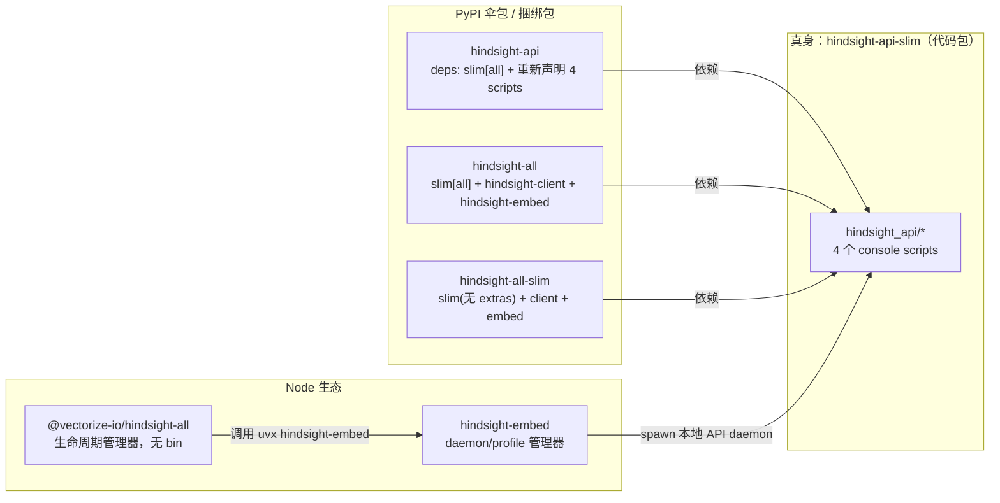
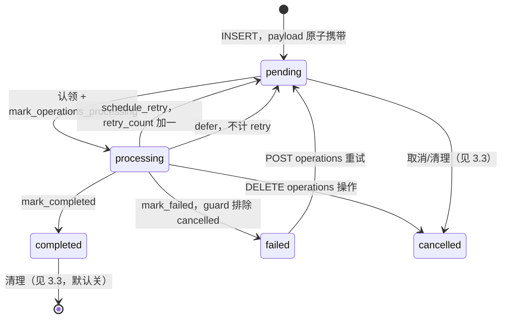
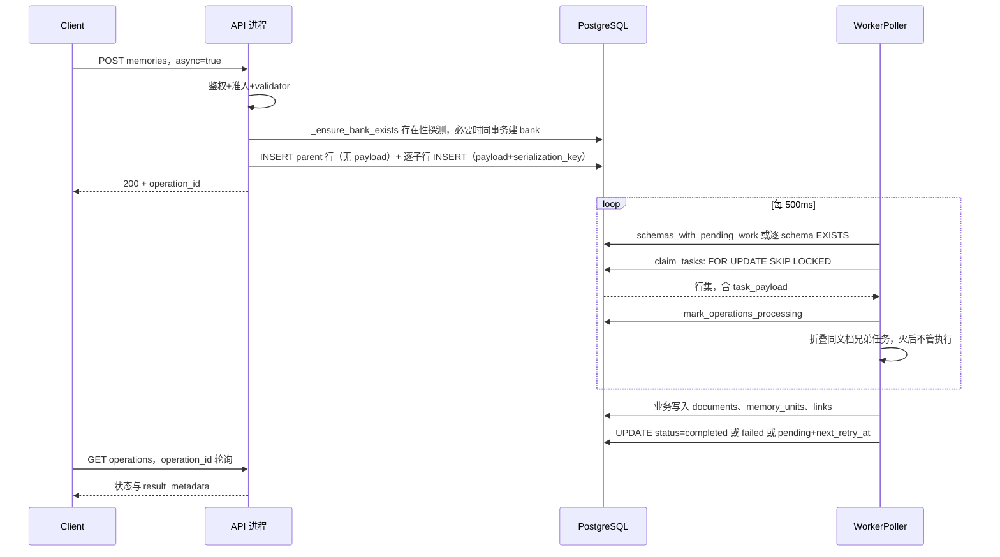
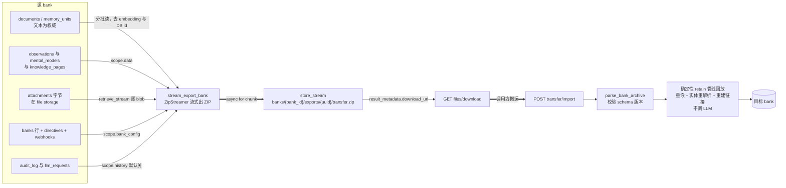
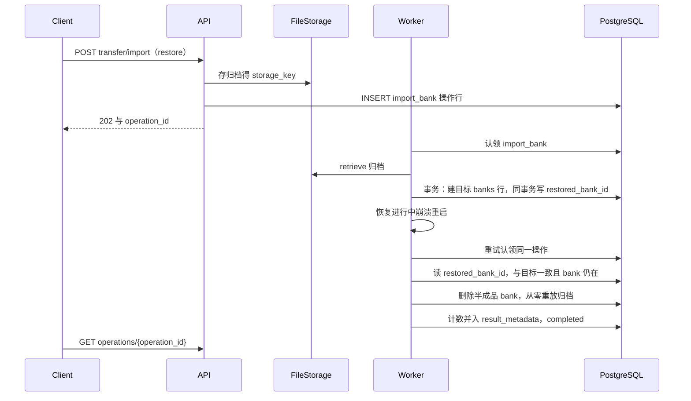

# 06 · API 层与服务形态

> 代码基线：`f7dd3f4fd`（v0.10.2，2026-10-03）；本篇已随 0.10.2 全量更新（原基线 `12f2d54f6`）。

> 研究对象：`hindsight-api-slim/hindsight_api/`（api/、worker/、main.py、server.py、daemon.py、mcp*.py、metrics*.py、tracing.py、liveness.py、loop_watchdog.py、cancellation.py）、`hindsight-extensions/`、发布包链（hindsight-api-slim → hindsight-api → hindsight-all* → npm 包）。
> 方法：全部论断均直接读码核实，标注 `相对路径:行号`（相对 `hindsight-api-slim/`，其他目录标注全路径）。无法确认的条目在文末单独列出。

---

# 第 1 层【全景】

## 1.1 一句话形态

Hindsight 的服务形态是一个**单体 FastAPI 进程**：`hindsight-api` 一个入口同时承载 REST HTTP 面、MCP 协议面（同进程 ASGI 中间件拦截 `/mcp*`——ASGI：Python 的异步 Web 服务接口标准，应用与中间件都是接收 scope 上下文和 receive/send 两条原始请求/响应字节流通道的可调用对象，中间件即包在应用外的另一层）、以及**默认开启**的后台任务执行器（进程内 `WorkerPoller`，`config.py:1856` `DEFAULT_WORKER_ENABLED = True  # API runs worker by default (standalone mode)`）。数据库（PostgreSQL/Oracle 23ai）既是存储也是任务队列；需要水平扩容时，把 `HINDSIGHT_API_WORKER_ENABLED=false` 关掉 API 内的 poller，另起独立的 `hindsight-worker` 进程，二者通过 `async_operations` 表解耦协作。

三种典型运行形态：

| 形态 | 进程拓扑 | 典型入口 |
|---|---|---|
| 单机内嵌 | 一个 daemon 进程（API+MCP+poller）+ pg0 嵌入式 Postgres | `hindsight-embed` / `hindsight-local-mcp` |
| Docker 单容器 | `hindsight-api` + Next.js 控制面（`start-all.sh` 同容器两个子进程），worker 在 API 进程内 | `docker/standalone/start-all.sh:354`（API 子进程）、`:389`（node 控制面） |
| Kubernetes 分离 | API Deployment（worker 关闭）+ Worker StatefulSet（`command: ["hindsight-worker"]`）+ 控制面 Deployment | `helm/hindsight/templates/worker-statefulset.yaml:41` |

## 1.2 发布包层级：slim 是唯一的"真身"

整条发布链里**只有 `hindsight-api-slim` 装代码**，其余都是依赖伞或生命周期壳：



要点（均已在 pyproject 中核实）：

- **hindsight-api-slim**（`hindsight-api-slim/pyproject.toml:177-181`）声明四个入口，全部落在 `hindsight_api` 包内：
  ```toml
  [project.scripts]
  hindsight-api = "hindsight_api.main:main"
  hindsight-worker = "hindsight_api.worker.main:main"
  hindsight-local-mcp = "hindsight_api.mcp_local:main"
  hindsight-admin = "hindsight_api.admin.cli:main"
  ```
- **hindsight-api**（`hindsight-api/pyproject.toml:13,26`）`dependencies = ["hindsight-api-slim[all]==0.10.2"]`，且 `packages = []` —— 纯依赖伞，唯一作用是给"想要开箱即用（含本地 ML 模型 + pg0）"的用户一个名字；四个 scripts 在它这里重新声明一遍（19-23 行），保持 CLI 命令与包名一致。
- **hindsight-all / hindsight-all-slim**（`hindsight-all/pyproject.toml:12-16`、`hindsight-all-slim/pyproject.toml:12-16`）**不依赖 hindsight-api**，直接拉 `hindsight-api-slim`（all 版带 `[all]` extra，slim 版不带 extras）+ `hindsight-client` + `hindsight-embed`；它们提供的是 Python 库形态的嵌入式用法（`hindsight-all/hindsight/embedded.py` 的 `HindsightEmbedded`，自动拉起本地 daemon）。
- **@vectorize-io/hindsight-all**（`hindsight-all-npm/package.json:2-3`，无 `bin`）是程序化生命周期管理器：`src/command.ts:19-25` 返回 `["uvx", "hindsight-embed@<version>"]`（uvx：uv 生态的 npx——临时运行 PyPI 包的命令），`src/server.ts` 依次执行 profile 创建 → `daemon start` → 轮询 `http://127.0.0.1:8888/health`（30s 预算）。
- **hindsight-embed**（`hindsight-embed/pyproject.toml:18`，入口 `hindsight_embed.cli:main`）负责本地 daemon/profile：数据库默认 `pg0://hindsight-embed-{profile}`，API 默认 8888，控制面端口 = API 端口 + 10000；找 API 命令的顺序是：dev 仓库 `uv run` → 已安装的 `hindsight-api` 可执行文件 → 兜底 `uvx hindsight-api@<version>`（`hindsight_embed/daemon_embed_manager.py:388,433`）。

> 命名注意：`hindsight-api-slim` 的 "slim" 指**不带重量级可选依赖**（torch/本地模型等在 extras 里），而不是功能精简——核心引擎代码 100% 在这个包里。

## 1.3 对外协议面：REST + MCP，同一个进程、同一个 engine

先明确两个贯穿全文的名词：**bank**（记忆库）是 Hindsight 的隔离存储单元，相当于一个 agent 独立的"大脑"，URL 中的 `{bank_id}` 即其标识；**租户（tenant）**是 bank 之上的部署级隔离，映射到独立的数据库 schema。

- **REST**：全部业务路由挂在 `/v1/default/banks/{bank_id}/...` 前缀下（`default` 是租户占位段——`TenantExtension` 决定它映射到哪个 schema），仅两条例外：bank 前缀之外的 `GET /v1/default/chunks/{chunk_id:path}`（7958）与 `GET /v1/default/files/download/{key:path}`（9268）；另有 `/health`、`/health/ready`、`/health/live`、`/metrics`、`/version`、`/v1/bank-template-schema`。扩展 HTTP 路由挂 `/ext/`（http.py:5215-5230）。
- **MCP**：FastMCP 实现的 streamable HTTP/SSE 服务，挂在**同一个 FastAPI app 之外包一层 ASGI 中间件**（`api/__init__.py:97-105`），路径 `/mcp`（多 bank 模式，39 个工具）与 `/mcp/{bank_id}`（单 bank 模式，36 个工具，见 `mcp.py:131-166`）。工具清单在 `mcp_tools.py:43-84` 的 `_ALL_TOOLS`（39 个）：`retain`/`sync_retain`/`recall`/`reflect`、mental-model 全套 CRUD+`refresh`/`clear`、directives、memories/documents/operations/tags 的 list-get-update-delete、bank 管理、knowledge-base 树与页 CRUD。MCP 与 REST 共享同一个 `MemoryEngine` 实例，不是独立服务。
- **根级 `mcp_local.py`**：不是独立 MCP server，而是给本机 Claude Code 用的"一条命令起全家"薄壳——默认 `pg0://hindsight-mcp` 数据库，然后直接调用 `hindsight_api.main.main()`（`mcp_local.py:29-40`），完整 API 跑在 8888，MCP 端点是 `http://localhost:8888/mcp/`（HTTP transport，见其 docstring 1-24 行；`mcp_tools.py` 顶部 docstring 仍称它为 stdio transport，与实际实现不符，属文档残留）。

## 1.4 REST 端点地图（按资源分组）

以下为 `_register_routes`（http.py:5336 起）注册的全部业务路由（省略共同前缀 `/v1/default`；方法后为 handler 名，数字为定义处行号）。这张地图有两个用途：作为后续各小节的公共底图（retain/recall/operations 均会回指），以及开发时按 handler 名/行号直接跳转源码。顺读只需关注四组——**监控/元信息、Banks 与配置、Memory 写入与查询、异步操作管理**——它们覆盖主流程；其余分组按需查阅。v0.10.2 相比上一版新增 4 条路由（bank aliases 全套），总数 99 条；另有多条列表/搜索路由追加了 tag 过滤参数（#5031/#5034，参数级变化，不新增路由）。

**监控/元信息**
- `GET /health`、`GET /health/ready`（就绪，查数据库，5549）、`GET /health/live`（存活，不碰数据库，5566）、`GET /metrics`（Prometheus，5625，渲染已移出事件循环，见 3.5）、`GET /version`、`GET /v1/bank-template-schema`

**Banks 与配置**
- `GET /banks`（列表，6474）、`PUT /banks/{bank_id}`（创建或更新，8475，`@audited("create_bank")`）、`PATCH /banks/{bank_id}`（8520）、`DELETE /banks/{bank_id}`（8566）
- `GET /banks/{bank_id}/aliases`（8358）、`POST /banks/{bank_id}/aliases`（8381，201）、`PATCH /banks/{bank_id}/aliases/{alias}`（8412，设展示别名）、`DELETE /banks/{bank_id}/aliases/{alias}`（8447）——bank 别名全套，v0.10.2 新增（#4706/#4724，见 3.9）
- `GET /banks/{bank_id}/stats`（6502）、`GET /banks/{bank_id}/stats/memories-timeseries`（6595）、`GET/PATCH/DELETE /banks/{bank_id}/config`（层级配置，写受 `HINDSIGHT_API_ENABLE_BANK_CONFIG_API` 控制，DELETE 重置 9557）、`POST /banks/{bank_id}/clone`（9131，整库克隆，202 异步）、`GET /banks/{bank_id}/tags`（7891）、`POST /banks/{bank_id}/health/llm`（6560，刻意做成 POST——会真实调用一次 provider）
- legacy 的 `GET/PUT /banks/{bank_id}/profile`（8293/8306）与 `POST /banks/{bank_id}/background`（8321）已退役（保留路由恒返 410）

**Memory 写入与查询**
- `POST /banks/{bank_id}/memories`（retain，同步/异步二合一，9931）、`POST .../memories/dry-run-extract`（5799）、`GET .../memories/list`（5692，列表+全文搜索）、`POST .../files/retain`（10217，文件转换后 retain）、`GET /v1/default/files/download/{key:path}`（9268，附件/导出 ZIP 下载）
- `POST .../memories/recall`（检索，6042，handler `api_recall` 6056）、`DELETE /banks/{bank_id}/memories`（清空 bank 全部记忆，10386）
- `GET .../memories/{memory_id}`（5923）、`GET .../memories/{memory_id}/history`（6011）、`PATCH .../memories/{memory_id}`（5955，update_memory；**invalidate 也是 PATCH**，body 带 `state: "invalidated"`，请求模型 2696-2710——没有独立 DELETE 单条路由）、`DELETE .../memories/{memory_id}/observations`（9460，清空该记忆的观察）
- `POST /banks/{bank_id}/reflect`（处置感知推理，6295，handler `api_reflect` 6310）

**文档/实体/观察**
- `GET /banks/{bank_id}/documents`（7683）、`GET/PATCH/DELETE .../documents/{document_id:path}`（7854/7997/8049）、`GET .../documents/{document_id:path}/chunks`（7755）、`POST .../documents/{document_id:path}/reprocess`（7811）、`GET /banks/{bank_id}/attachments/{attachment_id}`（9214，附件元数据读取）
- `GET /banks/{bank_id}/graph`（5651，bank 级图）、`GET /v1/default/chunks/{chunk_id:path}`（7958，bank 外的 chunk 寻址读）
- `GET /banks/{bank_id}/entities`（6630，支持 tag 过滤）、`GET .../entities/graph`（6678）、`GET .../entities/{entity_id}`（6720）、`POST .../entities/{entity_id}/regenerate`（6777）——实体为只读派生数据，无更新/删除端点
- `DELETE /banks/{bank_id}/observations`（清空观察，9341）、`GET /banks/{bank_id}/observations/scopes`（9366）

**Mental Models / Directives / Knowledge Base**
- `GET/POST /banks/{bank_id}/mental-models`（6802/6934）、`GET/PATCH/DELETE .../mental-models/{id}`（6865/7101/7144）、`POST .../{id}/refresh`（6981，异步任务）、`POST .../{id}/clear`（7065）、`POST .../{id}/dry-run-refresh`（7015）、`GET .../{id}/history`（6903）
- `GET/POST /banks/{bank_id}/directives`（7502/7581）、`GET/PATCH/DELETE .../directives/{directive_id}`（7551/7616/7653）
- `GET .../knowledge-base/tree|search|export`（7184/7339/7296，树与搜索支持 tag 过滤）、`POST .../knowledge-base/folders`（7211，创建文件夹）、`POST .../knowledge-base/pages`（7243，创建页面）、`GET .../knowledge-base/pages/{page_id}`（7374，空页返回空正文而非占位句，#4680）、`PATCH/DELETE .../knowledge-base/nodes/{node_id}`（7402/7471；全空 body 的 PATCH 被 engine 以 400 拒绝在任何 bank 读取之前，#4709）

**异步操作管理（任务系统的 API 面）**
- `GET /banks/{bank_id}/operations`（8092）、`GET .../operations/{operation_id}`（8140）、`DELETE .../operations/{operation_id}`（取消 pending/processing，8178）、`POST .../operations/{operation_id}/retry`（重排队 failed，8215）、`DELETE .../operations/{operation_id}/delete`（删除终态记录，8245）

**Consolidation**
- `POST /banks/{bank_id}/consolidate`（9584，手动触发整合）、`POST .../consolidation-strategies/preview`（9400，试跑整合策略；策略体已类型化为 `ConsolidationStrategySpec` 列表，#4654）、`POST .../consolidation/recover`（9435）

**Bank Transfer（整库搬运，v0.10.2 头部特性，见 3.9）**
- `POST .../transfer/export`（8941，202 异步导出，三个 include 标志 + 可选 document_id 子集）、`POST .../transfer/import`（9025，202 异步导入，`mode=restore|merge`）
- `POST .../clone`（9131，202 异步克隆 = 导出+导入在本进程背靠背）
- 文档级历史端点：`POST .../document-transfer`（8867，异步文档导入提交）、`POST .../document-transfer/export`（8803，异步文档导出提交）、`GET .../document-transfer`（8773，同步全量导出已退役，恒返 410）
- 轮询走 `GET .../operations/{operation_id}`（8140），ZIP 经 `GET /v1/default/files/download/{key:path}`（9268）下载——transfer 面没有 GET 形态的提交端点

**Bank 模板（配置面，非归档）**
- `GET /banks/{bank_id}/export`（8685，导出模板 manifest：config + mental models + directives）、`POST .../import`（8598，导入模板 manifest）——注意这两个是**模板**交换，与 Bank Transfer 的整库归档无关

**Webhooks / 审计 / LLM 观测 / 提示词**
- `GET/POST /banks/{bank_id}/webhooks`（9708/9647）、`PATCH/DELETE .../webhooks/{id}`（9802/9771，无单条 GET；读取靠列表与 deliveries）、`GET .../webhooks/{id}/deliveries`（9885）
- `GET /banks/{bank_id}/audit-logs`（10432，+ `GET .../audit-logs/stats` 10473）、`GET /banks/{bank_id}/llm-requests`（10506，+ `GET .../llm-requests/stats` 10564）、`POST /banks/{bank_id}/prompts/preview`（5858）

MCP 端能做的操作与上述 REST 面**大体对应**（共享 engine），差异只在工具粒度：MCP 没有 export/import/transfer/clone/consolidate 这类管理型操作；反向地，MCP 的 `list_banks`/`create_bank`/`get_bank`/`get_bank_stats` 直连 engine，没有一一对应的 REST 形态——**没有 `GET /banks/{bank_id}` 单体读取端点**；bank 详情从 `GET /banks` 列表与 `/stats`、`/config` 获取，PATCH/DELETE 只承担写。

---

# 第 2 层【主流程】

## 2.1 服务启动：从 `hindsight-api` 到 uvicorn.run

`hindsight_api/main.py:277` 的 `main()` 按以下顺序装配（`hindsight_api/server.py` 则是给 `uvicorn hindsight_api.server:app` 用途准备的模块级等价物）：

1. `load_dotenv_for_entrypoint()` 加载 .env → `_get_raw_config()` 读配置；
2. 解析 CLI 参数（`_parse_cli_args`，`--host/--port/--workers/--daemon/...`）；
3. **端口预探测**：`_wait_for_port`（main.py:325 调用，定义 172-180，对 EADDRINUSE 做 5s 宽限重试）在昂贵的初始化（pg0 启动、模型加载、迁移）**之前**试绑定端口，避免"初始化 10 秒后才发现端口被占"造成的重启风暴（main.py:142-152 注释引用 #4281）；
4. daemon 模式：`daemonize()`（daemon.py:94-144）用 `subprocess.Popen` + `_HINDSIGHT_DAEMON_CHILD` 环境变量**重 exec 自己**进入后台（不用 double-fork，注释写明原因是 macOS 上 fork 不 exec 会破坏 Apple 框架状态导致 PyTorch/MPS SIGBUS）；
5. 加载两个由环境变量指定的扩展：`OPERATION_VALIDATOR` 与 `TENANT`（main.py:367-375）；
6. 构建 `MemoryEngine` + `create_app`（仅单 worker 模式，main.py:398-416），多 worker/reload 模式改为传 import string `"hindsight_api.server:app"`，由每个 uvicorn 子进程自行导入（uvicorn_config 组装处 main.py:453）；
7. `uvicorn.run(...)`（main.py:492）。

main.py 顶部有一段关键的懒加载设计（main.py:44-58）：`create_app`/`MemoryEngine`/扩展机制**不在模块级导入**，通过模块 `__getattr__`（PEP 562）在首次使用时解析：

```python
# hindsight_api/main.py:60-66
_LAZY_IMPORTS: "dict[str, tuple[str, str]]" = {
    "MemoryEngine": (".", "MemoryEngine"),
    "create_app": (".api", "create_app"),
    "OperationValidatorExtension": (".extensions", "OperationValidatorExtension"),
    "TenantExtension": (".extensions", "TenantExtension"),
    "load_extension": (".extensions", "load_extension"),
}
```

逐点讲解：
- 原因是 uvicorn 多进程 supervisor 用 **spawn**：每个子进程会重跑 `sys.argv[0]`（pip console-script 包装器），其首行就是 `from hindsight_api.main import main`——这个模块 import 什么，**每个子进程就都要付一次代价**。注释里给了实测：`.api` 导入约 6.2s、`.extensions` 约 2.6s，把这两者移出模块级后整条命令的导入从 6578ms 降到 312ms（main.py:53-55）。
- 子进程导入若超过 supervisor 的 5s 健康检查会被 SIGKILL 无限重生（这正是被修掉的 respawn bug）。
- 走 `main()` 时通过 `sys.modules[__name__]` 属性访问触发懒导入（main.py:359-364），而不是裸 `from .x import y`——后者会屏蔽测试对模块属性的 patch。

uvicorn 配置里两个值得注意的点（main.py:452-455）：`ws="wsproto"`（避开 websockets 的弃用告警）、`timeout_graceful_shutdown=5`（优雅关闭上限 5s，二次 Ctrl+C 强杀）；`--workers N` 时把 N 写回 `os.environ[ENV_WORKERS]`（main.py:463-466），让每个子进程按 CPU 预算分摊准入限额（见 3.4）。

`server.py`（94 行）是 import-string 模式的目标模块：模块级 `load_dotenv_for_entrypoint()`（server.py:25-27）放在 **import MemoryEngine 之前**——引擎子模块（如 llm_wrapper）在 import 时就会按配置创建信号量，而配置来自环境变量，所以必须先加载 .env，配置才能读到；随后是 profiling 装配（29-40）、扩展加载（58-65）、以及**模块级**构建 `MemoryEngine(run_migrations=config.run_migrations_on_startup)` 与 `app = create_app(...)`（70-87）——注释说明迁移是幂等的，多 worker 各自导入也安全。

### 启动时序（含 FastAPI lifespan）


## 2.2 create_app：一个 app、三层装配

真正的 app 由两段代码拼成：

**第一段（`api/__init__.py:17-109`，统一入口）**：`create_app(memory, http_api_enabled, mcp_api_enabled, mcp_mount_path, initialize_memory)`——先建两个 FastMCP server（多 bank / 单 bank），再调 `api/http.py` 的 `create_http_app` 建 REST app，然后：① 用 `chained_lifespan`（`api/__init__.py:79-92`）把两个 MCP server 的 lifespan 包在 REST app 的 lifespan 外层——启动时先起 MCP、再起 REST，关闭顺序相反（lifespan 即 FastAPI/ASGI 的应用启动/关闭生命周期钩子）；② `app.add_middleware(MCPMiddleware, ...)` 把 MCP 中间件包在最外层（97-105 行）。注释解释不用 Starlette Mount 的原因：Mount 会让无尾斜杠的 `/mcp` 吃 307 重定向。

**第二段（`api/http.py:4955-5242`，本文件也叫 `create_app`，`api/__init__.py` 里以 `create_http_app` 别名导入）**：`create_app` 依次做入口处 profiling 装配（4981-4985，保证 `--workers N` 时每个子进程也装上 cProfile）、route_class 替换（`ExcludeNoneRoute`→`UnknownParamsRoute`，5165/5205）、GZip（5175-5177，阈值可配，负值整体关闭）、OpenAPI ValidationError 补丁（5186-5197）、**准入控制器**挂 `app.state.admission`（5209）、注册全部路由（5212）、`/ext/` 扩展路由挂载（5215-5230，include_router 前先 `use_unknown_params_routes` 让扩展路由也走 UnknownParamsRoute）、两个纯 ASGI 中间件（见下）、OTel ASGI instrumentation（5241）。

```python
# hindsight_api/api/http.py:5229-5239
    # Client-disconnect cancellation for recall/reflect. Added LAST so it sits
    # OUTSIDE the @app.middleware("http") (BaseHTTPMiddleware) layers above —
    # that placement is mandatory: BaseHTTPMiddleware breaks
    # Request.is_disconnected(), so the only way to observe an abandoned request
    # is to own the raw ASGI receive channel from outside it (issue #2122).
    app.add_middleware(ClientDisconnectCancellationMiddleware)
    # Pure ASGI, so unlike the BaseHTTPMiddleware it replaces it adds no task hop:
    # records the request metrics and attaches X-Ignored-Params for the route class.
    app.add_middleware(HttpObservabilityMiddleware)
```

逐点讲解：
- Starlette 的 `add_middleware` 是插到栈顶（最后添加者在最外层），所以**自外向内**的完整顺序是：`MCPMiddleware` → `HttpObservabilityMiddleware` → `ClientDisconnectCancellationMiddleware` → `GZipMiddleware` → route_class（`UnknownParamsRoute`）→ FastAPI 依赖解析 → handler。上述是 tracing 关闭（默认）时的全部；**tracing 开启时** OTel ASGI 中间件经 `_instrument_app_for_tracing`（http.py:5290-5330）注入，位于 HttpObservability 之外、MCPMiddleware 之内——即 MCP → OTel → Observability → Disconnect → GZip。
- 两个 ASGI 中间件都是纯 ASGI 实现，刻意替换掉了原来的两个 `@app.middleware("http")`（BaseHTTPMiddleware）：注释给出量级——BaseHTTPMiddleware 的每请求子任务 + memory-stream 中转在便宜路由上吃掉约 3 倍吞吐（5195-5200）；`api/observability.py:5-9` 记录 `/health/live` 从约 1500 rps 升到 5100 rps、p99 159ms→33ms。
- `ClientDisconnectCancellationMiddleware` 的位置约束是"必须能读到原始请求字节流（receive 通道）"：任何包装 receive 的层（BaseHTTPMiddleware、OTel 的 receive span）都在它之外才能感知断连。它外面的 `HttpObservabilityMiddleware` 只包 send 不包 receive，OTel 又显式 `exclude_spans=["receive","send"]`（http.py:5328，省 span 的同时避免包装 receive 破坏断连检测），所以最外层是 MCP → observability、断连中间件在第三层也依然有效。

## 2.3 请求 → 中间件 → 依赖 → engine：分层机制图


依赖链的三个环节是理解每条重路由的关键（都在 `_register_routes` 内定义）：

1. **`get_request_context`**（http.py:5342-5379）：从 `Authorization` 头取 API key（支持 `Bearer <key>` 与裸 key），并把 `HINDSIGHT_API_EXTENSION_PASSTHROUGH_HEADERS` 白名单中的头收进 `RequestContext.extra_headers`（默认空名单）。第一行 `request.scope.setdefault("hs_deps_t0", time.time())` 是给 recall 的分段计时埋点。
2. **`precheck_for(operation)`**（http.py:5437-5512）：FastAPI **先解析依赖、后反序列化 body**（5444-5446 注释），所以它先 `memory._authenticate_tenant(request_context)`（5475，租户鉴权 + schema 定位），再调 `OperationValidator.precheck`（5493）——扩展可以在这里以 402/429 等拒绝请求，而请求体从未被读进内存。挂在 8 条计费路由上：dry-run-extract、recall、reflect、mental-model 创建/刷新/dry-run-refresh、retain、files/retain（http.py:5818/6061/6315/6949/6994/7040/9961/10254）。
3. **`admit_for(operation)`**（http.py:5399-5435）：yield 风格依赖，`async with controller.admit(...)` 让准入许可覆盖整个请求生命周期；排队期间如果客户端断连（`AdmissionAbandoned`）直接 499 关闭，超时（`AdmissionRejected`）回 503 + `Retry-After`。

## 2.4 贯穿例子 A：一次 POST retain 的完整 HTTP 旅程

请求：`POST /v1/default/banks/my-bank/memories`，body `{"items":[{"content":"..."}],"async":true,"operation_id":"<client uuid>"}`。

1. **中间件段**：MCPMiddleware 前缀不匹配直接透传；HttpObservabilityMiddleware 记 `scope["hs_asgi_t0"]` 并使 `/banks/<id>` 模板化后计入 `hindsight.http.duration`；断连中间件对 `/memories/recall`、`/reflect` 结尾的路径才装令牌（retain 不装）；GZip 视大小压缩请求响应。
2. **依赖段**：`get_request_context` 提取 API key → `precheck_for(RETAIN)`：租户鉴权（`_authenticate_tenant`，把 `_current_schema` ContextVar——请求作用域的上下文变量，可理解为协程版的 thread-local——设为租户 schema）+ validator `precheck`（可 402 拒费）→ `admit_for(RETAIN)` 拿准入许可（默认 32/核并发、排队上限 2s）。
3. **body 解析**：`RetainRequest` 校验（items/document_tags/async_/operation_id...）。
4. **handler `api_retain`**（http.py:9957-10213，`@audited("retain")` 在 9956）：
   - 多模态内容先规范化：`canonicalize_item_content` 把图片块落成内容寻址附件、正文替换占位符（9998-10007），并处理"文档重发旧占位符"的编辑场景（9987-9995）；附件按文档归属入库（10008-10023），validator 拒绝时的附件回收在 engine 侧（memory_engine.py:22192）。
   - items 按 `strategy` 分组，逐条拼 `content_dict`（timestamp→event_date、context、metadata、document_id、entities、tags、observation_scopes、update_mode...，10026-10080）。
   - **async=true 分支**（10078-10109）：每个策略组调一次 `memory.submit_async_retain(...)`（10091），返回 `RetainResponse{success, bank_id, items_count, async: true, operation_id(s)}`。注意：**HTTP 状态是 200**（路由未设 202），异步语义靠 body 里的 `async: true` + `operation_id` 表达，客户端轮询 operations 端点。
   - **async=false 分支**（10110-10161）：若 batch API 开启则强制拒绝同步模式（400，10114-10122）；否则逐组 `retain_batch_async` 同步执行（10130），聚合 token usage 后返回。
5. **错误映射**（10162-10213）：validator 拒绝→其自带 status_code；operation_id 冲突→409；视觉不支持→422；参数错误→400；`MemoryDefenseAllBlockedError`→422 + violations 明细；其余→500（附输入摘要与 traceback）。

`submit_async_retain`（memory_engine.py:22148 起）内部：租户鉴权 → validator `validate_retain` → `sanitize_value` 清洗（防 U+0000/孤立代理对让 jsonb INSERT 直接炸，22200-22214）→ **幂等快路径**（22216-22233）→ 拒绝重复 document_id（仅异步路径，22234-22253）→ 按 token 预算 `_split_contents_into_async_children` 切子批（22264）→ 总是建 parent operation（22282-22284，"even for single batch - simpler, more reliable code path"）→ parent+子操作同一事务逐个入库 → 通知 task backend。

幂等键机制的完整规则：

```python
# hindsight_api/engine/memory_engine.py:22119-22146（节选）
    async def _resolve_retain_replay(self, operation_id: uuid.UUID, bank_id: str) -> dict[str, Any] | None:
        """Resolve a caller-supplied async retain operation_id to a prior submission.

        Returns the replay response when the id is this bank's own batch_retain
        parent (a retried submission after a lost acknowledgement — no new work),
        ``None`` when the id is unused (free to create), and raises
        RetainOperationConflictError when the id is already used by a different
        bank or a different operation type.
        """
```

逐点讲解：
- 客户端可自选 UUID 作 `operation_id`；重发同一 id 时若该 id 已是**本 bank 的 batch_retain parent**，直接回放原响应（`items_count` 存在 parent 的 `result_metadata` 里），**不产生新工作**——这是"丢失应答后重试不重复入库"的保证（22161-22164 docstring：parent 主键本身就是并发权威，无需额外去重列）。
- id 被其他 bank 或其他操作类型占用 → `RetainOperationConflictError` → HTTP 409。
- 该 SELECT 刻意不在创建事务里（22219-22230 注释）：并发首次提交靠主键冲突兜底，快路径只为常见的顺序重试省事。
- 其他异步操作（consolidate、refresh_mental_model、export/import 等）没有客户端幂等键，靠的是**提交期去重**（`dedupe_by_bank` / `dedupe_in_flight_payload_key`，见 3.1）。

## 2.5 贯穿例子 B：worker 认领一次 retain 任务的数据库操作全程

前置：API 已把任务写入队列。worker 侧（`worker/main.py:169` 的 `main()`，或 API 进程 lifespan 里的同款 `WorkerPoller`）以 `poll_interval_ms`（默认 500ms，config.py:1858）循环执行。

**步骤 1 — 找有活的 schema**（多租户时）：`_scan_active_schemas`（poller.py:415-451）优先调用服务端例程 `SELECT * FROM public.schemas_with_pending_work()`（448 行，一次往返替代 N 次逐 schema EXISTS）。注意这个例程**不由 Hindsight 安装**——`engine/db/optional_routines.py` docstring 明言 API 与迁移都不装、由运维带外安装（如 Helm hook）；未安装时回退 `_scan_active_schemas_by_exists`（453 起）的 per-schema `EXISTS`（单 schema 部署即如此）。

**步骤 2 — 计算本进程可用槽位**：`_get_available_slots`（poller.py:471-501）。`max_slots` 默认 10（config.py:1862），`slot_reservations` 默认 `{"consolidation": 2}`（config.py:945）—— 预留池保底、剩余进共享池。

**步骤 3 — 声明式认领**（`claim_batch` → `_claim_batch_for_schema_inner`，poller.py:529/675-734）：整轮复用一条池化连接（685 行注释：每次 acquire/release 都有 session GUC + RESET ALL 仪式，逐 schema 取连接会把 2 条有效查询放大成约 12 条语句，#3499），但每个 schema 的认领**各自开事务**（693 行），行锁只到本 schema 认领提交为止。认领 SQL 由 `backend.ops.claim_tasks` 生成（ops_postgresql.py:1846-1919），核心是 `FOR UPDATE SKIP LOCKED`（已被其他 worker 锁住的行直接跳过、不等待，所以多 worker 并发认领互不阻塞）：先按预留池逐类型认领（consolidation 走优先级分层的 `_claim_consolidation_tasks`），再认领共享池。

示例（字段名与代码一致）：`async_operations` 中一行。`serialization_key` 是认领层的串行化分组键：同组作业不并发（异步 retain 按文档 id 填入，consolidation 按 bank 填入），折叠也按它找兄弟。
```
operation_id=7f3c...  bank_id='my-bank'  operation_type='retain'
status='pending'  task_payload={"type":"batch_retain","operation_id":"7f3c...","bank_id":"my-bank",
              "contents":[{"content":"..."}],"_traceparent":"00-4bf9..."}
serialization_key='doc-42'  retry_count=0  next_retry_at=NULL
```
共享池认领 SQL（ops_postgresql.py:1815-1844，rot/fifo 两 CTE 一条语句）：

```sql
WITH rot AS (                       -- 轮转层：bank_id 严格大于游标的第一行
    SELECT o.operation_id, 0 AS tier, o.created_at
    FROM async_operations o
    WHERE o.status='pending' AND o.task_payload IS NOT NULL
      AND o.operation_type != 'consolidation'
      AND (o.next_retry_at IS NULL OR o.next_retry_at <= NOW())
      AND {bank_serialization_sql} AND {document_serialization_sql}
      AND o.bank_id > $1            -- $1 = 上轮服务到的 bank 游标
    ORDER BY o.bank_id LIMIT 1
), fifo AS (                        -- FIFO 层：其余按 created_at 补满
    SELECT o.operation_id, 1 AS tier, o.created_at
    FROM async_operations o
    WHERE <同上谓词> AND NOT EXISTS (SELECT 1 FROM rot WHERE rot.operation_id = o.operation_id)
    ORDER BY o.created_at LIMIT $2
), cand AS (                        -- 两层合并（轮转行优先）
    SELECT * FROM rot UNION ALL SELECT * FROM fifo
)
SELECT ... FROM cand c JOIN async_operations o ON o.operation_id = c.operation_id
WHERE <谓词再次成立>                 -- FOR UPDATE 下重查，防双认领
ORDER BY c.tier, c.created_at LIMIT $2
FOR UPDATE OF o SKIP LOCKED
```

随后（仍在 claim 事务内）：`_fold_retain_peers`（poller.py:735-831）把同一 `serialization_key`（同一文档）排队中的兄弟 retain **折叠**进本次执行——`fetch_foldable_retain_peers`（ops_postgresql.py:1940 起，同样 `FOR UPDATE SKIP LOCKED`）取 peers，`plan_retain_fold` 按 token 预算规划，失败则退回单任务执行。落账分两次：主行在 `claim_tasks` 末尾统一 `mark_operations_processing`（ops_postgresql.py:1917 调用，定义 1921-1939），折叠并入的 peers 由 `_fold_retain_peers` 再补一次 mark（poller.py:811-816）。落账语句：

```sql
UPDATE async_operations
SET status = 'processing', worker_id = $1, claimed_at = now(), updated_at = now()
WHERE operation_id = ANY($2)
```

**步骤 4 — 执行**：poller 把行包成 `ClaimedTask`（payload 反 JSON、注入 `_retry_count/_operation_id`、DB 权威的 `operation_type`，poller.py:726-737），`asyncio.create_task` 火后不管（1077-1094），经 `_run_executor` 的 wall-clock 上限包装（retain 绝对上限、consolidation 是"无进展才计时"的空闲上限，poller.py:80-93, 1108-1165）调 `MemoryEngine.execute_task`。engine 侧：恢复 payload 里的 traceparent 接回原 trace（memory_engine.py:4604-4623）、设 `_schema` ContextVar（4630-4632）、**先查行状态是否已被取消**（4634-4648），然后按 `type` 分发到 `_handle_batch_retain` 等处理器（4660-4685）。

**步骤 5 — 终态**：成功 → `_mark_completed`（poller.py:862-876，`WHERE ... AND status='processing'` 防覆盖，v0.10.2 起同时清空 `error_message` 防陈旧错误残留，#4880）；失败 → `_mark_failed`（878-904，`WHERE status <> 'cancelled'` 防把取消改成失败）；二者都在事务内做 batch_retain 父子聚合 `_maybe_update_parent_operation`（906-1009：FOR UPDATE 锁父行，全部子件到达终态时父行置 completed/failed/cancelled，failed 优先且继承最高频子错误）。

**步骤 6 — 客户端收尾**：`GET /banks/{bank_id}/operations/{operation_id}` 轮询（8092/8140）；失败后可 `POST .../retry` 重排队（8215），pending/processing 可 `DELETE .../{operation_id}` 协作式取消（8178：pending 永不启动，processing 由执行中任务在下个检查点停下）。

### 任务状态机



### 提交 → 认领 → 执行时序



---

# 第 3 层【机制深潜】

## 3.1 任务队列：`async_operations` 就是队列

任务队列的三个核心设计在代码中逐一坐实：`async_operations` 表就是队列（下文表结构）；三种 task backend 分的是"提交侧如何通知"的工（下表）；认领用 `FOR UPDATE SKIP LOCKED` SQL（3.2 展开）。

**表结构**：初始迁移建表（`alembic/versions/5a366d414dce_initial_schema.py:217-243`）只有 `operation_id(UUID PK)/bank_id/operation_type/status/created_at/updated_at/completed_at/error_message/result_metadata(jsonb)`，status CHECK 约束限定 `('pending','processing','completed','failed')`。任务化所需的列由后续迁移分批补齐：`l7g8h9i0j1k2_add_worker_columns.py:40-69` 加 `worker_id/claimed_at/retry_count/task_payload(jsonb)` 四列（并建 `worker_id` 部分索引，79 行附近）；`next_retry_at` 由 `e4f5a6b7c8d9_add_webhooks_tables.py:49-55` 添加（连同 `(status, next_retry_at)` 轮询索引）；`d9c1a7b4e2f6_async_operations_serialization_key.py:54-61` 加 `serialization_key` 与 `(bank_id, serialization_key)` 的**部分（非唯一）索引**——`CREATE INDEX`，WHERE 还含 `serialization_key IS NOT NULL AND status IN ('pending','processing')`。同文档 retain 的串行化保证来自认领谓词 `bank_serialization_sql`（见 3.2）而非数据库唯一约束，这个索引只是让谓词查得快；折叠（3.3 之前例 B）同样按它定位兄弟行。（`cancelled` 状态由代码写入，CHECK 约束在 `i4j5k6l7m8n9_add_cancelled_status_to_async_operations.py:28-31` 扩为五值；api-slim 迁移目录里另有 `add_scheduled_mental_model_refresh_routine`、`schemas_with_expired_operations` 等服务端例程迁移。）

**operation_type 清单**（代码中出现者）：`retain`（= batch_retain 子件，payload 的 `type` 字段为 `"batch_retain"`，`memory_engine.py:21911-21914`）、`batch_retain`（父聚合行，payload 为 NULL 不可认领）、`file_convert_retain`、`consolidation`、`refresh_mental_model`、`webhook_delivery`、`import_documents`/`export_documents`/`import_bank`/`export_bank`、`clone_bank`（memory_engine.py:7797）、`graph_maintenance`、`vector_index_maintenance`。

**三种 task backend**（`engine/task_backend.py`）——注意它们的分工是"提交侧如何通知"，不是三套队列：

| backend | 类位置 | `submit_task` 行为 | 使用者 |
|---|---|---|---|
| `BrokerTaskBackend` | task_backend.py:153 | 对已有行补写 `task_payload`（`WHERE ... AND task_payload IS NULL` 防覆盖，228-238；兼容路径，见下）；无 operation_id 时自行 INSERT（243-255） | API 进程默认（memory_engine.py:3008，由 backend 决定） |
| `WorkerTaskBackend` | task_backend.py:126-150 | **no-op**："row already exists in async_operations; a worker will claim it" | `hindsight-worker` 独立进程（worker/main.py:284-290）——worker 执行中触发的子任务（如 retain 触发的 consolidation）行已入库，交给下一轮轮询，避免阻塞父任务 |
| `SyncTaskBackend` | task_backend.py:95-123 | 立即内联执行（`_execute_task`） | 测试/嵌入用法 |

关键演进点（memory_engine.py:21907-21910 注释）：早期 INSERT 不带 payload、靠 `submit_task` 二次 UPDATE 补——两次写之间崩溃会留下"payload 为 NULL 的行"，而认领查询要求 `task_payload IS NOT NULL`，该行永远无人认领。现在 payload 与行**同一 INSERT 原子写入**（21911-21917 构造、22100-22112 落库），UPDATE 只作兼容。

**提交期去重**（`_submit_async_operation`，memory_engine.py:21853-22117）：retain 之外的异步提交都走这个通用入口，两级去重避免重复任务堆积——`dedupe_by_bank`（21955-21990）按 bank+operation_type 查 pending（可选含 processing）行，命中则复用既有 operation_id 直接返回 `deduplicated=True`，适用于"一个 bank 同时只该有一个"的作业（如手动 consolidate）；`dedupe_in_flight_payload_key`（22053-22096）更细，按 `task_payload->>'<key>'` 匹配同一负载主体（如同一 `mental_model_id`）的在途任务。去重开启时提交会先对 banks 行加 `FOR NO KEY UPDATE` 锁（21925-21950），把"查重→插入"串行化，防两个并发提交都看不到对方（#1842）。

## 3.2 认领 SQL 的核心逻辑与公平性

`claim_tasks`（ops_postgresql.py:1846-1919）两阶段：Phase 1 按预留池逐类型认领（consolidation 有专属路径与 bank 优先级分层，`_claim_consolidation_tasks`，ops_postgresql.py:1516-1597）；Phase 2 认领共享池——2a 非 consolidation 走 rot/fifo 一条语句，2b consolidation 补位。认领完统一 `mark_operations_processing`（ops_postgresql.py:1921-1939）。

**公平性是三层旋转的叠加**：

1. **租户层轮转**（poller.py:571-657）：pass 1 只扫"有活"的 schema、每个池每 schema 至多认领 1 条；pass 2 才向有活的 schema 回填剩余槽位。`_next_schema_idx` 指针在轮末推进到"最后服务的 schema 之后"，让忙租户不能永远排在队首。
2. **bank 层轮转**（rot/fifo，ops_postgresql.py:1751-1795 `_claim_shared_tasks` docstring；`_claim_reserved_tasks` 在 1723）：全局 FIFO 会让一个正在批量灌入库的 bank 占满所有槽、别的 bank 排队（#3861）。`rot` CTE 是"bank_id 严格大于游标的第一行"（tier 0），`fifo` 兜底补满（tier 1）；游标 `_next_bank_cursor` 从结果里免费带回（claim_tasks:1897），空 rot 层即游标到头自动重开。单 bank 部署只多付一次空 seek。注释给出实测：5 万 pending 行时 rot seek 0.10ms vs 裸 FIFO 0.02ms，且轮转与 FIFO 合并成一条语句、无额外往返。
3. **bank 串行化谓词**（`bank_serialization_sql`，engine/db/ops.py:157-240）：每个查询都带这个谓词，保证**同一 bank 的同类作业（consolidation/graph_maintenance）全局至多一个 in-flight**——两个并发 consolidation 会读到同一批未整合记忆并重复喂给 LLM（#3700）。谓词有两个分支：`processing` 分支禁止与在跑的作业并发；"严格更老的 pending"分支防止一个批次的认领把同 bank 的多行全拿走（含"对端已认领未提交"的窗口）。它是**谓词而非独立认领阶段**，理由写在注释里：graph_maintenance 没有预留槽（默认 0），fairness pass 只给 `shared_limit=1`，若做成独立阶段会被一条排队的 retain 无限期饿死。

**重查为什么必要**：外层查询在 `FOR UPDATE` 下重申全部谓词（1782-1786 注释）——CTE 读行时未加锁，两个 worker 并发时，被对端先锁住的行会在重查时落选而不是被认领两次。代价是 SKIP LOCKED 偶尔让本轮少拿几行，下一轮自愈。

## 3.3 失败恢复与重试

执行期的五条出路（`_execute_task_inner`，poller.py:1167-1278）：

| 异常 | 处理 | 写库效果 |
|---|---|---|
| 正常完成 | `_mark_all_completed`（fold 的全部 operation_id 一起终态，v0.10.2 起同时置 `error_message=NULL` 清掉陈旧错误，#4880） | `status='completed'` |
| `_WallTimeoutExceeded` | 失败 + 引擎回调 `on_task_wall_timeout`（补发 consolidation 失败 webhook） | `status='failed'` + 可读原因（含 stage 与 env 变量名） |
| `DeferOperation` | `_defer_operation`（1040-1061） | 回 pending + `next_retry_at`，**不**加 retry_count、不写 error_message（"intentional backpressure, not a failure"） |
| `RetryTaskAt` | `_schedule_retry`（1011-1037） | 回 pending + `next_retry_at` + `retry_count+1` + `worker_id=NULL, claimed_at=NULL`；并把本次错误存进 `result_metadata.last_retry_error`——完成时会清 error_message，重试历史改由这里保留（#4858） |
| 其他异常 | 先判 `is_store_backpressure`（1238，存储端因索引落后而甩负载→defer，不烧重试预算）；否则 `_mark_all_failed`，若连失败写库本身也失败（池耗尽等）则 `_reclaim_own_processing_tasks` 单行抢救（1258-1266） | `status='failed'` 或回 pending |

**崩溃恢复的三条线**（全部收口在 `_reclaim_own_processing_tasks`，poller.py:1279-1359）：

- 启动时 `recover_own_tasks`（1361-1403）：把**本 worker_id**名下 `processing` 的行——低于重试上限的回 pending（`retry_count+1`）、达到上限的置 failed（防"认领→磨死→回收"死循环，#2675/#2834）——外加 batch API 行恢复（`_recover_batch_operations`，1440-1507，按 `result_metadata->>'batch_id'` 识别）与孤儿 parent 收敛（`_reconcile_orphaned_parents`，1509+；**孤儿 parent** 指 batch_retain 父行在子件已全部终态后仍卡在 pending/processing——崩溃发生在子件终态提交与父行更新之间，或子件压根没提交，状态图里 `pending --> cancelled` 的"清理"即指此收敛）。
- 关停时 `release_own_tasks`（1405-1438）：drain 超时后把仍归自己的行还回 pending。动机写在注释里：默认 worker_id 派生自 hostname，容器里**永不复现**，没有这条路径那些行会永远卡在 processing（#3228）。
- 运行中兜底：终态写库失败时按 operation_id 单行抢救（1258-1266）。

**wall-clock 上限**（poller.py:57-93）：retain 类是**绝对**上限（一个文档跑一小时必有蹊跷）；consolidation 是**空闲**上限——每个提交批次推进 stage 都会 `asyncio.timeout(...).reschedule()` 重置时钟（1108-1165），只有真正停滞才触发。`refresh_mental_model` 在 v0.10.2 也拿到了显式上限（借用 reflect 的 `reflect_wall_timeout`，poller.py:91-93）——没有上限的卡死刷新会一直占着 worker 槽直到重启（#4581）。触发时取消执行器，因此引擎自己的 except 块（会发 webhook）不会跑，poller 用 `on_wall_timeout` 回调代为通知（1160-1165）。设计动机：卡死的任务会永占 worker 槽、操作停在 API 既不重试也不可取消的 `processing`（#3002）。

**worker 与 API 的关系总结**：同一张队列表、同一份认领代码（`WorkerPoller`）。默认 API 进程内嵌一个 poller（standalone）；`hindsight-worker` 是同构的独立进程，区别仅在 task backend 用 no-op 的 `WorkerTaskBackend`、且 `run_migrations=False`（worker/main.py:284-290），启动前会检查 `supports_worker_poller`（305 起，不支持的 backend 直接退出而非悄悄同步执行）。`hindsight-admin` 另有 `decommission-worker(s)`/`worker-status` 命令按 worker_id 清理遗留行（admin/cli.py:1458-1518 附近）。

## 3.4 admission 准入控制：限"等待"而非限"并发"

`api/admission.py` 的 docstring 把问题定义得很清楚：裸信号量是背压不是准入——2 vCPU 容器上 1024 并发 recall 撞 32 许可的信号量，p50 变 12.8s，**延迟没有消失，只是从事件循环搬进了信号量队列**，服务器还在为早已放弃的客户端算响应（admission.py:5-9）。所以每个 lane——车道：每类高成本操作一条独立的"并发 + 排队"通道——只有两个数：`max_in_flight`（并发）+ `max_wait_seconds`（**排队上限**），超时立即 503 + `Retry-After`。

```python
# hindsight_api/api/admission.py:259-275
def build_controller_from_config(config) -> AdmissionController:
    """... Only the three high-volume operations get a lane. ...
    A lane resolving to 0 in-flight is off (set its env var negative)."""
    return AdmissionController(
        {
            "recall": LaneConfig(config.admission_recall_max_in_flight, config.admission_recall_max_wait_seconds),
            "reflect": LaneConfig(config.admission_reflect_max_in_flight, config.admission_reflect_max_wait_seconds),
            "retain": LaneConfig(config.admission_retain_max_in_flight, config.admission_retain_max_wait_seconds),
        }
    )
```

逐点讲解：
- **什么条件下拒绝**：lane 启用（`max_in_flight > 0`）且请求在队列里等了超过 `max_wait_seconds` → `AdmissionRejected` → handler 依赖层转 **503 + `Retry-After`**（http.py:5428-5433）。默认值（config.py:1563-1588）：recall 16/核、等 30s；reflect 16/核、等 5s；retain 32/核、等 2s。`max_in_flight` 环境变量为**负数**才关闭 lane（0 表示"按核数推导"）；`max_wait_seconds=0` 是"绝不排队"模式——内部仍走 acquire，只是 deadline 设成 0.001s（admission.py:215），继续走同一条 acquire 路径，统计不失真。
- **等待是可中断的**：`_acquire_unless_abandoned`（109-152）用 `asyncio.wait` 让"拿许可"与"断连令牌"赛跑；客户端先走则抛 `_ClientGone` → **499** 关闭（http.py:5424-5427），既不占槽也不造响应。取消 pending acquire 后若许可恰好已到手，会立刻 `semaphore.release()` 归还防泄漏（142-148）。
- **为什么按操作分 lane 而不是全局限流**：同一 API 上操作成本跨三个量级（/health/live 约 0.1ms、bank stats 约 0.5ms、recall 约 23ms，admission.py:26-31）——按 recall 校准的全局限流会掐死健康检查。
- **限额是每 worker 进程一份**（admission.py:33-35）：`--workers N` 时全局预算 = N × max_in_flight。main.py:463-466 把 N 写回环境变量，让子进程各自分摊 CPU 预算。
- 拒绝点在 FastAPI 依赖里，**body 反序列化之前**——最便宜的拒绝位置（http.py:5444-5446）。

## 3.5 可观测性与运行时安全

**metrics（metrics.py，1368 行）**：OpenTelemetry API + Prometheus reader，`/metrics` 暴露。核心 instruments（metrics.py:479-656）：`hindsight.operation.duration/.total`（取消的请求**不计入** total——success/failure 都不算，issue #2122，metrics.py:68-90 沿 `__cause__` 链识别 `OperationCancelledError`）、`hindsight.llm.duration/tokens.*`（v0.10.2 起推理令牌单独入账，`tokens.cached_input`/`tokens.thoughts`）、`hindsight.http.duration/.requests.total/.in_progress`、`hindsight.db.pool.acquire_wait` + size/idle/min/max/**waiting**（waiting 需要池侧 instrumentation 提供 asyncpg 不暴露的等待者计数）、recall/retain/validator 分阶段直方图、`hindsight.event_loop.stalls/stall_duration/lag`。基数控制：路径模板化（`normalize_http_endpoint`，172）、bank_id/tenant 标签默认关闭、token 桶化。可选 backlog gauge（默认关，`HINDSIGHT_API_METRICS_BACKLOG_ENABLED`）由 30s 后台循环跨所有 schema COUNT `async_operations`（1155 起）。

**/metrics 的渲染已移出事件循环（#4617）**：`generate_latest()`（多 worker 模式下还有 `WorkerMetrics.render()`，带文件 I/O）是同步的，序列化成本随基数增长，大注册表上要几百 ms 到秒级；以前内联 await 会把 asyncio 循环整个冻住——/health、WebSocket 握手、该 worker 在处理的一切请求都停摆。现在 `await asyncio.to_thread(render)`（http.py:5647-5648）；worker 进程的 `/metrics` 同样处理（worker/main.py:145-151——它的 app 还兼着 `/health/live`，卡住的探活会触发重启并连坐已认领任务）。移出线程不等于免费：纯 Python 渲染握着 GIL，但循环从"全程冻结"变成按 5ms 时间片让出，是"降级"与"假死"的区别。

**`memories_backend` 标签（#5129，opt-in）**：混合存储部署（不同 bank 归不同 memories store）需要比较各后端延迟，而 per-tenant 标签基数太高。`MemoriesExtension.backend_name_for(bank_id)`（memories/base.py:1076，默认返回空串=不加标签，已有序列保持不变）给出 store 名后：`hindsight.operation.*` 挂 `memories_backend`（每次操作解析一次，metrics.py:717-718）；operation 内记录的 recall 分阶段经 ContextVar `_current_memories_backend`（metrics.py:49）继承同一标签，无需把 bank_id 传进每个阶段调用点；retain 阶段的 `store` 标签优先用这个名字（retain/timing.py:187-192 的 `timed_retain`）。

**多 worker 指标（metrics_multiworker.py）**：`--workers N` 时一次抓取只会打到随机一个 worker。方案不是 OTel 多进程模式（PrometheusMetricReader 跨进程不可合并），而是：每个 worker 用非阻塞 `flock` 认领槽位 0..N-1（内核在进程死亡时自动放锁，重启 worker 复用槽号、标签有界）→ 守护线程每 5s 原子写 `worker-<slot>.prom` 快照到以 supervisor pid 命名的临时目录 → `/metrics` 把自己 + 15s 内新鲜的其他槽快照合并，所有样本贴 `api_worker="<slot>"` 标签，**不求和**（"summing is a query-time decision"，metrics_multiworker.py:96-98）。开关 `HINDSIGHT_API_METRICS_WORKER_LABEL`（默认 false）。

**tracing（tracing.py）**：OTLP HTTP exporter，`HINDSIGHT_API_OTEL_TRACES_ENABLED` + `HINDSIGHT_API_OTEL_EXPORTER_OTLP_ENDPOINT`（默认均关）。span 层级：HTTP server span 按操作**改名**（`hindsight.recall/retain/reflect/...`，`_name_server_span_after_operation` http.py:5259-5288，让 trace 标题是操作而非 URL 模板）→ engine 的 `hindsight.*` 父 span → GenAI 语义规范的 LLM 子 span（prompt/completion 以事件附带，内容截断 10 万字符）→ reflect 的 per-tool span。跨进程续 trace：入队时把 W3C traceparent 注进 payload 的 `_traceparent` 键，worker 的 `execute_task` 解出并 `otel_context.attach`（memory_engine.py:4604-4623）。

**liveness vs readiness（liveness.py + 路由）**：`/health/live` 只回答"进程是否 wedged"，**永不触库**（模块 docstring：一个 `SELECT 1` 存活探针会把数据库退化放大成全量重启风暴——所有 pod 同时被杀，已认领任务集体重新入队冲向失败悬崖）；`/health`/`/health/ready` 查 `memory.health_check()`，不健康回 503，用于**挡流量**而非重启进程。worker 侧同款三分法，外加 `seconds_since_last_poll` 仅供告警、永不影响状态码。

**loop_watchdog（独立线程）**：worker 和 API 共用一个事件循环，同步调用卡住循环时 `/health` 无法调度。看门狗运行在**另一个 OS 线程**（"基于协程的监视器会被它想观察的卡顿本身冻住"），每 250ms `loop.call_soon_threadsafe` 投一个 ping，1s 内未被服务就 `sys._current_frames()` 抓循环线程栈打 `[EVENT LOOP BLOCKED]` 告警并计 `hindsight.event_loop.stalls`——只观察、不动循环，uvloop 兼容（loop_watchdog.py:9-16, 107-163）。

**loop_lag（进程内探针）**：每 50ms tick 测"睡过头"多少，采样进 `hindsight.event_loop.lag` 直方图并按窗口打 p50/p90/p99 日志；动机：分阶段计时器只覆盖自己 await 的部分，"可运行却没在跑"的协程不可见（实测分阶段计时只覆盖 recall 墙钟的 10%，loop_lag.py:1-13）。默认关闭。

**cancellation（三跳传播，cancellation.py + api/disconnect.py）**：① `ClientDisconnectCancellationMiddleware`（纯 ASGI，装在 BaseHTTPMiddleware 之外，因为后者的内存流会让 `is_disconnected()` 永远不触发，#2122）只在 `/memories/recall`、`/reflect` 上监听原始 `receive` 的 `http.disconnect`；② 令牌挂 `scope["hindsight.cancellation_token"]`，handler 经 `run_cancellable_on_disconnect` 注入 `RequestContext.cancellation`，engine 在**阶段边界**轮询 `raise_if_cancelled()`（已进入 executor 线程的图扩展/重排计算无法被取消——协作式设计的边界）；③ 捕获 `OperationCancelledError` 转 HTTP 499。`OperationCancelledError` 刻意继承 `Exception` 而非 BaseException——引擎里大量 `except Exception` 需要显式重抛它，且 `gather(return_exceptions=True)` 的结果分类依赖 isinstance（cancellation.py:25-40）。

**profiling 与 http_probe**：`HINDSIGHT_API_PROFILE`（JSON）驱动进程级 cProfile 周期性把**窗口增量**打进日志流（理由：`kubectl logs --previous` 比 file 活得久）；v0.10.2 起 `create_app` 也装一次 profiling（http.py:4981-4985）——`--workers N` 时 uvicorn 子进程 import app 但从不跑 `main()`，只在 main 装会 profile 到什么也不干的 supervisor；`http_probe.py` 是 stdlib-only 的探活小工具（禁止 import 引擎/三方包，有测试守卫），替换掉运行时镜像里的 curl（消 9 个 HIGH CVE）。

## 3.6 扩展槽位：6 个插口、一条加载协议

加载协议（`hindsight_api/extensions/loader.py:72` 起）：读 `HINDSIGHT_API_{PREFIX}_EXTENSION` 环境变量 → 值为 `"module.path:ClassName"` → importlib 导入并校验 `issubclass(base_class)` → 把**所有** `HINDSIGHT_API_{PREFIX}_*` 环境变量（去掉 `_EXTENSION` 本身）剥前缀小写成 config dict → 实例化并 `set_context`。加载点分布：TENANT/OPERATION_VALIDATOR 在四个入口各自加载（main.py:367-375、server.py:58-65、worker/main.py:269-279、admin/cli.py:308）；HTTP 在 create_http_app（http.py:4989-4994）；MCP 在 `create_mcp_server`（mcp.py:199-203）；MEMORY_DEFENSE 与 MEMORIES 由 engine 自己加载兜底（memory_engine.py:3094-3122、engine/memories/__init__.py:47-59）。

| 槽位 | 抽象类（file:line） | 钩子 | 官方实现 |
|---|---|---|---|
| TENANT | `TenantExtension`（extensions/tenant.py:54） | `authenticate`（返回 TenantContext.schema_name）、`authenticate_mcp`、`list_tenants`（worker 轮询/迁移扇出）、`get_tenant_config`/`get_allowed_config_fields`（层级配置与写权限）、`extra_bank_tables`/`provision_bank_tables` | 内置 `DefaultTenantExtension`（无鉴权）、`ApiKeyTenantExtension`（单共享密钥）；registry 包 `static-keys-tenant`（env 声明 user:key 对→每用户 schema）、`supabase-tenant`（JWKS 验 JWT） |
| OPERATION_VALIDATOR | `OperationValidatorExtension`（extensions/operation_validator.py:635） | `precheck`（8 条计费路由、body 未读）；`validate_retain/recall/reflect/create_bank`；`validate_bank_read`/`validate_bank_write`（各 38 个调用点覆盖 30/35 个操作名）；`on_*_complete`（ret/recall/reflect/... 完成回调，计费计量面）；`filter_bank_list`/`filter_mcp_tools`（只减不增） | 无内置实现（云版计量/配额面）；`validate_consolidate`/`on_consolidate_complete` 在 api-slim 内无调用点 |
| HTTP | `HttpExtension`（extensions/http.py:19） | `get_router`（挂 `/ext`）、`get_root_router`（挂根）、生命周期钩子 | 无 |
| MCP | `MCPExtension`（extensions/mcp.py:21） | `register_tools(mcp, memory)` 追加工具 | 无 |
| MEMORY_DEFENSE | `MemoryDefenseExtension`（extensions/memory_defense.py:336） | `screen(policy, bank_id, document_id, content, tags)` → allow/redact/block | 内置 `MemoryDefenseRegexExtension`（约 40 模式的密钥/PII 目录 + Luhn 卡号校验） |
| MEMORIES | `MemoriesExtension`（engine/memories/base.py:1012） | 整个存储+检索面（写入路径、recall 各臂、寻址读、维护），`store_owned` 极性标志 | 默认 `PostgresMemories`（v0.10.2 起实现拆在 `engine/memories/pg/` 包内，#4969/#4979） |

实例化后的全程装配：`MemoryEngine.__init__`（memory_engine.py:2485 起）给 validator 套计时 instrumentation（validator_instrumentation.py:66，逐钩子记 `hindsight.validator.phase.duration`）、给 tenant/validator 补 `set_context`（它们在 engine 之前构造）、构建 `DefaultExtensionContext`（给扩展受控的 `run_migration`/`get_memory_engine` API；基类 `ExtensionContext` 在 context.py:11，默认实现 `DefaultExtensionContext` 在 context.py:76）。memory defense 在 retain 编排器里逐内容项执行（engine/retain/orchestrator.py:1560 起）：REDACT 会重写内容对象与原始 dict（落库前），BLOCK 累积违规，全阻断 → `MemoryDefenseAllBlockedError` → HTTP 422。

## 3.7 bank 隔离在 API 层的体现

- **HTTP 面**：所有业务路由的 `{bank_id}` 是显式路径参数；请求进入 engine 前第一个引擎级动作是 `_authenticate_tenant`（memory_engine.py:3517-3564）：`request_context.internal`（后台/worker 任务）与 `mcp_authenticated`（传输层已验）直接复用当前 schema，否则调 `tenant_extension.authenticate` 并把 `_current_schema` ContextVar 设为租户 schema——之后**所有** SQL 通过 `fq_table` 按此 contextvar 加 schema 前缀。v0.10.2 起鉴权结果还缓存在 `request_context.authenticated_schema` 上：别名解析（route class）、`precheck_for`、端点自身调用会连续触发鉴权，缓存让第二个及以后的调用直接复用 schema，省掉重复的租户查询（复用分支 3555-3557，鉴权成功后回写缓存 3563，注释 3550-3554）。engine 内该鉴权调用有 95 处（每个公开引擎方法开头）。
- **MCP 面**：bank_id 解析链 = 路径段（单 bank 模式）> `X-Bank-Id` 头 > `HINDSIGHT_MCP_BANK_ID`（默认 "default"）；鉴权成功后 `_current_schema.set(tenant_context.schema_name)`（mcp.py:490），随后把 bank_id/租户/密钥/额外头全部放入 ContextVar（538-548），工具执行时经 resolver 组装 `RequestContext`。
- **Worker 面**：租户扩展的 `list_tenants()` 每轮轮询动态发现 schema（poller.py:409-413）；认领的行带着 `schema` 上下文，执行前 `task.task_dict["_schema"] = task.schema`（poller.py:1208），engine 的 `_execute_task` 弹出并设 ContextVar（memory_engine.py:4630-4632）。worker/main.py:270-274 注释警示：租户扩展必须在建 engine 之前加载，否则 `_authenticate_tenant` 会把 schema 重置回 "public"，worker 写入落错 schema。
- **维护扇出**：迁移（`hindsight-admin run-db-migration` 遍历 base + 全部租户 schema）、备份/恢复、`delete_bank` 的扩展表清扫（`extra_bank_tables` 声明 `BankScopedTable` 描述符）都沿租户列表循环。
- bank 间无交叉查询；bank 级调度公平（3.2 的 bank 轮转）与 bank 级串行化（bank_serialization_sql）都在 SQL 谓词层实现，而非进程锁。

## 3.8 生产部署形态与多副本注意

- **单进程能跑**：`hindsight-api` + `HINDSIGHT_API_DATABASE_URL=pg0://...`（embedded Postgres，需 `embedded-db` extra）即全家桶——REST、MCP、poller、迁移（`run_migrations_on_startup` 默认开）都在一个进程。Docker standalone 镜像即此形态（外加同容器的控制面 node 进程）。
- **多副本要留意**：
  1. 迁移幂等，多个 uvicorn child 各自 import `server.py` 时都会跑一遍（server.py:69 注释明说 safe）；多副本 API 无共享内存状态（准入/信号量均为进程内 asyncio 对象），可横向扩。分布式互斥靠 schema 级 advisory lock（migrations.py:535，`pg_try_advisory_lock` 轮询而非阻塞——持锁连接不能留未提交事务，否则 CREATE INDEX CONCURRENTLY 死锁）；v0.10.2 起迁移失败也会释放锁：先回滚中止的事务再 `pg_advisory_unlock`、解锁失败只记日志不吞原始错误，等待方现在会周期性打出持锁者信息（pg_locks + pg_stat_activity）而非无声挂起（#4623/#4611）。
  2. 准入限额按进程计（admission.py:33-35），容量规划按 `副本数 × 每进程限额`。
  3. `--workers N` 的 `/metrics` 需要 `HINDSIGHT_API_METRICS_WORKER_LABEL=true` 才能看到全部 worker 的序列（3.5）。
  4. worker 拆分：API 侧 `HINDSIGHT_API_WORKER_ENABLED=false` + 独立 `hindsight-worker`（helm 默认 worker.enabled=false，`values.yaml:136-138`，副本数 2）；worker_id 默认取 hostname，StatefulSet 用稳定 pod 名显式注入（worker-statefulset.yaml:62-66），容器里随机 hostname 会导致崩溃后"自己的行没人认领"（#3228，由 shutdown release + admin decommission 兜底）。
  5. 槽位是每 worker 进程的：`max_slots=10`、预留 `{consolidation: 2}` 是**单进程**值；扩 worker 数即可扩总并发。
  6. 超时族：`timeout_graceful_shutdown=5`（HTTP）、`shutdown_graceful(30s)`（poller drain）、retain/consolidation wall ceiling、`DB_ACQUIRE_WARN_THRESHOLD_MS=1000`——分层关停先 drain 任务、再归还行、再刷 tracing span（worker/main.py:398-430）。

## 3.9 Bank 可携性：transfer/ 子系统与 bank 别名（v0.10.2 头部特性）

v0.10.2 把"搬一个 bank"收敛成一套词汇：**一个归档格式**（transfer ZIP，`engine/transfer/`）、**一个提交面**（`POST transfer/export`、`POST transfer/import`、`POST clone`，全部 202 异步 + operation_id 轮询）、**一个存储面**（FileStorage 流式读写）。归档里只有事实的**文本形态**：embedding 与 DB id 永不携带，导入端用目标 bank 的 embedding 模型重嵌、重解析实体、按目标 bank 现有记忆重建链接——不调 LLM，所以导入零 token 成本、不发明新事实。



**API 面**（http.py，见 1.4 的 Bank Transfer 组）：`transfer/export`（8941）三个 include 标志（`include_data/include_bank_config/include_history`，默认 true/true/false），传 `document_id` 则退化为文档子集（此时禁 bank 级 section，400）；`transfer/import`（9025）分 `mode=restore`（默认，**目标 bank 必须不存在**——恢复而非合并）与 `mode=merge`（文档并入本 bank，`document_conflict=skip|replace|new-id`；merge 拒绝一切 scope 标志，只吃文档）；`clone`（9131）= 导出+导入背靠背且归档不出进程，受 export/import 两个开关共同把门（任一半关即 404）。旧文档级端点 `document-transfer{,/export}`（8867/8803）保留原形状，同步 `GET`（8773）恒 410。

**归档格式与表分类**（transfer/export.py、schema.py）：每个 bank-scoped 表必须落入三类之一（`test_export_bank_covers_schema` 守卫，export.py:56-58——未来迁移加的表不可能被静默漏出归档）：

- **回放类**（documents/chunks/memory_units/entities/unit_entities/memory_links/entity_cooccurrences/observation_history）：文本随 `TransferDocument` 进 documents.json；实体、链接、共现是派生数据，目标端回放重建，observation_history 因观察 id 会再生而无从挂回（`_REPLAYED_TABLES` 及理由注释 export.py:59-84）。
- **原样携带类**：bank 行（banks/directives/webhooks 随 `bank_config`）；mental_models 与 knowledge_pages 随 **data** 走——合成物跟着被合成的东西：模型的 `based_on` 按 id 直指事实（export.py:88-95）；操作日志/附件行/invalidated_memory_units 进 `data/`；audit_log 与 llm_requests 进 `history/`（仅 `scope.history`）。
- **永不导出**：`embedding`/`search_vector` 派生列（`_DERIVED_COLUMNS`，目标端重算）；`bank_aliases`（路由身份不是 bank 内容——带过去会在同实例抢走源 bank 的流量，export.py:115-122）；`file_storage` 表（blob 以 `blobs/000001.bin` 归档条目旅行，attachments.json 给映射）。

**流式导出（#4689）**：`stream_export_bank`（export.py:497）与 `stream_export_documents`（export.py:289）把 ZIP 作为 `AsyncIterator[bytes]` 产出，直接喂 `FileStorage.store_stream`——大 bank 不再把整个归档攒在内存里（旧实现的多 GB ZIP 触发过容器 OOM）。底层 `ZipStreamer`（stream_archive.py:107-348，约 270 行、只依赖 struct/zlib）手写 PKZIP：**Bit 3（0x0008）Data Descriptor** 让 CRC/尺寸在数据之后补发、全程不 seek——标准 zipfile 需要可 seek 文件，而流式响应、S3 上传、DB 管道都不可 seek；Zip64 透明支持 4GB/65535 项；附件按 DEFLATE level-0 包装（帧自终止，兼容 ZipInputStream/funzip 顺序读者，又不浪费 CPU 重压已压缩图片）；喂压缩器的块一律切到 64KB，压缩输出不随 blob 涨；每约 1MB `asyncio.sleep(0)` 让出事件循环。一致性取舍写在 docstring：导出按 section/批次**借多条短连接**（附件复制多久连接就借多久——长持连接会饿死池子），代价是"多时间点快照"；clone 不同，它复制活 bank 且不出进程，在**单事务**里读源端（memory_engine.py:3863-3872）。

**异步任务化**：`export_bank`/`import_bank`/`clone_bank` 三个 operation_type（memory_engine.py:7630/7669/7738 提交，3685/3749/3822 执行）。export handler 流式写 file storage（storage_key `banks/{bank_id}/exports/{uuid}/transfer.zip`，3724），用 `ByteStreamCounter` 顺带量出 byte_size，`result_metadata` 记 storage_key/download_url/byte_size/filename；import handler 取回归档、恢复、把各组件计数并入 `result_metadata`，最后删归档。submit 侧把归档**先验证再入库**（坏 zip 立刻 400 而不是变成后台任务失败），归档本体不 base64 进操作行——按 storage_key 引用。

**导入语义**（importer.py:961 起 `import_bank`）：
- restore 拒绝已存在的目标 bank；迁移恢复**精确状态**——不发 retain webhook、不触发 consolidation/graph 维护（observations/mental models 按导出原样恢复）。
- 文档按 **50 个/事务**批量写（`_DOCUMENT_BATCH_SIZE`，importer.py:78；此前一文档一事务=一轮 embedding+一轮实体解析+一次 commit，#5091）；observation/mental-model 的整体列表按 128/批切片再喂 provider（`_EMBED_BATCH_SIZE`，importer.py:73，防进程内 provider 峰值内存，#3891）。
- 换 id 恢复（restore 到新 target_bank_id）会全行重写 bank_id，全局唯一列（directives/webhooks/history 的 id、operation_id）drop 掉让目标重发；`internal_id`（仅用于 per-bank 索引命名的全局随机标识）一定 drop，否则同实例再导入时 banks INSERT 被 `ON CONFLICT DO NOTHING` 静默跳过、子件全部撞 FK（importer.py:1034-1042，#3270）。
- Oracle（#4636）：`_restore_rows` 原来靠 information_schema 读列型——Oracle 没有；现在读 `all_tab_columns` + CURRENT_SCHEMA，识别 `timestamp(6) with time zone`，并把 Oracle 折成大写的标识符加引号（importer.py:505-551）。

**崩溃重试（#5091）**：worker 在 import-bank 中途重启会留下"半恢复的目标 bank"，重试直接撞 `target bank already exists`。修复分两半：
1. **记录与存在原子**：恢复在建 banks 行的同一事务里执行 `on_bank_created` 回调，把 `restored_bank_id` 写进操作的 `result_metadata`（importer.py:1074-1075 调用位，memory_engine.py:8458-8464 定义）；
2. **重试只清自己造的孽**：重试时仅当操作的 `restored_bank_id` 与目标一致**且**该 bank 仍在，才删除半成品从零重放；操作未曾创建的 bank 永不触碰（memory_engine.py:8445-8456）。



**bank 别名（#4706/#4724）**：`bank_id` 是所有 bank-scoped 表的文本外键，改名=全表重写+停机（`hindsight-admin rename-bank`）。别名是零停机替代：`bank_aliases` 表（迁移 `c8d1e4f7a20b`，alias 为 PK 天然防两 bank 抢名；`d4f8b1c6e903` 加 `is_primary`，一个 bank 至多在一个别名下展示）让一个 bank 同时应答多个 id。解析做在两个**入口边**：
- REST：`UnknownParamsRoute.get_route_handler` 在路由已解析、FastAPI 取路径参数**之前**把别名重写回 canonical id（unknown_params.py:131-167）。必须在 engine 之外做：约 337 处 `WHERE bank_id = $1` 从不经过 engine 的 bank 助手；解析失败静默吞掉（解析不了不得把真 bank 变 500，未解析 id 行为与无别名时代完全一致）。旧 id 记进 scope 的 `SCOPE_RESOLVED_ALIAS`（observability.py:44）供日志/追踪辨认调用方发的是哪个 id。
- MCP：连接进入时解析一次（mcp.py:522-536），此后 contextvar 里只有 canonical id。
- 兼容：别名不随归档导出（见上）；`hindsight-admin rename-bank` 按目录里 bank_id 列名枚举表，rename 天然保留别名。

**迁移面**：本版迁移目录 104→110 个文件，新增 6 个：`b8d3f1a6c2e4`（mental_models.last_refresh_failed_at，失败刷新落定不空转，#4618）、`c8d1e4f7a20b`/`d4f8b1c6e903`（bank_aliases 及 is_primary）、`7c2e5a9d1f40`（entities trgm 索引加 bank 前缀，模糊探测留在本 bank，#4775）、`a6c4e8f1b203`（llm_requests 推理 token 列，#4745）、`e5b1c7d3a902`（merge 双头）。`async_operations` 本身无列变化。

### 文件存储后端与 store-owned 读取（与 05 篇分工）

`engine/storage/` 是 blob 层（FileStorage：postgresql/s3/gcs/azure/native），后端选型与驱动细节归 05 篇；本篇只记 API/服务视角的三点：
- **流式接口成为一等公民（#4689）**：`FileStorage` 基类新增 `store_stream`/`retrieve_stream`（base.py:37-53/70-77；默认实现 buffer 后转调 store/retrieve）与 `get_size`（base.py:129）；S3/GCS/Azure 共享 `ObstoreFileStorage` 基类（base.py:150 起），`store_stream` 走 `open_writer_async` 分片上传——失败路径放弃 writer 并尽力删半成品，桶侧必须配 `AbortIncompleteMultipartUpload` 生命周期规则清孤儿分片（base.py:176-183 注释）。transfer 是第一个流进流出的客户：导出 `store_stream`，`_stream_attachments` 导出侧逐 blob `retrieve_stream`。
- **store-owned bank 的读不占池（#4620）**：MEMORIES 扩展接管存储的 bank，记忆不在 SQL 里，但七条引擎路径原先还是开一条池化连接"递给"远端读——槽位被占满整次调用。`_store_read_conn`（memory_engine.py:6137-6155）对 store-owned bank yield `None`、其余照旧借池；仅覆盖"连接除了被 store 读忽略外别无用途"的块，store 自己仍要 SQL 的调用（实体名、图视图）保留 `acquire_with_retry`。
- **store-owned bank 不建 per-bank 向量索引（#4659）**：这类 bank 的 memory_units 恒空，三个 partial HNSW 空索引不免费——一个 27315 个 store-owned bank 的租户带着 82795 个空索引，为共享表上每条语句多付约 975ms 规划时间；`create_bank_vector_indexes` 现在跳过 store-owned bank（guard 在被调方，restore/import 路径同享）。

---

# 第 4 层【必答问题速答】

1. **REST 端点地图 / MCP 工具**：见 1.4（99 条路由，10 大组）与 1.3（MCP 39 工具全量 / 单 bank 36）。
2. **retain/recall/reflect 同异步**：recall、reflect 只有同步形态（disconnect 可取消）；retain 是同步/异步二合一（`async` 参数），异步路径 HTTP 200 + body `async:true` + `operation_id`，客户端轮询 operations。幂等键仅 async retain 有（客户端自选 UUID 作 parent operation_id，重放不重复入库，memory_engine.py:22119-22146）；其他异步操作靠提交期 dedupe（bank 级或 payload 键级）。
3. **任务系统**：队列表 `async_operations`（3.1）；认领 = 轮询 schema 扫描 + rot/fifo 单语句 `FOR UPDATE SKIP LOCKED` + `mark_operations_processing`（3.2）；失败恢复 = retry/defer/backpressure/wall-timeout/startup-shutdown 双向回收（3.3）；import-bank 的崩溃重试语义见 3.9。worker 与 API 共表共代码，默认同进程、可分离。
4. **扩展槽位**：6 个（TENANT / OPERATION_VALIDATOR / HTTP / MCP / MEMORY_DEFENSE / MEMORIES），env-var 驱动的 import-string 加载协议 + config 前缀收集（3.6）。
5. **生产形态**：单进程可跑（pg0 内嵌）；多副本注意迁移幂等、准入按进程、metrics 多 worker 合并、worker_id 稳定性、按副本放大槽位（3.8）。
6. **admission 拒绝条件**：lane 启用且排队超 `max_wait_seconds`（recall 30s / reflect 5s / retain 2s 默认）→ 503 + Retry-After；排队中客户端断连 → 499；负数 env 关 lane；限额按 worker 进程计（3.4）。
7. **怎么把一个 bank 搬到别处/换 id**：整库走 `POST transfer/export` → `POST transfer/import`（restore）；同实例换 id 走别名零停机迁移（`POST aliases`）；本实例复制走 `POST clone`（3.9）。

# 第 5 层【未能确认 / 存疑】

1. （已结案）`async_operations.status` 的 CHECK 约束扩入 `cancelled`：初始迁移只列四态（5a366d414dce:237-239），`i4j5k6l7m8n9_add_cancelled_status_to_async_operations.py:28-31` 以 DROP 旧约束 + ADD 新约束的方式扩为五值（'pending','processing','completed','failed','cancelled'）。`cancelled` 的写入点：worker 侧父聚合置 cancelled 在 `worker/poller.py:989`，API 侧 `cancel_operation` 在 `engine/memory_engine.py:21166`（UPDATE 带 `status IN ('pending','processing')` 守卫重查，21219-21221）。
2. `OperationValidatorExtension.validate_consolidate / on_consolidate_complete`：接口已发布、api-slim 全库 grep 无调用点（子代理核实）；推测为闭源云版使用，但无法在 OSS 内证实其存在。
3. `mcp_tools.py` 顶部 docstring 称 `hindsight-local-mcp` 为 stdio transport，与 `mcp_local.py` 自身 docstring（HTTP transport，8888 端口）矛盾——按实现判断 docstring 过时，但不排除存在旧的 stdio 路径历史。
4. `hindsight-all-npm` 的 `server.ts` 流程（profile create → daemon start → /health 轮询）来自子代理阅读；`hindsight-embed` 各端口/命令解析顺序未逐一复跑。
5. `_claim_reserved_tasks`（非 consolidation 的预留池认领 SQL）未逐行核对，仅核实了共享池与 consolidation 两条认领路径及统一的 `claim_tasks` 两阶段结构。
