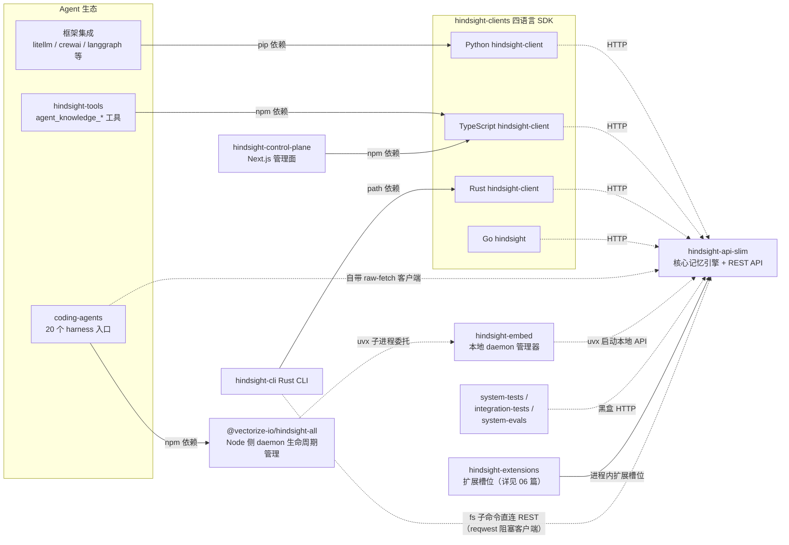
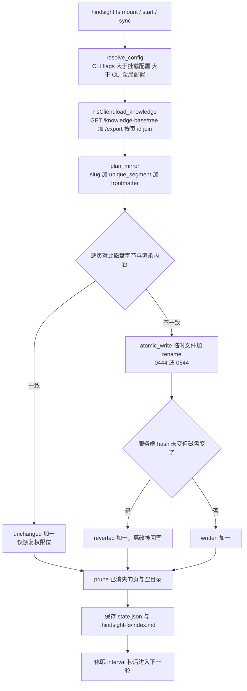
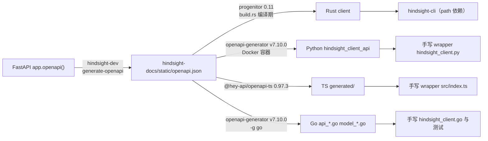
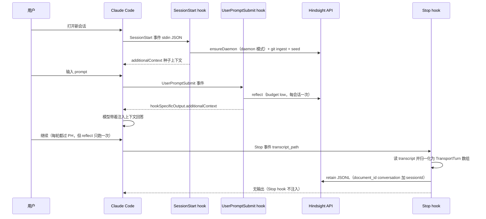

# 07 · 外围生态：CLI / SDK / 集成 / 控制面 / 测试体系

> 代码基线：`f7dd3f4fd`（v0.10.2，2026-10-03）；本篇已随 0.10.2 全量更新（原基线 `12f2d54f6`）。

> 本篇是《Hindsight 源码庖丁解牛》的第 07 篇，覆盖核心引擎（01-06 篇）之外的一切：Rust CLI、四语言 SDK、coding-agent 与框架集成、Next.js 控制面、内嵌 daemon、agent 工具 SDK，以及三层测试体系。外围包的共同点是：**它们都不含记忆引擎逻辑，全部通过核心 REST API（`/v1/default/banks/...`）消费 Hindsight**，因此每个包的价值都在于"如何把记忆接进自己的世界"。

**30 秒引擎词汇表**（全篇反复出现的核心词）：bank＝一个隔离的记忆库（一个 agent 一个）；retain＝写入记忆，recall＝检索，reflect＝基于整库记忆的综合问答；observation＝从内容中抽取的单条记忆；mental model（知识页）＝由事实自动聚合刷新出的合成文档；consolidation＝后台的整合刷新。

---

## 1. 生态全景

先看全景，顺带当图例用：实线＝编译期包依赖，虚线＝运行时调用（HTTP 或子进程）。



图中 coding-agents 节点的 "20 个 harness"，指它承载的宿主编码 agent（Claude Code、Cursor、Codex 等，§4.1 详解）。图上有三条不同性质的连线：**npm/path 包依赖**（控制面与 hindsight-tools 绑定 TS SDK wrapper；coding-agents 的 npm 依赖指向 hindsight-all——一个负责拉起本地 daemon 的 Node 管理器，其记忆 HTTP 客户端是自带的，不经任何 SDK）、**HTTP 运行时调用**（SDK 与核心之间永远只走 REST）、以及 **hindsight-extensions**——它是唯一进程内接进核心的方式，机制在 06 篇展开，本篇不重复。

一个值得先立住的全局观察：**核心（hindsight-api-slim）对外只暴露一种协议**——`/v1/default/banks/{bank_id}/...` 上的 REST + SSE + MCP。CLI、控制面、coding-agents 集成、评测套件没有一家走 SQL 或进程内 import（extensions 除外），这让"换一家部署形态"（云、自托管、本地 daemon）对上层完全透明，也是全篇反复出现的模式。

---

## 2. hindsight-cli：Rust CLI

### 2.1 职责与技术底座

`hindsight-cli` 编译出名为 `hindsight` 的单二进制（`hindsight-cli/Cargo.toml:2-3`，版本 0.10.2；`[[bin]]` 块在 :9-11），定位是"漂亮的 CLI for Hindsight"。它不是脚手架玩具，而是一个覆盖核心 API 全部资源的运维界面，外加一个 k9s 风格的 TUI 探索器和本篇的重点：`hindsight fs mount`。

技术底座三层分工明确（`hindsight-cli/Cargo.toml:13-52`）：

| 依赖 | 用途 |
|---|---|
| `hindsight-client = { path = "../hindsight-clients/rust" }` | API 调用走 **progenitor 生成的 Rust SDK**（progenitor：从 OpenAPI spec 生成 Rust 客户端代码的工具，§3.2 详述；path 依赖，不单独发布 crates.io） |
| `clap 4.5`（derive + env） | 命令面；全局 `--output pretty/json/yaml`、`--verbose`、`-p/--profile` |
| `ratatui` + `crossterm` | `hindsight explore` 交互式 TUI |
| `reqwest` | **blocking client 仅 fs 子命令用**（同步镜像引擎刻意避开异步 SDK）；async client 用于 timeout 配置与 multipart 文件上传（`Cargo.toml:23-25`） |
| `sha2` + `libc` | fs 的内容哈希与 POSIX daemon 控制 |

配置解析优先级在 `main.rs:144-146` 的 after_help 里写死：环境变量 `HINDSIGHT_API_URL`/`HINDSIGHT_API_KEY` > 命名 profile（`~/.hindsight/cli-profiles/<name>.toml`，`hindsight profile create/list/show/delete`）> `~/.hindsight/config` > 默认 `http://localhost:8888`。

### 2.2 命令面盘点

`src/main.rs:74-159` 的 `Commands` 枚举即全部命令面，与核心 API 资源一一对应：

| 命令 | 子命令 | 备注 |
|---|---|---|
| `bank` | list/create/update/profile/stats/mission/graph/delete/alias | create 带 `--skepticism/--literalism/--empathy`（1-5），直接映射 Bank Config 的 disposition 三特征；`alias`（`main.rs:459-494`）管理 bank 别名——给同一 bank 挂额外 id 并可指定对外展示的主别名，对应 0.10.2 新增的 aliases API |
| `memory` | list/get/recall/reflect/retain/clear | recall 支持 `--fact-type`、`--budget low/mid/high`、`--tags`、`--query-timestamp`、`--window-start/end`、`--prefer-observations`（`main.rs:555-591`），几乎完整暴露 recall 语义 |
| `document` / `chunk` / `entity` / `tag` | list/get/delete、get、list/get/regenerate、list | 数据面逐层下钻 |
| `operation` | list/get/cancel/retry/delete | 异步操作队列管理 |
| `mental-model` / `knowledge-base` | （各 500-1000 行实现） | `knowledge-base` 的模块头写明与 `fs` 的关系："A page is a mental model with document-shaped defaults plus a place in the tree... `hindsight fs` mirrors the same knowledge base read-only onto disk; these commands are the read/write side"（`commands/knowledge_base.rs:1-7`） |
| `directive` / `webhook` / `audit` | — | 行为规则、回调、审计日志 |
| `fs` | mount/start/stop/restart/sync/status/list/logs/unmount | §2.4 深讲 |
| `configure` / `profile` | — | 配置 API URL/key 与命名连接档案（`main.rs:147, 158`），配置优先级见 §2.1 末段；二者不依赖 API 客户端 |
| `health` / `metrics` / `version` | — | `metrics` 直接拉 Prometheus 文本 |
| `explore`（别名 `tui`） | — | ratatui 全屏 TUI，1766 行，是单文件最大的命令 |
| `ui` | — | 不连 API，直接 `Command::new("npx").arg("@vectorize-io/hindsight-control-plane")` 拉起控制面（`main.rs:2441-2443`）——CLI 自己不做 UI，复用 npm 包 |

`main.rs:1421-1440` 的 `main()` 还处理了一个发布级细节：release profile 用 `panic = "abort"`，而 Rust 启动时忽略 SIGPIPE，管道下游提前关闭（`hindsight ... | head`）会变成 SIGABRT 静默崩溃，所以在 Unix 上恢复 `SIGPIPE` 默认处置。

### 2.3 API 客户端：生成代码之上的"humanized"错误层

`src/api.rs` 是 1854 行的薄封装：类型直接 `pub use hindsight_client::types;` 转出（`api.rs:7`），调用是同步桥接异步。它解决的核心痛点是 progenitor 生成的错误把响应体吞掉：

```rust
// hindsight-cli/src/api.rs:33-63
async fn humanize_client_error<E>(err: ClientError<E>) -> anyhow::Error
where
    E: serde::Serialize + std::fmt::Debug + Send + Sync + 'static,
{
    match err {
        ClientError::ErrorResponse(rv) => {
            let status = rv.status();
            let body = rv.into_inner();
            let body_str = serde_json::to_string(&body).unwrap_or_else(|_| format!("{:?}", body));
            anyhow::anyhow!("API request failed ({}): {}", status, body_str)
        }
        ClientError::UnexpectedResponse(response) => {
            let status = response.status();
            let body = response.text().await.unwrap_or_default();
            if body.is_empty() {
                anyhow::anyhow!("API request failed ({})", status)
            } else {
                anyhow::anyhow!("API request failed ({}): {}", status, body)
            }
        }
        ClientError::InvalidResponsePayload(bytes, src) => {
            let body = String::from_utf8_lossy(&bytes);
            anyhow::anyhow!("Invalid response payload ({}): {}", src, body)
        }
        other => anyhow::anyhow!("{}", other),
    }
}
```

- 原始错误渲染为 `Unexpected Response: Response { ... }`，不带服务端返回的校验细节（注释引用了 issue #1007 与 #4049，见 `api.rs:34-36, 68`）。
- `Humanized` 扩展 trait（`api.rs:70-86`）让每个生成客户端调用都能写成 `call(..).humanized().await?`，把 HTTP 状态码 + 响应体带进 anyhow 错误。
- 极少数 OpenAPI 未覆盖的端点（如 `AgentStats`）在 `api.rs:89-118` 手写 struct，注释自嘲 `// Types not defined in OpenAPI spec (TODO: add to openapi.json)`。

### 2.4 `hindsight fs mount`：把 knowledge base 挂载成文件树（重点）

**动机**：knowledge base 是核心引擎里"auto-refreshing 的合成文档树"（mental model 页 + 文件夹）。`fs mount` 把这棵树镜像成普通 markdown 文件夹，让 `ls / cat / grep / rg / fzf` 等一切 shell 工具、以及任何会读文件的 agent，无需知道 Hindsight API 就能消费记忆。`commands/fs/mod.rs:1-6` 自述是从独立的 TS 工具 `hindsight-fs` 移植进 Rust CLI。

**模块划分**（共 1889 行）：`mod.rs`（命令分发 + 刷新循环）、`client.rs`（极简 REST 读客户端）、`format.rs`（树→镜像计划）、`sync.rs`（同步引擎）、`state.rs`（state.json）、`daemon.rs`（后台进程）、`config.rs`/`paths.rs`/`health.rs`（配置、控制目录、健康检查）。

#### (1) 数据获取：一次同步 = 两次 HTTP

`client.rs:1-8` 的注释把设计说透了——不逐页拉取，只调两个端点再按页 id join：

- `GET /v1/default/banks/{bank_id}/knowledge-base/tree` → 文件夹/页层级（无正文）；
- `GET /v1/default/banks/{bank_id}/knowledge-base/export` → 一个 bundle，含每页 `<page-id>.md`、`index.md`、`<page-id>.log.md`（历史）。

```rust
// hindsight-cli/src/commands/fs/client.rs:136-153
// The bundle holds `<page-id>.md` (the page doc), `index.md`, and
// `<page-id>.log.md` (history). We only want the page docs.
let mut content = HashMap::new();
for file in bundle.files {
    if file.path == "index.md" || file.path.ends_with(".log.md") {
        continue;
    }
    if let Some(id) = file.path.strip_suffix(".md") {
        content.insert(id.to_string(), file.content);
    }
}

Ok(KnowledgeSnapshot {
    roots: tree.roots,
    content,
})
```

于是"任意大小的 bank 都只要两次 HTTP"。这个客户端不走生成的 SDK，而是一个 169 行的阻塞 `reqwest` 封装——注释明说是为了"让同步引擎保持纯同步代码"（`client.rs:1-3`）。

#### (2) 镜像规划：文件夹→目录，页→`.md`

`format.rs:206-243` 的 `plan_mirror` 递归 `walk_plan`，把树压平成"要建的目录列表（父先子后）+ 要写的文件列表"。三个工程细节：

- **slug 化**（`format.rs:92-126`）：页名/文件夹名转小写、非 `[a-z0-9._-]` 连续字符折叠成单个 `-`、点号去重；全不安全字符则回退 `untitled`。单元测试直接锁行为：`slug("Net-30 / Terms!") == "net-30-terms"`（`format.rs:326-331`）。
- **撞名消解**（`format.rs:129-153`）：兄弟节点同名时用节点 id 的末 6 位字母数字做后缀，保证路径唯一。
- **正文回退**（`format.rs:172-197`）：页还没被 LLM 合成出来时，写一个带 YAML frontmatter（`id/type: knowledge-page/title/tags/timestamp`）+ 占位文案 `_This page has not been generated yet._` 的文件——mount 一个空 bank 也能得到结构可读的骨架。

frontmatter 序列化器是手写的极简版（`format.rs:64-87`），`is_plain_safe`（`format.rs:26-52`）决定标量是否需要引号：含 `:#[]{}` 等字符、疑似布尔/数字/日期的一律用 JSON 字符串语法（合法 YAML 子集）转义。

#### (3) 同步引擎：单向镜像的"以磁盘为准"哲学

`sync.rs:5-12` 的模块注释是理解整个设计的钥匙——镜像是**严格单向（API → 磁盘）**的，靠两个机制保证：

1. 镜像文件写成只读（Unix `0444`，除非 `--writable` 则 `0644`，`sync.rs:26-29`），普通编辑直接 EACCES；
2. **每一轮都拿磁盘上的字节和最新渲染内容做全量对比**，任何漂移——被篡改、被强 chmod 改写、写了一半——下一轮都会被覆写回服务器版本。

```rust
// hindsight-cli/src/commands/fs/sync.rs:120-143
for page in &plan.files {
    let hash = hash_content(&page.content);
    let prev = state.files.get(&page.rel_path);
    let abs_path = config.dir.join(&page.rel_path);
    if let Some(parent) = abs_path.parent() {
        fs::create_dir_all(parent)?;
    }

    // Source of truth is the bytes on disk — so a local edit is detected
    // and overwritten even when the page is identical to last time.
    let on_disk = read_file_or_none(&abs_path);
    match &on_disk {
        Some(disk) if disk == &page.content => {
            set_mode(&abs_path, mode);
            unchanged += 1;
        }
        _ => {
            atomic_write(&abs_path, &page.content, mode)?;
            written += 1;
            if on_disk.is_some() && prev.map(|p| p.hash == hash).unwrap_or(false) {
                reverted += 1;
            }
        }
    }
    // ... 记入 next_files
}
```

逐点看：

- **判断基准是磁盘字节，不是 state 里的 hash**。重写分两种情形：服务端内容确实变了（普通 written），或服务端没变、只是本地文件被动过（计入 reverted，即篡改回写）。
- **`atomic_write`**（`sync.rs:72-78`）：先写 `<file>.<pid>.tmp` 再 `rename`，读方（编辑器/agent）永远不会看到半页文件；写完立即设权限位。
- **失败不破坏现场**：`run_sync` 在 fetch 失败时只更新 `state.last_sync_ok=false` 就返回错误（`sync.rs:96-105`），注释强调"修剪只发生在成功 fetch 之后，瞬时网络错误绝不清空镜像"（`sync.rs:86-87`）。
- **删除同步**：state 里记录的、本轮不再出现的文件被删（先解除只读位再 unlink，`sync.rs:153-159, 203-207`）；消失的空目录按路径从深到浅 `remove_dir`（只删得动空的，`sync.rs:162-173`）。
- 产出物还包括控制目录里的 `.hindsight-fs/index.md`——带 frontmatter（bank/api_url/folders/pages）+ 树状总览的导览文件（`sync.rs:187-191`，`format.rs:246-292`）。

**state.json**（`state.rs:24-58`）：`.hindsight-fs/state.json` 记录 `bankId/apiUrl/lastSyncAt/lastSyncOk/lastError`、每页 `rel_path → {file, sha256}`、已建目录列表。它的目的注释写得很直白：让未变页面不被重写，**保住 mtime 稳定**——这样编辑器的 file watcher、`ls -la`、agent 的增量读取都不会被每 30 秒的轮询骚扰。

一轮同步的完整路径：



#### (4) 后台 daemon 与健康检查

`daemon.rs:1-6` 明确 **POSIX-only**：`fs start` 用 `setsid` 脱离控制终端，spawn 自身执行隐藏子命令 `fs run`（`FsCommands::Run` 标了 `hide = true`），stdout/stderr 追加进 `<dir>/.hindsight-fs/daemon.log`，pid 与元数据写 `daemon.pid`。停止时先 SIGTERM、轮询 5 秒、再 SIGKILL（`daemon.rs:158-174`）；Windows 上 `start_daemon` 直接返回错误而非假装可用（`daemon.rs:125-130`）。

`fs status` 汇总 daemon 活性 + 最近同步年龄，同步超过 `max(interval×3, 15s)` 视为 stale，**不健康时进程以非零码退出**（`mod.rs:390-392`）——这是给 cron/监控用的设计。

**示例**：典型使用流程与输出（依据 `mod.rs`/`sync.rs`/`format.rs` 的真实文案格式整理）：

```text
$ hindsight fs mount -b my-agent ~/mem
Mounted bank "my-agent" at ~/mem in background (pid 41230).
Logs: ~/mem/.hindsight-fs/daemon.log — stop with: hindsight fs stop ~/mem

$ tree ~/mem -a -I '.hindsight-fs'
~/mem
├── engineering/            ← 文件夹节点 "Engineering"（slug 化）
│   └── api-retry-policy.md ← 页节点，正文 = 服务端合成的 markdown
└── product/
    └── billing-rules.md

$ cat ~/mem/product/new-page.md        ← 尚未合成的页
---
id: kp_8f3d2c
type: knowledge-page
title: New Page
tags: [billing]
timestamp: null
---

_This page has not been generated yet._

$ hindsight fs status ~/mem
Mount:    ~/mem
Bank:     my-agent
API:      http://localhost:8888
Mode:     read-only (edits blocked)
Daemon:   running (pid 41230)
Interval: 30s (started 2026-10-02T09:12:44.123Z)
Last sync: 2026-10-02T09:14:20.512Z (12s ago)
Mirrored: 3 file(s)
Health:   ok
```

（若此时手改 `billing-rules.md` 再等一轮，daemon 日志会记 `synced 3 pages / 2 folders — 1 updated, 2 unchanged, 0 removed, 1 reverted`——`reverted` 即篡改回写，对应 `commands/fs/mod.rs:204-212` 的日志行。）

---

## 3. hindsight-clients：四语言 SDK

### 3.1 结论先行：生成 + 手写混合，且生成物全部入库

四语言客户端**全部由同一份 OpenAPI spec 生成**，但每家都在生成层之上保留一个**手工维护的 wrapper 层**（高层类、README、测试）。反直觉的一点：生成代码**被 git 跟踪**，`hindsight-clients/.gitignore:15` 注释写明 "Generated code is tracked in git to see API changes"——API 变更必须在 code review 里可见。

### 3.2 生成链路

下图是整条链：中间那份 `openapi.json` 是唯一的上游，四路客户端都从它长出来。



链路两步（`scripts/generate-openapi.sh` 仅 20 行、`scripts/generate-clients.sh` 625 行）：

1. **spec 导出**：`generate-openapi.sh` 实际执行 `cd hindsight-dev && uv run generate-openapi`，入口 `hindsight-dev/hindsight_dev/generate_openapi.py:42-73`——用 `MemoryEngine(db_url="mock")` 起一个真实 FastAPI app 调 `app.openapi()`，落盘到 `hindsight-docs/static/openapi.json`（spec 存在 docs 包里，供文档站和所有客户端共用）。其中 `_restore_binary_format`（:16-39）把 OpenAPI 3.1 的 `contentMediaType: application/octet-stream` 改写回 `format: binary`，因为 openapi-generator v7.10.0 不认前者。
2. **四路生成**（`scripts/generate-clients.sh:9-14` 声明了版本 pin `OPENAPI_GENERATOR_VERSION="v7.10.0"`）：
   - **Rust 最特殊**：脚本不写任何生成代码，只 `cargo build` 触发 `hindsight-clients/rust/build.rs:183-254`——读 spec、做 OpenAPI 3.1→3.0.3 降级转换（string-anyOf 折叠、剔除 multipart 端点），再用 progenitor 0.11 生成进 `$OUT_DIR`，`src/lib.rs:23` 用 `include!` 引入。生成物不落盘。
   - **Python/Go**：Docker 跑 `openapitools/openapi-generator-cli:v7.10.0`（Python 加 `--platform linux/amd64` 保证 macOS arm64 与 CI amd64 输出一致，`generate-clients.sh:119-125`）。生成前备份手写文件（wrapper、README、测试、**go.mod/go.sum**——保留它们防止 `go mod tidy` 拉新依赖导致 CI 漂移），生成后恢复，再做小 patch（Python 给 `rest.py` 打延迟 aiohttp 会话初始化；Python 再 patch 内容联合模型 `content_any_of_inner.py` 的构造器以正确反序列化块状 dict 载荷；Go 把 union 类型的 `MarshalJSON` 指针接收器改值接收器）。
   - **TypeScript**：本地 `npx @hey-api/openapi-ts`（版本锁 0.97.3）输出 `generated/`，再 patch `client.gen.ts` 剔除 `RequestInit.client` 字段以兼容 Deno。

### 3.3 分层与入口（生成层 vs 手写层）

| 语言 | 生成层 | 手写层（"MAINTAINED and NOT auto-generated"） |
|---|---|---|
| Python（PyPI `hindsight-client`） | `hindsight_client_api/`（17 个 `api/*.py`、200 个 `models/*.py`、`rest.py`） | `hindsight_client/hindsight_client.py` **3203 行**：高层类 `Hindsight`（`:197`），方法 `retain/retain_batch/retain_files/recall/reflect/list_memories/create_bank/update_bank_config/export_bank/clone_bank/search_knowledge_base/get_knowledge_base_tree` 等，每个同步方法都有 async 对应（`aretain/arecall/areflect`） |
| TypeScript（npm `@vectorize-io/hindsight-client`） | `generated/`（`client.gen.ts`、`sdk.gen.ts`、`types.gen.ts`） | `src/index.ts` **2103 行**：类 `HindsightClient`（`:341`）+ 错误类 `HindsightError`（`:185`），方法 `retain/recall/reflect/listMemories/...` |
| Rust | 编译期进 `OUT_DIR`，不落盘 | `src/lib.rs` 167 行：User-Agent 辅助 + 内嵌集成测试 |
| Go（`go get` 直接取用） | `api_*.go` ×16、`model_*.go` ×199 | `hindsight_client.go`（`NewAPIClientWithToken/NewAPIClientWithTimeout` 等）+ 4 个手写测试 |

一个链条上的角色分工示例：同一份 spec 的 `retainMemories` 操作，Python 侧生成层在 `hindsight_client_api/api/memory_api.py`，TS 侧是 `generated/sdk.gen.ts` 的同名导出函数。控制面（§5）npm 依赖 TS 包，同时用生成层函数式 `sdk` 出口与手写类 `HindsightClient` 实例；**coding-agents 不消费该包**——它的 `package.json` 依赖里没有 `@vectorize-io/hindsight-client`（只有 `@vectorize-io/hindsight-all` 等），`src/` 下也无任何 SDK import，而是在 `src/core/hindsight.ts` 自带一个同名 `HindsightClient` 的 raw-fetch 客户端类（文件头自述 "Harness-agnostic Hindsight HTTP client (raw fetch, no SDK dep)"，:2-4），npm 依赖 `@vectorize-io/hindsight-all` 只为拉起本地 daemon（`src/daemon-start.ts:29`）。

### 3.4 新增 API 参数后 SDK 怎么同步？

开发者的操作只有一步：本地跑 `./scripts/generate-openapi.sh && ./scripts/generate-clients.sh` 并提交产物。真正的防线在 CI（`.github/workflows/test.yml`）的四个守门 job：

1. **`verify-generated-files`**（test.yml:5506-5592）：重跑全部生成脚本后 `git status --porcelain` 非空即失败——忘了再生就直接红。
2. **`check-openapi-compatibility`**（:5594-5657）：从 PR merge-base 取旧 spec 与新 spec 对比，拦截破坏性变更。
3. **`check-cli-coverage`**（:5659）：CLI 侧的对应检查（实现 `hindsight-dev/hindsight_dev/cli_coverage_check.py`，即 §9 所列脚本之一），与下面的 client coverage 合成两端防线。
4. **`check-client-coverage`**（test.yml:5699；实现 `hindsight-dev/hindsight_dev/client_coverage_check.py:1-34`）：专盯**手写 wrapper 的漂移**——扫描 `hindsight_client.py` 与 TS `src/index.ts` 的调用点，断言每个被覆盖操作的 request-body 参数（snake_case↔camelCase 自动换算）都出现在 wrapper 里，防止"生成层已更新、手写层漏字段"。

0.10.1 → 0.10.2 的一次真实再生成可以当这条链路的样例看：spec 新增 bank 别名端点（`/aliases`、`/aliases/{alias}`），并把 consolidation 策略从内联 dict 类型化为 `ConsolidationStrategySpec`/`ConsolidationScopePattern` 模型，四语言生成层随之各多出若干模型文件（Go 192→199 个 model），Python wrapper 补了 `search_knowledge_base`/`get_knowledge_base_tree` 两个高层方法与 tag 过滤选项——生成物入库 + CI 四守门保证这次变更在 review 里逐文件可见。

**示例**：Python 高层客户端的一次 retain（字段名与 `hindsight_client.py` 一致）：

```python
from hindsight_client import Hindsight

hs = Hindsight(base_url="http://localhost:8888", api_key="sk-...")
# 单条：retain(bank_id, content, ...) —— 签名见 hindsight_client.py:460-474
result = hs.retain(
    bank_id="my-agent",
    content="User prefers functional programming patterns",
    context="paired-programming session",
    document_id="conversation:abc123",
    tags=["source:chat", "harness:claude-code"],
    metadata={"harness": "claude-code", "session_id": "abc123"},
)
# 批量：retain_batch(bank_id, items, document_tags=...)（hindsight_client.py:522-532）——
# strategy 是 item dict 内的键（:536-540），顶层参数是 document_tags 而非 tags：
result = hs.retain_batch(
    bank_id="my-agent",
    items=[{"content": "...", "context": "...", "strategy": "conversation"}],
    document_id="conversation:abc123",
    document_tags=["source:chat"],
)
# 异步对应：await hs.arecall(...) / hs.areflect(...)
```

---

## 4. hindsight-integrations

### 4.1 coding-agents（重点深讲）

`hindsight-integrations/coding-agents`（npm 包 `@vectorize-io/hindsight-coding-agents`，0.10.2 窗口内连发 v0.7.0/v0.8.0）是全部集成里最重的一个：README 开篇即定位——"Long-term project memory for **coding agents**... One package, several agents: a shared reflect-and-inject core with a thin entry point per agent"（`README.md:1-4`），共列出 20 个编码 agent。它的前提假设：一个真实修复的大头能从代码推出来，但**最后一公里往往取决于一个不在代码里的项目决策**（舍入规则、重试白名单、平局策略），这些活在 git 历史和历史会话里。

#### (1) 三段生命周期：每个 hook 型 harness 的统一契约

先立住术语：**harness 指承载集成的宿主编码 agent**（Claude Code、Cursor、Codex 等），分两类——**hook 型**（宿主在生命周期事件时以子进程运行集成提供的 hook 脚本）与**常驻插件型**（集成以宿主原生插件形式常驻）。先看前者的统一契约。

`src/harness/hook-lifecycle.ts:1-6` 的文件头说明了这个文件的角色："The single lifecycle contract for every hook-based harness... Adding a harness means adding one complete declaration here; its lifecycle cannot silently drift between the runtime and installer."

契约是三段固定生命周期（`hook-lifecycle.ts:37`）：`sessionStart`（种子注入）→ `prompt`（召回注入）→ `stop`（transcript 写回）。每个 harness 用一个 `HookHarnessSpec` 声明：宿主事件名、入口 js、超时、hook 配置风格（`nested`/`flat`/`process`/`toml-array`，对应 Claude Code 的 matcher 组、Cursor 的扁平对象、ZCode 的无 shell argv 拆分、以及 Kimi Code 的严格四键 TOML 表——多写第五个键会以 warning 告警并丢弃整个文件里的每个 hook，`hook-lifecycle.ts:38-50`）、stdin 事件字段怎么 `parse`、上下文怎么 `emit` 回宿主，以及专属 transcript 读取器。

**13 个 hook 型 harness**（`HookHarnessName`，`hook-lifecycle.ts:23-36`）：

| harness | 三段事件（start/prompt/stop） | 值得注意的差异 |
|---|---|---|
| `claude-code` | SessionStart / UserPromptSubmit / Stop（30s/30s/60s） | 协议基准，其余 harness 逐字段向它看齐 |
| `codex` | 同上 | 读 Codex rollout JSONL（`type:"response_item"`），加密 reasoning 直接丢弃 |
| `dcode` | 同上 | 以 Dcode 原生 Agent Plugin 形态安装（plugin.json + hooks/hooks.json + MCP） |
| `antigravity-cli` | PreInvocation / PreInvocation / Stop | PreInvocation 是唯一能注入上下文的生命周期点，首轮兼任 SessionStart（`:305-311`） |
| `cursor-cli` | sessionStart / beforeSubmitPrompt / stop | emit `{continue:true, additional_context}` |
| `copilot-cli` | sessionStart / userPromptTransformed / agentStop | userPromptTransformed 是**替换**而非追加模型可见内容，所以要拼 `modifiedTransformedPrompt = transformedPrompt + "\n\n" + context`（`:191-196`） |
| `devin-cli` | SessionStart / UserPromptSubmit / Stop | 无 transcript 文件，读 sessions.db，`transcriptPath` 干脆传 sessionId（`:420-425`） |
| `grok-build` | SessionStart / UserPromptSubmit / Stop | wire 包裹是 camelCase；transcript 路径由 `cwd+sessionId` 拼出 |
| `qwen-code` | 同 claude 事件名 | **timeout 单位是毫秒**（Qwen 把值直塞 `setTimeout`，30 意味着 30ms 即死），且用 `submitted_prompt` 而非 `prompt`——工具调用结束后模型续答的那一轮里 prompt 字段也非空，会导致每轮误召回（`:59-66` 的类型注释与 `:468-498` 的 spec） |
| `factory-droid` | SessionStart / UserPromptSubmit / Stop + 额外 Notification | 用户取消时 Droid 发 `Notification(idle_prompt)` 而非 Stop，用 `accept` 门在事件级过滤（`:499-525`，门在 `:515-517`） |
| `zcode` | 同 claude 事件名 | **timeout 单位同为毫秒**（`hook-lifecycle.ts:539-581`，注释明说 "see the qwen-code note above for the same trap"）。宿主不留持久 transcript：Stop 携带 `responseText` + 一个**返回即删**的临时 transcript。是用插件**自记 turn journal** 做 retain 的第一个 harness（`:526-538`） |
| `traecode` | SessionStart / UserPromptSubmit / Stop | Trae CN 的 agent，hook 协议同 Claude Code，注册在 `~/.trae-cn/hooks.json`。同 zcode 一样无 transcript（会话在加密本地库或云端），是第二个用 turn journal 做 retain 的 harness——Stop 的 `last_assistant_message` 扮演 zcode `responseText` 的角色（`:582-635`）。SessionStart 还要给每个 repo 的工作区文件补 MCP 注册：Trae 从 Electron 进程 cwd（home）启动用户级 MCP server，optInOnly 配置在那里会自失效（`traecode-mcp.ts`） |
| `kimi-code` | SessionStart / UserPromptSubmit / Stop | 第四种 hook 配置风格 `toml-array` 的由来：Kimi 的 `~/.kimi-code/config.toml` 只接受严格四键的 `[[hooks]]` 表，多一键就丢弃**整个文件**的 hook，所以安装器自己写块（`:636-692`）。注入通道是顶层 `message` 而非 additionalContext；SessionStart 纯副作用（emit 空对象）。Stop 不带 transcript 路径，读取器拿 sessionId 拼出会话目录、读目录下每个 agent 的 wire.jsonl |

`timeoutUnit` 字段（`hook-lifecycle.ts:59-66`）本身是个防御机制：把"这家的 timeout 不是秒"变成可被生命周期测试归一化校验的声明，而不是一条会腐烂的注释。

**7 个常驻插件型 harness**（`src/harness/registry.ts:98-106` 的 `PLUGIN_ENTRYPOINTS`）：`opencode`（`src/index.ts`）、`opencode2`、`kilo`、`cline-cli`、`pi`、`prime-agent`、`dsh`。它们不跑 hook 二进制，而是以宿主原生插件 API 加载 `dist/<name>.js`，由插件入口直接调用共享核心（播种/召回/写回），不经 stdin/stdout。`registry.ts:41-76` 的 `HARNESS_NAMES` 共 20 项 = 13 hook 型 + 7 插件型，是**全仓库 harness id 的权威清单**。

#### (2) 数据流：一次 Claude Code 会话如何变成记忆

先看时序（以默认 autoInject=reflect 为例），再拆代码：



**种子半边**（`src/core/session-start.ts:1-28`）：SessionStart 做两件事——冷 bank 的 git 历史后台播种 + 向宿主注入一条可见提示与知识页 roster。冷判定是**三态**而非布尔：`listDocumentIds` 抛错（服务器不可达）→ 不播种也不写状态（下个会话重试）、非空（已热）→ 只记 `seededAt`、空（真冷）→ 后台播种并注入提示。注释里保留了设计演化的证据：早期让 agent 自己问用户"要不要播种"再执行命令的方案实测失效（模型问了但不执行），改成 hook 直接播种。

**召回半边**（`src/core/hook.ts`）：`runHook`（`hook.ts:389`）从 stdin 读事件、`spec.parse` 取字段、空 prompt 直接静默退出；`HINDSIGHT_DISABLE_HOOKS` 环境变量是防递归开关（代码库自己的 headless 会话靠它不让 hook 记自己）。注入源由 `cfg.autoInject` 决定（`hook.ts:211-307`）：`reflect`（每会话首轮做一次 reflect 综合，`budget:"low"` + `reflectTimeoutMs`）、`pages`（知识页搜索）、`recall`（观测召回）或 `none`（纯工具模式）。关键取舍写在注释里：**hook 注入的上下文落在用户消息里、会随 transcript 持久累积，所以 reflect 块只在运行的那一轮注入一次**，绝不按节奏重播（`hook.ts:338-345`）；知识页则不自动注入，只把"页清单 + 工具名"作为 roster 刷新，让 agent 用 `hindsight_search_knowledge_pages` 工具主动拉取（`hook.ts:347-353`）。

**工具面的两条可靠性规则**（0.10.2 期间补齐，全部在共享核心层，所有 harness 同时受益）：

- **crediting（署名）是义务，不是判断题**（#4677）：agent 用知识页搜索写答案时曾出现"搜了十个相关页、一字不提来源、被追问才承认出处"的失败模式——等 guide 在长上下文里滚远时，规则已经无法执行。修法是让提醒**跟着搜索结果一起返回**：`hindsight_search_knowledge_pages` 的返回负载带一个 `crediting` 字段（`knowledge-tools.ts:227-242`），措辞是常量 `CREDIT_REMINDER`（`:59-72`）——"只要结果对你的回复有任何贡献（引用、转述、甚至只是印证了你要说的话），就用规定的 markdown blockquote 开头署名；自己改写过的句子不因此变成你的"。工具描述里复用同一常量（宿主列出工具时看到的就是它），#4791 又补了一句定位："这些是过往记录——'已修复/可用'的断言先对代码验证再采信"，并加了 `toolGuideExtra` 配置项让团队附加自己的工具指南。
- **瞬时故障不再把知识页判死刑**（#4712）：修的是三件事。其一，bank 尚不存在时的 404 曾被当成"服务器没有 knowledge-base API"而把能力**终身锁死**（bank 由第一次 retain 铸出，所以新 bank 的首个会话必然先读页后建库），现在 `isEndpointMissing` 只认 FastAPI 路由未命中的裸 `{"detail":"Not Found"}`（`hindsight.ts:184-211`）——措辞对不上的 bank 错误让能力保持"未知"、下次调用重试，宁可错在安全的方向；`searchKnowledgePages` 这条漏网路径同样处理（`:871-878`）。其二，autoInject 三个注入源曾把"跑过但没结果"和"失败"折叠成同一个值缓存——一次首轮超时废掉整个会话的记忆；现在 `resolveInjection`（`hook.ts:97-107`）把失败留作可重试，预算 `HOOK_INJECT_ATTEMPTS = 2` 个轮次。其三，常驻插件的开机前言改为**每会话从当次 roster 重建**，不再缓存进程级副本（消灭"前言说 0 个页、同轮却递来 3 个页 id"的自相矛盾）。

**写回半边**（`src/core/retain-hook.ts` + `chat.ts`）：Stop 事件到达后，`buildRetain`（`retain-hook.ts:100-176`）读 transcript 归一化成 `TransportTurn[]`（`{role, content, timestamp?}`），无可用轮次（纯工具调用）就 no-op，失败永远 fail-open 不抛。归一化后调 `retainLiveSession`（`chat.ts:230`），核心语义是**增量 upsert 一个会话文档**：

```typescript
// hindsight-integrations/coding-agents/src/core/chat.ts:286-347
  const refId = `conversation:${sessionId}`;
  const cursor = cursors?.read(sessionId);
  // ...
  const appendSupported =
    Boolean(cursors) && (cursor?.appendSupported === true || (await supportsAppend(client)));
  const plan = planRetain(turns, cursor, { appendSupported, bank: client.bank });
  // ...
  /** Identity of ONE payload: a resubmission of the same bytes is collapsed server-side into the
   *  original operation instead of extracting (or appending) twice. */
  const opId = (mode: string, content: string) =>
    uuidV5(`${client.bank}\n${refId}\n${mode}\n${content}`);
  const submit = (content: string, operationId: string, append: boolean) =>
    client.retain(
      content,
      // Configured context wins. Extraction reads this to decide whose claim a sentence is, so the
      // default names both speakers: the previous "coding agent session" said nothing about
      // authorship and let an assistant's proposal be recorded as the user's decision.
      stamp?.context ?? DEFAULT_RETAIN_CONTEXT,
      refId,
      // Configured tags first, built-ins last and deduped: `source:chat` and `harness:<id>` are what
      // the documents list filters and draws its agent logo from, so a template cannot displace them.
      [
        ...new Set([
          ...(stamp?.tags ?? []),
          "source:chat",
          ...(harness ? [`harness:${harness}`] : []),
        ]),
      ],
      "conversation",
      {
        timestamp: startTs,
        updateMode: append ? "append" : undefined,
        operationId,
        metadata: {
          ...stamp?.metadata, // configured first: the built-ins below win on any key collision
          source: "chat",
          session_id: sessionId,
          ref_id: refId,
          ...(harness ? { harness } : {}),
        },
      }
    );
```

逐点讲解：

- **document_id 稳定**：整个会话始终 upsert 在 `conversation:<sessionId>` 下；已有 cursor 且服务端支持幂等 retain 时走 `updateMode:"append"` 只发新增轮次，否则整体 replace（`chat.ts:365-387`）。
- **operation_id 幂等**：`uuidV5(bank\nrefId\nmode\ncontent)`——同样的字节重投会被服务端折叠进原操作，而不是重复抽取或重复 append。这是 append 语义敢在网络重试下存在的前提。
- **cursor 状态机**（`chat.ts:349-407` + `retain-cursor.ts`）：发送前先写 cursor（带着待发字节，标 dirty/pending），宿主中途杀进程也能留下可重放缓冲而非永远重发全量；确认后逐项清空。另有一条"是否仍归我们重试"的 staleness 检查（`chat.ts:358-363` 的 `stillOurs`）：如果游标已被更靠后的写入认领，本次重试直接放弃——新写入包含旧内容。
- **归因由此写入**：tag `harness:<id>` 与 metadata `harness` 字段都在这一次 retain 调用里落库；用户自定义 `retainTags/retainMetadata` 模板排在前面但内建键碰撞时内建胜（`chat.ts:340` 注释），且 `source:`/`harness:` 是保留命名空间，用户模板里配了会被丢弃并告警（`retain-stamp.ts:30, 101-110`）。

**内容形态**：turns 被 `renderSessionJsonl`（`chat.ts:36-43`）渲染成 JSONL——**一行一 turn**，行首是一个 `REF-ID:` system turn；工具活动被各 transcript 读取器压缩成 `role:"action"` 的紧凑 turn（工具名 + 主目标，不保留参数），函数输出整体丢弃（`transcript-codex.ts:14-17`）。选 JSONL 的理由写在 `chat.ts:29-35`：追加不重写文档，且服务端结构化分块把每行当原子单位，turn 不会被拦腰截断。

**示例**：一次 Claude Code 会话结束后 retain 的文档数据形态（字段名与 `chat.ts`/`retain-hook.ts` 一致，内容为虚构示例）：

```text
document_id:  conversation:2f0a9c1e-77aa-4d02-a5b6-0d9c11f0e123
context:      "conversation between the user and you (the coding agent): user turns are the user's
              words and decisions, assistant turns are yours. …"（DEFAULT_RETAIN_CONTEXT，#4584）
tags:         ["project:hindsight", "source:chat", "harness:claude-code"]
metadata:     { "source": "chat", "session_id": "2f0a9c1e-...", 
                "ref_id": "conversation:2f0a9c1e-...", "harness": "claude-code" }
strategy:     conversation

content（JSONL，一行一 turn）:
{"role":"system","content":"REF-ID: conversation:2f0a9c1e-...","timestamp":"2026-10-02T09:00:00.000Z"}
{"role":"user","content":"为什么 recall 的重试要检查 isStillNewest？","timestamp":"2026-10-02T09:00:05.312Z"}
{"role":"action","content":"Read hindsight-integrations/coding-agents/src/core/chat.ts","timestamp":"2026-10-02T09:00:07.881Z"}
{"role":"assistant","content":"因为另一个写入可能已经认领了 cursor……","timestamp":"2026-10-02T09:00:21.004Z"}
```

之后同一会话的下一轮 Stop 只 append 新增行（`updateMode:"append"`），服务端拼接后重新分块抽取。

#### (3) daemon 模式：记忆可以不部署

`src/core/daemon.ts:1-41` 是一个把"本地 daemon 作为第三种部署形态"讲透的文件。三档连接模式按序解析：外部 API（Cloud/自托管）> 端口上已健康的现成服务器（直接采纳，永不重启）> 启动 daemon（实际由 `@vectorize-io/hindsight-all` 负责 uvx——uv 工具链的临时运行器，从 PyPI 拉包执行——拉起、profile 创建、就绪轮询）。

**时序是唯一约束**：冷启动要付 uvx 下载 + 模型加载（数十秒），而 prompt hook 必须按时返回——所以只有两个点保证 daemon 存活：SessionStart（预算 `DAEMON_WAIT_SESSION_START_MS = 12_000`）和 Stop（`DAEMON_WAIT_RETAIN_MS = 40_000`，预算最长且无人等结果），prompt 路径完全不碰 daemon。一个宕掉的 daemon 不被任何下游特殊对待：不可达的本地端口与不可达的云端产生同一种连接错误和同一条 `retain_failed` 诊断。

#### (4) README 作为单一源：两份生成物 + 三道防漂移测试

CLAUDE.md 的规则在代码里有完整的执行机制：

- `npm run skill:build`（`package.json:85` → `scripts/build-skill.mjs`）把 README 中 `<!-- skill:begin title="..." -->` / `<!-- skill:end -->` 区域（README 中共 4 处，覆盖安装、daemon 配置等 agent 需要的部分）拼上 `skill-src/preamble.md`（agent 专属的工具/署名/纠错说明），生成 `skill/SKILL.md`。
- `node hindsight-docs/scripts/sync-coding-agents-doc.mjs` 把同一 README 同步进文档站页面（hermes 集成后来照搬了这一模式，见 §4.2）。
- 防漂移测试三道：`src/docs-freshness.test.ts`（137 行）在 skill 过期或有未文档化 `RawConfig` 字段时失败；`src/docs-harness-roster.test.ts:36-43` 断言文档站 `hindsight-docs/src/lib/coding-agent-harnesses.ts` 的 harness 名单与本包 `HARNESS_NAMES` **排序后完全一致**且每个 logo 文件真实存在（`:44-52`），README 开篇段落和每家独立安装小节也被绑定校验（`:55-73`）；控制面侧另有 registry 一致性测试（见 §5.4）。

### 4.2 其余框架集成（每家 2-3 句）

`hindsight-integrations/` 下还有 55 个目录（ag2、agent-framework、agentcore、agno、ai-sdk、autogen、continue、dify、eliza、eve、flowise、google-adk、grok-bot、hermes、llamaindex、meta-muse、openclaw、obsidian、paperclip、smolagents、strands、vapi、zapier、zed 等），模式高度一致：要么提供 retain/recall/reflect 三件套的**工具函数**（agent 决定何时用记忆），要么做成**回调/存储后端**（框架自动调用）。代表：

- **hermes**（`hermes/`，Python 插件包，v1.2.1）：Nous Research Hermes Agent 的官方 memory-provider 插件——曾经内嵌在 Hermes 仓里，被移出核心树后由本仓维护、Hermes 插件目录（catalog）按 commit pin 指到本仓，`hermes plugins install hindsight` 即装。三种模式：cloud（API key）、local_external、local_embedded（`hermes memory setup` 向导装 hindsight-all 拉起内嵌 daemon）；实现 Hermes 的 `MemoryProvider` 接口（`__init__.py:1-9` 自述），配置按 `$HERMES_HOME/hindsight/config.json` → `~/.hindsight/config.json` → 环境变量逐级解析。它的文档页也是生成的：`hindsight-docs/scripts/sync-hermes-doc.mjs` 从 README 重写 `docs-integrations/hermes.md`（两份手写页曾漂移到"文档写了 15 个插件根本不读的键"，README 从此是唯一源）；`scripts/test-hermes-compat.sh` 是兼容门——Hermes 对依赖精确 pin，本仓任何放宽版本的声明都可能让两者无法共存（#3251）。
- **eve**（`eve/`，npm，v0.3.0）：Vercel Eve agent 的 memory provider——接进 Eve 的一等公民"memory slots"机制，让模型**不用决定是否调用工具**：`turn.started` 时按锁定的 scope（user/tenant/channel）召回注入上下文，`turn.completed` 时保留当轮对话（幂等 id），每个 scope 一个独立 bank（`src/memory-provider.ts`/`provider-core.ts`），另暴露 `<slot>__reflect` 工具供模型主动提问。
- **grok-bot**（`grok-bot/`，#5069）：xAI Grok Bot（及 Cursor）的"无代码"插件——目录里没有运行时源码，只有 `mcp.json`（直连 Hindsight Cloud 的远程 MCP，OAuth 授权，无 API key）加六个 skill 目录（`memory-setup/retain/reflect/context`、`routine-memory`、`bot-handoff`），靠 skill 文本教会 Bot 何时读写记忆；tests 里断言 manifest 与 skill 的形状。
- **meta-muse**（`meta-muse/`，Python 包 `hindsight_meta_muse`，#4684）：Meta 的个人 AI agent Muse 的接入层。Muse 跑在 Meta 云端、无插件宿主，所以走"自定义 connector + 远程 MCP"形态：Muse 保留自己的 `muse` bank，又经 recall/reflect/`get_mental_model` 读用户的其他 bank；包内主要是 `preflight.py`（连接预检）与 connect 引导提示。
- **paperclip**（`paperclip/`，npm）：Paperclip agent 平台的插件——每次 run 前按 issue 标题+描述召回并缓存，每条评论后保留全文，并给 agent 发 `hindsight_recall/retain` 两个 mid-run 工具（`src/worker.ts`）。
- **litellm**（`litellm/`，Python `hindsight_litellm`）：LiteLLM `CustomLogger` 回调 + monkeypatch 包装——请求前注入 recall/reflect 结果、响应后异步 retain 对话；公开 `enable()/disable()/completion()/acompletion()`（`hindsight_litellm/__init__.py:669,762`），也可作 LiteLLM proxy callback。经 LiteLLM 即给 100+ 提供商加记忆。
- **crewai**（`crewai/`）：实现 CrewAI ExternalMemory 的 `HindsightStorage`（`hindsight_crewai/storage.py`）+ 显式 reflect 工具 `HindsightReflectTool(BaseTool)`（`tools.py:30`）——少数"存储后端替换型"集成。
- **langgraph**（`langgraph/`）：两种粒度——仅依赖 langchain-core 的工具 `create_hindsight_tools`（`tools.py`），与图节点 `create_recall_node/create_retain_node`（`nodes.py`，langgraph 是可选依赖、惰性导入）。
- **pydantic-ai**（`pydantic-ai/`）：async-native，`create_hindsight_tools`（`tools.py:53`）返回 pydantic_ai 原生 `Tool`（`hindsight_retain/recall/reflect`），另可自动注入 `memory_instructions`。
- **ag2**（`ag2/`）：`create_hindsight_tools`（`tools.py:22` 起，全文件 250 行）生成带 `Annotated` 注解的普通函数，`register_hindsight_tools(...)` 一键注册。
- **agent-plugin**（`agent-plugin/`）：按 AWS/Cursor/GitHub/OpenAI/Vercel 的 vendor-neutral "Agent Plugins 1.0.0" 标准，把 MCP server（指向 API 内置 MCP）+ skill 打包成一个可移植插件，一次接入 ChatGPT/Codex、Cursor、Copilot、Kiro、VS Code。**MCP 没有独立目录**——MCP 形态由 API 内置 server + 此包的 `mcp.json` + claude-code 包自带的 FastMCP stdio server 分担。
- **claude-code**（`claude-code/`）：与 coding-agents 包并列的旧版单 agent 插件（`npx hindsight-cc`），hook 自动捕获 + 自带 stdio MCP server（`scripts/mcp_server.py`，暴露知识页工具 + recall + ingest）。
- **codex / cursor-cli / copilot-cli**（同名目录）：Python hook 脚本变体（按生命周期事件触发）——TS 的 `coding-agents` 包是它们的多 harness 统一后继。
- **n8n**（`n8n/`，npm `@vectorize-io/n8n-nodes-hindsight`）：`Hindsight implements INodeType`（`nodes/Hindsight/Hindsight.node.ts:31`）提供 Retain/Recall/Reflect 三操作，HTTP 走 n8n 内置认证请求，零运行时依赖。

所有集成的共同契约（CLAUDE.md "Adding New Integrations"）：必须有模拟外部系统的测试、CI job（`.github/workflows/test.yml` + `detect-changes` 输出）、`scripts/release-integration.sh` 的 `VALID_INTEGRATIONS` 条目，三者缺一不得合入。

---

## 5. hindsight-control-plane：Next.js 管理面

### 5.1 定位与目录结构

`hindsight-control-plane` 是 Hindsight 的 Web 管理界面（npm 包 `@vectorize-io/hindsight-control-plane`，可被 CLI `hindsight ui` 直接 `npx` 拉起）。页面层极薄——`src/app/[locale]/` 下只有四个 `page.tsx`（banks 列表、`banks/[bankId]` 详情、dashboard、login），真正的工作量在 `src/components/`（73 个 tsx：bank-config-view、constellation 图谱、audit-logs-view、content-composer 等）和 `src/app/api/`（**68 个 route.ts**）。

route 层在 0.10.2 有一个值得一提的结构变化：`documents/[documentId]/route.ts`（详情/chunks/reprocess 三个动态路由）被**删除**，改为在 `documents` 集合路由上用查询参数取单个文档（`GET /api/documents?document_id=...`，chunks/reprocess 同理）。注释写明了动机——document id 是任意字符串、**经常含 `/`**，作为 path 段编码费解（`documents/route.ts:20-23`）；另一组新增是 `banks/[bankId]/aliases` 两个路由，把 dataplane 的 bank 别名 CRUD 带进控制面。

### 5.2 BFF 代理链：route.ts → 生成 SDK → dataplane

每个 API 路由都是同一个模式的手写 BFF（Backend for Frontend，专为自家前端服务的中间层）：解构请求体 → 用 TS 生成 SDK 的函数式出口 `sdk` 调 dataplane → 裁剪序列化后返回：

```typescript
// hindsight-control-plane/src/app/api/recall/route.ts:5-44
export async function POST(request: NextRequest) {
  try {
    const body = await request.json();
    const bankId = body.bank_id || body.agent_id || "default";
    const {
      query, types, fact_type, prefer_observations, max_tokens, trace,
      budget, include, query_timestamp, tags, tags_match, tag_groups,
      min_scores, temporal_window,
    } = body;

    const response = await sdk.recallMemories({
      client: lowLevelClient,
      path: { bank_id: bankId },
      body: {
        query,
        types: types || fact_type,
        prefer_observations,
        max_tokens, trace,
        budget: budget || "mid",
        include, query_timestamp, tags, tags_match, tag_groups,
        min_scores, temporal_window,
      },
    });
    // ...
    return NextResponse.json(jsonResponse, { status: 200 });
```

要点：

- **客户端实例集中在 `src/lib/hindsight-client.ts`**：`DATAPLANE_URL` 来自 `HINDSIGHT_CP_DATAPLANE_API_URL`（默认 `http://localhost:8888`，`:14`）；三个客户端各有用途——`hindsightClient`（手写类实例，供高层语义调用）、`lowLevelClient`（生成层客户端，作为 `sdk` 调用的传输层传入）、`sdk`（生成层函数式出口，路由直接调操作）；dataplane 的 API key 由服务端环境变量 `HINDSIGHT_CP_DATAPLANE_API_KEY` 注入 Bearer 头，**浏览器永远见不到**。
- `src/lib/api.ts`（2521 行）是给 React 组件用的第二层：文件头注明 "Client for calling Control Plane API routes (which proxy to the dataplane via SDK) / This should be used in client components, not the SDK directly"（`api.ts:1-3`）——即组件 → CP 路由 → dataplane 的两级结构。
- 这正是 CLAUDE.md "Control Plane API Routes" 清单的由来：dataplane 加参数时，route.ts 解构、SDK 传参、`lib/api.ts` 类型三处都要同步。

### 5.3 认证：单访问密钥 + HMAC 会话 cookie，鉴权全在 CP 层

**先回答一个自然会问的问题：控制面没有自己的存储**（全包搜不到 sqlite/prisma/任何数据库依赖），它是纯 BFF + 静态 UI；**鉴权也只发生在控制面这一层**，dataplane 只认 Bearer key（且该 key 只配在服务端）。

- 配置 `HINDSIGHT_CP_ACCESS_KEY` 即启用认证；**未配置时所有路由直接放行**（`src/middleware.ts:31-34`）——单机本地开发零配置。
- 登录（`src/app/api/auth/login/route.ts`）：常量时间比较提交的 key，通过后下发 cookie `hindsight_cp_access`，有效期 `SESSION_MAX_AGE_SECONDS = 24h`。
- 会话令牌是无状态 HMAC（`src/lib/auth/session.ts:9-19`）：`<issuedAtSeconds>.<base64urlHMAC-SHA256(issuedAt, accessKey)>`——拿 access key 当 HMAC 密钥，令牌不可伪造，**轮换 key 即吊销全部会话**，无服务端会话表；校验含时钟偏移容忍 60s 与常量时间比较（`session.ts:31-41, 86-93`）。
- `middleware.ts` 统一把关：`/api/*` 未认证回 401 JSON（带 i18n 本地化错误键），页面路由未认证重定向 `/login?returnTo=...`，然后才委托 next-intl 做语言协商；静态资源与 `/api/health`、`/api/version` 在 `PUBLIC_PATTERNS` 白名单。
- 这是**单访问密钥模型**：一人一库的自托管场景，而非多用户 RBAC——"多用户"的隔离由 dataplane 侧的 bank 隔离与 extensions 层（06 篇）承担，CP 本身不区分用户身份。

### 5.4 harness-logo 解析链：归因数据的消费端

CLAUDE.md 中 "Harness Attribution" 一节说的控制面侧实现就是这条链：

1. **数据来源**：§4.1 里 coding-agents 写入的双重归因——`metadata.harness`（权威）+ tag `harness:<id>`（可过滤）。`lib/harness-logo.ts:4-28` 的注释明确了约定方向："The convention is set by the writers, not by this UI"。
2. **`documentHarness(metadata, tags)`**（`harness-logo.ts:150-165`）：metadata 有非空 `harness` 字符串就用它，否则扫 tags 找 `harness:` 前缀——metadata 胜出的原因写在注释里：tag 是它的投影，且可被用户在 UI 里手改。
3. **`resolveHarnessLogo(value)`**（`harness-logo.ts:136-143`）：trim + 小写 + `[\s_]+ → '-'` 归一化后查 `HARNESS_LOGO_REGISTRY`（`:46-125`）——因为 harness 值也可能来自用户自己的 `harness` 配置键，`Claude_Code`、`claude code` 都要落到 `claude-code`。注册表 20 个 id 与 coding-agents 的 `HARNESS_NAMES` 一一对应（0.10.2 随集成新增 `kimi-code`/`traecode`，图标进 `public/img/harness/`），另含一个**退休条目** `gemini`（被 `antigravity-cli` 取代，但老 bank 里的文档还要显示 logo）——这就是 CLAUDE.md 说的 "an explicit list of retired ids"。opencode2 与 opencode 共用同一商标（同一产品的两个二进制）；pi 没有品牌标，用的是同风格单字母 monochrome 标。
4. **渲染**：`components/ui/harness-logo.tsx` 一个 16px ``（刻意不用 next/image——几 KB 的静态资产，loader 白付），`invertOnDark` 标记的 monochrome 标在暗色主题加 `dark:invert`；**未知 harness 不渲染 logo 也不报错**，原始值照常显示为普通 metadata chip。
5. **防漂移**：控制面侧的测试（`hindsight-control-plane/tests/lib/harness-logo.test.ts:42-66`）断言 registry 与测试内**固化的 emitted-set 快照**完全一致——`EMITTED_HARNESSES`（20 项，按集成包 `hook-lifecycle.ts`/`registry.ts` 手工维护）加退休名单 `RETIRED_HARNESSES: ["gemini"]`，多注册一个没人写入的 id 就会红。这是快照对账而非跨包运行时校验：集成包那边另有 `docs-harness-roster.test.ts` 把文档站名单绑到 `HARNESS_NAMES`，两道测试各守各的岸。空 logo 不报错，但注册错误 id 是违规。

---

## 6. hindsight-embed：内嵌 Python CLI 与本地 daemon 管理器

`hindsight-embed`（PyPI 侧包，版本与主仓同步 0.10.2，运行时仅依赖 `aiohttp` + `rich`）解决"零服务器本地记忆"的最后一环。它有两个身份：**daemon/UI 生命周期管理器**，以及一个**转发前端**——除自身命令外的所有记忆操作（`memory retain/recall/reflect`、`bank list`……）原样转发给 hindsight Rust CLI，`main()` 经 `daemon_client.run_cli`（`daemon_client.py:247-309`）自动安装 CLI（curl 安装脚本）、确保 daemon 在跑并注入 `HINDSIGHT_API_URL`（`cli.py:1636`）。

自身命令面：profile 侧 `list/create/set-env/remove-env/delete/set-active/show`（`cli.py:1094-1127`）；组件侧是三个组件各带同一组 start/stop/status/logs：daemon、ui、control（控制中心）（`cli.py:1549-1606`）；另有 `configure --web` 走 Web 配置向导。

**连本地 API 还是外部 API**：决策在 `hindsight_embed/daemon_client.py:280-298`——设了 `HINDSIGHT_EMBED_API_URL` 就直接用外部 API（跳过 daemon；`HINDSIGHT_EMBED_API_TOKEN` 映射为 `HINDSIGHT_API_KEY`，:296-298）；否则 `ensure_daemon_running()` 启动/复用本地 daemon。

**daemon 管理机制**（`hindsight_embed/daemon_embed_manager.py`，`DaemonEmbedManager` 实现 `embed_manager.py` 的抽象 `EmbedManager`：`ensure_running/get_url/stop/is_running`）：

- **端口分配**：default profile 固定 8888，命名 profile 在 8889-9888 内按名字哈希分配（`PROFILE_PORT_BASE=8889`、`PROFILE_PORT_RANGE=1000`，`profile_manager.py:195-196, 638-647`）；UI 端口 = daemon 端口 + 10000（`profile_manager.py:200`）。
- **启动**：per-profile 文件锁（flock/msvcrt）串行化并发启动，锁内复查 `is_running()` 短路（`daemon_embed_manager.py:801-834`）；环境合并 profile `.env` 与进程环境，数据库指到 `pg0://hindsight-embed-<profile>`（内嵌 Postgres），然后 `subprocess.Popen` 脱离父进程（spawn 点在 `:954`）——POSIX `start_new_session`，Windows `DETACHED_PROCESS|CREATE_NEW_PROCESS_GROUP` 且优先 `pythonw.exe` 避免弹终端窗（`_detach_popen_kwargs` :189-223）。0.10.2 补了一个环境卫生问题：embed 自身从别的 Python 环境（如 Hermes 的 venv）被拉起时，继承的 `PYTHONPATH/PYTHONHOME/PYTHONSAFEPATH/VIRTUAL_ENV` 会让 uvx 的 3.12 解释器 import 到宿主环境的 pydantic 等库——spawn 前现在用 `_strip_parent_interpreter_env`（`:151-187`）把 `_PARENT_INTERPRETER_ENV` 里的这 4 个变量剥掉，且只对"命令行里有 uv/uvx 形态"（`_runs_a_foreign_interpreter`，`:154-166`）的情况下手，以免破坏 `pip install --target` 布局对 PYTHONPATH 的合法依赖（#1240）。
- **API 进程命令解析链**（`_find_api_command`，`:464-508`）：开发模式用 `uv run --project <repo>/hindsight-api-slim --extra all hindsight-api`；发布安装优先找与 embed 同环境的 `hindsight-api` 入口二进制——先查 sysconfig scripts 目录（pip/venv 安装，#1401），再查 `__file__` 相对路径（`pip install --target` 布局，#1240）；**fallback 是 `uvx hindsight-api@<version>`**（`:508`）。触发 fallback 的条件不只"找不到二进制"：`_can_use_installed_api_binary`（`:450`）发现默认 `local` embeddings/reranker 需要 sentence-transformers 而当前环境没有时，主动放弃 slim 二进制退回 uvx 并打 warning。UI 同理：优先 monorepo 源码，否则 `npx -y @vectorize-io/hindsight-control-plane@<ver>`（`_find_ui_command` :1130-1150）。
- **健康探测与进程安全**：热路径 `is_running()` 用 2s 活性超时；判定性检查 `_port_health_ok`（`:717`）只探 `http://127.0.0.1:{port}/health`，要求返回 `status=="healthy"` **且** `database=="connected"`；`127.0.0.1`+`::1` 双栈探测不在这函数里——它属于端口占用检查 `_is_port_in_use` 与 UI 存活检查 `_reachable_ui_host`（`LOOPBACK_HOSTS` :118；Next.js 以 `--hostname localhost` 启动时只绑 `::1`，#3527）；启动超时 180s（`DAEMON_STARTUP_TIMEOUT` :72）。杀进程只基于端口占用 + 命令行指纹 `DAEMON_PROCESS_MARKERS = ("hindsight-api","hindsight_api")`（:123）——只按"谁占着端口"选目标曾误杀无关服务（#3520），无法识别身份的进程拒绝杀（`_owned_pid_on_port` :679-697）；Windows 命令行查询走 netstat/PowerShell Get-CimInstance，POSIX 走 lsof/ss/procfs（`:590-676`）。健康 daemon 占着端口时直接复用不杀（`_clear_port` :753）。
- **空闲退出**：代码默认 `DEFAULT_DAEMON_IDLE_TIMEOUT = 0` 即**禁用**自动退出（`daemon_embed_manager.py:74`），可用 `HINDSIGHT_EMBED_DAEMON_IDLE_TIMEOUT` 打开——注意 embed 包 README 写的"5 分钟自动退出"与代码默认不符，以代码为准。
- **与 coding-agents 的关系**：§4.1 的 daemon 模式把生命周期完全委托给 `@vectorize-io/hindsight-all`（它内部再落到 hindsight-embed），自身只决定"何时启动、带什么环境"（`coding-agents/src/core/daemon.ts:4-7`）。即链路是 coding-agents → hindsight-all → hindsight-embed → uvx/本机 `hindsight-api`。

---

## 7. hindsight-tools：`@vectorize-io/hindsight-agent-sdk`

`hindsight-tools/hindsight-agent-sdk`（npm v0.1.1）刻意做小：**单文件实现** `src/index.ts`（389 行，TypeScript），唯一运行时依赖是 `@vectorize-io/hindsight-client`。它导出一个工厂 `createKnowledgeTools({apiUrl, apiToken, bankId})`（`index.ts:118-389`），返回 8 个 harness 无关的工具定义（`index.ts:54-63`）：`agent_knowledge_list_pages / get_page / create_page / update_page / delete_page`（知识页 = mental model 的 CRUD）、`agent_knowledge_recall`、`agent_knowledge_reflect`、`agent_knowledge_ingest`（入库，底层走 `client.retainBatch`——注意本包没有字面叫 `retain` 的导出）。每个工具是 `{name, label, description, parameters, execute}` 的中性结构，"Each harness adapter wraps these into its native tool format"（`index.ts:112-118`）——即它**只定义工具，不做宿主适配**。

与 `hindsight-integrations` 的区别一句话说清：integrations 是"**框架绑定**"——每个框架一个包，含安装、注册、测试、发版全套；hindsight-tools 是"**框架中立**"的工具原语层，给任何宿主（包括 coding-agents 的 MCP server、第三方 harness 适配器）一个统一的知识工具面。它的默认值也暴露了定位：recall 默认 `fact_types = ["world","experience"]`，reflect 默认三类型全开，页操作默认 `mode:"delta"` + `refresh_after_consolidation:true`（`index.ts:41-52`）。

---

## 8. 测试金字塔三件套

三件套的分工可以先用一张表立住（依据各自 README）：

| | hindsight-system-tests | hindsight-integration-tests | hindsight-system-evals |
|---|---|---|---|
| 被测对象 | 真实 `hindsight-api` 进程 | 活服务器 / docker-compose 部署 | 真实 `hindsight-api` + **真实模型** |
| 驱动方式 | **仅发布版 Python 客户端**，无 engine import、无 SQL | 同左（如 MCP e2e） | 同左 |
| 模型 | stub（OpenAI chat/embeddings + Cohere rerank 兼容） | 真实 | 真实 provider（必需） |
| 断言 | 精确相等 | 精确相等 | **LLM-as-judge**（用独立 LLM 给输出打分），只作为比率有意义 |
| 密钥 | 无，**fork PR 也能跑** | 视测试而定 | 需要 → **不在 PR 上跑** |
| CI 位置 | `test.yml` 的 `test-system (blackbox)` job（:3595-3641，**故意不设 secrets 门控**，fork PR 也能跑） | `test.yml` 的 `test-integration`（:3488-3595，`has_secrets` 门控，CI 里起真服务器跑） | `perf-test.yml`（每日 06:00 UTC，cron `"0 6 * * *"`）中的 `system-evals`（:336-420）与 `amb` 矩阵 job（:141-252；AMB 见 §8.3） |

### 8.1 hindsight-system-tests：黑盒 + stub 的"story"层

它存在的理由（README 开篇）：`hindsight-api-slim/tests` **605 个 test 文件**（实测计数；README 记"约 500"）各测一个机制，抓不住**组合** bug——"consolidation 把事实擦掉、delta 刷新漏掉回填窗口、transfer 丢掉证据"这类活在步骤**接缝**上的缺陷。组织方式就是"story"：一个文件一个故事（`test_01_retain_and_recall.py` 到 `test_96_llm_reasoning_usage.py` 共 68 个），编号是**人类阅读顺序而非执行顺序**，每个测试必须能单独跑。

与"仅发布客户端"相配的一个细节：`pyproject.toml:19,27` 把 `hindsight-client` 以 **editable 方式指向 `../hindsight-clients/python`**——注释说用发布副本会"悄悄测试过期的客户端快照"。运行机制（均出自 `hindsight_system_tests/server.py` 与 `tests/conftest.py`）：

- 被测服务器是子进程里按运维方式启动的 `uv run --project hindsight-api-slim hindsight-api`，数据库用**独立 pg0 实例** `pg0://hindsight-systest:15499`；session 级 fixture 启动前先清掉上次残留的 `systest-` bank；
- **空 `.env` 技巧**：在 scratch 目录放一个空 `.env` 再启动——因为 `hindsight-api` 会 `load_dotenv(override=True)`，否则开发者的 `.env` 会覆盖测试注入的环境变量（server.py:212）；
- stub server 是测试进程内的**真实 FastAPI/uvicorn 服务**（`stub_server.py`，三个端点在 :46/:94/:172）：OpenAI 兼容 `/v1/chat/completions`、`/v1/embeddings`，Cohere 兼容 `/rerank`，外加 webhook 接收端。**用普通环境变量把被测服务器指过去，不改一行生产代码**——JSON 修复、重试、结构化输出这些真实传输层全被真实地演练；
- 规则簿（`rulebook.py:3-17`）两条铁律：按**内容**（pipeline step 锚点短语 + 测试提供的 prompt 子串）匹配而非请求体匹配，改 prompt 不会碎一地测试；**未被规则覆盖的调用 = 测试失败**（返回 400 并给出可粘贴的规则），绝不以"貌似合理的默认值"作答。0.10.2 又给它加了一个原语 `llm.hold("<step>")`（`rulebook.py:274-314`）：把某一步的调用**扣住不放**直到测试放行，于是"操作真的在跑"可以断言，而不是赌 worker 还没认领——story 33 曾因请求延迟和认领延迟的赛跑每五十次挂一次（README 的 hold 一节专门讲这个）；
- embeddings 是**确定性词法哈希向量**（384 维、词→稀疏向量归一化、cosine 跟随词重叠、CJK 逐字 token，`lexical.py:1-44`）——整套测试不装 torch、不下模型；
- 请求严格校验（`validation.py`）：真 OpenAI 会 400 的请求 stub 也 400；两个 autouse 守卫把"未匹配调用"与"被拒请求"变成测试失败（conftest.py:120-155）；
- 异步侧不关闭而是**等待**：`waiting.py:33-55` 通过公开的 operations API 轮询 bank 直到连续两轮无 pending/processing，失败操作直接报错——后台工作（观测抽取、auto consolidation）默认 per-bank 关闭，需要它们的 story 自己打开并等结束；
- 断言风格是**全量 pin**：如 `test_01` 把 recall 响应的排序、四个分数的小数位、`chunk_id` 复合格式全部钉死。

前提：只需 `hindsight-api-slim` 的 `--extra embedded-db`（pg0），无 provider secrets；README 特别警告不要用 xdist（session 级单服务器使它无意义，本包也未装 pytest-xdist）。

### 8.2 hindsight-integration-tests：要活服务器的部署层

仅 3 个测试文件、无 conftest，各自自带 setup，且**不走 hindsight-client**（直接 httpx/MCP）。README 明确三类：外部服务器型（`test_mcp_e2e.py`，先 `./scripts/dev/start-api.sh` 再以 `HINDSIGHT_API_URL=http://localhost:8888` 用 MCP client 测 MCP 端点）；自包含型（`test_base_path_deployment.py`，自管服务器生命周期并用 docker-compose 起 Nginx 反代，验证 base-path 部署等**部署形态**问题）；以及 `test_hermes_embedded_smoke.py`——Hermes Agent（一个 agent 框架，`hindsight-integrations/hermes` 是其集成）的 local_embedded 模式冒烟，**按需运行、不在 CI**，缺真实 LLM key 自动 skip。CI 的 `test-integration` job 被 `has_secrets` 门控（需要 VertexAI 凭据起真 LLM 服务器），fork PR 直接 skip——与 `test-system` 的无密钥策略恰成对照。

### 8.3 hindsight-system-evals：质量评测（LLM-as-judge）

README 的第一张表就是定海神针：system-tests 把每个 LLM 调用指到 stub 换来确定性；**eval 不能 stub——stub 模型就只能评出 stub 的好**。所以它继承黑盒形态但放弃确定性机制，连带两个后果：断言只能交给 judge，且单次红只是"重跑信号"，不是回归证据。落地时的两个工程细节支撑这句话：

- **judge 与被测模型强制分离**：`hindsight_system_evals/judge.py:1-18` 要求两者独立配置（同模型自评等于自我认同），fixture 在相同时告警（`evals/conftest.py:43-63`）；judge 后端走 `google-genai`（Gemini API key 或 VertexAI 服务账号），**从不经过 hindsight_api**。CI 配置即一例：被测模型 `gemini-2.5-flash-lite`，judge `gemini-2.5-flash`（perf-test.yml:347-353）。
- **温度去噪**：temperature-0 判出的单个 "not met" 会在更高温度下重问 `_CONFIRMATIONS`（默认 2）次，**多数票才能维持一次失败**（`judge.py:116-130`）——一次采样噪声不会打红。
- **每次运行全新数据库**：服务器默认起全新 pg0 实例（`hindsight-system-evals-<uuid>`，结束即 drop，`server.py:32-58`）——上一轮残留 bank 的排队任务若被 worker 认领会烧掉真模型的 token；也可 `--api-url` 指向在跑的服务器。

八套评测（`evals/` 下 test_00-test_07 八个文件；`perf-test.yml` 的 CI job 默认 `--full` 跑全部，手动 dispatch 可切 `system_evals_mode: minimum` 只跑"曾经回归过"的用例）：

- **test_00 coding-agents 指标**：唯一的**确定性单元测试**（无服务器无模型），对应 `hindsight_system_evals/coding_agents/`——一个 macOS-only 的 Claude Code 实验台，量"每用户轮的搜索次数"，无 CI job；
- **test_01 知识页收敛**：页按波次累积数据、每次 refresh 编辑既有内容——错答案在这里会变成**错记忆**（抓过：页面先写"已部署 0.9.3"，下一波漂成"从未发布"；页面先记 3 个客户、又进来 4 个后报成 4 个——最初的 3 个被丢掉了）；
- **test_02 reflect 回答**：整库一问，judge 评答案，失败时用工具 trace 判断是"检索没送到"还是"推理错了"——两种失败要相反的修法；
- **test_03 retain 语言**：每个输入重复 retain 6 次逐文档评，陷阱是"事实语言 ≠ 输入语言"（#4283：英文 coding 会话被存成西/法/俄语）；
- **test_04 retain 保真**：陷阱是**跨主体借用维度值**（#4457：`when/where/who/why` 在严格 schema 下是必填非空字符串，弱模型无路可退只能编造最近的合理值）；
- **test_05 refresh 成本**（0.10.2 新增）：其余套件评 refresh 写得对不对，这一套记录写一次**花了多少**——每次 LLM 调用的输入/缓存/输出 token 与完整 prompt（`refresh_cost.py`）。立项理由：真实项目库的 refresh 合成 prompt 曾达 30-90k token，因为工具的 `max_tokens` 只数事实文本、包裹事实的 JSON 是它的三到四倍大（#4566）——这一个事实同时解释了 30s 截止超时（#4568）、上下文护栏提前截断 recall（#4563）、小窗口模型答"没有信息"（#4561）与后台循环整夜烧 metered key（#4532）。定位是**基线不是门槛**；
- **test_06 reflect 读了页**（新增）：其余套件的页都建在 `exclude_mental_models` 下，reflect 根本拿不到页工具；这一套先建页再提问，专测检索阶梯最顶层——`search_mental_models` 从"整页返回"（五页 8.7-19k token，reflect 成本最大单项，#4533）改为"摘要+按需 `read_mental_models`"后，断言三件事：答案对、不上诱饵断言、证据点名页面；
- **test_07 source priority**（新增）：一个 bank 同时装"工程手册"和"关于手册的闲聊"，recall 按相似度分不出权威与转述。难点在出处记在 document metadata 里——而 metadata 被 reflect 的工具结果剥掉，所以排序必须**服务端解析、只下发裁决**；六个问题的编排让任何一条粗暴规则都过不全。

语料由 `hindsight_system_evals/corpus.py` **与 gold 标签一同生成**（标签永不与文本脱节），并内置主题唯一性、波次不拆分两条结构不变量。**LoComo、LongMemEval、BEAM、PersonaMem 与 coding-agent suite（sde-bench）五套基准——多为长对话/多会话场景的记忆问答类基准——全部外包给独立仓 vectorize-io/agent-memory-benchmark（AMB，README:229-250）**——数据集、prompts、judge、评分、发布都归 AMB，本仓故意不复制第二份；本包只提供 `run-amb` 入口（`pyproject.toml:34-36`，刻意不叫 `amb` 避免撞名）：clone/更新 AMB 到 `AMB_REF` 文件指定的 ref（内容即 `main`），以 `HINDSIGHT_HTTP_URL/KEY` 把 AMB 的 hindsight-http provider 指向被测服务器后 `uv run amb run ...`，并**打印解析到的 AMB commit**——因为基准漂移与引擎漂移在数字上无法区分，commit 是唯一归因依据（`amb.py:33-119`）。结果发布到持续性能监控页，**失败的红跑也照发**——对质量指标，红跑本身就是数据点；trap 类指标要求恒为 0。

---

## 9. 一笔带过

- **hindsight-docs**：Docusaurus 站（`docs/`、`docs-integrations/`、版本化的 `versioned_docs/`），静态资产里躺着全仓唯一 OpenAPI spec（`static/openapi.json`）与 harness 图标（`static/img/icons/`）。
- **cookbook**：仓库里只有一个 README 指向外部仓 `vectorize-io/hindsight-cookbook`（示例与教程在外）。
- **docker/ 与 helm/**：`docker/docker-compose`（多容器编排）与 `docker/standalone`（单容器镜像）加 `helm/hindsight` chart，覆盖从本机到 K8s 的自托管谱系。
- **monitoring/**：Grafana 看板，配套 CLI `metrics` 命令与核心的 Prometheus 输出。
- **scripts/**：`dev/`（start.sh、setup.sh 等开发循环）、`hooks/`（lint.sh、check-unused.sh——CLAUDE.md 的强制门槛）、`benchmarks/`（性能测试）、`generate-*.sh`（§3.2 生成链）、`release-integration.sh`（集成发布）。
- **skills/**：五个 Claude Code 技能包（`hindsight-architect`：理解应用后产出 bank 配置 + tag schema + 代码的实施计划；`hindsight-cloud` / `hindsight-local` / `hindsight-self-hosted`：三种部署形态的落地技能；`hindsight-docs`：文档检索）——是"把 Hindsight 装进 agent"的 agent 侧知识，与 `hindsight-tools` 的运行时工具互补。
- **hindsight-interfig**：仓库内使用的交互式流程图 React 库（"You describe the boxes... interfig lays them out, draws the arrows, and plays each step as a packet moving along the edges"），由 docs 站直接从源码引用，永不发布（README:2-6）——近期 commit"interactive figures replace the mermaid diagrams"的主角。
- **hindsight-dev**：开发工具包（README 仅一行 "Memory Dev/Utils scripts"）：`generate_openapi.py`、`check_openapi_compatibility.py`、`client_coverage_check.py` / `cli_coverage_check.py`（§3.4 四守门中两个的实现地）、`generate_changelog.py`、`generate_llms_full.py`、`generate_bank_template_schema.py`、`sync_cookbook.py`、`obs_dedup`，另有 `benchmarks/`（LoComo 等的历史基准）与 `upgrade_tests/`。

---

## 10. 必答问题速答

1. **coding-agent 集成的数据流？** 三段 hook 生命周期：SessionStart 注入种子（含 git 历史 ingest 与 daemon 冷启动）、UserPromptSubmit 注入 reflect 综合（每会话一次，budget low）或页/召回结果、Stop 读宿主 transcript 归一化为 `TransportTurn[]` 后以 JSONL 增量 upsert 到 `conversation:<sessionId>`（append 靠 cursor + `operationId` uuidV5 幂等）。harness 归因在这次 retain 里同时写入 tag `harness:<id>` 与 `metadata.harness`，控制面据此渲染 logo（§4.1(2)、§5.4）。
2. **SDK 纯生成还是混合？** 混合：四语言全部由 `hindsight-docs/static/openapi.json` 生成底层，Python/TS 各有 3200/2100 行手写 wrapper 高层类，Go/Rust 手写部分极薄。新参数同步靠"生成物入库 + CI 四守门"（test.yml:5506/5594/5659/5699：verify-generated-files 无 diff 校验、openapi 兼容性检查、CLI 覆盖检查、client coverage 检查手写层漏参）（§3.2-3.4）。
3. **fs mount 怎么映射文件树？** knowledge-base 的文件夹→目录、页→`slug(name).md`（撞名加 id 后缀），正文取 export bundle；一次同步 = tree+export 两次 HTTP；以磁盘字节为真值做漂移回写，`0444` 只读 + 原子写 + 失败不修剪；后台 daemon 是 `setsid` 的自身进程（POSIX only），state.json 保 mtime 稳定（§2.4）。
4. **control-plane 纯 BFF 还是有存储？多用户鉴权在哪做？** 纯 BFF，无任何自有存储；鉴权是**单访问密钥**（`HINDSIGHT_CP_ACCESS_KEY`）+ 无状态 HMAC 会话 cookie，在 CP 的 middleware 完成，dataplane 只见服务端注入的 Bearer key。未配置密钥时全放行（本地单机模式）(§5.3)。
5. **三层测试的分工与运行前提？** system-tests：stub 全接管 LLM/embeddings/rerank + pg0 内嵌库 + editable 发布客户端，无需密钥，fork PR 可跑（CI `test-system`，故意不设 secrets 门控）；integration-tests：要活服务器或 docker-compose，测 MCP/部署形态（CI `test-integration` 需 secrets）；system-evals：真实模型 + 独立 judge（多数票去噪）+ 每轮全新 pg0，需要密钥，只在每日 perf-test.yml 的 `system-evals`/`amb` job 跑，不在 PR 上跑；LoComo/LongMemEval/BEAM/PersonaMem/sde-bench 的数据与评分完全外包给 AMB 仓，`run-amb` 只是适配入口（§8）。
6. **hindsight-embed 的 daemon 管理？** profile 隔离（default 固定 8888，命名 profile 哈希分 8889-9888，UI = daemon + 10000），外部 API 由 `HINDSIGHT_EMBED_API_URL` 直连跳过 daemon；API 进程命令按"开发 uv run → 已安装二进制（sysconfig/--target 两条查找路径 + ML 依赖可用性检查）→ uvx fallback"解析；`127.0.0.1`+`::1` 双栈探测、per-profile 文件锁防并发启动、杀进程前按命令行标记验证身份防误杀；除自身管理命令外，记忆操作整体转发给 Rust CLI（§6）。

---

*本篇所有代码论断均核实自仓库当前 HEAD（commit f7dd3f4fd，v0.10.2）。存疑/以代码为准的三处：① hindsight-embed 包 README 称 daemon"5 分钟空闲自动退出"，但代码默认 `DEFAULT_DAEMON_IDLE_TIMEOUT = 0`（禁用），以代码为准；② §4.2 各框架集成与 §2.2 `explore` TUI 仅按 README 与入口文件做职责级概述，未逐行深读其内部实现；③ hermes/eve/grok-bot/meta-muse/paperclip 五个集成的描述以各自 README 与入口模块为准，其内部运行时行为未做黑盒验证。*
